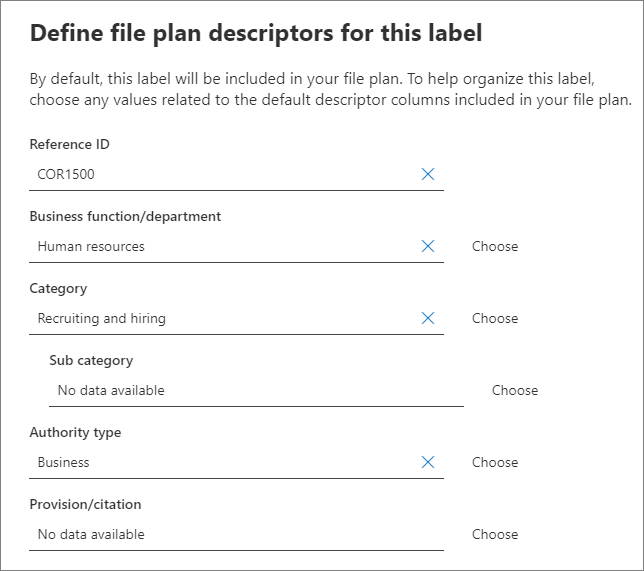
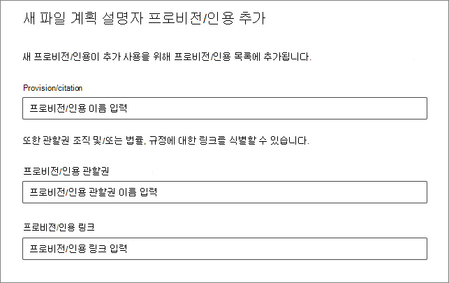
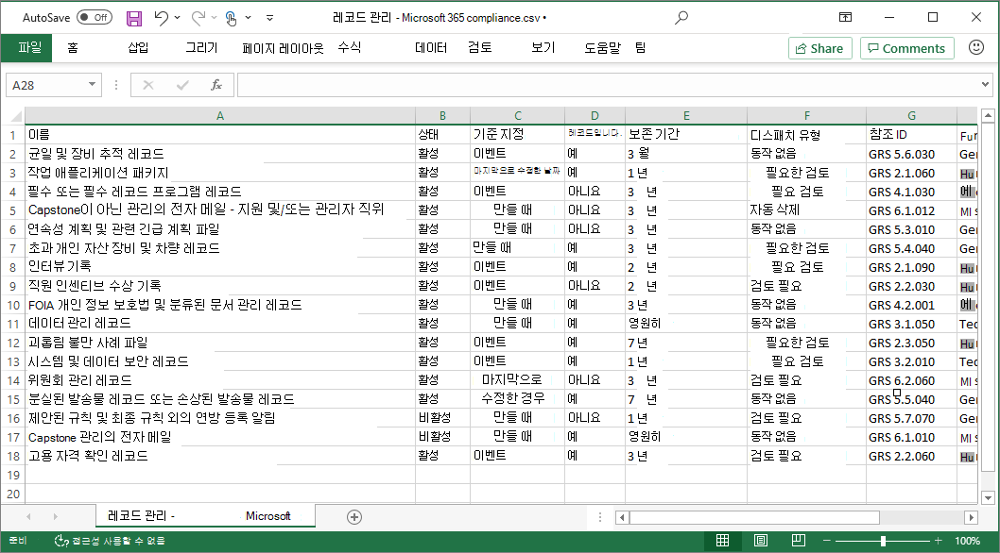
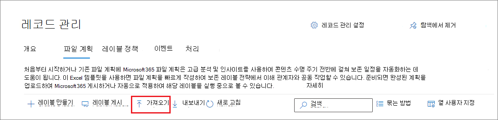
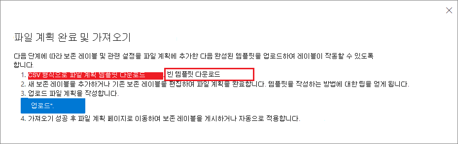
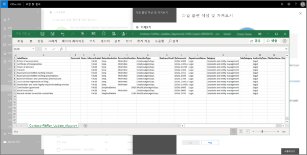
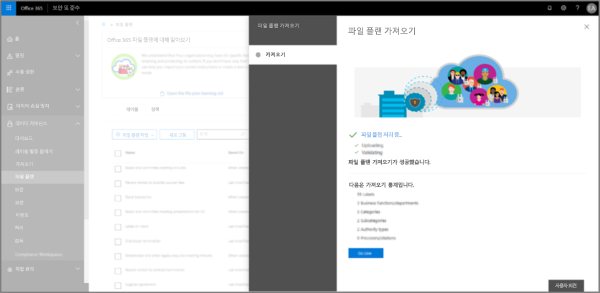

# 파일 계획을 사용하여 보존 레이블 관리

>*[보안 및 규정 준수를 위한 Microsoft 365 라이선싱 지침](/office365/servicedescriptions/microsoft-365-service-descriptions/microsoft-365-tenantlevel-services-licensing-guidance/microsoft-365-security-compliance-licensing-guidance).*

Microsoft 365 규정 준수 센터의 **정보 거버넌스** 에서 보존 레이블을 생성하고 관리할 수 있지만 **관리 기록** 의 파일 계획에는 추가적인 관리 기능이 있습니다.

- 스프레드시트에서 관련 정보를 가져와 보존 레이블을 대량 생성할 수 있습니다.

- 분석 및 오프라인 공동작업을 위해 기존 보존 레이블에서 정보를 내보낼 수 있습니다.

- 보존 레이블에 대한 자세한 정보가 표시되므로 한 뷰에서 모든 보존 레이블 설정을 쉽게 볼 수 있습니다.

- 파일 계획 설명자는 각 레이블에 대한 추가 및 선택적 정보를 지원합니다.

내용을 레코드로 표시하지 않더라도 모든 보존 레이블에 파일 계획을 사용할 수 있습니다.

보존 레이블의 정의와 사용 방법에 대한 자세한 내용은 [보존 정책 및 보존 레이블에 대해 알아보기](retention.md)를 참조하세요.

## 파일 계획 액세스

파일 계획에 액세스하려면 다음 관리자 역할 중 하나가 있어야 합니다.
    
- Retention Manager

- 보기 전용 보존 관리자입니다.

Microsoft 365 규정 준수 센터에서 **솔루션** > **레코드* 관리** > **파일 계획** 으로 이동합니다. 

**관리 기록** 이 탐색 창에 표시되지 않으면 먼저 아래로 스크롤하고 **모두 표시** 를 선택합니다.

## 파일 계획 탐색

Microsoft 365 규정 준수 센터의 **정보 거버넌스** 에서 보존 레이블을 이미 생성한 경우 이러한 레이블이 파일 계획에 자동으로 표시됩니다. 

마찬가지로, 파일 계획에 보존 레이블을 생성하는 경우, 레이블이 내용을 레코드로 표시하도록 구성되지 않은 경우 **정보 거버넌스** 에서도 해당 레이블을 사용할 수 있습니다.

**파일 계획** 페이지에서 상태 및 설정이 포함된 모든 레이블, 선택적 파일 계획 설명자, 레이블의 오프라인 검토를 분석하거나 사용하도록 설정하는 내보내기 옵션, 보존 레이블을 만드는 가져오기 옵션을 볼 수 있습니다. 

### 레이블 설정 열

**열 사용자 지정** 옵션을 선택하여 **이름** 레이블을 제외한 모든 열을 표시하거나 숨길 수 있습니다. 그러나 기본적으로 처음 몇 개의 열에는 레이블 상태 및 해당 설정에 대한 정보가 표시됩니다. 

- **상태** 는 레이블이 레이블 정책 또는 자동 적용 정책에 포함되어 있는지 여부(**활성화** 또는 **비활성화**)를 식별합니다.

- **기준에 따라** 보존 기간이 시작되는 방법 또는 시기를 식별합니다. 유효한 값은 다음과 같습니다.
    - 이벤트
    - 만든 날짜
    - 마지막으로 수정한 날짜
    - 레이블을 지정한 날짜

- **현재 레코드** 는 레이블이 적용될 때 항목이 레코드로 표시되는지 여부를 식별합니다. 유효한 값은 다음과 같습니다.
    - 아니요
    - 예
    - 예(규정)

- **보존 기간** 은 보존 기간을 식별합니다. 유효한 값은 다음과 같습니다.
    - 일
    - 월
    - 년 후에 삭제
    - 기한 없음
    - 없음

- **처리 유형** 은 보존 기간이 끝날 때 컨텐츠에 발생하는 작업을 식별합니다. 유효한 값은 다음과 같습니다.
    - 작업 없음
    - 자동 삭제
    - 검토 필요

### 파일 계획 설명자 열

파일 계획을 사용하면 더 많은 정보를 보존 레이블의 일부로 포함할 수 있습니다. 이러한 파일 계획 설명자는 레이블을 지정해야 하는 콘텐츠의 관리성 및 구성을 개선하기 위한 더 많은 옵션을 제공합니다.

기본적으로 **참조 ID** 로 시작하는 다음 몇 개의 열에는 보존 레이블을 생성하거나 기존 레이블을 편집할 때 이러한 파일 계획 설명자가 표시됩니다. 

시작하려면 다음 파일 계획 설명자에 대한 기본 제공 값이 있습니다. 
- 업무/부서
- 범주
- 권한 유형
- 프로비전/인용 

보존 레이블을 만들거나 편집할 때 수행 하는 파일 계획 설명자의 예

이러한 각 선택적 설명자에 대해 **선택** 을 선택하면 기본 제공 값 중 하나를 선택하거나 직접 만든 다음 선택할 수 있습니다. 예를 들면 다음과 같습니다. 

## 오프라인 검토를 분석하거나 활성화하기 위해 모든 보존 레이블을 내보냅니다.

파일 계획에서 모든 보존 레이블의 세부 정보를 .csv 파일로 내보내 조직 내 데이터 거버넌스 이해 관계자와 정기적으로 컴플라이언스 검토를 수행할 수 있도록 지원할 수 있습니다.

모든 보존 레이블을 내보내려면 다음을 수행합니다. **파일 계획** 페이지에서 **내보내기** 를 클릭합니다.

기존의 모든 보존 레이블을 포함하는 *.csv 파일이 열립니다. 예를 들면 다음과 같습니다.

## 파일 계획에 보존 레이블 가져오기

파일 계획에서 특정 형식의 .csv 파일을 사용하여 새 보존 레이블을 대량으로 가져올 수 있습니다. 

1. **파일 계획** 페이지에서 **가져오기** 를 클릭하여 **파일 계획 작성 및 가져오기** 페이지를 사용합니다.

   

   

2. 지시에 따라 빈 템플릿을 다운로드합니다.

   

3. 속성 및 각 속성의 올바른 값을 설명하는 다음 정보를 사용하여 템플릿을 작성합니다. 가져오기의 경우 일부 값은 최대 길이입니다.
    
    - **LabelName**: 최대 길이 64자
    - **설명** 및 **메모**: 최대 길이 1024자
    - 기타 모든 값: 무제한 길이
     
    
   |속성|유형|필수|유효한 값|
   |:-----|:-----|:-----|:-----|
   |LabelName|String|예|이 속성은 보존 레이블의 이름을 지정하며 테넌트에서 고유해야 합니다.|
   |Comment|String|아니요|관리자의 보존 레이블에 대한 설명을 추가하려면 이 속성을 사용합니다. 이 설명은 규정 준수 센터에서 보존 레이블을 관리하는 관리자에게만 나타납니다.|
   |Notes|String|아니요|사용자의 보존 레이블에 대한 설명을 추가하려면 이 속성을 사용합니다. 이 설명은 Outlook, SharePoint 및 OneDrive와 같은 앱에서 사용자가 레이블을 가리킬 때 표시됩니다. 이 속성을 비워 두면 레이블의 보존 설정을 설명하는 기본 설명이 표시됩니다. |
   |IsRecordLabel|문자열|아니요, **규정** 이 **TRUE** 인 경우를 제외|이 속성은 레이블이 콘텐츠를 레코드로 표시할지 여부를 지정합니다. 유효한 값은 다음과 같습니다. **참**: 레이블에 항목을 레코드로 표시하므로 항목을 삭제할 수 없습니다.  **거짓**: 레이블에 내용이 레코드로 표시되지 않습니다. 이 값은 기본값입니다.     그룹 의존 관계: 이 속성을 지정하는 경우 RetentionAction, RetentionDuration 및 RetentionType 도 지정해야 합니다.|
   |RetentionAction|String|아니요, **RetentionDuration**, **RetentionType** 또는 **ReviewerEmail** 이 지정된 경우 제외|이 속성은 RetentionDuration 속성에 지정된 값(지정된 경우)이 만료된 후 수행할 작업을 지정합니다. 유효한 값은 다음과 같습니다.  **Delete**: RetentionDuration 속성에 지정된 값보다 오래된 항목이 삭제됩니다. **유지**: 보존 기간 속성에 지정된 기간 동안 항목을 보존한 다음 기간이 만료되면 아무 작업도 수행하지 않습니다.  **KeepAndDelete**: RetentionDuration 속성에 지정된 기간 동안 항목을 보존하고, 해당 기간이 만료되면 항목을 삭제합니다.     그룹 의존 관계: 이 속성을 지정하는 경우 RetentionDuration 및 RetentionType 도 지정해야 합니다. |
   |RetentionDuration|문자열|아니요, **RetentionAction** 또는 **RetentionType** 이 지정된 경우 제외|이 속성은 콘텐츠를 보존할 일 수를 지정합니다. 유효한 값은 다음과 같습니다.  **제한 없음**: 항목은 무기한 보존됩니다.  **_n_*: 날 수로서 양의 정수입니다. 예를 들어 **365**. 지원되는 최대 수는 24,855(68년)입니다. 이 최대값보다 길어야 하는 경우 Unlimited를 사용하세요.    그룹 의존 관계: 이 속성을 지정하는 경우 RetentionAction 및 RetentionType 도 지정해야 합니다.
   |RetentionType|문자열|아니요, **RetentionAction** 또는 **RetentionDuration** 이 지정된 경우 제외|이 속성은 보존 기간(지정된 경우)을 콘텐츠 생성 날짜, 이벤트 날짜, 레이블이 지정된 날짜 또는 마지막으로 수정한 날짜로부터 계산해야 하는지 여부를 지정합니다. 유효한 값은 다음과 같습니다.  **CreationAgeInDays** **EventAgeInDays** **TaggedAgeInDays** **ModificationAgeInDays**     그룹 의존 관계: 이 속성을 지정하는 경우 RetentionAction 및 RetentionDuraction 도 지정해야 합니다.|
   |ReviewerEmail|SmtpAddress|아니요|이 속성을 지정하면 보존 기간이 만료된 후 처리 검토가 트리거됩니다. 이 속성은 **KeepAndDelete** 보존 작업에 대한 검토자의 전자 메일 주소를 지정합니다.     테넌트에 개별 사용자, 배포 그룹 또는 보안 그룹의 전자 메일 주소를 포함할 수 있습니다. 여러 전자 메일 주소를 세미콜론으로 구분하여 지정합니다.     그룹 의존 관계: 이 속성을 지정하는 경우 **RetentionAction**(반드시 **KeepAndDelete**), **RetentionDuration** 및 **RetentionType** 도 지정해야 합니다.|
   |ReferenceId|String|아니요|이 속성은 조직의 고유한 값으로 사용할 수 있는 **참조 ID** 파일 계획 설명자에 표시되는 값을 지정합니다.| 
   |DepartmentName|String|아니요|이 속성은 **기능/부서** 파일 계획 설명자에 표시되는 값을 지정합니다.|
   |Category|String|아니요|이 속성은 **범주** 파일 계획 설명자에 표시되는 값을 지정합니다.|
   |SubCategory|String|아니요|이 속성은 **하위 범주** 파일 계획 설명자에 표시되는 값을 지정합니다.|
   |AuthorityType|String|아니요|이 속성은 **기관 유형** 파일 계획 설명자에 표시되는 값을 지정합니다.|
   |CitationName|String|아니요|이 속성은 **조항/인용** 파일 계획 설명자에 표시된 인용의 이름을 지정합니다(예: "Sarbanes-Oxley Act or 2002"). |
   |CitationUrl|String|아니요|이 속성은 **조항/인용** 파일 계획 설명자에 표시되는 URL을 지정합니다.|
   |CitationJurisdiction|String|아니요|이 속성은 **프로비전/인용** 파일 플랜 설명자에 표시되는 관할지 또는 에이전시를 지정합니다(예: 미국 SEC(증권 거래 위원회)).|
   |Regulatory|String|아니요|이 속성은 레이블이 콘텐츠를 규정 레코드로 표시할지 여부를 지정합니다. 규정 레코드는 레코드보다 [더 제한적](records-management.md#compare-restrictions-for-what-actions-are-allowed-or-blocked)입니다. 이 레이블 구성을 사용하려면 [콘텐츠를 규제 레코드로 표시하는 옵션](declare-records.md#how-to-display-the-option-to-mark-content-as-a-regulatory-record)을 표시하도록 테넌트를 구성해야 합니다. 그렇지 않으면 가져오기 유효성 검사가 실패합니다. 유효한 값은 다음과 같습니다.  **TRUE**: 레이블은 항목을 규정 레코드로 표시합니다. 또한 **IsRecordLabel** 속성을 TRUE로 설정해야 합니다. **FALSE**: 레이블은 내용을 규정 레코드로 표시하지 않습니다. 기본값입니다.|
   |EventType|문자열|아니요, **RetentionType** 이 **EventAgeInDays** 인 경우 제외|이 속성은 [이벤트 기반 보존](event-driven-retention.md)에 사용되는 이벤트 유형을 지정합니다. **레코드 관리** > **이벤트** > **이벤트 유형 관리** 에 표시되는 기존 이벤트 유형을 지정합니다. 또는 [Get-ComplianceRetentionEventType](/powershell/module/exchange/get-complianceretentioneventtype) cmdlet을 사용하여 사용 가능한 이벤트 유형을 확인합니다. **직원 활동** 및 **제품 수명** 같은 몇 가지 기본 제공 이벤트 유형이 있지만 고유한 이벤트 유형을 만들 수도 있습니다.     고유한 이벤트 형식을 지정하는 경우 가져오기 프로세스의 일부로 이름의 유효성을 검사하기 때문에 가져오기 전에 미리 만들어야 합니다.|
   |||

   다음은 보존 레이블에 대한 정보를 포함하는 템플릿의 예입니다.

   

4. **파일 플랜 작성 및 가져오기** 페이지의 3단계에서 **파일 찾아보기** 를 클릭하여 작성한 템플릿을 업로드한 후 **다음** 을 선택합니다.

   파일 플랜은 파일을 업로드하고 가져오기 통계를 표시하여 항목의 유효성을 검사합니다.

   

5. 유효성 검사 결과에 따라 다음과 같은 결과가 나타납니다.
    
    - 유효성 검사에 실패하는 경우: 가져오기 파일에서 수정할 행 번호와 열 이름을 확인합니다. **닫기** 를 선택한 다음 **예** 를 눌러 확인합니다. 파일의 오류를 수정하고 저장한 후 **가져오기** 옵션을 다시 선택하여 4단계로 돌아갑니다.
    
    - 유효성 검사 통과: **Go Live** 를 선택하여 테넌트에서 보존 레이블을 사용할 수 있도록 할 수 있습니다. 또는 페이지의 닫기 아이콘을 선택하고 **예** 를 눌러 지금 테넌트에서 보존 레이블을 사용할 수 있도록 설정하지 않고 마법사를 닫을지 확인합니다.

가져온 레이블이 테넌트에 추가되면 이제 사용자가 레이블을 게시하여 사용할 수 있도록 설정하거나 자동으로 적용할 수 있습니다. **레이블 정책** 탭에서 둘 다 수행한 다음 **레이블 게시** 를 선택하거나 **레이블을 자동으로 적용** 할 수 있습니다.

## 다음 단계

보존 레이블 및 해당 정책을 만들고 편집하는 방법에 대한 자세한 내용은 다음 지침을을 참조하세요.
- [보존 레이블을 만들고 앱에 적용하기](create-apply-retention-labels.md)
- [보존 레이블을 콘텐츠에 자동으로 적용하기](apply-retention-labels-automatically.md)