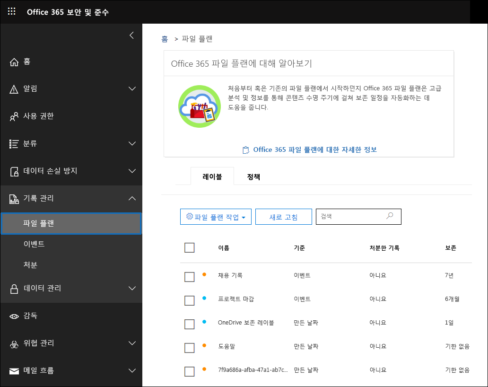
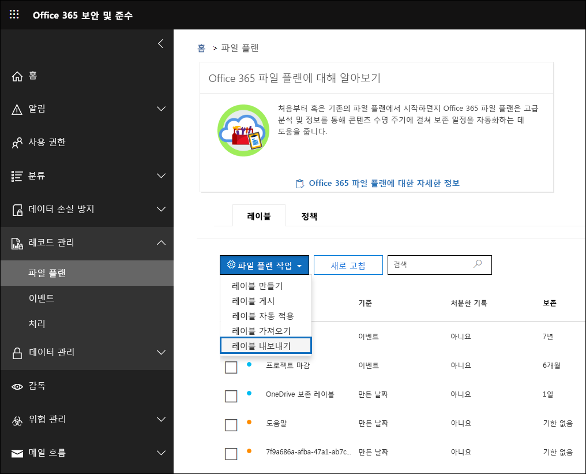
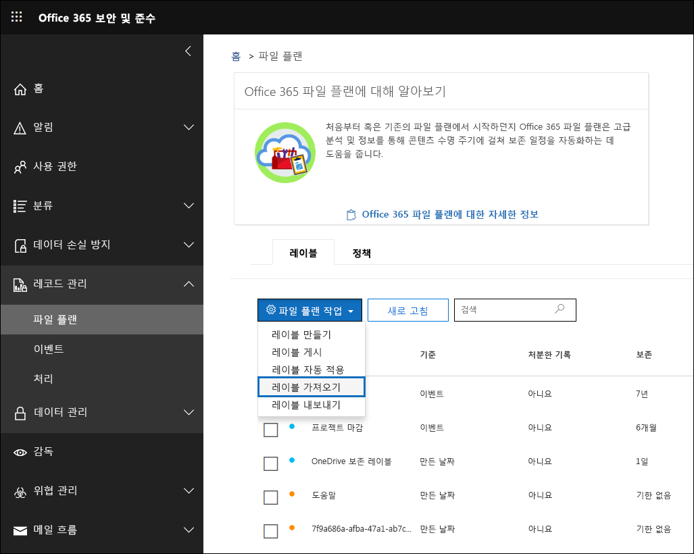

# 파일 계획 관리자 개요

>*[보안 및 규정 준수를 위한 Microsoft 365 라이선싱 지침](https://aka.ms/ComplianceSD).*

파일 계획 관리자는 보존 레이블 및 보존 레이블 정책에 대한 고급 관리 기능을 제공하고, 생성부터 공동 작업, 레코드 선언, 보존 및 최종 처리에 이르는 전체 콘텐츠 수명 주기 동안 레이블 및 레이블-콘텐츠 간 활동을 트래버스하는 통합 방법을 제공합니다. 

보안 및 준수 센터에서 파일 계획 관리자에 액세스하려면 **레코드 관리** > **파일 계획**으로 이동합니다.

## 파일 계획 관리자 액세스

파일 계획 관리자에 액세스하려면 다음과 같은 관리자 역할 중 하나가 있어야 합니다.
    
- 보존 관리자

- 보기 전용 보존 관리자

## 기본 보존 레이블 및 레이블 정책

보안 및 규정 준수 센터에 보존 레이블이 없는 경우, 왼쪽 탐색에서 **파일 계획**을 처음 선택하면 **Default Data Governance Publishing Policy**라는 레이블 정책이 생성됩니다. 

이 레이블 정책에는 세 가지 보존 레이블이 있습니다.

- **운영 프로시저**
- **비즈니스 일반**
- **계약**

이 보존 레이블은 콘텐츠를 삭제하지 않고 보존하도록 구성됩니다. 이 레이블 정책은 전체 조직에 게시되고 비활성화하거나 제거할 수 있습니다. 

**보존 정책을 만들었습니다** 및 **보존 정책에 대한 보존 구성을 만들었습니다**와 같은 활동에 대한 감사 로그를 검토하여 파일 계획 관리자를 열고 첫 번째 실행 환경을 시작한 사용자를 판별할 수 있습니다.

> [!NOTE]
> 고객 피드백으로 인해, 위에 언급된 기본 보존 레이블과 보존 레이블 정책을 만드는 이 기능을 제거했습니다. 2019년 4월 11일 이전에 파일 계획 관리자를 연 경우에만 이러한 보존 레이블과 보존 레이블 정책을 볼 수 있습니다.

## 파일 계획 탐색

파일 계획 관리자를 사용하면 하나의 보기에서 모든 보존 레이블 및 정책의 설정을 보다 쉽게 검토할 수 있습니다.

파일 계획 외부에서 만들어진 보존 레이블도 파일 계획에서 사용할 수 있고 그 반대의 경우도 가능합니다.

**파일 계획 레이블** 탭에서 다음과 같은 추가 정보 및 기능을 사용할 수 있습니다.

### 레이블 설정 열

- **기준**은 보존 기간을 시작할 트리거 유형을 식별합니다. 유효한 값은 다음과 같습니다.
    - 이벤트
    - 만든 날짜
    - 마지막으로 수정한 날짜
    - 레이블을 지정한 날짜
- **레코드**는 레이블이 적용될 때 항목이 선언된 레코드가 될지를 식별합니다. 유효한 값은 다음과 같습니다.
    - 아니요
    - 예
    - 예(규정)
- **보존**은 보존 유형을 식별합니다. 유효한 값은 다음과 같습니다.
    - 유지
    - 유지 및 삭제
    - 삭제
- **처리**는 보존 기간이 끝날 때 콘텐츠에 대해 수행할 작업을 식별합니다. 유효한 값은 다음과 같습니다.
    - null
    - 작업 없음
    - 자동 삭제
    - 검토 필요(즉, 처리 검토)

### 보존 레이블 파일 계획 설명자 열

이제 보존 레이블 구성에 더 많은 정보를 포함할 수 있습니다. 보존 레이블에 파일 계획 설명자를 삽입하면 파일 계획의 관리 효율성과 구성이 개선됩니다.

시작하기 위해 파일 계획 관리자에서는 직무/부서, 범주, 권한 유형 및 프로비저닝/인용에 대한 기본 제공 값을 제공합니다. 보존 레이블을 만들거나 편집할 때 새 파일 계획 설명자 값을 추가할 수 있습니다. 파일 계획에 보존 레이블을 가져올 때 파일 계획 설명자를 지정할 수도 있습니다. 

보존 레이블을 만들거나 편집할 때의 파일 계획 설명자 단계 보기는 다음과 같습니다.

파일 계획 관리자의 **레이블** 탭에 표시되는 파일 계획 설명자 열 보기는 다음과 같습니다.

## 모든 기존 보존 레이블을 내보내어 오프라인 검토를 분석 및/또는 수행

파일 계획 관리자에서 모든 보존 레이블의 세부 정보를 .csv 파일로 내보내 조직의 데이터 거버넌스 이해 관계자와 함께 정기적인 검토를 편리하게 수행할 수 있습니다.

모든 보존 레이블의 내보내려면 **파일 계획** 페이지, **파일 계획 작업** \> **레이블 내보내기**로 이동합니다.

모든 기존 보존 레이블을 포함하는 *.csv 파일이 열립니다.

## 파일 계획에 보존 레이블 가져오기

파일 계획 관리자에서 기존 보존 레이블을 수정할 수 있을 뿐만 아니라 새 보존 레이블을 대량으로 가져올 수 있습니다.

새 보존 레이블을 가져오고 기존 보존 레이블을 수정하려면 다음을 수행합니다. 

1. **파일 계획** 페이지에서 **파일 계획 작업** > **레이블 가져오기**로 이동합니다.

   

   

2. 새 보존 레이블을 가져오려면 빈 서식 파일을 다운로드합니다. 또는 조직에서 기존 보존 레이블을 내보낼 때 내보낸 .csv 파일로 시작할 수 있습니다.

   

3. 서식 파일 채우기 다음에서는 파일 계획 서식 파일의 각 속성에 대한 속성 및 유효한 값을 설명합니다. 

   |**속성**|**유형**|**유효한 값**|
   |:-----|:-----|:-----|
   |LabelName|String|이 속성은 보존 레이블의 이름을 지정합니다.|
   |Comment|String|관리자의 보존 레이블에 대한 설명을 추가하려면 이 속성을 사용합니다. 이 설명은 보안 및 준수 센터에서 레이블을 관리하는 관리자에게만 나타납니다.|
   |Notes|String|사용자의 보존 레이블에 대한 설명을 추가하려면 이 속성을 사용합니다. 이 설명은 Outlook, SharePoint 및 OneDrive와 같은 앱에서 사용자가 레이블을 가리킬 때 표시됩니다. 이 속성을 비워 두면 레이블의 보존 설정을 설명하는 기본 설명이 표시됩니다. |
   |IsRecordLabel|String|이 속성은 레이블이 레코드 레이블인지 여부를 지정합니다. 레코드 레이블로 태그가 지정된 항목은 레코드로 선언됩니다. 유효한 값은 다음과 같습니다. **TRUE**: 레이블이 레코드 레이블입니다. 레코드로 선언된 항목은 삭제할 수 없습니다.  **FALSE**: 레이블이 레코드 레이블이 아닙니다. 이 값은 기본값입니다.|
   |RetentionAction|String|이 속성은 RetentionDuration 속성에 지정된 값이 만료되는 경우 수행할 작업을 지정합니다. 유효한 값은 다음과 같습니다. **Delete**: RetentionDuration 속성에 지정된 값보다 오래된 항목이 삭제됩니다. **Keep**: RetentionDuration 속성에 지정된 기간 동안 항목을 보존하고, 해당 기간이 만료되면 아무 작업도 수행하지 않습니다.  **KeepAndDelete**: RetentionDuration 속성에 지정된 기간 동안 항목을 보존하고, 해당 기간이 만료되면 항목을 삭제합니다.   |
   |RetentionDuration|문자열|이 속성은 콘텐츠를 보관할 일 수를 지정합니다. 유효한 값은 다음과 같습니다. **Unlimited**: 항목이 무기한 보존됩니다.  ***n***: 양의 정수입니다(예: **365**). 
   |RetentionType|String|이 속성은 콘텐츠 작성 날짜, 이벤트 날짜, 레이블이(태그가) 지정된 날짜 또는 마지막으로 수정한 날짜에서 보존 기간을 계산하는지 여부를 지정합니다. 유효한 값은 다음과 같습니다. **CreationAgeInDays** **EventAgeInDays** **TaggedAgeInDays** **ModificationAgeInDays** |
   |ReviewerEmail|SmtpAddress|이 속성을 채울 때 보존 기간이 만료되면 처리 검토가 트리거됩니다. 이 속성은 **Delete**와 **KeepAndDelete** 보존 작업에 대한 검토자의 전자 메일 주소를 지정합니다. 개별 사용자, 배포 또는 보안 그룹의 전자 메일 주소를 포함할 수 있습니다. 전자 메일 주소가 여러 개인 경우 각 주소를 세미콜론으로 구분하여 지정할 수 있습니다.|
   |ReferenceId|String|이 속성은 **참조 ID** 파일 계획 설명자에 표시되는 값을 지정합니다.| 
   |DepartmentName|String|이 속성은 **기능/부서** 파일 계획 설명자에 표시되는 값을 지정합니다.|
   |Category|String|이 속성은 **범주** 파일 계획 설명자에 표시되는 값을 지정합니다.|
   |SubCategory|String|이 속성은 **하위 범주** 파일 계획 설명자에 표시되는 값을 지정합니다.|
   |AuthorityType|String|이 속성은 **기관 유형** 파일 계획 설명자에 표시되는 값을 지정합니다.|
   |CitationName|String|이 속성은 **조항/인용** 파일 계획 설명자에 표시된 인용의 이름을 지정합니다(예: "Sarbanes-Oxley Act or 2002"). |
   |CitationUrl|String|이 속성은 **조항/인용** 파일 계획 설명자에 표시되는 URL을 지정합니다.|
   |CitationJurisdiction|String|이 속성은 **조항/인용** 파일 계획 설명자에 표시되는 관할지 또는 에이전시를 지정합니다(예: "미국 SEC(증권 거래 위원회").|
   |Regulatory|String|공백으로 남겨 둡니다. 현재, 이 속성은 사용되지 않습니다.|
   |EventType|문자열|이 속성은 레이블과 연결된 보존 규칙을 지정합니다. 규칙을 고유하게 식별하는 모든 값을 사용할 수 있습니다. 예: **이름** **DN(고유 이름)** **GUID**  [Get-RetentionComplianceRule](https://docs.microsoft.com/powershell/module/exchange/policy-and-compliance-retention/get-retentioncompliancerule?view=exchange-ps) cmdlet를 사용하여 사용 가능한 보존 규칙을 볼 수 있습니다. 한 Office 365 조직에서 레이블을 내보낼 경우 레이블을 다른 Office 365 조직으로 가져올 때 해당 조직의 EventType 속성 값을 사용할 수 없습니다. EventType 값은 조직마다 고유하기 때문입니다. |
   |||

   다음은 보존 레이블에 대한 정보가 포함된 서식 파일의 예입니다.

   

4. 파일 계획 가져오기 마법사 페이지의 3단계에서 **파일 찾아보기**를 클릭하여 데이터를 입력한 서식 파일을 업로드합니다. 

   파일 계획 관리자에서 항목의 유효성을 검사하고 가져오기 통계를 표시합니다.

   

   유효성 검사 오류가 발생하면 파일 계획 가져오기가 가져오기 파일로 돌아가서 해당 오류를 손쉽게 수정할 수 있도록 계속해서 가져오기 파일의 모든 항목에 대한 유효성 검사를 수행하고 가져오기 파일의 줄/행 번호를 참조하는 모든 오류를 표시하며, 표시된 오류 결과를 복사합니다.

5. 가져오기가 완료되면 파일 계획 관리자로 돌아가서 새 보존 레이블을 새 보존 레이블 및 기존 보존 레이블 정책과 연결합니다.

   
