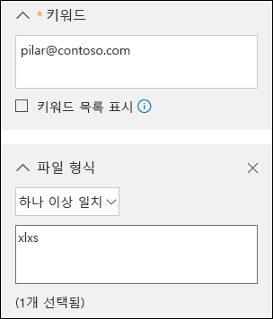
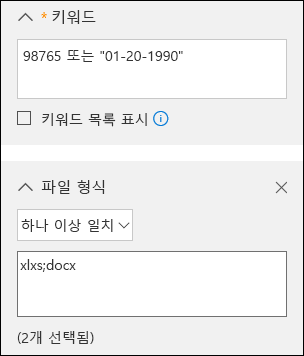
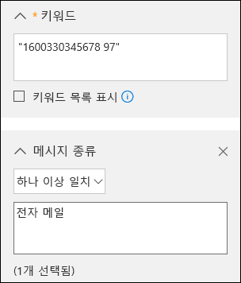

# <a name="office-365-data-subject-requests-for-the-gdpr"></a><span data-ttu-id="c3f08-104">GDPR에 대한 Office 365 데이터 주체 요청</span><span class="sxs-lookup"><span data-stu-id="c3f08-104">Office 365 Data Subject Requests for the GDPR</span></span>

## <a name="introduction-to-dsrs"></a><span data-ttu-id="c3f08-105">DSR 소개</span><span class="sxs-lookup"><span data-stu-id="c3f08-105">Introduction to DSRs</span></span>

<span data-ttu-id="c3f08-p101">GDPR(일반 데이터 보호 규정)은 사용자(규정에 *데이터 주체*로 알려짐)에게 고용주 또는 다른 유형의 대리점 및 조직(*정보 통제자* 또는 단순히 *통제자*로 지칭)이 수집한 개인 데이터를 관리할 수 있는 권한을 부여합니다. 개인 데이터는 GDPR에서는 보다 광범위하게 식별되었거나 식별 가능한 자연인과 관련된 모든 데이터로 정의됩니다. GDPR은 데이터 주체에게 개인 데이터에 대한 특정 권한을 부여합니다. 이러한 권한에는 데이터 복사본 획득, 변경 요청, 처리 제한, 삭제 또는 다른 통제자에게 이동될 수 있도록 전자 형식으로 수신하는 권한이 포함됩니다. 데이터 주체가 통제자에게 개인 데이터에 대해 조치를 취할 것을 요구하는 공식적인 요청을 *데이터 주체 요청* 또는 DSR이라고 합니다. 통제자는 각 DSR을 즉시 고려하고, 요청된 조치를 취하거나 통제자가 해당 DSR을 처리할 수 없는 이유에 대한 설명을 제공하여 실질적인 응답을 제공할 의무가 있습니다.</span><span class="sxs-lookup"><span data-stu-id="c3f08-p101">The General Data Protection Regulation (GDPR) gives rights to people (known in the regulation as *data subjects*) to manage the personal data that has been collected by an employer or other type of agency or organization (known as the *data controller* or just *controller*). Personal data is defined very broadly under the GDPR as any data that relates to an identified or identifiable natural person. The GDPR gives data subjects specific rights to their personal data; these rights include obtaining copies of it, requesting changes to it, restricting the processing of it, deleting it, or receiving it in an electronic format so it can be moved to another controller. A formal request by a data subject to a controller to take an action on their personal data is called a *Data Subject Request* or DSR. The controller is obligated to promptly consider each DSR and provide a substantive response either by taking the requested action or by providing an explanation for why the DSR cannot be accommodated by the controller. A controller should consult with its own legal or compliance advisers regarding the proper disposition of any given DSR.</span></span>

<span data-ttu-id="c3f08-p102">이 가이드에서는 Office 365 제품, 서비스 및 관리 도구를 사용하여 고객이 DSR에 응답하기 위해 개인 데이터를 찾고 조치를 취하는 데 도움을 주는 방식을 설명합니다. 특히, Microsoft 클라우드에 있는 개인 데이터를 찾고, 액세스하고, 조치를 취하는 방법도 포함되어 있습니다. 이 가이드에 설명된 프로세스에 대한 간략한 개요는 다음과 같습니다.</span><span class="sxs-lookup"><span data-stu-id="c3f08-p102">The guide discusses how to use Office 365 products, services and administrative tools to help you find and act on personal data to respond to DSRs. Specifically, this includes how to find, access, and act on personal data that resides in Microsoft's cloud. Here’s a quick overview of the processes outlined in this guide:</span></span>

1.  <span data-ttu-id="c3f08-p103">***검색*** - Microsoft SCC(보안 및 준수 센터)에서 제공하는 것과 같은 검색 도구를 사용하여 DSR의 대상이 될 수 있는 고객 콘텐츠를 좀 더 쉽게 찾을 수 있습니다. 잠재적인 반응형 문서가 일단 수집되면 다음 단계에 설명된 DSR 작업 중 하나 이상을 수행하여 DSR 요청에 응답할 수 있습니다. 또는 요청이 DSR에 응답하기 위한 조직 지침을 충족하지 않는지도 확인할 수 있습니다.</span><span class="sxs-lookup"><span data-stu-id="c3f08-p103">***Discover***—Use search and discovery tools, such as those offered by the Microsoft Security & Compliance Center (SCC), to more easily find customer content that may be the subject of a DSR. Once potentially responsive documents are collected, you can perform one or more of the DSR actions described in the following steps to respond to the DSR request. Alternatively, you may determine that the request doesn't meet your organizations guidelines for responding to DSRs.</span></span>

2.  <span data-ttu-id="c3f08-118">***액세스*** - Microsoft 클라우드에 있는 개인 데이터를 검색하고, 요청될 경우 데이터 주체가 사용할 수 있는 복사본을 만듭니다.</span><span class="sxs-lookup"><span data-stu-id="c3f08-118">***Access***—Retrieve personal data that resides in the Microsoft cloud and, if requested, make a copy of it available to the data subject.</span></span>

3.  <span data-ttu-id="c3f08-119">***수정***—해당되는 경우 개인 데이터를 변경하거나 요청된 다른 작업을 구현합니다.</span><span class="sxs-lookup"><span data-stu-id="c3f08-119">***Rectify***—Make changes or implement other requested actions on the personal data, where applicable.</span></span>

4.  <span data-ttu-id="c3f08-p104">***제한*** - 가능한 경우 다양한 Office 365 서비스에 대한 라이선스를 제거하거나 원하는 서비스 또는 기능을 해제하여 개인 데이터의 처리를 제한합니다. 또한 Microsoft 클라우드에서 데이터를 제거하고 온-프레미스 또는 다른 위치에 유지할 수도 있습니다.</span><span class="sxs-lookup"><span data-stu-id="c3f08-p104">***Restrict***—Restrict the processing of personal data, either by removing licenses for various Office 365 services, or by turning off the desired services or features where possible. You can also remove data from the Microsoft cloud and retain it on-premises or at another location.</span></span>

5.  <span data-ttu-id="c3f08-122">***삭제*** - Microsoft 클라우드에 있는 개인 데이터를 영구적으로 제거합니다.</span><span class="sxs-lookup"><span data-stu-id="c3f08-122">***Delete***—Permanently remove personal data that resides in the Microsoft cloud.</span></span>

6.  <span data-ttu-id="c3f08-p105">***내보내기*** - 개인 데이터의 전자 복사본을 데이터 주체에게 제공합니다. GDPR의 "데이터 이동권"은 데이터 주체가 구조화되고 자주 사용되며 컴퓨터에서 읽을 수 있는 형식의 개인 데이터 전자 복사본을 요청할 수 있도록 합니다.</span><span class="sxs-lookup"><span data-stu-id="c3f08-p105">***Export***—Provide an electronic copy of personal data to the data subject. The GDPR’s “right of data portability” allows a data subject to request an electronic copy of personal data that’s in a structured, commonly used, machine-readable format.</span></span>

### <a name="terminology"></a><span data-ttu-id="c3f08-125">용어</span><span class="sxs-lookup"><span data-stu-id="c3f08-125">Terminology</span></span>

<span data-ttu-id="c3f08-126">다음은 이 가이드와 관련된 GDPR 용어의 정의입니다.</span><span class="sxs-lookup"><span data-stu-id="c3f08-126">Here are definitions of terms from the GDPR that are relevant to this guide.</span></span>

- <span data-ttu-id="c3f08-127">*통제자* - 단독으로 또는 다른 대상과 함께 개인 데이터 처리의 목적 및 방법을 결정하는 자연인이나 법인, 공공 기관, 대리점 또는 기타 단체입니다. 이러한 처리의 목적 및 방법을 연합국 법률 또는 회원국 법률에 따라 결정하는 경우, 통제자 또는 구체적인 지명 기준을 연합국 법률 또는 회원국 법률에서 제공할 수 있습니다.</span><span class="sxs-lookup"><span data-stu-id="c3f08-127">*Controller*—The natural or legal person, public authority, agency or other body which, alone or jointly with others, determines the purposes and means of the processing of personal data; where the purposes and means of such processing are determined by Union or Member State law, the controller or the specific criteria for its nomination may be provided for by Union or Member State law.</span></span>

-   <span data-ttu-id="c3f08-128">*개인 데이터* 및 *데이터 주체*—식별되었거나 식별 가능한 자연인(‘데이터 주체’)과 관련된 모든 정보입니다. 식별 가능한 자연인은 직간접적으로, 특히 이름, 식별 번호, 위치 데이터, 온라인 식별자 또는 해당 자연인의 신체적, 생리적, 유전적, 정신적, 경제적, 문화적 또는 사회적 ID와 같은 식별자를 참조하여 식별될 수 있는 사람입니다.</span><span class="sxs-lookup"><span data-stu-id="c3f08-128">*Personal data* and *data subject*—Any information relating to an identified or identifiable natural person (‘data subject’); an identifiable natural person is one who can be identified, directly or indirectly, in particular by reference to an identifier such as a name, an identification number, location data, an online identifier or to one or more factors specific to the physical, physiological, genetic, mental, economic, cultural or social identity of that natural person.</span></span>

-   <span data-ttu-id="c3f08-129">*프로세서* - 통제자를 대신하여 개인 데이터를 처리하는 자연인이나 법인, 공공 기관, 대리점 또는 기타 단체입니다.</span><span class="sxs-lookup"><span data-stu-id="c3f08-129">*Processor*—A natural or legal person, public authority, agency or other body which processes personal data on behalf of the controller.</span></span>

### <a name="how-to-use-this-guide"></a><span data-ttu-id="c3f08-130">이 가이드를 사용하는 방법</span><span class="sxs-lookup"><span data-stu-id="c3f08-130">How to use this guide</span></span>

<span data-ttu-id="c3f08-131">사용 사례와 관련된 정보를 찾을 수 있도록 이 가이드는 4부로 구성되어 있습니다.</span><span class="sxs-lookup"><span data-stu-id="c3f08-131">To help you find information relevant to your use case, this guide is divided into four parts.</span></span>

<span data-ttu-id="c3f08-p106">[1부: 고객 데이터에 대한 DSR에 응답](#part-1-responding-to-dsrs-for-customer-data) - *고객 데이터*는 일상적인 비즈니스 운영을 위해 Office 365에서 생산되고 저장되는 데이터입니다. 데이터를 작성하는 데 가장 일반적으로 사용되는 Office 365 응용 프로그램에는 Word, Excel, PowerPoint, Outlook, OneNote 등이 있습니다. 또한 Office 365는 SharePoint Online, Teams, Forms 등 다른 사용자와 보다 효율적으로 공동 작업을 수행할 수 있는 응용 프로그램으로 구성되어 있습니다. 이 가이드의 1부에서는 Office 365 온라인 서비스에서 데이터를 작성 및 저장하는 데 사용된 Office 365 응용 프로그램에서 데이터를 검색, 액세스, 수정, 제한, 삭제 및 내보내는 방법을 설명합니다. 또한 Microsoft가 고객 조직의 데이터 처리자 역할을 함에 따라 DSR 기능을 테넌트 관리자로 사용할 수 있는 하는 제품 및 서비스를 소개합니다.</span><span class="sxs-lookup"><span data-stu-id="c3f08-p106">[Part 1: Responding to DSRs for Customer Data](#part-1-responding-to-dsrs-for-customer-data) - *Customer Data* is data produced and stored in Office 365 in the day-to-day operations of running your business. Examples of the most commonly used Office 365 applications which allow you to author data include Word, Excel, PowerPoint, Outlook and OneNote. Office 365 also consists of applications such as SharePoint Online, Teams, and Forms which allow you to better collaborate with others. Part 1 of this guide discusses how to discover access, rectify, restrict, delete, and export data from Office 365 applications that have been used to author and store data in Office 365 online services. It addresses products and services for which Microsoft is acting as a data processor to your organization, and thus DSR capability is made available to your tenant administrator.</span></span>

<span data-ttu-id="c3f08-p107">[2부: Office 365에서 생성된 정보에 관한 DSR에 응답](#part-2-responding-to-dsrs-with-respect-to-insights-generated-by-office-365) - Office 365는 Delve, MyAnalytics 및 Workplace Analytics와 같은 서비스를 통해 특정 정보를 제공합니다. 이 가이드의 2부에서는 이러한 정보가 생성되는 방법 및 이러한 정보와 관련된 DSR에 응답하는 방법을 설명합니다.</span><span class="sxs-lookup"><span data-stu-id="c3f08-p107">[Part 2: Responding to DSRs with Respect to Insights Generated by Office 365](#part-2-responding-to-dsrs-with-respect-to-insights-generated-by-office-365) - Office 365 provides certain insights through services like Delve, MyAnalytics, and Workplace Analytics. How these insights are generated and how to respond to DSRs related to them are explained in Part 2 of this guide.</span></span>

<span data-ttu-id="c3f08-p108">[3부: 시스템 생성 로그에 대한 DSR에 응답](#part-3-responding-to-dsrs-for-system-generated-logs) - Office 365 엔터프라이즈 서비스를 사용할 때 Microsoft는 온라인 서비스에서 기능의 사용 또는 성능을 기록하는 서비스 로그와 같은 몇 가지 정보를 생성합니다. 서비스 생성 데이터에는 대부분 Microsoft에서 생성하는 가명 식별자가 포함되어 있으므로 이 문서에서는 이 범주를 일반적으로 *시스템 생성 로그*라고 합니다. 이 데이터는 추가 정보를 사용하지 않고는 특정 데이터로 분류될 수 없지만 "개인 데이터"에 대한 GDPR의 정의에서 개인 데이터로 간주될 수 있습니다. 이 가이드의 3부에서는 시스템 생성 로그를 액세스, 삭제 및 내보내는 방법을 설명합니다.</span><span class="sxs-lookup"><span data-stu-id="c3f08-p108">[Part 3: Responding to DSRs for system-generated Logs](#part-3-responding-to-dsrs-for-system-generated-logs) - When you use Office 365 enterprise services, Microsoft generates some information such as service logs that record the use or performance of features in the online services. Most service generated data contain pseudonymous identifiers generated by Microsoft and this category is thus generally referred to within this document as *system-generated logs*. Although this data can't be attributed to a specific data subject without the use of additional information, some of it may be deemed personal under GDPR's definition for "personal data." Part 3 of this guide discusses how to access, delete, and export system-generated logs.</span></span>

<span data-ttu-id="c3f08-143">[4부: DSR을 지원하는 추가 리소스](#part-4-additional-resources-to-assist-you-with-dsrs) - 이 가이드의 4부에서는 특정 Office 365 제품 및 서비스를 사용할 때 Microsoft가 데이터 통제자인 제한된 시나리오를 나열합니다.</span><span class="sxs-lookup"><span data-stu-id="c3f08-143">[Part 4: Additional resources to assist you with DSRs](#part-4-additional-resources-to-assist-you-with-dsrs) - Part 4 of this guide lists limited scenarios in which Microsoft is the data controller when certain Office 365 products and services are used.</span></span>

> [!NOTE]
> <span data-ttu-id="c3f08-p109">대부분의 경우 조직의 사용자가 Microsoft Office 365 제품 및 서비스를 사용할 때는 여러분이 데이터 통제자이고 Microsoft는 처리자입니다. 데이터 통제자로서 여러분은 데이터 주체에 직접 응답하는 역할을 담당합니다. 이를 지원하기 위해 이 가이드의 1~3부에서는 조직이 DSR 요청에 응답하는 데 사용할 수 있는 기술적 기능을 자세히 설명합니다. 그러나 일부 제한된 시나리오에서는 사용자가 특정 Office 365 제품 또는 서비스를 사용할 때 Microsoft가 데이터 통제자가 됩니다. 이러한 경우 4부의 정보는 데이터 주체가 Microsoft에 DSR 요청을 전송할 수 있는 방법에 대한 지침을 제공합니다.</span><span class="sxs-lookup"><span data-stu-id="c3f08-p109">In most cases, when users in your organization use Microsoft Office 365 products and services, you are the data controller and Microsoft is the processor. As a data controller, you are responsible for responding to the data subject directly. To assist you with this, Parts 1-3 of this guide detail the technical capabilities available to your organization to respond to a DSR request. In some limited scenarios, however, Microsoft will be the data controller when people use certain Office 365 products and services. In these cases, the information in Part 4 provides guidance on how data subjects can submit DSR requests to Microsoft.</span></span>


### <a name="office-365-national-clouds"></a><span data-ttu-id="c3f08-149">Office 365 국가별 클라우드</span><span class="sxs-lookup"><span data-stu-id="c3f08-149">Office 365 national clouds</span></span>

<span data-ttu-id="c3f08-p110">Microsoft Office 365 서비스는 국가별 클라우드 환경, [Office 365 Germany](https://support.office.com/article/learn-about-office-365-germany-8a5a4bbc-667a-4cac-8769-d8ac9015db4c), [21Vianet에서 운영하는 Office 365(중국)](https://support.office.com/article/Learn-about-Office-365-operated-by-21Vianet-A8AB5061-3346-4DA0-BB7C-5260822B53AE) 및 [Office 365 미국 정부](https://technet.microsoft.com/library/mt774581.aspx)에서도 사용할 수 있습니다. 이 문서에 설명된 데이터 주체 요청 관리 지침 대부분은 이러한 국가별 클라우드 환경에도 적용됩니다. 그러나 이러한 환경이 격리되어 있으므로 몇 가지 예외가 있습니다. 이러한 예외 중에서 중요한 내용은 해당 참고 사항에 명시되어 있습니다.</span><span class="sxs-lookup"><span data-stu-id="c3f08-p110">The Microsoft Office 365 services are also available in the following national cloud environments: [Office 365 Germany](https://support.office.com/article/learn-about-office-365-germany-8a5a4bbc-667a-4cac-8769-d8ac9015db4c), [Office 365 operated by 21Vianet (China)](https://support.office.com/article/Learn-about-Office-365-operated-by-21Vianet-A8AB5061-3346-4DA0-BB7C-5260822B53AE), and [Office 365 US Government](https://technet.microsoft.com/library/mt774581.aspx). Most of the guidance for managing data subject requests described in this document applies to these national cloud environments. However, due to the isolated nature of these environments, there are some exceptions. Where notable for a given subsection, these exceptions are called out in a corresponding note.</span></span>

### <a name="hybrid-deployments"></a><span data-ttu-id="c3f08-154">하이브리드 배포</span><span class="sxs-lookup"><span data-stu-id="c3f08-154">Hybrid deployments</span></span>

<span data-ttu-id="c3f08-p111">Office 365 조직은 클라우드 기반 서비스 및 온-프레미스 서버 제품이 조합된 Microsoft 서비스 제품으로 구성될 수 있습니다. 일반적으로 하이브리드 배포는 클라우드 및 온-프레미스에 존재하는 사용자 계정(ID 관리) 및 리소스(예: 사서함, 웹 사이트 및 데이터)를 공유합니다. 일반적인 하이브리드 시나리오는 다음과 같습니다.</span><span class="sxs-lookup"><span data-stu-id="c3f08-p111">Your Office 365 organization may consist of Microsoft offerings that are a combination of cloud-based services and on-premises server products. In general, a hybrid deployment is typically the sharing of user accounts (identity management) and resources (such as mailboxes, web sites, and data) that exist in the cloud and on-premises. Common hybrid scenarios include:</span></span>
- <span data-ttu-id="c3f08-158">Exchange 하이브리드 배포: 온-프레미스 사서함을 보유하는 사용자도 있고, Exchange Online 사서함을 보유하는 사용자도 있습니다.</span><span class="sxs-lookup"><span data-stu-id="c3f08-158">Exchange hybrid deployments, where some users have an on-premises mailboxes and other users have Exchange Online mailboxes.</span></span>
- <span data-ttu-id="c3f08-159">SharePoint 하이브리드 배포: 사이트 및 파일 서버는 온-프레미스에 있고 비즈니스용 OneDrive 계정은 Office 365에 있습니다.</span><span class="sxs-lookup"><span data-stu-id="c3f08-159">SharePoint hybrid deployments, where site and file servers are on-premises and OneDrive for Business accounts are in Office 365.</span></span>
- <span data-ttu-id="c3f08-160">Azure Activity Directory와 동기화되는 온-프레미스 ID 관리 시스템(Active Directory): Office 365의 기본 디렉터리 서비스입니다.</span><span class="sxs-lookup"><span data-stu-id="c3f08-160">The on-premises identity management system (Active Directory) that is synchronized with Azure Activity Directory, which is the underlying directory service in Office 365.</span></span>

<span data-ttu-id="c3f08-p112">DSR 요청에 응답할 경우, DSR 요청에 해당되는 데이터가 Microsoft 클라우드에 있는지 또는 온-프레미스 조직에 있는지를 확인한 후, 해당 요청에 응답하기 위한 적절한 단계를 수행해야 할 수 있습니다. Office 365 데이터 주체 요청 가이드(이 가이드)에서는 클라우드 기반 데이터에 응답하기 위한 지침을 제공합니다. 온-프레미스 조직의 데이터에 대한 지침은 [Office 온-프레미스 서버에 대한 GDPR](https://docs.microsoft.com/Office365/Enterprise/gdpr-for-office-servers)을 참조하세요.</span><span class="sxs-lookup"><span data-stu-id="c3f08-p112">When responding to a DSR request, you may have to determine if data that's responsive to a DSR request is in the Microsoft cloud or in your on-premise organization, and then take the appropriate steps to respond to that request. The Office 365 Data Subject Request Guide (this guide) provides guidance for responding to cloud-based data. For guidance for data in your on-premises organization, see [GDPR for Office on-premises Servers](https://docs.microsoft.com/Office365/Enterprise/gdpr-for-office-servers).</span></span> 


## <a name="part-1-responding-to-dsrs-for-customer-data"></a><span data-ttu-id="c3f08-164">1부: 고객 데이터에 대한 DSR에 응답</span><span class="sxs-lookup"><span data-stu-id="c3f08-164">Part 1: Responding to DSRs for Customer Data</span></span>

<span data-ttu-id="c3f08-165">고객 데이터에 대한 DSR에 응답하기 위한 지침은 다음 네 개의 섹션으로 구성되어 있습니다.</span><span class="sxs-lookup"><span data-stu-id="c3f08-165">The guidance for responding to DSRs for Customer Data is divided into the following four sections.</span></span>

- [<span data-ttu-id="c3f08-166">콘텐츠 검색 eDiscovery 도구를 사용하여 DSR에 응답</span><span class="sxs-lookup"><span data-stu-id="c3f08-166">Using the Content Search eDiscovery tool to respond to DSRs</span></span>](#using-the-content-search-ediscovery-tool-to-respond-to-dsrs)

- [<span data-ttu-id="c3f08-167">앱 내 기능을 사용하여 DSR에 응답</span><span class="sxs-lookup"><span data-stu-id="c3f08-167">Using In-App functionality to respond to DSRs</span></span>](#using-in-app-functionality-to-respond-to-dsrs)

- [<span data-ttu-id="c3f08-168">DSR 수정 요청에 응답</span><span class="sxs-lookup"><span data-stu-id="c3f08-168">Responding to DSR rectification requests</span></span>](#responding-to-dsr-rectification-requests)

- [<span data-ttu-id="c3f08-169">DSR 제한 요청에 응답</span><span class="sxs-lookup"><span data-stu-id="c3f08-169">Responding to DSR restriction requests</span></span>](#responding-to-dsr-restriction-requests)

### <a name="how-to-determine-the-office-365-applications-that-may-be-in-scope-for-a-dsr-for-customer-data"></a><span data-ttu-id="c3f08-170">데이터에 대한 DSR의 범위 내에 있을 수 있는 Office 365 응용 프로그램을 확인하는 방법</span><span class="sxs-lookup"><span data-stu-id="c3f08-170">How to determine the Office 365 applications that may be in scope for a DSR for Customer Data</span></span>

<span data-ttu-id="c3f08-p113">개인 데이터를 검색할 위치 또는 검색할 항목을 쉽게 확인하려면 조직의 사용자가 Office 365에서 데이터를 만들고 저장하는 데 사용할 수 있는 Office 365 응용 프로그램을 식별하면 됩니다. 이를 알면 DSR의 범위 내에 속하는 Office 365 응용 프로그램의 범위가 좁혀지고 DSR과 관련된 개인 데이터를 검색하고 액세스하는 방법을 확인하는 데 도움이 됩니다. 특히 이는 콘텐츠 검색 도구를 사용할 수 있는지 여부 또는 데이터가 만들어진 응용 프로그램의 앱 내 기능을 사용해야 하는지 여부를 의미합니다.</span><span class="sxs-lookup"><span data-stu-id="c3f08-p113">To help you determine where to search for personal data or what to search for, it helps to identify the Office 365 applications that people in your organization can use to create and store data in Office 365. Knowing this narrows the Office 365 applications that are in-scope for a DSR and helps you determine how you will search for and access personal data that’s related to a DSR. Specifically, this means whether you can use the Content Search tool or if you’ll have to use the in-app functionality of the application the data was created in.</span></span>

<span data-ttu-id="c3f08-p114">조직의 사용자가 고객 데이터를 만드는 데 사용하는 Office 365 응용 프로그램을 빠르게 식별하는 방법은 조직의 Office 365 구독에 포함된 응용 프로그램을 확인하는 것입니다. 이렇게 하려면 Office 365 관리자 포털에서 사용자 계정에 액세스하여 제품 라이선스 정보를 확인하면 됩니다. [비즈니스용 Office 365에서 사용자에게 라이선스 할당](https://docs.microsoft.com/office365/admin/subscriptions-and-billing/assign-licenses-to-users)을 참조하세요.</span><span class="sxs-lookup"><span data-stu-id="c3f08-p114">A quick way to identify the Office 365 applications that people in your organization are using to create Customer Data is to determine which applications are included in your organization's Office 365 subscription. To do this, you can access user accounts in the Office 365 admin portal and look at the product licensing information. See [Assign licenses to users in Office 365 for business](https://docs.microsoft.com/office365/admin/subscriptions-and-billing/assign-licenses-to-users).</span></span>

## <a name="using-the-content-search-ediscovery-tool-to-respond-to-dsrs"></a><span data-ttu-id="c3f08-177">콘텐츠 검색 eDiscovery 도구를 사용하여 DSR에 응답</span><span class="sxs-lookup"><span data-stu-id="c3f08-177">Using the Content Search eDiscovery tool to respond to DSRs</span></span>

<span data-ttu-id="c3f08-p115">조직이 Office 365를 사용하여 만들고 저장하는 대규모 데이터 집합 내에서 개인 데이터를 찾을 때 먼저 사용자가 이러한 데이터를 작성하는 데 사용했을 수 있는 응용 프로그램을 고려할 수 있습니다. Microsoft에서는 Office 365에 저장된 조직의 데이터 중 90% 이상이 Word, Excel, PowerPoint, OneNote 및 Outlook에서 작성되는 것으로 추정합니다. 이러한 Office 응용 프로그램에서 작성된 문서는 Office 365 ProPlus 또는 Office 영구 라이선스를 통해 구입했더라도 SharePoint Online 사이트, 사용자의 비즈니스용 OneDrive 계정 또는 사용자의 Exchange Online 사서함에 저장될 가능성이 매우 높습니다. 이는 콘텐츠 검색 eDiscovery 도구를 사용하여 SharePoint Online 사이트, 비즈니스용 OneDrive 계정 및 Exchange Online 사서함(Office 365 그룹, Microsoft Teams, EDU 할당 및 StaffHub와 연관된 사이트 및 사서함 포함)에서 검색해 조사 중인 DSR과 관련될 수 있는 문서 및 사서함 항목을 찾을 수 있음을 의미합니다. 또한 콘텐츠 검색 도구를 사용하여 다른 Office 365 응용 프로그램에서 작성된 고객 데이터를 검색할 수 있습니다.</span><span class="sxs-lookup"><span data-stu-id="c3f08-p115">When looking for personal data within the larger set of data your organization creates and stores using in Office 365, you may want to first consider which applications people have most likely used to author the data you’re looking for. Microsoft estimates that over 90% of an organization’s data that is stored in Office 365 is authored in Word, Excel, PowerPoint, OneNote, and Outlook. Documents authored in these Office applications, even if purchased through Office 365 ProPlus or an Office perpetual license, are most likely stored on a SharePoint Online site, in a user’s OneDrive for Business account, or in a user’s Exchange Online mailbox. That means you can use the Content Search eDiscovery tool to search (and perform other DSR-related actions) across SharePoint Online sites, OneDrive for Business accounts, and Exchange Online mailboxes (including the sites and mailboxes associated with Office 365 Groups, Microsoft Teams, EDU Assignments, and StaffHub) to find documents and mailbox items that may be relevant to the DSR you’re investigating. You can also use the Content Search tool to discover Customer Data authored in other Office 365 applications.</span></span>

<span data-ttu-id="c3f08-p116">다음 표에서는 사용자가 고객 작성 콘텐츠를 만드는 데 사용하고 콘텐츠 검색을 사용하여 검색할 수 있는 Office 365 응용 프로그램 목록을 제공합니다. DSR 가이드의 이 섹션에서는 Office 365 응용 프로그램을 사용하여 만든 데이터를 검색, 액세스, 내보내기 및 삭제하는 방법에 대한 지침을 제공합니다.</span><span class="sxs-lookup"><span data-stu-id="c3f08-p116">The following table lists the Office 365 applications that people use to create Customer Authored Content and that can be discovered by using Content Search. This section of the DSR guide provides guidance about how discover, access, export, and delete data created with these Office 365 applications.</span></span>

<span data-ttu-id="c3f08-185">***표 1: 콘텐츠 검색을 사용하여 고객 데이터를 찾을 수 있는 응용 프로그램***</span><span class="sxs-lookup"><span data-stu-id="c3f08-185">***Table 1: Applications where Content Search can be used to find Customer Data***</span></span>

| | |
| :---: | :---:|
<br/><span data-ttu-id="c3f08-186">일정</span><span class="sxs-lookup"><span data-stu-id="c3f08-186">Calendar</span></span> | <br /><span data-ttu-id="c3f08-187">SharePoint Online</span><span class="sxs-lookup"><span data-stu-id="c3f08-187">SharePoint Online</span></span> |
| <br/><span data-ttu-id="c3f08-188">Excel</span><span class="sxs-lookup"><span data-stu-id="c3f08-188">Excel</span></span> |<br /> <span data-ttu-id="c3f08-189">비즈니스용 Skype</span><span class="sxs-lookup"><span data-stu-id="c3f08-189">Skype for Business</span></span>|
| <br/><span data-ttu-id="c3f08-190">Office Lens</span><span class="sxs-lookup"><span data-stu-id="c3f08-190">Office Lens</span></span> |<br/> <span data-ttu-id="c3f08-191">작업</span><span class="sxs-lookup"><span data-stu-id="c3f08-191">Tasks</span></span> |
|<br/><span data-ttu-id="c3f08-192">비즈니스용 OneDrive</span><span class="sxs-lookup"><span data-stu-id="c3f08-192">OneDrive for Business</span></span>|<br /><span data-ttu-id="c3f08-193">Teams</span><span class="sxs-lookup"><span data-stu-id="c3f08-193">Teams</span></span>|
| <br /><span data-ttu-id="c3f08-194">OneNote</span><span class="sxs-lookup"><span data-stu-id="c3f08-194">OneNote</span></span>| <span data-ttu-id="c3f08-195">To-Do</span><span class="sxs-lookup"><span data-stu-id="c3f08-195">To-Do</span></span> |
| <br /><span data-ttu-id="c3f08-196">Outlook/Exchange Online</span><span class="sxs-lookup"><span data-stu-id="c3f08-196">Outlook/Exchange Online</span></span> | <br /><span data-ttu-id="c3f08-197">비디오</span><span class="sxs-lookup"><span data-stu-id="c3f08-197">Video</span></span> |
| <br /><span data-ttu-id="c3f08-198">피플</span><span class="sxs-lookup"><span data-stu-id="c3f08-198">People</span></span>|<br /><span data-ttu-id="c3f08-199">Visio</span><span class="sxs-lookup"><span data-stu-id="c3f08-199">Visio</span></span> |
| <br /><span data-ttu-id="c3f08-200">PowerPoint</span><span class="sxs-lookup"><span data-stu-id="c3f08-200">PowerPoint</span></span> |  <br/> <span data-ttu-id="c3f08-202">Word</span><span class="sxs-lookup"><span data-stu-id="c3f08-202">Word</span></span>
||

<!-- end of table -->

> [!NOTE]
> <span data-ttu-id="c3f08-p117">콘텐츠 검색 eDiscovery 도구를 [21Vianet에서 운영하는 Office 365(중국)](https://support.office.com/article/Learn-about-Office-365-operated-by-21Vianet-A8AB5061-3346-4DA0-BB7C-5260822B53AE)에서는 사용할 수 없습니다. 즉, 표 1에 나와 있는 Office 365 응용 프로그램에서 고객 데이터를 검색 및 내보낼 때는 이 도구를 사용할 수 없습니다. 그러나 Exchange Online의 원본 위치 eDiscovery 도구를 사용하여 사용자 사서함에서 콘텐츠를 검색할 수 있습니다. 또한 SharePoint Online에서 eDiscovery 센터를 사용하여 SharePoint 사이트 및 OneDrive 계정에서 콘텐츠를 검색할 수도 있습니다. 또는 문서 소유자에게 콘텐츠를 찾도록 도와달라고 요청하고 필요에 따라 콘텐츠를 변경 또는 삭제하거나 내보낼 수 있습니다. 자세한 내용은 다음을 참조하세요.</span><span class="sxs-lookup"><span data-stu-id="c3f08-p117">The Content Search eDiscovery tool is not available in [Office 365 operated by 21Vianet (China)](https://support.office.com/article/Learn-about-Office-365-operated-by-21Vianet-A8AB5061-3346-4DA0-BB7C-5260822B53AE). This means you won’t able to use this tool to search for and export Customer Data in the Office 365 applications shown in Table 1. However, you can use the In-Place eDiscovery tool in Exchange Online to search for content in user mailboxes. You can also use the eDiscovery Center in SharePoint Online to search for content in SharePoint sites and OneDrive accounts. Alternatively, you can ask a document owner to help you find and make changes or deletions to content or export it if necessary. For more information, see:</span></span></br><span data-ttu-id="c3f08-209">• [원본 위치 eDiscovery 검색 만들기](https://technet.microsoft.com/library/dd353189(v=exchg.150).aspx)</span><span class="sxs-lookup"><span data-stu-id="c3f08-209">• [Create an In-Place eDiscovery search](https://technet.microsoft.com/library/dd353189(v=exchg.150).aspx)</span></span></br><span data-ttu-id="c3f08-210">• [SharePoint Online에서 eDiscovery 센터 설정](https://support.office.com/article/Set-up-an-eDiscovery-Center-in-SharePoint-Online-A18F8975-AA7F-43B4-A7D6-001D14744D8E)</span><span class="sxs-lookup"><span data-stu-id="c3f08-210">• [Set up an eDiscovery Center in SharePoint Online](https://support.office.com/article/Set-up-an-eDiscovery-Center-in-SharePoint-Online-A18F8975-AA7F-43B4-A7D6-001D14744D8E)</span></span>

### <a name="using-content-search-to-find-personal-data"></a><span data-ttu-id="c3f08-211">콘텐츠 검색을 사용하여 개인 데이터 찾기</span><span class="sxs-lookup"><span data-stu-id="c3f08-211">Using Content Search to find personal data</span></span>

<span data-ttu-id="c3f08-p118">DSR에 응답하는 첫 번째 단계에서는 DSR의 주체인 개인 데이터를 찾습니다. 이는 Office 365 eDiscovery 도구를 사용하여 개인 데이터(Office 365에 있는 조직의 모든 데이터 중)를 검색하거나 데이터를 만든 기본 응용 프로그램으로 직접 이동하는 과정으로 구성됩니다. 이 첫 번째 단계(개인 데이터 찾기 및 검토)는 DSR이 데이터 주체 요청 수락 또는 거절에 대한 조직의 요구 사항을 충족하는지 여부를 결정하는 데 도움이 됩니다. 예를 들어 개인 데이터를 찾아서 검토한 후 다른 사용자의 권한과 자유에 부정적인 영향을 줄 수 있거나 개인 데이터가 조직에서 보유 시 적법한 비즈니스 이익이 있는 비즈니스 레코드에 포함되어 있어 요청이 조직의 요구 사항을 충족하지 못하는 것으로 결정할 수 있습니다.</span><span class="sxs-lookup"><span data-stu-id="c3f08-p118">The first step in responding to a DSR is to find the personal data that is the subject of the DSR. This consists of using Office 365 eDiscovery tools to search for personal data (among all your organization’s data in Office 365) or going directly to the native application in which the data was created. This first step - finding and reviewing the personal data at issue - will help you determine whether a DSR meets your organization's requirements for honoring or declining a data subject request. For example, after finding and reviewing the personal data at issue, you may determine the request doesn’t meet your organization’s requirements because doing so may adversely affect the rights and freedoms of others, or because the personal data is contained in a business record your organization has a legitimate business interest in retaining.</span></span>

<span data-ttu-id="c3f08-p119">앞서 언급했듯이 Microsoft는 조직의 데이터 중 90% 이상이 Word 및 Excel와 같은 Office 응용 프로그램을 사용하여 만들어지는 것으로 추정합니다. 이는 보안 및 준수 센터에서 콘텐츠 검색을 사용하여 대부분의 DSR 관련 데이터를 검색할 수 있음을 의미합니다.</span><span class="sxs-lookup"><span data-stu-id="c3f08-p119">As previously stated, Microsoft estimates that over 90% of an organization’s data is created with Office applications, such as Word and Excel. This means that you can use the Content Search in the Security & Compliance Center to search for most DSR-related data.</span></span>

<span data-ttu-id="c3f08-p120">이 가이드에서는 DSR 요청에 응답할 수 있는 개인 데이터를 검색하는 사용자 또는 관리자가 보안 및 준수 센터에서 콘텐츠 검색 도구를 사용하는 데 익숙하거나 경험이 있다고 가정합니다. 콘텐츠 검색 사용에 대한 일반적인 지침은 [Office 365의 콘텐츠 검색](https://support.office.com/article/content-search-in-office-365-53390468-eec6-45cb-b6cd-7511f9c909e4)을 참조하세요. 검색을 실행하는 사용자에게 보안 및 준수 센터에서 필요한 권한이 할당되어 있는지 확인해야 합니다. 이 사용자는 보안 및 준수 센터에서 eDiscovery 매니저 역할 그룹의 구성원으로 추가되어야 합니다. [Office 365 보안 및 준수 센터에서 eDiscovery 권한 할당](https://support.office.com/article/Assign-eDiscovery-permissions-in-the-Office-365-Security-Compliance-Center-5b9a067b-9d2e-4aa5-bb33-99d8c0d0b5d7)을 참조하세요. DSR 조사에 참여하는 조직의 다른 사용자를 eDiscovery 매니저 역할 그룹에 추가하여 이들이 콘텐츠 검색 도구에서 검색 결과 미리 보기 및 내보내기와 같은 필요한 작업을 수행할 수 있도록 하는 것이 좋습니다. 그러나 준수 경계를 설정([여기](#set-up-compliance-boundaries-to-limit-the-scope-of-content-searches)의 설명 참조)하지 않은 경우 eDiscovery 매니저는 DSR 조사와 관련이 없을 수도 있는 위치를 포함하여 조직의 모든 콘텐츠 위치를 검색할 수 있습니다. </span><span class="sxs-lookup"><span data-stu-id="c3f08-p120">This guide assumes that you or the person searching for personal data that may be responsive to a DSR request is familiar with or has experience using the Content Search tool in the Security & Compliance Center. For general guidance on using Content Search, see [Content Search in Office 365](https://support.office.com/article/content-search-in-office-365-53390468-eec6-45cb-b6cd-7511f9c909e4). Be sure that the person running the searches has been assigned the necessary permissions in the Security & Compliance Center. This person should be added as a member of the eDiscovery Manager role group in the Security & Compliance Center; see [Assign eDiscovery permissions in the Office 365 Security & Compliance Center](https://support.office.com/article/Assign-eDiscovery-permissions-in-the-Office-365-Security-Compliance-Center-5b9a067b-9d2e-4aa5-bb33-99d8c0d0b5d7). Consider adding other people in your organization who are involved in investigating DSRs to the eDiscovery Manager role group, so they can perform the necessary actions in the Content Search tool such as previewing and exporting search results. However, unless you set up compliance boundaries (as described [here](#set-up-compliance-boundaries-to-limit-the-scope-of-content-searches)) be aware that an eDiscovery Manager can search all content locations in your organization, including ones that may not be related to a DSR investigation.</span></span>

<span data-ttu-id="c3f08-224">데이터를 찾은 후에 데이터 주체의 요청을 충족하기 위한 특정 작업을 수행할 수 있습니다.</span><span class="sxs-lookup"><span data-stu-id="c3f08-224">After you find the data, you can then perform the specific action to satisfy the request by the data subject.</span></span>

> [!NOTE]
> <span data-ttu-id="c3f08-225">Office 365 Germany에서 보안 및 준수 센터는 https://protection.office.de에 있습니다.</span><span class="sxs-lookup"><span data-stu-id="c3f08-225">In Office 365 Germany, the Security & Compliance Center is located at https://protection.office.de.</span></span>


#### <a name="searching-content-locations"></a><span data-ttu-id="c3f08-226">콘텐츠 위치 검색</span><span class="sxs-lookup"><span data-stu-id="c3f08-226">Searching content locations</span></span>

<span data-ttu-id="c3f08-227">콘텐츠 검색 도구를 사용하여 검색할 수 있는 콘텐츠 유형은 다음과 같습니다.</span><span class="sxs-lookup"><span data-stu-id="c3f08-227">You can search the following types of content locations with the Content Search tool.</span></span>

-   <span data-ttu-id="c3f08-228">Exchange Online 사서함(Office 365 그룹 및 Microsoft Teams와 연관된 사서함 포함)</span><span class="sxs-lookup"><span data-stu-id="c3f08-228">Exchange Online mailboxes; this includes the mailboxes associated with Office 365 Groups and Microsoft Teams</span></span>

-   <span data-ttu-id="c3f08-229">Exchange Online 공용 폴더</span><span class="sxs-lookup"><span data-stu-id="c3f08-229">Exchange Online public folders</span></span>

-   <span data-ttu-id="c3f08-230">SharePoint Online 사이트(Office 365 그룹 및 Microsoft Teams와 연관된 사이트 포함)</span><span class="sxs-lookup"><span data-stu-id="c3f08-230">SharePoint Online sites; this includes the sites associated with Office 365 Groups and Microsoft Teams</span></span>

-   <span data-ttu-id="c3f08-231">비즈니스용 OneDrive 계정</span><span class="sxs-lookup"><span data-stu-id="c3f08-231">OneDrive for Business accounts</span></span>

> [!NOTE]
> <span data-ttu-id="c3f08-p121">이 가이드에서는 DSR 조사와 관련이 있을 수 있는 모든 데이터가 Office 365, 즉 Microsoft 클라우드에 저장된다고 가정합니다. 사용자의 로컬 컴퓨터에 저장되거나 조직의 파일 서버에 온-프레미스 저장된 데이터는 Office 365에 저장된 데이터에 대한 DSR 조사 범위를 벗어납니다. 온-프레미스 조직의 데이터에 대한 DSR 요청에 응답하는 방법에 대한 지침은 [Office 온-프레미스 서버에 대한 GDPR](https://docs.microsoft.com/Office365/Enterprise/gdpr-for-office-servers)을 참조하세요.</span><span class="sxs-lookup"><span data-stu-id="c3f08-p121">This guide assumes that all data that might be relevant to a DSR investigation is stored in Office 365; in other words, stored in the Microsoft cloud. Data stored on a user’s local computer or on-premises on your organization’s file servers is outside the scope of a DSR investigation for data stored in Office 365. For guidance about responding to DSR requests for data in on-premises organizations, see [GDPR for Office on-premises Servers](https://docs.microsoft.com/Office365/Enterprise/gdpr-for-office-servers).</span></span>


#### <a name="tips-for-searching-content-locations"></a><span data-ttu-id="c3f08-235">콘텐츠 위치 검색을 위한 팁</span><span class="sxs-lookup"><span data-stu-id="c3f08-235">Tips for searching content locations</span></span>

-   <span data-ttu-id="c3f08-p122">조직에서 모든 콘텐츠 위치를 검색(단일 검색으로 검색 가능한)하여 검색 쿼리와 일치하는 항목이 포함된 콘텐츠 위치를 빠르게 확인할 수 있습니다. 그런 다음 검색을 다시 실행하여 관련 항목이 포함된 특정 위치로 검색 범위를 좁힐 수 있습니다.</span><span class="sxs-lookup"><span data-stu-id="c3f08-p122">Begin by searching all content locations in your organization (which you can search in a single search) to quickly determine which content locations contain items that match your search query. Then you can re-run the search and narrow the search scope to the specific locations that contain relevant items.</span></span>

-   <span data-ttu-id="c3f08-p123">검색 통계를 사용하여 검색 쿼리와 일치하는 항목이 포함된 주요 위치를 식별할 수 있습니다. [콘텐츠 검색 결과에 대한 주요 키워드 보기](https://support.office.com/article/View-keyword-statistics-for-Content-Search-results-9701a024-c52e-43f0-b545-9a53478aec04)를 참조하세요.</span><span class="sxs-lookup"><span data-stu-id="c3f08-p123">Use search statistics to identify the top locations that contain items that match your search query. See [View keyword statistics for Content Search results](https://support.office.com/article/View-keyword-statistics-for-Content-Search-results-9701a024-c52e-43f0-b545-9a53478aec04).</span></span>

-   <span data-ttu-id="c3f08-p124">Office 365 감사 로그에서 DSR의 주체인 사용자가 수행한 최근 파일 및 폴더 활동을 검색할 수 있습니다. 감사 로그를 검색하면 사용자가 최근에 상호 작용한 리소스의 이름과 위치가 포함된 감사 레코드 목록이 반환됩니다. 이 정보를 사용하여 콘텐츠 검색 쿼리를 작성할 수 있습니다. [Office 365 보안 및 준수 센터에서 감사 로그 검색](https://support.office.com/article/Search-the-audit-log-in-the-Office-365-Security-Compliance-Center-0d4d0f35-390b-4518-800e-0c7ec95e946c)을 참조하세요.</span><span class="sxs-lookup"><span data-stu-id="c3f08-p124">Search the Office 365 audit log for recent file and folder activities performed by the user who is the subject of the DSR. Searching the audit log will return a list of auditing records that will contain the name and location of resources the user has recently interacted with. You may be able to use this information to build a content search query. See [Search the audit log in the Office 365 Security & Compliance Center](https://support.office.com/article/Search-the-audit-log-in-the-Office-365-Security-Compliance-Center-0d4d0f35-390b-4518-800e-0c7ec95e946c).</span></span>

#### <a name="building-search-queries-to-find-personal-data"></a><span data-ttu-id="c3f08-244">검색 쿼리를 작성하여 개인 데이터 찾기</span><span class="sxs-lookup"><span data-stu-id="c3f08-244">Building search queries to find personal data</span></span>

<span data-ttu-id="c3f08-p125">조사 중인 DSR에는 개인 데이터를 검색하기 위해 키워드 검색 쿼리에서 사용할 수 있는 식별자가 포함될 가능성이 높습니다. 개인 데이터를 찾기 위해 검색 쿼리에서 사용될 수 있는 몇 가지 일반적인 식별자는 다음과 같습니다.</span><span class="sxs-lookup"><span data-stu-id="c3f08-p125">The DSR you’re investigating most likely will contain identifiers that you can use in the keyword search query to search for the personal data. Here are some common identifiers that can be used in a search query to find personal data:</span></span>

-   <span data-ttu-id="c3f08-247">전자 메일 주소 또는 별칭</span><span class="sxs-lookup"><span data-stu-id="c3f08-247">Email address or alias</span></span>

-   <span data-ttu-id="c3f08-248">전화 번호</span><span class="sxs-lookup"><span data-stu-id="c3f08-248">Phone number</span></span>

-   <span data-ttu-id="c3f08-249">우편 주소</span><span class="sxs-lookup"><span data-stu-id="c3f08-249">Mailing address</span></span>

-   <span data-ttu-id="c3f08-250">직원 ID 번호</span><span class="sxs-lookup"><span data-stu-id="c3f08-250">Employee ID number</span></span>

-   <span data-ttu-id="c3f08-251">국가 ID 번호 또는 EU 회원국 버전의 사회 보장 번호</span><span class="sxs-lookup"><span data-stu-id="c3f08-251">National ID number or EU member version of a Social Security Number</span></span>

<span data-ttu-id="c3f08-252">조사 중인 DSR에는 검색 쿼리에서 사용할 수 있는 요청의 주체인 개인 데이터에 대한 식별자 및 기타 세부 정보가 포함될 가능성이 높습니다.</span><span class="sxs-lookup"><span data-stu-id="c3f08-252">The DSR that you’re investigating most likely will have an identifier and other details about the personal data that is the subject of the request that you can use in a search query.</span></span>

<span data-ttu-id="c3f08-p126">전자 메일 주소나 직원 ID만 검색해도 많은 결과가 반환될 수 있습니다. DSR과 관련성이 높은 콘텐츠가 반환되도록 검색 범위를 좁히려면 검색 쿼리에 조건을 추가하면 됩니다. 조건을 추가한 경우 키워드와 검색 조건은 **AND** 부울 연산자로 논리적으로 연결됩니다. 이는 키워드 및 조건 *둘 다*와 일치하는 항목만 검색 결과에 반환됨을 의미합니다.</span><span class="sxs-lookup"><span data-stu-id="c3f08-p126">Searching for just an email address or employee ID will probably return a lot of results. To narrow the scope of your search so it returns content most relevant to the DSR, you can add conditions to the search query. When you add a condition, the keyword and a search condition are logically connected by the **AND** Boolean operator. This means only items that match *both* the keyword and the condition will be returned in the search results.</span></span>

<span data-ttu-id="c3f08-p127">다음 표에서는 검색 범위를 좁히는 데 사용할 수 있는 몇 가지 조건을 보여 줍니다. 또한 특정 문서 유형 및 사서함 항목을 검색하기 위해 각 조건에 사용할 수 있는 값을 보여 줍니다.</span><span class="sxs-lookup"><span data-stu-id="c3f08-p127">The following table lists some conditions you can use to narrow the scope of a search. The table also lists the values that you can use for each condition to search for specific document types and mailbox items.</span></span>

<span data-ttu-id="c3f08-259">***표 2: 조건을 사용하여 검색 범위 좁히기***</span><span class="sxs-lookup"><span data-stu-id="c3f08-259">***Table 2: Narrow scope of search by using conditions***</span></span>
<!-- table starts here -->

||||
| :--- | :--- |:--- |
|<span data-ttu-id="c3f08-260">**조건**</span><span class="sxs-lookup"><span data-stu-id="c3f08-260">**Condition**</span></span>|<span data-ttu-id="c3f08-261">**설명**</span><span class="sxs-lookup"><span data-stu-id="c3f08-261">**Description**</span></span> |<span data-ttu-id="c3f08-262">**조건 값의 예**</span><span class="sxs-lookup"><span data-stu-id="c3f08-262">**Example of condition values**</span></span>|
| <span data-ttu-id="c3f08-263">파일 형식</span><span class="sxs-lookup"><span data-stu-id="c3f08-263">File type</span></span> | <span data-ttu-id="c3f08-p128">문서 또는 파일의 확장명입니다. 이 조건을 사용하여 Office 365 응용 프로그램에서 만든 Office 문서 및 파일을 검색할 수 있습니다. SharePoint Online 사이트 및 비즈니스용 OneDrive 계정에 있는 문서를 검색할 때 이 조건을 사용합니다.</span><span class="sxs-lookup"><span data-stu-id="c3f08-p128">The extension of a document or file. Use this condition to search for Office documents and files created by Office 365 applications. Use this condition when searching for documents located on SharePoint Online sites and OneDrive for Business accounts.</span></span><br/><span data-ttu-id="c3f08-267">해당 문서 속성은 filetype입니다.</span><span class="sxs-lookup"><span data-stu-id="c3f08-267">Note that the corresponding document property is filetype.</span></span> <br/><span data-ttu-id="c3f08-268">검색할 수 있는 파일 확장명의 전체 목록은 [SharePoint에서 크롤링되는 기본 파일 이름 확장명 및 구문 분석되는 파일 형식](https://technet.microsoft.com/library/jj219530.aspx)을 참조하세요.</span><span class="sxs-lookup"><span data-stu-id="c3f08-268">For a complete list of file extensions that you can search for, see [Default crawled file name extensions and parsed file types in SharePoint](https://technet.microsoft.com/library/jj219530.aspx).</span></span>|<span data-ttu-id="c3f08-269">&nbsp;&nbsp;&nbsp;&bull;&nbsp;&nbsp;csv – CSV(쉼표로 구분된 값) 파일 검색. Excel 파일을 CSV 형식으로 저장할 수 있으며 CSV 파일을 Excel로 쉽게 가져올 수 있습니다.</span><span class="sxs-lookup"><span data-stu-id="c3f08-269">&nbsp;&nbsp;&nbsp;&bull;&nbsp;&nbsp;csv – Searches for comma separated value (CSV) files; Excel files can be saved in CSV format and CSV file can easily be imported into Excel</span></span><br><span data-ttu-id="c3f08-270">&bull;&nbsp;&nbsp;docx - Word 파일 검색</span><span class="sxs-lookup"><span data-stu-id="c3f08-270">&bull;&nbsp;&nbsp;docx – Searches for Word file</span></span> <br><span data-ttu-id="c3f08-271">&bull;&nbsp;&nbsp;mpp – Project 파일 검색 <br&bull;&nbsp;&nbsp;one – OneNote 파일 검색</span><span class="sxs-lookup"><span data-stu-id="c3f08-271">&bull;&nbsp;&nbsp;mpp – Searches for Project files <br&bull;&nbsp;&nbsp;one – Searches for OneNote files</span></span> <br><span data-ttu-id="c3f08-272">&bull;&nbsp;&nbsp;pdf - PDF 형식으로 저장된 파일 검색</span><span class="sxs-lookup"><span data-stu-id="c3f08-272">&bull;&nbsp;&nbsp;pdf – Search for files saved in a PDF format</span></span> <br><span data-ttu-id="c3f08-273">&bull;&nbsp;&nbsp;pptx – PowerPoint 파일 검색</span><span class="sxs-lookup"><span data-stu-id="c3f08-273">&bull;&nbsp;&nbsp;pptx – Searches for PowerPoint files</span></span> <br><span data-ttu-id="c3f08-274">&bull;&nbsp;&nbsp;xlxs – Excel 파일 검색</span><span class="sxs-lookup"><span data-stu-id="c3f08-274">&bull;&nbsp;&nbsp;xlxs – Searches for Excel files</span></span> <br><span data-ttu-id="c3f08-275">&bull;&nbsp;&nbsp;vsd – Visio 파일 검색</span><span class="sxs-lookup"><span data-stu-id="c3f08-275">&bull;&nbsp;&nbsp;vsd – Searches for Visio files</span></span> <br><span data-ttu-id="c3f08-276">&bull;&nbsp;&nbsp;wmv – Windows Media 동영상 파일 검색</span><span class="sxs-lookup"><span data-stu-id="c3f08-276">&bull;&nbsp;&nbsp;wmv – Searches for Windows Media video files</span></span> <br>
| <span data-ttu-id="c3f08-277">메시지 유형</span><span class="sxs-lookup"><span data-stu-id="c3f08-277">Message type</span></span> | <span data-ttu-id="c3f08-p129">검색할 전자 메일 메시지 유형입니다. 이 조건을 사용하여 사서함에서 연락처(사용자), 모임(일정) 작업 또는 비즈니스용 Skype 대화를 검색할 수 있습니다. 해당 전자 메일 속성은 *kind*입니다.</span><span class="sxs-lookup"><span data-stu-id="c3f08-p129">The email message type to search for. Use this condition to search mailboxes for contacts (People), meetings (Calendar) tasks, or Skype for Business conversations.Note that the corresponding email property is *kind*.</span></span>|<span data-ttu-id="c3f08-280">&bull;&nbsp;&nbsp;*연락처* -사서함의 내 연락처 목록(사용자) 검색</span><span class="sxs-lookup"><span data-stu-id="c3f08-280">&bull;&nbsp;&nbsp;*contacts* – Searches the My Contacts list (People) of a mailbox</span></span> <br><span data-ttu-id="c3f08-281">&bull;&nbsp;&nbsp;*전자 메일* - 전자 메일 메시지 검색</span><span class="sxs-lookup"><span data-stu-id="c3f08-281">&bull;&nbsp;&nbsp;*email* – Searches email messages</span></span> <br><span data-ttu-id="c3f08-282">&bull;&nbsp;&nbsp;*인스턴트 메시지* - 비즈니스용 Skype 대화 검색</span><span class="sxs-lookup"><span data-stu-id="c3f08-282">&bull;&nbsp;&nbsp;*im* – Searches Skype for Business conversations</span></span><br><span data-ttu-id="c3f08-283">&bull;&nbsp;&nbsp;*모임* – 약속 및 모임 요청(일정) 검색</span><span class="sxs-lookup"><span data-stu-id="c3f08-283">&bull;&nbsp;&nbsp;*meetings* – Searches appointments and meeting requests (Calendar)</span></span> <br><span data-ttu-id="c3f08-284">&bull;&nbsp;&nbsp;*작업* – 내 작업 목록(작업) 검색. 이 값을 사용하면 Microsoft To-Do에서 만든 작업도 반환됩니다.</span><span class="sxs-lookup"><span data-stu-id="c3f08-284">&bull;&nbsp;&nbsp;*tasks* – Searches the My Tasks list (Tasks); using this value will also return tasks created in Microsoft To-Do.</span></span><br>|
| <span data-ttu-id="c3f08-285">준수 태그</span><span class="sxs-lookup"><span data-stu-id="c3f08-285">Compliance tag</span></span> |<span data-ttu-id="c3f08-p130">전자 메일 메시지 또는 문서에 할당되는 레이블입니다. 레이블은 데이터 거버넌스를 위해 전자 메일 및 문서를 분류하고, 레이블로 정의된 분류에 따라 보존 규칙을 적용하는 데 사용됩니다. 이 조건을 사용하여 자동 또는 수동으로 레이블이 할당된 항목을 검색할 수 있습니다.</span><span class="sxs-lookup"><span data-stu-id="c3f08-p130">The label assigned to an email message or a document. Labels are used to classify email and documents for data governance and enforce retention rules based on the classification defined by the label. Use this condition to search for items that have been automatically or manually assigned a label.</span></span><br/><span data-ttu-id="c3f08-p131">조직에서는 레이블을 사용하여 데이터 개인 정보와 관련되거나 개인 데이터 또는 중요한 정보가 포함된 콘텐츠를 분류할 수 있으므로 이는 DSR 조사에 유용한 조건입니다. [Office 365의 레이블 개요](https://support.office.com/article/overview-of-labels-af398293-c69d-465e-a249-d74561552d30)에서 "콘텐츠 검색을 사용하여 특정 레이블이 적용된 모든 콘텐츠 찾기" 섹션을 참조하세요.</span><span class="sxs-lookup"><span data-stu-id="c3f08-p131">This is a useful condition for DSR investigations because your organization may be using labels to classify content related to data privacy or that contains personal data or sensitive information. See the “Using Content Search to find all content with a specific label applied to it” section in [Overview of labels in Office 365.](https://support.office.com/article/overview-of-labels-af398293-c69d-465e-a249-d74561552d30)</span></span>|<span data-ttu-id="c3f08-291">compliancetag="개인 데이터"</span><span class="sxs-lookup"><span data-stu-id="c3f08-291">compliancetag="personal data"</span></span>|
||||

  <!-- table ends here -->                                                                                           
<span data-ttu-id="c3f08-p132">보다 복잡한 검색 쿼리를 작성하는 데 사용할 수 있는 더 많은 전자 메일 및 문서 속성과 검색 조건이 있습니다. 자세한 내용은 [콘텐츠 검색에 대한 키워드 쿼리 및 검색 조건](https://support.office.com/article/Keyword-queries-and-search-conditions-for-Content-Search-c4639c2e-7223-4302-8e0d-b6e10f1c3be3) 도움말 항목에서 다음 섹션을 참조하세요.</span><span class="sxs-lookup"><span data-stu-id="c3f08-p132">There are many more email and document properties and search conditions that you can use to build more complex search queries. See the following sections in the [Keyword queries and search conditions for Content Search](https://support.office.com/article/Keyword-queries-and-search-conditions-for-Content-Search-c4639c2e-7223-4302-8e0d-b6e10f1c3be3) help topic for more information.</span></span>

- [<span data-ttu-id="c3f08-294">검색 가능한 전자 메일 속성</span><span class="sxs-lookup"><span data-stu-id="c3f08-294">Searchable email properties</span></span>](https://support.office.com/article/Keyword-queries-and-search-conditions-for-Content-Search-c4639c2e-7223-4302-8e0d-b6e10f1c3be3)

- [<span data-ttu-id="c3f08-295">검색 가능한 사이트(문서) 속성</span><span class="sxs-lookup"><span data-stu-id="c3f08-295">Searchable site (document) properties</span></span>](https://support.office.com/article/Keyword-queries-and-search-conditions-for-Content-Search-c4639c2e-7223-4302-8e0d-b6e10f1c3be3)

- [<span data-ttu-id="c3f08-296">검색 조건</span><span class="sxs-lookup"><span data-stu-id="c3f08-296">Search conditions</span></span>](https://support.office.com/article/Keyword-queries-and-search-conditions-for-Content-Search-c4639c2e-7223-4302-8e0d-b6e10f1c3be3)

#### <a name="searching-for-personal-data-in-sharepoint-lists-discussions-and-forms"></a><span data-ttu-id="c3f08-297">SharePoint 목록, 토론 및 양식에서 개인 데이터 검색</span><span class="sxs-lookup"><span data-stu-id="c3f08-297">Searching for personal data in SharePoint lists, discussions, and forms</span></span>

<span data-ttu-id="c3f08-p133">문서에서 개인 데이터를 검색하는 것 외에도 콘텐츠 검색을 사용하여 기본 SharePoint Online 앱에서 만든 다른 유형의 데이터를 검색할 수 있습니다. 여기에는 SharePoint 목록, 토론 및 양식을 사용하여 만든 데이터가 포함됩니다. 콘텐츠 검색을 실행하고 SharePoint Online 사이트(또는 비즈니스용 OneDrive 계정)를 검색하면 목록, 토론 및 양식에서 검색 조건과 일치하는 데이터가 검색 결과에 반환됩니다.</span><span class="sxs-lookup"><span data-stu-id="c3f08-p133">In addition to searching for personal data in documents, you can also use Content Search to search for other types of data that’s created by using native SharePoint Online apps. This includes data created by using SharePoint lists, discussions, and forms. When you run a Content Search and search SharePoint Online sites (or OneDrive for Business accounts) data from lists, discussions, and forms that match the search criteria will be returned in the search results.</span></span>

##### <a name="examples-of-search-queries"></a><span data-ttu-id="c3f08-301">검색 쿼리의 예</span><span class="sxs-lookup"><span data-stu-id="c3f08-301">Examples of search queries</span></span>

<span data-ttu-id="c3f08-p134">다음은 키워드 및 조건을 사용하여 DSR에 대한 응답으로 개인 데이터를 검색하는 검색 쿼리의 몇 가지 예입니다. 이 예에서는 두 가지 버전의 쿼리, 즉 키워드 구문(조건이 키워드 상자에 포함된)과 조건이 포함된 GUI 기반 버전의 쿼리를 보여 줍니다.</span><span class="sxs-lookup"><span data-stu-id="c3f08-p134">Here are some examples of search queries that use keywords and conditions to search for personal data in response to a DSR. The examples show two versions of the query: one of the keyword syntax (where the condition is included in Keyword box) and one showing the GUI-based version of the query with conditions.</span></span>

##### <a name="example-1"></a><span data-ttu-id="c3f08-304">예 1</span><span class="sxs-lookup"><span data-stu-id="c3f08-304">Example 1</span></span>

<span data-ttu-id="c3f08-p135">이 예에서는 SharePoint Online 사이트 및 비즈니스용 OneDrive 계정에 있는 Excel 파일 중 지정된 전자 메일 주소가 포함된 Excel 파일을 반환합니다. 전자 메일 주소가 파일 메타데이터에 표시되는 경우 파일이 반환될 수 있습니다.</span><span class="sxs-lookup"><span data-stu-id="c3f08-p135">This example returns Excel files located on SharePoint Online sites and OneDrive for Business accounts that contain the specified email address. Note that files might be returned if the email address appears in the file metadata.</span></span>

<span data-ttu-id="c3f08-307">***키워드 구문***</span><span class="sxs-lookup"><span data-stu-id="c3f08-307">***Keyword syntax***</span></span>

<span data-ttu-id="c3f08-308">pilar@contoso.com AND filetype="xlxs"</span><span class="sxs-lookup"><span data-stu-id="c3f08-308">pilar@contoso.com AND filetype="xlxs"</span></span>

<span data-ttu-id="c3f08-309">***GUI***</span><span class="sxs-lookup"><span data-stu-id="c3f08-309">***GUI***</span></span>



##### <a name="example-2"></a><span data-ttu-id="c3f08-310">예 2</span><span class="sxs-lookup"><span data-stu-id="c3f08-310">Example 2</span></span>

<span data-ttu-id="c3f08-311">이 예에서는 SharePoint Online 사이트 및 비즈니스용 OneDrive 계정에 있는 Excel 또는 Word 파일 중 지정된 직원 ID 또는 생일이 포함된 Excel 또는 Word 파일을 반환합니다.</span><span class="sxs-lookup"><span data-stu-id="c3f08-311">This example returns Excel or Word files located on SharePoint Online sites and OneDrive for Business accounts that contain the specified employee ID or birth date.</span></span>

<span data-ttu-id="c3f08-312">(98765 OR "01-20-1990") AND (filetype="xlxs" OR filetype="docx")</span><span class="sxs-lookup"><span data-stu-id="c3f08-312">(98765 OR "01-20-1990") AND (filetype="xlxs" OR filetype="docx")</span></span>

<span data-ttu-id="c3f08-313">***GUI***</span><span class="sxs-lookup"><span data-stu-id="c3f08-313">***GUI***</span></span>



##### <a name="example-3"></a><span data-ttu-id="c3f08-314">예 3</span><span class="sxs-lookup"><span data-stu-id="c3f08-314">Example 3</span></span>

<span data-ttu-id="c3f08-315">이 예에서는 지정된 ID 번호, 즉 프랑스 사회 보장 번호(INSEE)가 포함된 전자 메일 메시지를 반환합니다.</span><span class="sxs-lookup"><span data-stu-id="c3f08-315">This example returns email messages that contain the specified ID numbers, which is a France Social Security Number (INSEE)</span></span>

<span data-ttu-id="c3f08-316">"1600330345678 97" AND kind="email"</span><span class="sxs-lookup"><span data-stu-id="c3f08-316">"1600330345678 97" AND kind="email"</span></span>

<span data-ttu-id="c3f08-317">***GUI***</span><span class="sxs-lookup"><span data-stu-id="c3f08-317">***GUI***</span></span>



#### <a name="working-with-partially-indexed-items-in-content-search"></a><span data-ttu-id="c3f08-318">콘텐츠 검색에서 부분적으로 인덱싱된 항목 사용</span><span class="sxs-lookup"><span data-stu-id="c3f08-318">Working with partially indexed items in Content Search</span></span>

<span data-ttu-id="c3f08-p136">부분적으로 인덱싱된 항목(*인덱싱되지 않은 항목*이라고도 함)은 SharePoint Online 및 비즈니스용 OneDrive 사이트에서 어떤 이유로 검색에 대해 완전히 인덱싱되지 않아 콘텐츠 검색을 사용하여 검색할 수 없는 Exchange Online 사서함 항목 및 문서입니다. 대부분의 전자 메일 메시지 및 사이트 문서는 [Office 365에 인덱싱 제한](https://support.office.com/article/limits-for-content-search-in-the-office-365-security-compliance-center-78fe3147-1979-4c41-83bb-aeccf244368d??) 내에 속하기 때문에 성공적으로 인덱싱됩니다. 전자 메일 메시지 또는 파일이 검색에 대해 인덱싱되지 않는 이유는 다음과 같습니다.</span><span class="sxs-lookup"><span data-stu-id="c3f08-p136">Partially indexed items (also called *unindexed items*) are Exchange Online mailbox items and documents on SharePoint Online and OneDrive for Business sites that for some reason weren't completely indexed for search, which means they aren’t searchable by using Content Search. Most email messages and site documents are successfully indexed because they fall within the [indexing limits for Office 365](https://support.office.com/article/limits-for-content-search-in-the-office-365-security-compliance-center-78fe3147-1979-4c41-83bb-aeccf244368d??). The reasons that email messages or files aren’t indexed for search include:</span></span>

-   <span data-ttu-id="c3f08-322">파일 형식이 [인식할 수 없거나 인덱싱에 지원되지 않는](https://support.office.com/article/partially-indexed-items-in-content-search-in-office-365-d1691de4-ca0d-446f-a0d0-373a4fc8487b??) 파일 형식입니다. 간혹 인덱싱에 대해 지원되는 경우도 있지만 특정 파일에 대해 인덱싱 오류가 발생합니다.</span><span class="sxs-lookup"><span data-stu-id="c3f08-322">The file type is file type is [unrecognized or unsupported for indexing](https://support.office.com/article/partially-indexed-items-in-content-search-in-office-365-d1691de4-ca0d-446f-a0d0-373a4fc8487b??); though sometimes the file type is supported for indexing but an indexing error occurred for a specific file</span></span>

-   <span data-ttu-id="c3f08-323">전자 메일 메시지에 이미지 파일(부분적으로 인덱싱된 전자 메일 항목의 가장 일반적인 사유)과 같은 유효한 처리기가 없는 첨부 파일이 있습니다.</span><span class="sxs-lookup"><span data-stu-id="c3f08-323">Email messages have an attached file without a valid handler, such as image file (this is the most common cause of partially indexed email items)</span></span>

-   <span data-ttu-id="c3f08-324">전자 메일 메시지에 첨부된 파일이 너무 크거나 첨부 파일이 너무 많습니다.</span><span class="sxs-lookup"><span data-stu-id="c3f08-324">Files attached to email messages are too large or there are too many attached files</span></span>

<span data-ttu-id="c3f08-p137">DSR 요청에 응답할 때 작업할 수 있도록 부분적으로 인덱싱된 항목에 대해 보다 자세히 알아보는 것이 좋습니다. 자세한 내용은 다음을 참조하세요.</span><span class="sxs-lookup"><span data-stu-id="c3f08-p137">We recommend that you learn more about partially indexed items so that you can work with them when responding to DSR requests. For more information, see:</span></span>

-   [<span data-ttu-id="c3f08-327">Office 365의 콘텐츠 검색에서 부분적으로 인덱싱된 항목</span><span class="sxs-lookup"><span data-stu-id="c3f08-327">Partially indexed items in Content Search in Office 365</span></span>](https://support.office.com/article/partially-indexed-items-in-content-search-in-office-365-d1691de4-ca0d-446f-a0d0-373a4fc8487b??)

-   [<span data-ttu-id="c3f08-328">Office 365 eDiscovery에서 부분적으로 인덱싱된 항목 조사</span><span class="sxs-lookup"><span data-stu-id="c3f08-328">Investigating partially indexed items in Office 365 eDiscovery</span></span>](https://support.office.com/article/investigating-partially-indexed-items-in-office-365-ediscovery-4e8ff113-6361-41e2-915a-6338a7e2a1ed)

-   [<span data-ttu-id="c3f08-329">인덱싱되지 않은 항목 내보내기</span><span class="sxs-lookup"><span data-stu-id="c3f08-329">Exporting unindexed items</span></span>](https://support.office.com/article/Export-Content-Search-results-from-the-Office-365-Security-Compliance-Center-ed48d448-3714-4c42-85f5-10f75f6a4278#unidexeditems)

#### <a name="tips-for-working-with-partially-indexed-items"></a><span data-ttu-id="c3f08-330">부분적으로 인덱싱된 항목 사용을 위한 팁</span><span class="sxs-lookup"><span data-stu-id="c3f08-330">Tips for working with partially indexed items</span></span>

<span data-ttu-id="c3f08-p138">DSR 조사에 응답하는 데이터가 부분적으로 인덱싱된 항목에 있을 수도 있습니다. 부분적으로 인덱싱된 항목 사용에 대한 몇 가지 제안 사항은 다음과 같습니다.</span><span class="sxs-lookup"><span data-stu-id="c3f08-p138">It’s possible that data responsive to a DSR investigation may be in a partially indexed item. Here’s some suggestions for working with partially indexed items:</span></span>

-   <span data-ttu-id="c3f08-p139">검색을 실행한 후 예상되는 부분적으로 인덱싱된 항목 수가 검색 통계에 표시됩니다. 이 예상에는 SharePoint Online 및 비즈니스용 OneDrive의 부분적으로 인덱싱된 항목은 포함되지 않습니다. 부분적으로 인덱싱된 항목에 대한 정보를 가져오려면 콘텐츠 검색에 대한 보고서를 내보냅니다. **Unindexed Items.csv** 보고서에는 항목의 위치, URL(항목이 SharePoint Online 또는 비즈니스용 OneDrive에 있는 경우) 및 제목 줄(메시지의 경우)이나 문서 이름을 포함하여 부분적으로 인덱싱된 항목에 대한 정보가 포함됩니다. 자세한 내용은 [콘텐츠 검색 보고서 내보내기](https://support.office.com/article/Export-a-Content-Search-report-5c8c1db6-d8ac-4dbb-8a7a-f65d452169b9)를 참조하세요.</span><span class="sxs-lookup"><span data-stu-id="c3f08-p139">After you run a search, the number of estimated partially items is displayed in the search statistics; this estimate doesn’t include partially indexed items in SharePoint Online and OneDrive for Business. Export the reports for a Content Search to get information about partially indexed items. The **Unindexed Items.csv** report contains information about unindexed items, including the location of the item, the URL if the item is in SharePoint Online or OneDrive for Business, and the subject line (for messages) or name of the document. For more information, see [Export a Content Search report](https://support.office.com/article/Export-a-Content-Search-report-5c8c1db6-d8ac-4dbb-8a7a-f65d452169b9).</span></span>

-   <span data-ttu-id="c3f08-337">콘텐츠 검색 결과와 함께 반환되는 통계 및 부분적으로 인덱싱된 항목 목록은 모두 검색된 콘텐츠 위치의 부분적으로 인덱싱된 항목입니다.</span><span class="sxs-lookup"><span data-stu-id="c3f08-337">The statistics and list of partially indexed items that are returned with the results of a Content Search are all the partially items from the content locations that are searched.</span></span>

-   <span data-ttu-id="c3f08-338">잠재적으로 DSR 조사에 응답하는 부분적으로 인덱싱된 항목을 검색하려면 다음 중 하나를 수행하면 됩니다.</span><span class="sxs-lookup"><span data-stu-id="c3f08-338">To retrieve partially indexed items that are potentially responsive to a DSR investigation, you can do one of the following things.</span></span>

##### <a name="export-all-partially-indexed-items"></a><span data-ttu-id="c3f08-339">모든 부분적으로 인덱싱된 항목 내보내기</span><span class="sxs-lookup"><span data-stu-id="c3f08-339">Export all partially indexed items</span></span>

<span data-ttu-id="c3f08-p140">검색된 위치에서 콘텐츠 검색 결과와 부분적으로 인덱싱된 항목을 모두 내보낼 수 있습니다. 또한 부분적으로 인덱싱된 항목만 내보낼 수도 있습니다. 그런 다음 해당 기본 응용 프로그램에서 열고 콘텐츠를 검토할 수 있습니다. SharePoint Online 및 비즈니스용 OneDrive에서 항목을 내보내려면 이 옵션을 사용해야 합니다. [Office 365 보안 및 준수 센터에서 콘텐츠 검색 결과 내보내기](https://support.office.com/article/Export-Content-Search-results-from-the-Office-365-Security-Compliance-Center-ed48d448-3714-4c42-85f5-10f75f6a4278)를 참조하세요.</span><span class="sxs-lookup"><span data-stu-id="c3f08-p140">You export the both the results of a content search and the partially indexed items from the content location that were search. You can also export only the partially indexed items. Then you can open them in their native application and review the content. You have to use this option to export items from SharePoint Online and OneDrive for Business. See [Export Content Search results from the Office 365 Security & Compliance Center](https://support.office.com/article/Export-Content-Search-results-from-the-Office-365-Security-Compliance-Center-ed48d448-3714-4c42-85f5-10f75f6a4278).</span></span>

##### <a name="export-a-specific-set-of-partially-indexed-items-from-mailboxes"></a><span data-ttu-id="c3f08-345">사서함에서 부분적으로 인덱싱된 항목의 특정 집합 내보내기</span><span class="sxs-lookup"><span data-stu-id="c3f08-345">Export a specific set of partially indexed items from mailboxes</span></span>

<span data-ttu-id="c3f08-p141">검색에서 모든 부분적으로 인덱싱된 사서함 항목을 내보내는 대신 콘텐츠 검색을 다시 실행하여 부분적으로 인덱싱된 항목의 특정 목록을 검색한 다음 내보낼 수 있습니다. 이 작업은 사서함 항목에만 수행할 수 있습니다. [Office 365에서 대상이 지정된 콘텐츠 검색을 위한 CSV 파일 준비](https://support.office.com/article/prepare-a-csv-file-for-a-targeted-content-search-in-office-365-82c97bb4-2b64-4edc-804d-cedbda525d22)를 참조하세요.</span><span class="sxs-lookup"><span data-stu-id="c3f08-p141">Instead of exporting all partially indexed mailbox items from a search, you can re-run a Content Search to search for a specific list of partially indexed items, and then export them. Note that you can do this only for mailbox items. See [Prepare a CSV file for a targeted Content Search in Office 365](https://support.office.com/article/prepare-a-csv-file-for-a-targeted-content-search-in-office-365-82c97bb4-2b64-4edc-804d-cedbda525d22).</span></span>


### <a name="next-steps"></a><span data-ttu-id="c3f08-349">다음 단계</span><span class="sxs-lookup"><span data-stu-id="c3f08-349">Next steps</span></span>

<span data-ttu-id="c3f08-p142">DSR과 관련된 개인 데이터를 찾은 후에는 데이터를 찾는 데 사용한 특정 콘텐츠 검색을 유지해야 합니다. [복사본 가져오기](#providing-a-copy-of-personal-data), [내보내기](#exporting-personal-data), [영구적으로 삭제하기](#deleting-personal-data) 등 DSR 응답 프로세스의 다른 단계를 완료하는 데 이 검색을 다시 사용할 수 있습니다.</span><span class="sxs-lookup"><span data-stu-id="c3f08-p142">After you find the personal data that's relevant to the DSR, be sure to retain the specific Content Search that you used to find the data. You will likely re-use this search to complete other steps in the DSR response process, such as [obtaining a copy of it](#providing-a-copy-of-personal-data), [exporting it](#exporting-personal-data), or  [permanently deleting it](#deleting-personal-data).</span></span>

### <a name="additional-considerations-for-selected-applications"></a><span data-ttu-id="c3f08-352">선택한 응용 프로그램에 대한 추가 고려 사항</span><span class="sxs-lookup"><span data-stu-id="c3f08-352">Additional considerations for selected applications</span></span>

<span data-ttu-id="c3f08-353">다음 섹션에서는 아래의 Office 365 응용 프로그램에서 데이터를 검색할 때 염두에 두어야 하는 사항을 설명합니다.</span><span class="sxs-lookup"><span data-stu-id="c3f08-353">The following sections describe things you should keep in mind when searching for data in the following Office 365 applications.</span></span>

-   [<span data-ttu-id="c3f08-354">Office Lens</span><span class="sxs-lookup"><span data-stu-id="c3f08-354">Office Lens</span></span>](#office-lens)

-   [<span data-ttu-id="c3f08-355">비즈니스용 OneDrive 및 SharePoint 환경 설정</span><span class="sxs-lookup"><span data-stu-id="c3f08-355">OneDrive for Business and SharePoint Experience Settings</span></span>](#onedrive-for-business-and-sharepoint-online-experience-settings)

-   [<span data-ttu-id="c3f08-356">교육용 Microsoft Teams</span><span class="sxs-lookup"><span data-stu-id="c3f08-356">Microsoft Teams for Education</span></span>](#microsoft-teams-for-education)

-   [<span data-ttu-id="c3f08-357">Microsoft To-Do</span><span class="sxs-lookup"><span data-stu-id="c3f08-357">Microsoft To-Do</span></span>](#microsoft-to-do)

-   [<span data-ttu-id="c3f08-358">비즈니스용 Skype</span><span class="sxs-lookup"><span data-stu-id="c3f08-358">Skype for Business</span></span>](#skype-for-business)

#### <a name="office-lens"></a><span data-ttu-id="c3f08-359">Office Lens</span><span class="sxs-lookup"><span data-stu-id="c3f08-359">Office Lens</span></span>

<span data-ttu-id="c3f08-p143">Office Lens(iOS, Android 및 Windows를 실행하는 장치에서 지원되는 카메라 앱) 사용자는 화이트보드, 하드 카피 문서, 명함 및 기타 많은 텍스트가 포함된 것의 사진을 찍을 수 있습니다. Office Lens는 이미지에서 텍스트를 추출하여 Word, PowerPoint 및 OneNote와 같은 Office 문서 또는 PDF 파일로 저장하는 광학 문자 인식 기술을 사용합니다. 사용자는 이미지의 텍스트가 포함된 파일을 Office 365에서 비즈니스용 OneDrive 계정에 업로드할 수 있습니다. 따라서 콘텐츠 검색 도구를 사용하여 Office Lens 이미지에서 생성된 파일의 데이터를 검색, 액세스, 삭제 및 내보낼 수 있습니다. Office Lens에 대한 자세한 내용은 다음을 참조하세요.</span><span class="sxs-lookup"><span data-stu-id="c3f08-p143">A person using Office Lens (a camera app supported by devices running iOS, Android, and Windows) can take a picture of whiteboards, hardcopy documents, business cards, and other things that contain a lot of text. Office Lens uses optical character recognition technology that will extract text in an image and save it to an Office document such as a Word, PowerPoint, and OneNote or to a PDF file. Users can then upload the file that contains the text from the image to their OneDrive for Business account in Office 365. That means you can use the Content Search tool to search, access, delete, and export data in files that were created from an Office Lens image. For more information about Office Lens, see:</span></span>

-   [<span data-ttu-id="c3f08-365">iOS용 Office Lens</span><span class="sxs-lookup"><span data-stu-id="c3f08-365">Office Lens for iOS</span></span>](https://support.office.com/article/Office-Lens-for-iOS-fbdca5f4-1b1b-4391-a931-dc1c2582397b)

-   [<span data-ttu-id="c3f08-366">Android용 Office Lens</span><span class="sxs-lookup"><span data-stu-id="c3f08-366">Office Lens for Android</span></span>](https://support.office.com/article/Office-Lens-for-Android-ec124207-0049-4201-afaf-b5874a8e6f2b)

-   [<span data-ttu-id="c3f08-367">Windows용 Office Lens</span><span class="sxs-lookup"><span data-stu-id="c3f08-367">Office Lens for Windows</span></span>](https://support.office.com/article/Office-Lens-for-Windows-577ec09d-8da2-4029-8bb7-12f8114f472a)

#### <a name="onedrive-for-business-and-sharepoint-online-experience-settings"></a><span data-ttu-id="c3f08-368">비즈니스용 OneDrive 및 SharePoint Online 환경 설정</span><span class="sxs-lookup"><span data-stu-id="c3f08-368">OneDrive for Business and SharePoint Online experience settings</span></span>

<span data-ttu-id="c3f08-p144">비즈니스용 OneDrive 계정과 SharePoint Online 사이트에 저장된 사용자가 만든 파일 외에도 이러한 서비스는 다양한 환경을 지원하는 데 사용되는 사용자에 대한 정보를 저장합니다. 조직의 사용자는 여전히 제품 내 기능을 사용하여 이러한 정보의 대부분에 액세스할 수 있습니다. 다음 정보는 비즈니스용 OneDrive 및 SharePoint Online 응용 프로그램 데이터를 액세스하고, 보고, 내보내는 방법에 대한 지침을 제공합니다.</span><span class="sxs-lookup"><span data-stu-id="c3f08-p144">In addition to user-created files stored in OneDrive for Business accounts and SharePoint Online sites, these services store information about the user that is used to enable various experiences. Users still in your organization can access much of this information by using in-product functionality. The following information provides guidance on how to access, view, and export OneDrive for Business and SharePoint Online application data.</span></span>

##### <a name="sharepoint-user-profiles"></a><span data-ttu-id="c3f08-372">SharePoint 사용자 프로필</span><span class="sxs-lookup"><span data-stu-id="c3f08-372">SharePoint user profiles</span></span>

<span data-ttu-id="c3f08-373">사용자는 자신의 Delve 프로필을 통해 생일, 휴대폰 번호(및 기타 연락처 정보), 자기 소개, 프로젝트, 기술 및 전문 지식, 학력, 관심사, 취미 등 SharePoint Online 사용자 프로필에 저장된 속성을 유지 관리할 수 있습니다.</span><span class="sxs-lookup"><span data-stu-id="c3f08-373">The user's Delve profile allows users to maintain properties stored in the SharePoint Online user profile, including birthday, mobile phone number (and other contact information), about me, projects, skills and expertise, schools and education, interests, and hobbies.</span></span>

###### <a name="end-users"></a><span data-ttu-id="c3f08-374">최종 사용자</span><span class="sxs-lookup"><span data-stu-id="c3f08-374">End users</span></span>

<span data-ttu-id="c3f08-p145">최종 사용자는 Delve 프로필 환경을 사용하여 SharePoint Online 사용자 프로필을 검색, 액세스 및 수정할 수 있습니다. 자세한 내용은 [Office Delve에서 프로필 보기 및 업데이트](https://support.office.com/article/view-and-update-your-profile-in-office-delve-4e84343b-eedf-45a1-aeb9-8627ccca14ba)를 참조하세요.</span><span class="sxs-lookup"><span data-stu-id="c3f08-p145">End users can discover, access, and rectify SharePoint Online user profile data using the Delve profile experience. See [View and update your profile in Office Delve](https://support.office.com/article/view-and-update-your-profile-in-office-delve-4e84343b-eedf-45a1-aeb9-8627ccca14ba) for more details.</span></span>

<span data-ttu-id="c3f08-p146">사용자가 자신의 SharePoint 프로필 데이터에 액세스하는 또 다른 방법은 비즈니스용 OneDrive 계정에서 **프로필 편집 페이지**로 이동하는 것입니다. 이 페이지에 액세스하려면 비즈니스용 OneDrive 계정 URL 아래의 **EditProfile.aspx** 경로로 이동하면 됩니다. 예를 들어 <strong>user1@contoso.com</strong> 사용자의 경우 비즈니스용 OneDrive 계정은 다음 위치에 있습니다.</span><span class="sxs-lookup"><span data-stu-id="c3f08-p146">Another way for users to access their SharePoint profile data is to navigate to the **edit profile page** in their OneDrive for Business account, which can be accessed by going to the **EditProfile.aspx** path under the OneDrive for Business account URL. For example, for a user <strong>user1@contoso.com</strong>, the user's OneDrive for Business account is located at:</span></span>
>`https://contoso-my.sharepoint.com/personal/user1\_contoso\_com/\_layouts/15/OneDrive.aspx`

<span data-ttu-id="c3f08-379">프로필 편집 페이지의 URL은 다음과 같습니다.</span><span class="sxs-lookup"><span data-stu-id="c3f08-379">The URL for the edit profile page would be:</span></span>
>`https://contoso-my.sharepoint.com/personal/user1\_contoso\_com/\_layouts/15/EditProfile.aspx`

<span data-ttu-id="c3f08-p147">Azure Active Directory에서 제공되는 속성은 SharePoint Online 내에서 변경할 수 없습니다. 그러나 사용자는 Office 365 헤더에서 자신의 **사진**을 선택한 다음 **내 계정**을 선택하여 **계정** 페이지로 이동할 수 있습니다. 여기에서 속성을 변경하려면 사용자가 관리자와 함께 사용자 프로필 속성을 검색, 액세스 또는 수정해야 할 수 있습니다.</span><span class="sxs-lookup"><span data-stu-id="c3f08-p147">Note that properties sourced in Azure Active Directory can’t be changed within SharePoint Online. However, users can go to their **Account** page by selecting their **photo** in the Office 365 header, and then selecting **My account**. Changing the properties here may require users to work with their admins to discover, access, or rectify a user profile property.</span></span>

<span data-ttu-id="c3f08-383">**관리자**</span><span class="sxs-lookup"><span data-stu-id="c3f08-383">**Admins**</span></span>

<span data-ttu-id="c3f08-p148">관리자는 SharePoint 관리 센터에서 프로필 속성을 보고, 액세스하고, 수정할 수 있습니다. **SharePoint 관리 센터**에서 **사용자 프로필** 탭을 클릭하고 **사용자 프로필 관리**를 클릭한 다음 사용자의 이름을 입력하고 **찾기**를 클릭합니다. 관리자는 사용자를 마우스 오른쪽 단추로 클릭하고 **내 프로필 편집**을 선택할 수 있습니다. Azure Active Directory에서 제공되는 속성은 SharePoint Online 내에서 변경할 수 없습니다.</span><span class="sxs-lookup"><span data-stu-id="c3f08-p148">An admin can access and rectify profile properties in the SharePoint admin center. In the **SharePoint admin center**, click the **user profiles** tab. Click **Manage user profiles**, enter a user's name, and then click **Find**. The admin can right-click any user and select **Edit My Profile**. Note that properties sourced in Azure Active Directory can’t be changed within SharePoint Online.</span></span>

<span data-ttu-id="c3f08-p149">관리자는 SharePoint Online PowerShell에서 **Export-SPOUserProfile** cmdlet을 사용하여 사용자의 모든 사용자 프로필 속성을 내보낼 수 있습니다. [Export-SPOUserProfile](https://docs.microsoft.com/powershell/module/sharepoint-online/export-spouserprofile?view=sharepoint-ps)을 참조하세요.</span><span class="sxs-lookup"><span data-stu-id="c3f08-p149">An admin can export all User Profile properties for a user by using the **Export-SPOUserProfile** cmdlet in SharePoint Online PowerShell. See  [Export-SPOUserProfile](https://docs.microsoft.com/powershell/module/sharepoint-online/export-spouserprofile?view=sharepoint-ps).</span></span>

<span data-ttu-id="c3f08-390">사용자 프로필에 대한 자세한 내용은 [SharePoint 관리 센터에서 사용자 프로필 관리](https://support.office.com/article/Manage-user-profiles-in-the-SharePoint-admin-center-494bec9c-6654-41f0-920f-f7f937ea9723)를 참조하세요.</span><span class="sxs-lookup"><span data-stu-id="c3f08-390">For more information about user profiles, see [Manage user profiles in the SharePoint admin center](https://support.office.com/article/Manage-user-profiles-in-the-SharePoint-admin-center-494bec9c-6654-41f0-920f-f7f937ea9723).</span></span>

##### <a name="user-information-list-on-sharepoint-online-sites"></a><span data-ttu-id="c3f08-391">SharePoint Online 사이트의 사용자 정보 목록</span><span class="sxs-lookup"><span data-stu-id="c3f08-391">User Information list on SharePoint Online sites</span></span>

<span data-ttu-id="c3f08-p150">사용자의 SharePoint 사용자 프로필 하위 집합은 사용자가 방문하거나 액세스 권한이 있는 모든 사이트의 사용자 정보 목록에 동기화됩니다. 이는 문서 라이브러리의 사용자 열과 같은 SharePoint Online 환경에서 문서 작성자의 이름과 같은 사용자에 대한 기본 정보를 표시하는 데 사용됩니다. 사용자 정보 목록의 데이터는 SharePoint 사용자 프로필에 저장된 정보와 일치하며, 원본이 변경되면 자동으로 수정됩니다. 삭제된 사용자의 경우 SharePoint 열 필드의 참조 무결성을 위해 상호 작용하는 사이트에서 이 데이터가 그대로 유지됩니다.</span><span class="sxs-lookup"><span data-stu-id="c3f08-p150">A subset of a user's SharePoint user profile is synchronized to the User information list of every site that they visit or have permissions to access. This is used by SharePoint Online experiences, such as People columns in document libraries, to display basic information about the user, such as the name of the creator of a document. The data in a User Information list will match the information stored in SharePoint user profile and will be automatically rectified if the source is changed. For deleted users, this data remains in the sites they interacted with for referential integrity of SharePoint column fields.</span></span> 

<span data-ttu-id="c3f08-p151">관리자는 SharePoint 관리 센터 내에서 복제할 수 있는 속성을 제어할 수 있습니다. 이렇게 하려면 다음을 수행합니다.</span><span class="sxs-lookup"><span data-stu-id="c3f08-p151">Admins can control which properties are replicable inside the SharePoint admin center. To do this:</span></span>

1. <span data-ttu-id="c3f08-398">**SharePoint 관리 센터**로 이동하여 **사용자 프로필** 탭을 클릭합니다.</span><span class="sxs-lookup"><span data-stu-id="c3f08-398">Go to the **SharePoint admin center** and click the **user profiles** tab.</span></span> 
2. <span data-ttu-id="c3f08-399">**사용자 속성 관리**를 클릭하여 속성 목록을 표시합니다.</span><span class="sxs-lookup"><span data-stu-id="c3f08-399">Click **Manage User Properties** to see a list of properties.</span></span> 
3. <span data-ttu-id="c3f08-400">속성을 마우스 오른쪽 단추로 클릭하고 **편집**을 선택하여 다양한 설정을 조정합니다.</span><span class="sxs-lookup"><span data-stu-id="c3f08-400">Right-click any property and select **Edit** and adjust various settings.</span></span> 
4. <span data-ttu-id="c3f08-p152">**정책 설정** 아래의 복제 가능 속성은 속성이 사용자 정보 목록에 표시되는지 여부를 제어합니다. 일부 속성은 이러한 조정을 지원하지 않습니다.</span><span class="sxs-lookup"><span data-stu-id="c3f08-p152">Under **Policy Settings**, the replicable property controls whether the property will be represented in the User information list. Note that not all properties support adjusting this.</span></span>

<span data-ttu-id="c3f08-p153">관리자는 SharePoint Online PowerShell에서 **Export-SPOUserInfo** cmdlet을 사용하여 지정된 사이트에서 사용자의 모든 사용자 정보 속성을 내보낼 수 있습니다. [Export-SPOUserInfo](https://docs.microsoft.com/powershell/module/sharepoint-online/export-spouserinfo?view=sharepoint-ps)를 참조하세요.</span><span class="sxs-lookup"><span data-stu-id="c3f08-p153">An admin can export all User information properties for a user on a given site by using the **Export-SPOUserInfo** cmdlet in SharePoint Online PowerShell. See [Export-SPOUserInfo](https://docs.microsoft.com/powershell/module/sharepoint-online/export-spouserinfo?view=sharepoint-ps).</span></span>

##### <a name="onedrive-for-business-experience-settings"></a><span data-ttu-id="c3f08-405">비즈니스용 OneDrive 환경 설정</span><span class="sxs-lookup"><span data-stu-id="c3f08-405">OneDrive for Business experience settings</span></span>

<span data-ttu-id="c3f08-p154">사용자의 비즈니스용 OneDrive 환경에서는 사용자가 관심 있는 콘텐츠를 찾고 탐색하는 데 도움이 되는 정보를 저장합니다. 최종 사용자는 해당 제품 내 기능을 사용하여 이 정보의 대부분에 액세스할 수 있습니다. 관리자는 [PowerShell 스크립트](https://docs.microsoft.com/powershell/scripting/powershell-scripting?view=powershell-6) 및 [SharePoint CSOM(클라이언트 쪽 개체 모델)](https://docs.microsoft.com/sharepoint/dev/sp-add-ins/complete-basic-operations-using-sharepoint-client-library-code) 명령을 사용하여 정보를 내보낼 수 있습니다.</span><span class="sxs-lookup"><span data-stu-id="c3f08-p154">A user's OneDrive for Business experience stores information to help the user find and navigate content of interest to them. Most of this information can be accessed by end users using in-product features. An admin can export the information using a [PowerShell Script](https://docs.microsoft.com/powershell/scripting/powershell-scripting?view=powershell-6) and [SharePoint Client-Side Object Model (CSOM)](https://docs.microsoft.com/sharepoint/dev/sp-add-ins/complete-basic-operations-using-sharepoint-client-library-code) commands.</span></span>

<span data-ttu-id="c3f08-409">설정, 설정이 저장되는 방식 및 내보내는 방법에 대한 자세한 내용은 [비즈니스용 OneDrive 환경 설정 내보내기](https://docs.microsoft.com/sharepoint/export-odfb-lists)를 참조하세요.</span><span class="sxs-lookup"><span data-stu-id="c3f08-409">See [Export OneDrive for Business experience settings](https://docs.microsoft.com/sharepoint/export-odfb-lists) for more information about the settings, how they are stored, and how to export them.</span></span>

##### <a name="onedrive-for-business-and-sharepoint-online-search"></a><span data-ttu-id="c3f08-410">비즈니스용 OneDrive 및 SharePoint Online 검색</span><span class="sxs-lookup"><span data-stu-id="c3f08-410">OneDrive for Business and SharePoint Online search</span></span>

<span data-ttu-id="c3f08-p155">비즈니스용 OneDrive 및 SharePoint Online의 앱 내 검색 환경은 사용자의 검색 쿼리를 30일 동안 저장하여 검색 결과의 관련성을 높입니다. 관리자는 SharePoint Online PowerShell에서 **Export-SPOQueryLogs** cmdlet을 사용하여 사용자의 검색 쿼리를 내보낼 수 있습니다. [Export-SPOQueryLogs](https://docs.microsoft.com/powershell/module/sharepoint-online/export-spoquerylogs?view=sharepoint-ps)를 참조하세요.</span><span class="sxs-lookup"><span data-stu-id="c3f08-p155">The in-app search experience in OneDrive for Business and SharePoint Online stores a user's search queries for 30 days to increase relevance of search results. An admin can export search queries for a user by using the **Export-SPOQueryLogs** cmdlet in SharePoint Online PowerShell. See [Export-SPOQueryLogs](https://docs.microsoft.com/powershell/module/sharepoint-online/export-spoquerylogs?view=sharepoint-ps).</span></span>

#### <a name="microsoft-teams-for-education"></a><span data-ttu-id="c3f08-414">교육용 Microsoft Teams</span><span class="sxs-lookup"><span data-stu-id="c3f08-414">Microsoft Teams for Education</span></span>

<span data-ttu-id="c3f08-p156">교육용 Microsoft Teams는 교사와 학생들이 개인 데이터를 만들고 저장하는 데 사용할 수 있는 두 가지 추가 공동 작업 기능인 과제와 OneNote 수업용 전자 필기장을 제공합니다. 콘텐츠 검색을 사용하여 이 두 기능 모두에서 데이터를 검색할 수 있습니다.</span><span class="sxs-lookup"><span data-stu-id="c3f08-p156">Microsoft Teams for Education offers two additional collaboration features that teachers and students can use that creates and stores personal data: Assignments and OneNote Class Notebook. You can use Content Search to discover data in both.</span></span>

##### <a name="assignments"></a><span data-ttu-id="c3f08-417">과제</span><span class="sxs-lookup"><span data-stu-id="c3f08-417">Assignments</span></span>

<span data-ttu-id="c3f08-p157">과제와 연관된 학생 파일은 해당 학생 과제와 연결 된 파일은 해당 팀 SharePoint Online 사이트의 문서 라이브러리에 저장됩니다. IT 관리자는 콘텐츠 검색 도구를 사용하여 과제와 연관된 학생 파일을 검색할 수 있습니다. 예를 들어 관리자는 조직의 모든 SharePoint Online 사이트를 검색하고 검색 쿼리에서 학생의 이름과 수업 또는 과제 이름을 사용하여 DSR과 관련된 데이터를 찾을 수 있습니다.</span><span class="sxs-lookup"><span data-stu-id="c3f08-p157">Students files associated with an Assignment are stored in a document library in the corresponding Teams SharePoint Online site. IT admins can use the Content Search tool to search for student files that are related to assignments. For example, an admin could search all SharePoint Online sites in the organization and use the student’s name and class or assignment name in the search query to find data relevant to a DSR.</span></span>

<span data-ttu-id="c3f08-p158">수업 팀 SharePoint Online 사이트에 저장되지 않는 과제와 관련된 다른 데이터가 있습니다. 이러한 데이터는 콘텐츠 검색으로 검색할 수 없으며 다음과 같습니다.</span><span class="sxs-lookup"><span data-stu-id="c3f08-p158">There’s other data related to Assignments that isn’t stored in the class team SharePoint Online site, which means it’s not discoverable with Content Search. This includes:</span></span>

-   <span data-ttu-id="c3f08-423">교사가 과제의 일환으로 학생에게 할당하는 파일</span><span class="sxs-lookup"><span data-stu-id="c3f08-423">Files that the teacher assigns to students as part of the assignment</span></span>

-   <span data-ttu-id="c3f08-424">학생의 성적과 교사의 피드백</span><span class="sxs-lookup"><span data-stu-id="c3f08-424">Student grades and feedback from the teacher</span></span>

-   <span data-ttu-id="c3f08-425">각 학생이 과제에 대해 제출한 문서 목록</span><span class="sxs-lookup"><span data-stu-id="c3f08-425">The list of documents submitted for an assignment by each student</span></span>

-   <span data-ttu-id="c3f08-426">과제 메타데이터</span><span class="sxs-lookup"><span data-stu-id="c3f08-426">Assignment metadata</span></span>

<span data-ttu-id="c3f08-427">이 데이터 유형의 경우 IT 관리자 또는 데이터 소유자(예: 교사)는 DSR과 관련된 데이터를 찾기 위해 수업 팀의 과제로 이동해야 할 수도 있습니다.</span><span class="sxs-lookup"><span data-stu-id="c3f08-427">For this type if data, an IT admin or data owner (such as a teacher) may have to go into the Assignment in the class team to find data relevant to a DSR.</span></span>

##### <a name="onenote-class-notebook"></a><span data-ttu-id="c3f08-428">OneNote 수업용 전자 필기장</span><span class="sxs-lookup"><span data-stu-id="c3f08-428">OneNote Class Notebook</span></span>

<span data-ttu-id="c3f08-p159">OneNote 수업용 전자 필기장은 수업 팀 SharePoint Online 사이트에 저장됩니다. 학급의 모든 학생에게는 교사와 공유되는 개인 전자 필기장이 있습니다. 또한 교사가 학생들과 문서를 공유할 수 있는 콘텐츠 라이브러리 및 학습의 모든 학생을 위한 공동 작업 공간도 있습니다. 이러한 기능과 관련된 데이터는 콘텐츠 검색을 사용하여 검색할 수 있습니다.</span><span class="sxs-lookup"><span data-stu-id="c3f08-p159">The OneNote Class Notebook is stored in the class team SharePoint Online site. Every student in a class has a private notebook that’s shared with the teacher. There’s also a content library where a teacher can share documents with students, and a collaboration space for all students in the class. Data related to these capabilities is discoverable with Content Search.</span></span>

<span data-ttu-id="c3f08-433">수업용 전자 필기장을 검색하기 위한 특정 지침은 다음과 같습니다.</span><span class="sxs-lookup"><span data-stu-id="c3f08-433">Here’s specific guidance to search for a Class Notebook.</span></span>

1. <span data-ttu-id="c3f08-434">다음 검색 조건을 사용하여 콘텐츠 검색을 실행합니다.</span><span class="sxs-lookup"><span data-stu-id="c3f08-434">Run a Content Search using the following search criteria:</span></span>

   - <span data-ttu-id="c3f08-435">모든 SharePoint Online 사이트 검색</span><span class="sxs-lookup"><span data-stu-id="c3f08-435">Search all SharePoint Online sites</span></span>

   - <span data-ttu-id="c3f08-436">수업 팀의 이름(예: “9C Biology”)을 검색 키워드로 포함합니다.</span><span class="sxs-lookup"><span data-stu-id="c3f08-436">Include the name of the class team as a search keyword; for example, “9C Biology.”</span></span>

2. <span data-ttu-id="c3f08-437">검색 결과를 미리 보고 수업용 전자 필기장에 해당하는 항목을 찾습니다.</span><span class="sxs-lookup"><span data-stu-id="c3f08-437">Preview the search results and look for the item that corresponds to the Class Notebook.</span></span>

3. <span data-ttu-id="c3f08-p160">이 항목을 선택한 다음 세부 정보 창에 표시되는 폴더 경로를 복사합니다. 이 폴더는 수업용 전자 필기장의 루트 폴더입니다.</span><span class="sxs-lookup"><span data-stu-id="c3f08-p160">Select that item, and then copy the folder path that’s displayed in the details pane. This is the root folder for the Class Notebook.</span></span>

4. <span data-ttu-id="c3f08-p161">1단계에서 만든 검색을 편집하여 키워드 쿼리의 학습 이름을 수업용 전자 필기장의 폴더 경로로 바꾸고 이 폴더 경로 앞에 **path** 사이트 속성을 입력합니다(예: **path:"<https://contosoedu.onmicrosoft.com/sites/9C> Biology/SiteAssets/9C Biology Notebook/"**). 따옴표와 후행 슬래시를 포함해야 합니다.</span><span class="sxs-lookup"><span data-stu-id="c3f08-p161">Edit the search that you created in step 1 and replace the class name in the keyword query with the folder path of the Class Notebook and precede the folder path with the **path** site property; for example, **path:"<https://contosoedu.onmicrosoft.com/sites/9C> Biology/SiteAssets/9C Biology Notebook/"**. Be sure to include the quotation marks and the trailing forward slash.</span></span>

5. <span data-ttu-id="c3f08-p162">검색 조건을 추가하고 파일 형식 조건을 선택한 후 파일 형식 값에 one을 사용합니다. 그러면 검색 결과에 모든 OneNote 파일이 반환됩니다. 결과 키워드 구문은 다음과 같습니다.[](#building-search-queries-to-find-personal-data)</span><span class="sxs-lookup"><span data-stu-id="c3f08-p162">Add a search condition and select the File Type condition and use one for the value of the file type. This will return all OneNote files in the search results. The resulting keyword syntax would look something like this:[](#building-search-queries-to-find-personal-data)</span></span>

    ```
   path:"<https://contosoedu.onmicrosoft.com/sites/9C> Biology/SiteAssets/9C Biology Notebook/" AND filetype="one"
   ```

6.  <span data-ttu-id="c3f08-p163">콘텐츠 검색을 다시 실행합니다. 검색 결과에 수업 팀의 수업용 전자 필기장에 대한 모든 OneNote 파일이 포함되어야 합니다.</span><span class="sxs-lookup"><span data-stu-id="c3f08-p163">Re-run the Content Search. The search results should include all OneNote files for the Class Notebook from the class team.</span></span>

#### <a name="microsoft-to-do"></a><span data-ttu-id="c3f08-447">Microsoft To-Do</span><span class="sxs-lookup"><span data-stu-id="c3f08-447">Microsoft To-Do</span></span>

<span data-ttu-id="c3f08-p164">Microsoft To-Do의 작업(*할 일*이라고 하며, *할 일 목록*에 저장됨)은 사용자의 Exchange Online 사서함에 작업으로 저장됩니다. 따라서 콘텐츠 검색 도구를 사용하여 할 일을 검색, 액세스, 삭제 및 내보낼 수 있습니다. 자세한 내용은 [Microsoft To-Do 설정](https://support.office.com/article/Set-up-Microsoft-To-Do-490c1a8c-2333-4952-8125-841afadb9620)을 참조하세요.</span><span class="sxs-lookup"><span data-stu-id="c3f08-p164">Tasks (called *to-dos*, which are saved in *to-do lists*) in Microsoft To-Do are saved as tasks in a user’s Exchange Online mailbox. That means that you can use the Content Search tool to search, access, delete, and export to-dos. For more information, see [Set up Microsoft To-Do](https://support.office.com/article/Set-up-Microsoft-To-Do-490c1a8c-2333-4952-8125-841afadb9620).</span></span>

#### <a name="skype-for-business"></a><span data-ttu-id="c3f08-451">비즈니스용 Skype</span><span class="sxs-lookup"><span data-stu-id="c3f08-451">Skype for Business</span></span>

<span data-ttu-id="c3f08-452">비즈니스용 Skype에서 개인 데이터를 액세스하고, 보고, 내보내는 방법에 대한 몇 가지 추가 정보는 다음과 같습니다.</span><span class="sxs-lookup"><span data-stu-id="c3f08-452">Here some additional information about how to access, view, and export personal data in Skype for Business.</span></span>

-   <span data-ttu-id="c3f08-p165">모임에 첨부된 파일은 실제 모임에서 180일 동안 유지된 후 액세스할 수 없게 됩니다. 모임 참가자는 모임 요청에서 모임에 참석하여 첨부된 파일을 보거나 다운로드하는 방식으로 이러한 파일에 액세스할 수 있습니다. [비즈니스용 Skype 모임에 대한 첨부 파일 미리 로드](https://support.office.com/article/preload-attachments-for-a-skype-for-business-meeting-fd3d9f9d-b448-4754-b813-02e49393f251)에서 "모임에 첨부 파일 사용" 섹션을 참조하세요.</span><span class="sxs-lookup"><span data-stu-id="c3f08-p165">Files attached to a meeting are retained in the actual meeting for 180 days and then become inaccessible. These files can be accessed by meeting participants by joining the meeting from the meeting request and then viewing or downloading the attached file. See the “Use the attachments in the meeting” section in [Preload attachments for a Skype for Business meeting](https://support.office.com/article/preload-attachments-for-a-skype-for-business-meeting-fd3d9f9d-b448-4754-b813-02e49393f251).</span></span>

-   <span data-ttu-id="c3f08-p166">비즈니스용 Skype의 대화는 사용자 사서함의 대화 내용 폴더에 보관됩니다. 콘텐츠 검색을 사용하여 사서함에서 Skype 대화 내의 데이터를 검색할 수 있습니다.</span><span class="sxs-lookup"><span data-stu-id="c3f08-p166">Conversations in Skype for Business are retained in the Conversation History folder in user mailboxes. You can use Content Search to search mailboxes for data in Skype conversations.</span></span>

-   <span data-ttu-id="c3f08-p167">데이터 주체는 비즈니스용 Skype에서 자신의 대화 상대를 내보낼 수 있습니다. 이렇게 하려면 비즈니스용 Skype에서 대화 상대 그룹을 마우스 오른쪽 단추로 클릭하고 **복사**를 클릭합니다. 그런 다음 전자 메일 주소 목록을 텍스트 또는 Word 문서에 붙여넣을 수 있습니다.</span><span class="sxs-lookup"><span data-stu-id="c3f08-p167">A data subject can export their contacts in Skype for Business. To do this, they would right-click a contact group in Skype for Business and click **Copy**. Then they can paste the list of email addresses into a text or Word document.</span></span>

-   <span data-ttu-id="c3f08-p168">모임 참가자의 Exchange Online 사서함에 소송 보존이 적용되거나 Office 365 보존 정책이 할당된 경우 모임에 첨부된 파일은 참가자의 사서함에 보존됩니다. 파일 보존 기간이 만료되지 않은 경우 콘텐츠 검색을 사용하여 참가자의 사서함에서 이러한 파일을 검색할 수 있습니다. 파일 보존에 대한 자세한 내용은 [비즈니스용 Skype 모임에 첨부된 대용량 파일 보존](https://docs.microsoft.com/skypeforbusiness/set-up-policies-in-your-organization/retaining-large-files-attached-to-a-meeting)을 참조하세요.</span><span class="sxs-lookup"><span data-stu-id="c3f08-p168">If the Exchange Online mailbox of a meeting participant is placed on Litigation Hold or assigned to an Office 365 retention policy, files attached to a meeting are retained in the participants mailbox. You can use Content Search to search for those files in the participant’s mailbox if the retention period for the file has not expired. For more information about retaining files, see [Retaining large files attached to a Skype for Business meeting](https://docs.microsoft.com/skypeforbusiness/set-up-policies-in-your-organization/retaining-large-files-attached-to-a-meeting).</span></span>

## <a name="providing-a-copy-of-personal-data"></a><span data-ttu-id="c3f08-464">개인 데이터의 복사본 제공</span><span class="sxs-lookup"><span data-stu-id="c3f08-464">Providing a copy of personal data</span></span>

<span data-ttu-id="c3f08-p169">DSR에 응답하는 개인 데이터를 찾은 후 여러분과 조직은 데이터 주체에게 제공할 데이터를 결정해야 합니다. 예를 들어 실제 문서의 사본, 적절히 편집된 버전 또는 공유할 수 있는 부분의 스크린샷을 제공할 수 있습니다. 액세스 요청에 대한 이러한 각 응답에 대해, 응답 데이터를 포함하는 문서 또는 기타 항목 사본을 검색해야 합니다.</span><span class="sxs-lookup"><span data-stu-id="c3f08-p169">After you’ve found personal data that is potentially responsive to a DSR, it’s up to you and your organization to decide which data to provide the data subject. For example, you can provide them with a copy of the actual document, an appropriately redacted version, or a screenshot of the portions that you’ve deemed appropriate to share. For each of these responses to an access request, you’ll have to retrieve a copy of the document or other item that contains the responsive data.</span></span>

<span data-ttu-id="c3f08-468">데이터 주체에 사본을 제공할 때는 다른 데이터 주체에 대한 개인 정보와 모든 기밀 정보를 제거하거나 편집해야 할 수 있습니다.</span><span class="sxs-lookup"><span data-stu-id="c3f08-468">When providing a copy to the data subject, you may have to remove or redact personal information about other data subjects and any confidential information.</span></span>


### <a name="using-content-search-to-get-a-copy-of-personal-data"></a><span data-ttu-id="c3f08-469">콘텐츠 검색을 사용하여 개인 데이터의 복사본 가져오기</span><span class="sxs-lookup"><span data-stu-id="c3f08-469">Using Content Search to get a copy of personal data</span></span>

<span data-ttu-id="c3f08-470">콘텐츠 검색을 사용하여 검색을 실행한 후 찾은 문서 또는 사서함 항목의 복사본을 가져오는 두 가지 방법이 있습니다.</span><span class="sxs-lookup"><span data-stu-id="c3f08-470">There are two ways to use the Content Search tool to get a copy of a document or mailbox item that you’ve found after running a search.</span></span>

-   <span data-ttu-id="c3f08-p170">검색 결과를 미리 본 후 문서 또는 항목의 복사본을 다운로드합니다. 이는 몇 가지 항목 또는 파일을 다운로드하는 데 적절한 방법입니다.</span><span class="sxs-lookup"><span data-stu-id="c3f08-p170">Preview the search results and then download a copy of the document or item. This is a good way to download a few items or files.</span></span>

-   <span data-ttu-id="c3f08-p171">검색 결과를 내보낸 다음 검색에서 반환되는 모든 항목의 복사본을 다운로드합니다. 이 방법은 보다 복잡하지만 DSR에 응답하는 많은 항목을 다운로드하는 데 적절한 방법입니다. 검색 결과 내보내기에는 유용한 보고서도 포함됩니다. 이러한 보고서를 사용하여 각 항목에 대한 추가 정보를 얻을 수 있습니다. **Results.csv** 보고서는 항목의 정확한 위치(예: 전자 메일 메시지의 사서함 또는 SharePoint Online 및 비즈니스용 OneDrive 사이트에 있는 문서나 목록의 URL)와 같은 내보낸 항목에 대한 많은 정보를 포함하므로 특히 유용합니다. DSR 조사 프로세스에서 항목의 소유자에게 연락해야 하는 경우 이 정보를 통해 해당 소유자를 식별할 수 있습니다. 검색 결과를 내보낼 때 포함되는 보고서에 대한 자세한 내용은 [콘텐츠 검색 보고서 내보내기](https://support.office.com/article/Export-a-Content-Search-report-5c8c1db6-d8ac-4dbb-8a7a-f65d452169b9)를 참조하세요.</span><span class="sxs-lookup"><span data-stu-id="c3f08-p171">Export the search results and then download a copy of all items returned by the search. This method is more complex, but it’s a good way to download lots of items that are responsive to the DSR. Useful reports are also included with you export search results. You can use these reports to get additional information about each item. The **Results.csv** report is particularly useful because it contains a lot of information about the exported items, such as the exact location of the item (for example, the mailbox for email messages or the URL for documents or lists located on SharePoint Online and OneDrive for Business sites). This information will help you identify the owner of the item, in case you need to contact them during the DSR investigation process. For more information about the reports that are included when you export search results, see [Export a Content Search report](https://support.office.com/article/Export-a-Content-Search-report-5c8c1db6-d8ac-4dbb-8a7a-f65d452169b9).</span></span>

#### <a name="preview-and-download-items"></a><span data-ttu-id="c3f08-480">항목 미리 보기 및 다운로드</span><span class="sxs-lookup"><span data-stu-id="c3f08-480">Preview and download items</span></span>

<span data-ttu-id="c3f08-p172">새 검색을 실행하거나 기존 검색을 연 후 검색 쿼리와 일치한 각 항목을 미리 보고 해당 항목이 현재 조사 중인 DSR과 관련이 있는지 확인할 수 있습니다. 여기에는 검색 결과에서 반환되는 SharePoint 목록 및 웹 페이지도 포함됩니다. 또한 데이터 주체에게 제공해야 하는 경우 원본 파일도 다운로드할 수 있습니다. 두 경우 모두 데이터 주체의 정보 요청을 충족하기 위해 스크린샷을 만들 수 있습니다.</span><span class="sxs-lookup"><span data-stu-id="c3f08-p172">After you run a new search or open an existing search, you can preview each item that matched the search query to verify that it’s related to the DSR you’re investigating. This also includes SharePoint lists and web pages that are returned in the search results. You can also download the original file if you have to provide it to the data subject. In both cases you could take a screenshot to satisfy the data subject’s request obtain the information.</span></span>

<span data-ttu-id="c3f08-p173">일부 유형의 항목은 미리 볼 수 없습니다. 항목 또는 파일 형식의 미리 보기가 지원되지 않는 경우 로컬 컴퓨터나 매핑된 네트워크 드라이브 또는 다른 네트워크 위치에 개별 항목을 다운로드할 수 있습니다. [지원되는 파일 형식](https://support.office.com/article/content-search-in-office-365-53390468-eec6-45cb-b6cd-7511f9c909e4)만 미리 볼 수 있습니다.</span><span class="sxs-lookup"><span data-stu-id="c3f08-p173">Note that some types of items can’t previewed. If an item or file type isn't supported for preview, you have the option to download an individual item to your local computer or to a mapped network drive or other network location. You can only preview [supported file types](https://support.office.com/article/content-search-in-office-365-53390468-eec6-45cb-b6cd-7511f9c909e4).</span></span>

<span data-ttu-id="c3f08-488">항목을 미리 보고 다운로드하려면</span><span class="sxs-lookup"><span data-stu-id="c3f08-488">To preview and download items:</span></span>

1.  <span data-ttu-id="c3f08-489">보안 및 준수 센터에서 콘텐츠 검색을 엽니다.</span><span class="sxs-lookup"><span data-stu-id="c3f08-489">Open the Content Search in the Security & Compliance Center.</span></span>

2.  <span data-ttu-id="c3f08-490">결과가 표시되지 않으면 **결과 미리 보기**를 클릭합니다.</span><span class="sxs-lookup"><span data-stu-id="c3f08-490">If the results aren’t displayed, click **Preview results**.</span></span>

3.  <span data-ttu-id="c3f08-491">항목을 클릭하여 확인합니다.</span><span class="sxs-lookup"><span data-stu-id="c3f08-491">Click an item to view it.</span></span>

4.  <span data-ttu-id="c3f08-p174">**원본 파일 다운로드**를 클릭하여 항목을 로컬 컴퓨터에 다운로드합니다. 미리 볼 수 없는 항목도 다운로드해야 합니다.</span><span class="sxs-lookup"><span data-stu-id="c3f08-p174">Click **Download original file** to download the item to your local computer. You’ll also have to download items that can’t be previewed.</span></span>

<span data-ttu-id="c3f08-494">검색 결과 미리 보기에 대한 자세한 내용은 [검색 결과 미리 보기](https://support.office.com/article/content-search-in-office-365-53390468-eec6-45cb-b6cd-7511f9c909e4)를 참조하세요.</span><span class="sxs-lookup"><span data-stu-id="c3f08-494">For more information about previewing search results, see [Preview search results](https://support.office.com/article/content-search-in-office-365-53390468-eec6-45cb-b6cd-7511f9c909e4).</span></span>

#### <a name="export-and-download-items"></a><span data-ttu-id="c3f08-495">항목 내보내기 및 다운로드</span><span class="sxs-lookup"><span data-stu-id="c3f08-495">Export and download items</span></span>

<span data-ttu-id="c3f08-p175">콘텐츠 검색 결과를 내보내 개인 데이터가 포함된 전자 메일 메시지, 문서, 목록 및 웹 페이지의 복사본을 가져올 수도 있습니다. 물론 이 방법은 항목 미리 보기보다 더 복잡합니다. [콘텐츠 검색 결과 내보내기](#_Step_6:_Export_1)에 대한 자세한 내용은 다음 섹션을 참조하세요.</span><span class="sxs-lookup"><span data-stu-id="c3f08-p175">You can also export the results of a content search to get a copy of email messages, documents, lists, and web pages containing the personal data, though this method is more involved than previewing items. See the next section for details about [exporting the results of a Content Search](#_Step_6:_Export_1).</span></span>

## <a name="exporting-personal-data"></a><span data-ttu-id="c3f08-498">개인 데이터 내보내기</span><span class="sxs-lookup"><span data-stu-id="c3f08-498">Exporting personal data</span></span>

<span data-ttu-id="c3f08-p176">"데이터 이동권"을 통해 데이터 주체는 "구조화되고 자주 사용되며 컴퓨터가 읽을 수 있는 형식"으로 된 개인 데이터의 전자 복사본을 요청하고, 조직에서 이러한 전자 파일을 다른 데이터 통제자에게 전송하도록 요청할 수 있습니다. Microsoft는 다음 두 가지 방법으로 이 권한을 지원합니다.</span><span class="sxs-lookup"><span data-stu-id="c3f08-p176">The “right of data portability” allows a data subject to request an electronic copy of personal data that’s in a “structured, commonly used, machine-readable format”, and to request that your organization transmit these electronic files to another data controller. Microsoft supports this right in two ways:</span></span>
- <span data-ttu-id="c3f08-p177">컴퓨터가 읽을 수 있고 자주 사용되는 기본 전자 형식으로 데이터를 저장하는 Office 365 응용 프로그램을 제공합니다. Office 파일 형식에 대한 자세한 내용은 [Office 파일 형식-기술 문서](https://msdn.microsoft.com/library/office/cc313105(v=office.12).aspx)를 참조하세요.</span><span class="sxs-lookup"><span data-stu-id="c3f08-p177">Offering Office 365 applications that save data in native, machine-readable, commonly-used electronic format. For more information about Office file formats, see [Office File Formats-Technical Documents](https://msdn.microsoft.com/library/office/cc313105(v=office.12).aspx).</span></span>
- <span data-ttu-id="c3f08-503">조직에서 기본 파일 형식 또는 다른 응용 프로그램으로 쉽게 가져올 수 있는 형식(예: CSV, TXT 및 JSON)으로 데이터를 내보내도록 지원합니다.</span><span class="sxs-lookup"><span data-stu-id="c3f08-503">Enabling your organization to export the data in the native file format, or a format (such as CSV, TXT, and JSON) that can be easily imported to another application.</span></span>

<span data-ttu-id="c3f08-504">DSR 내보내기 요청을 충족하기 위해 Office 문서를 해당 기본 파일 형식으로 내보내고, 다른 Office 365 응용 프로그램에서 데이터를 내보낼 수 있습니다.</span><span class="sxs-lookup"><span data-stu-id="c3f08-504">To meet a DSR export request, you can export Office documents in their native file format and export data from other Office 365 applications.</span></span>

### <a name="export-and-download-content-using-content-search"></a><span data-ttu-id="c3f08-505">콘텐츠 검색을 사용하여 콘텐츠 내보내기 및 다운로드</span><span class="sxs-lookup"><span data-stu-id="c3f08-505">Export and download content using Content Search</span></span>

<span data-ttu-id="c3f08-p178">콘텐츠 검색 결과를 내보내는 경우 PST 파일 또는 개별 메시지(.msg 파일)로 전자 메일 항목을 다운로드할 수 있습니다. SharePoint Online 및 비즈니스용 OneDrive 사이트에서 문서 및 목록을 내보낼 때는 기본 파일 형식의 복사본을 내보냅니다. 예를 들어 SharePoint 목록은 CSV 파일로 내보내고, 웹 페이지는 .aspx 또는 html 파일로 내보냅니다.</span><span class="sxs-lookup"><span data-stu-id="c3f08-p178">When you export the results of a Content Search, email items can be downloaded as PST files or as individual messages (.msg files). When you export documents and lists from SharePoint Online and OneDrive for Business sites, copies in the native file formats are exported. For example, SharePoint lists are exported as CSV files and Web pages are exported as .aspx or html files.</span></span>

> [!NOTE]
> <span data-ttu-id="c3f08-509">콘텐츠 검색을 사용하여 사용자의 사서함에서 사서함 항목을 내보려면 사용자(항목을 내보내는 사서함의 소유자)에게 Exchange Online 요금제 2 라이선스가 할당되어 있어야 합니다.</span><span class="sxs-lookup"><span data-stu-id="c3f08-509">Exporting mailbox items from a user’s mailbox using Content Search requires that the user (whose mailbox you’re exporting items from) is assigned an Exchange Online Plan 2 license.</span></span> 

<span data-ttu-id="c3f08-510">항목을 내보내고 다운로드하려면</span><span class="sxs-lookup"><span data-stu-id="c3f08-510">To export and download items:</span></span>

1.  <span data-ttu-id="c3f08-511">보안 및 준수 센터에서 콘텐츠 검색을 엽니다.</span><span class="sxs-lookup"><span data-stu-id="c3f08-511">Open the Content Search in the Security & Compliance Center.</span></span>

2.  <span data-ttu-id="c3f08-p179">검색 플라이아웃 페이지에서  **자세히**를 클릭한 다음 **결과 내보내기**를 클릭합니다. 보고서를 내보낼 수도 있습니다.</span><span class="sxs-lookup"><span data-stu-id="c3f08-p179">On the search fly out page, click  **More**, and then click **Export results**. Note that you can also export a report.</span></span>

3.  <span data-ttu-id="c3f08-p180">**결과 내보내기** 플라이아웃 페이지의 섹션을 완료합니다. 스크롤 막대를 사용하여 모든 내보내기 옵션을 확인해야 합니다.</span><span class="sxs-lookup"><span data-stu-id="c3f08-p180">Complete the sections on the **Export results** fly out page. Be sure to use the scroll bar to view all export options.</span></span>

4.  <span data-ttu-id="c3f08-516">보안 및 준수 센터의 콘텐츠 검색 페이지로 돌아가 **내보내기** 탭을 클릭합니다.</span><span class="sxs-lookup"><span data-stu-id="c3f08-516">Go back to the Content search page in the Security & Compliance Center, and click the **Export** tab.</span></span>

5.  <span data-ttu-id="c3f08-517">**새로 고침**을 클릭하여 페이지를 업데이트합니다.</span><span class="sxs-lookup"><span data-stu-id="c3f08-517">Click **Refresh** to update the page.</span></span>

6.  <span data-ttu-id="c3f08-p181">**이름** 열에서 방금 만든 내보내기 작업을 클릭합니다. 내보내기 작업의 이름은 **\_Export**가 추가된 콘텐츠 검색의 이름입니다.</span><span class="sxs-lookup"><span data-stu-id="c3f08-p181">Under the **Name** column, click the export job that you just created. The name of the export job is the name of the content search appended with **\_Export**.</span></span>

7.  <span data-ttu-id="c3f08-p182">내보내기 플라이아웃 페이지의 **내보내기 키**에서 **클립보드로 복사**를 클릭합니다. 10단계에서 이 키를 사용하여 검색 결과를 다운로드하게 됩니다.</span><span class="sxs-lookup"><span data-stu-id="c3f08-p182">On the export fly out page, under **Export key**, **click Copy to clipboard**. You’ll use this key in step 10 to download the search results</span></span>

8.  <span data-ttu-id="c3f08-522">플라이아웃 페이지 위쪽에서  **결과 다운로드**를 클릭합니다.</span><span class="sxs-lookup"><span data-stu-id="c3f08-522">On the top of the fly out page, click  **Download results**.</span></span>

9.  <span data-ttu-id="c3f08-523">**Microsoft Office 365 eDiscovery 내보내기 도구**를 설치하라는 메시지가 표시되면 **설치**를 클릭합니다.</span><span class="sxs-lookup"><span data-stu-id="c3f08-523">If you're prompted to install the **Microsoft Office 365 eDiscovery Export Tool**, click **Install**.</span></span>

10. <span data-ttu-id="c3f08-524">**eDiscovery 내보내기 도구**에서 7단계에서 복사한 내보내기 키를 해당 상자에 붙여 넣습니다.</span><span class="sxs-lookup"><span data-stu-id="c3f08-524">In the **eDiscovery Export Tool**, paste the export key that you copied in step 7 in the appropriate box.</span></span>

11. <span data-ttu-id="c3f08-525">**찾아보기**를 클릭하여 검색 결과 파일을 다운로드하려는 위치를 지정합니다.</span><span class="sxs-lookup"><span data-stu-id="c3f08-525">Click **Browse** to specify the location where you want to download the search result files.</span></span>

12. <span data-ttu-id="c3f08-526">**시작**을 클릭하여 컴퓨터에 검색 결과를 다운로드합니다.</span><span class="sxs-lookup"><span data-stu-id="c3f08-526">Click **Start** to download the search results to your computer.</span></span>

<span data-ttu-id="c3f08-p183">내보내기 프로세스가 완료되면 로컬 컴퓨터의 다운로드된 위치에서 파일에 액세스할 수 있습니다. 콘텐츠 검색 결과는 Content Search라는 폴더에 다운로드되고, 사이트의 문서는 **SharePoint**라는 하위 폴더에 복사되며, 사서함 항목은 **Exchange**라는 하위 폴더에 복사됩니다.</span><span class="sxs-lookup"><span data-stu-id="c3f08-p183">When the export process is complete, you can access the files in the location on your local computer where they were downloaded. Results of a content search are downloaded to a folder named after the Content Search. Documents from sites are copied to a subfolder named **SharePoint**. Mailbox items are copied to subfolder named **Exchange**.</span></span>

<span data-ttu-id="c3f08-531">단계별 지침은 [Office 365 보안 및 준수 센터에서 콘텐츠 검색 결과 내보내기](https://support.office.com/article/Export-Content-Search-results-from-the-Office-365-Security-Compliance-Center-ed48d448-3714-4c42-85f5-10f75f6a4278)를 참조하세요.</span><span class="sxs-lookup"><span data-stu-id="c3f08-531">For detailed step-by-step instructions, see [Export Content Search results from the Office 365 Security & Compliance Center](https://support.office.com/article/Export-Content-Search-results-from-the-Office-365-Security-Compliance-Center-ed48d448-3714-4c42-85f5-10f75f6a4278).</span></span>


### <a name="downloading-documents-and-lists-from-sharepoint-online-and-onedrive-for-business"></a><span data-ttu-id="c3f08-532">SharePoint Online 및 비즈니스용 OneDrive에서 문서 및 목록 다운로드</span><span class="sxs-lookup"><span data-stu-id="c3f08-532">Downloading documents and lists from SharePoint Online and OneDrive for Business</span></span>

<span data-ttu-id="c3f08-p184">SharePoint Online 및 비즈니스용 OneDrive에서 데이터를 내보내는 또 다른 방법은 SharePoint Online 사이트 또는 비즈니스용 OneDrive 계정에서 문서 및 목록을 직접 다운로드하는 것입니다. 사이트 액세스 권한을 할당 받은 다음 사이트로 이동하여 콘텐츠를 다운로드해야 합니다. 다음을 참조하세요.</span><span class="sxs-lookup"><span data-stu-id="c3f08-p184">Another way to export data from SharePoint Online and OneDrive for Business is to download documents and lists directly from a SharePoint Online site or a OneDrive for Business account. You would have to get assigned the permissions to access a site, and then go to the site and download the contents. See:</span></span>

-   [<span data-ttu-id="c3f08-536">OneDrive 또는 SharePoint에서 파일 및 폴더 다운로드</span><span class="sxs-lookup"><span data-stu-id="c3f08-536">Download files and folders from OneDrive or SharePoint</span></span>](https://support.office.com/article/download-files-and-folders-from-onedrive-or-sharepoint-5c7397b7-19c7-4893-84fe-d02e8fa5df05)

-   [<span data-ttu-id="c3f08-537">SharePoint 목록을 Excel로 내보내기</span><span class="sxs-lookup"><span data-stu-id="c3f08-537">Export SharePoint lists to Excel</span></span>](https://support.office.com/article/export-to-excel-from-sharepoint-bfb2ea48-6118-4fa9-abb6-cced9424e5d9)

<span data-ttu-id="c3f08-p185">일부 DSR 내보내기 요청의 경우 데이터 주체가 직접 콘텐츠를 다운로드하도록 허용할 수 있습니다. 이 경우 데이터 주체는 SharePoint Online 사이트 또는 공유 폴더로 이동한 후 **동기화**를 클릭하여 문서 라이브러리 또는 선택한 폴더의 모든 콘텐츠를 동기화할 수 있습니다. 다음을 참조하세요.</span><span class="sxs-lookup"><span data-stu-id="c3f08-p185">For some DSR export requests, you may want to allow the data subject to download content themselves. This enables the data subject to go to a SharePoint Online site or shared folder and click **Sync** to sync all contents in the document library or selected folders. See:</span></span>

-   [<span data-ttu-id="c3f08-541">사용자가 새 OneDrive 동기화 클라이언트를 사용하여 SharePoint 파일을 동기화하도록 지원</span><span class="sxs-lookup"><span data-stu-id="c3f08-541">Enable users to sync SharePoint files with the new OneDrive sync client</span></span>](https://support.office.com/article/Enable-users-to-sync-SharePoint-files-with-the-new-OneDrive-sync-client-22e1f635-fb89-49e0-a176-edab26f69614)

-   [<span data-ttu-id="c3f08-542">새 OneDrive 동기화 클라이언트를 사용하여 SharePoint 파일 동기화</span><span class="sxs-lookup"><span data-stu-id="c3f08-542">Sync SharePoint files with the new OneDrive sync client</span></span>](https://support.office.com/article/sync-sharepoint-files-with-the-new-onedrive-sync-client-6de9ede8-5b6e-4503-80b2-6190f3354a88)

## <a name="deleting-personal-data"></a><span data-ttu-id="c3f08-543">개인 데이터 삭제</span><span class="sxs-lookup"><span data-stu-id="c3f08-543">Deleting personal data</span></span>

<span data-ttu-id="c3f08-p186">조직의 고객 데이터에서 개인 데이터를 제거할 수 있는 "삭제권"은 GDPR의 주요 보호 기능입니다. 개인 데이터 제거에는 전체 문서 또는 파일 삭제, 문서 또는 파일 내의 특정 데이터 삭제(이 가이드의 수정 섹션에 설명된 것과 같은 작업 및 프로세스) 등이 포함됩니다.</span><span class="sxs-lookup"><span data-stu-id="c3f08-p186">The “right to erasure” by the removal of personal data from an organization’s Customer Data is a key protection in the GDPR. Removing personal data includes deleting entire documents or files or deleting specific data within a document or file (which would be an action and process like the ones described in the Rectify section in this guide).</span></span>

<span data-ttu-id="c3f08-546">DSR에 응답하여 개인 데이터를 조사하거나 삭제할 준비를 할 때 Office 365에서 데이터 삭제(및 보존)가 작동하는 방식에 대해 이해해야 할 몇 가지 사항은 다음과 같습니다.</span><span class="sxs-lookup"><span data-stu-id="c3f08-546">As you investigate or prepare to delete personal data in response to a DSR, here are a few important things to understand about how data deletion (and retention) works in Office 365.</span></span>

-   <span data-ttu-id="c3f08-547">**일시 삭제 및 영구 삭제** – Exchange Online, SharePoint Online 및 비즈니스용 OneDrive와 같은 Office 365 서비스에는 삭제한 항목을 복구 기회 없이 Microsoft 클라우드에서 영구히 제거하기 전에 복구할 수 있는지(일반적으로 제한된 기간 동안)와 관련된 *일시 삭제* 및 *영구 삭제* 개념이 있습니다.</span><span class="sxs-lookup"><span data-stu-id="c3f08-547">**Soft delete vs. hard delete** – In Office 365 services such as Exchange Online, SharePoint Online, and OneDrive for Business there is the concept of *soft deletion* and *hard deletion*, which relates to the recoverability of a deleted item (usually for a limited period) before it’s permanently removed from the Microsoft cloud with no chance of recovery.</span></span> <span data-ttu-id="c3f08-548">이 컨텍스트에서 일시 삭제한 항목은 영구 삭제하기 전에 제한된 기간 동안 사용자 및/또는 관리자가 복구할 수 있습니다.</span><span class="sxs-lookup"><span data-stu-id="c3f08-548">In this context, a soft-deleted item can be recovered by a user and/or an admin for a limited amount of time before it’s hard-deleted.</span></span> <span data-ttu-id="c3f08-549">항목이 영구 삭제되면 영구 제거 상태로 표시되며, 해당 Office 365 서비스에 의해 처리되는 즉시 제거됩니다.</span><span class="sxs-lookup"><span data-stu-id="c3f08-549">When an item has been hard-deleted, it’s marked for permanent removal and is purged as soon as it's processed by the corresponding Office 365 service.</span></span> <span data-ttu-id="c3f08-550">일시 삭제 및 영구 삭제가 사서함 및 사이트의 항목에 작동하는 방식은 다음과 같습니다(항목을 삭제한 사람이 데이터 소유자인지 또는 관리자인지는 관계없음).</span><span class="sxs-lookup"><span data-stu-id="c3f08-550">Here’s how soft delete and hard delete works for items in mailboxes and sites (regardless of whether the data owner or an admin deletes an item):</span></span>

    -   <span data-ttu-id="c3f08-551">**사서함:** 항목은 지운 편지함 폴더에서 삭제되거나 사용자가 **Shift+Delete**를 눌러 삭제할 때까지 일시 삭제됩니다.</span><span class="sxs-lookup"><span data-stu-id="c3f08-551">**Mailboxes:** A item is soft-deleted when it’s deleted from the Deleted Items folder or when a user deletes an item by pressing **Shift + Delete**.</span></span> <span data-ttu-id="c3f08-552">항목을 일시 삭제하면 사서함의 복구 가능한 항목 폴더로 이동됩니다.</span><span class="sxs-lookup"><span data-stu-id="c3f08-552">When item is soft-deleted, it's moved to the Recoverable Items folder in the mailbox.</span></span> <span data-ttu-id="c3f08-553">이때 항목은 삭제한 항목 보존 기간이 만료될 때까지 사용자가 복구할 수 있습니다(Office 365에서 삭제한 항목 보존 기간은 14일이지만 관리자가 30일까지 늘릴 수 있음).</span><span class="sxs-lookup"><span data-stu-id="c3f08-553">At this point, the item can be recovered by the user until the deleted item retention period expires (in Office 365, the deleted item retention period is 14 days, but can be increased up to 30 days by an admin).</span></span> <span data-ttu-id="c3f08-554">보존 기간이 만료되면 항목은 영구 삭제된 후 숨겨진 폴더(*제거* 폴더)로 이동됩니다.</span><span class="sxs-lookup"><span data-stu-id="c3f08-554">After the retention period expires, the item is hard-deleted and moved to a hidden folder (called the *Purges* folder).</span></span> <span data-ttu-id="c3f08-555">항목은 다음 번에 사서함을 처리할 때 Office 365에서 영구적으로 제거됩니다(사서함은 7일마다 1번 처리됨).</span><span class="sxs-lookup"><span data-stu-id="c3f08-555">The item will be permanently removed (purged) from Office 365 the next time the mailbox is processed (mailboxes are processed once every 7 days).</span></span>

    -   <span data-ttu-id="c3f08-556">**SharePoint Online 및 비즈니스용 OneDrive 사이트**: 파일 또는 문서가 삭제되면 사이트의 휴지통(라고도 *1단계 휴지통*(Windows의 휴지통과 유사함)으로 이동됩니다.</span><span class="sxs-lookup"><span data-stu-id="c3f08-556">**SharePoint Online and OneDrive for Business sites**: When a file or documented is deleted, it is moved to the site’s Recycle Bin (also called the *first-stage Recycle Bin* (which is like the Recycle Bin in Windows).</span></span> <span data-ttu-id="c3f08-557">항목은 93일(Office 365 사이트에 대한 삭제한 항목 보존 기간)일 동안 휴지통에 유지됩니다.</span><span class="sxs-lookup"><span data-stu-id="c3f08-557">The item will remain in the Recycle Bin for 93 days (the deleted item retention period for sites in Office 365).</span></span> <span data-ttu-id="c3f08-558">이 기간 후에 항목은 사이트 모음용 휴지통(*2단계 휴지통*)으로 자동으로 이동됩니다.</span><span class="sxs-lookup"><span data-stu-id="c3f08-558">After that period, the item is automatically moved to Recycle Bin for the site collection, which also called the *second-stage Recycle Bin*.</span></span> <span data-ttu-id="c3f08-559">(해당 권한이 있는 사용자 또는 관리자는 1단계 휴지통에서 항목을 삭제할 수도 있음)</span><span class="sxs-lookup"><span data-stu-id="c3f08-559">(Note that users or admins--with the appropriate permissions--can also delete items from the first-stage Recycle Bin).</span></span> <span data-ttu-id="c3f08-560">이때 항목은 일시 삭제되며, SharePoint Online의 사이트 모음 관리자가 또는 비즈니스용 OneDrive의 사용자 또는 관리자가 복구할 수 있습니다.</span><span class="sxs-lookup"><span data-stu-id="c3f08-560">At this point, the item becomes soft-deleted; it can still be recovered by a site collection administrator in SharePoint Online or by the user or admin in OneDrive for Business).</span></span> <span data-ttu-id="c3f08-561">항목이 2단계 휴지통에서 삭제되면(수동으로 또는 자동으로) 영구 삭제되며, 사용자 또는 관리자가 액세스할 수 없게 됩니다. 보존 기간은 1단계 및 2단계 휴지통 모두 93일입니다. 즉, 2단계 휴지통 보존은 항목이 처음 삭제될 때 시작되므로 총 최대 보존 기간은 두 휴지통 모두 93일입니다.</span><span class="sxs-lookup"><span data-stu-id="c3f08-561">When an item is deleted from the second-stage Recycle Bin (either manually or automatically) it becomes hard-deleted and isn't accessible by user or an admin. Note that the retention period is 93 days for both the first-stage and second-stage recycle bins. That means the second-stage Recycle Bin retention starts when the item is first deleted; therefore, the total maximum retention time is 93 days for both recycle bins.</span></span>

> [!NOTE]
> <span data-ttu-id="c3f08-562">항목이 일시 삭제되거나 영구 삭제되는 작업을 이해하면 삭제 요청에 응답할 때 GDPR 요구 사항을 충족하는 방식으로 데이터를 삭제하는 방법을 결정하는 데 도움이 됩니다.</span><span class="sxs-lookup"><span data-stu-id="c3f08-562">Understanding the actions that result in an item being soft-deleted or hard-deleted will help you determine how to delete data in a way that meets GDPR requirements when responding to a deletion request.</span></span>

-   <span data-ttu-id="c3f08-p190">**법적 보존 및 보존 정책** – Office 365에서 "보존"은 사서함 및 사이트에 적용될 수 있습니다. 즉, 사서함 또는 사이트가 보존 상태인 경우 항목의 보존 기간이 만료되거나 보존이 제거될 때까지 어떤 항목도 영구적으로 제거(영구 삭제)되지 않습니다. 이는 DSR에 응답하여 고객 콘텐츠를 삭제하는 맥락에서 중요합니다. 항목이 보존 중인 콘텐츠 위치에서 영구 삭제되는 경우 이 항목은 Office 365에서 영구적으로 제거되지 않습니다. 즉, IT 관리자가 복구할 수 있습니다. 조직에 DSR에 대한 응답으로 데이터가 영구적으로 삭제되고 Office 365에서 복구할 수 없는 요구 사항이나 정책이 있는 경우에는 사서함 또는 사이트에서 보존이 제거되어 Office 365에서 데이터가 영구적으로 삭제됩니다. DSR 응답에 대한 조직의 지침에는 특정 DSR 삭제 요청이 우선인지 법적 보존이 우선인지 결정하기 위한 프로세스가 있습니다. 보존이 제거되어 항목이 삭제되는 경우 항목이 삭제된 후 보존을 다시 구현할 수 있습니다.</span><span class="sxs-lookup"><span data-stu-id="c3f08-p190">**Legal holds and retention policies** – In Office 365, a “hold” can be place on mailboxes and sites; in short, this means that nothing will be permanently removed (hard-deleted) if a mailbox or site is on hold, until the retention period for an item expires or until the hold is removed. This is important in the context of deleting Customer Content in response to a DSR: if an item is hard-deleted from a content location that is on hold, the item is not permanently removed from Office 365. That means it could conceivably be recovered by an IT admin. If your organization has a requirement or policy that data be permanently deleted and unrecoverable in Office 365 in response to DSR, then a hold would have to be removed from a mailbox or site to permanently delete data in Office 365. More than likely, your organization’s guidelines for responding to DSRs will have a process in place to determine whether a specific DSR deletion request or a legal hold takes precedence. If a hold is removed to delete items, it can be re-implemented after the item is deleted.</span></span>

### <a name="deleting-documents-in-sharepoint-online-and-onedrive-for-business"></a><span data-ttu-id="c3f08-568">SharePoint Online 및 비즈니스용 OneDrive에서 문서 삭제</span><span class="sxs-lookup"><span data-stu-id="c3f08-568">Deleting documents in SharePoint Online and OneDrive for Business</span></span>

<span data-ttu-id="c3f08-p191">SharePoint Online 사이트 또는 비즈니스용 OneDrive 계정에서 삭제해야 하는 문서를 찾은 후(이 가이드의 검색 섹션에 설명된 지침 참조) 데이터 개인 정보 관리자 또는 IT 관리자는 필요한 권한을 할당 받아야 사이트에 액세스하고 문서를 삭제할 수 있습니다. 해당되는 경우 문서 소유자에게 문서를 삭제하도록 지시할 수도 있습니다.</span><span class="sxs-lookup"><span data-stu-id="c3f08-p191">After you find the document located on a SharePoint Online site or in a OneDrive for Business account (by following the guidance in Discover section of this guide) that needs to be deleted, a data privacy officer or IT admin would need to be assign the necessary permissions to access the site and delete the document. If appropriate, the document owner can also be instructed to delete the document.</span></span>

<span data-ttu-id="c3f08-571">사이트에서 문서를 삭제하기 위한 대략적인 프로세스는 다음과 같습니다.</span><span class="sxs-lookup"><span data-stu-id="c3f08-571">Here’s the high-level process for deleting documents from sites.</span></span>

1.  <span data-ttu-id="c3f08-572">사이트로 이동하여 문서를 찾습니다.</span><span class="sxs-lookup"><span data-stu-id="c3f08-572">Go to the site and locate the document.</span></span>

2.  <span data-ttu-id="c3f08-p192">문서를 삭제합니다. 사이트에서 문서를 삭제하면 1단계 휴지통으로 문서가 전송됩니다.</span><span class="sxs-lookup"><span data-stu-id="c3f08-p192">Delete the document. When you delete a document from a site, it’s sent to the first-stage Recycle Bin.</span></span>

3.  <span data-ttu-id="c3f08-p193">1단계 휴지통(사이트 휴지통)으로 이동하여 이전 단계에서 삭제한 동일한 문서를 삭제합니다. 이 문서는 2단계 휴지통으로 전송됩니다. **이때 이 문서는 일시 삭제됩니다**.</span><span class="sxs-lookup"><span data-stu-id="c3f08-p193">Go to the first-stage Recycle Bin (the site Recycle Bin) and delete the same document you deleted in the previous step. The document is sent to the second-stage Recycle Bin. **At this point, the document is soft-deleted**.</span></span>

4.  <span data-ttu-id="c3f08-p194">2단계 휴지통(사이트 모음 휴지통)으로 이동하여 1단계 휴지통에서 삭제한 동일한 문서를 삭제합니다. **이때 이 문서는 영구 삭제됩니다.**</span><span class="sxs-lookup"><span data-stu-id="c3f08-p194">Go to the second-stage Recycle Bin (which is the site collection Recycle Bin) and delete the same document that you deleted from the first-stage Recycle Bin. **At this point, the document is hard-deleted.**</span></span>

> [!IMPORTANT]
> <span data-ttu-id="c3f08-p195">보존(Office 365의 보존 또는 법적 보존 기능 중 하나) 중인 사이트에 있는 문서는 삭제할 수 없습니다. DSR 삭제 요청이 법적 보존에 우선하는 경우 문서를 영구적으로 삭제하려면 먼저 사이트에서 보존을 제거해야 합니다.</span><span class="sxs-lookup"><span data-stu-id="c3f08-p195">You can’t delete a document that is located on a site that is on hold (with one of the retention or legal hold features in Office 365). In the case where a DSR delete request takes precedence over a legal hold, the hold would have to be removed from the site before a document could be permanently deleted.</span></span>

<span data-ttu-id="c3f08-582">자세한 절차는 다음 항목을 참조하세요.</span><span class="sxs-lookup"><span data-stu-id="c3f08-582">See the following topics for detailed procedures.</span></span>

- [<span data-ttu-id="c3f08-583">SharePoint 문서 라이브러리에서 파일, 폴더 또는 링크 삭제</span><span class="sxs-lookup"><span data-stu-id="c3f08-583">Delete a file, folder, or link from a SharePoint document library</span></span>](https://support.office.com/article/Delete-a-file-folder-or-link-from-a-SharePoint-document-library-71f3c90a-0d24-4d80-8b66-f88234b79a52#ID0EAADAAA=Online)

- [<span data-ttu-id="c3f08-584">SharePoint 사이트의 휴지통 항목 삭제 또는 비우기</span><span class="sxs-lookup"><span data-stu-id="c3f08-584">Delete items or empty the Recycle Bin of a SharePoint site</span></span>](https://support.office.com/article/delete-items-or-empty-the-recycle-bin-of-a-sharepoint-site-2e713599-d13e-40d6-96dc-66f0a366f74e#ID0EAADAAA=Online)

- [<span data-ttu-id="c3f08-585">사이트 모음 휴지통에서 항목 삭제</span><span class="sxs-lookup"><span data-stu-id="c3f08-585">Delete items from the site collection recycle bin</span></span>](https://support.office.com/article/Delete-items-from-the-site-collection-Recycle-Bin-dd5c00c2-aef6-4458-9d04-80b185077653#ID0EAADAAA=Online)

- <span data-ttu-id="c3f08-586">[이전 사용자의 데이터에 대한 액세스 권한 얻기 및 백업](https://support.office.com/article/get-access-to-and-back-up-a-former-user-s-data-a6f7f9ad-e3f5-43de-ade5-e5a0d7531604)의 "이전 직원의 비즈니스용 OneDrive 문서에 대한 액세스 권한 얻기" 섹션</span><span class="sxs-lookup"><span data-stu-id="c3f08-586">“Get access to the former employee’s OneDrive for Business documents” section in [Get access to and back up a former user's data](https://support.office.com/article/get-access-to-and-back-up-a-former-user-s-data-a6f7f9ad-e3f5-43de-ade5-e5a0d7531604)</span></span>

- [<span data-ttu-id="c3f08-587">비즈니스용 OneDrive에서 파일 또는 폴더 삭제</span><span class="sxs-lookup"><span data-stu-id="c3f08-587">Delete files or folders in OneDrive for Business</span></span>](https://support.office.com/article/Delete-files-or-folders-in-OneDrive-21fe345a-e488-4fa7-932b-f053c1bebe8a)

- [<span data-ttu-id="c3f08-588">SharePoint에서 목록 삭제</span><span class="sxs-lookup"><span data-stu-id="c3f08-588">Delete a list in SharePoint</span></span>](https://support.office.com/article/delete-a-list-in-sharepoint-2a7bca5b-b8fd-4e5b-8f4b-2ac034f3070d#ID0EAADAAA=Online)

- [<span data-ttu-id="c3f08-589">SharePoint Online에서 목록 항목 삭제</span><span class="sxs-lookup"><span data-stu-id="c3f08-589">Delete list items in SharePoint Online</span></span>](https://support.office.com/article/delete-list-items-in-sharepoint-online-db722233-4a38-4889-a6cf-4b33fe5c60c0)

### <a name="deleting-a-sharepoint-site"></a><span data-ttu-id="c3f08-590">SharePoint 사이트 삭제</span><span class="sxs-lookup"><span data-stu-id="c3f08-590">Deleting a SharePoint site</span></span>

<span data-ttu-id="c3f08-p196">DSR 삭제 요청에 응답하는 가장 좋은 방법은 전체 SharePoint 사이트를 삭제하는 것입니다. 그러면 사이트에 있는 모든 데이터가 삭제됩니다. SharePoint Online PowerShell에서 cmdlet을 실행하여 이 작업을 수행할 수 있습니다.</span><span class="sxs-lookup"><span data-stu-id="c3f08-p196">You may determine that the best way to respond to a DSR delete request is to delete an entire SharePoint site, which will delete all that data located in the site. You can do this by running cmdlets in SharePoint Online PowerShell.</span></span>

-   <span data-ttu-id="c3f08-593">사이트를 삭제하여 SharePoint Online 휴지통으로 이동하려면 [Remove-SPOSite](https://docs.microsoft.com/powershell/module/sharepoint-online/remove-sposite?view=sharepoint-ps) cmdlet을 사용합니다(일시 삭제).</span><span class="sxs-lookup"><span data-stu-id="c3f08-593">Use the [Remove-SPOSite](https://docs.microsoft.com/powershell/module/sharepoint-online/remove-sposite?view=sharepoint-ps) cmdlet to delete the site and move it the SharePoint Online Recycle Bin (soft-delete).</span></span>

-   <span data-ttu-id="c3f08-594">사이트를 영구적으로 삭제하려면 [Remove-SPODeletedSite](https://docs.microsoft.com/powershell/module/sharepoint-online/remove-spodeletedsite?view=sharepoint-ps) cmdlet을 사용합니다(영구 삭제).</span><span class="sxs-lookup"><span data-stu-id="c3f08-594">Use the [Remove-SPODeletedSite](https://docs.microsoft.com/powershell/module/sharepoint-online/remove-spodeletedsite?view=sharepoint-ps) cmdlet to permanently delete the site (hard-delete).</span></span>

<span data-ttu-id="c3f08-p197">eDiscovery 보존이 적용되거나 보존 정책이 할당된 사이트는 삭제할 수 없습니다. 사이트를 삭제하려면 먼저 eDiscovery 보존 또는 보존 정책에서 사이트를 제거해야 합니다.</span><span class="sxs-lookup"><span data-stu-id="c3f08-p197">Note that you can’t delete a site the is placed on an eDiscovery hold or is assigned to a retention policy. Sites must be removed from an eDiscovery hold or retention policy before you can delete it.</span></span>

### <a name="deleting-a-onedrive-for-business-site"></a><span data-ttu-id="c3f08-597">비즈니스용 OneDrive 사이트 삭제</span><span class="sxs-lookup"><span data-stu-id="c3f08-597">Deleting a OneDrive for Business site</span></span>

<span data-ttu-id="c3f08-p198">마찬가지로, DSR 삭제 요청에 대한 응답으로 사용자의 비즈니스용 OneDrive 사이트를 삭제할 수 있습니다. 사용자의 Office 365 계정을 삭제하는 경우 해당 비즈니스용 OneDrive는 30일 동안 보존됩니다(복원 가능). 30일 후에는 SharePoint Online 휴지통으로 이동(일시 삭제)되었다가 93일 후 영구적으로 삭제됩니다(영구 삭제). 이 프로세스를 빠르게 진행하려면 [Remove-SPOSite](https://docs.microsoft.com/powershell/module/sharepoint-online/remove-sposite?view=sharepoint-ps) cmdlet을 사용하여 비즈니스용 OneDrive 사이트를 휴지통으로 이동한 다음 [Remove-SPODeletedSite](https://docs.microsoft.com/powershell/module/sharepoint-online/remove-spodeletedsite?view=sharepoint-ps) cmdlet을 사용하여 영구적으로 삭제하면 됩니다. SharePoint Online의 사이트와 마찬가지로 eDiscovery 보존 또는 보존 정책에 할당된 경우에는 사용자의 계정을 삭제하기 전에 사용자의 비즈니스용 OneDrive 사이트를 삭제할 수 없습니다.</span><span class="sxs-lookup"><span data-stu-id="c3f08-p198">Similarly, you may determine to delete a user’s OneDrive for Business site in response to a DSR deletion request. If you delete the user’s Office 365 account, their OneDrive for Business site is retained (and restorable) for 30 days. After 30 days, it’s moved to the SharePoint Online Recycle Bin (soft-deleted), and then after 93 days, it’s permanently deleted (hard-deleted). To accelerate this process, you can use the [Remove-SPOSite](https://docs.microsoft.com/powershell/module/sharepoint-online/remove-sposite?view=sharepoint-ps) cmdlet to move the OneDrive for Business site to the Recycle Bin and then use the [Remove-SPODeletedSite](https://docs.microsoft.com/powershell/module/sharepoint-online/remove-spodeletedsite?view=sharepoint-ps) cmdlet to permanently delete it. As with sites in SharePoint Online, you can’t delete a user’s OneDrive for Business site if it was assigned to an eDiscovery hold or a retention policy before the user’s account was deleted.</span></span>

### <a name="deleting-onedrive-for-business-and-sharepoint-online-experience-settings"></a><span data-ttu-id="c3f08-603">비즈니스용 OneDrive 및 SharePoint Online 환경 설정 삭제</span><span class="sxs-lookup"><span data-stu-id="c3f08-603">Deleting OneDrive for Business and SharePoint Online Experience Settings</span></span>

<span data-ttu-id="c3f08-p199">비즈니스용 OneDrive 계정 및 SharePoint Online 사이트에 저장된 사용자가 만든 파일 외에도 이러한 서비스는 다양한 환경을 지원하는 데 사용되는 사용자 정보를 저장합니다. 이러한 정보는 이 문서의 앞부분에 설명되어 있습니다. 비즈니스용 OneDrive 및 SharePoint Online 응용 프로그램 데이터를 액세스하고, 보고, 내보내는 방법에 대한 자세한 내용은 [콘텐츠 검색 eDiscovery 도구를 사용하여 DSR에 응답](#_Set__up)에서 [선택한 응용 프로그램에 대한 추가 고려 사항](#_Additional_considerations_for) 섹션을 참조하세요.</span><span class="sxs-lookup"><span data-stu-id="c3f08-p199">In addition to user-created files stored in OneDrive for Business accounts and SharePoint Online sites, these services store information about the user that is used to enable various experiences. These were previously documented in this document. See the [Additional considerations for select applications](#_Additional_considerations_for) section under [Using the Content Search eDiscovery tool to respond to DSRs](#_Set__up), for information about how to access, view, and export OneDrive for Business and SharePoint Online application data.</span></span>

#### <a name="deleting-a-sharepoint-user-profile"></a><span data-ttu-id="c3f08-607">SharePoint 사용자 프로필 삭제</span><span class="sxs-lookup"><span data-stu-id="c3f08-607">Deleting a SharePoint user profile</span></span>

<span data-ttu-id="c3f08-p200">SharePoint 사용자 프로필은 Azure Active Directory에서 사용자 계정이 삭제된 후 30일이 지나면 영구적으로 삭제됩니다. 그러나 사용자 계정을 영구 삭제할 수 있으며 이 경우 SharePoint 사용자 프로필이 제거됩니다. 자세한 내용은 [이 가이드의 사용자 삭제 섹션](#deleting-a-user)을 참조하세요.</span><span class="sxs-lookup"><span data-stu-id="c3f08-p200">The SharePoint user profile will be permanently deleted 30 days after the user account is deleted in Azure Active Directory. However, you can hard-delete the user account, which will remove the SharePoint user profile. For more information, see the [Deleting a user section in this guide](#deleting-a-user).</span></span>

<span data-ttu-id="c3f08-p201">관리자는 SharePoint Online PowerShell에서 **Remove-SPOUserProfile** cmdlet을 사용하여 사용자의 사용자 프로필을 신속하게 삭제할 수 있습니다. [Remove-SPOUserProfile](https://docs.microsoft.com/powershell/module/sharepoint-online/remove-spouserprofile?view=sharepoint-ps)을 참조하세요. 이를 위해서는 사용자가 적어도 Azure Active Directory에서 일시적으로 삭제되어야 합니다.</span><span class="sxs-lookup"><span data-stu-id="c3f08-p201">An admin can expedite the deletion of the User Profile for a user by using the **Remove-SPOUserProfile** cmdlet in SharePoint Online PowerShell. See [Remove-SPOUserProfile](https://docs.microsoft.com/powershell/module/sharepoint-online/remove-spouserprofile?view=sharepoint-ps). This requires the user to be at least soft-deleted in Azure Active Directory.</span></span>

#### <a name="deleting-user-information-lists-on-sharepoint-online-sites"></a><span data-ttu-id="c3f08-614">SharePoint Online 사이트에서 사용자 정보 목록 삭제</span><span class="sxs-lookup"><span data-stu-id="c3f08-614">Deleting User Information lists on SharePoint Online sites</span></span>

<span data-ttu-id="c3f08-p202">조직에 남아 있는 사용자의 경우, 이 데이터는 SharePoint 열 필드의 참조 무결성을 위해 상호 작용하는 사이트에 그대로 남아 있습니다. 관리자는 SharePoint Online PowerShell에서 **Remove-SPOUserInfo** 명령을 사용하여 지정된 사이트에서 사용자의 모든 사용자 정보 속성을 삭제할 수 있습니다. 이 PowerShell cmdlet 실행에 대한 내용은 [Remove-SPOUserInfo](https://docs.microsoft.com/powershell/module/sharepoint-online/remove-spouserinfo?view=sharepoint-ps)를 참조하세요.</span><span class="sxs-lookup"><span data-stu-id="c3f08-p202">For users that have left the organization, this data remains in the sites they interacted with for referential integrity of SharePoint column fields. An admin can delete all User information properties for a user on a given site by using the **Remove-SPOUserInfo** command in SharePoint Online PowerShell. See [Remove-SPOUserInfo](https://docs.microsoft.com/powershell/module/sharepoint-online/remove-spouserinfo?view=sharepoint-ps) for information about running this PowerShell cmdlet.</span></span>

<span data-ttu-id="c3f08-p203">기본적으로 이 명령은 사용자의 표시 이름을 유지하고, 전화 번호, 전자 메일 주소, 기술 및 전문 지식 등의 속성과 SharePoint Online 사용자 프로필에서 복사된 기타 속성을 삭제합니다. 관리자는 **RedactUser** 매개 변수를 사용하여 사용자 정보 목록의 사용자에 대해 대체 표시 이름을 지정할 수 있습니다. 이렇게 하면 사용자 환경의 여러 부분에 영향을 미치며, 사이트의 파일 기록을 확인할 때 정보가 손실되어 표시됩니다.</span><span class="sxs-lookup"><span data-stu-id="c3f08-p203">By default, this command will retain the display name of the user and delete properties such as telephone number, email address, skills and expertise, or other properties that were copied from the SharePoint Online user profile. An admin can use the **RedactUser** parameter to specify an alternate display name for the user in the User Information list. This will affect several parts of the user experience and will result in information loss when looking at the history of files in the site.</span></span>

<span data-ttu-id="c3f08-p204">마지막으로, 편집 기능은 문서에서 사용자를 참조할 수 있는 모든 메타데이터 또는 콘텐츠를 제거할 수 없습니다. 파일 콘텐츠 및 메타데이터를 수정하는 방법은 이 가이드의 [비즈니스용 OneDrive 및 SharePoint Online에서 콘텐츠 변경](#making-changes-to-content-in-onedrive-for-business-and-sharepoint-online) 섹션에 설명되어 있습니다. 이 방법은 파일의 편집된 복사본을 다운로드하고 삭제한 다음 업로드하는 과정으로 구성됩니다.</span><span class="sxs-lookup"><span data-stu-id="c3f08-p204">Finally, the redaction capability will not remove all metadata or content referencing a user from documents. The way to achieve redaction of file content and metadata is described in the [Making changes to content in OneDrive for Business and SharePoint Online](#making-changes-to-content-in-onedrive-for-business-and-sharepoint-online) section in this guide. This method consists of downloading, deleting, and then uploading a redacted copy of the file.</span></span>

#### <a name="deleting-onedrive-for-business-experience-settings"></a><span data-ttu-id="c3f08-624">비즈니스용 OneDrive 환경 설정 삭제</span><span class="sxs-lookup"><span data-stu-id="c3f08-624">Deleting OneDrive for Business experience settings</span></span>

<span data-ttu-id="c3f08-p205">모든 비즈니스용 OneDrive 환경 설정 및 정보를 삭제하려면 보존된 파일을 다른 사용자에게 다시 할당한 후 사용자의 비즈니스용 OneDrive 사이트를 제거하는 것이 좋습니다. 관리자는 [PowerShell Script](https://docs.microsoft.com/powershell/scripting/powershell-scripting?view=powershell-6) 및 [SharePoint CSOM(클라이언트 쪽 개체 모델)](https://docs.microsoft.com/sharepoint/dev/sp-add-ins/complete-basic-operations-using-sharepoint-client-library-code) 명령을 사용하여 이러한 목록을 삭제할 수 있습니다. 설정, 설정을 저장하는 방법 및 삭제하는 방법에 대한 자세한 내용은 [비즈니스용 OneDrive 환경 설정 삭제](https://docs.microsoft.com/sharepoint/delete-odfb-lists)를 참조하세요.</span><span class="sxs-lookup"><span data-stu-id="c3f08-p205">The recommended way to delete all OneDrive for Business experience settings and information is to remove the user's OneDrive for Business site, after reassigning any retained files to other users. An admin can delete these lists using [PowerShell Script](https://docs.microsoft.com/powershell/scripting/powershell-scripting?view=powershell-6) and [SharePoint Client-Side Object Model (CSOM)](https://docs.microsoft.com/sharepoint/dev/sp-add-ins/complete-basic-operations-using-sharepoint-client-library-code) commands. See [Deleting OneDrive for Business experience settings](https://docs.microsoft.com/sharepoint/delete-odfb-lists) for more information about the settings, how they are stored, and how to delete them.</span></span>

#### <a name="onedrive-for-business-and-sharepoint-online-search-queries"></a><span data-ttu-id="c3f08-628">비즈니스용 OneDrive 및 SharePoint Online 검색 쿼리</span><span class="sxs-lookup"><span data-stu-id="c3f08-628">OneDrive for Business and SharePoint Online search queries</span></span>

<span data-ttu-id="c3f08-629">비즈니스용 OneDrive 및 SharePoint Online 검색 환경에서 만든 사용자의 검색 쿼리는 사용자가 쿼리를 만든 후 30일이 지나면 자동으로 삭제됩니다.</span><span class="sxs-lookup"><span data-stu-id="c3f08-629">A user’s search queries created in the OneDrive for Business and SharePoint Online search experience are automatically deleted 30 days after the user creates the query.</span></span>

### <a name="deleting-items-in-exchange-online-mailboxes"></a><span data-ttu-id="c3f08-630">Exchange Online 사서함에서 항목 삭제</span><span class="sxs-lookup"><span data-stu-id="c3f08-630">Deleting items in Exchange Online mailboxes</span></span>

<span data-ttu-id="c3f08-p206">DSR 삭제 요청을 충족하기 위해 Exchange Online 사서함의 항목을 삭제해야 할 수 있습니다. IT 관리자가 사서함의 항목을 삭제할 수 있는 방법에는 대상 항목을 일시 삭제할지 또는 영구 삭제할지에 따라 두 가지 방법이 있습니다. SharePoint Online 또는 비즈니스용 OneDrive 사이트의 문서와 마찬가지로 보존 중인 사서함의 항목은 Office 365에서 영구적으로 삭제할 수 없습니다. 항목을 삭제하려면 먼저 보존을 제거해야 합니다. 사서함 보존이 우선인지 또는 DSR 삭제 요청이 우선인지 결정해야 합니다.</span><span class="sxs-lookup"><span data-stu-id="c3f08-p206">You may have to delete items in Exchange Online mailboxes to satisfy a DSR delete request. There are two ways that an IT admin can delete items in mailbox, depending on whether to soft-delete or hard-delete the target items. Like documents on SharePoint Online or OneDrive for Business sites, items in a mailbox that is on hold can’t be permanently deleted from Office 365. The hold must be removed before the item can be deleted. Again, you’ll have to determine whether the hold on the mailbox or the DSR delete request takes precedence.</span></span>

#### <a name="soft-delete-mailbox-items"></a><span data-ttu-id="c3f08-636">사서함 항목 일시 삭제</span><span class="sxs-lookup"><span data-stu-id="c3f08-636">Soft-delete mailbox items</span></span>

<span data-ttu-id="c3f08-p207">콘텐츠 검색 작업 기능을 사용하여 콘텐츠 검색에서 반환되는 항목을 일시 삭제할 수 있습니다. 앞서 설명했듯이 일시 삭제된 항목은 사서함의 복구 가능한 항목 폴더로 이동합니다.</span><span class="sxs-lookup"><span data-stu-id="c3f08-p207">You can use the Content Search Action functionality to soft-delete items that are return by a Content Search. As previously explained, soft-deleted items is moved to the Recoverable Items folder in the mailbox.</span></span>

<span data-ttu-id="c3f08-639">다음은 이 프로세스에 대한 간략한 개요입니다.</span><span class="sxs-lookup"><span data-stu-id="c3f08-639">Here’s a quick overview of this process:</span></span>

1.  <span data-ttu-id="c3f08-p208">콘텐츠 검색을 만들고 실행하여 사용자 사서함에서 삭제할 항목을 찾습니다. 검색을 다시 실행하여 삭제할 항목만 검색 결과에 반환되도록 검색 결과의 범위를 좁힐 수 있습니다.</span><span class="sxs-lookup"><span data-stu-id="c3f08-p208">Create and run a Content Search to find the items that you want to delete from the user mailbox. You may have to re-run the search to narrow that search results so that only the items that you want to delete are returned in the search results.</span></span>

2.  <span data-ttu-id="c3f08-642">Office 365 PowerShell에서 **New-ComplianceSearchAction** **-Purge** 명령을 사용하여 이전 단계에서 만든 콘텐츠 검색에서 반환되는 항목을 일시 삭제합니다.</span><span class="sxs-lookup"><span data-stu-id="c3f08-642">Use the **New-ComplianceSearchAction** **-Purge** command in Office 365 PowerShell to soft-delete the item that are returned by the Content Search that was created in the previous step.</span></span>

<span data-ttu-id="c3f08-643">자세한 지침은 [Office 365 조직에서 전자 메일 메시지 검색 및 삭제](https://support.office.com/article/Search-for-and-delete-email-messages-in-your-Office-365-organization-Admin-Help-3526fd06-b45f-445b-aed4-5ebd37b3762a)를 참조하세요.</span><span class="sxs-lookup"><span data-stu-id="c3f08-643">For detailed instructions, see [Search for and delete email messages in your Office 365 organization](https://support.office.com/article/Search-for-and-delete-email-messages-in-your-Office-365-organization-Admin-Help-3526fd06-b45f-445b-aed4-5ebd37b3762a).</span></span>

#### <a name="hard-delete-mailbox-items"></a><span data-ttu-id="c3f08-644">사서함 항목 영구 삭제</span><span class="sxs-lookup"><span data-stu-id="c3f08-644">Hard-delete mailbox items</span></span>

<span data-ttu-id="c3f08-p209">DSR 삭제 요청에 대한 응답으로 사서함 항목을 영구 삭제해야 하는 경우 Exchange Online PowerShell에서 **Search-Mailbox -DeleteContent** 명령을 사용할 수 있습니다. 이 방법을 사용하는 경우 콘텐츠 검색을 사용하여 삭제할 항목만 검색에 반환되도록 검색 쿼리를 개발하고 구체화하는 것이 좋습니다. 그런 다음 **Search-Mailbox -DeleteContent** 명령을 실행할 때 해당 쿼리 구문을 사용할 수 있습니다.</span><span class="sxs-lookup"><span data-stu-id="c3f08-p209">If you have to hard-delete mailbox items in response to the DSR deletion request, you can use the **Search-Mailbox -DeleteContent** command in Exchange Online PowerShell. If you use this method, consider using Content Search to develop and refine a search query so that only the items that are to be deleted are returned in the search. Then you can use that query syntax when you run the **Search-Mailbox -DeleteContent** command.</span></span>

<span data-ttu-id="c3f08-648">자세한 지침은 [메시지 검색 및 삭제](https://technet.microsoft.com/library/ff459253(v=exchg.150).aspx)를 참조하세요.</span><span class="sxs-lookup"><span data-stu-id="c3f08-648">For detailed instructions, see [Search for and delete messages](https://technet.microsoft.com/library/ff459253(v=exchg.150).aspx).</span></span>

#### <a name="hard-delete-items-in-a-mailbox-on-hold"></a><span data-ttu-id="c3f08-649">보존 중인 사서함의 항목 영구 삭제</span><span class="sxs-lookup"><span data-stu-id="c3f08-649">Hard-delete items in a mailbox on hold</span></span>

<span data-ttu-id="c3f08-p210">앞서 설명했듯이 보존 중인 사서함에서 항목을 영구 삭제하는 경우 이 항목은 사서함에서 제거되지 않습니다. 복구 가능한 항목 폴더의 숨겨진 폴더(**제거** 폴더)로 이동하여 해당 항목의 보존 기간이 만료되거나 사서함에서 보존이 제거될 때까지 유지됩니다. 둘 중 하나가 발생한 경우 항목은 다음에 사서함이 처리될 때 Office 365에서 제거됩니다.</span><span class="sxs-lookup"><span data-stu-id="c3f08-p210">As previously explained, if you hard-delete items in a mailbox on hold, items are not removed from the mailbox. They are moved to a hidden folder in the Recoverable Items folder (the **Purges** folder) and will remain there until the hold duration for the item expires or until the hold is removed from the mailbox. If either of those things happen, the items will be purged from Office 365 the next time that the mailbox is processed.</span></span>

<span data-ttu-id="c3f08-p211">조직에서는 보존 기간이 만료될 때 영구적으로 삭제되는 항목이 DSR 삭제요청에 대한 요구 사항을 충족하는지 확인할 수 있습니다. 그러나 사서함 항목이 Office 365에서 즉시 제거되어야 하는 경우 사서함에서 보존을 제거한 다음 사서함에서 항목을 영구 삭제해야 합니다. 자세한 지침은 [보존 중인 클라우드 기반 사서함의 복구 가능한 항목 폴더에서 항목 삭제](https://support.office.com/article/Delete-items-in-the-Recoverable-Items-folder-of-cloud-based-mailboxes-on-hold-Admin-Help-a85e1c87-a48e-4715-bfa9-d5275cde67b0)를 참조하세요.</span><span class="sxs-lookup"><span data-stu-id="c3f08-p211">Your organization might determine that items being permanently deleted when the hold duration expires meets the requirements for a DSR deletion request. However, if you determine that mailbox items must be immediately purged from Office 365, you would have to remove the hold from the mailbox and then hard-deleted the items from the mailbox. For detailed instructions, see [Delete items in the Recoverable Items folder of cloud-based mailboxes on hold](https://support.office.com/article/Delete-items-in-the-Recoverable-Items-folder-of-cloud-based-mailboxes-on-hold-Admin-Help-a85e1c87-a48e-4715-bfa9-d5275cde67b0).</span></span>

> [!NOTE]
> <span data-ttu-id="c3f08-656">이전 항목의 절차에 따라 DSR 삭제 요청을 충족하기 위해 사서함 항목을 영구 삭제하려면 사서함이 여전히 보존 중인 동안 해당 항목을 일시 삭제하여 복구 가능한 항목 폴더로 이동하도록 해야 할 수 있습니다.</span><span class="sxs-lookup"><span data-stu-id="c3f08-656">To hard-delete mailbox items to satisfy a DSR deletion request by following the procedure in the previous topic, you may have to soft-delete those items while the mailbox is still on hold so that they are moved to the Recoverable Items folder.</span></span>

## <a name="deleting-a-user"></a><span data-ttu-id="c3f08-657">사용자 삭제</span><span class="sxs-lookup"><span data-stu-id="c3f08-657">Deleting a user</span></span>

<span data-ttu-id="c3f08-p212">DSR 삭제 요청에 대한 응답으로 개인 데이터를 삭제하는 것 외에도 Office 365 사용자 계정을 삭제하여 데이터 주체의 “잊혀질 권리”를 이행할 수도 있습니다. 사용자를 삭제하려고 할 수 있는 몇 가지 이유는 다음과 같습니다.</span><span class="sxs-lookup"><span data-stu-id="c3f08-p212">In addition to deleting personal data in response to a DSR deletion request, a data subject's “right to be forgotten” may also be fulfilled by deleting their Office 365 user account. Here are some reasons that you might want to delete a user:</span></span>

-   <span data-ttu-id="c3f08-660">데이터 주체가 조직을 떠났거나 떠나는 중입니다.</span><span class="sxs-lookup"><span data-stu-id="c3f08-660">The data subject has left (or is in the process of leaving) your organization.</span></span>

-   <span data-ttu-id="c3f08-p213">데이터 주체가 자신에 대해 수집된 시스템 생성 로그를 삭제하도록 요청했습니다. 시스템 생성 로그의 데이터에는 Office 365 앱 및 서비스 사용 현황 데이터, 데이터 주체가 수행한 검색 요청에 대한 정보, 시스템 기능 및 사용자 또는 다른 시스템의 상호 작용으로 인해 제품 및 서비스에서 생성된 데이터 등이 포함됩니다. 자세한 내용은 이 가이드에서 [3부: 시스템 생성 로그에 대한 DSR에 응답](#part-3-responding-to-dsrs-for-system-generated-logs)을 참조하세요.</span><span class="sxs-lookup"><span data-stu-id="c3f08-p213">The data subject has requested that you delete system-generated logs that have been collected about them. Examples of data in system-generated logs include Office 365 app and service usage data, information about search requests performed by the data subject, and data generated by product and services as a product of system functionality and interaction by users or other systems. For more information, see [Part 3: Responding to DSRs for system-generated Logs](#part-3-responding-to-dsrs-for-system-generated-logs) in this guide.</span></span>

-   <span data-ttu-id="c3f08-664">데이터 주체가 Office 365에서 데이터에 액세스하거나 처리하는 것을 영구적으로 방지합니다([DSR 제한 요청에 응답](#responding-to-dsr-restriction-requests) 섹션에 설명된 방법을 통한 일시적인 액세스 제한과 반대).</span><span class="sxs-lookup"><span data-stu-id="c3f08-664">Permanently prevent the data subject from accessing or processing data in Office 365 (as opposed to temporarily restriction access by the methods described in the section [Responding to DSR restriction requests](#responding-to-dsr-restriction-requests).</span></span>

<span data-ttu-id="c3f08-665">Office 365 사용자 계정을 삭제한 후에는</span><span class="sxs-lookup"><span data-stu-id="c3f08-665">After you delete an Office 365 user account:</span></span>

-   <span data-ttu-id="c3f08-666">사용자가 더 이상 Office 365에 로그인할 수 없거나 조직의 Office 365 리소스(예: 비즈니스용 OneDrive 계정, SharePoint Online 사이트 또는 Exchange Online 사서함)에 액세스할 수 없습니다.</span><span class="sxs-lookup"><span data-stu-id="c3f08-666">The user can no longer sign-in to Office 365 or access any of your organization's Office 365 resources, such as their OneDrive for Business account, SharePoint Online sites, or their Exchange Online mailbox.</span></span>

-   <span data-ttu-id="c3f08-667">사용자 계정과 연결된 개인 데이터(예: 전자 메일 주소, 별칭, 전화 번호, 우편 주소)가 삭제됩니다.</span><span class="sxs-lookup"><span data-stu-id="c3f08-667">Personal data, such as email address, alias, phone number, and mailing address, that's associated with the user account is deleted</span></span>

-   <span data-ttu-id="c3f08-p214">일부 Office 365 앱에서 사용자에 대한 정보가 제거됩니다. 예를 들어 Microsoft Flow의 경우 삭제된 사용자는 공유 흐름에 대한 소유자 목록에서 제거됩니다.</span><span class="sxs-lookup"><span data-stu-id="c3f08-p214">Some Office 365 apps will remove information about the user. For example, in Microsoft Flow, the deleted user will be removed from the list of owners for a shared flow.</span></span>

-   <span data-ttu-id="c3f08-p215">사용자 계정이 삭제되고 30일 후 데이터 주체에 대한 시스템 생성 로그가 삭제됩니다. 자세한 내용은 [시스템 생성 로그 삭제](#deleting-system-generated-logs) 섹션을 참조하세요.</span><span class="sxs-lookup"><span data-stu-id="c3f08-p215">System-generated logs about the data subject will be deleted 30 days after the user account is deleted. For more information, see the section [Deleting system-generated logs](#deleting-system-generated-logs).</span></span>

> [!IMPORTANT] 
> <span data-ttu-id="c3f08-p216">사용자 계정을 삭제한 후 이 사용자는 Office 365에 로그인할 수 있는 권한 및 이전에 회사 또는 학교 계정으로 사용한 제품 또는 서비스에 로그인할 수 있는 권한을 상실합니다. 또한 Microsoft가 데이터 통제자인 인스턴스에서 Microsoft를 통해 직접 DSR 요청을 시작할 수 없습니다. 자세한 내용은 이 가이드의 4부에서 [Microsoft가 데이터 통제자인 조직 ID로 인증된 제품 및 서비스](#_Product_and_services) 섹션을 참조하세요.</span><span class="sxs-lookup"><span data-stu-id="c3f08-p216">After you delete a user account, that person will lose the ability to sign in to Office 365 and the ability to sign in to any products or services for which he or she formerly relied upon for a work or school account. That person would also be unable to initiate any DSR requests through Microsoft directly in instances where Microsoft is the data controller. For more information, see the [Product and services authenticated with an Org ID for which Microsoft is a data controller](#_Product_and_services) section in Part 4 of this guide.</span></span>

> [!NOTE]
> <span data-ttu-id="c3f08-p217">현재 FastTrack 마이그레이션에 연결된 고객의 경우, Office 365 사용자 계정을 삭제하면 Microsoft FastTrack 팀이 보유하는 데이터 복사본이 삭제되지 않습니다. FastTrack 팀은 오직 마이그레이션 완료 목적으로 복사본을 보유합니다. 마이그레이션하는 동안 Microsoft FastTrack 팀이 데이터 복사본도 삭제하게 하려면 [요청을 제출](https://go.microsoft.com/fwlink/?linkid=874544)할 수 있습니다. 일반 업무 과정에서 Microsoft FastTrack은 마이그레이션이 완료되면 모든 데이터 복사본을 삭제합니다.</span><span class="sxs-lookup"><span data-stu-id="c3f08-p217">In the event that you are a customer currently engaged in FastTrack migrations, deleting the Office 365 user account will not delete the data copy held by the Microsoft FastTrack team, which is held for the sole purpose of completing the migration. If, during the migration, you would like the Microsoft FastTrack team to also delete the data copy, you can [submit a request](https://go.microsoft.com/fwlink/?linkid=874544). In the ordinary course of business, Microsoft FastTrack will delete all data copies once the migration is complete.</span></span>

<span data-ttu-id="c3f08-678">개인 데이터 삭제에 대한 이전 섹션에서 설명된 데이터의 일시 삭제 및 영구 삭제와 마찬가지로 사용자 계정을 삭제할 때도 일시 삭제 및 영구 삭제 상태가 있습니다.</span><span class="sxs-lookup"><span data-stu-id="c3f08-678">Like the soft-deletion and hard-deletion of data that was described in the previous section on deleting personal data, when you delete a user account, there is also a soft-deleted and hard-deleted state.</span></span>

-   <span data-ttu-id="c3f08-p218">Office 365 관리 센터 또는 Azure Portal에서 사용자를 삭제하여 초기에 사용자 계정을 삭제한 경우 해당 사용자 계정은 일시 삭제되며 Azure의 휴지통으로 이동하여 최대 30일 동안 보존됩니다. 이때는 사용자 계정을 복원할 수 있습니다.</span><span class="sxs-lookup"><span data-stu-id="c3f08-p218">When you initially delete a user account (by deleting the user in the Office 365 admin center or in the Azure portal), the user account is soft-deleted, and moved the Recycle Bin in Azure for up to 30 days. At this point, the user account can be restored.</span></span>

-   <span data-ttu-id="c3f08-p219">사용자 계정을 영구적으로 삭제한 경우 해당 사용자 계정은 영구 삭제되며 Azure의 휴지통에서 제거됩니다. 이때는 사용자 계정을 복원할 수 없으며, 사용자 계정과 연결된 모든 데이터가 Microsoft 클라우드에서 영구적으로 제거됩니다. 데이터 주체에 대한 시스템 생성 로그는 사용자 계정이 영구 삭제된 후에 삭제됩니다.</span><span class="sxs-lookup"><span data-stu-id="c3f08-p219">If you permanently deleted the user account, the user account is hard-deleted and removed from the Recycle Bin in Azure. At this point, the user account can't be restored, and any data associated with the user account will be permanently removed from the Microsoft cloud. System-generated logs about the data subject will be deleted after the user account is hard-deleted.</span></span>

<span data-ttu-id="c3f08-684">Office 365 조직에서 사용자를 삭제하는 대략적인 프로세스는 다음과 같습니다.</span><span class="sxs-lookup"><span data-stu-id="c3f08-684">Here’s the high-level process for deleting a user from your Office 365 organization.</span></span>

1.  <span data-ttu-id="c3f08-685">Office 365 관리 센터 또는 Azure Portal로 이동하여 사용자를 찾습니다.</span><span class="sxs-lookup"><span data-stu-id="c3f08-685">Go to the Office 365 admin center or the Azure portal and locate the user.</span></span>

2.  <span data-ttu-id="c3f08-p220">사용자를 삭제합니다. 초기에 사용자를 삭제하는 경우 해당 사용자의 계정은 휴지통으로 전송됩니다. 이때 사용자는 일시 삭제됩니다. 이 계정은 30일 동안 일시 삭제된 상태로 보존되므로 계정을 복원할 수 있습니다. 30일 후에는 계정이 자동으로 영구 삭제됩니다. 구체적인 지침은 [Azure AD에서 사용자 삭제](https://docs.microsoft.com/azure/active-directory/add-users-azure-active-directory)를 참조하세요.</span><span class="sxs-lookup"><span data-stu-id="c3f08-p220">Delete the user. When you initially delete the user, the user’s account is sent to the Recycle Bin. At this point, the user is soft-deleted. The account is retained in the soft-deleted for 30 days, which allows you to restore the account. After 30 days, the account is automatically hard-deleted. For specific instructions, see [Delete users from Azure AD](https://docs.microsoft.com/azure/active-directory/add-users-azure-active-directory).</span></span><p><span data-ttu-id="c3f08-p221">Office 365 관리 센터에서 사용자 계정을 일시 삭제할 수도 있습니다. [조직에서 사용자 삭제](https://support.office.com/article/Delete-a-user-from-your-organization-D5155593-3BAC-4D8D-9D8B-F4513A81479E)를 참조하세요.</span><span class="sxs-lookup"><span data-stu-id="c3f08-p221">You can also soft-delete a user account in the Office 365 admin center. See [Delete a user from your organization](https://support.office.com/article/Delete-a-user-from-your-organization-D5155593-3BAC-4D8D-9D8B-F4513A81479E).</span></span></p>

3.  <span data-ttu-id="c3f08-p222">사용자 계정이 영구 삭제될 때까지 30일 동안 기다리지 않으려는 경우 수동으로 영구 삭제할 수 있습니다. Azure Portal에서 이렇게 하려면 최근에 삭제된 사용자 목록으로 이동하여 사용자를 영구적으로 삭제합니다. 이때 사용자는 영구 삭제됩니다. 지침은 [최근에 삭제된 사용자를 영구적으로 삭제하는 방법](https://docs.microsoft.com/azure/active-directory/active-directory-users-restore)을 참조하세요.</span><span class="sxs-lookup"><span data-stu-id="c3f08-p222">If you don't want to wait for 30-days for the user account to be hard-deleted, you can manually hard-delete it. To do this in the Azure portal, go to the Recently deleted users list and permanently delete the user. At this point the user is hard-deleted. For instructions, see [How to permanently delete a recently deleted user](https://docs.microsoft.com/azure/active-directory/active-directory-users-restore).</span></span>

<span data-ttu-id="c3f08-698">Office 365 관리 포털에서 사용자를 영구 삭제할 수 없습니다.</span><span class="sxs-lookup"><span data-stu-id="c3f08-698">You can't hard-delete a user in the Office 365 admin portal.</span></span>

> [!NOTE]
> <span data-ttu-id="c3f08-p223">21Vianet에서 운영하는 Office 365(중국)에서는 앞서 설명한 대로 사용자를 영구적으로 삭제할 수 없습니다. 사용자를 영구적으로 삭제하려면 이 [URL](https://portal.partner.microsoftonline.cn/AdminPortal/Home#/homepage)의 Office 365 관리자 포털을 통해 요청을 제출할 수 있습니다. **상거래**로 이동한 후 **구독** -> **개인 정보** ->  **GDPR**을 선택하고 필수 정보를 입력합니다.</span><span class="sxs-lookup"><span data-stu-id="c3f08-p223">In Office 365 operated by 21Vianet (China), you can’t permanently delete a user as previously described. To permanently delete a user, you can submit a request via the Office 365 admin portal at this [URL](https://portal.partner.microsoftonline.cn/AdminPortal/Home#/homepage). Go to **Commerce** and then select **Subscription** -> **Privacy** ->  **GDPR** and enter the required information.</span></span>

### <a name="removing-exchange-online-data"></a><span data-ttu-id="c3f08-702">Exchange Online 데이터 제거</span><span class="sxs-lookup"><span data-stu-id="c3f08-702">Removing Exchange Online data</span></span>

<span data-ttu-id="c3f08-p224">사용자를 삭제할 때 이해해야 하는 한 가지는 사용자의 Exchange Online 사서함에서 발생하는 사항입니다. 사용자 계정이 영구 삭제(이전 프로세스의 3단계)된 후 삭제된 사용자의 사서함은 Office 365에서 자동으로 제거되지 않습니다. Office 365에서 영구적으로 제거되려면 사용자 계정이 영구 삭제된 후 최대 60일이 걸립니다. 다음은 사용자 계정이 삭제된 후 사서함 수명 주기 및 그동안 사서함 데이터의 상태에 대한 설명입니다.</span><span class="sxs-lookup"><span data-stu-id="c3f08-p224">One thing to understand when deleting a user is what happens to the user's Exchange Online mailbox. After the user account is hard-deleted (in step 3 in the previously process) the deleted user's mailbox isn't automatically purged from Office 365. It will take up to 60 days after the user account is hard-deleted to permanently remove it from Office 365. Here's the mailbox lifecycle after the user account is deleted and a description of the state of the mailbox data during that time:</span></span>

-   <span data-ttu-id="c3f08-707">**1~30일**: 일시 삭제된 사용자 계정을 복원하여 사서함을 완전히 복원할 수 있습니다.</span><span class="sxs-lookup"><span data-stu-id="c3f08-707">**Day 1 – Day 30**: The mailbox can be fully restored by restoring the soft-deleted user account.</span></span>

-   <span data-ttu-id="c3f08-p225">**31~60일**: 사용자 계정이 영구 삭제된 후 30일 동안 조직의 관리자는 사서함의 데이터를 복구하여 다른 사서함으로 가져올 수 있습니다. 이 경우 Office 365 조직은 필요에 따라 사서함 데이터를 복구할 수 있습니다.</span><span class="sxs-lookup"><span data-stu-id="c3f08-p225">**Day 31 – Day 60**: For 30 days after the user account is hard-deleted, an admin in your organization can recover the data in the mailbox and import it into a different mailbox. This provides Office 365 organizations the ability to recover the mailbox data if necessary.</span></span>

-   <span data-ttu-id="c3f08-p226">**61~90일**: 관리자는 사서함의 데이터를 더 이상 복구할 수 없습니다. 사서함 데이터는 영구적으로 제거된 것으로 표시되며, 최대 30일 후 Office 365에서 제거됩니다.</span><span class="sxs-lookup"><span data-stu-id="c3f08-p226">**Day 61 – Day 90**: An admin can no longer recover the data in the mailbox. The mailbox data will be marked for permanent removal, and it will take up to 30 more days for the mailbox data to be purged from Office 365.</span></span>

<span data-ttu-id="c3f08-p227">이 사서함 수명 주기가 DSR 삭제 요청에 응답하기 위한 조직의 요구 사항을 충족하지 않는 경우 사용자 계정을 영구 삭제한 *후* [Microsoft 지원에 문의](https://support.microsoft.com/)하여 Microsoft에 프로세스를 수동으로 초기화하여 사서함 데이터를 영구적으로 제거하도록 요청할 수 있습니다. 사서함 데이터를 영구적으로 제거하는 이 프로세스는 수명 주기에서 61일 후에 자동으로 시작되므로 수명 주기에서 이 시점 후에는 Microsoft에 문의할 이유가 없습니다.</span><span class="sxs-lookup"><span data-stu-id="c3f08-p227">If you determine that this mailbox lifecycle doesn't meet your organization's requirements for responding to a DSR deletion request, you can [contact Microsoft Support](https://support.microsoft.com/) *after* you hard-delete the user account, and request Microsoft to manually initiate the process to permanently remove the mailbox data. Note that this process to permanently remove mailbox data starts automatically after day 61 in the lifecycle, so there would be no reason to contact Microsoft after this point in the lifecycle.</span></span>

## <a name="using-in-app-functionality-to-respond-to-dsrs"></a><span data-ttu-id="c3f08-714">앱 내 기능을 사용하여 DSR에 응답</span><span class="sxs-lookup"><span data-stu-id="c3f08-714">Using In-App functionality to respond to DSRs</span></span>

<span data-ttu-id="c3f08-p228">대부분의 고객 데이터는 이전 섹션에 설명된 응용 프로그램을 사용하여 작성 및 생성되지만 Office 365에서는 고객이 고객 데이터를 생성하고 저장하는 데 사용할 수 있는 다른 많은 응용 프로그램도 제공합니다. 그러나 콘텐츠 검색에는 현재 이러한 다른 Office 365 응용 프로그램에서 작성된 데이터를 찾을 수 있는 기능이 없습니다. 이러한 응용 프로그램에서 생성된 데이터를 찾으려면 관리자 또는 데이터 소유자가 제품 내 기능을 사용하여 DSR과 관련이 있을 수 있는 데이터를 찾아야 합니다. 다음 표에는 이러한 Office 365 응용 프로그램이 나와 있습니다. 응용 프로그램 아이콘을 클릭하면 해당 응용 프로그램에서 작성된 데이터에 대한 DSR 요청에 응답하는 방법을 설명하는 이 가이드의 섹션으로 이동합니다.</span><span class="sxs-lookup"><span data-stu-id="c3f08-p228">While most Customer Data is authored and produced using the applications described in the previous section, Office 365 also offers many other applications that customers can use to produce and store Customer Data. However, Content Search doesn’t currently have the ability to find data authored in these other Office 365 applications. To find data generated by these applications, you or the data owner must use in-product functionality or features to find data that may be relevant to a DSR. The following table lists these Office 365 applications. Click the application icon to go the section in this guide that describes how to respond to DSR requests for data authored in the application.</span></span>

<span data-ttu-id="c3f08-720">***표 3: 앱 내 기능을 사용하여 고객 데이터를 찾을 수 있는 응용 프로그램***</span><span class="sxs-lookup"><span data-stu-id="c3f08-720">***Table 3: Applications where in-app functionality can be used to find Customer Data***</span></span>

<!--start table here NO HEADER -->

||||
|:-----:|:-----:|:-----:|:-----:|
|[](#access)<br/><span data-ttu-id="c3f08-721">Access</span><span class="sxs-lookup"><span data-stu-id="c3f08-721">Access</span></span>|[]()[](#business-apps-for-office-365)<br/><span data-ttu-id="c3f08-722">Office 365용</span><span class="sxs-lookup"><span data-stu-id="c3f08-722">Business Apps</span></span> <br/><span data-ttu-id="c3f08-723">비즈니스 앱</span><span class="sxs-lookup"><span data-stu-id="c3f08-723">for Office 365</span></span> |[](#education)<br/><span data-ttu-id="c3f08-724">Education</span><span class="sxs-lookup"><span data-stu-id="c3f08-724">Education</span></span>|
|[](#flow)<br/><span data-ttu-id="c3f08-725">Flow</span><span class="sxs-lookup"><span data-stu-id="c3f08-725">Flow</span></span>|[](#forms)<br/><span data-ttu-id="c3f08-726">Forms</span><span class="sxs-lookup"><span data-stu-id="c3f08-726">Forms</span></span>|[](#kaizala)<br/><span data-ttu-id="c3f08-727">Kaizala</span><span class="sxs-lookup"><span data-stu-id="c3f08-727">Kaizala</span></span>|
|[](#planner)<br/><span data-ttu-id="c3f08-728">Planner</span><span class="sxs-lookup"><span data-stu-id="c3f08-728">Planner</span></span>|[](#powerapps)<br/><span data-ttu-id="c3f08-729">PowerApps</span><span class="sxs-lookup"><span data-stu-id="c3f08-729">PowerApps</span></span>|[](#power-bi)<br/><span data-ttu-id="c3f08-730">Power BI</span><span class="sxs-lookup"><span data-stu-id="c3f08-730">Power BI</span></span>|
|[](#project-online)<br/> <span data-ttu-id="c3f08-731">Project Online</span><span class="sxs-lookup"><span data-stu-id="c3f08-731">Project Online</span></span>|[](#publisher)<br/><span data-ttu-id="c3f08-732">Publisher</span><span class="sxs-lookup"><span data-stu-id="c3f08-732">Publisher</span></span>|[](#staffhub)<br/><span data-ttu-id="c3f08-733">StaffHub</span><span class="sxs-lookup"><span data-stu-id="c3f08-733">StaffHub</span></span>|
|[](#stream)<br/><span data-ttu-id="c3f08-734">Stream</span><span class="sxs-lookup"><span data-stu-id="c3f08-734">Stream</span></span>|<span data-ttu-id="c3f08-735">[](#sway)</span><span class="sxs-lookup"><span data-stu-id="c3f08-735">[](#sway)</span></span><br/><span data-ttu-id="c3f08-736">Sway</span><span class="sxs-lookup"><span data-stu-id="c3f08-736">Sway</span></span>|[](#whiteboard)<br/><span data-ttu-id="c3f08-737">Whiteboard</span><span class="sxs-lookup"><span data-stu-id="c3f08-737">Whiteboard</span></span>|
||<span data-ttu-id="c3f08-738">[](#yammer)</span><span class="sxs-lookup"><span data-stu-id="c3f08-738">[](#yammer)</span></span><br/><span data-ttu-id="c3f08-739">Yammer</span><span class="sxs-lookup"><span data-stu-id="c3f08-739">Yammer</span></span>|
|||

<!-- end of table -->

### <a name="access"></a><span data-ttu-id="c3f08-740">Access</span><span class="sxs-lookup"><span data-stu-id="c3f08-740">Access</span></span>

<span data-ttu-id="c3f08-741">다음 섹션에서는 Microsoft Access의 앱 내 기능을 사용하여 개인 데이터를 찾고, 액세스하고, 내보내고, 삭제하는 방법을 설명합니다.</span><span class="sxs-lookup"><span data-stu-id="c3f08-741">The following sections explain how use the in-app functionality in Microsoft Access to find, access, export, and delete personal data.</span></span>

##### <a name="discover"></a><span data-ttu-id="c3f08-742">검색</span><span class="sxs-lookup"><span data-stu-id="c3f08-742">Discover</span></span>

<span data-ttu-id="c3f08-p229">DSR 요청에 적합할 수 있는 Access 데이터베이스의 레코드를 검색할 수 있는 몇 가지 방법이 있습니다. DSR 조사의 경우, 데이터 주체와 관련된 레코드를 검색하거나 특정 데이터를 포함하는 레코드를 검색할 수 있습니다. 예를 들어, 데이터 주체에 해당하는 레코드를 검색하거나 해당 레코드로 이동할 수 있습니다. 또는 데이터 주체에 대한 개인 데이터 같은 특정 데이터를 포함하는 레코드를 검색할 수 있습니다. 자세한 내용은 다음을 참조하세요.</span><span class="sxs-lookup"><span data-stu-id="c3f08-p229">There are several ways that you can search for records in an Access database that might be responsive to a DSR request. For a DSR investigation, you can search for records that related to the data subject or search for records that contain specific data. For example, you could either search or go to a record that corresponds to the data subject. Or you can search for records that contain specific data, such as personal data about the data subject. For more information, see:</span></span>

- [<span data-ttu-id="c3f08-748">Access 데이터베이스에서 레코드 찾기</span><span class="sxs-lookup"><span data-stu-id="c3f08-748">Find records in an Access database</span></span>](https://support.office.com/article/find-records-in-an-access-database-705220b7-0255-4ef9-9349-6bd7442d1b7e) 
- [<span data-ttu-id="c3f08-749">단순 선택 쿼리 만들기</span><span class="sxs-lookup"><span data-stu-id="c3f08-749">Create a simple select query</span></span>](https://support.office.com/article/create-a-simple-select-query-de8b1c8d-14e9-4b25-8e22-70888d54de59)

##### <a name="access"></a><span data-ttu-id="c3f08-750">Access</span><span class="sxs-lookup"><span data-stu-id="c3f08-750">Access</span></span>

<span data-ttu-id="c3f08-p230">DSR 요청과 관련된 레코드 또는 필드를 찾은 후 데이터의 스크린샷을 생성하거나 Excel 파일, Word 파일 또는 텍스트 파일로 내보낼 수 있습니다. 레코드 원본이나 데이터를 찾기 위해 만든 선택 쿼리에 따라 보고서를 만들고 인쇄할 수도 있습니다. 다음을 참조하세요.</span><span class="sxs-lookup"><span data-stu-id="c3f08-p230">After you find the records or fields that are relevant to the DSR request, you can take a screenshot of the data or export it to an Excel file, Word file, or a text file. You can also create and print a report based on a record source, or a select query that you created to find the data. See:</span></span>

- [<span data-ttu-id="c3f08-754">Access 보고서 소개</span><span class="sxs-lookup"><span data-stu-id="c3f08-754">Introduction to reports in Access</span></span>](https://support.office.com/article/introduction-to-reports-in-access-e0869f59-7536-4d19-8e05-7158dcd3681c)
- [<span data-ttu-id="c3f08-755">Excel로 데이터 내보내기</span><span class="sxs-lookup"><span data-stu-id="c3f08-755">Export data to Excel</span></span>](https://support.office.com/article/export-data-to-excel-64e974e6-ae43-4301-a53e-20463655b1a9)
- [<span data-ttu-id="c3f08-756">Word 문서에 데이터 내보내기</span><span class="sxs-lookup"><span data-stu-id="c3f08-756">Export data to a Word document</span></span>](https://support.office.com/article/export-access-data-to-a-word-document-6e954c8e-2243-4cb9-8544-607e5b7bfc12)
- [<span data-ttu-id="c3f08-757">텍스트 파일로 데이터 내보내기</span><span class="sxs-lookup"><span data-stu-id="c3f08-757">Export data to a text file</span></span>](https://support.office.com/article/export-data-to-a-text-file-f72dfc38-a8a0-4c5b-8c2c-bf2950814140)

##### <a name="export"></a><span data-ttu-id="c3f08-758">내보내기</span><span class="sxs-lookup"><span data-stu-id="c3f08-758">Export</span></span>

<span data-ttu-id="c3f08-p231">앞서 설명한 것처럼 Access 데이터베이스의 데이터를 다른 파일 형식으로 내보낼 수 있습니다. 내보낼 파일 형식은 데이터 주체의 특정 DSR 내보내기 요청에 따라 선택할 수 있습니다. 다른 파일 형식으로 Access 데이터를 내보내는 방법을 설명하는 항목 목록에 대해서는 [가져오기/내보내기](https://support.office.com/article/import-and-export-c060505b-d8ac-4499-8879-733e56c6106f)를 참조하세요.</span><span class="sxs-lookup"><span data-stu-id="c3f08-p231">As previously explained, you can export data from an Access database to different file formats. The file format that you choose to export to might be determined by the specific DSR export request from a data subject. See [Import and export](https://support.office.com/article/import-and-export-c060505b-d8ac-4499-8879-733e56c6106f) for a list of topics that describe how to export Access data in different file formats.</span></span>

##### <a name="delete"></a><span data-ttu-id="c3f08-762">삭제</span><span class="sxs-lookup"><span data-stu-id="c3f08-762">Delete</span></span>

<span data-ttu-id="c3f08-p232">Access 데이터베이스에서 전체 레코드 또는 필드 하나만 삭제할 수 있습니다. Access 데이터베이스에서 레코드를 삭제하는 가장 빠른 방법은 데이터 시트 보기에서 테이블을 열고, 삭제하려는 레코드(행) 또는 필드의 데이터만 선택한 후 Delete 키를 누릅니다. 데이터를 찾기 위해 사용자가 만든 선택 쿼리를 사용한 후 삭제 쿼리로 변환할 수도 있습니다. 다음을 참조하세요.</span><span class="sxs-lookup"><span data-stu-id="c3f08-p232">You can delete an entire record or a just a field from an Access database. The quickest way to delete a record from an Access database is to open the table in Datasheet view, select the record (row) or just the data in a field that you want to delete, and then press Delete. You can also use a select query that you created to find data and then convert it to a delete query. See:</span></span>

- [<span data-ttu-id="c3f08-767">데이터베이스에서 하나 이상의 레코드 삭제</span><span class="sxs-lookup"><span data-stu-id="c3f08-767">Delete one or more records from a database</span></span>](https://support.office.com/article/delete-one-or-more-records-from-a-database-002b850d-1efa-473d-9297-0994ce46c66a)
- [<span data-ttu-id="c3f08-768">삭제 쿼리 만들기 및 실행</span><span class="sxs-lookup"><span data-stu-id="c3f08-768">Create and run a delete query</span></span>](https://support.office.com/article/create-and-run-a-delete-query-6da65fe1-0fc7-4a64-8ef0-c052cd4c3ec5)

### <a name="business-apps-for-office-365"></a><span data-ttu-id="c3f08-769">Office 365용 비즈니스 앱</span><span class="sxs-lookup"><span data-stu-id="c3f08-769">Business Apps for Office 365</span></span>

<span data-ttu-id="c3f08-770">이 섹션에서는 다음의 각 Office 365용 비즈니스 앱에 포함되어 있는 앱 내 기능을 사용하여 DSR 요청에 응답하는 방법을 설명합니다.</span><span class="sxs-lookup"><span data-stu-id="c3f08-770">This section explains how use the in-app functionality in each of the following Business Apps for Office 365 to respond to DSR requests.</span></span>
- [<span data-ttu-id="c3f08-771">Bookings</span><span class="sxs-lookup"><span data-stu-id="c3f08-771">Bookings</span></span>](#bookings)
- [<span data-ttu-id="c3f08-772">Listings</span><span class="sxs-lookup"><span data-stu-id="c3f08-772">Listings</span></span>](#listings)
- [<span data-ttu-id="c3f08-773">Connections</span><span class="sxs-lookup"><span data-stu-id="c3f08-773">Connections</span></span>](#connections)
- [<span data-ttu-id="c3f08-774">Outlook Customer Manager</span><span class="sxs-lookup"><span data-stu-id="c3f08-774">Outlook Customer Manager</span></span>](#outlook-customer-manager)
- [<span data-ttu-id="c3f08-775">Invoicing</span><span class="sxs-lookup"><span data-stu-id="c3f08-775">Invoicing</span></span>](#invoicing)

#### <a name="bookings"></a><span data-ttu-id="c3f08-776">Bookings</span><span class="sxs-lookup"><span data-stu-id="c3f08-776">Bookings</span></span>
<span data-ttu-id="c3f08-p233">다음 섹션에서는 Microsoft Bookings의 앱 내 기능을 사용하여 개인 데이터를 찾고, 액세스하고, 내보내고, 삭제하는 방법을 설명합니다. 이 내용은 독립 실행형 Bookings 앱과 비즈니스 센터를 통해 액세스하는 Bookings 둘 다에 적용됩니다.</span><span class="sxs-lookup"><span data-stu-id="c3f08-p233">The following sections explain how use the in-app functionality in Microsoft Bookings to find, access, export, and delete personal data. This applies to both the standalone Bookings app and to Bookings when accessed through the Business center.</span></span>

<span data-ttu-id="c3f08-p234">Microsoft Bookings를 사용하여 조직에서 Bookings 라이선스를 보유하고 있는 관리자 및 사용자나 직원은 고객이 약속을 예약하고 변경하고, 확인 전자 메일, 업데이트, 취소 및 미리 알림 전자 메일을 수신할 수 있도록 예약 페이지를 설정할 수 있습니다. 비즈니스 소유자 및 해당 직원은 Bookings를 사용하여 고객 대신 이벤트를 예약할 수도 있습니다.</span><span class="sxs-lookup"><span data-stu-id="c3f08-p234">Microsoft Bookings allows administrators and users or staff, with a Bookings license in their organization, to set up booking pages so customers can schedule and make changes to appointments, receive confirmation emails, updates, cancellation, and reminders email. Business owners and their staff can also book events on behalf of their customers with Bookings.</span></span> 

<span data-ttu-id="c3f08-781">고객, 관리자 또는 직원은 다음과 같은 유형의 데이터를 만듭니다.</span><span class="sxs-lookup"><span data-stu-id="c3f08-781">The following types of data is created by customers, administrators, or staff:</span></span> 
- <span data-ttu-id="c3f08-p235">**고객, 파트너 및 친구의 연락처 정보.** 이 데이터에는 이름, 전화 번호, 전자 메일 주소, 주소, 메모가 포함됩니다.</span><span class="sxs-lookup"><span data-stu-id="c3f08-p235">**Contact information of customers, partners and friends.** This data contains name, phone number, email address, address, and notes.</span></span>
    - <span data-ttu-id="c3f08-784">모든 사용자에 대한 연락처는 Bookings Web, iOS 및 Android 클라이언트를 사용하여 수동으로 만들 수 있습니다.</span><span class="sxs-lookup"><span data-stu-id="c3f08-784">Contacts for anyone can be manually created by using the Bookings Web, iOS, and Android clients.</span></span>
    - <span data-ttu-id="c3f08-785">Bookings iOS와 Android 클라이언트를 사용하여 모든 사용자에 대한 연락처를 C1의 모바일 장치에서 Bookings로 가져올 수 있습니다.</span><span class="sxs-lookup"><span data-stu-id="c3f08-785">Contacts for anyone can be imported from a C1’s mobile device into Bookings with the Bookings iOS and Android clients.</span></span>
    - <span data-ttu-id="c3f08-786">고객을 대신해서 사용자가 예약을 만들었거나 소유자의 예약 페이지를 사용하여 고객이 연락처를 만든 경우를 비롯하여 예약 워크플로를 통해 예약을 만들 때 연락처도 자동으로 생성됩니다.</span><span class="sxs-lookup"><span data-stu-id="c3f08-786">Contacts are also auto-created at the time of booking creation through the booking workflow for anyone booked – whether the booking is created by a user on a customer’s behalf or if it’s created by the customer using the owner’s booking page.</span></span>
- <span data-ttu-id="c3f08-p236">**예약 이벤트.** 비즈니스 소유자나 지정된 담당자와 고객 간의 모임으로, 비즈니스 소유자 또는 고객이 비즈니스 소유자의 공용 예약 페이지를 통해 만듭니다. 이 데이터에는 이름, 주소, 전자 메일 주소, 전화 번호와, 예약 시 비즈니스 소유자가 고객으로부터 수집하는 기타 정보가 포함됩니다.</span><span class="sxs-lookup"><span data-stu-id="c3f08-p236">**Booking events.** These are meetings between the business owner or their designated staff and a customer, which are created either by the business owner or the customer through the business owner’s public booking page. This data includes name, address, email address, phone number, and any other info the business owner collects from the customer at the time of booking.</span></span>
- <span data-ttu-id="c3f08-p237">**확인/취소/업데이트 전자 메일.** 특정 예약 이벤트와 관련해서 시스템이 생성하여 전송하는 전자 메일 메시지입니다. 여기에는 관련 서비스를 전달하도록 예약된 직원에 대한 개인 데이터가 포함되며, 비즈니스 소유자 또는 고객이 예약 시에 입력한 고객에 대한 개인 데이터도 포함됩니다.</span><span class="sxs-lookup"><span data-stu-id="c3f08-p237">**Email confirmations/cancellations/updates.** These are email messages generated and sent by the system in association with specific booking events. They contain personal data about the staff who is scheduled to the deliver the relevant service and they contain personal data about the customer that was entered by either the business owner or the customer at the time of booking.</span></span>

<span data-ttu-id="c3f08-p238">모든 고객 콘텐츠는 조직의 예약을 호스트하는 Exchange Online 사서함에 저장됩니다. 이 콘텐츠는 이러한 비즈니스 소유자 및 고객이 데이터 삭제를 명시적으로 요청되거나 서비스를 탈퇴하지 않는 한, 비즈니스 소유자 및 고객이 서비스에서 활성 상태를 유지하는 동안 유지됩니다. 이 콘텐츠는 제품 UI, cmdlet을 사용하거나 예약 사서함을 삭제하여 삭제될 수 있습니다. 삭제 작업이 시작되면 데이터는 비즈니스 소유자가 설정된 기간 내에 삭제됩니다.</span><span class="sxs-lookup"><span data-stu-id="c3f08-p238">All customer content is stored in the Exchange Online mailbox that hosts the organization’s Bookings. This content is retained for as long as the business owner and customer are active in the service, unless they explicitly request that the data be deleted or if they leave the service. This content can be deleted with in-product UI, with a cmdlet, or through deletion of the relevant booking mailbox. Once the deleted action is initiated, the data will be deleted within the time period set by the business owner.</span></span> 

<span data-ttu-id="c3f08-p239">고객이 서비스를 탈퇴하기로 결정하면 해당 고객 콘텐츠는 90일 후에 삭제됩니다. 사용자 계정이 삭제된 후에 사서함 콘텐츠가 삭제되는 시기에 대한 자세한 내용은 [Exchange Online 데이터 제거](#removing-exchange-online-data)를 참조하세요.</span><span class="sxs-lookup"><span data-stu-id="c3f08-p239">If a customer decides to leave the service, their customer contents is deleted after 90 days. For more details about when mailbox content is deleted after a user accounts in deleted, see [Removing Exchange Online data](#removing-exchange-online-data).</span></span>

#### <a name="end-user-identifiable-information"></a><span data-ttu-id="c3f08-799">최종 사용자 식별 가능 정보</span><span class="sxs-lookup"><span data-stu-id="c3f08-799">End User Identifiable Information</span></span>

<span data-ttu-id="c3f08-p240">EUII(최종 사용자 식별 가능 정보)에는 Bookings에서 예약한 직원에 대한 개인 및 연락처 정보가 포함되어 있습니다. 비즈니스 소유자가 Bookings를 설치하고 설치 후에 업데이트를 하면 직원 세부 정보 페이지에 이 정보가 추가됩니다. 여기에는 직원 구성원의 이름, 이니셜, 전자 메일 주소 및 전화 번호가 포함됩니다. 이 데이터는 Bookings를 호스트하는 Exchange Online 사서함에 저장됩니다.</span><span class="sxs-lookup"><span data-stu-id="c3f08-p240">End user Identifiable Information (EUII) includes personal and contact information about the staff that gets scheduled in Bookings. It’s added to the Staff details pages when the business owner sets up Bookings and makes updates after the setup. It contains staff member’s name, initials, email address, and phone number. This data is stored in the Exchange Online mailbox that hosts Bookings.</span></span>

<span data-ttu-id="c3f08-p241">이 데이터는 앱 UI를 사용하거나 관련 예약 사서함을 삭제하여 비즈니스 소유자 또는 관리자를 명시적으로 삭제하지 않는 한, 직원 구성원이 서비스에서 활성 상태인 동안 유지됩니다. 관리자가 직원의 세부 정보 삭제를 시작하거나 직원 구성원이 서비스를 탈퇴하면 비즈니스 소유자 또는 관리자가 설정한 Exchange Online 사서함의 콘텐츠 보존 정책에 따라 해당 세부 정보가 삭제됩니다.</span><span class="sxs-lookup"><span data-stu-id="c3f08-p241">This data is retained for as long as the staff member is active in the service unless it’s explicitly deleted the business owner or an admin using the in-app UI or by deleting the relevant booking mailbox. When the admin initiates the deletion of staff’s details, or if the staff member leaves the service, their details are deleted in accordance with the Exchange Online mailbox’s content retention policies set by the business owner or admin.</span></span>

##### <a name="discoveraccess"></a><span data-ttu-id="c3f08-806">검색/액세스</span><span class="sxs-lookup"><span data-stu-id="c3f08-806">Discover/Access</span></span>
<span data-ttu-id="c3f08-807">Bookings에서는 다음과 같은 유형의 데이터를 수집하고 저장합니다.</span><span class="sxs-lookup"><span data-stu-id="c3f08-807">Bookings gathers and stores the following types of data:</span></span>
- <span data-ttu-id="c3f08-p242">비즈니스 프로필 정보. Bookings를 사용하는 비즈니스에 대한 고객 콘텐츠는 Bookings의 비즈니스 정보 양식을 통해 수집되고, 고객이 비즈니스 센터와 함께 Bookings를 사용하는 경우에는 비즈니스 센터 비즈니스 프로필과 동기화됩니다.</span><span class="sxs-lookup"><span data-stu-id="c3f08-p242">Business profile information. Customer content about the business using Bookings is collected through the Bookings’ Business information form and is synchronized with the Business Center Business Profile if a customer is using Bookings in conjunction with the Business center.</span></span>
- <span data-ttu-id="c3f08-p243">이 데이터와 연결된 유일한 EUII는 C1의 전자 메일 주소입니다. 이 주소로 새 예약 알림 및 업데이트 전자 메일이 전송됩니다.</span><span class="sxs-lookup"><span data-stu-id="c3f08-p243">The only EUII associated with this data is an email address the C1. This address is where new booking notifications and update emails are sent.</span></span>
- <span data-ttu-id="c3f08-p244">고객 연락처. 연락처는 Bookings Web, iOS 및 Android 클라이언트에서 수동으로 생성되거나, 모바일 장치에서 가져올 수 있습니다. 또한 셀프 서비스 예약 페이지를 사용하는 동안에도 연락처가 자동으로 생성됩니다. 이러한 연락처는 EUII를 포함하며 Bookings 사서함에 저장됩니다.</span><span class="sxs-lookup"><span data-stu-id="c3f08-p244">Customer contacts. Contacts can be manually created in the Bookings Web, iOS, and Android clients, or they can be imported from a mobile device. Contacts are also automatically created during the use of the self-service booking page. They contain EUII and are stored in the Bookings mailbox.</span></span>
- <span data-ttu-id="c3f08-p245">직원 세부 정보. 고객 콘텐츠에는 Bookings Web, iOS 또는 Android 클라이언트에서 만든 서비스를 제공할 수 있는 자격이 있는 직원에 대한 데이터가 포함됩니다. 직원 세부 정보에는 이름, 전자 메일 주소 및 전화 번호가 포함될 수 있습니다.</span><span class="sxs-lookup"><span data-stu-id="c3f08-p245">Staff details. Customer content includes data about the staff that are eligible to deliver the services created from either the Bookings Web, iOS, or Android clients. Staff details can contain name, email address, and phone number.</span></span>
- <span data-ttu-id="c3f08-p246">예약 이벤트. 웹 클라이언트 또는 Android/iOS 앱을 사용하여 기업에서 만들었거나 고객이 공개 예약 페이지(또는 Facebook 페이지)를 사용하여 만든 고객 모임 및 관련 고객 콘텐츠입니다. 이러한 이벤트에는 이름, 주소, 전자 메일 주소, 전화 번호 및 약속 세부 정보가 포함될 수 있습니다.</span><span class="sxs-lookup"><span data-stu-id="c3f08-p246">Booking events. These are customer meetings and related customer content created by the business using a Web client or Android/iOS app, or created by the customer using a public booking page (or a Facebook page). These events can include name, address, email address, phone number, and appointment details.</span></span>

<span data-ttu-id="c3f08-p247">모임 요청, 전자 메일 확인/취소/업데이트, 전자 메일 미리 알림. 예약과 관련해서 시스템이 전송하는 전자 메일 메시지입니다. 여기에는 예약 시에 입력된 직원 데이터 및 고객 데이터가 포함됩니다.</span><span class="sxs-lookup"><span data-stu-id="c3f08-p247">Meeting requests, email confirmations/cancellations/updates, and email reminders. These are email messages sent by the system in association with bookings. They contain staff data and customer data that was entered at time of booking.</span></span>

##### <a name="export"></a><span data-ttu-id="c3f08-825">내보내기</span><span class="sxs-lookup"><span data-stu-id="c3f08-825">Export</span></span>

<span data-ttu-id="c3f08-p248">비즈니스 소유자, 직원 및 고객에 해당하는 데이터를 내보내려면 비즈니스 센터 개인 정보 포털을 사용할 수 있습니다. [비즈니스 센터 개인 정보 포털을 사용하여 사용자 데이터 내보내기 또는 삭제](https://support.office.com/article/export-or-delete-user-data-using-business-center-privacy-portal-eb48e2c1-4c91-4421-988d-5de497d1e8d8)를 참조하세요.</span><span class="sxs-lookup"><span data-stu-id="c3f08-p248">To export data corresponding to the business owner, staff and customers, you can use the Business center privacy portal. See [Export or delete user data using Business center privacy portal](https://support.office.com/article/export-or-delete-user-data-using-business-center-privacy-portal-eb48e2c1-4c91-4421-988d-5de497d1e8d8).</span></span>

##### <a name="delete"></a><span data-ttu-id="c3f08-828">삭제</span><span class="sxs-lookup"><span data-stu-id="c3f08-828">Delete</span></span>
<span data-ttu-id="c3f08-829">DSR 삭제 요청에 대한 응답으로 다음과 같은 유형의 Bookings 데이터를 삭제할 수 있습니다.</span><span class="sxs-lookup"><span data-stu-id="c3f08-829">You can delete the following types of Bookings data in response to a DSR deleting request:</span></span>
- <span data-ttu-id="c3f08-p249">**비즈니스 프로필 정보 및 연락처.** Office 365 관리 센터에서 Bookings 사서함을 삭제할 수 있습니다. 이 사서함을 삭제한 후 30일 안에 복원할 수 있습니다. 30일 후에는 계정 및 해당 사서함이 영구적으로 삭제됩니다. 사용자 계정 삭제에 대한 자세한 내용은 [사용자 삭제](#deleting-a-user) 섹션을 참조하세요.</span><span class="sxs-lookup"><span data-stu-id="c3f08-p249">**Business profile information and contacts.** You can delete the Bookings mailbox in the Office 365 admin center. After you delete the mailbox, you can restore it with 30 days. After 30 days, the account and the corresponding mailbox are permanently deleted. For details about deleting a user account, see the section [Deleting a user](#deleting-a-user).</span></span>
- <span data-ttu-id="c3f08-p250">**직원 세부 정보.** Bookings 대시보드에서 직원을 삭제할 수 있습니다. 직원 세부 정보를 영구적으로 삭제하려면 해당 Office 365 계정을 삭제할 수 있습니다.</span><span class="sxs-lookup"><span data-stu-id="c3f08-p250">**Staff details.** You can delete staff from the Bookings dashboard. To permanently detail staff, you can delete their Office 365 account.</span></span>
- <span data-ttu-id="c3f08-p251">**예약 이벤트.** Bookings 일정에서 예약 이벤트를 삭제하여 고객의 정보를 제거할 수 있습니다.</span><span class="sxs-lookup"><span data-stu-id="c3f08-p251">**Bookings events.** You can delete bookings events from the Bookings calendar, which will remove the customer’s information.</span></span>
- <span data-ttu-id="c3f08-p252">**모임 요청, 전자 메일 확인/취소/업데이트 및 전자 메일 미리 알림.** Bookings 일정에서 이러한 항목을 삭제하여 고객 정보를 제거할 수 있습니다.</span><span class="sxs-lookup"><span data-stu-id="c3f08-p252">**Meeting requests, email confirmations/cancellations/updates, and email reminders.** You can delete these from the Bookings calendar, which will remove the customer’s information.</span></span>

<span data-ttu-id="c3f08-p253">비즈니스 소유자 및 관리자도 비즈니스 센터 개인 정보 포털을 사용하여 고객 데이터를 삭제할 수 있습니다. [비즈니스 센터 개인 정보 포털을 사용하여 사용자 데이터 내보내기 또는 삭제](https://support.office.com/article/export-or-delete-user-data-using-business-center-privacy-portal-eb48e2c1-4c91-4421-988d-5de497d1e8d8)를 참조하세요.</span><span class="sxs-lookup"><span data-stu-id="c3f08-p253">Business owners and admins can also delete their customer’s data by using the Business center privacy portal. See [Export or delete user data using Business center privacy portal](https://support.office.com/article/export-or-delete-user-data-using-business-center-privacy-portal-eb48e2c1-4c91-4421-988d-5de497d1e8d8).</span></span>

<span data-ttu-id="c3f08-p254">또한 비즈니스 소유자 및 직원 데이터를 삭제하고, 해당 Office 365 사용자 계정을 삭제할 수 있습니다. 자세한 내용은 [사용자 삭제](#deleting-a-user) 섹션을 참조하세요.</span><span class="sxs-lookup"><span data-stu-id="c3f08-p254">Additionally, you can delete business owner and staff data, you can delete the corresponding Office 365 user account. See the section  [Deleting a user](#deleting-a-user).</span></span>

#### <a name="listings"></a><span data-ttu-id="c3f08-846">Listings</span><span class="sxs-lookup"><span data-stu-id="c3f08-846">Listings</span></span>

<span data-ttu-id="c3f08-847">다음 섹션에서는 Microsoft Listings의 앱 내 기능을 사용하여 개인 데이터를 찾고, 액세스하고, 내보내고, 삭제하는 방법을 설명합니다.</span><span class="sxs-lookup"><span data-stu-id="c3f08-847">The following sections explain how use the in-app functionality in Microsoft Listings to find, access, export, and delete personal data.</span></span>

##### <a name="discover"></a><span data-ttu-id="c3f08-848">검색</span><span class="sxs-lookup"><span data-stu-id="c3f08-848">Discover</span></span>
<span data-ttu-id="c3f08-p255">Listings 소유자는 비즈니스를 Google, Bing, Yelp 및 Facebook에 연결하여 집계된 평점 및 리뷰를 볼 수 있습니다. Listings는 다음과 같은 유형의 데이터를 수집하고 저장합니다.</span><span class="sxs-lookup"><span data-stu-id="c3f08-p255">Listings owner can connect their business to Google, Bing, Yelp, and Facebook to see an aggregated view of ratings and reviews. Listings collects and stores the following types of data:</span></span>
- <span data-ttu-id="c3f08-851">Google 리뷰 및 평점</span><span class="sxs-lookup"><span data-stu-id="c3f08-851">Google reviews and ratings</span></span>
- <span data-ttu-id="c3f08-852">Bing 리뷰 및 평점</span><span class="sxs-lookup"><span data-stu-id="c3f08-852">Bing reviews and ratings</span></span>
- <span data-ttu-id="c3f08-853">Yelp 리뷰 및 평점</span><span class="sxs-lookup"><span data-stu-id="c3f08-853">Yelp reviews and ratings</span></span>
- <span data-ttu-id="c3f08-854">Facebook 리뷰 및 평점</span><span class="sxs-lookup"><span data-stu-id="c3f08-854">Facebook reviews and ratings</span></span>

##### <a name="access"></a><span data-ttu-id="c3f08-855">액세스</span><span class="sxs-lookup"><span data-stu-id="c3f08-855">Access</span></span>
<span data-ttu-id="c3f08-856">Listings 소유자는 Listings 대시보드에 로그인하여 해당 리뷰와 평점을 볼 수 있습니다.</span><span class="sxs-lookup"><span data-stu-id="c3f08-856">Listings owner can sign in to the Listings dashboard to see their reviews and ratings.</span></span>

##### <a name="export"></a><span data-ttu-id="c3f08-857">내보내기</span><span class="sxs-lookup"><span data-stu-id="c3f08-857">Export</span></span>
<span data-ttu-id="c3f08-p256">비즈니스 소유자, 직원 및 고객 데이터를 내보내려면 비즈니스 센터 개인 정보 포털을 사용합니다. [비즈니스 센터 개인 정보 포털을 사용하여 사용자 데이터 내보내기 또는 삭제](https://support.office.com/article/export-or-delete-user-data-using-business-center-privacy-portal-eb48e2c1-4c91-4421-988d-5de497d1e8d8)를 참조하세요.</span><span class="sxs-lookup"><span data-stu-id="c3f08-p256">To export business owner, staff and customer data, use the Business center privacy portal. See [Export or delete user data using Business center privacy portal](https://support.office.com/article/export-or-delete-user-data-using-business-center-privacy-portal-eb48e2c1-4c91-4421-988d-5de497d1e8d8).</span></span>

##### <a name="delete"></a><span data-ttu-id="c3f08-860">삭제</span><span class="sxs-lookup"><span data-stu-id="c3f08-860">Delete</span></span>
<span data-ttu-id="c3f08-p257">Listings 소유자는 Listings 정보를 삭제하려는 경우 Listings 페이지에서 공급자로부터 연결을 끊을 수 있습니다. 연결을 끊은 후에는 Listings 정보가 삭제됩니다.</span><span class="sxs-lookup"><span data-stu-id="c3f08-p257">If a Listings owner would like to delete their Listings information, they can disconnect from the provider on the Listings page. After they disconnect, their Listings information will be deleted.</span></span>

#### <a name="connections"></a><span data-ttu-id="c3f08-863">Connections</span><span class="sxs-lookup"><span data-stu-id="c3f08-863">Connections</span></span>
<span data-ttu-id="c3f08-864">다음 섹션에서는 Microsoft Connections의 앱 내 기능을 사용하여 개인 데이터를 찾고, 액세스하고, 내보내고, 삭제하는 방법을 설명합니다.</span><span class="sxs-lookup"><span data-stu-id="c3f08-864">The following sections explain how use the in-app functionality in Microsoft Connections to find, access, export, and delete personal data.</span></span>

##### <a name="discover"></a><span data-ttu-id="c3f08-865">검색</span><span class="sxs-lookup"><span data-stu-id="c3f08-865">Discover</span></span>
<span data-ttu-id="c3f08-866">Connections에서는 다음과 같은 유형의 데이터를 수집하고 저장합니다.</span><span class="sxs-lookup"><span data-stu-id="c3f08-866">Connections collects and stores the following types of data:</span></span> 
- <span data-ttu-id="c3f08-p258">고객/연락처는 기업에서 웹 클라이언트 또는 모바일 앱(iOS, Android)을 사용하여 만들거나 비즈니스 연락처로 전자 메일 마케팅 캠페인이 전송될 때 해당 앱을 사용하여 만들어집니다. 고객 데이터에는 이름, 주소, 전자 메일 주소 및 과세 ID 번호가 포함될 수 있습니다. 연락처는 모든 비즈니스 센터 앱에서 연락처 공유됩니다.</span><span class="sxs-lookup"><span data-stu-id="c3f08-p258">Customers/contacts are created by the business using the web client or mobile app (iOS, Android), or by using the app when a business contact is sent an email marketing campaign. Customer data can include name, address, email address, and tax ID numbers. Note that contacts are shared across all Business center apps.</span></span>
- <span data-ttu-id="c3f08-870">고객은 Connections 등록 페이지에서 등록하고 개인 정보를 저장할 수 있습니다.</span><span class="sxs-lookup"><span data-stu-id="c3f08-870">Customers can sign up on the Connections sign up page and save their personal information.</span></span>
- <span data-ttu-id="c3f08-871">전자 메일 캠페인의 링크</span><span class="sxs-lookup"><span data-stu-id="c3f08-871">Links from email campaigns</span></span>

##### <a name="access"></a><span data-ttu-id="c3f08-872">액세스</span><span class="sxs-lookup"><span data-stu-id="c3f08-872">Access</span></span>
<span data-ttu-id="c3f08-873">Connections 소유자는 Connections 대시보드에 로그인하고 전송한 전자 메일 캠페인을 볼 수 있습니다.</span><span class="sxs-lookup"><span data-stu-id="c3f08-873">A Connections owner can sign in to the Connections dashboard and see the email campaigns they’ve sent.</span></span>

##### <a name="export"></a><span data-ttu-id="c3f08-874">내보내기</span><span class="sxs-lookup"><span data-stu-id="c3f08-874">Export</span></span>
<span data-ttu-id="c3f08-p259">비즈니스 소유자, 직원 및 고객 데이터를 내보내려면 비즈니스 센터 개인 정보 포털을 사용합니다. [비즈니스 센터 개인 정보 포털을 사용하여 사용자 데이터 내보내기 또는 삭제](https://support.office.com/article/export-or-delete-user-data-using-business-center-privacy-portal-eb48e2c1-4c91-4421-988d-5de497d1e8d8)를 참조하세요.</span><span class="sxs-lookup"><span data-stu-id="c3f08-p259">To export business owner, staff and customer data, use the Business center privacy portal. See [Export or delete user data using Business center privacy portal](https://support.office.com/article/export-or-delete-user-data-using-business-center-privacy-portal-eb48e2c1-4c91-4421-988d-5de497d1e8d8).</span></span>

##### <a name="delete"></a><span data-ttu-id="c3f08-877">삭제</span><span class="sxs-lookup"><span data-stu-id="c3f08-877">Delete</span></span>
<span data-ttu-id="c3f08-p260">Connections 소유자는 전자 메일 캠페인을 전송한 후에 캠페인을 삭제할 수 없습니다. 삭제하려는 초안 캠페인이 있는 경우 Connections 대시보드에 로그인한 후 해당 초안 캠페인을 삭제할 수 있습니다.</span><span class="sxs-lookup"><span data-stu-id="c3f08-p260">After a Connections owner sends an email campaign, they can’t delete the campaign. If there are any draft campaigns they want to delete, they can sign in to the Connections dashboard and delete the draft campaigns.</span></span>

#### <a name="outlook-customer-manager"></a><span data-ttu-id="c3f08-880">Outlook Customer Manager</span><span class="sxs-lookup"><span data-stu-id="c3f08-880">Outlook Customer Manager</span></span>
<span data-ttu-id="c3f08-881">다음 섹션에서는 Outlook Customer Manager의 앱 내 기능을 사용하여 개인 데이터를 찾고, 액세스하고, 내보내고, 삭제하는 방법을 설명합니다.</span><span class="sxs-lookup"><span data-stu-id="c3f08-881">The following sections explain how use the in-app functionality in Outlook Customer Manager to find, access, export, and delete personal data.</span></span>

##### <a name="discover"></a><span data-ttu-id="c3f08-882">검색</span><span class="sxs-lookup"><span data-stu-id="c3f08-882">Discover</span></span>
<span data-ttu-id="c3f08-883">Outlook Customer Manager는 Outlook Customer Manager 소유자 및 해당 고객에 대한 사용자 정보와 비즈니스 연락처를 수집하고 저장합니다.</span><span class="sxs-lookup"><span data-stu-id="c3f08-883">Outlook Customer Manager gathers and stores user information for both the Outlook Customer Manager owner and their customers and business contacts.</span></span>
- <span data-ttu-id="c3f08-p261">소유자 데이터. 여기에는 이름, 주소, 및 전자 메일 주소가 포함됩니다. 소유자가 고객과 공유하는 문서 및 파일은 비즈니스용 OneDrive, SharePoint Online에 저장되고 Outlook에서 작업으로 저장됩니다.</span><span class="sxs-lookup"><span data-stu-id="c3f08-p261">Owner data. This includes name, address, and email address. Documents and files that an owner shares with a customer are stored in OneDrive for Business, SharePoint Online, and as tasks in Outlook.</span></span>
- <span data-ttu-id="c3f08-p262">고객 및 비즈니스 연락처 데이터. 고객 데이터에는 이름, 주소 및 전자 메일 주소가 포함될 수 있습니다. 고객 및 연락처 데이터는 기업이 Outlook 또는 Outlook Web App에서 만듭니다. 연락처는 비즈니스 센터에서 공유됩니다. 고객이 기업과 공유하는 문서 및 파일은 비즈니스용 OneDrive, SharePoint Online에 저장되고 Outlook에서 작업으로 저장됩니다.</span><span class="sxs-lookup"><span data-stu-id="c3f08-p262">Customer and business contact data. Customer data can include name, address, and email address. Customer and contact data is created by the business in Outlook or Outlook web app. Contacts are shared across Business center. Documents and files that a customer shares with a business are stored in OneDrive for Business, SharePoint Online, and as tasks in Outlook.</span></span>

<span data-ttu-id="c3f08-892">또한 Outlook Customer Manager는 고객에 대한 활동 및 정보를 Exchange에 저장합니다.</span><span class="sxs-lookup"><span data-stu-id="c3f08-892">Outlook Customer Manager also stores activities and insights about customers in Exchange.</span></span>

##### <a name="access"></a><span data-ttu-id="c3f08-893">액세스</span><span class="sxs-lookup"><span data-stu-id="c3f08-893">Access</span></span>
<span data-ttu-id="c3f08-894">Outlook Customer Manager 소유자는 Outlook 또는 Outlook Web App에 로그인한 후 Outlook Customer Manager 대시보드로 가서 고객과 수행한 상호 작용을 확인할 수 있습니다.</span><span class="sxs-lookup"><span data-stu-id="c3f08-894">Outlook Customer Manager owners can sign in to Outlook or Outlook web app, and then go to the Outlook Customer Manager dashboard to see the interactions they’ve had with their customers.</span></span>
##### <a name="export"></a><span data-ttu-id="c3f08-895">내보내기</span><span class="sxs-lookup"><span data-stu-id="c3f08-895">Export</span></span>
<span data-ttu-id="c3f08-p263">비즈니스 소유자 및 고객 데이터를 내보내려면 Outlook Customer Manager 개인 정보 포털을 사용합니다. 자세한 내용은 [Outlook Customer Manager 개인 정보 포털을 사용하여 사용자 데이터 내보내기 또는 삭제](https://support.office.com/article/export-or-delete-user-data-using-business-center-privacy-portal-eb48e2c1-4c91-4421-988d-5de497d1e8d8)를 참조하세요.</span><span class="sxs-lookup"><span data-stu-id="c3f08-p263">To export business owner and customer data, use the Outlook Customer Manager privacy portal. For details. See [Export or delete user data using the Outlook Customer Manager privacy portal](https://support.office.com/article/export-or-delete-user-data-using-business-center-privacy-portal-eb48e2c1-4c91-4421-988d-5de497d1e8d8).</span></span>
##### <a name="delete"></a><span data-ttu-id="c3f08-899">삭제</span><span class="sxs-lookup"><span data-stu-id="c3f08-899">Delete</span></span>
<span data-ttu-id="c3f08-p264">고객 데이터를 삭제하려면 Outlook Customer Manager 개인 정보 포털을 사용합니다. 자세한 내용은 [Outlook Customer Manager 개인 정보 포털을 사용하여 사용자 데이터 내보내기 또는 삭제](https://support.office.com/article/export-or-delete-user-data-using-business-center-privacy-portal-eb48e2c1-4c91-4421-988d-5de497d1e8d8)를 참조하세요.</span><span class="sxs-lookup"><span data-stu-id="c3f08-p264">To delete customer data, use the Outlook Customer Manager privacy portal. See [Export or delete user data using the Outlook Customer Manager privacy portal](https://support.office.com/article/export-or-delete-user-data-using-business-center-privacy-portal-eb48e2c1-4c91-4421-988d-5de497d1e8d8).</span></span>

#### <a name="invoicing"></a><span data-ttu-id="c3f08-902">Invoicing</span><span class="sxs-lookup"><span data-stu-id="c3f08-902">Invoicing</span></span>
<span data-ttu-id="c3f08-903">다음 섹션에서는 Microsoft Invoicing의 앱 내 기능을 사용하여 개인 데이터를 찾고, 액세스하고, 내보내고, 삭제하는 방법을 설명합니다.</span><span class="sxs-lookup"><span data-stu-id="c3f08-903">The following sections explain how use the in-app functionality in Microsoft Invoicing to find, access, export, and delete personal data.</span></span>

##### <a name="discover"></a><span data-ttu-id="c3f08-904">검색</span><span class="sxs-lookup"><span data-stu-id="c3f08-904">Discover</span></span>
<span data-ttu-id="c3f08-905">Invoicing에서는 다음과 같은 유형의 데이터를 수집하고 저장합니다.</span><span class="sxs-lookup"><span data-stu-id="c3f08-905">Invoicing collects and stores the following types of data:</span></span>
- <span data-ttu-id="c3f08-p265">**연락처.** 고객/비즈니스 연락처에 대해 송장 또는 견적이 생성될 때 회사에서 만듭니다. 연락처는 비즈니스 센터에서 공유됩니다. 고객 데이터에는 이름, 주소, 전자 메일 주소 및 과세 ID 번호가 포함됩니다.</span><span class="sxs-lookup"><span data-stu-id="c3f08-p265">**Contacts.** These are created by the business when an invoice or estimate is created for a customer/business contact. Contacts are shared across Business center. Customer data includes name, address, email address, and tax ID numbers.</span></span>
- <span data-ttu-id="c3f08-p266">**송장**. 생성된 후 고객에게 전송되며, 부채 및 과세 의무 둘 다를 나타냅니다.</span><span class="sxs-lookup"><span data-stu-id="c3f08-p266">**Invoices**. These are created and sent to customers and represent both a debt and a tax liability.</span></span>
- <span data-ttu-id="c3f08-p267">**견적.** 기업에서 고객에게 견적을 보낼 수도 있습니다. 고객이 견적을 수락하면 송장으로 변환됩니다. 고객이 수락한 후에는 견적이 송장으로 변환됩니다. 견적 기록은 송장으로 변환된 후에는 보관되지 않습니다.</span><span class="sxs-lookup"><span data-stu-id="c3f08-p267">**Estimates.** The business can also send estimates to customers. If a customer accepts an estimate, it is converted to an invoice. An estimate is converted to an invoice after it’s accepted by the customer. Records of estimates aren’t kept once they’re converted to an invoice.</span></span>

##### <a name="access"></a><span data-ttu-id="c3f08-917">액세스</span><span class="sxs-lookup"><span data-stu-id="c3f08-917">Access</span></span>
<span data-ttu-id="c3f08-918">사용자는 비즈니스 센터의 Invoicing 대시보드도 이동하여 만든 송장 초안과 고객에게 전송된 송장을 확인할 수 있습니다.</span><span class="sxs-lookup"><span data-stu-id="c3f08-918">Users can go to the Invoicing dashboard in the to their Business center to see drafts of the invoices they’ve created and the invoices that have been seen to customers.</span></span>

##### <a name="export"></a><span data-ttu-id="c3f08-919">내보내기</span><span class="sxs-lookup"><span data-stu-id="c3f08-919">Export</span></span>
<span data-ttu-id="c3f08-p268">고객 송장 데이터를 내보내려면 비즈니스 센터 개인 정보 포털을 사용합니다. [비즈니스 센터 개인 정보 포털을 사용하여 사용자 데이터 내보내기 또는 삭제](https://support.office.com/article/export-or-delete-user-data-using-business-center-privacy-portal-eb48e2c1-4c91-4421-988d-5de497d1e8d8)를 참조하세요.</span><span class="sxs-lookup"><span data-stu-id="c3f08-p268">To export customer invoicing data, use the Business center privacy portal. See [Export or delete user data using Business center privacy portal](https://support.office.com/article/export-or-delete-user-data-using-business-center-privacy-portal-eb48e2c1-4c91-4421-988d-5de497d1e8d8).</span></span>

##### <a name="delete"></a><span data-ttu-id="c3f08-922">삭제</span><span class="sxs-lookup"><span data-stu-id="c3f08-922">Delete</span></span>
<span data-ttu-id="c3f08-p269">송장이 생성된 후 전송되면 회계법에 따라 삭제할 수 없습니다. 송장 소유자는 Office 365에서 일부 또는 전체 정보 삭제를 Microsoft에 요청할 수 있습니다.</span><span class="sxs-lookup"><span data-stu-id="c3f08-p269">After an invoice is created and sent, it can’t be deleted due to accounting laws. The Invoicing owner can request that Microsoft delete some or all their information from Office 365.</span></span>

<span data-ttu-id="c3f08-p270">또는 Office 365에서 송장 소유자의 사용자 계정을 삭제할 수 있습니다. 자세한 내용은 [사용자 삭제](#deleting-a-user) 섹션을 참조하세요.</span><span class="sxs-lookup"><span data-stu-id="c3f08-p270">Alternatively, you can delete the invoicing owner’s user account in Office 365. See the section [Deleting a user](#deleting-a-user).</span></span>

### <a name="education"></a><span data-ttu-id="c3f08-927">Education</span><span class="sxs-lookup"><span data-stu-id="c3f08-927">Education</span></span>
<span data-ttu-id="c3f08-928">이 섹션에서는 다음 Microsoft Education 앱의 앱 내 기능을 사용하여 DSR 요청에 응답하는 방법을 설명합니다.</span><span class="sxs-lookup"><span data-stu-id="c3f08-928">This section explains how use the in-app functionality of the following Microsoft Education apps to respond to DSR requests.</span></span>

- <span data-ttu-id="c3f08-929">Assignments</span><span class="sxs-lookup"><span data-stu-id="c3f08-929">Assignments</span></span>
- <span data-ttu-id="c3f08-930">Class Notebook</span><span class="sxs-lookup"><span data-stu-id="c3f08-930">Class Notebook</span></span>

#### <a name="assignments"></a><span data-ttu-id="c3f08-931">Assignments</span><span class="sxs-lookup"><span data-stu-id="c3f08-931">Assignments</span></span>
<span data-ttu-id="c3f08-932">다음 섹션에서는 Assignments의 앱 내 기능을 사용하여 개인 데이터를 찾고, 액세스하고, 내보내고, 삭제하는 방법을 설명합니다.</span><span class="sxs-lookup"><span data-stu-id="c3f08-932">The following sections explain how use the in-app functionality in Assignments to find, access, export, and delete personal data.</span></span>

##### <a name="discoveraccess"></a><span data-ttu-id="c3f08-933">검색/액세스</span><span class="sxs-lookup"><span data-stu-id="c3f08-933">Discover/Access</span></span>
<span data-ttu-id="c3f08-p271">Assignments는 교사와 학생이 생성한 정보를 모두 저장합니다. 이 정보 중 일부는 SharePoint에 저장소되고, 일부는 SharePoint 이외의 위치에 저장됩니다.</span><span class="sxs-lookup"><span data-stu-id="c3f08-p271">Assignments stores information that is generated both by teachers and students. Some of this information is store in SharePoint and some is stored in a non-SharePoint location.</span></span>

##### <a name="finding-assignments-data-stored-in-sharepoint"></a><span data-ttu-id="c3f08-936">SharePoint에 저장된 Assignments 데이터 찾기</span><span class="sxs-lookup"><span data-stu-id="c3f08-936">Finding Assignments data stored in SharePoint</span></span>

<span data-ttu-id="c3f08-p272">과제 제출과 관련된 학생 파일은 문서 라이브러리(**학생 과제물**)에 저장되고 교사가 만들고 학생이 액세스하는 Assignments에 연결된 파일은 다른 문서 라이브러리(**클래스 파일**)에 저장됩니다. 두 문서 라이브러리는 해당하는 수업 팀 SharePoint 사이트에 있습니다.</span><span class="sxs-lookup"><span data-stu-id="c3f08-p272">Students files associated with a Submission for Assignment are stored in a document library (named **Student Work**) and files associated with Assignments that are created by teachers and (accessible by students) are stored in a different document library (named **Class Files**). Both document libraries are in the corresponding Class Team SharePoint site.</span></span>

<span data-ttu-id="c3f08-p273">관리자는 Office 365 보안 및 준수 센터의 콘텐츠 검색 도구를 사용하여 과제 관련 파일 뿐만 아니라 과제 제출과 관련된 학생 파일(학생 과제물 및 클래스 파일 라이브러리에 포함)을 검색할 수 있습니다. 예를 들어, 관리자는 조직의 모든 SharePoint 사이트를 검색하고 검색 쿼리에서 학생의 이름과 수업 또는 과제 이름을 사용하여 DSR 요청과 관련된 데이터를 찾을 수 있습니다.</span><span class="sxs-lookup"><span data-stu-id="c3f08-p273">An admin can use the Content Search tool in the Office 365 Security & Compliance Center to search for student files (in the Student Work and Class Files libraries) that are related to submissions on assignments as well as files related to assignments. For example, an admin could search all SharePoint sites in the organization and use the student’s name and class or assignment name in the search query to find data relevant to a DSR request.</span></span> 

<span data-ttu-id="c3f08-p274">마찬가지로, 관리자는 교사가 학생에게 배포한 파일의 과제 관련 교사 파일을 검색할 수 있습니다. 예를 들어, 관리자는 조직의 모든 SharePoint 사이트를 검색할 수 있으며, 검색 쿼리에 교사 이름 및 클래스 또는 과제 이름을 사용하여 DSR 요청 관련 데이터를 찾을 수 있습니다.</span><span class="sxs-lookup"><span data-stu-id="c3f08-p274">Similarly, an admin can for teacher files related to assignments for files that a teacher distributed to students. For example, an admin could search all SharePoint sites in the organization and use the teacher's name and class or assignment name in the search query to find data relevant to a DSR request.</span></span>

<span data-ttu-id="c3f08-943">이 가이드의 [콘텐츠 검색 eDiscovery 도구를 사용하여 DSR에 응답](#using-the-content-search-ediscovery-tool-to-respond-to-dsrs)을 참조하세요.</span><span class="sxs-lookup"><span data-stu-id="c3f08-943">See [Using the Content Search eDiscovery tool to respond to DSRs](#using-the-content-search-ediscovery-tool-to-respond-to-dsrs) section in this guide.</span></span>

##### <a name="finding-assignments-data-not-stored-in-sharepoint"></a><span data-ttu-id="c3f08-944">SharePoint에 저장되지 않은 Assignments 데이터 찾기</span><span class="sxs-lookup"><span data-stu-id="c3f08-944">Finding Assignments data not stored in SharePoint</span></span>
<span data-ttu-id="c3f08-p275">다음과 같은 유형의 Assignments 데이터는 수업 팀 SharePoint 사이트에 저장되지 않으므로 콘텐츠 검색을 사용하여 검색할 수 없습니다. 이러한 데이터에는 포함됩니다.</span><span class="sxs-lookup"><span data-stu-id="c3f08-p275">The following types of Assignments data is not stored in the class team SharePoint site, and therefore isn't discoverable by using Content Search. This data this includes the following:</span></span>

- <span data-ttu-id="c3f08-947">학생의 성적과 교사의 피드백</span><span class="sxs-lookup"><span data-stu-id="c3f08-947">Student grades and feedback from the teacher</span></span>
- <span data-ttu-id="c3f08-948">각 학생이 과제에 대해 제출한 문서 목록</span><span class="sxs-lookup"><span data-stu-id="c3f08-948">The list of documents submitted for an assignment by each student</span></span>
- <span data-ttu-id="c3f08-949">과제 세부 정보(예: 과제 기한)</span><span class="sxs-lookup"><span data-stu-id="c3f08-949">Assignment details, like the date the assignment is due</span></span>

<span data-ttu-id="c3f08-p276">데이터를 찾기 위해 관리자 또는 교사는 수업 팀 사이트의 과제로 이동한 후 DSR 요청과 관련이 있을 수 있는 데이터를 찾아야 합니다. 관리자는 수업의 소유자로서 자기 자신을 추가하고, 해당 수업 팀의 모든 과제를 볼 수 있습니다.</span><span class="sxs-lookup"><span data-stu-id="c3f08-p276">To find data, an admin or a teacher would have to go into the Assignment in the Class Team site to find data that may be relevant to a DSR request. An admin can add themselves as an owner to the class and view all the assignments for that class team.</span></span>

<span data-ttu-id="c3f08-p277">학생이 해당 클래스에 더 이상 속하지 않더라도 해당 데이터는 클래스에 계속 존재하여 “등록되지 않음”으로 표시됩니다. 이 경우 DSR 요청을 제출하는 학생이 공식적으로 등록한 클래스 목록을 관리자에게 제공해야 합니다.</span><span class="sxs-lookup"><span data-stu-id="c3f08-p277">Note that even if a student is no longer part of a class, their data might still be present in the class and marked as "no longer enrolled". In this case, a student submitting a DSR request would have to provide the admin the list of classes that they were formally enrolled it.</span></span>

##### <a name="export"></a><span data-ttu-id="c3f08-954">내보내기</span><span class="sxs-lookup"><span data-stu-id="c3f08-954">Export</span></span>
<span data-ttu-id="c3f08-p278">PowerShell 스크립트를 사용하여 학생이 현재 등록되어 있는 모든 클래스에 대해 특정 학생의 Assignments 데이터를 내보낼 수 있습니다. 다음을 참조하세요.</span><span class="sxs-lookup"><span data-stu-id="c3f08-p278">You can export Assignments data for a specific student for all classes in which the student is currently enrolled by using a PowerShell script. See:</span></span>
- <span data-ttu-id="c3f08-957">[스크립트를 사용하여 Assignments에서 사용자 데이터 내보내기 및 삭제](https://support.office.com/article/04473375-6c00-4dda-bfe5-b55a772958fe)</span><span class="sxs-lookup"><span data-stu-id="c3f08-957">[Using scripts to export and delete user data from Assignments](https://support.office.com/article/04473375-6c00-4dda-bfe5-b55a772958fe).</span></span>
- <span data-ttu-id="c3f08-958">[Assignments에서 학생 및 교사 데이터 내보내기](https://support.office.com/article/e8c36e0e-fb6e-42c5-97fd-66f90f92a13a)</span><span class="sxs-lookup"><span data-stu-id="c3f08-958">[Export student and teacher data from Assignments](https://support.office.com/article/e8c36e0e-fb6e-42c5-97fd-66f90f92a13a).</span></span>

<span data-ttu-id="c3f08-p279">수업 팀 사이트에서 학생을 제거한 경우 관리자는 export 스크립트를 실행하기 전에 해당 학생을 사이트에 다시 추가할 수 있습니다. 또는 관리자가 스크립트의 입력 파일을 사용하여 학생이 이미 등록된 모든 클래스를 식별할 수 있습니다. 또한 Assignment export 스크립트를 사용하여 교사가 액세스할 수 있는 모든 과제에 대한 제출 데이터를 내보낼 수도 있습니다.</span><span class="sxs-lookup"><span data-stu-id="c3f08-p279">If the student has been removed from the Team Class site, the admin can add the student back to the site before running the export script. Or the admin can use the input file for the script to identify every class that the student was ever enrolled in. You can also use the Assignment export script to export submissions data for all assignments that a teacher has access to.</span></span>

##### <a name="delete"></a><span data-ttu-id="c3f08-962">삭제</span><span class="sxs-lookup"><span data-stu-id="c3f08-962">Delete</span></span>
<span data-ttu-id="c3f08-p280">PowerShell 스크립트를 사용하여 학생이 현재 등록되어 있는 모든 클래스에 대해 특정 학생의 Assignments 데이터를 삭제할 수 있습니다. 클래스에서 해당 학생을 제거하려면 먼저 이 작업을 수행해야 합니다. 다음을 참조하세요.</span><span class="sxs-lookup"><span data-stu-id="c3f08-p280">You can delete Assignments data for a specific student for all classes in which the student is currently enrolled by using a PowerShell script. You should do this before you remove the student from the class. See:</span></span>

- <span data-ttu-id="c3f08-966">[스크립트를 사용하여 Assignments에서 사용자 데이터 내보내기 및 삭제](https://support.office.com/article/04473375-6c00-4dda-bfe5-b55a772958fe)</span><span class="sxs-lookup"><span data-stu-id="c3f08-966">[Using scripts to export and delete user data from Assignments](https://support.office.com/article/04473375-6c00-4dda-bfe5-b55a772958fe).</span></span>
- <span data-ttu-id="c3f08-967">[Assignments에서 학생 데이터 삭제](https://support.office.com/article/a368853a-9565-4320-8e86-2f9423e932a4)</span><span class="sxs-lookup"><span data-stu-id="c3f08-967">[Delete student data from Assignments](https://support.office.com/article/a368853a-9565-4320-8e86-2f9423e932a4).</span></span>

<span data-ttu-id="c3f08-p281">수업 팀 사이트에서 학생을 제거한 경우 관리자는 export 스크립트를 실행하기 전에 해당 학생을 사이트에 다시 추가할 수 있습니다. 또는 관리자가 스크립트의 입력 파일을 사용하여 학생이 이미 등록된 모든 클래스를 식별할 수 있습니다. 모든 Assignments가 수업 팀 사이트에서 공유되므로 교사 데이터를 삭제할 때는 Assignment deletion 스크립트를 사용할 수 없습니다. 따라서 관리자는 교사 데이터를 삭제하려면 자기 자신을 수업 팀 사이트에 추가한 후 특정 과제를 삭제해야 합니다.</span><span class="sxs-lookup"><span data-stu-id="c3f08-p281">If the student has been removed from the Team Class site, the admin can add the student back to the site before running the export script. Or the admin can use the input file for the script to identify every class that the student was ever enrolled in. You can't use the Assignments deletion script to delete teacher data because all Assignments are shared across the Class Team site. As an alternative, an admin would have to add themselves to the Class Team site and then delete a specific Assignment.</span></span>

<span data-ttu-id="c3f08-p282">수업용 전자 필기장에서 콘텐츠를 검색하는 방법은 이 가이드의 이전 부분에 설명되어 있습니다. [OneNote 수업용 전자 필기장](#onenote-class-notebook) 섹션을 참조하세요. 또한 콘텐츠 검색 도구를 사용하여 수업용 전자 필기장에서 데이터를 내보낼 수도 있습니다. 관리자나 데이터 주체가 수업용 전자 필기장에서 데이터를 내보낼 수도 있습니다. [수업용 전자 필기장 복사본 저장](https://support.office.com/article/44733e18-0ef1-4d4b-be51-fc2ac5bfe9ec)을 참조하세요.</span><span class="sxs-lookup"><span data-stu-id="c3f08-p282">Class Notebook Searching for content in Class Notebook is discussed previously in this guide. See the [OneNote Class Notebook](#onenote-class-notebook) section. You can also use the Content Search tool to export data from a Class Notebook. Alternatively, an admin or the data subject can export data from a Class Notebook. See [Save a copy of a Class Notebook](https://support.office.com/article/44733e18-0ef1-4d4b-be51-fc2ac5bfe9ec).</span></span>

### <a name="flow"></a><span data-ttu-id="c3f08-977">Flow</span><span class="sxs-lookup"><span data-stu-id="c3f08-977">Flow</span></span>

<span data-ttu-id="c3f08-978">다음 섹션에서는 Microsoft Flow의 앱 내 기능을 사용하여 개인 데이터를 찾고, 액세스하고, 내보내고, 삭제하는 방법을 설명합니다.</span><span class="sxs-lookup"><span data-stu-id="c3f08-978">The following sections explain how to use the in-app functionality in Microsoft Flow to find, access, export, and delete personal data.</span></span>

#### <a name="discover"></a><span data-ttu-id="c3f08-979">검색</span><span class="sxs-lookup"><span data-stu-id="c3f08-979">Discover</span></span>

<span data-ttu-id="c3f08-p283">사용자는 Flow를 사용하여 응용 프로그램 간의 파일 동기화, Office 365 서비스 간의 파일 복사, 특정 Office 365 앱에서 데이터를 수집하여 다른 Office 365 앱에 저장 등 데이터 관련 작업을 수행할 수 있습니다. 예를 들어 사용자는 Outlook 전자 메일 첨부 파일을 자신의 비즈니스용 OneDrive 계정에 저장하도록 Flow를 설정할 수 있습니다. 이 예에서는 콘텐츠 검색 도구를 사용하여 사용자의 사서함에서 첨부 파일이 포함된 전자 메일 메시지를 검색하거나 비즈니스용 OneDrive 계정에서 파일을 검색할 수 있습니다. 이는 Flow에서 처리된 데이터를 Flow 워크플로로 연결된 Office 365 서비스에서 검색할 수 있는 예입니다.</span><span class="sxs-lookup"><span data-stu-id="c3f08-p283">People can use Flow to perform data-related tasks such as synchronizing files between applications, copying files from one Office 365 service to another, and collecting data from one Office 365 app and storing it in another. For example, a user could set up a Flow to save Outlook email attachments to their OneDrive for Business account. In this example, you could use the Content Search tool to search the user’s mailbox for the email message that contained the attachment or search their OneDrive for Business account for the file. This is an example where data handled by Flow might be discoverable in the Office 365 services connected by a Flow workflow.</span></span>

<span data-ttu-id="c3f08-p284">또한 사용자는 Flow를 사용하여 Office 365에서 외부 서비스(예: Dropbox)로 파일을 복사하거나 업로드할 수 있습니다. 이러한 경우 외부 서비스의 데이터와 관련된 DSR 요청을 이 유형의 시나리오에서 데이터를 처리하는 해당 외부 서비스에 제출해야 합니다.</span><span class="sxs-lookup"><span data-stu-id="c3f08-p284">Additionally, people can use Flow to copy or upload files from Office 365 to an external service, such as Dropbox. In these cases, a DSR request concerning the data in an external service would have to be submitted to the external service, who is processing the data in this type of scenario.</span></span>

<span data-ttu-id="c3f08-p285">관리자는 DSR 요청을 받은 경우 자신을 사용자 흐름의 소유자로 추가할 수 있습니다. 이를 통해 흐름 정의 및 실행 기록 내보내기, 흐름 권한 다시 할당 수행 등의 기능을 수행할 수 있습니다. [관리 센터에서 흐름 관리](https://flow.microsoft.com/blog/managing-flow-resources-in-the-admin-center/)를 참조하세요.</span><span class="sxs-lookup"><span data-stu-id="c3f08-p285">If an admin receives a DSR request, they can add themselves as an owner of a user’s flows. This enables an admin to perform functions including exporting flow definitions, run histories and performing flow permission re-assignments. See [Manage Flows in the Admin Center](https://flow.microsoft.com/blog/managing-flow-resources-in-the-admin-center/).</span></span>

<span data-ttu-id="c3f08-989">관리자가 자신을 흐름의 소유자로 추가하려면 다음 권한이 있는 계정이 필요합니다.</span><span class="sxs-lookup"><span data-stu-id="c3f08-989">An admin’s ability to add themselves as an owner of a Flow requires an account with the following permissions:</span></span>

- <span data-ttu-id="c3f08-990">Flow/PowerApps 요금제 2 라이선스(유료 또는 평가판)</span><span class="sxs-lookup"><span data-stu-id="c3f08-990">Flow/PowerApps Plan 2 license (paid or trial)</span></span>

- [<span data-ttu-id="c3f08-991">Office 365 전역 관리자\ </span><span class="sxs-lookup"><span data-stu-id="c3f08-991">Office 365 global administrator\ </span></span>](https://support.office.com/article/assign-admin-roles-in-office-365-for-business-eac4d046-1afd-4f1a-85fc-8219c79e1504)

    <span data-ttu-id="c3f08-992">또는</span><span class="sxs-lookup"><span data-stu-id="c3f08-992">or</span></span>

- [<span data-ttu-id="c3f08-993">Azure Active Directory 전역 관리자</span><span class="sxs-lookup"><span data-stu-id="c3f08-993">Azure Active Directory global administrator</span></span>](https://docs.microsoft.com/azure/active-directory/active-directory-assign-admin-roles-azure-portal)

<span data-ttu-id="c3f08-994">이러한 권한이 있으면 Flow 관리 센터를 사용하여 조직의 모든 흐름에 액세스할 수 있습니다.</span><span class="sxs-lookup"><span data-stu-id="c3f08-994">Having these privileges enables the admin to use the Flow admin center to access all Flows in the organization.</span></span>

<span data-ttu-id="c3f08-995">자신을 흐름의 소유자로 추가하려면</span><span class="sxs-lookup"><span data-stu-id="c3f08-995">To add yourself as an owner of a flow.</span></span>

1.  <span data-ttu-id="c3f08-996"><https://admin.flow.microsoft.com>으로 이동합니다.</span><span class="sxs-lookup"><span data-stu-id="c3f08-996">Go to <https://admin.flow.microsoft.com></span></span>

2.  <span data-ttu-id="c3f08-997">Office 365 자격 증명으로 로그인합니다.</span><span class="sxs-lookup"><span data-stu-id="c3f08-997">Sign in with your Office 365 credentials.</span></span>

3.  <span data-ttu-id="c3f08-p286">**환경** 페이지에서 액세스하려는 흐름의 환경을 클릭합니다. Office 365 조직에는 기본 환경이 있습니다.</span><span class="sxs-lookup"><span data-stu-id="c3f08-p286">On the **Environments** page, click the environment for the flows that you want to access. Note that Office 365 organizations have a default environment.</span></span>

4.  <span data-ttu-id="c3f08-p287">선택한 환경에 대한 페이지에서 **리소스**를 클릭한 다음, **흐름**을 클릭합니다. 환경의 모든 흐름 목록이 표시됩니다.</span><span class="sxs-lookup"><span data-stu-id="c3f08-p287">On the page for the environment that you selected, click **Resources**, and then click **Flows.** A list of all flows in the environment is displayed.</span></span>

5.  <span data-ttu-id="c3f08-1002">자신을 구성원으로 추가하려는 흐름에 대해 **세부 정보 보기**를 클릭합니다.</span><span class="sxs-lookup"><span data-stu-id="c3f08-1002">Click **View details** for the flow that you want to add yourself as a member.</span></span>

6.  <span data-ttu-id="c3f08-1003">**소유자** 아래에서 **공유 관리**를 클릭합니다.</span><span class="sxs-lookup"><span data-stu-id="c3f08-1003">Under **Owners**, click **Manage sharing**.</span></span>

7.  <span data-ttu-id="c3f08-1004">**공유** 플라이아웃에서 자신을 구성원으로 추가하고 변경 내용을 저장합니다.</span><span class="sxs-lookup"><span data-stu-id="c3f08-1004">On the **Share** flyout, add yourself as a member and then save the change.</span></span>

<span data-ttu-id="c3f08-p288">자신을 소유자로 지정한 후에는 **흐름** \> **내 흐름** \> **팀 흐름**으로 이동하여 흐름에 액세스합니다. 여기에서 실행 기록을 다운로드하거나 흐름을 내보낼 수 있습니다. 다음을 참조하세요.</span><span class="sxs-lookup"><span data-stu-id="c3f08-p288">After you make yourself an owner, go to **Flow** \> **My flows** \> **Team flows** to access the flow. From there you can download the run history or export the flow. See:</span></span>

-   [<span data-ttu-id="c3f08-1008">흐름 실행 기록 다운로드</span><span class="sxs-lookup"><span data-stu-id="c3f08-1008">Download flow run history</span></span>](https://flow.microsoft.com/blog/download-history-recurrence/)

-   [<span data-ttu-id="c3f08-1009">패키징을 사용하여 환경 간에 흐름 내보내기 및 가져오기</span><span class="sxs-lookup"><span data-stu-id="c3f08-1009">Export and import your flows across environments with packaging</span></span>](https://flow.microsoft.com/blog/import-export-bap-packages/)

#### <a name="access"></a><span data-ttu-id="c3f08-1010">액세스</span><span class="sxs-lookup"><span data-stu-id="c3f08-1010">Access</span></span>

<span data-ttu-id="c3f08-1011">사용자는 자신의 흐름에 대한 정의 및 실행 기록에 액세스할 수 있습니다.</span><span class="sxs-lookup"><span data-stu-id="c3f08-1011">A user can access the definitions and run histories of their flows.</span></span>

-   <span data-ttu-id="c3f08-p289">**흐름 정의** - 사용자는 흐름의 정의를 내보낼 수 있습니다(zip 파일 JSON 형식의 Flow 패키지로 내보냄). [패키징을 사용하여 환경 간에 흐름 내보내기 및 가져오기](https://flow.microsoft.com/blog/import-export-bap-packages/)를 참조하세요.</span><span class="sxs-lookup"><span data-stu-id="c3f08-p289">**Flow definitions** - A user can export the definition of a flow (which is exported as a Flow package, formatted as JSON in a zipped file). See [Export and import your flows across environments with packaging](https://flow.microsoft.com/blog/import-export-bap-packages/).</span></span>

-   <span data-ttu-id="c3f08-p290">**흐름 실행 기록** - 사용자는 각 흐름의 실행 기록을 다운로드할 수 있습니다. 흐름 실행 기록은 CSV 파일로 다운로드되므로 Excel에서 열어 필터링하거나 검색할 수 있습니다. 여러 흐름의 실행 기록을 다운로드할 수도 있습니다. [흐름 실행 기록 다운로드](https://flow.microsoft.com/blog/download-history-recurrence/)를 참조하세요.</span><span class="sxs-lookup"><span data-stu-id="c3f08-p290">**Flow run histories** - A user can download the run history of each of their flows. A flow run history is downloaded as a CSV file, which can be opened in Excel to filter or search. Users can also download the run history of multiple flows. See [Download flow run history](https://flow.microsoft.com/blog/download-history-recurrence/).</span></span>

#### <a name="delete"></a><span data-ttu-id="c3f08-1018">삭제</span><span class="sxs-lookup"><span data-stu-id="c3f08-1018">Delete</span></span>

<span data-ttu-id="c3f08-p291">관리자는 Flow 관리 센터에서 자신을 사용자 흐름의 소유자로 추가할 수 있습니다. <span id="_Hlk511117287" class="anchor"></span>사용자가 조직을 떠나고 해당 Office 365 계정이 삭제된 경우 해당 사용자가 단독 소유자인 흐름은 그대로 유지됩니다. 이는 조직에서 흐름을 새 소유자로 전환하고 공유 비즈니스 프로세스에 사용될 수 있는 흐름에 대한 비즈니스의 중단을 방지하기 위한 것입니다. 그런 다음 관리자는 해당 사용자가 소유했던 흐름을 삭제할지 또는 새 소유자에게 다시 할당할지 결정하고 조치를 취해야 합니다.</span><span class="sxs-lookup"><span data-stu-id="c3f08-p291">An admin can add themselves as an owner of a user’s flows in the Flow admin center. <span id="_Hlk511117287" class="anchor"></span>If a user leaves your organization and their Office 365 account is deleted, the flows that they are the sole owner of will be retained. This is to help your organization transition the flows to new owners and avoid any disruption to your business for flows that may be used for shared business processes. An admin then needs to determine whether to delete the flows that were owned by the user or simply re-assign to new owners, and take that action.</span></span>

<span data-ttu-id="c3f08-1023">공유 흐름의 경우 사용자가 조직에서 삭제되면 해당 사용자의 이름이 소유자 목록에서 제거됩니다.</span><span class="sxs-lookup"><span data-stu-id="c3f08-1023">For shared flows, when a user is deleted from your organization, their name is removed from the list of owners.</span></span>

#### <a name="export"></a><span data-ttu-id="c3f08-1024">내보내기</span><span class="sxs-lookup"><span data-stu-id="c3f08-1024">Export</span></span>

<span data-ttu-id="c3f08-p292">관리자는 사용자의 흐름에 대한 정의 및 실행 기록을 내보낼 수 있습니다. 이렇게 하려면 관리자가 Flow 관리 센터에서 자신을 해당 사용자 흐름의 소유자로 추가해야 합니다.</span><span class="sxs-lookup"><span data-stu-id="c3f08-p292">An admin can export the definition and run history of a user's flows. To do this, an admin must add themselves as an owner of the user's flow in the Flow admin center</span></span>

-   <span data-ttu-id="c3f08-p293">**흐름 정의** - 관리자는 자신을 흐름의 소유자로 추가한 후 **흐름** \> **내 흐름** \> **팀 흐름**으로 이동하여 흐름 정의를 내보낼 수 있습니다(zip 파일 JSON 형식의 Flow 패키지로 내보냄). [패키징을 사용하여 환경 간에 흐름 내보내기 및 가져오기](https://flow.microsoft.com/blog/import-export-bap-packages/)를 참조하세요.</span><span class="sxs-lookup"><span data-stu-id="c3f08-p293">**Flow definitions** - After an admin adds themselves as an owner of a flow, they can go to **Flow** \> **My Flows** \> **Teams flows** to export the flow definition (which is exported as a Flow package, formatted as JSON in a zipped file). See [Export and import your flows across environments with packaging](https://flow.microsoft.com/blog/import-export-bap-packages/).</span></span>

-   <span data-ttu-id="c3f08-p294">**흐름 실행 기록** - 마찬가지로 관리자는 자신을 흐름의 소유자로 추가해야 흐름 실행 기록을 내보낼 수 있습니다. 흐름 실행 기록은 CSV 파일로 다운로드되므로 Excel을 사용하여 필터링하거나 검색할 수 있습니다. 여러 흐름의 실행 기록을 다운로드할 수도 있습니다. [흐름 실행 기록 다운로드](https://flow.microsoft.com/blog/download-history-recurrence/)를 참조하세요.</span><span class="sxs-lookup"><span data-stu-id="c3f08-p294">**Flow run histories** - Similarly, an admin must add themselves as an owner of a Flow to export its flow run history. The Flow run history is downloaded as a CSV file, which means you can use Excel to filter or search. You can also download the run history of multiple Flows, as long as you have ownership. See [Download flow run history](https://flow.microsoft.com/blog/download-history-recurrence/).</span></span>

#### <a name="connections-and-custom-connectors-in-flow"></a><span data-ttu-id="c3f08-1033">Flow의 연결 및 사용자 지정 커넥터</span><span class="sxs-lookup"><span data-stu-id="c3f08-1033">Connections and custom connectors in Flow</span></span>

<span data-ttu-id="c3f08-p295">연결하려면 사용자가 APIO, SaaS 응용 프로그램 및 사용자 지정 개발 시스템에 연결할 수 있는 자격 증명을 제공해야 합니다. 이러한 연결은 해당 연결을 설정한 사용자가 소유하며 제품에서 [관리](https://docs.microsoft.com/flow/add-manage-connections)될 수 있습니다. 흐름이 다시 할당된 후 관리자는 PowerShell cmdlet을 사용하여 이러한 연결을 나열하고 사용자 삭제의 일부로 삭제할 수 있습니다.</span><span class="sxs-lookup"><span data-stu-id="c3f08-p295">Connections require users to provide credentials to connect to APIs, SaaS applications and custom developed systems. These connections are owned by the user that established the connection and can be [managed](https://docs.microsoft.com/flow/add-manage-connections) in-product. After Flows have been re-assigned, an admin can use PowerShell cmdlets to list and delete these connections as part of deleting user data.</span></span>

<span data-ttu-id="c3f08-p296">사용자 지정 커넥터를 사용하면 조직에서 기본 커넥터를 사용할 수 없는 시스템에 연결하여 Flow의 기능을 확장할 수 있습니다. 사용자 지정 커넥터 작성자는 자신의 커넥터를 조직의 다른 사람과 [공유](https://docs.microsoft.com/flow/register-custom-api)할 수 있습니다. DSR 삭제 요청을 받은 후 관리자는 비즈니스 중단을 방지하기 위해 이러한 커넥터의 소유권을 다시 할당해야 합니다. 이 프로세스를 신속히 처리하기 위해 관리자는 PowerShell cmdlet을 사용하여 사용자 지정 커넥터를 나열하거나, 다시 할당하거나, 삭제할 수 있습니다.</span><span class="sxs-lookup"><span data-stu-id="c3f08-p296">Custom connectors allow organizations to extend the capabilities of Flow by connecting to systems where an out-of-box connector is not available. A custom connector author can [share](https://docs.microsoft.com/flow/register-custom-api) their connector with others in an organization. After receiving a DSR deleting request, an admin should consider re-assigning ownership of these connectors to avoid business disruption. To expedite this process, an admin can use PowerShell cmdlets to list, re-assign or delete custom connectors.</span></span>

### <a name="forms"></a><span data-ttu-id="c3f08-1041">Forms</span><span class="sxs-lookup"><span data-stu-id="c3f08-1041">Forms</span></span>
<span data-ttu-id="c3f08-1042">다음 섹션에서는 Microsoft Forms의 앱 내 기능을 사용하여 개인 데이터를 찾고, 액세스하고, 내보내고, 삭제하는 방법을 설명합니다.</span><span class="sxs-lookup"><span data-stu-id="c3f08-1042">The following sections explain how use the in-app functionality in Microsoft Forms to find, access, export, and delete personal data.</span></span>

#### <a name="discover"></a><span data-ttu-id="c3f08-1043">검색</span><span class="sxs-lookup"><span data-stu-id="c3f08-1043">Discover</span></span>

<span data-ttu-id="c3f08-p297">Forms 사용자는 <https://forms.office.com>으로 이동한 후 **내 양식**을 선택하여 자신이 만든 양식을 볼 수 있습니다. 또한 **공유한 항목**을 선택하여 다른 사람이 링크를 통해 공유한 양식을 볼 수 있습니다. 정렬할 양식이 많은 경우 사용자는 제품 내 검색 창을 사용하여 제목 또는 작성자별로 양식을 검색할 수 있습니다. Microsoft Forms가 DSR에 응답적인 개인 데이터가 있을 가능성이 있는 곳에 있는지 여부를 확인하려면 데이터 주체에게 **공유한 항목** 목록을 검색하여 데이터 주체에게 양식을 보낸 사용자(“양식 소유자”)를 확인해 달라고 요청합니다. 그런 다음 양식 소유자에게 양식을 보고 DSR에 중요한지 확인할 수 있도록 위쪽 탐색 모음에서 **공유**를 선택하고 특정 양식에 대한 링크를 보내 달라고 요청할 수 있습니다.</span><span class="sxs-lookup"><span data-stu-id="c3f08-p297">Forms users can go to <https://forms.office.com> and select **My forms** to see the Forms they’ve created. They can also select **Shared with me** to view Forms others have shared via a link. If there are many Forms to sort through, users can use the in-product search bar to search for Forms by title or author. To determine whether Microsoft Forms is a place where personal data responsive to your DSR is likely to reside, you can ask the Data Subject to search his or her **Shared with me** list to determine which users (“Forms owners”) have sent Forms to the Data Subject. You can then ask the forms owners to select **Share** in the top navigation bar and send you a link to a specific form so you can view it and further determine whether it is material to your DSR.</span></span>

#### <a name="access"></a><span data-ttu-id="c3f08-1049">액세스</span><span class="sxs-lookup"><span data-stu-id="c3f08-1049">Access</span></span>

<span data-ttu-id="c3f08-p298">관련 양식을 찾은 후 **응답** 탭을 클릭하여 양식에 대한 응답에 액세스할 수 있습니다. [퀴즈 결과](https://support.office.com/article/c4a9b45c-d62f-4eb7-b5db-ad81892c7c07) 또는 [양식 결과](https://support.office.com/article/02859424-341d-406f-b32a-9a0fbaf357af)를 확인하는 방법에 대해 자세히 알아보세요. Excel에서 응답 결과를 검토하려면 **응답** 탭을 선택하고 **Excel에서 열기**를 클릭합니다. 데이터 주체에게 양식의 사본을 보내려는 경우 서식 있는 텍스트 형식으로 응용 프로그램에 표시된 관련 질문과 대답의 스크린샷을 만들거나, 데이터 주체에게 결과의 Excel 복사본을 보낼 수 있습니다. Excel을 사용 중인 경우 설문 조사 결과의 일부분만 데이터 주체와 공유하려면 특정 행 또는 열을 삭제하거나 나머지 섹션을 편집하여 결과를 공유하면 됩니다. 또는 **공유 \> 복제할 링크 가져오기**(서식 파일로 공유 아래)로 이동하여 데이터 주체에게 전체 양식의 복제본을 제공할 수 있습니다.</span><span class="sxs-lookup"><span data-stu-id="c3f08-p298">After the relevant Forms are found, you can access the responses to the Form by clicking on the **Responses** tab. Learn more about how to [check your quiz results](https://support.office.com/article/c4a9b45c-d62f-4eb7-b5db-ad81892c7c07) or [form results](https://support.office.com/article/02859424-341d-406f-b32a-9a0fbaf357af). To review response results in Excel, select the **Responses** tab, and then click **Open in Excel**. If you would like to send the Data Subject a copy of the Form, you can either take screenshots of the relevant questions and answers that are in shown in the application in rich text format or send the Data Subject an Excel copy of the results. If you are using Excel and would like to share with the Data Subject only portions of the survey result, you can delete certain rows or columns or redact the remaining sections before sharing the results. Alternatively, you can go to **Share \> Get a link to duplicate** (under Share as a template) to provide the Data Subject with a replicate of the entire Form.</span></span>

#### <a name="delete"></a><span data-ttu-id="c3f08-1055">삭제</span><span class="sxs-lookup"><span data-stu-id="c3f08-1055">Delete</span></span>

<span data-ttu-id="c3f08-p299">모든 설문 조사, 퀴즈 또는 질문지는 해당 소유자가 영구적으로 삭제할 수 있습니다. "개인 정보 삭제" DSR을 수락하여 양식을 완전히 삭제하려면 양식 목록에서 해당 양식을 찾아서 미리 보기 창의 오른쪽 위에 있는 일련의 점(줄임표)을 선택한 후 **삭제**를 클릭합니다. 양식이 삭제되고 나면 검색할 수 없습니다. 자세한 내용은 [양식 삭제](https://support.office.com/article/delete-a-form-2207e468-ce1b-4c4a-a256-caf631d87af0)를 참조하세요.</span><span class="sxs-lookup"><span data-stu-id="c3f08-p299">Any survey, quiz, questionnaire, or poll can be permanently deleted by its owner. If you would like to honor a DSR “forget me” and delete a form in its entirety, find the Form in the list of forms, select the series of dots (ellipsis) in the upper right corner of the form preview window, and then click **Delete**. Once a Form is deleted, it can’t be retrieved. For information, see [Delete a Form](https://support.office.com/article/delete-a-form-2207e468-ce1b-4c4a-a256-caf631d87af0).</span></span>

#### <a name="export"></a><span data-ttu-id="c3f08-1060">내보내기</span><span class="sxs-lookup"><span data-stu-id="c3f08-1060">Export</span></span>

<span data-ttu-id="c3f08-1061">양식 질문과 대답을 Excel 파일로 내보내려면 양식을 열고 **응답** 탭을 선택한 다음 **Excel에서 열기**를 선택합니다.</span><span class="sxs-lookup"><span data-stu-id="c3f08-1061">To export form questions and responses to an Excel file, open the form, select the **Responses** tab, and then select **Open in Excel**.</span></span>

### <a name="kaizala"></a><span data-ttu-id="c3f08-1062">Kaizala</span><span class="sxs-lookup"><span data-stu-id="c3f08-1062">Kaizala</span></span>

<span data-ttu-id="c3f08-1063">다음 섹션에서는 Microsoft Kaizala의 앱 내 기능을 사용하여 개인 데이터를 찾고, 액세스하고, 내보내고, 삭제하는 방법을 설명합니다.</span><span class="sxs-lookup"><span data-stu-id="c3f08-1063">The following sections explain how use the in-app functionality in Microsoft Kaizala to find, access, export, and delete personal data.</span></span>

#### <a name="discover"></a><span data-ttu-id="c3f08-1064">검색</span><span class="sxs-lookup"><span data-stu-id="c3f08-1064">Discover</span></span>
<span data-ttu-id="c3f08-p300">관리자는 Kaizala 관리 포털에서 조직 그룹 내에서 공유되는 사용자의 조직 데이터에 액세스할 수 있습니다. 조직 데이터는 조직의 보존 정책에 따라 지정된 기간 동안 보존됩니다. Kaizala 서버는 사용자 데이터 외에, 다음 유형의 조직 데이터도 저장합니다.</span><span class="sxs-lookup"><span data-stu-id="c3f08-p300">A user’s organizational data, which is data that is shared in organizational groups, can be accessed by an admin from the Kaizala management portal. Organizational data is retained for a duration of time determined by your organization’s retention policies. In addition to user data, Kaizala servers also store the following types of organizational data:</span></span>

- <span data-ttu-id="c3f08-1068">조직 그룹에 속한 구성원 목록</span><span class="sxs-lookup"><span data-stu-id="c3f08-1068">List of members who are part of the organization’s groups</span></span>
- <span data-ttu-id="c3f08-1069">조직 그룹에서 공유되는 메시지 및 응답을 나타내는 조직 그룹 메시지 데이터</span><span class="sxs-lookup"><span data-stu-id="c3f08-1069">Organization group messages data, which are messages and responses shared across organizational groups</span></span>
- <span data-ttu-id="c3f08-1070">조직의 사용자 목록</span><span class="sxs-lookup"><span data-stu-id="c3f08-1070">A list of users in the organizations</span></span>
- <span data-ttu-id="c3f08-1071">조직의 모든 사용자에 대해 캡처된 제품 및 서비스 사용 현황 데이터</span><span class="sxs-lookup"><span data-stu-id="c3f08-1071">Product and service usage data captured for all users in the organization.</span></span>
- <span data-ttu-id="c3f08-1072">조직에서 만든 Kaizala 작업</span><span class="sxs-lookup"><span data-stu-id="c3f08-1072">Kaizala Actions created by the organization</span></span>
- <span data-ttu-id="c3f08-1073">Kaizala 커넥터 데이터</span><span class="sxs-lookup"><span data-stu-id="c3f08-1073">Kaizala connectors data</span></span>

<span data-ttu-id="c3f08-p301">데이터 주체는 소비자 데이터용 Kaizala 모바일 앱을 사용하여 사용자의 소비자 데이터에 액세스할 수 있습니다. 소비자 데이터에는 다음과 같은 유형의 데이터가 포함됩니다.</span><span class="sxs-lookup"><span data-stu-id="c3f08-p301">A user’s consumer data can be accessed by the data subject using the Kaizala mobile app for consumer data. Consumer data includes the following types of data:</span></span>

- <span data-ttu-id="c3f08-1076">Kaizala의 비공개 그룹에 속하는 데이터(90일 동안 Kaizala 서버에 저장)</span><span class="sxs-lookup"><span data-stu-id="c3f08-1076">Data belonging to private groups on Kaizala (stored on Kaizala servers for 90 days)</span></span>
- <span data-ttu-id="c3f08-1077">사용자의 프로필 정보 및 사용자의 연락처</span><span class="sxs-lookup"><span data-stu-id="c3f08-1077">A user’s profile information, as well as the user’s contacts</span></span>
- <span data-ttu-id="c3f08-1078">사용자와 같은 그룹에 속하는 구성원 목록</span><span class="sxs-lookup"><span data-stu-id="c3f08-1078">List of members who are part of the same groups as the user</span></span>
- <span data-ttu-id="c3f08-1079">그룹 간에 공유되는 그룹 메시지 및 응답</span><span class="sxs-lookup"><span data-stu-id="c3f08-1079">Group messages and responses shared across groups</span></span>
- <span data-ttu-id="c3f08-1080">사용자의 연락처 목록(Kaizala 서비스에 저장)</span><span class="sxs-lookup"><span data-stu-id="c3f08-1080">The user’s contact list (stored on Kaizala service)</span></span>
- <span data-ttu-id="c3f08-1081">Kaizala에서 사용자가 수행한 거래(인도의 Kaizala 사용자에게만 해당)</span><span class="sxs-lookup"><span data-stu-id="c3f08-1081">Transactions made by the user on Kaizala (applies to Kaizala users in India only)</span></span>
- <span data-ttu-id="c3f08-1082">사용자의 제품 및 서비스 사용 현황 데이터</span><span class="sxs-lookup"><span data-stu-id="c3f08-1082">Product and service usage data for the user</span></span>

#### <a name="access"></a><span data-ttu-id="c3f08-1083">액세스</span><span class="sxs-lookup"><span data-stu-id="c3f08-1083">Access</span></span>
<span data-ttu-id="c3f08-p302">Kaizala 사용자는 해당 모바일 장치로 이동하여 장치에서 만들어진 Kaizala 콘텐츠를 확인할 수 있습니다. Kaizala 모바일 앱이 DSR에 해당하는 개인 데이터가 있을 가능성이 높은 위치인지 확인하기 위해 데이터 주체에게 Kaizala 앱에서 요청된 정보를 검색하도록 요청할 수 있습니다.</span><span class="sxs-lookup"><span data-stu-id="c3f08-p302">Kaizala users can go to their mobile device to see Kaizala content they’ve created on their device. To determine whether Kaizala mobile apps is a place where personal data responsive to a DSR is likely to reside, you can ask the data subject to search their Kaizala app for the requested information.</span></span>

#### <a name="export"></a><span data-ttu-id="c3f08-1086">내보내기</span><span class="sxs-lookup"><span data-stu-id="c3f08-1086">Export</span></span>
<span data-ttu-id="c3f08-p303">조직의 사용자가 Kaizala를 사용하면 소비자 데이터가 생성되며, 사용자가 조직 그룹에 참여할 경우 조직 데이터가 생성될 수 있습니다. 관리자는 Kaizala 관리 포털에서 사용자의 조직 데이터를 내보낼 수 있습니다. Kaizala 소비자 사용자는 Kaizala 모바일 앱에서 해당 개인 데이터를 내보낼 수 있습니다. 두 경우 모두, 관리자 또는 사용자가 Kaizala 데이터를 내보낼 때 제품 및 서비스 사용 현황 데이터도 내보내집니다. 자세한 내용은 다음을 참조하세요.</span><span class="sxs-lookup"><span data-stu-id="c3f08-p303">When users in your organization use Kaizala, consumer data is generated, and organizational data may be generated if the user participates in an organization group. Admins can export a user's organizational data from the Kaizala management portal. Kaizala consumer users can export their private data from the Kaizala mobile app. In both cases, note that product and service usage data is also export when an admin or user exports Kaizala data. For details, see:</span></span>

- [<span data-ttu-id="c3f08-1092">Kaizala에서 사용자의 조직 데이터 내보내기 또는 삭제</span><span class="sxs-lookup"><span data-stu-id="c3f08-1092">Export or delete a user's organizational data in Kaizala</span></span>](https://support.office.com/article/export-or-delete-a-user-s-organizational-data-in-kaizala-150ec214-a070-4e8a-8509-82f46d84bbb6)
- [<span data-ttu-id="c3f08-1093">Kaizala 모바일 앱에서 데이터 내보내기 또는 삭제</span><span class="sxs-lookup"><span data-stu-id="c3f08-1093">Export or delete your data in the Kaizala mobile app</span></span>](https://support.office.com/article/export-or-delete-your-data-in-the-kaizala-mobile-app-65f83dbc-4f10-4644-9b2d-9945c967684e)

#### <a name="delete"></a><span data-ttu-id="c3f08-1094">삭제</span><span class="sxs-lookup"><span data-stu-id="c3f08-1094">Delete</span></span>
<span data-ttu-id="c3f08-p304">Kaizala 관리자는 Kaizala 관리 포털에서 Kaizala 사용자의 계정을 제거할 수 있습니다. 사용자 계정이 삭제되면 해당 사용자는 조직에 속한 모든 그룹에서 제거되고 조직 데이터가 해당 장치에서 삭제됩니다.</span><span class="sxs-lookup"><span data-stu-id="c3f08-p304">A Kaizala admin can remove a Kaizala user’s account in the Kaizala management portal. After a user account is deleted, the user is removed from all groups that belong to your organization and organizational data is deleted from their device.</span></span> 

<span data-ttu-id="c3f08-p305">사용자의 모바일 장치에서 모든 개인 데이터를 제거하기 위해 Kaizala 사용자는 해당 Kaizala 계정을 삭제할 수 있습니다. 계정이 삭제되면 채팅, 사진을 비롯한 모든 관련 Kaizala 콘텐츠와 기타 데이터가 장치에서 삭제됩니다.</span><span class="sxs-lookup"><span data-stu-id="c3f08-p305">To remove all private data from the user’s mobile device, the Kaizala user can delete their Kaizala account. After the account is deleted, all related Kaizala content including, chats, photos, and other data will be deleted from the device.</span></span>

<span data-ttu-id="c3f08-1099">자세한 내용은 다음을 참조하세요.</span><span class="sxs-lookup"><span data-stu-id="c3f08-1099">For details, see:</span></span>
- [<span data-ttu-id="c3f08-1100">Kaizala에서 사용자의 조직 데이터 내보내기 또는 삭제</span><span class="sxs-lookup"><span data-stu-id="c3f08-1100">Export or delete a user's organizational data in Kaizala</span></span>](https://support.office.com/article/export-or-delete-a-user-s-organizational-data-in-kaizala-150ec214-a070-4e8a-8509-82f46d84bbb6)
- [<span data-ttu-id="c3f08-1101">Kaizala 모바일 앱에서 데이터 내보내기 또는 삭제</span><span class="sxs-lookup"><span data-stu-id="c3f08-1101">Export or delete your data in the Kaizala mobile app</span></span>](https://support.office.com/article/export-or-delete-your-data-in-the-kaizala-mobile-app-65f83dbc-4f10-4644-9b2d-9945c967684e)

### <a name="planner"></a><span data-ttu-id="c3f08-1102">Planner</span><span class="sxs-lookup"><span data-stu-id="c3f08-1102">Planner</span></span>

<span data-ttu-id="c3f08-1103">다음 섹션에서는 Microsoft Planner의 앱 내 기능을 사용하여 개인 데이터를 찾고, 액세스하고, 내보내고, 삭제하는 방법을 설명합니다.</span><span class="sxs-lookup"><span data-stu-id="c3f08-1103">The following sections explain how use the in-app functionality in Microsoft Planner to find, access, export, and delete personal data.</span></span>

#### <a name="discover"></a><span data-ttu-id="c3f08-1104">검색</span><span class="sxs-lookup"><span data-stu-id="c3f08-1104">Discover</span></span>

<span data-ttu-id="c3f08-p306">Planner 계획은 Office 365 그룹과 연관이 있으며, Office 365 그룹에 대한 파일은 해당 그룹의 연결된 SharePoint Online 사이트에 저장됩니다. 따라서 콘텐츠 검색을 사용하여 사이트에서 Office 365 그룹을 검색하는 방식으로 Planner 파일을 찾을 수 있습니다. 이렇게 하려면 Office 365 그룹에 대한 URL이 있어야 합니다. 해당 SharePoint Online 사이트에서 Planner 파일을 검색하는 데 유용한 Office 365 그룹에 대한 정보를 가져오는 방법은 "Office 365의 콘텐츠 검색" 도움말 항목에서 [Microsoft 팀 및 Office 365 그룹 검색](https://support.office.com/article/content-search-in-office-365-53390468-eec6-45cb-b6cd-7511f9c909e4)을 참조하세요.</span><span class="sxs-lookup"><span data-stu-id="c3f08-p306">Planner plans are associated with an Office 365 Group, and the files for Office 365 Groups are stored in an associated SharePoint Online site for the group. That means that you can use Content Search to find Planner files by searching the site for the Office 365 Group. To do this, you’ll need to have the URL for the Office 365 Group. See [Searching Microsoft Teams and Office 365 Groups](https://support.office.com/article/content-search-in-office-365-53390468-eec6-45cb-b6cd-7511f9c909e4) in the “Content Search in Office 365” help topic for tips about getting information about Office 365 Groups to help you search for Planner files in the corresponding SharePoint Online site.</span></span>

#### <a name="access"></a><span data-ttu-id="c3f08-1109">액세스</span><span class="sxs-lookup"><span data-stu-id="c3f08-1109">Access</span></span>

<span data-ttu-id="c3f08-p307">이전에 설명한 것처럼 계획과 연관된 기본 SharePoint Online 사이트 및 사서함을 검색할 수 있습니다. 그런 다음 관련 검색 결과를 미리 보거나 다운로드하여 데이터에 액세스할 수 있습니다.</span><span class="sxs-lookup"><span data-stu-id="c3f08-p307">As previously explained, you can search the underling SharePoint Online site and mailbox that are associated with a plan. Then you can preview or download the related search results to access data.</span></span>

#### <a name="delete"></a><span data-ttu-id="c3f08-1112">삭제</span><span class="sxs-lookup"><span data-stu-id="c3f08-1112">Delete</span></span>

<span data-ttu-id="c3f08-p308">사용자가 속해 있는 계획에 액세스할 수 있는 권한을 직접 부여하거나 사용자로 로그인해 변경 작업을 수행하여 해당 사용자의 개인 정보를 수동으로 삭제할 수 있습니다. [Microsoft Planner에서 사용자 데이터 삭제](https://support.office.com/article/delete-user-data-in-microsoft-planner-4349ded2-1891-4896-8e27-05fd40f3929f)를 참조하세요.</span><span class="sxs-lookup"><span data-stu-id="c3f08-p308">You can manually delete a user's personally information by either giving yourself permissions to access the plans the user is part of or signing in as the user to make the changes. See [Delete user data in Microsoft Planner](https://support.office.com/article/delete-user-data-in-microsoft-planner-4349ded2-1891-4896-8e27-05fd40f3929f).</span></span>

#### <a name="export"></a><span data-ttu-id="c3f08-1115">내보내기</span><span class="sxs-lookup"><span data-stu-id="c3f08-1115">Export</span></span>

<span data-ttu-id="c3f08-p309">PowerShell 스크립트를 사용하여 Planner에서 사용자의 데이터를 내보낼 수 있습니다. 데이터를 내보내는 경우 사용자가 속해 있는 각 계획에 대해 별도의 JSON 파일을 내보냅니다. [Microsoft Planner에서 사용자 데이터 내보내기](https://support.office.com/article/export-user-data-from-microsoft-planner-91258c96-b353-4da1-b6d9-d78e4809cf08)를 참조하세요.</span><span class="sxs-lookup"><span data-stu-id="c3f08-p309">You can use a PowerShell script to export a user's data from Planner. When you export the data, a separate JSON file is export for each plan that the user is a part of. See [Export user data from Microsoft Planner](https://support.office.com/article/export-user-data-from-microsoft-planner-91258c96-b353-4da1-b6d9-d78e4809cf08).</span></span>

### <a name="power-bi"></a><span data-ttu-id="c3f08-1119">Power BI</span><span class="sxs-lookup"><span data-stu-id="c3f08-1119">Power BI</span></span>

<span data-ttu-id="c3f08-1120">다음 섹션에서는 Microsoft Power BI의 앱 내 기능을 사용하여 개인 데이터를 찾고, 액세스하고, 내보내고, 삭제하는 방법을 설명합니다.</span><span class="sxs-lookup"><span data-stu-id="c3f08-1120">The following sections explain how use the in-app functionality in Microsoft Power BI to find, access, export, and delete personal data.</span></span>

#### <a name="discover"></a><span data-ttu-id="c3f08-1121">검색</span><span class="sxs-lookup"><span data-stu-id="c3f08-1121">Discover</span></span>
<span data-ttu-id="c3f08-p310">대시보드, 보고서, 통합 문서 및 데이터 집합을 비롯한 Power BI의 다른 작업 영역에서 콘텐츠를 검색할 수 있습니다. 각 유형의 작업 영역에는 작업 영역을 검색하는 데 사용할 수 있는 검색 필드가 포함되어 있습니다. 자세한 내용은 [Power BI 서비스에서 콘텐츠 검색, 찾기 및 정렬](https://docs.microsoft.com/power-bi/service-navigation-search-filter-sort)을 참조하세요.</span><span class="sxs-lookup"><span data-stu-id="c3f08-p310">You can search for content in the different workspaces in Power BI, including dashboards, reports, workbooks, and datasets. Each type of workspace contains a search field that you can use to search that workspace. See [Searching, finding, and sorting content in Power BI service](https://docs.microsoft.com/power-bi/service-navigation-search-filter-sort).</span></span>

#### <a name="access"></a><span data-ttu-id="c3f08-1125">액세스</span><span class="sxs-lookup"><span data-stu-id="c3f08-1125">Access</span></span>

<span data-ttu-id="c3f08-p311">Power BI의 보고서에서 대시보드, 보고서 및 시각적 개체를 인쇄하여 실제 복사본을 생성할 수 있습니다. 전체 보고서는 인쇄할 수 없으며 한 번에 한 페이지만 인쇄할 수 있습니다. 이렇게 하려면 보고서로 이동한 후 검색 필드를 사용하여 특정 데이터를 찾은 후 해당 페이지를 인쇄합니다. [Power BI 서비스에서 인쇄](https://docs.microsoft.com/power-bi/service-print)를 참조하세요.</span><span class="sxs-lookup"><span data-stu-id="c3f08-p311">You can print dashboards, reports, and visuals from reports in Power BI to produce a physical copy. Note that you can’t print entire reports; you can only print one page at a time. To do this, go to a report, use the search field to find specific data, and then print that page. See [Printing from Power BI service](https://docs.microsoft.com/power-bi/service-print).</span></span>

#### <a name="delete"></a><span data-ttu-id="c3f08-1130">삭제</span><span class="sxs-lookup"><span data-stu-id="c3f08-1130">Delete</span></span>

<span data-ttu-id="c3f08-1131">대시보드, 보고서 및 통합 문서를 삭제하려면 [Power BI 서비스에서 거의 모든 항목 삭제](https://docs.microsoft.com/power-bi/service-delete)를 참조하세요.</span><span class="sxs-lookup"><span data-stu-id="c3f08-1131">To delete dashboards, reports, and workbooks, see [Delete almost anything in Power BI service](https://docs.microsoft.com/power-bi/service-delete).</span></span>

<span data-ttu-id="c3f08-p312">대시보드, 보고서 또는 통합 문서를 삭제해도 기본 데이터 집합은 삭제되지 않습니다. Power BI는 완전성과 정확성을 위해 기본 원본 데이터에 대한 실시간 연결에 의존하므로 기본 원본 데이터에서 개인 데이터를 삭제해야 합니다. 예를 들어 Dynamics 365 for Sales가 실시간 데이터 원본으로 연결된 Power BI 보고서를 만든 경우 Dynamics 365 for Sales에서 해당 데이터를 수정해야 합니다.</span><span class="sxs-lookup"><span data-stu-id="c3f08-p312">Deleting a dashboard, report, or workbook doesn’t delete the underlying dataset. Because Power BI relies on a live connection to the underlying source data to be complete and accurate, deleting personal data must be done there. (For example, if you created a Power BI report that is connected to Dynamics 365 for Sales as the live data source, you would have to make any corrections to the data in Dynamics 365 for Sales.)</span></span>

<span data-ttu-id="c3f08-p313">데이터가 삭제된 후 Power BI의 [예약된 데이터 새로 고침](https://docs.microsoft.com/power-bi/refresh-scheduled-refresh) 기능을 사용하여 Power BI에 저장된 데이터 집합을 업데이트할 수 있습니다. 이후에는 해당 데이터를 활용한 모든 Power BI 보고서 또는 대시보드에서 삭제된 데이터가 더 이상 반영되지 않습니다. GDPR 요구 사항을 준수하려면 적절한 주기로 데이터를 새로 고치는 정책이 있어야 합니다.</span><span class="sxs-lookup"><span data-stu-id="c3f08-p313">After the data is deleted, you can use the [scheduled data refresh](https://docs.microsoft.com/power-bi/refresh-scheduled-refresh) capabilities in Power BI to update the dataset that is stored in Power BI, after which the deleted data will no longer be reflected in any Power BI reports or dashboards that leveraged that data. To help comply with GDPR requirements, you should have policies in place to ensure that you are refreshing your data at an appropriate cadence.</span></span>

#### <a name="export"></a><span data-ttu-id="c3f08-1137">내보내기</span><span class="sxs-lookup"><span data-stu-id="c3f08-1137">Export</span></span>

<span data-ttu-id="c3f08-1138">데이터 이동성 요청을 용이하게 하기 위해 Power BI에서 대시보드와 보고서를 내보낼 수 있습니다.</span><span class="sxs-lookup"><span data-stu-id="c3f08-1138">To facilitate a data portability request, you can export dashboards and reports in Power BI:</span></span>

-   <span data-ttu-id="c3f08-p314">대시보드 및 보고서에 대한 기본 데이터를 정적 Excel 파일로 내보낼 수 있습니다. [Power BI 서비스에서 인쇄](https://docs.microsoft.com/power-bi/service-print)의 동영상을 참조하세요. Excel을 사용하여 이동성 요청에 포함되도록 개인 데이터를 편집한 후 자주 사용되고 컴퓨터에서 읽을 수 있는 형식(예: .csv 또는 .xml)으로 저장할 수 있습니다.</span><span class="sxs-lookup"><span data-stu-id="c3f08-p314">You can export the underlying data for dashboards and reports to a static Excel file. See the video in [Printing from Power BI service](https://docs.microsoft.com/power-bi/service-print). Using Excel, you can then edit the personal data to be included in the portability request, and save it in a commonly used, machine-readable format such as .csv or .xml.</span></span>

-   <span data-ttu-id="c3f08-p315">Office 365의 Power BI에서 .pbix 파일로 보고서를 내보낼(다운로드) 수 있습니다(원래 Power BI Desktop을 사용하여 게시된 경우). 그런 다음 이 파일을 Power BI Desktop으로 가져와 다른 조직의 Power BI 서비스에 게시(내보내기)할 수 있습니다. [Power BI 서비스에서 Desktop으로 보고서 내보내기](https://docs.microsoft.com/power-bi/service-export-to-pbix)를 참조하세요.</span><span class="sxs-lookup"><span data-stu-id="c3f08-p315">You can export (download) a report from the Power BI service in Office 365 to a .pbix file if it was originally published using Power BI Desktop. You can then import this file to Power BI Desktop and publish (export) it to the Power BI service of another organization. See [Export a report from Power BI service to Desktop](https://docs.microsoft.com/power-bi/service-export-to-pbix).</span></span>

### <a name="powerapps"></a><span data-ttu-id="c3f08-1145">PowerApps</span><span class="sxs-lookup"><span data-stu-id="c3f08-1145">PowerApps</span></span>

<span data-ttu-id="c3f08-p316">다음 섹션에서는 Microsoft Power Apps의 앱 내 기능을 사용하여 개인 데이터를 찾고, 액세스하고, 내보내고, 삭제하는 방법을 설명합니다. 다음 단계에서는 관리자가 앱과 해당 종속 리소스를 새 소유자에게 전환하여 비즈니스 중단을 제한할 수 있는 방법을 간략하게 설명합니다.</span><span class="sxs-lookup"><span data-stu-id="c3f08-p316">The following sections explain how use the in-app functionality in Microsoft Power Apps to find, access, export, and delete personal data. These steps outline how an admin can transition apps and their dependent resources to new owners to limit business disruption.</span></span>

#### <a name="discover"></a><span data-ttu-id="c3f08-1148">검색</span><span class="sxs-lookup"><span data-stu-id="c3f08-1148">Discover</span></span>

<span data-ttu-id="c3f08-p317">PowerApps는 조직 내에서 공유 및 사용할 수 있는 앱 빌드용 서비스입니다. 앱을 빌드하거나 실행하는 프로세스의 일부로 사용자는 앱, 환경, 연결, 사용자 지정 커넥터, 사용 권한 등 여러 유형의 리소스와 데이터를 PowerApps 서비스에 저장하게 됩니다.</span><span class="sxs-lookup"><span data-stu-id="c3f08-p317">PowerApps is a service for building apps that can be shared and used within your organization. As a part of the process of building or running an app, a user will end up storing several types of resources and data in the PowerApps service, including apps, environments, connections, custom connectors, and permissions.</span></span>

<span data-ttu-id="c3f08-p318">PowerApps와 관련된 DSR 요청을 용이하게 하기 위해 [PowerApps 관리 센터](https://admin.powerapps.com/) 및 [PowerApps 관리 PowerShell cmdlet](https://go.microsoft.com/fwlink/?linkid=871804)에 노출된 관리 작업을 활용할 수 있습니다. 이러한 도구에 액세스하려면 다음 권한이 있는 계정이 필요합니다.</span><span class="sxs-lookup"><span data-stu-id="c3f08-p318">To help facilitate a DSR request related to PowerApps, you can leverage the administration operations exposed in the [PowerApps Admin Center](https://admin.powerapps.com/) and [PowerApps Admin PowerShell cmdlets](https://go.microsoft.com/fwlink/?linkid=871804). Access to these tools will require an account with the following permissions:</span></span>

- <span data-ttu-id="c3f08-p319">유료 PowerApps 요금제 2 라이선스 또는 PowerApps 요금제 2 평가판 라이선스. [여기](http://web.powerapps.com/trial)에서 30일 평가판 라이선스에 등록할 수 있습니다.</span><span class="sxs-lookup"><span data-stu-id="c3f08-p319">A paid PowerApps Plan 2 license or a PowerApps Plan 2 trial license. You can sign-up for a 30 day trial license [here](http://web.powerapps.com/trial).</span></span>

- [<span data-ttu-id="c3f08-1155">Office 365 전역 관리자</span><span class="sxs-lookup"><span data-stu-id="c3f08-1155">Office 365 global administrator</span></span>](https://support.office.com/article/assign-admin-roles-in-office-365-for-business-eac4d046-1afd-4f1a-85fc-8219c79e1504)

    <span data-ttu-id="c3f08-1156">또는</span><span class="sxs-lookup"><span data-stu-id="c3f08-1156">or</span></span>
- [<span data-ttu-id="c3f08-1157">Azure Active Directory 전역 관리자</span><span class="sxs-lookup"><span data-stu-id="c3f08-1157">Azure Active Directory global administrator</span></span>](https://docs.microsoft.com/azure/active-directory/active-directory-assign-admin-roles-azure-portal)

<span data-ttu-id="c3f08-1158">개인 데이터를 찾는 방법에 대한 자세한 내용은 [PowerApps 개인 데이터 검색](https://go.microsoft.com/fwlink/?linkid=871880)을 참조하세요.</span><span class="sxs-lookup"><span data-stu-id="c3f08-1158">For more information about finding personal data, see [Discover PowerApps personal data](https://go.microsoft.com/fwlink/?linkid=871880).</span></span>

<span data-ttu-id="c3f08-p320">또한 PowerApps 서비스에는 사용자가 Common Data Service 데이터베이스 내의 표준 및 사용자 지정 엔터티에 데이터를 저장하는 데 사용할 수 있는 Common Data Service For Apps가 포함되어 있습니다. [PowerApps 작성자 포털](https://web.powerapps.com)에서 이러한 엔터티에 저장된 데이터를 볼 수 있으며, [상세하게 찾기](https://docs.microsoft.com/dynamics365/customer-engagement/basics/save-advanced-find-search)의 제품 내 검색 기능을 사용하여 엔터티에서 특정 데이터를 검색할 수 있습니다. Common Data Service에서 개인 데이터를 검색하는 방법에 대한 자세한 내용은 [Common Data Service 개인 데이터 검색](https://go.microsoft.com/fwlink/?linkid=871881)을 참조하세요.</span><span class="sxs-lookup"><span data-stu-id="c3f08-p320">The PowerApps service also includes the Common Data Service For Apps, which enables users to store data in standard and custom entities within a Common Data Service database. You can view the data stored in these entities from the [PowerApps Maker portal](https://web.powerapps.com), and use the in-product search capabilities of [Advanced Find](https://docs.microsoft.com/dynamics365/customer-engagement/basics/save-advanced-find-search) to search for specific data in the entity. For more details around discovering personal data in the Common Data Service, see [Discover Common Data Service personal data](https://go.microsoft.com/fwlink/?linkid=871881).</span></span>

#### <a name="access"></a><span data-ttu-id="c3f08-1162">액세스</span><span class="sxs-lookup"><span data-stu-id="c3f08-1162">Access</span></span>

<span data-ttu-id="c3f08-1163">관리자는 [PowerApps 관리 센터](https://admin.powerapps.com/) 또는 [PowerApps 관리 PowerShell cmdlet](https://go.microsoft.com/fwlink/?linkid=871804)을 사용하여 앱 및 연결된 리소스(흐름, 연결, 사용자 지정 커넥터 포함)를 액세스하고 실행할 수 있는 권한을 자신에게 할당할 수 있습니다.</span><span class="sxs-lookup"><span data-stu-id="c3f08-1163">Admins have the ability to assign themselves privileges to access and run the apps and associated resources (including flows, connections, and custom connectors) using the [PowerApps Admin Center](https://admin.powerapps.com/) or [PowerApps Admin PowerShell cmdlets](https://go.microsoft.com/fwlink/?linkid=871804).</span></span>

<span data-ttu-id="c3f08-p321">사용자의 앱에 대한 액세스 권한을 얻은 후에는 웹 브라우저를 사용하여 앱을 열 수 있으며, 앱을 연 후에는 데이터의 스크린샷을 만들 수 있습니다. [웹 브라우저에서 PowerApps 사용](https://docs.microsoft.com/powerapps/run-app-browser)을 참조하세요.</span><span class="sxs-lookup"><span data-stu-id="c3f08-p321">After you have access to the user’s app, you can use a web browser to open the app. After you open an app, you can take a screenshot of the data. See [Use PowerApps in a web browser](https://docs.microsoft.com/powerapps/run-app-browser).</span></span>

#### <a name="delete"></a><span data-ttu-id="c3f08-1167">삭제</span><span class="sxs-lookup"><span data-stu-id="c3f08-1167">Delete</span></span>

<span data-ttu-id="c3f08-p322">PowerApps를 통해 사용자는 조직의 일상적인 운영에 중요한 요소일 수 있는 LOB(기간 업무) 응용 프로그램을 만들 수 있으므로 사용자가 조직을 떠나고 해당 Office 365 계정이 삭제된 경우 관리자는 이 사용자가 소유한 앱을 삭제할지 또는 새 소유자에게 다시 할당할지 결정해야 합니다. 이는 조직에서 앱을 새 소유자에게 전환하여 공유 비즈니스 프로세스에 사용될 수 있는 앱에 대한 비즈니스 중단을 방지하도록 도와주기 위한 것입니다.</span><span class="sxs-lookup"><span data-stu-id="c3f08-p322">Because PowerApps allows users to build line-of-business application that can be a critical part of your organization’s day-to-day operations, when a user leaves your organization and their Office 365 account is deleted, the admin will need to determine whether to delete the apps owned by the user or simply re-assign to new owners. This is to help your organization transition apps to new owners and avoid any disruption to your business for apps that may be used for shared business processes.</span></span>

<span data-ttu-id="c3f08-p323">앱과 같은 공유 데이터의 경우 관리자는 사용자의 공유 데이터를 영구적으로 삭제할지 아니면 자신 또는 조직 내 다른 사람에게 다시 할당하여 데이터를 유지할지 결정해야 합니다. [PowerApps 개인 데이터 삭제](https://go.microsoft.com/fwlink/?linkid=871883)를 참조하세요.</span><span class="sxs-lookup"><span data-stu-id="c3f08-p323">For shared data, like apps, admins must decide whether or not they want to permanently delete that user’s shared data or keep them by re-assigning the data to themselves or someone else within their organization. See [Delete PowerApps personal data](https://go.microsoft.com/fwlink/?linkid=871883).</span></span>

<span data-ttu-id="c3f08-p324">또한 관리자는 제품 내 기능을 사용하여 사용자가 Common Data Service For Apps 데이터베이스의 엔터티에 저장한 모든 데이터를 검토하고 필요한 경우 삭제해야 합니다. [Common Data Service 사용자 개인 데이터 삭제](https://go.microsoft.com/fwlink/?linkid=871886)를 참조하세요.</span><span class="sxs-lookup"><span data-stu-id="c3f08-p324">Any data that was stored by a user in an entity in a Common Data Service For Apps database will also need to be reviewed and (if desired) deleted by an admin using the in-product capabilities. See [Delete Common Data Service user personal data](https://go.microsoft.com/fwlink/?linkid=871886).</span></span>

#### <a name="export"></a><span data-ttu-id="c3f08-1174">내보내기</span><span class="sxs-lookup"><span data-stu-id="c3f08-1174">Export</span></span>

<span data-ttu-id="c3f08-p325">관리자는 [PowerApps 관리 센터](https://admin.powerapps.com/) 및 [PowerApps 관리 PowerShell cmdlet](https://go.microsoft.com/fwlink/?linkid=871804)을 사용하여 PowerApps 서비스 내에 저장된 사용자의 개인 데이터를 내보낼 수 있습니다. [PowerApps 개인 데이터 내보내기](https://go.microsoft.com/fwlink/?linkid=871883)를 참조하세요.</span><span class="sxs-lookup"><span data-stu-id="c3f08-p325">Admins have the ability to export personal data stored for a user within the PowerApps service using the [PowerApps Admin Center](https://admin.powerapps.com/) and [PowerApps Admin PowerShell cmdlets](https://go.microsoft.com/fwlink/?linkid=871804). See [Export PowerApps personal data](https://go.microsoft.com/fwlink/?linkid=871883).</span></span>

<span data-ttu-id="c3f08-p326">[상세하게 찾기](https://docs.microsoft.com/dynamics365/customer-engagement/basics/save-advanced-find-search)의 제품 내 검색 기능을 사용하여 엔터티에서 사용자의 개인 데이터를 검색할 수도 있습니다. Common Data Service에서 개인 데이터 내보내기에 대한 자세한 내용은 [Common Data Service 개인 데이터 내보내기](https://go.microsoft.com/fwlink/?linkid=871889)를 참조하세요.</span><span class="sxs-lookup"><span data-stu-id="c3f08-p326">You can also use the in-product search capabilities of [Advanced Find](https://docs.microsoft.com/dynamics365/customer-engagement/basics/save-advanced-find-search) to search for a user’s personal data in any entity. For details about exporting personal data in the Common Data Service, see [Export Common Data Service personal data](https://go.microsoft.com/fwlink/?linkid=871889).</span></span>

#### <a name="connections-and-custom-connectors-in-powerapps"></a><span data-ttu-id="c3f08-1179">PowerApps의 연결 및 사용자 지정 커넥터</span><span class="sxs-lookup"><span data-stu-id="c3f08-1179">Connections and custom connectors in PowerApps</span></span>

<span data-ttu-id="c3f08-p327">연결하려면 사용자가 APIO, SaaS 응용 프로그램 및 사용자 지정 개발 시스템에 연결할 수 있는 자격 증명을 제공해야 합니다. 이러한 연결은 해당 연결을 설정한 사용자가 소유하며 제품에서 [관리](https://docs.microsoft.com/powerapps/maker/canvas-apps/add-data-connection)될 수 있습니다. PowerApps가 다시 할당된 후 관리자는 PowerShell cmdlet을 사용하여 이러한 연결을 나열하고 사용자 삭제의 일부로 삭제할 수 있습니다.</span><span class="sxs-lookup"><span data-stu-id="c3f08-p327">Connections require users to provide credentials to connect to APIs, SaaS applications and custom developed systems. These connections are owned by the user that established the connection and can be [managed](https://docs.microsoft.com/powerapps/maker/canvas-apps/add-data-connection) in-product. After PowerApps have been re-assigned, an admin can use PowerShell cmdlets to list and delete these connections as part of deleting user data.</span></span>

<span data-ttu-id="c3f08-p328">사용자 지정 커넥터를 사용하면 조직에서 기본 커넥터를 사용할 수 없는 시스템에 연결하여 PowerApps의 기능을 확장할 수 있습니다. 사용자 지정 커넥터 작성자는 자신의 커넥터를 조직의 다른 사람과 [공유](https://docs.microsoft.com/connectors/custom-connectors/use-custom-connector-powerapps)할 수 있습니다. DSR 삭제 요청을 받은 후 관리자는 비즈니스 중단을 방지하기 위해 이러한 커넥터의 소유권을 다시 할당해야 합니다. 이 프로세스를 신속히 처리하기 위해 관리자는 PowerShell cmdlet을 사용하여 사용자 지정 커넥터를 나열하거나, 다시 할당하거나, 삭제할 수 있습니다.</span><span class="sxs-lookup"><span data-stu-id="c3f08-p328">Custom connectors allow organizations to extend the capabilities of PowerApps by connecting to systems where an out-of-box connector is not available. A custom connector author can [share](https://docs.microsoft.com/connectors/custom-connectors/use-custom-connector-powerapps) their connector with others in an organization. After receiving a DSR deleting request, an admin should consider re-assigning ownership of these connectors to avoid business disruption. To expedite this process, an admin can use PowerShell cmdlets to list, re-assign or delete custom connectors.</span></span>

### <a name="project-online"></a><span data-ttu-id="c3f08-1187">Project Online</span><span class="sxs-lookup"><span data-stu-id="c3f08-1187">Project Online</span></span>

<span data-ttu-id="c3f08-1188">다음 섹션에서는 Microsoft Project Online의 앱 내 기능을 사용하여 개인 데이터를 찾고, 액세스하고, 내보내고, 삭제하는 방법을 설명합니다.</span><span class="sxs-lookup"><span data-stu-id="c3f08-1188">The following sections explain how use the in-app functionality in Microsoft Project Online to find, access, export, and delete personal data.</span></span>

#### <a name="discover-and-access"></a><span data-ttu-id="c3f08-1189">검색 및 액세스</span><span class="sxs-lookup"><span data-stu-id="c3f08-1189">Discover and access</span></span>

<span data-ttu-id="c3f08-p329">콘텐츠 검색을 사용하여 프로젝트와 연결된 SharePoint Online 사이트를 검색할 수 있습니다(프로젝트를 처음 만들면 연결된 SharePoint Online 사이트를 만들 수 있는 옵션이 제공됨). 콘텐츠 검색은 Project Online에서 실제 프로젝트의 데이터를 검색하는 것이 아니라 연결된 사이트를 검색합니다. 콘텐츠 검색은 제목에 언급된 사용자와 같은 프로젝트에 대한 메타데이터를 검색하지만 이는 DSR과 관련된 데이터가 포함된 프로젝트를 찾고 액세스하는 데 도움이 될 수 있습니다.</span><span class="sxs-lookup"><span data-stu-id="c3f08-p329">You can use Content Search to search the SharePoint Online site that’s associated with a Project (when a Project is first created, there’s an option to create an associated SharePoint Online site); Content Search doesn’t search the data in an actual project in Project Online, only the associated site. Though Content Search will search for metadata about projects such as people mentioned in the subject) However, this may help you find (and access) the Project that contains the data related to the DSR.</span></span>

> [!TIP]
> <span data-ttu-id="c3f08-p330">사이트가 프로젝트와 연결된 조직의 사이트 모음에 대한 URL은 **https://\<your org\>.sharepoint.com/sites/pwa**입니다(예: **https://contoso.sharepoint.com/pwa**). 이 특정 사이트 모음을 콘텐츠 검색의 위치로 사용한 다음 검색 쿼리에서 프로젝트의 이름을 사용할 수 있습니다. 또한 IT 관리자는 SharePoint 관리 센터의 사이트 모음 페이지를 사용하여 조직의 PWA 사이트 모음 목록을 가져올 수 있습니다.</span><span class="sxs-lookup"><span data-stu-id="c3f08-p330">The URL for the site collection in your organization where sites associated with Projects is **https://\<your org\>.sharepoint.com/sites/pwa**; for example, **https://contoso.sharepoint.com/pwa**. You can use this specific site collection as the location of your content search and then the name of the Project in the search query. Additionally, an IT admin can use the Site Collections page in the SharePoint admin center to get a list of PWA site collections in the organization.</span></span>

#### <a name="delete"></a><span data-ttu-id="c3f08-1195">삭제</span><span class="sxs-lookup"><span data-stu-id="c3f08-1195">Delete</span></span>

<span data-ttu-id="c3f08-p331">Project Online 환경에서 사용자에 대한 정보를 삭제할 수 있습니다. [Project Online에서 사용자 데이터 삭제](https://support.office.com/article/delete-user-data-from-project-online-252fa593-9c25-47ed-b861-643fe8bf1cb7)를 참조하세요.</span><span class="sxs-lookup"><span data-stu-id="c3f08-p331">You can delete information about a user from your Project Online environment. See [Delete user data from Project Online](https://support.office.com/article/delete-user-data-from-project-online-252fa593-9c25-47ed-b861-643fe8bf1cb7).</span></span>

#### <a name="export"></a><span data-ttu-id="c3f08-1198">내보내기</span><span class="sxs-lookup"><span data-stu-id="c3f08-1198">Export</span></span>

<span data-ttu-id="c3f08-p332">Project Online 환경에서 특정 사용자의 콘텐츠를 내보낼 수 있습니다. 이 데이터는 JSON 형식의 여러 파일로 내보내집니다. 단계별 지침은 [Project Online에서 사용자 데이터 내보내기](https://support.office.com/article/export-user-data-from-project-online-27f3838d-3dbe-4b98-80dc-df55f851154d)를 참조하고, 내보내는 파일에 대한 자세한 내용은 [Project Online 내보내기 json 개체 정의](https://support.office.com/article/project-online-export-json-object-definitions-ce5faeae-9af4-4696-b847-a1f4f20327c7)를 참조하세요.</span><span class="sxs-lookup"><span data-stu-id="c3f08-p332">You can a specific user's content from your Project Online environment. This data is exported to multiple files in the JSON format. For step-by instructions see, [Export user data from Project Online](https://support.office.com/article/export-user-data-from-project-online-27f3838d-3dbe-4b98-80dc-df55f851154d). For detailed information about the files that are exported, see [Project Online export json object definitions](https://support.office.com/article/project-online-export-json-object-definitions-ce5faeae-9af4-4696-b847-a1f4f20327c7).</span></span>

### <a name="staffhub"></a><span data-ttu-id="c3f08-1203">StaffHub</span><span class="sxs-lookup"><span data-stu-id="c3f08-1203">StaffHub</span></span>

<span data-ttu-id="c3f08-1204">다음 섹션에서는 Microsoft StaffHub의 앱 내 기능을 사용하여 개인 데이터를 찾고, 액세스하고, 내보내고, 삭제하는 방법을 설명합니다.</span><span class="sxs-lookup"><span data-stu-id="c3f08-1204">The following sections explain how use the in-app functionality in Microsoft StaffHub to find, access, export, and delete personal data.</span></span>

#### <a name="discover"></a><span data-ttu-id="c3f08-1205">검색</span><span class="sxs-lookup"><span data-stu-id="c3f08-1205">Discover</span></span>

<span data-ttu-id="c3f08-p333">StaffHub 내의 데이터는 대부분 모든 StaffHub 팀 구성원과 관리자가 사용할 수 있습니다. StaffHub에서 데이터를 검토하려면 관리자 또는 팀 구성원이 <https://staffhub.office.com>으로 이동하여 잠재적으로 DSR 요청과 관련된 데이터를 찾거나, 사용자를 팀의 구성원으로 추가하여 사용자가 잠재적인 응답 데이터에 대한 StaffHub 정보를 직접 검토할 수 있도록 해야 합니다.</span><span class="sxs-lookup"><span data-stu-id="c3f08-p333">Most data within StaffHub is available to all StaffHub team members and managers. To review data in StaffHub, have a manager or team member go to <https://staffhub.office.com> to look for data that is potentially relevant to the DSR request or have them add you as a member of their team so that you can directly review the StaffHub information for potentially responsive data.</span></span>

#### <a name="access"></a><span data-ttu-id="c3f08-1208">액세스</span><span class="sxs-lookup"><span data-stu-id="c3f08-1208">Access</span></span>

<span data-ttu-id="c3f08-1209">관련 StaffHub 콘텐츠를 찾은 후 응용 프로그램 내에서 데이터 주체에게 제공할 관련 데이터를 보고 스크린샷을 만들거나 다운로드할 수 있습니다.</span><span class="sxs-lookup"><span data-stu-id="c3f08-1209">After relevant StaffHub content is found, you can view and take screenshots of relevant data that you would like to provide to the data subject from within the application or download it.</span></span>

-   <span data-ttu-id="c3f08-p334">**일정 정보** - StaffHub의 **일정** 탭에서는 팀 구성원 또는 교대 근무별 일간, 주간 및 월간 일정을 볼 수 있는 **사람 보기**와 **교대 근무 보기**를 둘 다 제공합니다. 이러한 보기를 인쇄하거나, StaffHub 웹 앱의 왼쪽 위에 있는 세 개의 점(줄임표)을 선택하고 **일정 내보내기**를 클릭하여 Excel에 다운로드할 수 있습니다.</span><span class="sxs-lookup"><span data-stu-id="c3f08-p334">**Scheduling information** - The **Schedule** tab in StaffHub offers both a **People View** and a **Shifts View** that allows you to view daily, weekly and monthly schedules by team members or by work shifts. These views can be printed or downloaded to Excel by selecting the three dots (ellipsis) in the top left corner of the StaffHub web app and clicking **Export Schedule**.</span></span>

-   <span data-ttu-id="c3f08-p335">**공유 파일** - StaffHub의 모든 파일은 SharePoint Online에 저장되므로 위에서 설명한 것처럼 콘텐츠 검색을 사용하여 검색, 액세스 및 내보낼 수 있습니다. 또한 StaffHub 내의 **파일** 탭에서 볼 수 있습니다.</span><span class="sxs-lookup"><span data-stu-id="c3f08-p335">**Shared files** - All files in StaffHub are stored on SharePoint Online and can thus be discovered, accessed and exported by using Content Search as previously described above. They can also be viewed from within StaffHub under the tab **Files**.</span></span>

-   <span data-ttu-id="c3f08-p336">**메시징** - 현재는 다음 항목의 사용자별 데이터 액세스 단계에 따라 메시지에 액세스할 수 있습니다. 나중에는 StaffHub의 모든 메시지가 Microsoft Teams에 저장되므로 콘텐츠 검색 도구를 사용하여 액세스할 수 있습니다.</span><span class="sxs-lookup"><span data-stu-id="c3f08-p336">**Messaging** - Currently, messages can be accessed by following the steps about accessing user-specific data in the next item. In the future, all messages in StaffHub will be stored in Microsoft Teams, which means you be able to use the Content Search tool to access them.</span></span>

-   <span data-ttu-id="c3f08-p337">**사용자별 데이터** - 사용자별 데이터는 사용자 설정, 사용자 활동 피드 및 사용자 근무 교대 요청 기록으로 구성되며, 이는 팀 구성원이나 관리자가 볼 수 없습니다. 사용자별 데이터에 액세스하거나 내보내려면 데이터 주체가 StaffHub 계정에 로그인하여 가져와야 합니다. 또는 데이터 주체가 조직을 떠난 경우 이들의 계정에 로그인할 수 있도록 관리자에게 해당 데이터 주체의 사용자 암호를 다시 설정하게 하여 이 데이터를 가져올 수 있습니다.</span><span class="sxs-lookup"><span data-stu-id="c3f08-p337">**User-specific data** - User-specific data consists of user settings, user activity feed and user shift request history, none of which can viewed by team members or admins. To access or export user-specific data, have the data subject sign in to their StaffHub account to obtain it. Alternatively, if the data subject has left your organization, you can obtain this data by having your admin reset the user password for the data subject to allow you or the admin to sign in to their account.</span></span>

-   <span data-ttu-id="c3f08-p338">**Kronos**: StaffHub는 타사 인사 관리 도구인 [Kronos](http://www.kronos.com/)를 지원합니다. StaffHub와 Kronos는 독립적인 프로세서이며, 각 당사자와 체결한 개별 약관에 따라 조직의 데이터를 처리합니다. DSR이 Kronos에서 보유한 데이터와 관련이 있는 경우 Kronos에 DSR 지원을 요청해야 하며, 그 반대의 경우도 마찬가지입니다.</span><span class="sxs-lookup"><span data-stu-id="c3f08-p338">**Kronos** - StaffHub supports connections to [Kronos](http://www.kronos.com/), which is a third-party workforce management tool. StaffHub and Kronos are independent processors and process your organization's data under individual terms that you have signed with each party. If your DSR relates to data held by Kronos you will need to contact Kronos for DSR assistance and vice versa.</span></span>

#### <a name="delete"></a><span data-ttu-id="c3f08-1222">삭제</span><span class="sxs-lookup"><span data-stu-id="c3f08-1222">Delete</span></span>

-   <span data-ttu-id="c3f08-p339">팀 관리자는 StaffHub에서 습득한 대부분의 앱 데이터 콘텐츠를 앱 자체에서 삭제할 수 있습니다. 위의 StaffHub에 대한 검색 섹션에서 설명한 것처럼 여러분은 자신을 팀 관리자로 팀에 추가하고 데이터를 삭제할 수 있습니다.</span><span class="sxs-lookup"><span data-stu-id="c3f08-p339">Most in-app data content mastered in StaffHub can be deleted by a team manager from the app itself. As previously stated in the Discover section for StaffHub, you can add yourself to a team as a team manager and delete the data.</span></span>

-   <span data-ttu-id="c3f08-1225">사용자 계정을 영구적으로 삭제하면 StaffHub는 계정이 삭제되고 30일 이내에 사용자의 이름, 전화 번호, 전자 메일 주소 및 프로필 사진을 수정합니다.</span><span class="sxs-lookup"><span data-stu-id="c3f08-1225">When a user account is permanently deleted, StaffHub redacts the user's name, phone number, email address, and profile picture within 30 days of the account being deleted.</span></span>

#### <a name="export"></a><span data-ttu-id="c3f08-1226">내보내기</span><span class="sxs-lookup"><span data-stu-id="c3f08-1226">Export</span></span>
<span data-ttu-id="c3f08-1227">StaffHub에 대한 [액세스](#access-12) 섹션을 참조하세요.</span><span class="sxs-lookup"><span data-stu-id="c3f08-1227">See the [Access](#access-12) section for StaffHub.</span></span>

### <a name="stream"></a><span data-ttu-id="c3f08-1228">Stream</span><span class="sxs-lookup"><span data-stu-id="c3f08-1228">Stream</span></span>

<span data-ttu-id="c3f08-1229">다음 섹션에서는 Microsoft Stream의 앱 내 기능을 사용하여 개인 데이터를 찾고, 액세스하고, 내보내고, 삭제하는 방법을 설명합니다.</span><span class="sxs-lookup"><span data-stu-id="c3f08-1229">The following sections explain how use the in-app functionality in Microsoft Stream to find, access, export, and delete personal data.</span></span>

#### <a name="discover"></a><span data-ttu-id="c3f08-1230">검색</span><span class="sxs-lookup"><span data-stu-id="c3f08-1230">Discover</span></span>

<span data-ttu-id="c3f08-p340">생성되었거나 Stream으로 업로드된 콘텐츠 중에서 데이터 주체 요청과 관련이 있을 수 있는 콘텐츠를 검색하기 위해 Stream 관리자는 사용자 보고서를 실행하여 Stream 사용자가 업로드했거나, 만들었거나, 게시된 비디오, 비디오 설명, 그룹, 채널 또는 댓글을 확인할 수 있습니다. 보고서 생성 방법에 대한 지침은 [Microsoft Stream에서 사용자 데이터 관리](https://docs.microsoft.com/stream/managing-user-data)를 참조하세요. 보고서 출력은 HTML 형식이고 관심이 있을 수 있는 비디오로 이동하는 데 사용할 수 있는 하이퍼링크를 포함합니다. 사용자 지정 권한이 설정된 비디오를 보려고 하며 비디오의 의도된 원래 사용자가 아닌 경우 관리자 모드에서 비디오를 볼 수 있습니다. 자세한 내용은 [Microsoft Stream의 관리자 기능](https://docs.microsoft.com/stream/manage-content-permissions)을 참조하세요.</span><span class="sxs-lookup"><span data-stu-id="c3f08-p340">To discover content that is generated or uploaded to Stream that may be relevant to a data subject request, a Stream admin can run a user report to determine what videos, video descriptions, groups, channels or comments a Stream user may have uploaded, created or posted by a user. For instructions on how to generate a report, see [Managing user data in Microsoft Stream](https://docs.microsoft.com/stream/managing-user-data). The report output is in HTML format and contains hyperlinks that can be used to navigate to videos of potential interest. If you would like to view a video that has custom permission set and you are not part of the original users for whom the video was intended, you can view in admin mode, See [Admin capabilities in Microsoft Stream](https://docs.microsoft.com/stream/manage-content-permissions).</span></span>  

#### <a name="access"></a><span data-ttu-id="c3f08-1235">액세스</span><span class="sxs-lookup"><span data-stu-id="c3f08-1235">Access</span></span>

<span data-ttu-id="c3f08-p341">데이터 주체 요청의 특성에 따라, 위에서 설명한 보고서 사본을 사용하여 데이터 주체 요청을 충족할 수 있습니다. 사용자 보고서에는 Stream 사용자의 이름 및 고유 ID, 사용자가 업로드한 비디오 목록, 사용자에게 액세스 권한이 있는 비디오 목록, 사용자가 만든 채널 목록, 사용자가 구성원으로 속해 있는 모든 그룹의 목록 및 사용자가 비디오에 대해 남긴 모든 댓글 목록이 포함됩니다. 보고서에는 사용자가 사용자 보고서에 나열된 각 비디오를 시청했는지 여부도 추가적으로 표시됩니다. DSR 요청을 충족하기 위해 데이터 주체에게 비디오에 대한 액세스 권한을 제공하려는 경우 비디오를 공유할 수 있습니다.</span><span class="sxs-lookup"><span data-stu-id="c3f08-p341">Depending on the nature of the data subject request, a copy of the report described above can be used help satisfy a data subject request. The user report includes the Stream user’s name and unique ID, a list of videos the user uploaded, a list of videos the user has access to, a list of channels the user created, a list of all the groups the user is a member of, and a list of all comments the user left on videos. The report further shows whether the user viewed each video listed in the user report. If you would like to provide the data subject with access to a video to satisfy a DSR request, you can share the video.</span></span>

#### <a name="export"></a><span data-ttu-id="c3f08-1240">내보내기</span><span class="sxs-lookup"><span data-stu-id="c3f08-1240">Export</span></span>

<span data-ttu-id="c3f08-1241">Stream에 대한 액세스 섹션을 참조하세요.</span><span class="sxs-lookup"><span data-stu-id="c3f08-1241">See the Access section for Stream.</span></span> 

#### <a name="delete"></a><span data-ttu-id="c3f08-1242">삭제</span><span class="sxs-lookup"><span data-stu-id="c3f08-1242">Delete</span></span>

<span data-ttu-id="c3f08-p342">비디오 또는 기타 Stream 콘텐츠를 삭제하거나 편집하기 위해 Stream 관리자는 필요한 기능을 수행하기 위해 관리자 모드에서 보기를 선택할 수 있습니다. 자세한 내용은 [Microsoft Stream의 관리자 기능](https://docs.microsoft.com/stream/manage-content-permissions)을 참조하세요. 사용자가 조직을 떠났으며 업로드한 비디오 옆에 표시되는 이름을 제거하고 싶어하는 경우 해당 이름을 제거하거나 다른 이름으로 바꿀 수 있습니다. 자세한 내용은 [Microsoft Stream에서 삭제된 사용자 관리](https://docs.microsoft.com/stream/managing-deleted-users)를 참조하세요.</span><span class="sxs-lookup"><span data-stu-id="c3f08-p342">To delete or edit videos or any other Stream content, a Stream admin can select view in admin mode to perform the necessary function. See [Admin capabilities in Microsoft Stream](https://docs.microsoft.com/stream/manage-content-permissions). If a user has left the organization and would like to have their name removed from appearing next to videos that they uploaded, you can remove their name or replace it with another. See [Managing deleted users in Microsoft Stream](https://docs.microsoft.com/stream/managing-deleted-users).</span></span>

### <a name="sway"></a><span data-ttu-id="c3f08-1247">Sway</span><span class="sxs-lookup"><span data-stu-id="c3f08-1247">Sway</span></span>
<span data-ttu-id="c3f08-1248">다음 섹션에서는 Microsoft Sway의 앱 내 기능을 사용하여 개인 데이터를 찾고, 액세스하고, 내보내고, 삭제하는 방법을 설명합니다.</span><span class="sxs-lookup"><span data-stu-id="c3f08-1248">The following sections explain how use the in-app functionality in Microsoft Sway to find, access, export, and delete personal data.</span></span>

#### <a name="discover"></a><span data-ttu-id="c3f08-1249">검색</span><span class="sxs-lookup"><span data-stu-id="c3f08-1249">Discover</span></span>
<span data-ttu-id="c3f08-p343">Sway를 사용하여 만든 콘텐츠([www.sway.com](http://www.sway.com)에서 확인)는 소유자 및 Sway를 볼 수 있는 권한이 있는 사용자만 볼 수 있습니다. [Sway의 개인 정보 설정](https://support.office.com/article/privacy-settings-in-sway-394b551c-be6f-4bd7-a70a-f318d72bf217)을 참조하세요. DSR에 응답하는 개인 데이터가 Sway에 있을 가능성이 있는지 확인하려면 데이터 주체 및 데이터 주체에 대한 콘텐츠를 생성한 조직의 사용자에게 Sway를 검색하여 데이터 주체의 요청에 응답하는 개인 데이터가 포함된 모든 Sway를 공유하도록 요청하면 됩니다. Sway를 공유하는 방법에 대한 자세한 내용은 [Sway 공유](https://support.office.com/article/share-your-sway-1cf853b8-ef7e-46b0-b704-003e58d28998) 문서에서 "조직 계정에서 Sway 공유"를 참조하세요.</span><span class="sxs-lookup"><span data-stu-id="c3f08-p343">Content created using Sway (found at [www.sway.com](http://www.sway.com)) can only be seen by the owner and those that the author has permissioned to view the Sway. See [Privacy Settings in Sway](https://support.office.com/article/privacy-settings-in-sway-394b551c-be6f-4bd7-a70a-f318d72bf217). To determine whether Sway is a place where personal data responsive to your DSR is likely to reside, you can ask the Data Subject and organizational users who are likely to have generated content about the Data Subject to search their Sways and share with you any Sways that are likely to contain personal data responsive to the Data Subject’s request. For information on how to share a Sway, see “Share a Sway from your Organizational Account” in this [Share your Sway](https://support.office.com/article/share-your-sway-1cf853b8-ef7e-46b0-b704-003e58d28998) article.</span></span>

#### <a name="access"></a><span data-ttu-id="c3f08-1254">액세스</span><span class="sxs-lookup"><span data-stu-id="c3f08-1254">Access</span></span>

<span data-ttu-id="c3f08-p344">Sway에서 데이터 주체와 공유할 개인 데이터를 찾은 경우 여러 가지 방법 중 하나를 통해 데이터 주체에게 데이터에 대한 액세스 권한을 제공할 수 있습니다. 데이터 주체에게 Sway 온라인 버전(위 설명 참조)의 복사본을 제공할 수 있습니다. 공유할 Sway의 관련 부분에 대한 스크린샷을 만들거나, Sway를 인쇄 또는 Word에 다운로드하거나, Sway를 PDF로 변환할 수 있습니다. Sway를 다운로드하는 방법은 아래의 "내보내기" 섹션에 자세히 설명되어 있습니다.</span><span class="sxs-lookup"><span data-stu-id="c3f08-p344">If you have found personal data in a Sway that you would like to share with the Data Subject, you can provide the Data Subject with access to the data through one of several means. You can provide the Data Subject a copy of the online version of Sway (as described above); you can take screen shots of the relevant portion of the Sway that you would like to share; or you can print or download the Sway to Word or convert it to a PDF. How to download a Sway is further described in the “export” section below.</span></span>

#### <a name="delete"></a><span data-ttu-id="c3f08-1258">삭제</span><span class="sxs-lookup"><span data-stu-id="c3f08-1258">Delete</span></span>

<span data-ttu-id="c3f08-p345">Sway를 삭제하는 방법을 알아보려면 [Sway의 개인 정보 설정](https://support.office.com/article/privacy-settings-in-sway-394b551c-be6f-4bd7-a70a-f318d72bf217)에서 "내 Sway 삭제하려면 어떻게 해야 하나요?" 섹션으로 이동하세요.</span><span class="sxs-lookup"><span data-stu-id="c3f08-p345">To learn how to delete a Sway, go to the “How do I delete my Sway?” section in [Privacy settings in Sway](https://support.office.com/article/privacy-settings-in-sway-394b551c-be6f-4bd7-a70a-f318d72bf217).</span></span>

#### <a name="export"></a><span data-ttu-id="c3f08-1261">내보내기</span><span class="sxs-lookup"><span data-stu-id="c3f08-1261">Export</span></span>

<span data-ttu-id="c3f08-1262">Sway를 내보내려면 다운로드할 Sway를 열고 오른쪽 위에서 일련의 점(줄임표)을 선택한 후 **내보내기**를 선택하고 **Word** 또는 **PDF**를 선택합니다.</span><span class="sxs-lookup"><span data-stu-id="c3f08-1262">To export a Sway, open the Sway that you would like to download, select the series of dots (ellipsis) in the upper right corner, select **Export,** and then choose either **Word** or **PDF**.</span></span>

### <a name="whiteboard"></a><span data-ttu-id="c3f08-1263">Whiteboard</span><span class="sxs-lookup"><span data-stu-id="c3f08-1263">Whiteboard</span></span>

<span data-ttu-id="c3f08-1264">다음 섹션에서는 Microsoft Whiteboard의 앱 내 기능을 사용하여 개인 데이터를 찾고, 액세스하고, 내보내고, 삭제하는 방법을 설명합니다.</span><span class="sxs-lookup"><span data-stu-id="c3f08-1264">The following sections explain how use the in-app functionality in Microsoft Whiteboard to find, access, export, and delete personal data.</span></span>

- [<span data-ttu-id="c3f08-1265">Surface Hub의 Whiteboard 2016</span><span class="sxs-lookup"><span data-stu-id="c3f08-1265">Whiteboard 2016 on Surface Hub</span></span>](#whiteboard-2016-on-surface-hub)
- [<span data-ttu-id="c3f08-1266">다른 모든 플랫폼의 Whiteboard</span><span class="sxs-lookup"><span data-stu-id="c3f08-1266"> Whiteboard on all other platforms</span></span>](#-whiteboard-for-pc-surface-hub-and-other-platforms)

#### <a name="whiteboard-2016-on-surface-hub"></a><span data-ttu-id="c3f08-1267">Surface Hub의 Whiteboard 2016</span><span class="sxs-lookup"><span data-stu-id="c3f08-1267">Whiteboard 2016 on Surface Hub</span></span>

<span data-ttu-id="c3f08-1268">이 섹션에서는 Surface Hub에서 기본 제공 Whiteboard 2016 앱을 사용하여 만든 데이터에 대한 DSR 요청에 응답하는 방법을 설명합니다.</span><span class="sxs-lookup"><span data-stu-id="c3f08-1268">This section describes responding to DSR requests for data created using the built-in Whiteboard 2016 app on Surface Hub.</span></span>


##### <a name="discover"></a><span data-ttu-id="c3f08-1269">검색</span><span class="sxs-lookup"><span data-stu-id="c3f08-1269">Discover</span></span>

<span data-ttu-id="c3f08-p346">Whiteboard 파일(.wbx 파일)은 사용자의 비즈니스용 OneDrive 계정에 저장됩니다. 데이터 주체 또는 다른 사용자에게 만든 화이트보드에 DSR 요청에 해당하는 개인 데이터가 포함되어 있을 수 있는지 물어볼 수 있습니다. 이러한 사용자는 화이트보드를 공유하거나 데이터 주체에게 사본을 제공할 수 있습니다.</span><span class="sxs-lookup"><span data-stu-id="c3f08-p346">Whiteboard files (.wbx files) are stored in users’ OneDrive for Business account. You can ask the data subject or other users if whiteboards they created may contain personal data responsive to a DSR request. They can share a whiteboard with you, or you can get a copy of it to give to the data subject.</span></span>

<span data-ttu-id="c3f08-1273">화이트보드를 액세스 및 전송하려면</span><span class="sxs-lookup"><span data-stu-id="c3f08-1273">To access and transfer whiteboards:</span></span> 

1. <span data-ttu-id="c3f08-p347">자기 자신에게 사용자의 비즈니스용 OneDrive 계정에 대한 액세스 권한을 부여합니다. [이전 사용자의 데이터에 대한 액세스 권한 얻기 및 백업](https://support.office.com/article/get-access-to-and-back-up-a-former-user-s-data-a6f7f9ad-e3f5-43de-ade5-e5a0d7531604)의 "이전 직원의 비즈니스용 OneDrive 문서에 대한 액세스 권한 얻기" 섹션을 참조하세요.</span><span class="sxs-lookup"><span data-stu-id="c3f08-p347">Give yourself access to the user’s OneDrive for Business account. See the “Get access to the former employee’s OneDrive for Business documents” section in [Get access to and back up a former user's data](https://support.office.com/article/get-access-to-and-back-up-a-former-user-s-data-a6f7f9ad-e3f5-43de-ade5-e5a0d7531604).</span></span>
2. <span data-ttu-id="c3f08-1276">사용자의 비즈니스용 OneDrive 계정에서 화이트보드 앱 데이터 폴더로 이동한 후 전송하려는 화이트보드의 .wbx 파일을 복사합니다.</span><span class="sxs-lookup"><span data-stu-id="c3f08-1276">Go to the Whiteboard App Data folder in the user’s OneDrive for Business account and copy the .wbx files of the whiteboards that you want to transfer.</span></span>
3. <span data-ttu-id="c3f08-1277">자기 자신에게 데이터 주체의 비즈니스용 OneDrive 계정에 대한 액세스 권한을 부여한 후 화이트보드 앱 데이터 폴더로 이동합니다.</span><span class="sxs-lookup"><span data-stu-id="c3f08-1277">Give yourself access to the data subject’s OneDrive for Business account, and then go to Whiteboard App Data folder.</span></span>
4. <span data-ttu-id="c3f08-1278">이전 단계에서 복사한 .wbx 파일을 붙여넣습니다.</span><span class="sxs-lookup"><span data-stu-id="c3f08-1278">Paste the .wbx files that you copied in the previous step.</span></span>

##### <a name="access"></a><span data-ttu-id="c3f08-1279">액세스</span><span class="sxs-lookup"><span data-stu-id="c3f08-1279">Access</span></span>

<span data-ttu-id="c3f08-1280">화이트보드에서 DSR 액세스 요청에 해당하는 개인 데이터를 찾으면 다음과 같은 여러 가지 방법으로 데이터 주체에게 화이트보드에 대한 액세스 권한을 제공할 수 있습니다.</span><span class="sxs-lookup"><span data-stu-id="c3f08-1280">If you find personal data in a whiteboard that’s responsive to a DSR access request, you can provide the data subject access to a whiteboard in several ways:</span></span>
- <span data-ttu-id="c3f08-1281">화이트보드의 관련 부분에 대한 스크린샷을 만듭니다.</span><span class="sxs-lookup"><span data-stu-id="c3f08-1281">Take screenshots of the relevant portions of a whiteboard.</span></span>
- <span data-ttu-id="c3f08-p348">.wbx 파일의 복사본을 데이터 주체의 비즈니스용 OneDrive 계정에 업로드합니다. .wbx 파일을 액세스 및 전송하는 단계는 이전 섹션을 참조하세요.</span><span class="sxs-lookup"><span data-stu-id="c3f08-p348">Upload a copy of the .wbx file to the data subject’s OneDrive for Business account. See the previous section for steps on accessing and transferring .wbx files.</span></span>
- <span data-ttu-id="c3f08-1284">화이트보드 복사본을 .png 파일로 내보냅니다.</span><span class="sxs-lookup"><span data-stu-id="c3f08-1284">Export a copy of whiteboard as a .png file.</span></span>

##### <a name="export"></a><span data-ttu-id="c3f08-1285">내보내기</span><span class="sxs-lookup"><span data-stu-id="c3f08-1285">Export</span></span>

<span data-ttu-id="c3f08-1286">화이트보드의 복사본을 가져온 경우 내보낼 수 있습니다.</span><span class="sxs-lookup"><span data-stu-id="c3f08-1286">If you’ve obtained a copy of a whiteboard, you can export it.</span></span> 
1. <span data-ttu-id="c3f08-1287">Surface Hub에서 Whiteboard를 시작합니다.</span><span class="sxs-lookup"><span data-stu-id="c3f08-1287">Launch Whiteboard on the Surface Hub.</span></span>
2. <span data-ttu-id="c3f08-p349">공유 단추를 탭하고 복사본 내보내기를 선택합니다. 화이트보드를 OneNote(.one) 파일이나 이미지(.png) 파일로 내보낼 수 있습니다.</span><span class="sxs-lookup"><span data-stu-id="c3f08-p349">Tap the Share button and then select Export a copy. You can export a whiteboard to a OneNote (.one) file or to an image (.png) file.</span></span>

##### <a name="delete"></a><span data-ttu-id="c3f08-1290">삭제</span><span class="sxs-lookup"><span data-stu-id="c3f08-1290">Delete</span></span>

<span data-ttu-id="c3f08-1291">자기 자신에게 사용자의 비즈니스용 OneDrive 계정에 대한 액세스 권한을 부여한 후 화이트보드를 삭제할 수 있습니다.</span><span class="sxs-lookup"><span data-stu-id="c3f08-1291">You can give yourself access to the user’s OneDrive for Business account and then delete the whiteboards.</span></span>
1. <span data-ttu-id="c3f08-p350">자기 자신에게 데이터 주체의 비즈니스용 OneDrive 계정에 대한 액세스 권한을 부여합니다. [이전 사용자의 데이터에 대한 액세스 권한 얻기 및 백업](https://support.office.com/article/get-access-to-and-back-up-a-former-user-s-data-a6f7f9ad-e3f5-43de-ade5-e5a0d7531604)의 "이전 직원의 비즈니스용 OneDrive 문서에 대한 액세스 권한 얻기" 섹션을 참조하세요.</span><span class="sxs-lookup"><span data-stu-id="c3f08-p350">Give yourself access to the data subject’s OneDrive for Business account. See the “Get access to the former employee’s OneDrive for Business documents” section in [Get access to and back up a former user's data](https://support.office.com/article/get-access-to-and-back-up-a-former-user-s-data-a6f7f9ad-e3f5-43de-ade5-e5a0d7531604)</span></span>
2. <span data-ttu-id="c3f08-1294">화이트보드 앱 데이터 폴더로 이동한 후 이 폴더의 내용을 삭제합니다.</span><span class="sxs-lookup"><span data-stu-id="c3f08-1294">Go to the Whiteboard App Data folder and then delete the contents of this folder.</span></span>

####  <a name="whiteboard-for-pc-surface-hub-and-other-platforms"></a><span data-ttu-id="c3f08-1295">PC, Surface Hub 및 기타 플랫폼용 Whiteboard</span><span class="sxs-lookup"><span data-stu-id="c3f08-1295">Whiteboard for PC, Surface Hub, and other platforms</span></span>

<span data-ttu-id="c3f08-p351">관리자는 새로운 화이트보드 탭에서 데이터에 대한 DSR 요청을 수신할 경우 Whiteboard PowerShell을 사용하여 자기 자신(또는 다른 사용자)을 사용자 화이트보드의 소유자로 추가할 수 있습니다. 그러면 관리자는 화이트보드 액세스, 내보내기 및 삭제를 비롯한 작업을 수행할 수 있습니다. **Set-WhiteboardOwner** cmdlet을 사용하여 자기 자신이나 다른 사용자를 화이트보드의 소유자로 추가하거나 **Invoke-TransferAllWhiteboards** cmdlet을 사용하여 특정 사용자에 대한 모든 화이트보드의 소유권을 새 소유자에게 이전할 수 있습니다. 이러한 cmdlet을 사용하고 Whiteboard PowerShell 모듈을 설치하는 방법에 대한 내용은 [Microsoft Whiteboard cmdlet 참조](https://docs.microsoft.com/powershell/module/whiteboard/?view=whiteboard-ps)를 참조하세요.</span><span class="sxs-lookup"><span data-stu-id="c3f08-p351">If an admin receives a DSR request for data in the new Whiteboard app, they can use Whiteboard PowerShell to add themselves (or other users) as an owner of a user’s whiteboards. This enables an admin to perform actions including accessing, exporting, and deleting whiteboards. Use either the **Set-WhiteboardOwner** cmdlet to add yourself or another user as the owner of a whiteboard or use the **Invoke-TransferAllWhiteboards** cmdlet to transfer the ownership of all whiteboards for a specific user to a new owner. For information about using these cmdlets and installing the Whiteboard PowerShell module, see Microsoft Whiteboard cmdlet reference. After you or another person has ownership of a whiteboard, see [Microsoft Whiteboard cmdlet reference](https://docs.microsoft.com/powershell/module/whiteboard/?view=whiteboard-ps).</span></span>

<span data-ttu-id="c3f08-1301">화이트보드에 대한 소유권을 얻은 후에는 [화이트보드 지원 문서](https://go.microsoft.com/fwlink/?linkid=872780)에서 화이트보드 액세스, 내보내기 및 삭제 방법에 대한 자세한 지침을 참조하세요.</span><span class="sxs-lookup"><span data-stu-id="c3f08-1301">After you or another person has ownership of a whiteboard, see the [Whiteboard support article](https://go.microsoft.com/fwlink/?linkid=872780) for detailed guidance about accessing, exporting, and deleting whiteboards.</span></span>

### <a name="yammer"></a><span data-ttu-id="c3f08-1302">Yammer</span><span class="sxs-lookup"><span data-stu-id="c3f08-1302">Yammer</span></span>

<span data-ttu-id="c3f08-1303">다음 섹션에서는 Microsoft Yammer의 앱 내 기능을 사용하여 개인 데이터를 찾고, 액세스하고, 내보내고, 삭제하는 방법을 설명합니다.</span><span class="sxs-lookup"><span data-stu-id="c3f08-1303">The following sections explain how use the in-app functionality in Microsoft Yammer to find, access, export, and delete personal data.</span></span>

#### <a name="discover"></a><span data-ttu-id="c3f08-1304">검색</span><span class="sxs-lookup"><span data-stu-id="c3f08-1304">Discover</span></span>

<span data-ttu-id="c3f08-p352">Yammer 관리 센터에서 Yammer 확인 관리자(Office 365 전역 관리자 또는 Yammer에 설정된 확인된 관리자)는 지정된 사용자와 관련된 데이터를 내보낼 수 있습니다. 내보내기에는 사용자가 게시하고 수정한 메시지 및 파일뿐 아니라 사용자가 만든 항목 및 그룹에 대한 정보가 포함됩니다. 사용자별 데이터 내보내기가 실행된 경우에는 관리자에게 사용자의 계정 활동 데이터가 포함된 받은 편지함 메시지가 제공됩니다. 관리자는 원하는 경우 이를 사용자에게 제공할 수 있습니다. 자세한 지침은 [Yammer Enterprise: 개인 정보](https://support.office.com/article/enterprise-privacy-yammer-eae49f12-4661-4ba5-aa72-01248f0709bf)를 참조하세요.</span><span class="sxs-lookup"><span data-stu-id="c3f08-p352">From the Yammer admin center, a Yammer verified admin (Office 365 global admin or verified admin set up in Yammer) can export data pertaining to a given user. The export includes the messages and files posted and modified by the user, as well as information about topics and groups created by the user. When a user-specific data export is run, the admin will also receive an inbox message with the user’s account activity data that they can provide to the user if they so choose. For detailed instructions, see [Yammer Enterprise: Privacy](https://support.office.com/article/enterprise-privacy-yammer-eae49f12-4661-4ba5-aa72-01248f0709bf).</span></span>

<span data-ttu-id="c3f08-1309">사용자별 내보내기는 단일 네트워크에 적용되므로 사용자가 외부 Yammer 네트워크에 있는 경우 관리자는 홈 네트워크뿐만 아니라 해당 외부 네트워크에 대해서도 데이터를 내보내야 합니다.</span><span class="sxs-lookup"><span data-stu-id="c3f08-1309">User-specific exports are for a single network, so if the user is in an external Yammer network, the admin must export data for that external network, as well as for the home network.</span></span>

<span data-ttu-id="c3f08-p353">데이터 내보내기에 포함되지 않은 데이터에 액세스하려면 사용자의 프로필, 설정, 그룹 구성원 자격, 책갈피에 지정된 메시지, 팔로우한 사용자 및 팔로우한 항목에 대한 스크린샷을 만들 수 있습니다. 사용자 또는 관리자는 이 정보를 수집할 수 있습니다. 자세한 내용은 [Yammer Enterprise: 개인 정보](https://support.office.com/article/enterprise-privacy-yammer-eae49f12-4661-4ba5-aa72-01248f0709bf)를 참조하세요.</span><span class="sxs-lookup"><span data-stu-id="c3f08-p353">To access data not included in data export, screen shots can be taken for the user’s profile, settings, group memberships, bookmarked messages, followed users, and followed topics. Users or admins can collect this information. For more information, see [Yammer Enterprise: Privacy](https://support.office.com/article/enterprise-privacy-yammer-eae49f12-4661-4ba5-aa72-01248f0709bf).</span></span>

#### <a name="access"></a><span data-ttu-id="c3f08-1313">액세스</span><span class="sxs-lookup"><span data-stu-id="c3f08-1313">Access</span></span>

<span data-ttu-id="c3f08-p354">메시지의 전체 텍스트 및 파일의 내용을 포함하여 내보낸 파일의 데이터를 볼 수 있습니다. 또한 내보낸 파일의 링크를 클릭하여 Yammer에 게시된 메시지와 파일 및 사용자가 만든 그룹과 항목, 사용자가 링크한 메시지, 사용자가 멘션한 메시지, 사용자가 투표한 설문 조사 및 사용자가 추가한 링크로 직접 이동할 수 있습니다.</span><span class="sxs-lookup"><span data-stu-id="c3f08-p354">You can view data in the exported files, including the full text of messages and the contents of files. You can also click links in the exported files to go directly to the posted messages and files in Yammer, and to groups, and topics the user created, messages the user liked, messages where the user is @mentioned, polls the user has voted on, and links the user has added.</span></span>

<span data-ttu-id="c3f08-1316">다음은 사용자 단위 데이터 내보내기에 포함되지 않습니다.</span><span class="sxs-lookup"><span data-stu-id="c3f08-1316">Per-user data export does not include:</span></span>

- <span data-ttu-id="c3f08-1317">사용자의 프로필:</span><span class="sxs-lookup"><span data-stu-id="c3f08-1317">The user’s profile:</span></span>
    - <span data-ttu-id="c3f08-p355">Yammer ID가 있는 사용자는 자신의 프로필에 대한 모든 권한을 가집니다. 프로필을 보고 수정하는 방법은 [Yammer 프로필 및 설정 변경](https://support.office.com/article/change-my-yammer-profile-and-settings-a3aeca0e-de34-4897-9b59-de6516542851)을 참조하세요.</span><span class="sxs-lookup"><span data-stu-id="c3f08-p355">If the user has a Yammer identity, the user has full control of their profile. For information on how to view and modify the profile, see [Change my Yammer profile and settings](https://support.office.com/article/change-my-yammer-profile-and-settings-a3aeca0e-de34-4897-9b59-de6516542851).</span></span>
    - <span data-ttu-id="c3f08-p356">사용자에게 Office 365 ID가 있는 경우 Office 365에서 Yammer 사용자 프로필을 자동으로 가져옵니다. 즉, AAD(Azure Active Directory)에서 프로필 정보를 가져오게 됩니다. Yammer 사용자는 Yammer에서 일시적으로 자신의 프로필을 변경할 수 있지만 이러한 변경 내용은 AAD에서 변경 내용이 있는 경우 덮어쓰므로 AAD에서 디렉터리 데이터를 보고 변경해야 합니다. [Office 365에서 수명 주기 동안 Yammer 사용자 관리](https://support.office.com/article/Manage-Yammer-users-across-their-life-cycle-from-Office-365-6c4c8fff-6444-404a-bffc-f9da0bcc3039) 및 [Azure Active Directory에서 사용자에 대한 프로필 정보 추가 또는 변경](https://docs.microsoft.com/azure/active-directory/active-directory-users-profile-azure-portal)을 참조하세요.</span><span class="sxs-lookup"><span data-stu-id="c3f08-p356">If the user has an Office 365 identity, the Yammer user profile is pulled automatically from Office 365, which gets the profile information from Azure Active Directory (AAD). Yammer users can temporarily change their profiles in Yammer, but these changes are overwritten when there is a change in AAD, so you must view and change directory data in AAD. See [Manage Yammer users across their lifecycle from Office 365](https://support.office.com/article/Manage-Yammer-users-across-their-life-cycle-from-Office-365-6c4c8fff-6444-404a-bffc-f9da0bcc3039) and [Add or change profile information for a user in Azure Active Directory](https://docs.microsoft.com/azure/active-directory/active-directory-users-profile-azure-portal).</span></span>

-   <span data-ttu-id="c3f08-1323">사용자의 설정:</span><span class="sxs-lookup"><span data-stu-id="c3f08-1323">The user’s settings:</span></span>
- <span data-ttu-id="c3f08-p357">사용자는 자신의 설정을 보고 변경할 수 있습니다. 사용자 설정을 보고 수정하는 방법에 대한 자세한 내용은 [Yammer 프로필 및 설정 변경](https://support.office.com/article/change-my-yammer-profile-and-settings-a3aeca0e-de34-4897-9b59-de6516542851)을 참조하세요. 관리자는 이 정보를 보고 스크린샷을 만들 수 있지만 변경할 수는 없습니다. Yammer 설정 \> **사용자**로 이동한 다음 사용자의 이름을 클릭합니다.</span><span class="sxs-lookup"><span data-stu-id="c3f08-p357">The user can view and change their own settings. For information on how to view and modify user settings, see [Change my Yammer profile and settings](https://support.office.com/article/change-my-yammer-profile-and-settings-a3aeca0e-de34-4897-9b59-de6516542851). An admin can view this information and take screenshots, but can’t change it. Go to Yammer settings \> **People**, and then click the name of the user.</span></span><br/>
    - <span data-ttu-id="c3f08-1328">사용자의 그룹 구성원 자격, 책갈피로 지정된 메시지, 팔로우한 사용자 및 팔로우한 항목.</span><span class="sxs-lookup"><span data-stu-id="c3f08-1328">The user’s group membership, bookmarked messages, followed users, and followed topics.</span></span>
    - <span data-ttu-id="c3f08-p358">사용자는 이 정보를 볼 수 있습니다. 방법에 대한 자세한 내용은 [Yammer에서 구성된 상태로 유지하기 위한 팁](https://support.office.com/article/tips-for-staying-organized-in-yammer-40ae9666-75c0-4254-a84c-d87a9542f380)을 참조하세요. 관리자는 이 정보를 보고 스크린샷을 만들 수 있지만 변경할 수는 없습니다. Yammer 설정 \> **사용자**로 이동한 다음 사용자의 이름을 클릭합니다.</span><span class="sxs-lookup"><span data-stu-id="c3f08-p358">The user can view this information. For information on how, see [Tips for staying organized in Yammer](https://support.office.com/article/tips-for-staying-organized-in-yammer-40ae9666-75c0-4254-a84c-d87a9542f380). An admin can view this information and take screenshots, but can’t change it. Go to Yammer settings \> **People**, and then click the name of the user.</span></span>

#### <a name="export"></a><span data-ttu-id="c3f08-1333">내보내기</span><span class="sxs-lookup"><span data-stu-id="c3f08-1333">Export</span></span>
<span data-ttu-id="c3f08-p359">데이터를 내보내는 방법에 대한 지침은 [Yammer Enterprise에서 GDPR 데이터 주체 요청 관리](https://support.office.com/article/enterprise-privacy-yammer-eae49f12-4661-4ba5-aa72-01248f0709bf)를 참조하세요. 사용자가 구성원으로 있는 각 Yammer 네트워크에 대해 사용자 단위 내보내기를 실행해야 합니다.</span><span class="sxs-lookup"><span data-stu-id="c3f08-p359">For instructions for how to export data, see [Manage GDPR data subject requests in Yammer Enterprise](https://support.office.com/article/enterprise-privacy-yammer-eae49f12-4661-4ba5-aa72-01248f0709bf). You must run a per-user export for each Yammer network the user is a member of.</span></span>

<span data-ttu-id="c3f08-p360">Yammer에는 사용자가 메시지 또는 파일을 삭제한 경우 데이터를 일시 삭제하거나 영구 삭제하는 데이터 보존 설정이 있습니다. 일시 삭제하도록 설정된 경우 사용자가 삭제한 데이터는 내보내기에 포함됩니다. Yammer 데이터 보존 설정이 영구 삭제하도록 지정된 경우 삭제된 정보는 더 이상 Yammer에 저장되지 않으므로 내보내기에 포함되지 않습니다.</span><span class="sxs-lookup"><span data-stu-id="c3f08-p360">Note that Yammer has data retention settings that either soft-delete or hard-delete data when a user deletes a message or file. If this is set to soft-delete, data a user has deleted will be included in the export. If the Yammer data retention setting is set to hard-delete, the deleted information is no longer stored in Yammer, so will not be included in the export.</span></span>

#### <a name="delete"></a><span data-ttu-id="c3f08-1339">삭제</span><span class="sxs-lookup"><span data-stu-id="c3f08-1339">Delete</span></span>
<span data-ttu-id="c3f08-p361">확인된 관리자는 DSR을 받은 경우 Yammer에서 Yammer 관리 센터를 통해 GDPR 준수 삭제를 실행할 수 있습니다. 이 옵션을 사용자 지우기라고 하며, 14일 동안 사용자를 일시 중지한 후 파일 및 메시지를 제외하고 이들의 모든 개인 데이터를 제거합니다. 사용자가 게스트 사용자인 경우 해당 사용자가 구성원으로 있는 각 외부 네트워크에 대해 이 작업을 수행해야 합니다.</span><span class="sxs-lookup"><span data-stu-id="c3f08-p361">Yammer allows verified admins to execute a GDPR-compliant delete via the Yammer admin center if they receive a DSR. This option is called Erase User, and it suspends the user for 14 days and then removes all their personal data, excluding files and messages. If the user is a guest user, this must be done for each external network the guest user is a member of.</span></span>

> [!NOTE]
> <span data-ttu-id="c3f08-p362">14일 동안 사용자의 파일 및 메시지를 제거하려는 경우 관리자는 사용자 수준 내보내기를 수행하여 파일 및 메시지를 식별한 다음, 제품 내 삭제 또는 PowerShell 스크립트를 사용하여 삭제할 항목을 결정해야 합니다. 14일 후에는 관리자가 사용자를 파일 또는 메시지에 더 이상 연결할 수 없습니다.</span><span class="sxs-lookup"><span data-stu-id="c3f08-p362">If an admin wants to remove the files and messages of a user during the 14-day window, they will have to perform a user level export to identify the files and messages, and then decide which ones to delete either by in-product deletion or by using a PowerShell script. After the 14-day window, the admin can no longer associate the user with their files or messages.</span></span>

<span data-ttu-id="c3f08-p363">사용자 지우기 옵션을 통해 사용자가삭 제되면 모든 네트워크 관리자 및 확인된 관리자의 Yammer 받은 편지함으로 알림이 전송됩니다. 사용자 지우기 옵션을 선택하면 사용자의 Yammer 프로필이 삭제되지만 해당 Office 365 또는 Azure Active Directory 프로필은 삭제되지 않습니다.</span><span class="sxs-lookup"><span data-stu-id="c3f08-p363">When a user is deleted with the Erase User option, notification is sent to the Yammer Inbox of all network admins and verified admins. The Erase User option deletes the user’s Yammer profile, but does not delete their Office 365 or Azure Active Directory profile.</span></span>

<span data-ttu-id="c3f08-1347">사용자를 제거하기 위한 세부 단계는 [Yammer Enterprise에서 GDPR 데이터 주체 요청 관리](https://support.office.com/article/enterprise-privacy-yammer-eae49f12-4661-4ba5-aa72-01248f0709bf)를 참조하세요.</span><span class="sxs-lookup"><span data-stu-id="c3f08-1347">For detailed steps to remove a user, see [Manage GDPR data subject requests in Yammer Enterprise](https://support.office.com/article/enterprise-privacy-yammer-eae49f12-4661-4ba5-aa72-01248f0709bf).</span></span>

## <a name="responding-to-dsr-rectification-requests"></a><span data-ttu-id="c3f08-1348">DSR 수정 요청에 응답</span><span class="sxs-lookup"><span data-stu-id="c3f08-1348">Responding to DSR rectification requests</span></span>

<span data-ttu-id="c3f08-p364">데이터 주체가 Office 365에 저장된 조직의 데이터에 있는 개인 데이터를 수정하도록 요청한 경우 여러분과 조직에서는 요청을 수락하는 것이 적절한지 결정해야 합니다. 요청을 수락하기로 선택한 경우 데이터 수정에는 개인 데이터를 편집하거나 문서 또는 다른 유형/항목에서 개인 데이터를 제거하는 등의 작업이 포함될 수 있습니다. 가장 빠른 방법은 데이터/문서 소유자에게 적절한 Office 365 응용 프로그램을 사용하여 요청된 변경 작업을 수행해 달라고 요구하는 것입니다. 또는 조직의 IT 관리자에게 변경 작업을 수행하도록 요청할 수 있습니다. 이 경우 IT 관리자(또는 SharePoint Online 사이트 모음 관리자와 같은 적절한 권한을 가진 조직의 다른 사용자)는 자신 또는 DSR 작업을 수행하는 다른 사용자에게 문서 또는 콘텐츠 위치(문서를 직접 변경할 수 있는 곳)에 액세스하는 데 필요한 권한을 할당해야 할 수 있습니다.</span><span class="sxs-lookup"><span data-stu-id="c3f08-p364">If a data subject has asked you to rectify the personal data that resides in your organization’s data stored in Office 365, you and your organization will have to determine whether it’s appropriate to honor the request. If you choose to honor the request, then rectifying the data may include taking actions such as editing, redacting, or removing personal data from a document or other type or item. The most expedient way to do this is to ask the data/document owner to use the appropriate Office 365 application to make the requested change. An alternative is to have an IT admin in your organization make the change. This will probably require the IT admin (or other people in your organization with the appropriate privileges, such as a SharePoint Online site collection administrator) to assign to themselves or someone else working on the DSR the necessary permissions to gain access to the document or the content location where the document is located to make the change directly to the document.</span></span>

### <a name="requesting-that-the-data-owner-to-make-the-approved-change"></a><span data-ttu-id="c3f08-1354">데이터 소유자에게 승인된 변경 작업을 수행하도록 요청</span><span class="sxs-lookup"><span data-stu-id="c3f08-1354">Requesting that the data owner to make the approved change</span></span>
<span data-ttu-id="c3f08-p365">개인 데이터를 수정하는 가장 직접적인 방법은 데이터 소유자에게 변경 작업을 수행하도록 요청하는 것입니다. DSR의 주체인 데이터를 찾은 후 데이터 소유자가 변경 작업을 수행할 수 있도록 다음 정보를 제공할 수 있습니다.</span><span class="sxs-lookup"><span data-stu-id="c3f08-p365">The most direct way to rectify personal data is to ask the data owner to make the change. After you locate the data that is the subject of the DSR, you can provide the following information so that they can make the change.</span></span>

-   <span data-ttu-id="c3f08-1357">변경해야 하는 항목의 위치와 파일 이름(문서 및 기타 파일). 해당 데이터를 찾는 것은 이전에 설명된 [검색 프로세스](#using-content-search-to-find-personal-data)의 일부입니다.</span><span class="sxs-lookup"><span data-stu-id="c3f08-1357">The location and file name (for documents and other files) of the item that needs to be changed; locating the data in question is part of the discovery process [discovery process](#using-content-search-to-find-personal-data) that was previously explained.</span></span>

-   <span data-ttu-id="c3f08-1358">데이터 소유자가 적용해야 하는 승인된 변경 내용</span><span class="sxs-lookup"><span data-stu-id="c3f08-1358">The approved change the data owner should make</span></span>

<span data-ttu-id="c3f08-1359">여러분 또는 DSR 조사에 참여한 다른 사람이 요청된 변경 내용이 적용되었는지 확인하는 확인 프로세스를 구현할 수 있습니다.</span><span class="sxs-lookup"><span data-stu-id="c3f08-1359">You may want to consider implementing a confirmation process where you or another person involved in the DSR investigation verifies that the requested change has been made.</span></span>

### <a name="gaining-access-to-a-sharepoint-online-site-or-onedrive-for-business-account-to-make-changes"></a><span data-ttu-id="c3f08-1360">변경 작업을 수행하기 위해 SharePoint Online 사이트 또는 비즈니스용 OneDrive 계정에 대한 액세스 권한 얻기</span><span class="sxs-lookup"><span data-stu-id="c3f08-1360">Gaining access to a SharePoint Online site or OneDrive for Business account to make changes</span></span>
<span data-ttu-id="c3f08-p366">데이터 소유자가 데이터 주체의 수정 요청을 구현할 수 없는 경우 IT 관리자 또는 조직의 SharePoint 관리자는 콘텐츠 위치에 대한 액세스 권한을 얻은 후 필요한 변경 작업을 수행할 수 있습니다. 또는 관리자는 여러분이나 다른 데이터 개인 정보 관리자에게 필요한 권한을 할당할 수 있습니다.</span><span class="sxs-lookup"><span data-stu-id="c3f08-p366">If it’s not feasible for the data owner to implement the data subject’s request for rectification, an IT admin or SharePoint admin in your organization can get access to the content location and make the required changes. Or, an admin can assign you or another data privacy officer the necessary permissions.</span></span>

#### <a name="sharepoint-online"></a><span data-ttu-id="c3f08-1363">SharePoint Online</span><span class="sxs-lookup"><span data-stu-id="c3f08-1363">SharePoint Online</span></span>

<span data-ttu-id="c3f08-1364">여러분이나 다른 사용자가 해당 문서에 액세스하여 편집할 수 있도록 관리자 또는 소유자를 SharePoint Online 사이트에 할당하려면 다음을 참조하세요.</span><span class="sxs-lookup"><span data-stu-id="c3f08-1364">To assign administrator or owner permissions to a SharePoint Online site so that you or someone else can access and edit that document, see</span></span>

-   [<span data-ttu-id="c3f08-1365">사이트 모음 관리자 관리</span><span class="sxs-lookup"><span data-stu-id="c3f08-1365">Manage administrators for a site collection</span></span>](https://support.office.com/article/Manage-administrators-for-a-site-collection-9A7E46F9-3FC4-4297-955A-82CB292A5BE0)

-   [<span data-ttu-id="c3f08-1366">SharePoint 목록 또는 라이브러리에 대한 사용 권한 편집 및 관리</span><span class="sxs-lookup"><span data-stu-id="c3f08-1366">Edit and manage permissions for a SharePoint list or library</span></span>](https://support.office.com/article/Edit-and-manage-permissions-for-a-SharePoint-list-or-library-02d770f3-59eb-4910-a608-5f84cc297782)

#### <a name="onedrive-for-business"></a><span data-ttu-id="c3f08-1367">비즈니스용 OneDrive</span><span class="sxs-lookup"><span data-stu-id="c3f08-1367">OneDrive for Business</span></span>

<span data-ttu-id="c3f08-1368">Office 365 전역 관리자는 Office 365 관리 센터를 사용하여 사용자의 비즈니스용 OneDrive 계정에 액세스할 수 있습니다.</span><span class="sxs-lookup"><span data-stu-id="c3f08-1368">An Office 365 global admin can access a user’s OneDrive for Business account by using the Office 365 admin center.</span></span>

1.  <span data-ttu-id="c3f08-1369">전역 관리자 자격 증명으로 Office 365에 로그인합니다.</span><span class="sxs-lookup"><span data-stu-id="c3f08-1369">Sign in to Office 365 with your global admin credentials.</span></span>

2.  <span data-ttu-id="c3f08-1370">Office 365 관리 센터로 이동합니다.</span><span class="sxs-lookup"><span data-stu-id="c3f08-1370">Go to the Office 365 admin center.</span></span>

3.  <span data-ttu-id="c3f08-1371">**활성 사용자**로 이동하여 사용자를 선택합니다.</span><span class="sxs-lookup"><span data-stu-id="c3f08-1371">Go to **Active users** and select the user.</span></span>

4.  <span data-ttu-id="c3f08-1372">세부 정보 창에서 **비즈니스용 OneDrive 설정**을 확장하고 **파일 액세스**를 클릭합니다.</span><span class="sxs-lookup"><span data-stu-id="c3f08-1372">Expand **OneDrive for Business Settings** in the details pane, and then click **Access files**.</span></span>

5.  <span data-ttu-id="c3f08-1373">URL을 클릭하여 사용자의 비즈니스용 OneDrive 계정으로 이동합니다.</span><span class="sxs-lookup"><span data-stu-id="c3f08-1373">Click the URL to go to the user’s OneDrive for Business account.</span></span>

### <a name="gaining-access-to-an-exchange-online-mailbox-to-make-changes-to-data"></a><span data-ttu-id="c3f08-1374">데이터를 변경하기 위해 Exchange Online 사서함에 대한 액세스 권한 얻기</span><span class="sxs-lookup"><span data-stu-id="c3f08-1374">Gaining access to an Exchange Online mailbox to make changes to data</span></span>

<span data-ttu-id="c3f08-p367">Office 365 전역 관리자는 자신이 사서함 소유자인 것처럼 다른 사용자의 사서함에 있는 항목을 열고 편집(또는 삭제)하는 데 필요한 권한을 자신에게 할당할 수 있습니다. 특히, 전역 관리자는 Exchange Online의 모든 권한인 **읽기 및 관리** 권한을 추가해야 합니다. 자세한 내용은 다음을 참조하세요.</span><span class="sxs-lookup"><span data-stu-id="c3f08-p367">An Office 365 global admin can assign themselves the permissions necessary to open and edit (or delete) items in another user’s mailbox, as if they were the mailbox owner. A global admin can also assign these permissions to another user. Specifically, the global admin needs to add the **Read and manage** permission, which is the Full Access permission in Exchange Online. For details, see:</span></span>

-   [<span data-ttu-id="c3f08-1379">Office 365에서 다른 사용자에게 사서함 권한 제공</span><span class="sxs-lookup"><span data-stu-id="c3f08-1379">Give mailbox permissions to another user in Office 365</span></span>](https://support.office.com/article/Give-mailbox-permissions-to-another-user-in-Office-365-Admin-Help-1DBCF12F-A9DE-4D1D-B0B3-A227F8A736D8)

-   [<span data-ttu-id="c3f08-1380">다른 사용자의 사서함 액세스</span><span class="sxs-lookup"><span data-stu-id="c3f08-1380">Access another person's mailbox</span></span>](https://support.office.com/article/Access-another-person-s-mailbox-A909AD30-E413-40B5-A487-0EA70B763081)

<span data-ttu-id="c3f08-p368">사용자 사서함이 법적 보존 상태이거나 보존 정책에 할당된 경우 보존 기간이 만료되거나 사서함에서 보존이 제거될 때까지 사서함의 모든 버전이 유지됩니다. 따라서 사서함 항목이 DSR 수정 요청에 응답하여 변경된 경우 원래 항목(변경 내용이 적용되기 전)의 복사본은 사용자 사서함의 복구 가능한 항목 폴더 내 숨겨진 폴더에 유지 및 저장됩니다.</span><span class="sxs-lookup"><span data-stu-id="c3f08-p368">Note that if the user mailbox is place on a legal hold or has been assigned to a retention policy, all versions of a mailbox are retained until the retention period expires or the hold is removed from the mailbox. That means if a mailbox item is changed in response to DSR rectification request, a copy of original item (before the change was made) is retained and stored in a hidden folder in the Recoverable Items folder in the user’s mailbox.</span></span>

### <a name="making-changes-to-content-in-onedrive-for-business-and-sharepoint-online"></a><span data-ttu-id="c3f08-1383">비즈니스용 OneDrive 및 SharePoint Online의 콘텐츠 변경</span><span class="sxs-lookup"><span data-stu-id="c3f08-1383">Making changes to content in OneDrive for Business and SharePoint Online</span></span>

<span data-ttu-id="c3f08-p369">관리자 또는 데이터 소유자는 SharePoint Online 문서, 목록 및 페이지를 변경할 수 있습니다. SharePoint 콘텐츠를 변경할 때 다음 사항에 유의해야 합니다.</span><span class="sxs-lookup"><span data-stu-id="c3f08-p369">Admins or data owners can make changes to SharePoint Online documents, lists, and pages. Keep the following things in mind when making changes to SharePoint content:</span></span>

-   <span data-ttu-id="c3f08-p370">문서를 업데이트하면 수정 내용이 포함된 새 버전의 문서가 저장됩니다. 이전 버전의 문서는 업데이트되지 않습니다. 따라서 DSR 수정 요청의 주체인 데이터가 이전 버전의 항목에서 유지될 수 있습니다. 이전 버전의 항목은 삭제된 후 Office 365에서 영구적으로 제거될 수 있습니다. 이 가이드의 [SharePoint Online 및 비즈니스용 OneDrive에서 문서 삭제](#deleting-documents-in-sharepoint-online-and-onedrive-for-business) 섹션을 참조하세요.</span><span class="sxs-lookup"><span data-stu-id="c3f08-p370">Updating a document will save a new version of the document, which will contain the revision. Older versions of the document will not be updated. That means it’s possible that the data that’s the subject of a DSR rectification request may persist in older versions of the topic. Note that older versions of a topic can be deleted and then permanently removed from Office 365. See the [Deleting documents in SharePoint Online and OneDrive for Business](#deleting-documents-in-sharepoint-online-and-onedrive-for-business) section in this guide.</span></span>

-   <span data-ttu-id="c3f08-1391">파일의 모든 버전 및 데이터 주체가 수행한 기록된 모든 활동을 포함하여 데이터 주체의 모든 추적을 파일에서 제거하는 방식으로 SharePoint 파일을 편집하려면 다음 단계를 수행해야 합니다.</span><span class="sxs-lookup"><span data-stu-id="c3f08-1391">To complete redact a SharePoint file in a way that removes all traces of a data subject from the file, including all versions of the file and all recorded activity performed by the data subject, you would have to perform the following steps:</span></span>

    1.  <span data-ttu-id="c3f08-1392">파일의 복사본을 로컬 컴퓨터에 다운로드합니다.</span><span class="sxs-lookup"><span data-stu-id="c3f08-1392">Download a copy of the file to your local computer.</span></span>

    2.  <span data-ttu-id="c3f08-p371">파일을 삭제한 다음 1단계 및 2단계 휴지통에서 삭제하여 SharePoint Online에서 파일을 영구적으로 삭제합니다. 이 가이드의 [SharePoint Online 및 비즈니스용 OneDrive에서 문서 삭제](#deleting-documents-in-sharepoint-online-and-onedrive-for-business) 섹션을 참조하세요.</span><span class="sxs-lookup"><span data-stu-id="c3f08-p371">Permanently delete the file from SharePoint Online, by deleting the file, and then deleting if from the first-stage and second-stage Recycle Bin. See the [Deleting documents in SharePoint Online and OneDrive for Business](#deleting-documents-in-sharepoint-online-and-onedrive-for-business) section in this guide.</span></span>

    3.  <span data-ttu-id="c3f08-1395">로컬 컴퓨터에서 문서의 복사본을 수정합니다.</span><span class="sxs-lookup"><span data-stu-id="c3f08-1395">Make the revisions to the copy of the document on your local computer.</span></span>

    4.  <span data-ttu-id="c3f08-1396">수정된 파일을 원래 SharePoint Online 위치에 업로드합니다.</span><span class="sxs-lookup"><span data-stu-id="c3f08-1396">Upload the revised file to the original SharePoint Online location.</span></span>

-   <span data-ttu-id="c3f08-p372">SharePoint 목록의 데이터를 편집할 수 있습니다. [목록 항목 추가, 편집 또는 삭제](https://support.office.com/article/add-edit-or-delete-list-items-a4b31f53-f044-470e-9823-4526594bacde)를 참조하세요.</span><span class="sxs-lookup"><span data-stu-id="c3f08-p372">Data in SharePoint lists can be edited. See [Add, edit, or delete list items](https://support.office.com/article/add-edit-or-delete-list-items-a4b31f53-f044-470e-9823-4526594bacde).</span></span>

<span data-ttu-id="c3f08-1399">또한 IT 관리자는 문서와 연관된 특정 개인 속성이 수정할 수 있습니다.</span><span class="sxs-lookup"><span data-stu-id="c3f08-1399">IT admins can also correct certain personal properties associated with a document:</span></span>

<span data-ttu-id="c3f08-p373">SharePoint 사용자 프로필 또는 Office 365의 사용자 정보는 해당 사용자를 나타내기 위해 비즈니스용 OneDrive 및 SharePoint Online 문서에 연결되는 경우가 종종 있습니다(예: 문서나 목록 항목의 만든 사람 또는 수정한 사람 열에 있는 사용자의 이름). 이 사용자 정보는 원본에 따라 여러 가지 방법으로 수정할 수 있습니다.</span><span class="sxs-lookup"><span data-stu-id="c3f08-p373">User information from the SharePoint User Profile or Office 365 is often associated with OneDrive for Business and SharePoint Online documents to represent that person. For example, a user's name in a Created By or Modified By People column for a document or list item. This user information can be rectified in several ways, depending on the source:</span></span>

-   <span data-ttu-id="c3f08-p374">자신의 온-프레미스 Active Directory에서 사용자 속성을 수정합니다. 사용자 표시 이름, 이름 등 온-프레미스 AD의 사용자 속성과 동기화하는 고객의 경우 온-프레미스 AD에서 이러한 속성을 수정해야 합니다. 적절히 매핑된 속성은 Office 365로 이동한 다음 비즈니스용 OneDrive와 SharePoint Online으로 이동합니다.</span><span class="sxs-lookup"><span data-stu-id="c3f08-p374">Rectify user properties in their own on-premises Active Directory. For customers syncing user properties such as user Display Name, First Name, etc. from an on-premises AD, those properties should be rectified there. Appropriately mapped properties will flow into Office 365, and then OneDrive for Business and SharePoint Online.</span></span>

-   <span data-ttu-id="c3f08-p375">Office 365 관리 센터에서 사용자 속성을 수정합니다. 계정 정보 변경 내용은 비즈니스용 OneDrive 및 SharePoint Online 환경에 자동으로 반영됩니다. 자세한 내용은 [Azure Active Directory에서 사용자에 대한 프로필 정보 추가 또는 변경](https://go.microsoft.com/fwlink/?linkid=864809)을 참조하세요. Office 365에서 제공되는 속성의 경우 SharePoint 측에서 적용될 수 있는 변경 내용은 없습니다.</span><span class="sxs-lookup"><span data-stu-id="c3f08-p375">Rectify user properties in the Office 365 Admin Center. Changes made to account information there will automatically be reflected in OneDrive for Business and SharePoint Online experiences. For info, see [Add or change profile information for a user in Azure Active Directory](https://go.microsoft.com/fwlink/?linkid=864809). Note that for properties sourced in Office 365, no changes can be made on the SharePoint side.</span></span>

-   <span data-ttu-id="c3f08-p376">SharePoint 관리 센터의 SharePoint 사용자 프로필 환경에서 사용자 속성을 수정합니다. SharePoint 관리 센터의 사용자 프로필 탭에서 관리자는 **사용자 프로필 관리**를 클릭하고 사용자의 모든 속성을 조회할 수 있습니다. 그런 다음 사용자의 속성을 편집할 수 있습니다.</span><span class="sxs-lookup"><span data-stu-id="c3f08-p376">Rectify user properties in the SharePoint user profile experience of the SharePoint admin center. In the user profiles tab of the SharePoint admin center, admins can click **Manage user profiles**, and look up any user's properties. Then they can choose to Edit the user's properties.</span></span>

-   <span data-ttu-id="c3f08-p377">사용자 지정 원본에서 사용자 속성을 수정합니다. SharePoint 프로필 속성은 MIM(Microsoft Identity Manager) 또는 다른 방법을 통해 사용자 지정 원본에서 동기화될 수 있습니다.</span><span class="sxs-lookup"><span data-stu-id="c3f08-p377">Rectify user properties in a custom source. Custom SharePoint profile properties may be syncing from a custom source via Microsoft Identity Manager (MIM) or another method.</span></span>

<span data-ttu-id="c3f08-p378">문서에 텍스트로 유지되는 사용자의 이름과 같은 이전 정보를 유지할 수 있는 일부 환경은 영향을 받지 않습니다.</span><span class="sxs-lookup"><span data-stu-id="c3f08-p378">Note that this will not affect all experiences, which may retain the older information. For example, the user's name as text in the document.</span></span>

### <a name="making-changes-to-content-in-power-bi"></a><span data-ttu-id="c3f08-1417">Power BI의 콘텐츠 변경</span><span class="sxs-lookup"><span data-stu-id="c3f08-1417">Making changes to content in Power BI</span></span>
<span data-ttu-id="c3f08-p379">Power BI는 완전성과 정확성을 위해 대시보드 및 보고서에서 사용되는 기본 원본 데이터에 의존하므로 부정확하거나 불완전한 원본 데이터는 기본 원본 데이터에서 수정해야 합니다. 예를 들어 Dynamics 365 for Sales가 실시간 데이터 원본으로 연결된 Power BI 보고서를 만든 경우 Dynamics 365 for Sales에서 해당 데이터를 수정해야 합니다.</span><span class="sxs-lookup"><span data-stu-id="c3f08-p379">Power BI relies on the underlying source data used in its dashboards and reports to be complete and accurate, so correcting inaccurate or incomplete source data must be done there. For example, if you created a Power BI report that is connected to Dynamics 365 for Sales as the live data source, you would have to make any corrections to the data in Dynamics 365 for Sales.</span></span>

<span data-ttu-id="c3f08-p380">이러한 변경 내용이 적용된 후 [예약된 데이터 새로 고침](https://docs.microsoft.com/power-bi/refresh-scheduled-refresh) 기능을 활용하여 수정된 데이터가 종속된 Power BI 자산에 반영되도록 Power BI에 저장된 데이터 집합을 업데이트할 수 있습니다. GDPR 요구 사항을 준수하려면 적절한 주기로 데이터를 새로 고치는 정책이 있어야 합니다.</span><span class="sxs-lookup"><span data-stu-id="c3f08-p380">After those changes are made, you can take advantage of the [scheduled data refresh](https://docs.microsoft.com/power-bi/refresh-scheduled-refresh) capabilities to update the dataset that is stored in Power BI so that the revised data is reflected in the dependent Power BI assets. To help comply with GDPR requirements, you should have policies in place to ensure that you are refreshing your data at an appropriate cadence.</span></span>

### <a name="making-changes-to-content-in-yammer"></a><span data-ttu-id="c3f08-1422">Yammer의 콘텐츠 변경</span><span class="sxs-lookup"><span data-stu-id="c3f08-1422">Making changes to content in Yammer</span></span>

<span data-ttu-id="c3f08-p381">메시지의 경우 사용자는 지정된 메시지를 편집하여 부정확성을 수정할 수 있습니다. Yammer 확인 관리자에게 자신의 모든 메시지 목록을 요청한 후 파일의 링크를 클릭하여 각 메시지를 검토할 수 있습니다.</span><span class="sxs-lookup"><span data-stu-id="c3f08-p381">For messages, a user can edit a given message to rectify any inaccuracies. They can request a list of all their messages from a Yammer verified admin, and then click a link in the file to review each message.</span></span>

<span data-ttu-id="c3f08-p382">파일의 경우 사용자는 지정된 파일을 편집하여 부정확성을 수정할 수 있습니다. Yammer 확인 관리자에게 자신이 게시한 모든 파일 목록을 요청한 후 Yammer에서 파일에 액세스할 수 있습니다. 파일 폴더로 내보낸 파일은 번호로 파일을 검색하여 확인할 수 있습니다. 예를 들어 내보내기에 12345678.ppx라는 파일이 있는 경우 Yammer의 검색 상자를 사용하여 1235678.ppx를 검색합니다. 또는 <strong>https://www.yammer.com/\<network\_name\>/\#/files/\<file\_number\></strong>(예: <strong>https://www.yammer.com/contosomkt.onmicrosoft.com/\#/files/12345678</strong>)로 이동합니다.</span><span class="sxs-lookup"><span data-stu-id="c3f08-p382">For files, a user can edit a given file to rectify any inaccuracies. They can request a list of all the files they posted from a Yammer verified admin, and then access the files in Yammer. Files that are exported into the Files folder can be viewed by searching for the file by number. For example, for a file named 12345678.ppx in the export, use the Search box in Yammer to search for 1235678.ppx. Or, go to <strong>https://www.yammer.com/\<network\_name\>/\#/files/\<file\_number\></strong>; for example, <strong>https://www.yammer.com/contosomkt.onmicrosoft.com/\#/files/12345678</strong>.</span></span>

<span data-ttu-id="c3f08-1430">사용자가 자신의 프로필 및 설정을 통해 액세스할 수 있는 데이터의 경우 사용자는 필요한 모든 항목을 변경할 수 있습니다.</span><span class="sxs-lookup"><span data-stu-id="c3f08-1430">For data that the user can access through their profile and settings, the user can make any needed changes.</span></span>

-   <span data-ttu-id="c3f08-1431">사용자의 프로필:</span><span class="sxs-lookup"><span data-stu-id="c3f08-1431">The user’s profile:</span></span>

    - <span data-ttu-id="c3f08-p383">Yammer ID가 있는 사용자는 자신의 프로필에 대한 모든 권한을 가집니다. 프로필을 보고 수정하는 방법은 [Yammer 프로필 및 설정 변경](https://support.office.com/article/change-my-yammer-profile-and-settings-a3aeca0e-de34-4897-9b59-de6516542851)을 참조하세요.</span><span class="sxs-lookup"><span data-stu-id="c3f08-p383">If the user has a Yammer identity, the user has full control of their profile. For information on how to view and modify the profile, see [Change my Yammer profile and settings](https://support.office.com/article/change-my-yammer-profile-and-settings-a3aeca0e-de34-4897-9b59-de6516542851).</span></span>

    - <span data-ttu-id="c3f08-p384">사용자에게 Office 365 ID가 있는 경우 Office 365에서 Yammer 사용자 프로필을 자동으로 가져옵니다. 즉, AAD(Azure Active Directory)에서 프로필 정보를 가져오게 됩니다. Yammer 사용자는 Yammer에서 일시적으로 자신의 프로필을 변경할 수 있지만 이러한 변경 내용은 AAD에서 변경 내용이 있는 경우 덮어쓰므로 AAD에서 디렉터리 데이터를 보고 변경하는 것이 가장 좋습니다. 사용자는 해당 AAD를 업데이트하도록 요청해야 합니다. [Office 365에서 수명 주기 동안 Yammer 사용자 관리](https://support.office.com/article/Manage-Yammer-users-across-their-life-cycle-from-Office-365-6c4c8fff-6444-404a-bffc-f9da0bcc3039) 및 [Azure Active Directory에서 사용자에 대한 프로필 정보 추가 또는 변경](https://docs.microsoft.com/azure/active-directory/active-directory-users-profile-azure-portal)을 참조하세요.</span><span class="sxs-lookup"><span data-stu-id="c3f08-p384">If the user has an Office 365 identity, the Yammer user profile is pulled automatically from Office 365, which gets the profile information from Azure Active Directory (AAD). Yammer users can temporarily change their profiles in Yammer, but these changes are overwritten when there is a change in AAD, so the best place to view and change directory data is AAD. The user will need to request that AAD be updated. See [Manage Yammer users across their lifecycle from Office 365](https://support.office.com/article/Manage-Yammer-users-across-their-life-cycle-from-Office-365-6c4c8fff-6444-404a-bffc-f9da0bcc3039) and [Add or change profile information for a user in Azure Active Directory](https://docs.microsoft.com/azure/active-directory/active-directory-users-profile-azure-portal).</span></span>

-   <span data-ttu-id="c3f08-1438">사용자의 설정:</span><span class="sxs-lookup"><span data-stu-id="c3f08-1438">The user’s settings:</span></span>
    - <span data-ttu-id="c3f08-p385">사용자는 자신의 설정을 변경할 수 있습니다. 사용자 설정을 보고 수정하는 방법에 대한 자세한 내용은 [Yammer 프로필 및 설정 변경](https://support.office.com/article/change-my-yammer-profile-and-settings-a3aeca0e-de34-4897-9b59-de6516542851)을 참조하세요.</span><span class="sxs-lookup"><span data-stu-id="c3f08-p385">The user can change their own settings. For information on how to view and modify user settings, see [Change my Yammer profile and settings](https://support.office.com/article/change-my-yammer-profile-and-settings-a3aeca0e-de34-4897-9b59-de6516542851).</span></span>

    - <span data-ttu-id="c3f08-p386">사용자의 그룹 구성원 자격, 책갈피로 지정된 메시지, 팔로우한 사용자 및 팔로우한 항목. 사용자는 이 정보를 변경할 수 있습니다. [Yammer에서 구성된 상태로 유지하기 위한 팁](https://support.office.com/article/tips-for-staying-organized-in-yammer-40ae9666-75c0-4254-a84c-d87a9542f380)을 참조하세요.</span><span class="sxs-lookup"><span data-stu-id="c3f08-p386">The user’s group membership, bookmarked messages, followed users, and followed topics. The user can change this information; see [Tips for staying organized in Yammer](https://support.office.com/article/tips-for-staying-organized-in-yammer-40ae9666-75c0-4254-a84c-d87a9542f380).</span></span>

## <a name="responding-to-dsr-restriction-requests"></a><span data-ttu-id="c3f08-1443">DSR 제한 요청에 응답</span><span class="sxs-lookup"><span data-stu-id="c3f08-1443">Responding to DSR restriction requests</span></span>

<span data-ttu-id="c3f08-1444">다음은 Office 365에서 데이터 처리를 제한하는 방법입니다.</span><span class="sxs-lookup"><span data-stu-id="c3f08-1444">Here are the ways to restrict the processing of data in Office 365:</span></span>

-   <span data-ttu-id="c3f08-1445">Office 365 응용 프로그램 라이선스를 제거하여 사용자가 응용 프로그램을 통해 데이터에 액세스하지 못하도록 합니다.</span><span class="sxs-lookup"><span data-stu-id="c3f08-1445">Remove an Office 365 application license to prevent users from accessing data via an application</span></span>

-   <span data-ttu-id="c3f08-1446">사용자가 비즈니스용 OneDrive 계정에 액세스하지 못하도록 합니다.</span><span class="sxs-lookup"><span data-stu-id="c3f08-1446">Prevent users from accessing their OneDrive for Business account</span></span>

-   <span data-ttu-id="c3f08-1447">데이터 처리에서 Office 365 서비스를 해제합니다.</span><span class="sxs-lookup"><span data-stu-id="c3f08-1447">Turn off an Office 365 service from processing the data</span></span>

-   <span data-ttu-id="c3f08-1448">SharePoint Online 및 비즈니스용 OneDrive에서 일시적으로 데이터를 제거하고 온-프레미스에서 유지합니다.</span><span class="sxs-lookup"><span data-stu-id="c3f08-1448">Temporarily remove the data from SharePoint Online and OneDrive for Business and retain it on-premises</span></span>

-   <span data-ttu-id="c3f08-1449">SharePoint Online 사이트에 대한 모든 액세스를 일시적으로 제한합니다.</span><span class="sxs-lookup"><span data-stu-id="c3f08-1449">Temporarily restrict all access to a SharePoint Online site</span></span>

-   <span data-ttu-id="c3f08-1450">사용자가 Office 365에 로그인하지 못하도록 합니다.</span><span class="sxs-lookup"><span data-stu-id="c3f08-1450">Prevent a user from signing in to Office 365</span></span>

<span data-ttu-id="c3f08-1451">나중에 조직에서 제한을 더 이상 적용하지 않기로 결정한 경우 라이선스를 다시 할당하거나, 서비스를 다시 설정하거나, 사용자가 Office 365에 로그인하도록 허용하는 등 제한하기 위해 수행한 단계를 역순으로 수행하여 제한을 종료할 수 있습니다.</span><span class="sxs-lookup"><span data-stu-id="c3f08-1451">If your organization determines later that a restriction no longer applies, you can end the restriction by reversing the steps you took to restrict it; such as re-assigning licenses, turning a service back on, or allowing a user to sign in to Office 365.</span></span>

### <a name="removing-the-license-for-an-office-365-application"></a><span data-ttu-id="c3f08-1452">Office 365 응용 프로그램에 대한 라이선스 제거</span><span class="sxs-lookup"><span data-stu-id="c3f08-1452">Removing the license for an Office 365 application</span></span>

<span data-ttu-id="c3f08-p387">이전에 설명했듯이, 조직의 Office 365 구독에 포함된 모든 Office 365 응용 프로그램에 대한 라이선스는 기본적으로 모든 사용자에게 할당됩니다. DSR의 주체인 데이터에 대한 액세스를 제한해야 하는 경우 IT 관리자는 Office 365 관리 포털을 사용하여 응용 프로그램에 대한 사용자의 라이선스를 일시적으로 해제할 수 있습니다. 사용자가 이 응용 프로그램을 사용하려고 하면 사용 허가되지 않은 제품 알림 또는 더 이상 액세스 권한이 없다는 메시지가 제공됩니다. 자세한 내용은 [비즈니스용 Office 365에서 사용자로부터 라이선스 제거](https://support.office.com/article/Remove-licenses-from-users-in-Office-365-for-business-9B497C85-D0A4-4735-80FA-D3565BC05BD1)를 참조하세요.</span><span class="sxs-lookup"><span data-stu-id="c3f08-p387">As previously explained, licenses for all Office 365 applications that are included in your organization’s Office 365 subscription are assigned to all users by default. If necessary to restrict access to data that’s subject to a DSR, an IT admin can use the Office 365 admin portal temporarily turn off a user’s license for an application. If a user then tries to use that application, they’ll receive an unlicensed product notification or a message saying they no longer have access. For details, see [Remove licenses from users in Office 365 for business](https://support.office.com/article/Remove-licenses-from-users-in-Office-365-for-business-9B497C85-D0A4-4735-80FA-D3565BC05BD1).</span></span>

<span data-ttu-id="c3f08-1457">**참고:**</span><span class="sxs-lookup"><span data-stu-id="c3f08-1457">**Notes:**</span></span>

-   <span data-ttu-id="c3f08-1458">사용자가 Yammer에 액세스하는 것을 제한하려면 먼저 [Yammer 사용자에 대해 Office 365 ID를 적용](https://support.office.com/article/Enforce-office-365-identity-for-Yammer-users-008f940b-6bec-47fc-bcc6-9c6133467562)한 다음 사용자의 Yammer 라이선스를 제거해야 합니다.</span><span class="sxs-lookup"><span data-stu-id="c3f08-1458">To restrict a user from accessing Yammer, you must first [enforce Office 365 identify for a Yammer user](https://support.office.com/article/Enforce-office-365-identity-for-Yammer-users-008f940b-6bec-47fc-bcc6-9c6133467562) and then remove the user's Yammer license.</span></span>

-   <span data-ttu-id="c3f08-1459">Power BI Embedded를 활용하는 시나리오의 경우 콘텐츠가 포함된 ISV(Independent Software Vendor) 응용 프로그램에 대한 액세스를 제한할 수 있습니다.</span><span class="sxs-lookup"><span data-stu-id="c3f08-1459">For scenarios that take advantage of Power BI Embedded, you can restrict access to the independent software vendor (ISV) application that the content is embedded in.</span></span>

### <a name="preventing-users-from-accessing-their-onedrive-for-business-account"></a><span data-ttu-id="c3f08-1460">사용자가 비즈니스용 OneDrive 계정에 액세스하지 못하도록 방지</span><span class="sxs-lookup"><span data-stu-id="c3f08-1460">Preventing users from accessing their OneDrive for Business account</span></span>

<span data-ttu-id="c3f08-p388">사용자의 SharePoint Online 라이선스를 제거해도 비즈니스용 OneDrive 계정(이미 있는 경우)에 액세스하는 것은 방지되지 않습니다. 비즈니스용 OneDrive 계정에 대한 사용자의 권한을 제거해야 합니다. 이렇게 하려면 비즈니스용 OneDrive 사이트 모음 소유자로서의 사용자를 제거합니다. 특히 사용자 프로필의 주 사이트 모음 관리자 및 사이트 모음 관리자 그룹에서 사용자를 제거해야 합니다. [SharePoint 관리 센터에서 사용자 프로필 관리](https://support.office.com/article/Manage-user-profiles-in-the-SharePoint-admin-center-494bec9c-6654-41f0-920f-f7f937ea9723)에서 "비즈니스용 OneDrive 계정에서 관리자 추가 및 제거" 섹션을 참조하세요.</span><span class="sxs-lookup"><span data-stu-id="c3f08-p388">Removing a user’s SharePoint Online license won’t prevent them from accessing their OneDrive for Business account if it already exists. You have to remove the user’s permissions to their OneDrive for Business account to. You can do this by removing the user as a site collection owner of their OneDrive for Business account. Specifically, you have to remove the user from the Primary Site Collection Administrator and Site Collection Administrators groups in their user profile. See the “Add and remove admins on a OneDrive for Business account” section in [Manage user profiles in the SharePoint admin center](https://support.office.com/article/Manage-user-profiles-in-the-SharePoint-admin-center-494bec9c-6654-41f0-920f-f7f937ea9723).</span></span>

### <a name="turning-off-an-office-365-service"></a><span data-ttu-id="c3f08-1466">Office 365 서비스 해제</span><span class="sxs-lookup"><span data-stu-id="c3f08-1466">Turning off an Office 365 Service</span></span>

<span data-ttu-id="c3f08-p389">데이터 처리 제한에 대한 DSR 요청을 해결하는 또 다른 방법은 Office 365 서비스를 해제하는 것입니다. 물론 이는 전체 조직의 모든 사용자에게 영향을 주며 모든 사람이 서비스를 사용하거나 서비스의 데이터에 액세스하는 것을 방지합니다.</span><span class="sxs-lookup"><span data-stu-id="c3f08-p389">Another way to address a DSR request to restrict the processing of data is to turn off an Office 365 service. Of course, this will impact all users in your entire organization and prevent everyone from using the service or accessing data in the service.</span></span>

<span data-ttu-id="c3f08-p390">서비스를 해제하는 가장 빠른 방법은 Office 365 PowerShell을 사용하여 조직의 모든 사용자로부터 해당 사용자 라이선스를 제거하는 것입니다. 이는 모든 사람이 해당 서비스의 데이터에 액세스하는 것을 제한합니다. 자세한 지침은 [Office 365 PowerShell을 사용하여 서비스에 대한 액세스를 사용하지 않도록 설정](https://docs.microsoft.com/office365/enterprise/powershell/disable-access-to-services-with-office-365-powershell)을 참조하고 절차에 따라 단일 라이선스 계획에서 사용자에 대해 Office 365 서비스를 사용하지 않도록 설정하세요.</span><span class="sxs-lookup"><span data-stu-id="c3f08-p390">The most expedient way to turn off a service is to use Office 365 PowerShell and remove the corresponding user license from all users in the organization. This will in effect restrict anyone from access data in that service. For detailed instructions, see [Disable access to services with Office 365 PowerShell](https://docs.microsoft.com/office365/enterprise/powershell/disable-access-to-services-with-office-365-powershell) and follow the procedures to disable Office 365 services for users from a single licensing plan.</span></span>

> [!NOTE]
> <span data-ttu-id="c3f08-p391">Yammer의 경우 사용자 계정에서 Yammer 라이선스를 제거하는 것 외에 Yammer 자격 증명을 사용하여 Yammer에 로그인하는 기능도 사용하지 않도록 설정해야 합니다(로그인할 때 Office 365 자격 증명을 사용하도록 적용). 자세한 지침은 [Office 365 사용자에 대한 Yammer 액세스 해제](https://support.office.com/article/Turn-off-Yammer-access-for-Office-365-users-1f79bfad-f713-4143-aa5d-5584985ce53a)를 참조하세요.</span><span class="sxs-lookup"><span data-stu-id="c3f08-p391">For Yammer, in additional to removing the Yammer license from user accounts, you also must disable users’ ability to sign in to Yammer with Yammer credentials (by enforcing the use of their Office 365 credentials when signing in). For detailed instructions, see [Turn off Yammer access for Office 365 users](https://support.office.com/article/Turn-off-Yammer-access-for-Office-365-users-1f79bfad-f713-4143-aa5d-5584985ce53a).</span></span>

### <a name="temporarily-removing-data-from-sharepoint-online-or-onedrive-for-business-sites"></a><span data-ttu-id="c3f08-1474">SharePoint Online 또는 비즈니스용 OneDrive 사이트에서 일시적으로 데이터 제거</span><span class="sxs-lookup"><span data-stu-id="c3f08-1474">Temporarily removing data from SharePoint Online or OneDrive for Business sites</span></span>

<span data-ttu-id="c3f08-p392">개인 데이터 처리를 제한하는 또 다른 방법은 DSR에 응답하여 Office 365에서 개인 데이터를 일시적으로 제거하는 것입니다. 조직에서 제한을 더 이상 적용하지 않기로 결정한 경우 Office 365로 데이터를 다시 가져올 수 있습니다.</span><span class="sxs-lookup"><span data-stu-id="c3f08-p392">Another way to restrict the processing of personal data is to temporarily remove it from Office 365 in response to a DSR. When your organization determines that the restriction no longer applies, you can import the data back into Office 365.</span></span>

<span data-ttu-id="c3f08-1477">대부분의 Office 문서는 SharePoint Online 또는 비즈니스용 OneDrive 사이트에 있는 때문에 사이트에서 문서를 제거한 다음 다시 가져오는 개략적인 프로세스는 다음과 같습니다.</span><span class="sxs-lookup"><span data-stu-id="c3f08-1477">Because most Office documents are located on a SharePoint Online or OneDrive for Business site, here’s a high-level process for removing documents from sites and then re-importing them.</span></span>

1.  <span data-ttu-id="c3f08-p393">제한 요청의 주체인 문서의 복사본을 가져옵니다. 사이트에 대한 액세스를 요청하거나 Office 365 전역 관리자 또는 사이트 모음 관리자에게 문서의 복사본을 제공하도록 요청해야 할 수도 있습니다.</span><span class="sxs-lookup"><span data-stu-id="c3f08-p393">Get a copy of the document that is the subject of the restriction request. You may have to request either access to the site or ask an Office 365 global admin or a site collection administrator to provide you with a copy of the document.</span></span>

2.  <span data-ttu-id="c3f08-1480">온-프레미스 위치(예: 파일 서버 또는 파일 공유) 또는 Microsoft 클라우드의 Office 365 테넌트가 아닌 다른 위치에 문서를 저장합니다.</span><span class="sxs-lookup"><span data-stu-id="c3f08-1480">Store the document in an on-premises location (such as a file server or a file share) or another location other than your Office 365 tenant in the Microsoft cloud.</span></span>

3.  <span data-ttu-id="c3f08-p394">Office 365에서 원본 문서를 영구적으로 삭제(제거)합니다. 이는 다음 세 단계 프로세스입니다.</span><span class="sxs-lookup"><span data-stu-id="c3f08-p394">Permanently delete (purge) the original document from Office 365. This is a 3-step process:</span></span>

    <span data-ttu-id="c3f08-p395">a.  문서의 원본을 삭제합니다. 사이트에서 문서를 삭제하면 사이트 휴지통(*1단계 휴지통*이라고도 함)으로 문서가 전송됩니다.</span><span class="sxs-lookup"><span data-stu-id="c3f08-p395">a.  Delete the original copy of the document. When you delete a document from a site, it’s sent to the site Recycle Bin (also called the *first-stage Recycle Bin*).</span></span>

    <span data-ttu-id="c3f08-p396">b.  사이트 휴지통으로 이동하여 문서의 해당 복사본을 삭제합니다. 사이트 휴지통에서 문서를 삭제하면 사이트 모음 휴지통(*2단계 휴지통*이라고도 함)으로 문서가 전송됩니다. [SharePoint 문서 라이브러리에서 파일, 폴더 또는 링크 삭제](https://support.office.com/article/Delete-a-file-folder-or-link-from-a-SharePoint-document-library-71f3c90a-0d24-4d80-8b66-f88234b79a52)를 참조하세요.</span><span class="sxs-lookup"><span data-stu-id="c3f08-p396">b.  Go to the site Recycle Bin and delete that copy of the document. When you delete a document from the site Recycle Bin, it’s sent to the site collection Recycle Bin (also called the *second-stage Recycle Bin*). See [Delete a file, folder, or link from a SharePoint document library](https://support.office.com/article/Delete-a-file-folder-or-link-from-a-SharePoint-document-library-71f3c90a-0d24-4d80-8b66-f88234b79a52).</span></span>

    <span data-ttu-id="c3f08-p397">c.  사이트 모음 휴지통으로 이동하여 문서의 해당 복사본을 삭제합니다. 그러면 Office 365에서 영구적으로 제거됩니다. [사이트 모음 휴지통에서 항목 삭제](https://support.office.com/article/Delete-items-from-the-site-collection-Recycle-Bin-dd5c00c2-aef6-4458-9d04-80b185077653)를 참조하세요.</span><span class="sxs-lookup"><span data-stu-id="c3f08-p397">c.  Go to the site collection Recycle Bin and delete that copy of the document, which permanently removes it from Office 365. See [Delete items from the site collection recycle bin](https://support.office.com/article/Delete-items-from-the-site-collection-Recycle-Bin-dd5c00c2-aef6-4458-9d04-80b185077653).</span></span>

4.  <span data-ttu-id="c3f08-1493">제한이 더 이상 적용되지 않는 경우 온-프레미스에 저장된 문서의 복사본을 Office 365의 사이트에 다시 업로드할 수 있습니다.</span><span class="sxs-lookup"><span data-stu-id="c3f08-1493">When the restriction no longer applies, the copy of the document that was stored on-premises can be re-uploaded to the site in Office 365.</span></span>

> [!IMPORTANT] 
> <span data-ttu-id="c3f08-p398">이전 절차는 문서가 보존(Microsoft Office 365의 보존 또는 법적 보존 기능 중 하나) 중인 사이트에 있는 경우에는 적용되지 않습니다. DSR 제한 요청이 법적 보존에 우선하는 경우 문서를 영구적으로 삭제하려면 먼저 사이트에서 보존을 제거해야 합니다. 이 경우 삭제된 문서의 문서 기록도 영구적으로 제거됩니다.</span><span class="sxs-lookup"><span data-stu-id="c3f08-p398">The preceding procedure won’t work if the document is located on a site that is on hold (with one of the retention or legal hold features in Office 365). In the case where a restriction request for a DSR takes precedence over a legal hold, the hold would have to be removed from the site before a document could be permanently deleted. Additionally, the document history for deleted documents is permanently removed.</span></span>

### <a name="temporarily-restricting-access-to-sharepoint-online-sites"></a><span data-ttu-id="c3f08-1497">일시적으로 SharePoint Online 사이트에 대한 액세스 제한</span><span class="sxs-lookup"><span data-stu-id="c3f08-1497">Temporarily restricting access to SharePoint Online sites</span></span>

<span data-ttu-id="c3f08-p399">SharePoint Online 관리자는 사이트 모음을 잠가(SharePoint Online PowerShell에서 **Set-SPOSite -LockState** 명령 사용) 모든 사용자가 SharePoint Online 사이트 모음에 액세스하는 것을 일시적으로 방지할 수 있습니다. 이렇게 하면 사용자가 사이트 모음 및 사이트에 있는 모든 콘텐츠 또는 데이터에 액세스할 수 없게 됩니다. 그런 다음 사용자가 사이트에 액세스할 수 있도록 하려는 경우 관리자는 사이트의 잠금을 해제할 수 있습니다. 이 PowerShell cmdlet을 실행하는 방법에 대한 자세한 내용은 [Set-SPOsite](https://docs.microsoft.com/powershell/module/sharepoint-online/set-sposite)를 참조하세요.</span><span class="sxs-lookup"><span data-stu-id="c3f08-p399">A SharePoint Online administrator can temporarily prevent all users from accessing a SharePoint Online site collection by locking the site collection (by using the **Set-SPOSite -LockState** command in SharePoint Online PowerShell). This will prevent users for accessing the site collection and any content or data that’s located in the site. If you then determine that users should be able to access the site, the administrator can unlock the site. See [Set-SPOSite](https://docs.microsoft.com/powershell/module/sharepoint-online/set-sposite) for information about running this PowerShell cmdlet.</span></span>

### <a name="preventing-a-user-from-signing-in-to-office-365"></a><span data-ttu-id="c3f08-1502">사용자가 Office 365에 로그인하지 못하도록 방지</span><span class="sxs-lookup"><span data-stu-id="c3f08-1502">Preventing a user from signing in to Office 365</span></span>

<span data-ttu-id="c3f08-p400">IT 관리자는 사용자가 Office 365 로그인하지 못하도록 할 수도 있습니다. 이렇게 하면 사용자가 Office 365 온라인 서비스에 액세스하지 못하거나 Office 365에 저장된 데이터를 처리하지 못하게 됩니다. [퇴사한 직원의 Office 365 데이터 액세스 차단](https://support.office.com/article/Remove-a-former-employee-from-Office-365-44d96212-4d90-4027-9aa9-a95eddb367d1)을 참조하세요.</span><span class="sxs-lookup"><span data-stu-id="c3f08-p400">An IT admin can also prevent a user from signing into Office 365, which would prevent the user from accessing any Office 365 online service or processing any data stored in Office 365. See [Block a former employee's access to Office 365 data](https://support.office.com/article/Remove-a-former-employee-from-Office-365-44d96212-4d90-4027-9aa9-a95eddb367d1).</span></span>

## <a name="part-2-responding-to-dsrs-with-respect-to-insights-generated-by-office-365"></a><span data-ttu-id="c3f08-1505">2부: Office 365에서 생성된 정보에 관한 DSR에 응답</span><span class="sxs-lookup"><span data-stu-id="c3f08-1505">Part 2: Responding to DSRs with Respect to Insights Generated by Office 365</span></span>

<span data-ttu-id="c3f08-1506">Microsoft의 Office 365 서비스 제품군에는 사용자와 조직에 정보를 제공하는 온라인 서비스가 포함되어 있습니다.</span><span class="sxs-lookup"><span data-stu-id="c3f08-1506">The Microsoft suite of Office 365 services includes online services that provide insights to users and organizations that have opted to use them.</span></span>
- <span data-ttu-id="c3f08-1507">Delve 및 MyAnalytics는 개별 사용자에게 정보 제공</span><span class="sxs-lookup"><span data-stu-id="c3f08-1507">Delve and MyAnalytics provide insights to individual users</span></span>
- <span data-ttu-id="c3f08-1508">Workplace Analytics는 조직에 정보 제공</span><span class="sxs-lookup"><span data-stu-id="c3f08-1508">Workplace Analytics provides insights to organizations.</span></span>

<span data-ttu-id="c3f08-1509">다음 섹션에서는 이러한 서비스에 대해 설명합니다.</span><span class="sxs-lookup"><span data-stu-id="c3f08-1509">These services are described in the following sections.</span></span>

### <a name="delve"></a><span data-ttu-id="c3f08-1510">Delve</span><span class="sxs-lookup"><span data-stu-id="c3f08-1510">Delve</span></span>

<span data-ttu-id="c3f08-p401">Delve에서는 사용자가 자신의 Office 365 프로필을 관리하고 자신과 관련이 있을 수 있는 사람과 문서를 검색할 수 있습니다. 사용자는 액세스 권한이 있는 문서만 볼 수 있습니다. Delve에 대한 일련의 유용한 문서는 [Office Delve](https://support.office.com/article/What-is-Office-Delve-1315665a-c6af-4409-a28d-49f8916878ca)를 참조하세요.</span><span class="sxs-lookup"><span data-stu-id="c3f08-p401">In Delve, users can manage their Office 365 profile and discover people and documents that may be relevant to them. Users can only see documents they have access to. For a series of helpful articles about Delve, see [Office Delve](https://support.office.com/article/What-is-Office-Delve-1315665a-c6af-4409-a28d-49f8916878ca).</span></span>

#### <a name="access-and-export"></a><span data-ttu-id="c3f08-1514">액세스 및 내보내기</span><span class="sxs-lookup"><span data-stu-id="c3f08-1514">Access and export</span></span>

<span data-ttu-id="c3f08-p402">관리자는 사용자의 Delve 데이터에 액세스하거나 내보낼 수 없습니다. 즉, 사용자가 직접 Delve 데이터에 액세스하고 내보내야 합니다. 대부분의 데이터 형식은 Delve에서 직접 액세스하고 내보낼 수 있지만 일부 데이터 형식은 다른 서비스를 통해서만 사용할 수 있습니다.</span><span class="sxs-lookup"><span data-stu-id="c3f08-p402">Admins can’t access or export a users’ Delve data. This means that users have to access and export Delve data themselves. Most of the data types can be accessed and exported directly from Delve, but some data types are only available through other services.</span></span>

##### <a name="data-available-in-the-delve-user-interface"></a><span data-ttu-id="c3f08-1518">Delve 사용자 인터페이스에서 사용할 수 있는 데이터</span><span class="sxs-lookup"><span data-stu-id="c3f08-1518">Data available in the Delve user interface</span></span>

-   <span data-ttu-id="c3f08-p403">**프로필 데이터**. Azure Active Directory 내 조직의 전체 주소 목록에 있는 프로필 정보와 사용자가 자신에 대해 추가하기로 선택한 선택적 정보입니다. Delve에서 프로필 데이터에 액세스하거나 내보내려면 사용자가 **나** \> **프로필 업데이트**를 클릭하면 됩니다. 페이지에서 직접 콘텐츠를 복사하거나 스크린샷을 만들 수 있습니다.</span><span class="sxs-lookup"><span data-stu-id="c3f08-p403">**Profile data**. This is the profile information from your organization’s Global Address List in Azure Active Directory, as well as optional information that users have chosen to add about themselves. To access or export profile data in Delve, a user can click **Me** \> **Update profile**. They can either copy the content directly from the page or take a screenshot.</span></span>

-   <span data-ttu-id="c3f08-p404">**블로그 데이터**. 사용자가 게시한 블로그 게시물입니다. 블로그 데이터에 액세스하거나 내보내려면 사용자가 **나** \> **모든 게시물**을 클릭하면 됩니다. 페이지에서 직접 콘텐츠를 복사하거나 스크린샷을 만들 수 있습니다.</span><span class="sxs-lookup"><span data-stu-id="c3f08-p404">**Blog data**. This is blog posts published by a user. To access or export blog data, a user can click **Me** \> **All posts**. They can either copy the content directly from the page or take a screenshot.</span></span>

-   <span data-ttu-id="c3f08-p405">**최근 사용자 데이터**. 특정 시점에 사용자와 가장 관련이 있다고 Delve에서 유추한 조직의 사용자입니다. 사용자가 "작업 중인 항목을 보려면 사용자를 클릭하세요(Click a person to see what they’re working on)" 창에서 **나** \> **모두 표시**를 클릭하면 특정 시점에 사용자와 가장 관련이 있는 사람이 표시됩니다.</span><span class="sxs-lookup"><span data-stu-id="c3f08-p405">**Recent people data**. These are the people in the organization that Delve has inferred are most relevant to the user at a given time. When a user clicks **Me** \> **See all** in the “Click a person to see what they’re working on” pane, Delve shows the most relevant people for a user at a given time.</span></span>

##### <a name="data-available-through-an-export-link-in-delve"></a><span data-ttu-id="c3f08-1530">Delve에서 내보내기 링크를 통해 사용할 수 있는 데이터</span><span class="sxs-lookup"><span data-stu-id="c3f08-1530">Data available through an export link in Delve</span></span>
- <span data-ttu-id="c3f08-p406">**사용자 목록 데이터**. 사용자가 Delve에서 본 사람입니다. **사용자** 목록은 홈 페이지의 왼쪽 창에 표시됩니다. 사용자는 Delve에서 가장 최근에 본 사람의 목록을 내보낼 수 있습니다.</span><span class="sxs-lookup"><span data-stu-id="c3f08-p406">**People list data.** These are the people the user has viewed in Delve. The **People** list is shown in the left pane on the home page. Users can export the list of people they have most recently viewed in Delve.</span></span>

- <span data-ttu-id="c3f08-p407">**즐겨찾기 데이터**. 사용자가 즐겨찾기로 표시한 보드 및 문서입니다. **즐겨찾기** 페이지에는 사용자가 자신의 즐겨찾기에 추가한 보드 및 문서가 표시됩니다. 사용자는 현재 즐겨 찾는 보드 및 문서 목록을 내보낼 수 있습니다.</span><span class="sxs-lookup"><span data-stu-id="c3f08-p407">**Favorites data**. These are boards and documents that the user has marked as their favorite. The **Favorites** page shows boards and documents that the user has added to their favorites. Users can export a list of their current favorite boards and documents.</span></span>

- <span data-ttu-id="c3f08-p408">**기능 설정 데이터**. 사용자가 Delve를 사용한 결과로 발생하는 Delve 구성 또는 작업입니다. 사용자는 이러한 설정의 전체 목록을 내보낼 수 있습니다.</span><span class="sxs-lookup"><span data-stu-id="c3f08-p408">**Feature settings data**. These are Delve configurations or actions that result from a user’s use of Delve. Users can export a full list of these settings.</span></span> 

<span data-ttu-id="c3f08-p409">위 데이터를 액세스 하거나 내보내려면 사용자가 Delve 오른쪽 위 모서리에 있는 톱니 바퀴 아이콘을 클릭하고 **기능 설정** > **데이터 내보내기**를 클릭해야 합니다. 정보는 JSON 형식으로 내보내집니다.</span><span class="sxs-lookup"><span data-stu-id="c3f08-p409">To access or export the above data, the user can click the gear icon in the upper-right corner in Delve, and then click **Feature settings** > **Export data**. Information is exported in JSON format.</span></span>

##### <a name="data-thats-available-through-other-services"></a><span data-ttu-id="c3f08-1544">다른 서비스를 통해 사용할 수 있는 데이터</span><span class="sxs-lookup"><span data-stu-id="c3f08-1544">Data that’s available through other services</span></span>

-   <span data-ttu-id="c3f08-p410">**인기 문서 데이터**. 사용자와 관련이 있을 수 있는 문서 및 전자 메일 첨부 파일입니다. Delve에서는 사용자의 활동 및 Office 365에서 함께 작업하는 사람에 따라 이러한 문서 및 전자 메일 메시지를 동적으로 구성합니다. 사용자가 Delve를 열거나 **홈**을 클릭하면 특정 시점에 사용자와 가장 관련이 있는 문서 또는 첨부 파일이 표시됩니다. 실제 문서 및 첨부 파일에 액세스하거나 내보내려면 해당 문서 또는 첨부 파일을 사용할 수 있는 Office 365 서비스(예: Office.com, SharePoint Online, 비즈니스용 OneDrive 또는 Exchange Online)로 이동하면 됩니다.</span><span class="sxs-lookup"><span data-stu-id="c3f08-p410">**Popular documents data**. These are documents and email attachments that may be relevant to the user. Delve dynamically organizes these documents and email messages based on the user’s activities and people they work with in Office 365. When a user opens Delve or clicks **Home**, Delve shows the most relevant documents or attachments for the user at a given time. To access or export the actual documents and attachments, the user can go to the Office 365 service through which the document or attachment was made available (such as Office.com, SharePoint Online, OneDrive for Business, or Exchange Online).</span></span>

-   <span data-ttu-id="c3f08-p411">**최근 문서 및 전자 메일 첨부 파일 데이터**. 사용자가 수정한 가장 최근 문서 및 전자 메일 첨부 파일입니다. 사용자가 “최근 문서 및 전자 메일 첨부 파일로 돌아가기(Get back to your recent documents and email attachments)” 창에서 **나** \> **모두 표시**를 클릭하면 특정 시점에 사용자가 수정한 최신 문서 및 전자 메일 첨부 파일이 표시됩니다. 실제 문서 및 첨부 파일에 액세스하거나 내보내려면 해당 문서 또는 첨부 파일을 사용할 수 있는 Office 365 서비스(예: Office.com, SharePoint Online, 비즈니스용 OneDrive 또는 Exchange Online)로 이동하면 됩니다.</span><span class="sxs-lookup"><span data-stu-id="c3f08-p411">**Recent documents and email attachments data**. These are the most recent documents and email attachments that the user has modified. When a user clicks **Me** \> **See all** in the “Get back to your recent documents and email attachments” pane, Delve shows the latest documents and email attachments the user has modified at a given time. To access or export the actual documents and attachments, the user can go to the Office 365 service through which the document or attachment was made available; for example, Office.com, SharePoint Online, OneDrive for Business, or Exchange Online.</span></span>

-   <span data-ttu-id="c3f08-p412">**주변 사람의 문서 데이터**. 특정 시점에 사용자와 가장 관련이 있다고 Delve에서 유추한 문서입니다. 사용자가 "주변 사람의 문서 검색(Discover documents from people around you)" 창에서 **나** \> **모두 표시**를 클릭하면 특정 시점에 사용자와 가장 관련이 있는 문서가 표시됩니다. 실제 문서에 액세스하거나 내보내려면 해당 문서 또는 첨부 파일을 사용할 수 있는 Office 365 서비스(예: Office.com, SharePoint Online, 비즈니스용 OneDrive 또는 Exchange Online)로 이동하면 됩니다.</span><span class="sxs-lookup"><span data-stu-id="c3f08-p412">**Documents from people around you data**. These are the documents that Delve has inferred are most relevant to the user at a given time. When a user clicks **Me** \> **See all** in the “Discover documents from people around you” pane, Delve shows the most relevant documents for a user at a given time. To access or export the actual documents, the user can go to the Office 365 service through which the document or attachment was made available (e.g. Office.com, SharePoint Online, OneDrive for Business, or Exchange Online).</span></span>

#### <a name="rectify"></a><span data-ttu-id="c3f08-1558">수정</span><span class="sxs-lookup"><span data-stu-id="c3f08-1558">Rectify</span></span>

<span data-ttu-id="c3f08-1559">사용자는 Delve에서 다음 정보를 수정할 수 있습니다.</span><span class="sxs-lookup"><span data-stu-id="c3f08-1559">Users can modify the following information in Delve:</span></span>

-   <span data-ttu-id="c3f08-p413">**프로필 정보**. 사용자는 **나** \> **프로필 업데이트**를 클릭하여 자신의 정보를 업데이트할 수 있습니다. 전체 주소 목록에서 조직의 설정에 따라 사용자는 이름 또는 직함과 같은 일부 프로필 정보를 수정하지 못할 수도 있습니다.</span><span class="sxs-lookup"><span data-stu-id="c3f08-p413">**Profile information**. A user can click **Me** \> **Update profile** to update their information. Depending on your organization’s settings in the Global Address List, users may not be able to modify all their profile information, such as their name or job title.</span></span>

-   <span data-ttu-id="c3f08-p414">**기능 설정**. 사용자는 Delve의 오른쪽 위에 있는 기어 아이콘을 클릭한 다음 **기능 설정** \>을 클릭하여 원하는 설정을 변경할 수 있습니다.</span><span class="sxs-lookup"><span data-stu-id="c3f08-p414">**Feature settings**. A user can click the gear icon in the upper-right corner in Delve, and then click **Feature settings** \> to change the desired settings.</span></span>

#### <a name="restrict"></a><span data-ttu-id="c3f08-1565">제한</span><span class="sxs-lookup"><span data-stu-id="c3f08-1565">Restrict</span></span>

<span data-ttu-id="c3f08-p415">Delve에서 조직에 대한 처리를 제한하기 위해 Office Graph를 해제할 수 있습니다. 자세한 내용은 [여기](https://support.office.com/article/office-delve-for-office-365-admins-54f87a42-15a4-44b4-9df0-d36287d9531b#bkmk_delveonoff)를 참조하세요.</span><span class="sxs-lookup"><span data-stu-id="c3f08-p415">To restrict processing in Delve for your organization, you can turn off the Office Graph. Learn more [here](https://support.office.com/article/office-delve-for-office-365-admins-54f87a42-15a4-44b4-9df0-d36287d9531b#bkmk_delveonoff).</span></span>

#### <a name="delete"></a><span data-ttu-id="c3f08-1568">삭제</span><span class="sxs-lookup"><span data-stu-id="c3f08-1568">Delete</span></span>

<span data-ttu-id="c3f08-1569">사용자는 Delve에서 다음 정보를 삭제할 수 있습니다.</span><span class="sxs-lookup"><span data-stu-id="c3f08-1569">Users can delete the following information in Delve:</span></span>

-   <span data-ttu-id="c3f08-p416">**프로필 정보**. 프로필 정보를 삭제하려면 사용자는 **나** \> **프로필 업데이트**를 클릭하고 자유 형식 텍스트를 삭제하면 됩니다. 전체 주소 목록에서 조직의 설정에 따라 사용자는 이름 또는 직함과 같은 일부 프로필 정보를 삭제하지 못할 수도 있습니다.</span><span class="sxs-lookup"><span data-stu-id="c3f08-p416">**Profile information**. To delete profile information, a user can click **Me** \> **Update profile** and either delete free-form text. Depending on your organization’s settings in the Global Address List, users may not be able to delete all their profile information, such as their name or job title.</span></span>

-   <span data-ttu-id="c3f08-p417">**문서 및 전자 메일 첨부 파일**. 문서 또는 첨부 파일을 삭제하려면 사용자는 해당 문서 또는 첨부 파일이 저장된 서비스(예: SharePoint Online, 비즈니스용 OneDrive 또는 Exchange Online)로 이동하여 문서를 삭제해야 합니다.</span><span class="sxs-lookup"><span data-stu-id="c3f08-p417">**Documents and email attachments**. To delete a document or attachment, users must go to the service where the document or attachment is stored (such as SharePoint Online, OneDrive for Business, or Exchange Online) and delete the document there.</span></span>

### <a name="myanalytics"></a><span data-ttu-id="c3f08-1575">MyAnalytics</span><span class="sxs-lookup"><span data-stu-id="c3f08-1575">MyAnalytics</span></span>

<span data-ttu-id="c3f08-p418">MyAnalytics는 사용자에게 회사에서 시간을 어떻게 보냈는지 이해하는 데 도움이 되는 통계를 제공합니다. 사용자가 자신의 개인 대시보드에 표시되는 데이터 및 이러한 데이터의 계산 방식을 보다 잘 이해하도록 도와주려면 [MyAnalytics 개인 대시보드](https://docs.microsoft.com/workplace-analytics/myanalytics/use/dashboard) 도움말 항목으로 안내하세요.</span><span class="sxs-lookup"><span data-stu-id="c3f08-p418">MyAnalytics provides statistics to users to help them understand how they spend their time at work. To help your users better understand the data that is presented to them in their personal dashboard and how that data is calculated, direct your users to the [MyAnalytics personal dashboard](https://docs.microsoft.com/workplace-analytics/myanalytics/use/dashboard) help topic.</span></span>

#### <a name="access-and-export"></a><span data-ttu-id="c3f08-1578">액세스 및 내보내기</span><span class="sxs-lookup"><span data-stu-id="c3f08-1578">Access and export</span></span>
<span data-ttu-id="c3f08-p419">조직에서 MyAnalytics를 사용하는 경우, Microsoft에서는 사용자에게 MyAnalytics 사용자 라이선스가 있는지 여부에 관계없이 모든 사용자에 대해 자세한 정보를 생성하여 사용이 허가된 사용자에게 의미 있는 결과를 제공합니다. 모든 MyAnalytics 정보는 사용자의 사서함에 있는 전자 메일 및 모임 머리글에서 파생됩니다. Microsoft는 사용자가 보안 및 준수 센터의 DSR 사례 도구를 사용하여 MyAnalytics가 이러한 자세한 정보를 생성하기 위해 사용하는 데이터를 내보낼 수 있도록 합니다. 자세한 지침은 [MyAnalytics 및 Office 로밍 서비스에서 데이터 내보내기](https://docs.microsoft.com/office365/securitycompliance/manage-gdpr-data-subject-requests-with-the-dsr-case-tool#exporting-data-from-myanalytics-and-the-office-roaming-service)를 참조하세요.</span><span class="sxs-lookup"><span data-stu-id="c3f08-p419">If your organization uses MyAnalytics, then Microsoft generates insights for all users – whether they have a MyAnalytics user license or not – to provide meaningful results to your licensed users. All MyAnalytics insights are derived from email and meeting headers in the user’s mailbox. Microsoft provides you the ability to export data that MyAnalytics uses to generate these insights by using the DSR case tool in the Security & Compliance Center. For detailed instructions. See [Exporting Data from MyAnalytics and Office Roaming Service](https://docs.microsoft.com/office365/securitycompliance/manage-gdpr-data-subject-requests-with-the-dsr-case-tool#exporting-data-from-myanalytics-and-the-office-roaming-service).</span></span>

<span data-ttu-id="c3f08-p420">보안 및 준수 센터를 사용하여 내보낼 수 있는 자세한 데이터 외에도, MyAnalytics 라이선스가 있는 사용자는 Office 365 계정에 로그인된 동안 [MyAnalytics 대시보드](https://delve.office.com)로 이동하여 회사에서 보낸 시간에 대해 생성된 자세한 정보를 볼 수 있습니다. 해당 정보의 영구 사본을 원할 경우 MyAnalytics 정보의 스크린샷을 만들 수 있습니다.</span><span class="sxs-lookup"><span data-stu-id="c3f08-p420">In addition to the insights data that you can export using the Security & Compliance Center, users with a MyAnalytics license can go to the [MyAnalytics dashboard](https://delve.office.com) while signed in to their Office 365 account to view the insights that are generated about how they spend their time at work. They can take screenshots of MyAnalytics insights if they want to have permanent copies of their information.</span></span>


#### <a name="rectify"></a><span data-ttu-id="c3f08-1586">수정</span><span class="sxs-lookup"><span data-stu-id="c3f08-1586">Rectify</span></span>

<span data-ttu-id="c3f08-p421">MyAnalytics에서 생성되는 모든 정보는 사용자의 메일 및 일정 항목에서 파생됩니다. 따라서 원본 전자 메일 또는 일정 항목 외에는 어떤 항목도 수정할 수 없습니다.</span><span class="sxs-lookup"><span data-stu-id="c3f08-p421">All insights generated by MyAnalytics are derived from the user’s mail and calendar items. Therefore, there is nothing to rectify other than the source email or calendar items.</span></span>

#### <a name="restrict"></a><span data-ttu-id="c3f08-1589">제한</span><span class="sxs-lookup"><span data-stu-id="c3f08-1589">Restrict</span></span>

<span data-ttu-id="c3f08-p422">특정 사용자에 대한 처리를 제한하려면 이들을 MyAnalytics에서 옵트아웃하면 됩니다. 방법은 [MyAnalytics 사용자 설정 구성](https://docs.microsoft.com/workplace-analytics/myanalytics/setup/configure-mya-user-settings)을 참조하세요.</span><span class="sxs-lookup"><span data-stu-id="c3f08-p422">To restrict processing for a specific user, you can opt them out of MyAnalytics. To see how, see [Configure MyAnalytics user settings](https://docs.microsoft.com/workplace-analytics/myanalytics/setup/configure-mya-user-settings).</span></span>

#### <a name="delete"></a><span data-ttu-id="c3f08-1592">삭제</span><span class="sxs-lookup"><span data-stu-id="c3f08-1592">Delete</span></span>

<span data-ttu-id="c3f08-p423">MyAnalytics 데이터를 포함하는 모든 사서함 콘텐츠는 Active Directory에서 사용자 계정이 "영구 삭제"되면 제거됩니다. 자세한 내용은 이 가이드의 [사용자 삭제](#deleting-a-user) 섹션을 참조하세요.</span><span class="sxs-lookup"><span data-stu-id="c3f08-p423">All mailbox content, including MyAnalytics data, is purged when a user account is “hard-deleted” from Active Directory. For more information, see the [Deleting a user](#deleting-a-user) section in this guide.</span></span>

### <a name="workplace-analytics"></a><span data-ttu-id="c3f08-1595">Workplace Analytics</span><span class="sxs-lookup"><span data-stu-id="c3f08-1595">Workplace Analytics</span></span>

<span data-ttu-id="c3f08-p424">조직에서는 Workplace Analytics를 통해 자체 비즈니스 데이터로 Office 365 데이터를 보강하여 조직의 생산성, 공동 작업 패턴 및 직원 참여도에 대한 정보를 얻을 수 있습니다. [이 문서](https://docs.microsoft.com/workplace-analytics/overview/privacy-and-data-access)에서는 Workplace Analytics에서 처리하는 데이터 및 이러한 데이터에 액세스할 수 있는 사람에 대한 조직의 제어 기능을 설명합니다.</span><span class="sxs-lookup"><span data-stu-id="c3f08-p424">Workplace Analytics allows organizations to augment Office 365 data with their own business data to gain insights about organizational productivity, collaboration patterns, and employee engagement. [This article](https://docs.microsoft.com/workplace-analytics/overview/privacy-and-data-access) explains the control that your organization has over the data that Workplace Analytics processes and who has access to that data.</span></span>

<span data-ttu-id="c3f08-1598">Workplace Analytics에서 DSR을 지원하려면</span><span class="sxs-lookup"><span data-stu-id="c3f08-1598">To assist you with DSRs in Workplace Analytics:</span></span> 

1. <span data-ttu-id="c3f08-p425">조직에서 Workplace Analytics를 사용하고 있는지 확인합니다. 자세한 내용은 [비즈니스용 Office 365에서 사용자에게 라이선스 할당](https://docs.microsoft.com/office365/admin/subscriptions-and-billing/assign-licenses-to-users)을 참조하세요. 조직에서 Workplace Analytics를 사용하고 있지 않으면 추가 작업이 필요하지 않습니다.</span><span class="sxs-lookup"><span data-stu-id="c3f08-p425">Determine whether your organization is using Workplace Analytics. For more information, see [Assign licenses to users in Office 365 for Business](https://docs.microsoft.com/office365/admin/subscriptions-and-billing/assign-licenses-to-users). If your organization is not using Workplace Analytics, there is no further action.</span></span>

2. <span data-ttu-id="c3f08-p426">조직에서 Workplace Analytics를 사용하는 경우 조직에서 Workplace Analytics 관리자 역할이 할당된 사람을 확인합니다. 또한 데이터 주체의 사서함이 Workplace Analytics에 대한 라이선스가 있는지 확인합니다. 필요한 경우 다음 DSR 요청을 처리할 때 Workplace Analytics 관리자에게 Microsoft 지원 서비스에 문의하라고 합니다.</span><span class="sxs-lookup"><span data-stu-id="c3f08-p426">If your organization is using Workplace Analytics, then see who in your organization has been assigned to the role of Workplace Analytics administrator. You should also determine if the data subject’s mailbox is licensed for Workplace Analytics. If necessary, have your Workplace Analytics administrator contact Microsoft Support in handling the following DSR requests.</span></span> 

#### <a name="access-and-export"></a><span data-ttu-id="c3f08-1605">액세스 및 내보내기</span><span class="sxs-lookup"><span data-stu-id="c3f08-1605">Access and export</span></span>

<span data-ttu-id="c3f08-p427">사용자가 만든 Workplace Analytics 보고서의 정보에는 조직이 Office 365 데이터를 보완하는 데 사용한 정보에 따라 Workplace Analytics에 대한 라이선스가 있는 사용자의 개인 데이터가 포함되어 있을 수도 있고 그렇지 않을 수도 있습니다. Workplace Analytics 관리자는 이러한 보고서를 검토하여 사용자의 개인 데이터가 포함되어 있는지 확인해야 합니다. 보고서에 사용자의 개인 데이터가 포함된 경우 이 보고서의 복사본을 해당 사용자에게 제공할지 결정해야 합니다. Workplace Analytics에서 보고서를 내보낼 수 있습니다.</span><span class="sxs-lookup"><span data-stu-id="c3f08-p427">Insights in Workplace Analytics reports created by you may or may not contain personal data of users that your organization licensed for Workplace Analytics, depending on the information that your organization used to supplement the Office 365 data. Your Workplace Analytics administrator will need to review those reports to determine if they contain a user’s personal data. If a report does contain a user’s personal data, then you will need to decide if you want to provide a copy of that report to the user. Workplace Analytics allows you to export the report.</span></span> 

#### <a name="rectify"></a><span data-ttu-id="c3f08-1610">수정</span><span class="sxs-lookup"><span data-stu-id="c3f08-1610">Rectify</span></span>

<span data-ttu-id="c3f08-p428">위에서 설명한 것처럼 Workplace Analytics에서는 관심 있는 보고서를 생성하기 위해 제공한 조직의 데이터와 함께 Office 365 데이터를 사용합니다. Office 365 데이터는 사용자의 전자 메일 및 일정 활동을 기반으로 하므로 수정할 수 없습니다. 그러나 보고서를 생성하기 위해 Workplace Analytics에 업로드한 조직의 데이터는 수정할 수 있습니다. 이렇게 하려면 원본 데이터를 수정하여 업로드한 후 보고서를 다시 실행하여 새 Workplace Analytics 보고서를 생성해야 합니다.</span><span class="sxs-lookup"><span data-stu-id="c3f08-p428">As explained above, Workplace Analytics uses Office 365 data in combination with the organizational data that you provide to generate reports of interest to you. The Office 365 data can't be rectified; it's based on a user’s email and calendar activities. However, the organizational data that you have uploaded into Workplace Analytics to generate the report can be rectified. To do this, you will need to correct the source data, upload it, and rerun the report to generate a new Workplace Analytics report.</span></span>

#### <a name="restrict"></a><span data-ttu-id="c3f08-1615">제한</span><span class="sxs-lookup"><span data-stu-id="c3f08-1615">Restrict</span></span>
<span data-ttu-id="c3f08-1616">특정 사용자에 대한 처리를 제한하기 위해 해당 Workplace Analytics 라이선스를 제거할 수 있습니다.</span><span class="sxs-lookup"><span data-stu-id="c3f08-1616">To restrict processing for a specific user, you can remove their Workplace Analytics license.</span></span>

#### <a name="delete"></a><span data-ttu-id="c3f08-1617">삭제</span><span class="sxs-lookup"><span data-stu-id="c3f08-1617">Delete</span></span>
<span data-ttu-id="c3f08-p429">Workplace Analytics 보고서 또는 보고서 집합에서 데이터 주체를 제거하려는 경우 해당 보고서를 삭제할 수 잇습니다. 보고서를 생성하는 데 사용한 조직 데이터에서 사용자를 삭제하고 해당 데이터를 다시 업로드하는 것은 사용자의 책임입니다. Azure Active Directory에서 사용자 계정이 "영구 삭제"되면 사용자에 대한 모든 데이터도 제거됩니다.</span><span class="sxs-lookup"><span data-stu-id="c3f08-p429">If a data subject would like to be removed from a Workplace Analytics report or set of reports, you can delete the report. It is your responsibility to delete users from any organizational data that you used to generate the report, and reupload the data. All data about the user is removed when a user account is “hard-deleted” from Azure Active Directory.</span></span> 

<span data-ttu-id="c3f08-1621">데이터 주체의 개인 데이터를 제거하려면 Office 365 전역 관리자는 다음 단계를 수행할 수 있습니다.</span><span class="sxs-lookup"><span data-stu-id="c3f08-1621">To remove the personal data of a data subject, an Office 365 global administrator can take the following steps:</span></span> 

1. <span data-ttu-id="c3f08-1622">데이터 주체에서 Workplace Analytics 라이선스를 제거합니다.</span><span class="sxs-lookup"><span data-stu-id="c3f08-1622">Remove the Workplace Analytics license from the data subject.</span></span>
2. <span data-ttu-id="c3f08-p430">데이터 주체에 대한 Azure Active Directory(AAD) 항목을 삭제합니다. (자세한 내용은 [사용자 삭제](https://docs.microsoft.com/azure/active-directory/fundamentals/add-users-azure-active-directory#delete-a-user)를 참조하세요.)</span><span class="sxs-lookup"><span data-stu-id="c3f08-p430">Delete the Azure Active Directory (AAD) entry for the data subject. (For more information, see [Delete a user](https://docs.microsoft.com/azure/active-directory/fundamentals/add-users-azure-active-directory#delete-a-user).)</span></span>
3. <span data-ttu-id="c3f08-p431">고객 지원에 문의하여 데이터 주체 권한(DSR) 사용자 삭제 요청 티켓을 엽니다. 이 티켓의 사용자 보안 주체 이름(UPN)을 사용하여 데이터 주체를 식별합니다.</span><span class="sxs-lookup"><span data-stu-id="c3f08-p431">Contact support and have support open a ticket for a Data Subject Rights (DSR) user-delete request. In this ticket, identify the data subject by using their User Principal Name (UPN).</span></span>
4. <span data-ttu-id="c3f08-1627">회사의 HR 시스템의 HR 데이터 사본을 내보내고([데이터 내보내기 ](https://docs.microsoft.com/workplace-analytics/setup/prepare-organizational-data#step-three--export-data) 참조) 해당 HR 데이터 파일에서 데이터 주체 정보를 제거한 다음, 편집된 HR 데이터 파일을 .csv 형식으로 Workplace Analytics에 업로드합니다.([조직 데이터 업로드](https://docs.microsoft.com/workplace-analytics/setup/upload-organizational-data) 참조)</span><span class="sxs-lookup"><span data-stu-id="c3f08-1627">Export a copy of the HR data from the company's HR system (see [Export data](https://docs.microsoft.com/workplace-analytics/setup/prepare-organizational-data#step-three--export-data)), remove the data subject's information from that HR data file, and then upload the edited HR data file in .csv format into Workplace Analytics (see [Upload organizational data](https://docs.microsoft.com/workplace-analytics/setup/upload-organizational-data)).</span></span>

## <a name="part-3-responding-to-dsrs-for-system-generated-logs"></a><span data-ttu-id="c3f08-1628">3부: 시스템 생성 로그에 대한 DSR에 응답</span><span class="sxs-lookup"><span data-stu-id="c3f08-1628">Part 3: Responding to DSRs for system-generated Logs</span></span>

<span data-ttu-id="c3f08-p432">또한 Microsoft는 GDPR의 광범위한 “개인 데이터” 정의에 따라 개인적인 것으로 인식될 수 있는 시스템 생성 로그를 액세스, 내보내기 및 삭제하는 기능을 사용자에게 제공합니다. GDPR에 따라 개인적인 것으로 인식될 수 있는 시스템 생성 로그의 예는 다음과 같습니다.</span><span class="sxs-lookup"><span data-stu-id="c3f08-p432">Microsoft also provides you with the ability to access, export, and delete system-generated logs that may be deemed personal under the GDPR’s broad definition of "personal data." Examples of system-generated logs that may be deemed personal under GDPR include:</span></span>

-   <span data-ttu-id="c3f08-1631">사용자 활동 로그와 같은 제품 및 서비스 사용 데이터</span><span class="sxs-lookup"><span data-stu-id="c3f08-1631">Product and service usage data such as user activity logs</span></span>

-   <span data-ttu-id="c3f08-1632">사용자 검색 요청 및 쿼리 데이터</span><span class="sxs-lookup"><span data-stu-id="c3f08-1632">User search requests and query data</span></span>

-   <span data-ttu-id="c3f08-1633">시스템 기능 및 사용자나 기타 시스템의 상호 작용의 산물로서 제품 및 서비스에서 생성된 데이터</span><span class="sxs-lookup"><span data-stu-id="c3f08-1633">Data generated by product and services as a product of system functionality and interaction by users or other systems</span></span>

<span data-ttu-id="c3f08-p433">시스템 생성 로그의 데이터를 제한하거나 수정하는 기능은 지원되지 않습니다. 시스템 생성 로그의 데이터는 Microsoft 클라우드 및 진단 데이터 내에서 수행되는 실제 작업으로 구성되며, 이러한 데이터를 수정하면 작업의 기록 데이터가 손상되어 사기 및 보안 위험이 높아질 수 있습니다.</span><span class="sxs-lookup"><span data-stu-id="c3f08-p433">Note that the ability to restrict or rectify data in system-generated logs is not supported. Data in system-generated logs constitutes factual actions conducted within the Microsoft cloud and diagnostic data, and modifications to such data would compromise the historical record of actions and increase fraud and security risks.</span></span>

### <a name="accessing-and-exporting-system-generated-logs"></a><span data-ttu-id="c3f08-1636">시스템 생성 로그 액세스 및 내보내기</span><span class="sxs-lookup"><span data-stu-id="c3f08-1636">Accessing and exporting system-generated logs</span></span>

<span data-ttu-id="c3f08-p434">관리자는 Office 365 서비스 및 응용 프로그램의 특정 사용자의 사용과 관련된 시스템 생성 로그에 액세스할 수 있습니다. 시스템 생성 로그를 액세스하고 내보내려면 다음을 수행합니다.</span><span class="sxs-lookup"><span data-stu-id="c3f08-p434">Admins can access system-generated logs associated with a particular user’s use of Office 365 services and applications. To access and export system-generated logs:</span></span>

1.  <span data-ttu-id="c3f08-1639">[Microsoft 서비스 보안 포털](https://servicetrust.microsoft.com/)로 이동한 후 Office 365 전역 관리자의 자격 증명을 사용하여 로그인합니다.</span><span class="sxs-lookup"><span data-stu-id="c3f08-1639">Go to the [Microsoft Service Trust Portal](https://servicetrust.microsoft.com/) and sign in using the credentials of an Office 365 global administrator.</span></span>

2.  <span data-ttu-id="c3f08-1640">페이지 위쪽의 **개인 정보 보호** 드롭다운 목록에서 **데이터 주체 요청**을 클릭합니다.</span><span class="sxs-lookup"><span data-stu-id="c3f08-1640">In the **Privacy** drop-down list at the top of the page, click **Data Subject Request**.</span></span>

3.  <span data-ttu-id="c3f08-1641">**데이터 주체 요청** 페이지의 **시스템 생성 로그**에서 **데이터 로그 내보내기**를 클릭합니다.</span><span class="sxs-lookup"><span data-stu-id="c3f08-1641">On the **Data Subject Request** page, under **System Generated Logs**, click **Data Log Export**.</span></span>

    <span data-ttu-id="c3f08-p435">**데이터 로그 내보내기**가 표시됩니다. 조직이 제출한 데이터 내보내기 요청 목록이 표시됩니다.</span><span class="sxs-lookup"><span data-stu-id="c3f08-p435">The **Data Log Export** is displayed. Note that a list of export data requests submitted by your organization is displayed.</span></span>

4.  <span data-ttu-id="c3f08-1644">사용자에 대한 새 요청을 만들려면 **데이터 내보내기 요청 만들기**를 클릭합니다.</span><span class="sxs-lookup"><span data-stu-id="c3f08-1644">To create a new request for a user, click **Create Export Data Request**.</span></span>

<span data-ttu-id="c3f08-p436">새 요청을 만들면 **데이터 로그 내보내기** 페이지에 표시되므로 해당 상태를 추적할 수 있습니다. 요청이 완료되면 시스템 생성 로그에 액세스할 수 있는 링크를 클릭할 수 있습니다. 그러면 해당 로그는 요청을 만들고 30일 이내에 조직의 Azure Storage 위치로 내보내집니다. 데이터는 JSON 또는 XML과 같이 컴퓨터가 읽을 수 있는 일반적인 파일 형식으로 저장됩니다. Azure 계정 및 Azure Storage 위치가 없는 경우 조직을 위한 Azure 계정 및/또는 Azure Storage 위치를 만들어야 합니다. 그래야 데이터 로그 내보내기 도구를 통해 시스템 생성 로그를 내보낼 수 있습니다. 자세한 내용은 [Azure Storage 소개](https://docs.microsoft.com/azure/storage/common/storage-introduction)를 참조하세요.</span><span class="sxs-lookup"><span data-stu-id="c3f08-p436">After you create a new request, it will be listed on the **Data Log Export** page where you can track its status. After a request is complete, you can click a link to access the system-generated logs, which will be exported to your organization’s Azure storage location within 30 days of creating the request. The data will be saved in common, machine-readable file formats such as JSON or XML. If you don't have an Azure account and Azure storage location, you'll need to create an Azure account and/or Azure storage location for your organization so that the Data Log Export tool can export the system-generated logs. For more information, see [Introduction to Azure Storage](https://docs.microsoft.com/azure/storage/common/storage-introduction).</span></span>

> [!NOTE]
> <span data-ttu-id="c3f08-p437">데이터 내보내기 요청을 만들 때 일부 응용 프로그램에 대한 시스템 생성 데이터가 데이터 로그 내보내기 도구를 통해 내보내지지 않습니다. 이러한 응용 프로그램에 대한 데이터를 내보내려면 [시스템 생성 로그 데이터를 내보내는 추가 단계](https://docs.microsoft.com/microsoft-365/compliance/gdpr-system-generated-log-data)를 참조하세요.</span><span class="sxs-lookup"><span data-stu-id="c3f08-p437">When you create an Export Data Request, system-generated data for a few applications will not be exported through the Data Log Export tool. To export data for these applications, see [Additional steps to export system-generated log data](https://docs.microsoft.com/microsoft-365/compliance/gdpr-system-generated-log-data).</span></span>

<span data-ttu-id="c3f08-1652">다음에서는 데이터 로그 내보내기 도구를 사용하여 시스템 생성 로그를 액세스하고 내보내는 방법을 요약해서 설명합니다.</span><span class="sxs-lookup"><span data-stu-id="c3f08-1652">The following summarizes accessing and exporting system-generated logs using the Data Log Export tool:</span></span>

  <span data-ttu-id="c3f08-p438">**Microsoft 데이터 로그 내보내기 도구가 요청을 완료하는 데 얼마나 걸리나요?** 이 기간은 몇 가지 요인에 따라 다를 수 있습니다. 대부분의 경우 1~2일이면 완료되지만 30일까지 소요될 수도 있습니다.</span><span class="sxs-lookup"><span data-stu-id="c3f08-p438">**How long does the Microsoft Data Log Export tool take to complete a request?** This can depend on several factors. In most cases it should complete in one or two days, but it can take up to 30 days.</span></span>

  <span data-ttu-id="c3f08-p439">**어떤 형식으로 출력되나요?** XML, CSV 또는 JSON 등의 읽을 수 있는 구조화된 컴퓨터 파일로 출력됩니다.</span><span class="sxs-lookup"><span data-stu-id="c3f08-p439">**What format will the output be in?** The output will be structured machine-readable files such as XML, CSV, or JSON.</span></span>

<span data-ttu-id="c3f08-p440">**데이터 로그 내보내기 도구에 액세스하여 시스템 생성 로그에 대한 액세스 요청을 제출할 수 있는 사용자는 누구인가요?** Office 365 전역 관리자는 GDPR 로그 관리자 유틸리티에 액세스할 수 있습니다.</span><span class="sxs-lookup"><span data-stu-id="c3f08-p440">**Who has access to Data Log Export tool to submit access requests for system-generated logs?** Office 365 global administrators will have access to the GDPR Log Manager utility.</span></span>

<span data-ttu-id="c3f08-p441">**데이터 로그 내보내기 도구는 어떤 데이터를 반환하나요?** 데이터 로그 내보내기 도구는 Microsoft에서 저장하는 시스템 생성 로그를 반환합니다. 내보낸 데이터는 Office 365, Azure 및 Dynamics를 비롯한 다양한 Microsoft 서비스에서 사용됩니다.</span><span class="sxs-lookup"><span data-stu-id="c3f08-p441">**What data does the Data Log Export tool return?** The Data Log Export tool returns system generated logs that Microsoft stores. Exported data will span across various Microsoft services including Office 365, Azure and Dynamics.</span></span>

<span data-ttu-id="c3f08-p442">**데이터는 어떻게 사용자에게 반환되나요?** 데이터는 조직의 Azure Storage 위치로 내보내집니다. 이 데이터를 사용자에게 표시/반환하는 방식은 조직의 관리자가 결정합니다.</span><span class="sxs-lookup"><span data-stu-id="c3f08-p442">**How is data returned to the user?** Data will be exported to your organization's Azure storage location; it will be up to admins in your organization to determine how they will show/return this data to users.</span></span>

<span data-ttu-id="c3f08-p443">**시스템 생성 로그의 데이터는 어떤 모습으로 표시되나요?** JSON 형식의 시스템 생성 로그 레코드 예:</span><span class="sxs-lookup"><span data-stu-id="c3f08-p443">**What will data in system-generated logs look like?** Example of a system-generated log record in JSON format:</span></span>


```
[{
            "DateTime": "2017-04-28T12:09:29-07:00",

             "AppName": "SharePoint",

             "Action": "OpenFile",

             "IP": "154.192.13.131",

             "DevicePlatform": "Windows 1.0.1607"
}]
```

> [!NOTE]
> <span data-ttu-id="c3f08-1667">일부 기능은 보안 및 감사를 이유로, 이러한 정보의 무결성을 유지하기 위해 개인 정보가 포함된 시스템 생성 로그의 내보내기나 삭제를 허용하지 않습니다.</span><span class="sxs-lookup"><span data-stu-id="c3f08-1667">Some features will not allow for the export or deletion of system-generated logs with personal information to maintain the integrity of such information for security and audit reasons.</span></span>

<span data-ttu-id="c3f08-p444">보안 및 준수 센터의 Office 365 감사 로그를 검색하여 Exchange Online, SharePoint Online, 비즈니스용 Skype, Yammer, Office 365 그룹 등 Microsoft의 가장 자주 사용되는 일부 서비스에 대한 제품 서비스 사용 현황 데이터를 검색할 수도 있습니다. 자세한 내용은 부록 A에서 [DSR 조사에서 Office 365 감사 로그 검색 도구 사용](#use-the-office-365-audit-log-search-tool-in-dsr-investigations)을 참조하세요. 조직의 다른 사용자(예: 준수 관리자)에게 감사 로그를 검색하여 이 데이터에 액세스할 수 있는 권한을 할당할 수 있으므로 감사 로그 사용은 여러분과 관련이 있을 수 있습니다.</span><span class="sxs-lookup"><span data-stu-id="c3f08-p444">Product and service usage data for some of Microsoft’s most often-used services, such as Exchange Online, SharePoint Online, Skype for Business, Yammer and Office 365 Groups can also be retrieved by searching the Office 365 audit log in the Security & Compliance Center. For more information, see [Use the Office 365 audit log search tool in DSR investigations](#use-the-office-365-audit-log-search-tool-in-dsr-investigations) in Appendix A. Using the audit log may be of interest to you because it's possible to assign permissions to other people in your organization (such as your compliance officer) to search the audit log to access this data.</span></span>

#### <a name="national-clouds"></a><span data-ttu-id="c3f08-1670">국가별 클라우드</span><span class="sxs-lookup"><span data-stu-id="c3f08-1670">National clouds</span></span>
<span data-ttu-id="c3f08-1671">전역 IT 관리자는 다음과 같은 국가별 클라우드에서 시스템 생성 로그를 내보내려면 다음을 수행해야 합니다.</span><span class="sxs-lookup"><span data-stu-id="c3f08-1671">A global IT admin will need to do the following to export system-generated log data in the following national clouds:</span></span>
- <span data-ttu-id="c3f08-1672">Office 365 Germany - [독일의 Microsoft Service Trust Portal로 이동](https://aka.ms/MicrosoftSTPGermany)한 후 위에 설명된 단계를 완료합니다.</span><span class="sxs-lookup"><span data-stu-id="c3f08-1672">Office 365 Germany - [Go to the Microsoft Service Trust Portal for Germany](https://aka.ms/MicrosoftSTPGermany) and complete the steps outlined above.</span></span>
- <span data-ttu-id="c3f08-1673">Office 365 미국 정부: [Office 365 관리 포털로 이동](https://portal.office365.us)한 후 Microsoft 지원 서비스에 요청을 제출합니다.</span><span class="sxs-lookup"><span data-stu-id="c3f08-1673">Office 365 US Government - [Go to the Office 365 admin portal](https://portal.office365.us) and submit a request to Microsoft Support.</span></span>
- <span data-ttu-id="c3f08-1674">21Vianet에서 운영하는 Office 365(중국) - [21Vianet에서 운영하는 Office 365 관리 포털로 이동](https://portal.partner.microsoftonline.cn/AdminPortal/Home#/homepage)한 후 **상거래** > **구독** > **개인 정보** > **GDPR**로 가서 필수 정보를 입력합니다.</span><span class="sxs-lookup"><span data-stu-id="c3f08-1674">Office 365 operated by 21Vianet (China) - [Go to the Office 365 operated by 21Vianet admin portal](https://portal.partner.microsoftonline.cn/AdminPortal/Home#/homepage) and then go to **Commerce** > **Subscription** > **Privacy** > **GDPR** and enter the required information.</span></span>

### <a name="deleting-system-generated-logs"></a><span data-ttu-id="c3f08-1675">시스템 생성 로그 삭제</span><span class="sxs-lookup"><span data-stu-id="c3f08-1675">Deleting system-generated logs</span></span>
<span data-ttu-id="c3f08-p445">액세스 요청을 통해 검색된 시스템 생성 로그를 삭제하려면 서비스에서 사용자를 제거하고 해당 Azure Active Directory 계정을 영구적으로 삭제해야 합니다. 사용자를 영구적으로 삭제하는 방법에 대한 지침은 이 가이드에서 [사용자 삭제](#deleting-a-user)를 참조하세요. 사용자 계정을 영구적으로 삭제하는 작업을 일단 시작하면 되돌릴 수 없습니다.</span><span class="sxs-lookup"><span data-stu-id="c3f08-p445">To delete system-generated logs retrieved through an access request, you must remove the user from the service and permanently delete their Azure Active Directory account. For instructions about permanently delete a user, see the [Deleting a user section](#deleting-a-user) in this guide. It's important to note that permanently deleting a user account is irreversible once initiated.</span></span>

<span data-ttu-id="c3f08-p446">사용자 계정을 영구적으로 삭제하면 거의 모든 Office 365 서비스에 대한 시스템 생성 로그에서 30일 이내에 사용자의 데이터가 제거됩니다. 사용자 계정의 영구 삭제가 30일 넘게 걸리는 한 가지 예외는 Exchange Online입니다. Exchange Online 콘텐츠의 중요한 속성을 고려하고 예상치 못한 데이터 손실을 방지하기 위해 이 시스템은 사용자 계정이 영구적으로 삭제된 후 최대 60일 동안 데이터를 의도적으로 보류 상태에 두도록 설계되었습니다. 사용자의 Exchange Online 데이터를 30일 내에 영구적으로 삭제하려면 Azure Active Directory에서 사용자 계정을 영구적으로 삭제한 다음 [Microsoft 지원 서비스](https://support.microsoft.com/)에 문의하여 예약된 삭제 프로세스 외에 해당 사용자의 Exchange Online 데이터를 수동으로 제거해 달라고 요청합니다. 자세한 내용은 이 가이드의 앞부분에 설명된 [Exchange Online 데이터 제거](#removing-exchange-online-data)를 참조하세요.</span><span class="sxs-lookup"><span data-stu-id="c3f08-p446">Permanently deleting a user account will remove the user’s data from system-generated logs for nearly all Office 365 services within 30 days. One exception to this is that the permanent deletion of the user account takes longer than 30 days in Exchange Online. Given the critical nature of Exchange Online content and prevent accidental data loss, this system has been engineered to intentionally place data in a holding state for up to 60 days after a user account has been permanently deleted. To permanently delete a user’s Exchange Online data in a 30-day time frame, permanently delete the user account in Azure Active Directory and then contact [Microsoft Support](https://support.microsoft.com/) and request that the user's Exchange Online data be manually removed outside the scheduled delete process. For more information, see [Removing Exchange Online data](#removing-exchange-online-data), which was previously explained in this guide</span></span>

<span data-ttu-id="c3f08-p447">사용자 계정을 삭제해도 Yammer 및 Kaizala에 대한 시스템 생성 로그는 제거되지 않습니다. 이러한 응용 프로그램에서 데이터를 제거하려면 다음 중 하나를 참조합니다.</span><span class="sxs-lookup"><span data-stu-id="c3f08-p447">Deleting a user’s account will not remove system-generated logs for Yammer and Kaizala. To remove the data from these applications, see one of the following:</span></span>

- <span data-ttu-id="c3f08-1686">Yammer - [Yammer Enterprise에서 GDPR 데이터 주체 요청 관리](https://docs.microsoft.com/yammer/manage-security-and-compliance/gdpr-requests-in-yammer-enterprise)</span><span class="sxs-lookup"><span data-stu-id="c3f08-1686">Yammer - [Manage GDPR data subject requests in Yammer Enterprise](https://docs.microsoft.com/yammer/manage-security-and-compliance/gdpr-requests-in-yammer-enterprise)</span></span>
- <span data-ttu-id="c3f08-1687">Kaizala - [Kaizala에서 사용자의 조직 데이터 내보내기 또는 삭제](https://docs.microsoft.com/office365/kaizala/export-or-delete-a-user-s-data)</span><span class="sxs-lookup"><span data-stu-id="c3f08-1687">Kaizala - [Export or delete a user's organizational data in Kaizala](https://docs.microsoft.com/office365/kaizala/export-or-delete-a-user-s-data)</span></span>

#### <a name="national-clouds"></a><span data-ttu-id="c3f08-1688">국가별 클라우드</span><span class="sxs-lookup"><span data-stu-id="c3f08-1688">National clouds</span></span>

<span data-ttu-id="c3f08-1689">다음 국가별 클라우드에서 전역 IT 관리자는 다음을 수행하여 시스템 생성 로그를 삭제해야 합니다.</span><span class="sxs-lookup"><span data-stu-id="c3f08-1689">A global IT admin will need to do the following to delete system-generated logs in the following national clouds:</span></span>

- <span data-ttu-id="c3f08-1690">Office 365 Germany - 사용자 계정이 영구적으로 삭제되면 시스템 생성 로그도 삭제됩니다.</span><span class="sxs-lookup"><span data-stu-id="c3f08-1690">Office 365 Germany - When the user account is permanently deleted, the system-generated logs will also be deleted.</span></span> 
- <span data-ttu-id="c3f08-1691">Office 365 미국 정부 - [Office 365 관리자 포털](http://portal.office365.us)을 통해 Microsoft 지원 서비스로 요청을 제출합니다.</span><span class="sxs-lookup"><span data-stu-id="c3f08-1691">Office 365 US Government - Submit a request to Microsoft Support via the [Office 365 admin portal](http://portal.office365.us).</span></span>
- <span data-ttu-id="c3f08-p448">21Vianet에서 운영하는 Office 365(중국) - 이 [URL](https://portal.partner.microsoftonline.cn/AdminPortal/Home#/homepage)의 Office 365 관리 포털을 통해 Microsoft 지원 서비스에 요청을 제출합니다. **상거래**로 이동한 후 **구독** -> **개인 정보** -> **GDPR**을 선택하고 필수 정보를 입력합니다.</span><span class="sxs-lookup"><span data-stu-id="c3f08-p448">Office 365 operated by 21Vianet (China) - Submit a request to Microsoft Support via the Office 365 admin portal at this [URL](https://portal.partner.microsoftonline.cn/AdminPortal/Home#/homepage). Go to **Commerce** and then select **Subscription** -> **Privacy** -> **GDPR** and enter the required information.</span></span>

## <a name="part-4-additional-resources-to-assist-you-with-dsrs"></a><span data-ttu-id="c3f08-1694">4부: DSR을 지원하는 추가 리소스</span><span class="sxs-lookup"><span data-stu-id="c3f08-1694">Part 4: Additional resources to assist you with DSRs</span></span>

### <a name="dsr-guides-for-other-microsoft-enterprise-services"></a><span data-ttu-id="c3f08-1695">다른 Microsoft 엔터프라이즈 서비스에 대한 DSR 가이드</span><span class="sxs-lookup"><span data-stu-id="c3f08-1695">DSR guides for other Microsoft enterprise services</span></span>

<span data-ttu-id="c3f08-p449">이 가이드는 Office 365 제품, 서비스 및 관리 도구를 사용할 때 DSR에 응답하기 위해 개인 데이터를 찾고 작업하는 방법 항목에만 적용됩니다. 다른 Microsoft 엔터프라이즈 서비스에 대한 유사한 가이드에 액세스하려면 [Microsoft Service Trust Portal](https://servicetrust.microsoft.com/)로 이동하세요.</span><span class="sxs-lookup"><span data-stu-id="c3f08-p449">This guide is dedicated to the topic of how to find and act on personal data to respond to DSRs when using Office 365 products, services and administrative tools. Go to the [Microsoft Service Trust Portal](https://servicetrust.microsoft.com/) to access similar guides for other Microsoft enterprise services.</span></span>

### <a name="microsoft-support"></a><span data-ttu-id="c3f08-1698">Microsoft 지원 서비스</span><span class="sxs-lookup"><span data-stu-id="c3f08-1698">Microsoft Support</span></span>
<span data-ttu-id="c3f08-p450">"지원 데이터"는 여러분의 조직 또는 사용자가 Office 365 또는 다른 Microsoft 제품 및 서비스와 관련된 제품 지원(예: 예기치 않은 제품 문제 해결)을 받기 위해 Microsoft에 참여하는 경우 여러분과 여러분의 사용자가 Microsoft에 제공하는 데이터입니다. 이 데이터의 일부에는 개인 데이터가 포함될 수 있습니다. 자세한 내용은 [GDPR에 대한 Microsoft 지원 서비스 및 전문 서비스 데이터 주체 요청](https://docs.microsoft.com/microsoft-365/compliance/gdpr-dsr-prof-services)을 참조하세요.</span><span class="sxs-lookup"><span data-stu-id="c3f08-p450">“Support Data” is the data you and your users provide to Microsoft if your organization or your users engage with Microsoft to receive product support related to Office 365 or other Microsoft products and services (for example, to troubleshoot unexpected product behavior). Some of this data may contain personal data. For more information, see [Microsoft Support and Professional Services Data Subject Requests for the GDPR](https://docs.microsoft.com/microsoft-365/compliance/gdpr-dsr-prof-services).</span></span>

### <a name="product-and-services-authenticated-with-an-org-id-for-which-microsoft-is-a-data-controller"></a><span data-ttu-id="c3f08-1702">Microsoft가 데이터 통제자인 조직 ID로 인증된 제품 및 서비스</span><span class="sxs-lookup"><span data-stu-id="c3f08-1702">Product and services authenticated with an Org ID for which Microsoft is a data controller</span></span>

<span data-ttu-id="c3f08-p451">이 가이드의 1~3부에서는 Microsoft가 조직의 데이터 처리자이므로 DSR 기능이 테넌트 관리자에게 제공되는 제품 및 서비스를 다룹니다. 조직의 사용자가 회사 또는 학교 계정("Azure Active Directory ID" 또는 "AAD"라고도 함)을 사용하여 Microsoft가 데이터 통제자인 Microsoft 제품 및 서비스에 로그인할 수 있는 다양한 경우가 있습니다. 이 모든 제품 및 서비스에 대해 사용자는 자신의 데이터 주체 요청을 Microsoft에 직접 시작해야 하며, Microsoft는 사용자에게 직접 요청을 이행합니다. 사용자가 만든 콘텐츠의 저장소를 포함하여 제품 및 서비스는 사용자가 자신이 만든 콘텐츠를 제품의 고유 기능 중 일부로 액세스하고, 내보내고, 수정하고, 삭제할 수 있도록 지원합니다. 이러한 기능이 적용될 수 있는 시나리오는 다음과 같습니다.</span><span class="sxs-lookup"><span data-stu-id="c3f08-p451">Parts 1-3 of this guide cover products and services for which Microsoft is a data processor to your organization, and thus DSR capability is made available to your tenant administrator. There are a variety of circumstances where your organization’s users may use their work or school account (also referred to as “Azure Active Directory ID” or “AAD”) to sign in to Microsoft products and services for which Microsoft is a data controller. For all such products and services, your users will need to initiate their own data subject requests directly to Microsoft and Microsoft will fulfill the requests directly to the user. Note that, by design, products and services involving storage of user-authored content enable users to access, export, rectify, and delete their user-authored content as part of the inherent functionality of the products. Scenarios where this may apply include the following:</span></span>

- <span data-ttu-id="c3f08-p452">**선택적 연결된 온라인 서비스** – Office 365 ProPlus에서는 연결된 온라인 서비스라는 특정 선택적 기능을 사용할 수 있습니다. 이러한 서비스 및 관련된 사용자 컨트롤 목록이 [여기](https://support.office.com/article/microsoft-s-other-connected-services-92c234f1-dc91-4dc1-925d-6c90fc3816d8)에 나와 있습니다. 최종 사용자가 이러한 서비스를 사용하도록 허용할지 여부를 결정할 수 있습니다. 자세한 내용은 [관리자가 Office 365 ProPlus에서 컨트롤러 서비스를 관리하는 방법](https://docs.microsoft.com/DeployOffice/manage-controller-services-office-365-proplus)을 참조하세요. 이러한 선택적 서비스가 개인 데이터를 처리하는 경우 Microsoft는 이러한 서비스에 대한 데이터 통제자가 됩니다.</span><span class="sxs-lookup"><span data-stu-id="c3f08-p452">**Optional connected online services** – Office 365 ProPlus makes certain optional connected online services available to the user. The list of such services and related user controls are listed [here](https://support.office.com/article/microsoft-s-other-connected-services-92c234f1-dc91-4dc1-925d-6c90fc3816d8). You can decide whether you would like to allow your end users to use these services. For more information, see [How admins can manage controller services in Office 365 ProPlus](https://docs.microsoft.com/DeployOffice/manage-controller-services-office-365-proplus). To the extent that these optional services process personal data, Microsoft is a data controller for these services.</span></span>
- <span data-ttu-id="c3f08-p453">**사용자 의견** - 사용자에게 Microsoft 제품 및 서비스에 대해 의견을 제공하기로 선택하며 이러한 의견에 개인 데이터가 포함될 경우 Microsoft는 이러한 의견에 대한 데이터 통제자가 됩니다. Microsoft는 사용자에게 의견 수집 프로세스 동안 개인 데이터를 포함하지 않도록 안내한 경우를 제외하고 Microsoft에서 수집하는 의견(Microsoft 하위 프로세서가 관리하는 의견 포함)에 대한 모든 데이터 주체 요청을 이행합니다. 예외: Microsoft가 사용자 의견을 수집하는 동안 사용자에게 개인 데이터를 포함하지 않도록 안내한 경우 Microsoft는 이러한 안내에 따라 제공된 개인 데이터가 없는 것으로 가정합니다. 타사 사용자 의견 서비스 제공자를 통해 별도의 계정을 만든 사용자는 해당 제공자와 함께 자신의 DSR을 직접 이행해야 합니다.</span><span class="sxs-lookup"><span data-stu-id="c3f08-p453">**User feedback** – If your users elect to provide feedback on Microsoft products and services, Microsoft is a data controller for such feedback to the extent it contains personal data. Microsoft will fulfill any data subject requests for feedback collected by Microsoft (including feedback managed by Microsoft subprocessors) except in cases where Microsoft has instructed users to not include personal data during the feedback collection process. Exceptions: If Microsoft has instructed users to not include personal data during the feedback collection process, Microsoft will rely on that instruction and will assume that no personal data has been provided. Users who have created a separate account with third-party feedback service providers will need to fulfill their DSR directly with those providers.</span></span>
- <span data-ttu-id="c3f08-p454">**회사 또는 학교 계정을 통해 인증된 Windows** - 조직에서 Windows 라이선스를 구매하고 사용자가 회사 또는 학교 계정으로 조직에서 제공하는 Windows에 인증하는 경우 Microsoft는 데이터 통제자의 역할을 합니다. 자세한 내용은 [GDPR에 대한 Windows 데이터 주체 요청](https://docs.microsoft.com/microsoft-365/compliance/gdpr-dsr-windows)을 참조하세요.</span><span class="sxs-lookup"><span data-stu-id="c3f08-p454">**Windows authenticated via work or school account** - If your organization has purchased Windows licenses, and your users authenticate to organization-provided Windows with their work or school account, Microsoft acts as a data controller. For more information, see the [Windows Data Subject Requests for the GDPR](https://docs.microsoft.com/microsoft-365/compliance/gdpr-dsr-windows).</span></span>
- <span data-ttu-id="c3f08-p455">**사용자가 구입한 제품 또는 서비스** - 사용자가 인증에 AAD를 사용하는 Microsoft 제품 또는 서비스(예: Office 추가 기능 또는 Microsoft Store에서 구입할 수 있는 응용 프로그램)를 개인적으로 구입하도록 허용한 경우 Microsoft는 데이터 통제자일 수 있습니다. 이러한 Microsoft 제품 또는 서비스의 경우 사용자는 Microsoft에 직접 문의하여 DSR을 시작해야 합니다.</span><span class="sxs-lookup"><span data-stu-id="c3f08-p455">**User-acquired products or services** - If you allow your users, acting in their individual capacity, to acquire Microsoft products or services that use AAD for authentication (for example, Office Add-Ons or applications available in a Microsoft Store), Microsoft may be a data controller. For any such Microsoft products or services, users will need to contact Microsoft directly to initiate a DSR.</span></span>

> [!IMPORTANT]
> <span data-ttu-id="c3f08-p456">Azure Active Directory를 통해 활성화된 사용자를 삭제한 경우 이 사용자는 이전에 회사 또는 학교 계정으로 사용할 수 있었던 제품 또는 서비스에 로그인할 수 없게 됩니다. 또한 Microsoft는 Microsoft가 데이터 통제자인 제품 또는 서비스에 대한 DSR 요청과 관련하여 해당 사용자를 더 이상 인증할 수 없습니다. 사용자가 이러한 서비스에 대해 DSR을 시작하도록 하려면 사용자의 AAD 계정을 삭제하기 전에 해당 사용자에게 DSR을 시작하도록 지시해야 합니다.</span><span class="sxs-lookup"><span data-stu-id="c3f08-p456">If you delete a user as enabled via Azure Active Directory, your (former) user will lose the ability to sign in to any products or services for which he or she formerly relied upon for a work or school account. Additionally, Microsoft will no longer be able to authenticate the user in connection with a DSR request for products or services for which Microsoft is a data controller. If you wish to enable a user to initiate DSRs against such services, it is important you instruct your user to do so before you delete the user’s AAD account.</span></span>

### <a name="personal-accounts"></a><span data-ttu-id="c3f08-1724">개인 계정</span><span class="sxs-lookup"><span data-stu-id="c3f08-1724">Personal accounts</span></span>
<span data-ttu-id="c3f08-1725">사용자가 Microsoft 계정(즉, 개인 계정)을 사용하여 Microsoft가 데이터 통제자인 제품 및 서비스를 Microsoft에서 개인적인 용도로 구입한 경우 사용자는 [Microsoft 개인 정보 대시보드](https://account.microsoft.com/account/privacy)를 사용하여 DSR 요청을 시작할 수 있습니다.</span><span class="sxs-lookup"><span data-stu-id="c3f08-1725">If your users have used Microsoft accounts (i.e. personal accounts) to acquire products and services from Microsoft for their own use and for which Microsoft is a data controller, they may initiate DSR requests by using the [Microsoft privacy dashboard](https://account.microsoft.com/account/privacy).</span></span>

### <a name="third-party-products"></a><span data-ttu-id="c3f08-1726">타사 제품</span><span class="sxs-lookup"><span data-stu-id="c3f08-1726">Third party products</span></span>

<span data-ttu-id="c3f08-1727">조직 또는 사용자가 개인적으로 타사에서 제품 또는 서비스를 구입하고 Microsoft 회사 또는 학교 계정을 인증에 사용하는 경우에는 모든 데이터 주체 요청을 해당 타사로 전달해야 합니다.</span><span class="sxs-lookup"><span data-stu-id="c3f08-1727">If your organization, or your users acting in their individual capacity, have acquired products or services from third parties and use their Microsoft work or school account for authentication, any data subject requests should be directed to the applicable third party.</span></span>

## <a name="appendix-a-preparing-for-dsr-investigations"></a><span data-ttu-id="c3f08-1728">부록 A: DSR 조사 준비</span><span class="sxs-lookup"><span data-stu-id="c3f08-1728">Appendix A: Preparing for DSR investigations</span></span>

<span data-ttu-id="c3f08-1729">조직에서 Office 365 서비스를 사용하여 DSR 조사를 준비하도록 도와주려면 다음 권장 사항을 고려하세요.</span><span class="sxs-lookup"><span data-stu-id="c3f08-1729">To help prepare your organization to undertake DSR investigations using Office 365 services, consider the following recommendations:</span></span>
- <span data-ttu-id="c3f08-1730">Office 365 보안 및 준수 센터에서 DSR eDiscovery 사례 도구를 사용하여 DSR 조사를 관리합니다.</span><span class="sxs-lookup"><span data-stu-id="c3f08-1730">Use the DSR eDiscovery case tool in the Office 365 Security & Compliance Center to manage DSR investigations</span></span>
- <span data-ttu-id="c3f08-1731">콘텐츠 검색 범위를 제한하도록 준수 경계를 설정합니다.</span><span class="sxs-lookup"><span data-stu-id="c3f08-1731">Set up Compliance Boundaries to limit the scope of Content Searches</span></span>
- <span data-ttu-id="c3f08-1732">DSR 조사에서 Office 365 감사 로그 검색 도구를 사용합니다.</span><span class="sxs-lookup"><span data-stu-id="c3f08-1732">Use the Office 365 audit log search tool in DSR investigations</span></span>

### <a name="use-the-dsr-case-tool-to-manage-dsr-investigations"></a><span data-ttu-id="c3f08-1733">DSR 사례 도구를 사용하여 DSR 조사를 관리합니다.</span><span class="sxs-lookup"><span data-stu-id="c3f08-1733">Use the DSR case tool to manage DSR investigations</span></span>

<span data-ttu-id="c3f08-p457">보안 및 준수 센터에서 DSR 사례 도구를 사용하여 DSR 조사를 관리하는 것이 좋습니다. DSR 사례 도구를 사용하면 다음을 수행할 수 있습니다.</span><span class="sxs-lookup"><span data-stu-id="c3f08-p457">We recommend that you use the DSR case tool in Security & Compliance Center to manage DSR investigations. By using the DSR case tool, you can:</span></span>

- <span data-ttu-id="c3f08-1736">각 DSR 조사에 대한 별도의 사례를 만들 수 있습니다.</span><span class="sxs-lookup"><span data-stu-id="c3f08-1736">Create a separate case for each DSR investigation.</span></span>
- <span data-ttu-id="c3f08-p458">기본 제공 기능을 사용하여 특정 데이터 주체와 관련된 모든 콘텐츠를 검색할 수 있습니다. 새 사례를 만들고 검색을 시작하면 이러한 콘텐츠 위치가 검색됩니다.</span><span class="sxs-lookup"><span data-stu-id="c3f08-p458">Use the built-in to search for all content related to a specific data subject. When you create a new case and start the search, these content locations are searched:</span></span>
    - <span data-ttu-id="c3f08-1739">조직의 모든 사서함(모든 Microsoft Teams 및 Office 365 그룹과 연결된 사서함 포함)</span><span class="sxs-lookup"><span data-stu-id="c3f08-1739">All mailboxes in your organization (including the mailboxes associated with all Microsoft Teams and Office 365 Groups)</span></span>
    - <span data-ttu-id="c3f08-1740">조직의 모든 SharePoint Online 사이트 및 비즈니스용 OneDrive 계정</span><span class="sxs-lookup"><span data-stu-id="c3f08-1740">All SharePoint Online sites and OneDrive for Business accounts in your organization</span></span>
    - <span data-ttu-id="c3f08-1741">조직의 모든 Microsoft Teams 사이트 및 Office 365 그룹 사이트</span><span class="sxs-lookup"><span data-stu-id="c3f08-1741">All Microsoft Teams sites and Office 365 group sites in your organization</span></span>
    - <span data-ttu-id="c3f08-1742">Exchange Online의 모든 공용 폴더</span><span class="sxs-lookup"><span data-stu-id="c3f08-1742">All public folders in Exchange Online</span></span>
- <span data-ttu-id="c3f08-1743">기본 검색 쿼리를 수정하고 검색을 다시 실행하여 검색 결과의 범위를 좁힐 수 있습니다.</span><span class="sxs-lookup"><span data-stu-id="c3f08-1743">Revise the default search query and re-run the search to narrow the search results.</span></span>
- <span data-ttu-id="c3f08-p459">사용자를 구성원으로 추가하여 사례에 액세스할 수 있는 사람을 제어할 수 있습니다. 구성원만 사례에 액세스할 수 있으며, 보안 및 준수 센터의 DSR 사례 페이지에 있는 사례 목록에서 자신의 사례만 볼 수 있습니다. 또한 동일한 사례의 여러 구성원에게 서로 다른 권한을 할당할 수 있습니다. 예를 들어 일부 구성원은 사례 및 콘텐츠 검색 결과만 보도록 허용하고, 다른 구성원은 검색을 만들고 검색 결과를 내보내도록 허용할 수 있습니다.</span><span class="sxs-lookup"><span data-stu-id="c3f08-p459">Control who has access to the case by adding people as members of the case; only members can access the case and they’ll be able only see their cases in the list of cases on the DSR cases page in the Security & Compliance Center. Additionally, you can assign different permissions to different members of the same case. For example, you could allow some members to only view the case and the results of a Content Search and allow other members to create searches and export search results.</span></span>
- <span data-ttu-id="c3f08-p460">내보내기 작업을 만들어 DSR 내보내기 요청에 대한 응답으로 검색 결과를 내보낼 수 있습니다. 콘텐츠 검색에서 반환되는 모든 콘텐츠를 내보낼 수 있습니다. 또한 데이터 주체와 관련된 다른 Office 365 데이터도 내보낼 수 있습니다.</span><span class="sxs-lookup"><span data-stu-id="c3f08-p460">Create export jobs to export the search results in response to a DSR export request. You can export all content returned by the Content Search. Additionally, other Office 365 data related to a data subject will also be exported.</span></span>
- <span data-ttu-id="c3f08-p461">내보내기 작업을 만들어 DSR 내보내기 요청에 대한 응답으로 검색 결과를 내보낼 수 있습니다. 콘텐츠 검색에서 반환되는 모든 콘텐츠를 내보낼 수 있습니다. 또한 My Analytics 및 Office 로밍 서비스에 대한 시스템 생성 로그를 내보낼 수 있습니다.</span><span class="sxs-lookup"><span data-stu-id="c3f08-p461">Create export jobs to export the search results in response to a DSR export request. You can export all content returned by the Content Search. Additionally, you can export system-generated logs for My Analytics and Office Roaming service.</span></span>
- <span data-ttu-id="c3f08-p462">DSR 조사 프로세스가 완료된 경우 사례를 삭제할 수 있습니다. 이렇게 하면 모든 콘텐츠 검색이 제거되고 사례와 연결된 작업이 내보내집니다.</span><span class="sxs-lookup"><span data-stu-id="c3f08-p462">Delete cases when the DSR investigation process is complete. This will remove all the content searches and export jobs associated with the case.</span></span>

<span data-ttu-id="c3f08-1755">DSR 사례 사용을 시작하려면 Office 365 보안 및 준수 센터에서 [DSR 사례 도구를 사용하여 GDPR 데이터 주체 요청 관리](https://support.office.com/article/manage-dsr-cases-in-the-office-365-security-compliance-center-ce9eb942-3589-42cb-88fd-1576ecb09c5c)를 참조하세요.</span><span class="sxs-lookup"><span data-stu-id="c3f08-1755">To get started with using DSR cases, see [Manage GDPR data subject requests with the DSR case tool in the Office 365 Security & Compliance Center](https://support.office.com/article/manage-dsr-cases-in-the-office-365-security-compliance-center-ce9eb942-3589-42cb-88fd-1576ecb09c5c).</span></span>

> [!IMPORTANT]
> <span data-ttu-id="c3f08-p463">eDiscovery 관리자는 조직의 모든 DSR 사례를 보고 관리할 수 있습니다. eDiscovery와 관련된 여러 역할에 대한 자세한 내용은 [잠재적 사례 구성원에게 eDiscovery 권한 할당](https://docs.microsoft.com/Office365/SecurityCompliance/assign-ediscovery-permissions)을 참조하세요.</span><span class="sxs-lookup"><span data-stu-id="c3f08-p463">An eDiscovery Administrator can view and manage all DSR cases in your organization. For more information about the different roles related to eDiscovery, see [Assign eDiscovery permissions to potential case members](https://docs.microsoft.com/Office365/SecurityCompliance/assign-ediscovery-permissions).</span></span>

### <a name="set-up-compliance-boundaries-to-limit-the-scope-of-content-searches"></a><span data-ttu-id="c3f08-1758">콘텐츠 검색 범위를 제한하도록 준수 경계를 설정합니다.</span><span class="sxs-lookup"><span data-stu-id="c3f08-1758">Set up Compliance Boundaries to limit the scope of Content Searches</span></span>

<span data-ttu-id="c3f08-p464">보안 준수 센터의 검색 권한 필터링 기능을 사용하여 준수 경계를 구현할 수 있습니다. 준수 경계는 조직 내에서 IT 관리자 또는 준수 관리자가 검색할 수 있는 콘텐츠 위치(예: Exchange Online 사서함 및 SharePoint Online 사이트)를 제어/제한하는 논리적 검색 경계를 만듭니다. 준수 경계는 지리적 경계를 고려해야 하는 다국적 조직, 여러 기관을 분리해야 하는 정부 조직, 비즈니스 단위 또는 부서로 세분화된 비즈니스 조직 등에 유용합니다. 이 모든 시나리오에서 DSR 조사에 준수 경계를 사용하여 조사에 참여한 사람이 검색할 수 있는 사서함 및 사이트를 제한할 수 있습니다.</span><span class="sxs-lookup"><span data-stu-id="c3f08-p464">Compliance Boundaries are implemented by using the search permissions filtering functionality in the Security & Compliance Center. Compliance Boundaries create logical search boundaries within an organization that control/limit which content locations (for example Exchange Online mailboxes and SharePoint Online sites) that an IT admin or compliance officer can search. Compliance Boundaries are useful for multi-national organizations that need to respect geographical boundaries, governmental organizations that need to separate different agencies, and business organizations that segregated into business unit or department. For all these scenarios, Compliance Boundaries can be used in DSR investigations to limit which mailboxes and sites can be searched by people involved in the investigation.</span></span>

<span data-ttu-id="c3f08-1763">준수 경계를 eDiscovery 사례와 함께 사용하여 조사에서 검색할 수 있는 콘텐츠 위치를 기관 또는 비즈니스 단위 내부의 위치로만 제한할 수 있습니다.</span><span class="sxs-lookup"><span data-stu-id="c3f08-1763">You can use Compliance Boundaries together with eDiscovery cases to limit the content locations that can be searched in an investigation to those locations only within the agency or business unit.</span></span>

<span data-ttu-id="c3f08-1764">DSR 조사에 대한 준수 경계(eDiscovery 사례와 함께)를 구현하는 방법에 대한 대략적인 개요는 다음과 같습니다.</span><span class="sxs-lookup"><span data-stu-id="c3f08-1764">Here’s a high-level overview of how to implement Compliance Boundaries (together with eDiscovery cases) for DSR investigations.</span></span>

1.  <span data-ttu-id="c3f08-1765">조직에서 준수 경계로 지정할 기관을 결정합니다.</span><span class="sxs-lookup"><span data-stu-id="c3f08-1765">Determine the agencies in your organization that will be designated as a compliance boundary.</span></span>

2.  <span data-ttu-id="c3f08-p465">Azure Active Directory에서 준수 경계를 정의하는 데 사용할 사용자 개체 특성을 결정합니다. 예를 들어 다음 단계에서 만든 관리자 역할 그룹의 구성원만 특정 특성 값을 가진 사용자의 콘텐츠 위치를 검색할 수 있도록 Country, CountryCode 또는 Department 특성을 선택할 수 있습니다. 이러한 방법으로 특정 기관에서 콘텐츠를 검색할 수 있는 사람을 제한할 수 있습니다.</span><span class="sxs-lookup"><span data-stu-id="c3f08-p465">Determine which user object attribute in Azure Active Directory will be used to define the compliance boundary. For example, you might choose the Country, CountryCode, or Department attribute, so that members of the admin role group that you create in the next step can only search the content locations of the users that have a specific value for that attribute. This is how you limit who can search for content in a specific agency.</span></span>

> [!NOTE]
> <span data-ttu-id="c3f08-1769">비즈니스용 OneDrive의 경우 추가 단계를 수행하고 Microsoft 지원에 비즈니스용 OneDrive 계정에 특성을 동기화하도록 요청해야 합니다.</span><span class="sxs-lookup"><span data-stu-id="c3f08-1769">Currently, you must perform an additional step for OneDrive for Business and file a Microsoft Support request to have the attribute synchronized to OneDrive for Business accounts.</span></span>

4.  <span data-ttu-id="c3f08-p466">Office 365 보안 및 준수 센터에서 각 준수 경계에 대한 관리자 역할 그룹을 만듭니다. 기본 제공 eDiscovery 관리자 역할 그룹을 복사한 다음, 필요에 따라 역할을 제거하여 이러한 역할 그룹을 만드는 것이 좋습니다.</span><span class="sxs-lookup"><span data-stu-id="c3f08-p466">Create an admin role group in the Office 365 Security & Compliance Center for each compliance boundary. We recommend that you create these role groups by copying the built-in eDiscovery Manager role group and then removing any roles as necessary.</span></span>

5.  <span data-ttu-id="c3f08-p467">각 특정 역할 그룹에 구성원을 eDiscovery 관리자로 추가합니다. 구성원은 DSR을 조사 및 응답하는 역할을 수행하며, 일반적으로 IT 관리자, 데이터 개인 정보 관리자, 준수 관리자 및 인사 담당자로 구성됩니다.</span><span class="sxs-lookup"><span data-stu-id="c3f08-p467">Add members to each of the specific role groups as eDiscovery Mangers. Members will the people responsible for investigating and responding to DSRs, and will typically consist of IT admins, data privacy officers, compliance managers, and human resource representatives.</span></span>

6.  <span data-ttu-id="c3f08-p468">해당 관리자 역할 그룹의 구성원만 해당 기관/준수 경계 내 사용자의 사서함 및 사이트를 검색할 수 있도록 각 준수 경계에 대해 검색 권한 필터를 만듭니다. 검색 권한 필터는 해당 역할 그룹의 구성원이 기관/준수 경계에 해당하는 사용자 개체 특성 값이 있는 콘텐츠 위치만 검색하도록 허용합니다.</span><span class="sxs-lookup"><span data-stu-id="c3f08-p468">Create a search permissions filter for each compliance boundary so that the members of the corresponding admin role group can only search mailboxes and sites for users within that agency/compliance boundary. The search permissions filter will allow members of the corresponding role group to search only the content locations with user object attribute value that corresponds to the agency/compliance boundary.</span></span>

<span data-ttu-id="c3f08-1776">단계별 지침은 [Office 365에서 eDiscovery 조사에 대한 준수 경계 설정](https://support.office.com/article/1b45c82f-26c8-44fb-9f3b-b45436fe2271)을 참조하세요.</span><span class="sxs-lookup"><span data-stu-id="c3f08-1776">For step-by-step instructions, see [Set up compliance boundaries for eDiscovery investigations in Office 365](https://support.office.com/article/1b45c82f-26c8-44fb-9f3b-b45436fe2271).</span></span>

### <a name="use-the-office-365-audit-log-search-tool-in-dsr-investigations"></a><span data-ttu-id="c3f08-1777">DSR 조사에서 Office 365 감사 로그 검색 도구를 사용합니다.</span><span class="sxs-lookup"><span data-stu-id="c3f08-1777">Use the Office 365 audit log search tool in DSR investigations</span></span>

<span data-ttu-id="c3f08-p469">IT 관리자는 보안 및 준수 센터에서 감사 로그 검색 도구를 사용하여 문서, 파일 및 기타 사용자가 만들거나, 액세스하거나, 변경하거나, 삭제한 Office 365 리소스를 식별할 수 있습니다. 이러한 종류의 활동을 검색하는 것은 DSR 조사에서 유용할 수 있습니다. 예를 들어 SharePoint Online 및 비즈니스용 OneDrive에서는 사용자가 다음 활동을 수행할 때 감사 이벤트가 기록됩니다.</span><span class="sxs-lookup"><span data-stu-id="c3f08-p469">IT admins can use the audit log search tool in the Security & Compliance Center to identity documents, files, and other Office 365 resources that users have created, accessed, changed, or deleted. Searching for this kind activity can be useful in DSR investigations. For example, in SharePoint Online and OneDrive for Business, auditing events are logged when users perform these activities:</span></span>
- <span data-ttu-id="c3f08-1781">파일에 액세스</span><span class="sxs-lookup"><span data-stu-id="c3f08-1781">Accessed a file</span></span>
- <span data-ttu-id="c3f08-1782">파일 수정</span><span class="sxs-lookup"><span data-stu-id="c3f08-1782">Modified a file</span></span>
- <span data-ttu-id="c3f08-1783">파일 이동</span><span class="sxs-lookup"><span data-stu-id="c3f08-1783">Moved a file</span></span>
- <span data-ttu-id="c3f08-1784">파일 업로드 또는 다운로드</span><span class="sxs-lookup"><span data-stu-id="c3f08-1784">Uploaded or downloaded a file</span></span>

<span data-ttu-id="c3f08-p470">특정 활동, 활동 유형, 특정 사용자가 수행한 활동 및 기타 검색 조건에 대해 감사 로그를 검색할 수 있습니다. SharePoint Online 및 비즈니스용 OneDrive 활동 외에도 Flow, Power BI 및 Microsoft Teams에서 활동을 검색할 수 있습니다. 감사 레코드는 90일 동안 보관됩니다. 따라서 90일 이전에 발생한 사용자 활동은 검색할 수 없습니다. 감사되는 활동의 전체 목록 및 감사 로그를 검색하는 방법은 [Office 365 보안 및 준수 센터에서 감사 로그 검색](https://support.office.com/article/Search-the-audit-log-in-the-Office-365-Security-Compliance-Center-0d4d0f35-390b-4518-800e-0c7ec95e946c)을 참조하세요.</span><span class="sxs-lookup"><span data-stu-id="c3f08-p470">You can search the audit log for specific activities, types of activities, activities performed by a specific user, and other search criteria. In addition to SharePoint Online and OneDrive for Business activities, you can also search for activities in Flow, Power BI, and Microsoft Teams. Note that auditing records are retained for 90 days. Therefore, you won’t be able to search for user activities that occurred more than 90 days ago. For a complete list of audited activities and how to search the audit log, see [Search the audit log in the Office 365 Security & Compliance Center](https://support.office.com/article/Search-the-audit-log-in-the-Office-365-Security-Compliance-Center-0d4d0f35-390b-4518-800e-0c7ec95e946c).</span></span>

> [!TIP]
> <span data-ttu-id="c3f08-1790">위에 설명된 90일 제한 문제를 해결하고 조직의 감사 레코드에 대한 실행 기록을 유지 관리하려면 되풀이되는 일정(예: 30일마다)으로 모든 활동을 내보내 조직의 감사 레코드에 대한 연속 레코드를 만들면 됩니다.</span><span class="sxs-lookup"><span data-stu-id="c3f08-1790">To work around the 90-day limitation discussed above and maintain a running history of your organization’s auditing records, you could export all activities on a recurring schedule (for example, every 30 days) to have a continuous record of your organization’s auditing records.</span></span>

## <a name="appendix-b-change-log"></a><span data-ttu-id="c3f08-1791">부록 b: 변경 로그</span><span class="sxs-lookup"><span data-stu-id="c3f08-1791">Appendix B: Change log</span></span>

<span data-ttu-id="c3f08-1792">다음 표에서는 2018년 5월 25일에 처음 게시된 이후, 변경된 Office 365 DSR 가이드 내용이 나와 있습니다.</span><span class="sxs-lookup"><span data-stu-id="c3f08-1792">The following table lists the changes to the Office 365 DSR guide since its initial publication on May 25, 2018.</span></span>


|<span data-ttu-id="c3f08-1793">날짜</span><span class="sxs-lookup"><span data-stu-id="c3f08-1793">Date</span></span>  |<span data-ttu-id="c3f08-1794">섹션/앱</span><span class="sxs-lookup"><span data-stu-id="c3f08-1794">Section/App</span></span> |<span data-ttu-id="c3f08-1795">변경 사항</span><span class="sxs-lookup"><span data-stu-id="c3f08-1795">Change</span></span>  |
|---------|---------|---------|
|<span data-ttu-id="c3f08-1796">2018년 9월 18일</span><span class="sxs-lookup"><span data-stu-id="c3f08-1796">9/18/2018</span></span>     |   [<span data-ttu-id="c3f08-1797">Whiteboard</span><span class="sxs-lookup"><span data-stu-id="c3f08-1797">Whiteboard</span></span>](#whiteboard)      |<span data-ttu-id="c3f08-p471">Whiteboard 미리 보기는 더 이상 미리 보기가 아니며, 일반 공급용으로 출시되었습니다. 따라서 Whiteboard 미리 보기에 대한 섹션 이름은 "PC, Surface Hub 및 기타 플랫폼용 Whiteboard"로 변경되었으며, 데이터를 액세스, 내보내기 및 삭제하기 위한 절차가 이 섹션에서 제거된 후 Whiteboard 지원 문서에 대한 링크로 바뀌었습니다.</span><span class="sxs-lookup"><span data-stu-id="c3f08-p471">Whiteboard Preview is no longer in preview and has been released to general availability. Therefore, the section on Whiteboard Preview was renamed to "Whiteboard for PC, Surface Hub, and other platforms"; procedures to access, export, and delete data were removed from this section and replaced with a link to the Whiteboard support article.</span></span>|
|<span data-ttu-id="c3f08-1800">2018년 11월 8일</span><span class="sxs-lookup"><span data-stu-id="c3f08-1800">11/08/2018</span></span>     |    [<span data-ttu-id="c3f08-1801">Workplace Analytics</span><span class="sxs-lookup"><span data-stu-id="c3f08-1801">Workplace Analytics</span></span>](#workplace-analytics)     |<span data-ttu-id="c3f08-1802">Workplace Analytics에서 데이터 주체를 제거하고 Workplace Analytics 보고서에서 데이터 주체에 대한 정보를 제거하는 방법에 대한 단계별 지침이 삭제 섹션에 추가되었습니다.</span><span class="sxs-lookup"><span data-stu-id="c3f08-1802">Added step-by-step guidance to the Delete section about removing a data subject from Workplace Analytics and removing information about a data subject from a Workplace Analytics report.</span></span>|
|<span data-ttu-id="c3f08-1803">2018년 11월 12일</span><span class="sxs-lookup"><span data-stu-id="c3f08-1803">11/12/2018</span></span>| <span data-ttu-id="c3f08-1804">모두</span><span class="sxs-lookup"><span data-stu-id="c3f08-1804">All</span></span>| <span data-ttu-id="c3f08-1805">끊어진 책갈피 및 외부 항목에 대한 끊어진 링크를 수정했습니다.</span><span class="sxs-lookup"><span data-stu-id="c3f08-1805">Fixed broken bookmarks and broken links to external topics.</span></span>|
|<span data-ttu-id="c3f08-1806">2019년 1월 9일</span><span class="sxs-lookup"><span data-stu-id="c3f08-1806">1/9/2019</span></span>|[<span data-ttu-id="c3f08-1807">StaffHub</span><span class="sxs-lookup"><span data-stu-id="c3f08-1807">StaffHub</span></span>](#staffhub)|<span data-ttu-id="c3f08-1808">삭제 섹션에서는 사용자 계정을 영구적으로 삭제할 때 발생하는 작업에 대한 설명이 업데이트되었습니다.</span><span class="sxs-lookup"><span data-stu-id="c3f08-1808">In the Delete section, updated the description of what happens when a user account is permanently deleted.</span></span> 
