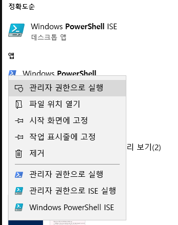
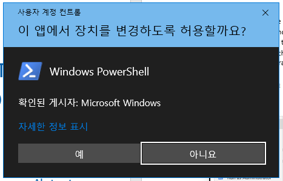
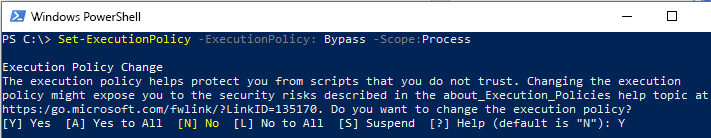

# 삭제 요청 제출용 FastTrack 마이그레이션 도구 집합FastTrack Migration Toolset for Submitting Delete Request

## 도구 집합 용도Toolset purpose

현재 FastTrack 마이그레이션에 연결된 고객의 경우, Office 365 사용자 계정을 삭제하면 Microsoft FastTrack 팀이 보유하는 데이터 복사본이 삭제되지 않습니다. FastTrack 팀은 오직 마이그레이션 완료 목적으로 복사본을 보유합니다. 마이그레이션하는 동안 Microsoft FastTrack 팀이 데이터 복사본도 삭제하게 하려면 이 도구 집합을 사용해 요청을 제출하세요. 일반 업무 과정에서 Microsoft FastTrack은 마이그레이션이 완료되면 모든 데이터 복사본을 삭제합니다.In the event that you are a customer currently engaged in FastTrack migrations, deleting the Office 365 user account will not delete the data copy held by the Microsoft FastTrack team, which is held for the sole purpose of completing the migration. If, during the migration, you would like the Microsoft FastTrack team to also delete the data copy, submit a request via this toolset. In the ordinary course of business, Microsoft FastTrack will delete all data copies once the migration is complete.

### 지원되는 플랫폼Supported platforms
Microsoft는 Windows 플랫폼 및 PowerShell 콘솔에서 이 도구 집합의 최초 릴리스를 지원합니다. 이 도구 집합은 다음의 알려진 플랫폼을 지원합니다.Microsoft supports the initial release of this  toolset in the Windows platform and PowerShell console. The following known platforms are supported by this toolset:
 
***테이블 1 — 이 도구 집합에서 지원되는 플랫폼******Table 1 - Platforms supported by this toolset***
 
<!--start table here HEADER -->
 
|||||||
|:-----|:-----|:-----|:-----|:-----|:-----|
| |**Windows 7****Windows 7**|**Windows 8****Windows 8**|**Windows 10****Windows 10**|**Windows Server 2012****Windows Server 2012**|**Windows Server 2016****Windows Server 2016**|
|PS 5.0PS 5.0|지원되지Not 않음Supported|지원됨Supported|지원됨Supported|지원됨Supported|지원됨Supported|
|PS 5.1PS 5.1|지원되지Not 않음Supported|지원됨Supported|지원됨Supported|지원됨Supported|지원됨Supported|
|||
 
<!-- end of table -->

### 도구 집합 획득Obtaining the toolset

이 도구 집합은 PowerShell 콘솔 응용 프로그램의 PowerShell 갤러리에서 사용할 수 있습니다. cmdlet 모듈의 위치를 찾고 로드하려면 먼저 PowerShell을 관리자 모드로 열어서 모듈을 설치할 수 있는 적절한 권한을 획득합니다. 이전에 PowerShell을 사용하지 않은 경우 Windows 작업 막대로 이동하여 검색 상자에 “PowerShell”을 입력합니다. 마우스 오른쪽 단추를 사용하여 콘솔 앱을 선택하고 **관리자 권한으로 실행**을 선택한 다음 **예**를 클릭하여 Windows PowerShell을 실행합니다.This toolset is available in the PowerShell Gallery on the PowerShell console application.  To locate and load this cmdlet module, first open PowerShell in administrator mode so it has the appropriate permissions to install the module. If you have not used PowerShell previously go to your Windows Task Bar and in the search box type “PowerShell”. Select the console app using right-click and choose **Run as administrator**, then click **Yes** to run Windows PowerShell.

이제 콘솔이 열려 있으므로 스크립트를 실행하려면 권한을 설정해야 합니다. 다음 명령을 입력하여 스크립트 실행을 허용하세요. ‘Set-ExecutionPolicy — ExecutionPolicy: Bypass — Scope: Process’Now that the console is open, you need to set permissions for script execution. Type the following command to allow the scripts to run: ‘Set-ExecutionPolicy – ExecutionPolicy: Bypass – Scope:Process’

관리자 판단에 따라 범위를 변경할 수 있으므로 이 작업을 확인하라는 메시지가 표시됩니다.You will be prompted to confirm this action, as the administrator can change the scope at their discretion..

***실행 정책 설정******Set Execution Policy***

이제 콘솔이 스크립트를 허용하도록 설정되었으므로 다음 명령을 실행하여 모듈을 설치합니다.Now that the console is set to allow the script,  run this next command to install the module:

>`Install-Module -Name Microsoft.FastTrack ` -Repository PSGallery \``Install-Module -Name Microsoft.FastTrack ` -Repository PSGallery \`
>        
>               -WarningAction: SilentlyContinue `
>               -Force’

### 모듈의 필수 구성 요소Prerequisites for module
이 모듈을 성공적으로 실행하려는 경우 종속 모듈이 설치되어 있지 않으면 먼저 설치해야 합니다. PowerShell을 다시 시작해야 할 수도 있습니다.To successfully execute this module, you may need to install dependent modules for use if they are not already installed. You may need to restart PowerShell.  

DSR을 제출하려면 먼저 Office 365 자격 증명을 사용하여 로그인해야 합니다 — 적절한 자격 증명을 입력하면 전역 관리자 상태의 유효성을 검사하고 테넌트 정보를 수집할 수 있습니다.In order to submit a DSR, you must first login using your Office 365 credentials – entering the proper credentials will validate your global administrator status and collect tenant information. 

**Login-FastTrackAccount -ApiKey: \<FastTrack MVM에서 제공하는 API Key\>****Login-FastTrackAccount -ApiKey: \<API Key provided by FastTrack MVM\>**

성공적으로 로그인하면 현재 PowerShell 세션의 나머지에 대해 FastTrack 모듈과 함께 사용하기 위해 자격 증명 및 키가 저장됩니다.Once successfully logged in, the credentials and key will be stored for use with FastTrack modules for the remainder of the current PowerShell session.

상업 환경 이외의 클라우드 환경에 연결해야 하는 경우 다음 유효한 환경 중 하나를 사용하여 *로그인* 명령에 *-Environment*를 추가해야 합니다.If you need to connect to a cloud environment, other than commercial, *-Environment* will needed to be added to *Login* command with one of the following valid environments:
- AzureCloudAzureCloud
- AzureChinaCloudAzureChinaCloud
- AzureGermanCloudAzureGermanCloud
- AzureUSGovernmentCloudAzureUSGovernmentCloud

**Login-FastTrackAcccount -ApiKey\ <API Key provided by FastTrack MVM> -Environment: <cloud environment\>****Login-FastTrackAcccount -ApiKey\ <API Key provided by FastTrack MVM> -Environment: <cloud environment\>**

DSR 요청을 제출하려면 다음 명령을 실행합니다. Submit-FastTrackGdprDsrRequest -DsrRequestUserEmail: SubjectUserEmail@mycompany.comTo submit a DSR request, run the following command: Submit-FastTrackGdprDsrRequest -DsrRequestUserEmail: SubjectUserEmail@mycompany.com

성공 시 — cmdlet이 트랜잭션 ID 개체를 반환합니다. 트랜잭션 ID를 보유하세요.On success – the cmdlet will return a Transaction ID object. Please retain the Transaction ID.

#### 요청 트랜잭션의 상태 확인Checking the status of a request transaction

이전에 획득한 트랜잭션 ID를 사용하여 다음 함수를 실행합니다. Get-FastTrackGdprDsrRequest -TransactionID: “YourTransactionID”Run the following function using the previously obtained Transaction ID: Get-FastTrackGdprDsrRequest -TransactionID: “YourTransactionID”

#### 트랜잭션 상태 코드Transaction Status Codes
<!--start table here no header -->

|||
|:-----|:-----|:-----|
|**트랜잭션****Transaction** |**상태****Status**|
|**만든 날짜****Created** |요청이 만들어짐Request has been created|
|**실패****Failed**|요청 만들기 실패함, 다시 제출하거나 지원팀에 문의Request failed to create, please resubmit, or contact support|
|**완료****Completed**|요청이 완료되어 삭제되었음Request has been completed and sanitized|
|||

<!-- end of table -->

<!-- original version: **Created**  Request has been created **Failed** Request failed to create, please resubmit, or contact support **Completed** Request has been completed and sanitized -->

## 자세한 정보Learn more
[Microsoft 보안 센터Microsoft Trust Center](https://www.microsoft.com/TrustCenter/Privacy/gdpr/default.aspx)