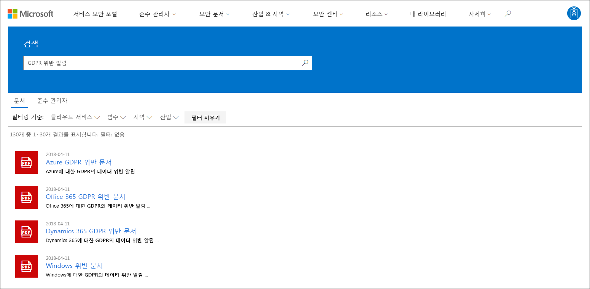

# Microsoft Service Trust Portal 시작

Microsoft Service Trust Portal은 Microsoft 보안, 개인 정보 보호 및 규정 준수 관행에 대한 다양한 콘텐츠, 도구 및 기타 리소스를 제공합니다.

## Service Trust Portal 액세스

Service Trust Portal에는 클라우드 서비스와 포함된 고객 데이터를 보호하는 역할을 하는 Microsoft에서 구현한 컨트롤 및 프로세스에 대한 세부 정보가 포함되어 있습니다. Service Trust Portal의 일부 리소스에 액세스하려면 Microsoft 클라우드 서비스 계정(Azure Active Directory 조직 계정 또는 Microsoft 계정)을 사용하여 인증된 사용자로 로그인하고 준수 자료에 대한 Microsoft 비공시 계약을 검토하고 동의해야 합니다.

### 기존 고객

기존 고객은 다음 온라인 구독(평가판 또는 유료) 중 하나를 사용하여 에서 Service Trust Portal에 <https://aka.ms/STP> 액세스할 수 있습니다.

- Microsoft 365
- Dynamics 365
- Azure

 > [!NOTE]
 > Azure Active Directory 조직과 연결된 계정은 준수 관리자와 같은 전체 문서 및 기능에 액세스할 수 있습니다. 개인적으로 사용하기 위해 만든 Microsoft 계정은 Service Trust Portal 콘텐츠에 제한적으로 액세스할 수 있습니다.

### Microsoft 온라인 서비스를 평가하는 신규 고객 및 고객

새 계정을 만들거나 평가판 계정을 만들하려면 다음 등록 양식(평가판 계정에도 사용) 중 하나를 사용하여 STP에 액세스합니다.

- 새 비즈니스용 Microsoft 365 앱 평가판 계정 또는 [새](https://go.microsoft.com/fwlink/p/?LinkID=507653) Office 365 Enterprise [평가판 계정에 등록](https://go.microsoft.com/fwlink/p/?LinkID=698279)

- [새 Dynamics 365](https://go.microsoft.com/fwlink/?LinkId=252780) 평가판 계정에 등록

- 새 Azure 평가판 계정에 [등록합니다.](https://go.microsoft.com/fwlink/?LinkId=722737)

무료 평가판 또는 구독에 등록할 때 STP에 대한 액세스를 지원하려면 Azure Active Directory 사용하도록 설정해야 합니다.

## Service Trust Portal 사용

Service Trust Portal 기능 및 콘텐츠는 기본 메뉴에서 액세스할 수 있습니다.

다음 섹션에서는 주 메뉴의 각 항목에 대해 설명합니다.

### Service Trust Portal

Service **Trust Portal 링크에** 홈 페이지가 표시됩니다. 이 기능을 사용하면 홈 페이지로 빠르게 돌아오는 방법을 빠르게 얻을 수 있습니다.

### 규정 관리자

> [!IMPORTANT]
> 준수 관리자가 서비스 신뢰 포털에서 서비스 트러스트 포털의 새 위치로 <a href="https://go.microsoft.com/fwlink/p/?linkid=2077149" target="_blank">Microsoft 365 규정 준수 센터.</a> 모든 고객 데이터가 새 위치로 이동하여 중단 없이 준수 관리자를 계속 사용할 수 있습니다. 설치 정보는 [준수 관리자](compliance-manager.md) 설명서를 참조하고 새로운 기능에 대해 자세히 알아보는 것이 좋습니다. 준수 관리자의 클래식 버전은 Service Trust Portal에 유지되어도 모든 사용자는 서비스 신뢰 포털에서 준수 관리자를 사용하는 것이 Microsoft 365 규정 준수 센터.

### 보안 문서

Microsoft 클라우드 서비스에서 데이터를 안전하게 보호하는 방법을 이해하여 규정 준수 목표를 보다 쉽게 충족할 수 있도록 하여 다양한 보안 구현 및 디자인 정보를 제공합니다. 콘텐츠를 검토하려면 **보안 문서** 풀다운 메뉴에서 다음 옵션 중 하나를 선택합니다.

- **감사 보고서:** Microsoft 클라우드 서비스에 대한 독립적인 감사 및 평가 보고서 목록이 표시됩니다. 이러한 보고서는 데이터 보호 표준 및 규정 요구 사항을 준수하는 Microsoft 클라우드 서비스 규정 준수에 대한 정보를 제공합니다.

  - ISO(국제 표준화 기구)
  - SOC(서비스 조직 컨트롤)
  - NIST(National Institute of Standards and Technology)
  - FedRAMP(Federal Risk and Authorization Management Program)
  - GDPR(일반 데이터 보호 규정)

- **데이터 보호:** 감사 컨트롤, 백서, FAQ, 침투 테스트, 위험 평가 도구 및 규정 준수 가이드와 같은 다양한 리소스가 포함되어 있습니다.

- **Azure 보안 및 규정 준수 청사진:** 안전하고 규정을 준수하는 클라우드 기반 응용 프로그램을 빌드하는 데 도움이 되는 리소스입니다. 이 영역에는 정부, 금융, 의료 및 소매업에 대한 청사진 지침이 포함되어 있습니다.

### 산업 & 지역

Microsoft 클라우드 서비스에 대한 산업 및 지역별 규정 준수 정보를 제공합니다.

- **산업:** 현재 이 페이지는 금융 서비스 산업을 위한 산업별 방문 페이지를 제공합니다. 여기에는 규정 준수 제품, FAQ 및 성공 사례와 같은 정보가 포함되어 있습니다. 더 많은 산업에 대한 리소스는 향후 출시될 예정입니다. 그러나 STP의 보안 문서 및 데이터 보호 페이지로 이동하여 더 많은 산업에 **>** 리소스를 찾을 수 있습니다.

- **지역:** 다양한 국가의 다양한 법률을 준수하는 Microsoft 클라우드 서비스에 대한 법적 의견을 제공합니다. 특정 국가로는 오스트레일리아, 캐나다, 체코 공화국, 덴마크, 독일, 폴란드, 루마니아, 스페인 및 영국이 있습니다.

### 보안 센터

Microsoft 클라우드의 보안, 규정 준수 및 개인 정보 보호에 대한 자세한 정보를 제공하는 [Microsoft](https://www.microsoft.com/trust-center)보안 센터로 연결되는 링크입니다. 여기에는 GDPR의 특정 요구 사항을 충족하는 데 사용할 수 있는 Microsoft 클라우드 서비스의 기능에 대한 정보, GDPR 책임에 도움이 되는 설명서 및 Microsoft가 GDPR을 지원하기 위해 취한 기술 및 조직적 조치를 이해하는 데 도움이 되는 정보가 포함됩니다.

### 내 라이브러리

이 새로운 기능을 사용하면 문서를 저장(또는 고정)하여 내 라이브러리 페이지에서 신속하게 액세스할 수 있습니다. 내 라이브러리의 문서가 업데이트될 때 Microsoft에서 전자 메일 메시지를 보내도록 알림을 설정할 수도 있습니다. 자세한 내용은 이 문서의 [내 라이브러리](#my-library-1) 섹션을 참조하세요.

### 자세히

전역 관리자 **>** 사용할 수 있는 관리 기능에 액세스하려면 추가 관리자로 이동하세요. 이 옵션은 전역 관리자로 로그인한 경우만 표시됩니다. 관리자 풀다운 메뉴에는 **다음** 두 가지 옵션이 있습니다.

- **설정:** 이 페이지에서는 준수 관리자(클래식)에 대한 사용자 역할을 할당할 수 있습니다.

- **사용자 개인 설정:** 이 페이지에서는 특정 사용자에 대한 준수 관리자(클래식)에서 작업 항목 할당이 포함된 보고서를 내보낼 수 있습니다. 또한 모든 작업 항목을 다른 사용자에게 다시 할당하고 지정된 사용자에서 할당된 작업 항목을 제거할 수도 있습니다.

### 검색

Service Trust Portal 페이지의 오른쪽 위 모서리에 있는 돋보기를 클릭하여 상자를 확장하고 검색어를 입력한 다음 **Enter를 클릭합니다.** 검색 **페이지가** 표시되고 검색 용어가 검색 상자에 표시되고 아래에 나열된 검색 결과가 표시됩니다.

기본적으로 검색은 문서 결과를 반환합니다. 드롭다운 목록을 사용하여 표시되는 문서 목록을 구체화하여 결과를 필터링할 수 있습니다. 여러 필터를 사용하여 문서 목록의 범위를 좁힐 수 있습니다. 필터에는 특정 클라우드 서비스, 규정 준수 또는 보안 사례 범주, 지역 및 산업이 포함됩니다. 문서 이름 링크를 클릭하여 문서를 다운로드합니다.

검색 용어와 관련된 준수 관리자(클래식)의 평가 컨트롤을 나열하려면 준수 **관리자 를 클릭합니다.** 검색 결과에는 평가가 만들어진 날짜, 평가 그룹화 이름, 적용 가능한 Microsoft 클라우드 서비스 및 컨트롤이 Microsoft 또는 고객 관리인지 여부가 표시됩니다. 컨트롤의 이름을 클릭하여 준수 관리자의 평가(클래식)에서 컨트롤을 볼 수 있습니다.

> [!NOTE]
> Service Trust Portal 보고서 및 문서는 게시 후 또는 새 버전의 문서가 제공될 때까지 최소 12개월 동안 다운로드할 수 있습니다.

## 내 라이브러리

내 라이브러리 기능을 사용하여 Service Trust Portal의 문서 및 리소스를 내 라이브러리 페이지에 추가합니다. 이렇게 하면 사용자와 관련된 문서에 한 장소에서 액세스할 수 있습니다.  내 라이브러리에 문서를 추가하려면 문서 오른쪽의 **...** 메뉴를 클릭한 다음 라이브러리에 **저장을 선택합니다.** 하나 이상의 문서 옆에 있는 확인란을 클릭한 다음 페이지 맨 위에 있는 라이브러리에 저장을 클릭하여 내 라이브러리에 여러 문서를 추가할 수 있습니다. 

또한 알림 기능을 사용하면 Microsoft에서 내 라이브러리에 추가한 문서를 업데이트할 때마다 전자 메일 메시지가 전송될 수 있도록 내 라이브러리를 구성할 수 있습니다. 알림을 설정하려면 내 라이브러리로 이동하여 에서 **알림을 설정.** 알림 빈도를 선택하고 알림을 보낼 조직의 전자 메일 주소를 지정할 수 있습니다. 전자 메일 알림에는 업데이트된 문서에 대한 링크와 업데이트에 대한 간략한 설명이 포함됩니다.

또한 알림을 설정하는지 여부에 관계없이 지난 30일 이내에 업데이트된 내 라이브러리의 모든 문서를 식별합니다. 업데이트에 대한 간략한 설명도 도구 설명에 표시됩니다.

## Starter packs

Starter packs는 특정 산업용 Microsoft 클라우드 서비스에 대한 Microsoft 큐레이터 문서 집합입니다. 현재 서비스 신뢰 포털은 금융 서비스 조직을 위해 다음과 같은 세 가지 시작 팩을 제공합니다. 이러한 시작 팩은 조직이 Microsoft 클라우드에서 보안, 규정 준수 및 개인 정보를 평가하고 평가하는 데 도움을 주며 높은 규제 대상 금융 서비스 산업에서 Microsoft 클라우드 서비스를 구현하는 데 도움이 되는 지침을 제공합니다.

- **Evaluation Starter Pack:** 금융 서비스 조직에 대한 Microsoft 클라우드의 조기 평가에 사용

- **평가 시작 팩:** 평가 후 이 시작 팩의 검사 목록 및 기타 지침을 사용하여 조직이 보안, 규정 준수 및 개인 정보 보호와 관련된 위험을 평가하는 데 도움을 줄 수 있습니다.

- **Starter Pack 감사:** 감사 컨트롤 및 기타 도구를 사용하는 방법에 대한 지침을 위해 이 시작 팩을 사용하면 조직의 위험 노출을 줄이는 데 도움이 되는 방식으로 Microsoft 클라우드 서비스 구현을 안내할 수 있습니다.

이러한 시작 팩에 액세스하기 위해 Service Trust Portal > Industry & **Regions > Industry Solutions > 로 이동하세요.** 시작 팩에서 문서를 열거나 다운로드하거나 내 라이브러리에 저장할 수 있습니다.

## 지역화 지원

Service Trust Portal에서는 페이지 콘텐츠를 여러 언어로 볼 수 있습니다. 페이지 언어를 변경하려면 페이지의 왼쪽 아래 모서리에 있는 지구본 아이콘을 클릭하고 원하는 언어를 선택하면 됩니다.

## 피드백 제공

서비스 신뢰 포털에 대한 질문이나 포털을 사용할 때 발생하는 오류에 대해 도움을 줄 수 있습니다. STP 페이지 아래쪽의 피드백 링크를 사용하여 Service Trust Portal 규정 준수 보고서에 대한 질문과 피드백을 보내고 리소스를 신뢰할 수 있습니다.

귀하의 의견은 저희에게 중요합니다. 페이지 아래쪽의 피드백 단추를 클릭하여 했거나 원하지 않는 기능에 대한 의견을 보내거나 제품 또는 제품 기능을 개선하기 위해 사용할 수 있는 제안을 보내주세요.

