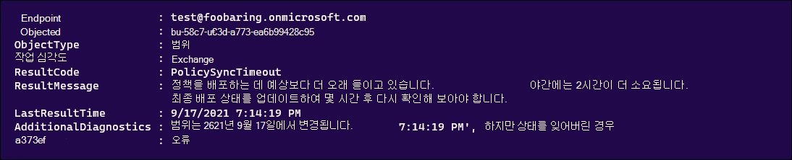
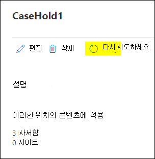

# <a name="troubleshoot-ediscovery-hold-errors"></a>eDiscovery 보류 오류 문제 해결

이 문서에서는 eDiscovery 보류에서 발생할 수 있는 일반적인 문제와 이러한 문제를 해결하는 방법에 대해 논의합니다. 이 문서에는 이러한 문제를 완화하거나 방지하는 데 도움이 되는 권장 사례도 포함되어 있습니다.

## <a name="recommended-practices"></a>권장 사례

eDiscovery 보류와 관련된 오류 수를 줄이면 다음과 같은 모범 사례가 권장됩니다.

- 보류 배포가 계속 보류 중인 경우 상태 또는 는 보류 배포가 완료될 때까지 기다렸다가 추가 업데이트를 `On (Pending)` `Off (Pending)` 합니다.

- 보류 정책을 추가로 업데이트하기 전에 보류 중인지 확인합니다. 다음 명령을 실행하거나 PowerShell 스크립트에 저장합니다.

    ```powershell
    $status = Get-CaseHoldPolicy -Identity <policyname> -DistributionDetail
    if($status.DistributionStatus -ne "Pending"){
        # policy no longer pending
        Set-CaseHoldPolicy -Identity <policyname> -AddExchangeLocation $user1
    }else{
        # policy still pending
        Write-Host "Hold policy still pending."
    }
   ```

- 각 트랜잭션에 대해 보류 정책을 반복적으로 업데이트하는 대신 단일 대량 요청으로 업데이트를 eDiscovery 보류에 병합합니다. 예를 들어 [Set-CaseHoldPolicy](/powershell/module/exchange/set-caseholdpolicy) cmdlet을 사용하여 기존 보류 정책에 여러 사용자 사서함을 추가하기 위해 여러 사용자를 추가하기 위해 한 번만 실행하도록 명령을 실행(또는 스크립트에 코드 블록으로 추가)합니다.

  **올바른 예**

    ```powershell
    Set-CaseHoldPolicy -Identity "policyname" -AddExchangeLocation "User1", "User2", "User3", "User4", "User5"
    ```

   **잘못된 예**

    ```powershell
    $users = "User1", "User2", "User3", "User4", "User5"
    ForEach($user in $users)
    {
        Set-CaseHoldPolicy -Identity "policyname" -AddExchangeLocation $user
    }
    ```

   이전의 잘못된 예에서 cmdlet은 작업을 완료하기 위해 5번 별도로 실행됩니다. 보류 정책에 사용자를 추가하는 권장 사례에 대한 자세한 내용은 추가 정보 [섹션을 참조하세요.](#more-information)

- eDiscovery 보류 문제에 대해 Microsoft 지원에 문의하기 전에 ResultCode에 따라 DistributionResults를 확인하여 정책이 실패하는 원인을 확인합니다.

   ```powershell
   Get-CaseHoldPolicy -Identity "policyname" -DistributionDetail | Select -ExpandProperty DistributionResults
   ```

   

## <a name="error-policysynctimeout"></a>오류: PolicySyncTimeout

**ResultCode: PolicySyncTimeout** 및 다음 오류 메시지에 이 오류가 표시된 경우 LastResultTime을 확인하여 동기화가 시간 제한에 도달한 후 2시간이 지난지 확인합니다.

> 정책을 배포하는 데 예상보다 더 오래 들이고 있습니다. 최종 배포 상태를 업데이트하는 데 추가 2시간이 걸릴 수 있으므로 몇 시간 후 다시 확인해 보아야 합니다.

### <a name="resolution"></a>해결 방법

**Set-CaseHoldPolicy -Identity "policyname" -RetryDistribution을** 실행하면 문제가 해결됩니다.

   ```powershell
   Set-CaseHoldPolicy "policyname" -RetryDistribution
   ```

또한 목록의 케이스 보류 Microsoft 365 규정 준수 센터 다시 시도를 클릭하여 정책을 다시 **재배포할 수 있습니다.**



## <a name="error-policynotifyerror"></a>오류: PolicyNotifyError

**ResultCode: PolicyNotifyError** 및 다음 오류 메시지에 이 오류가 표시될 경우 데이터 센터 문제가 정책 동기화를 중단했습니다.

> 일시적인 데이터 센터 문제로 인해 콘텐츠 원본에 정책을 Office 365 수 없습니다. 현재 정책은 원본의 콘텐츠에 적용되지 않습니다. 따라서 차단된 배포에는 영향이 없습니다. 이 문제를 해결하려는 경우 정책을 다시 재배포해 하시기 바랍니다.

### <a name="resolution"></a>해결 방법

**Set-CaseHoldPolicy -Identity "policyname" -RetryDistribution을** 실행하면 문제가 해결됩니다.

   ```powershell
   Set-CaseHoldPolicy "policyname" -RetryDistribution
   ```

또한 목록의 케이스 보류 Microsoft 365 규정 준수 센터 다시 시도를 클릭하여 정책을 다시 **재배포할 수 있습니다.**


## <a name="error-internalerror"></a>오류: InternalError

**ResultCode: InternalError** 및 다음 오류 메시지에 이 오류가 표시되면 Microsoft에서 이 문제를 해결해야 합니다.

> 예기치 않은 데이터 센터 문제로 인해 정책 Office 365 중단했습니다. 배포 문제를 해결하기 위해 Microsoft 지원에 문의하시기 바랍니다.

### <a name="resolution"></a>해결 방법

다음 정보를 문의하여 Microsoft 지원에 문의하세요.

- 정책 이름
- Microsoft 365 서비스 또는 기능
- 결과 코드
- 결과 메시지
- 추가 진단

## <a name="error-failedtoopencontainer"></a>오류: FailedToOpenContainer

**ResultCode: FailedToOpenContainer에** 이 오류가 표시되어 있으며 보유자 및 데이터 원본을 보류할 때 다음 오류 메시지가 표시되어 있는 경우 해결 단계를 사용하여 문제를 해결합니다.

> 사서함 또는 SharePoint 사이트가 존재하지 않을 수 있습니다.  이 문제가 올바르지 않은 경우 Microsoft 지원에 문의하시기 바랍니다.  그렇지 않은 경우 해당 정책에서 제거합니다.

### <a name="resolution"></a>해결 방법

- 조직에 사용자 사서함이 Exchange Online PowerShell에서 [Get-Mailbox를](/powershell/module/exchange/get-mailbox) 실행합니다.

- 조직에 사이트가 SharePoint PowerShell에서 [Get-SPOSite](/powershell/module/sharepoint-online/get-sposite) cmdlet을 실행하여 사이트가 조직에 존재하는지 확인할 수 있습니다.

- 사이트 URL이 변경된지 확인합니다.

- 개체가 없는 경우 정책에서 사서함 또는 사이트를 제거합니다.

## <a name="error-siteinreadonlyornotaccessible"></a>오류: SiteInReadonlyOrNotAccessible

**ResultCode: SiteInReadonlyOrNotAccessible** 및 다음 오류 메시지에 이 오류가 표시될 경우 SharePoint 사이트가 읽기 전용 모드에 있습니다.

> 사이트 SharePoint 읽기 전용 또는 액세스할 수 없습니다. 사이트 관리자에게 문의하여 사이트를 필기할 수 있도록 설정한 다음 이 정책을 다시 재배포하세요.

### <a name="resolution"></a>해결 방법

이 문제를 해결하려면 사이트의 잠금을 해제합니다(또는 관리자에게 잠금 해제 요청). 사이트의 잠금 상태를 변경하는 방법에 대한 자세한 내용은 사이트 잠금 및 잠금 [해제를 참조하세요.](/sharepoint/manage-lock-status)

## <a name="error-siteoutofquota"></a>오류: SiteOutOfQuota

**ResultCode: SiteOutOfQuota** 및 다음 오류 메시지에 이 오류가 표시되어 있는 경우 SharePoint 사이트가 저장소 할당량에 도달한 것입니다.

> 사이트 SharePoint 할당량 부족 사이트 모음에 더 많은 할당량 할당을 할당한 다음 이 정책을 다시 재배포하세요.

### <a name="resolution"></a>해결 방법

사이트에 저장소를 더 추가하거나 관리자에게 저장소를 더 추가해 묻는 요청이 사이트 모음에 추가됩니다. 사이트의 저장소 할당량 관리 방법에 대한 자세한 내용은 [Manage site collection storage limits를 참조하세요.](/sharepoint/manage-site-collection-storage-limits)

사이트에 저장소 할당량 추가 후 정책을 다시 재배포해야 합니다.

   ```powershell
   Set-CaseHoldPolicy "policyname" -RetryDistribution
   ```

또한 목록의 케이스 보류 Microsoft 365 규정 준수 센터 다시 시도를 클릭하여 정책을 다시 **재배포할 수 있습니다.**


## <a name="error-recipienttypenotallowed"></a>오류: RecipientTypeNotAllowed

**ResultCode: RecipientTypeNotAllowed** 및 다음 오류 메시지에 이 오류가 표시될 경우 사서함인 Exchange 위치가 정책에 할당됩니다.

> 받는 사람 유형에는 보류가 허용되지 않습니다.

### <a name="resolution"></a>해결 방법

PowerShell에서 [Get-Recipient를](/powershell/module/exchange/get-recipient) Exchange Online 끝점의 주소가 유효한 사서함이면 확인할 수 있습니다.

위의 cmdlet에 SMTP 주소가 유효한 사서함이 아닌 것으로 표시될 경우 정책에서 해당 주소를 제거합니다.

```powershell
Set-CaseHoldPolicy "policyname" -RemoveExchangeLocation "non-mailbox user"
```

## <a name="more-information"></a>추가 정보

"권장 사례" 섹션에서 여러 사용자에 대한 보류 정책을 업데이트하는 지침은 시스템이 보류 정책에 대한 동시 업데이트를 차단하는 사실에서 비로소 제공됩니다. 즉, 업데이트된 보류 정책이 새 콘텐츠 위치에 적용되고 보류 정책이 보류 중인 상태이면 보류 정책에 추가 콘텐츠 위치를 추가할 수 없습니다. 다음은 이 문제를 완화하는 데 도움이 있도록 유의해야 할 몇 가지 사항입니다.
  
- 보류가 업데이트될 때마다 즉시 보류 상태가 됩니다. 보류 상태는 보류가 콘텐츠 위치에 적용되고 있는 것을 의미합니다.
  
- 루프를 실행하고 정책을 하나씩 추가하는 스크립트가 있는 경우("권장 사례" 섹션에 표시된 잘못된 예와 유사함) 첫 번째 콘텐츠 위치(예: 사용자 사서함)는 보류 중인 상태를 트리거하는 동기화 프로세스를 시작됩니다. 즉, 후속 루프에서 정책에 추가된 다른 사용자는 오류가 발생합니다.
  
- 조직에서 루프를 실행하여 보류 정책의 콘텐츠 위치를 업데이트하는 스크립트를 사용하는 경우 "권장 사례" 섹션의 올바른 예와 같이 단일 대량 작업에서 위치를 업데이트할 수 있도록 스크립트를 업데이트해야 합니다.
