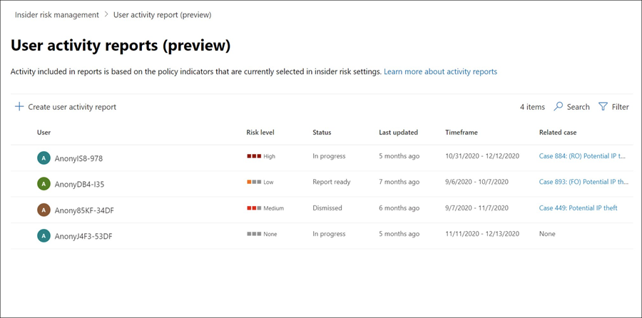

# 내부자 위험 관리 활동 조사

위험한 사용자 활동을 조사하는 것은 조직의 내부자 위험을 최소화하는 중요한 첫 번째 단계입니다. 이러한 위험은 내부자 위험 관리 정책에서 경고를 생성하는 활동 또는 정책에서 검색되는 활동의 위험을 발생하지만 즉시 사용자에 대한 내부자 위험 관리 경고를 생성하지는 않을 수 있습니다. 사용자 활동 보고서(미리 **보기)** 또는 경고 대시보드를 사용하여 이러한 유형의 활동을 **조사할 수 있습니다.**

## 사용자 활동 보고서(미리 보기)

사용자 활동 보고서를 사용하면 내부자 위험 관리 정책에 일시적으로 또는 명시적으로 할당하지 않고도 정의된 기간 동안 특정 사용자에 대한 활동을 검사할 수 있습니다. 대부분의 내부자 위험 관리 시나리오에서 사용자는 정책에서 명시적으로 정의되고, 활동과 관련된 정책 경고(이벤트 트리거에 따라 다국어) 및 위험 점수가 있을 수 있습니다. 그러나 일부 시나리오에서는 정책에 명시적으로 정의되지 않은 사용자에 대한 활동을 검사할 수 있습니다. 사용자 및 잠재적으로 위험한 활동에 대한 팁을 받은 사용자 또는 일반적으로 내부자 위험 관리 정책에 할당할 필요가 없는 사용자일 수 있습니다.

내부자 위험 관리 설정 표시기를 구성하면  선택한 지표와 관련된 위험한 활동이 사용자 활동으로 검색됩니다. 조직의 사용자가 위험한 활동을 검색하고 보고하도록 사용자 활동 보고서에 대한 정책을 구성할 작업은 없습니다. 사용자 활동 보고서에 포함된 활동에는 활동이 표시될 때 이벤트를 트리거할 필요가 없습니다. 이 구성은 트리거 이벤트가 발생하거나 경고가 생성되는지와 관계없이 사용자에 대해 검색된 모든 활동을 검토할 수 있습니다. 보고서는 사용자 기준에 따라 만들어지며 사용자 지정 90일 기간에 대한 모든 활동을 포함할 수 있습니다. 동일한 사용자에 대한 여러 보고서는 지원되지 않습니다.

사용자에 대한 활동을 검사한 후 조사자는 개별 활동을 양성으로 해지하거나, 다른 조사자들과 보고서 링크를 공유하거나 전자 메일을 보내거나, 사용자를 내부자 위험 관리 정책에 일시적으로 또는 명시적으로 할당하도록 선택할 수 있습니다. 사용자 활동 보고서 페이지를 확인하려면 사용자를 *Insider Risk Management Investigators* 역할 그룹에 **할당해야** 합니다.  

내부자 위험 관리 개요  페이지의 사용자  활동 조사 섹션에서 보고서 관리를 선택하여 시작할 **수** 있습니다. 사용자에 대한 활동을 보기  위해 먼저 사용자 활동 보고서 만들기를 선택하고 새 사용자 활동 보고서 창에서 다음 필드를 **입력합니다.**

- **사용자:** 이름 또는 전자 메일 주소로 사용자 검색
- **시작 날짜:** 달력 컨트롤을 사용하여 사용자 활동의 시작 날짜를 선택합니다.
- **종료 날짜:** 달력 컨트롤을 사용하여 사용자 활동의 종료 날짜를 선택합니다. 선택한 종료 날짜는 선택한 시작 날짜로부터 2일이 지난 후, 선택한 시작 날짜로부터 90일을 넘지 말아야 합니다.
일반적으로 새 보고서는 검토할 준비가 되기까지 최대 10시간이 소요됩니다. 보고서가 준비되면 사용자 활동  보고서 페이지의  상태 열에 보고서 준비 상태가 표시됩니다. 자세한 보고서를 볼 사용자를 선택합니다.

선택한 **사용자의** 사용자 활동 보고서에는 사용자 **활동** 및 활동 **탐색기 탭이** 포함되어 있습니다.

- **사용자 활동:** 이 차트 보기를 사용하여 활동을 조사하고 순서대로 발생할 수 있는 잠재적인 활동을 볼 수 있습니다. 이 탭은 모든 활동의 기록 타임라인, 활동 세부 정보, 해당 사용자의 현재 위험 점수, 위험 이벤트 순서 및 조사에 도움이 되는 필터링 컨트롤을 포함하여 사례를 빠르게 검토할 수 있도록 구성됩니다.
- **활동 탐색기:** **활동** 탐색기 탭은 위험 조사자에게 활동에 대한 자세한 정보를 제공하는 포괄적인 분석 도구를 제공합니다. 활동 탐색기를 사용하여 검토자는 감지된 위험한 활동의 타임라인을 신속하게 검토하고 경고와 관련된 모든 위험 활동을 식별하고 필터링할 수 있습니다. 활동 탐색기 사용에 대한 자세한  내용은 이 문서 부분의 활동 탐색기 섹션을 참조하십시오.

## 경고 대시보드

내부자 위험 관리 경고는 내부자 위험 관리 정책에 정의된 위험 지표에 의해 자동으로 생성됩니다. 이러한 경고를 통해 규정 준수 분석가 및 조사자는 현재 위험 상태를 전체적으로 파악하고 발견된 위험에 대한 조치를 취할 수 있습니다. 기본적으로 정책은 낮은, 중간 및 높은 심각도 경고를 생성하지만,  요구에 맞게 경고 볼륨을 늘리거나 줄이면 됩니다. 또한 정책 마법사를  사용하여 새 정책을 만들 때 정책 표시에 대한 경고 임계값을 구성할 수 있습니다.

경고가 위험한 활동에 대한 세부 정보, 컨텍스트 및 관련 콘텐츠를 제공하는 방법과 조사 프로세스의 효율성을 개선하는 방법에 대한 개요는 [Insider Risk Management Alerts Triage Experience](https://www.youtube.com/watch?v=KgmpxBLJLPI) 비디오를 참조하세요.

내부자 위험 **경고 대시보드를** 사용하면 내부자 위험 정책에 의해 생성된 경고를 보고 이에 대해 작업할 수 있습니다. 각 보고서 위젯에는 지난 30일간의 정보가 표시됩니다.

- **검토해야** 하는 총 알림: 경고 심각도별 분석 결과를 포함하여 검토 및 심사가 필요한 총 경고 수가 나열됩니다.
- **지난 30일** 동안의 경고 열기 : 정책에서 만든 총 경고 수가 지난 30일 동안 일치하며 높음, 보통 및 낮은 경고 심각도 수준별로 정렬됩니다.
- **경고를 해결하는 평균** 시간: 유용한 경고 통계 요약:
  - 심각도가 높은 경고를 해결하기 위한 평균 시간(시간, 일 또는 월)입니다.
  - 시간, 일 또는 월 단위로 나열된 중간 심각도 경고를 해결하는 평균 시간입니다.
  - 낮은 심각도 경고를 해결하기 위한 평균 시간(시간, 일 또는 월)입니다.

> [!NOTE]
> 내부자 위험 관리는 기본 제공 경보 스로틀 기능을 사용하여 위험 조사 및 검토 경험을 보호하고 최적화합니다. 이 제한은 잘못 구성된 데이터 커넥터 또는 DLP 정책과 같은 정책 경고 과부하를 초래할 수 있는 문제를 보호합니다. 따라서 사용자에 대한 새 경고를 표시하는 데 지연이 있을 수 있습니다.

## 경고 상태 및 심각도

경고를 다음 상태 중 하나에 따라 등급을 정할 수 있습니다.

- **확인:** 새 사례 또는 기존 사례에 경고가 확인되어 할당됩니다.
- **해지:** 선고 프로세스에서 무해한 경고입니다.
- **검토 필요:** 심사 작업이 아직 수행되지 않은 새 경고입니다.
- **해결된 경우:** 닫힌 사례와 해결된 사례의 일부인 경고입니다.

경고 위험 점수는 여러 위험 활동 지표에서 자동으로 계산됩니다. 이러한 지표에는 위험 활동의 유형, 활동 발생 횟수 및 빈도, 사용자 위험 활동 기록, 활동 심각성을 높일 수 있는 활동 위험 추가가 포함됩니다. 경고 위험 점수는 각 경고에 대한 위험 심각도 수준을 프로그래밍 방식으로 할당하므로 사용자 지정할 수 없습니다. 경고가 검색되지 않은 상태로 유지되고 위험 활동이 경고에 계속 증가하면 위험 심각도 수준이 증가할 수 있습니다. 위험 분석가와 조사자는 경고 위험 심각도에 따라 조직의 위험 정책 및 표준에 따라 경고를 평가할 수 있습니다.

경고 위험 심각도 수준은:

- **높은 심각도:** 경고에 대한 활동 및 지표는 심각한 위험을 내포합니다. 관련 위험 활동은 심각하고 반복하며 다른 중요한 위험 요인에 강력하게 고안됩니다.
- **보통 심각도:** 경고에 대한 활동 및 표시기가 보통의 위험을 내포합니다. 관련된 위험 활동은 보통이고 자주 발생하며 다른 위험 요소와 어느 정도 상관 관계가 있습니다.
- **낮은 심각도:** 경고에 대한 활동 및 표시기는 사소한 위험을 내포합니다. 관련 위험 활동은 사소하고 더 까다로우며 다른 중요한 위험 요인으로 코어화되지 않습니다.

## 경고 대시보드에서 경고 필터링

조직의 활성 내부자 위험 관리 정책의 수와 유형에 따라 많은 경고 대기열을 검토하는 작업은 어려울 수 있습니다. 경고 필터를 사용하면 분석가와 조사자는 여러 특성별로 경고를 정렬하는 데 도움이 됩니다. 경고 대시보드에서 경고를 **필터링하려면** 필터 **컨트롤을** 선택합니다. 다음 하나 이상의 특성을 사용하여 경고를 필터링할 수 있습니다.

- **상태:** 경고 목록을 필터링하려면 상태 값을 하나 이상 선택합니다. 옵션은 *확인됨*, *무시됨*, *검토 필요* 및 *해결됨* 입니다.
- **심각도:** 경고 목록을 필터링하려면 경고 위험 심각도 수준을 하나 이상 선택합니다. 옵션은 *높음*, *중간* 및 *낮음* 입니다.
- **검색된 시간:** 경고가 만들어진 시작 날짜와 종료 날짜를 선택합니다.
- **정책:** 하나 이상의 정책을 선택하여 선택한 정책에 의해 생성된 경고를 필터링합니다.

## 경고 대시보드에서 경고 검색

경고 이름에 특정 단어가 있는지 검색하려면 **검색** 컨트롤을 선택하고 검색할 단어를 입력합니다. 검색 결과에는 검색에 정의된 단어가 포함된 정책 경고가 표시됩니다.

## 여러 경고(미리 보기)

분석가와 조사자는 여러 경고를 즉시 즉시 해지하는 데 시간을 절약하는 데 도움이 될 수 있습니다. 알림 **보내기** 명령 표시줄 옵션을 사용하면 대시보드에서 검토 필요  상태가 있는 경고를 하나 이상 선택하고 이러한 경고를 심사 프로세스에서 적절하게 무해한 경고로 신속하게 해지할 수 있습니다. 한 번씩 최대 400개 경고를 선택하여 알림을 해지할 수 있습니다.

내부자 위험 경고를 해지하기 위해 다음 단계를 완료합니다.

1. In the [Microsoft 365 규정 준수 센터](https://compliance.microsoft.com), go to **Insider risk management** and select the **Alerts** tab.
2. 경고 **대시보드에서** 경고(또는 경고)를 선택하고  검토 상태를 검토해야 합니다.를 선택합니다.
3. 경고 명령 표시줄에서 경고 **해지 를 선택합니다.**
4. 알림 **보내기** 세부 정보 창에서 선택한 경고와 연결된 사용자 및 정책 세부 정보를 검토할 수 있습니다.
5. **경고를** 무해한 것으로 해결하려면 경고 취소를 선택하거나 취소를 선택하여 경고를 취소하지 않고 세부 정보 창을 닫습니다. 

## Triage alerts

내부자 위험 경고를 평가하기 위해 다음 단계를 완료합니다.

1. In the [Microsoft 365 규정 준수 센터](https://compliance.microsoft.com), go to **Insider risk management** and select the **Alerts** tab.
2. 경고 **대시보드에서** Triage를 원하는 경고를 선택합니다.
3. 경고 **세부 정보 창에서** 다음 탭을 검토하고 경고를 심사할 수 있습니다.
    - **요약:** 이 탭에는 경고에 대한 일반적인 정보가 포함되어 있으며 경고를 확인하고 새 사례를 만들거나 경고를 닫을 수 있습니다. 여기에는 높은, 중간 또는 낮음으로 나열된 경고 및 경고 위험 심각도 수준에 대한 현재 상태가 *포함됩니다.* 심각도 수준은 경고가 세분화되지 않은 경우 시간이 지날 때 증가하거나 감소할 수 있습니다.
        - **발생된 작업(미리 보기)**: 활동 평가 기간 동안 활동과 관련된 위반 유형 및 발생 횟수를 포함하여 상위 3가지 위험 활동 및 정책 일치를 표시됩니다.
        - **사용자 세부 정보:** 경고에 할당된 사용자에 대한 일반 정보를 표시합니다. Onymization을 사용하도록 설정하면 사용자 이름, 전자 메일 주소, 별칭 및 조직 필드가Onymized됩니다.
        - **경고 세부 정보:** 경고가 생성된 이후의 기간, 경고를 생성한 정책이 나열됩니다. 경고에서 생성된 사례가 나열됩니다. 새 경고의 경우 사례 **필드에** 없음이 표시됩니다.
        - **검색된 콘텐츠(미리 보기)**: 경고에 대한 위험 활동과 관련된 콘텐츠를 포함하며 주요 영역의 활동 이벤트를 요약합니다. 활동 링크를 선택하면 활동 탐색기가 열리며 활동에 대한 추가 세부 정보가 표시됩니다.
    - **사용자 활동:** 이 탭에는 경고와 연결된 사용자의 활동 기록이 표시됩니다. 이 기록에는 이 경고에 대한 정책에 할당된 템플릿에 정의된 위험 지표와 관련된 기타 경고 및 활동이 포함됩니다. 이 기록을 통해 위험 분석가와 조사자는 평가 프로세스의 일부로 직원에 대한 과거의 위험한 행동을 고려할 수 있습니다.
    - **작업:** 각 경고에 대해 다음 작업을 사용할 수 있습니다.
        - **확장된 보기 열기:** 활동 **탐색기 대시보드를 열** 수 있습니다.
        - **사례 확인** 및 만들기: 이 작업을 사용하여 사용자와 연결된 모든 경고에 대한 새 사례를 확인하고 만들 수 있습니다. 이 작업을 수행하면 경고 상태가 *확인 으로 자동 변경됩니다.*
        - **경고 해지:** 이 작업을 사용하여 경고를 지우는 데 사용할 수 있습니다. 이 작업을 수행하면 경고 상태가 *해결되었습니다.*

## 활동 탐색기(미리 보기)

> [!NOTE]
> 조직에서 이 기능을 사용할 수 있는 후 이벤트를 트리거하는 사용자의 경고 관리 영역에 활동 탐색기를 사용할 수 있습니다.

활동 탐색기는 경고에 대한 자세한 정보를 제공하는 포괄적인 분석 도구를 통해 위험 조사자 및 분석가를 제공합니다. 활동 탐색기를 사용하여 검토자는 감지된 위험한 활동의 타임라인을 신속하게 검토하고 경고와 관련된 모든 위험 활동을 식별하고 필터링할 수 있습니다. 활동 탐색기에서 알림을 필터링하려면 필터 컨트롤을 선택합니다. 경고에 대한 세부 정보 창에 나열된 하나 이상의 특성을 사용하여 경고를 필터링할 수 있습니다. 또한 활동 탐색기는 사용자 지정 가능한 열을 지원하여 조사자 및 분석가가 가장 중요한 정보에 대시보드를 집중할 수 있도록 합니다.

활동 **탐색기를 사용하려면** 다음 단계를 완료합니다.

1. 사용자 Microsoft 365 규정 준수 센터 내부자 위험 관리로 **이동하여** **경고 탭을** 선택합니다.
2. 경고 **대시보드에서** Triage를 원하는 경고를 선택합니다.
3. 경고 **세부 정보 창에서** 확장된 **보기 열기 를 선택합니다.**
4. 선택한 경고에 대한 페이지에서 활동 탐색기 **탭을** 선택합니다.

활동 탐색기에서 활동을 검토할 때 조사자 및 분석가가 특정 활동을 선택하고 활동 세부 정보 창을 열 수 있습니다. 이 창에는 조사자 및 분석가가 경고 선고 프로세스 중에 사용할 수 있는 활동에 대한 자세한 정보가 표시됩니다. 자세한 정보는 경고에 대한 컨텍스트를 제공하고 경고를 트리거한 위험 활동의 전체 범위를 식별하는 데 도움이 될 수 있습니다.

## 경고 사례 만들기

경고를 검토하고 심사할 때 새 사례를 만들어 위험 활동을 추가로 조사할 수 있습니다. 경고에 대한 사례를 만들 수 있는 단계는 다음과 같습니다.

1. In the [Microsoft 365 규정 준수 센터](https://compliance.microsoft.com), go to **Insider risk management** and select the **Alerts** tab.
2. 경고 **대시보드에서** 확인할 경고를 선택하고 새 사례를 생성합니다.
3. Alerts **details(알림** 세부 정보) 창에서 Actions Confirm alerts **(경고** 확인) &  >  **선택합니다.**
4. 경고 **확인** 및 내부자 위험 사례 만들기 대화 상자에서 사례 이름을 입력하고 참가자로 추가할 사용자를 선택하고 해당하는 설명을 추가합니다. 설명은 사례 메모로 사례에 자동으로 추가됩니다.
5. 사례 **만들기를 선택하여** 새 사례를 만들거나 취소를 선택하여 사례를 만들지 않고 대화 상자를 닫습니다. 

사례를 만든 후 조사자 및 분석가가 사례를 관리하고 작업할 수 있습니다. 자세한 내용은 [Insider risk management case 문서를 참조하세요.](insider-risk-management-cases.md)
