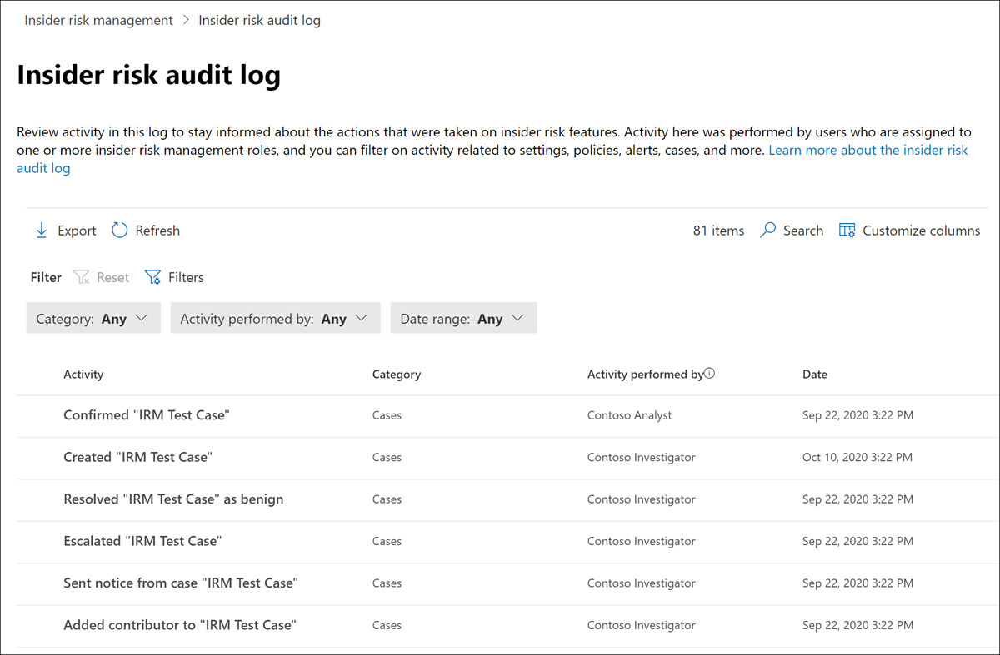

# 내부자 위험 관리 감사 로그

내부자 위험 관리 감사 로그를 사용하면 내부자 위험 관리 기능에 대해 수행된 작업에 대한 정보를 계속 알 수 있습니다. 이 로그를 사용하면 하나 이상의 내부자 위험 관리 역할 그룹에 할당된 사용자가 수행한 작업을 독립적으로 검토할 수 있습니다. 내부자 위험 관리 감사 로그는 조직에서 자동으로 사용하도록 설정되며 사용하지 않도록 설정할 수 없습니다.

감사 로그는 모니터링된 활동이 발생할 때마다 자동으로 즉시 업데이트되며 로그는 180일(약 6개월) 동안 활동에 대한 정보를 보존합니다. 180일이 지난 후 활동의 데이터는 로그에서 영구적으로 삭제됩니다.

활동 모니터링에 포함된 영역은 다음과 같습니다.

- 정책
- 사례
- 경고
- 설정
- 사용자
- 알림 템플릿

감사 로그에서 데이터를 보고 내보내기하려면 사용자를 내부자 위험 관리 또는 내부자 위험 관리 감사자 역할 그룹에 *할당해야* 합니다.  내부자 위험 관리 역할 그룹에 대한 자세한 내용은 내부자 위험 관리 1단계: 사용 권한 사용 [시작을 참조합니다.](insider-risk-management-configure.md#step-1-enable-permissions-for-insider-risk-management)

> [!NOTE]
> 내부자 위험 관리 감사 로그는 Microsoft 365 감사 로그와 연결되지 않습니다. 이러한 로그는 독립적인 감사 시스템으로, 별도의 활동에 대한 정보를 캡처합니다. 감사를 Microsoft 365 내부자 위험 관리 내의 활동 감사에는 영향을주지 않습니다.

## 내부자 위험 감사 로그에서 활동 보기

내부자 위험 관리에 대해 모니터링되는 기능 활동을 확인하려면 모든 내부자 위험 관리 탭의 오른쪽 위에 있는 내부자 위험 감사 로그 링크를 탐색하고 선택합니다.  기본적으로 내부자 위험 관리 활동에 대해 표시되는 정보는 다음과 같습니다.

- **활동:** 사용자가 내부자 위험 관리 솔루션 내에서 취한 활동에 대한 설명입니다.
- **범주:** 활동이 수행된 영역 또는 항목입니다. 예를 들어 정책 변경 활동이 수행된 경우 *정책이* 범주로 표시됩니다.
- **수행되는 활동:** 활동을 수행한 사용자의 사용자 이름입니다.
- **날짜:** 활동이 수행된 날짜 및 시간입니다. 날짜 및 시간은 조직의 로컬 날짜와 시간입니다.

기록된 활동에 대한 자세한 내용을 확인하려면 활동을 선택하여 활동 세부 정보 창을 표시합니다. 이 창에는 활동에 대한 추가 정보가 포함됩니다.

## 열 및 필터링

감사자는 기록된 활동을 보다 쉽게 검토할 수 있도록 내부자 위험 감사 로그에서 **필터링이 지원됩니다.** 기본 필터링의 경우 큐 열을 보기에 추가하여 파일 및 메시지에 서로 다른 피벗을 제공할 수 있습니다. 필드에서 수행한 **범주,** 날짜 범위 및 **활동별로 활동을 필터링할 수** 있습니다.

활동 큐에 대한 열 머리 제목을 추가하거나 제거하려면 열 사용자 지정 컨트롤을 **사용하여** 열 옵션에서 선택합니다. 이러한 열은 내부자 위험  감사 로그에서 지원되는 일반적인 조건에 매핑되어 있으며 이 문서의 뒷부분에 나와 있습니다.

## 감사 로그 내보내기

*내부자* 위험 관리 또는  내부자 위험 관리 감사자 역할 그룹에 할당된 사용자는 내부자 위험 감사 로그 페이지에서 내보내기  를 선택하여 감사 로그의 모든 활동을 .csv(콤보로 구분된 값) 파일로 내보낼 **수** 있습니다. 활동에 따라 활동에 대한 일부 필드가 활동에 적용되지 않을 수 있으며 이러한 필드는 내보낼 파일에 비어 있는 것으로 표시됩니다.

파일에는 다음 필드에 대한 활동 정보가 포함되어 있습니다.

- **수행되는 활동:** 항목 값을 수정하는 사용자의 사용자 이름입니다. 여기에 나열된 사용자는 내부자 위험 관리, 내부자 위험 관리 관리자, 내부자 위험 관리 분석가, 내부자 위험 관리 조사자 등 역할 내부자 위험 관리 역할 그룹 중 하나 이상에 *할당됩니다.*  각 역할 그룹에는 내부자 위험 기능을 관리하기 위한 사용 권한 수준이 다릅니다.
- **활동:** 항목에 대한 활동입니다. 값은 *보기, 삭제, 추가, 편집된 정책, 사례, 사용자,* 경고 *및 설정.*
- **추가된** 개체: 사용자, 파일 형식 또는 도메인과 같이 활동 중에 추가된 개체입니다.
- **경고 볼륨:** 내부자 위험 관리 설정에 정의된 경고 볼륨 수준입니다.
- **Amount**: 현재 선택한 정책에 대한 사용자 지정 표시기 금액입니다.
- **자산 ID:** 활동이 수행된 우선 순위 실제 자산의 자산 ID입니다.
- **범주:** 수정된 항목의 범주입니다. 값은 *정책, 사례, 사용자, 알림,* 설정 및 *알림 템플릿입니다.*
- **날짜:** 조직의 로컬 날짜 및 시간으로 나열된 날짜 및 시간입니다.
- **설명:** 사용자가 작업할 개체(예: 정책 또는 우선 순위 사용자 그룹)에 대한 설명 입력입니다.
- **DLP 정책:** 내부자 위험 관리 정책에 포함을 트리거하기 위해 선택된 DLP(데이터 손실 방지) 정책입니다.
- **표시기:** 활동이 수행된 내부자 위험 설정의 표시기(예: 표시기 추가 또는 제거)입니다.
- **알림 서식** 파일: 활동이 수행된 알림 서식 파일입니다.
- **일 수:** 내부자 위험 설정에 정의된 정책 활성화 창입니다.
- **파일 수:** 내부자 위험 관리 설정에 정의된 파일 볼륨 제한입니다.
- **정책 템플릿:** 표시기가 속해 있는 정책 템플릿입니다.
- **이전 금액:** 정책에 대해 이전에 선택한 사용자 지정 표시기 금액입니다.
- **우선 순위 사용자 그룹:** 활동이 수행된 우선 순위 사용자 그룹입니다.
- **제거됨:** 사용자, 파일 형식 또는 도메인과 같이 활동 중에 제거된 개체입니다.
- **보낸 사람**: 활동이 수행된 알림 서식 파일의 보낸 사람 필드입니다.
- **대상 정책:** 활동이 수행된 정책입니다(예: 사용자를 추가하거나 사용자에서 제거).
- **서식 파일 메시지 본문:** 활동이 수행된 알림 서식 파일 메시지 본문입니다.
- **서식 파일 제목:** 활동이 수행된 알림 서식 파일의 제목 필드입니다.
- **사용자:** 활동이 수행된 사용자입니다.
