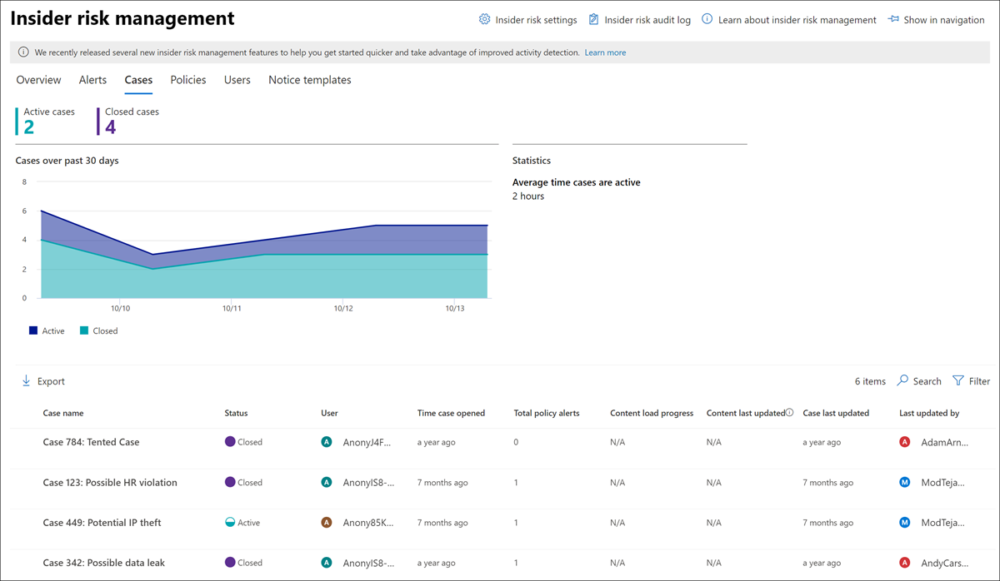
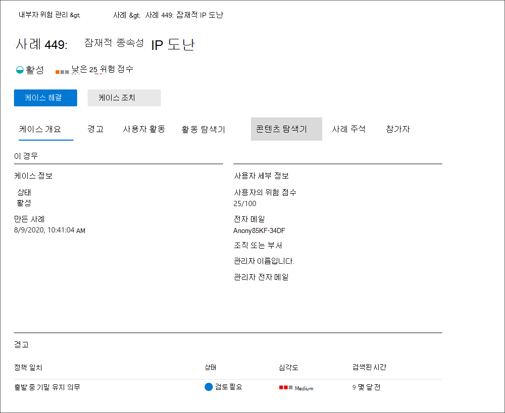
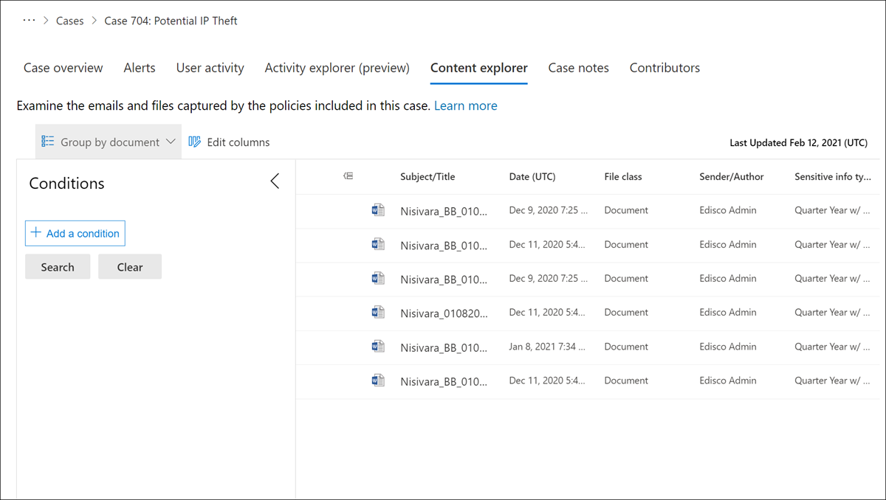

# 내부자 위험 관리 사례

사례는 내부자 위험 관리의 핵심이자 정책에 정의된 위험 지표로 생성된 문제를 심도 깊게 조사하고 이에 대해 작업할 수 있도록 합니다. 사용자에 대한 규정 준수 관련 문제를 해결하기 위해 추가 작업이 필요한 경우 경고에서 사례를 수동으로 생성합니다. 각 사례의 범위는 단일 사용자로 지정됩니다. 사용자에 대한 여러 경고를 기존 사례 또는 새 사례에 추가할 수 있습니다.

사례의 세부 정보를 조사한 후 다음을 수행하여 조치를 취할 수 있습니다.

- 사용자에게 알림 보내기
- 사례를 무해한 것으로 해소
- 서비스Now 인스턴스 또는 전자 메일 받는 사람과 사례 공유
- 조사에 대한 사례 Advanced eDiscovery 에스컬레이터

내부자  위험 관리에서 사례를 조사하고 관리하는 방법에 대한 개요를 확인한 후 내부자 위험 관리 조사 및 에스컬레이터 비디오를 참조하세요.

## 사례 대시보드

내부자 위험 관리 **사례 대시보드를** 사용하여 사례를 보고 이에 대한 행동을 할 수 있습니다. 대시보드의 각 보고서 위젯에는 지난 30일간의 정보가 표시됩니다.

- **활성 사례:** 조사를 진행하는 총 활성 사례 수입니다.
- **지난 30일** 동안의 사례: 활성 및 닫힌 상태를별로 정렬하여 만든 총 사례 *수입니다.* 
- **통계:** 시간, 일 또는 월에 나열된 활성 사례의 평균 시간입니다.

사례 큐에는 조직의 모든 활성 및 닫힌 사례와 다음 사례 특성의 현재 상태가 나열됩니다.

- **사례 이름:** 경고가 확인되고 사례가 만들어지면 정의되는 사례의 이름입니다.  
- **상태**: 사례의 *상태(활성* 또는 닫힌 *상태)입니다.*
- **사용자**: 사례에 대한 사용자입니다. 사용자 이름에 대한 동의어를 사용하도록 설정하면 비동기화된 정보가 표시됩니다.
- **Time case opened**: 사례가 열리기 전까지의 시간입니다.
- **총 정책 알림:** 사례에 포함된 정책 일치 횟수입니다. 이 숫자는 케이스에 새 경고가 추가된 경우 증가할 수 있습니다.
- **사례 마지막 업데이트:** 사례 상태가 추가되거나 변경된 이후로 지난 시간입니다.
- **마지막 업데이트 날짜:** 사례를 마지막으로 업데이트한 내부자 위험 관리 분석가 또는 조사자 이름입니다.

검색 **컨트롤을** 사용하여 특정 텍스트의 사례 이름을 검색하고 사례 필터를 사용하여 다음 특성을 사용하여 사례를 정렬합니다.

- 상태
- 케이스가 열린 시간, 시작 날짜 및 종료 날짜
- 마지막 업데이트, 시작 날짜 및 종료 날짜

## 사례 필터링

조직의 활성 내부자 위험 관리 정책의 수와 유형에 따라 대규모 사례 큐를 검토하는 것은 어려울 수 있습니다. 사례 필터를 사용하면 분석가와 조사자는 여러 특성을별로 사례를 정렬하는 데 도움이 될 수 있습니다. 사례 대시보드에서 알림을 **필터링하려면** 필터 **컨트롤을** 선택합니다. 하나 이상의 특성을 사용하여 사례를 필터링할 수 있습니다.

- **상태:** 하나 이상의 상태 값을 선택하여 사례 목록을 필터링합니다. 옵션은 활성 및 *닫힌* *입니다.*
- **시작된** 시간 사례: 사례가 열리면 시작 날짜와 종료 날짜를 선택합니다.
- **Last updated:** Select the start and end dates for when the case was updated.

## 사례 조사

내부자 위험 관리 경고에 대한 심층 조사는 적절한 수정 조치를 취하는 데 중요합니다. 내부자 위험 관리 사례는 사용자 위험 활동 기록, 경고 세부 정보, 위험 이벤트 순서를 자세히 살펴보고 위험에 노출된 콘텐츠 및 메시지를 탐색하는 중앙 관리 도구입니다. 위험 분석가와 조사자는 사례를 사용하여 검토 피드백 및 메모를 중앙 집중화하고 사례 해결을 처리합니다.

케이스를 선택하면 케이스 관리 도구가 열리고 분석가 및 조사자가 케이스의 세부 정보를 조사할 수 있습니다.

### 케이스 개요

사례 **개요 탭에는** 위험 분석가 및 조사자에 대한 사례 세부 정보가 요약됩니다. 이 정보 영역에는 다음 **정보가 포함됩니다.**

- **Status:** 활성 또는 닫힌 사례의 현재 상태입니다.
- **만든 사례:** 사례를 만든 날짜 및 시간입니다.
- **사용자의 위험 점수:** 사례에 대한 사용자의 현재 계산된 위험 수준입니다. 이 점수는 24시간마다 계산하며 사용자와 연결된 모든 활성 경고의 경고 위험 점수를 사용 합니다.
- **전자** 메일 : 사례에 대한 사용자의 전자 메일 별칭입니다.
- **조직 또는 부서:** 사용자가 할당된 조직 또는 부서입니다.
- **관리자 이름:** 사용자의 관리자 이름입니다.
- **관리자 전자 메일:** 사용자 관리자의 전자 메일 별칭입니다.

사례 **개요 탭에는**  사례와 연결된 정책 일치 경고에 대한 다음 정보가 포함된 경고 섹션도 포함되어 있습니다.

- **정책 일치:** 사용자 활동에 대한 일치 경고와 연결된 내부자 위험 관리 정책의 이름입니다.
- **Status:** 경고의 상태입니다.
- **심각도:** 경고의 심각도입니다.
- **검색된 시간:** 경고가 생성된 후 지났던 시간입니다.

### 경고

경고 **탭에는** 사례에 포함된 현재 경고가 요약됩니다. 새 경고는 기존 사례에 추가될 수 있으며  할당된 경고 큐에 추가됩니다. 큐에 나열된 경고 특성은 다음과 같습니다.

- 상태
- 심각도
- 검색된 시간

경고 세부 정보 페이지를 표시하려면 큐에서 **경고를** 선택합니다.

검색 컨트롤을 사용하여 특정 텍스트에 대한 경고 이름을 검색하고 경고 필터를 사용하여 다음 특성을 사용하여 사례를 정렬합니다.

- 상태
- 심각도
- 감지된 시간, 시작 날짜 및 종료 날짜

필터 컨트롤을 사용하여 다음을 비롯한 여러 특성으로 경고를 필터링할 수 있습니다.

- **상태:** 경고 목록을 필터링하려면 상태 값을 하나 이상 선택합니다. 옵션은 *확인됨*, *무시됨*, *검토 필요* 및 *해결됨* 입니다.
- **심각도:** 경고 목록을 필터링하려면 경고 위험 심각도 수준을 하나 이상 선택합니다. 옵션은 *높음*, *중간* 및 *낮음* 입니다.
- **검색된 시간:** 경고가 만들어진 시작 날짜와 종료 날짜를 선택합니다.
- **정책:** 하나 이상의 정책을 선택하여 선택한 정책에 의해 생성된 경고를 필터링합니다.

### 사용자 활동

**사용자 작업** 탭은 내부 위험 분석 및 내부 위험 관리 솔루션 케이스 조사를 위한 가장 강력한 도구 중 하나입니다. 이 탭은 모든 경고의 기록 타임라인, 경고 세부 정보, 해당 사용자의 현재 위험 점수, 위험 이벤트의 순서 및 해당 사례의 위험을 포함하도록 효과적인 조치를 취하는 컨트롤을 포함하여 사례를 빠르게 검토할 수 있도록 구성됩니다.

1. **시간 필터:** 기본적으로 사례에서 확인된 최근 6개월의 알림이 사용자 활동 차트에 표시됩니다. 거품형 차트에서 *6개월,* *3개월* 또는 *1개월* 탭을 선택하여 차트 보기를 쉽게 필터링할 수 있습니다.
2. **위험 경고 활동 및 세부 정보:** 위험 활동은 사용자 활동 차트에서 색이 있는 거품으로 시각적으로 표시됩니다. 거품은 다양한 위험 범주에 대해 만들어지며 거품 크기는 해당 범주에 대한 위험 활동 수에 비례합니다. 거품을 선택하여 각 위험 활동에 대한 세부 정보를 표시합니다. 세부 정보는 다음과 같습니다.
    - 위험 활동의 **날짜** 입니다.
    - 위험 **활동 범주입니다.** 예를 들어 *조직* 외부로 보낸 첨부 파일이 있는 전자 메일 또는 온라인 에서 다운로드한 *SharePoint 있습니다.*
    - 경고에 대한 **위험 점수** 입니다. 이 점수는 경고 위험 심각도 수준에 대한 숫자 점수입니다.
    - 경고와 연결된 이벤트 수입니다. 위험 활동과 연결된 각 파일 또는 전자 메일에 대한 링크도 사용할 수 있습니다.
3. **위험 순서(미리 보기)**: 위험 활동의 시간 순서는 위험 조사의 중요한 측면으로, 이러한 관련 활동을 식별하는 것은 조직의 전반적인 위험을 평가하는 데 중요한 부분입니다. 관련 경고 활동은 연결선과 함께 표시되어 이러한 활동이 더 큰 위험 영역과 연결됩니다. 이러한 활동 보기는 조사자는 격리 또는 일회용 이벤트로 표시될 수 있는 위험 활동에 대해 문자 그대로 '점 연결'을 도울 수 있습니다. 순서에서 거품을 선택하여 모든 관련 위험 활동에 대한 세부 정보를 표시합니다. 세부 정보는 다음과 같습니다.

    - **시퀀스의** 이름입니다.
    - **시퀀스의** **날짜 또는** 날짜 범위입니다.
    - **시퀀스에** 대한 위험 점수입니다. 이 점수는 시퀀스의 각 관련 활동에 대해 결합된 경고 위험 심각도 수준의 시퀀스에 대한 숫자 점수입니다.
    - 순서대로 각 경고와 **연결된 이벤트 수입니다.** 각 위험 활동과 연결된 각 파일 또는 전자 메일에 대한 링크도 사용할 수 있습니다.
    - **순서대로 활동을 표시** 거품형 차트에서 시퀀스를 강조선으로 표시하고 경고 세부 정보를 확장하여 모든 관련 경고를 시퀀스에 표시합니다.

4. **위험 활동 범례:** 사용자 활동 차트 아래쪽에서 색으로 코딩된 범례를 사용하면 각 경고에 대한 위험 범주를 빠르게 확인할 수 있습니다.
5. **위험 활동 연도:** 해당 경고 거품에서 사용할 수 있는 모든 세부 정보를 포함하여 사례와 관련된 모든 위험 경고의 전체 연대표가 나열됩니다.
6. **사례 작업:** 사례를하기 위한 옵션이 사례 작업 도구 모음에 있습니다. 사례를 해결하거나 사용자에게 전자 메일 통지를 보내거나 데이터 또는 사용자 조사를 위해 사례를 에스컬레이터할 수 있습니다.

### 활동 탐색기(미리 보기)

> [!IMPORTANT]
> 조직에서 이 기능을 사용할 수 있는 후 이벤트를 트리거하는 사용자의 경우 활동 탐색기 탭을 사용할 수 있습니다.

활동 **탐색기** 탭을 사용하면 위험 분석가와 조사자는 위험 경고와 관련된 활동 세부 정보를 검토할 수 있습니다. 예를 들어 사례 관리 작업의 일부로 조사자 및 분석가가 사례와 관련된 모든 위험 활동을 검토하여 자세한 내용을 검토해야 할 수 있습니다. 활동 **탐색기를** 사용하여 검토자는 감지된 위험한 활동의 타임라인을 신속하게 검토하고 경고와 관련된 모든 위험 활동을 식별하고 필터링할 수 있습니다.

활동 탐색기에 대한 자세한 내용은 [Insider risk management alerts 문서를 참조하세요.](insider-risk-management-activities.md#activity-explorer)

### 콘텐츠 탐색기

콘텐츠 **탐색기** 탭을 통해 위험 조사자는 위험 경고와 관련된 모든 개별 파일 및 전자 메일 메시지의 복사본을 검토할 수 있습니다. 예를 들어 사용자가 SharePoint Online에서 수백 개의 파일을 다운로드할 때 경고가 생성되어 활동이 정책 경고를 트리거하면 경고에 대한 모든 다운로드된 파일이 캡처되어 원본 저장소 원본에서 내부자 위험 관리 사례에 복사됩니다.

콘텐츠 탐색기는 기본 및 고급 검색 및 필터링 기능이 있는 강력한 도구입니다. 콘텐츠 탐색기 사용에 대한 자세한 내용은 [Insider risk management Content explorer 를 참조하세요.](insider-risk-management-content-explorer.md)

### 사례 주석

이 **경우 사례** 메모 탭에서는 위험 분석가와 조사자는 사례에 대한 작업과 관련한 의견, 피드백 및 정보를 공유합니다. 노트는 케이스에 영구적인 추가사항이며 노트가 저장된 후에는 편집하거나 삭제할 수 없습니다. 경고에서 케이스가 생성되면 **경고 확인 및 내부자 위험 케이스** 대화 상자에 입력한 설명이 자동으로 케이스 노트로 추가됩니다.

사례 메모 대시보드에는 메모를 만든 사용자의 메모와 메모가 저장된 이후로 지났던 시간이 표시됩니다. 사례 메모 텍스트 필드에서 특정 키워드를  검색하기 위해 사례 대시보드의 검색 단추를 사용하여 특정 키워드를 입력합니다.

사례에 메모를 추가하는 경우:

1. 에서 [Microsoft 365 규정 준수 센터](https://compliance.microsoft.com)내부자 위험 **관리로 이동하고** 사례 **탭을** 선택합니다.
2. 사례를 선택한 다음 사례 메모 **탭을** 선택합니다.
3. 사례 **메모 추가를 선택합니다.**
4. 사례 **메모 추가 대화** 상자에서 사례에 대한 메모를 입력합니다. **사례에** 메모를 추가하려면 저장을  선택하거나 메모를 사례에 저장하지 않고 닫기 닫기 를 선택합니다.

### 참가자

케이스의 **참가자** 탭에서는 위험 분석가 및 조사자가 케이스에 다른 검토자를 추가할 수 있습니다. 기본적으로 내부자 위험  관리 분석가 및 내부자 위험 관리 조사자 역할이 할당된 모든 사용자는 활성 및 닫힌 각 사례에 대해 참가자로 나열됩니다.  내부자 위험  관리 조사자 역할이 할당된 사용자만 콘텐츠 탐색기에서 파일 및 메시지를 볼 수 있는 권한이 있습니다.

사용자를 참가자로 추가하여 사례에 대한 임시 액세스 권한을 부여할 수 있습니다. 참가자는 다음을 제외한 특정 사례에 대한 모든 사례 관리 제어를 하게 됩니다.

- 경고 확인 또는 해제 권한
- 케이스의 참가자 편집 권한
- 콘텐츠 탐색기에서 파일 및 메시지를 볼 수 있는 권한

사례에 참가자를 추가하는 경우:

1. 에서 [Microsoft 365 규정 준수 센터](https://compliance.microsoft.com)내부자 위험 **관리로 이동하고** 사례 **탭을** 선택합니다.
2. 사례를 선택한 다음 참가자 **탭을** 선택합니다.
3. 참가자 **추가를 선택합니다.**
4. 참가자 **추가 대화** 상자에서 추가할 사용자의 이름을 입력한 다음 제안된 사용자 목록에서 사용자를 선택합니다. 이 목록은 테넌트 구독의 Azure Active Directory 생성됩니다.
5. 사용자를  참가자로 추가하려면 추가를 선택하거나, 참가자로 사용자를 추가하지 않고 대화 상자 닫기 취소를 선택합니다. 

## 케이스 조치

위험 조사자는 사례의 심각도, 사용자의 위험 내역 및 조직의 위험 지침에 따라 여러 방법 중 하나에서 사례에 대해 조치를 취할 수 있습니다. 경우에 따라 사례를 사용자 또는 데이터 조사로 에스컬레이터하여 조직의 다른 영역과 공동 작업을 진행하고 위험 활동을 심층적으로 조사해야 할 수 있습니다. 내부자 위험 관리는 종단 Microsoft 365 관리에 도움이 되는 기타 규정 준수 솔루션과 긴밀하게 통합되어 있습니다.

### 전자 메일 알림 보내기

대부분의 경우 내부자 위험 경고를 만드는 사용자 작업은 실수로 발생하거나 우발적입니다. 전자 메일을 통해 사용자에게 미리 알림 보내기 방법은 사례 검토 및 작업을 문서화하는 효과적인 방법으로, 사용자에게 회사 정책을 알리거나 교육을 재개하도록 알리는 방법입니다. 알림은 내부자  위험 관리 인프라에 대해 만든 알림 템플릿에서 생성됩니다.

사용자 *에게 전자 메일 알림 보내기 ***는***로 사례를 해결하지 않는다는 점에 유의해야 _Closed* 경우에 따라 사용자에게 알림 메시지를 보내 새 사례를 열지 않고 더 많은 위험 활동을 찾아보는 경우도 있습니다. 알림 전송 후 케이스를 해결하려면 알림 전송 후 후속 단계로 **해결 케이스** 를 선택해야 합니다.

사례에 할당된 사용자에게 통지를 보내기 위해 다음을 합니다.

1. 에서 [Microsoft 365 규정 준수 센터](https://compliance.microsoft.com)내부자 위험 **관리로 이동하고** 사례 **탭을** 선택합니다.
2. 사례를 선택한 다음  사례 작업 도구 모음에서 전자 메일 알림 보내기 단추를 선택합니다.
3. 전자 **메일 알림 보내기 대화** 상자에서 알림 서식 파일 선택 **드롭다운** 컨트롤을 선택하여 알림의 알림 서식 파일을 선택합니다. 이 선택 영역은 알림의 다른 필드를 미리 채우게 됩니다.
4. 알림 필드를 검토하고 적절하게 업데이트합니다. 여기에 입력한 값은 템플릿의 값을 다시 정의합니다.
5. 사용자에게  통지를 보내기 위해 보내기 를 선택하거나 사용자에게 통지를 보내지 않고 대화 상자 닫기 취소를 선택합니다.  보낸 모든 알림은 사례 메모 대시보드의 사례 메모 **큐에 추가됩니다.**

### 조사를 위한 에스컬레이션

사용자의 위험 활동에 대해 추가 법적 검토가 필요한 상황에서 사용자 조사 사례를 에스컬레이터합니다. 이 에스컬레이션은 Microsoft 365 조직의 새로운 Advanced eDiscovery 케이스를 엽니다. Advanced eDiscovery는 조직의 내부 및 외부 법률 조사에 대응하는 컨텐츠를 보존, 수집, 검토, 분석 및 내보낼 수 있는 엔드 투 엔드 워크플로우를 제공합니다. 또한 법률 팀이 전체 법적 보류 알림 워크플로를 관리하여 사건에 관련된 관리자와 통신할 수 있도록 합니다. 내부자 위험 관리 케이스에서 생성된 Advanced eDiscovery 케이스에서 검토자를 관리자로 할당하면 법률 팀이 적절한 조치를 취하고 콘텐츠 보존을 관리하는 데 도움이 됩니다. Advanced eDiscovery 케이스에 대한 자세한 내용은 [Microsoft 365의 Advanced eDiscovery 개요](overview-ediscovery-20.md)를 참조하세요.

사례를 사용자 조사로 에스컬레이터합니다.

1. 에서 [Microsoft 365 규정 준수 센터](https://compliance.microsoft.com)내부자 위험 **관리로 이동하고** 사례 **탭을** 선택합니다.
2. 사례를 선택한 다음 사례 작업 도구 모음에서 조사를 위해 **에스컬레이터** 단추를 선택합니다.
3. 조사 **에스컬레이터 대화** 상자에서 새 사용자 조사의 이름을 입력합니다. 필요한 경우 사례에 대한 메모를 입력하고 **에스컬레이터를 선택합니다.**
4. 알림 필드를 검토하고 적절하게 업데이트합니다. 여기에 입력한 값은 템플릿의 값을 다시 정의합니다.
5. **확인을** 선택하여 사용자 조사 사례를 만들거나 취소를 선택하여 새 사용자 조사 사례를 만들지 않고 대화 상자를 닫습니다. 

내부자 위험 관리 사례가 새 사용자 조사 사례로 에스컬레이터된 후 내부자 위험 관리 사례의 **eDiscovery** 고급 영역에 있는 새 사례를 검토할  >   Microsoft 365 규정 준수 센터.

### 사례의 흐름을 Power Automate 자동화된 작업 실행

권장되는 Power Automate 흐름을 사용하여 위험 조사자 및 분석가가 신속하게 다음 작업을 할 수 있습니다.

- 내부자 위험 사례의 사용자에 대한 HR 또는 비즈니스의 정보 요청
- 사용자에게 내부자 위험 경고가 표시될 때 관리자에게 알림
- ServiceNow에서 내부자 위험 관리 사례에 대한 레코드 만들기
- 내부자 위험 정책에 추가될 때 사용자에게 알림

내부자 위험 관리 사례에 Power Automate 흐름을 실행, 관리 또는 만들 수 있습니다.

1. 사례 **작업 도구** 모음에서 자동화를 선택합니다. 
2. 실행할 Power Automate 흐름을 선택한 다음 **흐름 실행을 선택합니다.** 
3. 흐름이 완료된 후 완료 를 **선택합니다.**

내부자 위험 관리의 Power Automate 흐름에 대한 자세한 내용은 내부자 위험 관리 설정 [시작을 참조하세요.](insider-risk-management-settings.md#power-automate-flows-preview)

### 사례에 대한 Microsoft Teams 팀 보기 또는 만들기

설정에서 Microsoft Teams 내부자 위험 관리에 대한 통합을 사용하도록 설정하면 경고가 Microsoft Teams 사례가 생성될 때마다 Microsoft Teams 팀이 자동으로 만들어집니다. 위험 조사자 및 분석가가 사례 작업 도구 모음에서 Microsoft Teams 팀 보기를 선택하여 사례를 위해 팀으로 Microsoft Teams 신속하게 이동할 수 있습니다. 

Microsoft 팀 통합을 사용하도록 설정하기 전에 연 사례의 경우 위험 조사자 및 분석가가 사례 작업 도구 모음에서 Microsoft Teams 팀 만들기를 선택하여 사례에 대한 새 Microsoft Teams 팀을 만들 수 있습니다. 

사례가 해결되면 연결된 Microsoft 팀이 자동으로 보관됩니다(숨겨져 읽기 전용으로 설정).

내부자 위험 관리에 대한 Microsoft Teams 자세한 내용은 내부자 위험 관리 설정 [시작을 참조하세요.](insider-risk-management-settings.md#microsoft-teams-preview)

### 케이스 해결

위험 분석가와 조사자는 검토 및 조사를 완료한 후 사례를 해결하여 현재 해당 사례에 포함된 모든 경고에 대한 작업을 할 수 있습니다. 사례를 해결하면 해결 분류가 추가되고, 사례 상태가 Closed로 변경되며, 해결 작업 이유가 사례 메모 대시보드의 사례 메모 큐에 자동으로 **추가됩니다.** 케이스는 다음 중 하나로 해결됩니다.

- **양성:** 정책 일치 경고가 낮은 위험, 심각하지 않은 또는 가음성으로 평가되는 경우의 분류입니다.
- **확정된 정책 위반:** 정책 일치 경고가 위험, 심각 또는 악의적인 의도의 결과로 평가되는 경우의 분류입니다.

사례를 해결합니다.

1. 에서 [Microsoft 365 규정 준수 센터](https://compliance.microsoft.com)내부자 위험 **관리로 이동하고** 사례 **탭을** 선택합니다.
2. 사례를 선택한 다음  사례 작업 도구 모음에서 사례 해결 단추를 선택합니다.
3. 사례 **해결 대화** 상자에서 **다음으로** 해결 드롭다운 컨트롤을 선택하여 사례에 대한 해결 분류를 선택합니다. 옵션은 **무해하거나 확인된** 정책 **위반입니다.**
4. **대소문자 확인 대화** 상자의 작업 수행 텍스트 필드에 확인 분류 **이유를** 입력합니다.
5. **사례를** 닫거나 사례를  확인하지 않고 대화 상자 닫기 취소를 선택합니다.
