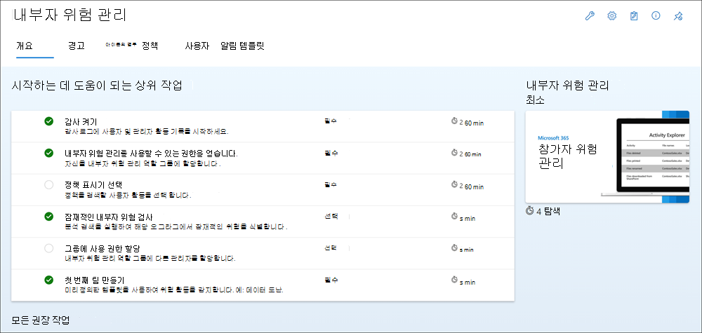

# 내부자 위험 관리 시작

내부자 위험 관리 정책을 사용하여 조직의 위험 경고에 대한 작업을 위한 위험한 활동 및 관리 도구를 식별합니다. 다음 단계를 완료하여 선행 구성을 설정하고 내부자 위험 관리 정책을 구성합니다.

> [!IMPORTANT]
> Microsoft 365 내부자 위험 관리 솔루션은 고객이 사용자 수준에서 내부 거버넌스를 용이하게 하는 데 도움이 되는 테넌트 수준 옵션을 제공합니다. 테넌트 수준 관리자는 조직의 구성원에게 이 솔루션에 대한 액세스를 제공하고 잠재적으로 위험한 활동의 사용자 수준 식별을 지원하기 위해 관련 데이터를 Microsoft 365 규정 준수 센터 데이터 커넥터를 설정하는 권한을 설정할 수 있습니다. 고객은 고용과 실질적으로 관련된 개별 사용자의 동작, 문자 또는 성과와 관련된 인사이트를 관리자가 계산하여 조직의 다른 사용자가 사용할 수 있도록 할 수 있습니다. 또한 고객은 내부자 위험 관리 서비스의 인사이트만이 아니라 고용과 실질적으로 관련된 개별 사용자의 동작, 문자 또는 성과와 관련된 자체적인 조사를 실시해야 한다는 사실도 인정합니다. 고객은 개별 사용자 식별 및 수정 조치와 관련된 법률을 포함하여 Microsoft 365 내부자 위험 관리 서비스 및 모든 관련 법률을 준수하는 모든 관련 기능 또는 서비스를 사용할 책임이 있습니다.

내부자 위험 정책이 조직의 위험을 관리하는 데 도움이 되는 방법에 대한 자세한 내용은 [insider risk management in Microsoft 365.](insider-risk-management.md)

## 구독 및 라이선스

내부자 위험 관리를 시작하기 전에 Microsoft 365 추가  기능을 확인해야 합니다. 내부자 위험 관리에 액세스하고 사용하려면 조직에 다음 구독 또는 추가 기능 중 하나가 있어야 합니다.

- Microsoft 365 E5/A5/G5 구독(유료 또는 평가판)
- Microsoft 365 E3/A3/G3 구독 + Microsoft 365 E5/A5/G5 준수 추가 기능
- Microsoft 365 E3/A3/G3 구독 + Microsoft 365 E5/A5/G5 내부자 위험 관리 추가 기능
- Office 365 E3 구독 + Enterprise Mobility 및 Security E3 + Microsoft 365 E5 Compliance 추가 기능

내부자 위험 관리 정책에 포함된 사용자에게 위의 라이선스 중 하나를 할당해야 합니다.

기존 Microsoft 365 Enterprise E5 요금제가 없는 경우 내부자 위험 관리를 시도하려면 기존  구독에 Microsoft 365 추가하거나 E5 평가판을 등록할 Microsoft 365 Enterprise 있습니다. 

## 권장 작업(미리 보기)

권장 조치는 조직이 빠르게 시작하고 내부자 위험 관리 기능을 가장 잘 아는 데 도움이 될 수 있습니다. 개요 페이지에 **포함된** 권장 작업은 정책을 구성 및 배포하는 단계를 안내하고 정책 일치에서 경고를 생성하는 사용자 작업에 대한 조사 작업을 수행할 수 있도록 합니다.

다음과 같은 권장 사항을 통해 내부자 위험 관리 구성을 시작하거나 최대화할 수 있습니다.

- **감사 켜기:** 켜져 있는 경우 조직의 사용자 및 관리자 활동이 감사 로그에 Microsoft 365 기록됩니다. 내부자 위험 정책 및 분석 검사는 이 로그를 사용하여 위험 활동을 감지합니다.
- **사용자 위험** 관리에 대한 사용 권한 얻기: 내부자 위험 관리 기능에 대한 액세스 수준은 할당된 역할 그룹에 따라 달라 습니다. 권장 작업에 액세스하고 구성하려면 사용자를 *Insider Risk Management* 또는 *Insider Risk Management Admins* 역할 그룹에 할당해야 합니다.
- **정책 표시기 선택:** 표시기는 기본적으로 검색하고 조사하려는 사용자 활동입니다. 여러 위치 및 서비스에서 활동을 추적하는 표시기를 Microsoft 365 수 있습니다.
- **잠재적인 내부자 위험** 검사: 분석 검색을 실행하여 자신의 내부자에서 발생할 수 있는 내부자 위험을 검색합니다. 결과를 평가한 후 권장 정책을 검토하여 설정합니다.
- **다른 사용자에게** 사용 권한 할당: 내부자 위험 기능 관리를 담당할 추가 팀 구성원이 있는 경우 적절한 역할 그룹에 할당해야 합니다.
- **첫 번째 정책** 만들기: 잠재적으로 위험한 활동에 대한 알림을 받으하려면 검색 및 조사할 사용자 활동을 정의하는 미리 정의한 템플릿을 기반으로 정책을 설정해야 합니다.
- **활동 점수가 지정된** 사용자 검토  : 사용자 대시보드를 사용하면 해당 활동이 경고를 생성하기 위한 임계값을 충족하는지 여부에 관계없이 활동이 현재 위험 점수로 할당된 사용자를 볼 수 있습니다.
- **경고 검토:** 사용자에 대해 트리거 이벤트가 발생하면 정책이 감지된 활동에 위험 점수를 할당하기 시작합니다. 위험 점수가 정책의 임계값을 충족하면 해당 사용자에 대해 점수가 주어지고 있는 모든 활동에 대한 자세한 분석이 포함된 경고가 표시됩니다.
- **사례 조사:** 잠재적인 내부자 위험을 식별하기 위해 추가 조사가 필요한 경우 경고에서 사례가 수동으로 만들어집니다. 각 사례의 범위는 단일 사용자로 지정됩니다. 사용자에 대한 여러 경고를 기존 사례 또는 새 사례에 추가할 수 있습니다.

이 경험에 포함된 각 권장 작업은 네 가지 특성으로 제공됩니다.

- **작업:** 권장 작업의 이름 및 설명입니다.
- **상태:** 권장 작업의 상태입니다. 값이 *시작되지 않습니다.* *진행 중,* *나중에 저장* 또는 *완료되었습니다.*
- **필수 또는 선택** 사항: 내부자 위험 관리 기능이 예상대로 작동하기 위해 권장 작업이 필요한지 또는 선택 사항인지 여부입니다.
- **예상 완료 시간:** 권장 작업을 완료하는 데 소요되는 예상 시간(분)입니다.

목록에서 권장을 선택하여 내부자 위험 관리 구성을 시작할 수 있습니다. 권장되는 각 작업은 요구 사항, 예상되는 작업 및 조직에서 기능을 구성하는 영향 등 권장 사항에 필요한 작업을 안내합니다.   각 권장 작업은 구성 시 자동으로 완료된 것으로 표시되거나 구성 시 작업을 완료된 것으로 수동으로 선택해야 합니다.

## 1단계(필수): 내부자 위험 관리에 대한 사용 권한 사용

> [!IMPORTANT]
> 역할 그룹을 구성한 후 역할 그룹 사용 권한을 조직 전체의 할당된 사용자에게 적용하는 데 최대 30분이 걸릴 수 있습니다.

내부자 위험 관리 기능을 관리하기 위한 권한을 구성하는 데 사용되는 네 가지 역할 그룹이 있습니다. 이러한 구성 단계를 계속하려면 테넌트 관리자가 먼저 내부자 위험 관리 또는 내부자 위험 관리 관리자 역할 그룹에 **할당해야** 합니다.  초기 구성 후 내부자 위험 관리 기능에 액세스하고 관리하려면 사용자가 하나 이상의 내부자 위험 관리 역할 그룹의 구성원이 되어야 합니다.

>[!IMPORTANT]
>특정 사용자가 조직을 떠나는 경우  내부자 위험  관리 구성이 '관리자 0' 시나리오에 액세스하지 못하도록 내부자 위험 관리 또는 내부자 위험 관리 관리자 역할 그룹(선택한 옵션에 따라)에 항상 한 명 이상의 사용자가 있는지 확인

규정 준수 관리 팀의 구조에 따라 사용자를 특정 역할 그룹에 할당하여 다양한 내부 위험 관리 기능 세트를 관리할 수 있는 옵션이 있습니다. 조직에서  사용 권한 탭을 Microsoft 365 규정 준수 센터 관리하려면 조직 관리 역할 그룹에 할당하거나 역할 관리 역할을 *할당해야* 합니다.  내부자 위험 관리를 구성할 때 다음 역할 그룹 옵션 중 선택합니다.

| **역할 그룹** | **역할 권한** |
| :------------- | :------------------- |
| **내부 위험 관리** | 이 역할 그룹을 사용하여 조직의 내부 위험 관리를 단일 그룹으로 관리할 수 있습니다. 지정된 관리자, 분석가, 조사자 및 감사자에 대한 모든 사용자 계정을 추가하여 단일 그룹에서 내부자 위험 관리 권한을 구성할 수 있습니다. 이 역할 그룹에는 모든 내부자 위험 관리 권한 역할 및 관련 권한이 포함되어 있습니다. 이 구성은 내부자 위험 관리를 빠르게 시작하는 가장 쉬운 방법으로, 별도의 사용자 그룹에 대해 정의된 별도의 권한이 필요하지 않은 조직에 적합한 구성입니다. **_이 구성을_** 사용하는 경우 정책이 예상대로 작동하도록 보장하고 사용자가 정책을 만들고 편집하고 솔루션 설정을 구성하고 정책 상태 경고를 검토할 수 있도록 항상 이 역할 그룹에 할당된 사용자를 한명 이상 지정해야 합니다.|
| **내부자 위험 관리 관리자** | 이 역할 그룹을 사용하여 초기에 내부자 위험 관리를 구성하고 나중에 내부자 위험 관리자를 정의된 그룹으로 구분합니다. 이 역할 그룹의 사용자는 분석 정보를 사용하도록 설정하고 보고 내부자 위험 관리 정책, 전역 설정 및 역할 그룹 할당을 만들고 읽고 업데이트하고 삭제할 수 있습니다. **_이 구성을_** 사용하는 경우 정책이 예상대로 작동하도록 보장하고 사용자가 정책을 만들고 편집하고 솔루션 설정을 구성하고 정책 상태 경고를 검토할 수 있도록 항상 이 역할 그룹에 할당된 사용자를 한명 이상 지정해야 합니다. |
| **내부자 위험 관리 분석가** | 이 그룹을 사용하여 내부 위험 케이스 분석가 역할을 하는 사용자에게 권한을 할당합니다. 이 역할 그룹의 사용자는 모든 내부자 위험 관리 경고, 사례, 분석 정보 및 알림 템플릿에 액세스하여 볼 수 있습니다. 내부자 위험 콘텐츠 탐색기에는 액세스할 수 없습니다. |
| **내부자 위험 관리 조사자** | 이 그룹을 사용하여 내부 위험 데이터 조사자 역할을 할 사용자에게 권한을 할당합니다. 이 역할 그룹의 사용자는 모든 내부자 위험 관리 경고, 사례, 알림 서식 파일 및 모든 경우에 대한 콘텐츠 탐색기에 액세스할 수 있습니다. |
| **내부자 위험 관리 감사자** | 이 그룹을 사용하여 내부자 위험 관리 활동을 감사할 사용자에게 사용 권한을 할당합니다. 이 역할 그룹의 사용자는 내부자 위험 감사 로그에 액세스할 수 있습니다. 이 역할 그룹의 사용자는 권장 작업(미리 보기) 기능에 액세스하여 사용할 수 없습니다.|

> [!NOTE]
> 이러한 역할 그룹은 현재 PIM(Privileged Identity Management 지원되지 않습니다. PIM에 대한 자세한 내용은 에서 Azure AD 역할 [할당을 Privileged Identity Management.](/azure/active-directory/privileged-identity-management/pim-how-to-add-role-to-user)

### 내부자 위험 관리 역할 그룹에 사용자 추가

다음 단계를 완료하여 내부자 위험 관리 역할 그룹에 사용자를 추가합니다.

1. 조직에서 <a href="https://go.microsoft.com/fwlink/p/?linkid=2077149" target="_blank">Microsoft 365 규정 준수 센터</a> 계정의 자격 증명을 사용하여 로그인합니다Microsoft 365.

2. 보안 및 &amp; 준수 센터에서 사용 **권한 으로 이동 합니다.** 웹에서 역할을 보고 관리하려면 링크를 Office 365.

3. 사용자를 추가할 내부자 위험 관리 역할 그룹을 선택한 다음 역할 그룹 **편집 을 선택합니다.**

4. 왼쪽 **탐색 창에서** 구성원 선택을 선택한 다음 편집 **을 선택합니다.**

5. **추가를** 선택한 다음 역할 그룹에 추가할 모든 사용자에 대한 확인란을 선택합니다.

6. **추가** 를 선택한 다음 **완료** 를 선택합니다.

7. **저장을** 선택하여 역할 그룹에 사용자를 추가합니다. 닫기 **를** 선택하여 단계를 완료합니다.

## 2단계(필수): 감사 Microsoft 365 사용

내부자 위험 관리는 Microsoft 365 및 분석 인사이트에서 식별된 사용자 인사이트 및 활동에 대한 감사 로그를 활용합니다. 감사 Microsoft 365 로그는 조직 내의 모든 활동을 요약한 것으로, 내부자 위험 관리 정책은 정책 정보를 생성하는 데 이러한 활동을 사용할 수 있습니다.

감사는 기본적으로 Microsoft 365 사용하도록 설정되어 있습니다. 일부 조직에서는 특정 이유로 감사를 사용하지 않도록 설정한 경우도 있습니다. 조직에서 감사를 사용하지 않도록 설정한 경우 다른 관리자가 감사 기능을 해제한 것일 수 있습니다. 이 단계를 완료할 때 감사를 다시 설정하는 것이 좋습니다.

감사를 켜는 단계별 지침은 감사 로그 검색 켜기 또는 [끄기 를 참조하세요.](turn-audit-log-search-on-or-off.md) 감사를 설정하면 감사 로그가 준비되고 있으며 준비가 완료된 후 몇 시간 내에 검색을 실행할 수 있다는 메시지가 표시됩니다. 이 작업은 한 번만 수행하면 됩니다. 감사 로그를 사용하는 Microsoft 365 자세한 내용은 감사 로그 [검색을 참조하세요.](search-the-audit-log-in-security-and-compliance.md)

## 3단계(선택 사항): 내부자 위험 분석 인사이트를 사용하도록 설정하고 볼 수 있습니다.

내부자 위험 관리 분석을 사용하면 내부자 위험 정책을 구성하지 않고도 조직에서 잠재적인 내부자 위험을 평가할 수 있습니다. 이 평가는 조직에서 사용자 위험이 큰 잠재적 영역을 식별하고 구성을 고려할 수 있는 내부 위험 관리 정책의 유형과 범위를 결정하는 데 도움이 될 수 있습니다. 이 평가는 기존 정책의 추가 라이선싱 또는 향후 최적화에 대한 요구 사항을 결정하는 데에도 도움이 될 수 있습니다. 분석 검사 결과가 검토를 위해 보고서로 제공되기까지 최대 48시간이 걸릴 수 있습니다. 분석 인사이트에 대한 자세한 내용은 내부자 위험 관리 [설정: 분석(미리](insider-risk-management-settings.md#analytics) 보기)을 참조하고 내부자 위험 관리 [분석](https://www.youtube.com/watch?v=5c0P5MCXNXk) 비디오를 확인하여 분석이 잠재적인 내부자 위험 식별을 가속화하고 신속하게 조치를 취하는 데 도움이 되는 방법을 이해하는 데 도움을 줄 수 있습니다.

내부자 위험 분석을 사용하도록 설정하려면 내부자 위험 관리, 내부자 위험 관리 관리자 또는 전역 관리자 역할 Microsoft 365 *해야* 합니다.

내부자 위험 분석을 사용하도록 설정하려면 다음 단계를 완료합니다.

1. 에서 <a href="https://go.microsoft.com/fwlink/p/?linkid=2077149" target="_blank">Microsoft 365 규정 준수 센터</a>내부자 **위험 관리로 이동합니다.**
2. 내부자 위험  **관리** 개요 탭의 조직 카드에서 내부자 위험 검사에서 검사 **실행을** 선택합니다. 이 작업을 수행하면 조직에 대한 분석 검색이 설정됩니다. 내부자 위험 설정 분석(미리   >  **보기)으로** 이동하고 테넌트의 사용자 활동 검색을 사용하도록 설정하여 잠재적인 내부자 위험을 식별하여 조직에서 검색을 하도록 할 **수도 있습니다.**
3. 분석 **세부 정보 창에서** 검사 실행을 선택하여 조직에 **대한 검색을 시작합니다.** 분석 검사 결과가 검토를 위해 보고서로 제공되기까지 최대 24시간이 걸릴 수 있습니다.

분석 정보를 검토한 후 내부자 위험 정책을 선택하고 조직의 내부자 위험 완화 전략을 가장 잘 충족하는 관련 선행 요구 사항을 구성합니다.

## 4단계(필수): 정책에 대한 필수 구성 구성

대부분의 내부자 위험 관리 정책에는 관련 활동 경고를 생성하기 위해 정책 표시기를 구성해야 하는 선행 구성이 있습니다. 조직에 대해 구성할 정책에 따라 적절한 선행 구성을 구성합니다.

### HR Microsoft 365 구성

내부자 위험 관리는 제3자 위험 관리 및 인사 플랫폼에서 가져온 사용자 및 로그 데이터를 가져올 수 있도록 지원합니다. Microsoft 365 HR(인사) 데이터 커넥터를 사용하면 CSV 파일에서 사용자 종료 날짜, 마지막 고용 날짜, 성과 개선 계획 알림, 성과 검토 작업 및 작업 수준 변경 상태를 비롯한 인사 데이터를 끌어오는 데 사용할 수 있습니다. 이 데이터는 내부 위험 관리 정책의 경고 표시기를 구동하는 데 도움이 되며 조직에서 전체 위험 관리 범위를 구성하는 데 있어 중요한 부분입니다. 조직에 대해 HR 커넥터를 두 개 이상 구성하면 내부자 위험 관리가 모든 HR 커넥터에서 지표를 자동으로 끌어오게 됩니다.

다음 Microsoft 365 템플릿을 사용하는 경우 HR 커넥터가 필요합니다.

- 불만을 품은 사용자의 데이터 유출
- 사용자 데이터 도용을 떠날 때
- 일반 환자 데이터 오용
- 퇴사하는 사용자의 보안 정책 위반
- 불만을 품은 사용자의 보안 정책 위반

조직의 [HR](import-hr-data.md) 커넥터를 구성하는 단계별 지침은 Set up a connector to import HR data 문서를 Microsoft 365 참조하세요. HR 커넥터를 구성한 후 다음 구성 단계로 돌아오세요.

### 의료 관련 데이터 커넥터 구성

내부자 위험 관리는 기존 EMR(전자 의료 기록) 시스템에서 제3자에서 가져온 사용자 및 로그 데이터를 가져올 수 있도록 지원합니다. Microsoft Healthcare and Activities 데이터 커넥터를 사용하면 부적절한 환자 기록 액세스, 의심스러운 볼륨 활동, 편집 및 내보내기 활동을 포함하여 CSV 파일을 사용하여 EMR 시스템에서 활동 데이터를 끌어오는 데 사용할 수 있습니다. 이 데이터는 내부 위험 관리 정책의 경고 표시기를 구동하는 데 도움이 되며 조직에서 전체 위험 관리 범위를 구성하는 데 있어 중요한 부분입니다.

조직에 대해 두 개 이상의 의료 또는 커넥터를 구성하는 경우 내부자 위험 관리는 모든 의료 및 커넥터의 이벤트 및 활동 신호를 자동으로 지원합니다.
다음 Microsoft 365 템플릿을 사용하는 경우 의료 또는 커넥터가 필요합니다.

- 일반 환자 데이터 오용

조직에 대한 의료 관련 커넥터를 구성하는 단계별 지침은 Set [up a connector to import healthcare data](import-healthcare-data.md) 또는 Set up a connector to [import에 대한 커넥터](import-epic-data.md) 설정을 참조하세요. 커넥터를 구성한 후 다음 구성 단계로 돌아오세요.

### DLP(데이터 손실 방지) 정책 구성

내부자 위험 관리는 DLP 정책을 사용하여 높은 심각도 수준 DLP 경고에 대해 원치 않는 사용자에 대한 중요한 정보의 의도적 또는 우발적인 노출을 식별하는 데 도움이 됩니다. 데이터 누수 템플릿을 사용하여 내부자  위험 관리 정책을 구성할 때 이러한 유형의 경고에 대한 정책에 특정 DLP 정책을 할당할 수 있습니다.

DLP 정책은 중요한 정보에 대한 높은 심각도 DLP 경고에 대한 내부자 위험 관리에서 위험 점수의 활성화를 위한 사용자를 식별하는 데 도움이 며 조직에서 전체 위험 관리 범위를 구성하는 데 중요한 부분입니다. 내부자 위험 관리 및 DLP 정책 통합 및 계획 고려 사항을 [참조하세요.](insider-risk-management-policies.md#general-data-leaks)

> [!IMPORTANT]
>다음을 완료해야 합니다.
>
>- DLP 및 내부자 위험 관리 정책 모두에서 범위 내 사용자를 이해하고 적절하게 구성하여 예상한 정책 범위를 생성합니다.
>- 이러한 **템플릿과** 함께 사용되는 내부자 위험 관리에 대한 DLP 정책의  인시던트 보고서 설정이 높은 심각도 수준 경고에 대해 구성되어 있는지 확인 합니다. 문제 보고서 필드가 Low 또는 Medium으로 설정된 DLP 정책에서 내부자 위험 관리 *경고가 생성되지*  *않습니다.*

DLP 정책은 다음 정책 템플릿을 사용하는 경우 선택 사항입니다.

- 일반적인 데이터 유출
- 우선순위 사용자의 데이터 유출

조직에 [대한 DLP 정책을 구성하기](create-test-tune-dlp-policy.md) 위한 단계별 지침은 DLP 정책 만들기, 테스트 및 조정 문서를 참조하세요. DLP 정책을 구성한 후 다음 구성 단계로 돌아오세요.

### 우선 순위 사용자 그룹 구성

내부자 위험 관리에는 중요 직위, 높은 수준의 데이터 및 네트워크 액세스 또는 과거 위험 동작 내역이 있는 사용자의 ID 고유 위험 활동을 지원하는 정책에 우선 순위 사용자 그룹을 할당하는 지원이 포함되어 있습니다. 우선 순위 사용자 그룹을 만들고 그룹에 사용자를 할당하면 정책의 범위를 이러한 사용자가 제시하는 고유한 상황에 적용하는 데 도움이 됩니다.

다음 정책 템플릿을 사용하는 경우 우선 순위 사용자 그룹이 필요합니다.

- 우선순위 사용자의 보안 정책 위반
- 우선순위 사용자의 데이터 유출

우선 [순위](insider-risk-management-settings.md#priority-user-groups-preview) 사용자 그룹을 만들기 위한 단계별 지침은 내부자 위험 관리 설정 시작 문서를 참조하세요. 우선 순위 사용자 그룹을 구성한 후 다음 구성 단계로 돌아오세요.

### 물리적 배지 커넥터 구성(선택 사항)

내부자 위험 관리는 실제 제어 및 액세스 플랫폼에서 사용자 및 로그 데이터를 가져올 수 있도록 지원합니다. 실제 배지 커넥터를 사용하면 사용자 ID, 액세스 지점 ID, 액세스 시간 및 날짜, 액세스 상태를 포함하여 JSON 파일의 액세스 데이터를 끌어오는 데 사용할 수 있습니다. 이 데이터는 내부 위험 관리 정책의 경고 표시기를 구동하는 데 도움이 되며 조직에서 전체 위험 관리 범위를 구성하는 데 있어 중요한 부분입니다. 조직에 대해 물리적 배지 커넥터를 두 개 이상 구성하는 경우 내부자 위험 관리는 모든 물리적 배지 커넥터에서 지표를 자동으로 끌어오게 됩니다. 물리적 배지 커넥터의 정보는 모든 내부자 위험 정책 템플릿을 사용할 때 다른 내부자 위험 신호를 보충합니다.

> [!IMPORTANT]
> 내부자 위험 관리 정책이 종료 및 종료된 사용자와 관련된 신호 데이터를 실제 제어 및 액세스 플랫폼의 이벤트 데이터와 사용 및 상관 관계화하려면 내부자 위험 관리 정책도 Microsoft 365 HR 커넥터를 구성해야 합니다. Microsoft 365 HR 커넥터를 사용하도록 설정하지 않고 물리적 배지 커넥터를 사용하도록 설정하면 내부자 위험 관리 정책은 조직의 사용자에 대한 권한이 없는 물리적 액세스에 대한 이벤트만 처리합니다.

조직의 [실제](import-physical-badging-data.md) 배지 커넥터를 구성하기 위한 단계별 지침은 물리적 배지 데이터 가져오기 커넥터 설정 문서를 참조하세요. 커넥터를 구성한 후 다음 구성 단계로 돌아오세요.

### 끝점에 맞게 Microsoft Defender 구성(선택 사항)

[끝점용 Microsoft Defender는](/windows/security/threat-protection/microsoft-defender-atp/microsoft-defender-advanced-threat-protection) 엔터프라이즈 네트워크가 고급 위협을 방지, 감지, 조사 및 대응하도록 설계된 엔터프라이즈 끝점 보안 플랫폼입니다. 조직에서 보안 위반을 보다 잘 표시하기 위해 내부자 위험 관리 보안 위반 정책 템플릿에서 만든 정책에 사용되는 활동에 대한 끝점 경고에 대한 Defender를 가져오고 필터링할 수 있습니다.

보안 위반 정책을 만드는 경우 조직에서 끝점용 Microsoft Defender를 구성하고 Defender 보안 센터에서 내부자 위험 관리 통합을 위해 Endpoint용 Defender를 사용하도록 설정하여 보안 위반 경고를 가져와야 합니다. 요구 사항에 대한 자세한 내용은 [Endpoints용 Microsoft Defender에 대한 최소](/windows/security/threat-protection/microsoft-defender-atp/minimum-requirements) 요구 사항 문서를 참조하세요.

내부자 위험 관리 통합을 위해 끝점용 Defender를 구성하기 위한 단계별 지침은 [Endpoint용 Defender의](/windows/security/threat-protection/microsoft-defender-atp/advanced-features#share-endpoint-alerts-with-microsoft-compliance-center) 고급 기능 구성 문서를 참조하세요. 끝점용 Microsoft Defender를 구성한 후 다음 구성 단계로 돌아오세요.

## 5단계(필수): 내부자 위험 설정 구성

[내부자 위험 설정은](insider-risk-management-settings.md) 정책을 만들 때 선택한 템플릿에 관계없이 모든 내부자 위험 관리 정책에 적용됩니다. 설정은 모든 내부자 위험 관리 탭의 상단에 있는 **내부자 위험 설정** 및 제어를 사용하여 구성됩니다. 이러한 설정은 개인 정보 보호, 표시기, 모니터링 창 및 지능형 검색을 제어합니다.

정책을 구성하기 전에 다음 내부자 위험 설정을 정의합니다.

1. In the <a href="https://go.microsoft.com/fwlink/p/?linkid=2077149" target="_blank">Microsoft 365 규정 준수 센터</a>, go to **Insider risk management** and select **Insider risk settings** from the top-right corner of any page.
2. 개인 **정보 페이지에서** 정책 경고에 대한 사용자 이름을 표시하기 위한 개인 정보 설정을 선택합니다.
3. 지표 **페이지에서** 모든 내부자 위험 정책에 적용할 경고 표시기를 선택합니다.

    > [!IMPORTANT]
    > 정책에 정의된 위험한 활동에 대한 알림을 받으하려면 하나 이상의 지표를 선택해야 합니다. 표시기가 내부자 위험 설정 구성되지 않은 경우 표시기를 선택할 수 없습니다.

4. 정책 **기간** 페이지에서 내부자 위험  정책에 대한 일치를 트리거할 때 사용자에게 적용될 정책 기간을 선택합니다.
5. 지능형 **검색 페이지에서** 내부자 위험 정책에 대해 다음 설정을 구성합니다.
    - [파일 형식 제외](insider-risk-management-settings.md#file-type-exclusions)
    - [비정상적인 파일 활동에 대한 임계값](insider-risk-management-settings.md#threshold-for-unusual-file-activity)
    - [경고 볼륨 수준](insider-risk-management-settings.md#alert-volume)
    - [끝점용 Microsoft Defender 경고 상태](insider-risk-management-settings.md#microsoft-defender-for-endpoint-preview)
    - [도메인 설정](insider-risk-management-settings.md#domains)
6. 경고 **내보내기 페이지에서** 필요한 경우 Office 365 관리 API를 사용하여 내부자 위험 경고 정보 내보내기 기능을 사용하도록 설정할 수 있습니다.
7. 우선 **순위 사용자 그룹 페이지에서** 우선 순위 사용자 그룹을 만들고 3단계에서 만들지 않은 경우 **사용자를 추가합니다.**
8. Power Automate **흐름** 페이지에서 내부자 위험 흐름 템플릿의 흐름을 구성하거나 새 흐름을 만듭니다. 단계별  지침은 내부자 위험 관리 설정 시작 문서를 참조하세요.
9. 우선 **순위 자산 페이지에서** 물리적 배지 커넥터에서 가져온 물리적 제어 및 액세스 플랫폼의 데이터를 사용하도록 우선 순위 자산을 구성합니다. 단계별  지침은 내부자 위험 관리 설정 시작 문서를 참조하세요.
10. Microsoft Teams **페이지에서** 내부자 위험 Microsoft Teams 통합하여 사례 또는 사용자 공동 작업을 위한 팀을 자동으로 만들 수 있습니다. 단계별  지침은 내부자 위험 관리 설정 시작 문서를 참조하세요.
11. 내부자 **위험** 정책에 대해 이러한 설정을 사용하도록 설정하려면 저장을 선택합니다.

## 6단계(필수): 내부자 위험 관리 정책 만들기

내부 위험 관리 정책에는 할당된 사용자가 포함되며 경고에 대해 구성된 위험 표시기 유형을 정의합니다. 활동이 경고를 트리거하려면 먼저 정책을 구성해야 합니다. 정책 마법사를 사용하여 새 내부자 위험 관리 정책을 만들 수 있습니다.

1. <a href="https://go.microsoft.com/fwlink/p/?linkid=2077149" target="_blank">Microsoft 365 규정 준수 센터</a>에서 **내부 위험 관리** 로 이동하여 **정책** 탭을 선택합니다.
2. **정책 만들기** 를 선택하여 정책 마법사를 엽니다.
3. **정책 템플릿** 페이지에서 정책 범주를 선택한 다음 새 정책에 대한 템플릿을 선택합니다. 이 서식 파일은 탐지하고 조사하려는 위험 활동을 정의하는 조건 및 지표로 구성됩니다. 템플릿 필수 구성 요소, 트리거링 이벤트 및 탐지된 활동을 검토하여 이 정책 템플릿이 요구 사항에 맞는지 확인합니다.

    > [!IMPORTANT]
    > 일부 정책 템플릿에는 관련 경고를 생성하기 위해 정책에 대해 구성해야 하는 필수 구성 요소가 있습니다. 적용 가능한 정책 필수 구성 요소를 구성하지 않은 경우 위의 **4단계** 를 참조하세요.

4. **다음** 을 선택하여 계속합니다.
5. **이름 및 설명** 페이지에서 다음 필드를 입력합니다.
    - **이름(필수)**: 정책의 이름을 입력합니다. 정책을 만든 후에는 이 이름을 변경할 수 없습니다.
    - **설명(선택 사항)**: 정책에 대한 설명을 입력합니다.

6. **다음** 을 선택하여 계속합니다.
7. **사용자 및 그룹** 페이지에서 **모든 사용자 및 그룹 포함** 또는 **특정 사용자 및 그룹 포함** 을 선택하여 정책에 포함할 사용자 또는 그룹을 정의하거나 우선순위 사용자 기반 템플릿을 선택한 경우 **우선순위 사용자 그룹 추가 또는 편집** 을 선택합니다. **모든 사용자 및 그룹 포함** 을 선택하면 조직의 모든 사용자 및 그룹에 대한 트리거링 이벤트를 찾아 정책에 대한 위험 점수 할당을 시작합니다. **특정 사용자 및 그룹 포함** 을 선택하면 정책에 할당할 사용자 및 그룹을 정의할 수 있습니다. 게스트 사용자 계정은 지원되지 않습니다.
8. **다음** 을 선택하여 계속합니다.
9. **우선순위를 지정할 콘텐츠** 페이지에서 우선순위를 지정할 소스를 할당할 수 있고(필요한 경우), 이를 통해 이러한 소스에 대해 높은 심각도 경고를 생성할 가능성이 높아집니다. 다음 선택 항목 중 하나를 선택합니다.

    - **SharePoint 사이트, 중요한 레이블 및/또는 중요한 정보 유형을 우선순위 콘텐츠로 지정하고 싶습니다.** 이 옵션을 선택하면 마법사의 세부 정보 페이지에서 이러한 채널을 구성할 수 있습니다.
    - **지금은 우선순위 콘텐츠를 지정하고 싶지 않습니다. 정책이 생성된 후 이 작업을 수행할 수 있습니다**. 이 옵션을 선택하면 마법사의 채널 세부 정보 페이지를 건너뜁니다.

10. **다음** 을 선택하여 계속합니다.

11. 이전 단계에서 SharePoint 사이트, 민감도 레이블 **및/또는** 중요한 정보 유형을 우선 순위 콘텐츠로 지정하려는 경우 SharePoint 사이트, 중요한 정보 유형 및 민감도  *레이블에 대한 세부 정보 페이지가* 표시됩니다. 이러한 세부 정보 페이지를 사용하여 정책에서 우선순위를 지정할 SharePoint, 중요한 정보 유형 및 민감도 레이블을 정의할 수 있습니다.

    - **SharePoint 사이트**: **SharePoint 사이트 추가** 를 선택하고 액세스 권한이 있고 우선순위를 지정할 SharePoint 사이트를 선택합니다. 예: *"group1@contoso.sharepoint.com/sites/group1"*.
    - **중요한 정보 유형**: **중요한 정보 유형 추가** 를 선택하고 우선순위를 지정할 민감도 유형을 선택합니다. 예: *"미국 은행 계좌 번호"* 및 *"신용 카드 번호"*.
    - **민감도 레이블**: **민감도 레이블 추가** 를 선택하고 우선순위를 지정할 레이블을 선택합니다. 예: *"기밀"* 및 *"비밀"*.

    >[!NOTE]
    >정책을 구성하고 우선 순위 공유 지점 사이트를 선택하는 사용자는 액세스 권한이 SharePoint 사이트를 선택할 수 있습니다. 현재 SharePoint 정책에서 사이트를 선택할 수 없는 경우 필요한 권한이 있는 다른 사용자가 나중에 정책의 사이트를 선택하거나 현재 사용자에게 필요한 사이트에 대한 액세스 권한을 부여해야 합니다.

12. **다음** 을 선택하여 계속합니다.
13. 우선 순위 사용자 템플릿에 의해  일반 데이터 누수 또는 데이터 누출을 선택한  경우 사용자 지정 트리거 이벤트 및 정책 표시기를 위한 이 정책에 대한 트리거 페이지에 옵션이 표시됩니다.  활동 점수 지정을 위해 범위 내 정책에 할당된 사용자를 가져오는 이벤트를 트리거하기 위한 DLP 정책 또는 표시기를 선택할 수 있습니다. **사용자가 DLP(데이터** 손실 방지) 정책 트리거 이벤트 옵션을 선택하는 경우 DLP 정책 드롭다운 목록에서 DLP 정책을 선택하여 이 내부자 위험 관리 정책에 대한 DLP 정책에 대한 트리거 표시기를 사용하도록 설정해야 합니다. 사용자가 유출  활동 트리거 이벤트 옵션을 선택하는 경우 정책 트리거 이벤트에 대해 나열된 표시기를 하나 이상 선택해야 합니다.
    >[!IMPORTANT]
    >나열된 표시기를 선택할 수 없는 경우 조직에서 사용할 수 없는 표시기입니다. 정책을 선택하고 할당할 수 있도록 설정하려면 정책 표시기 에서 내부자 위험 관리   >  **설정**  >  **활성화합니다.**

    다른 정책 템플릿을 선택한 경우 사용자 지정 트리거 이벤트가 지원되지 않습니다. 기본 제공 정책 트리거 이벤트가 적용되고 정책 특성을 정의하지 않고 이 단계를 계속 진행하여 XX 단계로 진행합니다.

14. **다음** 을 선택하여 계속합니다.
15. 우선 순위 사용자  템플릿에 의해  일반 데이터 누수 또는 데이터 누출을 선택하고 사용자가 유출 활동 및 관련 표시기를 수행하도록 선택한 경우 선택한 이벤트를 트리거하는 표시기에 대한 사용자 지정 또는 기본 임계값을 선택할 수 있습니다.  기본 임계값 **사용(권장)** 또는 트리거 이벤트에 사용자 지정 임계값 사용을 **선택하세요.**
16. **다음** 을 선택하여 계속합니다.
17. 트리거 이벤트에 사용자 지정 임계값 사용을 선택한 경우 13단계에서 선택한 각 트리거 이벤트 표시기에서 적절한 수준을 선택해 원하는 수준의 활동 경고를 생성합니다.
18. **다음** 을 선택하여 계속합니다.
19. 정책 **표시기 페이지에는** 내부자 위험  설정 표시기 페이지에서 사용할 수 있는 것으로 정의한  >  **지표가** 표시됩니다. 정책에 적용할 지표를 선택합니다.

    > [!IMPORTANT]
    > 이 페이지의 지표를 선택할 수 없는 경우 모든 정책에 대해 사용하도록 설정할 지표를 선택해야 합니다. 마법사에서 **지표 켜기** 버튼을 사용하거나 **내부 위험 관리** > **설정** > **정책 지표** 페이지에서 지표를 선택할 수 있습니다.

    하나 이상의 *Office* 또는 *장치* 지표를 선택한 경우 **위험 점수 부스터** 를 적절하게 선택합니다. 위험 점수 부스터는 선택한 지표에만 적용됩니다.
    *데이터 도난* 또는 *데이터 유출* 정책 템플릿을 선택한 경우 정책에 적용할 하나 이상의 **시퀀스 탐지** 방법과 **누적 반출 탐지** 방법을 선택합니다.

20. **다음** 을 선택하여 계속합니다.
21. 기본 **또는 사용자 지정** 표시기 임계값을 사용할지 결정 페이지에서 선택한 정책 표시기에 대한 사용자 지정 또는 기본 임계값을 선택합니다. 모든 지표에  기본 임계값 사용 또는 선택한 정책 표시기에 대한 사용자 지정 **임계값** 지정을 선택 합니다. 사용자 지정 임계값 지정을 선택한 경우 적절한 수준을 선택해 각 정책 표시기에서 원하는 수준의 활동 경고를 생성합니다.
22. **다음** 을 선택하여 계속합니다.
23. **검토** 페이지에서 정책에 대해 선택한 설정과 선택 항목에 대한 제안 또는 경고를 검토합니다. **편집** 을 선택하여 정책 값을 변경하거나 **제출** 을 선택하여 정책을 만들고 활성화합니다.

## 다음 단계

이러한 단계를 완료하여 첫 번째 내부자 위험 관리 정책을 만든 후 약 24시간 후에 활동 표시기에서 경고를 받기 시작할 수 있습니다. 이 문서의 4단계 또는 Create [a new insider risk policy의](insider-risk-management-policies.md#create-a-new-policy)단계를 사용하여 필요한 경우 추가 정책을 구성합니다.

내부자 위험 경고 및 경고 대시보드 조사에 대한 자세한 내용은 [Insider risk management activities 를 참조하세요.](insider-risk-management-activities.md#alert-dashboard)
