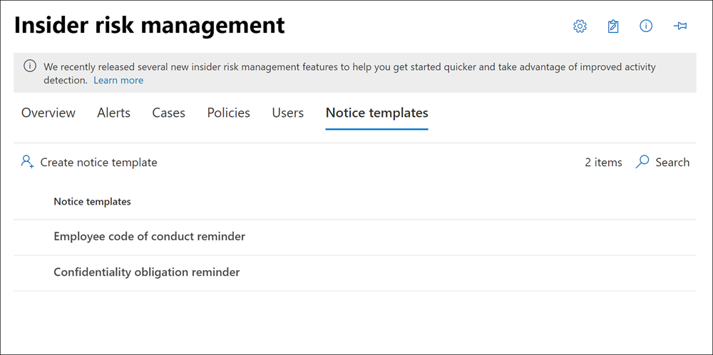

# <a name="insider-risk-management-notice-templates"></a>내부자 위험 관리 알림 템플릿

내부자 위험 관리 알림 템플릿을 사용하면 정책 일치 및 확인된 경고를 생성한 활동에 대한 사례가 생성될 때 사용자에게 전자 메일 메시지를 자동으로 보낼 수 있습니다. 사례를 생성하는 대부분의 경고에서 사용자 작업은 잘못되거나 의도하지 않은 활동의 결과입니다. 알림은 사용자에게 더 주의를 들이고 재교육을 위한 정보 링크 또는 회사 정책 리소스에 대한 링크를 제공해야 하는 간단한 미리 알림 역할을 합니다. 알림은 내부 규정 준수 교육 프로그램의 중요한 부분일 수 있으며, 재발하는 위험 활동을 하는 사용자를 위해 문서화된 감사 내선 정보를 만드는 데 도움이 될 수 있습니다.

사례 확인 프로세스의 일부로 정책 일치에 대한 전자 메일 미리 알림 알림을 사용자에게 보내고 싶은 경우 알림 템플릿을 만듭니다. 검토할 특정 사례와 연결된 사용자 전자 메일 주소로만 알림이 전송될 수 있습니다. 정책 일치에 적용할 알림 템플릿을 선택할 때 템플릿에 정의된 필드 값을 적용하거나 필요한 경우 필드를 덮어 덮어 만들 수 있습니다.

## <a name="notice-templates-dashboard"></a>알림 서식 파일 대시보드

**알림 템플릿 대시보드** 에 구성된 알림 템플릿 목록이 표시되고 새 알림 템플릿을 생성할 수 있습니다. 알림 템플릿은 가장 최근의 알림 템플릿이 먼저 나열되는 역 날짜 순서로 나열됩니다.



## <a name="html-for-notices"></a>알림용 HTML

알림에 대해 간단한 텍스트 기반 전자 메일 메시지를 만드는 것보다 더 자세한 메시지를 만들 경우 알림 템플릿의 메시지 본문 필드에 HTML을 사용하여 보다 자세한 메시지를 만들 수 있습니다. 다음 예에서는 기본 HTML 기반 전자 메일 알림 템플릿에 대한 메시지 본문 형식을 제공합니다.

```HTML
<!DOCTYPE html>
<html>
<body>
<h2>Action Required: Contoso User Code of Conduct Policy Training</h2>
<p>A recent activity you've performed has generated a risk alert prohibited by the Contoso User <a href='https://www.contoso.com'>Code of Conduct Policy</a>.</p>
<p>You are required to attend the Contoso User Code of Conduct <a href='https://www.contoso.com'>training</a> within the next 14 days. Please contact <a href='mailto:hr@contoso.com'>Human Resources</a> with any questions about this training request.</p>
<p>Thank you,</p>
<p><em>Human Resources</em></p>
</body>
</html>
```

> [!NOTE]
> 내부자 위험 관리 알림 템플릿의 HTML href 특성 구현에서는 현재 URL 참조에 대한 두 번의 인용 부호 대신 단일 인용 부호만 지원됩니다.

## <a name="create-a-new-notice-template"></a>새 알림 서식 파일 만들기

새 내부자 위험 관리 알림 템플릿을 만들기 위해 내부자 위험 관리 솔루션의 알림 생성 도구를 Microsoft 365 규정 준수 센터. 

다음 단계를 완료하여 새 내부자 위험 관리 알림 템플릿을 만듭니다.

1. In the [Microsoft 365 규정 준수 센터](https://compliance.microsoft.com), go to **Insider risk management** and select the Notice **templates** tab.
2. 알림 **만들기 도구를 열고** 알림 서식 파일 만들기를 선택합니다.
3. 새 알림 **서식 파일 만들기 페이지에서** 다음 필드를 입력합니다.
    - **서식 파일 이름:** 알림의 이름을 입력합니다. 이 이름은 사례에서 통지를 보낼 때 알림 대시보드의 알림 목록 및 알림 선택 목록에 표시됩니다.
    - **보낸 사람:** 알림의 보낸 사람 전자 메일 주소를 입력합니다. 이 주소는 사례에서 통지를 보낼 때 변경되지 않는 한 사용자에게 전송된 모든 알림의 **보낸사서:** 필드에 표시됩니다.
    - **Cc 및 Bcc** 필드: 선택적 사용자 또는 그룹이 구독의 Active Directory에서 선택한 정책 일치를 알림을 하게 됩니다.
    - **제목:** 메시지의 제목 줄에 나타나는 정보로, 텍스트 문자를 지원합니다.
    - **메시지 본문:** 메시지 본문에 나타나는 정보로, 텍스트 또는 HTML 값을 지원합니다.
4. **만들기를** 선택하여 알림 서식 파일을  만들고 저장하거나 취소를 선택하여 알림 서식 파일을 저장하지 않고 닫습니다.

## <a name="update-a-notice-template"></a>알림 서식 파일 업데이트

기존 내부자 위험 관리 알림 템플릿을 업데이트하기 위해 다음 단계를 완료합니다.

1. In the [Microsoft 365 규정 준수 센터](https://compliance.microsoft.com), go to **Insider risk management** and select the Notice **templates** tab.
2. 알림 대시보드에서 관리할 알림 서식 파일을 선택합니다.
3. 알림 세부 정보 페이지에서 **편집을 선택합니다.**
4. 편집 **페이지에서** 다음 필드를 편집할 수 있습니다.
    - **서식 파일 이름:** 알림의 새 이름을 입력합니다. 이 이름은 사례에서 통지를 보낼 때 알림 대시보드의 알림 목록 및 알림 선택 목록에 표시됩니다.
    - **보낸 사람:** 알림의 보낸 사람 전자 메일 주소를 업데이트합니다. 이 주소는 사례에서 통지를 보낼 때 변경되지 않는 한 사용자에게 전송된 모든 알림의 **보낸사서:** 필드에 표시됩니다.
    - **Cc 및 Bcc** 필드: 선택적 사용자 또는 그룹을 업데이트하여 구독에 대한 Active Directory에서 선택한 정책 일치에 대한 알림을 하게 합니다.
    - **제목:** 메시지의 제목 줄에 나타나는 정보를 업데이트하고 텍스트 문자를 지원합니다.
    - **메시지 본문:** 메시지 본문에 나타나고 텍스트 또는 HTML 값을 지원하는 정보를 업데이트합니다.
5. **저장을** 선택하여 알림 업데이트 및  저장을 선택하거나 취소를 선택하여 알림 서식 파일을 저장하지 않고 닫습니다.

## <a name="delete-a-notice-template"></a>알림 서식 파일 삭제

기존 내부자 위험 관리 알림 템플릿을 삭제하려면 다음 단계를 완료합니다.

1. In the [Microsoft 365 규정 준수 센터](https://compliance.microsoft.com), go to **Insider risk management** and select the Notice **templates** tab.
2. 알림 대시보드에서 삭제할 알림 서식 파일을 선택합니다.
3. 도구 **모음에서** 삭제 아이콘을 선택합니다.
4. 알림 서식 파일을 삭제하려면 **삭제** 대화 상자에서 예를 선택합니다. 지우기 작업을 취소하려면 취소 를 **선택합니다.**
