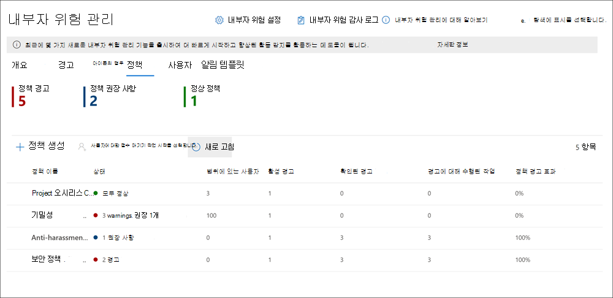

# <a name="insider-risk-management-policies"></a><span data-ttu-id="5ed71-104">내부 위험 관리 정책</span><span class="sxs-lookup"><span data-stu-id="5ed71-104">Insider risk management policies</span></span>

<span data-ttu-id="5ed71-105">내부 위험 관리 정책은 범위에 속한 사용자와 경고에 대해 구성된 위험 지표 유형을 결정합니다.</span><span class="sxs-lookup"><span data-stu-id="5ed71-105">Insider risk management policies determine which users are in-scope and which types of risk indicators are configured for alerts.</span></span> <span data-ttu-id="5ed71-106">조직의 모든 사용자에게 적용되는 정책을 빠르게 만들거나 정책에서 관리를 위해 개별 사용자 또는 그룹을 정의할 수 있습니다.</span><span class="sxs-lookup"><span data-stu-id="5ed71-106">You can quickly create a policy that applies to all users in your organization or define individual users or groups for management in a policy.</span></span> <span data-ttu-id="5ed71-107">정책은 콘텐츠 우선순위를 지원하여 여러 또는 특정 Microsoft Teams, SharePoint 사이트, 데이터 민감도 유형 및 데이터 레이블에 정책 조건을 집중합니다.</span><span class="sxs-lookup"><span data-stu-id="5ed71-107">Policies support content priorities to focus policy conditions on multiple or specific Microsoft Teams, SharePoint sites, data sensitivity types, and data labels.</span></span> <span data-ttu-id="5ed71-108">템플릿을 사용하여 특정 위험 지표를 선택하고 정책 지표의 이벤트 임곗값을 사용자 지정하여 위험 점수 및 경고 수준 및 빈도를 효과적으로 사용자 지정할 수 있습니다.</span><span class="sxs-lookup"><span data-stu-id="5ed71-108">Using templates, you can select specific risk indicators and customize event thresholds for policy indicators, effectively customizing risk scores, and level and frequency of alerts.</span></span> <span data-ttu-id="5ed71-109">또한, 위험 점수 부스터 및 변칙 검색은 중요도가 높거나 더 비정상적인 사용자 활동을 식별하는 데 도움이 됩니다.</span><span class="sxs-lookup"><span data-stu-id="5ed71-109">Additionally, risk score boosters and anomaly detections help identify user activity that is of higher importance or more unusual.</span></span> <span data-ttu-id="5ed71-110">정책 창을 사용하면 경고 활동에 정책을 적용하는 시간 프레임을 정의할 수 있으며 정책 창은 활성화된 정책의 기간을 결정하는 데 사용됩니다.</span><span class="sxs-lookup"><span data-stu-id="5ed71-110">Policy windows allow you to define the time frame to apply the policy to alert activities and are used to determine the duration of the policy once activated.</span></span>

<span data-ttu-id="5ed71-111">기본 제공 정책 템플릿을 사용하여 만든 정책이 잠재적 위험에 대한 조치를 신속하게 수행하는 데 도움이 되는 방법에 대한 개요는 [내부 위험 관리 정책 구성 비디오](https://www.youtube.com/watch?v=kudK5ajZTUo)를 확인하세요.</span><span class="sxs-lookup"><span data-stu-id="5ed71-111">Check out the [Insider Risk Management Policies Configuration video](https://www.youtube.com/watch?v=kudK5ajZTUo) for an overview of how policies created with built-in policy templates can help you to quickly take action on potential risks.</span></span>

## <a name="policy-dashboard"></a><span data-ttu-id="5ed71-112">정책 대시보드</span><span class="sxs-lookup"><span data-stu-id="5ed71-112">Policy dashboard</span></span>

<span data-ttu-id="5ed71-113">**정책 대시보드** 를 사용하면 조직의 정책과 정책 상태를 빠르게 확인하고, 정책에 사용자를 수동으로 추가하고, 각 정책과 연결된 경고의 상태를 빠르게 확인할 수 있습니다.</span><span class="sxs-lookup"><span data-stu-id="5ed71-113">The **Policy dashboard** allows you to quickly see the policies in your organization, the health of the policy, manually add users to policies, and the view the status of alerts associated with each policy.</span></span>

- <span data-ttu-id="5ed71-114">**정책 이름**: 정책 마법사에서 정책에 할당된 이름입니다.</span><span class="sxs-lookup"><span data-stu-id="5ed71-114">**Policy name**: The name assigned to the policy in the policy wizard.</span></span>
- <span data-ttu-id="5ed71-115">**상태**: 각 정책의 상태입니다.</span><span class="sxs-lookup"><span data-stu-id="5ed71-115">**Status**: The health status for each policy.</span></span> <span data-ttu-id="5ed71-116">정책 경고 및 권장 사항의 수 또는 문제가 없는 정책에 대한 *정상* 상태를 표시합니다.</span><span class="sxs-lookup"><span data-stu-id="5ed71-116">Displays number of policy warnings and recommendations, or a status of *Healthy* for policies without issues.</span></span>  <span data-ttu-id="5ed71-117">정책을 클릭하여 경고 또는 권장 사항에 대한 상태 세부 정보를 볼 수 있습니다.</span><span class="sxs-lookup"><span data-stu-id="5ed71-117">You can click on the policy to see the health status details for any warnings or recommendations.</span></span>
- <span data-ttu-id="5ed71-118">**활성 경고**: 각 정책에 대한 활성 알림 수입니다.</span><span class="sxs-lookup"><span data-stu-id="5ed71-118">**Active alerts**: The number of active alerts for each policy.</span></span>
- <span data-ttu-id="5ed71-119">**확인된 경고**: 지난 365일 동안 정책에서 발생한 총 경고 수입니다.</span><span class="sxs-lookup"><span data-stu-id="5ed71-119">**Confirmed alerts**: The total number of alerts the resulted in cases from the policy in the last 365 days.</span></span>
- <span data-ttu-id="5ed71-120">**경고에 대해 수행된 작업**: 지난 365일 동안 확인되거나 해제된 총 경고 수입니다.</span><span class="sxs-lookup"><span data-stu-id="5ed71-120">**Actions taken on alerts**: The total number of alerts that were confirmed or dismissed for the last 365 days.</span></span>
- <span data-ttu-id="5ed71-121">**정책 경고 효율성**: 확인된 총 경고 수를 경고에 대한 총 작업으로 나눈 비율입니다(지난 1년간 확인되거나 해지된 경고의 합계).</span><span class="sxs-lookup"><span data-stu-id="5ed71-121">**Policy alert effectiveness**: The percentage determined by total confirmed alerts divided by total actions taken on alerts (which is the sum of alerts that were confirmed or dismissed over the past year).</span></span>



## <a name="policy-recommendations-from-analytics-preview"></a><span data-ttu-id="5ed71-123">분석의 정책 권장 사항(미리 보기)</span><span class="sxs-lookup"><span data-stu-id="5ed71-123">Policy recommendations from analytics (preview)</span></span>

<span data-ttu-id="5ed71-124">내부 위험 분석을 사용하면 내부 위험 정책을 구성하지 않고도 조직에서 잠재적인 내부 위험 평가를 수행할 수 있습니다.</span><span class="sxs-lookup"><span data-stu-id="5ed71-124">Insider risk analytics enables you to conduct an evaluation of potential insider risks in your organization without configuring any insider risk policies.</span></span> <span data-ttu-id="5ed71-125">이 평가는 조직에서 사용자 위험이 큰 잠재적 영역을 식별하고 구성을 고려할 수 있는 내부 위험 관리 정책의 유형과 범위를 결정하는 데 도움이 될 수 있습니다.</span><span class="sxs-lookup"><span data-stu-id="5ed71-125">This evaluation can help your organization identify potential areas of higher user risk and help determine the type and scope of insider risk management policies you may consider configuring.</span></span>

<span data-ttu-id="5ed71-126">내부 위험 분석 및 정책 권장 사항에 대한 자세한 내용은 [내부 위험 관리 설정: 분석(미리 보기)](insider-risk-management-settings.md#analytics-preview)을 참조하세요.</span><span class="sxs-lookup"><span data-stu-id="5ed71-126">To learn more about insider risk analytics and policy recommendations, see [Insider risk management settings: Analytics (preview)](insider-risk-management-settings.md#analytics-preview).</span></span>

## <a name="policy-templates"></a><span data-ttu-id="5ed71-127">정책 템플릿</span><span class="sxs-lookup"><span data-stu-id="5ed71-127">Policy templates</span></span>

<span data-ttu-id="5ed71-128">내부 위험 관리 템플릿은 정책에서 사용하는 위험 지표 및 위험 점수 매기기 모델의 유형을 정의하는 미리 정의된 정책 조건입니다.</span><span class="sxs-lookup"><span data-stu-id="5ed71-128">Insider risk management templates are pre-defined policy conditions that define the types of risk indicators and risk scoring model used by the policy.</span></span> <span data-ttu-id="5ed71-129">정책을 생성하기 전에 각 정책에 정책 생성 마법사에서 할당된 템플릿이 있어야 합니다.</span><span class="sxs-lookup"><span data-stu-id="5ed71-129">Each policy must have a template assigned in the policy creation wizard before the policy is created.</span></span> <span data-ttu-id="5ed71-130">내부 위험 관리는 각 정책 템플릿에 대해 최대 5개의 정책을 지원합니다.</span><span class="sxs-lookup"><span data-stu-id="5ed71-130">Insider risk management supports up to five policies for each policy template.</span></span> <span data-ttu-id="5ed71-131">정책 마법사를 사용하여 새 내부 위험 정책을 만들 때 다음 정책 템플릿 중 하나를 선택합니다.</span><span class="sxs-lookup"><span data-stu-id="5ed71-131">When you create a new insider risk policy with the policy wizard, you'll choose from one of the following policy templates:</span></span>

### <a name="data-theft-by-departing-users"></a><span data-ttu-id="5ed71-132">퇴사하는 직원의 데이터 도난</span><span class="sxs-lookup"><span data-stu-id="5ed71-132">Data theft by departing users</span></span>

<span data-ttu-id="5ed71-133">사용자가 조직을 떠날 때 일반적으로 퇴사하는 사용자의 데이터 도난과 관련된 특정 위험 지표가 있습니다.</span><span class="sxs-lookup"><span data-stu-id="5ed71-133">When users leave your organization, there are specific risk indicators typically associated with data theft by departing users.</span></span> <span data-ttu-id="5ed71-134">이 정책 템플릿은 위험 점수 매기기를 위해 반출 지표를 사용하고 이 위험 영역의 탐지 및 경고에 중점을 둡니다.</span><span class="sxs-lookup"><span data-stu-id="5ed71-134">This policy template uses exfiltration indicators for risk scoring and focuses on detection and alerts in this risk area.</span></span> <span data-ttu-id="5ed71-135">퇴사하는 사용자의 데이터 도난에는 SharePoint Online에서 파일 다운로드, 파일 인쇄, 고용 사직 및 종료 날짜 근처에 개인 클라우드 메시징 및 스토리지 서비스로 데이터 복사 등이 포함될 수 있습니다.</span><span class="sxs-lookup"><span data-stu-id="5ed71-135">Data theft for departing users may include downloading files from SharePoint Online, printing files, and copying data to personal cloud messaging and storage services near their employment resignation and end dates.</span></span> <span data-ttu-id="5ed71-136">이 템플릿은 Microsoft 365 HR 커넥터 또는 조직의 Azure Active Directory 사용자 계정 삭제를 자동으로 모니터링하는 옵션을 사용하여 이러한 활동과 관련된 위험 지표 및 사용자 고용 상태와의 상관관계에 대한 점수를 매기기 시작합니다.</span><span class="sxs-lookup"><span data-stu-id="5ed71-136">By using either the Microsoft 365 HR connector or the option to automatically monitor for user account deletion in Azure Active Directory for your organization, this template starts scoring for risk indicators relating to these activities and how they correlate with user employment status.</span></span>

> [!IMPORTANT]
> <span data-ttu-id="5ed71-137">이 템플릿을 사용하는 경우 조직의 사용자에 대한 퇴사 및 종료 날짜 정보를 주기적으로 가져오도록 Microsoft 365 HR 커넥터를 구성할 수 있습니다.</span><span class="sxs-lookup"><span data-stu-id="5ed71-137">When using this template, you can configure a Microsoft 365 HR connector to periodically import resignation and termination date information for users in your organization.</span></span> <span data-ttu-id="5ed71-138">조직의 Microsoft 365 HR 커넥터를 구성하는 단계별 지침은 [HR 커넥터 데이터 가져오기](import-hr-data.md) 문서를 참조하세요.</span><span class="sxs-lookup"><span data-stu-id="5ed71-138">See the [Import data with the HR connector](import-hr-data.md) article for step-by-step guidance to configure the Microsoft 365 HR connector for your organization.</span></span> <span data-ttu-id="5ed71-139">HR 커넥터를 사용하지 않도록 선택하는 경우 정책 마법사에서 트리거 이벤트를 구성할 때 Azure AD 옵션에서 삭제된 사용자 계정을 선택해야 합니다.</span><span class="sxs-lookup"><span data-stu-id="5ed71-139">If you choose not to use the HR connector, you must select the User account deleted from Azure AD option when configuring trigger events in the policy wizard.</span></span>

### <a name="general-data-leaks"></a><span data-ttu-id="5ed71-140">일반적인 데이터 유출</span><span class="sxs-lookup"><span data-stu-id="5ed71-140">General data leaks</span></span>

<span data-ttu-id="5ed71-141">데이터 보호 및 데이터 유출 방지는 특히 사용자, 장치 및 서비스에서 만든 새로운 데이터가 빠르게 증가하면서 대부분의 조직에서 지속적인 과제입니다.</span><span class="sxs-lookup"><span data-stu-id="5ed71-141">Protecting data and preventing data leaks is a constant challenge for most organizations, particularly with the rapid grow of new data created by users, devices, and services.</span></span> <span data-ttu-id="5ed71-142">사용자는 데이터 유출 관리를 점점 더 복잡하고 어렵게 하는 서비스 및 장치 간에 정보를 만들고, 저장하고, 공유할 수 있습니다.</span><span class="sxs-lookup"><span data-stu-id="5ed71-142">Users are empowered to create, store, and share information across services and devices that make managing data leaks increasingly more complex and difficult.</span></span> <span data-ttu-id="5ed71-143">데이터 유출은 조직 외부에 정보를 실수로 과다 공유하는 경우나 악의적인 의도로 데이터를 도난하는 경우를 포함할 수 있습니다.</span><span class="sxs-lookup"><span data-stu-id="5ed71-143">Data leaks can include accidental oversharing of information outside your organization or data theft with malicious intent.</span></span> <span data-ttu-id="5ed71-144">할당된 DLP(데이터 손실 방지) 정책 또는 기본 제공 트리거링 이벤트를 사용하여 이 템플릿은 의심스러운 SharePoint Online 데이터 다운로드, 파일 및 폴더 공유, 파일 인쇄 및 개인 클라우드 메시징 및 저장소 서비스에 데이터 복사의 실시간 탐지 점수를 매기기 시작합니다.</span><span class="sxs-lookup"><span data-stu-id="5ed71-144">With an assigned Data Loss Prevention (DLP) policy or the built-in triggering event, this template starts scoring real-time detections of suspicious SharePoint Online data downloads, file and folder sharing, printing files, and copying data to personal cloud messaging and storage services.</span></span>

<span data-ttu-id="5ed71-145">*데이터 유출* 템플릿을 사용하는 경우 DLP 정책을 할당하여 조직의 높은 심각도 경고에 대한 내부 위험 정책의 지표를 트리거할 수 있습니다.</span><span class="sxs-lookup"><span data-stu-id="5ed71-145">When using a *Data leaks* template, you can assign a DLP policy to trigger indicators in the insider risk policy for high severity alerts in your organization.</span></span> <span data-ttu-id="5ed71-146">DLP 정책 규칙에 따라 심각도가 높은 경고가 Office 365 감사 로그에 추가될 때마다 이 템플릿을 사용하여 만든 내부 위험 정책은 높은 심각도 DLP 경고를 자동으로 검사합니다.</span><span class="sxs-lookup"><span data-stu-id="5ed71-146">Whenever a high severity alert is generated by a DLP policy rule is added to the Office 365 audit log, insider risk policies created with this template automatically examine the high severity DLP alert.</span></span> <span data-ttu-id="5ed71-147">경고에 내부 위험 정책에 정의된 범위 내 사용자가 포함된 경우 경고는 내부 위험 정책에 의해 새 경고로 처리되고 내부 위험 심각도 및 위험 점수가 할당됩니다.</span><span class="sxs-lookup"><span data-stu-id="5ed71-147">If the alert contains an in-scope user defined in the insider risk policy, the alert is processed by the insider risk policy as a new alert and assigned an insider risk severity and risk score.</span></span> <span data-ttu-id="5ed71-148">이 정책을 사용하면 사례에 포함된 다른 활동과 관련하여 이 경고를 평가할 수 있습니다.</span><span class="sxs-lookup"><span data-stu-id="5ed71-148">This policy allows you to evaluate this alert in context with other activities included in the case.</span></span> <span data-ttu-id="5ed71-149">DLP 정책을 선택하지 않으면 기본 제공 트리거링 이벤트를 선택해야 합니다.</span><span class="sxs-lookup"><span data-stu-id="5ed71-149">If you don't choose a DLP policy, you must select the built-in triggering event.</span></span>

#### <a name="data-leaks-policy-guidelines"></a><span data-ttu-id="5ed71-150">데이터 유출 정책 지침</span><span class="sxs-lookup"><span data-stu-id="5ed71-150">Data leaks policy guidelines</span></span>

<span data-ttu-id="5ed71-151">내부 위험 관리 정책과 함께 사용할 DLP 정책을 만들거나 수정할 때는 다음 지침을 고려하세요.</span><span class="sxs-lookup"><span data-stu-id="5ed71-151">When creating or modifying DLP policies for use with insider risk management policies, consider the following guidelines:</span></span>

- <span data-ttu-id="5ed71-152">DLP 정책에서 규칙을 구성할 때 데이터 반출 이벤트의 우선순위를 지정하고 **인시던트 보고서** 설정을 *높음* 으로 할당할 때 신중해야 합니다.</span><span class="sxs-lookup"><span data-stu-id="5ed71-152">Prioritize data exfiltration events and be selective when assigning **Incident reports** settings to *High* when configuring rules in your DLP policies.</span></span> <span data-ttu-id="5ed71-153">예를 들어 알려진 경쟁업체에 중요한 문서를 전자 메일로 전송하는 것은 *높음* 경고 수준 반출 이벤트여야 합니다.</span><span class="sxs-lookup"><span data-stu-id="5ed71-153">For example, emailing sensitive documents to a known competitor should be a *High* alert level exfiltration event.</span></span> <span data-ttu-id="5ed71-154">다른 DLP 정책 규칙의 **인시던트 보고서** 설정에서 *높음* 수준을 과도하게 할당하면 내부 위험 관리 경고 워크플로의 소음이 증가하고 데이터 조사자와 분석가가 이러한 경고를 제대로 평가하기가 더 어려울 수 있습니다.</span><span class="sxs-lookup"><span data-stu-id="5ed71-154">Over-assigning the *High* level in the **Incident reports** settings in other DLP policy rules can increase the noise in the insider risk management alert workflow and make it more difficult for your data investigators and analysts to properly evaluate these alerts.</span></span> <span data-ttu-id="5ed71-155">예를 들어 *높음* 경고 수준을 할당하여 DLP 정책의 거부 활동에 액세스하면 실제로 위험한 사용자 동작 및 활동을 평가하기가 더 어려워집니다.</span><span class="sxs-lookup"><span data-stu-id="5ed71-155">For example, assigning *High* alert levels to access denial activities in DLP policies makes it more challenging to evaluate truly risky user behavior and activities.</span></span>
- <span data-ttu-id="5ed71-156">DLP 및 내부 위험 관리 정책 모두에서 범위 내 사용자를 이해하고 적절하게 구성해야 합니다.</span><span class="sxs-lookup"><span data-stu-id="5ed71-156">Make sure you understand and properly configure the in-scope users in both the DLP and insider risk management policies.</span></span> <span data-ttu-id="5ed71-157">**데이터 유출** 템플릿을 사용하여 내부 위험 관리 정책에 대한 범위 내로 정의된 사용자만 높은 심각도의 DLP 정책 경고가 처리됩니다.</span><span class="sxs-lookup"><span data-stu-id="5ed71-157">Only users defined as in-scope for insider risk management policies using the **Data leaks** template will have high severity DLP policy alerts processed.</span></span> <span data-ttu-id="5ed71-158">또한, 심각도가 높은 DLP 경고에 대한 규칙에서 범위 내로 정의된 사용자만 내부 위험 관리 정책에서 검토합니다.</span><span class="sxs-lookup"><span data-stu-id="5ed71-158">Additionally, only users defined as in-scope in a rule for a high severity DLP alert will be examined by the insider risk management policy for consideration.</span></span> <span data-ttu-id="5ed71-159">DLP 및 내부 위험 정책 모두에서 충돌하는 방식으로 범위 내 사용자를 무의식적으로 구성하지 않는 것이 중요합니다.</span><span class="sxs-lookup"><span data-stu-id="5ed71-159">It is important that you don't unknowingly configure in-scope users in both your DLP and insider risk policies in a conflicting manner.</span></span>

     <span data-ttu-id="5ed71-160">예를 들어 DLP 정책 규칙이 영업팀의 사용자로만 범위가 지정되고 **데이터 유출** 템플릿에서 만든 내부 위험 정책이 모든 사용자를 범위 내로 정의한 경우 내부 위험 정책은 실제로 영업팀의 사용자에 대해 심각도가 높은 DLP 경고만 처리합니다.</span><span class="sxs-lookup"><span data-stu-id="5ed71-160">For example, if your DLP policy rules are scoped to only users on the Sales Team and the insider risk policy created from the **Data leaks** template has defined all users as in-scope, the insider risk policy will only actually process high severity DLP alerts for the users on the Sales Team.</span></span> <span data-ttu-id="5ed71-161">내부 위험 정책은 이 예제의 DLP 규칙에 정의되지 않은 사용자가 처리할 우선순위가 높은 DLP 경고를 받지 않습니다.</span><span class="sxs-lookup"><span data-stu-id="5ed71-161">The insider risk policy won't receive any high priority DLP alerts for users to process that aren't defined in the DLP rules in this example.</span></span> <span data-ttu-id="5ed71-162">반대로, **데이터 유출** 템플릿에서 만든 내부 위험 관리 정책이 영업팀의 사용자로만 범위가 지정되고 할당된 DLP 정책의 범위가 모든 사용자로 지정되는 경우 내부 위험 정책은 영업팀 구성원에 대해 심각도가 높은 DLP 경고만 처리합니다.</span><span class="sxs-lookup"><span data-stu-id="5ed71-162">Conversely, if your insider risk management policy created from **Data leaks** templates is scoped to only users on the Sales Team and the assigned DLP policy is scoped to all users, the insider risk policy will only process high severity DLP alerts for members of the Sales Team.</span></span> <span data-ttu-id="5ed71-163">내부 위험 관리 정책은 영업팀에 없는 모든 사용자에 대해 심각도가 높은 DLP 경고를 무시합니다.</span><span class="sxs-lookup"><span data-stu-id="5ed71-163">The insider risk management policy will ignore high severity DLP alerts for all users not on the Sales Team.</span></span>

- <span data-ttu-id="5ed71-164">이 내부 위험 관리 템플릿에 사용되는 DLP 정책의 **인시던트 보고서** 규칙 설정이 *높음* 심각도 수준 경고에 대해 구성되었는지 확인합니다.</span><span class="sxs-lookup"><span data-stu-id="5ed71-164">Make sure the **Incident reports** rule setting in the DLP policy used for this insider risk management template is configured for *High* severity level alerts.</span></span> <span data-ttu-id="5ed71-165">*높음* 심각도 수준은 트리거링 이벤트이며 **인시던트 보고서** 필드가 *낮음* 또는 *중간* 으로 설정된 DLP 정책의 규칙에서 내부 위험 관리 경고가 생성되지 않습니다.</span><span class="sxs-lookup"><span data-stu-id="5ed71-165">The *High* severity level is the triggering events and insider risk management alerts won't be generated from rules in DLP policies with the **Incident reports** field set at *Low* or *Medium*.</span></span>

    

     > [!NOTE]
     > <span data-ttu-id="5ed71-167">기본 제공 템플릿을 사용하여 새 DLP 정책을 만들 때 **고급 DLP 규칙 만들기 또는 사용자 지정** 옵션을 선택하여 *높음* 심각도 수준에 대한 **인시던트 보고서** 설정을 구성해야 합니다.</span><span class="sxs-lookup"><span data-stu-id="5ed71-167">When creating a new DLP policy using the built-in templates, you'll need to select the **Create or customize advanced DLP rules** option to configure the **Incident reports** setting for the *High* severity level.</span></span>

<span data-ttu-id="5ed71-168">**데이터 유출** 템플릿에서 만든 각 내부 위험 관리 정책에는 DLP 정책이 하나만 할당될 수 있습니다.</span><span class="sxs-lookup"><span data-stu-id="5ed71-168">Each insider risk management policy created from the **Data leaks** template can only have one DLP policy assigned.</span></span> <span data-ttu-id="5ed71-169">탐지하려는 다양한 활동을 결합하고 **데이터 유출** 템플릿을 사용하는 내부 위험 정책에 대한 트리거링 이벤트 역할을 하는 전용 DLP 정책을 만드는 것이 좋습니다.</span><span class="sxs-lookup"><span data-stu-id="5ed71-169">Consider creating a dedicated DLP policy that combines the different activities you want to detect and act as triggering events for  insider risk policies that use the **Data leaks** template.</span></span>

<span data-ttu-id="5ed71-170">조직의 DLP 정책을 구성하는 단계별 지침은 [ DLP 정책 생성, 테스트 및 조정](create-test-tune-dlp-policy.md) 문서를 참조하세요.</span><span class="sxs-lookup"><span data-stu-id="5ed71-170">See the [Create, test, and tune a DLP policy](create-test-tune-dlp-policy.md) article for step-by-step guidance to configure DLP policies for your organization.</span></span>

### <a name="data-leaks-by-priority-users-preview"></a><span data-ttu-id="5ed71-171">우선순위 사용자의 데이터 유출(미리 보기)</span><span class="sxs-lookup"><span data-stu-id="5ed71-171">Data leaks by priority users (preview)</span></span>

<span data-ttu-id="5ed71-172">조직의 사용자에 대한 데이터 보호 및 데이터 유출 방지는 해당 위치, 중요한 정보에 대한 액세스 수준 또는 위험 기록에 따라 달라질 수 있습니다.</span><span class="sxs-lookup"><span data-stu-id="5ed71-172">Protecting data and preventing data leaks for users in your organization may depend on their position, level of access to sensitive information, or risk history.</span></span> <span data-ttu-id="5ed71-173">데이터 유출은 조직 외부에 매우 중요한 정보를 실수로 과다 공유하는 경우나 악의적인 의도로 데이터를 도난하는 경우를 포함합니다.</span><span class="sxs-lookup"><span data-stu-id="5ed71-173">Data leaks can include accidental oversharing of highly sensitive information outside your organization or data theft with malicious intent.</span></span> <span data-ttu-id="5ed71-174">할당된 DLP(데이터 손실 방지) 정책을 사용하여 이 템플릿은 의심스러운 활동에 대한 실시간 탐지 점수를 매기기 시작하고 내부 위험 경고 및 심각도가 더 높은 경고의 가능성을 높입니다.</span><span class="sxs-lookup"><span data-stu-id="5ed71-174">With an assigned Data Loss Prevention (DLP) policy, this template starts scoring real-time detections of suspicious activity and result in an increased likelihood of insider risk alerts and alerts with higher severity levels.</span></span> <span data-ttu-id="5ed71-175">우선순위 사용자는 내부 위험 관리 설정 영역에 구성된 [우선순위 사용자 그룹](insider-risk-management-settings.md#priority-user-groups-preview)에서 정의됩니다.</span><span class="sxs-lookup"><span data-stu-id="5ed71-175">Priority users are defined in [priority user groups](insider-risk-management-settings.md#priority-user-groups-preview) configured in the insider risk management settings area.</span></span>

<span data-ttu-id="5ed71-176">**일반 데이터 유출 템플릿** 과 마찬가지로 조직의 높은 심각도 경고에 대한 내부 위험 정책의 지표를 트리거하는 DLP 정책을 할당해야 합니다.</span><span class="sxs-lookup"><span data-stu-id="5ed71-176">As with the **General data leaks template**, you must assign a DLP policy to trigger indicators in the insider risk policy for high severity alerts in your organization.</span></span> <span data-ttu-id="5ed71-177">이 템플릿을 사용하여 정책을 만들 때 위의 데이터 누수 정책 지침을 따릅니다.</span><span class="sxs-lookup"><span data-stu-id="5ed71-177">Follow the Data leaks policy guidelines above when creating a policy using this template.</span></span> <span data-ttu-id="5ed71-178">또한, **내부 위험 관리** > **설정** > **우선순위 사용자 그룹** 에서 만든 우선순위 사용자 그룹을 정책에 할당해야 합니다.</span><span class="sxs-lookup"><span data-stu-id="5ed71-178">Additionally, you will need to assign priority user groups created in **Insider risk management** > **Settings** > **Priority user groups** to the policy.</span></span>

### <a name="data-leaks-by-disgruntled-users-preview"></a><span data-ttu-id="5ed71-179">불만을 품은 사용자의 데이터 유출(미리 보기)</span><span class="sxs-lookup"><span data-stu-id="5ed71-179">Data leaks by disgruntled users (preview)</span></span>

<span data-ttu-id="5ed71-180">사용자가 고용 스트레스 요인을 경험하면 불만을 품고 내부 위험 활동이 발생할 가능성이 높아질 수 있습니다.</span><span class="sxs-lookup"><span data-stu-id="5ed71-180">When users experience employment stressors, they may become disgruntled, which may increase the chances of insider risk activity.</span></span> <span data-ttu-id="5ed71-181">이 템플릿은 불만과 관련된 지표가 식별되면 사용자 활동 점수 매기기를 시작합니다.</span><span class="sxs-lookup"><span data-stu-id="5ed71-181">This template starts scoring user activity when an indicator associated with disgruntlement is identified.</span></span> <span data-ttu-id="5ed71-182">예를 들어 성과 개선 알림, 성과 저하 검토 또는 작업 수준 상태 변경이 있습니다.</span><span class="sxs-lookup"><span data-stu-id="5ed71-182">Examples include performance improvement notifications, poor performance reviews, or changes to job level status.</span></span> <span data-ttu-id="5ed71-183">불만을 품은 사용자의 데이터 유출에는 SharePoint Online에서 파일 다운로드, 고용 스트레스 이벤트 근처에 개인 클라우드 메시징 및 스토리지 서비스로 데이터 복사 등이 포함될 수 있습니다.</span><span class="sxs-lookup"><span data-stu-id="5ed71-183">Data leaks for disgruntled users may include downloading files from SharePoint Online and copying data to personal cloud messaging and storage services near employment stressor events.</span></span>

<span data-ttu-id="5ed71-184">이 템플릿을 사용하는 경우 조직의 사용자에 대한 성과 개선 알림, 성과 검토 상태가 좋지 않거나 또는 작업 수준 변경 정보를 주기적으로 가져오도록 Microsoft 365 HR 커넥터를 구성해야 합니다.</span><span class="sxs-lookup"><span data-stu-id="5ed71-184">When using this template, you must also configure a Microsoft 365 HR connector to periodically import performance improvement notifications, poor performance review status, or job level change information for users in your organization.</span></span> <span data-ttu-id="5ed71-185">조직의 Microsoft 365 HR 커넥터를 구성하는 단계별 지침은 [HR 커넥터 데이터 가져오기](import-hr-data.md) 문서를 참조하세요.</span><span class="sxs-lookup"><span data-stu-id="5ed71-185">See the [Import data with the HR connector](import-hr-data.md) article for step-by-step guidance to configure the Microsoft 365 HR connector for your organization.</span></span>

### <a name="general-security-policy-violations-preview"></a><span data-ttu-id="5ed71-186">일반 보안 정책 위반(미리 보기)</span><span class="sxs-lookup"><span data-stu-id="5ed71-186">General security policy violations (preview)</span></span>

<span data-ttu-id="5ed71-187">많은 조직에서 사용자는 자신의 장치에 소프트웨어를 설치하거나 작업에 도움이 되도록 장치 설정을 수정할 수 있는 권한이 있습니다.</span><span class="sxs-lookup"><span data-stu-id="5ed71-187">In many organizations, users have permission to install software on their devices or to modify device settings to help with their tasks.</span></span> <span data-ttu-id="5ed71-188">사용자는 실수로 또는 악의적인 의도로 맬웨어를 설치하거나 장치 또는 네트워크 리소스의 정보를 보호하는 데 도움이 되는 중요한 보안 기능을 사용하지 않도록 설정할 수 있습니다.</span><span class="sxs-lookup"><span data-stu-id="5ed71-188">Either inadvertently or with malicious intent, users may install malware or disable important security features that help protect information on their device or on your network resources.</span></span> <span data-ttu-id="5ed71-189">이 정책 템플릿은 엔드포인트용 Microsoft Defender의 보안 경고를 사용하여 이러한 활동 점수 매기기를 시작하고 이 위험 영역에 대한 탐지 및 경고에 집중합니다.</span><span class="sxs-lookup"><span data-stu-id="5ed71-189">This policy template uses security alerts from Microsoft Defender for Endpoint to start scoring these activities and focus detection and alerts to this risk area.</span></span> <span data-ttu-id="5ed71-190">이 템플릿을 사용하여 사용자가 내부 위험을 나타내는 보안 정책 위반 기록이 있을 수 있는 시나리오에서 보안 정책 위반에 대한 인사이트를 제공합니다.</span><span class="sxs-lookup"><span data-stu-id="5ed71-190">Use this template to provide insights for security policy violations in scenarios when users may have a history of security policy violations that may be an indicator of insider risk.</span></span>

<span data-ttu-id="5ed71-191">조직에서 엔드포인트용 Microsoft Defender를 구성하고 Defender 보안 센터의 내부 위험 관리 통합을 위해 엔드포인트용 Defender를 사용하도록 설정하여 보안 위반 경고를 가져와야 합니다.</span><span class="sxs-lookup"><span data-stu-id="5ed71-191">You'll need to have Microsoft Defender for Endpoint configured in your organization and enable Defender for Endpoint for insider risk management integration in the Defender Security Center to import security violation alerts.</span></span> <span data-ttu-id="5ed71-192">내부 위험 관리 통합을 위해 엔드포인트용 Defender를 구성하는 방법에 대한 자세한 내용은 [엔드포인트용 Defender 고급 기능 구성](/windows/security/threat-protection/microsoft-defender-atp/advanced-features#share-endpoint-alerts-with-microsoft-compliance-center)을 참조하세요.</span><span class="sxs-lookup"><span data-stu-id="5ed71-192">For more information on configuring Defender for Endpoint for insider risk management integration, see [Configure advanced features in Defender for Endpoint](/windows/security/threat-protection/microsoft-defender-atp/advanced-features#share-endpoint-alerts-with-microsoft-compliance-center).</span></span>

### <a name="security-policy-violations-by-departing-users-preview"></a><span data-ttu-id="5ed71-193">퇴사하는 사용자의 보안 정책 위반(미리 보기)</span><span class="sxs-lookup"><span data-stu-id="5ed71-193">Security policy violations by departing users (preview)</span></span>

<span data-ttu-id="5ed71-194">퇴사하는 사용자는 긍정적이든 부정적인 조건이든 관계없이 보안 정책 위반에 대한 위험이 더 클 수 있습니다.</span><span class="sxs-lookup"><span data-stu-id="5ed71-194">Departing users, whether leaving on positive or negative terms, may be higher risks for security policy violations.</span></span> <span data-ttu-id="5ed71-195">이 정책 템플릿은 퇴사하는 사용자의 의도치 않거나 악의적인 보안 위반으로부터 보호하기 위해 엔드포인트용 Defender 경고를 사용하여 보안 관련 활동에 대한 인사이트를 제공합니다.</span><span class="sxs-lookup"><span data-stu-id="5ed71-195">To help protect against inadvertent or malicious security violations for departing users, this policy template uses Defender for Endpoint alerts to provide insights into security-related activities.</span></span> <span data-ttu-id="5ed71-196">이러한 활동에는 사용자가 맬웨어 또는 기타 잠재적으로 유해한 애플리케이션을 설치하고 장치에서 보안 기능을 사용하지 않도록 설정하는 작업이 포함됩니다.</span><span class="sxs-lookup"><span data-stu-id="5ed71-196">These activities include the user installing malware or other potentially harmful applications and disabling security features on their devices.</span></span> <span data-ttu-id="5ed71-197">이 템플릿은 [Microsoft 365 HR 커넥터](import-hr-data.md) 또는 조직의 Azure Active Directory 사용자 계정 삭제를 자동으로 모니터링하는 옵션을 사용하여 이러한 보안 활동과 관련된 위험 지표 및 사용자 고용 상태와의 상관관계에 대한 점수를 매기기 시작합니다.</span><span class="sxs-lookup"><span data-stu-id="5ed71-197">By using either the [Microsoft 365 HR connector](import-hr-data.md) or the option to automatically monitor for user account deletion in Azure Active Directory for your organization, this template starts scoring for risk indicators relating to these security activities and how they correlate with user employment status.</span></span>

<span data-ttu-id="5ed71-198">조직에서 엔드포인트용 Microsoft Defender를 구성하고 Defender 보안 센터의 내부 위험 관리 통합을 위해 엔드포인트용 Defender를 사용하도록 설정하여 보안 위반 경고를 가져와야 합니다.</span><span class="sxs-lookup"><span data-stu-id="5ed71-198">You'll need to have Microsoft Defender for Endpoint configured in your organization and enable Defender for Endpoint for insider risk management integration in the Defender Security Center to import security violation alerts.</span></span> <span data-ttu-id="5ed71-199">내부 위험 관리 통합을 위해 엔드포인트용 Defender를 구성하는 방법에 대한 자세한 내용은 [엔드포인트용 Defender 고급 기능 구성](/windows/security/threat-protection/microsoft-defender-atp/advanced-features#share-endpoint-alerts-with-microsoft-compliance-center)을 참조하세요.</span><span class="sxs-lookup"><span data-stu-id="5ed71-199">For more information on configuring Defender for Endpoint for insider risk management integration, see [Configure advanced features in Defender for Endpoint](/windows/security/threat-protection/microsoft-defender-atp/advanced-features#share-endpoint-alerts-with-microsoft-compliance-center).</span></span>

### <a name="security-policy-violations-by-priority-users-preview"></a><span data-ttu-id="5ed71-200">우선순위 사용자의 보안 정책 위반(미리 보기)</span><span class="sxs-lookup"><span data-stu-id="5ed71-200">Security policy violations by priority users (preview)</span></span>

<span data-ttu-id="5ed71-201">조직의 사용자에 대한 보안 위반으로부터 보호하는 것은 해당 위치, 중요한 정보에 대한 액세스 수준 또는 위험 기록에 따라 달라질 수 있습니다.</span><span class="sxs-lookup"><span data-stu-id="5ed71-201">Protecting against security violations for users in your organization may depend on their position, level of access to sensitive information, or risk history.</span></span> <span data-ttu-id="5ed71-202">우선순위 사용자의 보안 위반은 조직의 중요한 영역에 상당한 영향을 미칠 수 있으므로 이 정책 템플릿은 이러한 지표에 대한 점수를 매기기 시작하고 엔드포인트용 Microsoft Defender 경고를 사용하여 이러한 사용자의 보안 관련 활동에 대한 인사이트를 제공합니다.</span><span class="sxs-lookup"><span data-stu-id="5ed71-202">Because security violations by priority users may have a significant impact on your organization's critical areas, this policy template starts scoring on these indicators and uses Microsoft Defender for Endpoint alerts to provide insights into security-related activities for these users.</span></span> <span data-ttu-id="5ed71-203">이러한 활동에는 우선순위 사용자가 맬웨어 또는 기타 잠재적으로 유해한 애플리케이션을 설치하고 장치에서 보안 기능을 사용하지 않도록 설정하는 작업이 포함될 수 있습니다.</span><span class="sxs-lookup"><span data-stu-id="5ed71-203">These activities may include the priority users installing malware or other potentially harmful applications and disabling security features on their devices.</span></span> <span data-ttu-id="5ed71-204">우선순위 사용자는 내부 위험 관리 설정 영역에 구성된 우선순위 사용자 그룹에서 정의됩니다.</span><span class="sxs-lookup"><span data-stu-id="5ed71-204">Priority users are defined in priority user groups configured in the insider risk management settings area.</span></span>

<span data-ttu-id="5ed71-205">조직에서 엔드포인트용 Microsoft Defender를 구성하고 Defender 보안 센터의 내부 위험 관리 통합을 위해 엔드포인트용 Defender를 사용하도록 설정하여 보안 위반 경고를 가져와야 합니다.</span><span class="sxs-lookup"><span data-stu-id="5ed71-205">You'll need to have Microsoft Defender for Endpoint configured in your organization and enable Defender for Endpoint for insider risk management integration in the Defender Security Center to import security violation alerts.</span></span> <span data-ttu-id="5ed71-206">내부 위험 관리 통합을 위해 엔드포인트용 Defender를 구성하는 방법에 대한 자세한 내용은 [엔드포인트용 Defender 고급 기능 구성](/windows/security/threat-protection/microsoft-defender-atp/advanced-features#share-endpoint-alerts-with-microsoft-compliance-center)을 참조하세요.</span><span class="sxs-lookup"><span data-stu-id="5ed71-206">For more information on configuring Defender for Endpoint for insider risk management integration, see [Configure advanced features in Defender for Endpoint](/windows/security/threat-protection/microsoft-defender-atp/advanced-features#share-endpoint-alerts-with-microsoft-compliance-center).</span></span> <span data-ttu-id="5ed71-207">또한, **내부 위험 관리** > **설정** > **우선순위 사용자 그룹** 에서 만든 우선순위 사용자 그룹을 정책에 할당해야 합니다.</span><span class="sxs-lookup"><span data-stu-id="5ed71-207">Additionally, you will need to assign priority user groups created in **Insider risk management** > **Settings** > **Priority user groups** to the policy.</span></span>

### <a name="security-policy-violations-by-disgruntled-users-preview"></a><span data-ttu-id="5ed71-208">불만을 품은 사용자의 보안 정책 위반(미리 보기)</span><span class="sxs-lookup"><span data-stu-id="5ed71-208">Security policy violations by disgruntled users (preview)</span></span>

<span data-ttu-id="5ed71-209">고용 스트레스 요인을 경험하는 사용자는 의도치 않거나 악의적인 보안 정책 위반에 대한 위험이 더 클 수 있습니다.</span><span class="sxs-lookup"><span data-stu-id="5ed71-209">Users that experience employment stressors may be at a higher risk for inadvertent or malicious security policy violations.</span></span> <span data-ttu-id="5ed71-210">이러한 스트레스 요인에는 성과 개선 계획에 배치되거나, 성과 검토 상태가 좋지 않거나, 현재 위치에서 강등되는 사용자가 포함될 수 있습니다.</span><span class="sxs-lookup"><span data-stu-id="5ed71-210">These stressors may include the user being placed on a performance improvement plan, poor performance review status, or being demoted from their current position.</span></span> <span data-ttu-id="5ed71-211">이 정책 템플릿은 해당 사용자에 대해 이러한 이벤트와 관련된 지표 및 활동을 기반으로 위험 점수 매기기를 시작합니다.</span><span class="sxs-lookup"><span data-stu-id="5ed71-211">This policy template starts risk scoring based on these indicators and activities associated with these events for these users.</span></span>

<span data-ttu-id="5ed71-212">이 템플릿을 사용하는 경우 조직의 사용자에 대한 성과 개선 알림, 성과 검토 상태가 좋지 않거나 또는 작업 수준 변경 정보를 주기적으로 가져오도록 Microsoft 365 HR 커넥터를 구성해야 합니다.</span><span class="sxs-lookup"><span data-stu-id="5ed71-212">When using this template, you must also configure a Microsoft 365 HR connector to periodically import performance improvement notifications, poor performance review status, or job level change information for users in your organization.</span></span> <span data-ttu-id="5ed71-213">조직의 Microsoft 365 HR 커넥터를 구성하는 단계별 지침은 [HR 커넥터 데이터 가져오기](import-hr-data.md) 문서를 참조하세요.</span><span class="sxs-lookup"><span data-stu-id="5ed71-213">See the [Import data with the HR connector](import-hr-data.md) article for step-by-step guidance to configure the Microsoft 365 HR connector for your organization.</span></span>

<span data-ttu-id="5ed71-214">또한, 조직에서 엔드포인트용 Microsoft Defender를 구성하고 Defender 보안 센터의 내부 위험 관리 통합을 위해 엔드포인트용 Defender를 사용하도록 설정하여 보안 위반 경고를 가져와야 합니다.</span><span class="sxs-lookup"><span data-stu-id="5ed71-214">You'll also need to have Microsoft Defender for Endpoint configured in your organization and enable Defender for Endpoint for insider risk management integration in the Defender Security Center to import security violation alerts.</span></span> <span data-ttu-id="5ed71-215">내부 위험 관리 통합을 위해 엔드포인트용 Defender를 구성하는 방법에 대한 자세한 내용은 [엔드포인트용 Defender 고급 기능 구성](/windows/security/threat-protection/microsoft-defender-atp/advanced-features#share-endpoint-alerts-with-microsoft-compliance-center)을 참조하세요.</span><span class="sxs-lookup"><span data-stu-id="5ed71-215">For more information on configuring Defender for Endpoint for insider risk management integration, see [Configure advanced features in Defender for Endpoint](/windows/security/threat-protection/microsoft-defender-atp/advanced-features#share-endpoint-alerts-with-microsoft-compliance-center).</span></span>

### <a name="policy-template-prerequisites-and-triggering-events"></a><span data-ttu-id="5ed71-216">정책 템플릿 필수 구성 요소 및 트리거링 이벤트</span><span class="sxs-lookup"><span data-stu-id="5ed71-216">Policy template prerequisites and triggering events</span></span>

<span data-ttu-id="5ed71-217">내부 위험 관리 정책에 대해 선택한 템플릿에 따라 트리거링 이벤트 및 정책 필수 구성 요소가 달라집니다.</span><span class="sxs-lookup"><span data-stu-id="5ed71-217">Depending on the template you choose for an insider risk management policy, the triggering events and policy prerequisites vary.</span></span> <span data-ttu-id="5ed71-218">트리거링 이벤트는 사용자가 내부 위험 관리 정책에 대해 활성 상태인지 여부를 결정하는 필수 구성 요소입니다.</span><span class="sxs-lookup"><span data-stu-id="5ed71-218">Triggering events are prerequisites that determine if a user is active for an insider risk management policy.</span></span> <span data-ttu-id="5ed71-219">사용자가 내부 위험 관리 정책에 추가되었지만 트리거링 이벤트가 없는 경우 사용자 활동은 사용자 대시보드에 수동으로 추가되지 않는 한 정책에 의해 평가되지 않습니다.</span><span class="sxs-lookup"><span data-stu-id="5ed71-219">If a user is added to an insider risk management policy but does not have a triggering event, the user activity is not evaluated by the policy unless they are manually added in the Users dashboard.</span></span> <span data-ttu-id="5ed71-220">정책 필수 구성 요소는 정책이 위험을 평가하는 데 필요한 신호 또는 활동을 수신하기 위한 필수 항목입니다.</span><span class="sxs-lookup"><span data-stu-id="5ed71-220">Policy prerequisites are required items so that the policy receives the signals or activities necessary to evaluate risk.</span></span>

<span data-ttu-id="5ed71-221">다음 표에는 각 내부 위험 관리 정책 템플릿에서 만든 정책에 대한 트리거링 이벤트 및 필수 구성 요소가 나와 있습니다.</span><span class="sxs-lookup"><span data-stu-id="5ed71-221">The following table lists the triggering events and prerequisites for policies created from each insider risk management policy template:</span></span>

| <span data-ttu-id="5ed71-222">**정책 템플릿**</span><span class="sxs-lookup"><span data-stu-id="5ed71-222">**Policy template**</span></span> | <span data-ttu-id="5ed71-223">**정책에 대한 트리거링 이벤트**</span><span class="sxs-lookup"><span data-stu-id="5ed71-223">**Triggering events for policies**</span></span> | <span data-ttu-id="5ed71-224">**필수 구성 요소**</span><span class="sxs-lookup"><span data-stu-id="5ed71-224">**Prerequisites**</span></span> |
| :------------------ | :--------------------------------- | :---------------- |
| <span data-ttu-id="5ed71-225">퇴사하는 직원의 데이터 도난</span><span class="sxs-lookup"><span data-stu-id="5ed71-225">Data theft by departing users</span></span> | <span data-ttu-id="5ed71-226">HR 커넥터의 퇴사 또는 종료 날짜 지표</span><span class="sxs-lookup"><span data-stu-id="5ed71-226">Resignation or termination date indicator from HR connector</span></span> | <span data-ttu-id="5ed71-227">(선택 사항) 종료 및 퇴사 날짜 지표 또는 Azure Active Directory 통합을 사용하도록 구성된 Microsoft 365 HR 커넥터</span><span class="sxs-lookup"><span data-stu-id="5ed71-227">(optional) Microsoft 365 HR connector configured for termination and resignation date indicators or Azure Active Directory integration enabled</span></span> |
| <span data-ttu-id="5ed71-228">일반적인 데이터 유출</span><span class="sxs-lookup"><span data-stu-id="5ed71-228">General data leaks</span></span> | <span data-ttu-id="5ed71-229">심각도가 높은 경고를 만드는 데이터 유출 정책 활동</span><span class="sxs-lookup"><span data-stu-id="5ed71-229">Data leak policy activity that creates a High severity alert</span></span> | <span data-ttu-id="5ed71-230">(선택 사항) 심각도가 높은 경고 또는 기본 제공 데이터 반출 트리거링 이벤트에 대해 구성된 DLP 정책</span><span class="sxs-lookup"><span data-stu-id="5ed71-230">(optional) DLP policy configured for High severity alerts or built-in data exfiltration triggering event</span></span> |
| <span data-ttu-id="5ed71-231">우선순위 사용자의 데이터 유출</span><span class="sxs-lookup"><span data-stu-id="5ed71-231">Data leaks by priority users</span></span> | <span data-ttu-id="5ed71-232">*높은 심각도* 경고 또는 기본 제공 반출 트리거링 이벤트를 만드는 데이터 유출 정책 활동</span><span class="sxs-lookup"><span data-stu-id="5ed71-232">Data leak policy activity that creates a *High severity* alert or built-in exfiltration event triggers</span></span> | <span data-ttu-id="5ed71-233">(선택 사항) 높은 심각도 경고에 대해 구성된 DLP 정책</span><span class="sxs-lookup"><span data-stu-id="5ed71-233">(optional) DLP policy configured for High severity alerts</span></span> <br><br> <span data-ttu-id="5ed71-234">내부 위험 설정에 구성된 우선순위 사용자 그룹</span><span class="sxs-lookup"><span data-stu-id="5ed71-234">Priority user groups configured in insider risk settings</span></span> |
| <span data-ttu-id="5ed71-235">불만을 품은 사용자의 데이터 유출</span><span class="sxs-lookup"><span data-stu-id="5ed71-235">Data leaks by disgruntled users</span></span> | <span data-ttu-id="5ed71-236">HR 커넥터의 성과 개선, 성과 저하 또는 작업 수준 변경 지표</span><span class="sxs-lookup"><span data-stu-id="5ed71-236">Performance improvement, poor performance, or job level change indicators from HR connector</span></span> | <span data-ttu-id="5ed71-237">불만 표시를 위해 구성된 Microsoft 365 HR 커넥터</span><span class="sxs-lookup"><span data-stu-id="5ed71-237">Microsoft 365 HR connector configured for disgruntlement indicators</span></span> |
| <span data-ttu-id="5ed71-238">일반 보안 정책 위반</span><span class="sxs-lookup"><span data-stu-id="5ed71-238">General security policy violations</span></span> | <span data-ttu-id="5ed71-239">엔드포인트용 Microsoft Defender에서 탐지한 보안 제어 또는 원치 않는 소프트웨어의 방어적 회피</span><span class="sxs-lookup"><span data-stu-id="5ed71-239">Defensive evasion of security controls or unwanted software detected by Microsoft Defender for Endpoint</span></span> | <span data-ttu-id="5ed71-240">활성 엔드포인트용 Microsoft Defender 구독</span><span class="sxs-lookup"><span data-stu-id="5ed71-240">Active Microsoft Defender for Endpoint subscription</span></span> <br><br> <span data-ttu-id="5ed71-241">Microsoft 365 규정 준수 센터와 엔드포인트용 Microsoft Defender 통합 구성</span><span class="sxs-lookup"><span data-stu-id="5ed71-241">Microsoft Defender for Endpoint integration with Microsoft 365 compliance center configured</span></span> |
| <span data-ttu-id="5ed71-242">퇴사하는 사용자의 보안 정책 위반</span><span class="sxs-lookup"><span data-stu-id="5ed71-242">Security policy violations by departing users</span></span> | <span data-ttu-id="5ed71-243">HR 커넥터 또는 Azure Active Directory 계정 삭제의 퇴사 또는 종료 날짜 지표</span><span class="sxs-lookup"><span data-stu-id="5ed71-243">Resignation or termination date indicators from HR connector or Azure Active Directory account deletion</span></span> | <span data-ttu-id="5ed71-244">(선택 사항) 종료 및 퇴사 날짜 지표를 위해 구성된 Microsoft 365 HR 커넥터</span><span class="sxs-lookup"><span data-stu-id="5ed71-244">(optional) Microsoft 365 HR connector configured for termination and resignation date indicators</span></span> <br><br> <span data-ttu-id="5ed71-245">활성 엔드포인트용 Microsoft Defender 구독</span><span class="sxs-lookup"><span data-stu-id="5ed71-245">Active Microsoft Defender for Endpoint subscription</span></span> <br><br> <span data-ttu-id="5ed71-246">Microsoft 365 규정 준수 센터와 엔드포인트용 Microsoft Defender 통합 구성</span><span class="sxs-lookup"><span data-stu-id="5ed71-246">Microsoft Defender for Endpoint integration with Microsoft 365 compliance center configured</span></span> |
| <span data-ttu-id="5ed71-247">우선순위 사용자의 보안 정책 위반</span><span class="sxs-lookup"><span data-stu-id="5ed71-247">Security policy violations by priority users</span></span> | <span data-ttu-id="5ed71-248">엔드포인트용 Microsoft Defender에서 탐지한 보안 제어 또는 원치 않는 소프트웨어의 방어적 회피</span><span class="sxs-lookup"><span data-stu-id="5ed71-248">Defensive evasion of security controls or unwanted software detected by Microsoft Defender for Endpoint</span></span> | <span data-ttu-id="5ed71-249">활성 엔드포인트용 Microsoft Defender 구독</span><span class="sxs-lookup"><span data-stu-id="5ed71-249">Active Microsoft Defender for Endpoint subscription</span></span> <br><br> <span data-ttu-id="5ed71-250">Microsoft 365 규정 준수 센터와 엔드포인트용 Microsoft Defender 통합 구성</span><span class="sxs-lookup"><span data-stu-id="5ed71-250">Microsoft Defender for Endpoint integration with Microsoft 365 compliance center configured</span></span> <br><br> <span data-ttu-id="5ed71-251">내부 위험 설정에 구성된 우선순위 사용자 그룹</span><span class="sxs-lookup"><span data-stu-id="5ed71-251">Priority user groups configured in insider risk settings</span></span> |
| <span data-ttu-id="5ed71-252">불만을 품은 사용자의 보안 정책 위반</span><span class="sxs-lookup"><span data-stu-id="5ed71-252">Security policy violations by disgruntled user</span></span> | <span data-ttu-id="5ed71-253">HR 커넥터의 성과 개선, 성과 저하 또는 작업 수준 변경 지표</span><span class="sxs-lookup"><span data-stu-id="5ed71-253">Performance improvement, poor performance, or job level change indicators from HR connector</span></span> | <span data-ttu-id="5ed71-254">불만 표시를 위해 구성된 Microsoft 365 HR 커넥터</span><span class="sxs-lookup"><span data-stu-id="5ed71-254">Microsoft 365 HR connector configured for disgruntlement indicators</span></span> <br><br> <span data-ttu-id="5ed71-255">활성 엔드포인트용 Microsoft Defender 구독</span><span class="sxs-lookup"><span data-stu-id="5ed71-255">Active Microsoft Defender for Endpoint subscription</span></span> <br><br> <span data-ttu-id="5ed71-256">Microsoft 365 규정 준수 센터와 엔드포인트용 Microsoft Defender 통합 구성</span><span class="sxs-lookup"><span data-stu-id="5ed71-256">Microsoft Defender for Endpoint integration with Microsoft 365 compliance center configured</span></span> |

## <a name="prioritize-content-in-policies"></a><span data-ttu-id="5ed71-257">정책에서 콘텐츠 우선순위 지정</span><span class="sxs-lookup"><span data-stu-id="5ed71-257">Prioritize content in policies</span></span>

<span data-ttu-id="5ed71-258">내부 위험 관리 정책은 콘텐츠가 저장된 위치 또는 분류 방법에 따라 콘텐츠에 더 높은 우선순위를 지정하는 것을 지원합니다.</span><span class="sxs-lookup"><span data-stu-id="5ed71-258">Insider risk management policies support specifying a higher priority for content depending on where it is stored or how it is classified.</span></span> <span data-ttu-id="5ed71-259">콘텐츠를 우선순위로 지정하면 관련 활동의 위험 점수가 증가하므로 심각도가 높은 경고를 생성할 가능성이 커집니다.</span><span class="sxs-lookup"><span data-stu-id="5ed71-259">Specifying content as a priority increases the risk score for any associated activity, which in turn increases the chance of generating a high severity alert.</span></span> <span data-ttu-id="5ed71-260">그러나 관련 콘텐츠에 기본 제공 또는 사용자 지정 중요한 정보 유형이 포함되어 있거나 정책에서 우선순위로 지정되지 않은 경우 일부 활동은 경고를 아예 생성하지 않습니다.</span><span class="sxs-lookup"><span data-stu-id="5ed71-260">However, some activities won't generate an alert at all unless the related content contains built-in or custom sensitive info types or was specified as a priority in the policy.</span></span>

<span data-ttu-id="5ed71-261">예를 들어 조직에 극비 프로젝트를 위한 전용 SharePoint 사이트가 있습니다.</span><span class="sxs-lookup"><span data-stu-id="5ed71-261">For example, your organization has a dedicated SharePoint site for a highly confidential project.</span></span> <span data-ttu-id="5ed71-262">이 SharePoint 사이트의 정보에 대한 데이터 유출로 인해 프로젝트가 손상될 수 있으며 프로젝트의 성공에 상당한 영향을 미칠 수 있습니다.</span><span class="sxs-lookup"><span data-stu-id="5ed71-262">Data leaks for information in this SharePoint site could compromise the project and would have a significant impact on its success.</span></span> <span data-ttu-id="5ed71-263">데이터 유출 정책에서 이 SharePoint 사이트의 우선순위를 지정하면 적격 활동에 대한 위험 점수가 자동으로 증가합니다.</span><span class="sxs-lookup"><span data-stu-id="5ed71-263">By prioritizing this SharePoint site in a Data leaks policy, risk scores for qualifying activities are automatically increased.</span></span> <span data-ttu-id="5ed71-264">이 우선순위 지정은 이러한 활동이 내부 위험 경고를 생성할 가능성을 높이고 경고의 심각도 수준을 높입니다.</span><span class="sxs-lookup"><span data-stu-id="5ed71-264">This prioritization increases the likelihood that these activities generate an insider risk alert and raises the severity level for the alert.</span></span>

<span data-ttu-id="5ed71-265">정책 마법사에서 내부 위험 관리 정책을 만들 때 다음 우선순위 중에서 선택할 수 있습니다.</span><span class="sxs-lookup"><span data-stu-id="5ed71-265">When you create an insider risk management policy in the policy wizard, you can choose from the following priorities:</span></span>

- <span data-ttu-id="5ed71-266">**SharePoint 사이트**: 정의된 SharePoint 사이트의 모든 파일 형식과 연결된 모든 활동에는 더 높은 위험 점수가 할당됩니다.</span><span class="sxs-lookup"><span data-stu-id="5ed71-266">**SharePoint sites**: Any activity associated with all file types in defined SharePoint sites is assigned a higher risk score.</span></span> 
- <span data-ttu-id="5ed71-267">**중요한 정보 유형**: [중요한 정보 유형](sensitive-information-type-entity-definitions.md)을 포함하는 콘텐츠와 관련된 모든 활동에는 더 높은 위험 점수가 할당됩니다.</span><span class="sxs-lookup"><span data-stu-id="5ed71-267">**Sensitive information types**: Any activity associated with content that contains [sensitive information types](sensitive-information-type-entity-definitions.md) are assigned a higher risk score.</span></span>
- <span data-ttu-id="5ed71-268">**민감도 레이블**: 특정 [민감도 레이블](sensitivity-labels.md)이 적용된 콘텐츠와 관련된 모든 활동에는 더 높은 위험 점수가 할당됩니다.</span><span class="sxs-lookup"><span data-stu-id="5ed71-268">**Sensitivity labels**: Any activity associated with content that has specific [sensitivity labels](sensitivity-labels.md) applied are assigned a higher risk score.</span></span>

## <a name="sequence-detection-preview"></a><span data-ttu-id="5ed71-269">시퀀스 탐지(미리 보기)</span><span class="sxs-lookup"><span data-stu-id="5ed71-269">Sequence detection (preview)</span></span>

<span data-ttu-id="5ed71-270">위험한 활동은 격리된 이벤트로 발생하지 않을 수 있습니다.</span><span class="sxs-lookup"><span data-stu-id="5ed71-270">Risky activities may not occur as isolated events.</span></span> <span data-ttu-id="5ed71-271">이러한 위험은 종종 더 큰 이벤트 시퀀스의 일부입니다.</span><span class="sxs-lookup"><span data-stu-id="5ed71-271">These risks are frequently part of a larger sequence of events.</span></span> <span data-ttu-id="5ed71-272">시퀀스는 상승된 위험을 암시할 수 있는 두 개 이상의 사용자 활동이 차례로 수행된 그룹입니다.</span><span class="sxs-lookup"><span data-stu-id="5ed71-272">A sequence is a group of two or more user activities performed one after the other that might suggest an elevated risk.</span></span> <span data-ttu-id="5ed71-273">이러한 관련 활동을 식별하는 것은 전반적인 위험을 평가하는 데 중요한 부분입니다.</span><span class="sxs-lookup"><span data-stu-id="5ed71-273">Identifying these related activities is an important part of evaluating overall risk.</span></span> <span data-ttu-id="5ed71-274">데이터 도난 또는 데이터 유출 정책에 대해 시퀀스 탐지를 사용하도록 설정하면 내부 위험 관리 사례 내의 **사용자 활동** 탭에 시퀀스 정보 활동의 인사이트가 표시됩니다.</span><span class="sxs-lookup"><span data-stu-id="5ed71-274">When sequence detection is enabled for data theft or data leaks policies, insights from sequence information activities are displayed on the **User activity** tab within an insider risk management case.</span></span> <span data-ttu-id="5ed71-275">다음 정책 템플릿은 시퀀스 탐지를 지원합니다.</span><span class="sxs-lookup"><span data-stu-id="5ed71-275">The following policy templates support sequence detection:</span></span>

- <span data-ttu-id="5ed71-276">퇴사하는 직원의 데이터 도난</span><span class="sxs-lookup"><span data-stu-id="5ed71-276">Data theft by departing users</span></span>
- <span data-ttu-id="5ed71-277">일반적인 데이터 유출</span><span class="sxs-lookup"><span data-stu-id="5ed71-277">General data leaks</span></span>
- <span data-ttu-id="5ed71-278">우선순위 사용자의 데이터 유출</span><span class="sxs-lookup"><span data-stu-id="5ed71-278">Data leaks by priority users</span></span>
- <span data-ttu-id="5ed71-279">불만을 품은 사용자의 데이터 유출</span><span class="sxs-lookup"><span data-stu-id="5ed71-279">Data leaks by disgruntled users</span></span>

<span data-ttu-id="5ed71-280">이러한 내부 위험 관리 정책은 특정 지표 및 발생 순서를 사용하여 위험 시퀀스의 각 단계를 탐지할 수 있습니다.</span><span class="sxs-lookup"><span data-stu-id="5ed71-280">These insider risk management policies can use specific indicators and the order that they occur to detect each step in a sequence of risk.</span></span> <span data-ttu-id="5ed71-281">파일 이름은 시퀀스에서 활동을 매핑할 때 사용됩니다.</span><span class="sxs-lookup"><span data-stu-id="5ed71-281">File names are used when mapping activities across a sequence.</span></span> <span data-ttu-id="5ed71-282">이러한 위험은 활동의 네 가지 주요 범주로 구성됩니다.</span><span class="sxs-lookup"><span data-stu-id="5ed71-282">These risks are organized into four main categories of activity:</span></span>

- <span data-ttu-id="5ed71-283">**컬렉션**: 이러한 범주 신호는 범위 내 정책 사용자의 다운로드 작업에 초점을 맞춥니다.</span><span class="sxs-lookup"><span data-stu-id="5ed71-283">**Collection**: These category signals focus on download activities by in-scope policy users.</span></span> <span data-ttu-id="5ed71-284">이 범주의 예제 활동은 SharePoint 사이트에서 파일을 다운로드하는 것입니다.</span><span class="sxs-lookup"><span data-stu-id="5ed71-284">An example activity in this category would be downloading files from SharePoint sites.</span></span>
- <span data-ttu-id="5ed71-285">**반출**: 이러한 범주 신호는 범위 내 정책 사용자가 내부 및 외부 소스에 공유하거나 추출하는 활동에 초점을 맞춥니다.</span><span class="sxs-lookup"><span data-stu-id="5ed71-285">**Exfiltration**: These category signals focus on sharing or extraction activities to internal and external sources by in-scope policy users.</span></span> <span data-ttu-id="5ed71-286">이 범주의 활동 예는 조직에서 외부의 받는 사람에게 첨부 파일이 있는 전자 메일을 보내는 것입니다.</span><span class="sxs-lookup"><span data-stu-id="5ed71-286">An example activity in this category would be sending emails with attachments from your organization to external recipients.</span></span>
- <span data-ttu-id="5ed71-287">**난독화**: 이러한 범주 신호는 범위 내 정책 사용자의 위험한 활동 마스킹에 초점을 맞춥니다.</span><span class="sxs-lookup"><span data-stu-id="5ed71-287">**Obfuscation**: These category signals focus on the masking of risky activities by in-scope policy users.</span></span> <span data-ttu-id="5ed71-288">이 범주의 예제 활동은 장치의 파일 이름을 바꾸는 것입니다.</span><span class="sxs-lookup"><span data-stu-id="5ed71-288">An example activity in this category would be renaming files on a device.</span></span>
- <span data-ttu-id="5ed71-289">**정리**: 이러한 범주 신호는 범위 내 정책 사용자의 삭제 작업에 초점을 맞춥니다.</span><span class="sxs-lookup"><span data-stu-id="5ed71-289">**Clean-up**: These category signals focus on deletion activities by in-scope policy users.</span></span> <span data-ttu-id="5ed71-290">이 범주의 예제 활동은 장치의 파일을 삭제하는 것입니다.</span><span class="sxs-lookup"><span data-stu-id="5ed71-290">An example activity in this category would be deleting files from a device.</span></span>

> [!NOTE]
> <span data-ttu-id="5ed71-291">시퀀스 탐지는 내부 위험 관리에 대한 전역 설정에서 사용하도록 설정된 지표와 정책에서 선택한 지표를 사용합니다.</span><span class="sxs-lookup"><span data-stu-id="5ed71-291">Sequence detection uses indicators that are enabled in the global settings for insider risk management and indicators that are selected in a policy.</span></span> <span data-ttu-id="5ed71-292">적절한 지표를 선택하지 않으면 시퀀스 탐지가 작동하지 않습니다.</span><span class="sxs-lookup"><span data-stu-id="5ed71-292">If appropriate indicators are not selected, sequence detection will not work.</span></span>

<span data-ttu-id="5ed71-293">정책에서 구성할 때 각 시퀀스 탐지 유형에 대한 개별 임곗값 설정을 사용자 지정할 수 있습니다.</span><span class="sxs-lookup"><span data-stu-id="5ed71-293">You can customize individual threshold settings for each sequence detection type when configured in the policy.</span></span> <span data-ttu-id="5ed71-294">이러한 임곗값 설정은 시퀀스와 연결된 파일의 볼륨에 따라 경고를 조정합니다.</span><span class="sxs-lookup"><span data-stu-id="5ed71-294">These threshold settings adjust alerts based on the volume of files associated with the sequence.</span></span>

<span data-ttu-id="5ed71-295">**사용자 활동** 보기에서 시퀀스 탐지 관리에 대한 자세한 내용은 [내부 위험 관리 사례: 사용자 활동](insider-risk-management-cases.md#user-activity)을 참조하세요.</span><span class="sxs-lookup"><span data-stu-id="5ed71-295">To learn more about sequence detection management in the **User activity** view, see [Insider risk management cases: User activity](insider-risk-management-cases.md#user-activity).</span></span>

## <a name="cumulative-exfiltration-detection-preview"></a><span data-ttu-id="5ed71-296">누적 반출 탐지(미리 보기)</span><span class="sxs-lookup"><span data-stu-id="5ed71-296">Cumulative exfiltration detection (preview)</span></span>

<span data-ttu-id="5ed71-297">내부 위험 지표는 내부 위험 정책 범위 내의 사용자에 대해 매일 평가될 때 비정상적인 수준의 위험 활동을 식별하는 데 도움이 됩니다.</span><span class="sxs-lookup"><span data-stu-id="5ed71-297">Insider risk indicators help identify unusual levels of risk activities when evaluated daily for users that are in-scope for insider risk policies.</span></span> <span data-ttu-id="5ed71-298">누적 반출 탐지는 기계 학습 모델을 사용하여 시간 경과 및 여러 반출 활동 유형에 따라 측정될 때 사용자 반출 활동이 조직 평균을 초과하는 시기를 식별하는 데 도움이 됩니다.</span><span class="sxs-lookup"><span data-stu-id="5ed71-298">Cumulative exfiltration detection uses machine learning models to help you identify when user exfiltration activities exceed the organizational averages when measured over time and over multiple exfiltration activity types.</span></span> <span data-ttu-id="5ed71-299">내부 위험 관리 분석가 및 조사자는 누적 반출 탐지 인사이트를 사용하여 일반적으로 경고를 생성하지 않을 수 있지만 조직에 일반적인 수준 이상의 반출 활동을 식별할 수 있습니다.</span><span class="sxs-lookup"><span data-stu-id="5ed71-299">Insider risk management analysts and investigators may use cumulative exfiltration detection insights to help identify exfiltration activities that may not typically generate alerts but are above what is typical for their organization.</span></span> <span data-ttu-id="5ed71-300">일부 예는 퇴사하는 사용자가 며칠 동안 데이터를 천천히 반출하거나 사용자가 조직의 데이터 공유를 위해 평소보다 여러 채널에서 데이터를 반복적으로 공유하는 경우가 있습니다.</span><span class="sxs-lookup"><span data-stu-id="5ed71-300">Some examples may be departing users slowly exfiltrate data across a range of days, or when users repeatedly share data across multiple channels more than usual for data sharing for your organization.</span></span>

<span data-ttu-id="5ed71-301">다음 정책 템플릿을 사용하는 경우 누적 반출 탐지가 기본적으로 사용됩니다.</span><span class="sxs-lookup"><span data-stu-id="5ed71-301">Cumulative exfiltration detection is enabled by default when using the following policy templates:</span></span>

- <span data-ttu-id="5ed71-302">퇴사하는 직원의 데이터 도난</span><span class="sxs-lookup"><span data-stu-id="5ed71-302">Data theft by departing users</span></span>
- <span data-ttu-id="5ed71-303">일반적인 데이터 유출</span><span class="sxs-lookup"><span data-stu-id="5ed71-303">General data leaks</span></span>
- <span data-ttu-id="5ed71-304">우선순위 사용자의 데이터 유출</span><span class="sxs-lookup"><span data-stu-id="5ed71-304">Data leaks by priority users</span></span>
- <span data-ttu-id="5ed71-305">불만을 품은 사용자의 데이터 유출</span><span class="sxs-lookup"><span data-stu-id="5ed71-305">Data leaks by disgruntled users</span></span>

> [!NOTE]
> <span data-ttu-id="5ed71-306">누적 반출 탐지는 내부 위험 관리에 대한 전역 설정에서 사용하도록 설정된 반출 지표와 정책에서 선택한 반출 지표를 사용합니다.</span><span class="sxs-lookup"><span data-stu-id="5ed71-306">Cumulative exfiltration detection uses exfiltration indicators that are enabled in the global settings for insider risk management and exfiltration indicators that are selected in a policy.</span></span> <span data-ttu-id="5ed71-307">따라서 누적 반출 탐지는 선택한 필요한 반출 지표에 대해서만 평가됩니다.</span><span class="sxs-lookup"><span data-stu-id="5ed71-307">As such, cumulative exfiltration detection is only evaluated for the necessary exfiltration indicators selected.</span></span>

<span data-ttu-id="5ed71-308">데이터 도난 또는 데이터 유출 정책에 대해 누적 반출 탐지를 사용하도록 설정하면 내부 위험 관리 사례 내의 **사용자 활동** 탭에 누적 반출 활동의 인사이트가 표시됩니다.</span><span class="sxs-lookup"><span data-stu-id="5ed71-308">When cumulative exfiltration detection is enabled for data theft or data leak policies, insights from cumulative exfiltration activities are displayed on the **User activity** tab within an insider risk management case.</span></span>

<span data-ttu-id="5ed71-309">사용자 활동 관리에 대한 자세한 내용은 [내부 위험 관리 사례: 사용자 활동](insider-risk-management-cases.md#user-activity)을 참조하세요.</span><span class="sxs-lookup"><span data-stu-id="5ed71-309">To learn more about the User activity management, see [Insider risk management cases: User activities](insider-risk-management-cases.md#user-activity).</span></span>

## <a name="policy-health-preview"></a><span data-ttu-id="5ed71-310">정책 상태(미리 보기)</span><span class="sxs-lookup"><span data-stu-id="5ed71-310">Policy health (preview)</span></span>

<span data-ttu-id="5ed71-311">정책 상태는 내부 위험 관리 정책의 잠재적인 문제에 대한 인사이트를 제공합니다.</span><span class="sxs-lookup"><span data-stu-id="5ed71-311">The policy health status gives you insights into potential issues with your insider risk management policies.</span></span> <span data-ttu-id="5ed71-312">정책 탭의 상태 열은 사용자 활동이 보고되지 않게 할 수 있는 정책 문제 또는 활동 경고 수가 비정상적인 이유에 대해 경고할 수 있습니다.</span><span class="sxs-lookup"><span data-stu-id="5ed71-312">The Status column on the Policies tab can alert you to policies issues that may prevent user activity from being reported or why the number of activity alerts is unusual.</span></span> <span data-ttu-id="5ed71-313">정책 상태는 정책이 정상 상태이며 주의 또는 구성 변경이 필요하지 않음을 확인할 수도 있습니다.</span><span class="sxs-lookup"><span data-stu-id="5ed71-313">The policy health status can also confirm that the policy is healthy and doesn't need attention or configuration changes.</span></span>

<span data-ttu-id="5ed71-p141">정책에 문제가 있는 경우 정책 상태에는 정책 문제를 해결하기 위한 조치를 취하는 데 도움이 되는 알림 경고 및 권장 사항이 표시됩니다. 이러한 알림은 다음 문제를 해결하는 데 도움이 될 수 있습니다.</span><span class="sxs-lookup"><span data-stu-id="5ed71-p141">If there are issues with a policy, the policy health status displays notification warnings and recommendations to help you take action to resolve policy issues. These notifications can help you resolve the following issues:</span></span>

- <span data-ttu-id="5ed71-p142">구성이 불완전한 정책입니다. 이러한 문제는 정책 또는 기타 불완전한 정책 구성 단계에서 누락된 사용자 또는 그룹을 포함할 수 있습니다.</span><span class="sxs-lookup"><span data-stu-id="5ed71-p142">Policies with incomplete configuration. These issues may include missing users or groups in the policy or other incomplete policy configuration steps.</span></span>
- <span data-ttu-id="5ed71-318">지표 구성 문제가 있는 정책.</span><span class="sxs-lookup"><span data-stu-id="5ed71-318">Policies with indicator configuration issues.</span></span> <span data-ttu-id="5ed71-319">지표는 각 정책에서 중요한 부분입니다.</span><span class="sxs-lookup"><span data-stu-id="5ed71-319">Indicators are an important part of each policy.</span></span> <span data-ttu-id="5ed71-320">지표가 구성되지 않았거나 너무 적은 지표를 선택한 경우 정책은 위험한 활동을 예상대로 평가하지 않을 수 있습니다.</span><span class="sxs-lookup"><span data-stu-id="5ed71-320">If indicators aren't configured, or if too few indicators are selected, the policy may not evaluate risky activities as expected.</span></span>
- <span data-ttu-id="5ed71-321">정책 트리거가 작동하지 않거나 정책 트리거 요구 사항이 제대로 구성되지 않았습니다.</span><span class="sxs-lookup"><span data-stu-id="5ed71-321">Policy triggers aren't working, or policy trigger requirements aren't properly configured.</span></span> <span data-ttu-id="5ed71-322">정책 기능은 정책의 사용자에게 위험 점수 할당을 활성화하기 위해 트리거링 이벤트를 효과적으로 탐지하기 위한 다른 서비스 또는 구성 요구 사항에 따라 달라질 수 있습니다.</span><span class="sxs-lookup"><span data-stu-id="5ed71-322">Policy functionality may depend on other services or configuration requirements to effectively detect triggering events to activate risk score assignment to users in the policy.</span></span> <span data-ttu-id="5ed71-323">이러한 종속성에는 커넥터 구성, 엔드포인트용 Microsoft Defender 경고 공유 또는 데이터 손실 방지 정책 구성 설정과 관련된 문제가 포함될 수 있습니다.</span><span class="sxs-lookup"><span data-stu-id="5ed71-323">These dependencies may include issues with connector configuration, Microsoft Defender for Endpoint alert sharing, or data loss prevention policy configuration settings.</span></span>
- <span data-ttu-id="5ed71-324">볼륨 제한이 제한에 가깝거나 제한을 초과합니다.</span><span class="sxs-lookup"><span data-stu-id="5ed71-324">Volume limits are nearing or over limits.</span></span> <span data-ttu-id="5ed71-325">내부 위험 관리 정책은 다양한 Microsoft 365 서비스 및 엔드포인트를 사용하여 위험 활동 신호를 집계합니다.</span><span class="sxs-lookup"><span data-stu-id="5ed71-325">Insider risk management policies use numerous Microsoft 365 services and endpoints to aggregate risk activity signals.</span></span> <span data-ttu-id="5ed71-326">정책의 사용자 수에 따라 볼륨 제한으로 위험 활동의 식별 및 보고가 지연될 수 있습니다.</span><span class="sxs-lookup"><span data-stu-id="5ed71-326">Depending on the number of users in your policies, volume limits may delay identification and reporting of risk activities.</span></span> <span data-ttu-id="5ed71-327">이 문서의 정책 템플릿 제한 섹션에서 이러한 제한에 대해 자세히 알아보세요.</span><span class="sxs-lookup"><span data-stu-id="5ed71-327">Learn more about these limits in the Policy template limits section of this article.</span></span>

<span data-ttu-id="5ed71-328">정책의 상태를 빠르게 보려면 정책 탭 및 상태 열을 탐색합니다.</span><span class="sxs-lookup"><span data-stu-id="5ed71-328">To quickly view the health status for a policy, navigate the Policy tab and the Status column.</span></span> <span data-ttu-id="5ed71-329">여기에서 각 정책에 대해 다음 정책 상태 옵션이 표시됩니다.</span><span class="sxs-lookup"><span data-stu-id="5ed71-329">Here you will see the following policy health status options for each policy:</span></span>

- <span data-ttu-id="5ed71-330">정상: 정책으로 식별된 문제가 없습니다.</span><span class="sxs-lookup"><span data-stu-id="5ed71-330">Healthy: No issues have been identified with the policy.</span></span>
- <span data-ttu-id="5ed71-331">권장 사항: 정책에 정책이 예상대로 작동하지 못할 수 있는 몇 가지 문제가 있습니다.</span><span class="sxs-lookup"><span data-stu-id="5ed71-331">Recommendations: There are some issues with the policy that may prevent the policy from operating as expected.</span></span>
- <span data-ttu-id="5ed71-332">경고: 정책에 위험한 활동을 식별하지 못하게 하는 문제가 있습니다.</span><span class="sxs-lookup"><span data-stu-id="5ed71-332">Warnings: There are issues with the policy that will prevent it from identifying risky activities.</span></span>

<span data-ttu-id="5ed71-333">권장 사항 또는 경고에 대한 자세한 내용은 **정책** 탭에서 정책을 선택하여 정책 세부 정보 카드를 엽니다.</span><span class="sxs-lookup"><span data-stu-id="5ed71-333">For more details about any recommendations or warnings, select a policy on the **Policy** tab to open the policy details card.</span></span> <span data-ttu-id="5ed71-334">이러한 문제를 해결하는 방법에 대한 지침을 포함하여 권장 사항 및 경고에 대한 자세한 내용은 세부 정보 카드의 알림 섹션에 표시됩니다.</span><span class="sxs-lookup"><span data-stu-id="5ed71-334">More information about the recommendations and warnings, including guidance on how to address these issues, will be displayed in the Notifications section of the details card.</span></span>


<span data-ttu-id="5ed71-336">다음 표를 사용하여 잠재적인 문제를 해결하기 위해 수행할 권장 사항 및 경고 알림 및 작업에 대해 자세히 알아봅니다.</span><span class="sxs-lookup"><span data-stu-id="5ed71-336">Use the following table to learn more about recommendations and warning notifications and actions to take to resolve potential issues.</span></span>

|<span data-ttu-id="5ed71-337">**알림 메시지**</span><span class="sxs-lookup"><span data-stu-id="5ed71-337">**Notification messages**</span></span>|<span data-ttu-id="5ed71-338">**정책 템플릿**</span><span class="sxs-lookup"><span data-stu-id="5ed71-338">**Policy templates**</span></span>|<span data-ttu-id="5ed71-339">**원인/이 작업을 시도해 해결**</span><span class="sxs-lookup"><span data-stu-id="5ed71-339">**Causes / Try this action to fix**</span></span>|
|:------------------------|:-------------------|:---------------------------|
| <span data-ttu-id="5ed71-340">정책이 활동에 위험 점수를 할당하지 않음</span><span class="sxs-lookup"><span data-stu-id="5ed71-340">Policy isn't assigning risk scores to activity</span></span> | <span data-ttu-id="5ed71-341">모든 정책 템플릿</span><span class="sxs-lookup"><span data-stu-id="5ed71-341">All policy templates</span></span> | <span data-ttu-id="5ed71-342">정책에서 활동에 위험 점수를 할당할 수 있도록 정책 범위 및 트리거링 이벤트 구성을 검토하는 것이 좋습니다.</span><span class="sxs-lookup"><span data-stu-id="5ed71-342">You may want to review your policy scope and triggering event configuration so that the policy can assign risk scores to activity</span></span> <br><br> <span data-ttu-id="5ed71-343">1. 정책에 대해 선택된 사용자를 검토합니다.</span><span class="sxs-lookup"><span data-stu-id="5ed71-343">1. Review the users that are selected for the policy.</span></span> <span data-ttu-id="5ed71-344">사용자가 거의 선택되지 않은 경우 추가 사용자를 선택하는 것이 좋습니다.</span><span class="sxs-lookup"><span data-stu-id="5ed71-344">If you have few users selected, you may want to select additional users.</span></span> <br> <span data-ttu-id="5ed71-345">2. HR 커넥터를 사용하는 경우 HR 커넥터가 올바른 데이터를 보내는지 확인합니다.</span><span class="sxs-lookup"><span data-stu-id="5ed71-345">2. If you're using an HR connector, check that your HR connector is sending the correct data.</span></span> <br> <span data-ttu-id="5ed71-346">3. DLP 정책을 트리거링 이벤트로 사용하는 경우 DLP 정책 구성을 확인하여 이 정책에서 사용하도록 구성되었는지 확인합니다.</span><span class="sxs-lookup"><span data-stu-id="5ed71-346">3. If you're using a DLP policy as your triggering event, check your DLP policy configuration to ensure it is configured to be used in this policy.</span></span> <br> <span data-ttu-id="5ed71-p149">4. 보안 위반 정책의 경우 내부 위험 설정 > 지능형 탐지에서 선택한 엔드포인트용 Microsoft Defender 경고 심사 상태를 검토합니다.</span><span class="sxs-lookup"><span data-stu-id="5ed71-p149">4. For security violation policies, review the Microsoft Defender for Endpoint alert triage status selected in Insider risk settings > Intelligent detections. Confirm that the alert filter isn't too narrow.</span></span> |
| <span data-ttu-id="5ed71-349">정책이 알림을 생성하지 않았습니다.</span><span class="sxs-lookup"><span data-stu-id="5ed71-349">Policy hasn't generated any alerts</span></span> | <span data-ttu-id="5ed71-350">모든 정책 템플릿</span><span class="sxs-lookup"><span data-stu-id="5ed71-350">All policy templates</span></span> | <span data-ttu-id="5ed71-351">관심 있는 활동 점수 매기기를 분석할 수 있도록 정책 구성을 검토하는 것이 좋습니다.</span><span class="sxs-lookup"><span data-stu-id="5ed71-351">You may want to review your policy configuration so that you are analyzing the scoring the activity that you care about.</span></span> <br><br> <span data-ttu-id="5ed71-352">1. 점수를 매기려는 지표를 선택했는지 확인합니다.</span><span class="sxs-lookup"><span data-stu-id="5ed71-352">1. Confirm that you've selected indicators that you want to score.</span></span> <span data-ttu-id="5ed71-353">선택한 지표가 많을수록 더 많은 활동에 위험 점수가 할당됩니다.</span><span class="sxs-lookup"><span data-stu-id="5ed71-353">The more indicators selected, the more activities are assigned risk scores.</span></span> <br> <span data-ttu-id="5ed71-p151">2. 선택한 임곗값이 조직의 위험 허용 범위와 일치하지 않는 경우 선호하는 임곗값에 따라 경고가 생성되도록 선택을 조정합니다.</span><span class="sxs-lookup"><span data-stu-id="5ed71-p151">2. Review threshold customization for policy. If the thresholds selected do not align with your organization's risk tolerance, adjust the selections so that alerts are created based on your preferred thresholds.</span></span> <br> <span data-ttu-id="5ed71-356">3. 정책에 대해 선택한 사용자 및 그룹을 검토합니다.</span><span class="sxs-lookup"><span data-stu-id="5ed71-356">3. Review the users and groups selected for the policy.</span></span> <span data-ttu-id="5ed71-357">해당하는 모든 사용자 및 그룹을 선택했는지 확인합니다.</span><span class="sxs-lookup"><span data-stu-id="5ed71-357">Confirm you've selected all of the applicable users and groups.</span></span> <br> <span data-ttu-id="5ed71-358">4. 보안 위반 정책의 경우 설정에서 지능형 탐지에서 엔드포인트용 Microsoft Defender 경고에 대해 점수를 매기려는 경고 심사 상태를 선택했는지 확인합니다.</span><span class="sxs-lookup"><span data-stu-id="5ed71-358">4. For security violation policies, confirm you've selected the alert triage status that you want to score for Microsoft Defender for Endpoint alerts in Intelligent Detections in settings.</span></span>|
| <span data-ttu-id="5ed71-359">이 정책에 포함된 사용자 또는 그룹이 없습니다.</span><span class="sxs-lookup"><span data-stu-id="5ed71-359">No users or groups are included in this policy</span></span> | <span data-ttu-id="5ed71-360">모든 정책 템플릿</span><span class="sxs-lookup"><span data-stu-id="5ed71-360">All policy templates</span></span> | <span data-ttu-id="5ed71-361">사용자 또는 그룹은 정책에 할당되지 않습니다.</span><span class="sxs-lookup"><span data-stu-id="5ed71-361">Users or groups aren't assigned to the policy.</span></span> <br><br> <span data-ttu-id="5ed71-362">정책을 편집하고 정책에 대한 사용자 또는 그룹을 선택합니다.</span><span class="sxs-lookup"><span data-stu-id="5ed71-362">Edit your policy and select users or groups for the policy.</span></span> |
| <span data-ttu-id="5ed71-363">이 정책에 대해 선택된 지표가 없습니다.</span><span class="sxs-lookup"><span data-stu-id="5ed71-363">No indicators have been selected for this policy</span></span> | <span data-ttu-id="5ed71-364">모든 정책 템플릿</span><span class="sxs-lookup"><span data-stu-id="5ed71-364">All policy templates</span></span> | <span data-ttu-id="5ed71-365">정책에 대한 지표가 선택되지 않았습니다.</span><span class="sxs-lookup"><span data-stu-id="5ed71-365">Indicators haven't been selected for the policy</span></span> <br><br> <span data-ttu-id="5ed71-366">정책을 편집하고 정책에 적합한 정책 지표를 선택합니다.</span><span class="sxs-lookup"><span data-stu-id="5ed71-366">Edit your policy and select appropriate policy indicators for the policy.</span></span> |
| <span data-ttu-id="5ed71-367">이 정책에 우선순위 사용자 그룹이 포함되어 있지 않습니다.</span><span class="sxs-lookup"><span data-stu-id="5ed71-367">No priority user groups are included in this policy</span></span> | <span data-ttu-id="5ed71-368">- 우선순위 사용자의 데이터 유출</span><span class="sxs-lookup"><span data-stu-id="5ed71-368">- Data leaks by priority users</span></span> <br> <span data-ttu-id="5ed71-369">- 우선순위 사용자의 보안 정책 위반</span><span class="sxs-lookup"><span data-stu-id="5ed71-369">- Security policy violations by priority users</span></span> | <span data-ttu-id="5ed71-370">우선순위 사용자 그룹은 정책에 할당되지 않습니다.</span><span class="sxs-lookup"><span data-stu-id="5ed71-370">Priority user groups aren't assigned to the policy.</span></span> <br><br> <span data-ttu-id="5ed71-371">내부 위험 관리 설정에서 우선순위 사용자 그룹을 구성하고 우선순위 사용자 그룹을 정책에 할당합니다.</span><span class="sxs-lookup"><span data-stu-id="5ed71-371">Configure priority user groups in Insider risk management settings and assign priority user groups to the policy.</span></span> |
| <span data-ttu-id="5ed71-372">이 정책에 대해 트리거링 이벤트가 선택되지 않았습니다.</span><span class="sxs-lookup"><span data-stu-id="5ed71-372">No triggering event has been selected for this policy</span></span> | <span data-ttu-id="5ed71-373">모든 정책 템플릿</span><span class="sxs-lookup"><span data-stu-id="5ed71-373">All policy templates</span></span> | <span data-ttu-id="5ed71-374">트리거링 이벤트가 정책에 대해 구성되지 않았습니다.</span><span class="sxs-lookup"><span data-stu-id="5ed71-374">A triggering event isn't configured for the policy</span></span> <br><br> <span data-ttu-id="5ed71-375">정책을 편집하고 트리거링 이벤트를 선택할 때까지 위험 점수가 사용자 활동에 할당되지 않습니다.</span><span class="sxs-lookup"><span data-stu-id="5ed71-375">Risk scores won't be assigned to user activities until you edit the policy and select a triggering event.</span></span> |
| <span data-ttu-id="5ed71-376">HR 커넥터가 구성되지 않았거나 예상대로 작동하지 않습니다.</span><span class="sxs-lookup"><span data-stu-id="5ed71-376">HR connector isn't configured or working as expected</span></span> | <span data-ttu-id="5ed71-377">- 퇴사하는 직원의 데이터 도난</span><span class="sxs-lookup"><span data-stu-id="5ed71-377">- Data theft by departing user</span></span> <br> <span data-ttu-id="5ed71-378">- 퇴사하는 사용자의 보안 정책 위반</span><span class="sxs-lookup"><span data-stu-id="5ed71-378">- Security policy violations by departing user</span></span> <br> <span data-ttu-id="5ed71-379">- 불만을 품은 사용자의 데이터 유출</span><span class="sxs-lookup"><span data-stu-id="5ed71-379">- Data leaks by disgruntled users</span></span> <br> <span data-ttu-id="5ed71-380">- 불만을 품은 사용자의 보안 정책 위반</span><span class="sxs-lookup"><span data-stu-id="5ed71-380">- Security policy violations by disgruntled users</span></span> | <span data-ttu-id="5ed71-381">HR 커넥터에 문제가 있습니다.</span><span class="sxs-lookup"><span data-stu-id="5ed71-381">There is an issue with the HR connector.</span></span> <br><br> <span data-ttu-id="5ed71-382">1. HR 커넥터를 사용하는 경우 HR 커넥터가 올바른 데이터를 보내는지 확인합니다.</span><span class="sxs-lookup"><span data-stu-id="5ed71-382">1. If you're using an HR connector, check that your HR connector is sending correct data</span></span> <br><br> <span data-ttu-id="5ed71-383">또는</span><span class="sxs-lookup"><span data-stu-id="5ed71-383">OR</span></span> <br><br> <span data-ttu-id="5ed71-384">2. Azure AD 계정 삭제 트리거링 이벤트를 선택합니다.</span><span class="sxs-lookup"><span data-stu-id="5ed71-384">2. Select the Azure AD account deleted triggering event.</span></span> |
| <span data-ttu-id="5ed71-385">온보딩된 장치가 없습니다.</span><span class="sxs-lookup"><span data-stu-id="5ed71-385">No devices are onboarded</span></span> | <span data-ttu-id="5ed71-386">- 퇴사하는 직원의 데이터 도난</span><span class="sxs-lookup"><span data-stu-id="5ed71-386">- Data theft by departing users</span></span> <br> <span data-ttu-id="5ed71-387">- 일반적인 데이터 유출</span><span class="sxs-lookup"><span data-stu-id="5ed71-387">- General data leaks</span></span> <br> <span data-ttu-id="5ed71-388">- 불만을 품은 사용자의 데이터 유출</span><span class="sxs-lookup"><span data-stu-id="5ed71-388">- Data leaks by disgruntled users</span></span> <br> <span data-ttu-id="5ed71-389">- 우선순위 사용자의 데이터 유출</span><span class="sxs-lookup"><span data-stu-id="5ed71-389">- Data Leaks by priority users</span></span> | <span data-ttu-id="5ed71-390">장치 지표가 선택되었지만 Microsoft 365에 온보딩된 장치가 없습니다.</span><span class="sxs-lookup"><span data-stu-id="5ed71-390">Device indicators are selected but there aren't any devices onboarded to the Microsoft 365</span></span> <br><br> <span data-ttu-id="5ed71-391">장치가 온보딩되고 요구 사항을 충족하는지 확인하세요.</span><span class="sxs-lookup"><span data-stu-id="5ed71-391">Check whether devices are onboarded and meet requirements.</span></span> |
| <span data-ttu-id="5ed71-392">HR 커넥터가 최근에 데이터를 업로드하지 않았습니다.</span><span class="sxs-lookup"><span data-stu-id="5ed71-392">HR connector hasn't uploaded data recently</span></span> | <span data-ttu-id="5ed71-393">- 퇴사하는 직원의 데이터 도난</span><span class="sxs-lookup"><span data-stu-id="5ed71-393">- Data theft by departing user</span></span> <br> <span data-ttu-id="5ed71-394">- 퇴사하는 사용자의 보안 정책 위반</span><span class="sxs-lookup"><span data-stu-id="5ed71-394">- Security policy violations by departing user</span></span> <br> <span data-ttu-id="5ed71-395">- 불만을 품은 사용자의 데이터 유출</span><span class="sxs-lookup"><span data-stu-id="5ed71-395">- Data leaks by disgruntled users</span></span> <br> <span data-ttu-id="5ed71-396">- 불만을 품은 사용자의 보안 정책 위반</span><span class="sxs-lookup"><span data-stu-id="5ed71-396">- Security policy violations by disgruntled users</span></span> | <span data-ttu-id="5ed71-397">HR 커넥터가 7일 이상 데이터를 가져오지 않았습니다.</span><span class="sxs-lookup"><span data-stu-id="5ed71-397">HR connector has not imported data in more than 7 days.</span></span> <br><br> <span data-ttu-id="5ed71-398">HR 커넥터가 올바르게 구성되고 데이터를 보내는지 확인합니다.</span><span class="sxs-lookup"><span data-stu-id="5ed71-398">Check that your HR connector is configured correctly and sending data.</span></span> |
| <span data-ttu-id="5ed71-399">지금은 HR 커넥터의 상태를 확인할 수 없습니다. 나중에 다시 확인해 주세요. </span><span class="sxs-lookup"><span data-stu-id="5ed71-399">We are unable to check the status of your HR connector right now, please check again later</span></span> | <span data-ttu-id="5ed71-400">- 퇴사하는 직원의 데이터 도난</span><span class="sxs-lookup"><span data-stu-id="5ed71-400">- Data theft by departing user</span></span> <br> <span data-ttu-id="5ed71-401">- 퇴사하는 사용자의 보안 정책 위반</span><span class="sxs-lookup"><span data-stu-id="5ed71-401">- Security policy violations by departing user</span></span> <br> <span data-ttu-id="5ed71-402">- 불만을 품은 사용자의 데이터 유출</span><span class="sxs-lookup"><span data-stu-id="5ed71-402">- Data leaks by disgruntled users</span></span> <br> <span data-ttu-id="5ed71-403">- 불만을 품은 사용자의 보안 정책 위반</span><span class="sxs-lookup"><span data-stu-id="5ed71-403">- Security policy violations by disgruntled users</span></span> | <span data-ttu-id="5ed71-404">내부 위험 관리 솔루션이 HR 커넥터의 상태를 확인할 수 없습니다.</span><span class="sxs-lookup"><span data-stu-id="5ed71-404">The insider risk management solution is unable to check the status of your HR connector.</span></span> <br><br> <span data-ttu-id="5ed71-405">HR 커넥터가 올바르게 구성되고 데이터를 보내는지 확인하거나 돌아와서 정책 상태를 확인합니다.</span><span class="sxs-lookup"><span data-stu-id="5ed71-405">Check that your HR connector is configured correctly and sending data, or come back and check the policy status.</span></span>  |
| <span data-ttu-id="5ed71-406">DLP 정책이 트리거링 이벤트로 선택되지 않았습니다.</span><span class="sxs-lookup"><span data-stu-id="5ed71-406">DLP policy isn't selected as the triggering event</span></span> | <span data-ttu-id="5ed71-407">- 일반적인 데이터 유출</span><span class="sxs-lookup"><span data-stu-id="5ed71-407">- General Data leaks</span></span> <br> <span data-ttu-id="5ed71-408">- 우선순위 사용자의 데이터 유출</span><span class="sxs-lookup"><span data-stu-id="5ed71-408">- Data leaks by priority users</span></span> | <span data-ttu-id="5ed71-409">DLP 정책이 트리거링 이벤트로 선택되지 않았거나 선택한 DLP 정책이 삭제되었습니다.</span><span class="sxs-lookup"><span data-stu-id="5ed71-409">A DLP policy has not been selected as a triggering event or the selected DLP policy has been deleted.</span></span> <br><br> <span data-ttu-id="5ed71-410">정책을 편집하고 활성 DLP 정책을 선택하거나 정책 구성에서 '사용자가 반출 활동 수행'을 트리거링 이벤트로 선택합니다.</span><span class="sxs-lookup"><span data-stu-id="5ed71-410">Edit the policy and either select an active DLP policy or 'User performs an exfiltration activity' as the triggering event in the policy configuration.</span></span> |
| <span data-ttu-id="5ed71-411">이 정책에 사용되는 DLP 정책이 꺼져 있습니다.</span><span class="sxs-lookup"><span data-stu-id="5ed71-411">DLP policy used in this policy is turned off</span></span> | <span data-ttu-id="5ed71-412">- 일반적인 데이터 유출</span><span class="sxs-lookup"><span data-stu-id="5ed71-412">- General Data leaks</span></span> <br> <span data-ttu-id="5ed71-413">- 우선순위 사용자의 데이터 유출</span><span class="sxs-lookup"><span data-stu-id="5ed71-413">- Data leaks by priority users</span></span> | <span data-ttu-id="5ed71-414">이 정책에 사용되는 DLP 정책이 꺼져 있습니다.</span><span class="sxs-lookup"><span data-stu-id="5ed71-414">DLP policy used in this policy is turned off.</span></span> <br><br> <span data-ttu-id="5ed71-415">1. 이 정책에 할당된 DLP 정책을 켭니다.</span><span class="sxs-lookup"><span data-stu-id="5ed71-415">1. Turn the DLP policy assigned to this policy on.</span></span> <br><br> <span data-ttu-id="5ed71-416">또는</span><span class="sxs-lookup"><span data-stu-id="5ed71-416">OR</span></span> <br><br> <span data-ttu-id="5ed71-417">2. 정책을 편집하고 새 DLP 정책을 선택하거나 정책 구성에서 '사용자가 반출 활동 수행'을 트리거링 이벤트로 선택합니다.</span><span class="sxs-lookup"><span data-stu-id="5ed71-417">2. Edit this policy and either select a new DLP policy or 'User performs an exfiltration activity' as the triggering event in the policy configuration.</span></span> |
| <span data-ttu-id="5ed71-418">DLP 정책이 요구 사항을 충족하지 않습니다.</span><span class="sxs-lookup"><span data-stu-id="5ed71-418">DLP policy doesn't meet requirements</span></span> | <span data-ttu-id="5ed71-419">- 일반적인 데이터 유출</span><span class="sxs-lookup"><span data-stu-id="5ed71-419">- General Data leaks</span></span> <br> <span data-ttu-id="5ed71-420">- 우선순위 사용자의 데이터 유출</span><span class="sxs-lookup"><span data-stu-id="5ed71-420">- Data leaks by priority users</span></span> | <span data-ttu-id="5ed71-421">트리거링 이벤트로 사용되는 DLP 정책은 높은 심각도 경고를 생성하도록 구성해야 합니다.</span><span class="sxs-lookup"><span data-stu-id="5ed71-421">DLP policies used as triggering events must be configured to generate high severity alerts.</span></span> <br><br>  <span data-ttu-id="5ed71-422">1. DLP 정책을 편집하여 적용 가능한 경고를 *높은 심각도* 로 할당합니다.</span><span class="sxs-lookup"><span data-stu-id="5ed71-422">1. Edit your DLP policy to assign applicable alerts as *High severity*.</span></span> <br><br> <span data-ttu-id="5ed71-423">또는</span><span class="sxs-lookup"><span data-stu-id="5ed71-423">OR</span></span> <br><br> <span data-ttu-id="5ed71-424">2. 이 정책을 편집하고 *사용자가 반출 활동 수행* 을 트리거링 이벤트로 선택합니다.</span><span class="sxs-lookup"><span data-stu-id="5ed71-424">2. Edit this policy and select *User performs an exfiltration activity* as the triggering event.</span></span> |
| <span data-ttu-id="5ed71-425">조직에 엔드포인트용 Microsoft Defender 구독이 없습니다.</span><span class="sxs-lookup"><span data-stu-id="5ed71-425">Your organization doesn't have a Microsoft Defender for Endpoint subscription</span></span> | <span data-ttu-id="5ed71-426">- 일반 보안 정책 위반</span><span class="sxs-lookup"><span data-stu-id="5ed71-426">- General security policy violations</span></span> <br> <span data-ttu-id="5ed71-427">- 퇴사하는 사용자의 보안 정책 위반</span><span class="sxs-lookup"><span data-stu-id="5ed71-427">- Security policy violations by departing users</span></span> <br> <span data-ttu-id="5ed71-428">- 불만을 품은 사용자의 보안 정책 위반</span><span class="sxs-lookup"><span data-stu-id="5ed71-428">- Security policy violations by disgruntled users</span></span> <br> <span data-ttu-id="5ed71-429">- 우선순위 사용자의 보안 정책 위반</span><span class="sxs-lookup"><span data-stu-id="5ed71-429">- Security policy violations by priority users</span></span> | <span data-ttu-id="5ed71-430">조직에 대해 활성 엔드포인트용 Microsoft Defender 구독이 검색되지 않았습니다.</span><span class="sxs-lookup"><span data-stu-id="5ed71-430">An active Microsoft Defender for Endpoint subscription wasn't detected for your organization.</span></span> <br><br> <span data-ttu-id="5ed71-431">엔드포인트용 Microsoft Defender 구독이 추가될 때까지 이러한 정책은 사용자 활동에 위험 점수를 할당하지 않습니다.</span><span class="sxs-lookup"><span data-stu-id="5ed71-431">Until a Microsoft Defender for Endpoint subscription is added, these policies won't assign risk scores to user activity.</span></span> |
| <span data-ttu-id="5ed71-432">엔드포인트용 Microsoft Defender 경고가 규정 준수 센터와 공유되지 않습니다.</span><span class="sxs-lookup"><span data-stu-id="5ed71-432">Microsoft Defenders for Endpoint alerts aren't being shared with the compliance center</span></span> | <span data-ttu-id="5ed71-433">- 일반 보안 정책 위반</span><span class="sxs-lookup"><span data-stu-id="5ed71-433">- General security policy violations</span></span> <br> <span data-ttu-id="5ed71-434">- 퇴사하는 사용자의 보안 정책 위반</span><span class="sxs-lookup"><span data-stu-id="5ed71-434">- Security policy violations by departing users</span></span> <br> <span data-ttu-id="5ed71-435">- 불만을 품은 사용자의 보안 정책 위반</span><span class="sxs-lookup"><span data-stu-id="5ed71-435">- Security policy violations by disgruntled users</span></span> <br> <span data-ttu-id="5ed71-436">- 우선순위 사용자의 보안 정책 위반</span><span class="sxs-lookup"><span data-stu-id="5ed71-436">- Security policy violations by priority users</span></span> | <span data-ttu-id="5ed71-437">엔드포인트용 Microsoft Defender 경고가 규정 준수 센터와 공유되지 않습니다.</span><span class="sxs-lookup"><span data-stu-id="5ed71-437">Microsoft Defender for Endpoint alerts aren't being shared with the compliance center.</span></span> <br><br> <span data-ttu-id="5ed71-438">엔드포인트용 Microsoft Defender 경고의 공유를 구성합니다.</span><span class="sxs-lookup"><span data-stu-id="5ed71-438">Configure sharing of Microsoft Defender for Endpoint alerts.</span></span> |
| <span data-ttu-id="5ed71-439">이 정책 템플릿에 대해 적극적으로 점수를 매기는 사용자의 최대한도에 도달하고 있습니다.</span><span class="sxs-lookup"><span data-stu-id="5ed71-439">You are approaching the maximum limit of users being actively scored for this policy template.</span></span> | <span data-ttu-id="5ed71-440">모든 정책 템플릿</span><span class="sxs-lookup"><span data-stu-id="5ed71-440">All policy templates</span></span> | <span data-ttu-id="5ed71-441">각 정책 템플릿에는 범위 내 최대 사용자 수가 있습니다.</span><span class="sxs-lookup"><span data-stu-id="5ed71-441">Each policy template has a maximum number of in-scope users.</span></span> <span data-ttu-id="5ed71-442">템플릿 제한 섹션 세부 정보를 참조하세요.</span><span class="sxs-lookup"><span data-stu-id="5ed71-442">See the template limit section details.</span></span> <br><br> <span data-ttu-id="5ed71-443">사용자 탭에서 사용자를 검토하고 더 이상 점수를 매겨야 할 필요가 없는 사용자를 제거합니다.</span><span class="sxs-lookup"><span data-stu-id="5ed71-443">Review the users in the Users tab and remove any users who do not need to be scored anymore.</span></span> |

## <a name="policy-template-limits"></a><span data-ttu-id="5ed71-444">정책 템플릿 제한</span><span class="sxs-lookup"><span data-stu-id="5ed71-444">Policy template limits</span></span>

<span data-ttu-id="5ed71-445">내부 위험 관리 정책 템플릿은 제한을 사용하여 범위 내 사용자 위험 활동에 대한 처리 볼륨 및 속도와 이 프로세스가 Microsoft 365 서비스지원과 통합되는 방식을 관리합니다.</span><span class="sxs-lookup"><span data-stu-id="5ed71-445">Insider risk management policy templates use limits to manage the volume and rate of processing for in-scope user risk activities and how this process is integrated with supporting Microsoft 365 services.</span></span> <span data-ttu-id="5ed71-446">각 정책 템플릿에는 위험 활동을 지원하고 효과적으로 처리하고 보고할 수 있는 정책에 대한 위험 점수를 적극적으로 할당할 수 있는 최대 사용자 수가 있습니다.</span><span class="sxs-lookup"><span data-stu-id="5ed71-446">Each policy template has a maximum number of users that can be actively assigned risk scores for the policy that it can support and effectively process and report risk activities.</span></span> <span data-ttu-id="5ed71-447">범위 내 사용자는 정책에 대한 트리거링 이벤트가 있는 사용자입니다.</span><span class="sxs-lookup"><span data-stu-id="5ed71-447">In-scope users are users with triggering events for the policy.</span></span>

<span data-ttu-id="5ed71-448">각 정책에 대한 제한은 정책 템플릿 유형당 위험 점수를 받는 총 고유 사용자 수를 기준으로 계산됩니다.</span><span class="sxs-lookup"><span data-stu-id="5ed71-448">The limit for each policy is calculated based on the total number of unique users receiving risk scores per policy template type.</span></span> <span data-ttu-id="5ed71-449">정책 템플릿 유형의 사용자 수가 사용자 제한에 근접하거나 사용자 제한을 초과하면 정책 성능이 저하됩니다.</span><span class="sxs-lookup"><span data-stu-id="5ed71-449">If the number of users for a policy template type is near or exceeds the user limit, the policy performance will be reduced.</span></span> <span data-ttu-id="5ed71-450">정책에 대한 현재 사용자 수를 보려면 정책 탭 및 범위 열의 사용자로 이동합니다.</span><span class="sxs-lookup"><span data-stu-id="5ed71-450">To view the current number of users for a policy, navigate to the Policy tab and the Users in scope column.</span></span> <span data-ttu-id="5ed71-451">모든 정책 템플릿에 대해 최대 5개의 정책이 있을 수 있습니다.</span><span class="sxs-lookup"><span data-stu-id="5ed71-451">You may have up to five policies for any policy template.</span></span> <span data-ttu-id="5ed71-452">이러한 최대한도는 지정된 정책 템플릿을 사용하는 모든 정책의 사용자에게 적용됩니다.</span><span class="sxs-lookup"><span data-stu-id="5ed71-452">These maximum limits apply to users across all policies using a given policy template.</span></span>

<span data-ttu-id="5ed71-453">다음 표를 사용하여 각 정책 템플릿에 대해 지원되는 범위 내 사용자의 최대 수를 확인합니다.</span><span class="sxs-lookup"><span data-stu-id="5ed71-453">Use the following table to determine the maximum number of in-scope users supported for each policy template:</span></span>

|<span data-ttu-id="5ed71-454">**정책 템플릿**</span><span class="sxs-lookup"><span data-stu-id="5ed71-454">**Policy template**</span></span>|<span data-ttu-id="5ed71-455">**현재 범위 내 사용자 최댓값**</span><span class="sxs-lookup"><span data-stu-id="5ed71-455">**Current in-scope user maximum**</span></span>|
|:------------------|:--------------------------------|
| <span data-ttu-id="5ed71-456">일반적인 데이터 유출</span><span class="sxs-lookup"><span data-stu-id="5ed71-456">General data leak</span></span> | <span data-ttu-id="5ed71-457">15,000</span><span class="sxs-lookup"><span data-stu-id="5ed71-457">15,000</span></span> |
| <span data-ttu-id="5ed71-458">불만을 품은 사용자의 데이터 유출</span><span class="sxs-lookup"><span data-stu-id="5ed71-458">Data leak by disgruntled users</span></span> | <span data-ttu-id="5ed71-459">7,500</span><span class="sxs-lookup"><span data-stu-id="5ed71-459">7,500</span></span> |
| <span data-ttu-id="5ed71-460">우선순위 사용자의 데이터 유출</span><span class="sxs-lookup"><span data-stu-id="5ed71-460">Data leak by priority users</span></span> | <span data-ttu-id="5ed71-461">1,000</span><span class="sxs-lookup"><span data-stu-id="5ed71-461">1,000</span></span> |
| <span data-ttu-id="5ed71-462">퇴사하는 직원의 데이터 도난</span><span class="sxs-lookup"><span data-stu-id="5ed71-462">Data theft by departing users</span></span> | <span data-ttu-id="5ed71-463">20,000</span><span class="sxs-lookup"><span data-stu-id="5ed71-463">20,000</span></span> |
| <span data-ttu-id="5ed71-464">일반 보안 정책 위반</span><span class="sxs-lookup"><span data-stu-id="5ed71-464">General security policy violations</span></span> | <span data-ttu-id="5ed71-465">1,000</span><span class="sxs-lookup"><span data-stu-id="5ed71-465">1,000</span></span> |
| <span data-ttu-id="5ed71-466">우선순위 사용자의 보안 정책 위반</span><span class="sxs-lookup"><span data-stu-id="5ed71-466">Security policy violation by priority users</span></span> | <span data-ttu-id="5ed71-467">1,000</span><span class="sxs-lookup"><span data-stu-id="5ed71-467">1,000</span></span> |
| <span data-ttu-id="5ed71-468">퇴사하는 사용자의 보안 정책 위반</span><span class="sxs-lookup"><span data-stu-id="5ed71-468">Security policy violations by departing users</span></span> | <span data-ttu-id="5ed71-469">15,000</span><span class="sxs-lookup"><span data-stu-id="5ed71-469">15,000</span></span> |
| <span data-ttu-id="5ed71-470">불만을 품은 사용자의 보안 정책 위반</span><span class="sxs-lookup"><span data-stu-id="5ed71-470">Security policy violations by disgruntled users</span></span> | <span data-ttu-id="5ed71-471">7,500</span><span class="sxs-lookup"><span data-stu-id="5ed71-471">7,500</span></span> |

## <a name="create-a-new-policy"></a><span data-ttu-id="5ed71-472">새 정책 만들기</span><span class="sxs-lookup"><span data-stu-id="5ed71-472">Create a new policy</span></span>

<span data-ttu-id="5ed71-473">새 내부 위험 관리 정책을 생성하려면 Microsoft 365 규정 준수 센터의 **내부 위험 관리** 솔루션의 정책 마법사를 사용합니다.</span><span class="sxs-lookup"><span data-stu-id="5ed71-473">To create a new insider risk management policy, you'll use the policy wizard in **Insider risk management** solution in the Microsoft 365 compliance center.</span></span>

<span data-ttu-id="5ed71-474">새 정책을 만들려면 다음 단계를 완료합니다.</span><span class="sxs-lookup"><span data-stu-id="5ed71-474">Complete the following steps to create a new policy:</span></span>

1. <span data-ttu-id="5ed71-475">[Microsoft 365 규정 준수 센터](https://compliance.microsoft.com)에서 **내부 위험 관리** 로 이동하여 **정책** 탭을 선택합니다.</span><span class="sxs-lookup"><span data-stu-id="5ed71-475">In the [Microsoft 365 compliance center](https://compliance.microsoft.com), go to **Insider risk management** and select the **Policies** tab.</span></span>
2. <span data-ttu-id="5ed71-476">**정책 만들기** 를 선택하여 정책 마법사를 엽니다.</span><span class="sxs-lookup"><span data-stu-id="5ed71-476">Select **Create policy** to open the policy wizard.</span></span>
3. <span data-ttu-id="5ed71-477">**정책 템플릿** 페이지에서 정책 범주를 선택한 다음 새 정책에 대한 템플릿을 선택합니다.</span><span class="sxs-lookup"><span data-stu-id="5ed71-477">On the **Policy template** page, choose a policy category and then select the template for the new policy.</span></span> <span data-ttu-id="5ed71-478">이 서식 파일은 탐지하고 조사하려는 위험 활동을 정의하는 조건 및 지표로 구성됩니다.</span><span class="sxs-lookup"><span data-stu-id="5ed71-478">These templates are made up of conditions and indicators that define the risk activities you want to detect and investigate.</span></span> <span data-ttu-id="5ed71-479">템플릿 필수 구성 요소, 트리거링 이벤트 및 탐지된 활동을 검토하여 이 정책 템플릿이 요구 사항에 맞는지 확인합니다.</span><span class="sxs-lookup"><span data-stu-id="5ed71-479">Review the template prerequisites, triggering events, and detected activities to confirm this policy template fits your needs.</span></span>

    > [!IMPORTANT]
    > <span data-ttu-id="5ed71-480">일부 정책 템플릿에는 관련 경고를 생성하기 위해 정책에 대해 구성해야 하는 필수 구성 요소가 있습니다.</span><span class="sxs-lookup"><span data-stu-id="5ed71-480">Some policy templates have prerequisites that must be configured for the policy to generate relevant alerts.</span></span> <span data-ttu-id="5ed71-481">적용 가능한 정책 필수 구성 요소를 구성하지 않은 경우 위의 **4단계** 를 참조하세요.</span><span class="sxs-lookup"><span data-stu-id="5ed71-481">If you haven't configured the applicable policy prerequisites, see **Step 4** above.</span></span>

4. <span data-ttu-id="5ed71-482">**다음** 을 선택하여 계속합니다.</span><span class="sxs-lookup"><span data-stu-id="5ed71-482">Select **Next** to continue.</span></span>
5. <span data-ttu-id="5ed71-483">**이름 및 설명** 페이지에서 다음 필드를 입력합니다.</span><span class="sxs-lookup"><span data-stu-id="5ed71-483">On the **Name and description** page, complete the following fields:</span></span>
    - <span data-ttu-id="5ed71-484">**이름(필수)**: 정책의 이름을 입력합니다.</span><span class="sxs-lookup"><span data-stu-id="5ed71-484">**Name (required)**: Enter a friendly name for the policy.</span></span> <span data-ttu-id="5ed71-485">정책을 만든 후에는 이 이름을 변경할 수 없습니다.</span><span class="sxs-lookup"><span data-stu-id="5ed71-485">This name cannot be changed after the policy is created.</span></span>
    - <span data-ttu-id="5ed71-486">**설명(선택 사항)**: 정책에 대한 설명을 입력합니다.</span><span class="sxs-lookup"><span data-stu-id="5ed71-486">**Description (optional)**: Enter a description for the policy.</span></span>

6. <span data-ttu-id="5ed71-487">**다음** 을 선택하여 계속합니다.</span><span class="sxs-lookup"><span data-stu-id="5ed71-487">Select **Next** to continue.</span></span>
7. <span data-ttu-id="5ed71-488">**사용자 및 그룹** 페이지에서 **모든 사용자 및 그룹 포함** 또는 **특정 사용자 및 그룹 포함** 을 선택하여 정책에 포함할 사용자 또는 그룹을 정의하거나 우선순위 사용자 기반 템플릿을 선택한 경우 **우선순위 사용자 그룹 추가 또는 편집** 을 선택합니다.</span><span class="sxs-lookup"><span data-stu-id="5ed71-488">On the **Users and groups** page, select **Include all users and groups** or **Include specific users and groups** to define which users or groups are included in the policy, or if you've chosen a priority users-based template; select **Add or edit priority user groups**.</span></span> <span data-ttu-id="5ed71-489">**모든 사용자 및 그룹 포함** 을 선택하면 조직의 모든 사용자 및 그룹에 대한 트리거링 이벤트를 찾아 정책에 대한 위험 점수 할당을 시작합니다.</span><span class="sxs-lookup"><span data-stu-id="5ed71-489">Selecting **Include all users and groups** will look for triggering events for all users and groups in your organization to start assigning risk scores for the policy.</span></span> <span data-ttu-id="5ed71-490">**특정 사용자 및 그룹 포함** 을 선택하면 정책에 할당할 사용자 및 그룹을 정의할 수 있습니다.</span><span class="sxs-lookup"><span data-stu-id="5ed71-490">Selecting **Include specific users and groups** allows you to define which users and groups to assign to the policy.</span></span>
8. <span data-ttu-id="5ed71-491">**다음** 을 선택하여 계속합니다.</span><span class="sxs-lookup"><span data-stu-id="5ed71-491">Select **Next** to continue.</span></span>
9. <span data-ttu-id="5ed71-492">**우선순위를 지정할 콘텐츠** 페이지에서 우선순위를 지정할 소스를 할당할 수 있고(필요한 경우), 이를 통해 이러한 소스에 대해 높은 심각도 경고를 생성할 가능성이 높아집니다.</span><span class="sxs-lookup"><span data-stu-id="5ed71-492">On the **Content to prioritize** page, you can assign (if needed) the sources to prioritize, which increases the chance of generating a high severity alert for these sources.</span></span> <span data-ttu-id="5ed71-493">다음 선택 항목 중 하나를 선택합니다.</span><span class="sxs-lookup"><span data-stu-id="5ed71-493">Select one of the following choices:</span></span>

    - <span data-ttu-id="5ed71-494">**SharePoint 사이트, 중요한 레이블 및/또는 중요한 정보 유형을 우선순위 콘텐츠로 지정하고 싶습니다.**</span><span class="sxs-lookup"><span data-stu-id="5ed71-494">**I want to specify SharePoint sites, sensitivity labels, and/or sensitive information types as priority content**.</span></span> <span data-ttu-id="5ed71-495">이 옵션을 선택하면 마법사의 세부 정보 페이지에서 이러한 채널을 구성할 수 있습니다.</span><span class="sxs-lookup"><span data-stu-id="5ed71-495">Selecting this option will enable detail pages in the wizard to configure these channels.</span></span>
    - <span data-ttu-id="5ed71-496">**지금은 우선순위 콘텐츠를 지정하고 싶지 않습니다. 정책이 생성된 후 이 작업을 수행할 수 있습니다**.</span><span class="sxs-lookup"><span data-stu-id="5ed71-496">**I don't want to specify priority content right now (you'll be able to do this after the policy is created)**.</span></span> <span data-ttu-id="5ed71-497">이 옵션을 선택하면 마법사의 채널 세부 정보 페이지를 건너뜁니다.</span><span class="sxs-lookup"><span data-stu-id="5ed71-497">Selecting this option will skip the channel detail pages in the wizard.</span></span>

10. <span data-ttu-id="5ed71-498">**다음** 을 선택하여 계속합니다.</span><span class="sxs-lookup"><span data-stu-id="5ed71-498">Select **Next** to continue.</span></span>

11. <span data-ttu-id="5ed71-499">이전 단계에서 **SharePoint 사이트, 중요한 레이블 및/또는 중요한 정보 유형을 우선순위 콘텐츠로 지정하고 싶습니다** 를 선택한 경우 *SharePoint 사이트*, *중요한 정보 유형*, *민감도 레이블* 세부 정보 페이지가 표시됩니다.</span><span class="sxs-lookup"><span data-stu-id="5ed71-499">If you selected **I want to specify SharePoint sites, sensitivity labels, and/or sensitive information types as priority content** in the previous step, you'll see the detail pages for *SharePoint sites*, *Sensitive info types*, and *Sensitivity labels*.</span></span> <span data-ttu-id="5ed71-500">이러한 세부 정보 페이지를 사용하여 정책에서 우선순위를 지정할 SharePoint, 중요한 정보 유형 및 민감도 레이블을 정의할 수 있습니다.</span><span class="sxs-lookup"><span data-stu-id="5ed71-500">Use these detail pages to define the SharePoint, sensitive info types, and sensitivity labels to prioritize in the policy.</span></span>

    - <span data-ttu-id="5ed71-501">**SharePoint 사이트**: **SharePoint 사이트 추가** 를 선택하고 액세스 권한이 있고 우선순위를 지정할 SharePoint 사이트를 선택합니다.</span><span class="sxs-lookup"><span data-stu-id="5ed71-501">**SharePoint sites**: Select **Add SharePoint site** and select the SharePoint sites you have access to and want to prioritize.</span></span> <span data-ttu-id="5ed71-502">예: *"group1@contoso.sharepoint.com/sites/group1"*.</span><span class="sxs-lookup"><span data-stu-id="5ed71-502">For example, *"group1@contoso.sharepoint.com/sites/group1"*.</span></span>
    - <span data-ttu-id="5ed71-503">**중요한 정보 유형**: **중요한 정보 유형 추가** 를 선택하고 우선순위를 지정할 민감도 유형을 선택합니다.</span><span class="sxs-lookup"><span data-stu-id="5ed71-503">**Sensitive info type**: Select **Add sensitive info type** and select the sensitivity types you want to prioritize.</span></span> <span data-ttu-id="5ed71-504">예: *"미국 은행 계좌 번호"* 및 *"신용 카드 번호"*.</span><span class="sxs-lookup"><span data-stu-id="5ed71-504">For example, *"U.S. Bank Account Number"* and *"Credit Card Number"*.</span></span>
    - <span data-ttu-id="5ed71-505">**민감도 레이블**: **민감도 레이블 추가** 를 선택하고 우선순위를 지정할 레이블을 선택합니다.</span><span class="sxs-lookup"><span data-stu-id="5ed71-505">**Sensitivity labels**: Select **Add sensitivity label** and select the labels you want to prioritize.</span></span> <span data-ttu-id="5ed71-506">예: *"기밀"* 및 *"비밀"*.</span><span class="sxs-lookup"><span data-stu-id="5ed71-506">For example, *"Confidential"* and *"Secret"*.</span></span>

12. <span data-ttu-id="5ed71-507">**다음** 을 선택하여 계속합니다.</span><span class="sxs-lookup"><span data-stu-id="5ed71-507">Select **Next** to continue.</span></span>
13. <span data-ttu-id="5ed71-508">**지표 및 트리거링 이벤트** 페이지에서 **내부 위험 설정** > **지표** 페이지에서 사용할 수 있는 것으로 정의한 [지표](insider-risk-management-settings.md#indicators)가 표시됩니다.</span><span class="sxs-lookup"><span data-stu-id="5ed71-508">On the **Indicators and triggering events** page, you'll see the [indicators](insider-risk-management-settings.md#indicators) that you've defined as available on the **Insider risk settings** > **Indicators** page.</span></span> <span data-ttu-id="5ed71-509">마법사의 시작 부분에서 *데이터 유출* 템플릿을 선택한 경우 **DLP 정책** 드롭다운 목록에서 DLP 정책을 선택하여 정책에 대한 트리거링 지표를 사용하도록 설정하거나 기본 제공 트리거링 이벤트를 선택해야 합니다.</span><span class="sxs-lookup"><span data-stu-id="5ed71-509">If you selected a *Data leaks* template at the beginning of the wizard, you must select a DLP policy from the **DLP policy** dropdown list to enable triggering indicators for the policy or select the built-in triggering event.</span></span>

    > [!IMPORTANT]
    > <span data-ttu-id="5ed71-510">이 페이지의 지표를 선택할 수 없는 경우 모든 정책에 대해 사용하도록 설정할 지표를 선택해야 합니다.</span><span class="sxs-lookup"><span data-stu-id="5ed71-510">If indicators on this page can't be selected, you'll need to select the indicators you want to enable for all policies.</span></span> <span data-ttu-id="5ed71-511">마법사에서 **지표 켜기** 버튼을 사용하거나 **내부 위험 관리** > **설정** > **정책 지표** 페이지에서 지표를 선택할 수 있습니다.</span><span class="sxs-lookup"><span data-stu-id="5ed71-511">You can use the **Turn on indicators** button in the wizard or select indicators on the **Insider risk management** > **Settings** > **Policy indicators** page.</span></span>

    <span data-ttu-id="5ed71-512">정책에 적용할 지표를 선택합니다.</span><span class="sxs-lookup"><span data-stu-id="5ed71-512">Select the indicators you want to apply to the policy.</span></span> <span data-ttu-id="5ed71-513">이러한 지표에서 기본 정책 임곗값 설정을 사용하지 않으려면 **Microsoft에서 권장하는 기본 임곗값 사용** 을 사용하지 않도록 설정하고 선택한 각 지표 임곗값을 입력합니다.</span><span class="sxs-lookup"><span data-stu-id="5ed71-513">If you prefer not to use the default policy threshold settings for these indicators, disable the **Use default thresholds recommended by Microsoft** and enter the threshold values for each selected indicator.</span></span>

    - <span data-ttu-id="5ed71-514">하나 이상의 *Office* 또는 *장치* 지표를 선택한 경우 **위험 점수 부스터** 를 적절하게 선택합니다.</span><span class="sxs-lookup"><span data-stu-id="5ed71-514">If you've selected at least one *Office* or *Device* indicator, select the **Risk score boosters** as appropriate.</span></span> <span data-ttu-id="5ed71-515">위험 점수 부스터는 선택한 지표에만 적용됩니다.</span><span class="sxs-lookup"><span data-stu-id="5ed71-515">Risk score boosters are only applicable for selected indicators.</span></span>
    - <span data-ttu-id="5ed71-516">*데이터 도난* 또는 *데이터 유출* 정책 템플릿을 선택한 경우 정책에 적용할 하나 이상의 **시퀀스 탐지** 방법과 **누적 반출 탐지** 방법을 선택합니다.</span><span class="sxs-lookup"><span data-stu-id="5ed71-516">If you've selected a *Data theft* or *Data leaks* policy template, select one or more **Sequence detection** methods and a **Cumulative exfiltration detection** method to apply to the policy.</span></span>

14. <span data-ttu-id="5ed71-517">**다음** 을 선택하여 계속합니다.</span><span class="sxs-lookup"><span data-stu-id="5ed71-517">Select **Next** to continue.</span></span>
15. <span data-ttu-id="5ed71-518">**지표 임곗값** 페이지에서 기본 지표 임곗값을 사용하거나 개별 지표에 대한 사용자 지정 임곗값을 지정하는 옵션을 선택합니다.</span><span class="sxs-lookup"><span data-stu-id="5ed71-518">On the **Indicator thresholds** page, select the option to use default indicator thresholds or to specify custom thresholds for individual indicators.</span></span> <span data-ttu-id="5ed71-519">각 지표에 대해 적절한 수준을 선택하여 원하는 수준의 활동 경고를 생성합니다.</span><span class="sxs-lookup"><span data-stu-id="5ed71-519">For each indicator, choose the appropriate level to generate the desired level of activity alerts.</span></span>
16. <span data-ttu-id="5ed71-520">**다음** 을 선택하여 계속합니다.</span><span class="sxs-lookup"><span data-stu-id="5ed71-520">Select **Next** to continue.</span></span>
17. <span data-ttu-id="5ed71-521">**검토** 페이지에서 정책에 대해 선택한 설정과 선택 항목에 대한 제안 또는 경고를 검토합니다.</span><span class="sxs-lookup"><span data-stu-id="5ed71-521">On the **Review** page, review the settings you've chosen for the policy and any suggestions or warnings for your selections.</span></span> <span data-ttu-id="5ed71-522">**편집** 을 선택하여 정책 값을 변경하거나 **제출** 을 선택하여 정책을 만들고 활성화합니다.</span><span class="sxs-lookup"><span data-stu-id="5ed71-522">Select **Edit** to change any of the policy values or select **Submit** to create and activate the policy.</span></span>

## <a name="update-a-policy"></a><span data-ttu-id="5ed71-523">정책 업데이트</span><span class="sxs-lookup"><span data-stu-id="5ed71-523">Update a policy</span></span>

<span data-ttu-id="5ed71-524">기존 내부 위험 관리 정책을 업데이트하려면 Microsoft 365 규정 준수 센터의 **내부 위험 관리** 솔루션의 정책 마법사를 사용합니다.</span><span class="sxs-lookup"><span data-stu-id="5ed71-524">To update an existing insider risk management policy, you'll use the policy wizard in **Insider risk management** solution in the Microsoft 365 compliance center.</span></span>

<span data-ttu-id="5ed71-525">기존 정책을 관리하려면 다음 단계를 완료합니다.</span><span class="sxs-lookup"><span data-stu-id="5ed71-525">Complete the following steps to manage an existing policy:</span></span>

1. <span data-ttu-id="5ed71-526">[Microsoft 365 규정 준수 센터](https://compliance.microsoft.com)에서 **내부 위험 관리** 로 이동하여 **정책** 탭을 선택합니다.</span><span class="sxs-lookup"><span data-stu-id="5ed71-526">In the [Microsoft 365 compliance center](https://compliance.microsoft.com), go to **Insider risk management** and select the **Policies** tab.</span></span>
2. <span data-ttu-id="5ed71-527">정책 대시보드에서 관리할 정책을 선택합니다.</span><span class="sxs-lookup"><span data-stu-id="5ed71-527">On the policy dashboard, select the policy you want to manage.</span></span>
3. <span data-ttu-id="5ed71-528">정책 세부 정보 페이지에서 **정책 편집** 을 선택합니다.</span><span class="sxs-lookup"><span data-stu-id="5ed71-528">On the policy details page, select **Edit policy**</span></span>
4. <span data-ttu-id="5ed71-529">정책 마법사에서는 다음을 편집할 수 없습니다.</span><span class="sxs-lookup"><span data-stu-id="5ed71-529">In the policy wizard, you cannot edit the following:</span></span>
    - <span data-ttu-id="5ed71-530">**정책 템플릿**: 정책에서 모니터링하는 위험 지표의 유형을 정의하는 데 사용되는 템플릿입니다.</span><span class="sxs-lookup"><span data-stu-id="5ed71-530">**Policy template**: The template used to define the types of risk indicators monitored by the policy.</span></span>
    - <span data-ttu-id="5ed71-531">**이름**: 정책의 이름입니다.</span><span class="sxs-lookup"><span data-stu-id="5ed71-531">**Name**: The friendly name for the policy</span></span>
5. <span data-ttu-id="5ed71-532">**이름 및 설명** 페이지의 **설명** 필드에서 정책에 대한 설명을 업데이트합니다.</span><span class="sxs-lookup"><span data-stu-id="5ed71-532">On the **Name and description** page, update the description for the policy in the **Description** field.</span></span>
6. <span data-ttu-id="5ed71-533">**다음** 을 선택하여 계속합니다.</span><span class="sxs-lookup"><span data-stu-id="5ed71-533">Select **Next** to continue.</span></span>
7. <span data-ttu-id="5ed71-534">**사용자 및 그룹** 페이지에서 **모든 사용자 및 그룹 포함** 또는 **특정 사용자 및 그룹 포함** 을 선택하여 정책에 포함할 사용자 또는 그룹을 정의하거나 우선순위 사용자 기반 템플릿을 선택한 경우 **우선순위 사용자 그룹 추가 또는 편집** 을 선택합니다.</span><span class="sxs-lookup"><span data-stu-id="5ed71-534">On the **Users and groups** page, select **Include all users and groups** or **Include specific users and groups** to define which users or groups are included in the policy, or if you've chosen a priority users-based template; select **Add or edit priority user groups**.</span></span> <span data-ttu-id="5ed71-535">**모든 사용자 및 그룹 포함** 을 선택하면 조직의 모든 사용자 및 그룹에 대한 트리거링 이벤트를 찾아 정책에 대한 위험 점수 할당을 시작합니다.</span><span class="sxs-lookup"><span data-stu-id="5ed71-535">Selecting **Include all users and groups** will look for triggering events for all users and groups in your organization to start assigning risk scores for the policy.</span></span> <span data-ttu-id="5ed71-536">**특정 사용자 및 그룹 포함** 을 선택하면 정책에 할당할 사용자 및 그룹을 정의할 수 있습니다.</span><span class="sxs-lookup"><span data-stu-id="5ed71-536">Selecting **Include specific users and groups** allows you to define which users and groups to assign to the policy.</span></span>
8. <span data-ttu-id="5ed71-537">**다음** 을 선택하여 계속합니다.</span><span class="sxs-lookup"><span data-stu-id="5ed71-537">Select **Next** to continue.</span></span>
9. <span data-ttu-id="5ed71-538">**우선순위를 지정할 콘텐츠** 페이지에서 우선순위를 지정할 소스를 할당할 수 있고(필요한 경우), 이를 통해 이러한 소스에 대해 높은 심각도 경고를 생성할 가능성이 높아집니다.</span><span class="sxs-lookup"><span data-stu-id="5ed71-538">On the **Content to prioritize** page, you can assign (if needed) the sources to prioritize, which increases the chance of generating a high severity alert for these sources.</span></span> <span data-ttu-id="5ed71-539">다음 선택 항목 중 하나를 선택합니다.</span><span class="sxs-lookup"><span data-stu-id="5ed71-539">Select one of the following choices:</span></span>

    - <span data-ttu-id="5ed71-540">**SharePoint 사이트, 중요한 레이블 및/또는 중요한 정보 유형을 우선순위 콘텐츠로 지정하고 싶습니다.**</span><span class="sxs-lookup"><span data-stu-id="5ed71-540">**I want to specify SharePoint sites, sensitivity labels, and/or sensitive information types as priority content**.</span></span> <span data-ttu-id="5ed71-541">이 옵션을 선택하면 마법사의 세부 정보 페이지에서 이러한 채널을 구성할 수 있습니다.</span><span class="sxs-lookup"><span data-stu-id="5ed71-541">Selecting this option will enable detail pages in the wizard to configure these channels.</span></span>
    - <span data-ttu-id="5ed71-542">**지금은 우선순위 콘텐츠를 지정하고 싶지 않습니다. 정책이 생성된 후 이 작업을 수행할 수 있습니다**.</span><span class="sxs-lookup"><span data-stu-id="5ed71-542">**I don't want to specify priority content right now (you'll be able to do this after the policy is created)**.</span></span> <span data-ttu-id="5ed71-543">이 옵션을 선택하면 마법사의 채널 세부 정보 페이지를 건너뜁니다.</span><span class="sxs-lookup"><span data-stu-id="5ed71-543">Selecting this option will skip the channel detail pages in the wizard.</span></span>

10. <span data-ttu-id="5ed71-544">**다음** 을 선택하여 계속합니다.</span><span class="sxs-lookup"><span data-stu-id="5ed71-544">Select **Next** to continue.</span></span>

11. <span data-ttu-id="5ed71-545">이전 단계에서 **SharePoint 사이트, 중요한 레이블 및/또는 중요한 정보 유형을 우선순위 콘텐츠로 지정하고 싶습니다** 를 선택한 경우 *SharePoint 사이트*, *중요한 정보 유형*, *민감도 레이블* 세부 정보 페이지가 표시됩니다.</span><span class="sxs-lookup"><span data-stu-id="5ed71-545">If you selected **I want to specify SharePoint sites, sensitivity labels, and/or sensitive information types as priority content** in the previous step, you'll see the detail pages for *SharePoint sites*, *Sensitive info types*, and *Sensitivity labels*.</span></span> <span data-ttu-id="5ed71-546">이러한 세부 정보 페이지를 사용하여 정책에서 우선순위를 지정할 SharePoint, 중요한 정보 유형 및 민감도 레이블을 정의할 수 있습니다.</span><span class="sxs-lookup"><span data-stu-id="5ed71-546">Use these detail pages to define the SharePoint, sensitive info types, and sensitivity labels to prioritize in the policy.</span></span>

    - <span data-ttu-id="5ed71-547">**SharePoint 사이트**: **SharePoint 사이트 추가** 를 선택하고 액세스 권한이 있고 우선순위를 지정할 SharePoint 사이트를 선택합니다.</span><span class="sxs-lookup"><span data-stu-id="5ed71-547">**SharePoint sites**: Select **Add SharePoint site** and select the SharePoint sites you have access to and want to prioritize.</span></span> <span data-ttu-id="5ed71-548">예: *"group1@contoso.sharepoint.com/sites/group1"*.</span><span class="sxs-lookup"><span data-stu-id="5ed71-548">For example, *"group1@contoso.sharepoint.com/sites/group1"*.</span></span>
    - <span data-ttu-id="5ed71-549">**중요한 정보 유형**: **중요한 정보 유형 추가** 를 선택하고 우선순위를 지정할 민감도 유형을 선택합니다.</span><span class="sxs-lookup"><span data-stu-id="5ed71-549">**Sensitive info type**: Select **Add sensitive info type** and select the sensitivity types you want to prioritize.</span></span> <span data-ttu-id="5ed71-550">예: *"미국 은행 계좌 번호"* 및 *"신용 카드 번호"*.</span><span class="sxs-lookup"><span data-stu-id="5ed71-550">For example, *"U.S. Bank Account Number"* and *"Credit Card Number"*.</span></span>
    - <span data-ttu-id="5ed71-551">**민감도 레이블**: **민감도 레이블 추가** 를 선택하고 우선순위를 지정할 레이블을 선택합니다.</span><span class="sxs-lookup"><span data-stu-id="5ed71-551">**Sensitivity labels**: Select **Add sensitivity label** and select the labels you want to prioritize.</span></span> <span data-ttu-id="5ed71-552">예: *"기밀"* 및 *"비밀"*.</span><span class="sxs-lookup"><span data-stu-id="5ed71-552">For example, *"Confidential"* and *"Secret"*.</span></span>

12. <span data-ttu-id="5ed71-553">**다음** 을 선택하여 계속합니다.</span><span class="sxs-lookup"><span data-stu-id="5ed71-553">Select **Next** to continue.</span></span>
13. <span data-ttu-id="5ed71-554">**지표 및 트리거링 이벤트** 페이지에서 **내부 위험 설정** > **지표** 페이지에서 사용할 수 있는 것으로 정의한 [지표](insider-risk-management-settings.md#indicators)가 표시됩니다.</span><span class="sxs-lookup"><span data-stu-id="5ed71-554">On the **Indicators and triggering events** page, you'll see the [indicators](insider-risk-management-settings.md#indicators) that you've defined as available on the **Insider risk settings** > **Indicators** page.</span></span> <span data-ttu-id="5ed71-555">마법사의 시작 부분에서 *데이터 유출* 템플릿을 선택한 경우 **DLP 정책** 드롭다운 목록에서 DLP 정책을 선택하여 정책에 대한 트리거링 지표를 사용하도록 설정하거나 기본 제공 트리거링 이벤트를 선택해야 합니다.</span><span class="sxs-lookup"><span data-stu-id="5ed71-555">If you selected a *Data leaks* template at the beginning of the wizard, you must select a DLP policy from the **DLP policy** dropdown list to enable triggering indicators for the policy or select the built-in triggering event.</span></span>

    > [!IMPORTANT]
    > <span data-ttu-id="5ed71-556">이 페이지의 지표를 선택할 수 없는 경우 모든 정책에 대해 사용하도록 설정할 지표를 선택해야 합니다.</span><span class="sxs-lookup"><span data-stu-id="5ed71-556">If indicators on this page can't be selected, you'll need to select the indicators you want to enable for all policies.</span></span> <span data-ttu-id="5ed71-557">마법사에서 **지표 켜기** 버튼을 사용하거나 **내부 위험 관리** > **설정** > **정책 지표** 페이지에서 지표를 선택할 수 있습니다.</span><span class="sxs-lookup"><span data-stu-id="5ed71-557">You can use the **Turn on indicators** button in the wizard or select indicators on the **Insider risk management** > **Settings** > **Policy indicators** page.</span></span>

    <span data-ttu-id="5ed71-558">정책에 적용할 지표를 선택합니다.</span><span class="sxs-lookup"><span data-stu-id="5ed71-558">Select the indicators you want to apply to the policy.</span></span> <span data-ttu-id="5ed71-559">이러한 지표에서 기본 정책 임곗값 설정을 사용하지 않으려면 **Microsoft에서 권장하는 기본 임곗값 사용** 을 사용하지 않도록 설정하고 선택한 각 지표 임곗값을 입력합니다.</span><span class="sxs-lookup"><span data-stu-id="5ed71-559">If you prefer not to use the default policy threshold settings for these indicators, disable the **Use default thresholds recommended by Microsoft** and enter the threshold values for each selected indicator.</span></span>

    - <span data-ttu-id="5ed71-560">하나 이상의 *Office* 또는 *장치* 지표를 선택한 경우 **위험 점수 부스터** 를 적절하게 선택합니다.</span><span class="sxs-lookup"><span data-stu-id="5ed71-560">If you've selected at least one *Office* or *Device* indicator, select the **Risk score boosters** as appropriate.</span></span> <span data-ttu-id="5ed71-561">위험 점수 부스터는 선택한 지표에만 적용됩니다.</span><span class="sxs-lookup"><span data-stu-id="5ed71-561">Risk score boosters are only applicable for selected indicators.</span></span>
    - <span data-ttu-id="5ed71-562">*데이터 도난* 또는 *데이터 유출* 정책 템플릿을 선택한 경우 정책에 적용할 하나 이상의 **시퀀스 탐지** 방법과 **누적 반출 탐지** 방법을 선택합니다.</span><span class="sxs-lookup"><span data-stu-id="5ed71-562">If you've selected a *Data theft* or *Data leaks* policy template, select one or more **Sequence detection** methods and a **Cumulative exfiltration detection** method to apply to the policy.</span></span>

14. <span data-ttu-id="5ed71-563">**다음** 을 선택하여 계속합니다.</span><span class="sxs-lookup"><span data-stu-id="5ed71-563">Select **Next** to continue.</span></span>
15. <span data-ttu-id="5ed71-564">**지표 임곗값** 페이지에서 기본 지표 임곗값을 사용하거나 개별 지표에 대한 사용자 지정 임곗값을 지정하는 옵션을 선택합니다.</span><span class="sxs-lookup"><span data-stu-id="5ed71-564">On the **Indicator thresholds** page, select the option to use default indicator thresholds or to specify custom thresholds for individual indicators.</span></span> <span data-ttu-id="5ed71-565">각 지표에 대해 적절한 수준을 선택하여 원하는 수준의 활동 경고를 생성합니다.</span><span class="sxs-lookup"><span data-stu-id="5ed71-565">For each indicator, choose the appropriate level to generate the desired level of activity alerts.</span></span>
16. <span data-ttu-id="5ed71-566">**다음** 을 선택하여 계속합니다.</span><span class="sxs-lookup"><span data-stu-id="5ed71-566">Select **Next** to continue.</span></span>
17. <span data-ttu-id="5ed71-567">**검토** 페이지에서 정책에 대해 선택한 설정과 선택 항목에 대한 제안 또는 경고를 검토합니다.</span><span class="sxs-lookup"><span data-stu-id="5ed71-567">On the **Review** page, review the settings you've chosen for the policy and any suggestions or warnings for your selections.</span></span> <span data-ttu-id="5ed71-568">**편집** 을 선택하여 정책 값을 변경하거나 **제출** 을 선택하여 정책을 만들고 활성화합니다.</span><span class="sxs-lookup"><span data-stu-id="5ed71-568">Select **Edit** to change any of the policy values or select **Submit** to create and activate the policy.</span></span>

## <a name="copy-a-policy"></a><span data-ttu-id="5ed71-569">정책 복사</span><span class="sxs-lookup"><span data-stu-id="5ed71-569">Copy a policy</span></span>

<span data-ttu-id="5ed71-570">기존 정책과 유사하지만 몇 가지 구성 변경만 필요한 새 정책을 만들어야 할 수 있습니다.</span><span class="sxs-lookup"><span data-stu-id="5ed71-570">You may need to create a new policy that is similar to an existing policy but needs just a few configuration changes.</span></span> <span data-ttu-id="5ed71-571">새 정책을 처음부터 만드는 대신 기존 정책을 복사한 다음 새 정책에서 업데이트해야 하는 영역을 수정할 수 있습니다.</span><span class="sxs-lookup"><span data-stu-id="5ed71-571">Instead of creating a new policy from scratch, you can copy an existing policy and then modify the areas that need to be updated in the new policy.</span></span>

<span data-ttu-id="5ed71-572">기존 정책을 복사하려면 다음 단계를 완료합니다.</span><span class="sxs-lookup"><span data-stu-id="5ed71-572">Complete the following steps to copy an existing policy:</span></span>

1. <span data-ttu-id="5ed71-573">Microsoft 365 규정 준수 센터에서 내부 위험 관리로 이동하여 정책 탭을 선택합니다.</span><span class="sxs-lookup"><span data-stu-id="5ed71-573">In the Microsoft 365 compliance center, go to Insider risk management and select the Policies tab.</span></span>
2. <span data-ttu-id="5ed71-574">정책 대시보드에서 복사할 정책을 선택합니다.</span><span class="sxs-lookup"><span data-stu-id="5ed71-574">On the policy dashboard, select the policy you want to copy.</span></span>
3. <span data-ttu-id="5ed71-575">정책 세부 정보 페이지에서 복사를 선택합니다.</span><span class="sxs-lookup"><span data-stu-id="5ed71-575">On the policy details page, select Copy.</span></span>
4. <span data-ttu-id="5ed71-576">정책 마법사에서 새 정책의 이름을 지정하고 필요에 따라 정책 구성을 업데이트합니다.</span><span class="sxs-lookup"><span data-stu-id="5ed71-576">In the policy wizard, name the new policy and update the policy configuration as needed.</span></span>

## <a name="immediately-start-scoring-user-activity"></a><span data-ttu-id="5ed71-577">사용자 활동 점수 매기기 즉시 시작</span><span class="sxs-lookup"><span data-stu-id="5ed71-577">Immediately start scoring user activity</span></span>

<span data-ttu-id="5ed71-578">이벤트 워크플로를 트리거하는 내부 위험 관리 외부의 내부 위험 정책으로 사용자에게 위험 점수 할당을 즉시 시작해야 하는 시나리오가 있을 수 있습니다.</span><span class="sxs-lookup"><span data-stu-id="5ed71-578">There may be scenarios where you need to immediately start assigning risk scores to users with insider risk policies outside of the insider risk management triggering event workflow.</span></span> <span data-ttu-id="5ed71-579">**정책** 탭에서 **사용자에 대한 점수 매기기 활동 시작** 을 사용하여 특정 시간 동안 하나 이상의 내부 위험 정책에 사용자를 수동으로 추가하고, 활동에 위험 점수 할당을 즉시 시작하고, 사용자에게 트리거링 지표(예: DLP 정책 일치)가 있어야 하는 요구 사항을 무시합니다.</span><span class="sxs-lookup"><span data-stu-id="5ed71-579">Use **Start scoring activity for users** on the **Policies** tab to manually add a user (or users) to one or more insider risk policies for a specific amount of time, to immediately start assigning risk scores to their activity, and to bypass the requirement for a user to have a triggering indicator (like a DLP policy match).</span></span> <span data-ttu-id="5ed71-580">정책에 사용자를 추가하는 이유를 추가할 수도 있습니다. 이 이유는 사용자의 활동 타임라인에 표시됩니다.</span><span class="sxs-lookup"><span data-stu-id="5ed71-580">You can also add a reason for adding the user to the policy, which will appear on the users' activity timeline.</span></span> <span data-ttu-id="5ed71-581">정책에 수동으로 추가된 사용자는 **사용자** 대시보드에 표시되며 활동이 정책 경고 임곗값을 충족하는 경우 경고가 생성됩니다.</span><span class="sxs-lookup"><span data-stu-id="5ed71-581">Users manually added to policies are displayed in the **Users** dashboard and alerts are created if activity meets the policy alert thresholds.</span></span>

<span data-ttu-id="5ed71-582">사용자 활동 점수 매기기를 즉시 시작할 수 있는 몇 가지 시나리오는 다음과 같습니다.</span><span class="sxs-lookup"><span data-stu-id="5ed71-582">Some scenarios where you may want to immediately start scoring user activities:</span></span>

- <span data-ttu-id="5ed71-583">사용자가 위험 문제로 식별되고 하나 이상의 정책에 대한 활동에 위험 점수 할당을 즉시 시작하려는 경우</span><span class="sxs-lookup"><span data-stu-id="5ed71-583">When users are identified with risk concerns and you want to immediately start assigning risk scores to their activity for one or more of your policies</span></span>
- <span data-ttu-id="5ed71-584">사용자의 활동에 위험 점수 할당을 즉시 시작해야 하는 인시던트가 있는 경우</span><span class="sxs-lookup"><span data-stu-id="5ed71-584">When there is an incident that may require you to immediately start assigning risk scores to involved users' activity for one or more of your policies</span></span>
- <span data-ttu-id="5ed71-585">아직 HR 커넥터를 구성하지 않았지만, 사용자를 위해 .csv 파일을 업로드하여 HR 이벤트에 대한 사용자 활동에 위험 점수 할당을 시작하려는 경우</span><span class="sxs-lookup"><span data-stu-id="5ed71-585">When you have not configured your HR connector yet, but you want to start assigning risk scores to user activities for HR events by uploading a .csv file for the users</span></span>

> [!NOTE]
> <span data-ttu-id="5ed71-586">수동으로 추가된 새 사용자가 **사용자** 대시보드에 표시되는 데 몇 시간이 걸릴 수 있습니다.</span><span class="sxs-lookup"><span data-stu-id="5ed71-586">It may take several hours for new manually-added users to appear in the **Users** dashboard.</span></span> <span data-ttu-id="5ed71-587">이러한 사용자의 이전 90일 동안의 활동은 표시하는 데 최대 24시간이 걸릴 수 있습니다.</span><span class="sxs-lookup"><span data-stu-id="5ed71-587">Activities for the previous 90 days for these users may take up to 24 hours to display.</span></span> <span data-ttu-id="5ed71-588">수동으로 추가된 사용자의 활동을 보려면 **사용자** 탭으로 이동하여 **사용자** 대시보드에서 사용자를 선택하고 세부 정보 창에서 **사용자 활동** 탭을 엽니다.</span><span class="sxs-lookup"><span data-stu-id="5ed71-588">To view activities for manually added users, navigate to the **Users** tab and select the user on the **Users** dashboard and open the **User activity** tab on the details pane.</span></span>

<span data-ttu-id="5ed71-589">하나 이상의 내부 위험 관리 정책에서 사용자에 대한 점수 매기기 작업을 수동으로 시작하려면 다음 단계를 완료합니다.</span><span class="sxs-lookup"><span data-stu-id="5ed71-589">To manually start scoring activity for users in one or more insider risk management policies, complete the following steps:</span></span>

1. <span data-ttu-id="5ed71-590">[Microsoft 365 규정 준수 센터](https://compliance.microsoft.com)에서 **내부 위험 관리** 로 이동하여 **정책** 탭을 선택합니다.</span><span class="sxs-lookup"><span data-stu-id="5ed71-590">In the [Microsoft 365 compliance center](https://compliance.microsoft.com), go to **Insider risk management** and select the **Policies** tab.</span></span>
2. <span data-ttu-id="5ed71-591">정책 대시보드에서 사용자를 추가할 정책을 선택합니다.</span><span class="sxs-lookup"><span data-stu-id="5ed71-591">On the policy dashboard, select the policy or policies you want to add users to.</span></span>
3. <span data-ttu-id="5ed71-592">**사용자에 대한 점수 매기기 작업 시작** 을 선택합니다.</span><span class="sxs-lookup"><span data-stu-id="5ed71-592">Select **Start scoring activity for users**.</span></span>
4. <span data-ttu-id="5ed71-593">**여러 정책에 사용자 추가** 창의 **이유 필드** 에서 사용자를 추가하는 이유를 추가합니다.</span><span class="sxs-lookup"><span data-stu-id="5ed71-593">In the **Reason field** in the **Add users to multiple policies** pane, add a reason for adding the users.</span></span>
5. <span data-ttu-id="5ed71-594">**지속 기간(5일에서 30일 사이 선택)** 필드에서 사용자가 추가된 정책에 대한 사용자의 활동에 점수를 매길 일수를 정의합니다.</span><span class="sxs-lookup"><span data-stu-id="5ed71-594">In the **This should last for (choose between 5 and 30 days)** field, define the number of days to score the user's activity for the policy they are added to</span></span>
6. <span data-ttu-id="5ed71-595">Active Directory에서 사용자를 검색하려면 **정책에 추가할 사용자 검색** 필드를 사용합니다.</span><span class="sxs-lookup"><span data-stu-id="5ed71-595">To search your Active Directory for users, use the **Search user to add to policies** field.</span></span> <span data-ttu-id="5ed71-596">정책에 추가할 사용자의 이름을 입력합니다.</span><span class="sxs-lookup"><span data-stu-id="5ed71-596">Type the name of the user you want to add to the policies.</span></span> <span data-ttu-id="5ed71-597">사용자 이름을 선택하고 반복하여 정책에 추가 사용자를 할당합니다.</span><span class="sxs-lookup"><span data-stu-id="5ed71-597">Select the user name and repeat to assign additional users to the policies.</span></span> <span data-ttu-id="5ed71-598">선택한 사용자 목록은 여러 정책 창에 사용자 추가 창의 사용자 섹션에 표시됩니다.</span><span class="sxs-lookup"><span data-stu-id="5ed71-598">The list of users you've selected appear in the users section of the Add users to multiple policies pane.</span></span>
7. <span data-ttu-id="5ed71-599">정책에 추가할 사용자 목록을 가져오려면 **가져오기** 를 선택하여 .csv(쉼표로 구분된 값) 파일을 가져옵니다.</span><span class="sxs-lookup"><span data-stu-id="5ed71-599">To import a list of users to add to the policies, select **Import** to import a .csv (comma-separated values) file.</span></span> <span data-ttu-id="5ed71-600">파일은 다음 형식이어야 하며 파일의 사용자 계정 이름을 나열해야 합니다.</span><span class="sxs-lookup"><span data-stu-id="5ed71-600">The file must be in the following format and you must list the user principal names in the file:</span></span>

    ```csv
    user principal name
    user1@domain.com
    user2@domain.com
    ```

8. <span data-ttu-id="5ed71-601">정책에 사용자 추가를 선택하여 변경 내용을 수락하고 정책에 사용자를 추가하거나 취소를 선택하여 변경 내용을 취소하고 대화 상자를 닫습니다.</span><span class="sxs-lookup"><span data-stu-id="5ed71-601">Select the Add users to policies to accept the changes and add users to the policies or select Cancel to discard the changes and close the dialog.</span></span>

## <a name="stop-scoring-users-in-a-policy"></a><span data-ttu-id="5ed71-602">정책에서 사용자 점수 매기기 중지</span><span class="sxs-lookup"><span data-stu-id="5ed71-602">Stop scoring users in a policy</span></span>

<span data-ttu-id="5ed71-603">정책에서 사용자 점수 매기기를 중지하려면 [내부 위험 관리 사용자: 정책에 대한 범위 내 할당에서 사용자 제거](insider-risk-management-users.md#remove-users-from-in-scope-assignment-to-policies) 문서를 참조하세요.</span><span class="sxs-lookup"><span data-stu-id="5ed71-603">To stop scoring users in a policy, see the [Insider risk management users: Remove users from in-scope assignment to policies](insider-risk-management-users.md#remove-users-from-in-scope-assignment-to-policies) article.</span></span>

## <a name="delete-a-policy"></a><span data-ttu-id="5ed71-604">정책 삭제</span><span class="sxs-lookup"><span data-stu-id="5ed71-604">Delete a policy</span></span>

> [!NOTE]
> <span data-ttu-id="5ed71-605">정책을 삭제해도 정책에서 생성된 활성 또는 보관된 경고는 삭제되지 않습니다.</span><span class="sxs-lookup"><span data-stu-id="5ed71-605">Deleting a policy does not delete active or archived alerts generated from the policy.</span></span>

<span data-ttu-id="5ed71-606">기존 내부 위험 관리 정책을 삭제하려면 다음 단계를 완료합니다.</span><span class="sxs-lookup"><span data-stu-id="5ed71-606">To delete an existing insider risk management policy, complete the following steps:</span></span>

1. <span data-ttu-id="5ed71-607">[Microsoft 365 규정 준수 센터](https://compliance.microsoft.com)에서 **내부 위험 관리** 로 이동하여 **정책** 탭을 선택합니다.</span><span class="sxs-lookup"><span data-stu-id="5ed71-607">In the [Microsoft 365 compliance center](https://compliance.microsoft.com), go to **Insider risk management** and select the **Policies** tab.</span></span>
2. <span data-ttu-id="5ed71-608">정책 대시보드에서 삭제할 정책을 선택합니다.</span><span class="sxs-lookup"><span data-stu-id="5ed71-608">On the policy dashboard, select the policy you want to delete.</span></span>
3. <span data-ttu-id="5ed71-609">대시보드 도구 모음에서 **삭제** 를 선택합니다.</span><span class="sxs-lookup"><span data-stu-id="5ed71-609">Select **Delete** on the dashboard toolbar.</span></span>
4. <span data-ttu-id="5ed71-610">**삭제** 대화 상자에서 **예** 를 선택하여 정책을 삭제하거나 **취소** 를 선택하여 대화 상자를 닫습니다.</span><span class="sxs-lookup"><span data-stu-id="5ed71-610">On the **Delete** dialog, Select **Yes** to delete the policy, or select **Cancel** to close the dialog.</span></span>
