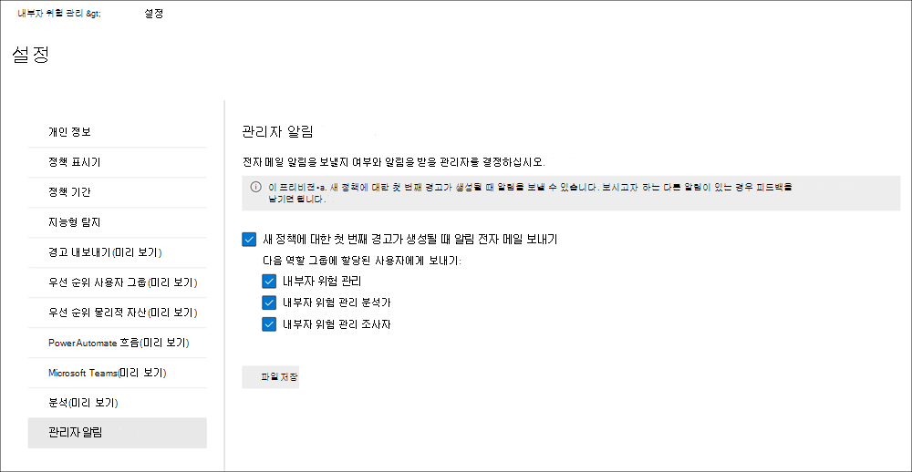

# 내부자 위험 관리 설정 시작

내부자 위험 관리 설정은 정책을 만들 때 선택한 템플릿에 관계없이 모든 내부자 위험 관리 정책에 적용됩니다. 설정 모든 내부자 위험  관리 페이지의 맨 위에 있는 내부자 위험 설정 컨트롤을 사용하여 구성됩니다. 이러한 설정은 다음 영역에 대한 정책 구성 요소를 제어합니다.

- 개인 정보
- 지표
- 정책 타임라인
- 지능형 탐지
- 경고 내보내기
- 우선 순위 사용자 그룹(미리 보기)
- 우선 순위 물리적 자산(미리 보기)
- Power Automate 흐름(미리 보기)
- Microsoft Teams(미리 보기)
- 분석

내부자 위험 관리 정책을 시작하고 만들기 전에 이러한 설정을 이해하고 조직의 규정 준수 요구에 가장 적합한 수준 설정을 선택하는 것이 중요합니다.

## 개인 정보

정책 일치가 있는 사용자의 개인 정보 보호는 매우 중요하며, 데이터 조사 및 분석 검토에서 내부자 위험 경고에 대한 객관성 향상에 도움이 될 수 있습니다. 내부자 위험 정책이 일치하는 사용자의 경우 다음 설정 중 하나를 선택할 수 있습니다.

- **사용자 이름의** 비동기화된 버전 표시: 관리자, 데이터 조사자 및 검토자는 정책 경고와 연결된 사용자를 볼 수 있도록 사용자 이름을 비동기화합니다. 예를 들어 사용자 '유정호'는 내부자 위험 관리 환경의 모든 영역에서 'AnonIS8-988'와 같이 임의의 가명과 함께 표시됩니다. 이 설정을 선택하면 현재 및 과거 정책 일치가 있는 모든 사용자를 익명화하며, 모든 정책에 적용됩니다. 이 옵션을 선택하면 내부자 위험 경고 및 사례 세부 정보의 사용자 프로필 정보를 사용할 수 없습니다. 그러나 기존 정책에 새 사용자를 추가하거나 새 정책에 사용자를 할당할 때 사용자 이름이 표시됩니다. 이 설정을 끄면 현재 또는 과거의 정책 일치가 있는 모든 사용자에 대해 사용자 이름이 표시됩니다.

    >[!IMPORTANT]
    >내부자 위험 경고가 있는 사용자나 사용자에 대한 참조 무결성을 유지하기 위해 Microsoft 365 또는 기타 시스템에서 사용자 이름의 비동기화는 내보내는 경고에 대해 보존되지 않습니다. 내보낼 경고에는 각 경고에 대한 사용자 이름이 표시됩니다.

- **사용자 이름의 비동기화된** 버전을 표시하지 않습니다. 경고 및 사례에 대한 모든 현재 및 이전 정책 일치에 대한 사용자 이름이 표시됩니다. 모든 내부자 위험 관리 경고 및 사례에 대한 사용자 프로필 정보(이름, 제목, 별칭 및 조직 또는 부서)가 사용자에게 표시됩니다.

## 지표

내부자 위험 정책 템플릿은 검색하고 조사하려는 위험 활동 유형을 정의합니다. 각 정책 템플릿은 특정 트리거 및 위험 활동에 해당하는 특정 지표를 기반으로 합니다. 모든 표시기는 기본적으로 사용하지 않도록 설정되어 있으며, 내부자 위험 관리 정책을 구성하기 전에 하나 이상의 정책 표시기를 선택해야 합니다.

사용자가 필수 임계값을 충족하는 정책 표시기와 관련된 작업을 수행할 때 정책에 의해 경고가 트리거됩니다. 내부자 위험 관리는 다음 두 가지 유형의 지표를 사용 합니다.

- **이벤트 트리거:** 사용자가 내부자 위험 관리 정책에서 활성 상태인지 여부를 결정하는 이벤트입니다. 사용자가 내부자 위험 관리 정책에 추가되는 경우 트리거 이벤트가 없는 경우 정책에 의해 사용자 활동이 평가되지 않습니다. 예를 들어 사용자 A는 사용자 정책  템플릿을 떠날 때 데이터 도용에서 만든 정책에 추가하고 정책 및 Microsoft 365 HR 커넥터가 제대로 구성되었는지 확인합니다. 사용자 A가 HR 커넥터에서 보고한 종료 날짜가 될 때까지 사용자 A 활동은 이 내부자 위험 관리 정책에 의해 평가되지 않습니다. 트리거 이벤트의 또 다른 예로는  데이터 누출 정책을 사용할 때 심각도 DLP 정책 경고가 높은 *경우를* 들 수 있습니다.
- **정책 표시기:** 범위 내 사용자에 대한 위험 점수를 결정하는 데 사용되는 내부자 위험 관리 정책에 포함된 표시기입니다. 이러한 정책 표시기는 사용자에 대해 트리거 이벤트가 발생한 후에만 활성화됩니다. 정책 표시기의 몇 가지 예로는 사용자가 개인 클라우드 저장소 서비스 또는 이동식 저장 장치로 데이터를 복사하거나, 사용자 계정이 Azure Active Directory 제거되거나, 권한이 없는 외부 사용자와 내부 파일 및 폴더를 공유하는 경우를 들 수 있습니다.

특정 정책 템플릿에 대한 트리거 이벤트를 사용자 지정하는 데도 특정 정책 표시기를 사용할 수 있습니다. 우선 순위 사용자 템플릿에  의해 일반 데이터  누출 또는 데이터 누출에 대한 정책 마법사에서 구성한 경우 이러한 표시기를 사용하면 정책 및 사용자가 정책의 범위에 범위를 벗어날 때 보다 유연하게 사용자 지정할 수 있습니다. 또한 정책에서 보다 세분화된 제어를 위해 이러한 트리거 표시기에 대한 개별 작업 임계값을 정의할 수 있습니다.

정책 표시기는 다음 영역으로 분할됩니다. 내부자 위험 정책을 만들 때 각 지표 수준에 대한 표시기 이벤트 제한을 활성화하고 사용자 지정할 수 있는 표시기를 선택할 수 있습니다.

- **Office 표시기:** 사이트, SharePoint 및 전자 메일 메시징에 Microsoft Teams 표시기가 포함됩니다.
- **장치 표시기:** 여기에는 네트워크를 통해 또는 장치와 파일을 공유하는 등의 활동에 대한 정책 표시기가 포함됩니다. 표시기에는 실행 파일(.exe) 및 동적 링크 라이브러리(.dll) 파일 활동을 제외한 모든 파일 형식과 관련된 활동이 포함됩니다. 장치 *표시기를* 선택하면 빌드 1809 이상 및 macOS(Windows 10 10.15 이상) 장치가 있는 장치에 대한 활동이 처리됩니다. Windows 및 macOS 장치의 경우 먼저 장치를 준수 센터에 온보드해야 합니다. 또한 장치 표시기에는 브라우저 신호 감지가 포함되어 조직이 파일 및 Google Chrome에서 보거나, 복사하거나, 공유하거나, 인쇄할 수 없는 파일에 대한 유출 신호를 감지하고 Microsoft Edge 수 있습니다. 내부자 위험과의 통합을 위해 Windows 장치 구성에 대한 자세한 내용은 이 문서의 장치 표시기 사용 및 Windows 장치 [온보드](insider-risk-management-settings.md#OnboardDevices) 섹션을 참조하세요. 내부자 위험과의 통합을 위해 macOS 장치를 구성하는 자세한 내용은 이 문서의 장치 표시기 및 macOS 장치 온보드 사용 섹션을 참조하세요. 브라우저 신호 감지에 대한 자세한 내용은 내부자 위험 관리 브라우저 신호 감지(미리 보기)에 대해 자세히 알아보고 구성을 [참조하세요.](insider-risk-management-browser-support.md)
- **보안 정책 위반 표시기(미리 보기)**: 승인되지 않은 또는 악성 소프트웨어 설치 또는 보안 제어 무시와 관련된 끝점용 Microsoft Defender의 표시기가 포함됩니다. 내부자 위험 관리에서 경고를 수신하려면 끝점용 활성 Defender 라이선스와 내부자 위험 통합을 사용하도록 설정해야 합니다. 내부자 위험 관리 통합을 위해 Endpoint용 Defender를 구성하는 데 대한 자세한 내용은 [끝점용 Microsoft Defender의 고급 기능 구성을 참조하세요.](/windows/security/threat-protection/microsoft-defender-atp/advanced-features\#share-endpoint-alerts-with-microsoft-compliance-center)
- **상태 레코드 액세스 표시기(미리 보기)**: 환자 의료 레코드 액세스에 대한 정책 표시기가 포함됩니다. 예를 들어 EMR(전자 의료 기록) 시스템 로그의 환자 의료 기록에 대한 액세스를 내부자 위험 관리 의료 정책과 공유할 수 있습니다. 내부자 위험 관리에서 이러한 유형의 경고를 수신하려면 의료 관련 데이터 커넥터와 HR 데이터 커넥터가 구성되어 있어야 합니다.
- **물리적 액세스 표시기(미리 보기)**: 여기에는 중요한 자산에 대한 물리적 액세스를 위한 정책 표시기가 포함됩니다. 예를 들어 실제 배지 시스템 로그의 제한된 영역에 대한 액세스 시도는 내부자 위험 관리 정책과 공유할 수 있습니다. 내부자 위험 관리에서 이러한 유형의 알림을 받으하려면 내부자 위험 관리에서 우선 순위 물리적 자산을 사용하도록 설정하고 물리적 배지 데이터 커넥터를 [구성해야](import-physical-badging-data.md) 합니다. 실제 액세스 구성에 대한 자세한 내용은 이 문서의 우선 순위 물리적 [액세스 섹션을](#priority-physical-assets-preview) 참조하십시오.
- **Microsoft Cloud App Security 표시기(미리 보기)**: 이러한 표시기에는 공유 알림의 정책 표시기가 Cloud App Security. 사용자 및 네트워크에 연결된 컴퓨터 및 Cloud App Security 다양한 동작 이상을 대상으로 하는 즉시 검색 및 데이터 데이터 검색이 시작됩니다. 내부자 위험 관리 정책 경고에 이러한 활동을 포함하려면 이 섹션에서 하나 이상의 지표를 선택합니다. 분석 및 Cloud App Security 검색에 대한 자세한 내용은 동작 분석 및 이상 검색 을 [참조하세요.](/cloud-app-security/anomaly-detection-policy)
- **위험 점수 부스터:** 비정상적인 활동 또는 과거의 정책 위반에 대한 위험 점수 상승이 포함됩니다. 위험 점수 부스터를 사용하도록 설정하면 위험 점수와 이러한 유형의 활동에 대한 경고 가능성이 증가합니다. 비정상적인 활동의 경우 검색된 활동이 사용자의 일반적인 동작과 다를 경우 점수가 향상됩니다. 예를 들어 일별 파일 다운로드가 크게 증가합니다. 비정상적인 활동은 비율의 증가로 표시됩니다(예: '평상시 활동보다 100% 높음'). 활동마다 위험 점수가 다르게 영향을 미치게 됩니다. 이전 정책 위반이 있는 사용자의 경우 이전에 확인된 정책 위반으로 확인된 사례가 두 개 이상 있는 경우 점수가 향상됩니다. 위험 점수 부스터는 하나 이상의 지표를 선택한 경우만 선택할 수 있습니다.

경우에 따라 조직의 내부자 위험 정책에 적용되는 내부자 위험 정책 표시기를 제한할 수 있습니다. 모든 내부자 위험 정책에서 특정 영역에 대한 정책 표시기를 해제할 수 있습니다. 트리거 이벤트는 일반 데이터 누수 또는  우선 순위 사용자 템플릿에 의해 데이터 누출에서 만든 정책에 한해 수정할 *수* 있습니다. 다른 모든 템플릿에서 만든 정책에는 사용자 지정 가능한 트리거 표시기 또는 이벤트가 없습니다.

모든 내부자 위험 정책에서 사용하도록 설정된 내부자 위험 정책 지표를 정의하려면 내부자 위험 설정 지표로 이동하여 하나 이상의 정책  >   지표를 선택합니다. 정책 마법사에서 내부자 위험 정책을 만들거나 편집할 때 지표 설정 페이지에서 선택한 표시기를 개별적으로 구성할 수 없습니다.

> [!NOTE]
> 수동으로 추가한 새 사용자가 사용자 대시보드에 표시될 때 몇 시간이 걸릴 **수 있습니다.** 이러한 사용자의 이전 90일 동안의 활동은 표시하는 데 최대 24시간이 걸릴 수 있습니다. 수동으로 추가된 사용자에 대한 활동을 확인하려면 사용자 대시보드에서 사용자를 선택하고 세부 정보 창에서 사용자 활동 탭을 열 수 있습니다.  

### 장치 표시기를 사용하도록 설정하고 Windows 온보드

Windows 장치에서 위험 활동 모니터링을 사용하도록 설정하고 이러한 활동에 대한 정책 표시기를 포함하려면 Windows 장치가 다음 요구 사항을 충족해야 합니다. 다음 온보더링 단계를 완료해야 합니다.

#### 1단계: 끝점 준비

내부자 위험 Windows 10 보고할 계획인 장치 장치가 이러한 요구 사항을 충족하는지 확인합니다.

1. x64 Windows 10 1809 이상을 실행하고 2020년 2월 20일부터 Windows 10 [업데이트(OS 빌드 17763.1075)를](https://support.microsoft.com/help/4537818/windows-10-update-kb4537818) 설치해야 합니다.
2. 디바이스에 로그인하는 데 사용되는 Windows 10 계정은 활성 Azure Active Directory(AAD) 계정입니다. 이 Windows 10, 하이브리드 AAD 또는 Active Directory가 AAD 또는 등록된 AAD 있습니다.
3. 끝점 Chromium Microsoft Chromium 에지 브라우저를 설치하여 클라우드 업로드 활동에 대한 작업을 모니터링합니다. [Chromium 기반 새 Microsoft Edge 다운로드하기](https://support.microsoft.com/help/4501095/download-the-new-microsoft-edge-based-on-chromium)를 참조하세요.

#### 2단계: 장치 온보더링

디바이스에서 내부자 위험 관리 활동을 모니터링하려면 먼저 장치 모니터링을 사용하도록 설정하고 끝점을 온보드해야 합니다. 두 작업은 준수 포털에서 Microsoft 365 수행됩니다.

아직 온보딩되지 않은 장치를 온보딩하려는 경우 적절한 스크립트를 다운로드하고 다음 단계에 설명된 따라 배포합니다.

이미 [엔드포인트용 Microsoft Defender](/windows/security/threat-protection/)에 온보딩된 장치가 있으면 해당 장치가 관리되는 장치 목록에 표시됩니다. 3단계: 다음 섹션의 [끝점용 Microsoft Defender에](insider-risk-management-settings.md#OnboardStep3) 장치가 온보딩된 경우를 따르십시오.

이 배포 시나리오에서는 아직 온보드되지 않은 장치를 온보드하고 모든 장치에서 내부자 위험 활동을 Windows 10 합니다.

1. <a href="https://go.microsoft.com/fwlink/p/?linkid=2077149" target="_blank">Microsoft 365 규정 준수 센터</a>를 엽니다.
2. 규정 준수 센터 설정 페이지를 열고 **장치 온보딩** 을 선택합니다.

   > [!NOTE]
   > 일반적으로 장치 온보딩이 활성화되는 데 60초 정도 소요되지만, Microsoft 지원에 연락하기 전에 30분까지 기다려보세요.

3. **장치 관리** 를 선택하여 **장치** 목록을 엽니다. 목록은 장치가 온보딩될 때까지 비어 있습니다.
4. **온보딩** 을 선택하여 온보딩 프로세스를 시작합니다.
5. 배포 방법 목록에서 이러한 더 많은 디바이스에 배포할 방법을 **선택한** 다음 **패키지를 다운로드합니다.**
6. [Windows 10 컴퓨터용 온보딩 도구와 방법](/windows/security/threat-protection/microsoft-defender-atp/configure-endpoints)의 해당 절차를 따르세요. 이 링크를 누르면 5단계에서 선택한 배포 패키지와 일치하는 엔드포인트용 Microsoft Defender에 액세스할 수 있는 랜딩 페이지로 이동합니다.
    - 그룹 정책을 사용하여 Windows 10 컴퓨터 온보딩하기
    - Microsoft Endpoint Configuration Manager를 사용하여 Windows 컴퓨터 온보딩하기
    - 모바일 장치 관리 도구를 사용하여 Windows 10 컴퓨터 온보딩하기
    - 로컬 스크립트를 사용하여 Windows 10 컴퓨터 온보딩하기
    - 비영구적 VDI(가상 데스크톱 인프라) 머신 온보딩하기

완료 및 끝점이 온보드된 후 장치 목록에 표시해야 합니다. 끝점은 내부자 위험 관리에 감사 활동 로그 보고를 시작하게 됩니다.

> [!NOTE]
> 이 환경은 라이선스 적용하에 있습니다. 필수 라이선스가 없으면 데이터가 표시되지 않거나 테이터에 액세스할 수 없습니다.

#### 3단계: 끝점용 Microsoft Defender에 장치가 온보딩된 경우

끝점용 Microsoft Defender가 이미 배포되어 있으며 보고되는 끝점이 있는 경우 이러한 모든 끝점이 관리되는 장치 목록에 표시됩니다. [2단계:](insider-risk-management-settings.md#OnboardStep2) 장치 온보더링 섹션을 사용하여 내부자 위험 관리에 새 장치를 계속 온보드하여 범위를 확장할 수 있습니다.

1. <a href="https://go.microsoft.com/fwlink/p/?linkid=2077149" target="_blank">Microsoft 365 규정 준수 센터</a>를 엽니다.
2. 규정 준수 센터 설정 페이지를 열고 **장치 모니터링 사용** 을 선택합니다.
3. **장치 관리** 를 선택하여 **장치** 목록을 엽니다. 끝점용 Microsoft Defender에 이미 보고하고 있는 장치 목록이 표시됩니다.
4. 더 **많은 디바이스를** 온보더링해야 하는 경우 온보더링을 선택하십시오.
5. 배포 방법 목록에서 이러한 더 많은 디바이스에 배포할 방법을 **선택한** 다음 패키지 **다운로드 를 선택합니다.**
6. [Windows 10 컴퓨터용 온보딩 도구와 방법](/windows/security/threat-protection/microsoft-defender-atp/configure-endpoints)의 해당 절차를 따르세요. 이 링크를 누르면 5단계에서 선택한 배포 패키지와 일치하는 엔드포인트용 Microsoft Defender에 액세스할 수 있는 랜딩 페이지로 이동합니다.
    - 그룹 정책을 사용하여 Windows 10 컴퓨터 온보딩하기
    - Microsoft Endpoint Configuration Manager를 사용하여 Windows 컴퓨터 온보딩하기
    - 모바일 장치 관리 도구를 사용하여 Windows 10 컴퓨터 온보딩하기
    - 로컬 스크립트를 사용하여 Windows 10 컴퓨터 온보딩하기
    - 비영구적 VDI(가상 데스크톱 인프라) 머신 온보딩하기

완료 및 끝점이 온보드된 후 **Devices** 테이블 아래에 표시해야 합니다. 끝점은 내부자 위험 관리에 감사 활동 로그 보고를 시작하게 됩니다.

> [!NOTE]
>이 환경은 라이선스 적용하에 있습니다. 필수 라이선스가 없으면 데이터가 표시되지 않거나 테이터에 액세스할 수 없습니다.

### 장치 표시기 사용 및 macOS 장치 온보드

MacOS 장치(카탈로니아 10.15 이상)는 Intune 또는 JAMF 2013을 사용하여 내부자 위험 관리 정책을 지원하기 위해 Microsoft 365 장치에 온보드할 수 Pro. 자세한 정보 및 구성 지침은 macOS 디바이스를 Microsoft 365 [개요(미리 보기)를 참조하세요.](device-onboarding-macos-overview.md)

### 표시기 수준 설정(미리 보기)

정책 마법사에서 정책을 만들 때 일일 위험 이벤트 수가 내부자 위험 경고의 위험 점수에 미치는 영향을 구성할 수 있습니다. 이러한 표시기 설정은 조직의 위험 이벤트 발생 횟수가 위험 점수에 어떤 영향을 주는지, 이러한 이벤트에 대한 관련 경고 심각도에 영향을 주는지 제어하는 데 도움이 됩니다. 원하는 경우 활성화된 모든 표시기에서 Microsoft에서 권장하는 기본 이벤트 임계값을 유지할 수도 있습니다.

예를 들어 내부자 위험 정책 설정에서 SharePoint 표시기를 사용하도록 설정하고 새 내부자 위험 데이터 누수 정책에 대한 지표를 구성할 때 SharePoint 이벤트에 대한 사용자 지정 임계값을 설정하도록 *결정해야* 합니다. 내부자 위험 정책 마법사에서는 이러한 이벤트와 관련된 경고의 위험 점수에 영향을 SharePoint 각 이벤트에 대해 세 가지 일일 이벤트 수준을 구성합니다.

첫 번째 일일 이벤트 수준의 경우 이벤트의 위험 점수에 대한 영향이 낮아지기 위해 하루 *10개* 이상의 이벤트로 임계값을 설정하고, 이벤트에 대한 위험 점수에 중간 정도의 영향을 미치는 경우 하루 *20개* 이상의 이벤트를 설정하고, 이벤트에 대한 위험 점수에 대한 위험 점수에 대한 더 높은 영향을 하루 *30개* 이상으로 설정합니다. 이러한 설정은 다음을 효과적으로 의미합니다.

- 이벤트 트리거 후 SharePoint 이벤트가 1-9개인 경우 위험 점수는 최소한의 영향을 받아 경고를 생성하지 않는 경향이 있습니다.
- 트리거 이벤트가 SharePoint 이벤트가 10~19개 발생하면 위험 점수는 본질적으로 낮아지며 경고 심각도 수준은 낮은 수준일 수 있습니다.
- 트리거 후에 20-29개 SharePoint 이벤트가 발생하면 위험 점수는 본질적으로 더 높고 경고 심각도 수준은 중간 수준에 있는 경향이 있습니다.
- 트리거 후 30개 이상의 SharePoint 이벤트가 발생하면 위험 점수는 본질적으로 더 높고 경고 심각도 수준은 높은 수준일 수 있습니다.

## 정책 기간

정책 기간을 통해 내부자 위험 관리 정책 템플릿의 이벤트 및 활동에 따라 정책이 일치한 후 트리거되는 과거 및 향후 검토 기간을 정의할 수 있습니다. 선택한 정책 템플릿에 따라 다음과 같은 정책 기간을 사용할 수 있습니다.

- **활성화 창:** 모든 정책 템플릿에  사용할 수 있는 정품 인증 창은 트리거 이벤트 후 창이 활성화되는 정의된 일 수입니다.  이 창은 정책에 할당된 모든 사용자에 대해 트리거 이벤트가 발생한 후 1~30일 동안 활성화됩니다. 예를 들어 내부자 위험 관리 정책을 구성하고 정품 인증 창을 30일로 설정했습니다.  정책을 구성한 후 몇 개월이 지났고 정책에 포함된 사용자 중 하나에 대해 트리거 이벤트가 발생합니다. 트리거 이벤트는 활성화  창을 활성화하고 트리거 이벤트가 발생한 후 30일 동안 해당 사용자에 대해 정책이 활성화됩니다.
- **이전 활동 검색:** 모든 정책 템플릿에서 사용할 수 있는 이전 활동 검색은  트리거 이벤트 전에 창이 활성화되는 정의된 일 수입니다.  이 창은 정책에 할당된 모든 사용자에 대해 트리거 이벤트가 발생하기 전까지 0~90일 동안 활성화됩니다. 예를 들어 내부자 위험 관리 정책을 구성하고 지난  활동 검색을 90일로 설정했습니다. 정책을 구성한 후 몇 개월이 지났고 정책에 포함된 사용자 중 하나에 대해 트리거 이벤트가 발생합니다. 트리거 이벤트는 *지난* 활동 검색을 활성화하고 정책은 트리거 이벤트 전에 90일 동안 해당 사용자에 대한 기록 활동을 수집합니다.

## 지능형 탐지

지능형 검색 설정은 경고에 대해 위험한 활동의 감지가 처리된 방법을 구체화하는 데 도움이 됩니다. 특정 상황에서는 무시할 파일 형식을 정의하거나 경고에 대한 최소 표시줄을 정의할 수 있도록 파일에 대해 검색 수준을 적용해야 할 수 있습니다. 이러한 설정을 사용하여 전체 경고 볼륨, 파일 형식 제외 및 파일 볼륨 제한을 제어합니다.

### 파일 형식 제외

모든 내부자 위험 관리 정책 일치에서 특정 파일 형식을 제외하기 위해 파일 형식 확장명을 각 별로 입력합니다. 예를 들어 정책 일치에서 특정 유형의 음악 파일을 제외하려면 *aac, mp3,wav,wma* 를 **파일 형식 제외 필드에** 입력할 수 있습니다. 이러한 확장명을 적용한 파일은 모든 내부자 위험 관리 정책에서 무시됩니다.

### 비정상적인 파일 활동에 대한 임계값

내부자 위험 정책에서 활동 경고가 보고되기 전에 최소 파일 수준을 정의하려면 파일 수를 입력합니다. 예를 들어 정책에서 이 활동을 비정상적인 것으로 고려하는 경우에도 사용자가 10개 이하의 파일을 다운로드할 때 내부자 위험 경고를 생성하지 않을 경우 '10'을 입력합니다.

### 경고 볼륨

내부자 위험 정책에서 검색된 사용자 활동에는 특정 위험 점수가 할당되어 경고 심각도(낮음, 보통, 높음)가 결정됩니다. 기본적으로 낮은, 보통 및 높은 심각도 경고가 생성되지만 요구에 맞게 볼륨을 늘리거나 줄이면 됩니다. 모든 내부자 위험 관리 정책에 대한 경고 볼륨을 조정하려면 다음 설정 중 하나를 선택합니다.

- **경고 수** 감소: 모든 높은 심각도 경고, 중간 심각도 경고 수 및 낮은 심각도 경고가 표시됩니다. 이 설정 수준은 일부 참 긍정을 놓칠 수 있습니다.
- **기본 볼륨:** 모든 높은 심각도 경고와 중간 및 낮은 심각도 경고의 균형이 조정된 양을 볼 수 있습니다.
- **추가 경고:** 모든 중간 및 높은 심각도 경고와 가장 낮은 심각도 경고가 표시됩니다. 이 설정 수준으로 인해 더 많은 가 양의 결과가 나타날 수 있습니다.

### 끝점용 Microsoft Defender(미리 보기)

[끝점용 Microsoft Defender는](/windows/security/threat-protection/microsoft-defender-atp/microsoft-defender-advanced-threat-protection) 엔터프라이즈 네트워크가 고급 위협을 방지, 감지, 조사 및 대응하도록 설계된 엔터프라이즈 끝점 보안 플랫폼입니다. 조직에서 보안 위반을 보다 잘 표시하기 위해 내부자 위험 관리 보안 위반 정책 템플릿에서 만든 정책에 사용되는 활동에 대한 끝점 경고에 대한 Defender를 가져오고 필터링할 수 있습니다.

관심 있는 신호 유형에 따라 끝점 경고 등급에 대한 Defender를 기반으로 내부자 위험 관리로 경고를 가져올 수 있습니다. 가져올 전역 설정에서 다음 경고 등급 상태를 하나 이상 정의할 수 있습니다.

- 알 수 없음
- 신규
- 진행 중
- 해결됨

Endpoint용 Defender의 경고는 매일 가져오기됩니다. 선택한 Triage 상태에 따라 Endpoint용 Defender에서 동일한 경고에 대한 여러 사용자 활동이 표시될 수 있습니다.

예를 들어 이 설정에 대해 새로  *추가,* 진행 중 및 해결을 선택하면 끝점에 대한 Microsoft Defender 경고가 생성되고 상태가 새로 고치면 내부자 위험 상태인 사용자에 대해 초기 경고 활동이 가져오기됩니다. Endpoint용 Defender 평가 상태가 진행 중으로 변경될 때 내부자 위험 상태의 사용자에 대해 이 경고에 대한 두 번째 활동을 가져오게 됩니다. 해결된 끝점에 대한 최종 평가  상태가 설정되면 내부자 위험 상태의 사용자에 대해 이 경고에 대한 세 번째 활동을 가져오게 됩니다. 이 기능을 통해 조사자는 끝점에 대한 Defender 경고의 진행을 따르고 조사에 필요한 가시성 수준을 선택할 수 있습니다.

> [!IMPORTANT]
> 조직에서 엔드포인트용 Microsoft Defender를 구성하고 Defender 보안 센터의 내부 위험 관리 통합을 위해 엔드포인트용 Defender를 사용하도록 설정하여 보안 위반 경고를 가져와야 합니다. 내부 위험 관리 통합을 위해 엔드포인트용 Defender를 구성하는 방법에 대한 자세한 내용은 [엔드포인트용 Defender 고급 기능 구성](/windows/security/threat-protection/microsoft-defender-atp/advanced-features\#share-endpoint-alerts-with-microsoft-compliance-center)을 참조하세요.

### 도메인

도메인 설정을 사용하면 특정 도메인에 대한 활동에 대한 위험 수준을 정의할 수 있습니다. 이러한 활동에는 파일 공유, 전자 메일 메시지 보내기, 다운로드 또는 콘텐츠 업로드가 포함됩니다. 이러한 설정에서 도메인을 지정하면 이러한 도메인에서 진행되는 활동에 대한 위험 점수가 증가하거나 감소할 수 있습니다.

도메인 추가를 사용하여 각 도메인 설정에 대한 도메인을 정의합니다. 또한 와일드카드를 사용하여 루트 도메인 또는 하위 도메인의 변형을 일치할 수 있습니다. 예를 들어 sales.wingtiptoys.com 및 support.wingtiptoys.com 지정하기 위해 와일드카드 항목 '*.wingtiptoys.com'를 사용하여 이러한 하위 wingtiptoys.com 및 같은 수준의 다른 모든 하위omain과 일치하게 합니다. 루트 도메인에 대해 다단계 하위 도메인을 지정하려면 다단계 하위 도메인 포함 확인란을 **선택해야** 합니다.

다음 각 도메인 설정에 대해 최대 500개 도메인을 입력할 수 있습니다.

- **사용할 수 없는 도메인:** 사용할 수 없는 도메인을 지정하면 이러한 도메인에서 진행되는 활동의 위험 점수가 *높아집니다.* 일부 예로는 다른 사용자와 콘텐츠를 공유하는 작업(예: gmail.com 주소가 있는 사람에게 전자 메일 보내기) 및 사용자가 이러한 사용할 수 없는 도메인 중 하나에서 디바이스로 콘텐츠를 다운로드하는 경우를 예로 들 수 있습니다.
- **허용되는 도메인:** 허용 도메인과 관련된 특정 활동은 정책에서 무시되고 경고를 생성하지 않습니다. 이러한 활동에는 다음이 포함됩니다.

    - 외부 도메인으로 전송된 전자 메일
    - 파일, 폴더, 외부 도메인과 공유되는 사이트
    - 외부 도메인에 업로드된 파일(Microsoft Edge 브라우저 사용)

    설정에서 허용되는 도메인을 지정하면 이러한 도메인에 대한 이 활동은 내부 조직 활동이 처리되는 방식과 유사하게 처리됩니다. 예를 들어 여기에 추가된 도메인은 조직 외부의 사용자와 콘텐츠를 공유하는 작업(예: 주소가 있는 사람에게 전자 메일을 보내는 경우)에 gmail.com 수 있습니다.

- **타사 도메인:** 조직에서 비즈니스 목적으로 타사 도메인을 사용하는 경우(예: 클라우드 저장소) 장치 표시기와 관련된 활동에 대한 알림을 받을 수 있도록 여기에 해당 도메인을 포함합니다. 브라우저를 사용하여 타사 사이트에서 콘텐츠를 *다운로드합니다.*

## 경고 내보내기

내부자 위험 관리 경고 정보는 SEM(보안 정보 및 이벤트 관리) 및 SOAR(보안 오케스트레이션 자동화 [응답 Office 365)](/office/office-365-management-api/office-365-management-activity-api-schema#security-and-compliance-alerts-schema)솔루션으로 내보낼 수 있습니다. Office 365 활동 API를 사용하여 조직에서 내부자 위험 정보를 관리하거나 집계하는 데 사용할 수 있는 다른 응용 프로그램으로 경고 정보를 내보낼 수 있습니다. 알림 정보는 관리 활동 API를 통해 60분마다 내보내고 Office 365 수 있습니다.

조직에서 Azure Sentinel을 사용하는 경우, 내부자 위험 관리 데이터 커넥터를 사용하여 내부자 위험 경고 정보를 Sentinel로 가져올 수도 있습니다. 자세한 내용은 sentinel [문서의 Microsoft 365 IRM(Insider Risk Management)(미리](/azure/sentinel/data-connectors-reference#microsoft-365-insider-risk-management-irm-preview) 보기)을 참조하세요.

>[!IMPORTANT]
>내부자 위험 경고가 있는 사용자나 사용자에 대한 참조 무결성을 유지하기 위해 Microsoft 365 또는 기타 시스템에서 사용자 이름의 비동기화는 내보내는 경고에 대해 보존되지 않습니다. 내보낼 경고에는 각 경고에 대한 사용자 이름이 표시됩니다.

API를 사용하여 내부자 위험 경고 정보를 검토합니다.

1. 내부자 위험 관리에서 Office 365 관리 활동 API 지원을 사용하도록 설정하고 설정  >    >  **수 있습니다.** 기본적으로 이 설정은 조직에서 사용하지 Microsoft 365 않습니다.
2. *SecurityComplianceAlerts를* Office 365 일반적인 감사 활동을 필터링합니다.
3. *InsiderRiskManagement* 범주별로 *SecurityComplianceAlerts를* 필터링합니다.

경고 정보에는 보안 및 규정 준수 경고 schema 및 Office 365 관리 활동 API 공통된 Office 365 포함되어 있습니다.

Security & 규정 준수 경고에 대한 내부자 위험 관리 경고에 대해 다음 필드와 값을 내보낼 수 있습니다.

| **Alert 매개 변수** | **설명** |
|:------------------|:----------------|
| AlertType | 경고의 유형은 사용자 지정 *입니다.*  |
| AlertId | 경고의 GUID입니다. 내부자 위험 관리 경고는 변경 가능합니다. 경고 상태가 변경될 때 동일한 AlertID를 사용하여 새 로그가 생성됩니다. 이 AlertID는 경고에 대한 업데이트를 상관 관계에 두는 데 사용할 수 있습니다. |
| Category | 경고의 범주는 *InsiderRiskManagement입니다.* 이 범주를 사용하여 다른 보안 및 준수 경고와 이러한 경고를 & 수 있습니다. |
| 설명 | 경고에 대한 기본 설명입니다. 값은 *새* 경고(경고가 생성될 때 기록) 및 *경고* 업데이트(경고 업데이트가 있는 경우 기록)입니다. AlertID를 사용하여 경고에 대한 업데이트의 상관 관계가 있습니다. |
| 데이터 | 경고에 대한 데이터에는 고유한 사용자 ID, 사용자 계정 이름 및 사용자가 정책에 트리거된 날짜 및 시간(UTC)이 포함됩니다. |
| 이름 | 경고를 생성한 내부자 위험 관리 정책의 정책 이름입니다. |
| PolicyId | 경고를 트리거한 내부자 위험 관리 정책의 GUID입니다. |
| 심각도 | 경고의 심각도입니다. 값은 *High,* *Medium* 또는 *Low입니다.* |
| 원본 | 경고의 원본입니다. 값은 Security *Office 365 준수 & 입니다.* |
| 상태 | 경고 상태입니다. 값은 *활성(내부자* 위험에서 검토 *필요),* 조사(내부자 위험에서 *확인),* 해결(내부자 위험에서 해결), 해지(내부자 위험에서 해지).    |
| 버전 | 보안 및 규정 준수 경고의 버전입니다. |

다음 필드 및 값은 Office 365 관리 활동 API 공통적인 Office 365 대한 내부자 위험 관리 [경고에 대해 내보내집니다.](/office/office-365-management-api/office-365-management-activity-api-schema#common-schema)

- UserId
- Id
- RecordType
- CreationTime
- 작업
- OrganizationId
- UserType
- UserKey

## 우선 순위 사용자 그룹(미리 보기)

조직의 사용자는 자신의 위치, 중요한 정보에 대한 액세스 수준 또는 위험 내역에 따라 다양한 위험 수준을 가지게 될 수 있습니다. 이러한 사용자의 활동의 검사 및 점수 지정을 지정하면 조직에 더 높은 결과를 초래할 수 있는 잠재적인 위험을 경고하는 데 도움이 될 수 있습니다. 내부자 위험 관리의 우선 순위 사용자 그룹은 보다 세밀한 검사와 보다 중요한 위험 점수가 필요한 조직의 사용자를 정의하는 데 도움이 됩니다. 우선 순위  사용자에 의해 보안 정책  위반 및 우선 순위 사용자 정책 템플릿에 의해 데이터 누출과 함께, 우선 순위 사용자 그룹에 추가된 사용자는 심각도 수준이 더 높은 내부자 위험 경고 및 경고의 가능성이 증가합니다.

우선 순위 사용자 그룹은 모든 분석가와 조사자에 의해 검토하도록 열지 않고 검토 활동을 특정 사용자 또는 내부자 위험 역할 그룹으로 제한해야 할 수도 있습니다. 개별 사용자 및 역할 그룹을 할당하여 각 우선 순위 사용자 그룹에 대한 사용자, 경고, 사례 및 보고서를 검토하도록 선택할 수 있습니다. 우선 순위 사용자 그룹에는 기본 제공 내부자 위험 *관리,* 내부자 위험 관리  분석가 및 내부자 위험 관리 조사자 역할 그룹, 이러한 역할 그룹 중 하나 이상 또는 사용자 지정 선택에 할당된 검토 권한이 할당될 *수* 있습니다.

예를 들어 사용자가 중요한 정보에 액세스할 수 있는 기밀 프로젝트에 대해 데이터 누출을 방지해야 합니다. 이 프로젝트에서 작업하는 *Project*  사용자 우선 순위 사용자 그룹을 만들 수 있습니다. 또한 이 우선 순위 사용자 그룹에는 모든 기본 내부자 위험 관리 관리자, 분석가 및 조사자에 그룹과 연결된 사용자, 알림, 사례 및 보고서가 표시되지 않습니다. 이 **설정** 사용자 우선 순위  Project 그룹을 만들고 두 사용자를 그룹과 관련된 데이터를 볼 수 있는 검토자로 할당합니다. 정책 마법사 및 우선 순위 사용자에 의해 *데이터* 누출 정책 템플릿을 사용하여 새 정책을 만들고 기밀 Project *사용자* 우선 순위 사용자 그룹을 정책에 할당합니다. *Confidential* Project 사용자 우선 순위 사용자 그룹의 구성원에 대한 정책에서 검사하는 활동은 이러한 사용자의 위험 및 활동에 더 민감하며, 경고를 생성하고 심각도 수준이 더 높은 경고를 하게 됩니다.

### 우선 순위 사용자 그룹 만들기

새 우선 순위 사용자 그룹을 만들기 위해 이  그룹의 내부자 위험 관리 솔루션에서 컨트롤을 Microsoft 365 규정 준수 센터. 우선 순위 사용자 그룹을 만들하려면 내부자  위험 관리 또는 내부자 위험 관리 관리자 역할 그룹의 *구성원이* 되어야 합니다.

우선 순위 사용자 그룹을 만들 수 있도록 다음 단계를 완료합니다.

1. 에서 <a href="https://go.microsoft.com/fwlink/p/?linkid=2077149" target="_blank">Microsoft 365 규정 준수 센터</a>내부자 위험 **관리로 이동하고** 내부자 위험 **설정을 선택합니다.**
2. 우선 **순위 사용자 그룹(미리 보기) 페이지를** 선택합니다.
3. 우선 **순위 사용자 그룹(미리 보기) 페이지에서** 우선 순위 사용자 그룹 만들기를 선택하여 그룹 만들기 마법사를 시작합니다. 
4. 이름 **및 설명 페이지에서** 다음 필드를 입력합니다.
    - **이름(필수)**: 우선 순위 사용자 그룹의 이름을 입력합니다. 마법사를 완료한 후 우선 순위 사용자 그룹의 이름을 변경할 수 없습니다.
    - **설명(선택 사항)**: 우선 순위 사용자 그룹에 대한 설명을 입력합니다.
5. **다음** 을 선택하여 계속합니다.
6. 구성원 **선택 페이지에서** 검색할 구성원 선택을 선택하고 그룹에 포함되는 메일 사용이 가능한  사용자 계정을 선택하거나 모두 선택 확인란을 선택하여 조직의 모든 사용자를 그룹에 추가합니다.  그룹에 **사용자를** 추가하지 않고 계속하려면 추가를 선택하거나 취소를 선택하여 닫습니다. 
7. **다음** 을 선택하여 계속합니다.
8. 이 **그룹을 볼** 수 있는 사용자 선택 페이지에서 우선 순위 사용자 그룹에 대한 사용자, 경고, 사례 및 보고서를 검토할 수 있는 사용자를 정의해야 합니다. 하나 이상의 사용자 또는 내부자 위험 관리 역할 그룹을 할당해야 합니다. 사용자 **및** 역할 그룹 선택을 선택하고 우선 순위 사용자 그룹에 할당할 사용자 또는 내부자 위험 관리 역할 그룹을 선택합니다. **추가를** 선택하여 선택한 사용자 또는 역할 그룹을 그룹에 할당합니다.
9. 다음을 선택하여 계속합니다.
10. 검토 **페이지에서** 우선 순위 사용자 그룹에 대해 선택한 설정을 검토합니다. 링크 **편집을** 선택하여 그룹 값을 변경하거나  제출을 선택하여 우선 순위 사용자 그룹을 만들고 활성화합니다.
11. 확인 페이지에서 완료를 선택하여 **마법사를** 종료합니다.

### 우선 순위 사용자 그룹 업데이트

기존 우선 순위 사용자 그룹을 업데이트하기 위해 내부자  위험 관리 솔루션의 설정 컨트롤을 Microsoft 365 규정 준수 센터. 우선 순위 사용자 그룹을 업데이트하려면 내부자  위험 관리 또는 내부자 위험 관리 관리자 역할 그룹의 *구성원이* 되어야 합니다.

우선 순위 사용자 그룹을 편집하려면 다음 단계를 완료합니다.

1. 에서 <a href="https://go.microsoft.com/fwlink/p/?linkid=2077149" target="_blank">Microsoft 365 규정 준수 센터</a>내부자 위험 **관리로 이동하고** 내부자 위험 **설정을 선택합니다.**
2. 우선 **순위 사용자 그룹(미리 보기) 페이지를** 선택합니다.
3. 편집할 우선 순위 사용자 그룹을 선택하고 그룹 **편집 을 선택합니다.**
4. 이름 **및 설명 페이지에서** 필요한 경우 설명 필드를 업데이트합니다. 우선 순위 사용자 그룹의 이름은 업데이트할 수 없습니다. **다음** 을 선택하여 계속합니다.
5. 구성원 **선택 페이지에서** 구성원 선택 컨트롤을 사용하여 그룹에 새 **구성원을 추가합니다.** 그룹에서 사용자를 제거하려면 제거할 사용자 옆에 있는 'X'를 선택합니다. **다음** 을 선택하여 계속합니다.
6. 이 **그룹을** 볼 수 있는 사용자 선택 페이지에서 우선 순위 사용자 그룹에 대한 사용자, 경고, 사례 및 보고서를 검토할 수 있는 사용자 또는 역할 그룹을 추가하거나 제거합니다.
7. **다음** 을 선택하여 계속합니다.
8. 검토 **페이지에서** 우선 순위 사용자 그룹에 대해 선택한 업데이트 설정을 검토합니다. 그룹 **값을** 변경하려면 링크 편집을 선택하거나 제출을 선택하여 우선 순위 **사용자** 그룹을 업데이트합니다.
9. 확인 페이지에서 완료를 선택하여 **마법사를** 종료합니다.

### 우선 순위 사용자 그룹 삭제

기존 우선 순위 사용자 그룹을 삭제하려면 이 그룹의  내부자 위험 관리 솔루션에서 컨트롤을 Microsoft 365 규정 준수 센터. 우선 순위 사용자 그룹을 삭제하려면 내부자  위험 관리 또는 내부자 위험 관리 *관리자* 역할 그룹의 구성원이 되어야 합니다.

> [!IMPORTANT]
> 우선 순위 사용자 그룹을 삭제하면 해당 그룹이 할당된 활성 정책에서 해당 그룹이 제거됩니다. 활성 정책에 할당된 우선 순위 사용자 그룹을 삭제하면 정책에 범위 내 사용자가 포함되지 않은 것이 아니라 실제로 유휴 상태이기만 하면 경고가 생성되지 않습니다.

우선 순위 사용자 그룹을 삭제하려면 다음 단계를 완료합니다.

1. 에서 <a href="https://go.microsoft.com/fwlink/p/?linkid=2077149" target="_blank">Microsoft 365 규정 준수 센터</a>내부자 위험 **관리로 이동하고** 내부자 위험 **설정을 선택합니다.**
2. 우선 **순위 사용자 그룹(미리 보기) 페이지를** 선택합니다.
3. 편집할 우선 순위 사용자 그룹을 선택하고 대시보드 메뉴에서 **삭제를** 선택합니다.
4. 삭제 **대화 상자에서** **예를** 선택하여 우선 순위  사용자 그룹을 삭제하거나 취소를 선택하여 대시보드로 돌아온다.

## 우선 순위 물리적 자산(미리 보기)

우선 순위 물리적 자산에 대한 액세스를 식별하고 액세스 활동을 사용자 이벤트와 상호 관련하는 것은 규정 준수 인프라의 중요한 구성 요소입니다. 이러한 물리적 자산은 회사 건물, 데이터 센터 또는 서버 방과 같은 조직의 우선 순위 위치를 나타내고 있습니다. 내부자 위험 활동은 비정상적인 시간 동안 작업하는 사용자, 권한이 없는 중요하거나 안전한 영역에 액세스하려고 하는 사용자, 그리고 합법적인 요구 없이 높은 수준의 영역에 대한 액세스 요청과 연결될 수 있습니다.

우선 순위 물리적 자산을 사용하도록 설정하고 물리적 배지 데이터 커넥터를 구성하면 내부자 위험 관리는 물리적 제어 및 액세스 시스템의 신호를 다른 사용자 위험 활동과 통합합니다.  실제 액세스 시스템 전체의 동작 패턴을 검사하고 이러한 활동과 다른 내부자 위험 이벤트와 상호 관련하면, 내부자 위험 관리는 규정 준수 조사자 및 분석가가 경고에 대한 보다 합리적인 대응 결정을 내리는 데 도움이 될 수 있습니다. 우선 순위 물리적 자산에 대한 액세스는 우선 순위가 아닌 자산에 대한 액세스와는 다르게 인사이트에서 점수가 매기고 식별됩니다.

예를 들어 조직에는 정상적인 작업 및 중요한 프로젝트 영역에 대한 물리적 액세스를 모니터링하고 승인하는 사용자를 위한 배지 시스템이 있습니다. 여러 사용자가 중요한 프로젝트에서 작업하고 있으며 이러한 사용자는 프로젝트가 완료되면 조직의 다른 영역으로 돌아올 것입니다. 중요한 프로젝트가 거의 완료되는 경우 프로젝트 작업을 기밀로 유지하고 프로젝트 영역에 대한 액세스를 긴밀하게 제어해야 합니다.

물리적 배지 데이터 커넥터를 Microsoft 365 물리적 배지 시스템에서 액세스 정보를 가져오고 내부자 위험 관리에서 우선 순위 물리적 자산을 지정하도록 선택할 수 있습니다. 배지 시스템에서 정보를 가져오고 실제 액세스 정보를 내부자 위험 관리에 식별된 다른 위험 활동과 상호 관련하면 프로젝트의 사용자 중 한 명은 정상 근무 시간 후에 프로젝트 사무실에 액세스하고 있으며, 일반 작업 영역의 개인 클라우드 저장소 서비스로 많은 양의 데이터를 내보낼 수 있습니다. 온라인 활동과 관련된 이러한 물리적 액세스 활동은 가능한 데이터 도용 및 규정 준수 조사자 및 분석가가 해당 사용자의 상황에 따라 적절한 조치를 취할 수 있습니다.

### 우선 순위 물리적 자산 구성

우선 순위 물리적 자산을 구성하기 위해 물리적 배지 커넥터를 구성하고 내부자 위험 관리 솔루션의 설정 컨트롤을 Microsoft 365 규정 준수 센터.  우선 순위 물리적 자산을 구성하려면 내부자 위험 관리 또는 내부자 위험 관리 관리자 역할 그룹의  *구성원이 되어야 합니다.*

우선 순위 물리적 자산을 구성하기 위해 다음 단계를 완료합니다.

1. 내부자 위험 관리 시작 문서의 내부자 위험 관리에 대한 구성 [단계를 따릅니다.](insider-risk-management-configure.md) 3단계에서 실제 배지 커넥터를 구성해야 합니다.

    > [!IMPORTANT]
    > 내부자 위험 관리 정책이 종료 및 종료된 사용자와 관련된 신호 데이터를 실제 제어 및 액세스 플랫폼의 이벤트 데이터와 사용 및 상관 관계화하려면 내부자 위험 관리 정책도 Microsoft 365 HR 커넥터를 구성해야 합니다. Microsoft 365 HR 커넥터를 사용하도록 설정하지 않고 물리적 배지 커넥터를 사용하도록 설정하면 내부자 위험 관리 정책은 조직의 사용자에 대한 실제 액세스 활동에 대한 이벤트만 처리합니다.

2. 다음 <a href="https://go.microsoft.com/fwlink/p/?linkid=2077149" target="_blank">Microsoft 365 규정 준수 센터</a>에서 내부자 위험 관리로 **이동하고** 내부자 위험 **설정** 우선 순위 물리적  >  **자산 을 선택합니다.**
3. 우선  순위 물리적 자산 페이지에서 물리적 배지 커넥터에서 가져온 자산 이벤트를 모니터링할 실제 자산 ID를 수동으로 추가하거나 물리적 배지 커넥터에서 가져온 모든 물리적 자산의 .csv 파일을 가져올 수 있습니다. a) 물리적 자산을 수동으로 추가하려면 우선 순위 물리적 자산 추가를 선택합니다.  실제 자산 ID를 입력한 다음 추가를 **선택합니다.** 다른 실제 자산 ID를  입력한 다음 우선 순위 실제 자산 추가를 선택하여 입력한 모든 자산을 저장합니다.
    b) .csv 파일에서 실제 자산 .csv 목록을 추가하기 위해 우선 순위 실제 자산 **가져오기 를 선택합니다.** 파일 탐색기 대화 상자에서 가져올 .csv 파일을 선택한 다음 열기를 **선택합니다.** 파일에서 실제 자산 .csv 목록에 추가됩니다.
4. 에서 **정책 표시기** **페이지로 설정.**
5. 정책 **표시기 페이지에서** 물리적 액세스  표시기 섹션으로 이동하여 종료 후 물리적 액세스 또는 중요한 자산에 대한 액세스에 실패한 후의 확인란을 **선택합니다.**
6. 저장을 **선택하여** 구성하고 종료합니다.

### 우선 순위 실제 자산 삭제

기존 우선 순위 물리적 자산을 삭제하려면 내부자 위험 관리 솔루션에서 설정 컨트롤을 Microsoft 365 규정 준수 센터. 우선 순위 물리적 자산을 삭제하려면 내부자 위험 관리 또는 내부자 위험 관리 관리자 역할 그룹의 구성원이 되어야 합니다.

> [!IMPORTANT]
> 우선 순위 물리적 자산을 삭제하면 이전에 포함했던 활성 정책에 의해 검사에서 제거됩니다. 우선 순위 실제 자산과 관련된 활동에서 생성된 경고는 삭제되지 않습니다.

우선 순위 물리적 자산을 삭제하려면 다음 단계를 완료합니다.

1. 다음 [Microsoft 365 규정 준수 센터](https://compliance.microsoft.com)에서 내부자 위험 관리로 **이동하고** 내부자 위험 **설정** 우선 순위 물리적  >  **자산 을 선택합니다.**
2. 우선 **순위 물리적 자산 페이지에서** 삭제할 자산을 선택합니다.
3. 작업 **메뉴에서** 삭제를 선택하여 자산을 삭제합니다.

## Power Automate 흐름(미리 보기)

[Microsoft Power Automate](/power-automate/getting-started) 응용 프로그램 및 서비스 전체에서 작업을 자동화하는 워크플로 서비스입니다. 서식 파일에서 흐름을 사용하거나 수동으로 만든 경우 이러한 응용 프로그램 및 서비스와 관련된 일반적인 작업을 자동화할 수 있습니다. 내부자 위험 Power Automate 흐름을 사용하도록 설정하면 사례 및 사용자에 대한 중요한 작업을 자동화할 수 있습니다. 사용자Power Automate 경고 및 사례 정보를 검색하고 이 정보를 이해 관계자 및 기타 응용 프로그램과 공유하도록 구성할 수 있을 뿐만 아니라 사례 메모에 게시와 같은 내부자 위험 관리 작업을 자동화할 수 있습니다. Power Automate 흐름은 정책의 범위에 있는 모든 사용자 및 사례에 적용할 수 있습니다.

내부자 위험 관리를 Microsoft 365 구독을 사용하는 고객은 권장되는 내부자 위험 관리 Power Automate 템플릿을 사용하기 위해 추가 Power Automate 필요가 없습니다. 이러한 템플릿은 조직을 지원하고 핵심 내부자 위험 관리 시나리오를 다루기 위해 사용자 지정될 수 있습니다. 이러한 템플릿에서 프리미엄 Power Automate 기능을 사용하려면 Microsoft 365 준수 커넥터를 사용하여 사용자 지정 템플릿을 만들거나 Microsoft 365 다른 준수 영역에 대해 Power Automate 템플릿을 사용하려면 추가 Power Automate 라이선스가 필요할 수 있습니다.

내부자 위험 Power Automate 사용자 및 사례에 대한 프로세스 자동화를 지원하기 위해 고객에게 다음과 같은 Power Automate 템플릿이 제공됩니다.

- **내부자** 위험 정책에 추가될 때 사용자에게 알림: 이 템플릿은 내부 정책, 개인 정보 보호 또는 내부자 위험 관리 정책이 적용될 때 사용자에게 알림을 제공해야 하는 규정 요구 사항이 있는 조직을 위한 것입니다. 사용자 페이지에서 사용자에 대해 이 흐름을  구성하고 선택하면 사용자가 내부자 위험 관리 정책에 추가될 때 사용자와 해당 관리자에게 전자 메일 메시지가 전송됩니다. 또한 이 템플릿은 SharePoint/시간 및 메시지 받는 사람과 같은 알림 메시지 세부 SharePoint 추적하는 데 도움이 되는 SharePoint 목록 업데이트도 지원됩니다. 개인 정보 설정에서 사용자에 대해 동의를 하도록 선택한 경우 이 템플릿에서 만든 흐름은 사용자 개인 정보를 유지하기 위해 의도한 것만큼 작동하지 않습니다. Power Automate 사용 가능한 흐름은 사용자 **대시보드에서 사용할 수 있습니다.**
- 내부자 위험 사례의 사용자에 대한 **HR** 또는 비즈니스 정보 요청: 사례에 대해 작업할 때 내부자 위험 분석가 및 조사자는 사례 활동의 컨텍스트를 이해하기 위해 HR 또는 기타 이해 관계자와 협의해야 할 수 있습니다. 이 흐름을 구성하고 사례에 대해 선택하면 분석가와 조사자는 이 흐름에 대해 구성된 HR 및 비즈니스 이해 관계자에게 전자 메일 메시지를 전송합니다. 각 받는 사람에게 미리 구성되거나 사용자 지정 가능한 응답 옵션이 있는 메시지가 전송됩니다. 받는 사람이 응답 옵션을 선택하면 응답이 사례 메모로 기록됩니다. 여기에는 받는 사람 및 날짜/시간 정보가 포함됩니다. 개인 정보 설정에서 사용자에 대해 동의를 하도록 선택한 경우 이 템플릿에서 만든 흐름은 사용자 개인 정보를 유지하기 위해 의도한 것만큼 작동하지 않습니다. Power Automate 사용 흐름은 사례 **대시보드에서 사용할 수 있습니다.**
- **사용자에게 내부자** 위험 경고가 표시될 때 관리자에게 알림: 일부 조직에서는 사용자가 내부자 위험 관리 경고가 표시될 때 즉각적인 관리 알림을 제공해야 할 수 있습니다. 이 흐름을 구성하고 선택하면 사례 사용자의 관리자에게 모든 사례 알림에 대한 다음 정보가 있는 전자 메일 메시지가 전송됩니다.
    - 경고에 적용할 수 있는 정책
    - 경고 날짜/시간
    - 경고의 심각도 수준

    흐름은 메시지가 전송되고 흐름이 활성화되었다는 사례 메모를 자동으로 업데이트합니다. 개인 정보 설정에서 사용자에 대해 동의를 하도록 선택한 경우 이 템플릿에서 만든 흐름은 사용자 개인 정보를 유지하기 위해 의도한 것만큼 작동하지 않습니다. Power Automate 사용 흐름은 사례 **대시보드에서 사용할 수 있습니다.**
- **ServiceNow에서** 내부자 위험 사례에 대한 레코드 만들기 : 이 템플릿은 ServiceNow 솔루션을 사용하여 내부자 위험 관리 사례를 추적하려는 조직을 위한 것입니다.  이 경우 내부자 위험 분석가 및 조사자는 ServiceNow에서 사례에 대한 레코드를 만들 수 있습니다. 조직의 요구 사항에 따라 ServiceNow에서 선택한 필드를 채우기 위해 이 템플릿을 사용자 지정할 수 있습니다. Power Automate 사용 흐름은 사례 **대시보드에서 사용할 수 있습니다.** 사용 가능한 ServiceNow 필드에 대한 자세한 내용은 [ServiceNow Connector 참조 문서를 참조하세요.](/connectors/service-now/)

### 내부자 위험 관리 Power Automate 흐름 만들기

권장되는 내부자 위험 관리 템플릿에서 Power Automate 흐름을 만들기 위해 사례 또는  사용자에서 직접 작업할 때 Microsoft 365 규정 준수 센터 또는  자동화 컨트롤의 Power Automate 흐름  관리 옵션의 내부자 위험 관리 솔루션에 있는 설정 컨트롤을 사용합니다.  **s 대시보드**.

설정 Power Automate 흐름을 만들하려면 내부자 위험 관리 또는 내부자 위험 관리 관리자 역할 그룹의 *구성원이* 되어야 합니다.  관리 Power Automate 흐름 관리 옵션을  사용하여 Power Automate 흐름을 만들하려면 하나 이상의 내부자 위험 관리 역할 그룹의 구성원이 되어야 합니다.

다음 단계를 완료하여 권장되는 내부자 위험 Power Automate 흐름을 만듭니다.

1. 다음 <a href="https://go.microsoft.com/fwlink/p/?linkid=2077149" target="_blank">Microsoft 365 규정 준수 센터</a>에서 내부자 위험 관리로  **이동하여** 흐름에 대한  >  **내부자 위험 Power Automate 선택합니다.** 또한 사례 또는 사용자  대시보드 페이지에서 프로세스 관리 흐름 자동화를 선택하여   >  **Power Automate 있습니다.**
2. Power Automate **흐름** 페이지에서 페이지의 원하는 내부자 위험  관리 템플릿 섹션에서 권장 템플릿을 선택합니다.
3. 흐름에는 흐름에 필요한 포함된 연결이 나열되어 있으며 연결 상태를 사용할 수 있는지 확인합니다. 필요한 경우 사용 가능한 것으로 표시되지 않는 연결을 업데이트합니다. **계속** 을 선택합니다.
4. 기본적으로 권장되는 흐름은 권장되는 내부자 위험 관리 및 Microsoft 365 할당된 작업을 완료하는 데 필요한 서비스 데이터 필드를 사용하여 미리 구성됩니다. 필요한 경우 고급 옵션 표시 컨트롤을 사용하고 흐름 구성 요소에 대해 사용 가능한 속성을 구성하여 흐름 구성 요소를 사용자 지정합니다. 
5. 필요한 경우 새 단계 단추를 선택하여 흐름에 다른 단계를 **추가합니다.** 대부분의 경우 권장되는 기본 서식 파일은 필요하지 않습니다.
6. 추가 **구성을 위해** 흐름을 저장하려면  초안 저장을 선택하거나 저장을 선택하여 흐름에 대한 구성을 완료합니다.
7. 닫기 **를** 선택하여 흐름 **Power Automate 클릭합니다.** 새 템플릿은 **내** 흐름 탭에 흐름으로 나열되며, 흐름을  만드는 사용자의 내부자 위험 관리 사례와 함께 작업할 때 자동화 드롭다운 컨트롤에서 자동으로 사용할 수 있습니다.

> [!IMPORTANT]
> 조직의 다른 사용자가 흐름에 액세스해야 하는 경우 흐름을 공유해야 합니다.

### 내부자 위험 Power Automate 사용자 지정 관리 흐름 만들기

조직의 일부 프로세스 및 워크플로는 권장되는 내부자 위험 관리 흐름 템플릿 외부에 있을 수 있으며 내부자 위험 관리 영역에 대한 사용자 지정 Power Automate 흐름을 만들어야 할 수 있습니다. Power Automate 흐름은 유연하며 광범위한 사용자 지정을 지원하지만 내부자 위험 관리 기능과 통합하기 위해 필요한 단계가 있습니다.

다음 단계를 완료하여 내부자 위험 관리를 Power Automate 사용자 지정 템플릿을 만듭니다.

1. **Power Automate 흐름** 라이선스 확인: 내부자 위험 관리 Power Automate 사용하는 사용자 지정된 사용자 지정 흐름을 만들하려면 Power Automate 라이선스가 필요합니다. 권장되는 내부자 위험 관리 흐름 템플릿은 추가 라이선스가 필요하지 않습니다. 이 템플릿은 내부자 위험 관리 라이선스의 일부로 포함되어 있습니다.
2. **자동화된** 흐름 만들기 : 내부자 위험 관리 이벤트에 의해 트리거된 후 하나 이상의 작업을 수행하는 흐름을 만들 수 있습니다. 자동화된 흐름을 만드는 방법에 대한 자세한 내용은 [Create a flow in Power Automate.](/power-automate/get-started-logic-flow)
3. 다음 Microsoft 365 커넥터를 **선택합니다.** 준수 커넥터를 Microsoft 365 선택합니다. 이 커넥터는 내부자 위험 관리 트리거 및 작업을 활성화합니다. 커넥터에 대한 자세한 내용은 [커넥터](/connectors/connector-reference/) 참조 개요 문서를 참조하세요.
4. **흐름에 대한** 내부자 위험 관리 트리거 선택: 내부자 위험 관리에는 사용자 지정 흐름에 사용할 수 있는 두 개의 Power Automate 있습니다.
    - 선택한 내부자 위험 관리 **사례의 경우:** 이 트리거가 있는 흐름은 내부자 위험 관리 사례 대시보드 페이지에서 선택할 수 있습니다.
    - **선택한 내부자** 위험 관리 사용자: 이 트리거가 있는 흐름은 내부자 위험 관리 사용자 대시보드 페이지에서 선택할 수 있습니다.
5. 흐름에 대한 내부자 위험 관리 작업 선택: 사용자 지정 흐름에 포함할 내부자 위험 관리에 대한 여러 작업 중 선택할 수 있습니다.
    - 내부자 위험 관리 경고 표시
    - 내부자 위험 관리 사례 얻기
    - 내부자 위험 관리 사용자 얻기
    - 사례에 대한 내부자 위험 관리 경고를 받을 수 있습니다.
    - 내부자 위험 관리 사례 참고 사항 추가

### 공유 Power Automate 공유

기본적으로 Power Automate 사용자가 만든 흐름은 해당 사용자만 사용할 수 있습니다. 다른 내부자 위험 관리 사용자가 흐름에 액세스하고 사용하려면 흐름 작성자가 흐름을 공유해야 합니다. 흐름을 공유하려면 사례 또는 사용자 대시보드 페이지에서  직접 작업할 때 Microsoft 365 규정 준수 센터 내부자  위험 관리 솔루션의 설정 컨트롤 또는 자동화 컨트롤의  Power Automate 흐름 관리 옵션을 **사용합니다.** 흐름을 공유한 후 공유된 모든 사용자는 사례 및 사용자  대시보드의 자동화 컨트롤 드롭다운에서 흐름에 **액세스할** **수 있습니다.**

설정 Power Automate 흐름을 공유하려면 내부자 위험 관리 또는 내부자 위험 관리 관리자 역할 그룹의 *구성원이* 되어야 합니다.  흐름 Power Automate 관리 Power Automate 공유하려면 하나 이상의 내부자 위험 관리 역할 그룹의 구성원이 되어야 합니다. 

다음 단계를 완료하여 공유 흐름을 Power Automate 합니다.

1. 다음 <a href="https://go.microsoft.com/fwlink/p/?linkid=2077149" target="_blank">Microsoft 365 규정 준수 센터</a>에서 내부자 위험 관리로  **이동하여** 흐름에 대한  >  **내부자 위험 Power Automate 선택합니다.** 또한 사례 또는 사용자  대시보드 페이지에서 프로세스 관리 흐름 자동화를 선택하여   >  **Power Automate 있습니다.**
2. 흐름 **Power Automate** 내 흐름 또는 팀  흐름 **탭을** 선택합니다.
3. 공유할 흐름을 선택한 다음 흐름 옵션 메뉴에서 **공유를** 선택합니다.
4. 흐름 공유 페이지에서 흐름의 소유자로 추가할 사용자 또는 그룹의 이름을 입력합니다.
5. 사용된 **연결** 대화 상자에서 **확인을** 선택하여 추가된 사용자 또는 그룹이 흐름에 대한 모든 권한을 하게 된다고 확인합니다.

### 흐름 Power Automate 편집

흐름을 편집하려면 사례 또는 사용자 대시보드에서  직접 작업할 때 Microsoft 365 규정 준수 센터 내부자 위험 관리 솔루션의 설정 컨트롤  또는 자동화 컨트롤의 Power Automate  흐름 관리 옵션을 **사용합니다.** 

설정 Power Automate 흐름을 편집하려면 내부자 위험 관리 또는  내부자 위험 관리 관리자 역할 그룹의 *구성원이* 되어야 합니다. 관리 Power Automate 흐름 관리 옵션을  사용하여 Power Automate 흐름을 편집하려면 하나 이상의 내부자 위험 관리 역할 그룹의 구성원이 되어야 합니다.

다음 단계를 완료하여 흐름을 Power Automate 합니다.

1. 다음 <a href="https://go.microsoft.com/fwlink/p/?linkid=2077149" target="_blank">Microsoft 365 규정 준수 센터</a>에서 내부자 위험 관리로  **이동하여** 흐름에 대한  >  **내부자 위험 Power Automate 선택합니다.** 또한 사례 또는 사용자  대시보드 페이지에서 프로세스 관리 흐름 자동화를 선택하여   >  **Power Automate 있습니다.**
2. 흐름 **Power Automate** 흐름 페이지에서 편집할 흐름을 선택하고 흐름 제어 메뉴에서 **편집을** 선택합니다.
3. 흐름 구성 **설정** 변경하려면 타원 선택 또는 삭제를 선택하여 흐름 구성 요소를  >     >   삭제합니다.
4. **저장을** 선택한 다음 **닫기** 를 선택하여 흐름 편집을 완료합니다.

### 흐름 Power Automate 삭제

흐름을 삭제하려면 사례 또는 사용자 대시보드에서 직접 작업할 때 Microsoft 365 규정 준수 센터 내부자  위험 관리 솔루션의 설정 컨트롤  또는 자동화 컨트롤의  Power Automate 흐름 관리 옵션을 **사용합니다.**  흐름이 삭제되면 모든 사용자에 대한 옵션으로 제거됩니다.

설정 Power Automate 흐름을 삭제하려면 내부자 위험 관리 또는 내부자 위험 관리 관리자 역할 그룹의 *구성원이* 되어야 합니다.  관리 Power Automate 흐름 관리 옵션을  사용하여 Power Automate 흐름을 삭제하려면 하나 이상의 내부자 위험 관리 역할 그룹의 구성원이 되어야 합니다.

다음 단계를 완료하여 흐름을 Power Automate 합니다.

1. 다음 <a href="https://go.microsoft.com/fwlink/p/?linkid=2077149" target="_blank">Microsoft 365 규정 준수 센터</a>에서 내부자 위험 관리로  **이동하여** 흐름에 대한  >  **내부자 위험 Power Automate 선택합니다.** 또한 사례 또는 사용자  대시보드 페이지에서 프로세스 관리 흐름 자동화를 선택하여   >  **Power Automate 있습니다.**
2. 흐름 **Power Automate** 페이지에서 삭제할 흐름을 선택하고 흐름 제어  메뉴에서 삭제를 선택합니다.
3. 삭제 확인 대화 상자에서  삭제를 선택하여 흐름을  제거하거나 취소를 선택하여 삭제 작업을 종료합니다.

## Microsoft Teams(미리 보기)

규정 준수 분석가와 조사자는 내부자 위험 관리 사례에 Microsoft Teams 공동 작업을 위해 쉽게 사용할 수 있습니다. 또한 다음 작업을 위해 다른 이해 관계자와 조율하고 Microsoft Teams.

- 개인 및 개인 채널의 사례에 대한 응답 Teams 조정 및 검토
- 개별 사례와 관련된 파일 및 증거를 안전하게 공유하고 저장
- 분석가 및 조사자에 대한 응답 활동 추적 및 검토

내부자 Microsoft Teams 관리가 사용하도록 설정되면 경고가 확인될 때마다 Microsoft Teams 전용 팀이 만들어집니다. 기본적으로 팀에는 내부자 위험 *관리,* 내부자 위험 관리 분석가 및  내부자 위험 관리 조사자 역할 그룹의 모든 구성원(초기 사용자 최대 100명)이 자동으로 포함됩니다. 조직 참가자를 추가로 만든 후 적절하게 팀에 추가할 수 있습니다. 기존 사례를 사용하도록 Microsoft Teams 경우 분석가와 조사자는 필요한 경우 작업할 Microsoft Teams 팀을 새로 만들 수 있습니다.  내부자 위험 관리에서 관련 사례를 해결하면 팀이 자동으로 보관됩니다(숨김 및 읽기 전용으로 이동).

에서 팀과 채널을 사용하는 방법에 대한 자세한 내용은 Microsoft Teams 팀 및 채널 개요를 [Microsoft Teams.](/MicrosoftTeams/teams-channels-overview)

사례에 Microsoft Teams 지원을 설정하는 것은 빠르고 쉽게 구성할 수 있습니다. 내부자 Microsoft Teams 관리하도록 설정하려면 다음 단계를 완료합니다.

1. 에서 <a href="https://go.microsoft.com/fwlink/p/?linkid=2077149" target="_blank">Microsoft 365 규정 준수 센터</a>내부자 위험 **관리 내부자**  >  **위험 설정으로 이동합니다.**
2. 선택 **Microsoft Teams** 선택합니다.
3. 내부자 Microsoft Teams 통합을 사용하도록 설정
4. 저장을 **선택하여** 구성하고 종료합니다.

### 기존 사례에 Microsoft Teams 팀 만들기

기존 사례가 Microsoft Teams 내부자 위험 관리에 대한 내부자 지원을 사용하도록 설정하는 경우 필요한 경우 각 사례에 대해 팀을 수동으로 만들어야 합니다. 내부자 위험 Microsoft Teams 지원이 설정되어 있는 경우 새 사례는 자동으로 새 팀을 Microsoft Teams 합니다.

사용자는 사례에서 조직에서 Microsoft 365 그룹을 만들 수 Microsoft Teams 권한이 필요합니다. Microsoft 365 그룹에 대한 사용 권한을 관리하는 데 대한 자세한 내용은 [Manage who can create Microsoft 365 참조하십시오.](../solutions/manage-creation-of-groups.md)

사례에 대한 팀을 만들기 위해 기존 사례에서 직접 작업할 때 Microsoft 팀 만들기 컨트롤을 사용할 수 있습니다. 다음 단계를 완료하여 새 팀을 만드세요.

1. 에서 <a href="https://go.microsoft.com/fwlink/p/?linkid=2077149" target="_blank">Microsoft 365 규정 준수 센터</a>내부자 위험 관리 사례로 **이동하고**  >   기존 사례를 선택합니다.
2. 사례 작업 메뉴에서 **Microsoft 팀 만들기를 선택합니다.**
3. 팀 **이름 필드에** 새 팀 팀의 이름을 Microsoft Teams 입력합니다.
4. Microsoft **팀 만들기를 선택한** 다음 닫기 **를 선택합니다.**

내부자 위험 관리 역할 그룹에 할당된 사용자 수에 따라 모든 조사자 및 분석가가 사례에 대해 Microsoft Teams 데 15분 정도 걸릴 수 있습니다.

## 분석

내부 위험 분석을 사용하면 내부 위험 정책을 구성하지 않고도 조직에서 잠재적인 내부 위험 평가를 수행할 수 있습니다. 이 평가는 조직에서 사용자 위험이 큰 잠재적 영역을 식별하고 구성을 고려할 수 있는 내부 위험 관리 정책의 유형과 범위를 결정하는 데 도움이 될 수 있습니다. 분석 검사는 조직에 다음과 같은 이점을 제공합니다.

- 구성하기 쉬운: 분석 검색을 시작하려면 분석 권장 사항의 메시지가 표시되면 검사 실행을 선택하거나 내부자 위험 설정 분석으로 이동하여 분석을 사용하도록 설정할 수  >   있습니다.
- 최소 개인 정보 요구 사항: 검사 결과 및 인사이트는 비동기화된 사용자 활동으로 반환됩니다. 개별 사용자 이름은 검토자에 의해 식별되지 않습니다.
- 통합된 인사이트를 통해 잠재적인 위험 이해: 검사 결과를 통해 사용자의 잠재적인 위험 영역과 이러한 위험을 완화하는 데 가장 적합한 정책을 빠르게 식별할 수 있습니다.

[Insider Risk Management Analytics](https://www.youtube.com/watch?v=5c0P5MCXNXk) 비디오를 확인하여 분석이 잠재적인 내부자 위험 식별을 가속화하고 신속하게 조치를 취하는 데 도움이 되는 방법을 이해하는 데 도움이 됩니다.

분석은 여러 원본에서 위험 활동 이벤트를 검색하여 잠재적인 위험 영역에 대한 정보를 식별하는 데 도움이 됩니다. 현재 구성에 따라 분석은 다음 영역에서 적격 위험 활동을 다.

- **Microsoft 365** 감사 로그: 모든 검사에 포함되어 잠재적으로 위험한 대부분의 활동을 식별하기 위한 기본 소스입니다.
- **Exchange Online**: 모든 검사에 포함된 Exchange Online 활동은 첨부 파일 데이터를 외부 연락처 또는 서비스로 전자 메일로 전송하는 활동을 식별하는 데 도움이 됩니다.
- **Azure Active Directory**: 모든 검사에 포함된 Azure Active Directory 기록은 삭제된 사용자 계정이 있는 사용자와 관련된 위험한 활동을 식별하는 데 도움이 됩니다.
- **Microsoft 365 HR** 데이터 커넥터: HR 커넥터 이벤트를 구성하면 사임 또는 예정된 종료 날짜가 있는 사용자와 관련된 위험한 활동을 식별하는 데 도움이 됩니다.

검사의 분석 인사이트는 내부자 위험 관리 정책에서 사용하는 동일한 위험 활동 신호를 기반으로 하여 단일 및 시퀀스 사용자 활동을 기반으로 결과를 보고합니다. 그러나 분석에 대한 위험 점수는 최대 30일간의 활동을 기반으로 하지만 내부자 위험 정책은 인사이트를 위해 매일 활동을 사용하게 됩니다. 조직에서 처음으로 분석을 사용하도록 설정하고 실행하면 하루 동안 검색 결과가 표시됩니다. 분석을 사용하도록 설정한 경우 지난 30일 동안의 최대 활동 범위에 대한 인사이트 보고서에 추가된 각 일별 검사 결과를 볼 수 있습니다.

### 분석을 사용하도록 설정하고 검사 시작

내부자 위험 분석을 사용하도록 설정하려면 내부자 위험 관리, 내부자 위험 관리 관리자 또는 전역 관리자 역할 *Microsoft 365* 해야 합니다.
내부자 위험 분석을 사용하도록 설정하려면 다음 단계를 완료합니다.

1. 에서 <a href="https://go.microsoft.com/fwlink/p/?linkid=2077149" target="_blank">Microsoft 365 규정 준수 센터</a>내부자 **위험 관리로 이동합니다.**
2. 내부자 위험  **관리** 개요 탭의 조직 카드에서 내부자 위험 검사에서 검사 **실행을** 선택합니다. 그러면 조직에 대한 분석 검색이 설정됩니다. 내부자 위험 설정 분석을 이동하고 테넌트의 사용자 활동 검색을 사용하도록 설정하여 잠재적인 내부자 위험을 식별하여 조직에서 검색을 하도록 할  >   **수도 있습니다.**
3. 분석 **세부 정보 창에서**  검사 실행을 선택하여 조직에 대한 검색을 시작합니다. 분석 검사 결과가 검토를 위해 보고서로 제공되기까지 최대 24시간이 걸릴 수 있습니다.

### 분석 인사이트 보기 및 새 정책 만들기

조직에 대한 첫 번째 분석 검사가 완료되면 사용자가 위험할 수 있는 활동에 대한 인사이트 및 권장 사항을 볼 수 있습니다. 조직에 대한 분석을 해제하지 않으면 매일 검색이 계속됩니다. 조직의 잠재적인 위험을 확인하려면 개요 탭으로 이동하여  내부자 위험 분석(미리 **보기) 카드에서** 결과 보기를 선택합니다.  조직에 대한 검사가 완료되지 않은 경우 검사가 여전히 활성 상태인 메시지가 표시됩니다.

완료된 검사의 경우 조직에서 발견된 잠재적인 위험과 이러한 위험을 해결하기 위한 인사이트 및 권장 사항을 볼 수 있습니다. 식별된 위험 및 특정 인사이트는 영역별 그룹화된 보고서, 식별된 위험의 총 사용자 수, 잠재적으로 위험한 활동이 있는 사용자의 백분율 및 이러한 위험을 완화하는 데 도움이 되는 권장 내부자 위험 정책에 포함됩니다. 보고서에는 다음이 포함됩니다.

- **데이터 유출** 정보: 조직 외부의 정보를 실수로 과도하게 공유하거나 악의적인 의도가 있는 사용자에 의해 데이터 누출을 포함할 수 있는 모든 사용자에 대한 활동입니다.
- **데이터 도용** 정보: 조직 외부의 정보를 위험하게 공유하거나 악의적인 의도가 있는 사용자의 데이터 도용을 포함할 수 있는 Azure Active Directory 계정이 삭제된 사용자 또는 사용자를 떠날 수 있는 활동입니다.
- **상위 유출 정보:** 조직 외부의 데이터 공유를 포함할 수 있는 모든 사용자의 활동입니다.

인사이트에 대한 자세한  정보를 표시하려면 세부 정보 보기를 선택하여 인사이트에 대한 세부 정보 창을 표시합니다. 세부 정보 창에는 전체 인사이트 결과, 내부자 위험  정책 권장 사항 및 권장 정책을 빠르게 만드는 데 도움이 되는 정책 만들기 단추가 포함되어 있습니다. 정책 만들기를 선택하면 정책 마법사로 연결되고 인사이트와 관련된 권장 정책 템플릿이 자동으로 선택됩니다. 예를 들어 분석 정보가 데이터  누출 활동에  대한 것이면 일반 데이터 누출 정책 템플릿은 정책 마법사에서 미리 선택됩니다.

### 분석 끄기

내부자 위험 분석을 해제하려면 내부자 위험 관리, 내부자 위험 관리 관리자 또는 전역 관리자 역할 그룹의 Microsoft 365 *해야* 합니다. 분석을 사용하지 않도록 설정하면 분석 인사이트 보고서는 정적 상태로 유지되어 새로운 위험에 대해 업데이트되지 않습니다.

다음 단계를 완료하여 내부자 위험 분석을 끄세요.

1. 에서 <a href="https://go.microsoft.com/fwlink/p/?linkid=2077149" target="_blank">Microsoft 365 규정 준수 센터</a>내부자 **위험 관리로 이동합니다.**
2. 내부자 **위험 설정 분석**  >  **페이지를** 선택합니다.
3. 분석 **페이지에서** 테넌트의 사용자 활동 검색을 해제하여 잠재적인 내부자 **위험을 식별합니다.**

## 관리자 알림

관리자 알림은 새 정책에 대한 첫 번째 경고가 생성될 때 내부자  위험 *관리,* 내부자 위험 관리 분석가 및 내부자 위험 관리 조사자 역할 그룹에 포함된 사용자에게 자동으로 전자 메일 알림을 전송합니다. 이 설정은 모든 조직에 대해 기본적으로 사용하도록 설정되어 있으며 처음 알림에 대한 정책은 24시간마다 확인됩니다. 첫 번째 경고 이후에 정책에서 발생하는 경고에 대해 알림이 전송되지 않습니다.

관리자 알림을 사용하지 않도록 설정하려면 다음 단계를 완료합니다.

1. 에서 <a href="https://go.microsoft.com/fwlink/p/?linkid=2077149" target="_blank">Microsoft 365 규정 준수 센터</a>내부자 위험 **관리 내부자**  >  **위험 설정으로 이동합니다.**
2. 관리자 **알림 페이지를** 선택합니다.
3. 새 **정책에** 대한 첫 번째 경고가 생성될 때 알림 전자 메일 보내기 확인란의 선택을 취소합니다.
4. 저장을 **선택하여** 구성하고 종료합니다.

