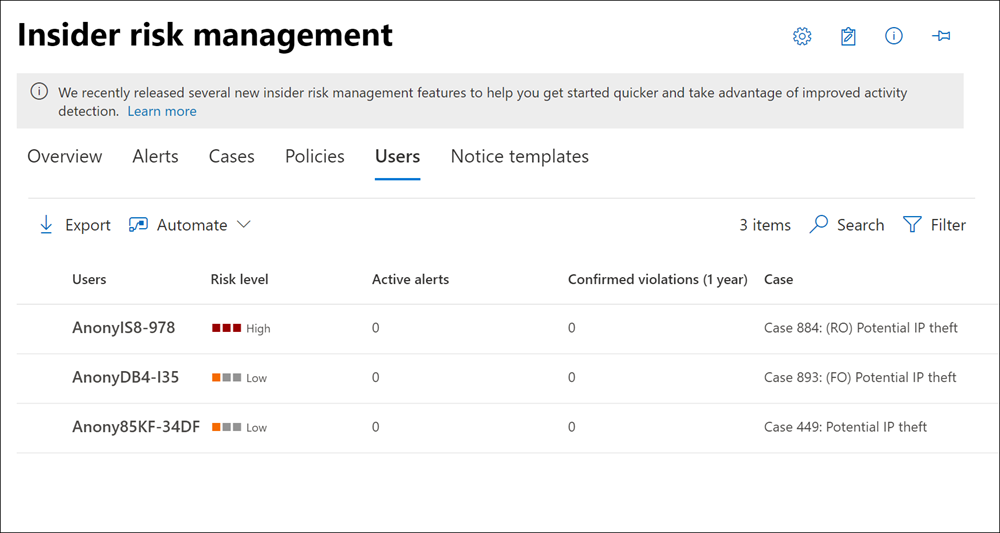

# 내부자 위험 관리 사용자 대시보드

**사용자 대시보드는** 내부자 위험 관리 워크플로의 중요한 도구로, 조사자 및 분석가가 위험 활동을 보다 잘 이해하는 데 도움이 됩니다. 이 대시보드는 내부자 위험 관리 정책을 만들고 내부자 위험 관리 사례를 관리하는 사이에 관리 요구 사항을 충족하는 보기 및 관리 기능을 제공합니다.

사용자가 내부자 위험 관리 정책에 추가되면 백그라운드 프로세스는 표시기 트리거에 대한 사용자 [활동을 자동으로 평가합니다.](insider-risk-management-settings.md#indicators) 트리거 표시기가 표시되면 사용자 활동에 위험 점수가 할당됩니다. 이러한 활동 중 일부를 통해 내부자 위험 경고가 표시될 수 있지만 일부 활동은 최소 위험 점수 수준을 충족하지 않을 수 있으며 내부자 위험 경고가 생성되지 않습니다. 사용자 **대시보드를** 사용하면 이러한 유형의 지표 및 위험 점수가 있는 사용자와 내부자 위험 경고가 활발한 사용자를 볼 수 있습니다.

다음 시나리오에서 사용자 대시보드에 사용자를 표시하는 방법에 대해 자세히 알아보겠습니다.

- 활성 내부자 위험 정책 경고가 있는 사용자
- 이벤트 트리거가 있는 사용자
- 정책에 일시적으로 추가된 사용자

## 활성 내부자 위험 정책 경고가 있는 사용자

사용자 **대시보드에는** 활성 내부자 위험 정책 경고가 있는 모든 사용자가 자동으로 표시됩니다. 경고가 있는 이러한 사용자에게는 내부자 위험 경고 만들기에 대한 요구 사항을 충족하는 활동 위험 점수와 트리거 지표가 있습니다. 이러한 사용자에 대한 활동은 사용자 대시보드에서  사용자를 선택하고 사용자 활동 탭으로 **이동하여 볼 수** 있습니다.

## 이벤트 트리거가 있는 사용자

사용자 **대시보드에는** 트리거 이벤트가 있는 모든 사용자가 자동으로 표시되지만 내부자 위험 경고를 생성하는 활동 위험 점수가 없습니다. 예를 들어 이 활동은 트리거 이벤트이지만 위험 점수가 있는 활동이 아니기 때문에 보고된 사임 날짜가 있는 사용자가 표시됩니다. 이러한 사용자에 대한 활동은 사용자 대시보드에서  사용자를 선택하고 사용자 활동 탭으로 **이동하여 볼 수** 있습니다.

## 정책에 일시적으로 추가된 사용자

사용자 **대시보드에는** 내부자 위험 관리 워크플로 외부의 비정상적인 이벤트 후 내부자 위험 관리 정책에 추가된 사용자가 포함됩니다. 정책 대시보드에서 사용자를 일시적으로 추가하는 것은 필요한 커넥터가 구성되지 않은 경우에도 정책을 테스트하기 위한 내부자 위험 관리 정책에 대한 사용자 활동 점수 매기기 시작하는 방법입니다.

사용자가 정책에 수동으로 추가된 경우 지난 90일 동안의 사용자 활동 점수가 점수가 설정되고 사용자 활동 타임라인에 **추가됩니다.** 예를 들어 현재 내부자 위험 정책에 대한 위험 점수가 할당되지 않은 사용자가 있으며 사용자에게 조직의 법률 부서에 보고된 데이터 누출 활동이 있습니다. 법무 부서에서는 사용자에 대한 새로운 단기 모니터링 요구 사항을 구성하는 것이 좋습니다. 지정된 기간(정품 인증  창)에 대해 사용자를 데이터 누수 정책에 일시적으로 할당할 수 있습니다. 일시적으로 추가된 모든 사용자는  이벤트 요구 사항을 트리거할 수 있기 때문에 사용자 대시보드에 표시됩니다.

> [!NOTE]
> 수동으로 추가한 새 사용자가 사용자 대시보드에 표시될 때 몇 시간이 걸릴 **수 있습니다.** 이러한 사용자의 이전 90일 동안의 활동은 표시하는 데 최대 24시간이 걸릴 수 있습니다. 수동으로 추가된 사용자에 대한 활동을 확인하려면 사용자 대시보드에서 사용자를 선택하고 세부 정보 창에서 사용자 활동 탭을 열 수 있습니다.  

사용자가 사용자 대시보드에서 자동으로 제거되고 **다음** 경우 활성화 창에  정의된 시간이 만료되면 점수가 중지됩니다.

- 사용자에게 추가 트리거 이벤트 또는 내부자 위험 정책 경고가 없는 경우 및
- 수동으로 정의된  활성화 기간이 전역 정책 활성화 창 기간보다 **길면**

가장 **긴 기간을** 설정한 활성화 창 설정은 항상 더 짧은 기간으로 활성화 창 설정을 어버립니다.  예를 들어 모든 내부자  위험 정책에  자동으로 적용되는 내부자 위험 관리 전역 설정의 전역 정책 기간 탭에서 활성화 창을 15일 동안 구성했습니다.

데이터 누출 내부자  위험 정책에 사용자를 일시적으로 추가하고 이 사용자의 정품 인증 기간으로 30일을  정의합니다. 일시적으로  추가된 사용자에 대해 활성화 창 설정을 30일로 정의하면 전역 활성화 창 설정이 15일로 정의됩니다.  일시적으로 추가된 사용자는 **사용자** 대시보드에 남아 있으며 정책의 범위는 30일 동안 유지됩니다.

전역 활성화 창 설정이 일시적으로 추가된  사용자에 대해 정의된 활성화 창 설정보다 길면 전역 활성화  창 설정이 일시적으로 추가된 사용자의 활성화 창 설정을 다시 정의합니다.   일시적으로 추가된 사용자는 **사용자** 대시보드에 유지되고 전역 활성화 창 설정에 정의된 기간(일) 동안 정책의 **범위에 포함되지** 않습니다.

## 사용자 대시보드에서 사용자 정보 보기

사용자 대시보드에 표시된 각 **사용자에게는** 다음 정보가 있습니다.

- **사용자:** 사용자의 사용자 이름입니다. 내부자 위험 관리에 대한 전역 비동기화 설정을 사용하도록 설정한 경우 이 필드는 비동기화됩니다.
- **위험 수준:** 사용자의 현재 계산된 위험 수준입니다. 이 점수는 24시간마다 계산되며 사용자와 관련된 모든 활성 경고의 경고 위험 점수를 사용합니다. 트리거 표시기만 있는 사용자의 경우 위험 수준은 0입니다.
- **활성 경고:** 모든 정책에 대한 활성 경고 수입니다.
- **확인된 위반:** 사용자에 대한 확인된 정책 *위반으로* 확인된 사례 수입니다.
- **사례:** 사용자의 현재 활성 사례입니다.

특정 사용자를 빠르게 찾으면  사용자 대시보드 오른쪽 위에 있는 검색을 사용하세요. 사용자를 검색할 때 UPN(사용자 계정 이름)을 사용해야 합니다. 예를 들어 조직에서 UPN이 'thidayah'인 'Tiara Hidayah'라는 사용자를 검색할 때 검색에 'thidayah'나 UPN의 일부를 입력합니다.

> [!NOTE]
> 사용자 대시보드에 표시되는  사용자 수는 활성 경고의 양과 일치하는 정책에 따라 일부 경우에는 제한될 수 있습니다. 활성 경고가 있는 사용자는  알림이 생성될 때 사용자 대시보드에 표시되고 표시되는 최대 사용자 수에 도달하는 경우는 드물게 있을 수 있습니다. 이 제한이 발생하면 활성 경고가 표시되지 않은 사용자가 기존  사용자 알림을심사할 때 사용자 대시보드에 추가됩니다.

## 사용자 세부 정보 보기

사용자에 대한 위험 활동에 대한 자세한 내용을 보려면 사용자 대시보드에서 사용자를 두 번 클릭하여 사용자 세부 정보 **창을 열 수 있습니다.** 세부 정보 창에서 다음 정보를 볼 수 있습니다.

- **사용자 프로필** 탭
  - **이름 및 제목**: 사용자 이름 및 위치의 Azure Active Directory. 내부자 위험 관리에 대한 전역 비어 있는 경우 이러한 사용자 필드는 비어 있거나 비어 있습니다.
  - **사용자 전자 메일:** 사용자의 전자 메일 주소입니다.
  - **별칭:** 사용자의 네트워크 별칭입니다.
  - **조직 또는 부서:** 사용자의 조직 또는 부서입니다.

- **사용자 활동** 탭
  - **최근 사용자** 활동 기록: 최근 180일 동안의 사용자 활동에 대한 트리거 표시기 및 내부자 위험 지표를 모두 나열합니다. 활동이 내부자 위험 경고를 생성하거나 생성하지는 않은 경우도 있을 수 있습니다. 그러나 내부자 위험 지표와 같은 모든 활동도 점수가 주어집니다. 트리거 표시기 예제는 사용자에 대한 작업의 마지막 예약 날짜 또는 사직 날짜일 수 있습니다. 내부자 위험 지표는 위험 요소가 있는 것으로 결정된 활동으로, 사용자가 포함된 정책에 정의됩니다. 이벤트 및 위험 활동은 가장 최근 항목이 먼저 나열된 것으로 나열됩니다.

## 정책에 대한 범위 내 할당에서 사용자 제거

내부자 위험 관리 정책에서 사용자의 활동에 위험 점수 할당을 중지해야 하는 시나리오가 있을 수 있습니다. 사용자 **대시보드** 페이지에서  사용자 제거를 사용하여 현재 범위 내 모든 내부자 위험 관리 정책에서 하나 이상의 사용자에 대해 위험 점수 할당을 중지합니다. 이 작업을 수행하면 전체 정책 할당에서 사용자가 제거되지는 않지만(사용자 또는 그룹을 정책 구성에 추가할 때) 현재 트리거 이벤트를 트리거한 후 정책에 의해 활성 처리에서 사용자를 제거하기만 합니다. 사용자에게 향후 다른 트리거 이벤트가 있는 경우 정책의 위험 점수가 자동으로 사용자에게 다시 할당됩니다. 이 사용자에 대한 기존 경고 또는 사례는 제거되지 않습니다.

> [!NOTE]
> 정책에서 사용자를 제거하는 데 몇 분 정도 걸릴 수 있습니다. 완료되면 사용자가 더 이상 사용자 페이지에 나열되지 않습니다. 제거된 사용자에게 활성 경고 또는 사례가 있는 경우 사용자는 사용자 페이지에 유지되고 사용자의 세부 정보는 더 이상 정책의 범위 내가 아 없음을 보여 주게 됩니다.

모든 내부자 위험 관리 정책에서 범위 내 상태의 사용자를 수동으로 제거하려면 다음 단계를 완료합니다.

1. 에서 [Microsoft 365 규정 준수 센터](https://compliance.microsoft.com)내부자 위험 **관리로 이동하고** 사용자 **탭을** 선택합니다.
2. 사용자 **대시보드에서** 내부자 위험 관리 정책의 범위 내 범위를 벗어날 사용자를 선택합니다.
3. 사용자 **제거를 선택합니다.**
4. 사용자 **제거 창에서** 제거  또는  취소를 선택하여 변경 내용을 취소하고 대화 상자를 닫습니다.
5. 사용자를  제거하려면 확인 창에서 제거를 선택합니다.

## 사용자에 대한 Power Automate 자동화된 작업 실행

권장되는 Power Automate 흐름을 사용하여 위험 조사자 및 분석가가 신속하게 다음 작업을 할 수 있습니다.

- 내부자 위험 정책에 추가될 때 사용자에게 알림

내부자 위험 관리 사용자에 대한 Power Automate 흐름을 실행, 관리 또는 만들 수 있습니다.

1. 사용자 **작업 도구** 모음에서 자동화를 선택합니다.
2. 실행할 Power Automate 흐름을 선택한 다음 **흐름 실행을 선택합니다.**
3. 흐름이 완료된 후 완료 를 **선택합니다.**

내부자 위험 관리의 Power Automate 흐름에 대한 자세한 내용은 내부자 위험 관리 설정 [시작을 참조하세요.](insider-risk-management-settings.md#power-automate-flows-preview)
