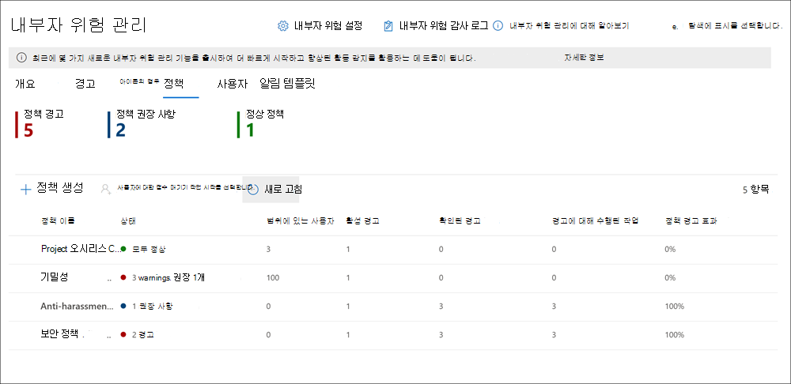
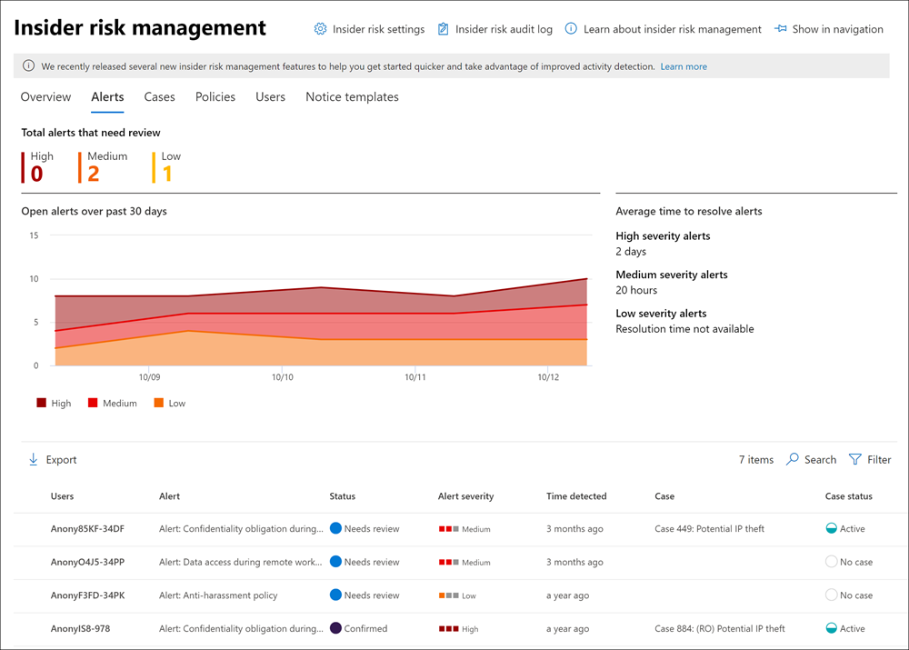
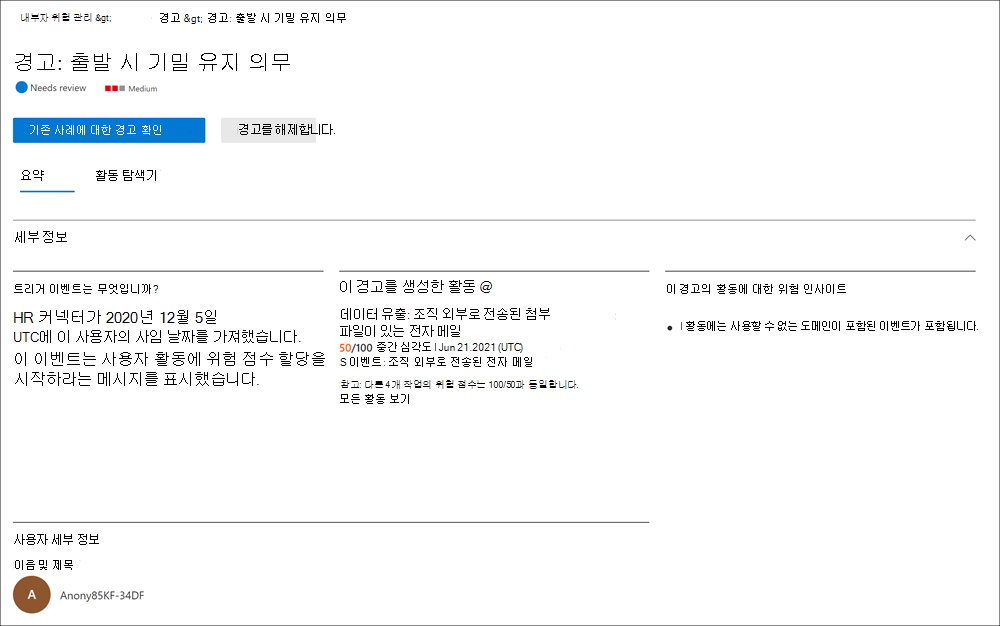

# 내부자 위험 관리에 대해 Microsoft 365

내부자 위험 관리는 조직에서 Microsoft 365 부수적이지 않은 활동을 감지, 조사 및 작업할 수 있도록 하여 내부 위험을 최소화하는 데 도움이 되는 조직의 규정 준수 솔루션입니다. 내부자 위험 정책을 사용하면 사례에 대한 작업 및 필요한 경우 Microsoft로 사례를 에스컬레이터하는 것을 포함하여 조직에서 식별하고 감지할 수 있는 위험 유형을 정의할 Advanced eDiscovery 있습니다. 조직의 위험 분석가가 신속하게 적절한 조치를 취하여 사용자가 조직의 규정 준수 표준을 준수하도록 할 수 있습니다.

아래 비디오를 시청하여 내부자 위험 관리가 조직에서 조직의 가치, 문화 및 사용자 환경의 우선 순위를 지정하는 동안 위험을 방지, 감지 및 포함하는 데 어떻게 도움이 되는지 알아보세요.
 
 

**내부자 위험 관리 솔루션 & 개발**:
>[!VIDEO https://www.microsoft.com/videoplayer/embed/RE4j9CN]
 

**내부자 위험 관리 워크플로**:
>[!VIDEO https://www.microsoft.com/videoplayer/embed/RE4OUXB]

## 최신 위험의 고민 지점

조직의 위험을 관리하고 최소화하는 것은 현대적 업무 현장에서 발견되는 위험 유형을 이해하는 것부터 시작합니다. 일부 위험은 직접 제어를 밖으로 하는 외부 이벤트 및 요인에 의해 결정됩니다. 그 외의 위험은 최소화하고 피할 수 있는 내부 이벤트 및 사용자 활동으로 구동됩니다. 조직의 사용자가 불법적, 부적절하거나 허가되지 않은 또는 비동기적인 동작과 작업으로 부터 위험이 있습니다. 이러한 동작에는 사용자의 광범위한 내부 위험이 포함됩니다.

- 중요한 데이터 누출 및 데이터 유출
- 기밀 위반
- IP(지적 재산) 도용
- 사기
- 내부자 거래
- 규정 준수 위반

최신 작업 공간의 사용자는 광범위한 플랫폼 및 서비스에서 데이터를 만들고 관리하고 공유할 수 있습니다. 대부분의 경우 조직은 사용자 개인 정보 보호 표준을 충족하면서 조직 전체의 위험을 식별하고 완화하기 위한 제한된 리소스와 도구를 사용합니다.

내부자 위험 관리는 모든 서비스 및 제3자 지표를 사용하여 위험 활동을 신속하게 식별, 평가 및 대응하는 데 도움이 됩니다. 내부자 위험 관리는 Microsoft 365 Microsoft Graph 사용하여 위험 지표를 식별하는 특정 정책을 정의할 수 있도록 합니다. 이러한 정책을 사용하면 위험한 활동을 식별하고 이러한 위험을 완화하기 위해 행동할 수 있습니다.

내부자 위험 관리는 다음 원칙을 중심으로 합니다.

- **투명성:** 사용자 개인 정보 보호와 조직 위험의 균형을 설계 아키텍처에 따라 조정합니다.
- **구성 가능:** 산업, 지리적 및 비즈니스 그룹을 기반으로 구성 가능한 정책입니다.
- **통합:** 통합된 규정 준수 솔루션의 Microsoft 365 워크플로입니다.
- **실행 가능:** 검토자 알림, 데이터 조사 및 사용자 조사를 사용하도록 설정할 수 있는 정보를 제공합니다.

## 분석을 사용하여 잠재적인 위험 식별(미리 보기)

내부 위험 분석을 사용하면 내부 위험 정책을 구성하지 않고도 조직에서 잠재적인 내부 위험 평가를 수행할 수 있습니다. 이 평가는 조직에서 사용자 위험이 큰 잠재적 영역을 식별하고 구성을 고려할 수 있는 내부 위험 관리 정책의 유형과 범위를 결정하는 데 도움이 될 수 있습니다. 이 평가는 기존 내부자 위험 정책의 추가 라이선싱 또는 향후 최적화에 대한 요구 사항을 결정하는 데도 도움이 될 수 있습니다.

내부자 위험 분석에 대한 자세한 내용은 내부자 위험 관리 [설정: 분석을 참조하세요.](insider-risk-management-settings.md#analytics-preview)

## 권장 작업 시작(미리 보기)

내부자 위험 관리를 처음 설정하거나 새 정책을 만들든, 새로운 권장 작업  환경을 통해 내부자 위험 관리 기능을 최대화할 수 있습니다. 권장 작업에는 사용 권한 설정, 정책 표시기 선택, 정책 만들기 등이 포함됩니다.

## 워크플로

내부자 위험 관리 워크플로를 사용하면 조직의 내부 위험을 식별, 조사 및 해결할 수 있습니다. 포커스가 있는 정책 템플릿, Microsoft 365 서비스 전반의 포괄적인 활동 신호 및 경고 및 사례 관리 도구를 사용하여 실행 가능한 인사이트를 사용하여 위험한 동작을 신속하게 식별하고 조치를 취할 수 있습니다.

Microsoft 365의 내부 위험 관리를 통해 내부 위험 활동 및 규정 준수 문제를 식별하고 해결하는 방법은 다음과 같습니다.

### 정책

[내부자 위험 관리 정책은](insider-risk-management-policies.md) 조직에서 검사되는 트리거 이벤트 및 위험 지표를 정의하는 미리 정의된 템플릿 및 정책 조건을 사용하여 만들어집니다. 이러한 조건에는 경고에 위험 지표가 사용되는 방법, 정책에 포함된 사용자, 우선 순위가 지정되는 서비스 및 모니터링 기간이 포함됩니다.

다음 정책 템플릿에서 선택하여 내부자 위험 관리를 신속하게 시작할 수 있습니다.

- [퇴사하는 직원의 데이터 도난](insider-risk-management-policies.md#data-theft-by-departing-users)
- [일반적인 데이터 유출](insider-risk-management-policies.md#general-data-leaks)
- [우선순위 사용자의 데이터 유출(미리 보기)](insider-risk-management-policies.md#data-leaks-by-priority-users-preview)
- [불만을 품은 사용자의 데이터 유출(미리 보기)](insider-risk-management-policies.md#data-leaks-by-disgruntled-users-preview)
- [일반 보안 정책 위반(미리 보기)](insider-risk-management-policies.md#general-security-policy-violations-preview)
- [퇴사하는 사용자의 보안 정책 위반(미리 보기)](insider-risk-management-policies.md#security-policy-violations-by-departing-users-preview)
- [우선순위 사용자의 보안 정책 위반(미리 보기)](insider-risk-management-policies.md#security-policy-violations-by-priority-users-preview)
- [불만을 품은 사용자의 보안 정책 위반(미리 보기)](insider-risk-management-policies.md#security-policy-violations-by-disgruntled-users-preview)

### 경고

경고는 정책 조건과 일치하는 위험 지표에 의해 자동으로 생성되며 경고 [대시보드에 표시됩니다.](insider-risk-management-activities.md#alert-dashboard) 대시보드에서는 검토가 필요한 모든 경고, 시간 경과에 따른 진행 중인 경고 및 조직의 경고 통계를 간단하게 확인할 수 있습니다. 모든 정책 알림은 다음 정보와 함께 표시되어 기존 경고 및 조치가 필요한 새 경고의 상태를 빠르게 식별할 수 있습니다.

- 상태
- 심각도
- 검색된 시간
- 사례
- 사례 상태

### Triage

조사가 필요한 새 사용자 활동은 검토 필요 상태가 할당된 경고를 *자동으로 생성합니다.* 검토자는 이러한 경고를 신속하게 식별하고 검토, 평가 및 심사할 수 있습니다.

경고는 새 케이스를 열거나, 기존 케이스에 경고를 할당하거나, 경고를 해제함으로써 해결됩니다. 경고 필터를 사용하면 상태, 심각도 또는 검색된 시간으로 경고를 빠르게 식별할 수 있습니다. 심사 프로세스의 일부로 검토자는 정책으로 식별된 활동에 대한 경고 세부 정보를 보고, 정책 일치와 관련된 사용자 활동을 보고, 경고의 심각도 확인 및 사용자 프로필 정보를 검토할 수 있습니다.

### 조사

사용자 활동 보고서(미리 보기)를 통해 선택한 사용자의 모든 활동을 [빠르게 조사합니다.](insider-risk-management-activities.md#user-activity-reports-preview) 이러한 보고서를 통해 조직의 조사자는 내부자 위험 관리 정책에 일시적으로 또는 명시적으로 할당하지 않고도 정의된 기간 동안 특정 사용자에 대한 활동을 검사할 수 있습니다. 사용자에 대한 활동을 검사한 후 조사자는 개별 활동을 양성으로 해지하거나, 다른 조사자들과 보고서 링크를 공유하거나 전자 메일을 보내거나, 사용자를 내부자 위험 관리 정책에 일시적으로 또는 명시적으로 할당하도록 선택할 수 있습니다.

[정책](insider-risk-management-cases.md) 일치와 관련한 활동 세부 정보 및 상황의 심층 검토 및 조사가 필요한 경고에 대한 사례가 생성됩니다. **케이스 대시보드** 는 모든 활성 케이스, 시간 경과에 따른 진행 중인 케이스 및 조직의 케이스 통계에 대한 총괄적인 보기를 제공합니다. 검토자는 상태, 사례가 연 날짜 및 사례가 마지막으로 업데이트된 날짜를 통해 사례를 빠르게 필터링할 수 있습니다.

케이스 대시보드에서 케이스를 선택하면 조사 및 검토를 위해 케이스가 열립니다. 이 단계는 내부자 위험 관리 워크플로의 핵심입니다. 이 영역에는 위험 활동, 정책 조건, 경고 세부 정보 및 사용자 세부 정보가 검토자를 위한 통합 보기로 합성됩니다. 이 영역의 기본 조사 도구는 다음입니다.

- **사용자 활동:** 사용자 활동은 현재 또는 과거의 위험 활동에 대한 위험 수준과 시간의 지난 활동을 그려보는 대화형 차트에 자동으로 표시됩니다. 검토자는 사용자에 대한 전체 위험 기록을 빠르게 필터링하고 보고 자세한 내용을 확인하여 특정 활동을 드릴다운할 수 있습니다.
- **콘텐츠 탐색기:** 경고 활동과 관련된 모든 데이터 파일 및 전자 메일 메시지가 자동으로 캡처되어 콘텐츠 탐색기에 표시됩니다. 검토자는 데이터 원본, 파일 형식, 태그, 대화 등 다양한 특성을 통해 파일 및 메시지를 필터링하고 볼 수 있습니다.
- **사례 참고:** 검토자는 사례 메모 섹션에서 사례에 대한 메모를 제공할 수 있습니다. 이 목록은 중앙 보기의 모든 메모를 통합하고 검토자 및 제출된 날짜 정보를 포함합니다.

또한 새로운 감사 [로그(미리](insider-risk-management-audit-log.md) 보기)를 사용하면 내부자 위험 관리 기능에 대해 수행된 작업에 대한 정보를 계속 알 수 있습니다. 이 리소스를 사용하면 하나 이상의 내부자 위험 관리 역할 그룹에 할당된 사용자가 수행한 작업을 독립적으로 검토할 수 있습니다.

### 작업

사례를 조사한 후 검토자는 신속하게 사례를 해결하거나 조직의 다른 위험 이해 관계자와 공동 작업을 할 수 있습니다. 사용자가 실수로 또는 실수로 정책 조건을 위반하는 경우 조직에 맞게 사용자 지정할 수 있는 알림 서식 파일에서 간단한 미리 알림이 사용자에게 전송될 수 있습니다. 이러한 알림은 간단한 미리 알림으로 제공되거나 사용자에게 교육 또는 지침을 새로 고쳐서 미래의 위험한 행동을 방지하도록 할 수 있습니다. 자세한 내용은 [내부 위험 관리 알림 템플릿](insider-risk-management-notices.md)을 참조하세요.

더 심각한 상황에서는 조직의 다른 검토자 또는 서비스와 내부자 위험 관리 사례 정보를 공유해야 할 수 있습니다. 내부자 위험 관리는 종단 Microsoft 365 해결을 지원하기 위해 다른 규정 준수 솔루션과 긴밀하게 통합됩니다.

- **Advanced eDiscovery:** 조사를 위해 사례를 에스컬레이터하면 사례의 데이터 및 관리를 해당 사례에 Advanced eDiscovery Microsoft 365. Advanced eDiscovery는 조직의 내부 및 외부 법률 조사에 대응하는 내용을 보존, 수집, 검토, 분석 및 내보낼 수 있는 엔드투엔드 워크플로를 제공합니다. 이를 통해 법률 팀이 법적 보존 알림 워크플로 전반을 관리할 수 있습니다. Advanced eDiscovery 케이스에 대한 자세한 내용은 [Microsoft 365의 Advanced eDiscovery 개요](overview-ediscovery-20.md)를 참조하세요.
- **Office 365 관리 API** 통합(미리 보기) : 내부자 위험 관리는 Office 365 관리 API를 통해 보안 정보 및 이벤트 관리(SIEM) 서비스로 경고 정보를 내보낼 수 있습니다. 플랫폼의 경고 정보에 액세스할 수 있는 권한이 조직의 위험 프로세스에 가장 잘 맞는지 확인하면 위험 활동에 대한 작업 방법을 보다 유연하게 할 수 있습니다. 관리 API를 통해 경고 정보를 내보내는 Office 365 자세한 내용은 [경고 내보내기 를 참조하세요.](insider-risk-management-settings.md#export-alerts-preview)

> [!NOTE]
> ServiceNow 커넥터 미리 보기를 하는 동안 피드백과 지원에 감사드립니다. ServiceNow 커넥터의 미리 보기를 종료하고 2020년 11월 30일 내부자 위험 관리에서 지원을 중단하기로 결정했습니다. 내부자 위험 관리에서 ServiceNow 통합을 고객에게 제공하기 위한 대체 방법을 적극적으로 평가하고 있습니다.

## 시나리오

내부자 위험 관리는 다음과 같은 몇 가지 일반적인 시나리오에서 조직의 내부 위험을 감지, 조사 및 완화하는 데 도움이 될 수 있습니다.

### 퇴사하는 직원의 데이터 도난

사용자가 자발적으로 또는 종료의 결과로 조직을 떠나는 경우 회사, 고객 및 사용자 데이터가 위험에 노출되는 경우가 종종 있습니다. 사용자는 프로젝트 데이터가 독점적이지 않다고 가정하거나 회사 데이터를 개인적 이득을 위해 회사 정책 및 법적 표준을 위반할 수 있습니다. 사용자 정책 템플릿을 떠서 데이터 도난을 사용하는 내부자 위험 관리 정책은 일반적으로 이 유형의 도난과 관련된 활동을 자동으로 감지합니다.  해당 정책을 사용하면 적절한 조사 작업을 수행할 수 있도록 사용자를 떠날 수 있도록 데이터 도용과 관련된 의심스러운 활동에 대한 알림을 자동으로 받게 됩니다. 이 정책 Microsoft 365 조직에 대한 [HR](import-hr-data.md) 커넥터를 구성해야 합니다.

### 중요한 정보 또는 기밀 정보의 의도적 또는 의도하지 않은 누출

대부분의 경우 사용자는 중요한 정보나 기밀 정보를 제대로 처리하기 위해 최선을 다합니다. 그러나 경우에 따라 사용자가 실수를 할 수 있으며 정보가 실수로 조직 외부에서 공유되거나 정보 보호 정책을 위반하는 경우도 있습니다. 다른 상황에서는 사용자가 악의적인 의도와 개인적 이익을 위해 중요한 기밀 정보를 의도적으로 누출하거나 공유할 수 있습니다. 다음 데이터 누출 정책 템플릿을 사용하여 만든 내부자 위험 관리 정책은 일반적으로 중요한 정보 또는 기밀 정보 공유와 관련된 활동을 자동으로 검색합니다.

- [일반적인 데이터 유출](insider-risk-management-policies.md#general-data-leaks)
- [우선순위 사용자의 데이터 유출(미리 보기)](insider-risk-management-policies.md#data-leaks-by-priority-users-preview)
- [불만을 품은 사용자의 데이터 유출(미리 보기)](insider-risk-management-policies.md#data-leaks-by-disgruntled-users-preview)

## 의도적 또는 의도하지 않은 보안 정책 위반(미리 보기)

사용자는 일반적으로 최신 작업 공간에서 장치를 관리할 때 많은 제어를 합니다. 이 제어에는 업무 성능에 필요한 응용 프로그램을 설치하거나 제거하거나 장치 보안 기능을 일시적으로 사용하지 않도록 설정하는 기능이 포함되어 있을 수 있습니다. 이 활동이 우발적이거나 우발적이든 악의적인지 여부에 따라 이 작업은 조직에 위험을 부과할 수 있으며, 식별하고 최소화하기 위해 행동하는 데 중요합니다. 이러한 위험한 보안 활동을 ID로 확인하기 위해 다음과 같은 내부자 위험 관리 보안 정책 위반 템플릿은 보안 위험 지표를 점수화하고 끝점 경고에 대한 Microsoft Defender를 사용하여 보안 관련 활동에 대한 인사이트를 제공합니다.

- [일반 보안 정책 위반(미리 보기)](insider-risk-management-policies.md#general-security-policy-violations-preview)
- [퇴사하는 사용자의 보안 정책 위반(미리 보기)](insider-risk-management-policies.md#security-policy-violations-by-departing-users-preview)
- [우선순위 사용자의 보안 정책 위반(미리 보기)](insider-risk-management-policies.md#security-policy-violations-by-priority-users-preview)
- [불만을 품은 사용자의 보안 정책 위반(미리 보기)](insider-risk-management-policies.md#security-policy-violations-by-disgruntled-users-preview)

## 위치, 액세스 수준 또는 위험 기록에 기반한 사용자에 대한 정책(미리 보기)

조직의 사용자는 자신의 위치, 중요한 정보에 대한 액세스 수준 또는 위험 내역에 따라 다양한 위험 수준을 가지게 될 수 있습니다. 이 구조에는 조직의 임원진 리더십 팀 구성원, 광범위한 데이터 및 네트워크 액세스 권한이 있는 IT 관리자 또는 과거의 위험한 활동 내역이 있는 사용자가 포함됩니다. 이러한 상황에서는 보다 면밀한 검사와 보다 적극적인 위험 점수가 조사 및 신속한 조치를 위해 경고를 표시하는 데 중요합니다. 이러한 유형의 사용자에 대한 위험한 활동을 식별할 수 있도록 우선 순위 사용자 그룹을 만들고 다음 정책 템플릿에서 정책을 만들 수 있습니다.

- [우선순위 사용자의 보안 정책 위반(미리 보기)](insider-risk-management-policies.md#security-policy-violations-by-priority-users-preview)
- [우선순위 사용자의 데이터 유출(미리 보기)](insider-risk-management-policies.md#data-leaks-by-priority-users-preview)

## 불만이 있는 사용자의 작업 및 동작(미리 보기)

고용 스트레스 이벤트는 내부자 위험과 관련된 여러 가지 방법으로 사용자 동작에 영향을 줄 수 있습니다. 이러한 스트레스는 성능 검토 성능이 나쁨, 위치 강하 또는 성과 검토 계획에 배치되는 사용자일 수 있습니다. 대부분의 사용자는 이러한 이벤트에 악의적으로 응답하지는 않습니다. 그러나 이러한 작업의 스트레스로 인해 일부 사용자는 정상적인 상황에서 일반적으로 고려하지 않을 수 있는 조치를 취하게 될 수 있습니다. 이러한 유형의 위험한 활동을 ID로 확인하기 위해 다음 내부자 위험 관리 정책 템플릿은 Microsoft 365 HR 커넥터를 사용하여 고용 스트레스 이벤트에 가까운 상황에서 발생할 수 있는 동작과 관련된 위험 지표의 점수 매기기를 시작합니다.

- [불만을 품은 사용자의 데이터 유출(미리 보기)](insider-risk-management-policies.md#data-leaks-by-disgruntled-users-preview)
- [불만을 품은 사용자의 보안 정책 위반(미리 보기)](insider-risk-management-policies.md#security-policy-violations-by-disgruntled-users-preview)

## 시작할 준비가 되셨나요?

- 조직에서 [내부자](insider-risk-management-plan.md) 위험 관리 정책을 사용하도록 설정하는 방법에 대한 자세한 내용은 내부자 위험 관리 계획을 참조합니다.
- 내부자 위험 관리 설정 시작을 [참조하여](insider-risk-management-settings.md) 내부자 위험 정책에 대한 전역 설정을 구성합니다.
- 내부자 [위험](insider-risk-management-configure.md) 관리 시작을 참조하여 선행 구성, 정책 만들기 및 알림 수신 시작을 참조합니다.
