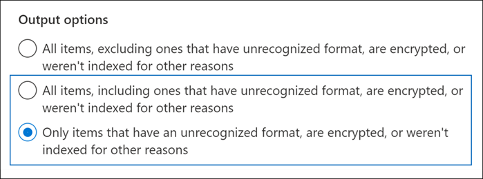

# <a name="investigating-partially-indexed-items-in-ediscovery"></a>eDiscovery에서 부분적으로 인덱싱된 항목 조사

검색에서 실행되는 eDiscovery Microsoft 365 규정 준수 센터 검색을 실행할 때 예상 검색 결과에 부분적으로 인덱싱된 항목이 자동으로 포함됩니다. 부분적으로 인덱싱된 항목은 Exchange 검색을 위해 완전히 인덱싱되지 않은 SharePoint 비즈니스용 OneDrive 사이트의 사서함 항목 및 문서입니다. 대부분의 전자 메일 메시지와 사이트 문서는 전자 메일 메시지의 인덱싱 제한에 해당하기 때문에 성공적으로 [인덱싱됩니다.](limits-for-content-search.md#indexing-limits-for-email-messages) 그러나 일부 항목은 이러한 인덱싱 제한을 초과할 수 있으며 부분적으로 인덱싱됩니다. 다음은 검색을 위해 항목을 인덱싱할 수 없는 다른 이유와 eDiscovery 검색을 실행할 때 부분적으로 인덱싱된 항목으로 반환되는 다른 이유입니다.
  
- 전자 메일 메시지에 이미지 파일과 같은 유효한 처리기 없이 첨부된 파일이 있습니다. 부분적으로 인덱싱된 전자 메일 항목의 가장 일반적인 원인입니다.

- 전자 메일 메시지에 첨부된 파일이 너무 많습니다.

- 전자 메일 메시지에 첨부된 파일이 너무 대용량입니다.

- 파일 형식 인덱싱은 지원되지만 특정 파일에 대해 인덱싱 오류가 발생했습니다.

대부분의 조직 고객은 볼륨별로 콘텐츠의 1% 미만을 차지하고 부분적으로 인덱싱되는 크기에 따라 콘텐츠의 12% 미만을 차지합니다. 볼륨과 크기 간에 차이가 있는 이유는 파일이 크면 완전히 인덱싱할 수 없는 콘텐츠가 들어 있을 가능성이 더 높기 때문에 그렇습니다.
  
## <a name="why-does-the-partially-indexed-item-count-change-for-a-search"></a>검색에 대해 부분적으로 인덱싱된 항목 수가 변경된 이유는 무엇입니까?

eDiscovery 검색을 실행한 후 검색된 위치에서 부분적으로 인덱싱된 항목의 총 수와 크기가 검색에 대한 자세한 통계에 표시되는 검색 결과 통계에 나열됩니다. 이러한 항목을 검색 통계에서  *인덱서되지*  않은 항목이라고 합니다. 다음은 검색 결과에 반환되는 부분적으로 인덱싱된 항목 수에 영향을 주는 몇 가지 사항입니다.
  
- 항목이 부분적으로 인덱싱된 경우 검색 쿼리와 일치하는 항목은 검색 결과 항목의 개수 및 크기와 부분적으로 인덱싱된 항목에 모두 포함됩니다. 그러나 동일한 검색 결과를 내보낼 때 항목은 검색 결과 집합에만 포함됩니다. 부분적으로 인덱싱된 항목으로 포함되지 않습니다.

- SharePoint 및 OneDrive 사이트에 있는 부분적으로 인덱싱된  항목은 검색에 대한 세부 통계에 표시되는 부분적으로 인덱싱된 항목의 예상 항목에 포함되지 않습니다. 그러나 eDiscovery 검색 결과를 내보낼 때 부분적으로 인덱싱된 항목을 내보낼 수 있습니다. 예를 들어 사이트만 검색하는 경우 부분적으로 인덱싱된 예상 항목 수는 0이 됩니다.
  
## <a name="calculating-the-ratio-of-partially-indexed-items-in-your-organization"></a>조직에서 부분적으로 인덱싱된 항목의 비율 계산

부분적으로 인덱싱된 항목에 대한 조직의 노출을 이해하기 위해 빈 키워드 쿼리를 사용하여 모든 사서함의 모든 콘텐츠에 대한 검색을 실행할 수 있습니다. 다음 예제에서는 1,629,904(146.46GB) 완전히 인덱싱된 항목과 부분적으로 인덱싱된 항목 10,025개(10.27GB)가 있습니다.
  

  
다음 계산을 사용하여 부분적으로 인덱싱된 항목의 백분율을 확인할 수 있습니다.
  
 **조직에서 부분적으로 인덱싱된 항목의 비율을 계산합니다.**

`(Total number of partially indexed items/Total number of items) x 100`

`(10025/1629904) x 100 = 0.62%`

이전 예의 검색 결과를 사용하여 모든 사서함 항목의 0.62%가 부분적으로 인덱싱됩니다.
  
 **조직에서 부분적으로 인덱싱된 항목의 크기 백분율을 계산합니다.**

`(Size of all partially indexed items/Size of all items) x 100`

`(10.27 GB/146.46 MB) x 100 = 7.0%`

따라서 이전 예에서는 사서함 항목의 전체 크기의 7%가 부분적으로 인덱싱된 항목에서 나타났습니다. 앞서 설명한 것 처럼 대부분의 조직 고객은 볼륨당 콘텐츠의 1% 미만을 차지하고 부분적으로 인덱싱된 크기에 따라 콘텐츠의 12% 미만을 차지합니다.

## <a name="working-with-partially-indexed-items"></a>부분적으로 인덱싱된 항목 작업

부분적으로 인덱싱된 항목을 검사하여 관련 정보가 없는지 검사해야 하는 [](export-a-content-search-report.md) 경우 부분적으로 인덱싱된 항목에 대한 정보가 포함된 콘텐츠 검색 보고서를 내보낼 수 있습니다. 콘텐츠 검색 보고서를 내보낼 때 부분적으로 인덱싱된 항목을 포함하는 내보내기 옵션 중 하나를 선택해야 합니다.
  

  
이러한 옵션 중 하나를 사용하여 eDiscovery 검색 결과 또는 검색 보고서를 내보낼 때 내보내기에는 Unindexed라는 보고서가 Items.csv. 이 보고서에는 파일과 대부분의 동일한 정보가 ResultsLog.csv 포함됩니다. 그러나 인덱싱되지 않은 Items.csv 파일에는 부분적으로 인덱싱된 항목과 관련된 두 개의 필드인 **오류 태그** 및 오류 **속성도 포함됩니다.** 이러한 필드에는 부분적으로 인덱싱된 각 항목에 대한 인덱싱 오류에 대한 정보가 들어 있습니다. 이러한 두 필드의 정보를 사용하면 특정 인덱싱 오류가 조사에 영향을 미치는지 여부를 결정하는 데 도움이 될 수 있습니다. 이 경우 대상 검색을 수행하고 특정 전자 메일 메시지와 SharePoint 또는 OneDrive 문서를 검색하여 내보낼 수 있으므로 조사와 관련이 있는지 확인할 수 있습니다. 단계별 지침은 에서 대상 검색을 위한 [CSV 파일 준비를 Office 365.](csv-file-for-an-id-list-content-search.md)

> [!NOTE]
> Unindexed Items.csv 파일에는 오류 유형 및 오류 메시지 **필드도** **포함되어 있습니다.** 이러한 필드는 오류 태그 및 오류 속성 필드의 정보와  비슷하지만 보다 자세한 정보를 포함하는 레거시 필드입니다.  이러한 레거시 필드는 무시해도 됩니다.
  
## <a name="errors-related-to-partially-indexed-items"></a>부분적으로 인덱싱된 항목과 관련된 오류

오류 태그는 오류와 파일 형식의 두 가지 정보로 표시됩니다. 예를 들어 이 오류/파일 형식 쌍의 경우:

```text
 parseroutputsize_xls
```

 `parseroutputsize` 는 오류가 발생한 파일의 파일 `xls` 형식입니다. 파일 형식이 인식되지 않았거나 파일 형식이 오류에 적용되지 않은 경우 파일 형식 대신 값이 `noformat` 표시됩니다.
  
다음은 인덱싱 오류 목록과 오류의 가능한 원인에 대한 설명입니다.
  
| 오류 태그 | 설명 |
|:-----|:-----|
| `attachmentcount` <br/> |전자 메일 메시지에 첨부 파일이 너무 많고 이러한 첨부 파일 중 일부는 처리되지 않습니다.  <br/> |
| `attachmentdepth` <br/> |콘텐츠 검색기 및 문서 파서에서 다른 첨부 파일 내에 중첩된 너무 많은 수준의 첨부 파일을 찾습니다. 이러한 첨부 파일 중 일부는 처리되지 않습니다.  <br/> |
| `attachmentrms` <br/> |첨부 파일이 RMS로 보호되어 디코딩에 실패했습니다.  <br/> |
| `attachmentsize` <br/> |전자 메일 메시지에 첨부된 파일이 너무 크며 처리될 수 없습니다.  <br/> |
| `indexingtruncated` <br/> |처리된 전자 메일 메시지를 인덱스에 쓸 때 인덱싱 가능한 속성 중 하나에 너무 크며 잘리게 됩니다. 이 속성은 오류 속성 필드에 나열됩니다.  <br/> |
| `invalidunicode` <br/> |전자 메일 메시지에 유효한 유니코드로 처리될 수 없는 텍스트가 포함되어 있습니다. 이 항목에 대한 인덱싱이 불완전할 수 있습니다.  <br/> |
| `parserencrypted` <br/> |첨부 파일 또는 전자 메일 메시지의 콘텐츠가 암호화되며 Microsoft 365 디코딩할 수 없습니다.  <br/> |
| `parsererror` <br/> |구문 분석하는 동안 알 수 없는 오류가 발생했습니다. 이는 일반적으로 소프트웨어 버그 또는 서비스 충돌의 결과입니다.  <br/> |
| `parserinputsize` <br/> |첨부 파일이 너무 까다로우면 파서에서 처리할 수 없습니다. 이 첨부 파일을 구문 분석하지 않았거나 완료하지 못했습니다.  <br/> |
| `parsermalformed` <br/> |첨부 파일이 오작동하여 파서에서 처리할 수 없습니다. 이 결과는 이전 파일 형식, 비호호화 소프트웨어로 만든 파일 또는 클레임된 것 외의 바이러스로 인해 생성될 수 있습니다.  <br/> |
| `parseroutputsize` <br/> |첨부 파일 구문 분석의 출력이 너무 크며 잘라야 합니다.  <br/> |
| `parserunknowntype` <br/> |첨부 파일에 검색할 수 Microsoft 365 파일 형식이 있습니다.  <br/> |
| `parserunsupportedtype` <br/> |첨부 파일에 검색할 수 있는 Office 365 형식이 있지만 해당 파일 형식의 구문 분석은 지원되지 않습니다.  <br/> |
| `propertytoobig` <br/> |Exchange Store의 전자 메일 속성 값이 너무 크면 검색할 수 없는 경우 메시지를 처리하지 못했습니다. 이 작업은 일반적으로 전자 메일 메시지의 본문 속성에만 발생합니다.  <br/> |
| `retrieverrms` <br/> |콘텐츠 검색기에서 RMS로 보호된 메시지를 디코딩하지 못했습니다.  <br/> |
| `wordbreakertruncated` <br/> |문서에서 인덱싱하는 동안 단어가 너무 많이 식별되었습니다. 제한에 도달하면 속성 처리가 중지된 후 속성이 끊어지게 됩니다.  <br/> |

오류 필드는 오류 태그 필드에 나열된 처리 오류의 영향을 받는 필드를 설명합니다. 또는 같은 속성을 검색하는 경우 메시지 본문의 오류는 검색 결과에 영향을  `subject`  `participants` 줍니다. 이 기능은 추가로 조사해야 할 부분적으로 인덱싱된 항목을 정확하게 결정할 때 유용할 수 있습니다.
  
## <a name="using-a-powershell-script-to-determine-your-organizations-exposure-to-partially-indexed-email-items"></a>PowerShell 스크립트를 사용하여 부분적으로 인덱싱된 전자 메일 항목에 대한 조직의 노출 확인

다음 단계에서는 모든 Exchange 사서함의 모든 항목을 검색한 다음 조직에서 부분적으로 인덱싱된 전자 메일 항목의 비율(개수 및 크기별로)에 대한 보고서를 생성하고 발생하는 각 인덱싱 오류에 대한 항목 수 및 해당 파일 형식을 표시하는 PowerShell 스크립트를 실행합니다. 이전 섹션의 오류 태그 설명을 사용하여 인덱싱 오류를 식별합니다.
  
1. 파일 이름 접미사로 Windows PowerShell 스크립트 파일에 다음 텍스트를 .ps1. 예를 들면 `PartiallyIndexedItems.ps1` 입니다.

   ```powershell
     write-host "**************************************************"
     write-host "     Security & Compliance Center PowerShell      " -foregroundColor yellow -backgroundcolor darkgreen
     write-host "   eDiscovery Partially Indexed Item Statistics   " -foregroundColor yellow -backgroundcolor darkgreen
     write-host "**************************************************"
     " " 
     # Create a search with Error Tags Refinders enabled
     Remove-ComplianceSearch "RefinerTest" -Confirm:$false -ErrorAction 'SilentlyContinue'
     New-ComplianceSearch -Name "RefinerTest" -ContentMatchQuery "size>0" -RefinerNames ErrorTags -ExchangeLocation ALL
     Start-ComplianceSearch "RefinerTest"
     # Loop while search is in progress
     do{
         Write-host "Waiting for search to complete..."
         Start-Sleep -s 5
         $complianceSearch = Get-ComplianceSearch "RefinerTest"
     }while ($complianceSearch.Status -ne 'Completed')
     $refiners = $complianceSearch.Refiners | ConvertFrom-Json
     $errorTagProperties = $refiners.Entries | Get-Member -MemberType NoteProperty
     $partiallyIndexedRatio = $complianceSearch.UnindexedItems / $complianceSearch.Items
     $partiallyIndexedSizeRatio = $complianceSearch.UnindexedSize / $complianceSearch.Size
     " "
     "===== Partially indexed items ====="
     "         Total          Ratio"
     "Count    {0:N0}{1:P2}" -f $complianceSearch.Items.ToString("N0").PadRight(15, " "), $partiallyIndexedRatio
     "Size(GB) {0:N2}{1:P2}" -f ($complianceSearch.Size / 1GB).ToString("N2").PadRight(15, " "), $partiallyIndexedSizeRatio
     " "
     Write-Host ===== Reasons for partially indexed items =====
     foreach($errorTagProperty in $errorTagProperties)
     {
         $name = $refiners.Entries.($errorTagProperty.Name).Name
         $count = $refiners.Entries.($errorTagProperty.Name).TotalCount
         $frag = $name.Split("{_}")
         $errorTag = $frag[0]
         $fileType = $frag[1]
         if ($errorTag -ne $lastErrorTag)
         {
             $errorTag
         }
         "    " + $fileType + " => " + $count
         $lastErrorTag = $errorTag
     }
   ```

2. [보안 및 준수 센터 PowerShell에 연결](/powershell/exchange/exchange-online-powershell)합니다.

3. 보안 & 준수 센터 PowerShell에서 1단계에서 스크립트를 저장한 폴더로 이동한 다음 스크립트를 실행합니다. 예를 들어:

   ```powershell
   .\PartiallyIndexedItems.ps1
   ```

다음은 스크립트에서 반환된 출력의 예입니다.
  


> [!NOTE]
> 다음에 유의하세요.
>  
> - 전자 메일 항목의 총 수와 크기, 부분적으로 인덱싱된 전자 메일 항목의 조직 비율(개수 및 크기)입니다.
> 
> - 목록 오류 태그 및 오류가 발생한 해당 파일 형식
  
## <a name="see-also"></a>참고 항목

[eDiscovery에서 부분적으로 인덱싱된 항목](partially-indexed-items-in-content-search.md)