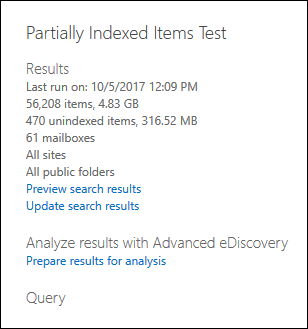

# <a name="investigating-partially-indexed-items-in-ediscovery"></a><span data-ttu-id="31f29-103">eDiscovery에서 부분적으로 인덱싱된 항목 조사</span><span class="sxs-lookup"><span data-stu-id="31f29-103">Investigating partially indexed items in eDiscovery</span></span>

<span data-ttu-id="31f29-104">Microsoft 365 준수 센터에서 실행되는 eDiscovery 검색에는 검색을 실행할 때 예상 검색 결과에 부분적으로 인덱싱된 항목이 자동으로 포함됩니다.</span><span class="sxs-lookup"><span data-stu-id="31f29-104">An eDiscovery search that you run from the Microsoft 365 compliance center automatically includes partially indexed items in the estimated search results when you run a search.</span></span> <span data-ttu-id="31f29-105">부분적으로 인덱싱된 항목은 특정 이유로 검색을 위해 완전히 인덱싱되지 않은 SharePoint 및 비즈니스용 OneDrive 사이트의 Exchange 사서함 항목 및 문서입니다.</span><span class="sxs-lookup"><span data-stu-id="31f29-105">Partially indexed items are Exchange mailbox items and documents on SharePoint and OneDrive for Business sites that for some reason weren't completely indexed for search.</span></span> <span data-ttu-id="31f29-106">대부분의 전자 메일 메시지와 사이트 문서는 전자 메일 메시지의 인덱싱 제한에 해당하기 때문에 성공적으로 [인덱싱됩니다.](limits-for-content-search.md#indexing-limits-for-email-messages)</span><span class="sxs-lookup"><span data-stu-id="31f29-106">Most email messages and site documents are successfully indexed because they fall within the [Indexing limits for email messages](limits-for-content-search.md#indexing-limits-for-email-messages).</span></span> <span data-ttu-id="31f29-107">그러나 일부 항목은 이러한 인덱싱 제한을 초과할 수 있으며 부분적으로 인덱싱됩니다.</span><span class="sxs-lookup"><span data-stu-id="31f29-107">However, some items may exceed these indexing limits, and will be partially indexed.</span></span> <span data-ttu-id="31f29-108">다음은 검색을 위해 항목을 인덱싱할 수 없는 다른 이유와 eDiscovery 검색을 실행할 때 부분적으로 인덱싱된 항목으로 반환되는 다른 이유입니다.</span><span class="sxs-lookup"><span data-stu-id="31f29-108">Here are other reasons why items can't be indexed for search and are returned as partially indexed items when you run an eDiscovery search:</span></span>
  
- <span data-ttu-id="31f29-109">전자 메일 메시지에 이미지 파일과 같은 유효한 처리기 없이 첨부된 파일이 있습니다. 부분적으로 인덱싱된 전자 메일 항목의 가장 일반적인 원인입니다.</span><span class="sxs-lookup"><span data-stu-id="31f29-109">Email messages have an attached file without a valid handler, such as image files; this is the most common cause of partially indexed email items.</span></span>

- <span data-ttu-id="31f29-110">전자 메일 메시지에 첨부된 파일이 너무 많습니다.</span><span class="sxs-lookup"><span data-stu-id="31f29-110">Too many files attached to an email message.</span></span>

- <span data-ttu-id="31f29-111">전자 메일 메시지에 첨부된 파일이 너무 대용량입니다.</span><span class="sxs-lookup"><span data-stu-id="31f29-111">A file attached to an email message is too large.</span></span>

- <span data-ttu-id="31f29-112">파일 형식 인덱싱은 지원되지만 특정 파일에 대해 인덱싱 오류가 발생했습니다.</span><span class="sxs-lookup"><span data-stu-id="31f29-112">The file type is supported for indexing but an indexing error occurred for a specific file.</span></span>

<span data-ttu-id="31f29-113">각 조직마다 다르지만 대부분의 조직 고객은 볼륨별로 콘텐츠의 1% 미만을 차지하고 부분적으로 인덱싱되는 크기에 따라 콘텐츠의 12% 미만을 차지합니다.</span><span class="sxs-lookup"><span data-stu-id="31f29-113">Although it varies, most organizations customers have less than 1% of content by volume and less than 12% of content by size that is partially indexed.</span></span> <span data-ttu-id="31f29-114">볼륨과 크기 간에 차이가 있는 이유는 파일이 크면 완전히 인덱싱할 수 없는 콘텐츠가 들어 있을 가능성이 더 높기 때문에 그렇습니다.</span><span class="sxs-lookup"><span data-stu-id="31f29-114">The reason for the difference between the volume versus size is that larger files have a higher probability of containing content that can't be completely indexed.</span></span>
  
## <a name="why-does-the-partially-indexed-item-count-change-for-a-search"></a><span data-ttu-id="31f29-115">검색을 위해 부분적으로 인덱싱된 항목 수가 변경된 이유는 무엇입니까?</span><span class="sxs-lookup"><span data-stu-id="31f29-115">Why does the partially indexed item count change for a search?</span></span>

<span data-ttu-id="31f29-116">eDiscovery 검색을 실행한 후 검색된 위치에 있는 부분적으로 인덱싱된 항목의 총 수와 크기가 검색에 대한 자세한 통계에 표시되는 검색 결과 통계에 나열됩니다.</span><span class="sxs-lookup"><span data-stu-id="31f29-116">After you run an eDiscovery search, the total number and size of partially indexed items in the locations that were searched are listed in the search result statistics that are displayed in the detailed statistics for the search.</span></span> <span data-ttu-id="31f29-117">이러한 항목을 검색 통계에서  *인덱서되지*  않은 항목이라고 합니다.</span><span class="sxs-lookup"><span data-stu-id="31f29-117">Note these are called  *unindexed items*  in the search statistics.</span></span> <span data-ttu-id="31f29-118">다음은 검색 결과에 반환되는 부분적으로 인덱싱된 항목 수에 영향을 주는 몇 가지 사항입니다.</span><span class="sxs-lookup"><span data-stu-id="31f29-118">Here are a few things that will affect the number of partially indexed items that are returned in the search results:</span></span>
  
- <span data-ttu-id="31f29-119">항목이 부분적으로 인덱싱된 경우 검색 쿼리와 일치하는 항목은 검색 결과 항목의 개수 및 크기와 부분적으로 인덱싱된 항목에 모두 포함됩니다.</span><span class="sxs-lookup"><span data-stu-id="31f29-119">If an item is partially indexed and matches the search query, it's included in both the count (and size) of search result items and partially indexed items.</span></span> <span data-ttu-id="31f29-120">그러나 동일한 검색의 결과를 내보내면 항목은 검색 결과 집합에만 포함됩니다. 부분적으로 인덱싱된 항목으로 포함되지 않습니다.</span><span class="sxs-lookup"><span data-stu-id="31f29-120">However, when the results of that same search are exported, the item is included only with set of search results; it's not included as a partially indexed item.</span></span>

- <span data-ttu-id="31f29-121">검색 쿼리에 대한 날짜 범위를 키워드 쿼리에 포함하거나 조건을 사용하여 지정하는 경우 날짜 범위와 일치하지 않는 부분적으로 인덱싱된 항목은 부분적으로 인덱싱된 항목 수에 포함되지 않습니다.</span><span class="sxs-lookup"><span data-stu-id="31f29-121">If you specify a date range for a search query (by including it in the keyword query or by using a condition), any partially indexed item that doesn't match the date range isn't included in the count of partially indexed items.</span></span> <span data-ttu-id="31f29-122">날짜 범위에 포함된 부분적으로 인덱싱된 항목만 인덱싱된 항목 수에 포함됩니다.</span><span class="sxs-lookup"><span data-stu-id="31f29-122">Only the partially indexed items that fall within date range are included in the count of indexed items.</span></span>

  > [!NOTE]
  > <span data-ttu-id="31f29-123">SharePoint 및 OneDrive 사이트에 있는 부분적으로 인덱싱된 항목은 검색에 대한 자세한 통계에 표시되는 부분적으로 인덱싱된 항목의 예상치에 포함되지 않습니다. *are not*</span><span class="sxs-lookup"><span data-stu-id="31f29-123">Partially indexed items located in SharePoint and OneDrive sites *are not* included in the estimate of partially indexed items that's displayed in the detailed statistics for the search.</span></span> <span data-ttu-id="31f29-124">그러나 eDiscovery 검색 결과를 내보낼 때 부분적으로 인덱싱된 항목을 내보낼 수 있습니다.</span><span class="sxs-lookup"><span data-stu-id="31f29-124">However, partially indexed items can be exported when you export the results of an eDiscovery search.</span></span> <span data-ttu-id="31f29-125">예를 들어 사이트만 검색하는 경우 부분적으로 인덱싱된 예상 항목 수는 0이 됩니다.</span><span class="sxs-lookup"><span data-stu-id="31f29-125">For example, if you only search sites, the estimated number partially indexed items will be zero.</span></span>
  
## <a name="calculating-the-ratio-of-partially-indexed-items-in-your-organization"></a><span data-ttu-id="31f29-126">조직에서 부분적으로 인덱싱된 항목의 비율 계산</span><span class="sxs-lookup"><span data-stu-id="31f29-126">Calculating the ratio of partially indexed items in your organization</span></span>

<span data-ttu-id="31f29-127">부분적으로 인덱싱된 항목에 대한 조직의 노출을 이해하기 위해 빈 키워드 쿼리를 사용하여 모든 사서함의 모든 콘텐츠에 대한 검색을 실행할 수 있습니다.</span><span class="sxs-lookup"><span data-stu-id="31f29-127">To understand your organization's exposure to partially indexed items, you can run a search for all content in all mailboxes (by using a blank keyword query).</span></span> <span data-ttu-id="31f29-128">아래 예제에서는 56,208(4,830MB)의 완전히 인덱싱된 항목과 부분적으로 인덱싱된 항목 470개(316MB)가 있습니다.</span><span class="sxs-lookup"><span data-stu-id="31f29-128">In the following example below, there are 56,208 (4,830 MB) fully indexed items and 470 (316 MB) partially indexed items.</span></span>
  

  
<span data-ttu-id="31f29-130">다음 계산을 사용하여 부분적으로 인덱싱된 항목의 백분율을 확인할 수 있습니다.</span><span class="sxs-lookup"><span data-stu-id="31f29-130">You can determine the percentage of partially indexed items by using the following calculations.</span></span>
  
 <span data-ttu-id="31f29-131">**조직에서 부분적으로 인덱싱된 항목의 비율을 계산합니다.**</span><span class="sxs-lookup"><span data-stu-id="31f29-131">**To calculate the ratio of partially indexed items in your organization:**</span></span>

`(Total number of partially indexed items/Total number of items) x 100`

`(470/56,208) x 100 = 0.84%`

<span data-ttu-id="31f29-132">이전 예에서 검색 결과를 사용하여 모든 사서함 항목의 .84%가 부분적으로 인덱싱됩니다.</span><span class="sxs-lookup"><span data-stu-id="31f29-132">By using the search results from the previous example, .84% of all mailboxes items are partially indexed.</span></span>
  
 <span data-ttu-id="31f29-133">**조직에서 부분적으로 인덱싱된 항목의 크기 백분율을 계산합니다.**</span><span class="sxs-lookup"><span data-stu-id="31f29-133">**To calculate the percentage of the size of partially indexed items in your organization:**</span></span>

`(Size of all partially indexed items/Size of all items) x 100`

`(316 MB/4830 MB) x 100 = 6.54%`

<span data-ttu-id="31f29-134">따라서 이전 예에서는 전체 사서함 항목 크기의 6.54%가 부분적으로 인덱싱된 항목에서 비례합니다.</span><span class="sxs-lookup"><span data-stu-id="31f29-134">So in the previous example, 6.54% of the total size of mailbox items are from partially indexed items.</span></span> <span data-ttu-id="31f29-135">앞서 설명한 것 처럼 대부분의 조직 고객은 볼륨당 콘텐츠의 1% 미만, 부분적으로 인덱싱되는 크기로 콘텐츠의 12% 미만을 차지합니다.</span><span class="sxs-lookup"><span data-stu-id="31f29-135">As previously stated, most organizations customers have less than 1% of content by volume and less than 12% of content by size that is partially indexed.</span></span>

## <a name="working-with-partially-indexed-items"></a><span data-ttu-id="31f29-136">부분적으로 인덱싱된 항목 작업</span><span class="sxs-lookup"><span data-stu-id="31f29-136">Working with partially indexed items</span></span>

<span data-ttu-id="31f29-137">부분적으로 항목을 검사하여 관련 정보가 없는지 검사해야 하는 경우 부분적으로 인덱싱된 항목에 대한 정보가 포함된 콘텐츠 검색 보고서를 내보낼 수 있습니다. [export a content search report](export-a-content-search-report.md)</span><span class="sxs-lookup"><span data-stu-id="31f29-137">In cases when you need to examine partially items to validate that they don't contain relevant information, you can [export a content search report](export-a-content-search-report.md) that contains information about partially indexed items.</span></span> <span data-ttu-id="31f29-138">콘텐츠 검색 보고서를 내보낼 때 부분적으로 인덱싱된 항목이 포함된 내보내기 옵션 중 하나를 선택해야 합니다.</span><span class="sxs-lookup"><span data-stu-id="31f29-138">When you export a content search report, be sure to choose one of the export options that includes partially indexed items.</span></span>
  

  
<span data-ttu-id="31f29-140">이러한 옵션 중 하나를 사용하여 eDiscovery 검색 결과 또는 검색 보고서를 내보낼 때 내보내기에는 Unindexed라는 보고서가 Items.csv.</span><span class="sxs-lookup"><span data-stu-id="31f29-140">When you export eDiscovery search results or a search report using one of these options, the export includes a report named Unindexed Items.csv.</span></span> <span data-ttu-id="31f29-141">이 보고서에는 파일 파일과 대부분의 동일한 ResultsLog.csv 포함됩니다. 그러나 인덱싱되지 않은 Items.csv 파일에는 부분적으로 인덱싱된 항목과 관련된 두 개의 필드인 **오류** 태그 및 오류 속성도 **포함됩니다.**</span><span class="sxs-lookup"><span data-stu-id="31f29-141">This report includes most of the same information as the ResultsLog.csv file; however, the Unindexed Items.csv file also includes two fields related to partially indexed items: **Error Tags** and **Error Properties**.</span></span> <span data-ttu-id="31f29-142">이러한 필드에는 부분적으로 인덱싱된 각 항목의 인덱싱 오류에 대한 정보가 들어 있습니다.</span><span class="sxs-lookup"><span data-stu-id="31f29-142">These fields contain information about the indexing error for each partially indexed item.</span></span> <span data-ttu-id="31f29-143">이러한 두 필드의 정보를 사용하면 특정 인덱싱 오류로 조사에 영향을 줄지 여부를 결정할 수 있습니다.</span><span class="sxs-lookup"><span data-stu-id="31f29-143">Using the information in these two fields can help you determine whether or not the indexing error for a particular impacts your investigation.</span></span> <span data-ttu-id="31f29-144">이 경우 대상 검색을 수행하고 특정 전자 메일 메시지와 SharePoint 또는 OneDrive 문서를 검색하고 내보내 조사와 관련이 있는지 확인할 수 있습니다.</span><span class="sxs-lookup"><span data-stu-id="31f29-144">If it does, you can perform a targeted search and retrieve and export specific email messages and SharePoint or OneDrive documents so that you can examine them to determine if they're relevant to your investigation.</span></span> <span data-ttu-id="31f29-145">단계별 지침은 [Office 365에서](csv-file-for-an-id-list-content-search.md)대상 검색을 위한 CSV 파일 준비를 참조하세요.</span><span class="sxs-lookup"><span data-stu-id="31f29-145">For step-by-step instructions, see [Prepare a CSV file for a targeted search in Office 365](csv-file-for-an-id-list-content-search.md).</span></span>

> [!NOTE]
> <span data-ttu-id="31f29-146">또한 인덱서되지 않은 Items.csv 파일에는 **오류** 형식 및 오류 메시지라는 **필드도 포함되어 있습니다.**</span><span class="sxs-lookup"><span data-stu-id="31f29-146">The Unindexed Items.csv file also contains fields named **Error Type** and **Error Message**.</span></span> <span data-ttu-id="31f29-147">이러한 필드는 오류 태그 및 오류 속성 필드의 정보와 **Error Properties** 비슷하지만 덜 자세한 정보가 포함된 정보를 포함하는 레거시 필드입니다. **Error Tags**</span><span class="sxs-lookup"><span data-stu-id="31f29-147">These are legacy fields that contain information that is similar to the information in the **Error Tags** and **Error Properties** fields, but with less detailed information.</span></span> <span data-ttu-id="31f29-148">이러한 레거시 필드는 무시해도 됩니다.</span><span class="sxs-lookup"><span data-stu-id="31f29-148">You can safely ignore these legacy fields.</span></span>
  
## <a name="errors-related-to-partially-indexed-items"></a><span data-ttu-id="31f29-149">부분적으로 인덱싱된 항목과 관련된 오류</span><span class="sxs-lookup"><span data-stu-id="31f29-149">Errors related to partially indexed items</span></span>

<span data-ttu-id="31f29-150">오류 태그는 오류와 파일 형식의 두 가지 정보로 표시됩니다.</span><span class="sxs-lookup"><span data-stu-id="31f29-150">Error tags are made up of two pieces of information, the error and the file type.</span></span> <span data-ttu-id="31f29-151">예를 들어 이 오류/파일 형식 쌍에서는 다음과 같습니다.</span><span class="sxs-lookup"><span data-stu-id="31f29-151">For example, in this error/file-type pair:</span></span>

```text
 parseroutputsize_xls
```

 <span data-ttu-id="31f29-152">`parseroutputsize` 오류가 발생한 파일의 파일 `xls` 형식입니다.</span><span class="sxs-lookup"><span data-stu-id="31f29-152">`parseroutputsize` is the error and `xls` is the file type of the file the error occurred on.</span></span> <span data-ttu-id="31f29-153">파일 형식이 인식되지 않았거나 파일 형식이 오류에 적용되지 않은 경우 파일 형식 대신 값이 `noformat` 표시됩니다.</span><span class="sxs-lookup"><span data-stu-id="31f29-153">In cases where the file type wasn't recognized or the file type didn't apply to the error, you will see the value `noformat` in place of the file type.</span></span>
  
<span data-ttu-id="31f29-154">다음은 인덱싱 오류 목록과 오류의 가능한 원인에 대한 설명입니다.</span><span class="sxs-lookup"><span data-stu-id="31f29-154">The following is a list of indexing errors and a description of the possible cause of the error.</span></span>
  
| <span data-ttu-id="31f29-155">오류 태그</span><span class="sxs-lookup"><span data-stu-id="31f29-155">Error tag</span></span> | <span data-ttu-id="31f29-156">설명</span><span class="sxs-lookup"><span data-stu-id="31f29-156">Description</span></span> |
|:-----|:-----|
| `attachmentcount` <br/> |<span data-ttu-id="31f29-157">전자 메일 메시지에 첨부 파일이 너무 많고 이러한 첨부 파일 중 일부는 처리되지 않습니다.</span><span class="sxs-lookup"><span data-stu-id="31f29-157">An email message had too many attachments, and some of these attachments weren't processed.</span></span>  <br/> |
| `attachmentdepth` <br/> |<span data-ttu-id="31f29-158">콘텐츠 검색기 및 문서 파서에서 다른 첨부 파일 내에 중첩된 너무 많은 수준의 첨부 파일을 찾은 경우</span><span class="sxs-lookup"><span data-stu-id="31f29-158">The content retriever and document parser found too many levels of attachments nested inside other attachments.</span></span> <span data-ttu-id="31f29-159">이러한 첨부 파일 중 일부는 처리되지 않습니다.</span><span class="sxs-lookup"><span data-stu-id="31f29-159">Some of these attachments were not processed.</span></span>  <br/> |
| `attachmentrms` <br/> |<span data-ttu-id="31f29-160">첨부 파일이 RMS로 보호되어 디코딩에 실패했습니다.</span><span class="sxs-lookup"><span data-stu-id="31f29-160">An attachment failed decoding because it was RMS-protected.</span></span>  <br/> |
| `attachmentsize` <br/> |<span data-ttu-id="31f29-161">전자 메일 메시지에 첨부된 파일이 너무 크며 처리될 수 없습니다.</span><span class="sxs-lookup"><span data-stu-id="31f29-161">A file attached to an email message was too large and couldn't be processed.</span></span>  <br/> |
| `indexingtruncated` <br/> |<span data-ttu-id="31f29-162">처리된 전자 메일 메시지를 인덱스에 쓸 때 인덱싱 가능한 속성 중 하나가 너무 크며 잘리게 됩니다.</span><span class="sxs-lookup"><span data-stu-id="31f29-162">When writing the processed email message to the index, one of the indexable properties was too large and was truncated.</span></span> <span data-ttu-id="31f29-163">잘못된 속성은 오류 속성 필드에 나열됩니다.</span><span class="sxs-lookup"><span data-stu-id="31f29-163">The truncated properties are listed in Error Properties field.</span></span>  <br/> |
| `invalidunicode` <br/> |<span data-ttu-id="31f29-164">전자 메일 메시지에 유효한 유니코드로 처리될 수 없는 텍스트가 포함되어 있습니다.</span><span class="sxs-lookup"><span data-stu-id="31f29-164">An email message contained text that couldn't be processed as valid Unicode.</span></span> <span data-ttu-id="31f29-165">이 항목에 대한 인덱싱이 불완전할 수 있습니다.</span><span class="sxs-lookup"><span data-stu-id="31f29-165">Indexing for this item may be incomplete.</span></span>  <br/> |
| `parserencrypted` <br/> |<span data-ttu-id="31f29-166">첨부 파일 또는 전자 메일 메시지의 콘텐츠가 암호화되고 Microsoft 365에서 콘텐츠를 디코딩할 수 없습니다.</span><span class="sxs-lookup"><span data-stu-id="31f29-166">The content of attachment or email message is encrypted, and Microsoft 365 couldn't decode the content.</span></span>  <br/> |
| `parsererror` <br/> |<span data-ttu-id="31f29-167">구문 분석 중에 알 수 없는 오류가 발생했습니다.</span><span class="sxs-lookup"><span data-stu-id="31f29-167">An unknown error occurred during parsing.</span></span> <span data-ttu-id="31f29-168">이는 일반적으로 소프트웨어 버그 또는 서비스 충돌의 결과입니다.</span><span class="sxs-lookup"><span data-stu-id="31f29-168">This typically results from a software bug or a service crash.</span></span>  <br/> |
| `parserinputsize` <br/> |<span data-ttu-id="31f29-169">첨부 파일이 너무 크면 파서에서 처리할 수 없습니다. 이 첨부 파일 구문 분석이 완료되지 않았거나 구문 분석이 완료되지 않은 경우</span><span class="sxs-lookup"><span data-stu-id="31f29-169">An attachment was too large for the parser to handle, and the parsing of that attachment didn't happen or wasn't completed.</span></span>  <br/> |
| `parsermalformed` <br/> |<span data-ttu-id="31f29-170">첨부 파일이 오작동하여 파서에서 처리할 수 없습니다.</span><span class="sxs-lookup"><span data-stu-id="31f29-170">An attachment was malformed and couldn't be handled by the parser.</span></span> <span data-ttu-id="31f29-171">이 결과는 이전 파일 형식, 비호칭 소프트웨어로 만든 파일 또는 클레임된 파일 외의 바이러스로 인해 생성될 수 있습니다.</span><span class="sxs-lookup"><span data-stu-id="31f29-171">This result can be due to old file formats, files created by incompatible software, or viruses pretending to be something other than claimed.</span></span>  <br/> |
| `parseroutputsize` <br/> |<span data-ttu-id="31f29-172">첨부 파일 구문 분석의 출력이 너무 크며 잘라야 합니다.</span><span class="sxs-lookup"><span data-stu-id="31f29-172">The output from the parsing of an attachment was too large and had to be truncated.</span></span>  <br/> |
| `parserunknowntype` <br/> |<span data-ttu-id="31f29-173">첨부 파일에 Microsoft 365에서 검색할 수 없는 파일 형식이 있습니다.</span><span class="sxs-lookup"><span data-stu-id="31f29-173">An attachment had a file type that Microsoft 365 couldn't detect.</span></span>  <br/> |
| `parserunsupportedtype` <br/> |<span data-ttu-id="31f29-174">첨부 파일에 Office 365에서 검색할 수 있는 파일 형식이 있지만 해당 파일 형식의 구문 분석은 지원되지 않습니다.</span><span class="sxs-lookup"><span data-stu-id="31f29-174">An attachment had a file type that Office 365 could detect, but parsing that file type isn't supported.</span></span>  <br/> |
| `propertytoobig` <br/> |<span data-ttu-id="31f29-175">Exchange 스토어의 전자 메일 속성 값이 너무 크면 메시지를 검색할 수 없습니다.</span><span class="sxs-lookup"><span data-stu-id="31f29-175">The value of an email property in Exchange Store was too large to be retrieved and the message couldn't be processed.</span></span> <span data-ttu-id="31f29-176">이 작업은 일반적으로 전자 메일 메시지의 본문 속성에만 발생합니다.</span><span class="sxs-lookup"><span data-stu-id="31f29-176">This typically only happens to the body property of an email message.</span></span>  <br/> |
| `retrieverrms` <br/> |<span data-ttu-id="31f29-177">콘텐츠 검색기에서 RMS로 보호된 메시지를 디코딩하지 못했습니다.</span><span class="sxs-lookup"><span data-stu-id="31f29-177">The content retriever failed to decode an RMS-protected message.</span></span>  <br/> |
| `wordbreakertruncated` <br/> |<span data-ttu-id="31f29-178">문서에서 인덱싱하는 동안 너무 많은 단어가 식별되었습니다.</span><span class="sxs-lookup"><span data-stu-id="31f29-178">Too many words were identified in the document during indexing.</span></span> <span data-ttu-id="31f29-179">제한에 도달하면 속성 처리가 중지된 후 속성이 끊어지게 됩니다.</span><span class="sxs-lookup"><span data-stu-id="31f29-179">Processing of the property stopped when reaching the limit, and the property is truncated.</span></span>  <br/> |

<span data-ttu-id="31f29-180">오류 필드는 오류 태그 필드에 나열된 처리 오류의 영향을 받는 필드를 설명합니다.</span><span class="sxs-lookup"><span data-stu-id="31f29-180">Error fields describe which fields are affected by the processing error listed in the Error Tags field.</span></span> <span data-ttu-id="31f29-181">속성(예: 또는 메시지 본문의 오류)을 검색하는 경우 검색 결과에 영향을  `subject`  `participants` 줄 수 없습니다.</span><span class="sxs-lookup"><span data-stu-id="31f29-181">If you're searching a property such as  `subject` or  `participants`, errors in the body of the message won't impact the results of your search.</span></span> <span data-ttu-id="31f29-182">이 기능은 추가로 조사해야 할 부분적으로 인덱싱된 항목을 정확하게 결정할 때 유용할 수 있습니다.</span><span class="sxs-lookup"><span data-stu-id="31f29-182">This can be useful when determining exactly which partially indexed items you might need to further investigate.</span></span>
  
## <a name="using-a-powershell-script-to-determine-your-organizations-exposure-to-partially-indexed-email-items"></a><span data-ttu-id="31f29-183">PowerShell 스크립트를 사용하여 부분적으로 인덱싱된 전자 메일 항목에 대한 조직의 노출 확인</span><span class="sxs-lookup"><span data-stu-id="31f29-183">Using a PowerShell script to determine your organization's exposure to partially indexed email items</span></span>

<span data-ttu-id="31f29-184">다음 단계에서는 모든 Exchange 사서함의 모든 항목을 검색하는 PowerShell 스크립트를 실행한 다음 조직에서 부분적으로 인덱싱된 전자 메일 항목의 비율(개수 및 크기별로)에 대한 보고서를 생성하고 발생하는 각 인덱싱 오류에 대한 항목 수 및 해당 파일 형식을 표시하는 방법을 보여 제공합니다.</span><span class="sxs-lookup"><span data-stu-id="31f29-184">The following steps show you how to run a PowerShell script that searches for all items in all Exchange mailboxes, and then generates a report about your organization's ratio of partially indexed email items (by count and by size) and displays the number of items (and their file type) for each indexing error that occurs.</span></span> <span data-ttu-id="31f29-185">이전 섹션의 오류 태그 설명을 사용하여 인덱싱 오류를 식별합니다.</span><span class="sxs-lookup"><span data-stu-id="31f29-185">Use the error tag descriptions in the previous section to identify the indexing error.</span></span>
  
1. <span data-ttu-id="31f29-186">파일 이름 접미사 .ps1을 사용하여 Windows PowerShell 스크립트 파일에 다음 텍스트를 저장합니다. 예를 들면 다음과 `PartiallyIndexedItems.ps1` 같습니다.</span><span class="sxs-lookup"><span data-stu-id="31f29-186">Save the following text to a Windows PowerShell script file by using a filename suffix of .ps1; for example, `PartiallyIndexedItems.ps1`.</span></span>

```powershell
  write-host "**************************************************"
  write-host "     Security & Compliance Center      " -foregroundColor yellow -backgroundcolor darkgreen
  write-host "   eDiscovery Partially Indexed Item Statistics   " -foregroundColor yellow -backgroundcolor darkgreen
  write-host "**************************************************"
  " " 
  # Create a search with Error Tags Refinders enabled
  Remove-ComplianceSearch "RefinerTest" -Confirm:$false -ErrorAction 'SilentlyContinue'
  New-ComplianceSearch -Name "RefinerTest" -ContentMatchQuery "size>0" -RefinerNames ErrorTags -ExchangeLocation ALL
  Start-ComplianceSearch "RefinerTest"
  # Loop while search is in progress
  do{
      Write-host "Waiting for search to complete..."
      Start-Sleep -s 5
      $complianceSearch = Get-ComplianceSearch "RefinerTest"
  }while ($complianceSearch.Status -ne 'Completed')
  $refiners = $complianceSearch.Refiners | ConvertFrom-Json
  $errorTagProperties = $refiners.Entries | Get-Member -MemberType NoteProperty
  $partiallyIndexedRatio = $complianceSearch.UnindexedItems / $complianceSearch.Items
  $partiallyIndexedSizeRatio = $complianceSearch.UnindexedSize / $complianceSearch.Size
  " "
  "===== Partially indexed items ====="
  "         Total          Ratio"
  "Count    {0:N0}{1:P2}" -f $complianceSearch.Items.ToString("N0").PadRight(15, " "), $partiallyIndexedRatio
  "Size(GB) {0:N2}{1:P2}" -f ($complianceSearch.Size / 1GB).ToString("N2").PadRight(15, " "), $partiallyIndexedSizeRatio
  " "
  Write-Host ===== Reasons for partially indexed items =====
  foreach($errorTagProperty in $errorTagProperties)
  {
      $name = $refiners.Entries.($errorTagProperty.Name).Name
      $count = $refiners.Entries.($errorTagProperty.Name).TotalCount
      $frag = $name.Split("{_}")
      $errorTag = $frag[0]
      $fileType = $frag[1]
      if ($errorTag -ne $lastErrorTag)
      {
          $errorTag
      }
      "    " + $fileType + " => " + $count
      $lastErrorTag = $errorTag
  }
```

2. <span data-ttu-id="31f29-187">[보안 및 준수 센터 PowerShell에 연결하기](https://go.microsoft.com/fwlink/p/?linkid=627084)</span><span class="sxs-lookup"><span data-stu-id="31f29-187">[Connect to Security & Compliance Center PowerShell](https://go.microsoft.com/fwlink/p/?linkid=627084).</span></span>

3. <span data-ttu-id="31f29-188">보안 & 준수 센터 PowerShell에서 1단계에서 스크립트를 저장한 폴더로 이동한 다음 스크립트를 실행합니다. 예를 들어:</span><span class="sxs-lookup"><span data-stu-id="31f29-188">In Security & Compliance Center PowerShell, go to the folder where you saved the script in step 1, and then run the script; for example:</span></span>

    ```powershell
    .\PartiallyIndexedItems.ps1
    ```

<span data-ttu-id="31f29-189">다음은 스크립트에서 반환된 출력을 fo로 설정하는 예제입니다.</span><span class="sxs-lookup"><span data-stu-id="31f29-189">Here's an example fo the output returned by the script.</span></span>
  

  
<span data-ttu-id="31f29-191">다음에 유의하세요.</span><span class="sxs-lookup"><span data-stu-id="31f29-191">Note the following:</span></span>
  
1. <span data-ttu-id="31f29-192">전자 메일 항목의 총 수와 크기, 부분적으로 인덱싱된 전자 메일 항목의 조직 비율(개수 및 크기)</span><span class="sxs-lookup"><span data-stu-id="31f29-192">The total number and size of email items, and your organization's ratio of partially indexed email items (by count and by size)</span></span>

2. <span data-ttu-id="31f29-193">목록 오류 태그 및 오류가 발생한 해당 파일 형식</span><span class="sxs-lookup"><span data-stu-id="31f29-193">A list error tags and the corresponding file types for which the error occurred.</span></span>
  
## <a name="see-also"></a><span data-ttu-id="31f29-194">참고 항목</span><span class="sxs-lookup"><span data-stu-id="31f29-194">See also</span></span>

[<span data-ttu-id="31f29-195">eDiscovery의 부분적으로 인덱싱된 항목</span><span class="sxs-lookup"><span data-stu-id="31f29-195">Partially indexed items in eDiscovery</span></span>](partially-indexed-items-in-content-search.md)
