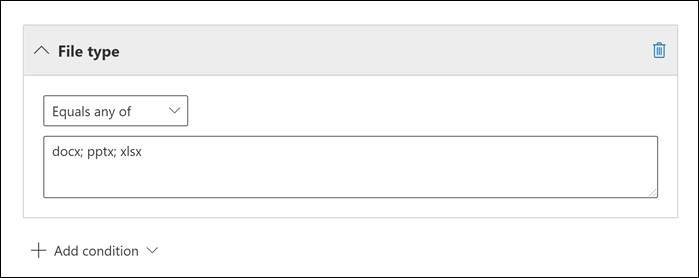

# <a name="keyword-queries-and-search-conditions-for-ediscovery"></a>eDiscovery에 대한 키워드 쿼리 및 검색 조건

이 항목에서는 Exchange Online의 전자 메일 항목 및 Microsoft Teams 채팅 대화에서 검색할 수 있는 전자 메일 및 문서 속성과 SharePoint 및 비즈니스용 OneDrive 사이트의 eDiscovery 검색 도구를 사용하여 Microsoft 365 규정 준수 센터. 여기에는 콘텐츠 검색, Core eDiscovery 및 Advanced eDiscovery(Advanced eDiscovery eDiscovery 검색을 *컬렉션이라고 합니다.* Security & Compliance Center PowerShell에서 **\* -ComplianceSearch** cmdlet을 사용하여 이러한 속성을 검색할 수도 있습니다. 이 항목에서는 다음에 대한 설명도 제공합니다.

- 부울 검색 연산자, 검색 조건 및 기타 검색 쿼리 기술을 사용하여 검색 결과를 구체화합니다.
- 사용자 지정 데이터 형식 및 사용자 지정 중요한 데이터 형식을 SharePoint 비즈니스용 OneDrive.
- 조직 외부의 사용자와 공유되는 사이트 콘텐츠 검색

다른 eDiscovery 검색을 만드는 방법에 대한 단계별 지침은 다음을 참조하세요.

- [콘텐츠 검색](content-search.md)
- [Core eDiscovery에서 콘텐츠 검색](search-for-content-in-core-ediscovery.md)
- [컬렉션에서 초안 컬렉션 Advanced eDiscovery](create-draft-collection.md)

> [!NOTE]
> eDiscovery 검색은 Microsoft 365 규정 준수 센터 및 Security & Compliance Center PowerShell의 **\* 해당 -ComplianceSearch** cmdlet은 KQL(키워드 쿼리 언어)을 사용합니다. 자세한 내용은 키워드 쿼리 언어 [구문 참조 를 참조하세요.](/sharepoint/dev/general-development/keyword-query-language-kql-syntax-reference)

## <a name="searchable-email-properties"></a>검색 가능한 전자 메일 속성

다음 표에는 Microsoft 365 규정 준수 센터 또는 **New-ComplianceSearch 또는 Set-ComplianceSearch** cmdlet을 사용하여 검색할 수 있는 전자  메일 메시지 속성이 나열되어 있습니다. 이 표에는 각 속성에 대한  _property:value_ 구문의 예와 예제에서 반환된 검색 결과에 대한 설명이 포함되어 있습니다. eDiscovery 검색의 키워드 상자에 이러한  `property:value` 쌍을 입력할 수 있습니다.

> [!NOTE]
> 전자 메일 속성을 검색할 때 지정한 속성이 비어 있거나 비어 있는 항목을 검색할 수 없습니다. 예를 들어 *property:value* pair of **subject:""를** 사용하여 제목 줄이 비어 있는 전자 메일 메시지를 검색하면 결과가 반환됩니다. 사이트 및 연락처 속성을 검색할 때도 적용됩니다.

<br>

****

|속성|속성 설명|예|예제에서 반환된 검색 결과|
|---|---|---|---|
|AttachmentNames|전자 메일 메시지에 첨부되는 파일의 이름입니다.|`attachmentnames:annualreport.ppt` <p> `attachmentnames:annual*` <br/> `attachmentnames:.pptx`|annualreport.ppt라는 파일이 첨부된 메시지입니다. 두 번째 예제에서는 와일드카드 문자( * )를 사용하여 첨부 파일의 파일 이름에 "annual"이라는 단어가 있는 메시지를 반환합니다. 세 번째 예제에서는 pptx 파일 확장명을 가지는 모든 첨부 파일을 반환합니다.|
|Bcc|전자 메일 메시지의 Bcc 필드입니다. <sup>1</sup>|`bcc:pilarp@contoso.com` <p> `bcc:pilarp` <p> `bcc:"Pilar Pinilla"`|모든 예제는 숨은 참조 필드에 Pilar Pinilla가 포함된 메시지를 반환합니다.|
|범주|검색할 범주입니다. 범주는 Outlook 또는 웹용 Outlook(이전의 Outlook Web App)를 사용하여 정의할 수 있습니다. 가능한 값은 다음과 같습니다. <ul><li>파랑<li>녹색<li>orange<li>자주<li>빨강<li>노란색</li></ul>|`category:"Red Category"`|원본 사서함에서 red 범주가 지정된 메시지입니다. |
|Cc|전자 메일 메시지의Cc 필드입니다. <sup>1</sup>|`cc:pilarp@contoso.com` <p> `cc:"Pilar Pinilla"`|두 예제 모두 참조 필드에 Pilar Pinilla가 지정된 메시지입니다.|
|Folderid|특정 사서함 폴더의 폴더 ID(GUID)입니다. 이 속성을 사용하는 경우 지정된 폴더가 있는 사서함을 검색해야 합니다. 지정된 폴더만 검색됩니다. 폴더의 하위 폴더는 검색되지 않습니다. 하위 폴더를 검색하려면 검색할 하위 폴더에 Folderid 속성을 사용해야 합니다. <p> Folderid 속성을 검색하고 스크립트를 사용하여 특정 사서함의 폴더ID를 얻는 데 대한 자세한 내용은 [Use Content search for targeted collections을 참조하십시오.](use-content-search-for-targeted-collections.md)|`folderid:4D6DD7F943C29041A65787E30F02AD1F00000000013A0000` <p> `folderid:2370FB455F82FC44BE31397F47B632A70000000001160000 AND participants:garthf@contoso.com`|첫 번째 예에서는 지정한 사서함 폴더의 모든 항목을 반환합니다. 두 번째 예에서는 지정된 사서함 폴더에서 사서함 폴더에서 보내거나 받은 모든 항목을 garthf@contoso.com.|
|시작|전자 메일 메시지의 보낸 사람입니다. <sup>1</sup>|`from:pilarp@contoso.com` <p> `from:contoso.com`|지정된 사용자가 보냈거나 지정된 도메인에서 보낸 메시지입니다.|
|HasAttachment|메시지에 첨부 파일이 있는지 여부를 나타냅니다. true 또는 **false** 값을 **사용합니다.**|`from:pilar@contoso.com AND hasattachment:true`|첨부 파일이 있는 지정된 사용자가 보낸 메시지입니다.|
|중요도|보낸 사람이 메시지를 보낼 때 지정할 수 있는 전자 메일 메시지의 중요도입니다. 기본적으로 보낸 사람이 중요도를 **높음** 또는 **낮음** 으로 설정하지 않았다면 메시지는 보통 중요도로 전송됩니다.|`importance:high` <p> `importance:medium` <p> `importance:low`|높음 중요도, 보통 중요도 또는 낮은 중요도로 표시된 메시지입니다.|
|IsRead|메시지를 읽은지 여부를 나타냅니다. true 또는 **false** 값을 **사용합니다.**|`isread:true` <p> `isread:false`|첫 번째 예제에서는 IsRead 속성이 True로 설정된 메시지를 **반환합니다.** 두 번째 예제에서는 IsRead 속성이 False로 설정된 메시지를 **반환합니다.**|
|ItemClass|이 속성을 사용하여 조직에서 데이터 원본으로 가져온 특정 타사 데이터 형식을 Office 365. 이 속성에는 다음 구문을 사용할 수 있습니다.  `itemclass:ipm.externaldata.<third-party data type>*`|`itemclass:ipm.externaldata.Facebook* AND subject:contoso` <p> `itemclass:ipm.externaldata.Twitter* AND from:"Ann Beebe" AND "Northwind Traders"`|첫 번째 예제에서는 Subject 속성에 단어 "contoso"가 포함된 Facebook 항목을 반환합니다. 두 번째 예제에서는 Ann Beebe가 게시하고 키워드 구 "Northwind Traders"가 포함된 Twitter 항목을 반환합니다. <p> ItemClass 속성에 대해 타사 데이터 형식에 사용할 값의 전체 목록은 Use [Content search to search third-party data that was imported to Office 365.](use-content-search-to-search-third-party-data-that-was-imported.md)|
|종류|검색할 전자 메일 메시지의 유형입니다. 사용 가능한 값: <p>  contacts <p>  docs <p>  전자 메일 <p>  externaldata <p>  팩스 <p>  im <p>  journals <p>  모임 <p>  microsoftteams(모임의 채팅, 모임 및 통화의 Microsoft Teams) <p>  notes <p>  posts <p>  rssfeeds <p>  작업 <p>  voicemail|`kind:email` <p> `kind:email OR kind:im OR kind:voicemail` <p> `kind:externaldata`|첫 번째 예제에서는 검색 조건을 충족하는 전자 메일 메시지를 반환합니다. 두 번째 예제에서는 전자 메일 메시지, 인스턴트 메시징 대화(비즈니스용 Skype 대화 및 채팅 포함) 및 검색 조건에 Microsoft Teams 음성 메시지를 반환합니다. 세 번째 예에서는 Twitter Microsoft 365 Facebook 및 Cisco Jabber와 같은 타사 데이터 원본에서 검색 조건을 충족하는 사서함으로 가져온 항목을 반환합니다. 자세한 내용은 에서 타사 데이터 [보관을 Office 365.](https://www.microsoft.com/?ref=go)|
|참가자|전자 메일 메시지의 모든 사용자 필드입니다. 이러한 필드는 From, To, Cc 및 Bcc입니다.<sup>1</sup>|`participants:garthf@contoso.com` <p> `participants:contoso.com`|garthf@contoso.com에서 보냈거나 이 사이트로 보낸 메시지입니다. 두 번째 예제에서는 contoso.com 도메인의 사용자가 보냈거나 이 사용자에게로 보낸 모든 메시지를 반환합니다.|
|수신됨|받는 사람이 전자 메일 메시지를 받은 날짜입니다.|`received:04/15/2016` <p> `received>=01/01/2016 AND received<=03/31/2016`|2016년 4월 15일에 수신된 메시지입니다. 두 번째 예제에서는 2016년 1월 1일과 2016년 3월 31일 사이에 수신된 모든 메시지를 반환합니다.|
|받는 사람|전자 메일 메시지의 모든 받는 사람 필드 이러한 필드는 To, Cc 및 Bcc입니다.<sup>1</sup>|`recipients:garthf@contoso.com` <p> `recipients:contoso.com`|garthf@contoso.com으로 보낸 메시지입니다. 두 번째 예제에서는 contoso.com 도메인에 있는 모든 받는 사람에게 전송된 메시지를 반환합니다.|
|Sent|보낸 사람이 전자 메일 메시지를 보낸 날짜입니다.|`sent:07/01/2016` <p> `sent>=06/01/2016 AND sent<=07/01/2016`|지정된 날짜 또는 지정된 날짜 범위 내에서 전송된 메시지입니다.|
|Size|항목의 크기(바이트)입니다.|`size>26214400` <p> `size:1..1048567`|25MB보다 큰 메시지입니다. 두 번째 예제에서는 1 ~ 1,048,567바이트(1MB) 크기의 메시지를 반환합니다.|
|제목|전자 메일 메시지 제목 줄의 텍스트입니다. <p> **참고:** 쿼리에서 Subject 속성을 사용하면 제목 줄에 검색할 텍스트가 포함된 모든 메시지가 반환됩니다. 즉, 쿼리는 정확히 일치하는 메시지만 반환하지는 않습니다. 예를 들어 를 검색하는 경우 결과에  `subject:"Quarterly Financials"` "Quarterly Financials 2018"의 제목이 포함된 메시지가 포함됩니다.|`subject:"Quarterly Financials"` <p> `subject:northwind`|제목 줄의 텍스트에 "Quarterly Financials"라는 구가 포함된 메시지입니다. 두 번째 예제에서는 제목 줄에 단어 northwind가 포함된 모든 메시지를 반환합니다.|
|받는 사람|전자 메일 메시지의 To 필드입니다. <sup>1</sup>|`to:annb@contoso.com` <p> `to:annb ` <br/> `to:"Ann Beebe"`|모든 예제에서 받는 사람: 줄에 Ann Beebe가 지정된 메시지를 반환합니다.|
|

> [!NOTE]
> <sup>1</sup> 받는 사람 속성 값의 경우 전자 메일  주소(사용자 계정 이름 또는 UPN이라고도 불리며), 표시 이름 또는 별칭을 사용하여 사용자를 지정할 수 있습니다. 예를 들어 annb@contoso.com, annb 또는 "Ann Beebe"를 사용하여 사용자 Ann Beebe를 지정할 수 있습니다.

### <a name="recipient-expansion"></a>받는 사람 확장

받는 사람 속성(From, To, Cc, Bcc, Participants 및 Recipients)을 검색할 때 Microsoft 365 Azure AD(Azure Active Directory)에서 확인하여 각 사용자의 ID를 확장하려고 시도합니다.  Azure AD에서 사용자를 찾은 경우 사용자의 전자 메일 주소(또는 UPN), 별칭, 표시 이름 및 LegacyExchangeDN을 포함하도록 쿼리가 확장됩니다. 예를 들어 등의 쿼리는 `participants:ronnie@contoso.com` 로 `participants:ronnie@contoso.com OR participants:ronnie OR participants:"Ronald Nelson" OR participants:"<LegacyExchangeDN>"` 확장됩니다.

받는 사람 확장을 방지하려면 전자 메일 주소 끝에 와일드 카드 문자(추가)를 추가하고 축소된 도메인 이름을 사용하세요. 예를 들어 전자 메일 주소를 작은 인용 부호로 `participants:"ronnie@contoso*"` 둘러싸야 합니다.

그러나 검색 쿼리에서 받는 사람 확장을 방지하면 관련 항목이 검색 결과에 반환되지 않을 수 있습니다. 받는 사람 필드에 Exchange 다른 텍스트 형식으로 전자 메일 메시지를 저장할 수 있습니다. 받는 사람 확장은 다른 텍스트 형식을 포함할 수 있는 메시지를 반환하여 이 사실을 완화하는 데 도움이 됩니다. 따라서 받는 사람 확장을 금지하면 검색 쿼리에서 조사와 관련이 있을 수 있는 모든 항목이 반환되지 않을 수 있습니다.

> [!NOTE]
> 받는 사람 확장으로 인해 검색 쿼리에서 반환된 항목을 검토하거나 줄여야 하는 경우 검색 쿼리를 사용하여 Advanced eDiscovery. 받는 사람 확장을 활용하여 메시지를 검색하고 검토 집합에 추가한 다음 검토 집합 쿼리 또는 필터를 사용하여 결과를 검토하거나 범위를 좁힐 수 있습니다. 자세한 내용은 [사례에](collecting-data-for-ediscovery.md) 대한 데이터 수집 및 검토 집합에서 [데이터 쿼리를 참조하세요.](review-set-search.md)

## <a name="searchable-site-properties"></a>검색 가능한 사이트 속성

다음 표에는 Microsoft 365 준수 센터의 eDiscovery 검색 도구를 사용하여 검색하거나 **New-ComplianceSearch 또는 Set-ComplianceSearch** cmdlet을 사용하여 검색할  수 있는 SharePoint 및 비즈니스용 OneDrive 속성 중 일부가 나열되어 있습니다. 이 표에는 각 속성에 대한  _property:value_ 구문의 예와 예제에서 반환된 검색 결과에 대한 설명이 포함되어 있습니다.

검색할 수 있는 SharePoint 속성의 전체 목록은 overview [of crawled and managed properties in SharePoint.](/SharePoint/technical-reference/crawled-and-managed-properties-overview) 쿼리 가능 열에  **예로** 표시된 속성을 검색할 수 있습니다.

<br>

****

|속성|속성 설명|예제|예제에서 반환된 검색 결과|
|---|---|---|---|
|만든 이|문서를 복사하는 경우 유지되는 Office 문서의 만든 이 필드입니다. 예를 들어 사용자가 문서를 만든 후 다른 사람에게 전자 메일로 전자 메일을 보내면 문서가 SharePoint 원래 작성자가 유지됩니다. 이 속성에는 사용자의 표시 이름을 사용해야 합니다.|`author:"Garth Fort"`|Garth Fort가 만든 모든 문서입니다.|
|ContentType|항목 SharePoint, 문서 또는 비디오와 같은 항목의 콘텐츠 형식을 저장합니다.|`contenttype:document`|모든 문서가 반환됩니다.|
|만든 날짜|항목을 만든 날짜입니다.|`created>=06/01/2016`|2016년 6월 1일 이후에 만들어진 모든 항목입니다.|
|CreatedBy|항목을 만들었거나 업로드한 사람입니다. 이 속성에는 사용자의 표시 이름을 사용해야 합니다.|`createdby:"Garth Fort"`|Garth Fort가 만들었거나 업로드한 모든 항목입니다.|
|DetectedLanguage|항목의 언어입니다.|`detectedlanguage:english`|영어로된 모든 항목입니다.|
|DocumentLink|사이트 또는 특정 사이트의 특정 폴더에 SharePoint 비즈니스용 OneDrive 경로입니다. 이 속성을 사용하는 경우 지정한 폴더가 있는 사이트를 검색해야 합니다. <p> documentlink 속성에 대해 지정한 폴더의 하위 폴더에 있는 항목을 반환하기 위해 지정한 폴더의 URL에 /를 추가해야 합니다. 예를 들면 다음과 같습니다. \*`documentlink: "https://contoso.sharepoint.com/Shared Documents/*"` <p> <br/>documentlink 속성을 검색하고 스크립트를 사용하여 특정 사이트의 폴더에 대한 문서 링크 URL을 얻는 데 대한 자세한 내용은 [Use Content search for targeted collections을 참조하십시오.](use-content-search-for-targeted-collections.md)|`documentlink:"https://contoso-my.sharepoint.com/personal/garthf_contoso_com/Documents/Private"` <p> `documentlink:"https://contoso-my.sharepoint.com/personal/garthf_contoso_com/Documents/Shared with Everyone/*" AND filename:confidential`|첫 번째 예제에서는 지정한 폴더의 모든 항목을 비즈니스용 OneDrive 예제입니다. 두 번째 예제에서는 파일 이름에 "confidential"이라는 단어가 포함된 지정한 사이트 폴더 및 모든 하위 폴더의 문서를 반환합니다.|
|FileExtension|파일의 확장명입니다. 예를 들어 docx, 1, pptx 또는 xlsx입니다.|`fileextension:xlsx`|모든 Excel 파일(Excel 2007 이상)|
|FileName|파일의 이름입니다.|`filename:"marketing plan"` <p> `filename:estimate`|첫 번째 예제에서는 제목에 "marketing plan"이 정확히 포함된 제목을 반환합니다. 두 번째 예제에서는 파일 이름에 "estimate"라는 단어가 들어 있는 파일을 반환합니다.|
|LastModifiedTime|항목을 마지막으로 변경한 날짜입니다.|`lastmodifiedtime>=05/01/2016` <p> `lastmodifiedtime>=05/10/2016 AND lastmodifiedtime<=06/1/2016`|첫 번째 예제에서는 2016년 5월 1일 이후에 변경된 항목을 반환합니다. 두 번째 예제에서는 2016년 5월 1일과 2016년 6월 1일 사이에 변경된 항목을 반환합니다.|
|ModifiedBy|항목을 마지막으로 변경한 사람입니다. 이 속성에는 사용자의 표시 이름을 사용해야 합니다.|`modifiedby:"Garth Fort"`|Garth Fort가 마지막으로 변경한 모든 항목입니다.|
|경로|특정 사이트의 URL(url)SharePoint 비즈니스용 OneDrive. <p> 지정된 사이트에서만 항목을 반환하기 위해 URL의 끝에 후행을 추가해야 합니다. 예를 들면 다음과 `/` 같습니다. `path: "https://contoso.sharepoint.com/sites/international/"` <p> 경로 속성에 지정한 사이트의 폴더에 있는 항목을 반환하기 위해 URL의 끝에 추가해야 합니다. 예를 들면 다음과 `/*` 같습니다.  `path: "https://contoso.sharepoint.com/Shared Documents/*"` <p> **참고:** 속성을 사용하여 검색 OneDrive 검색 결과에서 .png, .tiff 또는 .wav 파일과 같은 미디어 파일을 `Path` 반환하지 않습니다. 검색 쿼리에서 다른 사이트 속성을 사용하여 검색 폴더에서 미디어 OneDrive 검색합니다. <br/>|`path:"https://contoso-my.sharepoint.com/personal/garthf_contoso_com/"` <p> `path:"https://contoso-my.sharepoint.com/personal/garthf_contoso_com/*" AND filename:confidential`|첫 번째 예제에서는 지정한 사이트의 모든 항목을 비즈니스용 OneDrive 예제입니다. 두 번째 예제에서는 파일 이름에 "confidential"이라는 단어가 포함된 지정한 사이트의 문서와 사이트의 폴더를 반환합니다.|
|SharedWithUsersOWSUser|지정한 사용자와 공유되어 사용자의 사이트 사이트와 공유한 문서에 표시되는 비즈니스용 OneDrive.  조직의 다른 사용자가 지정한 사용자와 명시적으로 공유한 문서입니다. SharedWithUsersOWSUser 속성을 사용하는 검색 쿼리와 일치하는 문서를 내보내면 문서를 지정된 사용자와 공유한 사용자의 원래 콘텐츠 위치에서 내보낼 수 있습니다. 자세한 내용은 조직 내에서 공유되는 [사이트 콘텐츠 검색을 참조하세요.](#searching-for-site-content-shared-within-your-organization)|`sharedwithusersowsuser:garthf` <p> `sharedwithusersowsuser:"garthf@contoso.com"`|두 예제 모두 Garth Fort와 명시적으로 공유되고 Garth Fort의 비즈니스용 OneDrive 계정에 있는 공유한 문서 페이지에 나타나는 모든 내부 문서를 반환합니다. |
|사이트|조직의 사이트 또는 사이트 그룹의 URL입니다.|`site:"https://contoso-my.sharepoint.com"` <p> `site:"https://contoso.sharepoint.com/sites/teams"`|첫 번째 예제에서는 조직의 모든 사용자에 비즈니스용 OneDrive 사이트의 항목을 반환합니다. 두 번째 예제에서는 모든 팀 사이트의 항목을 반환합니다.|
|Size|항목의 크기(바이트)입니다.|`size>=1` <p> `size:1..10000`|첫 번째 예제에서는 1바이트 보다 큰 항목을 반환합니다. 두 번째 예제에서는 1부터 10,000바이트 크기의 항목을 반환합니다.|
|제목|문서의 제목입니다. Title 속성은 문서에 지정된 메타데이터 Microsoft Office 있습니다. 문서의 파일 이름과 다릅니다.|`title:"communication plan"`|Office 문서의 Title 메타데이터 속성에 "communication plan"이 포함된 문서입니다.|
|

## <a name="searchable-contact-properties"></a>검색 가능한 연락처 속성

다음 표에는 인덱싱된 연락처 속성과 eDiscovery 검색 도구를 사용하여 검색할 수 있는 연락처 속성이 나열됩니다. 이러한 속성은 사용자가 사용자 사서함의 개인 주소장에 있는 연락처(개인 연락처라고도 합니다.)에 대해 구성할 수 있는 속성입니다. 연락처를 검색하려면 검색할 사서함을 선택한 다음 키워드 쿼리에서 하나 이상의 연락처 속성을 사용할 수 있습니다.

> [!TIP]
> 공백이나 특수 문자가 포함된 값을 검색하기 위해 구문을 포함하기 위해 두 개의 인용 부호(" ")를 사용합니다. 예를 들면 `businessaddress:"123 Main Street"` 입니다.

<br>

****

|속성|속성 설명|
|---|---|
|BusinessAddress|Business Address **속성의 주소입니다.** 이 속성을 연락처 속성 **페이지의** 작업 주소라고도 합니다.|
|BusinessPhone|모든 Business 또는 **Business** 전화 번호입니다.|
|CompanyName|**Company 속성의 이름입니다.**|
|부서|**Department 속성의 이름입니다.**|
|DisplayName|연락처의 표시 이름입니다. 연락처의 **Full Name** 속성에 있는 이름입니다.|
|EmailAddress|연락처의 전자 메일 주소 속성에 대한 주소입니다. 사용자는 연락처에 대해 여러 전자 메일 주소를 추가할 수 있습니다. 이 속성을 사용하는 경우 연락처의 전자 메일 주소와 일치하는 연락처가 반환됩니다.|
|FileAs|**File as 속성** 이 속성은 연락처가 사용자의 연락처 목록에 나열되는 방법을 지정하는 데 사용됩니다. 예를 들어 연락처는 *FirstName,LastName* 또는 *LastName,FirstName으로 표시될 수 있습니다.*|
|GivenName|First Name **속성의 이름입니다.**|
|HomeAddress|모든 집 주소 **속성의** 주소입니다.|
|HomePhone|모든 집 전화 번호 **속성의** 전화 번호입니다.|
|IMAddress|IM 주소 속성( 일반적으로 인스턴트 메시징에 사용되는 전자 메일 주소)|
|MiddleName|Middle 이름 **속성의** 이름입니다.|
|MobilePhone|휴대폰 번호 **속성의** 전화 번호입니다.|
|별명|**Nickname 속성의 이름입니다.**|
|OfficeLocation|위치 **속성의** Office Office **값입니다.**|
|OtherAddress|Other 주소 **속성의 값입니다.**|
|성|Last **name** 속성의 이름입니다.|
|제목|작업 제목 **속성의 제목입니다.**|
|

## <a name="searchable-sensitive-data-types"></a>검색 가능한 중요한 데이터 형식

Microsoft 365 규정 준수 센터 eDiscovery 검색 도구를 사용하여 Microsoft 365 규정 준수 센터 사이트의 문서에 저장된 신용 카드 번호 또는 주민등증 번호와 같은 중요한 데이터를 SharePoint 비즈니스용 OneDrive 있습니다. 키워드 쿼리에서 중요한 정보 유형의 속성과 이름(또는 ID)을 사용하여 이 `SensitiveType` 작업을 할 수 있습니다. 예를 들어 쿼리는 신용 카드 번호가 포함된 문서를 `SensitiveType:"Credit Card Number"` 반환합니다. 이 쿼리는 미국 사회 보장 번호가 포함된 문서를  `SensitiveType:"U.S. Social Security Number (SSN)"` 반환합니다.

검색할 수 있는 중요한 정보 유형 목록을 확인한  후 검색 목록의 데이터 분류 중요한 정보 \>  유형으로 Microsoft 365 규정 준수 센터. 또는 Security & Compliance Center PowerShell에서 **Get-DlpSensitiveInformationType** cmdlet을 사용하여 중요한 정보 유형 목록을 표시할 수 있습니다.

속성을 사용하여 쿼리를 만드는 데 대한 자세한 내용은 사이트에 저장된 중요한 데이터를 찾기 위한 쿼리 `SensitiveType` [작성을 참조하세요.](form-a-query-to-find-sensitive-data-stored-on-sites.md)

### <a name="limitations-for-searching-sensitive-data-types"></a>중요한 데이터 형식 검색에 대한 제한 사항

- 사용자 지정 중요한 정보 유형을 검색하기 위해 속성에 중요한 정보 유형의 ID를 지정해야 `SensitiveType` 합니다. 이전 섹션의 기본 제공 중요한 정보 유형에 대한 예제에 표시된 사용자 지정 중요한 정보 유형의 이름을 사용하여 결과를 반환하지 않습니다. 기본 **Publisher** 사용자 지정 중요한  정보 유형을 구분하기 위해 규정 준수 센터의 중요 정보 유형 **페이지(또는** PowerShell의 Publisher 속성)의 Publisher 열을 사용하세요. 기본 제공 중요한 데이터 형식의 값은 Publisher `Microsoft Corporation` 있습니다. 

  조직의 사용자 지정 중요한 데이터 형식에 대한 이름과 ID를 표시하기 위해 보안 및 준수 센터 PowerShell에서 & 실행합니다.

  ```powershell
  Get-DlpSensitiveInformationType | Where-Object {$_.Publisher -ne "Microsoft Corporation"} | FT Name,Id
  ```

  그런 다음 검색 속성의 ID를 사용하여 사용자 지정 중요한 데이터 형식이 포함된 문서를 반환할 수 있습니다. 예를 들면 다음과 `SensitiveType` 같습니다. `SensitiveType:7e13277e-6b04-3b68-94ed-1aeb9d47de37`

- 중요한 정보 유형 및 검색 속성을 사용하여 사서함에서 미사용 중요한 `SensitiveType` 데이터를 Exchange Online 없습니다. 여기에는 모든 콘텐츠가 사서함에 저장되어 있기 때문에 1:1 채팅 메시지, 1:N 그룹 채팅 메시지 및 Microsoft 팀의 팀 채널 대화가 포함됩니다. 그러나 DLP(데이터 손실 방지) 정책을 사용하여 전송되는 중요한 전자 메일 데이터를 보호할 수 있습니다. 자세한 내용은 [데이터](dlp-learn-about-dlp.md) 손실 방지에 대한 자세한 정보 및 개인 데이터 [검색 및 찾기를 참조하세요.](/compliance/regulatory/gdpr)

## <a name="search-operators"></a>검색 연산자

**AND,** **OR,** **NOT** 등의 부울 검색 연산자를 사용하면 검색 쿼리에 특정 단어를 포함하거나 제외하여 보다 정확한 검색을 정의할 수 있습니다. 속성 연산자(예: 또는 ) 인용 부호, 괄호 및 와일드카드 사용과 같은 기타 기술은 검색 쿼리를 구체화하는 `>=` `..` 데 도움이 됩니다. 다음 표에서는 검색 결과를 좁히거나 넓히는 데 사용할 수 있는 연산자를 설명합니다.

<br>

****

|연산자|사용 현황|설명|
|---|---|---|
|그리고|keyword1 AND keyword2|지정한 키워드나 식이 모두 포함된  `property:value` 항목을 반환합니다. 예를 들어  `from:"Ann Beebe" AND subject:northwind` 제목 줄에 단어 northwind가 포함된 Ann Beebe가 보낸 모든 메시지를 반환합니다. <sup>2</sup>|
|+|keyword1 + keyword2 + keyword3|를 포함하거나  을 포함하는 `keyword2` 항목을 `keyword3`  `keyword1` 반환합니다.   따라서 이 예제는 쿼리와  `(keyword2 OR keyword3) AND keyword1` 같습니다. <p> 기호 다음에 공백이 있는 쿼리는 AND 연산자를 사용하는  `keyword1 + keyword2` **+** **경우와 같지** 않습니다. 이 쿼리는 에  `"keyword1 + keyword2"` 해당하고 정확한 단계가 있는 항목을  `"keyword1 + keyword2"` 반환합니다.|
|또는|keyword1 OR keyword2|지정한 키워드나 식이 하나 이상 포함된 항목을  `property:value` 반환합니다. <sup>2</sup>|
|NOT|keyword1 NOT keyword2 <p> NOT from:"Ann Beebe" <p> NOT kind:im|키워드 또는 식으로 지정된 항목을  `property:value` 제외합니다. 두 번째 예제에서는 Ann Beebe가 보낸 메시지를 제외합니다. 세 번째 예에서는 대화 기록 사서함 폴더에 비즈니스용 Skype 대화와 같은 인스턴트 메시징 대화를 제외합니다. <sup>2</sup>|
|-|keyword1 -keyword2|**NOT** 연산자와 같습니다. 따라서 이 쿼리는 를 포함하는 항목을 반환하고 를 포함하는  `keyword1` 항목을  `keyword2` 제외합니다.|
|NEAR|keyword1 NEAR(n) keyword2|서로 가까이 있는 단어가 있는 항목을 반환합니다. 여기서 n은 떨어져 있는 단어의 수와 같습니다. 예를 들어 단어 "worst"가 "best"의 5개 단어 이내인 항목을 `best NEAR(5) worst` 반환합니다. 숫자를 지정하지 않으면 기본 거리는 8단어입니다. <sup>2</sup>|
|:|property:value|콜론(:) 구문에서 검색되는 속성의 값에 지정된 값이 포함되고, `property:value` 예를 들어 전송된 메시지는  `recipients:garthf@contoso.com` garthf@contoso.com.|
|=|property=value|**: 연산자와** 동일합니다.|
|\<|속성 \< 값|검색 중인 속성이 지정된 값보다 작음을 나타냅니다.  <sup>1</sup>|
|\>|속성 \> 값|검색되는 속성이 지정된 값보다 크다는 것을 지정합니다. <sup>1</sup>|
|\<=|property \< =value|검색되는 속성이 특정 값보다 작거나 같음 <sup>1</sup>|
|\>=|property \> =value|검색되는 속성이 특정 값보다 크거나 같음 <sup>1</sup>|
|..|property:value1.. value2|검색되는 속성이 value1보다 크거나 같고 value2보다 작거나 같음 <sup>1</sup>|
|"  "|"fair value" <p> subject:"Quarterly Financials"|키워드 및 검색 쿼리에서 정확한 구나 용어를 검색하는 데는 두 번의 인용  `property:value` 부호(" ")를 사용할 수 있습니다.|
|\*|cat\* <p> subject:set\*|키워드 또는 쿼리에서 단어 끝에 와일드카드 문자( *)가 배치되는 위치의 *Prefix searches(즉, prefix* matching)입니다. `property:value` prefix searches에서 검색은 단어가 포함된 단어와 0자 이상의 문자가 포함된 결과를 반환합니다. 예를 들어 문서 제목에 `title:set*` "set", "setup" 및 "setting"(및 "set"로 시작하는 다른 단어)이 포함된 문서를 반환합니다. <p> **참고:** 도우미 검색만 사용할 수 있습니다. 예를 들어 **cat _ 또는 \* *_* \* *_set입니다. 접미사 검색(_* \* cat**), 접두사 검색(c **\* t**), 하위 스트링 검색(cat)은 **\* \*** 지원되지 않습니다. <p> 또한 기간(\)을 추가합니다. )를 사용하여 반환되는 결과를 변경합니다. 마라미스가 중지 단어로 처리될 때 그 이유는 바로 그 이유는 마주보는 단어입니다. 예를 들어 cat _을 검색하고 **\* *_* \* cat을** 검색하면 다른 결과가 반환됩니다. 사전 검색에서는 기간을 사용하지 않는 것이 좋습니다.|
|(  )| (fair OR free) AND (from:contoso.com) <p>  (IPO OR initial) AND (stock OR shares) <p>  (quarterly financials)|괄호는 부울 구, 항목 및 키워드를  `property:value` 그룹화합니다. 예를 들어 분기별 및 재무 단어가 포함된  `(quarterly financials)` 항목을 반환합니다.|
|

> [!NOTE]
> <sup>1</sup> 날짜 또는 숫자 값이 있는 속성에 이 연산자를 사용합니다.<br/> <sup>2</sup> 부울 검색 연산자는 대문자입니다. 예: **AND**. **및** 과 같은 소문자 연산자를 사용하면 검색 쿼리에서 키워드로 처리됩니다.

## <a name="search-conditions"></a>검색 조건

검색 쿼리에 조건을 추가하여 검색 범위를 좁히고 보다 구체화된 결과 집합을 반환할 수 있습니다. 각 조건은 검색을 시작할 때 생성 및 실행되는 KQL 검색 쿼리에 절을 추가합니다.

[공용 속성에 대한 조건 ](#conditions-for-common-properties)

[메일 속성에 대한 조건](#conditions-for-mail-properties)

[문서 속성에 대한 조건](#conditions-for-document-properties)

[조건과 함께 사용되는 연산자](#operators-used-with-conditions)

[조건 사용에 대한 지침](#guidelines-for-using-conditions)

[예제](#examples-of-using-conditions-in-search-queries)

### <a name="conditions-for-common-properties"></a>공용 속성에 대한 조건

동일한 검색에서 사서함 및 사이트를 검색할 때 공용 속성을 사용하는 조건을 만듭니다. 다음 표에는 조건을 추가할 때 사용할 수 있는 속성이 나열되어 있습니다.

<br>

****

|조건|설명|
|---|---|
|날짜|전자 메일 메시지의 경우 받는 사람이 메시지를 받았거나 보낸 사람이 메시지를 보낸 날짜입니다. 문서의 경우 문서를 마지막으로 수정한 날짜입니다.|
|보낸 사람/만든 이|전자 메일의 경우 메시지를 보낸 사람입니다. 문서의 경우 Office 문서의 만든 이 필드에 지정된 사람입니다. 여러 개의 이름을 쉼표로 구분하여 입력할 수 있습니다. 두 개 이상의 값은 **OR** 연산자를 사용하여 논리적으로 연결됩니다.|
|크기(bytes)|전자 메일 및 문서의 경우 항목의 크기(바이트)입니다.|
|제목/제목|전자 메일의 경우 메시지 제목 줄의 텍스트입니다. 문서의 경우 문서 제목입니다. 앞서 설명한 것 처럼 Title 속성은 문서에 지정된 메타데이터 Microsoft Office 있습니다. 두 개 이상의 제목 이름을 각 제목에 각 별로 구분하여 입력할 수 있습니다. 두 개 이상의 값은 **OR** 연산자를 사용하여 논리적으로 연결됩니다.|
|보존 레이블|전자 메일과 문서 모두에서 사용자가 수동으로 할당한 자동 레이블 정책 또는 보존 레이블에 의해 메시지 및 문서에 자동으로 할당된 보존 레이블입니다. 보존 레이블은 정보 거버넌스를 위해 전자 메일 및 문서를 분류하고 레이블에 정의된 설정에 따라 보존 규칙을 적용하는 데 사용됩니다. 보존 레이블 이름의 일부를 입력하고 와일드카드를 사용하거나 전체 레이블 이름을 입력할 수 있습니다. 보존 레이블에 대한 자세한 내용은 보존 정책 및 보존 레이블에 대해 자세히를 [참조하세요.](retention.md)|
|

### <a name="conditions-for-mail-properties"></a>메일 속성에 대한 조건

사서함 또는 공용 폴더를 검색할 때 메일 속성을 사용하여 조건을 만듭니다. 다음 표에서 조건을 사용할 수 있는 전자 메일 속성을 나열 합니다. 이러한 속성은 이전에 설명한 전자 메일 속성의 하위 집합입니다. 편의를 위해 이러한 설명이 반복됩니다.

<br>

****

|조건|설명|
|---|---|
|메시지 종류|검색할 메시지의 유형입니다. Kind 전자 메일 속성과 같은 속성입니다. 사용 가능한 값: <ul><li>contacts</li><li>docs</li><li>전자 메일</li><li>externaldata</li><li>팩스</li><li>im</li><li>journals</li><li>모임</li><li>microsoftteams</li><li>notes</li><li>posts</li><li>rssfeeds</li><li>작업</li><li>voicemail</li></ul>|
|참가자|전자 메일 메시지의 모든 사용자 필드입니다. 이러한 필드는 From, To, Cc 및 Bcc입니다.|
|유형|전자 메일 항목의 메시지 클래스 속성입니다. ItemClass 전자 메일 속성과 같은 속성입니다. 또한 다중값 조건입니다. 따라서 여러 메시지 클래스를 선택하려면 **Ctrl** 키를 보유한 다음 드롭다운 목록에서 조건에 추가할 메시지 클래스를 두 개 이상 클릭합니다. 목록에서 선택하는 각 메시지 클래스는 해당 검색 쿼리의 **OR** 연산자에 의해 논리적으로 연결됩니다. <p> 메시지 클래스 목록과 메시지 클래스 목록에서 선택할 수 있는 메시지 클래스(Exchange 해당 메시지  클래스 ID)는 항목 형식 및 메시지 클래스 를 [참조하세요.](/office/vba/outlook/Concepts/Forms/item-types-and-message-classes)|
|수신됨|받는 사람이 전자 메일 메시지를 받은 날짜입니다. Received 전자 메일 속성과 같은 속성입니다.|
|받는 사람|전자 메일 메시지의 모든 받는 사람 필드 이러한 필드는 To, Cc 및 Bcc입니다.|
|보낸 사람|전자 메일 메시지의 보낸 사람입니다.|
|Sent|보낸 사람이 전자 메일 메시지를 보낸 날짜입니다. Sent 전자 메일 속성과 같은 속성입니다.|
|제목|전자 메일 메시지 제목 줄의 텍스트입니다.|
|받는 사람|받는 사람 필드에 있는 전자 메일 메시지의 받는 사람입니다.|
|

### <a name="conditions-for-document-properties"></a>문서 속성에 대한 조건

사이트 및 웹 사이트에서 문서를 검색할 때 문서 속성을 SharePoint 비즈니스용 OneDrive 합니다. 다음 표에서는 조건에 사용할 수 있는 문서 속성 목록을 제공합니다. 이러한 속성은 앞서 설명한 사이트 속성의 하위 집합입니다. 편의를 위해 이러한 설명이 반복됩니다.

<br>

****

|조건|설명|
|---|---|
|만든 이|문서를 복사하는 경우 유지되는 Office 문서의 만든 이 필드입니다. 예를 들어 사용자가 문서를 만든 후 다른 사람에게 전자 메일로 전자 메일을 보내면 문서가 SharePoint 원래 작성자가 유지됩니다.|
|제목|문서의 제목입니다. Title 속성은 Office 문서에 지정된 메타데이터입니다. 문서의 파일 이름과 다릅니다.|
|만든 날짜|문서를 만든 날짜입니다.|
|마지막으로 수정한 날짜|문서를 마지막으로 변경한 날짜입니다.|
|파일 형식|파일의 확장명입니다. 예를 들어 docx, 1, pptx 또는 xlsx입니다. FileExtension 사이트 속성과 같은 속성입니다. <p> **참고:** 검색 쿼리에서 **같음** 또는 같음  연산자를 사용하여 파일 형식 조건을 포함하면 파일 형식의 끝에 와일드카드 문자()를 포함하여 파일 형식의 모든 버전을 반환하는 피어 검색을 사용할 \* 수 없습니다. 이 경우 와일드카드가 무시됩니다. 예를 들어 조건을 포함하면 확장명을 가지는 파일만 `Equals any of doc*` `.doc` 반환됩니다. 확장명을 인 `.docx` 파일은 반환되지 않습니다. 파일 형식의 모든 버전을 반환하기 위해 키워드 쿼리에 *property:value* 쌍을 사용했습니다. 예를 들면 `filetype:doc*` 입니다.|
|

### <a name="operators-used-with-conditions"></a>조건과 함께 사용되는 연산자

조건을 추가할 때 조건에 대한 속성 유형과 관련된 연산자를 선택할 수 있습니다. 다음 표에서는 조건과 함께 사용되는 연산자를 설명하고 검색 쿼리에 사용되는 것과 동일한 연산자를 제공합니다.

<br>

****

|연산자|연산자와 동일한 쿼리|설명|
|---|---|---|
|이후|`property>date`|날짜 조건과 함께 사용됩니다. 지정된 날짜 이후에 전송, 수신 또는 수정된 항목을 반환합니다. |
|Before|`property<date`|날짜 조건과 함께 사용됩니다. 지정된 날짜 이전에 전송, 수신 또는 수정된 항목을 반환합니다.|
|Between|`date..date`|날짜 및 크기 조건과 함께 사용됩니다. 날짜 조건과 함께 사용될 경우 지정된 날짜 범위 내에서 전송, 수신 또는 수정된 항목을 반환합니다. 크기 조건과 함께 사용될 경우 해당 크기가 지정된 범위 내에 속하는 항목을 반환합니다.|
|Contains any of|`(property:value) OR (property:value)`|문자열 값을 지정하는 속성에 대한 조건과 함께 사용됩니다. 하나 이상의 지정된 문자열 값의 일부를 포함하는 항목을 반환합니다.|
|Doesn't contain any of|`-property:value` <p> `NOT property:value`|문자열 값을 지정하는 속성에 대한 조건과 함께 사용됩니다. 지정된 문자열 값의 어떤 부분도 포함하지 않는 항목을 반환합니다.|
|Doesn't equal any of|`-property=value` <p> `NOT property=value`|문자열 값을 지정하는 속성에 대한 조건과 함께 사용됩니다. 특정 문자열을 포함하지 않는 항목을 반환합니다.|
|같음|`size=value`|지정한 크기와 같은 항목을 반환합니다. <sup>1</sup>|
|Equals any of|`(property=value) OR (property=value)`|문자열 값을 지정하는 속성에 대한 조건과 함께 사용됩니다. 하나 이상의 지정된 문자열 값과 정확히 일치하는 항목을 반환합니다.|
|보다 크다|`size>value`|지정한 속성이 지정한 값보다 큰 항목을 반환합니다. <sup>1</sup>|
|Greater or equal|`size>=value`|지정한 속성이 지정한 값보다 크거나 같은 항목을 반환합니다. <sup>1</sup>|
|더 적게|`size<value`|특정 값보다 크거나 같은 항목을 반환합니다. <sup>1</sup>|
|Less or equal|`size<=value`|특정 값보다 크거나 같은 항목을 반환합니다. <sup>1</sup>|
|Not equal|`size<>value`|지정한 크기와 다른 항목을 반환합니다. <sup>1</sup>|
|

> [!NOTE]
> <sup>1</sup> 이 연산자는 Size 속성을 사용하는 조건에만 사용할 수 있습니다.

### <a name="guidelines-for-using-conditions"></a>조건 사용에 대한 지침

검색 조건을 사용할 때 다음에 유의하세요.

- 조건은 **AND** 연산자를 사용하여 키워드 쿼리(키워드 상자에 지정)에 논리적으로 연결됩니다. 즉, 결과에 포함되려면 항목이 키워드 쿼리와 조건을 모두 만족해야 합니다. 조건은 이런 방식으로 결과 범위를 좁히는 데 도움이 됩니다.

- 검색 쿼리에 둘 이상의 고유한 조건(다양한 속성을 지정하는 조건)을 추가하는 경우 해당 조건이 **AND** 연산자에 의해 논리적으로 연결됩니다. 즉, 모든 조건(및 키워드 쿼리)을 만족하는 항목만 반환됩니다.

- 동일한 속성에 대해 둘 이상의 조건을 추가하면 해당 조건은 **OR** 연산자에 의해 논리적으로 연결됩니다. 즉, 키워드 쿼리와 조건 중 하나를 만족하는 항목이 반환됩니다. 따라서 동일한 조건 그룹이 **OR** 연산자에 의해 서로 연결된 후 고유한 조건 집합이 **AND** 연산자로 연결됩니다.

- 단일 조건에 여러 값을 추가하면(쉼표나 세미콜론으로 구분) 해당 값이 **OR** 연산자로 연결됩니다. 즉, 조건의 속성에 대해 지정된 값을 하나라도 포함하는 항목이 반환됩니다.

- 키워드 상자 및 조건을 사용하여 만든 검색 쿼리는 선택한  검색의 세부 정보 창에 검색 페이지에 표시됩니다. 쿼리에서 표시의 오른쪽에 있는 모든 항목은 쿼리에 추가된 조건을  `(c:c)` 나타냅니다.

- 조건은 검색 쿼리에 속성만 추가하고 연산자는 추가하지 않습니다. 이 때문에 세부 정보 창에 표시된 쿼리에 해당 표시 오른쪽에 연산자가  `(c:c)` 표시되지 않습니다. KQL은 쿼리를 실행할 때 논리 연산자를 추가합니다(이전에 설명한 규칙을 따름).

- 끌어서 놓기 컨트롤을 사용하여 조건 순서를 다시 순서대로 할 수 있습니다. 조건에 대한 컨트롤을 클릭하고 해당 조건을 업 또는 아래로 이동합니다.

- 앞서 설명한 일부 조건 속성을 사용하면 세미 콜론으로 구분하여 여러 값을 입력할 수 있습니다. 각 값은 **OR** 연산자에 의해 논리적으로 연결되고 쿼리가 `(filetype=docx) OR (filetype=pptx) OR (filetype=xlsx)` 됩니다. 다음 그림에서는 값이 여러 개 있는 조건의 예를 보여 주며,

    

  > [!NOTE]
  > 동일한 속성에 대한 조건 추가를 클릭하여 여러 조건을 **추가할** 수 없습니다. 대신 이전 예제와 같이 조건에 대해 여러 값을 제공해야 합니다(세미 콜론으로 구분).

### <a name="examples-of-using-conditions-in-search-queries"></a>예제

다음 예제에서는 조건이 있는 검색 쿼리의 GUI 기반 버전, 선택한 검색의 세부 정보 창에 표시되는 검색 쿼리 **구문(Get-ComplianceSearch** cmdlet에서 반환되는 구문) 및 해당 KQL 쿼리의 논리를 보여 제공합니다.

#### <a name="example-1"></a>예 1

이 예제에서는 신용 카드 번호가 SharePoint 비즈니스용 OneDrive 2021년 1월 1일 전에 마지막으로 수정된 사이트 및 사이트의 문서를 반환합니다.

**GUI**:


**검색 쿼리 구문**:

`SensitiveType:"Credit Card Number"(c:c)(lastmodifiedtime<2021-01-01)`

**검색 쿼리 논리**:

`SensitiveType:"Credit Card Number" AND (lastmodifiedtime<2021-01-01)`

이전 스크린샷에서 검색 UI는 키워드 쿼리 및 조건이 **AND** 연산자에 의해 연결됩니다.

#### <a name="example-2"></a>예 2

이 예제에서는 "report"라는 키워드가 들어 있으며 2021년 4월 1일 전에 보내거나 만든 전자 메일 항목이나 전자 메일 메시지의 제목 필드나 문서의 제목 속성에 단어 "northwind"가 포함된 문서를 반환합니다. 이 쿼리는 다른 검색 조건에 맞는 웹 페이지를 제외합니다.

**GUI**:


**검색 쿼리 구문**:

`report(c:c)(date<2021-04-01)(subjecttitle:"northwind")(-filetype:aspx)`

**검색 쿼리 논리**:

`report AND (date<2021-04-01) AND (subjecttitle:"northwind") NOT (filetype:aspx)`

#### <a name="example-3"></a>예 3

이 예에서는 2019년 12월 1일과 2020년 11월 30일 사이에 전송된 전자 메일 메시지 또는 일정 모임에서 "phone" 또는 "smartphone"로 시작하는 단어를 포함하는 일정 모임을 반환합니다.

**GUI**:


**검색 쿼리 구문**:

`phone* OR smartphone*(c:c)(sent=2019-12-01..2020-11-30)(kind="email")(kind="meetings")`

**검색 쿼리 논리**:

`phone* OR smartphone* AND (sent=2029-12-01..2020-11-30) AND ((kind="email") OR (kind="meetings"))`

## <a name="special-characters"></a>특수 문자

일부 특수 문자는 검색 인덱스에 포함되지 않습니다. 따라서 검색할 수 없습니다. 여기에는 검색 쿼리의 검색 연산자를 나타내는 특수 문자도 포함됩니다. 다음은 실제 검색 쿼리에서 공백으로 대체되거나 검색 오류가 발생하는 특수 문자 목록입니다.

`+ - = : ! @ # % ^ & ; _ / ? ( ) [ ] { }`

## <a name="searching-for-site-content-shared-with-external-users"></a>외부 사용자와 공유되는 사이트 콘텐츠 검색

준수 센터에서 eDiscovery 검색 도구를 사용하여 조직 외부의 사용자와 공유된 SharePoint 비즈니스용 OneDrive 사이트에 저장된 문서를 검색할 수도 있습니다. 이렇게 하면 조직 외부에서 공유되는 중요한 정보나 비공개 정보를 확인할 수 있습니다. 키워드 쿼리에서 속성을 사용하여 이  `ViewableByExternalUsers` 작업을 할 수 있습니다. 이 속성은 다음 공유 방법 중 하나를 사용하여 외부 사용자와 공유된 문서 또는 사이트를 반환합니다.

- 사용자가 인증된 사용자로 조직에 로그인해야 하는 공유 초대입니다.
- 익명 게스트 링크 - 이 링크가 있는 모든 사용자가 인증 없이 리소스에 액세스할 수 있습니다.

다음은 몇 가지 예입니다.

- 이 쿼리는 조직 외부의 사용자와 공유되고 신용 카드 번호를 포함하는 모든  `ViewableByExternalUsers:true AND SensitiveType:"Credit Card Number"` 항목을 반환합니다.
- 이 쿼리는 외부 사용자와 공유된 조직의 모든 팀 사이트에 있는 문서  `ViewableByExternalUsers:true AND ContentType:document AND site:"https://contoso.sharepoint.com/Sites/Teams"` 목록을 반환합니다.

> [!TIP]
> 등의 검색 쿼리는 검색 결과에  `ViewableByExternalUsers:true AND ContentType:document` 많은 .aspx 파일을 반환할 수 있습니다. 이러한 파일(또는 다른 형식의 파일)을 제거하려면 이 속성을 사용하여 특정 파일 형식(예: )을  `FileExtension` 제외할 수  `ViewableByExternalUsers:true AND ContentType:document NOT FileExtension:aspx` 있습니다.

조직 외부의 사용자와 공유되는 것으로 간주되는 콘텐츠는 무엇인가요? 공유 초대를 보내 공유하거나 공용 위치에서 공유되는 SharePoint 비즈니스용 OneDrive 사이트의 문서입니다. 예를 들어 다음과 같은 사용자 활동은 외부 사용자가 콘텐츠를 볼 수 있도록 만듭니다.

- 사용자가 조직 외부의 사람과 파일 또는 폴더를 공유합니다.
- 사용자가 공유 파일을 만든 후 조직 외부의 사람에게 공유 파일에 대한 링크를 보냅니다. 이 링크를 사용하여 외부 사용자를 파일을 보거나 편집할 수 있습니다.
- 사용자가 조직 외부의 사람에게 공유 파일을 보거나 편집할 수 있는 공유 초대 메일 또는 게스트 링크를 보냅니다.

### <a name="issues-using-the-viewablebyexternalusers-property"></a>ViewableByExternalUsers 속성을 사용하는 문제

이 속성은 문서 또는 사이트를 외부 사용자와 공유하는지 여부를 나타내지만 이 속성이 어떤 의미를 가지며 반영되지 않는지 몇 가지  `ViewableByExternalUsers` 주의해야 합니다. 다음 시나리오에서는 속성 값이 업데이트되지 않습니다. 이 속성을 사용하는 검색 쿼리의 결과가 부정확할  `ViewableByExternalUsers` 수 있습니다.

- 사이트 또는 조직에 대한 외부 공유 해제와 같은 공유 정책 변경 사항 이 속성은 외부 액세스가 해지된 경우에도 이전에 공유한 문서가 외부에서 액세스할 수 있는 것으로 계속 표시되어 있습니다.
- Microsoft 365 그룹 또는 보안 그룹에 외부 사용자를 추가하거나 Microsoft 365 변경합니다. 이 속성은 그룹이 액세스할 수 있는 항목에 대해 자동으로 업데이트되지 않습니다.
- 받는 사람이 초대를 수락하지 않았기 때문에 아직 콘텐츠에 액세스할 수 없는 외부 사용자에게 공유 초대를 보냅니다.

이러한 시나리오에서는 사이트 또는 문서 라이브러리를 다시 그려서 다시 인덱서할 때까지 속성이 현재 공유 상태를  `ViewableByExternalUsers` 반영하지 않습니다.

## <a name="searching-for-site-content-shared-within-your-organization"></a>조직 내에서 공유되는 사이트 콘텐츠 검색

앞서 설명한 것 처럼 속성을 사용하여 조직의 사용자 간에 공유된 문서를  `SharedWithUsersOWSUser` 검색할 수 있습니다. 사용자가 조직 내부의 다른 사용자와 파일(또는 폴더)을 공유하면 공유 파일에  대한 링크가 파일을 공유한 사용자의 비즈니스용 OneDrive 계정의 공유한 사용자 페이지에 표시됩니다. 예를 들어 Sara Davis와 공유된 문서를 검색하기 위해 쿼리를 사용할 수  `SharedWithUsersOWSUser:"sarad@contoso.com"` 있습니다. 이 검색 결과를 내보낼 경우 Sara와 문서를 공유한 사람의 콘텐츠 위치에 있는 원본 문서가 다운로드됩니다.

속성을 사용할 때 검색 결과에 반환하려면 문서를 특정 사용자와 명시적으로 공유해야  `SharedWithUsersOWSUser` 합니다. 예를 들어 사용자가 OneDrive 계정에서 문서를 공유하는 경우 조직 내부 또는 외부의 사용자와 문서를 공유하거나, 조직 내부의 사용자와만 공유하거나, 특정 사용자와 문서를 공유할 수 있습니다. 다음은 3가지 공유  옵션을 보여 OneDrive 공유 창의 스크린샷입니다.


세 번째 옵션(특정 사용자와 공유)을 사용하여 공유되는 문서만 속성을 사용하는 검색 쿼리에서  `SharedWithUsersOWSUser` 반환됩니다.

## <a name="searching-for-skype-for-business-conversations"></a>대화 비즈니스용 Skype 검색

다음 키워드 쿼리를 사용하여 특정 대화에서 콘텐츠를 비즈니스용 Skype 수 있습니다.

```powershell
kind:im
```

이전 검색 쿼리는 또한 검색 쿼리에서 채팅을 Microsoft Teams. 이를 방지하기 위해 다음 키워드 쿼리를 사용하여 비즈니스용 Skype 검색 결과의 범위를 좁힐 수 있습니다.

```powershell
kind:im AND subject:conversation
```

이전 키워드 쿼리는 Microsoft Teams "conversation"비즈니스용 Skype 제목 줄이 있는 전자 메일 메시지로 저장되어 있기 때문에 이 쿼리에서 채팅을 제외합니다.

특정 날짜 비즈니스용 Skype 발생한 대화를 검색하기 위해 다음 키워드 쿼리를 사용합니다.

```powershell
kind:im AND subject:conversation AND (received=startdate..enddate)
```

## <a name="character-limits-for-searches"></a>검색에 대한 문자 제한

모든 사이트 및 계정에서 콘텐츠를 검색할 때 검색 쿼리에는 4,000자 SharePoint 제한이 OneDrive 있습니다.
검색 쿼리의 총 문자 수를 계산하는 방식은 다음과 같습니다.

- 키워드 검색 쿼리의 문자(사용자 및 필터 필드 모두 포함)는 이 제한에 따라 계산됩니다.
- 모든 위치 속성의 문자(예: 모든 SharePoint 사이트 또는 OneDrive 위치의 URL)는 이 제한에 따라 계산됩니다.
- 모든 검색 권한의 문자는 제한에 대해 검색 횟수를 실행하는 사용자에게 적용되는 필터입니다.

문자 제한에 대한 자세한 내용은 [eDiscovery 검색 제한을 참조하세요.](limits-for-content-search.md#search-limits)

> [!NOTE]
> 콘텐츠 검색, Core eDiscovery 및 콘텐츠 검색에는 4,000자 제한이 Advanced eDiscovery.

## <a name="search-tips-and-tricks"></a>검색 팁과 트릭

- 키워드 검색은 대소문자 구분이 없습니다. 예를 들어 **cat** 및 **CAT** 은 같은 결과를 반환합니다.

- 부울 연산자 **AND**, **OR**, **NOT** 및 **NEAR는** 대문자되어야 합니다.

- 두 키워드 또는 두 식 사이의 공백은 AND를 사용하는 `property:value` 경우와 **동일합니다.** 예를 들어 제목 줄에 다시 구성 단어가 포함된 Sara Davis가 보낸 모든 메시지를  `from:"Sara Davis" subject:reorganization` 반환합니다.

- 형식과 일치하는 구문을 `property:value` 사용 합니다. 값은 대소문자 구분이 아니며 연산자 다음에 공백을 사용할 수 없습니다. 공백이 있는 경우 의도한 값은 전체 텍스트 검색입니다. 예를 들어 pilarp로 전송된 메시지가 아니라 `to: pilarp` 키워드로 "pilarp"를 검색합니다.

- 받는 사람 속성(예: To, From, Cc 또는 Recipients)을 검색하는 경우 SMTP 주소, 별칭 또는 표시 이름을 사용하여 받는 사람을 나타낼 수 있습니다. 예를 들어, pilarp@contoso.com, pilarp, 또는 "Pilar Pinilla"를 사용할 수 있습니다.

- 도우미 검색만 사용할 수 있습니다. 예를 들어 **cat _ 또는 \* *_* \* *_set입니다. 접미사 검색(_* \* cat**), 접두사 검색(c **\* t**), 하위 스트링 검색(cat)은 **\* \*** 지원되지 않습니다.

- 속성을 검색할 때 검색 값이 여러 단어로 구성된 경우 두 번의 인용 부호(" ")를 사용 합니다. 예를 들어 `subject:budget Q1` 제목 줄에 **예산이** 들어 있으며 메시지나 메시지 속성의 아무 곳에나 **Q1이** 포함된 메시지를 반환합니다. 를 사용하는 경우 제목 줄의 아무 `subject:"budget Q1"` **곳에나 budget Q1이** 포함된 모든 메시지가 반환됩니다.

- 검색 결과에서 특정 속성 값으로 표시된 콘텐츠를 제외하려면 속성 이름 앞에 빼기 기호(-)를 추가합니다. 예를 들어 `-from:"Sara Davis"` Sara Davis가 보낸 모든 메시지는 제외합니다.

- 메시지 유형에 따라 항목을 내보낼 수 있습니다. 예를 들어 Skype 대화 및 채팅을 내보낼 Microsoft Teams 구문을 `kind:im` 사용하세요. 전자 메일 메시지만 반환하기 위해 를 사용하게 `kind:email` 됩니다. 에서 채팅, 모임 및 통화를 Microsoft Teams `kind:microsoftteams` 를 사용하세요.

- 앞서 설명한 것 처럼 사이트를 검색할 때 속성을 사용하여 지정된 사이트의 항목만 반환할 때 URL의 끝에 후행을 `/` `path` 추가해야 합니다. 후행 을 포함하지 않는 경우 경로 이름이 비슷한 사이트의 `/` 항목도 반환됩니다. 예를 들어 이라는 사이트의 항목을 사용하는 경우 또는 이라는 사이트의 `path:sites/HelloWorld` `sites/HelloWorld_East` `sites/HelloWorld_West` 항목도 반환됩니다. HelloWorld 사이트에서만 항목을 반환하기 위해 를 사용해야 `path:sites/HelloWorld/` 합니다.
