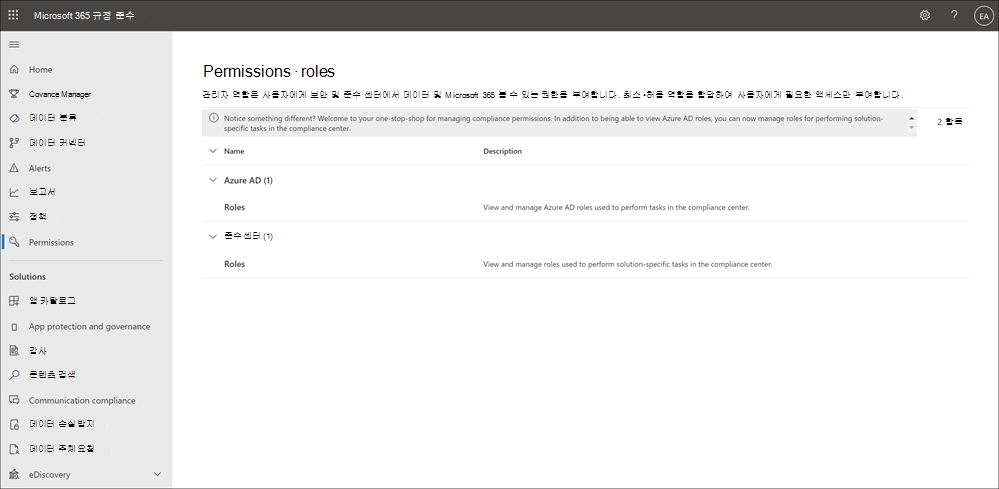

# Microsoft 365 규정 준수 센터 사용 권한

이 Microsoft 365 규정 준수 센터 최근에 업데이트되어 현재는 2013에서 규정 준수 작업을 수행하는 사용자에 대한 사용 권한을 직접 관리할 Microsoft 365. 이 업데이트는 더 이상 Office 365 보안 & 준수 센터를 사용하여 규정 준수 솔루션에 대한 사용 권한을 관리할 필요가 없음을 의미합니다. Microsoft 365 규정 준수 센터 새  사용 권한 페이지를 사용하여 장치 관리, 데이터 손실 방지, eDiscovery, 내부자 위험 관리, 보존 등 기능의 규정 준수 작업에 대한 사용 권한을 사용자에게 관리할 수 있습니다. 사용자는 명시적으로 액세스 권한을 부여한 준수 작업만 수행할 수 있습니다.

조직에서  사용 권한 탭을 Microsoft 365 규정 준수 센터 사용자는 전역 관리자 또는 역할 관리 역할(역할은 조직 관리 역할 그룹에만  할당)을 할당해야 합니다.  역할 *관리 역할을* 사용하면 사용자가 역할 그룹을 보고 만들고 수정할 수 있습니다.

사용 권한은 Microsoft 365 규정 준수 센터 RBAC(역할 기반 액세스 제어) 권한 모델을 기반으로 합니다. RBAC는 대부분의 Microsoft 365 서비스에서 사용하는 사용 권한 모델과 동일하기 때문에 이러한 서비스의 사용 권한 구조에 익숙한 경우 해당 서비스에서 사용 권한을 Microsoft 365 규정 준수 센터 익숙합니다. 각 개별 서비스에서 관리되는 사용 권한은 Microsoft 365 규정 준수 센터 필요한 모든 사용 권한 관리를 다루지 않습니다. 관리 센터에서 특정 서비스에 대한 특정 서비스 관련 권한을 관리해야 합니다. 예를 들어 보관, 감사 및 MRM 보존 정책에 대한 사용 권한을 할당해야 하는 경우 Exchange 관리 센터에서 이러한 사용 권한을 관리해야 합니다.

## 구성원, 역할 및 역할 그룹의 관계

역할은 작업 집합을 수행할 수 있는 권한을 부여합니다. 예를 들어 사례 관리 역할을 사용하면 사용자가 eDiscovery 사례로 작업할 수 있습니다.

역할 그룹은 사용자가 역할 그룹에서 규정 준수 솔루션 전반에 걸쳐 작업을 할 수 있도록 하는 Microsoft 365 규정 준수 센터. 예를 들어 내부자 위험  관리 역할 그룹에 사용자를 추가하면 지정된 관리자, 분석가, 조사자 및 감사자는 단일 그룹에서 필요한 내부자 위험 관리 권한에 맞게 구성됩니다. 이 Microsoft 365 규정 준수 센터 사용자 할당에 필요한 각 준수 솔루션에 대한 작업 및 기능에 대한 기본 역할 그룹이 포함되어 있습니다. 일반적으로 개별 사용자를 필요한 경우 기본 준수 역할 그룹에 구성원으로 추가하는 것이 좋습니다.

## 사용 권한의 기능을 사용하는 데 필요한 Microsoft 365 규정 준수 센터

역할 그룹에서 사용할 수 있는 모든 기본 역할 Microsoft 365 규정 준수 센터 기본적으로 역할 그룹에 할당된 역할을 표시하려면 Security & Compliance Center의 사용 [권한을 참조합니다.](/microsoft-365/security/office-365-security/permissions-in-the-security-and-compliance-center)

관리 권한 관리는 Microsoft 365 규정 준수 센터 내에서 사용할 수 있는 규정 준수 기능에만 액세스할 수 있도록 Microsoft 365 규정 준수 센터. Microsoft 365 규정 준수 센터 메일 흐름 규칙(전송 규칙)Exchange 같은 다른 기능에 사용 권한을 부여하려면 Exchange 관리 센터를 사용해야 합니다.

## 클라우드의 Azure Microsoft 365 규정 준수 센터

권한 페이지의 **Azure AD** 역할 섹션에 나타나는 역할은 Microsoft 365 규정 준수 센터  >   역할에 Azure Active Directory 있습니다.  이러한 역할은 조직의 IT 그룹의 직무에 맞게 설계되므로 사용자에게 업무 수행에 필요한 모든 권한을 쉽게 부여할 수 있습니다. 관리자 역할을 선택하고 역할 패널 세부 정보를 확인하여 각 역할에 현재 할당된 사용자를 볼 수 있습니다. Azure AD 역할의 구성원을 관리하려면 Azure AD에서 구성원 관리를 선택합니다. 이 선택은 Azure 관리 포털로 리디렉션됩니다.

|역할|설명|
|:---|:----------|
|**전역 관리자**|모든 Microsoft 365 서비스의 모든 관리 기능에 액세스할 수 있습니다. 전역 관리자만 다른 관리자 역할을 할당할 수 있습니다. 자세한 내용은 [전역 관리자 / 회사 관리자](/azure/active-directory/roles/permissions-reference#global-administrator--company-administrator)를 참조하세요.|
|**규정 준수 데이터 관리자**|Microsoft 365에서 조직의 데이터를 추적하고, 보호가 설정되었는지 확인하고, 위험을 완화하는 데 도움이 되는 모든 문제에 대한 인사이트를 얻으세요. 자세한 내용은 [규정 준수 데이터 관리자](/azure/active-directory/roles/permissions-reference#compliance-data-administrator)를 참조하세요.|
|**규정 준수 관리자**|조직이 모든 규정 요구 사항을 준수하고, eDiscovery 사례를 관리하며, Microsoft 365 위치, ID 및 앱 전반에서 데이터 관리 정책을 유지하도록 돕습니다. 자세한 내용은 [규정 준수 관리자](/azure/active-directory/roles/permissions-reference#compliance-administrator)를 참조하세요.|
|**보안 운영자**|Microsoft 365 사용자, 디바이스 및 콘텐츠에 대한 활성 위협을 보고, 조사하고, 대응합니다. 자세한 내용은 [보안 운영자](/azure/active-directory/roles/permissions-reference#security-operator)를 참조하세요.|
|**보안 읽기 권한자**|Microsoft 365 사용자, 디바이스 및 콘텐츠에 대한 활성 위협을 보고 조사하나 (보안 운영자와는 달리) 조치를 취하여 대응할 권한은 없습니다. 자세한 내용은 [보안 읽기 권한자](/azure/active-directory/roles/permissions-reference#security-reader)를 참조하세요.|
|**보안 관리자**|보안 정책을 관리하고, Microsoft 365 제품 전반에서 보안 분석 및 보고서를 검토하고, 위협 상황에 대한 최신 정보를 파악하여 조직의 전반적인 보안을 제어합니다. 자세한 내용은 [보안 관리자](/azure/active-directory/roles/permissions-reference#security-administrator)를 참조하세요.|
|**전역 읽기 권한자**|**전역 관리자** 역할의 읽기 전용 버전입니다. Microsoft 365 전반의 모든 설정 및 관리 정보를 봅니다. 자세한 내용은 [전역 읽기 권한자](/azure/active-directory/roles/permissions-reference#global-reader)를 참조하세요.|
|**공격 시뮬레이션 관리자**|공격 시뮬레이션 생성, 시뮬레이션 실행/예약, 시뮬레이션 결과 검토의 모든 측면을 만들고 관리합니다. 자세한 내용은 [공격 시뮬레이션 관리자](/azure/active-directory/roles/permissions-reference#attack-simulation-administrator)를 참조하세요.|
|**공격 페이로드 작성자**|공격 페이로드를 생성하지만 실제로 시작하거나 예약하지는 않습니다. 자세한 내용은 [공격 페이로드 작성자](/azure/active-directory/roles/permissions-reference#attack-payload-author)를 참조하세요.|
|

## 준수 역할 그룹에 사용자 추가

다음 단계를 완료하여 준수 역할 그룹에 사용자를 추가합니다.

1. 조직의 관리자 계정에 대한 자격 [Microsoft 365 규정 준수 센터](https://compliance.microsoft.com/permissions) 사용하여 조직의 사용 권한 영역에 Microsoft 365 로그인합니다.
2. In the Microsoft 365 규정 준수 센터, go to **Permissions**. 정책에서 규정 준수 역할을 보고 관리하기 위한 링크를 Microsoft 365.
3. 준수 센터 **섹션을** 확장하고 **역할을 선택합니다.**
4. 준수 **센터 역할 페이지에서** 사용자를 추가할 준수 역할 그룹을 선택한 다음  세부 정보 창에서 역할 그룹 편집을 선택합니다.
5. 왼쪽 **탐색 창에서** 구성원 선택을 선택한 다음 편집 **을 선택합니다.**
6. **추가를** 선택한 다음 역할 그룹에 추가할 모든 사용자에 대한 확인란을 선택합니다.
7. **추가** 를 선택한 다음 **완료** 를 선택합니다.
8. **저장을** 선택하여 역할 그룹에 사용자를 추가합니다. 닫기 **를** 선택하여 단계를 완료합니다.

## 준수 역할 그룹에서 사용자 제거

다음 단계를 완료하여 준수 역할 그룹에서 사용자를 제거합니다.

1. 조직의 관리자 계정에 대한 자격 [Microsoft 365 규정 준수 센터](https://compliance.microsoft.com/permissions) 사용하여 조직의 사용 권한 영역에 Microsoft 365 로그인합니다.
2. In the Microsoft 365 규정 준수 센터, go to **Permissions**. 정책에서 규정 준수 역할을 보고 관리하기 위한 링크를 Microsoft 365.
3. 준수 센터 섹션을 확장하고 **역할을 선택합니다.**
4. 준수 센터 **역할 페이지에서** 사용자를 제거할 준수 역할 그룹을 선택한 다음  세부 정보 창에서 역할 그룹 편집을 선택합니다.
5. 왼쪽 **탐색 창에서** 구성원 선택을 선택한 다음 편집 **을 선택합니다.**
6. **제거를** 선택한 다음 역할 그룹에서 제거할 모든 사용자에 대한 확인란을 선택합니다.
7. **제거를** 선택한 다음 완료 를 **선택합니다.**
8. **저장을** 선택하여 역할 그룹에서 사용자를 제거합니다. 닫기 **를** 선택하여 단계를 완료합니다.

## 사용자 지정 역할 그룹 만들기

다음 단계를 완료하여 사용자 지정 역할 그룹을 만드세요.

1. 조직에서 관리자 계정의 자격 [https://compliance.microsoft.com/permissions](https://compliance.microsoft.com/permissions) 증명을 사용하여 Microsoft 365 로그인합니다.
2. In the Microsoft 365 규정 준수 센터, go to **Permissions**.
3. 사용 **권한** & 페이지에서 역할 **에 있는 준수 > 선택합니다.**
4. 준수 센터 **역할 페이지에서** 만들기를 **선택합니다.**
5. 역할 **그룹 이름 지정 페이지의** 이름 필드에 사용자 지정 역할 그룹의 이름을 **입력합니다.** 역할 그룹을 만들면 역할 그룹의 이름을 변경할 수 없습니다. 필요한 경우 설명 필드에 사용자 지정 역할 그룹에 대한 **설명을 입력합니다.** **다음** 을 선택하여 계속합니다.
6. 역할 **선택 페이지에서** 역할 선택 **을 선택합니다.**
7. **추가를** 선택한 다음 사용자 지정 역할 그룹에 추가할 역할을 선택합니다. **추가를** 선택하여 역할 그룹을 추가한 다음 완료 를 **선택합니다.**
8. **다음** 을 선택하여 계속합니다.
9. 구성원 **선택 페이지에서** 구성원 **선택 을 선택합니다.**
10. **추가를** 선택한 다음 사용자 지정 역할 그룹에 추가할 구성원을 선택합니다. **추가를** 선택하여 구성원을 추가한 다음 완료 를 **선택합니다.**
11. **다음** 을 선택하여 계속합니다.
12. 설정 **검토 페이지에서** 사용자 지정 역할 그룹에 대한 세부 정보를 검토합니다. 정보를 편집해야 하는 경우 해당 섹션에서 **편집을** 선택합니다. 모든 설정이 올되면  역할 그룹 만들기를 선택하여 사용자  지정 역할 그룹을 만들거나 취소를 선택하여 변경 내용을 취소하고 사용자 지정 역할 그룹을 만들지 않습니다.

## 사용자 지정 역할 그룹 업데이트

다음 단계를 완료하여 사용자 지정 역할 그룹을 업데이트합니다.

1. 조직에서 관리자 계정의 자격 [https://compliance.microsoft.com/permissions](https://compliance.microsoft.com/permissions) 증명을 사용하여 Microsoft 365 로그인합니다.
2. In the Microsoft 365 규정 준수 센터, go to **Permissions**.
3. 사용 **권한** & 페이지에서 역할 **에 있는 준수 > 선택합니다.**
4. 준수 **센터 역할 페이지에서** 업데이트할 역할 그룹을 선택합니다.
5. 선택한 역할 그룹의 세부 정보 창에서 역할 그룹 **편집 을 선택합니다.**
6. 역할 **그룹 이름 편집 페이지의** 설명 필드에서 사용자 지정 역할 그룹에 대한 **설명을 업데이트합니다.** 사용자 지정 역할 그룹의 이름은 변경할 수 없습니다.
7. 역할 **선택 페이지에서** 편집을  선택하여 역할 그룹에 할당된 역할을 업데이트합니다.
8. **추가를** 선택한 다음 사용자 지정 역할 그룹에 추가할 역할을 선택합니다. **추가를** 선택하여 역할 그룹을 추가한 다음 완료 를 **선택합니다.**
9. 구성원 **선택 페이지에서** 편집 **을 선택합니다.**
10. **추가를** 선택한 다음 사용자 지정 역할 그룹에 추가할 구성원을 선택합니다. **추가를** 선택하여 구성원을 추가한 다음 완료 를 **선택합니다.**
11. 저장을 선택하여 업데이트된 *설명,* 역할 *그룹* 및 *구성원 값을 저장합니다.* 
12. 선택한 역할 그룹의 세부 정보 창에서 닫기 를 **선택합니다.**

## 사용자 지정 역할 그룹 삭제

다음 단계를 완료하여 사용자 지정 역할 그룹을 업데이트합니다.

1. 조직에서 관리자 계정의 자격 [https://compliance.microsoft.com/permissions](https://compliance.microsoft.com/permissions) 증명을 사용하여 Microsoft 365 로그인합니다.
2. In the Microsoft 365 규정 준수 센터, go to **Permissions**.
3. 사용 **권한** & 페이지에서 역할 **에 있는 준수 > 선택합니다.**
4. 준수 **센터 역할 페이지에서** 업데이트할 역할 그룹을 선택합니다.
5. 선택한 역할 그룹의 세부 정보 창에서 역할 그룹 **삭제 를 선택합니다.**
6. 경고 **대화** 상자에서 **예를** 선택하여 역할 그룹을  삭제하거나 아니요를 선택하여 삭제 프로세스를 취소합니다.
