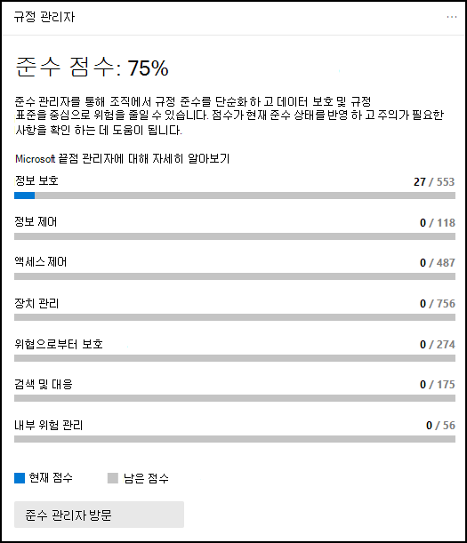

# Microsoft 365 규정 준수 센터

조직의 규정 준수에 관심이 있는 경우 조직의 규정 준수 [Microsoft 365 규정 준수 센터.](https://compliance.microsoft.com) Microsoft 365 규정 준수 센터에서는 조직의 규정 준수 요구 사항을 관리하는 데 필요한 데이터와 도구에 쉽게 액세스할 수 있습니다.

이 문서를 읽고 Microsoft 365 규정 준수 센터, 질문과 대답 및 다음 단계에 대해 [자세히 알고자 합니다.](#next-steps)

## 규정 준수 Microsoft 365 오신 것을 환영합니다.

처음으로 Microsoft 365 규정 준수 센터 인사말을 보내면 다음과 같은 환영 메시지가 표시됩니다.

시작 배너는 시작하는 방법에 대한 포인터와 다음 단계, 피드백을 제공해야 하는 초대를 제공합니다.

## 카드 섹션

Microsoft 365 규정 준수 센터 처음 방문하면 홈 페이지의 카드 섹션에 조직에서 데이터 규정 준수를 수행하고 있는 방식, 조직에서 사용할 수 있는 솔루션 및 활성 경고 요약이 표시됩니다.

여기에서 다음 작업을 실행할 수 있습니다.

- 준수 관리자 **솔루션으로** 연결되는 Microsoft 준수 관리자 [카드를 검토합니다.](compliance-manager.md) 준수 관리자는 규정 준수를 관리하는 방법을 간소화하는 데 도움이 됩니다. 데이터 보호 및 규정 표준에 대한 위험을 줄이는 데 도움이 되는 권장 작업을 완료하는 데 진행률을 측정하는 위험 기반 점수를 계산합니다. 또한 워크플로 기능 및 기본 제공 컨트롤 매핑을 제공하면 개선 작업을 효율적으로 수행할 수 있습니다.

    

- 종단 **내** 준수 시나리오를 관리하는 데  사용할 수 있는 통합 솔루션 컬렉션으로 연결되는 새 솔루션 카탈로그 카드를 검토합니다. 솔루션의 기능 및 도구에는 정책, 경고, 보고서 등 다양한 기능 조합이 포함되어 있을 수 있습니다.

    

- 가장 활성 **경고에** 대한 요약을 포함하며  심각도, 상태, 범주 등의 자세한 정보를 볼 수 있는 링크가 포함된 활성 경고 카드를 검토합니다.

    

카드 추가 기능을  사용하여 조직의 클라우드 앱 규정 준수를 표시하는 카드, 공유 파일을 사용하는 사용자에 대한 데이터를  표시하는 카드, 데이터를 탐색할 수 있는 기타 도구에 대한 링크가 Cloud App Security 등의 카드를 추가할 수도 있습니다.

## 더 많은 규정 준수 기능에 대한 손쉬워진 탐색

홈페이지의 카드 링크 외에도 알림, 보고서, 정책, 규정 준수 솔루션 등 쉽게 액세스할 수 있는 탐색 창이 화면 왼쪽에 표시됩니다.  사용자 지정된 탐색 창에 대한 옵션을 추가하거나 제거하려면 탐색 창에서 탐색 **컨트롤** 사용자 지정을 사용하세요. 그러면 탐색 **창에** 나타나는 항목을 구성할 수 있도록 탐색 창 사용자 지정 설정이 열립니다.

 

****

|네비게이션|설명|
|---|---|
||**홈을** 선택하여 기본 Microsoft 365 규정 준수 센터 선택합니다. 
 준수 **관리자를** 방문하여 준수 점수를 확인하고 조직에 대한 규정 준수 [관리를](compliance-manager.md) 시작하십시오. 
 학습 **가능한** 분류자, 중요한 정보 유형 엔터티 [정의,](sensitive-information-type-entity-definitions.md)콘텐츠 및 활동 탐색기에 액세스하려면 데이터 분류 [섹션을](data-classification-activity-explorer.md) 선택합니다. 
 데이터 **커넥터를**  선택하여 데이터 원본 구독의 데이터를 가져오고 보관할 커넥터를 Microsoft 365 선택합니다. 
 경고로 **이동하여** 경고를 [보고 해결합니다.](alert-policies.md) 
보고서를 **방문하여** 레이블 사용 및 [보존에](sensitivity-labels.md)대한 데이터를 보고, [DLP](view-the-dlp-reports.md) 정책이 일치하고, 공유 [파일,](/cloud-app-security/file-filters)사용 중인 타사 앱 등입니다. 
 정책으로 **이동하여** 데이터를 관리하고, 장치를 관리하고, 알림을 받는 정책을 [설정할 수 있습니다.](../security/office-365-security/alerts.md) DLP 및 [보존 정책에 액세스할](dlp-learn-about-dlp.md) [수도](retention.md) 있습니다. 
 **조직에서** 콘텐츠 보기 및 작업을 완료하기 위해 조직에서 액세스 권한이 Microsoft 365 규정 준수 센터 권한을 선택합니다. 
 솔루션 섹션의 **링크를 사용하여** 조직의 규정 준수 솔루션에 액세스합니다. 다음이 포함되어 있습니다. 
 [카탈로그](microsoft-365-solution-catalog.md)   조직에서 사용할 수 있는 지능형 규정 준수 및 위험 관리 솔루션을 검색하고, 자세히 알아보고, 사용을 시작하세요. 
 [감사](search-the-audit-log-in-security-and-compliance.md)   감사 로그를 사용하여 일반적인 지원 및 규정 준수 문제를 조사합니다. 
 [콘텐츠 검색](search-for-content.md)   콘텐츠 검색을 사용하여 Exchange 사서함, SharePoint 사이트 및 OneDrive 위치의 문서, Microsoft Teams 및 메시지의 인스턴트 메시징 대화를 비즈니스용 Skype. 
 [커뮤니케이션 규정 준수](communication-compliance.md)   부적절한 메시지를 자동으로 캡처하고, 가능한 정책 위반을 조사하고, 수정 조치를 취하여 통신 위험을 최소화합니다. 
 [데이터 손실 방지에 대해 알아보기](dlp-learn-about-dlp.md)   조직, 클라우드 및 장치에서 사용 및 공유되는 중요한 콘텐츠를 감지하고 실수로 데이터가 손실되는 것을 방지하는 데 도움이 됩니다. 
 [데이터 주체 요청](/compliance/regulatory/gdpr-manage-gdpr-data-subject-requests-with-the-dsr-case-tool)   GDPR(일반 데이터 보호 규정)에 대한 데이터 주체 요청에 응답하는 데 도움이 되는 사용자의 개인 데이터를 찾아 내보낼 수 있습니다. 
 [eDiscovery](overview-ediscovery-20.md)   이 섹션을 확장하여 핵심 및 Advanced eDiscovery 조직의 내부 및 외부 조사에 응답하는 콘텐츠를 보존, 수집, 검토, 분석 및 내보내기할 수 있습니다. 
 [정보 거버넌스](manage-information-governance.md)   업무상 중요한 데이터를 가져오고 저장하고 분류하는 기능을 사용하여 콘텐츠 수명 주기를 관리하여 필요한 데이터를 보관하고 필요하지 않은 데이터를 삭제할 수 있습니다. 
 [정보 보호](information-protection.md)   조직 전체의 수명 주기 동안 중요하고 업무상 중요한 콘텐츠를 검색, 분류 및 보호합니다. 
 [내부자 위험 관리](insider-risk-management.md)   조직 전체에서 위험한 활동을 감지하여 내부자 위험 및 위협을 신속하게 식별, 조사 및 조치를 취할 수 있습니다. 
 [레코드 관리](records-management.md)   조직의 규정, 법률 및 업무상 중요한 레코드에 대한 보존 일정을 자동화하고 간소화합니다.|
|

## 규정 준수 센터는 어떻게 하나요?

- 새 응용 Microsoft 365 규정 준수 센터 없는 경우 곧 사용할 수 있습니다. 이 Microsoft 365 규정 준수 센터 SKU 고객은 현재 Microsoft 365 사용할 수 있습니다.
- 전역 Microsoft 365 규정 준수 센터, 규정 준수 관리자 또는 규정 준수 데이터 관리자로 이동하여 [https://compliance.microsoft.com](https://compliance.microsoft.com) 로그인합니다.

## 질문과 대답

**새 새 보기가 아직 Microsoft 365 규정 준수 센터?**

먼저 적절한 라이선스 및 사용 권한이 있는지 확인 합니다. 그런 다음 에서 [https://compliance.microsoft.com](https://compliance.microsoft.com) 로그인합니다. 아직 새로운 규정 준수 센터가 없는 경우 곧 이 센터를 사용하게 됩니다.

## 다음 단계

- **Microsoft 준수 관리자를** 방문하여 준수 점수를 보고 조직에 대한 규정 준수 관리를 시작할 수 있습니다. 자세한 내용은 준수 [관리자를 참조합니다.](compliance-manager.md)

- **내부 위험 관리** 정책을 구성하여 내부 위험을 최소화하고 조직에서 위험한 활동을 감지, 조사 및 조치를 취할 수 있도록 합니다. 내부자 [위험 관리 를 참조합니다.](insider-risk-management.md)

- **조직의 데이터 손실** 방지 정책을 검토하고 필요한 경우 변경합니다. 자세한 내용은 데이터 손실 방지에 대한 자세한 [정보를 참조합니다.](dlp-learn-about-dlp.md)

- **에 대해** 잘 아는 후 를 Microsoft Cloud App Security. 빠른 [시작: 시작을](/cloud-app-security/getting-started-with-cloud-app-security)Microsoft Cloud App Security.

- **회사 행동 규범** 위반을 신속하게 식별하고 수정하기 위한 통신 준수 정책을 알아보고 생성합니다. 에서 [통신 준수를 Microsoft 365.](communication-compliance.md)

- **자주 Microsoft 365 규정 준수 센터** 방문하여 발생하는 경고 또는 잠재적인 위험을 검토해야 합니다. [https://compliance.microsoft.com](https://compliance.microsoft.com)으로 이동하여 로그인합니다.