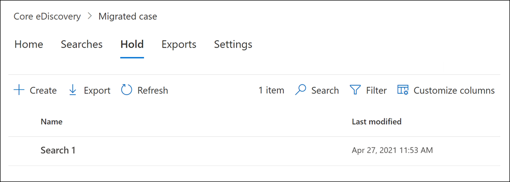
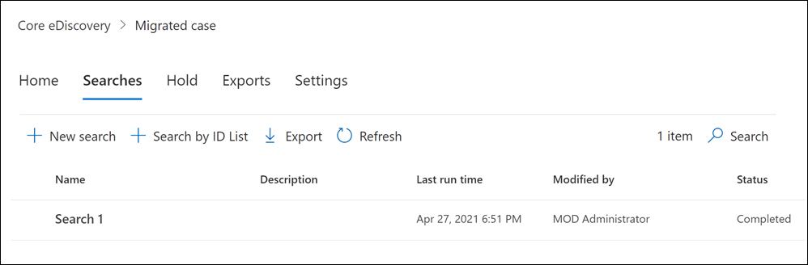

# <a name="migrate-legacy-ediscovery-searches-and-holds-to-the-microsoft-365-compliance-center"></a>레거시 eDiscovery 검색 및 보류를 Microsoft 365 규정 준수 센터

이 Microsoft 365 규정 준수 센터 사용하면 더 높은 안정성, 더 나은 성능 및 eDiscovery 워크플로에 맞게 조정된 다양한 기능을 비롯한 eDiscovery 사용 환경을 개선할 수 있습니다. 예를 들어 중요한 콘텐츠 구성 사례, 콘텐츠 및 분석을 검토하는 검토 집합을 검토하여 중복에 가까운 그룹화, 전자 메일 스레딩, 테마 분석 및 예측 코딩과 같은 검토를 위해 데이터를 선회하는 데 도움이 됩니다.

고객이 새 기능과 향상된 기능을 활용할 수 있도록 이 문서에서는 In-Place eDiscovery 검색 및 보류를 Exchange 관리 센터에서 새 기능으로 마이그레이션하는 방법에 대한 기본 Microsoft 365 규정 준수 센터.

> [!NOTE]
> 다양한 시나리오가 있기 때문에 이 문서에서는 검색 및 보류를 해당 시나리오의 핵심 eDiscovery 사례로 전환하기 위한 일반적인 Microsoft 365 규정 준수 센터. eDiscovery 사례를 항상 사용할 필요는 없지만 조직의 eDiscovery 사례에 액세스할 수 있는 권한을 할당할 수 있도록 하여 보안 계층을 추가합니다.

## <a name="before-you-begin"></a>시작하기 전에

- 이 문서에 설명된 PowerShell 명령을 실행하기 위해 Microsoft 365 규정 준수 센터 관리자 역할 그룹의 구성원이 되어야 합니다. 또한 Exchange 관리 센터에서 검색 관리 역할 그룹의 구성원이 되어야 합니다.

- 이 문서에서는 eDiscovery 보류를 만드는 방법에 대한 지침을 제공합니다. 보류 정책은 비동기 프로세스를 통해 사서함에 적용됩니다. eDiscovery 보류를 만들 때 CaseHoldPolicy 및 CaseHoldRule을 모두 만들어야 합니다. 그렇지 않으면 보류가 만들어지지 않고 콘텐츠 위치가 보류되지 않습니다.

## <a name="step-1-connect-to-exchange-online-powershell-and-security--compliance-center-powershell"></a>1단계: 커넥트 PowerShell Exchange Online 보안 센터 PowerShell을 & 수 있습니다.

첫 번째 단계는 PowerShell 및 보안 및 Exchange Online PowerShell에 & 것입니다. 다음 스크립트를 복사하여 PowerShell 창에 붙여 넣은 다음 실행할 수 있습니다. 연결할 조직의 자격 증명을 입력하라는 메시지가 표시될 것입니다. 

```powershell
$UserCredential = Get-Credential
$sccSession = New-PSSession -ConfigurationName Microsoft.Exchange -ConnectionUri https://ps.compliance.protection.outlook.com/powershell-liveid -Credential $UserCredential -Authentication Basic -AllowRedirection
Import-PSSession $sccSession -DisableNameChecking
$exoSession = New-PSSession -ConfigurationName Microsoft.Exchange -ConnectionUri https://ps.outlook.com/powershell-liveid/ -Credential $UserCredential -Authentication Basic -AllowRedirection
Import-PSSession $exoSession -AllowClobber -DisableNameChecking
```

이 PowerShell 세션의 다음 단계에서 명령을 실행해야 합니다.

## <a name="step-2-get-a-list-of-in-place-ediscovery-searches-by-using-get-mailboxsearch"></a>2단계: eDiscovery 검색을 사용하여 In-Place 목록 Get-MailboxSearch

인증한 후 **Get-MailboxSearch** cmdlet을 실행하여 In-Place eDiscovery 검색 목록을 얻을 수 있습니다. 다음 명령을 복사하여 PowerShell에 붙여 넣은 다음 실행합니다. 검색 목록은 해당 이름 및 보류 상태와 함께 In-Place 나열됩니다.

```powershell
Get-MailboxSearch
```

cmdlet 출력은 다음과 유사합니다.


## <a name="step-3-get-information-about-the-in-place-ediscovery-searches-and-in-place-holds-you-want-to-migrate"></a>3단계: 마이그레이션할 In-Place eDiscovery 검색 및 In-Place 보류에 대한 정보 얻음

다시 **Get-MailboxSearch** cmdlet을 사용하지만 이번에는 검색의 속성을 얻습니다. 이러한 속성은 나중에 사용할 수 있는 변수에 저장할 수 있습니다. 다음 예에서는 **Get-MailboxSearch** cmdlet의 결과를 변수에 저장한 다음 검색의 속성을 표시합니다.

```powershell
$search = Get-MailboxSearch -Identity "Search 1"
```

```powershell
$search | FL
```

이러한 두 명령의 출력은 다음과 유사합니다.


> [!NOTE]
> 이 예제에서 보류 In-Place 기간은 *무기한(ItemHoldPeriod: Unlimited)입니다.* 이는 eDiscovery 및 법적 조사 시나리오에서 일반적입니다. 보존 기간의 값이 무기한과 다른 경우 보존이 보존 시나리오에서 콘텐츠를 보존하는 데 사용되고 있기 때문에 그 이유가 될 수 있습니다. 보존 시나리오를 위해 Security & Compliance Center PowerShell에서 eDiscovery cmdlet을 사용하는 대신 [New-RetentionCompliancePolicy](/powershell/module/exchange/new-retentioncompliancepolicy) 및 [New-RetentionComplianceRule을](/powershell/module/exchange/new-retentioncompliancerule) 사용하여 콘텐츠를 보존하는 것이 좋습니다. 이러한 cmdlet을 사용하는 결과는 **New-CaseHoldPolicy** 및 **New-CaseHoldRule** 사용과 비슷하지만 보존 기간 및 보존 기간이 만료된 후 콘텐츠를 삭제하는 등의 보존 작업을 지정할 수 있습니다. 또한 보존 cmdlet을 사용하면 보존 보류를 eDiscovery 사례와 연결하지 필요가 없습니다.

## <a name="step-4-create-a-case-in-the-microsoft-365-compliance-center"></a>4단계: Microsoft 365 센터에서 사례 만들기

eDiscovery 보류를 만들 경우 보류를 연결하기 위한 eDiscovery 사례를 만들어야 합니다. 다음 예제에서는 선택한 이름을 사용하여 eDiscovery 사례를 만듭니다. 나중에 사용할 변수에 새 사례의 속성을 저장합니다. 사례를 만든 후 명령을 실행하여 `$case | FL` 이러한 속성을 볼 수 있습니다.

```powershell
$case = New-ComplianceCase -Name "[Case name of your choice]"
```


## <a name="step-5-create-the-ediscovery-hold"></a>5단계: eDiscovery 보류 만들기

사례를 만든 후 보류를 만들어 이전 단계에서 만든 사례와 연결합니다. 사례 보류 정책과 케이스 보류 규칙을 모두 만들어야 합니다. 케이스 보류 정책을 만든 후에 케이스 보류 규칙을 만들지 않은 경우 eDiscovery 보류가 만들어지지 않습니다. 또한 어떠한 콘텐츠도 보류되지 않습니다.

다음 명령을 실행하여 마이그레이션할 eDiscovery 보류를 다시 만들 수 있습니다. 이러한 예제에서는 마이그레이션할 In-Place Hold의 속성을 사용 합니다. 첫 번째 명령은 새 케이스 보류 정책을 만들고 속성을 변수에 저장합니다. 두 번째 명령은 해당 케이스 보류 규칙을 만듭니다.

```powershell
$policy = New-CaseHoldPolicy -Name $search.Name -Case $case.Identity -ExchangeLocation $search.SourceMailboxes
```

```powershell
New-CaseHoldRule -Name $search.Name -Policy $policy.Identity
```


## <a name="step-6-verify-the-ediscovery-hold"></a>6단계: eDiscovery 보류 확인

보류를 만들 때 문제가 없는지 확인하기 위해 보류 배포 상태가 성공적이지 검사하는 것이 좋습니다. 배포는 이전 단계에서 *ExchangeLocation* 매개 변수에 지정된 모든 콘텐츠 위치에 보류가 적용되었다는 의미입니다. 이를 위해 **Get-CaseHoldPolicy** cmdlet을 실행할 수 있습니다. 이전 단계에서 만든  $policy 변수에 저장된 속성은 변수에서 자동으로 업데이트되지 않습니다. 배포가 성공하는지 확인하려면 cmdlet을 다시 실행해야 합니다. 케이스 보류 정책을 성공적으로 배포하는 데 5분에서 24시간 정도 걸릴 수 있습니다.

다음 명령을 실행하여 eDiscovery 보류가 성공적으로 배포되어 있는지 확인할 수 있습니다.

```powershell
Get-CaseHoldPolicy -Identity $policy.Identity | Select name, DistributionStatus
```

*DistributionStatus* **속성의 Success** 값은 콘텐츠 위치에 보류가 설정되었다는 것입니다. 배포가 아직 완료되지 않은 경우 **보류** 중 값이 표시됩니다.


## <a name="step-7-create-the-search"></a>7단계: 검색 만들기

마지막 단계는 3단계에서 식별한 검색을 다시 만들어 사례와 연결하는 것입니다. 검색을 만든 후 **Start-ComplianceSearch** cmdlet을 사용하여 검색을 실행하거나 나중에 실행할 수 있습니다.

```powershell
New-ComplianceSearch -Name $search.Name -ExchangeLocation $search.SourceMailboxes -ContentMatchQuery $search.SearchQuery -Case $case.name
```


## <a name="step-8-verify-the-case-hold-and-search-in-the-microsoft-365-compliance-center"></a>8단계: 2단계에서 사례 확인, 보류 및 Microsoft 365 규정 준수 센터

모든 것이 올바르게 설정되어 있는지 확인하려면 의 Microsoft 365 규정 준수 센터 으로 이동하여 [https://compliance.microsoft.com](https://compliance.microsoft.com) **eDiscovery**> 클릭합니다.


3단계에서 만든 사례는 **Core eDiscovery 페이지에 나열됩니다.** 사례를 열고 4단계에서 만든 보류가 보류 탭에 **나열되어** 있습니다. 보류를 선택하여 보류가 적용되는 사서함 수 및 배포 상태를 포함하여 플라이아웃 페이지에서 세부 정보를 볼 수 있습니다.



7단계에서 만든 검색은 사례의 **검색** 탭에 나열됩니다.



In-Place eDiscovery 검색을 마이그레이션하지만 eDiscovery 사례와 연결하지 않는 경우 검색 목록의 콘텐츠 검색 페이지에 Microsoft 365 규정 준수 센터.

## <a name="more-information"></a>추가 정보

- In-Place 관리 In-Place eDiscovery & 보류에 대한 자세한 내용은 Exchange 참조하세요.
  
  - [원본 위치 eDiscovery](/exchange/security-and-compliance/in-place-ediscovery/in-place-ediscovery)

  - [원본 위치 유지 및 소송 보존](/exchange/security-and-compliance/in-place-and-litigation-holds)

- 문서에 사용된 PowerShell cmdlet에 대한 자세한 내용은 다음을 참조하세요.

  - [Get-MailboxSearch](/powershell/module/exchange/get-mailboxsearch)
  
  - [New-ComplianceCase](/powershell/module/exchange/new-compliancecase)

  - [New-CaseHoldPolicy](/powershell/module/exchange/new-caseholdpolicy)
  
  - [New-CaseHoldRule](/powershell/module/exchange/new-caseholdrule)

  - [Get-CaseHoldPolicy](/powershell/module/exchange/get-caseholdpolicy)
  
  - [New-ComplianceSearch](/powershell/module/exchange/new-compliancesearch)

  - [Start-ComplianceSearch](/powershell/module/exchange/start-compliancesearch)

- 자세한 내용은 Microsoft 365 규정 준수 센터 [개요를](microsoft-365-compliance-center.md)Microsoft 365 규정 준수 센터.