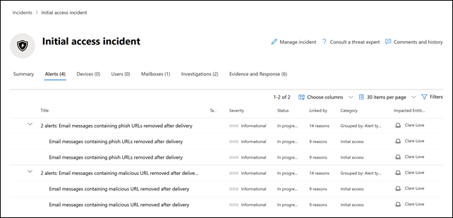

# Office 365용 Microsoft Defender의 새 경고 정책New alert policies in Microsoft Defender for Office 365

Office 365용 Microsoft Defender는 전달 후 탐지와 관련된 새롭고 향상된 경고 정책을 도입하고 있습니다.Microsoft Defender for Office 365 is introducing new and improved alert policies related to post-delivery detections. 여기에는 관련 AIR(자동 조사 및 응답) 플레이북의 향상된 기능이 포함됩니다.This includes enhancements to the Automated Investigation & Response (AIR) playbooks associated with them. 또한 6가지 기본 경고 정책에 대한 심각도 분류를 수정하여 이러한 정책에 의해 생성된 경고를 조직에 미치는 영향과 더 잘 정렬하고 있습니다.In addition, we're modifying the severity classification for six default alert policies to better align the alerts generated by these policies with their impact on your organization.

## 전달 후 감지Post-delivery detections

Office 365용 Microsoft Defender ZAP(제로 아워 자동 제거)가 받은 편지함의 메시지를 제거한 후 전달 후 감지와 관련된 네 가지 기본 경고 정책을 새로 도입할 예정입니다.We'll be introducing four new default alert policies related to post-delivery detections after the Microsoft Defender for Office 365 Zero-hour auto purge (ZAP) removes messages from an inbox. 이러한 네 가지 새로운 경고 정책은 ZAP 시나리오를 다루는 기존의 두 가지 기본 경고 정책을 대체하고 기본 탐지 및 관련 지표에 대한 세부 정보를 조직에 제공합니다.These four new alert policies will replace two existing default alert policies that cover ZAP scenarios and will provide organizations enhanced details about the underlying detection and related indicators. 이러한 알림(및 이러한 알림에서 트리거되는 AIR 플레이북)은 URL이 악의적인 파일을 가리키거나 파일에 악의적인 URL이 포함된 경우를 포함하여 전자 메일 및 엔터티의 위협을 정확하게 캡처합니다.These alerts (and the AIR playbooks that will be triggered from these alerts) will accurately capture the threats of the emails and entities, including if the URL points to a malicious file or if the file contains a malicious URL.

다음 표에는 새 경고 정책 및 제거될 기존 경고 정책이 나열되어 있습니다.The following table lists the new alert policies and the existing alert policies that will be removed. 배포에 대한 자세한 내용은 [조직에 미치는 영향](#how-this-will-affect-your-organization) 섹션을 참조하세요.See the [How this will affect your organization](#how-this-will-affect-your-organization) section for details about the rollout.

| 새 경고 정책 또는 기존 경고 정책New or existing alert policy | 경고 정책 이름Alert policy name | 경고 정책 IDAlert policy ID|
|:-----------------------------|:----------------|:--------------|
| 신규New| **악성 URL이 포함된 전자 메일 메시지가 전달 후 제거됨****Email messages containing malicious URL removed after delivery**   | 0179B3F7-3FDA-40C3-8F24-278563978DBB0179B3F7-3FDA-40C3-8F24-278563978DBB |
| 신규New| **악성 파일이 포함된 전자 메일 메시지가 전달 후 제거됨****Email messages containing malicious file removed after delivery**  | 8E6BA277-EF39-404E-AAF1-294F6D9A2B888E6BA277-EF39-404E-AAF1-294F6D9A2B88 |
| 신규New| **캠페인의 전자 메일 메시지가 전달되었다가 나중에 제거됨****Email messages from a campaign were delivered and later removed** | ef850570-5624-42b2-ff0a-08d8d899d578ef850570-5624-42b2-ff0a-08d8d899d578 |
| 신규New|**악성 전자 메일이 전송되었다가 나중에 제거됨****Malicious emails were delivered and later removed**                | a1f563cc-fb1f-466b-1fb5-08d8d71a3050a1f563cc-fb1f-466b-1fb5-08d8d71a3050 |
| 기존(삭제 예정)Existing (will be removed)| **피싱 URL이 포함된 전자 메일 메시지가 전달 후 제거됨****Email messages containing phish URLs removed after delivery**| EA8169FA-0678-4751-8854-AEBEA7ADECEBEA8169FA-0678-4751-8854-AEBEA7ADECEB |
| 기존(삭제 예정)Existing (will be removed)| **맬웨어가 포함된 전자 메일 메시지가 전달 후 제거됨****Email messages containing malware removed after delivery**| 0179B3F7-3FDA-40C3-8F24-278563978DBB0179B3F7-3FDA-40C3-8F24-278563978DBB |
||||

## 경고 심각도 향상Alert severity enhancements

다음 표에서는 심각도 분류를 수정하는 기본 경고 정책을 식별합니다.For the following table identifies the default alert policies whose severity classifications are being modified. 또한 보안 팀이 이러한 정책에서 생성한 알림의 우선 순위를 지정하도록 이러한 경고 정책의 심각도 분류를 변경합니다.We're changing the severity classification for these alert policies to better align with the potential risk and impact on your organization and to help your security teams prioritize the alerts generated by these policies.

| 경고Alert| 경고 정책 IDAlert policy ID| 이전 심각도Old severity| 새 심각도New severity  |
|:----------|:---------------|:------------|:--------------|
| **의심스러운 전자 메일 전달 활동****Suspicious email forwarding activity**| BFD48F06-0865-41A6-85FF-ADB746423EBFBFD48F06-0865-41A6-85FF-ADB746423EBF | 보통Medium| 높음High|
| **사용자가 맬웨어 또는 피싱 메일로 보고한 전자 메일****Email reported by user as malware or phish** | B26A5770-0C38-434A-9380-3A3C2C27BBB3B26A5770-0C38-434A-9380-3A3C2C27BBB3 | 정보Informational | 낮음Low|
| **피싱 메일로 보고된 전자 메일의 비정상적인 증가****Unusual increase in email reported as phish** | A00D8C62-9320-4EEA-A7E5-966B9AC09558A00D8C62-9320-4EEA-A7E5-966B9AC09558 | HighHigh| MediumMedium |
| **관리자 전송 결과 완료****Admin Submission result completed** | AE9B83DD-6039-4EA9-B675-6B0AC3BF4A41AE9B83DD-6039-4EA9-B675-6B0AC3BF4A41 | 낮음Low| 정보Informational |
| **전달/리디렉션 규칙 만들기****Creation of forwarding/redirect rule** | D59A8FD4-1272-41EE-9408-86F7BCF72479D59A8FD4-1272-41EE-9408-86F7BCF72479 | 낮음Low| 정보Informational |
| e **Discovery 시작 또는 내보내기**e **Discovery search started or exported**| 6FDC5710-3998-47F0-AFBB-57CEFD7378AE6FDC5710-3998-47F0-AFBB-57CEFD7378AE | 보통Medium| 정보Informational |
|||||

## 이러한 변경 사항은 언제 발생합니까?When will these changes happen

다음 표에서는 새 경고 정책이 전달 후 경고를 트리거하기 시작하는 시기를 나타냅니다.The following table identifies when the new alert policies will begin triggering post-delivery alerts. 또한 이 표에는 두 개의 기존 경고 정책이 제거될 시기도 나와 있습니다.The table also identifies when the two existing alert policies will be removed.

| 알림 정책Alert policy| 날짜Date |
|:------------|:-----|
| **악성 URL이 포함된 전자 메일 메시지가 전달 후 제거됨**(신규)**Email messages containing malicious URL removed after delivery** (new) | 경고는 2021년 4월 11일부터 트리거됩니다.Alerts will start triggering on April 11, 2021|
| **악성 파일이 포함된 전자 메일 메시지가 전달 후 제거됨**(신규)**Email messages containing malicious file removed after delivery** (new) | 경고는 2021년 4월 11일부터 트리거됩니다.Alerts will start triggering on April 11, 2021 |
| **캠페인의 전자 메일 메시지가 전달되었다가 나중에 제거됨**(신규)**Emails messages from a campaign were delivered and later removed** (new) | 경고는 2021년 4월 30일부터 트리거됩니다.Alerts will start triggering on April 30, 2021|
| **악성 전자 메일이 전송되었다가 나중에 제거됨**(신규)**Malicious emails were delivered and later removed** (new) | 경고는 2021년 4월 30일부터 트리거됩니다.Alerts will start triggering on April 30, 2021|
| **피싱 URL이 포함된 전자 메일 메시지가 전달 후 제거됨**(기존. 제거 예정)**Email messages containing phish URLs removed after delivery** (existing, will be removed)| 경고 정책은 2021년 4월 30일에 제거될 예정입니다.The alert policy will be removed on April 30, 2021. [이러한 변경 사항에 대해 대비하는 데 필요한 작업](#what-you-need-to-do-to-prepare-for-these-changes) 섹션을 참조하세요.See the [What you need to do to prepare for these changes](#what-you-need-to-do-to-prepare-for-these-changes) section.|
| **맬웨어가 포함된 전자 메일 메시지가 전달 후 제거됨**(기존. 제거 예정)**Email messages containing malware removed after delivery** (existing, will be removed) | 경고 정책은 2021년 4월 30일에 제거될 예정입니다.The alert policy will be removed on April 30, 2021. [이러한 변경 사항에 대해 대비하는 데 필요한 작업](#what-you-need-to-do-to-prepare-for-these-changes) 섹션을 참조하세요.See the [What you need to do to prepare for these changes](#what-you-need-to-do-to-prepare-for-these-changes) section. |
|||

경고 심각도 변경은 2021년 4월 30일까지 모든 조직에 배포될 예정입니다.The alert severity changes will be rolled out to all organizations by April 30, 2021.

## 이 변화가 조직에 미치는 영향How this will affect your organization

새 경고가 울리기 시작하고 위에 나열된 날짜에 조직의 AIR 조사가 트리거됩니다.The new alerts will begin firing, and triggering the AIR investigations in your organization on the dates listed above. 제거할 두 가지 경고를 운영하는 보안 조직에 미치는 영향을 줄이기 위해 기존 경고 정책에 의해 트리거된 경고 *및* 2021년 4월 5일부터 2021년 4월 30일 사이에 새 경고 정책에 의해 트리거된 경고가 표시됩니다.To reduce the impact on security organizations that have operationalized the two alerts that are to be removed, you will see alerts triggered by the existing alert policies *and* the alerts triggered by the new alert policies between April 5, 2021 and April 30, 2021. 이는 보안 팀이 필요한 변경 사항을 처리할 수 있는 시간을 제공하기 위한 것입니다.This is to provide security teams with time to handle the required changes. 이 짧은 기간 동안 경고 볼륨이 증가한 보안 팀을 지원하기 위해 기존 경고와 새 경고가 모두 동일한 AIR 조사와 연관되고 동일한 인시던트로 연관됩니다.To help security teams with the increased alert volume during this short duration, both the existing alerts and the new alerts will be correlated into the same AIR investigation and correlated into a same Incident. 보다 구체적으로, 여기에는 알림, AIR 조사 및 인시던트에 대한 다음과 같은 동작이 포함됩니다.More specifically, this includes the following behavior for alerts, AIR investigations, and Incidents:

- **알림**: 기존 알림과 새 알림 간에 다음과 같은 알림 쌍이 표시됩니다.**Alerts**: By design, you will see the following alert pairs across the existing and new alerts:

  - **피시 URL이 포함된 전자 메일 메시지** 및 **악성 URL이 포함된 전자 메일 메시지가 전달 후 제거됨****Email messages containing phish URLs removed after delivery** AND **Email messages containing malicious URL removed after delivery**

  - **맬웨어가 포함된 전자 메일 메시지** 및 **악성 파일이 포함된 전자 메일 메시지가 전달 후 제거됨****Email messages containing malware removed after delivery** AND **Email messages containing malicious file removed after delivery**

  

   이러한 경고 쌍 관리에 대한 자세한 내용은 [이러한 변경 사항에 대비하는 데 필요한 작업](#what-you-need-to-do-to-prepare-for-these-changes) 섹션을 참조하세요.For more information about managing these alert pairs, see the [What you need to do to prepare for these changes](#what-you-need-to-do-to-prepare-for-these-changes) section.

- **AIR 조사**: 경고는 단일 AIR 조사와 상관 관계가 있으며, 경고 중 하나는 "트리거"로 분류되고 다른 하나는 "반복"으로 분류됩니다.**AIR Investigations**: Alerts will be correlated into a single AIR Investigation, with one of the alerts classified as "triggering" and the other as "repeated".

  

- **인시던트**: 두 경고가 모두 동일한 인시던트와 연관이 있음**Incidents**: Both alerts will correlate into the same Incident

  

## 이러한 변경 사항에 대해 대비하는 데 필요한 작업What you need to do to prepare for these changes

조직에서 이러한 경고를 활용하는 방법에 따라 준비해야 할 작업이 결정됩니다.How your organization utilizes these alerts will determine what you need to do to prepare. 경고를 작동하여 API, 경고 전자 메일 알림을 통해 사용하거나 Office 365 보안 및 준수 센터(`https://protection.office.com/viewalerts`) 또는 Microsoft 보안 센터(`https://security.microsoft.com/viewalerts`)에서 경고를 사용하고 있는 경우 워크플로를 수정해야 합니다.If you have operationalized the alerts and are using or consuming them either through an API, an alert email notification, or in the Office 365 Security & Compliance Center (`https://protection.office.com/viewalerts`) or the Microsoft security center (`https://security.microsoft.com/viewalerts`), you'll need to modify your workflows.

**이러한 경고를 운영하지 않은 경우 다음 중 하나를 수행할 수 있습니다.****If you haven't operationalized these alerts, you can do one of the following:**

- 제거 중인 다음 경고 정책을 사용하지 않도록 설정하여 조직의 경고 볼륨을 줄입니다.Disable the following alert policies (that are being removed) to reduce alert volume in your organization:

  - **피싱 URL이 포함된 전자 메일 메시지가 전달 후 제거됨****Email messages containing phish URLs removed after delivery**

  - **맬웨어가 포함된 전자 메일 메시지가 전달 후 제거됨****Email messages containing malware removed after delivery**

- 아무것도 하지 마세요.Do nothing. 당사는 2021년 4월 30일에 기존 경고 정책을 비활성화할 예정입니다.We'll disable the existing alert policies on April 30, 2021.

**이러한 경고를 작동한 경우:****If you have operationalized these alerts:**

- 2021년 4월 30일에 기존 경고 정책이 제거될 것으로 예상하고 워크플로의 일부로 새 경고를 사용하기 시작하세요.Start consuming the new alerts as a part of your workflows, in anticipation of the existing alert policy removal on April 30, 2021. 티켓팅 시스템에 사용자 지정 로직, 경고 전자 메일 알림을 받는 보안 편지함 또는 경고 이름 또는 경고 정책 ID(CorrelationId)에 따라 달라지는 SIEM 솔루션이 있는 경우 변경 사항을 수용하도록 논리를 수정해야 합니다.If you have custom logic in your ticketing system, a security mailbox where you receive alert email notifications, or a SIEM solution that depends on the alert name or alert policy Id (CorrelationId), you will need to modify the logic to accommodate the change.

  > [!NOTE]
  > 경고, 조사 및 인시던트의 정보는 변경되지 않았습니다.The information in the alerts, investigations, and incidents has not changed. 실제로 이 정보는 관련 위협에 대한 추가 세부 정보와 함께 향상되었습니다.In fact, this information has been enhanced with additional detail about the threats associated with them.

- 수정한 후에는 기존 경고 정책을 실행 중지하여 조직의 경고 볼륨을 줄일 수 있습니다.After you've made the modifications, you can disable the existing alert policies to reduce alert volume in your organization:

  - **피싱 URL이 포함된 전자 메일 메시지가 전달 후 제거됨****Email messages containing phish URLs removed after delivery**

  - **맬웨어가 포함된 전자 메일 메시지가 전달 후 제거됨****Email messages containing malware removed after delivery**

  또는 이러한 경고 정책을 2021년 4월 30일에 삭제하기 전까지 활성화 상태로 둘 수 있습니다.Alternatively, you can leave these alert policies enabled until we delete them on April 30, 2021.
