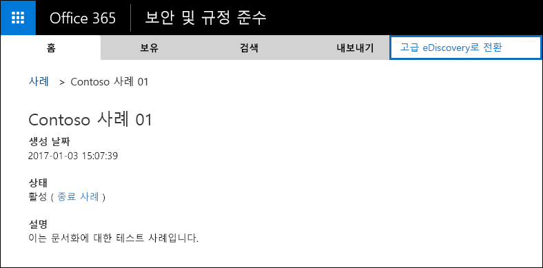
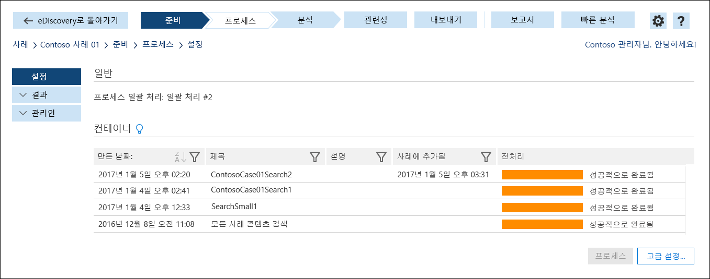

# Office 365 Advanced eDiscovery에 대한 데이터 준비

이 항목에서는 Advanced eDiscovery에서 콘텐츠 검색 결과를 사례에 로드하는 방법에 대해 설명합니다. 
  
> [!NOTE]
> Advanced eDiscovery를 사용하려면 Office 365 E3의 고급 준수 추가 기능이나 조직을 위한 E5 구독이 필요합니다. 이 요금제가 없는 상태에서 Advanced eDiscovery를 사용하려는 경우에는 [Office 365 Enterprise E5 평가판을 등록](https://go.microsoft.com/fwlink/p/?LinkID=698279)할 수 있습니다. 
  
## 1단계: Advanced eDiscovery에 사용하도록 Office 365 데이터 준비

Advanced eDiscovery를 사용하여 데이터를 분석하려면 Microsoft 365 보안 &amp; 규정 준수 센터(Microsoft 365 보안 &amp; 규정 준수 센터의 **콘텐츠 검색** 페이지에 나열됨)에서 실행하는 콘텐츠 검색 또는 eDiscovery 케이스(보안 &amp; 규정 준수 센터의 **eDiscovery** 페이지에 나열됨)와 관련된 검색의 결과를 사용할 수 있습니다. 
  
Advanced eDiscovery에서 분석할 수 있도록 검색 결과를 준비하는 방법에 대한 자세한 내용은 [Office 365 Advanced eDiscovery에 사용하도록 검색 결과 준비](prepare-search-results-for-advanced-ediscovery.md)를 참조하세요.
  
> [!NOTE]
> Office 365 외부에 데이터가 있고 Advanced eDiscovery에서 이 데이터를 준비하고 분석할 수 있도록 Office 365로 가져오려면 [Office 365로 PST 파일을 가져오는 방법에 대한 개요](https://support.office.com/article/ba688e0a-0fcb-4bd7-8e57-2b669564ea84) 및 [Office 365에 타사 데이터 보관](https://go.microsoft.com/fwlink/p/?linkid=716918)을 참조하세요. 
  
## 2단계: Advanced eDiscovery에서 사례에 검색 결과 데이터 로드

분석을 위해 보안 &amp; 규정 준수 센터의 검색 결과를 준비한 후, 다음 단계는 Advanced eDiscovery에서 케이스에 검색 결과를 로드하는 것입니다. 자세한 내용은 [프로세스 모듈 실행](run-the-process-module-in-advanced-ediscovery.md)을 참조하세요.
  
1. [https://protection.office.com](https://protection.office.com)으로 이동합니다.
    
2. 회사 또는 학교 계정을 사용하여 Office 365에 로그인합니다.
    
3. 보안 및 준수 센터에서 **검색 &amp; 조사** \> **eDiscovery**를 클릭하여 조직의 사례 목록을 표시합니다. 
    
4. Advanced eDiscovery에서 데이터를 로드할 사례 옆에 있는 **열기**를 클릭합니다. 
    
5. 사례에 대한 **홈** 페이지에서 **Advanced eDiscovery**를 클릭합니다. 
    
    
  
    **Advanced eDiscovery에 연결하는 중** 진행률 표시줄이 표시됩니다. Advanced eDiscovery에 연결되면 컨테이너 목록이 해당 케이스의 설정 페이지에 표시됩니다. 
    
    
  
     이러한 컨테이너는 1단계 동안 Advanced eDiscovery에서 분석을 위해 준비한 검색 결과를 나타냅니다. 컨테이너의 이름에는 보안 &amp; 규정 준수 센터의 사례에 있는 콘텐츠 검색과 동일한 이름이 사용됩니다. 목록에서 컨테이너는 사용자가 준비한 컨테이너입니다. 다른 사용자가 Advanced eDiscovery에 사용하도록 검색 결과를 준비한 경우, 해당 컨테이너가 목록에 포함되지 않습니다. 
    
6. Advanced eDiscovery에서 컨테이너에 있는 검색 결과 데이터를 사례에 로드하려면 컨테이너를 선택한 다음 **처리**를 클릭합니다.
    
Advanced eDiscovery에서 보안 &amp; 규정 준수 센터의 검색 결과를 사례에 추가한 후, 다음 단계는 Advanced eDiscovery의 도구를 사용하여 사례와 관련된 데이터를 분석하고 선별하는 것입니다. 
  
## 참고 항목

[Office 365 Advanced eDiscovery](office-365-advanced-ediscovery.md)
  
[사용자 및 사례 설정](set-up-users-and-cases-in-advanced-ediscovery.md)
  
[사례 데이터 분석](analyze-case-data-with-advanced-ediscovery.md)
  
[관련성 설정 관리](manage-relevance-setup-in-advanced-ediscovery.md)
  
[관련성 모듈 사용](use-relevance-in-advanced-ediscovery.md)
  
[사례 데이터 내보내기](export-case-data-in-advanced-ediscovery.md)

