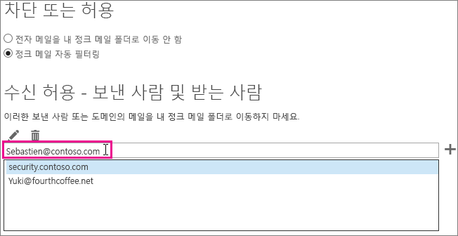

# <a name="how-to-prevent-real-email-from-being-marked-as-spam-in-office-365"></a>Office 365에서 실제 전자 메일이 스팸으로 표시되는 일을 방지하는 방법

 **실제 전자 메일이 Office 365에서 스팸으로 표시되나요? 그렇다면 다음을 수행하세요.**

가양성이 있는 경우, [보고서 메시지 추가 기능 사용](https://support.office.com/article/b5caa9f1-cdf3-4443-af8c-ff724ea719d2)을 사용하여 Microsoft에 메시지를 보고해야 합니다. 또한, [제출 탐색기](/security/office-365-security/admin-submission.md)를 사용하여 메시지를 전송할 수도 있습니다.

## <a name="determine-the-reason-why-the-message-was-marked-as-spam"></a>메시지가 스팸으로 표시되는 이유 확인

Office 365의 스팸 문제는 [전자 메일 메시지 머리글 보기](https://support.office.com/article/cd039382-dc6e-4264-ac74-c048563d212c)를 통해 해결할 수 있으며 잘못된 내용을 파악할 수 있습니다. X-Forefront-Antispam-Report라는 헤더를 찾아야합니다. [스팸 방지 메시지 헤더에 대해 자세히 알아](https://technet.microsoft.com/library/dn205071%28v=exchg.150%29.aspx)볼 수 있습니다.

헤더에서 다음 머리글 및 값을 찾습니다.

### <a name="x-forefront-antispam-report"></a>X-Forefront-Antispam-Report

- **SFV:SPM** EOP 스팸 필터로 인해 메시지가 스팸으로 표시되었음을 나타냅니다.

- **SFV:BLK** 보내는 주소가 받는 사람의 차단된 보낸 사람 목록에 있기 때문에 메시지가 스팸으로 표시되었음을 나타냅니다.

- **SFV:SKS** 콘텐츠 필터 전에 메시지가 스팸으로 표시되었음을 나타냅니다. 이는 메시지를 스팸으로 표시하는 메일 흐름 규칙을 (전송 규칙으로도 알려짐) 포함할 수 있습니다. 메시지 추적을 실행하여 높은 SCL(스팸 신뢰 수준)을 설정했을 수 있는 메일 흐름 규칙이 트리거되었는지 확인합니다.

- **SFV:SKB** 스팸 필터 정책의 차단 목록과 일치하므로 메시지가 스팸으로 표시되었음을 나타냅니다.

- **Sfv: BULK**: x-microsoft-스팸 방지 헤더에 있는 BCL (대량 불만 수준) 값이 콘텐츠 필터에 설정된 대량 임계값 보다 위에 있음을 나타냅니다. 대량 전자 메일은 사용자가 등록했을 수도 있지만, 여전히 원하지 않을 수 있는 전자 메일입니다. 메시지 헤더의 X-Microsoft-Antispam 헤더에서 BCL(대량 신뢰 수준) 속성을 찾습니다. BCL 값이 스팸 필터에 설정된 임계값보다 작은 경우 이러한 유형의 대량 메시지를 스팸으로 표시하는 대신 임계값을 조정할 수 있습니다. 사용자마다 [대량 전자 메일 처리 방식](https://docs.microsoft.com/microsoft-365/security/office-365-security/bulk-complaint-level-values)에 대한 허용치와 선호 사항이 다릅니다. 각기 다른 사용자 선호 사항에 맞게 다양한 정책이나 규칙을 만들 수 있습니다.

- **CAT:SPOOF** 또는 **CAT:PHISH**: 메시지가 스푸핑된 것 같음을 나타냅니다. 즉, 메시지 원본의 유효성을 검증할 수 없고 메시지 원본이 의심스러울 수 있습니다. 유효한 경우 보낸 사람은 적절한 SPF 및 DKIM 구성을 가지고 있는지 확인해야 합니다. 자세한 내용은 인증-결과 헤더를 확인 하세요. 모든 보낸 사람이 적절한 전자 메일 인증 방법을 사용하도록 하기는 어려울 수 있지만, 이러한 검사를 건너뛰는 것은 매우 위험할 수 있으며 손상의 주요 원인입니다.

### <a name="x-customspam"></a>x-customspam

- 이 헤더가 있으면 스팸 필터에서 [고급 스팸 옵션 중 하나가 사용되도록 설정](https://technet.microsoft.com/library/jj200750%28v=exchg.150%29.aspx)되어 있기 때문에 메시지가 스팸으로 표시되었음을 나타냅니다. 이러한 기능이 필요하지 않으면 기본 설정을 사용하는 것이 좋습니다.

## <a name="solutions-to-additional-causes-of-too-much-spam"></a>너무 많은 스팸을 유발하는 추가 원인에 대한 해결 방법

효과적인 작동을 위해 EOP(Exchange Online Protection)는 관리자가 몇 가지 작업을 완료하도록 요구합니다. Office 365 테넌트의 관리자가 아니며 스팸이 너무 많이 발생하는 경우 관리자와 함께 이러한 문제를 해결할 수 있습니다. 그렇지 않은 경우 사용자 작업으로 건너뛸 수 있습니다.

### <a name="for-admins"></a>관리자

- **DNS 레코드가 Office 365를 가리키도록 하세요**: EOP가 보호를 제공하려면 모든 도메인의 MX(메일 교환기) DNS 레코드가 Office 365를 가리켜야 하며, Office 365만 가리켜야 합니다. MX가 Office 365를 가리키지 않으면 EOP는 사용자에게 스팸 필터링을 제공하지 않습니다. 다른 서비스나 어플라이언스를 사용하여 도메인에 대한 스팸 필터링을 제공하려는 상황에서는 EOP에서 스팸 보호를 사용하지 않도록 설정하는 것을 고려해야 합니다. SCL 값을-1로 설정하는 메일 흐름 규칙을 만들어 이 작업을 수행할 수 있습니다. 차후 EOP를 사용하기로 할 경우 이 메일 흐름 규칙을 제거해야 합니다.

- **사용자용 보고서 메시지 추가 기능 설정**: [사용자용 보고서 메시지 추가 기능을 사용하도록 설정](/security/office-365-security/enable-the-report-message-add-in.md)할 것을 강력히 권장합니다.

- **[제출 탐색기](/security/office-365-security/admin-submission.md)사용**: 관리자는 파일이나 네트워크 메시지 ID, URL, Office 365에서 Microsoft가 스캔할 파일을 사용하여 전자 메일을 보낼 수 있습니다.  관리자는 사용자가 보내는 피드백을 보고, 패턴을 사용하여 문제를 발생시킬 수 있는 설정을 조정할 수도 있습니다.

- [여기](https://docs.microsoft.com/ko-KR/office365/servicedescriptions/exchange-online-service-description/exchange-online-limits)에 표시된 대로 **사용자가 전자 메일을 송수신하기 위한 허용 한계 내에 있는지 확인하십시오**.

- [여기](/security/office-365-security/bulk-complaint-level-values.md)에 명시된 대로 **대량 레벨을 다시 확인하십시오**

### <a name="for-users"></a>사용자

- **안전한 발신자 목록 만들기** 사용자는 신뢰할 수 있는 발신인의 주소를 [Outlook](https://go.microsoft.com/fwlink/p/?LinkId=270065) 또는 [웹상의 Outlook](https://go.microsoft.com/fwlink/p/?LinkId=294862)(이전에는 Outlook Web App으로 알려짐)에 안전한 발신자 목록에 추가할 수 있습니다. 웹에서 Outlook을 시작하려면 **설정**  \>**옵션** \> **차단 혹은 허용**을 선택합니다. 다음의 다이어그램은 안전한 발신자 목록에 무언가를 추가하는 예를 보여줍니다.



EOP는 사용자의 수신 허용 - 보낸 사람 및 받는 사람을 존중하지만 Safe Domains는 사용하지 않습니다. 이는 도메인이 웹에서 Outlook을 통해 추가되거나 Outlook에서 추가되고 Directory Sync를 사용하여 동기화되는지 여부에 관계없이 적용됩니다.

- **Outlook에서 SmartScreen 사용 안 함** 이전 Outlook 데스크톱 클라이언트를 사용하는 경우 지원이 중단된 SmartScreen 필터링 기능을 사용하지 않도록 설정해야 합니다. 이 기능을 사용하도록 설정하면 가양성이 발생할 수 있습니다. 업데이트된 데스크톱 Outlook 클라이언트를 실행하는 경우에는 이 작업이 필요하지 않습니다.

## <a name="troubleshooting-a-message-ends-up-in-the-junk-folder-even-though-eop-marked-the-message-as-non-spam"></a>문제 해결 : EOP가 메시지를 스팸이 아닌 것으로 표시했더라도 메시지는 정크 폴더에 놓입니다.

사용자가 Outlook에서 "수신 허용 목록만 허용 : 수신 허용 - 보낸 사람 목록 또는 수신 허용 - 받는 사람 목록의 사람 또는 도메인에게서 온 메일만 받은 편지함으로 배달됩니다" 옵션을 사용하는 경우 모든 전자 메일은 보낸 사람의 정크 메일 폴더로 이동합니다. 보낸 사람이 받는 사람의 수신 허용 목록에 있지 않은 경우 이것은 EOP가 메시지를 스팸이 아닌 것으로 표시했는지 여부와 관계없이 또는 EOP에서 메시지를 스팸이 아닌 것으로 표시하도록 설정한 경우에도 발생합니다.

[ Outlook : 정크 메일 UI를 비활성화하는 정책 설정 및 필터링 메커니즘](https://support.microsoft.com/ko-KR/kb/2180568)의 지침에 따라 Outlook 사용자의 수신 허용 목록 전용 옵션을 비활성화할 수 있습니다.

웹용 Outlook에서 메시지를 보면 보낸 사람이 수신자의 보낸 사람 목록에 없기 때문에 메시지가 정크 폴더에 있음을 나타내는 노란색 안전 팁이 표시됩니다.

메시지의 헤더를 보면 스탬프 SFV: SKN(IP 허용 또는 ETR 허용) 또는 SFV: NSPM(스팸 아님) 스탬프가 포함될 수 있지만 메시지는 여전히 사용자의 정크 폴더에 있습니다. 사용자가 "수신 허용 목록"만 사용하도록 설정한 메시지 헤더에는 아무 것도 없습니다. 이는 Outlook의 사용자가 설정한 "안전 목록 전용" 옵션이 EOP 설정을 무시하기 때문에 발생합니다.

### <a name="to-verify-why-a-message-from-a-safe-sender-is-marked-as-non-spam-in-the-message-header-but-still-ends-up-in-the-users-junk-folder"></a>수신 허용 목록의 메시지가 메시지 헤더에 스팸이 아닌 것으로 표시되지만 여전히 사용자의 정크 폴더로 분류되는 이유를 확인하려면 

1. Exchange Online PowerShell로 연결하는 방법을 알아보려면 [Exchange Online PowerShell에 연결](https://go.microsoft.com/fwlink/p/?LinkId=396554)을 참조하세요.

2. 다음 명령을 실행하여 사용자의 정크 메일 구성 설정을 봅니다.

  ```Powershell
  Get-MailboxJunkEmailConfiguration example@contoso.com | Format-List TrustedListsOnly,ContactsTrusted,TrustedSendersAndDomains
  ```

- TrustedListsOnly가 True이면 이 설정이 사용 가능하다는 의미입니다.

- ContactsTrusted가 True이면 사용자가 연락처와 안전한 보낸 사람 모두를 신뢰함을 의미합니다.

- TrustedSendersAndDomains는 사용자의 안전한 보낸 사람 목록의 내용을 나열합니다.

## <a name="eop-only-customers-use-directory-synchronization"></a> EOP 전용 고객: 디렉터리 동기화를 사용

EOP 전용 고객의 경우, 즉 온 - 프레미스(Exchange) 전자 메일 서버와 함께 사용하기 위해 EOP 서비스에 가입한 경우 디렉터리 동기화를 사용하여 사용자 설정을 서비스와 동기화해야 합니다. 이렇게 하면 수신 허용 - 보낸 사람 목록이 EOP에 의해 존중되도록 할 수 있습니다. 자세한 내용은 [EOP의 메일 사용자 관리](https://go.microsoft.com/fwlink/?LinkId=534098)에서 "디렉터리 동기화를 사용하여 메일 사용자 관리"를 참조하십시오.
