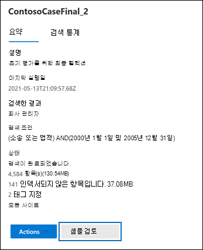

# eDiscovery 검색 결과 미리 보기

Core eDiscovery 케이스와 관련된 콘텐츠 검색 또는 검색을 실행한 다음 검색이 반환한 결과 샘플을 미리 볼 수 있습니다. 검색 쿼리 반환 항목 미리 보기는 검색이 반환하는 결과가 원하는 결과와 일치하는지, 아니면 검색 쿼리를 바꿔서 검색을 다시 실행해야 할지를 결정할 수 있게 도와줍니다.

검색 반환 결과 샘플 미리 보기 방법:

1. Microsoft 365 규정 준수 센터에서 콘텐츠 검색 페이지 또는 Core eDiscovery 케이스로 이동합니다.

2. 검색을 선택해서 플라이아웃 페이지를 표시합니다.

3. 플라이아웃 페이지 아래에서 **샘플 검토** 를 클릭합니다.

   

   검색 결과의 샘플이 포함된 페이지가 표시됩니다.

4. 항목을 선택해서 읽기 창을 열고 콘텐츠를 검토합니다.

   

   이전 스크린샷에서는 항목을 미리 볼 때 검색 쿼리의 키워드가 강조 표시됩니다.

## 검색 결과의 샘플 선택 방법

최대 1,000개의 무작위로 선택된 항목을 미리 볼 수 있습니다. 무작위로 선택되는 것 외에도 미리 보기가 가능한 항목은 다음 기준을 충족해야 합니다.

- 단일 콘텐츠 위치(사서함 또는 사이트)에서 최대 100개의 항목을 미리 볼 수 있습니다. 즉, 미리 보기에 사용할 수 있는 항목이 1,000개 미만일 수 있습니다. 예를 들어 4개의 사서함을 검색하고 검색 결과 1,500개의 예상 항목이 반환되는 경우 각 사서함의 항목 100개만 미리 볼 수 있으므로 400개만 미리 보기에 사용할 수 있습니다.

- 사서함 항목의 경우 전자 메일 메시지만 미리 볼 수 있습니다. 작업, 일정 항목 및 연락처와 같은 항목은 미리 볼 수 없습니다.

- 사이트 항목의 경우에는 문서만 미리 볼 수 있습니다. 폴더, 목록 또는 목록 첨부 파일과 같은 항목은 미리 볼 수 없습니다.

## 검색 결과 미리 보기에서 지원되는 파일 형식

미리 보기 창에서는 지원되는 파일 형식을 미리 볼 수 있습니다. 파일 형식이 지원되지 않는 경우 **원래 항목 다운로드** 를 클릭해서 로컬 컴퓨터에 파일 복사본을 다운로드해야 합니다. .aspx 웹 페이지의 경우 페이지에 액세스할 수 있는 권한이 없어도 페이지 URL이 포함될 수 있습니다. 인덱싱되지 않은 항목은 미리 볼 수 없습니다.

다음 파일 형식은 검색 결과 창에서 지원되며 미리 볼 수 있습니다.
  
- .txt, .html, .mhtml

- .eml

- .doc, .docx, .docm

- .pptm, .pptx

- .pdf

또한 다음 파일 컨테이너 형식이 지원됩니다. 미리 보기 창에서 컨테이너의 파일 목록을 볼 수 있습니다.
  
- .zip

- .gzip