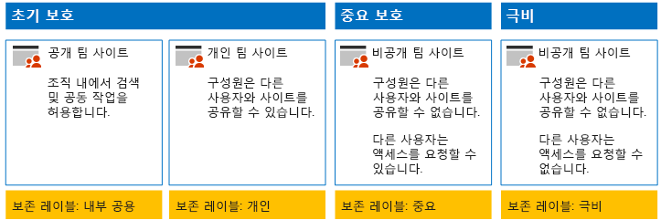
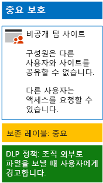
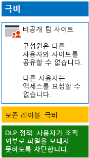

# 보존 레이블 및 DLP를 사용하여 SharePoint Online 파일 보호Protect SharePoint Online files with retention labels and DLP

이 문서의 단계를 사용하여 초기, 중요 및 극비 SharePoint Online 팀 사이트에 대한 레이블 및 DLP 정책을 디자인하고 배포합니다.Use the steps in this article to design and deploy retention labels and DLP policies for baseline, sensitive, and highly confidential SharePoint Online team sites. 이러한 3계층 보호에 대한 자세한 내용은 [SharePoint Online 사이트 및 파일 보호](../security/office-365-security/secure-sharepoint-online-sites-and-files.md)를 참조하세요.For more information about these three tiers of protection, see [Secure SharePoint Online sites and files](../security/office-365-security/secure-sharepoint-online-sites-and-files.md).
  
## 작동 방식How this works

1. 원하는 보존 레이블을 만들고 게시합니다.Create the desired retention labels and publish these. 게시하는데 최대 12시간이 걸릴 수 있습니다.It can take up to 12 hours for these to be published.
2. 원하는 SharePoint 사이트에서 문서 라이브러리 설정을 편집하여 원하는 보존 레이블을 라이브러리의 항목에 적용할 수 있습니다.For the desired SharePoint sites, edit the document library settings to apply the desired retention labels to items in the library.
3. 보존 레이블을 기반으로 작업을 수행하는 DLP 정책을 만듭니다.Create DLP policies to take action based on the retention labels.

사용자가 라이브러리에 문서를 추가하면 기본적으로 문서에 할당된 보존 레이블이 제공됩니다.When users add a document to the library, the document will receive the assigned retention label by default. 사용자는 필요한 경우 레이블을 변경할 수 있습니다.Users can change the label, if needed. 사용자가 조직 외부에 문서를 공유하면 DLP는 레이블이 할당되었는지 확인하고 DLP 정책이 레이블과 일치하면 작업을 수행합니다.When a user shares a document outside the organization, DLP will check to see if a label is assigned and take action if a DLP policy matches the label. DLP는 이러한 유형의 정책이 구성되어 있는 경우 신용 카드 번호로 파일을 보호하는 것과 같은 다른 정책 일치도 찾습니다.DLP will look for other policy matches as well, such as protecting files with credit card numbers if this type of policy is configured. 

## SharePoint Online 사이트에 대한 보존 레이블Retention labels for your SharePoint Online sites

SharePoint Online 팀 사이트에 보존 레이블을 만들고 할당하는 경우 다음 세 가지 단계를 수행해야 합니다.There are three phases to creating and then assigning retention labels to SharePoint Online team sites.
  
### 1단계: 보존 레이블 이름 결정Phase 1: Determine the retention label names

이 단계에서는 SharePoint Online 팀 사이트에 적용되는 네 가지 정보 보호 수준에 대한 보존 레이블의 이름을 결정합니다.In this phase, you determine the names of your retention labels for the four levels of information protection applied to SharePoint Online team sites. 다음 표에는 각 수준에 권장되는 이름이 나와 있습니다.The following table lists the recommended names for each level.
  
|**SharePoint Online 팀 사이트 보호 수준****SharePoint Online team site protection level**|**레이블 이름****Label name**|
|:-----|:-----|
|초기 공용Baseline-Public    |내부 공용Internal public    |
|초기 개인Baseline-Private    |개인Private    |
|중요Sensitive    |중요Sensitive    |
|극비Highly Confidential    |극비Highly Confidential    |
   
### 2 단계: 보존 레이블 만들기Phase 2: Create the retention labels

이 단계에서는 서로 다른 수준의 정보 보호를 위해 결정한 레이블을 만들어 게시합니다.In this phase, you create and then publish your determined labels for the different levels of information protection.
  
1. 보안 관리자 또는 회사 관리자 역할이 있는 계정으로 [Microsoft 365 규정 준수 포털](https://compliance.microsoft.com)에 로그인합니다.Sign in to the [Microsoft 365 compliance portal](https://compliance.microsoft.com) with an account that has the Security Administrator or Company Administrator role.
    
2. 브라우저의 **홈 - Microsoft 365 규정 준수** 탭에서 **분류 > 레이블**을 차례로 클릭합니다.From the **Home - Microsoft 365 compliance** tab of your browser, click **Classifications > Labels**.
    
3. **보존 레이블 > 레이블 만들기**를 클릭합니다.Click **Retention labels > Create a label**.
    
4. **레이블 명칭 만들기** 창에서 레이블 이름과 관리자 및 사용자에 대한 설명을 입력하고 **다음**을 클릭합니다.On the **Name your label** pane, type the name of the label and a description for admins and users, and then click **Next**.

5. **파일 계획 설명자** 창에서 필요에 따라 작성한 다음, **다음**을 클릭합니다.On the **File plan descriptors** pane, fill in as needed, and then click **Next**.
    
6. 필요에 따라 **레이블 설정** 창에서 **보존**을 **켜기**로 설정하고 보존 설정을 구성합니다.On the **Label settings** pane, if needed, set **Retention** to **On** and configure retention settings. **다음**을 클릭합니다.Click **Next**.
    
7. **설정 검토** 창에서 **레이블 만들기**를 클릭합니다.On the **Review your settings** pane, click **Create the label**.
    
8. 추가 레이블의 경우 **레이블 만들기**를 클릭한 다음, 필요에 따라 3~7단계를 반복합니다.For your additional labels, click **Create a label**, and then repeat steps 3-7 as needed.
    

### 새 레이블을 게시합니다.Publish your new labels

그리고 나서 다음의 단계를 사용하여 새 보존 레이블을 게시합니다.Next, use these steps to publish the new retention labels.
  
1. **레이블** 창에서 **레이블 보존**탭을 클릭한 다음 **레이블 게시**를 클릭합니다.From the **Labels** pane, click the **Retention labels** tab, and then click **Publish labels**.
    
2. **게시할 레이블 선택** 창에서 **게시할 레이블 선택**을 클릭합니다.On the **Choose labels to publish** pane, click **Choose labels to publish**.
    
3. **레이블 선택** 창에서 **추가**를 클릭하고 네 개의 레이블을 모두 선택하고 **추가**를 클릭합니다.On the **Choose labels** pane, click **Add**, select all four labels, click **Add**.
    
4. **완료**를 클릭합니다.Click **Done**.
    
5. **게시할 레이블 선택** 창에서 **다음**을 클릭합니다.On the **Choose labels to publish** pane, click **Next**.
    
6. **위치 선택** 창에서 **다음**을 클릭합니다.On the **Choose locations** pane, click **Next**.
    
7. **정책 이름 지정** 창의 **이름**에서 레이블 집합 이름을 입력하고 **다음**을 클릭합니다.On the **Name your policy** pane, type a name for your set of labels in **Name**, and then click **Next**.
    
8. **설정 검토** 창에서 **레이블 게시**, **닫기**를 차례로 클릭합니다.On the **Review your settings** pane, click **Publish labels**, and then click **Close**.

    
### 3단계: SharePoint Online 사이트에 보존 레이블 적용하기Phase 3: Apply the retention labels to your SharePoint Online sites

다음 단계에 따라 보존 레이블을 SharePoint Online 팀 사이트의 문서 폴더에 적용합니다.Use these steps to apply the retention labels to the documents folders of your SharePoint Online team sites.
  
1. [Office 365 포털](https://www.office.com)에 로그인하고 **SharePoint** 앱을 클릭합니다.Sign in to the [Office 365 portal](https://www.office.com), click the **SharePoint** app.
    
2. 브라우저의 새 **SharePoint** 탭에서 할당된 보존 레이블이 필요한 사이트를 클릭합니다.On the new **SharePoint** tab in your browser, click a site that needs a retention label assigned.
    
3. 브라우저의 새 SharePoint 사이트 탭에서 **문서**를 클릭합니다.In the new SharePoint site tab of your browser, click **Documents**.
    
4. 설정 아이콘을 클릭한 다음 **라이브러리 설정**을 클릭합니다.Click the settings icon, and then click **Library settings**.
    
5. **권한 및 관리** 아래에서 **이 라이브러리의 항목에 레이블 적용**을 클릭합니다.Under **Permissions and Management**, click **Apply label to items in this library**.
    
6. **설정 - 레이블 적용**에서 적절한 레이블을 선택하고 **저장**을 클릭합니다.In **Settings-Apply Label**, select the appropriate retention label, and then click **Save**.
    
7. SharePoint Online 사이트의 탭을 닫습니다.Close the tab for the SharePoint Online site.
    
8. 2-8단계를 반복하여 추가 SharePoint Online 사이트에 보존 레이블을 할당합니다.Repeat steps 2-8 to assign retention labels to your additional SharePoint Online sites.
    
구성 결과는 다음과 같습니다.Here is your resulting configuration.
  

  
## SharePoint Online 사이트에 대한 DLP 정책DLP policies for your SharePoint Online sites

다음 단계를 사용하여 사용자가 조직 외부의 중요 SharePoint Online 팀 사이트에서 문서를 공유할 때 다른 사용자에게 알려주는 DLP 정책을 구성합니다.Use these steps to configure a DLP policy that notifies users when they share a document on a SharePoint Online sensitive team site outside the organization.

1. 보안 관리자 또는 회사 관리자 역할이 있는 계정으로 [Microsoft 365 규정 준수 포털](https://compliance.microsoft.com/)에 로그인합니다.Sign in to the [Microsoft 365 compliance portal](https://compliance.microsoft.com/) with an account that has the Security Administrator or Company Administrator role.
    
2. 브라우저의 새 **Microsoft 365 규정 준수** 탭에서 **정책 > 데이터 손실 방지**를 차례로 클릭합니다.On the new **Microsoft 365 compliance** tab in your browser, click **Policies > Data loss prevention**.
    
3. **홈 > 데이터 손실 방지** 창에서 **정책 만들기**를 클릭합니다.In the **Home > Data loss prevention** pane, click **Create a policy**.
    
4. **서식 파일로 시작하거나 사용자 지정 정책 만들기** 창에서 **사용자 지정**, **다음**을 차례로 클릭합니다.In the **Start with a template or create a custom policy** pane, click **Custom**, and then click **Next**.
    
5. **정책 이름 지정** 창의 **이름**에서 중요 수준 DLP 정책의 이름을 입력하고 **다음**을 클릭합니다.In the **Name your policy** pane, type the name for the sensitive level DLP policy in **Name**, and then click **Next**.
    
6. **위치 선택** 창에서 **특정 위치 선택 허용**을 선택하고 **다음**을 클릭합니다.In the **Choose locations** pane, click **Let me choose specific locations**, and then click **Next**.
    
7. 위치 목록에서 **Exchange 전자 메일**, **OneDrive 계정** 및 **팀 채팅 및 채널 메시지** 를 사용하지 않도록 설정하고 **다음**을 클릭합니다.In the list of locations, disable the **Exchange email**, **OneDrive accounts**, and **Teams chat and channel messages** locations, and then click **Next**.
    
8. **보호할 콘텐츠 유형 사용자 지정** 창에서 **편집**을 클릭합니다.In the **Customize the type of content you want to protect** pane, click **Edit**.
    
9. **보호할 콘텐츠 유형 선택** 창의 드롭다운 상자에서 **추가**, **보존 레이블**을 차례로 클릭합니다.In the **Choose the types of content to protect** pane, click **Add** in the drop-down box, and then click **Retention labels**.
    
10. **보존 레이블** 창에서 **+추가**를 클릭하고, **중요** 레이블을 선택하고, **추가**를 클릭한 다음, **완료**를 클릭합니다.In the **Retention labels** pane, click **Add**, select the **Sensitive** label, click **Add**, and then click **Done**.
    
11. **보호할 콘텐츠 유형 선택** 창에서 **저장**을 클릭합니다.In the **Choose the types of content to protect** pane, click **Save**.
    
12. **보호할 콘텐츠 유형 사용자 지정** 창에서 **다음**을 클릭합니다.In the **Customize the type of content you want to protect** pane, click **Next**.

13. \*\*중요한 정보를 발견하면 \*\* 창에서 **팁 및 전자 메일 사용자 지정**을 클릭합니다.In the **What do you want to do if we detect sensitive info?** pane, click **Customize the tip and email**.
    
14. **Customize policy tips and email notifications(정책 팁 및 전자 메일 알림 사용자 지정)** 창에서 **Customize the policy tip text(정책 팁 텍스트 사용자 지정)** 를 클릭합니다.In the **Customize policy tips and email notifications** pane, click **Customize the policy tip text**.
    
15. 선택적으로 중요한 파일을 보호하기 위해 민감도 레이블을 사용하는지 여부에 따라 텍스트 상자에 다음 팁 중 하나를 입력하거나 붙여 넣습니다.In the text box, type or paste in one of the following tips, depending on if you are optionallyusing sensitivity labels to protect sensitive files:
    
  - 조직 외부의 사용자와 공유하려면 파일을 다운로드한 다음 파일을 엽니다. 파일, 문서 보호, 암호 설정을 차례로 클릭한 다음 강력한 암호를 지정합니다. 암호를 별도의 전자 메일 또는 다른 통신 수단으로 보냅니다.To share with a user outside the organization, download the file and then open it. Click File, then Protect Document, and then Encrypt with Password, and then specify a strong password. Send the password in a separate email or other means of communication.
  - 극비 파일은 암호화를 통해 보호됩니다. IT 부서에서 사용 권한을 부여받은 외부 사용자만 극비 파일을 읽을 수 있습니다.Highly confidential files are protected with encryption. Only external users who are granted permissions to these files by your IT department can read them.
    
    또는 조직 외부에 파일을 공유하는 방법을 사용자에게 지시하는 사용자 고유의 정책 팁을 입력하거나 붙여넣습니다.Alternately, type or paste in your own policy tip that instructs users on how to share a file outside your organization.
    
16. **확인**을 클릭합니다.Click **OK**.
    
17. **중요한 정보를 발견 시 어떠한 작업을 수행하시겠습니까?** 창에서 **다음**을 클릭합니다.In the **What do you want to do if we detect sensitive info?** pane, click **Next**.
    
18. **정책을 켤까요 아니면 먼저 테스트를 수행할까요?** 창에서 **예, 지금 켜겠습니다.** 를 클릭하고 **다음**을 클릭합니다.In the **Do you want to turn on the policy or test things out first?** pane, click **Yes, turn it on right away**, and then click **Next**.
    
19. **설정 검토 창**에서 **만들기**, **닫기**를 차례로 클릭합니다.In the **Review your settings** pane, click **Create**, and then click **Close**.
    
결과적으로 중요 SharePoint Online 팀 사이트에 대한 구성은 다음과 같습니다.Here is your resulting configuration for sensitive SharePoint Online team sites.
  

  
그리고 나서 다음 단계를 사용하여 사용자가 조직 외부의 극비 SharePoint Online 팀 사이트에서 문서를 공유할 때 다른 사용자를 차단하는 DLP 정책을 구성합니다.Next, use these steps to configure a DLP policy that blocks users when they share a document on a SharePoint Online highly confidential team site outside the organization.
  
1. 브라우저의 새 **Microsoft 365 규정 준수** 탭에서 **정책 > 데이터 손실 방지**를 차례로 클릭합니다.On the new **Microsoft 365 compliance** tab in your browser, click **Policies > Data loss prevention**.
    
2. **데이터 손실 방지** 창에서 **정책 만들기**를 클릭합니다.In the **Data loss prevention** pane, click **Create a policy**.
    
3. **서식 파일로 시작하거나 사용자 지정 정책 만들기** 창에서 **사용자 지정**, **다음**을 차례로 클릭합니다.In the **Start with a template or create a custom policy** pane, click **Custom**, and then click **Next**.
    
4. **정책 이름 지정** 창의 **이름**에서 이름에 극비 수준 DLP 정책의 이름을 입력하고 **다음**을 클릭합니다.In the **Name your policy** pane, type the name for the highly sensitive level DLP policy in **Name**, and then click **Next**.
    
5. **위치 선택** 창에서 **특정 위치 선택 허용**을 선택하고 **다음**을 클릭합니다.In the **Choose locations** pane, click **Let me choose specific locations**, and then click **Next**.
    
6. 위치 목록에서 **Exchange 전자 메일**, **OneDrive 계정** 및 **팀 채팅 및 채널 메시지** 를 사용하지 않도록 설정하고 **다음**을 클릭합니다.In the list of locations, disable the **Exchange email**, **OneDrive accounts**, and **Teams chat and channel messages** locations, and then click **Next**.
    
7. **보호할 중요 정보의 유형 사용자 지정** 창에서 **편집**을 클릭합니다.In the **Customize the types of sensitive info you want to protect** pane, click **Edit**.
    
8. **보호할 콘텐츠 유형 선택** 창의 드롭다운 상자에서 **추가**, **보존 레이블**을 차례로 클릭합니다.In the **Choose the types of content to protect** pane, click **Add** in the drop-down box, and then click **Retention labels**.
    
9. **레이블** 창에서 **추가**를 클릭하고, **극비** 레이블을 선택하고, **추가**를 클릭한 다음, **완료**를 클릭합니다.In the **Retention labels** pane, click **Add**, select the **Highly Confidential** label, click **Add**, and then click **Done**.
    
10. **보호할 콘텐츠 유형 선택** 창에서 **저장**을 클릭합니다.In the **Choose the types of content to protect** pane, click **Save**.
    
12. **Customize the types of sensitive info you want to protect(보호할 중요 정보 유형 사용자 지정)** 창에서 **다음**을 클릭합니다.In the **Customize the types of sensitive info you want to protect** pane, click **Next**.
    
13. \*\*중요한 정보를 발견하면 \*\* 창에서 **팁 및 전자 메일 사용자 지정**을 클릭합니다.In the **What do you want to do if we detect sensitive info?** pane, click **Customize the tip and email**.
    
14. **Customize policy tips and email notifications(정책 팁 및 전자 메일 알림 사용자 지정)** 창에서 **Customize the policy tip text(정책 팁 텍스트 사용자 지정)** 를 클릭합니다.In the **Customize policy tips and email notifications** pane, click **Customize the policy tip text**.
    
15. 텍스트 상자에 다음을 입력하거나 붙여넣습니다.In the text box, type or paste in the following:
    
  - 조직 외부의 사용자와 공유하려면 파일을 다운로드한 다음 파일을 엽니다. 파일, 문서 보호, 암호 설정을 차례로 클릭한 다음 강력한 암호를 지정합니다. 암호를 별도의 전자 메일 또는 다른 통신 수단으로 보냅니다.To share with a user outside the organization, download the file and then open it. Click File, then Protect Document, and then Encrypt with Password, and then specify a strong password. Send the password in a separate email or other means of communication.
    
    또는 조직 외부의 파일을 공유하는 방법을 사용자에게 지시하는 사용자 고유의 정책 팁을 입력하거나 붙여넣습니다.Alternately, type or paste in your own policy tip that instructs users on how to share a file outside your organization.
    
16. **확인**을 클릭합니다.Click **OK**.
    
17. **중요한 정보를 발견 시 어떠한 작업을 수행하시겠습니까?** 창의 **한 번에 특정 양의 중요한 정보가 공유되는 경우 감지** 아래에서, **액세스 제한 또는 콘텐츠 암호화**를 클릭하고 **다음**을 클릭합니다.In the **What do you want to do if we detect sensitive info?** pane, under **Detect when a specific amount of sensitive info is being shared at one time**, click **Restrict access or encrypt the content**, and then click **Next**.
    
18. **정책을 켤까요 아니면 먼저 테스트를 수행할까요?** 창에서 **예, 지금 켜겠습니다.** 를 클릭하고 **다음**을 클릭합니다.In the **Do you want to turn on the policy or test things out first?** pane, click **Yes, turn it on right away**, and then click **Next**.
    
19. **설정 검토 창**에서 **만들기**, **닫기**를 차례로 클릭합니다.In the **Review your settings** pane, click **Create**, and then click **Close**.
    
결과적으로 극비 SharePoint Online 팀 사이트에 대한 구성은 다음과 같습니다.Here is your resulting configuration for high confidentiality SharePoint Online team sites.
  

  
## 다음 단계Next step

[민감도 레이블을 사용하여 SharePoint Online 파일 보호Protect SharePoint Online files with sensitivity labels](protect-sharepoint-online-files-with-sensitivity-label.md)
    
## 참고 항목See Also

[정치적 캠페인, 비영리 조직 및 기타 기밀 조직에 대한 Microsoft 보안 지침Microsoft Security Guidance for Political Campaigns, Nonprofits, and Other Agile Organizations](../security/office-365-security/microsoft-security-guidance-for-political-campaigns-nonprofits-and-other-agile-o.md)
  
[클라우드 도입 및 하이브리드 솔루션Cloud adoption and hybrid solutions](https://docs.microsoft.com/office365/enterprise/cloud-adoption-and-hybrid-solutions)

