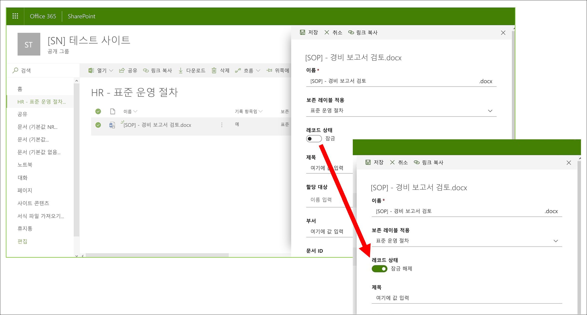
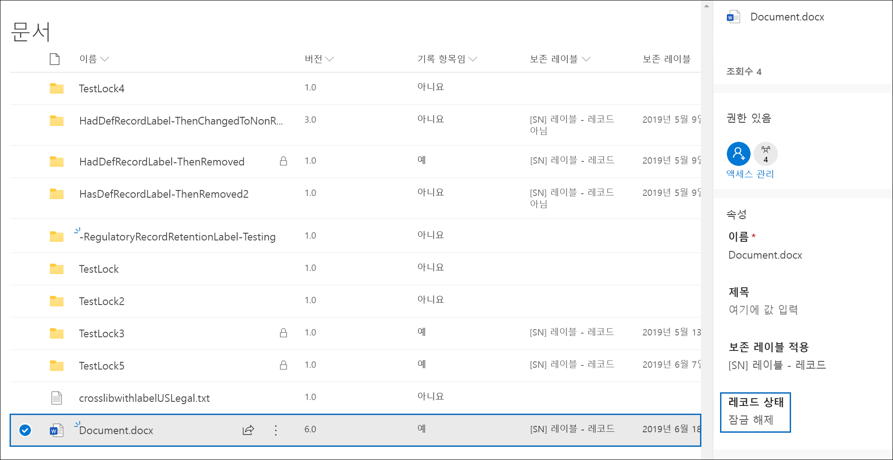
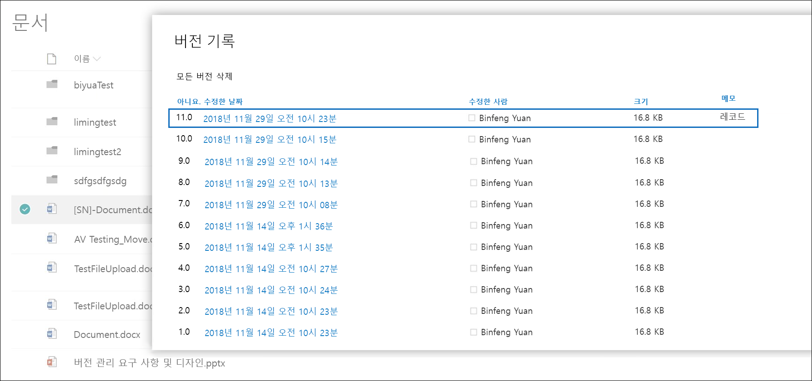
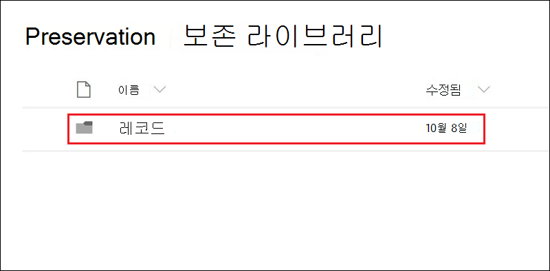

# 레코드 버전을 사용하여 SharePoint 또는 OneDrive에 저장된 레코드를 업데이트합니다.

>*[보안 및 규정 준수를 위한 Microsoft 365 라이선싱 지침](/office365/servicedescriptions/microsoft-365-service-descriptions/microsoft-365-tenantlevel-services-licensing-guidance/microsoft-365-security-compliance-licensing-guidance).*

> [!NOTE]
> 규제 레코드는 편집을 차단하므로 규정 레코드에 대한 레코드 버전 관리를 사용할 수 없습니다.

문서를 [레코드](records-management.md#records)로 표시하고 레코드에서 수행할 수 있는 작업을 제한하는 기능은 모든 레코드 관리 솔루션의 필수 목표입니다. 그러나 후속 버전을 만들어야 하는 경우 공동으로 작업할 수도 있습니다.

예를 들어 영업 계약을 레코드로 표시한 경우 새 사용 약관으로 계약을 업데이트하고 최신 버전을 새 레코드로 표시해야 합니다. 반면 이전 버전의 레코드는 계속 보존됩니다. 해당 유형의 시나리오에서는 SharePoint 및 OneDrive가 *레코드 버전 관리* 를 지원하고 있습니다. OneNote 전자 필기장 폴더는 레코드 버전 관리를 지원하지 않습니다.

레코드 버전 지정을 사용하려면 먼저 [문서에 레이블을 지정하고 레코드](declare-records.md)로 표시합니다. 이때 *레코드 상태* 라고 하는 문서 속성이 보존 레이블 옆에 표시되고 초기 레코드 상태는 **잠금 상태** 가 됩니다.

이제 다음을 수행할 수 있습니다.

- **레코드 상태 속성을 잠금 및 잠금 해제하여 문서의 개별 버전을 레코드로 계속 편집하고 유지할 수 있습니다.** **레코드 상태** 속성이 **잠금** 으로 설정된 경우에만 해당 레코드의 새 버전이 보존됩니다. 이와 같이 잠금 및 잠금 해제를 전환하면 문서의 불필요한 버전 및 복사본이 보존될 위험을 줄일 수 있습니다.

- **레코드를 사이트 모음에 있는 현재 위치 레코드 리포지토리에 자동으로 저장합니다.** SharePoint 및 OneDrive의 각 사이트 모음은 자료 보존 라이브러리의 콘텐츠를 보존합니다. 레코드 버전은 이 라이브러리의 레코드 폴더에 저장됩니다.

- **모든 버전을 포함하는 에버그린 문서를 유지합니다.** 기본적으로 각 SharePoint 및 OneDrive 문서는 항목 메뉴에서 사용할 수 있는 버전 기록을 포함합니다. 이 버전 기록에서 사용자는 어떤 버전이 레코드인지 쉽게 알 수 있고 그러한 문서들을 확인할 수 있습니다.

> [!TIP]
> 삭제 작업이 있는 보존 레이블로 레코드 버전 관리를 사용하는 경우, 보존 설정 **보존 기간 시작 기준:** 을 **항목에 레블이 지정된 때** 로 설정하는 것이 좋습니다. 이 레이블 설정으로 각 새 레코드 버전에 대해 보존 기간의 시작이 다시 설정되어 이전 버전이 최신 버전보다 먼저 삭제됩니다.

레코드 버전 관리는 항목을 레코드로 표시하고 해당 레이블이 [사이트에 게시](create-apply-retention-labels.md#step-2-publish-retention-labels)되는 보존 레이블이 적용된 모든 문서에 대해 자동으로 사용할 수 있습니다. 사용자가 세부 정보 창을 통해 문서 속성을 확인하는 경우 문서 속성의 **레코드 상태** 를 **잠금 상태** 에서 **잠금 해제 상태** 로 전환할 수 있습니다. 이 작업으로 자료 보존 라이브러리의 보존 폴더에서 레코드를 만들고 레코드는 보존 기간의 나머지 기간 동안 저장됩니다.

문서가 잠금 해제되는 동안 표준 편집 권한이 있는 모든 사용자는 파일을 편집할 수 있습니다. 그러나 사용자는 파일을 삭제할 수 없습니다. 여전히 레코드이기 때문입니다. 편집이 완료되면 **레코드 상태** 를 **잠금 해제** 에서 **잠금** 으로 전환하여 이 상태에서 추가로 편집이 진행되지 않도록 할 수 있습니다.
  

## 레코드 잠금 및 잠금 해제

콘텐츠를 레코드로 표시하는 보존 레이블을 문서에 적용한 후 참가 권한 또는 더 적은 권한 수준을 사용하는 모든 사용자가 레코드를 잠금 해제하거나 잠금 해제된 레코드를 잠글 수 있습니다.
  

사용자가 레코드를 잠금 해제하면 다음 작업이 수행됩니다.

1. 현재 사이트 모음에 자료 보존 라이브러리가 없는 경우에는 하나만 만들어집니다.

2. 자료 보존 라이브러리에 레코드 폴더가 없는 경우에는 하나만 만들어집니다.

3. **복사** 작업은 문서의 최신 버전을 레코드 폴더로 복사합니다. **복사** 작업은 최신 버전만 포함하고 이전 버전은 포함하지 않습니다. 이 복사된 문서는 이제 문서의 레코드 버전으로 간주되며 해당 파일 이름은 다음 형식으로 되어 있습니다. \[제목 GUID 버전\#\]

4. 레코드 폴더에 만들어진 복사본은 원본 문서의 버전 기록에 추가되고 이 버전은 설명 필드에 **레코드** 로 표시됩니다.

5. 원본 문서는 편집할 수는 있지만 삭제할 수 없는 새 버전입니다. 문서가 현재 편집될 수 있더라도 여전히 레코드이므로 문서 라이브러리의 **레코드 항목임** 열에서는 **예** 값으로 표시됩니다.

사용자가 레코드를 잠그면 원본 문서는 다시 편집할 수 없습니다. 그러나 이는 자료 보존 라이브러리의 레코드 폴더에 버전을 복사하는 레코드를 잠금 해제하는 작업입니다.

## 레코드 버전

사용자가 레코드의 잠금을 해제할 때마다 최신 버전은 자료 보존 라이브러리에 복사되고 해당 버전에는 버전 기록의 **설명** 필드에 **레코드** 값이 포함됩니다.
  

버전 기록을 보려면 문서 라이브러리에서 문서를 선택하고 항목 메뉴에서 **버전 기록** 을 클릭합니다.

## 레코드 저장 위치

레코드는 사이트 모음의 최상위 사이트에 있는 자료 보존 라이브러리의 레코드 폴더에 저장됩니다. 최상위 사이트의 왼쪽 탐색 창에서 **사이트 콘텐츠** \> **자료 보존 라이브러리** 을 선택합니다.
  

  

자료 보존 라이브러리 작동 방식에 대한 자세한 내용은 [SharePoint 및 OneDrive에 대한 보존 작동 방식](retention-policies-sharepoint.md#how-retention-works-for-sharepoint-and-onedrive)을 참조하세요.

## 기록 버전 관리 이벤트에 대한 감사 로그 검색

레코드 잠금 및 잠금 해제 작업이 감사 로그에 기록됩니다. **파일 및 페이지 활동** 에서 **레코드 상태를 잠금으로 변경함** 및 **레코드 상태를 잠금 해제로 변경함** 을 선택합니다.

이러한 이벤트를 검색하는 방법에 대한 자세한 내용은 [감사 로그 검색](search-the-audit-log-in-security-and-compliance.md#file-and-page-activities)을 참조하세요.

## 다음 단계

레코드 관리에서 지원되는 기타 시나리오는 [레코드 관리에 대한 일반적인 시나리오](get-started-with-records-management.md#common-scenarios-for-records-management)를 참조하세요.
