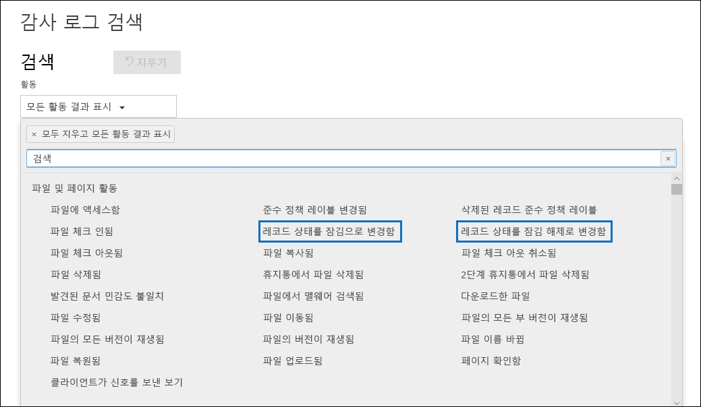

# 레코드 개요

>*[보안 및 규정 준수를 위한 Microsoft 365 라이선싱 지침](https://aka.ms/ComplianceSD)*

Microsoft 365에서 레코드 관리를 사용하면 조직은 회사 정책, 법적 고지 사항 및 규제 의무를 준수하는 동시에 위험과 법적 책임을 줄일 수 있습니다.

높은 수준에서 콘텐츠를 레코드로 선언하는 것은 다음과 같은 의미를 가집니다.

- 항목이 변경할 수 없게 됩니다(레코드를 수정하거나 삭제할 수 없음).

- 항목에 대한 추가 활동이 기록됩니다.

- 레코드는 명시된 보존 기간이 지나면 폐기됩니다.

[보존 레이블](labels.md)을 사용하여 콘텐츠를 레코드로 분류할 수 있습니다. 레코드를 선언하는 보존 레이블을 만든 후 사용자가 콘텐츠를 레코드로 분류하는 데 사용할 수 있도록 해당 레이블을 [게시](labels.md#how-retention-labels-work-with-retention-label-policies)하거나 사용자가 레코드로 분류하기 원하는 콘텐츠에 [해당 레이블을 자동 적용](labels.md#applying-a-retention-label-automatically-based-on-conditions)할 수 있습니다. 사용자는 레코드를 선언하기 위한 보존 레이블을 사용하여 Office 365에서 일관된 단일 레코드 관리 전략을 구현할 수 있지만 레코드 센터와 같은 다른 레코드 관리 기능은 SharePoint Online의 콘텐츠에만 적용할 수 있습니다.

레코드에 대해 다음의 사항에 유의하십시오.

  - **레코드는 변경할 수 없습니다.** 콘텐츠를 레코드로 선언하는 보존 레이블은 SharePoint 및 비즈니스용 OneDrive 뿐만 아니라 Exchange의 콘텐츠에 적용될 수 있습니다. 그러나 [레코드 버전 관리](#record-versioning)는 Exchange가 아닌 SharePoint 및 OneDrive에서만 사용할 수 있습니다.

    Exchange에서 레코드로 레이블이 지정된 콘텐츠는 최종 삭제될 때까지 변경할 수 없습니다. Exchange 항목에 레코드로 레이블이 지정되면 다음 네 가지 사항이 발생합니다.

    - 항목을 영구적으로 삭제할 수 없습니다.

    - 항목을 편집할 수 없습니다.

    - 레이블을 변경할 수 없습니다.

    - 레이블을 제거할 수 없습니다.

  - **레코드 및 폴더** Exchange, SharePoint 및 OneDrive의 폴더에 보존 레이블을 적용할 수 있습니다. 폴더가 레코드로 레이블이 지정되고 항목을 해당 폴더로 이동하면 항목이 레코드로 레이블이 지정됩니다. 항목을 폴더 밖으로 이동시켜도 항목은 계속 레코드로 레이블이 지정되어 있습니다.

    또한 폴더 (SharePoint 및 OneDrive)에 적용되는 레코드 레이블을 콘텐츠를 레코드로 선언하지 않는 보존 레이블로 변경하면 해당 폴더의 항목에는 기존 레코드 레이블이 유지됩니다.

    SharePoint 및 OneDrive 폴더에 보존 레이블을 적용하는 방법에 대한 자세한 내용은 [ SharePoint 라이브러리, 폴더 또는 문서 집합의 모든 콘텐츠에 기본 보존 레이블 적용](labels.md#applying-a-default-retention-label-to-all-content-in-a-sharepoint-library-folder-or-document-set)을 참조하세요.

  - **레코드는 삭제될 수 없습니다**. 사용자가 Exchange에서 기록을 삭제하려고 하면 [보존 정책이 원본 위치의 콘텐츠에 작동하는 방식](retention-policies.md#content-in-mailboxes-and-public-folders)에 설명된 것처럼 항목이 복구 가능한 항목 폴더로 이동됩니다.

    SharePoint에서 레코드를 삭제하려고 하면 항목이 삭제되지 않았다는 오류 메시지가 표시되고 항목은 라이브러리에 남아 있습니다.

    

    OneDrive에서 레코드를 삭제하려고 하면 [보존 정책이 원본 위치의 콘텐츠에 작동하는 방식](retention-policies.md#content-in-onedrive-accounts-and-sharepoint-sites)에 설명된 것처럼 항목이 자료 보존 라이브러리로 이동됩니다.

  - **레코드 레이블은 제거할 수 없습니다.** 레코드 레이블이 항목에 적용되면 해당 위치의 관리자만(예: SharePoint 사이트의 사이트 모음 관리자) 해당 레코드 레이블을 제거할 수 있습니다.

## 보존 레이블을 사용하여 레코드 선언

보존 레이블을 만들 때 보존 레이블을 사용하여 콘텐츠를 레코드로 분류하는 옵션이 제공됩니다. 콘텐츠를 레코드로 선언하려면 다음 단계를 따릅니다.

1. 보존 레이블을 만듭니다. Microsoft 365 준수 센터에서 **레코드 관리** \> **파일 계획**으로 이동합니다. **파일 계획** 페이지에서 **레이블 만들기**를 클릭합니다.

2. 마법사의 **레이블 설정** 페이지에서 콘텐츠를 레코드로 선언하는 보존 레이블 설정 옵션을 선택합니다. 

   

3. SharePoint 사이트 및/또는 OneDrive 계정에 대한 보존 레이블을 [게시](labels.md#how-retention-labels-work-with-retention-label-policies)하거나 [자동 적용](labels.md#applying-a-retention-label-automatically-based-on-conditions)합니다.

### 콘텐츠에 보존 레이블 적용

Exchange의 경우 사서함에 대한 쓰기 권한이 있는 사용자는 전자 메일 메시지에 레코드 레이블을 적용할 수 있습니다. SharePoint 및 OneDrive 콘텐츠의 경우 기본 구성원 그룹에 있는 모든 사용자(참가 권한 수준)는 콘텐츠에 레코드 레이블을 적용할 수 있습니다. 레코드 레이블이 적용된 후에 사이트 모음 관리자만 해당 레코드 레이블을 제거하거나 변경할 수 있습니다. 앞서 설명한 것처럼 콘텐츠를 레코드로 분류하는 보존 레이블을 콘텐츠에 자동 적용할 수 있습니다.

SharePoint 사이트 또는 OneDrive 계정에서 문서에 레코드 레이블이 적용되는 경우의 결과는 다음과 같습니다.
  

## 레코드 버전 관리

레코드 관리의 중요한 역할은 문서를 레코드로 선언하여 해당 레코드를 변경할 수 없도록 하는 기능입니다. 이와 동시에 레코드의 불변성은 사용자가 이후 버전을 만들어야 하는 경우 문서에서 공동 작업을 할 수 없도록 합니다. 예를 들어 영업 계약을 레코드로 선언한 경우 새 사용 약관으로 계약을 업데이트하고 최신 버전을 새 레코드로 선언해야 합니다. 반면 이전 버전의 레코드는 계속 보존됩니다. 이러한 유형의 시나리오에서는 SharePoint Online 및 비즈니스용 OneDrive가 현재 *레코드 버전 관리*를 지원하고 있습니다. OneNote 전자 필기장 폴더는 지원되지 않습니다.

레코드 버전 관리를 사용하려면 첫 번째 단계로 Microsoft 365 준수 센터를 사용하여 모든 SharePoint 사이트 및/또는 OneDrive 계정에 레코드를 선언하는 보존 레이블을 만들어 게시하거나 특정 SharePoint 사이트 및/또는 OneDrive 계정에 보존 레이블을 게시해야 합니다. 다음 단계는 게시된 보존 레코드 레이블을 문서에 적용해야 합니다. 이 작업이 완료되면 *레코드 상태*라고 하는 문서 속성이 보존 레이블 옆에 표시되고 초기 레코드 상태는 **잠금 상태**가 됩니다. 이때 다음 작업을 수행할 수 있습니다.

  - **레코드 상태 속성을 잠금 및 잠금 해제하여 문서의 개별 버전을 레코드로 계속 편집하고 선언할 수 있습니다.** **레코드 상태** 속성이 **잠금 상태**로 설정된 경우 레코드로 선언된 버전만 보존됩니다. 따라서 문서의 불필요한 버전 및 복사본을 보존하는 위험을 줄일 수 있습니다.

  - **레코드를 사이트 모음에 있는 현재 위치 레코드 리포지토리에 자동으로 저장합니다.** SharePoint 및 OneDrive의 각 사이트 모음은 자료 보존 라이브러리의 콘텐츠를 보존합니다. 레코드 버전은 이 라이브러리의 레코드 폴더에 저장됩니다.

  - **모든 버전을 포함하는 에버그린 문서를 유지합니다.** 기본적으로 각 SharePoint 및 OneDrive 문서는 항목 메뉴에서 사용할 수 있는 버전 기록을 포함합니다. 이 버전 기록에서 사용자는 어떤 버전이 레코드인지 쉽게 알 수 있고 그러한 문서들을 확인할 수 있습니다.

레코드 버전 관리는 레코드로 항목을 선언하는 보존 레이블이 있는 모든 문서에 대해 자동으로 제공될 수 있습니다. 사용자가 세부 정보 창을 통해 문서 속성을 확인하는 경우 문서 속성의 **레코드 상태**가 **잠금 상태**에서 **잠금 해제 상태**로 전환됩니다. 한 번 클릭으로 자료 보존 라이브러리의 보존 폴더에서 레코드를 만들고 레코드는 보존 기간의 나머지 기간 동안 저장됩니다. 문서가 잠금 해제되는 동안 사용 권한이 있는 모든 사용자는 파일을 편집할 수 있습니다. 그러나 사용자는 파일을 삭제할 수 없습니다. 이는 선언된 레코드로 간주되기 때문입니다. 필요한 변경 내용이 적용된 후 사용자는 **레코드 상태**를 **잠금 해제 상태**에서 **잠금 상태**로 전환하여 문서를 다시 레코드로 선언하고 편집할 수 없도록 할 수 있습니다.
  

### 레코드 잠금 및 잠금 해제

문서에 레코드 레이블을 할당한 후 참가 권한 또는 더 적은 권한 수준을 사용하는 모든 사용자가 레코드를 잠금 해제하거나 잠금 해제된 레코드를 잠글 수 있습니다.
  

사용자가 레코드를 잠금 해제하면 다음 작업이 수행됩니다.

1. 현재 사이트 모음에 자료 보존 라이브러리가 없는 경우에는 하나만 만들어집니다.

2. 자료 보존 라이브러리에 레코드 폴더가 없는 경우에는 하나만 만들어집니다.

3. **복사** 작업은 문서의 최신 버전을 레코드 폴더로 복사합니다. **복사** 작업은 최신 버전만 포함하고 이전 버전은 포함하지 않습니다. 이 복사된 문서는 이제 문서의 레코드 버전으로 간주되며 해당 파일 이름은 다음 형식으로 되어 있습니다. \[제목 GUID 버전\#\]

4. 레코드 폴더에 만들어진 복사본은 원본 문서의 버전 기록에 추가되고 이 버전은 설명 필드에 **레코드**로 표시됩니다.

5. 원본 문서는 편집할 수는 있지만 삭제할 수 없는 새 버전입니다. 문서가 현재 편집될 수 있더라도 여전히 레코드로 고려되기 때문에 문서 라이브러리의 **레코드 항목임**열에서는 **예** 값으로 표시됩니다.

사용자가 레코드를 잠그면 원본 문서는 다시 편집할 수 없습니다. 그러나 이는 자료 보존 라이브러리의 레코드 폴더에 버전을 복사하는 레코드를 잠금 해제하는 작업입니다.

### 레코드 버전

사용자가 레코드의 잠금을 해제할 때마다 최신 버전은 자료 보존 라이브러리의 레코드 폴더에 복사되고 해당 버전에는 버전 기록의 **설명** 필드에 **레코드** 값이 포함됩니다.
  

버전 기록을 보려면 문서 라이브러리에서 문서를 선택하고 항목 메뉴에서 **버전 기록**을 클릭합니다.

### 레코드 저장 위치

레코드는 사이트 모음의 최상위 사이트에 있는 자료 보존 라이브러리의 레코드 폴더에 저장됩니다. 최상위 사이트의 왼쪽 탐색 창에서 **사이트 콘텐츠** \> **자료 보존 라이브러리**을 선택합니다.
  

  

자료 보존 라이브러리는 사이트 모음 관리자에게만 표시됩니다. 또한 자료 보존 라이브러리는 기본적으로 존재하지 않습니다. 이는 보존 레이블이나 보존 정책에 해당하는 콘텐츠가 사이트 모음에서 처음 삭제된 경우에만 만들어집니다.

### 기록 버전 관리 이벤트에 대한 감사 로그 검색

레코드 잠금 및 잠금 해제 작업이 Office 365 감사 로그에 기록됩니다. 사용자는 특정 작업인 **레코드 상태가 잠김으로 변경** 및 **레코드 상태가 잠김 상태로 변경**을 검색할 수 있습니다. 이 작업은 보안 및 준수 센터의 **감사 로그 검색** 페이지에 있는 **활동** 드롭다운 목록의 **파일 및 페이지 활동** 섹션에 있습니다.
  

이러한 이벤트를 검색하는 방법에 대한 자세한 내용은 [보안 & 준수 센터에서 감사 로그를 검색](search-the-audit-log-in-security-and-compliance.md#file-and-page-activities)의 "파일 및 페이지 활동" 섹션을 참조하세요.
