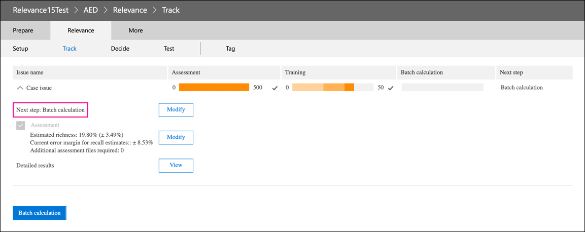

# 2016년 12월에 대한 Advanced eDiscovery

2021년 3월 10일, 2021년 3월 10일, 현재 2016년 3월 10일에는 2016년 3월 10일 Advanced eDiscovery. 이 사용 중지는 조직이 더 이상 관련성 모듈에 액세스하지 못하거나(Advanced eDiscovery 사례에서 검토 집합 관련성 관리로) 기존 관련성 모델에 액세스할 수 없음을  >   의미합니다. 사용 중지되는 현재의관위 모듈이 2021년 2분기 CY 2021의 새로운 예측 코딩 솔루션으로 대체됩니다. 이 새로운 기능을 통해 조직은 보다 쉽고 직관적인 워크플로에서 자체 예측 코딩 모델을 빌드할 수 있습니다.

예정된 사용 중지에 대비하기 위해 관련성 모듈을 사용하는 조직은 모든 기존 모델에 대해 일괄 계산을 실행하여 사용 중지 날짜 전에 모델의 출력을 내보내는 것이 좋습니다. 모델의 모든 관련성 점수는 해당 검토 집합에 영구적으로 저장되고 문서를 내보낼 때 액세스할 수 있습니다. 또한 해당 점수는 로드 파일에 메타데이터로 유지됩니다. 또한 관련성 점수를 기반으로 검토 집합의 콘텐츠를 필터링할 수 있으며 관련성 모델에서 생성한 모든 메타데이터에 액세스할 수 있습니다.

## 완료되지 않은 모델 완료

미완료 관련성 모델의 경우 검토 집합의 문서에 모델을 적용할 수 있도록 평가, 교육 및 일괄 계산을 완료하십시오. 일괄 계산을 완료하면 관련성 모듈의 사용 중지 날짜 이후에 정보가 보존됩니다.

미완성 모델을 완료하는 단계는 다음과 같습니다.

1. 모델이 안정화되고 일괄 계산을 준비할 때까지 모델을 교육합니다. 태그 [지정 및관련성 교육을 참조합니다.](tagging-and-relevance-training-in-advanced-ediscovery.md)

   다음 스크린샷은 일괄 계산을 위해 준비된 모듈을 보여줍니다. 평가 및 교육이 완료된 후 다음 단계는 일괄 계산을 실행하는 것입니다.

   

2. Batch 계산을 실행합니다. 일괄 [계산 수행을 참조합니다.](track-relevance-analysis-in-advanced-ediscovery.md#performing-batch-calculation)

3. 일괄 계산이 성공적이지 확인 계산 [결과 일괄 처리를 참조합니다.](track-relevance-analysis-in-advanced-ediscovery.md#batch-calculation-results)

미완료된 해당 모델 완료에 대한 도움말을 원할 경우 Microsoft 지원에 문의합니다.
