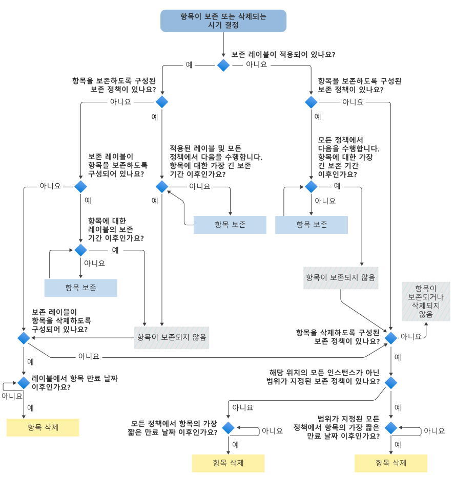

# 항목이 보존되거나 영구적으로 삭제되는 시기를 결정하는 순서도

>*[보안 및 규정 준수에 대한 Microsoft 365 라이선싱 지침](/office365/servicedescriptions/microsoft-365-service-descriptions/microsoft-365-tenantlevel-services-licensing-guidance/microsoft-365-security-compliance-licensing-guidance).*

다음 순서도를 사용하여 [보존 원칙](retention.md#the-principles-of-retention-or-what-takes-precedence)을 항목에 적용하여 시스템이 보존 레이블 또는 보존 정책의 결과로 보존할지 또는 영구적으로 삭제할지를 결정합니다.

이 논리 흐름은 다음 조건 중 하나가 적용되는 경우 항목에 사용됩니다.

- 적용된 보존 정책이 두 개 이상 있습니다.
- 보존 레이블 및 하나 이상의 보존 정책이 있습니다.

항목에 eDiscovery 보류가 적용되는 경우 보존 정책 및 보존 레이블에 대한 의사 결정 흐름 전에 항상 보존됩니다.

이 순서도에 사용된 용어가 익숙하지 않은 경우 [보존 정책 및 보존 레이블에 대해 알아보기](retention.md)를 참조하세요.

   

> [!NOTE]
> 항목에 대한 가장 긴 보존 기간과 보존 정책 또는 레이블에서 지정된 가장 긴 기간을 구분하는 것이 중요합니다. 마찬가지로 항목에 대한 가장 짧은 만료 날짜와 보존 정책에서 지정한 가장 짧은 기간 사이입니다.
> 
> 자세한 내용은 [보존 원칙](retention.md#the-principles-of-retention-or-what-takes-precedence) 섹션에 있는 그래픽 다음의 설명을 참조하세요.
