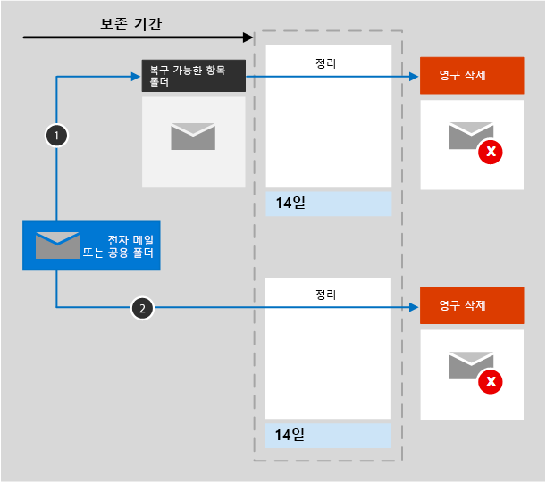

# Exchange의 보존에 대해 자세히 알아보기

Exchange에 관한 정보를 담고 있으므로 이 문서의 정보는 [보존 정책에 대해 자세히 알아보기](retention.md)를 보완합니다.  다른 워크로드는 다음을 참조하세요.

- [SharePoint 및 OneDrive의 보존에 대해 자세히 알아보기](retention-policies-sharepoint.md)
- [Microsoft Teams의 보존에 대해 자세히 알아보기](retention-policies-teams.md)
- [Yammer의 보존에 대한 자세한 정보](retention-policies-yammer.md)

## 보존 및 삭제에 포함된 항목

보존 정책 및 보존 레이블을 사용하여 사용자 사서함 및 공유 사서함의 다음 Exchange 항목을 보존 및 삭제할 수 있습니다. 첨부 파일이 있는 메일 메시지(받은 메시지, 초안, 보낸 메시지 포함), 종료 날짜와 노트가 있는 작업 

종료 날짜가 있는 일정 항목은 보존 정책에서 지원되지만 보존 레이블에는 지원되지 않습니다.

종료 날짜가 없는 모든 작업 및 일정 항목은 지원되지 않습니다.

사서함에 저장된 다른 항목(예: Skype 및 팀 메시지)은 Exchange의 보존 정책 또는 레이블에 포함되지 않습니다. 이러한 항목에는 자체 보존 정책이 있습니다.

## Exchange에서 보존의 작동 방식

사서함 및 공용 폴더 모두 항목을 보존하기 위해 [복구 가능한 항목 폴더](/exchange/security-and-compliance/recoverable-items-folder/recoverable-items-folder)를 사용합니다. eDiscovery 권한을 할당 받은 사용자만 다른 사용자의 복구 가능한 항목 폴더에서 항목을 볼 수 있습니다.
  
사용자가 지운 편지함 폴더 이외의 폴더에서 메시지를 삭제하면 해당 메시지는 기본적으로 지운 편지함 폴더로 이동합니다. 그러나 사용자는 Shift+Delete를 눌러 항목을 일시적으로 삭제할 수 있으며, 이 경우 항목이 지운 편지함 폴더를 거치지 않고 복구할 수 있는 항목 폴더로 바로 이동합니다.
  
보존 설정을 Exchange 데이터에 적용하면 타이머 작업이 복구 가능한 항목 폴더의 항목을 주기적으로 평가합니다. 항목이 하나 이상의 보존 정책이나 보존 레이블의 규칙과 일치하지 않는 경우, 항목은 복구 가능한 항목 폴더에서 영구적으로 삭제됩니다(영구 삭제).

> [!NOTE]
> [첫 번째 보존 원칙](retention.md#the-principles-of-retention-or-what-takes-precedence) 때문에 다른 보존 정책 또는 보존 레이블로 인해 동일한 항목을 유지해야 하거나 법적 또는 조사상의 이유로 eDiscovery 보류 상태에 있는 경우 영구 삭제는 항상 일시 중단됩니다.

타이머 작업은 최대 7일이 걸릴 수 있으며 Exchange 위치에는 적어도 10MB가 포함되어 있어야 합니다.
  
사용자가 메시지의 제목, 본문, 첨부 파일, 보낸 사람 및 받는 사람, 보낸 날짜 또는 받은 날짜와 같은 사서함 항목의 특정 속성을 변경하려고 하면 변경을 제출하기 전에 원본 항목의 복사본이 복구 가능한 항목 폴더에 저장됩니다. 이 작업은 후속 변경이 있을 때마다 진행됩니다. 보존 기간이 끝나면 복구 가능한 항목 폴더의 사본이 영구적으로 삭제됩니다.

보존 설정을 Exchange 콘텐츠에 적용한 후에 콘텐츠가 사용하는 경로는 보존 설정이 보존 후 삭제하는지, 아니면 보존 또는 삭제 한 가지만 실행하는지 여부에 따라 달라집니다.

보존 설정이 보존 및 삭제인 경우:

1. 사용자가 보존 기간 내에 **항목을 수정하거나 영구적으로 삭제하면**(SHIFT+DELETE를 사용하거나 삭제된 항목에서 삭제하는 경우) 항목이 복구 가능한 항목 폴더로 이동(또는 편집한 경우 복사)됩니다. 여기에서 타이머 작업이 주기적으로 실행되며 보존 기간이 만료된 항목을 식별합니다. 식별된 항목은 보존 기간 종료일로부터 14일 이내에 영구적으로 삭제됩니다. 14일은 기본값이며, 최대 30일로 설정할 수 있습니다.

2. **보존 기간 동안 항목이 수정되거나 삭제되지 않는 경우** 동일한 프로세스가 사서함의 모든 폴더에 대해 주기적으로 실행되고 보존 기간이 만료된 항목이 식별되며, 이러한 항목은 보존 기간이 끝나고 14일 이내에 영구적으로 삭제됩니다. 14일은 기본 설정이지만 최대 30일로 구성할 수 있습니다. 

보존 설정이 보존 전용 또는 삭제 전용인 경우 컨텐츠 경로는 보존 및 삭제의 변형입니다.

### 보존 전용 보존 설정의 컨텐츠 경로

1. 보존 기간 동안 **항목이 수정되거나 삭제된 경우**: 복구 가능한 항목 폴더의 사본이 항목이 만료된 후 14일 이내에 영구적으로 삭제되면 원래 항목의 사본이 복구 가능한 항목 폴더에 작성되고 보존 기간이 끝날 때까지 보존됩니다. 

2. 보존 기간 동안 **항목이 수정되거나 삭제되지 않은 경우**: 보존 기간 전후에는 아무 것도 발생하지 않습니다. 항목은 원래 위치에 남아 있습니다.

### 삭제 전용 보존 설정의 컨텐츠 경로

1. 구성된 기간에 **항목이 삭제되지 않은 경우**: 보존 정책에서 구성된 기간이 끝나면 항목은 복구 가능한 항목 폴더로 이동됩니다. 

2. 구성된 기간에 **항목이 삭제된 경우**: 항목은 즉시 복구 가능한 항목 폴더로 이동합니다. 사용자가 해당 항목을 삭제하거나 복구 가능한 항목 폴더를 비우면 항목이 영구적으로 삭제됩니다. 그렇지 않으면 14일 동안 복구 가능한 항목 폴더에있는 항목이 영구적으로 삭제됩니다. 

## 만료 날짜에 대한 사용자 알림

Exchange에 대한 보존 정책은 다른 Microsoft 365 워크로드에 대한 보존 정책과 달리 항목에 대한 만료 날짜가 가장 짧은 보존 정책의 이름과 해당 항목에 대한 계산된 만료 날짜를 각 전자 메일 메시지 상단에 표시하여 사용자의 현재 상태를 나타냅니다. 보존 정책이 항목을 삭제하지 않는 경우 사용자에게 이 알림이 표시되지 않습니다(보존 전용).

보존 레이블이 전자 메일 메시지에 적용된 경우 해당 레이블의 이름과 해당 만료 날짜가 항상 표시되고 사서함에 적용된 보존 정책의 이름과 날짜가 대체됩니다.

이 컨텍스트에서 이메일이 삭제되는 만료 날짜는 사용자가 이메일 메시지가 자동으로 복구 가능한 항목 폴더(아직 없는 경우)로 이동할 것으로 예상할 수 있는 때임을 기억하세요. 복구 가능한 항목 폴더의 전자 메일은 영구적으로 삭제되지 않지만 보존 설정이 적용되거나 법적 또는 조사상의 이유로 eDiscovery 보류 상태인 경우 규정 준수를 위해 그대로 유지됩니다.

## 사용자가 조직을 떠나는 경우 

조직에서 나간 사용자의 사서함이 보존 정책에 포함되어 있는 경우, 사용자의 Microsoft 365 계정이 삭제되면 해당 사서함이 비활성화됩니다. 비활성화된 사서함의 콘텐츠 또한 비활성화 상태로 변경되기 전에 사서함에 적용된 보존 정책의 적용을 받으며, 콘텐츠 또한 eDiscovery 검색에서 사용될 수 있습니다. 자세한 내용은 [Exchange Online에서 비활성 사서함](inactive-mailboxes-in-office-365.md)을 참조하세요.

데이터가 영구적으로 삭제되었거나 보존 기간이 만료되어 보존 설정이 더 이상 적용되지 않는 경우 Exchange 관리자는 이제 [비활성 상태인 사서함을 삭제](delete-an-inactive-mailbox.md)할 수 있습니다. 이 시나리오에서는 비활성 사서함이 자동으로 삭제되지 않습니다.

## 구성 지침

Microsoft 365에서 보존을 처음 구성하는 경우 [보존 정책 및 보존 레이블 시작하기](get-started-with-retention.md)를 참조하세요.

Exchange의 보존 정책 또는 보존 레이블을 구성할 준비가 되면 다음 지침을 참조하세요.
- [보존 정책 만들기 및 구성하기](create-retention-policies.md)
- [보존 레이블을 만들고 앱에 적용하기](create-apply-retention-labels.md)
- [보존 레이블을 콘텐츠에 자동으로 적용하기](apply-retention-labels-automatically.md)