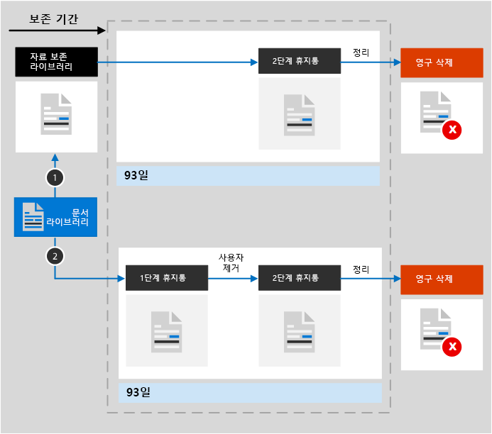

# SharePoint 및 OneDrive의 보존에 대해 자세히 알아보기

>*[보안 및 규정 준수를 위한 Microsoft 365 라이선싱 지침](https://aka.ms/ComplianceSD)*

SharePoint 및 OneDrive 관련 정보를 포함하므로 이 문서의 정보는 [보존에 대한 자세한 정보](retention.md)를 보완합니다.

다른 워크로드는 다음을 참조하세요.

- [Microsoft Teams의 보존에 대해 자세히 알아보기](retention-policies-teams.md)
- [Yammer의 보존에 대한 자세한 정보](retention-policies-yammer.md)
- [Exchange의 보존에 대해 자세히 알아보기](retention-policies-exchange.md)

## 보존 및 삭제에 포함된 항목

SharePoint 또는 OneDrive 사이트에 저장된 모든 파일은 보존 정책 또는 보존 레이블을 적용하여 보존할 수 있습니다.

다음 파일을 삭제할 수 있습니다.

- 보존 정책을 사용하는 경우 다음을 수행합니다. 문서 라이브러리의 모든 파일. 자동으로 생성된 SharePoint 문서 라이브러리를 포함합니다(예: **사이트 자산** ).
    
- 보존 레이블을 사용하는 경우: 모든 문서 라이브러리의 모든 파일 및 폴더에 없는 루트 수준의 모든 파일.
    
    [보존 레이블에 대해 자동 적용 정책과 함께 KQL 쿼리](apply-retention-labels-automatically.md#auto-apply-labels-to-content-with-keywords-or-searchable-properties)를 사용하는 경우 `NOT(DocumentLink:"<URL to document library>")` 항목을 사용하여 문서 라이브러리를 제외할 수 있습니다.

## SharePoint 및 OneDrive에서 보존이 작동하는 방식

보존을 지원하기 위해 SharePoint 및 OneDrive가 없는 경우 보존 보류 라이브러리를 만듭니다. 사이트 모음의 최상위 사이트에 있는 **사이트 콘텐츠** 페이지에서 이 라이브러리를 볼 수 있습니다. 자료 보존 라이브러리는 사이트 모음 관리자만 볼 수 있기 때문에 대부분의 사용자는 볼 수 없습니다.
  
다른 사람이 보존 설정의 영향을 받는 문서를 변경하거나 삭제하려고 하면 해당 콘텐츠가 보존 설정을 적용한 후에 변경되었는지 여부를 확인합니다. 보존 설정이 적용되고 처음 변경하는 경우라면 해당 콘텐츠는 자료 보존 라이브러리에 복사되어 거기에서 해당 사용자는 원본 콘텐츠를 변경하거나 삭제할 수 있습니다. 사이트 모음의 콘텐츠는 보존 설정과는 독립적으로 자료 보존 라이브러리에 복사할 수 있습니다.
  
타이머 작업이 주기적으로 자료 보존 라이브러리를 정리합니다. 타이머 작업은 자료 보존 라이브러리의 모든 콘텐츠를 해당 콘텐츠에 대한 보존 설정에서 사용하는 모든 쿼리와 비교합니다. 구성된 보존 기간보다 오래된 콘텐츠는 자료 보존 라이브러리에서 삭제되고, 아직 남아 있는 경우, 원본 위치에서도 삭제됩니다. 이 타이머 작업은 7일마다 실행되며 이는 콘텐츠를 삭제하는 데 최대 7일이 걸릴 수 있음을 의미합니다.
  
이러한 동작은 보존 설정이 적용될 때 존재하는 콘텐츠에 적용됩니다. 또한 보존 정책의 경우 정책에 포함된 후 사이트 모음에 만들거나 추가된 새 콘텐츠는 삭제 후에도 유지됩니다. 그렇지만 새 콘텐츠는 처음 편집할 때는 자료 보존 라이브러리에 복사되지 않고 삭제되었을 때만 복사됩니다. 파일의 모든 버전을 보존하려면, [버전 관리](#how-retention-works-with-document-versions)를 설정해야 합니다.
  
사용자가 보존 정책이 적용되는 라이브러리, 목록, 폴더 또는 사이트를 삭제하려고 하면 오류가 표시됩니다. 사용자는 먼저 정책이 적용되는 폴더의 모든 파일을 이동하거나 삭제하는 경우에 폴더를 삭제할 수 있습니다. 또한 자료 보존 라이브러리는 보존 정책을 만들거나 보존 레이블을 적용할 때가 아닌, 이 단계에서 만들어집니다. 즉, 보존을 테스트하려면 먼저 보존 정책의 영향을 받거나 보존 레이블이 적용된 사이트에서 문서를 편집하거나 삭제한 다음, 자료 보존 라이브러리로 이동하여 보존된 복사본을 확인해야 합니다.
  
보존 설정을 OneDrive 계정 또는 SharePoint 사이트의 콘텐츠에 할당한 후 콘텐츠가 사용하는 경로는 보존 설정이 보존 후 삭제하는지, 아니면 보존 또는 삭제만 가능한지 여부에 따라 달라집니다.

보존 설정이 보존 및 삭제인 경우:

  
1. 보존 기간 내에 **콘텐츠가 수정되거나 삭제되면** 보존 정책이 적용된 시점과 동일한 원본 콘텐츠의 사본이 자료 보존 라이브러리에 생성됩니다. 여기에서 타이머 작업이 보존 기간이 만료된 항목을 식별합니다. 해당 항목은 2단계 휴지통으로 이동되고, 93일이 지나면 영구적으로 삭제됩니다. 2단계 휴지통은 최종 사용자에게 표시되지 않습니다(1단계 휴지통에만 해당). 하지만 사이트 모음 관리자는 해당 사이트에서 콘텐츠를 보고 복원할 수 있습니다.

    > [!NOTE]
    > 실수로 데이터가 손실되는 것을 방지하기 위해 더 이상 보존 라이브러리의 콘텐츠를 영구적으로 삭제하지 않습니다. 대신 휴지통에서 콘텐츠를 영구적으로 삭제합니다. 이제는 보존 라이브러리의 모든 콘텐츠가 2단계 휴지통을 거칩니다.
    
2. 보존 기간 동안 **콘텐츠가 수정되거나 삭제되지 않으면** 타이머 작업은 해당 콘텐츠를 보존 기간의 종료 시점에 1단계 휴지통으로 이동시킵니다. 여기에서 사용자가 콘텐츠를 삭제하거나 휴지통을 비우면 문서가 2단계 휴지통으로 이동됩니다. 1단계 휴지통과 2단계 휴지통을 포함하여 총 93일간의 보존 기간이 적용됩니다. 93일이 지나면 1단계 휴지통 또는 2단계 휴지통에서 문서가 영구적으로 삭제됩니다. 휴지통이 인덱싱되지 않으므로 검색할 수 없습니다. 따라서 eDiscovery 검색에서 보류할 휴지통 콘텐츠를 찾을 수 없습니다.

보존 설정이 보존 전용 또는 삭제 전용인 경우 컨텐츠 경로는 보존 및 삭제의 변형입니다.

### 보존 전용 보존 설정의 컨텐츠 경로

1. 보존 기간 동안 **컨텐츠가 수정되거나 삭제된 경우** : 보존 라이브러리의 사본이 2단계로 이동될 때 원본 문서의 사본이 보존 라이브러리에 작성되고 보존 기간이 끝날 때까지 보존됩니다. 휴지통이며 93일 후에 영구적으로 삭제됩니다.

2. 보존 기간 동안 **컨텐츠가 수정되거나 삭제되지 않은 경우** : 보존 기간 전후에는 아무 것도 발생하지 않습니다. 문서는 원래 위치에 남아 있습니다.

### 삭제만 보존 설정의 컨텐츠 경로

1. 구성된 기간 동안 **컨텐츠가 삭제되는 경우** , 해당 문서는 1단계 휴지통으로 이동됩니다. 여기에서 사용자가 문서를 삭제하거나 휴지통을 비우면 문서가 2단계 휴지통으로 이동됩니다. 1단계 휴지통과 2단계 휴지통을 포함하여 총 93일 간의 보존 기간이 적용됩니다. 93일이 지나면 1단계 휴지통 또는 2단계 휴지통에서 문서가 영구적으로 삭제됩니다. 구성된 기간 동안 컨텐츠가 수정되면 구성된 기간이 지난 후 동일한 삭제 경로를 따릅니다.

2. 구성된 기간 동안 **컨텐츠가 삭제되지 않는 경우** , 보존 정책에 구성된 기간이 끝나는 시점에 문서가 1단계 휴지통으로 이동됩니다. 여기에서 사용자가 문서를 삭제하거나 휴지통을 비우면 문서가 2단계 휴지통으로 이동됩니다. 1단계 휴지통과 2단계 휴지통을 포함하여 총 93일 간의 보존 기간이 적용됩니다. 93일이 지나면 1단계 휴지통 또는 2단계 휴지통에서 문서가 영구적으로 삭제됩니다. 휴지통이 인덱싱되지 않으므로 검색할 수 없습니다. 따라서 eDiscovery 검색에서 보류할 휴지통 콘텐츠를 찾을 수 없습니다.

## OneNote 콘텐츠의 보존 방식

OneNote 컨텐츠가 포함된 위치에 보존 정책을 적용하면 배경 뒤에 다른 OneNote 섹션이 개별 파일입니다. 즉, 지정한 보존 설정에 따라 각 구역이 개별적으로 유지 및 삭제됩니다.

## 보존이 문서 버전에서 작동하는 방식입니다.

버전 지정은 SharePoint 및 OneDrive에 있는 모든 문서 목록과 라이브러리의 기능입니다. 기본적으로 버전 지정은 최소 500개의 주 버전을 유지하지만 이 제한을 늘릴 수는 있습니다. 자세한 내용은 [목록 또는 라이브러리에 대한 버전 지정 사용 및 구성](https://support.office.com/article/1555d642-23ee-446a-990a-bcab618c7a37) 및 [목록 및 라이브러리에서 버전 지정 작동 방식](https://support.microsoft.com/office/how-versioning-works-in-lists-and-libraries-0f6cd105-974f-44a4-aadb-43ac5bdfd247)을 참조하세요.
  
버전이 있는 문서가 해당 내용을 보존하기 위한 보존 설정의 적용을 받는 경우 보존 보류 라이브러리에 복사되는 버전은 별도의 항목으로 존재합니다. 보존 기간이 끝날 때 삭제하도록 보존 설정이 구성된 경우 다음을 수행합니다.

- 보존 기간이 콘텐츠가 만들어진 시점을 기준으로 하는 경우 각 버전은 원본 문서와 동일한 만료 날짜로 됩니다. 따라서 원본 문서와 해당 버전이 모두 동시에 만료됩니다.

- 보존 기간이 콘텐츠가 마지막으로 수정된 시점을 기준으로 하는 경우 각 버전은 원본 문서를 수정해 해당 버전이 만들어진 시점을 기준으로 하는 각각의 만료 날짜로 됩니다. 원본 문서와 해당 버전은 서로 독립적으로 만료됩니다.

> [!NOTE]
> 이러한 SharePoint 및 OneDrive 문서의 보존 버전은 eDiscovery 도구를 통해 검색할 수 없습니다.

보존 작업이 문서를 삭제하는 경우 현재 버전에 따라 보존 보류 라이브러리에 없는 모든 버전이 동시에 삭제됩니다.

보존 정책(또는 eDiscovery hold)의 영향을 받는 항목의 경우 문서의 보존 기간에 도달하거나 eDiscovery hold가 릴리스될 때까지 문서 라이브러리의 버전 지정 제한이 무시됩니다. 이 시나리오에서는 이전 버전이 자동으로 삭제되지 않고 사용자가 버전을 삭제할 수 없습니다.

콘텐츠가 보존 정책(또는 eDiscovery 보류)의 적용을 받지 않는 경우에는 보존 레이블이 적용되지 않습니다. 대신 새 버전을 수용하기 위해 이전 버전이 자동으로 삭제되도록 버전 지정 제한이 적용되지만 사용자는 여전히 버전을 삭제할 수 없습니다.

## 사용자가 조직을 떠나는 경우

**SharePoint** :

사용자가 조직을 떠나는 경우, 사용자의 사서함 또는 OneDrive 계정과 달리, SharePoint는 공동 작업 환경으로 간주되므로 사용자가 만든 콘텐츠는 영향을 받지 않습니다.

**OneDrive** :

사용자가 조직을 떠나는 경우, 보존 정책이 적용되거나 보존 레이블이 포함된 모든 파일은 정책이나 레이블 기간 동안 유지됩니다. 이 기간 동안 모든 공유 액세스는 계속 작동합니다. 보존 기간이 만료되면 콘텐츠가 사이트 모음 휴지통으로 이동하고 관리자를 제외하고는 누구도 액세스할 수 없습니다. 문서가 보존 레이블에 의해 레코드로 표시되는 경우 보존 기간이 종료될 때까지 해당 문서는 삭제되지 않으며 그 후에는 콘텐츠가 영구적으로 삭제됩니다.

## 구성 지침

Microsoft 365에서 보존을 처음 구성하는 경우 [보존 정책 및 보존 레이블 시작하기](get-started-with-retention.md)를 참조하세요.

Exchange의 보존 정책 또는 보존 레이블을 구성할 준비가 되면 다음 지침을 참조하세요.
- [보존 정책 만들기 및 구성하기](create-retention-policies.md)
- [보존 레이블을 만들고 앱에 적용하기](create-apply-retention-labels.md)
- [보존 레이블을 콘텐츠에 자동으로 적용하기](apply-retention-labels-automatically.md)
