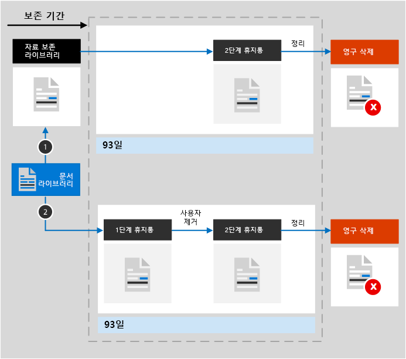
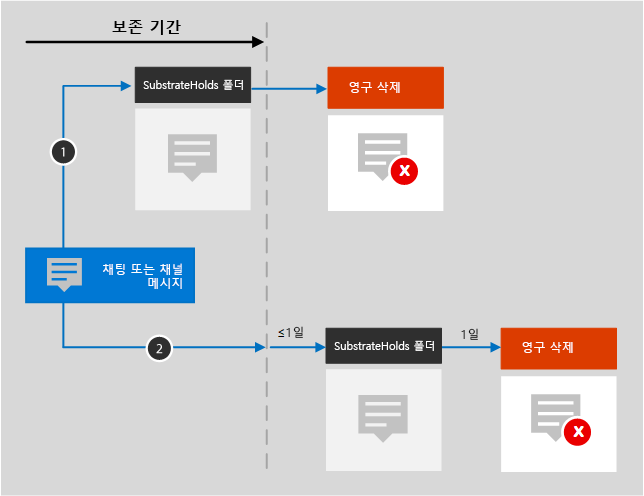

# 보존 정책 개요Overview of retention policies

대부분의 조직에서는 전자 메일, 문서, 인스턴트 메시지 등을 비롯한 데이터의 양과 복잡성이 매일 계속해서 증가하고 있습니다. 이러한 정보를 효과적으로 관리하거나 제어하는 일은 다음 작업을 수행해야 하므로 중요합니다.For most organizations, the volume and complexity of their data is increasing daily - email, documents, instant messages, and more. Effectively managing or governing this information is important because you need to:
  
- **산업 규정 및 내부 정책을 자동으로 준수** - 최소 기간 동안 콘텐츠를 보존하도록 요구합니다. 예를 들어 Sarbanes-Oxley Act에서는 7년 동안 특정 유형의 콘텐츠를 보존하도록 요구할 수 있습니다.**Comply proactively with industry regulations and internal policies** that require you to retain content for a minimum period of time - for example, the Sarbanes-Oxley Act might require you to retain certain types of content for seven years. 
    
- **소송 또는 보안 위반 시 위험 감소** - 더 이상 보존할 필요가 없는 오래된 콘텐츠를 영구적으로 삭제**Reduce your risk in the event of litigation or a security breach** by permanently deleting old content that you're no longer required to keep. 
    
- **조직에서 효과적이면서 좀 더 민첩하게 지식을 공유하도록 지원** - 사용자가 관련이 있는 최신 콘텐츠만 사용하도록 합니다.**Help your organization to share knowledge effectively and be more agile** by ensuring that your users work only with content that's current and relevant to them. 
    
보존 정책은 이러한 모든 목표를 달성하는 데 도움을 줄 수 있습니다. 일반적으로 콘텐츠를 관리하려면 다음 두 가지 작업이 필요합니다.A retention policy can help you achieve all of these goals. Managing content commonly requires two actions:
  
- **보존** - 콘텐츠가 보존 기간이 끝나기 전에 영구적으로 삭제되지 않도록 보존합니다.**Retaining** content so that it can't be permanently deleted before the end of the retention period. 
    
- **삭제** - 보존 기간이 끝나면 콘텐츠를 영구적으로 삭제합니다.**Deleting** content permanently at the end of the retention period. 
    
보존 정책을 사용하여 다음을 수행할 수 있습니다.With a retention policy, you can:
  
- 있는지 여부를 콘텐츠를 보존할지, 삭제할지, 아니면 보존했다가 삭제할지를 자동으로 결정합니다.Decide proactively whether to retain content, delete content, or both - retain and then delete the content.
    
- 전체 조직 또는 특정 위치나 사용자에 단일 정책을 적용합니다.Apply a single policy to the entire organization or just specific locations or users.
    
- 모든 콘텐츠 또는 특정 조건을 충족하는 콘텐츠(예: 특정 키워드 또는 [특정 유형의 중요 정보](what-the-sensitive-information-types-look-for.md)를 포함하는 콘텐츠)에 정책을 적용합니다.Apply a policy to all content or just content meeting certain conditions, such as content containing specific keywords or [specific types of sensitive information](what-the-sensitive-information-types-look-for.md).
    
콘텐츠가 보존 정책을 따르는 경우라도 콘텐츠는 원래 위치에 그대로 보존되므로 아무 것도 변경되지 않는 것과 같이, 계속해서 콘텐츠를 편집하고 사용할 수 있습니다. 그러나 보존 정책을 따르는 콘텐츠를 다른 사용자가 편집 또는 삭제한 경우에는 복사본이 안전한 위치에 저장되어 정책이 적용되는 동안 이 위치에 보존됩니다.When content is subject to a retention policy, people can continue to edit and work with the content as if nothing's changed because the content is retained in place, in its original location. But if someone edits or deletes content that's subject to the policy, a copy is saved to a secure location where it's retained while the policy is in effect.
  
마지막으로 일부 조직에서는 SEC(Securities and Exchange Commission) 규칙 17a-4와 같은 규정을 준수해야 합니다. 따라서 예약 정책을 켠 후에는 끄거나 덜 제한적인 정책으로 변경할 수 없습니다. 이 요구 사항을 위해서는 보존 잠금을 사용할 수 있습니다. 정책이 잠궈지면 관리자를 비롯한 어느 누구도 정책을 해제하거나 덜 제한적으로 만들 수 없습니다.Finally, some organizations might need to comply with regulations such as Securities and Exchange Commission (SEC) Rule 17a-4, which requires that after a retention policy is turned on, it cannot be turned off or made less restrictive. To meet this requirement, you can use Preservation Lock. After a policy's been locked, no one—including the administrator—can turn off the policy or make it less restrictive.
  
다음에서 보존 정책을 만들고 관리합니다.You create and manage retention policies on the:

- [Microsoft 365 규정 준수 센터](https://compliance.microsoft.com/)의 **정책** 페이지**Policies** page in the Microsoft 365 compliance center.
- [Office 365 보안 &amp; 규정 준수 센터](https://protection.office.com/)의 **정보 거버넌스** 아래에 있는 **보존** 페이지.**Retention** page under **Data governance** in the Office 365 Security &amp; Compliance Center.
  
## 보존 정책이 원본 위치의 콘텐츠에 작동하는 방식How a retention policy works with content in place

보존 정책에 사이트나 사서함과 같은 위치를 포함하면 콘텐츠가 원본 위치에 남아 있게 됩니다. 사용자는 아무 내용도 변경되지 않은 것처럼 문서 또는 메일을 계속 사용할 수 있습니다. 그렇지만 정책에 포함된 콘텐츠를 편집하거나 삭제하면 정책 적용 시 존재했던 콘텐츠의 사본이 보존됩니다.When you include a location such as a site or mailbox in a retention policy, the content remains in its original location. People can continue to work with their documents or mail as if nothing's changed. But if they edit or delete content that's included in the policy, a copy of the content as it existed when you applied the policy is retained.
  
SharePoint 사이트 모음의 경우, 사용자가 콘텐츠를 편집하거나 삭제할 경우 원본 콘텐츠의 사본이 자료 보존 라이브러리에 보존되고, 전자 메일 및 공용 폴더의 경우에는 사본이 복구 가능한 항목 폴더에 보존됩니다. 이러한 보안 위치 및 보존된 콘텐츠는 대부분의 사용자에게 표시되지 않습니다. 보존 정책을 사용하면 사용자는 해당 콘텐츠에 정책이 적용된다는 사실도 알 필요가 없습니다.For Sharepoint site collections, a copy of the original content is retained in the Preservation Hold library when users edit or delete it; for email and public folders, the copy is retained in the Recoverable Items folder. These secure locations and the retained content are not visible to most people. With a retention policy, people do not even need to know that their content is subject to the policy.
  
참고:Notes:
  
- Teams(채팅) 콘텐츠는 Exchange에 저장되며 이때 정책은 메시지 유형(전자 메일 또는 대화)에 따라 적용됩니다.Skype content is stored in Exchange, where the policy is applied based on message type (email or conversation).
    
- Office 365 그룹에 적용되는 보존 정책에는 그룹 사서함과 사이트가 모두 포함됩니다.A retention policy applied to an Office 365 group includes both the group mailbox and site.
    
### OneDrive 계정 및 SharePoint 사이트의 콘텐츠Content in OneDrive accounts and SharePoint sites

보존 정책이 사이트 모음 수준에서 적용됩니다.A preservation policy is applied at the level of a site. 보존 정책에 SharePoint 사이트 모음 또는 OneDrive 계정을 포함하는 경우, 보존 라이브러리가 없다면 보존 라이브러리가 새로 생성됩니다.When you include a SharePoint site collection or OneDrive account in a retention policy, a Preservation Hold library will be created, if one doesn't exist. 사이트 모음의 최상위 사이트에 있는 **사이트 콘텐츠** 페이지에서 이 라이브러리를 볼 수 있습니다.You can view this library on the **Site contents** page in the top-level site of the site collection. 자료 보존 라이브러리는 사이트 모음 관리자만 볼 수 있기 때문에 대부분의 사용자는 볼 수 없습니다.Most users can’t view the Preservation Hold library because it’s visible only to site collection owners.
  
사용자가 보존 정책을 따르는 사이트의 콘텐츠를 변경하거나 삭제하려고 하면 보존 정책은 먼저 정책이 적용된 이후 콘텐츠가 변경되었는지 여부를 확인합니다.If a person attempts to change or delete content in a site that’s subject to a preservation policy, first the policy checks whether the content’s been changed since the policy was applied. 보존 정책이 적용되고 처음 변경한 경우라면 보존 정책은 해당 콘텐츠를 자료 보존 라이브러리로 복사하고 해당 사용자가 원본 콘텐츠를 변경하거나 삭제할 수 있도록 허용합니다.If this is the first change since the preservation policy was applied, the policy copies the content to the Preservation Hold library, and then allows the person to change or delete the original content. 사이트 모음의 콘텐츠는 보존 정책에 사용된 필터와 일치하지 않더라도 자료 보존 라이브러리로 복사될 수 있습니다.Note that any content in the site can be copied to the Preservation Hold library, even if the content does not match the filter of the query used by the preservation policy.
  
그런 다음, 타이머 작업이 자료 보존 라이브러리를 정리합니다. 타이머 작업은 주기적으로 실행되면서 자료 보존 라이브러리의 모든 콘텐츠를 사이트의 보존 정책에서 사용하는 모든 쿼리와 비교합니다. 콘텐츠가 하나 이상의 쿼리와 일치하지 않는 한, 타이머 작업은 자료 보존 라이브러리에서 해당 콘텐츠를 영구히 삭제합니다.Then a timer job cleans up the Preservation Hold library. The timer job runs periodically and compares all content in the Preservation Hold library to all of the queries used by the retention policies on the site. Unless content matches at least one of the queries, the timer job permanently deletes the content from the Preservation Hold library.
  
이러한 방식은 보존 정책이 적용될 때 존재하던 콘텐츠에 적용됩니다. 또한 사이트가 정책에 포함된 후에 해당 사이트 모음에서 생성되었거나 추가된 새 콘텐츠는 삭제 후에도 보존됩니다. 그렇지만 새 콘텐츠는 처음 편집할 때는 자료 보존 라이브러리에 복사되지 않고 삭제되었을 때만 복사됩니다. 파일의 모든 버전을 보존하려면 버전 관리 기능을 켜야 합니다. 버전 관리에 대한 내용은 아래 섹션을 참조하세요.The previous applies to content that exists when the retention policy is applied. In addition, any new content that's created or added to the site collection after it was included in the policy will be retained after deletion. However, new content isn't copied to the Preservation Hold library the first time it's edited, only when it's deleted. To retain all versions of a file, you need to turn on versioning — see the below section on versioning.
  
사용자가 보존 정책이 적용되는 라이브러리, 목록, 폴더 또는 사이트를 삭제하려고 하면 오류가 표시됩니다.Note that a user receives an error if they try to delete a library, list, folder, or site that's subject to a retention policy. 사용자는 먼저 정책이 적용되는 폴더의 모든 파일을 이동하거나 삭제할 경우 폴더를 삭제할 수 있습니다.A user can delete a folder if they first move or delete any files in the folder that are subject to the policy. 또한 보존 라이브러리는 보존 정책을 만들 때가 아니라 라이브러리에 첫 번째 항목을 복사해야 하는 경우에만 만들어집니다.Also, the Preservation Hold library is created only when the first item needs to be copied to the library and not when you create the retention policy. 따라서 정책을 테스트하려면 먼저 정책이 적용되는 사이트에서 문서를 편집하거나 삭제한 다음 보존 라이브러리로 이동하여 보존된 복사본을 확인해야 합니다.Therefore, to test your policy, you first need to edit or delete a document in a site subject to the policy, and then browse to the Preservation Hold library to view the retained copy.
  
보존 정책이 OneDrive 계정 또는 SharePoint 사이트에 할당되면 콘텐츠는 다음 두 가지 경로 중 하나를 따를 수 있습니다.After a retention policy is assigned to a OneDrive account or SharePoint site, content can follow one of two paths:

  
1. 보존 기간 내에 **콘텐츠가 수정되거나 삭제되면** 보존 정책이 적용된 시점과 동일한 원본 콘텐츠의 사본이 자료 보존 라이브러리에 생성됩니다.**If the content is modified or deleted** during the retention period, a copy of the original content as it existed when the retention policy was assigned is created in the Preservation Hold library. There, a timer job runs periodically and identifies items whose retention period has expired, and these items are permanently deleted within seven days of the end of the retention period. 여기에서 타이머 작업이 주기적으로 실행되며 보존 기간이 만료된 항목을 식별합니다. 식별된 항목은 93일 만료 시 영구적으로 삭제되는 2단계 휴지통으로 이동합니다.There, a timer job runs periodically and identifies items whose retention period has expired, and those items are moved to the second-stage Recycle Bin, where they're permanently deleted at the end of 93 days. 2단계 휴지통은 최종 사용자에게 표시되지 않습니다(1단계 휴지통에만 해당). 하지만 사이트 모음 관리자는 해당 사이트에서 콘텐츠를 보고 복원할 수 있습니다.The second-stage Recycle Bin is not visible to end users (only the first-stage Recycle Bin is), but site collection admins can view and restore content from there.

    > [!NOTE]
    > 최근 보존 라이브러리에서 콘텐츠를 삭제하는 방법을 변경했습니다.We've recently changed how content is deleted from the Preservation Hold library. 실수로 데이터가 손실되는 것을 방지하기 위해 더 이상 보존 라이브러리의 콘텐츠를 영구적으로 삭제하지 않습니다.To help prevent inadvertent data loss, we no longer permanently delete content from the Preservation Hold library. 대신 휴지통에서 콘텐츠를 영구적으로 삭제합니다. 이제는 보존 라이브러리의 모든 콘텐츠가 2단계 휴지통을 거칩니다.Instead, we permanently delete content only from the Recycle Bin, so all content from the Preservation Hold library now goes through the second-stage Recycle Bin.
    
2. 보존 기간 내에 **콘텐츠가 수정되거나 삭제되지 않으면** 보존 기간의 종료 시점에 1단계 휴지통으로 이동됩니다.**If the content is not modified or deleted** during the retention period, it's moved to the first-stage Recycle Bin at the end of the retention period. 여기에서 사용자가 콘텐츠를 삭제하거나 휴지통을 비우면 문서가 2단계 휴지통으로 이동됩니다.If a user deletes the content from there or empties this Recycle Bin (also known as purging), the document is moved to the second-stage Recycle Bin. 1단계 휴지통과 2단계 휴지통을 포함하여 총 93일 간의 보존 기간이 적용됩니다. 93일이 지나면 1단계 휴지통 또는 2단계 휴지통에서 문서가 영구적으로 삭제됩니다.A 93-day retention period spans both the first- and second-stage recycle bins. At the end of 93 days, the document is permanently deleted from wherever it resides, in either the first- or second-stage Recycle Bin. 휴지통은 인덱싱되지 않으므로 휴지통의 콘텐츠는 검색 기능으로 찾을 수 없습니다.The Recycle Bin is not indexed and therefore searches do not find content there. 즉, eDiscovery 보류를 통해 휴지통에 있는 콘텐츠를 찾을 수 없습니다.This means that an eDiscovery hold can't locate any content in the Recycle Bin in order to hold it. 
    
### 사서함 및 공용 폴더의 콘텐츠Content in mailboxes and public folders

사용자의 메일, 일정 및 기타 항목의 경우 보존 정책은 사서함 수준에서 적용됩니다. 공용 폴더의 경우 사서함 수준이 아닌 폴더 수준에서 보존 정책이 적용됩니다. 사서함 및 공용 폴더 모두 항목을 보존하기 위해 복구 가능한 항목 폴더를 사용합니다. eDiscovery 권한을 부여 받은 사용자만 다른 사용자의 복구 가능한 항목 폴더에서 항목을 볼 수 있습니다.For a user's mail, calendar, and other items, a retention policy is applied at the level of a mailbox. For a public folder, a retention policy is applied at the folder level, not the mailbox level. Both a mailbox and a public folder use the Recoverable Items folder to retain items. Only people whom have been assigned eDiscovery permissions can view items in another user's Recoverable Items folder.
  
사용자가 지운 편지함 폴더 이외의 폴더에서 메시지를 삭제하면 해당 메시지는 기본적으로 지운 편지함 폴더로 이동됩니다. 사용자가 지운 편지함 폴더에서 항목을 삭제하면 메시지가 복구할 수 있는 항목 폴더로 이동됩니다. 또한 사용자는 Shift+Delete를 눌러 항목을 일시적으로 삭제할 수 있습니다. 이 경우 지운 편지함 폴더가 무시되고 항목이 복구할 수 있는 항목 폴더로 바로 이동됩니다.By default, when a person deletes a message in a folder other than the Deleted Items folder, the message is moved to the Deleted Items folder. When a person deletes an item in the Deleted Items folder, the message is moved to the Recoverable Items folder. In addition, a person can soft delete an item (SHIFT+DELETE) in any folder, which bypasses the Deleted Items folder and moves the item directly to the Recoverable Items folder.
  
프로세스는 복구 가능한 항목 폴더에서 정기적으로 항목을 평가합니다. 항목이 하나 이상의 보존 정책 규칙과 일치하지 않으면 항목은 복구 가능한 항목 폴더에서 영구적으로 삭제됩니다.A process periodically evaluates items in the Recoverable Items folder. If an item doesn't match the rules of at least one retention policy, the item is permanently deleted (also called hard deleted) from the Recoverable Items folder.
  
사용자가 메시지의 제목, 본문, 첨부 파일, 보낸 사람 및 받는 사람, 보낸 날짜 또는 받은 날짜와 같은 사서함 항목의 특정 속성을 변경하려고 하면 변경이 커밋되기 전에 원본 항목의 복사본이 복구 가능한 항목 폴더에 저장됩니다. 이 작업은 후속 변경이 있을 때마다 진행됩니다. 보존 기간이 끝나면 복구 가능한 항목 폴더의 사본이 영구적으로 삭제됩니다.When a person attempts to change certain properties of a mailbox item — such as the subject, body, attachments, senders and recipients, or date sent or received for a message — a copy of the original item is saved to the Recoverable Items folder before the change is committed. This happens for each subsequent change. At the end of the retention period, copies in the Recoverable Items folder are permanently deleted.
  
사용자가 조직을 떠나며 해당 사서함이 보존 정책에 포함된 경우 사용자의 Office 365 계정이 삭제되면 사서함은 비활성 사서함이 됩니다. 비활성 사서함의 콘텐츠는 해당 사서함이 비활성 상태가 되기 전에 지정된 보존 정책이 계속 적용되며, eDiscovery 검색에서 해당 콘텐츠를 사용할 수 있습니다. 자세한 내용은 [Exchange Online의 비활성 사서함](inactive-mailboxes-in-office-365.md)을 참조하세요.If a user leaves your organization, and their mailbox is included in a retention policy, the mailbox becomes an inactive mailbox when the user's Office 365 account is deleted. The contents of an inactive mailbox are still subject to any retention policy that was placed on the mailbox before it was made inactive, and the contents are available to an eDiscovery search. For more information, see [Inactive mailboxes in Exchange Online](inactive-mailboxes-in-office-365.md).
  
보존 정책이 사서함 또는 공용 폴더에 할당되면 콘텐츠는 다음 두 가지 경로 중 하나를 따를 수 있습니다.After a retention policy is assigned to a mailbox or public folder, content can follow one of two paths:

1. **보존 기간 동안 사용자가 항목을 수정하거나 영구적으로 삭제하는 경우**(Shift + Delete 사용 또는 지운 편지함에서 삭제) 항목은 복구 가능한 항목 폴더로 이동(또는 편집의 경우 복사)됩니다. 여기에서 프로세스가 주기적으로 실행되고 보존 기간이 만료된 항목이 식별되며, 이러한 항목은 보존 기간이 끝나고 14일 이내에 영구적으로 삭제됩니다. 14일은 기본 설정이지만 최대 30일로 구성할 수 있습니다.**If the item is modified or permanently deleted** by the user (either SHIFT+DELETE or deleted from Deleted Items) during the retention period, the item is moved (or copied, in the case of edit) to the Recoverable Items folder. There, a process runs periodically and identifies items whose retention period has expired, and these items are permanently deleted within 14 days of the end of the retention period. Note that 14 days is the default setting, but it can be configured up to 30 days.
    
2. 보존 기간 내에 **항목이 수정되거나 삭제되지 않으면** 사서함의 모든 폴더에서 동일한 프로세스가 주기적으로 실행되며 보존 기간이 만료된 항목을 식별합니다. 식별된 항목은 보존 기간 종료일로부터 14일 이내에 영구적으로 삭제됩니다.**If the item is not modified or deleted** during the retention period, the same process runs periodically on all folders in the mailbox and identifies items whose retention period has expired, and these items are permanently deleted within 14 days of the end of the retention period. Note that 14 days is the default setting but it can be configured up to 30 days. 14일은 기본값이며, 최대 30일로 설정할 수 있습니다.Note that 14 days is the default setting, but it can be configured up to 30 days. 
    
## 보존 정책이 사이트 모음의 문서 버전에 작동하는 방식How a retention policy works with document versions in a site collection

버전 관리는 SharePoint Online 및 비즈니스용 OneDrive의 모든 문서 라이브러리의 기능입니다.Versioning is a feature of all document libraries in SharePoint Online and OneDrive for Business. 기본적으로 버전 관리에서는 최소 500개의 주요 버전이 유지되지만이 제한을 늘릴 수 있습니다.By default, versioning retains a minimum of 500 major versions, though you can increase this limit. 자세한 내용은 [목록 또는 라이브러리의 버전 관리 설정 및 구성](https://support.office.com/article/1555d642-23ee-446a-990a-bcab618c7a37)을 참조하세요.For more information about versioning, see [Enable and configure versioning for a list or library](https://support.office.com/article/1555d642-23ee-446a-990a-bcab618c7a37).
  
보존 정책 (삭제 전용 대신 콘텐츠를 유지하는 보존 정책)은 SharePoint 사이트 모음 또는 OneDrive 계정에 있는 문서의 모든 버전이 보존됩니다.A retain policy (retention policy that retains content instead of delete-only) retains all versions of a document in a SharePoint site collection or OneDrive account. 보류 또는 보존 정책이 적용되는 문서를 편집할 때마다 버전이 보존 보류 라이브러리에 복사됩니다.Each time a document subject to a hold or retain policy is edited, a version is copied to the Preservation Hold library. 버전 관리가 설정된 경우, 보류 또는 보존 정책이 적용되는 문서가 삭제될 때마다 모든 버전이 보존 보류 라이브러리에 복사됩니다.Each time a document subject to a hold or retain policy is deleted, all versions are copied to the Preservation Hold library if versioning is enabled. 보존 보류 라이브러리의 각 문서 버전은 자체 보존 기간이 있는 별도의 항목으로 존재합니다.Each version of a document in the Preservation Hold library exists as a separate item with its own retention period:
  
- 보존 정책이 콘텐츠가 만들어진 시점을 기준으로 하는 경우 각 버전은 원본 문서와 동일한 만료 날짜를 갖습니다. 따라서 원본 문서 및 해당 버전은 동시에 만료됩니다.If the retention policy is based on when the content was created, each version has the same expiration date as the original document. The original document and its versions all expire at the same time.
    
- 보존 정책이 콘텐츠가 마지막으로 수정된 시점을 기준으로 하는 경우 각 버전은 원본 문서가 해당 버전을 만들기 위해 수정된 시점을 기준으로 하는 자체 만료 날짜를 가집니다. 따라서 원본 문서와 해당 버전는 별도로 만료됩니다.If the retention policy is based on when the content was last modified, each version has its own expiration date based on when the original document was modified to create that version. The original documents and its versions expire independently of each other.

> [!NOTE]
> 보존된 버전의 SharePoint 및 OneDrive 문서는 eDiscovery 도구로 검색할 수 없습니다.The preserved versions of SharePoint and OneDrive documents are not searchable by eDiscovery tools.

## 특정 기간 동안 콘텐츠 보존Retaining content for a specific period of time

보존 정책을 사용하면 콘텐츠를 영구적으로 또는 며칠, 몇 달, 몇 년 동안만 보존할 수 있습니다.With a preservation policy, you can preserve content indefinitely or for a specific number of days, months, or years. 콘텐츠 보존 기간은 보존 정책이 적용된 시점이 아닌 콘텐츠 생성 시점을 기준으로 계산됩니다.Note that the duration for how long content is preserved is calculated from the age of the content, not from when the preservation policy is created. 콘텐츠의 생성 시점 또는 (OneDrive 및 SharePoint의 경우) 수정 시점 중 어느 것을 기준으로 할지 선택할 수 있습니다.You can choose whether the age is based on when the content was created or (for OneDrive and SharePoint) when it was last modified.
  
예를 들어 사이트 모음의 콘텐츠를 마지막으로 수정한 이후부터 7년 동안 보존하려고 하고 해당 사이트 모음의 문서가 6년 동안 수정되지 않았다면, 문서는 수정되지 않은 1년 동안 더 보존됩니다. 문서를 다시 편집하면 문서 사용 기간은 마지막으로 수정한 날부터 계산되고 이후 7년 동안 더 보존됩니다.For example, if you want to retain content in a site collection for seven years since it was last modified, and a document in that site collection hasn't been modified in six years, the document will be retained for only another year if it's not modified. If the document is edited again, the age of the document is calculated from the new last modified date, and it will be retained for another seven years.
  
마찬가지로 사서함의 콘텐츠를 7년 동안 보존하려고 하고 6년 전에 메시지가 전송된 경우 해당 메시지만 1년 동안 보존됩니다. Exchange 콘텐츠의 경우 사용 기간은 항상 수신 또는 전송된 날짜(동일하게 취급)를 기준으로 합니다. 마지막으로 수정된 시점을 기준으로 콘텐츠를 보존할 경우 OneDrive 및 SharePoint의 사이트 콘텐츠에만 적용됩니다.Similarly, if you want to retain content in a mailbox for seven years, and a message was sent six years ago, the message will be retained for only one year. For Exchange content, the age is always based on the date received or sent (they are the same). Retaining content based on when it was last modified applies only to site content in OneDrive and SharePoint.
  
보존 기간이 끝나면 콘텐츠를 영구적으로 삭제할지 여부를 선택할 수 있습니다.You can choose whether you want the content to be permanently deleted at the end of the retention period. A retention policy can also simply delete old content without retaining it - see the next section. 보존 정책을 사용하여 오래된 콘텐츠를 보존하지 않고 삭제할 수도 있습니다.A retention policy can both retain and then delete content, or simply delete old content without retaining it. 다음 섹션을 참조하세요.See the next section for details.
  

  
## 특정 사용 기간보다 오래된 콘텐츠 삭제Deleting content that's older than a specific age

보존 정책은 콘텐츠를 보존했다가 삭제하거나, 보존하지 않고 오래된 콘텐츠를 단순히 삭제할 수 있습니다.A retention policy can both retain and then delete content, or simply delete old content without retaining it.
  
보존 정책이 콘텐츠를 삭제할 경우 보존 정책에 대해 지정된 기간은 정책이 할당된 시점이 아니라 콘텐츠가 만들어졌거나 수정된 이후부터 계산된다는 사실에 유의해야 합니다.If your retention policy deletes content, it's important to understand that the time period specified for a retention policy is calculated from the time when the content was created or modified, not the time since the policy was assigned.
  

  
예를 들어, 3년 후에 콘텐츠를 삭제하는 보존 정책을 만든 후, 해당 정책을 3~5년 전에 만들어진 콘텐츠가 많이 포함되어 있는 모든 OneDrive 계정에 할당한다고 가정합니다. 이 경우 많은 콘텐츠가 보존 정책을 처음 할당한 직후에 삭제됩니다. 이러한 이유로 **콘텐츠를 삭제하는 보존 정책은 콘텐츠에 상당한 영향을 미칠 수 있습니다**.For example, suppose that you create a retention policy that deletes content after three years, and then assign that policy to all OneDrive accounts, which contain a lot of content that was created four or five years ago. In this case, a lot of content will be deleted soon after assigning the retention policy for the first time. For this reason, **a retention policy that deletes content can have a considerable impact on your content**. 
  
따라서 처음으로 사이트 모음에 보존 정책을 할당하기 전에 먼저 콘텐츠의 사용 기간과 정책이 기존 콘텐츠에 어떤 영향을 줄 수 있는지 고려해야 합니다. 또한 새 정책을 할당하기 전에 사용자에게 미리 알려, 가능한 영향을 평가할 시간을 줄 수도 있습니다. 보존 정책을 만들기 바로 전에 해당 설정을 검토할 때 나타나는 다음 경고에 유의하세요.Therefore, before you assign a retention policy to a site collection for the first time, you should first consider the age of the existing content and how the policy may impact that content. You may also want to communicate the new policy to your users before assigning it, to give them time to assess the possible impact. Note this warning that appears when you review the settings for your retention policy just before creating it.
  

  
## 특정 조건을 충족하는 콘텐츠에만 정책을 적용하는 고급 설정Advanced settings that apply a policy only to content that meets certain conditions

보존 정책을 포함하는 위치의 모든 콘텐츠에 적용할 수도 있고, 특정 키워드 또는 [특정 유형의 중요 정보](what-the-sensitive-information-types-look-for.md)를 포함하는 콘텐츠에만 보존 정책을 적용하도록 선택할 수 있습니다.A retention policy can apply to all content in the locations that it includes, or you can choose to apply a retention policy only to content that contains specific keywords or [specific types of sensitive information](what-the-sensitive-information-types-look-for.md).
  

  
### 특정 키워드를 포함하는 콘텐츠 보존Retain content that contains specific keywords

특정 조건을 충족하는 콘텐츠에만 보존 정책을 적용한 후, 해당 콘텐츠에만 보존 작업을 수행할 수 있습니다. 현재 사용 가능한 조건은 특정 단어 또는 구를 포함하는 콘텐츠에만 보존 정책을 적용하도록 지원합니다. AND, OR 및 NOT과 같은 검색 연산자를 사용하여 쿼리를 구체화할 수 있습니다. 이러한 연산자에 대한 자세한 내용은 [콘텐츠 검색에 대한 키워드 쿼리 및 검색 조건](keyword-queries-and-search-conditions.md)을 참조하세요.You can apply a retention policy only to content that satisfies certain conditions, and then take retention actions on just that content. The conditions available now support applying a retention policy to content that contains specific words or phrases. You can refine your query by using search operators like AND, OR, and NOT. For more information on these operators, see [Keyword queries and search conditions for Content Search](keyword-queries-and-search-conditions.md).
  
검색 가능한 속성(예: **제목:**)을 추가하는 기능이 곧 지원될 예정입니다.Support for adding searchable properties (for example, **subject:**) is coming soon.
  
쿼리 기반 보존은 검색 인덱스를 사용하여 콘텐츠를 식별합니다.Query-based retention labels use the search index to identify content.
  

  
### 중요한 정보가 포함된 콘텐츠 보존Retain content that contains sensitive information

[특정 유형의 중요 정보](what-the-sensitive-information-types-look-for.md)를 포함하는 콘텐츠에만 보존 정책을 적용할 수도 있습니다. 예를 들어, 납세자 ID 번호, 주민 등록 번호 또는 여권 번호 등 PII(개인 식별이 가능한 정보)를 포함하는 콘텐츠에만 고유한 보존 요구 사항을 적용하도록 선택할 수 있습니다.You can also apply a retention policy only to content that contains [specific types of sensitive information](what-the-sensitive-information-types-look-for.md). For example, you can choose to apply unique retention requirements only to content that contains personally identifiable information (PII) such as taxpayer identification numbers, social security numbers, or passport numbers.
  

  
참고:Notes:
  
- 중요한 정보에 대한 고급 보존이 Exchange 공용 폴더 및 비즈니스용 Skype에는 적용되지 않습니다. 이러한 위치는 중요한 정보 유형을 지원하지 않기 때문입니다.Advanced retention for sensitive information doesn't apply to Exchange public folders or Skype for Business because those locations don't support sensitive information types.
    
- Exchange Online에서는 메일 흐름 규칙(전송 규칙이라고도 함)을 사용하여 중요한 정보를 식별하므로 사서함에 이미 저장된 모든 항목이 아닌 전송 중인 메시지에만 이러한 고급 보존이 적용됩니다. 따라서 Exchange Online의 경우 보존 정책이 중요한 정보를 식별할 수 있고 정책이 사서함에 적용된 **후에** 수신된 메시지에만 보존 작업을 수행할 수 있습니다. (이전 섹션에 설명된 쿼리 기반 보존은 검색 인덱스를 사용하여 콘텐츠를 식별하기 때문에 이러한 제한이 적용되지 않습니다.)You should understand that Exchange Online uses mail flow rules (also known as transport rules) to identify sensitive information, so this works only on messages in transit — not on all items already stored in a mailbox. For Exchange Online, this means that a retention policy can identify sensitive information and take retention actions only on messages that are received **after** the policy is applied to the mailbox. (Note that query-based retention described in the previous section doesn't have this limitation because it uses the search index to identify content.) 
    
## 전체 조직 또는 특정 위치에 보존 정책 적용Applying a retention policy to an entire organization or specific locations

전체 조직, 전체 위치 또는 특정 위치나 사용자에 보존 정책을 쉽게 적용할 수 있습니다.You can easily apply a retention policy to an entire organization, entire locations, or only to specific locations or users.
  
### 조직 전체 정책Org-wide policy

보존 정책의 가장 강력한 기능 중 하나는 기본적으로 다음을 비롯한 Office 365의 위치에 적용된다는 것입니다.One of the most powerful features of a retention policy is that by default it applies to locations across Office 365, including:
  
- Exchange 전자 메일Exchange email
    
- SharePoint 사이트 모음SharePoint site collections
    
- OneDrive 계정OneDrive accounts
    
- Office 365 그룹(그룹의 사서함, 사이트 및 문서의 콘텐츠에 적용됩니다.Office 365 groups (applies to content in the group's mailbox, site, and documents. Support for content in Planner, Yammer, and CRM is coming soon.) Planner, Yammer, CRM Microsoft Teams, PowerBI, Stream, Exchange 및 SharePoint Teams 사이트의 콘텐츠에 대한 지원은 곧 제공될 예정입니다)Support for content in Planner, Yammer, CRM Microsoft Teams, PowerBI, Stream, Exchange, and SharePoint Team Sites is coming soon.)
    
- Exchange 공용 폴더Exchange public folders
    

  
조직 전체 보존 정책의 기타 중요한 기능은 다음과 같습니다.Other important features of an org-wide retention policy include:
  
- 정책이 포함할 수 있는 사서함 또는 사이트 개수에 제한이 없습니다.There is no limit to the number of mailboxes or sites the policy can include.
    
- Exchange의 경우 정책이 적용된 후에 만들어진 모든 새 사서함은 해당 정책을 자동으로 상속합니다.For Exchange, any new mailbox created after the policy is applied will automatically inherit the policy.
  
### 전체 위치에 적용되는 정책A policy that applies to entire locations

위치를 선택할 때 Exchange 전자 메일이나 OneDrive 계정 등 전체 위치를 간편하게 포함하거나 배제할 수 있습니다.When you choose locations, you can easily include or exclude an entire location, such as Exchange email or OneDrive accounts. To do so, simply toggle the Status of that location on or off. 해당 위치의 **상태를** 켜거나 끄면 됩니다.To do so, toggle the **Status** of that location on or off. 
  
조직 전체 정책과 마찬가지로, 전체 위치 조합에 정책이 적용될 경우 정책에 포함될 수 있는 사서함 또는 사이트 수에는 제한이 없습니다. 예를 들어, 정책에 모든 Exchange 전자 메일과 모든 SharePoint 사이트가 포함될 경우, 개수에 관계없이 모든 사이트와 사서함이 포함됩니다. 또한 Exchange의 경우 정책이 적용된 후 만들어진 모든 새 사서함은 자동으로 해당 정책을 상속합니다.Like an org-wide policy, if a policy applies to any combination of entire locations, there is no limit to the number of mailboxes or sites the policy can include. For example, if a policy includes all Exchange email and all SharePoint sites, all sites and mailboxes will be included, no matter how many. And for Exchange, any new mailbox created after the policy is applied will automatically inherit the policy.
 

  
### 특정 포함 또는 제외가 적용된 정책A policy with specific inclusions or exclusions

특정 사용자에게 보존 정책을 적용할 수도 있습니다. 이를 위해 해당 위치의 **상태**를 설정으로 전환한 후 링크를 사용하여 특정 사용자, Office 365 그룹 또는 위치를 포함하거나 제외합니다.You can also apply a retention policy to specific users. To do so, toggle the **Status** of that location on, and then use the links to include or exclude specific users, Office 365 groups, or locations. 
  
그러나 1,000명이 넘는 특정 사용자를 포함하거나 제외하는 보존 정책에는 다음과 같은 제한이 적용됩니다.However, note that the following limits exist for a retention policy that includes or excludes over 1,000 specific users:
  
- 이러한 보존 정책에는 1,000개 이하의 사서함과 100개 이하의 사이트 모음을 포함할 수 있습니다.Such a retention policy can contain no more than 1,000 mailboxes and 100 site collections.
    
- 테넌트에는 10,000개 이하의 보존 정책이 포함될 수 있습니다.A tenant can contain no more than 10,000 retention policies.
    
이러한 제한이 있지만, 조직 전체 정책이나 전체 위치에 적용되는 정책을 적용 하면 이러한 제한을 극복할 수 있습니다.Although these limits exist, understand that you can get over these limits by applying either an org-wide policy or a policy that applies to entire locations.
  
### Skype 위치Skype locations

Exchange 전자 메일과 달리, Skype 위치의 상태는 간단히 설정으로 전환하여 모든 사용자를 포함할 수 없습니다. 그렇지만 해당 위치를 켠 후 해당 대화를 보존하려는 사용자를 수동으로 선택할 수 있습니다.Unlike Exchange email, you can't simply toggle the status of the Skype location on to include all users, but you can turn on that location and then manually choose the users whose conversations you want to retain.
  
비즈니스용 Skype 사용자를 선택하면 열 머리글에서 **이름** 상자를 선택하여 모든 사용자를 빠르게 포함할 수 있습니다.When you choose Skype for Business users, you can quickly include all users by selecting the **Name** box in the column header. 그러나 각 사용자가 정책의 특정 포함사항으로 간주된다는 점을 이해해야 합니다.However, it's important to understand that each user counts as a specific inclusion in the policy. 따라서 1,000명이 넘는 사용자를 포함하게 되면 이전 섹션에서 설명한 제한 사항이 적용됩니다.Therefore, if you include over 1,000 users, the limits noted in the previous section apply. 여기에서 모든 Skype 사용자를 선택하는 것은 조직 전체 정책에 기본적으로 모든 Skype 사용자를 포함하는 것과 다르게 작동합니다.Selecting all Skype users here is not the same as if an org-wide policy were able to include all Skype users by default. 
  

  
Outlook의 **대화 내용** 폴더는 Skype 보관과 아무 관계가 없는 기능입니다. **대화 내용**은 최종 사용자가 해제할 수 있지만 Skype 보관은 사용자는 액세스할 수 없고 eDiscovery에서 사용할 수 있는 숨겨진 폴더에 Skype 대화 사본을 저장하여 수행됩니다.Note that **Conversation History**, a folder in Outlook, is a feature that has nothing to do with Skype archiving. **Conversation History** can be turned off by the end user, but archiving for Skype is done by storing a copy of Skype conversations in a hidden folder that is inaccessible to the user but available to eDiscovery.

### Teams 위치Teams locations

Teams에서 보존 정책을 사용하여 채팅 및 채널 메시지를 보존할 수 있습니다. Teams 채팅은 채팅에 포함된 각 사용자의 사서함에 있는 숨겨진 폴더에 저장되고, Teams 채널 메시지는 팀의 그룹 사서함에 있는 비슷한 숨겨진 폴더에 저장됩니다. 그렇지만 Teams에서 이 데이터도 저장하는 Azure 지원 채팅 서비스를 사용하며, 기본적으로 이 서비스는 데이터를 영구히 저장한다는 점을 이해하는 것이 중요합니다. 이 때문에 Teams 데이터를 보존 및 삭제할 때는 Teams 위치를 사용하는 것이 좋습니다. Teams 위치를 사용하면 Exchange 사서함과 기본 Azure 지원 채팅 서비스 둘 다에서 데이터가 영구적으로 삭제됩니다. 자세한 내용은 [Microsoft Teams의 보안 및 규정 준수 개요](https://go.microsoft.com/fwlink/?linkid=871258)를 참조하세요.You can use a retention policy to retain chats and channel messages in Teams. Teams chats are stored in a hidden folder in the mailbox of each user included in the chat, and Teams channel messages are stored in a similar hidden folder in the group mailbox for the team. However, it's important to understand that Teams uses an Azure-powered chat service that also stores this data, and by default this service stores the data forever. For this reason, we strongly recommend that you use the Teams location to retain and delete Teams data. Using the Teams location will permanently delete data from both the Exchange mailboxes and the underlying Azure-powered chat service. For more information, see [Overview of security and compliance in Microsoft Teams](https://go.microsoft.com/fwlink/?linkid=871258).
  
Teams 채팅 및 채널 메시지는 Exchange 또는 Office 365 그룹 위치의 사용자 또는 그룹 사서함에 적용된 보존 정책의 영향을 받지 않습니다.Note that Teams chats and channel messages are not affected by retention policies applied to user or group mailboxes in the Exchange or Office 365 groups locations. Even though Teams chats and channel messages are stored in Exchange, they're affected only by a retention policy that's applied to the Teams location. Teams 채팅 및 채널 메시지가 Exchange에 저장되더라도 Teams 채팅 및 채널 메시지는 Teams 위치에 적용된 보존 정책의 영향만 받습니다.Note that Teams chats and channel messages are not affected by retention policies applied to user or group mailboxes in the Exchange or Office 365 groups locations. Even though Teams chats and channel messages are stored in Exchange, they're affected only by a retention policy that's applied to the Teams location.
  
보존 정책이 팀에 할당되면 채팅 및 채널 메시지가 다음 두 경로 중 하나를 따를 수 있습니다.After a retention policy is assigned to a team, chat and channel messages can follow one of two paths:

1. 보존 기간 동안 사용자가 **채팅 또는 채널 메시지를 수정하거나 삭제하는 경우**, 메시지는 SubstrateHolds 폴더(모든 폴더에서 숨겨진 폴더)로 이동(또는 편집시 복사)됩니다. 보존 기간이 만료 될 때까지 이 폴더에 저장됩니다.**If a chat or channel message is modified or deleted** by the user during the retention period, the message is moved (or copied, in the case of edit) to the SubstrateHolds folder (which is a hidden folder in every user or group mailbox) and is stored in this folder until the retention period expires. 메시지는 보존 기간이 만료되는 날에 영구적으로 삭제됩니다.Messages are permanently deleted on the day the retention period expires.

2. 보존 기간 동안 **채팅 또는 채널 메시지가 삭제되지 않는 경우** 보존 기간이 만료되면 메시지는 1일 이내에 SubstrateHolds 폴더로 이동 합니다(0에서 24시간까지 소요).**If a chat or channel message isn't deleted** during the retention period, the message is moved to the SubstrateHolds folder within one day after the retention period expires (it takes from 0 to 24 hours). 메시지는 SubstrateHolds 폴더로 이동한 후 1일 후에 영구적으로 삭제 됩니다.The message is permanently deleted one day after it is moved to the SubstrateHolds folder. 

> [!NOTE]
> SubstrateHolds 폴더의 메시지는 eDiscovery 도구에서 검색할 수 있습니다.Messages in the SubstrateHolds folder are searchable by eDiscovery tools. 영구적으로 삭제된 메시지는 eDiscovery 검색에서 반환되지 않습니다.After a message is permanently deleted, it won't be returned in an eDiscovery search.

Teams의 보존 기능 최적화를 계속 진행하고 있으며, 몇 개월 후에 새로운 기능을 출시할 예정입니다.We're continuously working on optimizing retention functionality in Teams, and we plan to release new features in the coming months. 그동안에는 다음과 같은 몇 가지 제한 사항을 알고 있어야 합니다.We're still working on retention in Teams, and additional features are coming. In the meantime, here are a few limitations to be aware of:
  
- **Teams에는 별도의 보존 정책이 필요합니다**.**Teams require a separate retention policy**. 보존 정책을 만들고 Teams 위치를 켜면 다른 모든 위치는 꺼집니다.Teams require a separate retention policy When you create a retention policy and toggle on the Teams location, all other locations toggle off. A retention policy that includes Teams can include only Teams and no other locations. Teams를 포함하는 보존 정책은 Teams만 포함할 수 있고 다른 위치는 포함할 수 없습니다.A retention policy that includes Teams can include only Teams and no other locations. 
    
- **Teams는 조직 전체 정책에 포함되지 않습니다**.**Teams aren't included in an org-wide policy**. Teams에는 별도 보존 정책 필요하므로 조직 전체 정책을 만들어도 여기에 포함되지 않습니다.Teams are not included in an org-wide policy If you create an org-wide policy, Teams are not included because they require a separate retention policy. 
    
- **Teams는 고급 보존을 지원하지 않습니다**.**Teams doesn't support advanced retention**. 보존 정책을 만들 때 [특정 조건을 충족하는 콘텐츠에만 정책을 적용하는 고급 설정](#advanced-settings-that-apply-a-policy-only-to-content-that-meets-certain-conditions)을 선택하면 Teams 위치를 사용할 수 없습니다.Teams doesn't support advanced retention When you create a retention policy, if you choose the [Advanced settings that apply a policy only to content that meets certain conditions](#advanced-settings-that-apply-a-policy-only-to-content-that-meets-certain-conditions), the Teams location is not available. At this time, retention in Teams applies to all of the chat and channel message content. 현재 Teams의 보존은 모든 채팅 및 채널 메시지 콘텐츠에 적용됩니다.At this time, retention in Teams applies to all of the chat and channel message content. 

- **개인 채널의 Teams 콘텐츠는 지원되지 않습니다**.**Teams content in private channels isn't supported**. 현재 Teams를 위해 만든 보존 정책이 비공개 채널 메시지에 적용되지 않습니다.At this time, retention policies created for Teams don't apply to private channel messages. 표준 채널에 있는 메시지만 Teams에 대해 만든 보존 정책이 적용됩니다.Only messages in standard channels are subject to a retention policy created for Teams. 개인 채널의 보존 정책에 대한 지원은 곧 제공될 예정입니다.Support for retention policies for private channels is coming soon. 
    
- **Teams에서 만료된 메시지를 정리하는 데 최대 3 일이 걸릴 수 있습니다**.**Teams may take up to three days to clean up expired messages**. Teams에 적용되는 보존 정책은 보존 기간이 만료되면 채팅 및 채널 메시지를 삭제합니다.A retention policy applied to Teams will delete chat and channel messages when the retention period expires. 그러나 이 메시지를 정리하고 영구적으로 삭제하는 데 최대 3일이 걸릴 수 있습니다.However, it may take up to three days to clean up these messages and permanently delete them. 또한 보존 기간이 만료된 후 및 메시지가 영구적으로 삭제된 경우 eDiscovery 도구를 사용하여 채팅 및 채널 메시지를 검색할 수 있습니다.Also, chat and channel messages will be searchable with eDiscovery tools during the time after the retention period expires and when messages are permanently deleted.

   > [!NOTE]
   > 전에는 보존 정책으로 30일이 지나지 않은 Teams 콘텐츠를 삭제할 수 없었지만 이 제한을 제거했습니다.It used to be true that a retention policy couldn't delete Teams content that's less than 30 days old, but we've removed this limitation. 이제 Teams 콘텐츠의 보존 기간은 원하는 일수이며 단 하루에 그칠 수도 있습니다.Now the retention period for Teams content can be any number of days you choose and as short as one day. 보존 기간이 하루인 경우 보존 기간이 만료 된 후 메시지가 영구적으로 삭제되기까지 최대 3일이 소요됩니다.If you do have a retention period of one day, it will take up to three days after the retention period expires before messages are permanently deleted.
    
팀의 채팅에서 공유되는 파일은 파일을 공유하는 사용자의 OneDrive 계정에 저장됩니다.In a Team, files that are shared in chat are stored in the OneDrive account of the user who shared the file. 채널에 업로드된 파일은 해당 팀의 SharePoint 사이트에 저장됩니다.Files that are uploaded into channels are stored in the SharePoint site for the Team. 따라서 팀의 파일을 보존하거나 삭제하려면 구첵적으로 SharePoint 및 OneDrive 위치에 적용되는 보존 정책을 만들어야 합니다.Therefore, to retain or delete files in a Team, you need to create a retention policy that applies to the SharePoint and OneDrive locations specifically. 특정 팀의 파일에 정책을 적용하려면 해당 팀의 SharePoint 사이트 및 해당 팀 사용자의 OneDrive 계정을 선택할 수 있습니다.If you want to apply a policy to the files of just a specific team, you can choose the SharePoint site for the Team and the OneDrive accounts of users in the Team.
  
Teams에 적용되는 보존 정책은 [유지 잠금](#locking-a-retention-policy)을 사용할 수 있습니다.A retention policy that applies to Teams can use [Preservation Lock](#locking-a-retention-policy).
  

  
> [!NOTE]
> 조직에서 Skype 또는 Teams 위치에 대한 보존 정책을 만드는 경우 사용자가 Outlook 데스크톱 클라이언트에서 사서함 폴더의 속성을 볼 때 해당 정책 중 하나가 기본 폴더 정책으로 표시됩니다.If you create retention policies for Skype or Teams locations in your organization, one of those policies is shown as the default folder policy when a user views the properties of a mailbox folder in the Outlook desktop client. 이것은 Outlook의 잘못된 표시 문제이며 [알려진 문제](https://support.microsoft.com/help/4491013/outlook-client-displays-teams-or-skype-for-business-retention-policies)입니다.This is an incorrect display issue in Outlook and [a known issue](https://support.microsoft.com/help/4491013/outlook-client-displays-teams-or-skype-for-business-retention-policies). 기본 폴더 정책으로 표시되어야 하는 것은 폴더에 적용되는 사서함 보존 정책입니다.What should be displayed as the default folder policy is the mailbox retention policy that's applied to the folder. Skype 또는 Teams 보존 정책은 사용자의 사서함에 적용되지 않습니다.The Skype or Teams retention policy is not applied to the user's mailbox.  

### Office 365 그룹 위치Office 365 groups locations

Office 365 그룹의 콘텐츠를 보존하려면 Office 365 그룹 위치를 사용해야 합니다.To retain content for an Office 365 group, you need to use the Office 365 groups location. Office 365 그룹이 Exchange 사서함을 보유하고 있더라도 전체 Exchange 위치를 포함하는 보존 정책이 Office 365 그룹 사서함의 콘텐츠를 포함하지는 않습니다.To retain content for an Office 365 group, you need to use the Office 365 groups location. Even though an Office 365 group has an Exchange mailbox, a retention policy that includes the entire Exchange location won't include content in Office 365 group mailboxes. Office 365 그룹에 적용되는 보존 정책에는 그룹 사서함과 사이트가 모두 포함됩니다.A retention policy applied to an Office 365 group includes both the group mailbox and site. Office 365 그룹에 적용된 보존 정책은 Microsoft Teams를 포함하는 Office 365 그룹에서 만든 리소스를 보호합니다.A retention policy applied to an Office 365 group protects the resources created by an Office 365 group, which would include Microsoft Teams.

또한 Exchange 위치를 사용하여 특정 그룹 사서함을 포함하거나 제외할 수 없습니다.In addition, it's not possible to use the Exchange location to include or exclude a specific group mailbox. 초기에 Exchange 위치가 선택될 그룹 사서함을 허용하더라도 보존 정책을 저장하려고 시도할 때 “RemoteGroupMailbox”가 Exchange 위치에 유효하지 않은 선택이라는 오류가 나타나게 됩니다.Although the Exchange location initially allows a group mailbox to be selected, when you try to save the retention policy, you receive an error that "RemoteGroupMailbox" is not a valid selection for the Exchange location. 

## 보존 정책에서 특정 유형의 Exchange 항목 제외Excluding specific types of Exchange items from a retention policy
PowerShell을 사용하여 특정 유형의 Exchange 항목을 보존 정책에서 제외할 수 있습니다. 예를 들어, 사서함의 음성 메일 메시지, 메신저 대화 및 기타 비즈니스용 Skype Online 콘텐츠를 제외할 수 있습니다. 또한 일정, 메모 및 작업 항목도 제외할 수 있습니다. 이 기능은 PowerShell을 통해서만 사용할 수 있으며 보존 정책을 만들 때 UI에서 사용할 수 없습니다.By using PowerShell, you can exclude specific types of Exchange items from a retention policy. For example, you can exclude voicemail messages, IM conversations, and other Skype for Business Online content in mailboxes. You can also exclude calendar, note, and task items. This capability is available only by using PowerShell; it's not available in the UI when you create a retention policy.
  
이를 수행하려면 `New-RetentionComplianceRule` 및 `Set-RetentionComplianceRule` cmdlet의 `ExcludedItemClasses` 매개 변수를 사용합니다. PowerShell에 대한 자세한 내용은 아래의 [보존 정책에 대한 PowerShell cmdlet 찾기](#find-the-powershell-cmdlets-for-retention-policies) 섹션을 참조하세요.To do this, use the  `ExcludedItemClasses` parameter of the  `New-RetentionComplianceRule` and  `Set-RetentionComplianceRule` cmdlets. For more information about PowerShell, see the below section [Find the PowerShell cmdlets for retention policies](#find-the-powershell-cmdlets-for-retention-policies).

## 보존 정책 잠그기Locking a retention policy
일부 조직에서는 SEC(Securities and Exchange Commission) 규칙 17a-4와 같은 규제 기구에서 정의한 규칙을 준수해야 합니다. 따라서 예약 정책을 켠 후에는 끄거나 덜 제한적인 정책으로 변경할 수 없습니다. 보존 잠금을 사용하면 정책을 잠가 관리자를 비롯한 어느 누구도 정책을 해제하거나 덜 제한적으로 만들지 못하게 할 수 있습니다.Some organizations may need to comply with rules defined by regulatory bodies such as the Securities and Exchange Commission (SEC) Rule 17a-4, which requires that after a retention policy is turned on, it cannot be turned off or made less restrictive. With Preservation Lock, you can lock the policy so that no one — including the administrator — can turn off the policy or make it less restrictive.
  
정책을 잠그면 누구도 정책을 해제하거나 정책에서 위치를 제거할 수 없습니다. 또한 보존 기간 동안 해당 정책이 적용되는 콘텐츠를 수정하거나 삭제할 수 없습니다. 정책이 잠긴 후에는 위치를 추가하거나 기간을 확장해야만 보존 정책을 수정할 수 있습니다. 잠겨 있는 정책은 늘리거나 확장할 수 있지만 줄이거나 해제할 수 없습니다.After a policy's been locked, no one can turn it off or remove locations from the policy. And it's not possible to modify or delete content that's subject to the policy during the retention period. After the policy's been locked, the only ways you can modify the retention policy are by adding locations to it or extending its duration. A locked policy can be increased or extended, but it can't be reduced or turned off.
  
따라서 보존 정책을 잠그기 전에 조직의 규정 준수 요구 사항을 **이해하고** 필요한 정책인지 확인하기 전까지 **정책을 잠그지 않아야** 합니다.Therefore, before you lock a retention policy, it's **critical** that you understand your organization's compliance requirements, and that **you do not lock a policy** until you're certain that's what you need.

### PowerShell을 사용하여 보존 정책 잠금Lock a retention policy by using PowerShell
  
PowerShell만 사용하여 보존 정책을 잠글 수 있습니다.You can lock a retention policy only by using PowerShell.

우선 [Office 365 보안 및 준수 센터 PowerShell에 연결](https://go.microsoft.com/fwlink/p/?LinkID=799771)합니다.First, [connect to Office 365 Security & Compliance Center PowerShell](https://go.microsoft.com/fwlink/p/?LinkID=799771).

그런 다음 보존 정책 목록을 보고 잠글 정책의 이름을 찾으려면 `Get-RetentionCompliancePolicy`를 실행합니다.Second, to view a list of your retention policies and find the name of the policy that you want to lock, run `Get-RetentionCompliancePolicy`.

마지막으로 보존 정책에 유지 잠금을 적용하려면 `RestrictiveRetention` 매개 변수가 true로 설정된 `Set-RetentionCompliancePolicy`를 실행합니다.Third, to place a Preservation Lock on the retention policy, run `Set-RetentionCompliancePolicy` with the `RestrictiveRetention` parameter set to true -- for example: 예시는 다음과 같습니다:For example:

`Set-RetentionCompliancePolicy -Identity “<Name of Policy>” – RestrictiveRetention $true`

cmdlet을 실행하면 확인 메시지가 표시됩니다. **모두 예**를 선택합니다.After you run that cmdlet, you see a confirmation prompt. Choose **Yes to All**.

이제 보존 정책에 보존 잠금이 적용됩니다.A Preservation Lock is now placed on the retention policy. If you run , the  parameter is set to true -- for example: `Get-RetentionCompliancePolicy`을 실행할 경우, `RestrictiveRetention` 매개 변수가 True로 설정됩니다.If you run `Get-RetentionCompliancePolicy`, the `RestrictiveRetention` parameter is set to true. 예시는 다음과 같습니다:For example:

`Get-RetentionCompliancePolicy -Identity “<Name of Policy>” |Fl`

  
## 보존 정책 해제Locking a retention policy

언제든지 보존 정책을 끄거나 삭제할 수 있습니다.You can turn off a DLP policy at any time. 이렇게 하면 자료 보존 라이브러리에 보존되어 있는 모든 SharePoint 또는 OneDrive 콘텐츠가 바로 영구적으로 삭제되지 않습니다.When you do so, any SharePoint or OneDrive content that's being retained in the Preservation Hold library is not immediately and permanently deleted. 실수로 데이터가 손실되는 것을 방지하기 위해 30일간의 유예 기간이 있습니다. 이 기간에는 자료 보존 라이브러리에서 해당 정책에 대한 콘텐츠 만료가 발생하지 않으므로 필요한 경우 콘텐츠를 복원할 수 있습니다.Instead, to help prevent inadvertent data loss, there is a 30-day grace period, during which content expiration for that policy does not happen in the Preservation Hold library, so that you can restore any content from there, if needed. 또한 유예 기간 동안 보존 정책을 다시 켜면 해당 정책에 대한 콘텐츠가 삭제되지 않습니다.You can also turn on the retention policy again during the grace period, and no content will be deleted for that policy.

SharePoint 및 OneDrive의 30일간의 유예 기간은 Exchange의 30일 지연 기간에 해당합니다.This 30-day grace period in SharePoint and OneDrive corresponds to the 30-day delay hold in Exchange. 자세한 내용은 [지연되는 사서함 관리](identify-a-hold-on-an-exchange-online-mailbox.md#managing-mailboxes-on-delay-hold)를 참조하세요.For more information, see [Managing mailboxes on delay hold](identify-a-hold-on-an-exchange-online-mailbox.md#managing-mailboxes-on-delay-hold).

## 보존 원칙 또는 우선 순위The principles of retention, or what takes precedence?

콘텐츠에 각기 다른 작업(보존, 삭제 또는 둘 다) 및 보존 기간을 지정하는 여러 보존 정책이 적용될 수 있습니다. 우선 순위는 어떨까요? 분명한 것은 가장 높은 수준에서 한 정책을 통해 보존되는 콘텐츠가 다른 정책에 의해 영구적으로 삭제될 수 없다는 것입니다.It's possible or even likely that content might have several retention policies applied to it, each with a different action (retain, delete, or both) and retention period. What takes precedence? At the highest level, rest assured that content being retained by one policy can't be permanently deleted by another policy.
  

  
여러 다른 보존 정책 콘텐츠에 적용되는 방식을 이해하려면 다음과 같은 보존 원칙에 유의합니다.To understand how different retention policies are applied to content, keep these principles of retention in mind:
  
1. **삭제보다 보존 우선.****Retention wins over deletion.** 한 보존 정책에서는 3년 후 Exchange 전자 메일을 삭제하도록 하지만, 다른 보존 정책에서는 5년 동안 Exchange 전자 메일을 보존한 다음 삭제하도록 한다고 가정합니다.Suppose that one retention policy says to delete Exchange email after three years, but another retention policy says to retain Exchange email for five years and then delete it. 3년에 도달하는 모든 콘텐츠는 삭제되고 사용자의 보기에서 숨겨지지만, 콘텐츠가 영구적으로 삭제되는 5년에 도달하기까지는 복구 가능한 항목 폴더에 여전히 보존됩니다.Retention wins over deletion. Suppose that one retention policy says to delete Exchange email after three years, but another retention policy says to retain Exchange email for five years and then delete it. Any content that reaches three years old will be deleted and hidden from the users' view, but still retained in the Recoverable Items folder until the content reaches five years old, when it will be permanently deleted. 
    
2. **가장 긴 보존 기간 우선.****The longest retention period wins.** 콘텐츠가 콘텐츠를 보존하는 여러 정책의 적용을 받는 경우 가장 긴 보존 기간이 끝날 때까지 콘텐츠는 보존됩니다.The longest retention period wins. If content's subject to multiple policies that retain content, it will be retained until the end of the longest retention period. 
    
3. **암시적 포함보다 명시적 포함 우선.****Explicit inclusion wins over implicit inclusion.** This means: 의미는 다음과 같습니다.This means: 
    
    1. 보존 설정이 포함된 레이블이 사용자에 의해 수동으로 항목(예: Exchange 전자 메일 또는 OneDrive 문서)에 할당된 경우 해당 레이블은 사이트 또는 사서함 수준에서 할당된 정책이나 문서 라이브러리에 의해 할당된 기본 레이블에 우선합니다.If a retention label with retention settings is manually assigned by a user to an item, such as an Exchange email or OneDrive document, that retention label takes precedence over both a policy assigned at the site or mailbox level and a default retention label assigned by the document library. 예를 들어 명시적 레이블에서 10년 동안 보존하라고 하지만, 사이트에 할당된 정책에서 5년 동안만 보존하라고 한다면 레이블이 우선합니다.For example, if the explicit retention label says to retain for 10 years, but the retention policy assigned to the site says to retain for only five years, the retention label takes precedence. 자동 적용 레이블은 Office 365에 의해 자동으로 적용되므로 명시적이 아니라 암시적으로 간주됩니다.Auto-applied retention labels are considered implicit, not explicit, because they're applied automatically by Office 365.
    
    2. 보존 정책에 특정 사용자의 사서함 또는 OneDrive용 비즈니스 계정과 같은 특정 위치가 포함되는 경우 해당 정책이 모든 사용자의 사서함 또는 비즈니스용 OneDrive 계정에 적용되지만 해당 사용자의 사서함을 특별히 포함하지 않는 다른 보존 정책보다 우선합니다.If a retention policy includes a specific location, such as a specific user's mailbox or OneDrive for Business account, that policy takes precedence over another retention policy that applies to all users' mailboxes or OneDrive for Business accounts but doesn't specifically include that user's mailbox.
    
4. **가장 짧은 삭제 기간이 우선적으로 적용됩니다.** 마찬가지로 콘텐츠에 여러 콘텐츠 삭제 정책이 적용되는 경우(보존 없음) 가장 짧은 보존 기간이 끝나면 삭제됩니다.**The shortest deletion period wins.** Similarly, if content's subject to multiple policies that delete content (with no retention), it will be deleted at the end of the shortest retention period. 
    
보존 원칙은 위에서 아래로 균형을 깨는 흐름처럼 작동한다는 점을 이해하도록 합니다. 모든 정책 또는 레이블에 의해 적용되는 규칙이 하나의 수준에서 동일한 경우 규칙이 적용되는 우선 순위를 결정하기 위해 흐름은 아래의 다음 수준으로 이동합니다.Understand that the principles of retention work as a tie-breaking flow from top to bottom: If the rules applied by all policies or labels are the same at one level, the flow moves down to the next level to determine precedence for which rule is applied.
  
마지막으로, 보존 정책 또는 레이블은 eDiscovery 보류 상태인 콘텐츠를 영구적으로 삭제할 수 없습니다. 보류가 해제되면 다시 위에 설명된 정리 프로세스가 해당 콘텐츠에 적용됩니다.Finally, a retention policy or label cannot permanently delete any content that's on hold for eDiscovery. When the hold is released, the content again becomes eligible for the cleanup process described above.
  
## 이러한 기능 대신 보존 정책 사용Use a retention policy instead of these features

조직 전체와 Exchange Online, SharePoint Online, 비즈니스용 OneDrive 및 Office 365 그룹을 비롯하여 Office 365 전반에 걸친 위치에 손쉽게 하나의 보존 정책을 적용할 수 있습니다.A single retention policy can easily apply to an entire organization and locations across Office 365, including Exchange Online, SharePoint Online, OneDrive for Business, and Office 365 groups. If you need to retain or delete content anywhere in Office 365, we recommend that you use a retention policy. (You can also use labels with retention settings - for more information, see Overview of labels.) Office 365의 어느 곳에서든 콘텐츠를 보존하거나 삭제하려는 경우에는 보존 정책을 사용하는 것이 좋습니다.If you need to retain or delete content anywhere in Office 365, we recommend that you use a retention policy. (레이블을 보존 설정으로 사용할 수도 있습니다.(You can also use labels with retention settings. 자세한 내용은 [레이블 개요](labels.md)를 참조하세요.)For more information, see [Overview of sensitivity labels](labels.md).
  
이전에 Office 365에서 콘텐츠를 보존하거나 삭제하는 데 사용된 다른 여러 기능이 있습니다.There are several other features that have previously been used to retain or delete content in Office 365. 이러한 기능은 아래에 나열되어 있습니다.These are listed below. 이러한 기능은 보존 정책 및 레이블과 함께 계속해서 작동합니다.These features will continue to work side by side with retention policies and retention labels. 그러나 앞으로 정보 거버넌스의 경우 이러한 기능 대신 보존 정책이나 레이블을 사용하는 것이 좋습니다.But moving forward, for data governance, we recommend that you use a retention policy or labels instead of all of these features. Office 365 전반에서 콘텐츠를 보존하고 삭제까지 할 수 있는 기능은 보존 정책이 유일합니다.A retention policy is the only feature that can both retain and delete content across Office 365.
  
### Exchange OnlineExchange Online

- [Office 365 보안 및 준수 센터에서 eDiscovery 사례 관리](https://support.office.com/article/edea80d6-20a7-40fb-b8c4-5e8c8395f6da)(eDiscovery 보류)[Manage eDiscovery cases in the Office 365 Security &amp; Compliance Center](https://support.office.com/article/edea80d6-20a7-40fb-b8c4-5e8c8395f6da) (eDiscovery hold) 
    
- [원본 위치 유지 및 소송 보존](https://go.microsoft.com/fwlink/?linkid=846124)(eDiscovery 보류)[In-Place Hold and Litigation Hold](https://go.microsoft.com/fwlink/?linkid=846124) (eDiscovery hold) 

- [Exchange Online 사서함의 보류 유형을 식별하는 방법How to identify the type of hold placed on an Exchange Online mailbox](identify-a-hold-on-an-exchange-online-mailbox.md)
    
- [보존 태그 및 보존 정책](https://go.microsoft.com/fwlink/?linkid=846125)([[MRM(메시징 레코드 관리)라고도 함]](https://go.microsoft.com/fwlink/?linkid=846126)(삭제만 해당)[Retention tags and retention policies](https://go.microsoft.com/fwlink/?linkid=846125), also known as [messaging records management (MRM)](https://go.microsoft.com/fwlink/?linkid=846126) (Deletion only) 
    
### SharePoint Online 및 비즈니스용 OneDriveSharePoint Online and OneDrive for Business

- [Office 365 보안 및 준수 센터에서 eDiscovery 사례 관리](https://support.office.com/article/edea80d6-20a7-40fb-b8c4-5e8c8395f6da)(eDiscovery 보류)[Manage eDiscovery cases in the Office 365 Security &amp; Compliance Center](https://support.office.com/article/edea80d6-20a7-40fb-b8c4-5e8c8395f6da) (eDiscovery hold) 
    
- [eDiscovery 센터에서 사례에 콘텐츠 추가 및 원본 우 위치 유지](https://support.office.com/article/54d70de9-1ec2-4325-84f3-aeb588554479)(eDiscovery 보류)[Add content to a case and place sources on hold in the eDiscovery Center](https://support.office.com/article/54d70de9-1ec2-4325-84f3-aeb588554479) (eDiscovery hold) 
    
- [문서 삭제 정책 개요](https://support.office.com/article/55e8d858-f278-482b-a198-2e62d6a2e6e5)(삭제만 해당)[Overview of document deletion policies](https://support.office.com/article/55e8d858-f278-482b-a198-2e62d6a2e6e5) (Deletion only) 
    
- [ 현재 위치 레코드 관리 구성](https://support.office.com/article/7707a878-780c-4be6-9cb0-9718ecde050a)(보존)[Configuring in place records management](https://support.office.com/article/7707a878-780c-4be6-9cb0-9718ecde050a) (Retention) 
    
- [사이트 폐쇄 및 삭제에 대한 정책 사용](https://support.office.com/article/a8280d82-27fd-48c5-9adf-8a5431208ba5)(삭제만 해당)[Use policies for site closure and deletion](https://support.office.com/article/a8280d82-27fd-48c5-9adf-8a5431208ba5) (Deletion only) 
    
- [정보 관리 정책](intro-to-info-mgmt-policies.md)(삭제만 해당)[Information management policies](intro-to-info-mgmt-policies.md) (Deletion only) 
    
이전에 정보 거버넌스 용도로 이와 같은 eDiscovery 보류를 사용한 적이 있는 경우, 앞으로는 사전 규정 준수를 위해 보존 정책을 사용해야 합니다.Note that if you've previously used any of the eDiscovery holds for the purpose of data governance, you should instead use a retention policy for proactive compliance. 보류는 eDiscovery용으로만 사용해야 합니다.You should use a hold only for eDiscovery.
  
### 보존 정책은 정보 관리 정책을 재정의함Retention policies override information management policies

SharePoint 사이트에서 [정보 관리 정책](intro-to-info-mgmt-policies.md)을 사용하여 콘텐츠를 보존하고 있을 수 있습니다.In SharePoint sites, you may be using [information management policies](intro-to-info-mgmt-policies.md) to retain content. 콘텐츠 형식 정책 또는 목록이나 라이브러리에 대한 정보 관리 정책을 이미 사용하는 사이트에 보존 정책을 적용하는 경우 보존 정책이 유효한 동안 해당 정책은 무시됩니다.If you apply a retention policy to a site that already uses content type policies or information management policies for a list or library, those policies are ignored while the retention policy is in effect. 
  
## 보류 정책은 어떻게 되었나요?What happened to preservation policies?

기존에 유지 정책을 사용한 경우, 해당 정책은 보존 작업만 수행하는 보존 정책으로 자동 변환되었습니다. 즉, 콘텐츠 삭제 작업은 수행하지 않습니다.If you were using a preservation policy, that policy has been automatically converted to a retention policy that uses only the retain action - the policy won't delete content. 앞으로도 유지 정책이 계속해서 작동하며 사용자가 변경하지 않아도 콘텐츠를 계속 유지합니다.The preservation policy will continue to work and preserve your content without requiring any changes from you. 이러한 정책은 [Microsoft 365 규정 준수 센터](https://compliance.microsoft.com/)의 **정책** 페이지 또는 [보안 &amp; 규정 준수 센터](https://protection.office.com/)의 **정보 거버넌스** 아래에 있는 **보존** 페이지에서 찾을 수 있습니다.You can find these policies on the **Policies** page in the Microsoft 365 compliance center, or on the **Retention** page under **Data governance** in the Security &amp; Compliance Center. 유지 정책의 보존 기간을 변경할 수는 있지만, 위치를 추가하거나 제거하는 등의 다른 변경은 수행할 수 없습니다.You can edit a preservation policy to change the retention period, but you can't make other changes, such as adding or removing locations. 
  
## 권한Permissions

보존 정책을 만드는 규정준수 팀의 구성원은 [보안 &amp; 규정 준수 센터](https://protection.office.com/)에 대한 사용 권한이 필요합니다.Members of your compliance team who will create retention labels need permissions to the Security &amp; Compliance Center. 기본적으로 테넌트 관리자는 이 위치에 액세스할 수 있으며, 준수 관리자 및 기타 사용자에게 테넌트 관리를 위한 모든 권한을 부여하지는 않으면서, [보안 &amp; 규정 준수 센터](https://protection.office.com/)에 대한 액세스 권한을 부여할 수 있습니다. 이렇게 하기 위해 [보안 &amp; 준수 센터](https://protection.office.com/)의 **권한** 페이지로 이동한 후 **준수 관리자** 역할 그룹을 편집하고 해당 역할 그룹에 구성원을 추가하는 것이 좋습니다.By default, your tenant admin has access to this location and can give compliance officers and other people access to the Security &amp; Compliance Center, without giving them all of the permissions of a tenant admin. To do this, we recommend that you go to the **Permissions** page of the Security &amp; Compliance Center, edit the **Compliance Administrator** role group, and add members to that role group. 
  
자세한 내용은 [사용자에게 Office 365 보안 및 준수 센터에 대한 액세스 권한 부여](/security/office-365-security/grant-access-to-the-security-and-compliance-center.md)를 참조하세요.For more information, see [Give users access to the Office 365 Security &amp; Compliance Center](/security/office-365-security/grant-access-to-the-security-and-compliance-center.md).
  
이러한 정책은 보존 정책을 만들고 적용하는 데만 필요합니다. 정책 적용을 위해서는 콘텐츠에 액세스하지 않아도 됩니다.These permissions are required only to create and apply a retention policy. Policy enforcement does not require access to the content.
  
## 보존 정책에 대한 PowerShell cmdlet 찾기Find the PowerShell cmdlets for retention policies

보존 정책 cmdlet을 사용하려면 다음을 수행해야 합니다.To use the retention policy cmdlets, you need to:
  
1. [원격 PowerShell을 사용하여 Office 365 보안 및 준수 센터에 연결Connect to the Office 365 Security &amp; Compliance Center using remote PowerShell](https://go.microsoft.com/fwlink/?LinkID=799771&amp;clcid=0x409)
    
2. 다음 [Office 365 보안 및 준수 센터 cmdlet](https://go.microsoft.com/fwlink/?LinkID=799772&amp;clcid=0x409) 사용Use these [Office 365 Security &amp; Compliance Center cmdlets](https://go.microsoft.com/fwlink/?LinkID=799772&amp;clcid=0x409)
    
## 추가 정보More information

- [레이블 개요Overview of labels](labels.md)
- [SharePoint Online 제한 사항SharePoint Online Limits](https://docs.microsoft.com/office365/servicedescriptions/sharepoint-online-service-description/sharepoint-online-limits)
- [Microsoft Teams의 제한 사항 및 사양Limits and specifications for Microsoft Teams](https://docs.microsoft.com/microsoftteams/limits-specifications-teams) 
    
