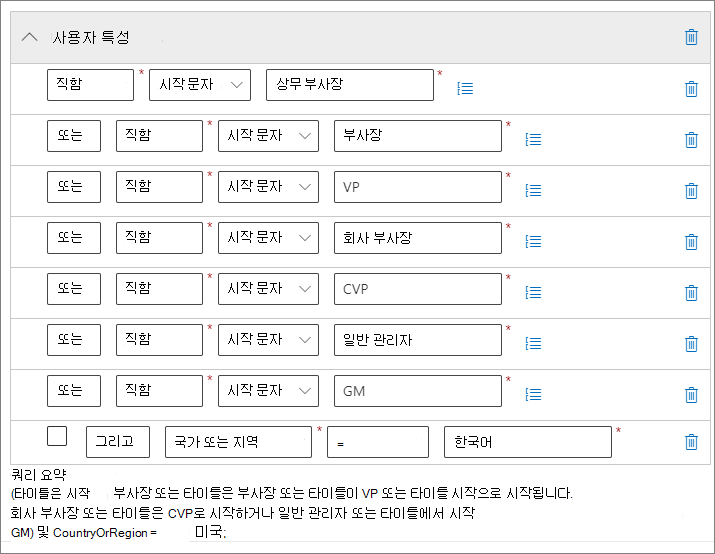
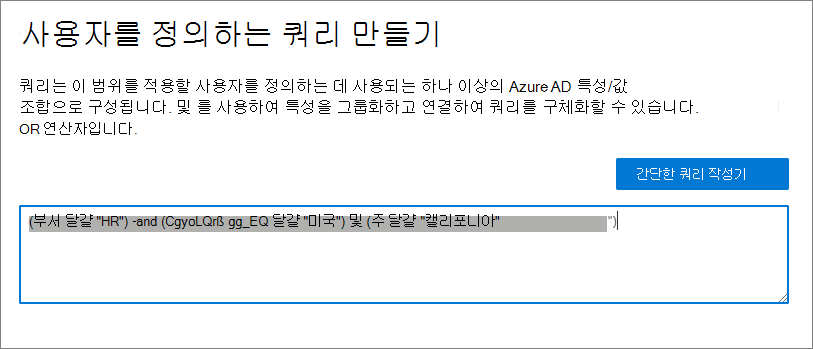
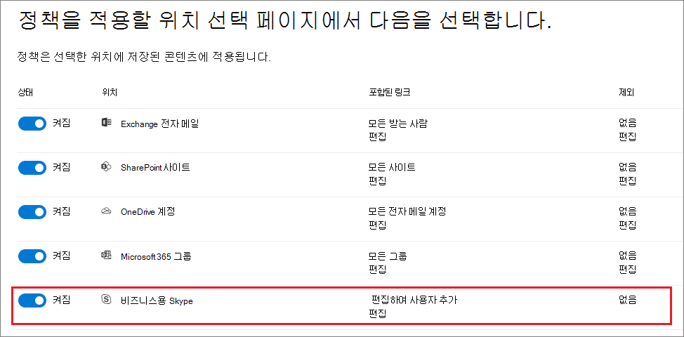

# <a name="common-settings-for-retention-policies-and-retention-label-policies"></a>보존 정책 및 보존 레이블 정책에 대한 공통 설정

>*[보안 및 규정 준수를 위한 Microsoft 365 라이선싱 지침](https://aka.ms/ComplianceSD).*

많은 보존에 대한 설정은 보존 정책과 보존 레이블 정책 모두에 공통적으로 적용됩니다. 다음 정보를 사용하여 사전에 콘텐츠를 보존하거나, 삭제하거나, 보존한 다음 삭제하도록 이 설정을 구성해 보세요.

다음에서 이러한 보존 정책을 지원하는 시나리오를 확인하세요.

- [보존 정책 만들기 및 구성하기](create-retention-policies.md)
- [보존 레이블을 만들고 앱에 적용하기](create-apply-retention-labels.md)
- [보존 레이블을 콘텐츠에 자동으로 적용하기](apply-retention-labels-automatically.md)

각 시나리오와 관련된 설정은 해당 설명서에 설명되어 있습니다.

보존 정책 및 Microsoft 365 보존 작동 방식에 대한 간략한 정보는 [보존 정책 및 보존 레이블에 대한 자세한 내용](retention.md)을 참조하세요.

## <a name="scopes---adaptive-and-static"></a>범위 - 적응형 및 정적

적응형 및 정적 범위에 익숙하지 않은 경우 보존 정책을 구성할 때 어떤 범위를 사용해야 할지 결정하는 데 도움을 받으려면 [보존을 위한 적응형 또는 정적 정책 범위](retention.md#adaptive-or-static-policy-scopes-for-retention)를 확인합니다. 

적응형 또는 정적 범위 중 어떤 범위를 사용할지 결정했다면 다음 정보를 사용하여 구성에 도움을 받습니다.
- [적응형 범위 구성 정보](#configuration-information-for-adaptive-scopes)
- [정적 범위 구성 정보](#configuration-information-for-static-scopes)

> [!TIP]
> 정적 범위를 사용하는 정책이 있는 경우 이를 적응형 범위로 변환하려면 기존 정책은 그대로 두고, 동일한 보존 설정으로 적응형 범위를 사용하는 새 정책을 만듭니다. 정적 범위를 사용하는 이전 정책을 사용하지 않도록 설정하거나 삭제하기 전에 이러한 새 정책이 올바른 사용자, 사이트 및 그룹을 대상으로 하는지 확인합니다.

### <a name="configuration-information-for-adaptive-scopes"></a>적응형 범위 구성 정보

> [!NOTE]
> 새로운 기능인 적응형 범위는 현재 미리 보기로 제공되며 변경될 수 있습니다. 적응형 범위의 대체 옵션인 정적 범위는 적응형 범위가 도입되기 전에 동일한 동작을 제공하며, 적응형 범위가 비즈니스 요구 사항을 충족하지 않는 경우 대신 사용할 수 있습니다.

적응형 범위를 사용하기로 선택하는 경우 원하는 적응형 범위 유형을 선택하라는 메시지가 표시됩니다. 적응형 범위에는 세 가지 유형이 있으며 각 유형은 서로 다른 특성 또는 속성을 지원합니다.

| 적응형 범위 유형 | 지원되는 특성 또는 속성에는 다음이 포함됩니다. |
|:-----|:-----|
|**사용자** - 다음에 적용됩니다.  <br/> - Exchange 전자 메일 <br/> - OneDrive 계정 <br/> - Teams 채팅 <br/> - Teams 비공개 채널 메시지 <br/> - Yammer 사용자 메시지| 이름 <br/> 성 <br/>표시 이름 <br/> 직위 <br/> 부서 <br/> 사무실 <br/>나머지 주소 <br/> 구/군/시 <br/>시/도 <br/>우편 번호 <br/> 국가 또는 지역 <br/> 전자 메일 주소 <br/> 별칭 <br/> Exchange 사용자 지정 특성: CustomAttribute1 - CustomAttribute15|
|**SharePoint** - 다음에 적용됩니다.  <br/> - SharePoint 사이트 <br/> - OneDrive 계정 |사이트 URL <br/>사이트 이름 <br/> SharePoint 사용자 지정 속성: RefinableString00 - RefinableString99 |
|**Microsoft 365 그룹** - 다음에 적용됩니다.  <br/> - Microsoft 365 그룹 <br/> - Teams 채널 메시지 <br/> - Yammer 커뮤니티 메시지 |이름 <br/> 표시 이름 <br/> 설명 <br/> 전자 메일 주소 <br/> 별칭 <br/> Exchange 사용자 지정 특성: CustomAttribute1 - CustomAttribute15 |

사이트의 속성 이름은 SharePoint 사이트 관리되는 속성을 기반으로 하며, 사용자 및 그룹의 특성 이름은 Azure Active Directory 특성에 매핑되는 [필터링 가능한 수신자 속성](/powershell/exchange/recipientfilter-properties#filterable-recipient-properties)을 기반으로 합니다. 예제:

- **별칭** 은 Azure Active Directory 관리 센터에서 **전자 메일** 로 표시되는 **mailNickname** LDAP 이름에 매핑됩니다.
- **전자 메일 주소** 는 Azure Active Directory 관리 센터에서 **프록시 주소** 로 표시되는 LDAP 이름 **proxyAddresses** 에 매핑됩니다.

간단한 쿼리 작성기를 사용하여 적응 범위를 구성할 때 테이블에 나열된 특성 및 속성을 쉽게 지정할 수 있습니다. 추가 특성 및 속성은 다음 섹션에 설명된 대로 고급 쿼리 작성기에서 지원됩니다.

> [!TIP]
> 고급 쿼리 작성기를 사용하는 방법에 대한 자세한 내용은 [적응형 정책 범위를 사용하여 사용자 및 그룹에 대한 고급 쿼리 빌드](https://mipc.eventbuilder.com/event/52683/occurrence/49452/recording?rauth=853.3181650.1f2b6e8b4a05b4441f19b890dfeadcec24c4325e90ac492b7a58eb3045c546ea) 웹 세미나를 참조하세요

단일 보존 정책은 하나 또는 여러 개의 적응형 범위를 가질 수 있습니다.

#### <a name="to-configure-an-adaptive-scope"></a>적응형 범위 구성 방법

적응형 범위를 구성하기 전에 이전 섹션을 사용하여 만들 범위 유형과 사용할 특성 및 값을 식별합니다. 이 정보를 확인하려면 다른 관리자와 협력해야 할 수 있으며, SharePoint 사이트의 경우 속성이 인덱싱되었는지를 확인합니다.

1. [Microsoft 365 규정 준수 센터](https://compliance.microsoft.com/)에서 다음의 위치 중 한 곳으로 이동합니다.
    
    - 레코드 관리를 사용하는 경우:
        - **솔루션** > **레코드 관리** > **적응형 범위** 탭 > + **범위 만들기**
        
    - 레코드 관리를 사용하지 않는 경우:
       - **솔루션** > **정보 거버넌스** > **적응형 범위** 탭 > + **범위 만들기**
    
    탐색 창에 솔루션이 즉시 표시되지 않나요? 먼저 **모두 표시** 를 선택합니다. 

2. 구성에서 표시되는 메시지에 따라 먼저 범위 유형을 선택한 다음 동적 멤버십을 구축하는 데 사용할 특성 또는 속성을 선택하고, 특성 또는 속성 값을 입력합니다.
    
    예를 들어 유럽의 사용자를 식별하는 데 사용할 적응형 범위를 구성하려면 먼저 **사용자** 를 범위 유형으로 선택하고, **나라 또는 지역** 특성을 선택한 다음 **유럽** 을 입력합니다.
    
    
    
    이 쿼리는 하루에 한 번 Azure Active Directory에서 실행되며 계정의 **국가 또는 지역** 속성 값이 **유럽** 으로 지정된 모든 사용자를 식별합니다.
    
    > [!IMPORTANT]
    > 쿼리가 즉시 실행되지 않으므로 값을 올바르게 입력했는지에 대한 유효성 검사는 없습니다.
    
    **특성 추가**(사용자 및 그룹용) 또는 **속성 추가**(사이트용)를 선택하여 해당 범위 유형에 지원되는 특성 또는 속성 조합을 논리 연산자와 함께 사용해 쿼리를 작성합니다. 지원되는 연산자는 **같음**, **같지 않음**, **다음으로 시작** 및 **다음으로 시작하지 않음** 이며, 선택한 특성 또는 속성을 그룹화할 수 있습니다. 예제:
    
    
    
    아니면 **고급 쿼리 작성기** 를 선택하여 자체 쿼리를 지정할 수도 있습니다.
    
    - **사용자** 및 **Microsoft 365 그룹** 범위의 경우 [OPATH 필터링 구문](/powershell/exchange/recipient-filters)을 사용합니다. 예를 들어 부서, 국가 및 주별로 멤버십을 정의하는 사용자 범위를 만들려면 다음을 수행합니다.
    
        
    
    - **SharePoint 사이트** 범위의 경우 KQL(키워드 쿼리 언어)을 사용합니다. 인덱싱된 사이트 속성을 사용하여 SharePoint를 검색하는 데 KQL을 사용하는 데 이미 익숙할 수 있습니다. 이러한 KQL 쿼리를 지정하는 데 도움을 받으려면 [KQL(Keyword Query Language) 구문 참조](/sharepoint/dev/general-development/keyword-query-language-kql-syntax-reference)를 참조하세요.
    
    고급 쿼리 작성기를 사용하여 얻을 수 있는 장점 중 하나는 선택할 수 있는 쿼리 연산자 옵션이 더 광범위하다는 점입니다.
    - **및**
    - **또는**
    - **아님**
    - **eq**(같음)
    - **ne**(같지 않음)
    - **lt**(보다 작음)
    - **gt**(보다 큼)
    - **like**(문자열 비교
    - **notlike**(문자열 비교
    
    범위 구성과 독립적으로 [이러한 고급 쿼리의 유효성을 검사](#validating-advanced-queries)할 수 있습니다.
    
    > [!TIP]
    > 비활성 사서함을 제외하려면 고급 쿼리 작성기를 사용해야 합니다. 반대로 비활성 사서함만 대상으로 지정합니다. 이 구성의 경우 OPATH 속성 *IsInactiveMailbox* 를 사용합니다.
    > 
    > - 비활성 사서함을 제외하려면 쿼리에 다음이 포함되어 있는지 확인합니다. `(IsInactiveMailbox -eq "False")`
    > - 비활성 사서함만 대상으로 지정하려면 다음을 지정합니다. `(IsInactiveMailbox -eq "True")`

3. 필요한 만큼 많이 적응형 범위를 만드세요. 보존 정책을 만들 때 하나 이상의 적응형 범위를 선택할 수 있습니다.

> [!NOTE]
> 쿼리가 완전히 채워지는 데 최대 5일이 걸릴 수 있으며 변경 내용은 즉시 적용되지 않습니다. 이 지연 요소를 감안하여 새로 생성한 범위를 보존 정책에 추가 하기 전에 며칠 정도 기다려 주세요.

적응형 범위의 현재 멤버십 및 멤버십 변경 내용을 확인하려면 다음을 수행합니다.

1. **적응형 범위** 페이지에서 범위를 두 번 클릭(또는 선택 및 Enter 키 누르기)합니다.

2. 플라이아웃 **세부 정보** 창에서 **범위 세부 정보** 를 선택합니다. 
    
    현재 범위에 있는 모든 사용자, 사이트 또는 그룹을 식별하는 정보와 자동으로 추가 또는 제거된 경우 해당 멤버십의 변경 날짜 및 시간을 검토합니다.

> [!TIP]
> [정책 조회](retention.md#policy-lookup) 옵션을 사용하면 특정 사용자, 사이트 및 Microsoft 365 그룹에 현재 할당된 정책을 식별할 수 있습니다.

#### <a name="validating-advanced-queries"></a>고급 쿼리 유효성 검사

PowerShell 및 SharePoint 검색을 사용하여 고급 쿼리의 유효성을 수동으로 검사할 수 있습니다.
- **사용자** 및 **Microsoft 365 그룹** 범위 유형에 PowerShell 사용
- **SharePoint 사이트** 범위 유형에 SharePoint 검색 사용

PowerShell을 사용하여 쿼리를 실행하려면 다음을 수행합니다.

1. 전역 관리자 계정을 사용하여 [PowerShell을 Exchange Online에 연결](/powershell/exchange/connect-to-exchange-online-powershell)합니다.

2. [Get-Recipient](/powershell/module/exchange/get-recipient) 또는 [Get-Mailbox](/powershell/module/exchange/get-mailbox)를 *-Filter* 매개 변수와 사용하여 [OPATH 쿼리](/powershell/exchange/filter-properties)를 지정한 다음, 적응형 범위에 대한 OPATH 쿼리를 큰따옴표로 묶습니다. 특성 값에 스페이스가 포함된 경우 이러한 값을 작은따옴표로 묶습니다.
    
    예제:
    
    ````PowerShell
    Get-Recipient -Filter "Department -eq 'Sales and Marketing'" -ResultSize unlimited
    ````

3. 출력이 적응형 범위의 예상 사용자 또는 그룹과 일치하는지 확인합니다. 그렇지 않은 경우 Azure Active Directory 또는 Exchange의 관련 관리자와 쿼리 및 값을 확인합니다.
 
SharePoint 검색을 사용하여 쿼리를 실행하려면 다음을 수행합니다.

1. 전역 관리자 계정 또는 SharePoint 관리자 역할이 있는 계정을 사용하여 `https://<your_tenant>.sharepoint.com/search`(으)로 이동합니다.

2. 검색 표시줄을 사용하여 KQL 쿼리를 지정합니다.

3. 검색 결과가 적응형 범위에 대한 예상 사이트 URL과 일치하는지 확인합니다. 그렇지 않은 경우 SharePoint의 관련 관리자와 쿼리 및 URL을 확인합니다.

### <a name="configuration-information-for-static-scopes"></a>정적 범위 구성 정보

정적 범위를 사용할 경우 선택한 위치(전체 위치)에 대한 모든 인스턴스에 정책을 적용할지 아니면 특정 인스턴스(특정 포함 또는 제외)를 포함하거나 제외할지 결정해야 합니다.

#### <a name="a-policy-that-applies-to-entire-locations"></a>전체 위치에 적용되는 정책

기본값을 사용하면 사용자가 포함이라고 지정하지 않아도 비즈니스용 Skype를 제외하고 선택한 위치에 대한 모든 인스턴스가 정책에 자동으로 포함됩니다.

예를 들어 **Exchange 전자 메일** 위치에 대해 **모든 수신자** 가 여기 해당합니다. 이 기본 설정을 사용하면 모든 기존 사용자 사서함이 정책에 포함되고, 정책을 적용한 후 만드는 모든 새 사서함은 자동으로 정책을 상속합니다.

#### <a name="a-policy-with-specific-inclusions-or-exclusions"></a>특정 포함 또는 제외가 적용된 정책

선택적 구성을 사용하여 보존 설정의 범위를 특정 사용자, 특정 Microsoft 365 그룹 또는 특정 사이트로 지정하는 경우 정책별로 알아야 할 몇 가지 제한이 있습니다. 자세한 내용은 [보존 정책 및 보존 레이블 정책 제한](retention-limits.md)을 참조하세요. 

선택적 구성을 사용하여 보존 설정의 범위를 지정하려면 해당 위치의 **상태** 가 **켜짐** 인지 확인한 후 링크를 사용하여 특정 사용자, Microsoft 365 그룹 또는 사이트를 포함하거나 배제하면 됩니다.

> [!WARNING]
> 마지막 항목을 포함했다가 제거하도록 인스턴스를 구성하면 해당 위치의 구성이 **모두** 로 되돌아갑니다.  정책을 저장하기 전에 원하는 구성인지 확인합니다.
>
> 예를 들어 데이터를 삭제하도록 구성된 보존 정책에 포함할 SharePoint 사이트 하나를 지정한 다음 단일 사이트를 제거하면 기본적으로 모든 SharePoint 사이트는 데이터를 영구적으로 삭제하는 보존 정책의 적용을 받습니다. Exchange 수신자, OneDrive 계정, Teams 채팅 사용자 등에 대한 포함의 경우도 마찬가지입니다.
>
> 이 시나리오에서 위치에 대한 **모두** 설정을 보존 정책의 적용을 받지 않으려면 위치를 해제합니다. 아니면 정책에서 제외할 제외 인스턴스를 지정합니다.

## <a name="locations"></a>위치

보존 정책의 위치는 Exchange 전자 메일 및 SharePoint 사이트와 같은 보존 설정을 지원하는 특정 Microsoft 365 서비스를 식별합니다. 정책에 대해 선택할 때 알고 있어야 하는 구성 세부 정보 및 가능한 예외가 있는 위치에 대해서는 다음 섹션을 참조하세요.

### <a name="configuration-information-for-exchange-email-and-exchange-public-folders"></a>Exchange 전자 메일 및 Exchange 공용 폴더에 대한 구성 정보

**Exchange 이메일** 위치는 사서함 수준에서 보존 설정을 적용하여 사용자의 이메일, 캘린더 및 기타 사서함 항목에 대한 보존을 지원합니다. 공유 사서함도 지원됩니다.

리소스 사서함, 연락처 및 Microsoft 365 그룹 사서함은 Exchange 전자 메일에 지원되지 않습니다. Microsoft 365 그룹 사서함의 경우 대신 **Microsoft 365 그룹** 위치를 선택합니다.

정책 구성에 따라 [비활성 사서함](create-and-manage-inactive-mailboxes.md)에는 다음이 포함되거나 포함되지 않을 수 있습니다.

- 기본 **모든 받는 사람** 구성을 사용하는 경우 정적 정책 범위에는 비활성 사서함이 포함되지만 [특정 포함 또는 제외](#a-policy-with-specific-inclusions-or-exclusions)에 대해서는 지원되지 않습니다. 그러나 정책이 적용될 때 활성 사서함이 있는 받는 사람을 포함하거나 제외하고 나중에 사서함이 비활성화되면 보존 설정이 계속 적용되거나 제외됩니다.

- 적응형 정책 범위는 기본적으로 범위의 쿼리를 충족하는 비활성 사서함을 포함합니다. 고급 쿼리 작성기 및 OPATH 속성 *IsInactiveMailbox* 를 사용하여 이 해당 항목을 제외할 수 있습니다.
    
    ```console
    (IsInactiveMailbox -eq "False")
    ```

정적 정책 범위를 사용하고 포함하거나 제외할 받는 사람을 선택하는 경우 메일 그룹 및 전자 메일 사용 보안 그룹을 선택하여 여러 받는 사람을 하나씩 선택하는 대신 효율적으로 선택할 수 있습니다.. 이 옵션을 사용하는 경우 이러한 그룹은 백그라운드에서 구성 시 자동으로 확장하여 그룹에 있는 사용자 사서함을 선택합니다. 나중에 해당 그룹의 구성원이 변경되면 적응형 정책 범위와 달리 기존 보존 정책이 자동으로 업데이트되지 않습니다.

Exchange에 대한 보존 설정을 구성할 때 포함 및 제외되는 사서함 항목에 대한 자세한 내용은 [보존 및 삭제에 포함된 항목](retention-policies-exchange.md#whats-included-for-retention-and-deletion)을 참조하세요.

**Exchange 공용 폴더** 위치는 보존 설정을 모든 공용 폴더에 적용하며 폴더 또는 사서함 수준에서 적용될 수 없습니다.

#### <a name="exceptions-for-auto-apply-policies-configured-for-sensitive-information-types"></a>중요한 정보 유형에 구성된 자동 적용 정책에 대한 예외

중요한 정보 유형을 사용하는 자동 적용 정책을 구성하고 **Exchange 전자 메일** 위치를 선택하는 경우:

- Microsoft 365 사서함이 포함됩니다.

- 특정 사서함을 식별하도록 적응형 범위를 구성하더라도 모든 사서함이 자동으로 포함됩니다. 정적 정책 범위를 선택한 경우 포함하거나 제외할 수신자를 지정할 수 없습니다.

### <a name="configuration-information-for-sharepoint-sites-and-onedrive-accounts"></a>SharePoint 사이트 및 OneDrive 계정에 대한 구성 정보

**SharePoint 사이트** 위치를 선택하면 보존 정책이 SharePoint 커뮤니케이션 사이트, Microsoft 365 그룹에서 연결하지 않은 팀 사이트, 클래식 사이트에서 문서를 보존하고 삭제할 수 있습니다. [적응형 정책 범위](#exceptions-for-adaptive-policy-scopes)를 사용하지 않는 한 Microsoft 365 그룹에서 연결된 팀 사이트는 이 옵션으로 지원되지 않으며 대신 해당 그룹의 사서함, 사이트 및 파일에 있는 콘텐츠에 적용되는 **Microsoft 365 그룹** 위치를 사용합니다.

SharePoint 및 OneDrive에 대한 보존 설정을 구성할 때 포함되고 제외되는 항목에 대한 자세한 내용은 [보존 및 삭제에 포함되는 항목](retention-policies-sharepoint.md#whats-included-for-retention-and-deletion)을 참조하세요. 

SharePoint 사이트 또는 OneDrive 계정 위치를 지정하는 경우 사이트에 액세스할 수 있는 권한이 필요하지 않습니다. 정적 범위의 경우 **위치 편집** 페이지에서 URL을 지정할 때 유효성 검사를 수행하지 않습니다. 그러나 사용자가 지정하는 SharePoint 사이트는 구성의 마지막 페이지에서 존재 여부를 확인합니다. 이 검사가 실패하면 입력한 URL에 대한 유효성 검사에 실패했다는 메시지가 표시되고 유효성 검사를 통과할 때까지 보존 정책을 만들 수 없습니다. 이 메시지가 표시되면 구성 프로세스로 돌아가서 URL을 변경하거나 보존 정책에서 해당 사이트를 제거합니다.

개별 OneDrive 계정을 지정하려면 [조직의 모든 사용자 OneDrive URL 목록 가져오기](/onedrive/list-onedrive-urls)를 참조하세요.

> [!NOTE]
> 개별 OneDrive 계정을 지정할 때 OneDrive 계정이 [사전 프로비전](/onedrive/pre-provision-accounts)되어 있지 않으면 사용자가 OneDrive에 처음 액세스할 때까지 URL이 생성되지 않는다는 점에 유의하세요.
> 
> 또한 사용자의 UPN이 변경되면 OneDrive URL이 [자동적으로 변경](/onedrive/upn-changes)됩니다. 예를 들어, 이름 변경 이벤트(예: 결혼)입니다. 또는 조직의 이름 바꾸기 또는 비즈니스 재구성을 지원하기 위해 도메인 이름을 변경합니다. UPN이 변경되면 보존 설정에 지정한 OneDrive URL을 업데이트해야 합니다.
> 
> 정적 범위를 포함하거나 제외하기 위해 개별 사용자가 URL을 확실하게 지정해야 하는 어려움 때문에 **사용자** 범위 유형을 사용하는 [적응형 범위](retention.md#adaptive-or-static-policy-scopes-for-retention)가 이 목적에는 더 적합합니다.

#### <a name="exceptions-for-adaptive-policy-scopes"></a>적응형 정책 범위에 대한 예외

적응형 정책 범위를 사용하는 보존 정책을 구성하고 **SharePoint 사이트** 위치를 선택하는 경우:

- OneDrive 사이트 및 Microsoft 365 그룹 ​​연결 사이트는 SharePoint 커뮤니케이션 사이트, Microsoft 365 그룹으로 연결되지 않은 팀 사이트 및 클래식 사이트 외에 포함됩니다.

### <a name="configuration-information-for-microsoft-365-groups"></a>Microsoft 365 그룹에 대한 구성 정보

Microsoft 365 그룹(이전의 Office 365 그룹)의 콘텐츠를 보존하거나 삭제하려면 **Microsoft 365 그룹** 위치를 사용합니다. 이 위치에는 그룹 사서함과 SharePoint 팀 사이트가 포함됩니다.

> [!NOTE]
> Microsoft 365 그룹에 Exchange 사서함이 있더라도 **Exchange 전자 메일** 위치에 대한 보존 정책은 Microsoft 365 그룹 사서함의 콘텐츠를 포함하지 않습니다. 

정적 범위를 사용하는 경우: 처음에는 정적 범위에 대한 **Exchange 전자 메일** 위치를 사용하여 그룹 사서함을 포함하거나 제외할 수 있지만, 보존 정책을 저장하려고 할 때 "RemoteGroupMailbox"가 Exchange 위치에 대해 올바른 선택이 아니라는 오류가 표시됩니다.

Microsoft 365 그룹에 적용되는 보존 정책에는 그룹 사서함 및 SharePoint Teams 사이트가 기본값으로 포함됩니다. SharePoint Teams 사이트에 저장된 파일은 이 위치에 포함되지만 Teams 대화 또는 Teams 채널 메시지가 고유한 보존 정책 위치를 가지지 않습니다.

보존 정책을 Microsoft 365 사서함에만 적용되거나 연결된 SharePoint 팀 사이트에만 적용하기 위해 기본값을 변경하려면 [Set-RetentionCompliancePolicy](/powershell/module/exchange/set-retentioncompliancepolicy) PowerShell cmdlet을 *Applications* 매개 변수와 함께 사용합니다.

- 그룹과 연결된 Microsoft 365 사서함의 경우`Group:Exchange`
- 그룹과 연결된 SharePoint 사이트의 경우 `Group:SharePoint`

선택한 Microsoft 365 그룹이 사서함과 SharePoint 사이트의 기본값으로 돌아가기 위해 `Group:Exchange,SharePoint`를 지정하세요.

#### <a name="exceptions-for-auto-apply-policies-configured-for-sensitive-information-types"></a>중요한 정보 유형에 구성된 자동 적용 정책에 대한 예외

중요한 정보 유형을 사용하는 자동 적용 정책을 구성하고 **Microsoft 365 그룹** 위치를 선택하는 경우:

- Microsoft 365 사서함이 포함되지 않습니다. 정책에 이러한 사서함을 포함하려면 **Exchange 전자 메일** 위치를 대신 선택합니다.

#### <a name="what-happens-if-a-microsoft-365-group-is-deleted-after-a-policy-is-applied"></a>정책이 적용된 후 Microsoft 365 그룹이 삭제되면 어떻게 되나요?

Microsoft 365 그룹에 보존 정책을 적용한 후 해당 그룹이 Azure Active Directory에서 삭제됩니다.

- 그룹 연결 SharePoint 사이트는 보존되며 **Microsoft 365 그룹** ​​위치의 보존 정책에 의해 계속 관리됩니다. 그룹이 삭제되기 전에 사이트에 액세스할 수 있었던 사용자는 사이트에 계속 액세스할 수 있으며 이제 모든 새 권한은 SharePoint를 통해 관리해야 합니다.
    
    이 시점에서는 삭제된 그룹을 지정할 수 없기 때문에 Microsoft 365 그룹 ​​위치에서 사이트를 제외할 수 없습니다. 이 사이트에서 보존 정책을 해제해야 하는 경우 Microsoft 지원에 문의하세요. 예를 들어 [Microsoft 365 관리 센터에서 서비스 요청](https://admin.microsoft.com/Adminportal/Home#/support)을 엽니다.

- 삭제된 그룹의 사서함은 비활성화되고 SharePoint 사이트와 마찬가지로 보존 설정이 적용됩니다. 자세한 내용은 [Exchange Online에서 비활성 사서함](inactive-mailboxes-in-office-365.md)을 참조하세요.

### <a name="configuration-information-for-skype-for-business"></a>비즈니스용 Skype에 대한 구성 정보

Exchange 전자 메일과 달리, Skype 위치의 상태는 간단히 설정으로 전환하여 모든 사용자를 자동으로 포함할 수 없습니다. 그렇지만 해당 위치를 켜면 해당 대화를 보존하려는 사용자를 수동으로 선택할 수 있습니다.



이 **편집** 옵션을 선택한 후 **비즈니스용 Skype** 창에서 **이름** 열 앞에 숨겨진 상자를 선택하여 모든 사용자를 빠르게 포함할 수 있습니다. 그러나 각 사용자가 정책의 특정 포함사항으로 간주된다는 점을 이해해야 합니다. 따라서 이 상자를 선택하여 1,000명의 사용자를 포함하는 경우, 포함할 1,000명의 사용자를 수동으로 선택한 것과 같으며 이는 비즈니스용 Skype에 대해 지원되는 최대를 선택하는 것과 같습니다.

Outlook의 폴더인 **대화 기록** 은 Skype 보관과는 아무 관계가 없는 기능입니다. **대화 기록** 은 최종 사용자가 사용하지 않도록 설정할 수 있지만 Skype 보관은 사용자가 액세스할 수 없고 eDiscovery에서만 사용할 수 있는 숨겨진 폴더에 Skype 대화 사본을 저장하여 수행됩니다.

## <a name="settings-for-retaining-and-deleting-content"></a>콘텐츠를 보존 및 삭제하기 위한 설정

콘텐츠를 보존하고 삭제하기 위한 설정을 선택하면 보존 정책이 다음 지정된 기간 구성 중 하나를 가지게 됩니다.

- 보존 전용

    이 구성에서는 **특정 기간에 대한 항목을 보존** 을 선택하고 **보존 기간의 종료 시, 아무 작업도 수행하지 않습니다**. 또는 **항목을 영구적으로 보존** 을 선택합니다.

- 보존 후 삭제

    이 구성에서는 **특정 기간에 대한 항목을 보존** 을 선택하고 **보존 기간의 종료 시, 항목을 자동으로 삭제합니다**.

- 삭제 전용

    이 구성에서는 **특정 기간에 도달했을 때만 항목 삭제** 를 선택합니다.

### <a name="retaining-content-for-a-specific-period-of-time"></a>특정 기간 동안 콘텐츠 보존

콘텐츠를 보존하도록 보존 레이블 또는 정책을 구성할 때 특정 기간(일, 월 또는 년) 동안 항목을 보존하도록 선택합니다. 또는 항목이 영구적으로 보존됩니다. 보존 기간은 정책이 할당된 시간부터 계산되지 않고 지정된 보존 기간의 시작에 따라 계산됩니다.

보존 기간이 시작되는 경우, 또한 콘텐츠가 언제 만들어졌는지 또는 콘텐츠가 마지막으로 수정된 경우에는 파일 및 SharePoint, OneDrive 및 Microsoft 365 위치에 대해서만 지원되었는지의 경우를 선택할 수 있습니다. 보존 레이블의 경우 레이블이 지정된 콘텐츠와 이벤트가 발생할 때 보존 기간을 시작할 수 있습니다.

예제:

- SharePoint: 내용을 마지막으로 수정한 후 7년 동안 사이트 모음에 항목을 보관하고 해당 사이트 모음에 있는 문서가 6년 동안 수정되지 않은 경우, 문서가 수정되지 않은 경우, 문서는 1년 더만 보존됩니다. 문서를 다시 편집할 경우, 문서의 연령이 새로운 마지막 수정 날짜로부터 계산되며, 7년 더 유지됩니다.

- Exchange: 7년 동안 우편함에 항목을 보관하고 6년 전에 메시지가 발송된 경우 메시지는 1년 동안만 유지됩니다. Exchange 항목의 경우 기간은 수신 전자 메일에 대해 수신된 날짜 또는 송신 전자 메일에 대해 전송된 날짜를 기준으로 합니다. 마지막으로 수정한 시점을 기준으로 항목을 유지하면 OneDrive 및 SharePoint의 사이트 컨텐츠에만 적용됩니다.

보존 기간이 끝나면 콘텐츠를 영구적으로 삭제할지 여부를 선택합니다.


### <a name="deleting-content-thats-older-than-a-specific-age"></a>특정 사용 기간보다 오래된 콘텐츠 삭제

보존 정책은 항목을 보존한 다음 삭제하거나, 보존하지 않고 이전 항목을 삭제할 수 있습니다.

두 경우 모두 정책에서 항목을 삭제하는 경우 지정한 기간은 정책이 할당된 시간부터 계산되지 않고 지정된 보존 기간의 시작에 따라 계산된다는 점을 이해하는 것이 중요합니다. 예를 들어 항목이 만들어지거나 수정되었거나 레이블이 지정된 시점부터입니다.

따라서 먼저 기존 콘텐츠의 사용 기간과 정책이 해당 콘텐츠에 미칠 수 있는 영향을 고려합니다. 또한 정책을 할당하기 전에 사용자에게 새 정책에 대한 정보를 전달하여 어떤 영향이 발생할 수 있는지를 가늠할 시간을 제공할 수도 있습니다.

### <a name="a-policy-that-applies-to-entire-locations"></a>전체 위치에 적용되는 정책

위치를 선택하는 경우 비즈니스용 Skype를 제외하고, 위치의 상태가 **On** 인 경우, 기본 설정은 **모두** 가 됩니다.

보존 정책이 전체 위치의 조합에 적용되는 경우, 정책에 포함할 수 있는 수혜자, 사이트, 계정, 그룹 등의 수에 제한이 없습니다.

예를 들어 정책에 모든 Exchange 전자 메일과 모든 SharePoint 사이트가 포함된 경우 개수에 상관없이 모든 사이트와 수신자가 포함됩니다. 또한 Exchange의 경우 정책이 적용된 후 생성된 새 편지함이 정책을 자동으로 상속합니다.

### <a name="a-policy-with-specific-inclusions-or-exclusions"></a>특정 포함 또는 제외가 적용된 정책

선택적 구성을 사용하여 보존 설정의 범위를 특정 사용자, 특정 Microsoft 365 그룹 또는 특정 사이트로 지정하는 경우 정책별로 알아야 할 몇 가지 제한이 있습니다. 자세한 내용은 [보존 정책 및 보존 레이블 정책 제한](retention-limits.md)을 참조하세요. 

선택적 구성을 사용하여 보존 설정의 범위를 지정하려면 해당 위치의 **상태** 가 **켜짐** 인지 확인한 후 링크를 사용하여 특정 사용자, Microsoft 365 그룹 또는 사이트를 포함하거나 배제하면 됩니다.

> [!WARNING]
> 마지막 구성을 포함했다가 제거하면 해당 위치에 대해 **모두** 로 되돌아갑니다.  정책을 저장하기 전에 원하는 구성인지 확인합니다.
>
> 예를 들어 데이터를 삭제하도록 구성된 보존 정책에 포함할 SharePoint 사이트 하나를 지정한 다음 단일 사이트를 제거하면 기본적으로 모든 SharePoint 사이트는 데이터를 영구적으로 삭제하는 보존 정책의 적용을 받습니다. Exchange 수신인, OneDrive 계정, 팀 채팅 사용자 등의 경우에도 마찬가지
>
> 이 시나리오에서 위치에 대한 **모두** 설정을 보존 정책의 적용을 받지 않으려면 위치를 해제합니다. 또는 정책에서 제외할 제외 항목을 지정합니다.

## <a name="updating-policies-for-retention"></a>보존 정책 업데이트

보존 정책을 만들고 저장한 후에는 다음과 같은 일부 설정을 변경할 수 없습니다.
- 정책 이름 및 보존 기간과 보존 기간을 시작할 시기를 제외한 보존 설정

보존 정책을 편집하고 항목이 보존 정책의 원래 설정에 이미 적용되어 있는 경우 업데이트된 설정은 새로 식별된 항목 외에 이 항목에도 자동으로 적용됩니다.

일반적으로 이 업데이트는 아주 간단하지만 며칠이 걸릴 수 있습니다. Microsoft 365 위치에서 정책 복제가 완료되면 Microsoft 365 준수 센터의 보존 정책 상태가 **켜기(보류)** 에서 **켜기(성공)** 으로 변경됩니다.

## <a name="locking-the-policy-to-prevent-changes"></a>변경 방지를 위한 정책 잠금

아무도 정책을 끄거나, 삭제하거나, 제한 수준을 낮출 수 없도록 하려면, [보존 정책 및 보존 레이블 정책 변경을 제한하기 위한 보존 잠금 사용](retention-preservation-lock.md)을 참조하세요.
