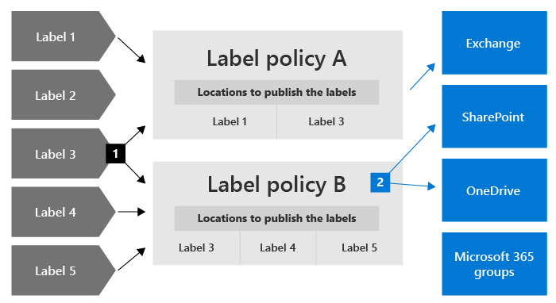
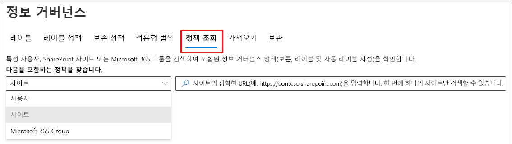
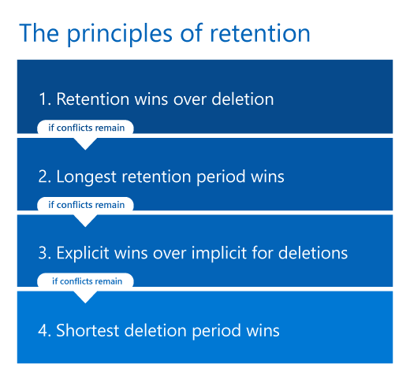

# 보존 정책 및 보존 레이블에 대해 자세히 알아보기

>*[보안 및 규정 준수를 위한 Microsoft 365 라이선싱 지침](/office365/servicedescriptions/microsoft-365-service-descriptions/microsoft-365-tenantlevel-services-licensing-guidance/microsoft-365-security-compliance-licensing-guidance)*

> [!NOTE]
> Teams에서 보존 정책에 대한 메시지가 표시되거나 앱의 보존 레이블에 대한 질문이 있는 경우 IT 부서에 문의하여 구성 방법에 대한 정보를 확인하세요. 그동안에는 다음 문서가 도움이 될 수 있습니다.
> -  [보존 정책에 대한 Teams 메시지](https://support.microsoft.com/office/teams-messages-about-retention-policies-c151fa2f-1558-4cf9-8e51-854e925b483b)
> - [SharePoint 또는 OneDrive의 파일에 보존 레이블 적용](https://support.microsoft.com/office/apply-retention-labels-to-files-in-sharepoint-or-onedrive-11a6835b-ec9f-40db-8aca-6f5ef18132df)
>
> 이 페이지의 정보는 규정 준수를 위해 보존 정책 및 보존 레이블을 생성할 수 있는 IT 관리자를 위한 것입니다.

대부분의 조직에서는 전자 메일, 문서, 인스턴트 메시지 등을 비롯하여 데이터의 양과 복잡성이 계속해서 매일 증가하고 있습니다. 이러한 정보를 효과적으로 관리하거나 제어하는 일은 다음 작업을 수행해야 하므로 중요합니다.

- 최소 기간 동안 콘텐츠를 보존하도록 요구하는 **산업 규정 및 내부 정책을 사전에 준수** 합니다. 예를 들어 Sarbanes-Oxley Act는 7년 동안 특정 유형의 콘텐츠를 보존하도록 요구할 수 있습니다.

- **소송 또는 보안 위반 시 위험 감소** - 더 이상 보존할 필요가 없는 오래된 콘텐츠를 영구적으로 삭제

- **조직에서 효과적이면서 좀 더 민첩하게 지식을 공유하도록 지원** - 사용자가 관련이 있는 최신 콘텐츠만 사용하도록 합니다.

사용자가 구성한 보존 설정은 이러한 목표를 달성하는 데 도움이 될 수 있습니다. 콘텐츠 관리에는 일반적으로 다음과 같은 두 가지 작업이 요구됩니다.

| 작업| 용도 |
|:-----|:-----|
|콘텐츠 보존 | 영구 삭제 방지 및 eDiscovery에 계속 사용 가능 |
|콘텐츠 삭제 | 조직에서 콘텐츠를 영구적으로 삭제|

이러한 두 가지 보존 작업을 통해 다음 결과에 대한 보존 설정을 구성할 수 있습니다.

- 보존 전용: 콘텐츠를 영구적으로 또는 지정된 기간 동안 보존합니다.
- 삭제 전용: 지정된 기간이 지난 후 콘텐츠를 영구적으로 삭제합니다.
- 보존한 다음 삭제: 지정된 기간 동안 콘텐츠를 보존한 다음 영구적으로 삭제합니다.

이러한 보존 설정은 규정 준수를 이유로 콘텐츠를 보존해야 할 때 추가 저장소를 만들고 구성하는 추가 오버헤드를 절약하는 콘텐츠와 함께 작동합니다. 또한 이 데이터를 복사 및 동기화하기 위해 사용자 지정된 프로세스를 구현할 필요가 없습니다.

다음 섹션에서는 보존 정책 및 보존 레이블의 작동 방식, 사용 시기, 상호 보완 방법에 대해 자세히 알아봅니다. 그러나 몇 가지 일반적인 시나리오에 대한 보존 설정을 시작하고 배포할 준비가 되었으면 [보유 정책 및 보존 레이블 시작](get-started-with-retention.md)을 참조하세요.

## 보존 설정이 콘텐츠와 함께 작동하는 방법

콘텐츠에 할당된 보존 설정이 있는 경우 해당 콘텐츠는 원래 위치에 유지됩니다. 대부분의 경우 사용자는 문서 또는 메일을 변경하지 않은 것처럼 계속 작업할 수 있습니다. 그러나 보존 정책에 포함된 내용을 편집하거나 삭제하면 콘텐츠의 복사본이 자동으로 유지됩니다.
  
- SharePoint 및 OneDrive 사이트의 경우: 사본은 **자료 보존** 라이브러리에 보존됩니다.

- Exchange 사서함의 경우: **복구 가능한 항목** 폴더에 사본이 보존됩니다. 

- Teams 및 채널 및 Yammer 메시지의 경우: 사본은 Exchange **복구 가능한 항목** 폴더 내에 하위 폴더로 **SubstrateHolds** 라는 이름의 숨겨진 폴더에 보존됩니다.

> [!NOTE]
> 자료 보존 라이브러리에 사이트의 저장소 할당량이 포함되므로 SharePoint와 Microsoft 365 그룹에 보존 설정을 사용할 때 저장소를 늘려야 할 수 있습니다.
> 
대부분의 사용자는 해당 보안 위치와 보존된 콘텐츠를 볼 수 없습니다. 대부분의 경우 사용자는 해당 콘텐츠에 보존 설정이 적용되어 있다는 사실을 알 필요도 없습니다.

다양한 워크로드에 대해 보존 설정이 작동하는 방법에 대한 자세한 내용은 다음의 문서를 참조하세요.

- [SharePoint 및 OneDrive의 보존에 대해 자세히 알아보기](retention-policies-sharepoint.md)
- [Microsoft Teams의 보존에 대해 자세히 알아보기](retention-policies-teams.md)
- [Yammer의 보존에 대한 자세한 정보](retention-policies-yammer.md)
- [Exchange의 보존에 대해 자세히 알아보기](retention-policies-exchange.md)

## 보존 정책 및 보존 레이블

보존 설정을 콘텐츠에 할당하려면 **레이블 정책과 함께 보존 정책** 및 **보존 레이블** 을 사용합니다. 이러한 방법 중 하나만 사용하거나 여러 가지를 결합할 수 있습니다.

보존 정책을 사용하여 사이트 또는 사서함 수준에서 콘텐츠에 대해 같은 보존 설정을 할당하고, 보존 레이블을 사용하여 항목 수준(폴더, 문서, 전자 메일)에 보존 설정을 지정합니다.

예를 들어 SharePoint 사이트의 모든 문서를 5년 동안 보존해야 하면, 해당 사이트의 모든 문서에 동일한 보존 레이블을 적용하는 것보다 보존 정책을 사용하여 이 작업을 수행하는 것이 더욱 효율적입니다. 하지만 해당 사이트의 일부 문서는 5년 동안 보존해야 하고 다른 문서는 10년 동안 보존해야 할 때는 보존 정책으로 이 작업을 수행할 수 없습니다. 항목 수준에서 보존 설정을 지정해야 하는 경우에는 보존 레이블을 사용합니다. 

보존 정책과 다르게 보존 레이블의 보존 설정은 콘텐츠가 Microsoft 365 테넌트 내에서 다른 위치로 이동되는 경우에 함께 이동됩니다. 또한, 보존 레이블에는 보존 정책에서는 지원되지 않는 다음과 같은 기능이 있습니다. 
 
- 콘텐츠의 기간 또는 콘텐츠가 마지막으로 수정된 시간 외에도 콘텐츠에 레이블이 지정된 시간으로부터 또는 이벤트를 기반으로 보존 기간을 시작하는 옵션이 있습니다.

- [학습 가능한 분류자](classifier-learn-about.md)를 사용하여 콘텐츠를 레이블로 식별합니다.

- SharePoint 문서에 대해 기본 레이블을 적용합니다.

- 콘텐츠를 영구적으로 삭제하기 전에 검토할 수 있는 [처리 검토](./disposition.md) 를 지원합니다.

- 콘텐츠를 레이블 설정의 일부로 [레코드](records-management.md#records)로 표시하고, 보관 기간이 끝나 콘텐츠가 삭제된 경우 항상  [처리 증명](disposition.md#disposition-of-records) 이 있습니다.

### 보존 정책

보존 정책은 다음 위치에 적용할 수 있습니다.
- Exchange 전자 메일
- SharePoint 사이트
- OneDrive 계정
- Microsoft 365 그룹
- 비즈니스용 Skype
- Exchange 공용 폴더
- Teams 채널 메시지
- Teams 채팅
- Teams 비공개 채널 메시지
- Yammer 커뮤니티 메시지
- Yammer 사용자 메시지

단일 정책을 여러 위치 또는 특정 위치 또는 사용자에게 효율적으로 적용할 수 있습니다.

보존 기간이 시작되는 경우 또한 콘텐츠를 언제 만들어졌을지 또는 콘텐츠가 마지막으로 수정된 경우에는 파일 및 SharePoint, OneDrive 및 Microsoft 365 그룹 위치에 대해서만 지원되었는지의 경우를 선택할 수도 있습니다.

항목은 보존 정책에 지정된 컨테이너의 보존 설정을 상속합니다. 해당 정책이 콘텐츠를 보존하도록 구성될 때 항목이 컨테이너 외부로 이동되는 경우 해당 항목의 사본은 작업의 보안 위치에 유지됩니다. 그러나 보존 설정은 새 위치의 콘텐츠와 함께 이동되지 않습니다. 필요한 경우 보존 정책 대신 보존 레이블을 사용합니다.

### 보존 레이블

다른 보존 설정이 있어야 하는 다양한 유형의 콘텐츠에는 보존 레이블을 사용합니다. 예제:
  
- 최소 기간 동안 보존해야 하는 세금 양식 
    
- 특정 기간에 도달하면 영구적으로 삭제되어야 하는 보도 자료 
    
- 특정 기간 동안 보존되었다가 영구적으로 삭제되어야 하는 경쟁 연구 자료 
    
- 편집하거나 삭제할 수 없게 레코드로 표시해야 하는 취업 비자 
    
이 모든 경우 보존 레이블을 사용하여 항목 수준(문서 또는 전자 메일)에서 거버넌스 제어에 대한 보존 설정을 적용할 수 있습니다.
  
보존 레이블을 사용하여 다음을 수행할 수 있습니다.
  
- Outlook, 웹용 Outlook, OneDrive, SharePoint 및 Microsoft 365 그룹의 콘텐츠에 **조직의 사용자가 수동으로 보존 레이블을 적용할 수 있도록 합니다**. 대개 사용자가 자신이 작업 중인 콘텐츠의 유형을 가장 잘 알고 있으므로 사용자가 콘텐츠를 분류하고 적절한 보존 설정이 적용되도록 할 수 있습니다. 
    
- 이메일 또는 팀에서 공유되는 클라우드 첨부 파일을 포함하는 특정 조건과 일치하거나 콘텐츠에 다음이 포함된 경우 **콘텐츠에 자동으로 보존 레이블을 적용합니다**. 
    - 특정 중요한 정보 유형
    - 만든 쿼리와 일치하는 특정 키워드
    - 학습 가능한 분류자에 대한 패턴 일치

- **콘텐츠에 레이블이 지정된 시점부터 보존 기간 시작**(SharePoint 사이트 및 OneDrive 계정의 문서, 전자 메일 항목)

- **이벤트가 발생할 때 보존 기간 시작**(예: 직원 퇴사, 계약 만료)

- SharePoint의 **문서 라이브러리, 폴더 또는 문서 집합에 기본 보존 레이블을 적용** 하여 해당 위치에 저장된 모든 문서가 기본 보존 레이블을 상속하도록 합니다.

또한, 보존 레이블은 Microsoft 365 앱과 서비스에서 전자 메일 및 문서의 [레코드 관리](records-management.md)를 지원합니다. 보존 레이블을 사용하여 항목을 기록으로 표시할 수 있습니다. 이 문제가 발생하고 콘텐츠가 Microsoft 365에 남아 있는 경우 레이블은 규정상의 이유로 필요할 수 있는 콘텐츠에 대한 제한을 마련합니다. 자세한 내용은 [허용 또는 차단되는 작업에 대한 제한 사항 비교](records-management.md#compare-restrictions-for-what-actions-are-allowed-or-blocked)를 참조하세요.

보존 레이블은 [민감도 레이블](sensitivity-labels.md)과 달리 Microsoft 365 외부로 콘텐츠를 이동해도 유지되지 않습니다.

#### 작업을 적용하지 않고 콘텐츠 분류하기

보존 레이블의 주요 용도는 콘텐츠를 보존하거나 삭제하는 것이지만, 보존 또는 기타 작업을 설정하지 않고 보존 레이블을 사용할 수도 있습니다. 이 경우 작업을 적용하지 않고 보존 레이블을 단순히 텍스트 레이블로 사용할 수 있습니다.
  
예를 들어 작업이 없는 "나중에 검토"라는 보존 레이블을 만들고 적용한 다음 해당 레이블을 사용하여 나중에 해당 콘텐츠를 찾을 수 있습니다.
  

#### 보존 레이블을 DLP 정책의 조건으로 사용하기

SharePoint의 문서에 대한 DLP(데이터 손실 방지) 정책에서 보존 레이블을 조건으로 지정할 수 있습니다. 예를 들어 문서에 지정된 보존 레이블이 적용된 경우, 문서를 조직 외부에 공유하지 못하도록 DLP 정책을 구성합니다.

자세한 내용은 [보존 레이블을 DLP 정책의 조건으로 사용하기](data-loss-prevention-policies.md#using-a-retention-label-as-a-condition-in-a-dlp-policy)를 참조하세요.

#### 보존 레이블과 보존 레이블을 적용하는 정책 

보존 레이블을 게시하면 관리자 및 사용자가 콘텐츠에 적용할 수 있게 해주는 **보존 레이블 정책** 에 포함됩니다. 다음 다이어그램에서 보이는 것과 같습니다.

1. 단일 보존 레이블이 여러 보존 레이블 정책에 포함될 수 있습니다.

2. 보존 레이블 정책이 보존 레이블을 게시할 위치를 지정합니다. 동일한 위치가 여러 보존 레이블 정책에 포함될 수 있습니다.

또한 단일 보존 레이블을 사용하여 하나 이상의 **보존 레이블 자동 적용 정책** 을 만들 수 있습니다. 이 정책을 사용하면 정책에서 지정하는 조건이 충족될 경우 보존 레이블이 자동으로 적용됩니다.

#### 보존 레이블 정책 및 위치

보존 레이블이 수행하는 작업에 따라, 보존 레이블을 여러 다른 위치에 게시할 수 있습니다.
  
| 보존 레이블이 | 레이블 정책을 적용할 수 있는 위치 |
|:-----|:-----|
|관리자 및 최종 사용자에게 게시됨  |Exchange, SharePoint, OneDrive, Microsoft 365 그룹  |
|중요한 정보 유형 또는 학습 가능한 분류자를 기반으로 자동 적용됨  |Exchange, SharePoint, OneDrive  |
|키워드 또는 쿼리에 따라 자동 적용  |Exchange, SharePoint, OneDrive, Microsoft 365 그룹  |
|클라우드 첨부 파일에 자동 적용됨  |SharePoint, OneDrive, Microsoft 365 Groups  |

Exchange 공용 폴더, Skype, Teams 및 Yammer 메시지는 보존 레이블을 지원하지 않습니다. 해당 위치에서 콘텐츠를 보존하고 삭제하려면 보존 정책을 대신 사용하세요.

#### 한 번에 하나의 보존 레이블만

전자 메일 또는 문서에는 한 번에 하나의 보존 레이블만 할당할 수 있습니다. 보존 레이블은 최종 사용자나 관리자가 [수동으로](create-apply-retention-labels.md#manually-apply-retention-labels) 적용하거나 다음 방법 중 하나를 사용하여 자동으로 적용할 수 있습니다.

- [자동 적용 레이블 정책](apply-retention-labels-automatically.md)
- [SharePoint Syntex용 문서 이해 모델](../contentunderstanding/apply-a-retention-label-to-a-model.md)
- [SharePoint용 기본 레이블](create-apply-retention-labels.md#applying-a-default-retention-label-to-all-content-in-a-sharepoint-library-folder-or-document-set) 또는 [Outlook](create-apply-retention-labels.md#applying-a-default-retention-label-to-an-outlook-folder)
- [Outlook 규칙](create-apply-retention-labels.md#automatically-applying-a-retention-label-to-email-by-using-rules)

표준 보존 레이블의 경우(항목을 [레코드 또는 규제 레코드](records-management.md#records)로 표시하지 않음):

- 관리자 및 최종 사용자는 콘텐츠에 적용된 기존 보존 레이블을 수동으로 변경하거나 제거할 수 있습니다. 

- 콘텐츠에 이미 보존 레이블이 적용된 경우 기존 레이블은 자동으로 제거되거나 다른 보존 레이블로 대체되지 않습니다. 한 가지 예외: 기존 레이블이 기본 레이블로 적용되었습니다. 기본 레이블을 사용할 때 다른 기본 레이블로 대체되거나 자동으로 제거될 수 있는 몇 가지 시나리오가 있습니다. 
    
    기본 레이블을 사용하여 적용될 때 레이블 동작에 대한 자세한 내용은 다음을 참조하세요.
    - Sharepoint의 기본 레이블: [SharePoint에서 기본 레이블을 사용하는 경우 레이블 동작](create-apply-retention-labels.md#label-behavior-when-you-use-a-default-label-for-sharepoint)
    - Outlook의 기본 레이블: [Outlook 폴더에 기본 보존 레이블 적용](create-apply-retention-labels.md#applying-a-default-retention-label-to-an-outlook-folder)

- 보존 레이블을 적용할 수 있는 자동 적용 레이블 정책이 여러 개이고, 콘텐츠가 여러 정책의 조건을 충족하는 경우 가장 오래된 자동 적용 레이블 정책(작성 날짜 기준)의 보존 레이블이 적용됩니다.

보존 레이블이 항목을 레코드 또는 규제 레코드로 표시하는 경우 이러한 레이블은 자동으로 변경되지 않습니다. 컨테이너 관리자만 항목을 레코드로 표시하는 보존 레이블을 수동으로 변경하거나 제거할 수 있지만, 규제 레코드는 변경할 수 없습니다. 자세한 내용은 [허용 또는 차단되는 작업에 대한 제한 사항 비교](records-management.md#compare-restrictions-for-what-actions-are-allowed-or-blocked)를 참조하세요.

#### 보존 레이블 모네터링

Microsoft 365 규정 준수 센터에서 **데이터 분류** 및 **개요** 페이지를 선택하여 테넌트에서 보존 레이블이 사용되는 방식을 모니터링하고 레이블이 지정된 항목의 위치를 식별합니다. 중요한 전제 조건을 포함한 자세한 내용은 [데이터 분류에 대해 알아보기](data-classification-overview.md)를 참조하세요.

그런 다음 [콘텐츠 탐색기](data-classification-content-explorer.md) 및 [활동 탐색기](data-classification-activity-explorer.md)를 사용하여 세부 정보로 드릴 다운할 수 있습니다.

> [!TIP]
>훈련가능한 분류자 및 민감한 정보 유형 등 다른 데이터 분류 인사이트를 사용하여 보존하거나 삭제 혹은 기록으로 관리해야 하는 콘텐츠를 식별 하는 것이 좋습니다.

#### 콘텐츠 검색을 사용하여 특정 보존 레이블을 사용하는 모든 콘텐츠 찾기

사용자가 콘텐츠에 보존 레이블을 적용하거나 레이블이 자동 적용된 후에 콘텐츠 검색을 사용하여 특정 보존 레이블이 적용된 모든 콘텐츠를 찾을 수 있습니다.

콘텐츠 검색을 생성할 때 **보존 레이블** 조건을 선택한 다음 전체 보존 레이블 이름 또는 레이블 이름의 일부를 입력하고 와일드카드를 사용합니다. 자세한 내용은 콘텐츠 검색에 대한 [키워드 쿼리 및 검색 조건](keyword-queries-and-search-conditions.md)을 참조하세요.
  

## 보존 정책 및 보존 레이블의 기능 비교하기

다음 표를 사용하여 기능을 기반으로 보존 정책을 사용할지 또는 보존 레이블을 사용할지를 식별하는 데 도움을 받을 수 있습니다.

|기능|보존 정책 |보존 레이블|
|:-----|:-----|:-----|:-----|
|보존 후 삭제, 보존만 또는 삭제만 할 수 있는 보존 설정 |예 |예 |
|워크로드 지원됨:   - Exchange  - SharePoint  - OneDrive  - Microsoft 365 그룹  - 비즈니스용 Skype  - Teams - Yammer|  예   예   예   예   예   예   예 |   예, 공용 폴더 제외   예   예   예   아니요   아니요   아니요 |
|자동으로 보존 적용됨 | 예 | 예 |
|조건을 기준으로 보존 적용   -중요한 정보 유형, KQL 쿼리 및 키워드, 교육 가능한 분류자, 클라우드 첨부 파일| 아니요 | 예 |
|수동으로 보존 적용됨 | 아니요 | 예 |
|최종 사용자 상호 작용 | 아니오 | 예 |
|콘텐츠를 이동해도 유지됨 | 아니요 | 예, Microsoft 365 테넌트 내에서 지원됩니다. |
|항목을 레코드로 선언| 아니요 | 예 |
|레이블이 지정되거나 이벤트를 기반으로 보존 기간 시작 | 아니요 | 예 |
|처리 검토 | 아니요| 예 |
|최대 7년 동안 처리 증명 | 아니요 |예, 처리 검토를 사용하거나 항목이 레코드로 표시된 경우|
|감사 관리 활동| 예 | 예|
|보존 작업 감사| 아니요 | 예\* |
|보존될 항목 식별:   - 콘텐츠 검색   - 데이터 분류 페이지, 콘텐츠 탐색기, 활동 탐색기 |   아니요   아니요 |   예   예|

**각주:**

\* 콘텐츠를 레코드 또는 규정 레코드로 표시하지 않는 보존 레이블의 경우 감사 이벤트는 SharePoint 또는 OneDrive의 항목에 레이블이 적용, 변경 또는 제거된 경우로 제한됩니다. 보존 레이블에 대한 감사 세부 정보는 이 페이지의 [감사 보존 조치](#auditing-retention-actions) 섹션을 참조하십시오.

### 보존 정책 및 보존 레이블 결합

보존 정책만 사용하거나 보존 레이블만 사용할 필요는 없습니다. 두 메서드를 함께 사용할 수 있으며 실제로 이 메서드들은 서로 보완하여 보다 포괄적인 솔루션을 만들 수 있습니다. 예제:

1. 콘텐츠를 마지막으로 수정한 후 5년이 지나면 콘텐츠를 자동으로 삭제하는 보존 정책을 만들고 구성하여, 모든 OneDrive 계정에 정책을 적용합니다.

2. 콘텐츠를 영구적으로 유지하는 보존 레이블을 만들고 구성하여, 모든 OneDrive 계정에 게시하는 레이블 정책에 추가합니다. 5년 후에 수정하지 않으면 자동 삭제에서 제외되어야 하는 특정 문서에 이 레이블을 수동으로 적용하는 방법을 사용자에게 설명합니다.

보존 정책과 보존 레이블이 함께 작동하는 방식과 결합된 결과를 결정하는 방법에 대한 자세한 내용은 보존 원칙과 우선하는 항목을 설명하는 다음 섹션을 참조하세요.

## 보존을 위한 적응형 또는 정적 정책 범위

> [!NOTE]
> 새로운 기능인 적응형 정책 범위는 현재 미리 보기 상태이며 변경될 수 있습니다. 대체 옵션은 적응형 범위가 도입되기 전에 동일한 동작을 제공하고 적응형 범위가 비즈니스 요구 사항을 충족하지 않는 경우 사용할 수 있는 정적 범위입니다.

보존 정책 또는 보존 레이블 정책을 생성할 때 적응형과 정적 중에서 선택하여 정책 범위를 정의해야 합니다.

- **적응형 범위** 는 사용자가 지정한 쿼리를 사용하므로 구성원은 정적이 아니라 선택한 위치에 대해 지정한 속성 또는 속성에 대해 매일 실행되어 동적입니다. 단일 정책으로 여러 적응형 범위를 사용할 수 있습니다.
    
    예: 임원용 전자 메일 및 OneDrive 문서는 일반 사용자보다 더 긴 보존 기간이 필요합니다. "Executive"라는 Azure AD 특성 직함을 사용하는 적응형 범위로 보존 정책을 만든 다음 정책에 대한 Exchange 전자 메일 및 OneDrive 계정 위치를 선택합니다. 적응형 범위가 이러한 값을 자동으로 검색하기 때문에 이러한 사용자에 대해 전자 메일 주소 또는 OneDrive URL을 지정할 필요가 없습니다. 새 임원의 경우 전자 메일 및 OneDrive에 해당 값이 있는 새 사용자가 자동으로 선택되기 때문에 보존 정책을 다시 구성할 필요가 없습니다.

- **정적 범위** 는 쿼리를 사용하지 않으며 지정된 위치의 모든 인스턴스에 적용하거나 해당 위치의 특정 인스턴스에 포함 및 제외를 사용할 수 있다는 점에서 구성이 제한됩니다. 이 세 가지 선택을 각각 "조직 전체", "포함" 및 "제외"라고도 합니다.
    
    예: 임원용 전자 메일 및 OneDrive 문서는 일반 사용자보다 더 긴 보존 기간이 필요합니다. 정책에 대해 Exchange 전자 메일 및 OneDrive 계정 위치를 선택하는 정적 범위로 보존 정책을 만듭니다. Exchange 전자 메일 위치의 경우 임원만 포함하는 그룹을 식별할 수 있으므로 보존 정책에 대해 이 그룹을 지정하고 정책이 생성될 때 해당 전자 메일 주소가 있는 그룹 구성원이 검색됩니다. OneDrive 계정 위치의 경우 각 임원에 대한 개별 OneDrive URL을 식별한 다음 지정해야 합니다. 새 임원의 경우 새 전자 메일 주소와 OneDrive URL을 추가하도록 보존 정책을 다시 구성해야 합니다. 또한 임원의 UPN이 변경될 때마다 OneDrive URL을 업데이트해야 합니다.
    
    OneDrive URL은 기본적으로 사용자가 OneDrive에 처음 액세스할 때까지 생성되지 않기 때문에 안정적으로 지정하기가 특히 어렵습니다. 또한 사용자가 알지 못할 수도 있는 사용자의 UPN이 변경되면 해당 OneDrive URL이 자동으로 변경됩니다.

적응형 범위 사용의 이점:

- [정책당 항목 수](retention-limits.md#maximum-number-of-items-per-policy)에는 제한이 없습니다. 적응형 정책에는 여전히 [테넌트당 최대 정책 수](retention-limits.md#maximum-number-of-policies-per-tenant) 제한이 적용되지만 구성이 더 유연하면 정책이 훨씬 더 적을 수 있습니다.

- 보존 요구 사항에 대한 보다 강력한 대상 지정. 예를 들어 이러한 목적을 위해 그룹을 만들고 유지 관리하는 관리 오버헤드 없이 기존 Azure AD 특성을 사용하여 지리적 위치에 따라 사용자에게 다른 보존 설정을 할당할 수 있습니다.

- 쿼리 기반 구성원은 부서 간 통신에 의존하는 그룹 구성원 또는 외부 프로세스에 안정적으로 반영되지 않을 수 있는 비즈니스 변경 사항에 대한 복원력을 제공합니다.

- 단일 보존 정책에는 Microsoft Teams와 Yammer 모두에 대한 위치가 포함될 수 있지만 정적 범위를 사용하는 경우 이러한 위치에는 자체 보존 정책이 필요합니다.
    
- 비활성 사서함에만 특정 보존 설정을 적용할 수 있습니다. 정적 범위는 정책 할당 시점에 비활성 사서함의 특정 수신자 포함을 지원하지 않으므로 이 구성은 정적 범위에 사용할 수 없습니다.

정적 범위 사용의 장점:

- 워크로드에 대해 모든 인스턴스가 자동으로 선택되도록 하려는 경우 더 간단한 구성입니다.
    
    "포함" 및 "제외"의 경우, 지정해야 하는 인스턴스 수가 적고 변경되지 않는 경우 처음에 이 선택이 더 간단한 구성이 될 수 있습니다. 그러나 이러한 인스턴스 수가 증가하기 시작하고 조직에서 정책을 재구성해야 하는 빈번한 변경이 있는 경우 적응형 범위를 구성하기가 더 간단하고 유지 관리하기가 훨씬 더 쉬울 수 있습니다.

- **비즈니스용 Skype** 및 **Exchange 공용 폴더** 위치는 적응형 범위를 지원하지 않습니다. 이러한 위치의 경우 정적 범위를 사용해야 합니다. 

구성 정보는 [적응형 범위 구성](retention-settings.md#configuration-information-for-adaptive-scopes)을 참조하세요.

녹화된 웨비나(등록 필요)를 보려면 [적응형 범위에 대한 심층 분석](https://mipc.eventbuilder.com/event/45703)을 방문하세요.

> [!IMPORTANT]
> 현재 적응형 범위는 [보존 정책 및 보존 레이블 정책에 대한 변경을 제한하기 위한 보존 잠금](#use-preservation-lock-to-restrict-changes-to-policies)을 지원하지 않습니다.

## 정책 조회

> [!NOTE]
> 정책 조회는 현재 미리 보기 상태이며 변경될 수 있습니다.

Microsoft 365 위치에 대한 여러 보존 정책과 게시하거나 자동 적용하는 여러 보존 레이블 정책을 구성할 수 있습니다. 특정 사용자, 사이트 및 Microsoft 365 그룹에 할당된 보존 정책을 찾으려면 Microsoft 365 규정 준수 센터의 **정보 거버넌스** 솔루션에서 **정책 조회** 를 사용하세요.

사용자의 정확한 전자 메일 주소, 사이트의 정확한 URL 또는 Microsoft 365 그룹의 정확한 전자 메일 주소를 지정해야 합니다.

사이트 옵션에는 OneDrive 계정이 포함됩니다. 사용자의 OneDrive 계정에 대한 URL을 지정하는 방법에 대한 자세한 내용은 [조직의 모든 사용자 OneDrive URL 목록 가져오기](/onedrive/list-onedrive-urls)를 참조하세요.

## 보존 원칙 또는 우선하는 항목

보존 레이블과 달리 동일한 컨텐츠에 둘 이상의 보존 정책을 적용할 수 있습니다. 각 보존 정책으로 인해 보존 작업과 삭제 작업이 발생할 수 있습니다. 또한 해당 항목은 보존 레이블에서 이러한 작업을 수행할 수도 있습니다.

이 시나리오에서 항목이 서로 충돌할 수 있는 여러 보존 설정을 적용할 수 있는 경우 결과를 결정하는 데 우선되는 항목은 무엇인가요?

결과적으로 단일 보존 정책 또는 단일 보존 레이블이 승리하는 것이 아니라 항목이 유지되는 기간(해당되는 경우)과 항목이 삭제되는 시기(해당되는 경우)가 됩니다. 이 두 작업은 항목에 적용되는 모든 보존 설정으로부터 서로 독립적으로 계산됩니다.

예를 들어 항목은 삭제 전용 작업에 대해 구성된 보존 정책 하나와 유지했다가 삭제하도록 구성된 다른 보존 정책의 적용을 받을 수 있습니다. 따라서 이 항목에는 보존 작업이 하나만 있고 삭제 작업이 두 개 있습니다. 보존 및 삭제 작업이 서로 충돌하고 두 삭제 작업의 날짜가 충돌할 수 있습니다. 보존의 원칙은 결과를 설명합니다.

높은 수준에서는 보존이 항상 영구 삭제보다 우선하며 가장 긴 보존 기간이 우선한다는 것을 확신할 수 있습니다. 이러한 두 가지 간단한 규칙은 항상 항목이 보존되는 기간을 결정합니다.

항목이 영구적으로 삭제되는 시기를 결정하는 몇 가지 요소가 더 있습니다. 여기에는 보존 레이블의 삭제 작업이 보존 정책의 삭제 작업보다 항상 우선적으로 적용된다는 원칙이 포함됩니다.

다음 흐름을 사용하여 각 수준이 위에서 아래로 충돌에 대한 타이브레이커 역할을 하는 단일 항목의 보존 및 삭제 결과를 이해하세요. 추가 충돌이 없기 때문에 첫 번째 수준에서 결과를 확인하는 경우에는 다음 수준으로 진행할 필요가 없습니다.

> [!IMPORTANT]
> 보존 레이블을 사용하는 경우 다음을 수행합니다. 원칙을 적용하여 동일한 항목에 대한 여러 보존 설정의 결과를 결정하기 전에 [적용되는 보존 레이블](#only-one-retention-label-at-a-time)을 알고 있어야 합니다.

각 원칙을 자세히 설명하기 전에 항목의 보존 기간과 보존 정책 또는 보존 레이블에 지정된 보존 기간의 차이점을 이해하는 것이 중요합니다. 기본 구성은 항목이 생성될 때 보존 기간을 시작하여 항목에 대한 보존 기간 종료가 고정되어 있지만, 파일은 파일이 마지막으로 수정된 시점부터 보존 기간을 시작하는 구성도 지원하기 때문입니다. 이 대체 구성을 사용하면 파일이 수정될 때마다 보존 기간의 시작이 다시 설정되어 항목의 보존 기간이 종료가 연장됩니다. 보존 레이블은 레이블이 지정된 때와 이벤트 시작 시 보존 기간을 시작하는 것도 지원합니다.

일련의 예 및 아니요 질문으로 작동하는 원칙을 적용하려면 [보존 순서도](retention-flowchart.md)를 사용할 수도 있습니다.

네 가지 원칙에 대한 설명:
  
1. **삭제보다 보존 우선.** 보존 설정이 있는 컨텐츠도 영구적으로 삭제되지 않습니다. 이 원칙은 규정 준수를 위해 콘텐츠가 유지되도록 보장하지만 삭제 프로세스는 여전히 시작되며 사용자 보기 및 검색에서 콘텐츠를 제거할 수 있습니다. 예를 들어 SharePoint의 경우, 문서는 원본 폴더에서 자료 보존 폴더로 이동합니다. 그러나 영구 삭제는 일시 중단됩니다. 콘텐츠가 보존되는 방법과 위치에 대한 자세한 내용은 각 워크로드에 대해 다음 링크를 사용합니다.
    
    - [SharePoint 및 OneDrive에서 보존이 작동하는 방식](retention-policies-sharepoint.md#how-retention-works-for-sharepoint-and-onedrive)
    - [Microsoft Teams에서 보존이 작동하는 방식](retention-policies-teams.md#how-retention-works-with-microsoft-teams)
    - [Yammer에서 보존이 작동하는 방식](retention-policies-yammer.md#how-retention-works-with-yammer)
    - [Exchange에서 보존이 작동하는 방식](retention-policies-exchange.md#how-retention-works-for-exchange)
    
    **이 첫 번째 원칙의 예**: 전자 메일 메시지는 생성 후 3년이 지나면 항목을 삭제하도록 구성된 Exchange용 보존 정책의 적용을 받으며, 생성된 후 5년 동안 항목을 보존하도록 구성된 보존 레이블도 적용됩니다.
    
    전자 메일 메시지는 삭제보다 보존 작업이 우선하므로 5년 동안 보존됩니다. 보존 작업이 적용되는 동안 일시 중단된 삭제 작업으로 인해 전자 메일 메시지는 5년 후에 영구적으로 삭제됩니다.

2. **가장 긴 보존 기간이 우선 적용됩니다.** 콘텐츠가 다른 기간 동안 콘텐츠를 유지하는 여러 보존 설정의 적용을 받는 경우 콘텐츠는 항목의 가장 긴 보존 기간이 끝날 때까지 유지됩니다.
    
    > [!NOTE]
    > 보존 정책 또는 레이블의 보존 기간 5년이 보존 정책 또는 레이블의 보존 기간 7년보다 우선할 수 있습니다. 5년의 기간은 파일이 마지막으로 수정된 시기에 따라 시작되도록 구성되고 7년의 기간은 파일이 만들어진 시점부터 시작하도록 구성되기 때문입니다.
    
    **이 두 번째 원칙의 예**: 마케팅 SharePoint 사이트의 문서에는 두 가지 보존 정책이 적용됩니다. 첫 번째 보존 정책은 모든 SharePoint 사이트에 대해 항목을 만든 후 5년 동안 보존하도록 구성됩니다. 두 번째 보존 정책은 특정 SharePoint 사이트에 대해 항목을 만든 후 10년 동안 보존하도록 구성됩니다.
    
    이 마케팅 SharePoint 사이트의 문서는 항목에 대한 가장 긴 보존 기간이 10년이므로 10년 동안 보존됩니다.

3. **삭제에 대해서는 암시적 항목보다 명시적 항목이 우선됩니다.** 이제 보존에 대한 충돌이 해결되었으므로 삭제에 대한 충돌만 남아 있습니다. 
    
    1. 보존 설정은 컨테이너에서 암시적으로 할당되지 않고 개별 항목에 적용되기 때문에 보존 정책과 비교하여 보존 레이블(그러나 적용됨)은 명시적 보존을 제공합니다. 즉, 보존 레이블의 삭제 작업이 항상 보존 정책의 삭제 작업보다 우선합니다.
        
        **이 세 번째 원칙의 예(레이블)**: 문서는 삭제 작업이 각각 5년 및 10년인 두 개의 보존 정책과 삭제 작업이 7년인 보존 정책의 적용을 받습니다.
        
        보존 레이블의 삭제 작업이 우선하기 때문에 문서는 7년 후에 영구적으로 삭제됩니다.
    
    2. 보존 정책만 있는 경우: 위치에 대한 보존 정책이 적응 범위 또는 특정 인스턴스(예: Exchange 전자 메일의 특정 사용자)를 포함하는 정적 범위를 사용하는 경우 해당 보존 정책은 같은 위치의 모든 인스턴스에 대해 구성된 정적 범위보다 우선합니다.
        
        위치에 대한 모든 인스턴스에 대해 구성된 정적 범위를 "조직 전체 정책"이라고 하는 경우가 있습니다. 예: **Exchange 전자 메일** 및 기본 설정인 **모든 수신자**. 또는 **SharePoint 사이트** 와 **모든 사이트** 의 기본 설정입니다. 보존 정책이 조직 전체가 아니지만 특정 인스턴스를 포함하는 적응형 범위 또는 정적 범위로 구성된 경우 이 수준에서 동일한 우선 순위를 갖습니다.
        
        **이 세 번째 원칙 예 1(정책)**: 전자 메일 메시지에는 두 개의 보존 정책이 적용됩니다. 첫 번째 보존 정책은 범위를 해제하고 10년 후 항목을 삭제합니다. 두 번째 보존 정책은 특정 사서함으로 범위를 지정하고 5년 후 항목을 삭제합니다.
        
        범위가 지정된 보존 정책의 삭제 작업이 회사 전체 보존 정책보다 우선하기 때문에 전자 메일 메시지는 5년 후에 영구적으로 삭제됩니다.
        
        **이 세 번째 원칙의 예 2(정책)**: 사용자의 OneDrive 계정에 있는 문서는 두 개의 보존 정책이 적용됩니다. 첫 번째 보존 정책은 이 사용자의 OneDrive 계정을 포함하도록 범위가 지정되며 10년 후 삭제 작업이 수행됩니다. 두 번째 보존 정책은 이 사용자의 OneDrive 계정을 포함하도록 범위가 지정되며 7년 후 삭제 작업이 수행됩니다.
        
        두 보존 정책 모두 특정 인스턴스를 포함하도록 범위가 지정되기 때문에 이 문서가 영구적으로 삭제되는 시기를 이 수준에서 결정할 수 없습니다.

4. **가장 짧은 삭제 기간이 우선 적용됩니다.** 보존 정책에서 항목이 삭제되고 이전 수준에서 결과를 확인할 수 없는 경우에 결정하는 데 적용됩니다. 콘텐츠는 항목에 대한 가장 짧은 보존 기간이 끝날 때 영구적으로 삭제됩니다.
    
    > [!NOTE]
    > 보존 기간이 7년인 보존 정책이 5년 보존 정책보다 우선할 수 있습니다. 첫 번째 정책은 파일이 만들어진 시점을 기준으로 보존 기간을 시작하도록 구성되고 두 번째 보존 정책은 파일이 마지막으로 수정된 시점부터 시작되도록 구성되기 때문입니다.
    
    **이 네 번째 원칙의 예**: 사용자의 OneDrive 계정의 문서에는 두 가지 보존 정책이 적용됩니다. 첫 번째 보존 정책은 이 사용자의 OneDrive 계정을 포함하도록 범위가 지정되며 파일을 만든 후 10년이 지나면 삭제 작업이 수행됩니다. 두 번째 보존 정책은 이 사용자의 OneDrive 계정을 포함하도록 범위가 지정되며 파일을 만든 후 7년이 지나면 삭제 작업이 수행됩니다.
    
    이 문서는 이 두 범위가 지정된 보존 정책에서 항목에 대한 가장 짧은 보존 기간이 7년이기 때문에 7년 후에 영구적으로 삭제됩니다.

eDiscovery 보류가 적용되는 항목도 보존의 첫 번째 원칙에 속하므로 보존 정책 또는 보존 레이블에 의해 영구적으로 삭제될 수 없습니다. 이 보류가 해제되면 보존의 원칙이 계속 적용됩니다. 예를 들어, 이후 만료되지 않은 보존 기간이나 지연된 삭제 작업이 적용될 수 있습니다.

### 보존 및 삭제 작업을 결합하는 보존 예의 원칙

다음 예제는 다른 보존 및 삭제 작업이 결합된 경우 보존 원칙을 설명하기 위해 더 복잡합니다. 예제를 더 쉽게 따르기 위해 모든 보존 정책 및 레이블은 항목이 만들어질 때 보존 기간을 시작하는 기본 설정을 사용하므로 보존 기간의 끝은 항목에 대해 동일합니다.

1. 항목에 적용되는 보존 설정은 다음과 같습니다.
    
    - 5년 후 삭제 전용 보존 정책
    - 3년 동안 보존한 뒤 삭제되는 보존 정책
    - 7년간 유지되는 보존 레이블
    
    **결과**: 이 항목은 삭제보다 보존이 우선하며 7년은 항목의 가장 긴 보존 기간이므로 7년 동안 보존됩니다. 이 보존 기간이 끝나면 보존 정책의 삭제 작업으로 인해 항목이 영구적으로 삭제됩니다.
    
    두 보존 정책의 삭제 작업 날짜가 다르지만 항목이 영구적으로 삭제될 수 있는 가장 빠른 날짜는 두 삭제 날짜보다 긴 가장 긴 보존 기간이 끝날 때입니다. 

2.  항목에 적용되는 보존 설정은 다음과 같습니다.
    
    - 10년 후에만 삭제되는 조직 전체 보존 정책
    - 5년 동안 보존된 다음 삭제되는 특정 인스턴스로 범위가 지정된 보존 정책
    - 3년 동안 보관했다가 삭제되는 보존 라벨
    
    **결과**: 5년이 항목에 대한 가장 긴 보존 기간이기 때문에 항목은 5년 동안 보존됩니다. 해당 보존 기간이 끝나면 보존 레이블의 3년의 삭제 작업으로 인해 항목이 영구적으로 삭제됩니다. 보존 레이블에서 삭제는 모든 보존 정책에서 삭제되는 것보다 우선합니다. 이 예제에서 모든 충돌은 세 번째 수준에서 해결됩니다.

## 유지 잠금을 사용하여 정책 변경 제한

일부 조직에서는 보존 정책을 설정한 후에 해제하거나 덜 제한적으로 설정할 수 없도록 SEC(증권 거래 위원회) 규칙 17a-4와 같은 규제 기구에서 정의한 규칙을 준수해야 할 수 있습니다. 

유지 잠금은 조직이 관리자를 비롯하여 누구도 정책을 해제하거나 삭제하거나 덜 제한적으로 설정할 수 없도록 보존 정책 또는 보존 레이블 정책을 잠그므로 관련 규정 요구 사항을 충족할 수 있도록 보장합니다.
  
보존 정책 또는 보존 레이블 정책을 생성한 후에 유지 잠금을 적용합니다. 자세한 내용은 [보존 정책 및 보존 레이블 정책 변경을 제한하기 위한 유지 잠금 사용](retention-preservation-lock.md)을 참조하세요.

## 보존 정책 릴리스

보존 정책에 보존 잠금이 없으면 정책을 언제든지 삭제할 수 있으므로 보존 정책에 대한 보존 설정이 효과적으로 해제되고 보존 레이블은 더 이상 보존 레이블 정책에서 적용할 수 없습니다. 이전에 적용된 보존 레이블은 구성된 보존 설정으로 유지되며 이러한 레이블의 경우 항목에 레이블이 지정된 시기를 기반으로 하지 않는 경우 보존 기간을 계속 업데이트할 수 있습니다.

정책을 유지할 수 있지만 위치 상태를 설정 해제로 변경하거나 정책을 비활성화할 수도 있습니다. 또 다른 옵션은 특정 사용자, 사이트, 그룹 등을 더 이상 포함하지 않도록 정책을 다시 구성하는 것입니다. 

특정 위치에 대한 추가 정보:

- **SharePoint 사이트 및 OneDrive 계정:**
    
    SharePoint 사이트 및 OneDrive 계정에 대한 보존 정책을 해제하면 정책의 보존 대상이 되는 모든 콘텐츠는 우발적인 데이터 손실을 방지하기 위해 30일 동안 계속 보존됩니다. 이 30일 유예 기간 동안에는 삭제된 파일은 보존되며 자료 보존 라이브러리에 계속 추가되지만, 보존 보류 라이브러리를 주기적으로 정리하는 타이머 작업은 이러한 파일에 대해 일시 중단되므로 필요할 경우 복원할 수 있습니다.
    
    이 30일 유예 기간에 대한 예외는 하나 이상의 SharePoint 사이트 또는 OneDrive 계정을 제외하도록 정책을 업데이트하는 경우입니다. 이 경우 타이머 작업은 30일 지연 없이 자료 보존 라이브러리에서 이러한 위치에 대한 파일을 삭제합니다.
    
    보존 보류 라이브러리에 대한 자세한 내용은 [SharePoint 및 단일 드라이브에 대한 보존 작동 방식](retention-policies-sharepoint.md#how-retention-works-for-sharepoint-and-onedrive)을 참조하세요.
    
    유예 기간 동안의 동작으로 인해 정책을 다시 실행하거나 30일 이내에 위치 상태를 다시 켜면 이 기간 동안 영구 데이터 손실 없이 정책이 다시 시작됩니다.

- **Exchange 전자 메일 및 Microsoft 365 그룹**
    
    정책이 해제될 때 [비활성](inactive-mailboxes-in-office-365.md) 상태인 사서함에 대한 보존 정책을 해제하는 경우:
    
    - 보존 정책이 사서함에 명시적으로 적용되는 경우 보존 설정이 더 이상 적용되지 않습니다. 보존 설정이 적용되지 않으면 비활성 사서함이 일반적인 방식으로 자동 삭제될 수 있습니다.
        
        명시적 보존 정책에는 적응형 정책 범위 또는 정책이 적용되고 나중에 비활성화될 때 활성 사서함을 지정하는 포함 구성이 있는 정적 정책 범위가 필요합니다.
    
    - 보존 정책이 사서함에 암시적으로 적용되고 구성된 보존 작업이 보존인 경우 보존 정책이 계속 적용되고 비활성 사서함은 자동 삭제 대상이 되지 않습니다. 보존 기간이 만료되어 보존 작업이 더 이상 적용되지 않는 경우 Exchange 관리자는 이제 [비활성 사서함을 수동으로 삭제](delete-an-inactive-mailbox.md)할 수 있습니다.
        
        암시적 보존 정책에는 **모든 수신자**(Exchange 전자 메일의 경우) 또는 **모든 그룹**(Microsoft 365 그룹의 경우) 구성이 포함된 정적 정책 범위가 필요합니다.
    
    보존 정책이 적용된 비활성 사서함에 대한 자세한 내용은 [비활성 사서함 및 Microsoft 365 보존 정책](inactive-mailboxes-in-office-365.md#inactive-mailboxes-and-microsoft-365-retention-policies)을 참조하세요.

## 보존 구성 및 작업 감사

[감사를 사용하도록 설정](turn-audit-log-search-on-or-off.md)하면 보존에 대한 감사 이벤트가 관리 구성(보존 정책 및 보존 레이블) 및 보존 작업(보존 레이블에만 해당)에 대해 지원됩니다.

### 감사 보존 구성

보존 정책 및 보존 레이블에 대한 관리자 구성은 보존 정책 또는 레이블을 만들거나, 다시 구성하거나, 삭제할 때 감사 이벤트로 기록됩니다.

감사 이벤트의 전체 목록은 [보존 정책 및 보존 레이블 활동](search-the-audit-log-in-security-and-compliance.md#retention-policy-and-retention-label-activities)을 참조하세요.

### 보존 작업 감사

감사 이벤트로 기록된 보존 작업은 보존 레이블에만 사용할 수 있으며 보존 정책에는 사용할 수 없습니다.

- 보존 레이블이 SharePoint 또는 OneDrive의 항목에서 적용, 변경 또는 제거되는 경우:
    - **파일 및 페이지 활동** 에서 **파일의 보존 레이블 변경** 을 선택합니다. 

- SharePoint의 레이블이 지정된 항목이 레코드로 표시되고 사용자에 의해 잠금 해제되거나 잠기는 경우:
    - **파일 및 페이지 활동** 에서 **레코드 상태를 잠금 해제로 변경함** 및 **레코드 상태를 잠금으로 변경함** 을 선택합니다.

- 콘텐츠를 레코드 또는 규제 레코드로 표시하는 보존 레이블이 Exchange의 항목에 적용되는 경우:
    - **Exchange 사서함 활동** 에서 **레이블이 지정된 메시지를 레코드로** 를 선택합니다.

- SharePoint, OneDrive 또는 Exchange의 레이블이 지정된 항목이 레코드 또는 규제 레코드로 표시되고 영구적으로 삭제되는 경우:
    - **파일 및 페이지 활동** 에서 **레코드로 표시된 삭제된 파일** 을 선택합니다.

- 처리 검토자가 보존 기간 끝에 도달한 항목에 대해 작업을 수행하는 경우:
    -  **처리 검토 활동** 에서 **승인된 처리**, **연장된 보존 기간**, **레이블이 다시 지정된 항목** 또는 **추가된 검토자** 를 선택합니다.

## 보존 정책 및 보존 레이블의 PowerShell cmdlet

보존 cmdlet을 사용하려면 먼저 [Office 365 보안 및 준수 센터 PowerShell에 연결](/powershell/exchange/connect-to-scc-powershell)해야 합니다. 그런 다음 다음 cmdlet 중 하나를 사용합니다.

- [Get-ComplianceTag](/powershell/module/exchange/get-compliancetag)

- [New-ComplianceTag](/powershell/module/exchange/new-compliancetag)

- [Remove-ComplianceTag](/powershell/module/exchange/remove-compliancetag)

- [Set-ComplianceTag](/powershell/module/exchange/set-compliancetag)

- [Enable-ComplianceTagStorage](/powershell/module/exchange/enable-compliancetagstorage)

- [Get-ComplianceTagStorage](/powershell/module/exchange/get-compliancetagstorage)

- [Get-RecordReviewNotificationTemplateConfig](/powershell/module/exchange/get-recordreviewnotificationtemplateconfig)

- [Get-RetentionCompliancePolicy](/powershell/module/exchange/get-retentioncompliancepolicy)

- [New-RetentionCompliancePolicy](/powershell/module/exchange/new-retentioncompliancepolicy)

- [Remove-RetentionCompliancePolicy](/powershell/module/exchange/remove-retentioncompliancepolicy)

- [Set-RecordReviewNotificationTemplateConfig](/powershell/module/exchange/set-recordreviewnotificationtemplateconfig)

- [Set-RetentionCompliancePolicy](/powershell/module/exchange/set-retentioncompliancepolicy)

- [Get-RetentionComplianceRule](/powershell/module/exchange/get-retentioncompliancerule)

- [New-RetentionComplianceRule](/powershell/module/exchange/new-retentioncompliancerule)

- [Remove-RetentionComplianceRule](/powershell/module/exchange/remove-retentioncompliancerule)

- [Set-RetentionComplianceRule](/powershell/module/exchange/set-retentioncompliancerule)

## 보존 정책 및 보존 레이블 또는 eDiscovery 보류를 사용하는 경우

[eDiscovery 사례를 사용하여 생성한 보류](create-ediscovery-holds.md)와 보존 설정 둘 다에서 데이터가 영구적으로 삭제되는 것을 방지할 수 있지만 다른 시나리오에 맞게 설계되었습니다. 차이점을 이해하고 사용할 항목을 결정하는 데 도움을 받으려면 다음 지침을 활용하세요.

- 보존 정책 및 보존 레이블에 지정할 보존 설정은 장기적인 정보 관리 전략에 맞게 설계되어 규정 준수 요구 사항에 대한 데이터를 보존하거나 삭제합니다. 일반적으로 범위가 넓으며, 개별 사용자보다는 위치와 콘텐츠에 중점을 둡니다. 추가 관리자 개입 없이 콘텐츠를 자동으로 삭제하는 옵션을 사용하여 보존 기간의 시작과 끝을 구성할 수 있습니다.

- eDiscovery를 위한 보류(Core eDiscovery 또는 Advanced eDiscovery 사례)는 제한된 기간 동안 법적 조사를 위해 데이터를 보존하도록 설계되었습니다. 범위는 확인된 사용자가 소유한 콘텐츠에 따라 다릅니다. 보존 기간의 시작과 끝은 구성할 수 없지만 보류가 해제될 때 콘텐츠를 자동으로 삭제하는 옵션이 없으면 개별 관리자 작업에 따라 달라집니다.

보류와 보존을 비교하는 요약:

|고려 사항|보존 |eDiscovery 보존|
|:-----|:-----|:-----|:-----|
|비즈니스 요구 사항: |규정 준수 |법률 정보 |
|시간 범위: |장기 |단기 |
|포커스: |광범위, 내용 기반 |특정, 사용자 기반 |
|시작 및 종료일 구성 가능: |예 |아니요 |
|콘텐츠 삭제: |예(선택 사항) |아니요 |
|관리 오버 헤드: |낮음 |높음 |

콘텐츠가 보존 설정과 eDiscovery 보류의 영향을 모두 받는 경우 eDiscovery 보류의 콘텐츠 보존이 항상 우선합니다. 이렇게 하면 [보존 원칙](#the-principles-of-retention-or-what-takes-precedence)은 관리자가 보류를 수동으로 릴리스할 때까지 데이터가 유지되기 때문에 eDiscovery 보류로 확장됩니다. 그러나 이러한 우선 순위에도 불구하고 장기적인 정보 거버넌스에 eDiscovery 보류를 사용하지 않습니다. 데이터 자동 삭제가 염려되는 경우 항목을 영구적으로 보존하도록 보존 설정을 구성하거나 보존 레이블과 함께 [처리 검토](disposition.md#disposition-reviews)를 사용할 수 있습니다.

오래된 eDiscovery 도구를 사용하여 데이터를 보존하는 경우, 다음 리소스를 참조하세요.

- Exchange: 
    - [원본 위치 유지 및 소송 보존](/exchange/security-and-compliance/in-place-and-litigation-holds)
    - [Exchange Online 사서함의 보류 유형을 식별하는 방법](./identify-a-hold-on-an-exchange-online-mailbox.md)

- SharePoint 및 OneDrive: 
    - [eDiscovery 센터에서 사례에 콘텐츠 추가 및 원본 우 위치 유지](/SharePoint/governance/add-content-to-a-case-and-place-sources-on-hold-in-the-ediscovery-center)

- [eDiscovery 도구의 사용 중지](legacy-ediscovery-retirement.md)

## 이전 기능 대신 보존 정책 및 보존 레이블 사용하기

정보 거버넌스를 위해 Microsoft 365에서 콘텐츠를 사전에 보존하거나 삭제해야 하는 경우에는 다음과 같은 이전 기능 대신 보존 정책 및 보존 레이블을 사용하는 것이 좋습니다.

현재 이러한 이전 기능을 사용 중인 경우 해당 기능은 Microsoft 365 보존 정책 및 보존 레이블과 함께 계속해서 작동합니다. 그러나 앞으로는 Microsoft 365 보존 정책 및 보존 레이블을 사용하여 단일 솔루션의 이점을 활용하고, Microsoft 365의 여러 워크로드에서 콘텐츠의 보존 및 삭제를 모두 관리하는 것이 좋습니다.

**Exchange Online의 이전 기능:**

- [MRM(메시징 레코드 관리)](/exchange/security-and-compliance/messaging-records-management/messaging-records-management)이라고도 하는 [보존 태그 및 보존 정책](/exchange/security-and-compliance/messaging-records-management/retention-tags-and-policies) (삭제만 해당)
    
    그러나 다음 MRM 기능을 사용하는 경우 현재 Microsoft 365 보존 정책에서 지원되지 않는다는 점에 유의해 주세요.
    
    - 지정된 기간 후에 사용자의 기본 사서함에서 보관 사서함으로 전자 메일을 자동으로 이동하는 [보관 사서함](enable-archive-mailboxes.md)에 대한 보관 정책입니다. 보관 정책(모든 설정 포함)은 사용자의 기본 및 보관 사서함에 적용되는 Microsoft 365 보존 정책과 함께 사용할 수 있습니다.
    
    - 관리자가 사서함 내의 특정 폴더에 적용한 보존 정책입니다. Microsoft 365 보존 정책은 사서함의 모든 폴더에 적용됩니다. 하지만 관리자는 사용자가 [기본 보존 레이블](create-apply-retention-labels.md#applying-a-default-retention-label-to-an-outlook-folder)로 Outlook 폴더에 적용할 수 있는 보존 레이블을 사용해 다른 보존 설정을 구성할 수 있습니다.

- [소송 보존](create-a-litigation-hold.md)(보존만 해당)
    
   소송 보존은 계속 지원되지만 Microsoft 365 보존 또는 eDiscovery 보존을 [적절하게](#when-to-use-retention-policies-and-retention-labels-or-ediscovery-holds) 사용하는 것이 좋습니다. 

**SharePoint 및 OneDrive의 이전 기능:**

- [문서 삭제 정책](https://support.office.com/article/Create-a-document-deletion-policy-in-SharePoint-Server-2016-4fe26e19-4849-4eb9-a044-840ab47458ff)(삭제만 해당)
    
- [현재 위치 레코드 관리 구성](https://support.office.com/article/7707a878-780c-4be6-9cb0-9718ecde050a) (보존만 해당) 
    
- [사이트 폐쇄 및 삭제에 대한 정책 사용](https://support.microsoft.com/en-us/office/use-policies-for-site-closure-and-deletion-a8280d82-27fd-48c5-9adf-8a5431208ba5) (삭제만 해당)
    
- [정보 관리 정책](intro-to-info-mgmt-policies.md) (삭제만 해당)
     
콘텐츠 유형 정책 또는 정보 관리 정책에 대해 SharePoint 사이트를 구성하여 목록이나 라이브러리에 대한 콘텐츠를 보존하는 경우 보존 정책이 유효하는 동안 해당 정책은 무시됩니다. 

## 관련 정보

- [SharePoint Online 제한 사항](/office365/servicedescriptions/sharepoint-online-service-description/sharepoint-online-limits)
- [Microsoft Teams의 제한 사항 및 사양](/microsoftteams/limits-specifications-teams) 
- [정보 거버넌스 및 레코드 관리를 위해 규정 요구 사항을 충족할 수 있도록 도움이 되는 리소스](retention-regulatory-requirements.md)

## 구성 지침

[보존 정책 및 보존 레이블 시작하기](get-started-with-retention.md)를 참조하세요. 이 문서에는 보존 시나리오에 대한 엔드 투 엔드 구성 지침에 대한 구독, 권한 및 링크에 대한 정보가 있습니다.
