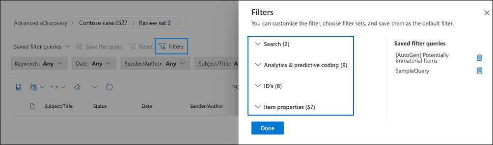

# 검토 집합의 콘텐츠 쿼리 및 필터링

대부분의 경우 검토 집합의 콘텐츠를 더 깊이 파고들고 보다 효율적인 검토를 위해 구성하는 것이 유용합니다. 검토 집합에서 필터 및 쿼리를 사용하면 검토 조건을 충족하는 문서의 하위 집합에 집중할 수 있습니다.

## 기본 필터

검토 집합에는 검토 집합에 미리 로드된 다섯 가지 기본 필터가 있습니다.

- 키워드
- 날짜
- 보낸 사람/만든 이
- 제목/제목
- 태그

각 필터를 클릭하여 필터를 확장하고 값을 할당합니다. 필터 외부를 클릭하여 검토 집합에 필터를 자동으로 적용합니다. 다음 스크린샷은 날짜 범위 내에 문서를 표시하도록 구성된 날짜 필터를 보여줍니다.

## 필터 추가 또는 제거

검토 집합에 대해 표시되는 필터를 추가하거나  제거하려면 필터를 선택하여 플라이아웃 페이지에 표시되는 필터 패널을 여십시오. 

사용 가능한 필터는 다음 네 섹션으로 구성됩니다.

- **검색:** 다양한 검색 기능을 제공하는 필터입니다.

- **분석 &** 코딩: **Document** & 분석 작업을 실행하거나 예측 코딩 모델을 사용할 때 생성 및 문서에 추가되는 속성에 대한 필터입니다.

- **ID:** 문서의 모든 ID 속성에 대한 필터입니다.

- **항목 속성:** 문서 속성에 대한 필터입니다. 

각 섹션을 확장하고 필터 집합에서 필터를 추가하거나 제거할 필터를 선택하거나 선택을 선택하지 않습니다. 필터를 추가하면 필터 집합에 표시됩니다. 

> [!NOTE]
> 필터 패널에서 섹션을 확장하면 기본 필터 유형이 선택된 것입니다. 이러한 선택된 필터를 유지하거나 선택을 선택을 했다가 필터 집합에서 제거할 수 있습니다. 

## 필터 형식

검토 집합의 모든 검색 가능한 필드에는 특정 필드를 기준으로 필터 항목에 사용할 수 있는 해당 필터가 있습니다.

필터에는 여러 가지 유형이 있습니다.

- **Freetext**: 자유 텍스트 필터가 "제목"과 같은 텍스트 필드에 적용됩니다. 여러 검색 용어를 콤보로 구분하여 나열할 수 있습니다.

- **Date**: 날짜 필터는 "마지막으로 수정한 날짜"같은 날짜 필드에 사용됩니다.

- **검색 옵션:** 검색 옵션 필터는 검토의 특정 필드에 대해 가능한 값 목록을 제공합니다(각 값은 선택할 수 있는 확인란과 함께 표시). 이 필터는 검토 집합에 가능한 값이 유한한 수의 "Sender"같은 필드에 사용됩니다.

- **키워드:** 키워드 조건은 용어를 검색하는 데 사용할 수 있는 특정 자유도 조건 인스턴스입니다. 이 유형의 필터에서 KQL과 같은 쿼리 언어를 사용할 수 있습니다. 자세한 내용은 이 항목의 쿼리 언어 및 고급 쿼리 작성기 섹션을 참조하세요.

## 필터 관계 포함 및 제외

특정 필터에 대한 포함 및 제외 관계를 변경할 수 있습니다. 예를 들어 태그 필터에서 드롭다운 필터에서 같음 없음을 선택하여 특정  태그로 태그가 지정되는 항목을 제외할 수 있습니다. 

## 필터를 쿼리로 저장

필터에 만족하면 필터 조합을 필터 쿼리로 저장할 수 있습니다. 이렇게 하면 향후 검토 세션에서 필터를 적용할 수 있습니다.

필터를 저장하려면 쿼리 **저장을 선택하고** 이름을 지정합니다. 사용자 또는 다른 검토자는 저장된 필터 쿼리 드롭다운을 선택하고 집합 문서를 검토하는 데 적용할 필터 쿼리를 선택하여 이전에 저장한 필터 쿼리를 실행할 수 있습니다.  

필터 쿼리를 삭제하려면 필터 패널을 열고 쿼리 옆에 있는 휴지통 아이콘을 선택합니다.

## 쿼리 언어

필터를 사용하는 것 외에도 키워드 필터에서 KQL과 같은 쿼리 언어를 사용하여 검토 집합 검색 쿼리를 만들 수도 있습니다. 검토 집합 쿼리의 쿼리 언어는 **AND**, **OR,** **NOT** 및 NEAR 등의 표준 부울 연산자를 **지원합니다.** 또한 단일 문자 와일드카드(?) 및 다중 문자 와일드카드(*)도 지원됩니다.

## 고급 쿼리 작성기

고급 쿼리를 작성하여 검토 집합에서 문서를 검색할 수도 있습니다.

1. 필터 패널을 열고 필터를 **선택한** 다음 검색 **섹션을 확장합니다.**

  

2. **KQL 필터를 선택하고** 쿼리 **작성기 열기 를 클릭합니다.**

   이 패널에서는 쿼리 작성기에서 복잡한 KQL 쿼리를 만들 수 있습니다. **AND** 또는 OR 관계로 논리적으로 연결된 여러 조건으로 구성되는 조건 그룹을 추가하거나 조건을 **추가할 수** 있습니다.

   
