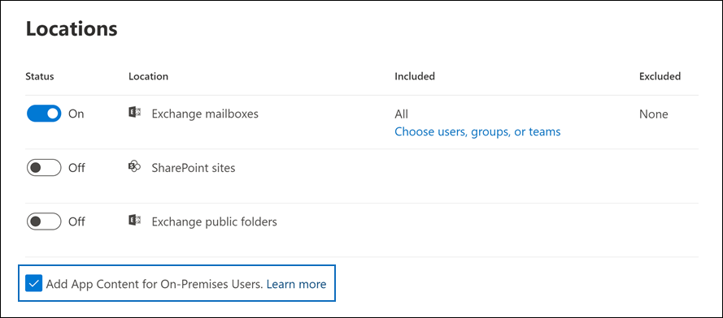

# <a name="search-for-teams-chat-data-for-on-premises-users"></a>온-프레미스 사용자의 Teams 채팅 데이터 검색

조직에 Exchange 하이브리드 배포가 있고 (또는 Office 365를 사용하여 조직을 온-프레미스 Exchange 조직과 동기화하고) Microsoft Teams를 사용한 경우 온-프레미스 사용자는 Teams 채팅 응용 프로그램을 사용하여 인스턴트 메시지를 이용할 수 있습니다. 클라우드 기반 사용자의 경우 Teams 채팅 데이터(*1x1 또는 1xN 채팅* 이라고도 함)는 기본 클라우드 기반 사서함에 저장됩니다. 온-프레미스 사용자가 Teams 채팅 응용 프로그램을 사용하는 경우 채팅 메시지는 온-프레미스에 위치한 기본 사서함에 저장될 수 없습니다. 이 문제를 해결하기 위해 Microsoft는 eDiscovery 도구를 사용하여 온-프레미스 사용자의 Teams 채팅 데이터를 검색하고 내보낼 수 있도록 클라우드 기반 저장소 영역을 만드는 새로운 기능을 출시했습니다.
  
다음은 온-프레미스 사용자의 클라우드 기반 사서함을 설정하기 위한 요구 사항 및 제한 사항입니다.
  
- 온-프레미스 디렉터리 서비스(예: Active Directory)의 사용자 계정은 Microsoft 365의 디렉터리 서비스인 Azure Active Directory와 동기화되어야 합니다. 즉, 메일 사용자 계정이 Microsoft 365에서 만들어지고 기본 사서함이 온-프레미스 조직에 있는 사용자와 연결됩니다.

- 기본 사서함이 온-프레미스 조직에 있는 사용자에게 Microsoft Teams 라이선스와 최소 Exchange Online 계획 1 라이선스가 할당되어야 합니다.

- 조직에 Exchange 하이브리드 배포가 없는 경우 온-프레미스 Exchange 스키마를 Azure Active Directory에 동기화해야 합니다. 이렇게 하지 않는 경우, 사서함이 있는 사용자에 대해 Exchange Online에서 중복 클라우드 기반 사서함을 만들 수 있습니다.

- 온-프레미스 사용자와 연결된 Teams 채팅 데이터만 클라우드 기반 저장소 영역에 저장됩니다. 온-프레미스 사용자는 이 저장소 영역에 어떤 방법으로든 액세스할 수 없습니다.

> [!NOTE]
> Teams 채널 대화는 항상 Teams 연결된 클라우드 기반 사서함에 저장되므로 채널 대화를 검색할 수 있습니다. Teams 채널 대화를 검색하는 방법에 대한 자세한 내용은 [Microsoft Teams 및 Microsoft 365 그룹 검색](content-search-reference.md#searching-microsoft-teams-and-microsoft-365-groups)을 참조하세요.
  
## <a name="how-it-works"></a>작동 방식

Microsoft Teams 지원 사용자에게 온-프레미스 사서함이 있고 사용자 계정/ID가 클라우드에 동기화된 경우 Microsoft는 온-프레미스 사용자의 1xN Teams 채팅 데이터와 연결된 클라우드 기반 사서함을 만듭니다. 온-프레미스 사용자의 Teams 채팅 데이터는 검색을 위해 인덱싱됩니다. 따라서 콘텐츠 검색(및 핵심 eDiscovery 및 고급 eDiscovery 케이스와 연결된 검색)을 사용하여 온-프레미스 사용자의 Teams 채팅 데이터를 검색하고 미리 보고 내보낼 수 있습니다. 보안 및 규정 준수 센터 PowerShell에서 **\*ComplianceSearch** cmdlet을 사용하여 온-프레미스 사용자의 Teams 채팅 데이터를 검색할 수도 있습니다.
  
다음 그래픽은 온-프레미스 사용자의 Teams 채팅 데이터를 검색하고 미리 보고 내보내는 방법에 대한 워크플로를 보여줍니다.
  

  
이 기능 외에도 eDiscovery 도구를 사용하여 클라우드 기반 SharePoint 사이트 및 각 Microsoft Teams와 연결된 Exchange 사서함 및 클라우드 기반 사용자를 위한 Exchange Online 사서함의 1xN Teams 채팅 데이터에서 Teams 콘텐츠를 검색하고 미리 보고 내보낼 수 있습니다.

### <a name="how-this-feature-is-supported-in-content-search-and-core-ediscovery-search-tools"></a>콘텐츠 검색 및 핵심 eDiscovery 검색 도구에서 이 기능을 지원하는 방법

Microsoft 365 규정 준수 센터의 핵심 eDiscovery 케이스와 연결된 콘텐츠 검색 및 검색 도구의 다음 UI 요소:
  
- **온-프레미스 사용자를 위한 앱 콘텐츠 추가** 확인란은 콘텐츠 검색 도구의 **위치** 마법사 페이지에 표시되고 기본적으로 선택됩니다. 콘텐츠 검색에 온-프레미스 사용자의 클라우드 기반 저장소를 포함하려면 이 확인란을 선택된 상태로 유지하세요.

    
  
- 검색할 특정 사용자를 선택할 때 온-프레미스 사용자를 검색할 수 있습니다.

## <a name="searching-for-teams-chat-content-for-on-premises-users"></a>온-프레미스 사용자의 Teams 채팅 콘텐츠 검색

다음은 Microsoft 365 규정 준수 센터에서 콘텐츠 검색을 사용하여 온-프레미스 사용자를 위해 Teams 채팅 데이터를 검색하는 방법입니다.
  
1. Microsoft 365 규정 준수 센터에서 **콘텐츠 검색** 으로 이동합니다.

2. **검색** 탭에서 **새 검색** 을 클릭하고 새 검색의 이름을 지정합니다.

3. **위치** 페이지에서 Exchange 편지함의 토글을 **켜짐** 으로 설정하세요. **온-프레미스 사용자를 위한 앱 컨텐츠 추가** 확인란이 표시되고 기본적으로 선택됩니다.

4. 특정 사용자에 대해 Teams 콘텐츠를 검색하려면 **사용자, 그룹 또는 팀 선택** 을 선택하고 검색에 포함할 특정 사용자를 선택합니다. 그렇지 않은 경우 **다음** 을 클릭하여 모든 사용자(온-프레미스 사용자 포함)의 Teams 콘텐츠를 검색합니다.

5. **검색 조건 정의** 페이지에서 키워드 쿼리를 만들고 필요한 경우 검색 쿼리에 조건을 추가합니다. Teams 채팅 데이터만 검색하려면 **키워드** 상자에 다음 쿼리를 추가하면 됩니다.

    ```text
    kind:im AND kind:microsoftteams
    ```

6. 검색을 제출하고 실행합니다. 온-프레미스 사용자의 모든 검색 결과는 다른 검색 결과와 같이 미리 볼 수 있습니다. 검색 결과(Teams 채팅 데이터 포함)를 PST 파일로 내보낼 수도 있습니다. 자세한 내용은 다음을 참조하세요.

    - [검색 만들기](content-search.md)

    - [검색 결과 미리 보기](preview-ediscovery-search-results.md)

    - [검색 결과 내보내기](export-search-results.md)

## <a name="using-powershell-to-search-for-teams-chat-data-for-on-premises-users"></a>PowerShell을 사용하여 온-프레미스 사용자의 Teams 채팅 데이터 검색

보안 및 준수 센터 PowerShell에서 **New-ComplianceSearch** 및 **Set-ComplianceSearch cmdlet** 을 사용하여 온-프레미스 사용자의 Teams 채팅 데이터를 검색할 수 있습니다. 앞서 설명한 것처럼 PowerShell을 사용하여 온-프레미스 사용자의 Teams 채팅 데이터를 검색하는 데는 지원 요청을 제출하지 않아도 됩니다.
  
1. [보안 및 준수 센터 PowerShell에 연결](/powershell/exchange/connect-to-scc-powershell)합니다.

2. 다음 PowerShell 명령을 실행하여 온-프레미스 사용자의 Teams 채팅 데이터를 검색하는 콘텐츠 검색을 만듭니다.

    ```powershell
    New-ComplianceSearch <name of new search> -ContentMatchQuery <search query> -ExchangeLocation <on-premises user> -IncludeUserAppContent $true -AllowNotFoundExchangeLocationsEnabled $true  
    ```

    *IncludeUserAppContent* 매개 변수는 *ExchangeLocation* 매개 변수로 지정된 한 명 이상의 사용자의 클라우드 기반 저장소를 지정하는 데 사용됩니다. *AllowNotFoundExchangeLocationsEnabled* 를 통해 온-프레미스 사용자의 클라우드 기반 저장소를 검색할 수 있습니다. 이 매개 변수에 `$true` 값을 사용하는 경우 진행하기 전에 사서함의 존재 여부를 확인하는 검색을 시도하지 않습니다. 이 클라우드 기반 저장소는 일반 클라우드 기반 사서함으로 확인되지 않으므로 온-프레미스 사용자의 클라우드 기반 저장소를 검색하려면 이 작업이 필요합니다.

    다음 예제에서는 Contoso 조직의 온-프레미스 사용자인 Sara Davis의 클라우드 기반 저장소에서 “redstone” 키워드를 포함하는 Teams 채팅을 검색합니다.
  
    ```powershell
    New-ComplianceSearch "Redstone_Search" -ContentMatchQuery "redstone AND (kind:im AND kind:microsoftteams)" -ExchangeLocation sarad@contoso.com -IncludeUserAppContent $true -AllowNotFoundExchangeLocationsEnabled $true  
    ```

   검색을 만든 후에 **Start-ComplianceSearch** cmdlet를 사용하여 검색을 실행해야 합니다.
  
이러한 cmdlet 사용에 대한 자세한 내용은 다음을 참조하세요.
  
- [New-ComplianceSearch](/powershell/module/exchange/new-compliancesearch)

- [Set-ComplianceSearch](/powershell/module/exchange/set-compliancesearch)

- [Start-ComplianceSearch](/powershell/module/exchange/start-compliancesearch)

## <a name="known-issues"></a>알려진 문제

- 현재 온-프레미스 사용자의 Teams 채팅 데이터를 검색하고 미리 보고 내보낼 수 있습니다. 핵심 eDiscovery 사례 및 고급 eDiscovery 사례와 연결된 보류에 온-프레미스 사용자의 Teams 채팅 데이터를 배치하고 온-프레미스 사용자에 대해 Teams 채팅 또는 채널 메시지 보존 정책을 적용할 수도 있습니다. 그러나 현재 온-프레미스 사용자에 대해 다른 콘텐츠 위치(예: Exchange 사서함 및 SharePoint 사이트) 보존 정책을 적용할 수 없습니다.

## <a name="frequently-asked-questions"></a>자주 묻는 질문

**온-프레미스 사용자를 위한 채팅 메시지를 검색하기 위해 지원 요청을 제출해야 하나요?**

아니요. 이 기능은 기본적으로 모든 조직에 대해 사용됩니다. 한때는 Microsoft 지원에 문의해야 했지만 더 이상 그렇지 않습니다.
  
 **eDiscovery 도구가 모든 조직에서 기본적으로 이 기능을 사용하도록 설정하기 전의 온-프레미스 사용자에 대해 이전 Teams 채팅 데이터를 찾을 수 있나요?**
  
Microsoft는 2018년 1월 31일에 온-프레미스 사용자용 Teams 채팅 데이터를 저장하기 시작했습니다. 따라서 이 날짜 이후 온-프레미스 Active Directory와 Microsoft 365의 Azure Active Directory 간에 온-프레미스 Teams 사용자의 ID가 동기화되면 해당 Teams 채팅 데이터가 클라우드에 저장되고 eDiscovery 도구를 사용하여 이를 검색할 수 있습니다.

 **온-프레미스 사용자가 클라우드에 Teams 채팅 데이터를 저장하려면 라이선스가 필요하나요?**
  
네. 클라우드 기반 저장소에 온-프레미스 사용자의 Teams 채팅 데이터를 저장하려면 사용자에게 Microsoft Teams 라이선스 및 Office 365(또는 Microsoft 365)의 Exchange Online 플랜 라이선스가 할당되어 있어야 합니다.

**온-프레미스 사용자의 클라우드 기반 저장소는 어디에 있나요?**
  
Teams 채팅 데이터는 온-프레미스 사용자의 PDL(기본 데이터 위치)에 저장됩니다. PDL은 Single-Geo 및 Multi-Geo 환경에서 모두 존중됩니다. 자세한 내용은 [Microsoft 365 Multi-Geo](../enterprise/microsoft-365-multi-geo.md)을 참조하세요.

**사용자의 온-프레미스 사서함이 클라우드로 마이그레이션될 경우 Teams 채팅 데이터가 손실될 위험이 있나요?**
  
아니요. 온-프레미스 사용자의 기본 사서함을 클라우드로 마이그레이션하면 해당 사용자의 Teams 채팅 데이터가 새 클라우드 기반 기본 사서함으로 마이그레이션됩니다.
  
 **온-프레미스 사용자에게 eDiscovery 보류 또는 보존 정책을 적용할 수 있나요?**
  
예. 온-프레미스 사용자의 Teams 채팅 및 채널 메시지에 대한 eDiscovery 보류 또는 보존 정책을 적용할 수 있습니다. 그러나 온-프레미스 사용자에 대해 Teams 콘텐츠를 보존하거나 보관하려면 Exchange Online 플랜 2 라이선스를 할당 받아야 합니다.
