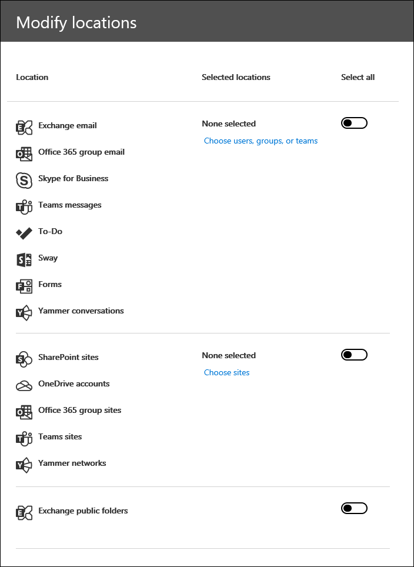

# 중요 eDiscovery 사례에서 콘텐츠 검색

핵심 eDiscovery 사례를 만들고 해당 사례에 대 한 사용자의 관심을 유지 한 후에는 사례와 관련 된 콘텐츠에 대해 하나 이상의 검색을 만들고 실행할 수 있습니다. 핵심 eDiscovery 사례와 연결 된 검색은 Microsoft 365 준수 센터의 **콘텐츠 검색** 페이지에 표시 되지 않습니다. 이러한 검색은 검색에 연결 된 코어 **Ediscover의 검색** 페이지에 나열 됩니다. 즉, 사례와 연결 된 검색은 사례 구성원만 액세스할 수 있습니다.

코어 eDiscovery 검색을 만들려면 다음을 수행 합니다.
  
1. 적절 한 [https://compliance.microsoft.com](https://compliance.microsoft.com) eDiscovery 권한이 할당 된 사용자 계정에 대 한 자격 증명을 사용 하 여으로 이동 하 여 로그인 합니다.

2. Microsoft 365 준수 센터의 왼쪽 탐색 창에서 **모두 표시**를 클릭 한 다음 **eDiscovery > 코어**를 클릭 합니다.

3. **핵심 eDiscovery** 페이지에서 관련 된 검색을 만들 사례를 선택 하 고 **열기 사례**를 클릭 합니다.

4. 사례에 대 한 **홈** 페이지에서 **검색** 탭을 클릭 합니다.
  
5. **검색** 페이지에서 **새 검색**을 클릭 합니다.

6. **새 검색** 페이지에서 키워드 및 조건을 추가하여 검색 쿼리를 만들 수 있습니다. 

    
  
   a. 키워드, 메시지 속성 (예: 보낸 날짜 및 받은 날짜가) 또는 문서 속성 (예: 파일 이름 또는 문서를 마지막으로 변경한 날짜)을 지정할 수 있습니다. **AND**, **OR**, **NOT**, **NEAR**등의 부울 연산자를 사용 하는 보다 복잡 한 쿼리를 사용할 수 있습니다. 문서에서 중요한 정보(예: 사회 보장 번호)를 검색하거나 외부에서 공유되는 문서를 검색할 수도 있습니다. 키워드 상자를 비워 두면 지정 된 콘텐츠 위치에 있는 모든 콘텐츠가 검색 결과에 포함 됩니다.

   b. **키워드 목록 표시** 확인란을 클릭 하 고 각 행에 키워드를 입력할 수 있습니다. 이 경우 각 행의 키워드는 생성 된 검색 쿼리의 **OR** 연산자로 연결 됩니다. 목록에 최대 20 개의 키워드를 입력할 수 있습니다.

    
  
    키워드 목록을 사용하는 이유 각 키워드와 일치하는 항목 수를 보여주는 통계를 얻을 수 있습니다. 이를 통해 가장 (및 가장 덜) 유효한 키워드를 신속하게 파악할 수 있습니다. 키워드 문구(괄호로 묶음)를 연속으로 사용할 수도 있습니다. 검색 통계에 대한 자세한 내용은 [콘텐츠 검색 결과에 대한 키워드 통계 보기](view-keyword-statistics-for-content-search.md)를 참조하세요.

    키워드 목록을 사용 하는 방법에 대 한 자세한 내용은 [검색 쿼리 작성](content-search.md#building-a-search-query)을 참조 하십시오.

   c. **조건을** 클릭 하 고 검색 쿼리에 조건을 추가 하 여 검색 범위를 좁히고 보다 구체화 된 결과 집합을 반환할 수 있습니다. 각 조건은 검색을 시작할 때 생성되고 실행되는 KQL 검색 쿼리에 절을 추가합니다. 조건은 **AND** 연산자에 의해 키워드 쿼리(키워드 상자에 지정)에 논리적으로 연결됩니다. 즉, 항목은 결과에 포함할 키워드 쿼리와 각 조건을 만족 해야 합니다. 이 방법을 통해 결과를 좁힐 수 있습니다.

    검색 쿼리를 만들고 조건을 사용하는 방법에 대한 자세한 내용은 [Keyword queries for Content Search](keyword-queries-and-search-conditions.md)를 참조하세요.

7. **위치: 보류 중인 위치**에서 검색 하려는 콘텐츠 위치를 선택 합니다. 같은 검색에서 사서함, 사이트 및 공용 폴더를 검색할 수 있습니다.

    
  
    - **모든 위치**입니다. 조직의 모든 콘텐츠 위치를 검색 하려면이 옵션을 선택 합니다. 이 옵션을 선택 하면 모든 Exchange 사서함 (모든 Microsoft 팀, Yammer 그룹 및 Office 365 그룹의 사서함 포함), 모든 SharePoint 및 비즈니스용 OneDrive 사이트 (모든 Microsoft 팀, Yammer 그룹 및 Office 365 그룹에 대 한 사이트 포함) 및 모든 공용 폴더를 검색 하도록 선택할 수 있습니다.
    
    - **보류 중인 모든 위치**입니다. 사례에서 eDiscovery 보류에 적용 된 모든 콘텐츠 위치를 검색 하려면이 옵션을 선택 합니다. 대/소문자에 여러 보류가 포함 된 경우 모든 보류의 콘텐츠 위치가 검색 됩니다. 또한 콘텐츠 위치가 쿼리 기반 유지로 설정 된 경우에는이 단계에서 만드는 콘텐츠 검색을 실행할 때 보류 중인 항목만 검색 됩니다. 예를 들어 특정 날짜 이전에 보내거나 만든 항목을 유지 하는 사용자가 쿼리 기반 케이스 보류에 저장 된 경우 해당 항목만 검색 됩니다. 이 작업은 사례 보류 쿼리와 콘텐츠 검색 쿼리를 **and** 연산자로 연결 하 여 수행 됩니다. 자세한 내용은 [eDiscovery 보류의 검색 위치](create-ediscovery-holds.md#search-locations-on-ediscovery-hold)를 참조 하세요.
    
    - **특정 위치**입니다. 검색 하려는 사서함 및 사이트를 선택 하려면이 옵션을 선택 합니다. 이 옵션을 선택 하 고 **수정을**클릭 하면 위치 목록이 표시 됩니다. 모든 사용자, 그룹, 팀 또는 사이트 위치를 검색 하도록 선택할 수 있습니다. 조직의 공용 폴더를 검색할 수도 있습니다.
    
      
  
     이 옵션을 선택 하 고 보류 중인 모든 콘텐츠 위치를 검색 하는 경우 쿼리 기반 사례 보류의 쿼리는 검색 쿼리에 적용 되지 않습니다. 즉, 쿼리 기반 사례 보류에 의해 보존 되는 콘텐츠 뿐 아니라 모든 콘텐츠가 검색 됩니다.

8. 검색할 콘텐츠 위치를 선택한 후 **완료** 를 클릭 하 고 **저장**을 클릭 합니다.

9. **새 검색** 페이지에서 **저장 & 실행** 을 클릭 하 고 검색의 이름을 입력 합니다. 핵심 eDiscovery 사례와 연결 된 검색에는 Office 365 조직 내에서 고유한 이름이 있어야 합니다.

10. **저장** 을 클릭 하 여 검색 설정을 저장 하 고 검색을 시작 합니다.

  검색이 완료된 후에 검색 결과를 미리 볼 수 있습니다. 필요한 경우 **검색** 페이지에서 **새로 고침** 을 클릭 하 여 만든 검색을 목록에 표시 합니다.

11. 검색을 클릭 하 여 검색에 대 한 통계를 포함 하 고 검색 통계를 보고 검색 결과를 내보내는 등의 기타 작업을 수행 하는 플라이 아웃 페이지를 표시 합니다.

## 콘텐츠 위치 검색에 대 한 추가 정보

- **사용자, 그룹 또는 팀 선택을** 클릭 하 여 검색할 사서함을 지정 하는 경우 표시 되는 사서함 선택은 비어 있습니다. 이것은 성능을 향상시키기 위한 것입니다. 이 목록에 받는 사람을 추가 하려면 **사용자, 그룹 또는 팀 선택을**클릭 하 고 검색 상자에 이름 (최소 3 자)을 입력 한 후에 이름 옆의 확인란을 선택 하 고 **선택을**클릭 합니다.

- 검색 대상 사서함 목록에 비활성 사서함, Microsoft 팀, Yammer 그룹, Office 365 그룹 및 메일 그룹을 추가할 수 있습니다. 동적 메일 그룹은 지정할 수 없습니다. Microsoft 팀, Yammer 그룹 또는 Office 365 그룹을 추가 하는 경우 그룹 또는 팀 사서함이 검색 됩니다. 그룹 구성원의 사서함이 검색 되지 않습니다.

- 사이트를 추가 하려면 **사이트 선택을**클릭 하 고 **사이트 선택을** 다시 클릭 한 다음 검색할 각 사이트에 대 한 URL을 입력 합니다. Microsoft 팀, Yammer 그룹 또는 Office 365 그룹에 대 한 SharePoint 사이트의 URL을 추가할 수도 있습니다.
