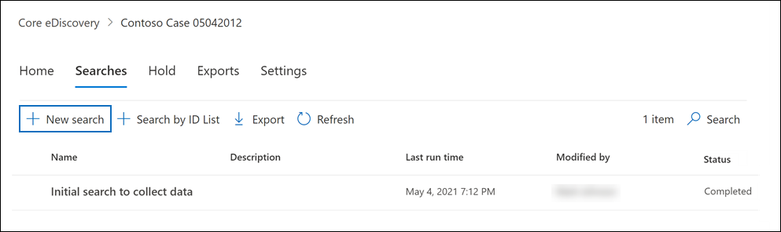

# Core eDiscovery 사례에서 콘텐츠 검색

Core eDiscovery 사례를 만들고 사례에 관심이 있는 사람이 보류된 후 사례와 관련된 콘텐츠에 대해 하나 이상의 검색을 만들고 실행할 수 있습니다. Core eDiscovery 사례와 연결된 검색은 검색 목록의 콘텐츠 검색 페이지에 Microsoft 365 규정 준수 센터.  이러한 검색은 검색이  연결된 Core eDiscover 사례의 검색 페이지에 나열됩니다. 즉, 사례와 연결된 검색은 사례 구성원만 액세스할 수 있습니다.

Core eDiscovery 검색을 만들 수 있는 경우:
  
1. 으로 이동하여 적절한 eDiscovery 권한이 할당되고 사례의 구성원인 사용자 계정의 자격 증명을 사용하여 <https://compliance.microsoft.com> 로그인합니다.

2. 창의 왼쪽 탐색 창에서 Microsoft 365 규정 준수 센터 표시를 클릭한 다음 **eDiscovery**> 클릭합니다. 

3. Core **eDiscovery** 페이지에서 연결된 검색을 만들 사례를 선택하고 사례 열기 **를 클릭합니다.**

4. 사례에 **대한 홈** 페이지에서 검색  탭을 클릭한 다음 새 **검색을 클릭합니다.**

   

   > [!NOTE]
   > **ID 목록으로 검색**: 이 옵션은 Exchange ID 목록을 사용하여 특정 전자 메일 메시지 및 기타 사서함 항목을 검색합니다. ID 목록 검색을 만들려면 검색할 특정 사서함 항목을 식별하는 CSV(쉼표로 구분된 값) 파일을 제출합니다. 자세한 내용은 [ID 목록 검색을 위해 CSV 파일 준비](csv-file-for-an-id-list-content-search.md)를 참조하세요.

5. 새 **검색 마법사에서** 검색의 이름을 입력하고 검색을 식별하는 데 도움이 되는 설명(선택 사항)을 입력합니다. 검색 이름은 조직에서 고유해야 합니다.

6. **위치** 페이지에서 검색할 콘텐츠 위치를 선택합니다. 사서함, 사이트 및 공용 폴더를 검색할 수 있습니다.

    
  
   1. **Exchange 사서함**: 토글을 **켜기** 로 설정한 다음 **사용자, 그룹 또는 팀 선택** 을 클릭하여 보류할 사서함을 지정합니다. 검색 상자를 사용하여 보류 상태로 지정할 사용자 사서함 및 메일 그룹(그룹 구성원의 사서함을 보류)을 찾습니다. Microsoft Teams(채널 메시지), Office 365 그룹 및 Yammer 그룹과 연결된 사서함을 검색할 수도 있습니다. 사서함에 저장된 애플리케이션 데이터에 대한 자세한 내용은 [eDiscovery용 사서함에 저장된 콘텐츠](what-is-stored-in-exo-mailbox.md)를 참조하세요.

   2. **SharePoint 사이트**: 토글을 **켜기** 로 설정한 다음 **사이트 선택** 을 클릭하여 SharePoint 사이트 및 OneDrive 계정을 보류할 수 있습니다. 보류할 각 사이트의 URL을 입력합니다. Microsoft Teams, Office 365 그룹 또는 Yammer 그룹의 SharePoint 사이트 URL을 추가할 수도 있습니다.
  
   3. **Exchange 공용 폴더**: 토글을 **켜기** 로 설정하여 Exchange Online 조직의 모든 공용 폴더를 보류합니다. 보류할 특정 공용 폴더는 선택할 수 없습니다. 공용 폴더를 보류하고 싶지 않은 경우 토글 스위치를 해제합니다.
  
   4. 이 확인란을 선택된 것으로 유지하여 온-프레미스 사용자에 대한 Teams 콘텐츠를 검색합니다. 예를 들어 조직에서 모든 Exchange 사서함을 검색하고 이 확인란도 선택하는 경우, 온-프레미스 사용자의 Teams 채팅 데이터를 저장하는 데 사용되는 클라우드 기반 저장소가 검색 범위에 포함됩니다. 자세한 내용은 [온-프레미스 사용자의 Teams 채팅 데이터 검색](search-cloud-based-mailboxes-for-on-premises-users.md)을 참조하세요.

7. **검색 조건 정의** 페이지에서 키워드 쿼리를 입력하고, 필요한 경우 검색 쿼리에 조건을 추가합니다.

   

   1. 키워드, 메시지 속성(보낸 날짜 및 받은 날짜) 또는 문서 속성(예: 파일 이름 또는 문서를 마지막으로 변경한 날짜)을 지정할 수 있습니다. **AND**, **OR**, **NOT**, **NEAR** 와 같은 부울 연산자를 사용하는 좀 더 복잡한 쿼리를 사용할 수 있습니다. 키워드 상자를 비워 두면 지정된 콘텐츠 위치에 있는 모든 콘텐츠가 검색 결과에 포함됩니다. 자세한 내용은 [eDiscovery에 대한 키워드 쿼리 및 검색 조건](keyword-queries-and-search-conditions.md)을 참조하세요.

   2. 또는 **키워드 목록 표시** 확인란을 클릭하고 각 행에 키워드를 입력할 수 있습니다. 이렇게하면 각 행의 키워드는 만든 검색 쿼리의 **OR** 연산자와 기능상 유사한 논리 연산자(**c:s**)로 연결됩니다.

      키워드 목록을 사용하는 이유 각 키워드와 일치하는 항목 수를 보여주는 통계를 얻을 수 있습니다. 이를 통해 가장 (및 가장 덜) 유효한 키워드를 신속하게 파악할 수 있습니다. 키워드 문구(괄호로 묶음)를 연속으로 사용할 수도 있습니다. 키워드 목록 및 검색 통계에 대한 자세한 내용은 [검색에 대한 키워드 통계 얻기](view-keyword-statistics-for-content-search.md#get-keyword-statistics-for-searches)를 참조하세요.

      > [!NOTE]
      > 큰 키워드 목록으로 인한 문제를 줄일 수 있도록 키워드 목록에서 최대 20개의 행으로 제한됩니다.

   3. 검색 조건을 추가하여 검색 범위를 좁히고 보다 구체적인 결과 집합을 반환할 수도 있습니다. 각 조건은 검색을 시작할 때 생성 및 실행되는 검색 쿼리에 절을 추가합니다. 조건은 **AND** 연산자와 기능상 유사한 논리 연산자(**c:c**)로 키워드 쿼리 (키워드 상자에서 지정)에 논리적으로 연결됩니다. 즉, 결과에 포함되려면 항목이 키워드 쿼리와 하나 이상의 조건을 모두 만족해야 합니다. 이 방법을 통해 결과를 좁힐 수 있습니다. 검색 쿼리에서 사용할 수 있는 조건의 목록 및 설명은 [검색 조건](keyword-queries-and-search-conditions.md#search-conditions)을 참조하세요.

8. 검색 설정을 검토하고 필요한 경우 편집한 다음 검색을 제출하여 시작하세요.

검색이 완료된 후에 검색 결과를 미리 볼 수 있습니다. 필요한 경우 검색 **페이지에서** 새로 **고침을** 클릭하여 만든 검색을 표시합니다.

## 콘텐츠 위치 검색에 대한 자세한 정보

- 사용자,  그룹 또는 팀 선택을 클릭하여 검색할 사서함을 지정하면 표시되는 사서함 선택이 비어 있습니다. 이것은 성능을 향상시키기 위한 것입니다. 이 목록에 받는 사람을 추가하려면 **사용자,** 그룹 또는 팀 선택을 클릭하고 검색 상자에 이름(최소 3자)을 입력하고 이름 옆의 확인란을 선택한 다음 선택을 **클릭합니다.**

- 비활성 사서함, Microsoft Teams, Yammer 그룹, Office 365 및 메일 그룹을 검색할 사서함 목록에 추가할 수 있습니다. 동적 메일 그룹은 지정할 수 없습니다. 그룹 Microsoft Teams, Yammer 그룹 또는 Office 365 추가하면 그룹 또는 팀 사서함이 검색됩니다. 그룹 구성원의 사서함이 검색되지 않습니다.

- 검색에 사이트를 추가하려면 토글을 켜고 사이트 선택 **을 클릭합니다.** 검색할 각 사이트의 URL을 입력합니다. Microsoft 팀, SharePoint 그룹 또는 Yammer 그룹의 URL을 추가할 Office 365 있습니다.
