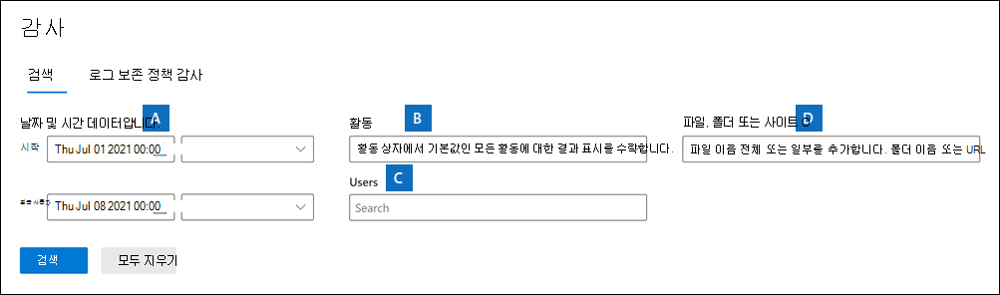
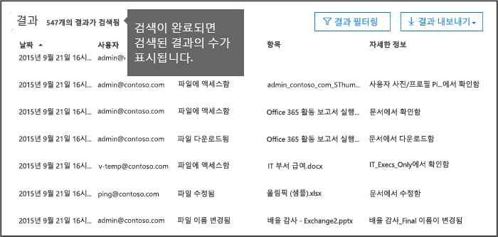
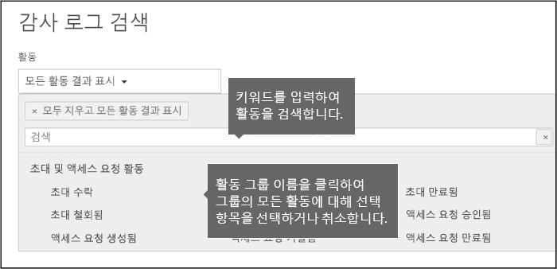
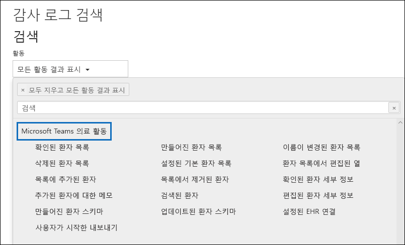
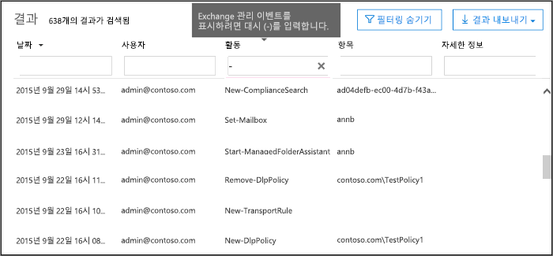

# <a name="search-the-audit-log-in-the-compliance-center"></a>준수 센터에서 감사 로그 검색

사용자가 특정 문서를 보았는지 또는 사서함에서 항목을 제거했는지 확인해야 하나요? 그렇다면 Microsoft 365 규정 준수 센터의 감사 로그 검색 도구를 사용하여 통합 감사 로그를 검색해 조직의 사용자와 관리자 활동을 확인합니다. 수십 개의 Microsoft 365 서비스 및 솔루션에서 수행되는 수천 개의 사용자 및 관리 작업이 조직의 통합 감사 로그에 캡처, 기록 및 보존됩니다. 조직의 사용자는 감사 로그 검색 도구를 사용하여 이러한 작업에 대한 감사 레코드를 검색하고 보고 (CSV 파일로) 내보낼 수 있습니다.

## <a name="microsoft-365-services-that-support-auditing"></a>감사를 지원하는 Microsoft 365 서비스

통합된 감사 로그를 사용하는 이유는 무엇일까요? 감사 로그에서 다른 Microsoft 365 서비스에서 수행된 활동을 검색할 수 있기 때문입니다. 다음 표에서는 통합 감사 로그에서 지원하는 Microsoft 365 서비스 및 기능(사전순)을 나열합니다.

| Microsoft 365 서비스 또는 기능 | 레코드 유형|
|:---------|:---------|
| Azure Active Directory|AzureActiveDirectory, AzureActiveDirectoryAccountLogon, AzureActiveDirectoryStsLogon |
| Azure Information Protection|AipDiscover, AipSensitivityLabelAction, AipProtectionAction, AipFileDeleted, AipHeartBeat |
| 커뮤니케이션 규정 준수|ComplianceSuperVisionExchange|
| 콘텐츠 탐색기|LabelContentExplorer|
| DLP(데이터 손실 방지)|ComplianceDLPSharePoint, ComplianceDLPExchange|
| 엔드포인트용 Defender|DLPEndpoint, MSDEResponseActions, MSDEGeneralSettings, MSDEIndicatorsSettings, MSDERolesSettings|
| Dynamics 365|CRM|
| eDiscovery|검색, AeD|
| 정확한 데이터 일치|MipExactDataMatch|
| Exchange Online|ExchangeAdmin, ExchangeItem, ExchangeItemAggregated |
| Forms|MicrosoftForms|
| 정보 장벽|InformationBarrierPolicyApplication|
| Microsoft 365 Defender|AirInvestigation, AirManualInvestigation, AirAdminActionInvestigation, MS365DCustomDetection|
| Microsoft Teams|MicrosoftTeams|
| MyAnalytics|MyAnalyticsSettings|
| 비즈니스용 OneDrive|OneDrive|
| Power Apps|PowerAppsApp, PowerAppsPlan|
| Power Automate|MicrosoftFlow|
| Power BI|PowerBIAudit|
| 격리|격리|
| 보존 정책 및 보존 레이블|MIPLabel, MipAutoLabelExchangeItem, MipAutoLabelSharePointItem, MipAutoLabelSharePointPolicyLocation|
| 중요한 정보 유형|DlpSensitiveInformationType|
| 민감도 레이블|MIPLabel, SensitivityLabelAction, SensitivityLabeledFileAction, SensitivityLabelPolicyMatch|
| SharePoint Online|SharePoint, SharePointFileOperation,SharePointSharing작업, SharePointListOperation, SharePointCommentOperation |
| 스트림|MicrosoftStream|
| 위협 인텔리전스|ThreatIntelligence, ThreatIntelligenceUrl, ThreatFinder, ThreatIntelligenceAtpContent|
| Workplace Analytics|WorkplaceAnalytics|
| Yammer|Yammer|
|||

이전 표에 나열된 각 서비스에서 감사되는 작업에 대한 자세한 내용은 이 문서의 [감사 활동](#audited-activities) 섹션을 참조하세요.

또한 이전 표에서는 Exchange Online PowerShell에서 **Search-UnifiedAuditLog** cmdlet을 사용하거나 PowerShell 스크립트를 사용하여 해당 서비스의 활동에 대한 감사 로그를 검색하는 데 사용할 레코드 유형 값을 식별합니다. 일부 서비스에는 동일한 서비스 내의 다양한 활동 유형에 대해 복수의 레코드 형식이 있습니다. 감사 레코드 유형의 전체 목록은 [Office 365 관리 작업 API 스키마](/office/office-365-management-api/office-365-management-activity-api-schema#auditlogrecordtype)를 참조하세요.

 PowerShell을 사용하여 감사 로그를 검색하는 방법에 대한 자세한 내용은 다음을 참조하세요.

- [검색 통합감사 로그](/powershell/module/exchange/search-unifiedauditlog)

- [PowerShell 스크립트를 사용하여 감사 로그 검색](audit-log-search-script.md)

## <a name="before-you-search-the-audit-log"></a>감사 로그를 검색하기 전에

감사 로그의 검색을 시작하기 전에 반드시 아래 내용을 읽어보세요.

- Microsoft 365 및 Office 365 엔터프라이즈 조직에서는 기본적으로 감사 로그 검색이 켜져 있습니다. 감사 로그 검색이 켜져 있는지 확인하려면 Exchange Online PowerShell에서 다음 명령을 실행합니다.

  ```powershell
  Get-AdminAuditLogConfig | FL UnifiedAuditLogIngestionEnabled
  ```

  *UnifiedAuditLogIngestionEnabled* 에 대한 `True` 값은 로그 검색이 켜져 있는 것을 나타냅니다. 자세한 내용은 [감사 로그 검색 설정 및 해제](turn-audit-log-search-on-or-off.md)를 참조하세요.

- 감사 로그를 검색하려면 Exchange Online에서 보기 전용 감사 로그 또는 감사 로그 역할이 할당되어야 합니다. 기본적으로 이러한 역할은 Exchange 관리 센터의 **사용 권한** 페이지에서 규정 준수 관리 및 조직 관리 역할 그룹에 할당됩니다. Office 365 및 Microsoft 365의 전역 관리자는 자동으로 Exchange Online 서비스에서 조직 관리 역할 그룹의 구성원이 됩니다. 최소 권한 수준을 사용하여 감사 로그를 검색할 수 있는 권한을 사용자에게 제공하려면 Exchange Online에서 사용자 지정 역할 그룹을 만들고, 보기 전용 감사 로그 또는 감사 로그 역할을 추가한 다음, 새 역할 그룹의 구성원으로 사용자를 추가할 수 있습니다. 자세한 내용은 [Exchange Online에서 역할 그룹 관리](/Exchange/permissions-exo/role-groups)를 참조하세요.

  > [!IMPORTANT]
  > Microsoft 365 규정 준수 센터의 **사용 권한** 페이지에서 사용자에게 보기 전용 감사 로그 또는 감사 로그 역할을 할당하는 경우 감사 로그를 검색할 수 없습니다. Exchange Online에서 사용 권한을 할당해야 합니다. 감사 로그를 검색하는 데 사용되는 기본 cmdlet이 Exchange Online cmdlet이기 때문입니다.

- 사용자 또는 관리자가 감사되는 활동을 수행하면 감사 레코드가 생성되어 조직의 감사 로그에 저장됩니다. 감사 기록이 보존되는(감사 로그에서 검색 가능한) 시간은 Office 365 또는 Microsoft 365 Enterprise 구독, 그리고 특히 특정 사용자에게 할당된 라이선스 유형에 따라 다릅니다.

  - Office 365 E5 또는 Microsoft 365 E5 라이선스가 할당된 사용자(또는 Microsoft 365 E5 규정 준수 또는 Microsoft 365 E5 eDiscovery 및 Audit 추가 기능 라이선스가 있는 사용자)의 경우 Azure Active Directory, Exchange 및 SharePoint 활동에 대한 감사 레코드가 기본적으로 1년 동안 유지됩니다. 조직은 감사 로그 보존 정책을 만들어 다른 서비스 활동에 대한 감사 레코드를 최대 1년 동안 유지할 수도 있습니다. 자세한 내용은 [감사 로그 보존 정책 관리](audit-log-retention-policies.md)를 참조하십시오.

    > [!NOTE]
    > 조직이 감사 레코드의 1년 보존을 위해 개인 미리보기 프로그램에 참여한 경우 일반 가용성 롤아웃 날짜 이전에 생성 된 감사 레코드의 보존 기간은 재설정되지 않습니다.

  - E5 이외의 다른 Office 365 또는 Microsoft 365 라이선스가 할당된 사용자의 경우 감사 레코드가 90일 동안 보존됩니다. 통합 감사 로깅을 지원하는 Office 365 및 Microsoft 365 구독 목록을 확인하려면 [보안 및 규정 준수 센터 서비스 설명](/office365/servicedescriptions/office-365-platform-service-description/office-365-securitycompliance-center)을 참조하세요.

    > [!NOTE]
    > 기본적으로 사서함 감사가 설정되어 있더라도 일부 사용자에 대한 사서함 감사 이벤트는 Microsoft 365 규정 준수 센터의 감사 로그 검색에서 발견되지 않거나 Office 365 관리 작업 API를 통해 찾지 못할 수 있습니다. 자세한 내용은 [사서함 감사 로깅에 대한 자세한 정보](enable-mailbox-auditing.md#more-information)를 참조하세요.

- 조직의 감사 로그 검색을 해제하려면 Exchange Online 조직에 연결된 원격 PowerShell에서 다음의 명령을 실행합니다.

  ```powershell
  Set-AdminAuditLogConfig -UnifiedAuditLogIngestionEnabled $false
  ```

    감사 검색을 다시 설정하기 위해 Exchange Online PowerShell에서 다음 명령을 실행할 수 있습니다.

  ```powershell
  Set-AdminAuditLogConfig -UnifiedAuditLogIngestionEnabled $true
  ```

  자세한 내용은 [감사 로그 검색 해제](turn-audit-log-search-on-or-off.md)를 참조하세요.

- 이전에 설명한 것처럼, 감사 로그를 검색하는 데 사용되는 기본 cmdlet은 **Search-UnifiedAuditLog** 인 Exchange Online cmdlet입니다. 즉 Microsoft 365 규정 준수 센터의 **감사** 페이지의 검색 도구를 사용하는 대신 이 cmdlet을 사용하여 감사 로그를 검색할 수 있습니다. Exchange Online PowerShell에서 이 cmdlet을 실행해야 합니다. 자세한 내용은 [Search-UnifiedAuditLog](/powershell/module/exchange/search-unifiedauditlog)를 참조하세요.

  **Search-UnifiedAuditLog** cmdlet에서 반환되는 검색 결과를 CSV 파일로 내보내는 방법에 대한 자세한 내용은 [감사 로그 레코드 내보내기, 구성 및 보기](export-view-audit-log-records.md#tips-for-exporting-and-viewing-the-audit-log)의 "감사 로그 내보내기 및 보기 팁" 섹션을 참조하세요.

- 감사 로그에서 프로그래밍 방식으로 데이터를 다운로드하려면 PowerShell 스크립트를 사용하는 대신 Office 365 관리 작업 API를 사용하는 것이 좋습니다. Office 365 관리 작업 API는 조직의 작업, 보안 및 규정 준수 모니터링 솔루션을 개발하는 데 사용할 수 있는 REST 웹 서비스입니다. 자세한 내용은 [Office 365 관리 작업 API 참조](/office/office-365-management-api/office-365-management-activity-api-reference)를 참조하세요.

- Azure A (azure Active Directory)는 Microsoft 365의 디렉터리 서비스입니다. 통합 감사 로그에는 <a href="https://go.microsoft.com/fwlink/p/?linkid=2024339" target="_blank">Microsoft 365 관리 센터</a> 또는 Azure 관리 포털에서 수행된 사용자, 그룹, 응용 프로그램, 도메인 및 디렉터리 활동이 포함됩니다. Azure AD 이벤트의 전체 목록은 [Azure Active Directory 감사 보고서 이벤트](/azure/active-directory/reports-monitoring/concept-audit-logs)를 참조하세요.

- 감사 로그 검색 결과에 해당 감사 로그 레코드가 반환되려면 이벤트 발생 시점으로부터 30분에서 24시간 정도 걸릴 수 있습니다. 다음 표에는 Microsoft 365의 여러 서비스가 표시되는 데 걸리는 시간이 나와 있습니다.

  |Microsoft 365 서비스 또는 기능|30분|24시간|
  |---|:---:|:---:|
  |Microsoft 365 및 위협 인텔리전스용 Defender|||
  |Azure Active Directory(사용자 로그인 이벤트)|||
  |Azure Active Directory(관리자 이벤트)|||
  |데이터 손실 방지|||
  |Dynamics 365 CRM|||
  |eDiscovery|||
  |Exchange Online|||
  |Microsoft Power Automate|||
  |Microsoft Stream|||
  |Microsoft Teams|||
  |Power Apps|||
  |Power BI|||
  |Microsoft 365 규정 준수 센터|||
  |민감도 레이블|||
  |Microsoft Office SharePoint Online 및 비즈니스용 OneDrive|||
  |Workplace Analytics|||
  |Yammer|||
  |Microsoft Forms|||
  ||||

- Power BI에 대 한 감사 로깅은 기본적으로 사용하지 않도록 설정되어 있습니다. 감사 로그에서 Power BI 작업을 검색하려면 Power BI 관리 포털에서 감사를 사용하도록 설정해야 합니다. 자세한 내용은 [Power BI 관리 포털](/power-bi/service-admin-portal#audit-logs)의 "감사 로그" 섹션을 참조 하세요.

## <a name="search-the-audit-log"></a>감사 로그 검색

Microsoft 365에서 감사 로그를 검색하는 과정은 다음과 같습니다.

[1단계: 감사 로그 검색 실행](#step-1-run-an-audit-log-search)

[2단계: 검색 결과 보기](#step-2-view-the-search-results)

[3단계: 검색 결과를 파일로 내보내기](#step-3-export-the-search-results-to-a-file)

### <a name="step-1-run-an-audit-log-search"></a>1단계: 감사 로그 검색 실행

1. <https://compliance.microsoft.com>으로 이동하여 로그인합니다.

    > [!TIP]
    > 비공개 브라우징 세션(일반 세션이 아님)을 사용하여 Microsoft 365 규정 준수 센터에 액세스하면 현재 로그온한 자격 증명이 사용되지 않으므로 비공개 브라우징 세션을 사용하세요. Internet Explorer 또는 Microsoft Edge에서 InPrivate 브라우징 세션을 열려면 Ctrl+Shift+P를 누르면 됩니다. Google Chrome에서 비공개 브라우징 세션(시크릿 모드 창이라고 함)을 열려면 Ctrl+Shift+N을 누릅니다.

2. Microsoft 365 준수 센터의 왼쪽 창에서 **감사** 를 클릭합니다.

    **감사** 페이지가 표시됩니다.

    

    > [!NOTE]
    > **사용자 및 관리자 활동 기록 시작** 링크가 표시되면 클릭하여 감사를 켭니다. 이 링크가 표시되지 않으면 조직에 대해 감사가 켜져 있는 것입니다.

3. **검색** 탭에서 다음과 같은 검색 조건을 구성합니다.

   1. **시작 날짜** 및 **날짜**: 기본적으로 최근 7일이 선택됩니다. 날짜 및 시간 범위를 선택하여 해당 기간 내에 발생한 이벤트를 표시합니다. 날짜 및 시간은 현지 시간으로 표시됩니다. 지정할 수 있는 최대 날짜 범위는 90일입니다. 선택한 날짜 범위가 90일보다 크면 오류가 표시됩니다.

    > [!TIP]
    > 최대 날짜 범위인 90일을 사용하는 경우 **시작 날짜** 에 대해 현재 시간을 선택합니다. 그러지 않으면 시작 날짜가 종료 날짜보다 이전이라는 오류가 표시됩니다. 최근 90일 내에 감사를 켠 경우 최대 날짜 범위가 감사를 켠 날짜 이전에 시작할 수 없습니다.

   2. **활동**: 드롭다운 목록을 클릭하여 검색할 수 있는 활동을 표시합니다. 사용자 및 관리자 활동은 관련 활동 그룹으로 구성되어 있습니다. 특정 활동을 선택하거나, 활동 그룹 이름을 클릭하여 그룹의 모든 활동을 선택할 수 있습니다. 선택한 활동을 클릭하여 선택을 취소할 수도 있습니다. 검색을 실행하면 선택한 활동에 대한 감사 로그 항목만 표시됩니다. **모든 활동에 대한 결과 표시** 를 선택하면 선택한 사용자 또는 사용자 그룹이 수행한 모든 활동에 대한 결과가 표시됩니다.<br/><br/>100개가 넘는 사용자 및 관리자 활동이 감사 로그에 기록됩니다. 여러 서비스의 각 활동에 대한 설명을 보려면 이 문서의 항목에서 **감사되는 활동** 탭을 클릭합니다.

   3. **사용자**: 이 상자 안을 클릭하고 검색 결과를 표시할 사용자를 하나 이상 선택합니다. 이 상자에서 선택한 사용자가 수행한 선택한 활동에 대한 감사 로그 항목이 결과 목록에 표시됩니다. 조직의 모든 사용자(및 서비스 계정)에 대한 항목을 반환하려면 이 상자를 비워 둡니다.

   4. **파일, 폴더 또는 사이트**: 파일이나 폴더 이름의 일부 또는 전체를 입력하여 지정한 키워드를 포함하는 파일이나 폴더와 관련된 활동을 검색합니다. 파일 또는 폴더의 URL을 지정할 수도 있습니다. URL을 사용하는 경우 전체 URL 경로를 입력하거나 URL의 일부만 입력하는 경우 특수 문자나 공백을 포함하지 마세요.<br/><br/>조직의 모든 파일 및 폴더에 대한 항목을 반환하려면 이 상자를 비워 둡니다.

    > [!TIP]
    >
    > - **사이트** 와 관련된 모든 활동을 찾으려면 URL 뒤에 와일드 카드 기호 (\*)를 추가하여 해당 사이트의 모든 항목을 반환합니다. 예를 들어 `"https://contoso-my.sharepoint.com/personal*"`이(가) 있습니다.
    >
    > - **파일** 과 관련된 모든 활동을 찾으려면 파일 이름 앞에 와일드 카드 기호 (\*)를 추가하여 해당 파일의 모든 항목을 반환하십시오. 예를 들어 `"*Customer_Profitability_Sample.csv"`가 있습니다.

4. **검색** 을 클릭하여 검색 조건을 사용한 검색을 실행합니다. 

   검색 결과가 로드되고, 잠시 후에 새 페이지에 표시됩니다. 검색이 완료되면 찾은 결과 수가 표시됩니다. 최대 5,000개의 이벤트가 150개 이벤트 단위로 표시됩니다. 5000개 이상의 이벤트에서 검색 조건을 충족하는 경우에는 최근 5000 이벤트가 표시됩니다.

   

#### <a name="tips-for-searching-the-audit-log"></a>감사 로그 검색을 위한 팁

- 활동 이름을 클릭하여 검색할 특정 활동을 선택할 수 있습니다. 또는 그룹 이름을 클릭하여 그룹의 모든 활동(예: **파일 및 폴더 활동**)을 검색할 수도 있습니다. 활동이 선택된 경우 클릭하면 선택을 취소할 수 있습니다. 검색 상자를 사용하여 입력한 키워드를 포함하는 활동을 표시할 수도 있습니다.

  

- Exchange 관리자 감사 로그의 항목을 표시하려면 **활동** 목록에서 **모든 활동에 대한 결과 표시** 를 선택해야 합니다. 이 감사 로그의 이벤트는 결과의 **활동** 열에 cmdlet 이름(예: **Set-Mailbox**)을 표시합니다. 자세한 내용을 보려면 이 항목에서 **감사되는 활동** 탭을 클릭한 다음 **Exchange 관리 활동** 클릭합니다.

  마찬가지로 **활동** 목록에 해당하는 항목이 없는 일부 감사 활동이 있습니다. 이러한 활동에 대한 작업의 이름을 알고 있는 경우 모든 활동을 검색한 다음, 검색 결과를 CSV 파일로 내보낸 후 작업을 필터링할 수 있습니다.

- **지우기** 를 클릭하여 현재 검색 조건을 지웁니다. 날짜 범위가 기본값인 최근 7일로 돌아갑니다. **모든 활동에 대한 결과를 표시하도록 모두 지우기** 를 클릭하여 선택한 모든 작업을 취소할 수도 있습니다.

- 5,000개의 결과가 발견되면 검색 조건에 맞는 이벤트가 5,000개 이상 있다고 가정할 수 있습니다. 검색 조건을 구체화한 다음 검색을 다시 실행하여 더 적은 결과를 반환하거나, **결과 내보내기** \> **모든 결과 다운로드** 를 선택하여 모든 검색 결과를 내보낼 수 있습니다.

### <a name="step-2-view-the-search-results"></a>2단계: 검색 결과 보기

감사 로그 검색 결과는 **감사 로그 검색** 페이지의 **결과** 에 표시됩니다. 앞에서 언급한 것처럼 150개 이벤트 단위로 최대 5,000개(최신)의 이벤트가 표시됩니다. 이벤트를 더 표시하려면 **결과** 창에서 스크롤 막대를 사용하거나, **Shift+End** 를 눌러 다음 150개의 이벤트를 표시할 수 있습니다.

결과에는 검색에서 반환되는 각 이벤트에 대한 다음 정보가 포함됩니다.

- **날짜**: 이벤트가 발생한 날짜 및 시간(현지 시간)입니다.

- **IP 주소**: 활동을 기록할 때 사용된 장치의 IP 주소입니다. IP 주소는 IPv4 또는 IPv6 주소 형식으로 표시됩니다.

   > [!NOTE]
  > 일부 서비스의 경우 이 필드에 표시되는 값은 활동을 수행한 사람이 사용한 장치의 IP 주소가 아니라 사용자 대신 서비스를 호출하는 신뢰할 수 있는 응용 프로그램(예: 웹 앱의 Office)에 대한 IP 주소일 수 있습니다.  또한 Azure Active Directory 관련 이벤트에 대한 관리자 활동(또는 시스템 계정에서 수행한 활동)의 경우 IP 주소가 로깅되지 않으며 이 필드에 표시되는 값은 `null`입니다.

- **사용자**: 이벤트를 트리거한 작업을 수행한 사용자(또는 서비스 계정)입니다.

- **활동**: 사용자가 수행한 활동입니다. 이 값은 **활동** 드롭다운 목록에서 선택한 활동에 해당합니다. Exchange 관리자 감사 로그의 이벤트에 대한 이 열의 값은 Exchange cmdlet입니다.

- **항목**: 해당 활동의 결과로 생성 또는 수정된 개체입니다. 예를 들어, 보거나 수정된 파일 또는 업데이트된 사용자 계정입니다. 일부 활동은 이 열에 값이 없습니다.

- **세부 정보**: 활동에 대한 추가 정보입니다. 마찬가지로, 일부 활동에는 값이 없습니다.

> [!TIP]
> **결과** 아래의 열 머리글을 클릭하여 결과를 정렬합니다. 결과를 오름차순 또는 내림차순으로 정렬할 수 있습니다. 결과를 가장 오래된 항목에서 최신 항목 순이나 최신 항목에서 가장 오래된 항목 순으로 정렬하려면 **날짜** 머리글을 클릭합니다.

#### <a name="view-the-details-for-a-specific-event"></a>특정 이벤트에 대한 세부 정보 보기

검색 결과 목록에서 이벤트 레코드를 클릭하여 이벤트에 대한 세부 정보를 볼 수 있습니다. 이벤트 레코드의 자세한 속성이 포함된 플라이아웃 페이지가 표시됩니다. 표시되는 속성은 이벤트가 발생한 서비스에 따라 다릅니다. 

### <a name="step-3-export-the-search-results-to-a-file"></a>3단계: 검색 결과를 파일로 내보내기

감사 로그 검색 결과를 로컬 컴퓨터의 CSV(쉼표로 구분된 값) 파일로 내보낼 수 있습니다. Microsoft Excel에서 이 파일을 열고 검색, 정렬, 필터링, 단일 열(여러 속성 포함)을 여러 개의 열로 분할 등의 기능을 사용할 수 있습니다.

1. 감사 로그 검색을 실행한 다음 원하는 결과를 얻을 때까지 검색 조건을 수정합니다.

2. 검색 결과 페이지에서 **내보내기** > **모든 결과 다운로드** 를 클릭합니다.

   검색 조건을 충족하는 감사 로그의 모든 항목을 CSV 파일로 내보냅니다. 감사 로그의 원시 데이터는 CSV 파일에 저장됩니다. 감사 로그 항목의 추가 정보는 CSV의 **AuditData** 열에 포함됩니다.

     > [!IMPORTANT]
     > 단일 감사 로그 검색에서 최대 50,000의 항목을 CSV 파일로 다운로드할 수 있습니다. 50,000개의 항목이 CSV 파일로 다운로드되면 검색 조건에 맞는 이벤트가 50,000개 이상 있다고 가정할 수 있습니다. 이 제한보다 많은 항목을 내보내려면 날짜 범위를 사용하여 감사 로그 항목 수를 줄이세요. 50,000개 이상의 항목을 내보내기 위해 더 작은 날짜 범위로 여러 번 검색을 실행해야 할 수 있습니다.

3. 내보내기 프로세스가 완료되면 CSV 파일을 열고 로컬 컴퓨터에 저장하라는 메시지가 창 맨 위에 표시됩니다. Downloads 폴더의 CSV 파일에 액세스할 수도 있습니다.

#### <a name="more-information-about-exporting-and-viewing-audit-log-search-results"></a>감사 로그 검색 결과 내보내기 및 보기에 대한 추가 정보

- 모든 검색 결과를 다운로드하면 CSV 파일에 **CreationDate**, **UserIds**, **Operations**, **AuditData** 열이 포함됩니다. **AuditData** 열에는 각 이벤트에 대한 추가 정보가 포함되어 있습니다(규정 준수 센터에서 검색 결과를 볼 때 플라이아웃 페이지에 표시되는 자세한 정보와 유사함). 이 열의 데이터는 감사 로그 레코드의 여러 속성을 포함하는 JSON 개체로 구성됩니다. JSON 각 *개체 속성: 값* 쌍은 쉼표로 구분됩니다. Excel의 파워 쿼리 편집기에서 JSON transform 도구를 사용하여 **AuditData** 열을 여러 개의 열로 분할하여 JSON 개체의 각 속성에 고유한 열을 지정할 수 있습니다. 이렇게 하면 하나 이상의 속성을 기준으로 정렬 및 필터링할 수 있습니다. 파워 쿼리 편집기를 사용하여 JSON 개체를 변환한 단계별 지침을 보려면 [감사 로그 레코드 내보내기, 구성 및 보기](export-view-audit-log-records.md)를 참조하세요.

  **AuditData** 열을 분할한 후 **작업** 열을 기준으로 필터링하여 특정 유형의 활동에 대한 자세한 속성을 표시할 수 있습니다.

- 다양한 서비스의 이벤트를 포함하는 검색 쿼리의 모든 결과를 다운로드하는 경우 CSV 파일의 **AuditData** 열에 작업을 수행한 서비스에 따라 서로 다른 속성이 포함됩니다. 예를 들어 Exchange 및 Azure AD 감사 로그의 항목에는 작업 성공 여부를 나타내는 **ResultStatus** 속성이 포함됩니다. SharePoint의 이벤트에 대해서는 이 속성이 포함되지 않습니다. 마찬가지로, SharePoint 이벤트에는 파일 및 폴더 관련 활동의 사이트 URL을 식별하는 속성이 있습니다. 이 동작을 완화하려면 다른 검색을 사용하여 단일 서비스의 활동에 대한 결과를 내보내는 것이 좋습니다.

  모든 결과를 다운로드할 때 CSV 파일의 **AuditData** 열에 나열되는 여러 속성과 각 속성이 적용되는 서비스에 대한 설명은 [감사 로그의 자세한 속성](detailed-properties-in-the-office-365-audit-log.md)을 참조하세요.

## <a name="audited-activities"></a>감사되는 활동

이 섹션의 표에서는 Microsoft 365에서 감사되는 활동에 대해 설명합니다. 보안 및 준수 센터에서 감사 로그를 검색하여 이러한 이벤트를 검색할 수 있습니다.

표에는 관련 활동 또는 특정 서비스의 활동이 그룹화되어 표시됩니다. 표에는 **활동** 드롭다운 목록에 표시되는 이름과 감사 레코드의 상세 정보에 표시되는 해당 작업의 이름과 검색 결과를 내보낼 때 CSV 파일에 표시되는 이름이 포함되어 있습니다. 자세한 정보에 대한 설명은 [감사 로그의 자세한 속성](detailed-properties-in-the-office-365-audit-log.md)을 참조하세요.

특정 표로 이동하려면 아래 링크 중 하나를 클릭합니다.

:::row:::
    :::column:::
        [파일 및 페이지 활동](#file-and-page-activities)
    :::column-end:::
    :::column:::
        [폴더 활동](#folder-activities)
    :::column-end:::
    :::column:::
        [SharePoint 목록 활동](#sharepoint-list-activities)
    :::column-end:::
:::row-end:::

:::row:::
    :::column:::
        [공유 및 액세스 요청 활동](#sharing-and-access-request-activities)
    :::column-end:::
    :::column:::
        [동기화 활동](#synchronization-activities)
    :::column-end:::
    :::column:::
        [사이트 사용 권한 활동](#site-permissions-activities)
    :::column-end:::
:::row-end:::

:::row:::
    :::column:::
        [사이트 관리 활동](#site-administration-activities)
    :::column-end:::
    :::column:::
        [Exchange 사서함 활동](#exchange-mailbox-activities)
    :::column-end:::
    :::column:::
        [사용자 관리 활동](#user-administration-activities)
    :::column-end:::
:::row-end:::

:::row:::
    :::column:::
        [Azure AD 그룹 관리 활동](#azure-ad-group-administration-activities)
    :::column-end:::
    :::column:::
        [응용 프로그램 관리 활동](#application-administration-activities)
    :::column-end:::
    :::column:::
        [역할 관리 활동](#role-administration-activities)
    :::column-end:::
:::row-end:::

:::row:::
    :::column:::
        [디렉터리 관리 활동](#directory-administration-activities)
    :::column-end:::
    :::column:::
        [eDiscovery 활동](#ediscovery-activities)
    :::column-end:::
    :::column:::
        [고급 eDiscovery 활동](#advanced-ediscovery-activities)
    :::column-end:::
:::row-end:::

:::row:::
    :::column:::
        [Power BI 활동](#power-bi-activities)
    :::column-end:::
    :::column:::
        [Microsoft Workplace Analytics](#workplace-analytics-activities)
    :::column-end:::
    :::column:::
        [Microsoft Teams 활동](#microsoft-teams-activities)
    :::column-end:::
:::row-end:::

:::row:::
    :::column:::
        [Microsoft Teams 보건 활동](#microsoft-teams-healthcare-activities)
    :::column-end:::
    :::column:::
        [Microsoft Teams Shifts 활동](#microsoft-teams-shifts-activities)
    :::column-end:::
    :::column:::
        [Yammer 활동](#yammer-activities)
    :::column-end:::
:::row-end:::

:::row:::
    :::column:::
        [Microsoft Power Automate 활동](#microsoft-power-automate-activities)
    :::column-end:::
    :::column:::
        [Microsoft Power Apps 활동](#microsoft-power-apps-activities)
    :::column-end:::
    :::column:::
        [Microsoft Stream 활동](#microsoft-stream-activities)
    :::column-end:::
:::row-end:::

:::row:::
    :::column:::
        [콘텐츠 탐색기 활동](#content-explorer-activities)
    :::column-end:::
    :::column:::
        [격리 활동](#quarantine-activities)
    :::column-end:::
    :::column:::
        [Microsoft Forms 활동](#microsoft-forms-activities)
    :::column-end:::
:::row-end:::

:::row:::
    :::column:::
        [민감도 레이블 및 활동](#sensitivity-label-activities)
    :::column-end:::
    :::column:::
        [유지 정책 및 보존 레이블 활동](#retention-policy-and-retention-label-activities)
    :::column-end:::
    :::column:::
        [브리핑 전자 메일 활동](#briefing-email-activities)
    :::column-end:::
:::row-end:::

:::row:::
    :::column:::
        [MyAnalytics 활동](#myanalytics-activities)
    :::column-end:::
    :::column:::
        [정보 장벽 활동](#information-barriers-activities)
    :::column-end:::
    :::column:::
        [처리 검토 활동](#disposition-review-activities)
    :::column-end:::
:::row-end:::

:::row:::
    :::column:::
        [커뮤니케이션 규정 준수 작업](#communication-compliance-activities)
    :::column-end:::
    :::column:::
        [보고서 활동](#report-activities)
    :::column-end:::
    :::column:::
        [Exchange 관리자 활동](#exchange-admin-audit-log)
    :::column-end:::
:::row-end:::

### <a name="file-and-page-activities"></a>파일 및 페이지 활동

다음 표에서는 SharePoint Online 및 비즈니스용 OneDrive의 파일 및 페이지 활동에 대해 설명합니다.

|이름|작업|설명|
|:-----|:-----|:-----|
|파일에 액세스함|FileAccessed|사용자 또는 시스템 계정이 파일에 액세스합니다.|
|(없음)|FileAccessedExtended|“파일에 액세스함"(FileAccessed) 활동과 관련이 있습니다. FileAccessedExtended 이벤트는 동일한 사용자가 장시간(최대 3시간) 지속적으로 파일에 액세스할 때 기록됩니다. <br/><br/> FileAccessedExtened 이벤트 로깅의 목적은 파일에 지속적으로 액세스할 때 기록되는 FileAccessed 이벤트의 수를 줄이는 것입니다. 이렇게 하면 기본적으로 무엇이 동일한 사용자 활동인지에 대한 여러 FileAccessed 레코드의 노이즈를 줄일 수 있으며 초기( 및 중요한) FileAccessed 이벤트에 집중할 수 있습니다.|
|파일의 보존 레이블 변경|ComplianceSettingChanged|보존 레이블이 문서에 적용되거나 문서에서 제거되었습니다. 이 이벤트는 보존 레이블이 수동으로 또는 메시지에 자동으로 적용될 때 트리거됩니다.|
|레코드 상태를 잠김으로 변경함|LockRecord|문서를 레코드로 분류하는 보존 레이블의 레코드 상태가 잠겼습니다. 즉, 문서를 수정하거나 삭제할 수 없습니다. 사이트에 대한 최소한 참가자 권한이 할당된 사용자만 문서의 레코드 상태를 변경할 수 있습니다.|
|레코드 상태를 잠김 해제로 변경함|UnlockRecord|문서를 레코드로 분류하는 보존 레이블의 레코드 상태의 잠금이 해제되었습니다. 즉, 문서를 수정하거나 삭제할 수 있습니다. 사이트에 대한 최소한 참가자 권한이 할당된 사용자만 문서의 레코드 상태를 변경할 수 있습니다.|
|파일 체크 인됨|FileCheckedIn|사용자가 문서 라이브러리에서 체크 아웃한 문서를 체크 인합니다.|
|파일 체크 아웃됨|FileCheckedOut|사용자가 문서 라이브러리에 있는 문서를 체크 아웃합니다. 사용자는 자신과 공유된 문서를 체크 아웃한 후 변경할 수 있습니다.|
|파일 복사됨|FileCopied|사용자가 사이트에서 문서를 복사합니다. 복사한 파일을 사이트의 다른 폴더에 저장할 수 있습니다.|
|파일 삭제됨|FileDeleted|사용자가 사이트에서 문서를 삭제합니다.|
|휴지통에서 파일 삭제됨|FileDeletedFirstStageRecycleBin|사용자가 사이트의 휴지통에서 파일을 삭제합니다.|
|2단계 휴지통에서 파일 삭제됨|FileDeletedSecondStageRecycleBin|사용자가 사이트의 2단계 휴지통에서 파일을 삭제합니다.|
|레코드로 표시된 삭제된 파일|RecordDelete|레코드로 표시된 문서 또는 전자 메일이 삭제되었습니다. 아이템을 레코드로 표시하는 보존 레이블이 문서에 적용될 때 항목은 레코드로 간주됩니다.|
|발견된 문서 민감도 불일치|DocumentSensitivityMismatchDetected|사용자는 민감도 레이블로 보호된 사이트에 문서를 업로드하고 문서는 사이트에 적용된 민감도 레이블보다 우선 순위 민감도 레이블을 갖습니다. 예를 들어 기밀 이라는 레이블이 지정된 문서가 일반 사이트에 업로드됩니다. <br/><br/> 이 이벤트는 사이트에 적용된 민감도 레이블 보다 문서에 적용된 민감도 레이블이 우선 순위가 낮은 경우 트리거되지 않습니다. 예를 들어 일반이라는 레이블이 지정된 문서가 기밀 사이트에 업로드됩니다. 민감도 레이블 우선 순위에 대한 자세한 정보는 [라벨 우선 순위(순서 중요)](sensitivity-labels.md#label-priority-order-matters)를 참조하십시오.|
|파일에서 맬웨어 검색됨|FileMalwareDetected|SharePoint 바이러스 백신 엔진이 파일에서 맬웨어를 검색합니다.|
|파일 체크 아웃 취소됨|FileCheckOutDiscarded|사용자가 체크 아웃한 파일을 취소(또는 명령 취소)합니다. 즉, 체크 아웃되었을 때 파일에서 변경한 내용이 취소되고 문서 라이브러리의 문서 버전에 저장되지 않습니다.|
|다운로드한 파일|FileDownloaded|사용자가 사이트에서 문서를 다운로드합니다.|
|파일 수정됨|FileModified|사용자 또는 시스템 계정이 사이트에 있는 문서의 콘텐츠 또는 속석을 수정합니다.|
|(없음)|FileModifiedExtended|“파일 수정됨"(FileModified) 활동과 관련이 있습니다. FileModifiedExtended 이벤트는 동일한 사용자가 장시간(최대 3시간) 지속적으로 파일을 수정할 때 기록됩니다. <br/><br/> FileModifiedExtended 이벤트 로깅의 목적은 파일이 지속적으로 수정될 때 기록되는 FileModified 이벤트의 수를 줄이는 것입니다. 이렇게 하면 기본적으로 무엇이 동일한 사용자 활동인지에 대한 여러 FileModified 레코드의 노이즈를 줄일 수 있으며 초기( 및 중요한) FileModified 이벤트에 집중할 수 있습니다.|
|파일 이동됨|FileMoved|사용자가 사이트의 현재 위치에서 새 위치로 문서를 이동합니다.|
|(없음)|FilePreviewed|사용자가 SharePoint 또는 비즈니스용 OneDrive 사이트에서 파일을 미리 봅니다. 이러한 이벤트는 일반적으로 이미지 갤러리 보기와 같이 단일 활동을 기반으로 대량으로 발생합니다.|
|수행한 검색 쿼리|SearchQueryPerformed|사용자 또는 시스템 계정이 SharePoint 또는 비즈니스용 OneDrive에서 검색을 수행합니다. 서비스 계정에서 검색 쿼리를 수행하는 몇 가지 일반적인 시나리오에는 사이트 및 OneDrive 계정에 eDiscovery 보존 및 보존 정책을 적용하는 것과 보존 혹은 민감도 레이블이 사이트 콘텐츠에 자동으로 적용되는 경우가 포함됩니다.|
|파일을 휴지통으로 이동함 | FileRecycled | 사용자가 파일을 SharePoint 휴지통 이동합니다. |
|폴더를 휴지통으로 이동함 | FolderRecycled | 사용자가 폴더를 SharePoint 휴지통 이동합니다. |
|파일의 모든 부 버전이 재생됨|FileVersionsAllMinorsRecycled|사용자가 파일의 버전 기록에서 모든 부 버전을 삭제합니다. 삭제된 버전은 사이트의 휴지통으로 이동됩니다.|
|파일의 모든 버전이 재생됨|FileVersionsAllRecycled|사용자가 파일의 버전 기록에서 모든 버전을 삭제합니다. 삭제된 버전은 사이트의 휴지통으로 이동됩니다.|
|파일의 버전이 재생됨|FileVersionRecycled|사용자가 파일의 버전 기록에서 버전을 삭제합니다. 삭제된 버전은 사이트의 휴지통으로 이동됩니다.|
|파일 이름 바뀜|FileRenamed|사용자가 사이트의 문서 이름을 바꿉니다.|
|파일 복원됨|FileRestored|사용자가 사이트의 휴지통에서 문서를 복원합니다.|
|파일 업로드됨|FileUploaded|사용자가 사이트의 폴더에 문서를 업로드합니다.|
|페이지 확인함|PageViewed|사용자가 사이트에서 페이지를 확인합니다. 웹 브라우저를 사용하여 문서 라이브러리에 있는 파일을 확인하는 작업은 포함되지 않습니다.|
|(없음)|PageViewedExtended|“페이지 확인함”(PageViewed) 활동과 관련이 있습니다. PageViewedExtended 이벤트는 동일한 사용자가 장시간(최대 3시간) 지속적으로 웹 페이지를 확인할 때 기록됩니다. <br/><br/> PageViewedExtended 이벤트 로깅의 목적은 페이지가 지속적으로 조회될 때 기록되는 PageViewed 이벤트 수를 줄이는 것입니다. 이렇게 하면 기본적으로 무엇이 동일한 사용자 활동인지에 대한 여러 PageViewed 레코드의 노이즈를 줄일 수 있으며 초기( 및 중요한) PageViewed 이벤트에 집중할 수 있습니다.|
|클라이언트가 신호를 보낸 보기|ClientViewSignaled|사용자의 클라이언트(예 : 웹 사이트 또는 모바일 앱)가 표시된 페이지를 사용자가 본다는 신호를 보냈습니다. 이 활동은 페이지에 대한 PagePrefetched 이벤트를 통해 기록되는 경우가 많습니다. <br/><br/>**참고** : ClientViewSignaled 이벤트는 서버가 아닌 클라이언트가 신호하므로 이벤트가 서버에 의해 기록되지 않아 감사 로그에 표시되지 않을 수 있습니다. 감사 레코드의 정보가 신뢰되지 않을 수도 있습니다. 그러나 사용자의 ID는 신호를 만드는 데 사용되는 토큰에 의해 유효성이 검사되므로 해당 감사 레코드에 나열된 사용자 ID가 정확합니다. |
|(없음)|PagePrefetched|사용자의 클라이언트(예 : 웹 사이트 또는 모바일 앱)가 사용자가 웹 페이지를 탐색할 때 성능을 개선할 수 있도록 표시된 페이지를 요청했습니다. 이 이벤트는 페이지 콘텐츠가 사용자의 클라이언트에게 제공되었음을 나타내기 위해 기록됩니다. 이 이벤트는 사용자가 페이지를 탐색했다는 명확한 표시가 아닙니다. <br/><br/> 클라이언트가 페이지 콘텐츠를 렌더링하면(사용자 요청에 따라) ClientViewSignaled 이벤트가 생성되어야 합니다. 모든 클라이언트가 사전 페치 표시하도록 지원하지 않으므로 일부 사전 페치된 활동이 PageViewed 이벤트로 대신 기록될 수 있습니다.|
||||

#### <a name="frequently-asked-questions-about-fileaccessed-and-filepreviewed-events"></a>FileAccessed 및 FilePreviewed 이벤트에 대한 자주 묻는 질문

**비사용자의 활동이 "OneDriveMpc-Transform_Thumbnail"과 같은 사용자 에이전트를 포함하는 FilePreviewed 감사 레코드를 트리거할 수 있나요?**

비사용자의 작업이 이와 같은 이벤트를 생성하는 시나리오에 대해 알고 있지 않습니다. 사용자 프로필 카드를 여는 것과 같은 사용자 작업이(웹용 Outlook의 메시지에서 해당 이름 또는 전자 메일 주소를 클릭하여) 유사한 이벤트를 생성합니다.

**OneDriveMpc-Transform_Thumbnail에 대한 통화는 항상 사용자가 의도적으로 트리거하나요?**

아니요. 그러나 브라우저 프리 페치의 결과로 유사한 이벤트가 기록될 수 있습니다.

**Microsoft에서 등록한 IP 주소에서 오는 FilePreviewed 이벤트가 표시되는 경우, 사용자의 장치 화면에 미리 보기가 표시되었다는 것을 의미 하나요?**

아니요. 브라우저 프리 페치의 결과로서 이벤트가 기록되었을 수 있습니다. 

**문서를 미리 보는 사용자가 FileAccessed 이벤트를 생성하는 경우의 시나리오가 있나요?**

FilePreviewed 및 FileAccessed 이벤트 모두 사용자의 통화에서 파일의 읽기(혹은 파일의 축소판 그림 렌더링의 읽기)로 이어졌음을 나타냅니다.  이러한 이벤트는 미리 보기와 액세스 의도에 맞추어 정렬되지만, 이벤트의 구분이 사용자의 의도를 보장하지는 않습니다.

#### <a name="the-appsharepoint-user-in-audit-records"></a>감사 레코드의 app\@sharepoint 사용자입니다.

일부 파일 작업(및 기타 SharePoint 관련 작업)에 대한 감사 기록에서 작업을 수행한 사용자(User 및 UserId 필드에 식별됨)가 app@sharepoint인 것을 알 수 있습니다. 이는 작업을 수행한 "사용자"가 응용 프로그램임을 나타냅니다. 이 경우 응용 프로그램은 사용자, 관리자 또는 서비스를 대신하여 조직 전체 작업(예: SharePoint 사이트 검색 또는 OneDrive 계정 검색)을 수행할 수 있는 권한을 SharePoint에서 부여 받았습니다. 응용 프로그램에 대한 사용 권한을 부여하는 프로세스를 *SharePoint 앱 전용* 액세스 권한이라고 합니다. 이는 사용자가 아닌 응용 프로그램에서 작업을 수행하기 위해 SharePoint에 제공되는 인증을 의미합니다. App@sharepoint 사용자가 특정 감사 레코드로 식별되었기 때문입니다. 자세한 내용은 [SharePoint 앱 전용을 사용하여 액세스 허가](/sharepoint/dev/solution-guidance/security-apponly-azureacs)를 참조하세요.

예를 들어 app@sharepoint은 종종 "검색 쿼리 수행" 및 "액세스 파일" 이벤트에 대한 사용자로 식별됩니다. 이는 조직에서 SharePoint 앱 전용 액세스 권한을 가진 응용 프로그램이 사이트 및 OneDrive 계정에 보존 정책을 적용할 때 검색 쿼리를 수행하고 파일에 액세스하기 때문입니다.

다음은 app@sharepoint를 감사 기록에서 활동을 수행한 사용자로 식별할 수 있는 몇 가지 다른 시나리오입니다.

- Microsoft 365 그룹 사용자 또는 관리자가 새 그룹을 만들 때 사이트 수집, 목록 업데이트 및 SharePoint 그룹에 구성원을 추가하기 위한 감사 레코드가 생성됩니다. 이 작업은 그룹을 만든 사용자를 대신하여 응용 프로그램을 수행합니다.

- Microsoft Teams. Microsoft 365 그룹과 마찬가지로 팀이 생성될 때 사이트 수집을 생성하고, 목록을 업데이트하고, SharePoint 그룹에 구성원을 추가하는 감사 기록이 생성됩니다.

- 규정 준수 기능 관리자가 보존 정책과 같은 컴플라이언스 기능을 구현할 때 eDiscovery가 유지되고 감도 레이블이 자동으로 적용됩니다.

이러한 시나리오 및 기타 시나리오에서는 app@sharepoint가 지정된 사용자인 여러 개의 감사 레코드가 짧은 시간 내에, 종종 몇 초 이내에 생성되었음을 알 수 있습니다. 이는 또한 동일한 사용자 시작 작업에 의해 트리거되었을 수 있음을 나타냅니다. 또한 감사 레코드의 ApplicationDisplayName 및 EventData 필드는 이벤트를 트리거한 시나리오 또는 응용 프로그램을 식별하는 데 도움이 될 수 있습니다.

### <a name="folder-activities"></a>폴더 활동

다음 표에서는 SharePoint Online 및 비즈니스용 OneDrive의 폴더 활동에 대해 설명합니다. 앞에서 설명한 대로 일부 SharePoint 작업에 대한 감사 기록은 app@sharepoint 사용자가 작업을 시작한 사용자 또는 관리자를 대신하여 작업을 수행했음을 나타냅니다. 자세한 재용은 감사 레코드의 [앱\@sharepoint 사용자를 확인하세요](#the-appsharepoint-user-in-audit-records).

|이름|작업|설명|
|:-----|:-----|:-----|
|폴더 복사됨|FolderCopied|사용자가 사이트의 폴더를 SharePoint 또는 비즈니스용 OneDrive의 다른 위치에 복사합니다.|
|폴더 생성됨|FolderCreated|사용자가 사이트에 폴더를 생성합니다.|
|폴더 삭제됨|FolderDeleted|사용자가 사이트에서 폴더를 삭제합니다.|
|휴지통에서 폴더 삭제됨|FolderDeletedFirstStageRecycleBin|사용자가 사이트의 휴지통에서 폴더를 삭제합니다.|
|2단계 휴지통에서 폴더 삭제됨|FolderDeletedSecondStageRecycleBin|사용자가 사이트의 2단계 휴지통에서 폴더를 삭제합니다.|
|폴더 수정됨|FolderModified|사용자가 사이트에서 폴더를 수정합니다. 태그 및 속성 변경과 같은 폴더 메타데이터 변경이 포함됩니다.|
|폴더 이동됨|FolderMoved|사용자가 폴더를 사이트의 다른 위치로 이동합니다.|
|폴더 이름 변경됨|FolderRenamed|사용자가 사이트에서 폴더 이름을 변경합니다.|
|폴더 복원됨|FolderRestored|사용자가 사이트의 휴지통에서 삭제된 폴더를 복원합니다.|
||||

### <a name="sharepoint-list-activities"></a>SharePoint 목록 활동

다음 표에서는 사용자가 SharePoint Online에서 목록과 목록 항목과 상호 작용하는 경우와 관련된 활동에 대해 설명합니다. 앞에서 설명한 대로 일부 SharePoint 작업에 대한 감사 기록은 app@sharepoint 사용자가 작업을 시작한 사용자 또는 관리자를 대신하여 작업을 수행했음을 나타냅니다. 자세한 재용은 감사 레코드의 [앱\@sharepoint 사용자를 확인하세요](#the-appsharepoint-user-in-audit-records).

|이름|작업|설명|
|:-----|:-----|:-----|
|목록이 만들어짐|ListCreated|사용자가 SharePoint 목록을 만들었습니다.|
|목록 열이 만들어짐|ListColumnCreated|사용자가 SharePoint 목록 열을 만들었습니다. 목록 열은 하나 이상의 SharePoint 목록에 첨부되는 열입니다.|
|목록 콘텐츠 유형이 만들어짐|ListContentTypeCreated|사용자가 목록 콘텐츠 유형을 만들었습니다. 목록 콘텐츠 유형은 하나 이상의 SharePoint 목록에 첨부된 콘텐츠 유형입니다.|
|목록 항목이 만들어짐|ListItemCreated|사용자가 기존 SharePoint 목록에서 항목을 만들었습니다.|
|사이트 열 만들기|SiteColumnCreated|사용자가 SharePoint 사이트 열을 만들었습니다. 사이트 열은 목록에 첨부되지 않은 열입니다. 사이트 열은 지정된 웹의 모든 목록에서 사용할 수 있는 메타 데이터 구조이기도 합니다.|
|사이트 콘텐츠 유형이 만들어짐|사이트 ContentType이 만들어짐|사용자가 사이트 콘텐츠 유형을 만들었습니다. 사이트 콘텐츠 유형은 상위 사이트에 첨부된 콘텐츠 유형입니다.|
|목록이 삭제됨|ListDeleted|사용자가 SharePoint 목록을 삭제했습니다.|
|목록 열이 삭제됨|목록 열이 삭제됨|사용자가 SharePoint 목록 열을 삭제했습니다.|
|목록 콘텐츠 유형이 삭제됨|ListContentTypeDeleted|사용자가 목록 콘텐츠 유형을 삭제했습니다.|
|목록 항목이 삭제됨|목록 항목이 삭제됨|사용자가 SharePoint 목록 항목을 삭제했습니다.|
|사이트 열이 삭제됨|SiteColumnDeleted|사용자가 SharePoint 사이트 열을 삭제했습니다.|
|사이트 콘텐츠 유형이 삭제됨|SiteContentTypeDeleted|사용자가 사이트 콘텐츠 유형을 삭제했습니다.|
|목록 항목 휴지통으로 이동|ListItemRecycled|사용자가 SharePoint 목록 항목을 휴지통으로 이동했습니다.|
|목록 복원됨|ListRestored|사용자가 SharePoint 목록을 휴지통에서 복원했습니다.|
|목록 항목 복원됨|ListItemRestored|사용자가 SharePoint 목록 항목을 휴지통에서 복원했습니다.|
|목록 업데이트됨|ListUpdated|사용자가 하나 이상의 속성을 수정하여 SharePoint 목록을 업데이트했습니다.|
|목록 열이 업데이트됨|ListColumnUpdated|사용자가 하나 이상의 속성을 수정하여 SharePoint 목록 열을 업데이트했습니다.|
|목록 콘텐츠 유형이 업데이트됨|ListContentTypeUpdated|사용자가 하나 이상의 속성을 수정하여 SharePoint 목록 콘텐츠 유형을 업데이트했습니다.|
|목록 항목 업데이트됨|ListItemUpdated|사용자가 하나 이상의 속성을 수정하여 SharePoint 목록 항목을 업데이트했습니다.|
|사이트 열 업데이트됨|SiteColumnUpdated|사용자가 하나 이상의 속성을 수정하여 SharePoint 사이트 열을 업데이트했습니다.|
|사이트 콘텐츠 유형이 업데이트됨|SiteContentTypeUpdated|사용자가 하나 이상의 속성을 수정하여 SharePoint 사이트 콘텐츠 유형을 업데이트했습니다.|
||||

### <a name="sharing-and-access-request-activities"></a>공유 및 액세스 요청 활동

다음 표에서는 SharePoint Online 및 비즈니스용 OneDrive의 사용자 공유 및 액세스 요청 활동에 대해 설명합니다. 공유 이벤트의 경우 **결과** 아래의 **세부 정보** 열에서 항목이 공유된 사용자 또는 그룹의 이름과 해당 사용자 또는 그룹이 조직의 구성원인지, 게스트인지를 식별합니다. 자세한 내용은 [감사 로그에서 공유 감사 사용](use-sharing-auditing.md)을 참조하세요.

> [!NOTE]
> 사용자는 사용자 개체의 UserType 속성에 따라 *구성원* 또는 *게스트* 일 수 있습니다. 구성원은 일반적으로 직원이고, 게스트는 일반적으로 조직 외부의 공동 작업자입니다. 조직에 속하지 않은 사용자가 공유 초대를 수락하면 조직의 디렉터리에 해당 게스트 계정이 만들어집니다. 게스트 사용자의 계정이 디렉터리에 있으면 초대장 없이 해당 사용자와 직접 리소스를 공유할 수 있습니다.

|이름|작업|설명|
|:-----|:-----|:-----|
|사이트 모음에 사용 권한 수준 추가됨|PermissionLevelAdded|사이트 모음에 사용 권한 수준이 추가되었습니다.|
|액세스 요청 수락됨|AccessRequestAccepted|사이트, 폴더 또는 문서에 대한 액세스 요청이 수락되었으며 요청하는 사용자에게 액세스 권한이 부여되었습니다.|
|공유 초대 수락됨|SharingInvitationAccepted|사용자(구성원 또는 게스트)가 공유 초대를 수락했으며 리소스에 대한 액세스 권한이 부여되었습니다. 이 이벤트에는 초대를 받은 사용자 및 초대를 수락하는 데 사용된 전자 메일 주소에 대한 정보가 포함됩니다(다를 수 있음). 이 활동에는 대체로 사용자에게 리소스에 대한 액세스 권한이 어떻게 부여되었는지를 설명(예: 리소스에 대한 액세스 권한이 있는 그룹에 사용자 추가)하는 두 번째 이벤트가 수반됩니다.|
|공유 초대 차단됨|SharingInvitationBlocked|조직의 사용자가 보낸 공유 초대가 대상 사용자의 도메인을 기반으로 외부 공유를 허용하거나 거부하는 외부 공유 정책으로 인해 차단되었습니다. 이 경우 공유 초대는 다음과 같은 이유로 차단되었습니다. <br/> 대상 사용자의 도메인이 허용된 도메인 목록에 포함되어 있지 않습니다. <br/> 또는 <br/> 대상 사용자의 도메인이 차단된 도메인 목록에 포함되어 있습니다. <br/> 도메인을 기반으로 한 외부 공유 허용 또는 차단에 대한 자세한 내용은 [SharePoint Online 및 비즈니스용 OneDrive의 제한된 도메인 공유](/sharepoint/restricted-domains-sharing)를 참조하세요.|
|액세스 요청 생성됨|AccessRequestCreated|사용자가 액세스 권한이 없는 사이트, 폴더 또는 문서에 대한 액세스를 요청합니다.|
|회사에서 공유할 수 있는 링크 생성됨 |CompanyLinkCreated|사용자가 리소스에 대한 회사 전체 링크를 생성했습니다. 회사 전체 링크는 조직의 구성원만 사용할 수 있습니다. 게스트는 사용할 수 없습니다.|
|익명 링크 생성됨|AnonymousLinkCreated|사용자가 리소스에 대한 익명 링크를 만들었습니다. 이 링크만 있으면 누구든지 인증 필요 없이 리소스에 액세스할 수 있습니다.|
|보안 링크 생성됨|SecureLinkCreated|이 항목에 대한 보안 공유 링크가 생성되었습니다.|
|공유 초대 생성됨|SharingInvitationCreated|사용자가 SharePoint Online 또는 비즈니스용 OneDrive에서 조직의 디렉터리에 없는 사용자와 리소스를 공유했습니다.|
|보안 링크 삭제됨|SecureLinkDeleted|보안 공유 링크가 삭제되었습니다.|
|액세스 요청 거부됨 |AccessRequestDenied|사이트, 폴더 또는 문서에 대한 액세스 요청을 거부했습니다.|
|회사에서 공유할 수 있는 링크 제거됨|CompanyLinkRemoved|사용자가 리소스에 대한 회사 차원의 링크를 제거했습니다. 더 이상 링크를 사용하여 리소스에 액세스할 수 없습니다.|
|익명 링크 제거됨|AnonymousLinkRemoved|사용자가 리소스에 대한 익명 링크를 제거했습니다. 더 이상 링크를 사용하여 리소스에 액세스할 수 없습니다.|
|공유 파일, 폴더 또는 사이트|SharingSet|사용자(구성원 또는 게스트)가 SharePoint Online 또는 비즈니스용 OneDrive에서 조직의 디렉터리에 있는 사용자와 파일, 폴더 또는 사이트를 공유했습니다. 이 활동에 대한 **세부 정보** 열의 값은 리소스가 공유된 사용자의 이름과 이 사용자가 구성원인지, 게스트인지를 식별합니다. <br/><br/> 이 활동에는 대체로 사용자에게 리소스에 대한 액세스 권한이 어떻게 부여되었는지를 설명(예: 리소스에 대한 액세스 권한이 있는 그룹에 사용자 추가)하는 두 번째 이벤트가 수반됩니다.|
|액세스 요청 업데이트됨|AccessRequestUpdated|항목에 대한 액세스 요청이 업데이트되었습니다.|
|익명 링크 업데이트됨 |AnonymousLinkUpdated|사용자가 리소스에 대한 익명 링크를 업데이트했습니다. 업데이트된 필드는 검색 결과를 내보낼 때 EventData 속성에 포함됩니다.|
|공유 초대 업데이트됨|SharingInvitationUpdated|외부 공유 초대가 업데이트되었습니다.|
|익명 링크 사용됨|AnonymousLinkUsed|익명 사용자가 익명 링크를 사용하여 리소스에 액세스했습니다. 사용자 ID는 모르지만 사용자 IP 주소와 같은 다른 세부 정보를 얻을 수 있습니다.|
|파일, 폴더 또는 사이트 공유 해제됨|SharingRevoked|사용자(구성원 또는 게스트)가 이전에 다른 사용자와 공유된 파일, 폴더 또는 사이트 공유를 해제했습니다.|
|회사에서 공유할 수 있는 링크 사용됨|CompanyLinkUsed|사용자가 회사 차원의 링크를 사용하여 리소스에 액세스했습니다.|
|보안 링크 사용됨|SecureLinkUsed|사용자가 보안 링크를 사용했습니다.|
|보안 링크에 사용자 추가됨|AddedToSecureLink|보안 공유 링크를 사용할 수 있는 엔터티 목록에 사용자가 추가되었습니다.|
|보안 링크에서 사용자 제거됨|RemovedFromSecureLink|보안 공유 링크를 사용할 수 있는 엔터티 목록에 사용자가 제거되었습니다.|
|공유 초대 제거됨|SharingInvitationRevoked|사용자가 리소스에 대한 공유 초대를 제거했습니다. |
||||

### <a name="synchronization-activities"></a>동기화 활동

다음 표에서는 SharePoint Online 및 비즈니스용 OneDrive의 파일 동기화 활동에 대해 나열합니다.

|이름|작업|설명|
|:-----|:-----|:-----|
|컴퓨터에서 파일을 동기화할 수 있도록 허용됨|ManagedSyncClientAllowed|사용자가 사이트와 동기화 관계를 성공적으로 설정했습니다. 사용자의 컴퓨터가 조직의 문서 라이브러리에 액세스할 수 있는 도메인 목록(*안전한 받는 사람 목록* 으로 칭함)에 추가된 도메인의 구성원이므로 동기화 관계가 성공적으로 설정됩니다.<br/><br/> 이 기능에 대한 자세한 내용은 [Windows PowerShell cmdlet을 통해 수신 허용 - 받는 사람 목록에 있는 도메인에 대해 OneDrive 동기화를 사용하도록 설정](/powershell/module/sharepoint-online/)을 참조하세요.|
|컴퓨터에서 파일을 동기화할 수 없도록 차단됨|UnmanagedSyncClientBlocked|사용자가 조직의 도메인 구성원이 아니거나 조직의 문서 라이브러리에 액세스할 수 있는 도메인 목록(*수신 허용 - 받는 사람 목록*)에 추가되지 않은 도메인의 구성원인 컴퓨터에서 사이트와 동기화 관계를 설정하려고 합니다. 동기화 관계가 허용되지 않으며, 사용자 컴퓨터에서 문서 라이브러리의 파일을 동기화, 다운로드 또는 업로드할 수 없도록 차단되었습니다. <br/><br/> 이 기능에 대한 자세한 내용은 [Windows PowerShell cmdlet을 통해 수신 허용 - 받는 사람 목록에 있는 도메인에 대해 OneDrive 동기화를 사용하도록 설정](/powershell/module/sharepoint-online/)을 참조하세요.|
|컴퓨터에 파일 다운로드됨|FileSyncDownloadedFull|사용자가 동기화 관계를 설정하고 처음으로 문서 라이브러리에서 해당 컴퓨터로 파일을 다운로드합니다.|
|컴퓨터에 파일 변경 내용 다운로드됨|FileSyncDownloadedPartial|사용자가 문서 라이브러리의 파일에 대한 변경 내용을 다운로드합니다. 이 활동은 문서 라이브러리의 파일에 대한 변경 내용이 사용자 컴퓨터로 모두 다운로드되었음을 나타냅니다. **컴퓨터에 파일 다운로드됨** 활동에 표시된 것처럼 사용자가 이전에 문서 라이브러리를 다운로드했기 때문에 변경 내용만 다운로드되었습니다.|
|문서 라이브러리에 파일 업로드됨|FileSyncUploadedFull|사용자가 동기화 관계를 설정하고 처음으로 해당 컴퓨터에서 문서 라이브러리로 파일을 업로드합니다.|
|문서 라이브러리에 파일 변경 내용 업로드됨|FileSyncUploadedPartial|사용자가 문서 라이브러리의 파일에 대한 변경 내용을 업로드합니다. 이 이벤트는 문서 라이브러리의 로컬 파일 버전에 대한 변경 내용이 문서 라이브러리로 업로드되었음을 나타냅니다. **문서 라이브러리에 파일 업로드됨** 활동에 표시된 것처럼 사용자가 이전에 해당 파일을 업로드했기 때문에 변경 내용만 업로드되었습니다.|
||||

### <a name="site-permissions-activities"></a>사이트 사용 권한 활동

다음 표에서는 SharePoint에서 사용 권한을 할당하고 그룹을 사용하 여 사이트에 대한 액세스를 제공하고 철회하는 데 관련된 이벤트를 보여 줍니다. 앞에서 설명한 대로 일부 SharePoint 작업에 대한 감사 기록은 app@sharepoint 사용자가 작업을 시작한 사용자 또는 관리자를 대신하여 작업을 수행했음을 나타냅니다. 자세한 재용은 감사 레코드의 [앱\@sharepoint 사용자를 확인하세요](#the-appsharepoint-user-in-audit-records).

|이름|작업|설명|
|:-----|:-----|:-----|
|사이트 모음 관리자 추가됨|SiteCollectionAdminAdded|사이트 모음 관리자 또는 소유자가 사이트에 대한 사이트 모음 관리자로 사용자를 추가합니다. 사이트 모음 관리자는 사이트 모음 및 모든 하위 사이트에 대한 모든 권한을 갖습니다. 이 활동은 또한 관리자가 사용자의 OneDrive 계정에 액세스할 수 있는 경우(SharePoint 관리 센터에서 사용자 프로필을 편집하거나 [Microsoft 365 관리 센터를 사용하는 경우](/office365/admin/add-users/get-access-to-and-back-up-a-former-user-s-data))에도 기록됩니다.|
|SharePoint 그룹에 사용자 또는 그룹 추가됨|AddedToGroup|사용자가 SharePoint 그룹에 구성원 또는 게스트를 추가했습니다. 이는 의도된 작업이거나 공유 이벤트와 같은 다른 활동의 결과일 수 있습니다.|
|사용 권한 수준 상속 해제|PermissionLevelsInheritanceBroken|항목이 더 이상 부모에서 사용 권한을 상속하지 않도록 변경되었습니다.|
|상속 공유 해제|SharingInheritanceBroken|항목이 더 이상 부모에서 공유 권한을 상속하지 않도록 변경되었습니다.|
|그룹 생성됨|GroupAdded|사이트 관리자 또는 소유자가 사이트에 대한 그룹을 만들거나 그룹이 생성되게 하는 작업을 수행합니다. 예를 들어 사용자가 처음으로 파일 공유 링크를 만들 때 시스템 그룹이 사용자의 비즈니스용 OneDrive 사이트에 추가됩니다. 이 이벤트는 공유 파일에 대한 편집 권한이 있는 사용자가 링크를 만들 때 발생하는 결과일 수도 있습니다.|
|그룹 삭제됨|GroupRemoved|사용자가 사이트에서 그룹을 삭제합니다.|
|액세스 요청 설정 수정됨|WebRequestAccessModified|액세스 요청 설정이 사이트에서 수정되었습니다.|
|'구성원이 공유할 수 있음’ 설정 수정됨|WebMembersCanShareModified|**구성원이 공유할 수 있음** 설정이 수정되었습니다.|
|사이트 모음에서 사용 권한 수준 수정됨|PermissionLevelModified|사이트 모음에서 사용 권한 수준이 변경되었습니다.|
|사이트 사용 권한 수정됨|SitePermissionsModified|사이트 관리자 또는 소유자(또는 시스템 계정)가 사이트에 대한 그룹에 할당된 사용 권한 수준을 변경합니다. 그룹에서 모든 사용 권한이 제거된 경우에도 이 활동이 기록됩니다. <br/><br/> **참고**:이 작업은 SharePoint Online에서 더 이상 사용되지 않습니다. 관련 이벤트를 찾으려면 **사이트 모음 관리자 추가됨**, **SharePoint 그룹에 사용자 또는 그룹을 추가함**, **사용자가 그룹을 만들 수 있도록 허용됨**, **그룹 생성됨**, **그룹 삭제됨** 같은 기타 권한 관련 활동을 검색할 수 있습니다.|
|사이트 모음에서 사용 권한 수준 제거됨|PermissionLevelRemoved|사이트 모음에서 사용 권한 수준이 제거되었습니다.|
|사이트 모음 관리자 제거됨|SiteCollectionAdminRemoved|사이트 모음 관리자 또는 소유자가 사이트에 대한 사이트 모음 관리자로 사용자를 제거합니다. 이 활동은 또한 관리자가 사용자의 OneDrive 계정의 사이트 모음 관리자 목록에서 자신을 제거할 경우(SharePoint 관리 센터에서 사용자 프로필을 편집하여)에도 기록됩니다.  감사 로그 검색 결과에서 이 활동을 반환하려면 모든 활동을 검색해야 합니다.|
|SharePoint 그룹에 사용자 또는 그룹 제거됨|RemovedFromGroup|사용자가 SharePoint 그룹에서 구성원 또는 게스트를 제거했습니다. 이는 의도된 작업이거나 공유 해제 이벤트와 같은 다른 활동의 결과일 수 있습니다.|
|사이트 관리자 권한 요청됨|SiteAdminChangeRequest|사용자가 사이트 모음의 사이트 모음 관리자로 추가되도록 요청합니다. 사이트 모음 관리자는 사이트 모음 및 모든 하위 사이트에 대한 모든 권한을 갖습니다.|
|상속 공유 복원됨|SharingInheritanceReset|항목이 상위 항목에서 공유 권한을 상속하도록 변경되었습니다.|
|그룹 업데이트됨|GroupUpdated|사이트 관리자 또는 소유자가 사이트에 대한 그룹 설정을 변경합니다. 여기에는 그룹 이름 변경, 그룹 구성원을 보거나 편집할 수 있는 사람, 구성원 자격 요청의 처리 방법이 포함될 수 있습니다.|
||||

### <a name="site-administration-activities"></a>사이트 관리 활동

다음 표에는 사용자가 SharePoint Online에서 사이트 관리 작업이 수행될 때 발생하는 이벤트가 나와 있습니다. 앞에서 설명한 대로 일부 SharePoint 작업에 대한 감사 기록은 app@sharepoint 사용자가 작업을 시작한 사용자 또는 관리자를 대신하여 작업을 수행했음을 나타냅니다. 자세한 재용은 감사 레코드의 [앱\@sharepoint 사용자를 확인하세요](#the-appsharepoint-user-in-audit-records).

|이름|작업|설명|
|:-----|:-----|:-----|
|허용된 데이터 위치 추가됨|AllowedDataLocationAdded|SharePoint 또는 전역 관리자가 여러 지리적 환경에서 허용되는 데이터 위치를 추가했습니다.|
|예외 사용자 에이전트 추가됨|ExemptUserAgentSet|SharePoint 또는 전역 관리자가 SharePoint 관리 센터에서 예외 사용자 에이전트 목록에 사용자 에이전트를 추가했습니다.|
|지리적 위치 관리자 추가됨|GeoAdminAdded|SharePoint 또는 전역 관리자가 위치에 대한 지리적 관리자로 사용자를 추가했습니다.|
|사용자가 그룹을 만들 수 있도록 허용됨|AllowGroupCreationSet|사이트 관리자 또는 소유자가 해당 권한이 할당된 사용자가 사이트에 대한 그룹을 만들 수 있도록 허용하는 사용 권한 수준을 사이트에 추가합니다.|
|사이트 지리적 이동 취소됨|SiteGeoMoveCancelled|SharePoint 또는 전역 관리자가 SharePoint 또는 OneDrive 사이트 지리적 이동을 성공적으로 취소했습니다. Multi-Geo Capabilities를 사용하면 조직이 geos라는 여러 데이터센터 지역에 걸쳐 있을 수 있습니다. 자세한 내용은 [OneDrive 및 SharePoint Online의 여러 지리 기능](../enterprise/multi-geo-capabilities-in-onedrive-and-sharepoint-online-in-microsoft-365.md)을 참조하세요.|
|공유 정책 변경됨|SharingPolicyChanged|SharePoint 또는 전역 관리자가 Microsoft 365 관리 센터, SharePoint 관리자 센터 또는 SharePoint Online 관리 셸을 사용하여 SharePoint 공유 정책을 변경했습니다. 조직의 공유 정책 설정에 대한 변경 내용이 모두 기록됩니다. 변경 된 정책은 이벤트 레코드의 자세한 속성에서 **ModifiedProperties** 필드에서 식별됩니다.|
|장치 액세스 정책 변경됨|DeviceAccessPolicyChanged|SharePoint 또는 전역 관리자가 조직의 관리되지 않는 장치 정책을 변경했습니다. 이 정책은 조직에 가입되지 않은 장치에서의 SharePoint, OneDrive, Microsoft 365 액세스를 제어합니다. 이 정책을 구성하려면 Enterprise Mobility + Security 구독이 필요합니다. 자세한 내용은 [관리되지 않는 장치에서의 액세스 제어](/sharepoint/control-access-from-unmanaged-devices)를 참조하세요.|
|예외 사용자 에이전트 변경됨|CustomizeExemptUsers|SharePoint 또는 전역 관리자가 SharePoint 관리 센터의 예외 사용자 에이전트 목록을 사용자 지정했습니다. 인덱스에 전체 웹 페이지를 받을 수 없도록 제외할 사용자 에이전트를 지정할 수 있습니다. 즉, 예외로 지정한 사용자 에이전트가 InfoPath 양식을 발견할 경우 양식이 전체 웹 페이지가 아니라 XML 파일로 반환됩니다. 이렇게 하면 InfoPath 양식을 더 빠르게 인덱싱할 수 있습니다.|
|네트워크 액세스 정책 변경됨|NetworkAccessPolicyChanged|SharePoint 또는 전역 관리자가 SharePoint 관리 센터에서 또는 SharePoint PowerShell을 사용하여 위치 기반 액세스 정책(신뢰할 수 있는 네트워크 경계라고도 함)을 변경했습니다. 이 정책 유형은 지정한 권한 있는 IP 주소 범위를 기반으로 조직의 SharePoint 및 OneDrive 리소스에 액세스할 수 있는 사용자를 제어합니다. 자세한 내용은 [네트워크 위치를 기반으로 SharePoint Online 및 OneDrive 데이터에 대한 액세스 제어](/sharepoint/control-access-based-on-network-location)를 참조하세요.|
|사이트 지리적 이동 완료됨|SiteGeoMoveCompleted|조직의 전역 관리자가 예약한 사이트 지리적 이동이 완료되었습니다. Multi-Geo Capabilities를 사용하면 조직이 geos라는 여러 데이터센터 지역에 걸쳐 있을 수 있습니다. 자세한 내용은 [OneDrive 및 SharePoint Online의 여러 지리 기능](../enterprise/multi-geo-capabilities-in-onedrive-and-sharepoint-online-in-microsoft-365.md)을 참조하세요.|
|받는 사람 연결 생성됨|SendToConnectionAdded|SharePoint 또는 전역 관리자가 SharePoint 관리 센터의 기록 관리 페이지에서 새 받는 사람 연결을 만듭니다. 받는 사람 연결은 문서 리포지토리 또는 기록 센터에 대한 설정을 지정합니다. 받는 사람 연결을 만들면 콘텐츠 구성 도우미가 문서를 지정된 위치에 제출할 수 있습니다.|
|사이트 모음 생성됨|SiteCollectionCreated|Sharepoint 또는 전역 관리자가 SharePoint Online 조직에서 사이트 모음을 만들거나 사용자가 비즈니스용 OneDrive 사이트를 프로비전합니다.|
|분리된 허브 사이트 삭제됨|HubSiteOrphanHubDeleted|SharePoint 또는 전역 관리자가 연결된 사이트가 없는 허브 사이트인 분리된 허브 사이트를 삭제합니다. 분리된 허브는 원본 허브 사이트를 삭제하여 발생하는 문제일 수 있습니다.|
|받는 사람 연결 삭제됨|SendToConnectionRemoved|SharePoint 또는 전역 관리자가 SharePoint 관리 센터의 레코드 관리 페이지에서 보내기 연결을 삭제합니다.|
|사이트 삭제됨|SiteDeleted|사이트 관리자가 사이트를 삭제합니다.|
|문서 미리 보기가 사용하도록 설정됨|PreviewModeEnabledSet|사이트 관리자가 사이트에 대해 문서 미리 보기를 사용하도록 설정합니다.|
|레거시 워크플로가 사용하도록 설정됨|LegacyWorkflowEnabledSet|사이트 관리자 또는 소유자가 사이트에 SharePoint 2013 워크플로 작업 콘텐츠 형식을 추가합니다. 또한 전역 관리자는 SharePoint 관리 센터에서 전체 조직에 대한 워크플로를 사용하도록 설정할 수 있습니다.|
|Office on Demand가 사용하도록 설정됨|OfficeOnDemandSet|사이트 관리자가 최신 버전의 Office 데스크톱 응용 프로그램에 액세스할 수 있도록 하는 Office on Demand를 사용하도록 설정합니다. Office on Demand는 SharePoint 관리 센터에서 사용되도록 설정되며 설치된 전체 Office 응용 프로그램을 포함하는 Microsoft 365 구독이 있어야 사용할 수 있습니다.|
|사용자 검색 결과 원본이 사용하도록 설정됨|PeopleResultsScopeSet|사이트 관리자가 사이트에 대한 사용자 검색 결과 원본을 만듭니다.|
|RSS 피드가 사용하도록 설정됨|NewsFeedEnabledSet|사이트 관리자 또는 소유자가 사이트에 대해 RSS 피드를 사용하도록 설정합니다. 전역 관리자는 SharePoint 관리 센터에서 전체 조직에 대해 RSS 피드를 사용하도록 설정할 수 있습니다.|
|사이트가 허브 사이트에 연결됨|HubSiteJoined|사이트 소유자가 사이트를 허브 사이트에 연결합니다.|
|수정된 사이트 모음 할당량|SiteCollectionQuotaModified|사이트 관리자는 사이트 모음의 할당량을 수정합니다.|
|허브 사이트 등록됨|HubSiteRegistered|SharePoint 또는 전역 관리자가 허브 사이트를 만듭니다. 그 결과 사이트는 허브 사이트에 등록됩니다.|
|허용된 데이터 위치 제거됨|AllowedDataLocationDeleted|SharePoint 또는 전역 관리자가 여러 지리적 환경에서 허용되는 데이터 위치를 제거했습니다.|
|지리적 위치 관리자 제거됨|GeoAdminDeleted|SharePoint 또는 전역 관리자가 위치에 대한 지리적 관리자로 사용자를 제거했습니다.|
|사이트 이름 바뀜|SiteRenamed|사이트 관리자 또는 소유자가 사이트 이름을 바꿉니다.|
|예약된 사이트 지리적 이동|SiteGeoMoveScheduled|SharePoint 또는 전역 관리자가 SharePoint 또는 OneDrive 사이트 지리적 이동을 예약합니다. Multi-Geo Capabilities를 사용하면 조직이 geos라는 여러 데이터센터 지역에 걸쳐 있을 수 있습니다. 자세한 내용은 [OneDrive 및 SharePoint Online의 여러 지리 기능](../enterprise/multi-geo-capabilities-in-onedrive-and-sharepoint-online-in-microsoft-365.md)을 참조하세요.|
|호스트 사이트 설정됨|HostSiteSet|SharePoint 또는 전역 관리자가 개인 또는 비즈니스용 OneDrive 사이트를 호스트하도록 지정된 사이트를 변경합니다.|
|지리적 위치에 대한 저장소 할당량 설정됨|GeoQuotaAllocated|SharePoint 또는 전역 관리자가 다중 지리적 환경에서 지리적 위치에 대한 저장소 할당량을 구성했습니다.|
|허브 사이트의 사이트 연결이 끊김|HubSiteUnjoined|사이트 소유자가 사이트를 허브 사이트에서 연결을 끊습니다.|
|허브 사이트 등록이 취소됨|HubSiteUnregistered|SharePoint 또는 전역 관리자가 허브 사이트로 등록을 취소합니다. 허브 사이트의 등록이 취소되면 더 이상 허브 사이트 역할을 하지 않습니다.|
||||

### <a name="exchange-mailbox-activities"></a>Exchange 사서함 활동

다음 표에서는 사서함 감사 로깅에서 기록할 수 있는 활동을 보여 줍니다. 사서함 소유자, 위임된 사용자 또는 관리자가 수행한 사서함 활동은 최대 90일 동안 감사 로그에 자동으로 기록됩니다. 관리자는 조직의 모든 사용자에 대한 사서함 감사 로깅을 해제할 수 있습니다. 이 경우 어떤 사용자에 대한 사서함 작업도 기록되지 않습니다. 자세한 내용은 [사서함 감사 관리](enable-mailbox-auditing.md)를 참조하세요.

 Exchange Online PowerShell에서 [Search-MailboxAuditLog](/powershell/module/exchange/search-mailboxauditlog) cmdlet을 사용하여 사서함 활동을 검색할 수도 있습니다.

|이름|작업|설명|
|:-----|:-----|:-----|
|액세스한 사서함 항목|MailItemsAccessed|사서함에서 메시지를 읽거나 액세스했습니다. 이 활동에 대한 감사 레코드는 메일 클라이언트(예: Outlook)가 메시지에 대한 바인드 작업을 수행하는 경우 또는 메일 프로토콜(예: Exchange ActiveSync 또는 IMAP)이 메일 폴더의 항목을 동기화하는 경우의 두 가지 방법 중 하나로 트리거됩니다. 이 활동은 Office 365 또는 Microsoft 365 E5 라이선스가 있는 사용자에게만 기록됩니다. 이 활동에 대한 감사 레코드를 분석하면 손상된 전자 메일 계정을 조사할 때 유용합니다. 자세한 내용은 [고급 감사](advanced-audit.md#advanced-audit-events)의 "고급 감사 이벤트" 섹션을 참조하세요. |
|대리인 사서함 사용 권한 추가됨|Add-MailboxPermission|관리자가 다른 사람의 사서함에 사용자(대리인)에 대한 FullAcess 사서함 사용 권한을 부여했습니다. FullAccess 사용 권한이 부여된 대리인은 다른 사람의 사서함을 열고 사서함의 콘텐츠를 읽거나 관리할 수 있습니다.|
|일정 폴더에 대한 대리인 액세스 권한이 있는 사용자 추가 또는 제거 됨|UpdateCalendarDelegation|사용자가 다른 사용자의 사서함 일정에 대리인으로 추가 또는 제거되었습니다. 일정 위임 기능을 사용하여 같은 조직의 다른 사용자가 사서함 소유자의 일정을 관리할 수 있습니다.|
|폴더에 사용 권한 추가됨|AddFolderPermissions|폴더 사용 권한이 추가되었습니다. 폴더 사용 권한은 사서함의 폴더와 해당 폴더에 있는 메시지에 액세스할 수 있는 조직의 사용자를 제어합니다.|
|메시지가 다른 폴더에 복사됨|복사|메시지가 다른 폴더에 복사되었습니다.|
|생성된 사서함 항목|만들기|항목이 사서함의 일정, 연락처, 메모 또는 작업 폴더에 만들어집니다. 예를 들면 새 모임 요청이 만들어집니다. 메시지 작성, 보내기 또는 받기는 감사되지 않습니다. 사서함 폴더 만들기도 감사되지 않습니다.|
|Outlook 웹앱에서 새 편지함 규칙 만들어짐|New-InboxRule|사서함에 액세스할 수 있는 사서함 소유자 또는 다른 사용자가 Outlook 웹앱에서 받은 편지함 규칙을 만들었습니다.|
|지운 편지함 폴더에서 메시지 삭제됨|SoftDelete|지운 편지함 폴더에서 메시지가 영구적으로 삭제 또는 삭제되었습니다. 이러한 항목은 복구 가능한 항목 폴더로 이동됩니다. 사용자가 메시지를 선택하고 **Shift+Delete** 를 누르는 경우에도 복구 가능한 항목 폴더로 이동됩니다.|
|메시지가 레코드로 지정됨|ApplyRecordLabel|메시지가 레코드로 분류되었습니다. 이는 콘텐츠를 레코드로 분류하는 보존 레이블이 수동으로 또는 메시지에 자동으로 적용되는 경우 발생합니다.|
|메시지가 다른 폴더로 이동됨|이동|메시지가 다른 폴더로 이동되었습니다.|
|메시지가 지운 편지함 폴더로 이동됨|MoveToDeletedItems|메시지가 삭제되어 지운 편지함 폴더로 이동되었습니다.|
|폴더 권한이 수정됨|UpdateFolderPermissions|폴더 권한이 변경되었습니다. 폴더 권한은 사서함 폴더와 폴더의 메시지에 액세스할 수 있는 조직의 사용자를 제어합니다.|
|Outlook 웹앱에서 받은 편지함 규칙이 수정됨|Set-InboxRule|사서함에 액세스할 수 있는 사서함 소유자 또는 다른 사용자가 Outlook 웹앱을 사용하여 받은 편지함 규칙을 수정했습니다.|
|사서함에서 메시지 제거됨|HardDelete|메시지가 복구 가능한 항목 폴더에서 제거되었습니다(사서함에서 영구적으로 삭제됨).|
|대리인 사서함 사용 권한 제거됨|Remove-MailboxPermission|관리자가 다른 사람의 사서함에서 (대리인에게 부여되었던) FullAccess 사용 권한을 제거했습니다. FullAccess 사용 권한이 제거되면 대리인이 더 이상 다른 사람의 사서함을 열거나 사서함의 콘텐츠에 액세스할 수 없습니다.|
|폴더에서 사용 권한이 제거됨|RemoveFolderPermissions|폴더 사용 권한이 제거되었습니다. 폴더 사용 권한은 사서함의 폴더와 해당 폴더에 있는 메시지에 액세스할 수 있는 조직의 사용자를 제어합니다.|
|보낸 메시지|보내기|메시지가 전송되었거나 회신 또는 전달되었습니다. 이 활동은 Office 365 또는 Microsoft 365 E5 라이선스가 있는 사용자에게만 기록됩니다. 자세한 내용은 [고급 감사](advanced-audit.md#advanced-audit-events)의 "고급 감사 이벤트" 섹션을 참조하세요.|
|다른 사람 이름으로 보내기 권한을 사용하여 메시지 전송됨|SendAs|메시지가 SendAs 권한을 사용하여 전송되었습니다. 즉 사서함 소유자가 보낸 것처럼 보이도록 하여 다른 사용자가 메시지를 보냈습니다.|
|대신 보내기 권한을 사용하여 메시지 전송됨|SendOnBehalf|메시지가 SendOnBehalf 권한을 사용하여 전송되었습니다. 즉 다른 사용자가 사서함 소유자 대신에 메시지를 보냈습니다. 받는 사람은 메시지를 대신 보낸 사용자와 해당 메시지를 실제로 보낸 사용자를 메시지에서 확인할 수 있습니다.|
|Outlook 클라이언트로부터 편지함 규칙 업데이트됨|UpdateInboxRules|사서함 소유자 또는 사서함에 액세스할 수 있는 다른 사용자가 Outlook 클라이언트를 사용하여 받은 편지함 규칙을 생성, 수정 또는 제거했습니다.|
|메시지 업데이트됨|업데이트|메시지 또는 해당 속성이 변경되었습니다.|
|사용자가 사서함에 로그인함|MailboxLogin|사용자가 자신의 사서함에 로그인했습니다.|
|메시지에 레코드로 레이블을 지정합니다.||사용자가 전자 메일 메시지에 보존 레이블을 적용했으며 해당 레이블은 항목을 레코드로 표시하도록 구성되어 있습니다. |
||||

### <a name="user-administration-activities"></a>사용자 관리 활동

다음 표에서는 [365 관리 센터](https://go.microsoft.com/fwlink/p/?linkid=2024339) 또는 Azure 관리 포털을 사용하여 관리자가 사용자 계정을 추가하거나 변경할 때 기록되는 사용자 관리 활동을 보여 줍니다.

> [!NOTE]
> 다음 표의 **작업** 열에 나열된 작업 이름에는 마침표(`.`)가 포함되어 있습니다. 감사 로그를 검색하거나, 감사 보존 정책을 만들거나, 경고 정책을 만들거나, 활동 알림을 만들 때 PowerShell 명령에서 작업을 지정하는 경우 작업 이름에 기간을 포함해야 합니다. 작업 이름을 포함하기 위해 반드시 두 개의 물음표(`" "`)를 사용해야 합니다.

|활동|작업|설명|
|:-----|:-----|:-----|
|사용자 추가됨|사용자를 추가합니다.|사용자 계정이 생성되었습니다.|
|사용자 라이선스 변경됨|사용자 라이선스를 변경합니다.|사용자에게 할당된 라이선스가 변경되었습니다. 변경된 라이선스를 확인하려면 해당 **사용자 업데이트됨** 활동을 참조하세요.|
|사용자 암호 변경됨|사용자 암호를 변경합니다.|사용자가 암호를 변경합니다. 사용자가 암호를 재설정할 수 있도록 하려면 조직에서 셀프 서비스 암호 재설정을 활성화해야(모든 사용자 또는 선택된 사용자 대상) 합니다. Azure Active Directory에서 셀프 서비스 암호 재설정 활동을 추적할 수도 있습니다. 자세한 내용은 [Azure AD 암호 관리 보고 옵션](/azure/active-directory/authentication/howto-sspr-reporting)을 참조하세요.
|사용자 삭제됨|사용자를 삭제합니다.|사용자 계정이 삭제되었습니다.|
|사용자 암호 재설정|사용자 암호를 재설정합니다.|관리자가 사용자 암호를 재설정했습니다.|
|강제로 사용자 암호를 변경하게 하는 속성 설정|사용자 암호를 강제 변경 설정합니다.|관리자가 다음에 Microsoft 365에 로그인할 때 강제로 사용자 암호를 변경하게 하는 속성을 설정했습니다.|
|라이선스 속성 설정|라이선스 속성을 설정합니다.|관리자가 사용자에게 할당된 라이선스의 속성을 수정했습니다.|
|사용자 업데이트됨|사용자를 업데이트합니다.|관리자가 사용자 계정의 속성을 하나 이상 변경합니다. 업데이트할 수 있는 사용자 속성 목록은 [Azure Active Directory 감사 보고서 이벤트](/azure/active-directory/reports-monitoring/concept-audit-logs)에서 "사용자 속성 업데이트" 섹션을 참조하세요.|
||||

### <a name="azure-ad-group-administration-activities"></a>Azure AD 그룹 관리 활동

다음 표에서는 관리자 또는 사용자가 Microsoft 365 그룹을 만들거나 변경할 때 또는 관리자가 [Microsoft 365 관리 센터](https://go.microsoft.com/fwlink/p/?linkid=2024339) 또는 Azure 관리 포털을 사용하여 보안 그룹을 만들 때 기록되는 그룹 관리 활동을 보여 줍니다. Microsoft 365의 그룹에 대한 자세한 내용은 [Microsoft 365 관리 센터에서 그룹 보기, 만들기, 삭제](../admin/create-groups/create-groups.md)를 참조하세요.

> [!NOTE]
> 다음 표의 **작업** 열에 나열된 작업 이름에는 마침표(`.`)가 포함되어 있습니다. 감사 로그를 검색하거나, 감사 보존 정책을 만들거나, 경고 정책을 만들거나, 활동 알림을 만들 때 PowerShell 명령에서 작업을 지정하는 경우 작업 이름에 기간을 포함해야 합니다. 작업 이름을 포함하기 위해 반드시 두 개의 물음표(`" "`)를 사용해야 합니다.

|이름|작업|설명|
|:-----|:-----|:-----|
|그룹 추가됨|그룹을 추가합니다.|그룹이 생성되었습니다.|
|그룹에 구성원 추가됨|그룹에 구성원을 추가합니다.|그룹에 구성원이 추가되었습니다.|
|그룹 삭제됨|그룹을 삭제합니다.|그룹이 삭제되었습니다.|
|그룹에서 구성원 제거됨|그룹에서 구성원을 제거합니다.|그룹에서 구성원이 제거되었습니다.|
|그룹 업데이트됨|그룹을 업데이트합니다.|그룹의 속성이 변경되었습니다.|
||||

### <a name="application-administration-activities"></a>응용 프로그램 관리 활동

다음 표에서는 관리자가 Azure AD에 등록된 응용 프로그램을 추가하거나 변경할 때 기록되는 응용 프로그램 관리 활동을 보여 줍니다. Azure AD를 인증에 사용하는 응용 프로그램은 모두 디렉터리에 등록되어야 합니다.

> [!NOTE]
> 다음 표의 **작업** 열에 나열된 작업 이름에는 마침표(`.`)가 포함되어 있습니다. 감사 로그를 검색하거나, 감사 보존 정책을 만들거나, 경고 정책을 만들거나, 활동 알림을 만들 때 PowerShell 명령에서 작업을 지정하는 경우 작업 이름에 기간을 포함해야 합니다. 작업 이름을 포함하기 위해 반드시 두 개의 물음표(`" "`)를 사용해야 합니다.

|이름|작업|설명|
|:-----|:-----|:-----|
|위임 항목 추가됨|위임 항목을 추가합니다.|Azure AD에서 인증 권한이 생성/응용 프로그램에 부여되었습니다.|
|서비스 사용자 추가됨|서비스 사용자를 추가합니다.|응용 프로그램이 Azure AD에 등록되었습니다. 응용 프로그램은 디렉터리에서 서비스 사용자로 표시됩니다.|
|서비스 사용자에 자격 증명 추가됨 |서비스 사용자 자격 증명을 추가합니다.|Azure AD의 서비스 사용자에 자격 증명이 추가되었습니다. 서비스 사용자는 디렉터리의 응용 프로그램을 나타냅니다.|
|위임 항목 제거됨|위임 항목을 제거합니다.|Azure AD의 응용 프로그램에서 인증 권한이 제거되었습니다.|
|디렉터리에서 서비스 사용자 제거됨|서비스 사용자를 제거합니다.|응용 프로그램이 Azure AD에서 삭제/등록 취소되었습니다. 응용 프로그램은 디렉터리에서 서비스 사용자로 표시됩니다.|
|서비스 사용자에서 자격 증명 제거됨 |서비스 사용자 자격 증명를 제거합니다.|Azure AD의 서비스 사용자에서 자격 증명이 제거되었습니다. 서비스 사용자는 디렉터리의 응용 프로그램을 나타냅니다.|
|위임 항목 설정|위임 항목을 설정합니다.|Azure AD의 응용 프로그램에 대해 인증 권한을 업데이트했습니다.|
||||

### <a name="role-administration-activities"></a>역할 관리 활동

다음 표에서는 [Microsoft 365 관리 센터](https://go.microsoft.com/fwlink/p/?linkid=2024339) 또는 Azure 관리 포털에서 관리자가 관리자 역할을 관리할 때 기록되는 Azure AD 관리 활동을 보여줍니다.

> [!NOTE]
> 다음 표의 **작업** 열에 나열된 작업 이름에는 마침표(`.`)가 포함되어 있습니다. 감사 로그를 검색하거나, 감사 보존 정책을 만들거나, 경고 정책을 만들거나, 활동 알림을 만들 때 PowerShell 명령에서 작업을 지정하는 경우 작업 이름에 기간을 포함해야 합니다. 작업 이름을 포함하기 위해 반드시 두 개의 물음표(`" "`)를 사용해야 합니다.

|이름|작업|설명|
|:-----|:-----|:-----|
|역할에 구성원 추가|역할에 구성원을 추가합니다.|Microsoft 365의 관리자 역할에 사용자를 추가했습니다.|
|디렉터리 역할에서 사용자 제거됨|역할에서 구성원을 제거합니다.|Microsoft 365의 관리자 역할에서 사용자를 제거했습니다.|
|회사 연락처 정보 설정|회사 연락처 정보를 설정합니다.|조직에 대한 회사 차원의 연락처 기본 설정을 업데이트했습니다. 여기에는 Microsoft 365에서 보내는 구독 관련 전자 메일의 전자 메일 주소와 서비스에 대한 기술 알림이 포함됩니다.|
||||

### <a name="directory-administration-activities"></a>디렉터리 관리 활동

다음 표에서는 [Microsoft 365 관리 센터](https://go.microsoft.com/fwlink/p/?linkid=2024339) 또는 Azure 관리 포털에서 관리자가 해당 조직을 관리할 때 기록되는 Azure AD 디렉터리 및 도메인 관련 활동을 보여 줍니다.

> [!NOTE]
> 다음 표의 **작업** 열에 나열된 작업 이름에는 마침표(`.`)가 포함되어 있습니다. 감사 로그를 검색하거나, 감사 보존 정책을 만들거나, 경고 정책을 만들거나, 활동 알림을 만들 때 PowerShell 명령에서 작업을 지정하는 경우 작업 이름에 기간을 포함해야 합니다. 작업 이름을 포함하기 위해 반드시 두 개의 물음표(`" "`)를 사용해야 합니다.

|이름|작업|설명|
|:-----|:-----|:-----|
|회사에 도메인 추가됨|회사에 도메인을 추가합니다.|조직에 도메인을 추가했습니다.|
|디렉터리에 파트너 추가됨|회사에 파트너를 추가합니다.|조직에 파트너(위임된 관리자)를 추가했습니다.|
|회사에서 도메인 제거됨|회사에서 도메인을 제거합니다.|조직에서 도메인을 제거했습니다.|
|디렉터리에서 파트너 제거됨|회사에서 파트너를 제거합니다.|조직에서 파트너(위임된 관리자)를 제거했습니다.|
|회사 정보 설정|회사 정보를 설정합니다.|조직에 대한 회사 정보를 업데이트했습니다. 여기에는 Microsoft 365에서 보내는 구독 관련 전자 메일의 전자 메일 주소와 Microsoft 365 서비스에 대한 기술 알림이 포함됩니다.|
|도메인 인증 설정|도메인 인증을 설정합니다.|조직에 대한 도메인 인증 설정을 변경했습니다.|
|도메인에 대한 페더레이션 설정 업데이트됨|도메인에 대한 페더레이션 설정을 지정합니다.|조직에 대한 페더레이션(외부 공유) 설정을 변경했습니다.|
|암호 정책 설정|암호 정책을 설정합니다.|조직의 사용자 암호에 대한 길이 및 문자 제약 조건을 변경했습니다.|
|Azure AD 동기화 설정됨|DirSyncEnabled 플래그를 설정합니다.|Azure AD 동기화에 대해 디렉터리를 사용하도록 설정하는 속성을 설정합니다.|
|도메인 업데이트됨|도메인을 업데이트합니다.|조직의 도메인 설정을 업데이트했습니다.|
|도메인 확인됨|도메인을 확인합니다.|조직이 도메인의 소유자임을 확인했습니다.|
|전자 메일 확인 도메인 확인됨|전자 메일 확인 도메인을 확인합니다.|전자 메일 확인을 사용하여 조직이 도메인의 소유자임을 확인했습니다.|
||||

### <a name="ediscovery-activities"></a>eDiscovery 활동

보안 및 준수 센터에서 또는 해당 PowerShell cmdlet을 실행하여 수행한 콘텐츠 검색 및 eDiscovery 관련 활동은 감사 로그에 기록됩니다. 여기에는 다음과 같은 활동이 포함됩니다.

- eDiscovery 사례 만들기 및 관리

- 콘텐츠 검색 만들기, 시작 및 편집

- 검색 결과 미리 보기, 내보내기, 삭제 등 콘텐츠 검색 작업 수행

- 콘텐츠 검색에 대한 사용 권한 필터링 구성

- eDiscovery 관리자 역할 관리

기록되는 eDiscovery 활동의 목록과 자세한 설명을 보려면 [감사 로그에서 eDiscovery 활동 검색](search-for-ediscovery-activities-in-the-audit-log.md)을 참조하세요.

> [!NOTE]
> **활동** 드롭다운 목록에서 **eDiscovery 활동** 및 **고급 eDiscorvery 활동** 에서 발생한 이벤트가 검색 결과에 표시 되는데까지는 최대 30분이 걸립니다. 반대로, eDiscovery cmdlet 활동의 해당 이벤트가 검색 결과에 나타날 때까지는 최대 24시간이 걸립니다.

### <a name="advanced-ediscovery-activities"></a>고급 eDiscovery 활동

고급 eDiscovery에서 활동에 대한 감사 로그를 검색할 수 있습니다. 이 활동에 대한 설명은 [감사 로그에서 eDiscovery 활동 검색](search-for-ediscovery-activities-in-the-audit-log.md#advanced-ediscovery-activities)에서 “고급 eDiscovery 활동” 섹션을 참조하세요.

### <a name="power-bi-activities"></a>Power BI 활동

Power BI에서 활동에 대한 감사 로그를 검색할 수 있습니다. Power BI 활동에 대한 자세한 내용은 [조직 내에서 감사 사용](/power-bi/service-admin-auditing#activities-audited-by-power-bi)의 "Power BI가 감사한 활동" 섹션을 참조하세요.

Power BI에 대 한 감사 로깅은 기본적으로 사용하지 않도록 설정되어 있습니다. 감사 로그에서 Power BI 작업을 검색하려면 Power BI 관리 포털에서 감사를 사용하도록 설정해야 합니다. 자세한 내용은 [Power BI 관리 포털](/power-bi/service-admin-portal#audit-logs)의 "감사 로그" 섹션을 참조 하세요.

### <a name="workplace-analytics-activities"></a>Microsoft Workplace Analytics 활동

Workplace Analytics는 조직에서 그룹이 공동으로 작업하는 방법에 대한 정보를 줍니다. 다음 표는 Workplace Analytics에서 관리자 역할 또는 분석가 역할이 할당된 사용자가 수행한 활동을 나열합니다. 분석 역할이 할당된 사용자는 모든 서비스 기능에 대한 전체 액세스 권한을 가지며 제품을 사용하여 분석을 수행합니다. 관리자 역할이 할당된 사용자는 개인 정보 설정 및 시스템 기본값을 구성하고 Workplace Analytics에서 조직 데이터를 준비, 업로드 및 확인할 수 있습니다. 자세한 내용은 [Workplace Analytics](/workplace-analytics/index-orig)를 참조하세요.

|이름|작업|설명|
|:-----|:-----|:-----|
|OData 링크 액세스됨|AccessedOdataLink|분석가가 쿼리에 대해 OData 링크에 액세스했습니다.|
|쿼리 취소됨|CanceledQuery|분석가가 실행 중인 쿼리를 취소했습니다.|
|모임 제외 만들어짐|MeetingExclusionCreated|분석가가 모임 제외 규칙을 만들었습니다.|
|결과 삭제됨|DeletedResult|분석가가 쿼리 결과를 삭제했습니다.|
|보고서 다운로드됨|DownloadedReport|분석가가 쿼리 결과 파일을 다운로드했습니다.|
|쿼리 실행됨|ExecutedQuery|분석가가 쿼리를 실행했습니다.|
|데이터 액세스 설정 업데이트됨|UpdatedDataAccessSetting|관리자가 데이터 액세스 설정을 업데이트했습니다.|
|개인 정보 설정 업데이트됨|UpdatedPrivacySetting|관리자가 개인 정보 설정을 업데이트했습니다.(예: 최소 그룹 크기)|
|조직 데이터가 업로드됨|UploadedOrgData|관리자가 조직 데이터 파일을 업로드했습니다.|
|사용자가 로그인됨<sup>*</sup>| UserLoggedIn |사용자가 Microsoft 365 사용자 계정에 로그인했습니다.|
|사용자가 로그아웃함<sup>*</sup>| UserLoggedOff |사용자가 Microsoft 365 사용자 계정에서 로그아웃했습니다.
|탐색 보기|ViewedExplore|분석가가 하나 이상의 탐색 페이지 탭에서 시각화를 봤습니다.|
||||

> [!NOTE]
> <sup>*</sup>Azure Active Directory 로그인 및 로그아웃 활동입니다. 조직에서 Workplace Analytics를 설정하지 않은 경우에도 이러한 활동이 기록됩니다. 사용자 로그인 활동에 대한 자세한 내용은 [Azure Active Directory 로그인 로그](/azure/active-directory/reports-monitoring/concept-sign-ins)를 참조하세요.

### <a name="microsoft-teams-activities"></a>Microsoft Teams 활동

Microsoft Teams에서 사용자 및 관리자 활동에 대한 감사 로그를 검색할 수 있습니다. Teams는 Microsoft 365에서 채팅 중심의 작업 영역입니다. Microsoft Teams를 사용하면 팀의 대화, 모임, 파일 및 메모를 모두 한곳에서 관리할 수 있습니다. 감사되는 Teams 활동에 관한 설명은 [Microsoft Teams에서 이벤트 감사 로그 검색](/microsoftteams/audit-log-events#teams-activities)을 참조하세요.

### <a name="microsoft-teams-healthcare-activities"></a>Microsoft Teams 보건 활동

조직에서 Microsoft Teams의 [환자 응용 프로그램](/MicrosoftTeams/expand-teams-across-your-org/healthcare/patients-app-overview)을 사용하는 경우 환자 앱을 사용과 관련된 활동에 대한 감사 로그를 검색할 수 있습니다. 환자 앱을 지원하도록 환경을 구성한 경우 이러한 활동에 대한 추가 활동 그룹을 **활동** 선택기 목록에서 사용할 수 있습니다.



환자 앱 활동에 대한 자세한 내용은 [환자 앱에 대한 감사 로그](/MicrosoftTeams/expand-teams-across-your-org/healthcare/patients-audit)를 참조하세요.

### <a name="microsoft-teams-shifts-activities"></a>Microsoft Teams Shifts 활동

조직에서 Microsoft Teams의 Shifts 앱을 사용하는 경우, Shifts 앱 사용과 관련된 활동에 대한 감사 로그를 검색할 수 있습니다. Shifts 앱을 지원하도록 환경을 구성한 경우 이러한 활동에 대한 추가 활동 그룹을 **활동** 선택기 목록에서 사용할 수 있습니다.

Shifts 앱 활동에 관한 설명은 [Microsoft Teams에서 이벤트 감사 로그 검색](/microsoftteams/audit-log-events#shifts-in-teams-activities)을 참조하세요.

### <a name="yammer-activities"></a>Yammer 활동

다음 표에서는 Yammer에서 감사 로그에 기록되는 사용자 및 관리자 활동을 보여 줍니다. 감사 로그에서 Yammer 관련 활동을 반환하려면 **활동** 목록에서 **모든 활동에 대한 결과 표시** 를 선택해야 합니다. 날짜 범위 상자와 **사용자** 목록을 사용하여 결과를 좁힙니다.

> [!NOTE]
> 일부 Yammer 감사 활동은 고급 감사에서만 사용할 수 있습니다. 즉, 이러한 활동이 감사 로그에 기록되기 전에 사용자에게 적절한 라이선스가 할당되어야 합니다. 고급 감사에서만 사용할 수 있는 활동에 대한 자세한 내용은 [Microsoft 365의 고급 감사](advanced-audit.md#advanced-audit-events)를 참조하세요. 고급 감사 라이선싱 요구 사항은 [Microsoft 365의 감사 솔루션](auditing-solutions-overview.md#licensing-requirements)을 참조하세요. <br/><br/>다음 표에서 고급 감사 작업은 별표(*)로 강조 표시됩니다.

|이름|작업|설명|
|:-----|:-----|:-----|
|데이터 보존 정책이 변경됨|SoftDeleteSettingsUpdated|확인된 관리자가 네트워크 데이터 보존 정책의 설정을 영구 삭제 또는 일시 삭제로 업데이트했습니다. 이 작업은 확인된 관리자만 수행할 수 있습니다.|
|네트워크 구성이 변경됨|NetworkConfigurationUpdated|네트워크 관리자 또는 확인된 관리자가 Yammer 네트워크의 구성을 변경했습니다. 여기에는 데이터 내보내기 간격 및 채팅 활성화 설정이 포함됩니다.|
|네트워크 프로필 설정이 변경됨|ProcessProfileFields|네트워크 관리자 또는 확인된 관리자가 네트워크 사용자 네트워크의 회원 프로필에 표시되는 정보를 변경합니다.|
|비공개 콘텐츠 모드가 변경됨|SupervisorAdminToggled|확인된 관리자가 *비공개 콘텐츠 모드* 를 끄거나 켭니다. 이 모드를 통해 관리자는 비공개 그룹의 게시물을 보고 개별 사용자(또는 사용자 그룹) 간 비공개 메시지를 볼 수 있습니다. 이 작업은 확인된 관리자만 수행할 수 있습니다.|
|보안 구성이 변경됨|NetworkSecurityConfigurationUpdated|확인된 관리자가 Yammer 네트워크의 보안 구성을 업데이트했습니다. 여기에는 암호 만료 정책 및 IP 주소 제한 설정이 포함됩니다. 이 작업은 확인된 관리자만 수행할 수 있습니다.|
|파일이 생성됨|FileCreated|사용자가 파일을 업로드했습니다.|
|그룹 생성됨|GroupCreation|사용자가 그룹을 만듭니다.|
|메시지가 생성됨<sup>*</sup>|MessageCreated|사용자가 메시지를 만듭니다.|
|그룹 삭제됨|GroupDeletion|Yammer에서 그룹이 삭제되었습니다.|
|메시지가 삭제됨|MessageDeleted|사용자가 메시지를 삭제했습니다.|
|다운로드한 파일|FileDownloaded|사용자가 파일을 다운로드했습니다.|
|데이터를 내보냄|DataExport|확인된 관리자가 Yammer 네트워크 데이터를 내보냈습니다. 이 작업은 확인된 관리자만 수행할 수 있습니다.|
|커뮤니티에 액세스하지 못함<sup>*</sup>|CommunityAccessFailure|사용자가 커뮤니티에 액세스하지 못했습니다.|
|파일에 액세스하지 못함<sup>*</sup>|FileAccessFailure|사용자가 파일에 액세스하지 못했습니다.|
|메시지에 액세스하지 못함<sup>*</sup>|MessageAccessFailure|사용자가 메시지에 액세스하지 못했습니다.|
|파일이 공유됨|FileShared|사용자가 다른 사용자와 파일을 공유했습니다.|
|네트워크 사용자가 일시 중단됨|NetworkUserSuspended|네트워크 관리자 또는 확인된 관리자가 Yammer에서 사용자를 일시 중단(비활성화)했습니다.|
|사용자가 일시 중단됨|UserSuspension|사용자 계정이 일시 중단(비활성화)되었습니다.|
|파일 설명이 업데이트됨|FileUpdateDescription|사용자가 파일의 설명을 변경했습니다.|
|파일 이름이 업데이트됨|FileUpdateName|사용자가 파일의 이름을 변경했습니다.|
|메시지 업데이트됨<sup>*</sup>|MessageUpdated|사용자가 메시지를 업데이트합니다.|
|파일이 조회됨|FileVisited|사용자가 파일을 조회했습니다.|
|메시지를 확인함<sup>*</sup>|MessageViewed|사용자가 메시지를 봅니다.|
||||

### <a name="microsoft-power-automate-activities"></a>Microsoft Power Automate 활동

Power Automate(이전의 Microsoft Flow)에서 활동에 대한 감사 로그를 검색할 수 있습니다. 이러한 활동에는 흐름 만들기, 편집, 삭제 및 흐름의 사용 권한 변경이 포함됩니다. 블로그의 [현재 Microsoft 365 규정 준수 센터에서 사용할 수 있는 Microsoft Flow 감사 이벤트](https://flow.microsoft.com/blog/security-and-compliance-center)에서 Power Automate 활동을 감사하는 방법의 세부 정보를 살펴보세요.

### <a name="microsoft-power-apps-activities"></a>Microsoft Power Apps 활동

Power Apps에서 활동에 대한 감사 로그를 검색할 수 있습니다. 이러한 활동에는 앱을 만들고, 시작하고, 게시하는 작업이 포함됩니다. 앱에 대한 사용 권한을 할당하는 방법도 감사할 수 있습니다. 모든 PowerApps 활동에 대한 설명은 [Power Apps에 대한 활동 로깅](/power-platform/admin/logging-powerapps#what-events-are-audited)을 참조하세요.

### <a name="microsoft-stream-activities"></a>Microsoft Stream 활동

Microsoft Stream에서 활동에 대한 감사 로그를 검색할 수 있습니다. 이러한 활동에는 사용자가 수행한 비디오 활동, 그룹 채널 활동 및 관리자 활동(예: 사용자 관리, 조직 설정 관리, 보고서 내보내기 등)이 포함됩니다. 이러한 활동에 대한 설명은 [Microsoft Stream의 감사 로그](/stream/audit-logs#actions-logged-in-stream)에서 "Stream에 기록된 활동" 섹션을 참조하세요.

### <a name="content-explorer-activities"></a>콘텐츠 탐색기 활동

다음 표에서는 콘텐츠 탐색기에서 감사 로그에 기록되는 활동을 보여줍니다. 콘텐츠 탐색기는 Microsoft 365 규정 준수 센터의 데이터 분류 도구에서 액세스합니다. 자세한 내용은 [데이터 분류 콘텐츠 탐색기 사용](data-classification-content-explorer.md)을 참조하세요.

|이름|작업|설명|
|:-----|:-----|:-----|
|액세스한 항목|LabelContentExplorerAccessedItem|관리자(또는 콘텐츠 탐색기 콘텐츠 뷰어 역할 그룹의 구성원인 사용자)는 콘텐츠 탐색기로 전자 메일 메시지나 SharePoint/OneDrive 문서를 볼 수 있습니다.|
||||

### <a name="quarantine-activities"></a>격리 활동

다음 표에는 감사 로그에서 검색 할 수 있는 격리 활동이 나와 있습니다. 격리에 대한 자세한 내용은 [전자 메일 메시지 격리](../security/office-365-security/quarantine-email-messages.md)를 참조하세요.

|이름|작업|설명|
|:-----|:-----|:-----|
|삭제된 격리 메시지|QuarantineDelete|사용자가 해로운 것으로 간주되는 전자 메일 메시지를 삭제했습니다.|
|내보내기한 격리 메시지|QuarantineExport|사용자가 해로운 것으로 간주되는 전자 메일 메시지를 내보내기했습니다.|
|미리보기한 격리 메시지|QuarantinePreview|사용자가 해로운 것으로 간주되는 전자 메일 메시지를 미리 보기했습니다.|
|릴리스된 격리 메시지|QuarantineRelease|사용자가 해로운 것으로 간주되는 전자 메일 메시지를 릴리스했습니다.|
|확인한 격리 메시지 머리글|QuarantineViewHeader|사용자가 해로운 것으로 간주되는 전자 메일 메시지의 머리글을 봤습니다.|
||||

### <a name="microsoft-forms-activities"></a>Microsoft Forms 활동

이 섹션의 테이블은 감사 로그에 기록된 Microsoft Forms의 사용자 및 관리자 활동입니다. Microsoft Forms는 분석 데이터를 수집하는 데 사용되는 양식/퀴즈/설문 조사 도구입니다. 아래의 설명에서 언급된 것과 같이, 일부 작업은 추가 활동 매개 변수를 포함합니다.

공동 작성자 또는 익명 응답자가 Forms 활동을 수행하는 경우에는 조금 다르게 기록됩니다. 자세한 내용은 [공동 작성자 및 익명 응답자가 수행하는 Forms 활동](#forms-activities-performed-by-coauthors-and-anonymous-responders) 섹션을 참조하세요.

> [!NOTE]
> 일부 Forms 감사 작업은 고급 감사에서만 사용할 수 있습니다. 즉, 이러한 활동이 감사 로그에 기록되기 전에 사용자에게 적절한 라이선스가 할당되어야 합니다. 고급 감사에서만 사용할 수 있는 활동에 대한 자세한 내용은 [Microsoft 365의 고급 감사](advanced-audit.md#advanced-audit-events)를 참조하세요. 고급 감사 라이선싱 요구 사항은 [Microsoft 365의 감사 솔루션](auditing-solutions-overview.md#licensing-requirements)을 참조하세요. <br/><br/>다음 표에서 고급 감사 작업은 별표(*)로 강조 표시됩니다.

|이름|작업|설명|
|:-----|:-----|:-----|
|메모가 작성됨|CreateComment|양식 소유자가 퀴즈에 메모 또는 점수를 추가합니다.|
|양식이 만들어짐|CreateForm|양식 소유자가 새 양식을 만듭니다. <br><br>DataMode:string 속성은 속성 값이 DataSync와 같을 경우 현재 양식이 새 Excel 통합 문서 또는 기존 Excel 통합 문서와 동기화되도록 설정되어 있음을 나타냅니다. ExcelWorkbookLink:string 속성은 현재 양식과 관련된 Excel 통합 문서 ID를 나타냅니다.|
|양식이 편집됨|EditForm|양식 소유자는 질문을 만들거나, 제거하거나, 편집하는 등 양식을 편집합니다. 속성 *EditOperation:string* 은 편집 작업의 이름을 나타냅니다. 가능한 작업은 다음과 같습니다.<br/>- CreateQuestion<br/>- CreateQuestionChoice <br/>- DeleteQuestion <br/>- DeleteQuestionChoice <br/>- DeleteFormImage <br/>- DeleteQuestionImage <br/>- UpdateQuestion <br/>- UpdateQuestionChoice <br/>- UploadFormImage/Bing/Onedrive <br/>- UploadQuestionImage <br/>- ChangeTheme <br><br>FormImage에는 사용자가 이미지를 업로드할 수 있는 양식 내의 모든 위치(예: 쿼리나 배경 테마)가 포함됩니다.|
|양식 이동됨|MoveForm|양식 소유자가 양식을 이동합니다. <br><br>속성 DestinationUserId: 문자열은 양식을 이동한 사람의 사용자 ID를 나타냅니다. 속성 NewFormId: 문자열은 새로 복사한 양식의 새 ID입니다. IsDelegateAccess:boolean 속성은 현재 양식 이동 작업이 관리자 대리인 페이지를 통해 수행됨을 나타냅니다.|
|양식 삭제됨|DeleteForm|양식 소유자가 양식을 삭제합니다. 여기에는 SoftDelete(삭제 옵션이 사용되고 양식은 휴지통으로 이동) 및 HardDelete(휴지통 비워짐)가 포함됩니다.|
|양식을 확인함(디자인 타임)|ViewForm|양식 소유자가 편집할 기존 양식을 엽니다. <br><br>AccessDenied:boolean 속성은 권한 확인으로 인해 현재 양식의 액세스가 거부되었음을 나타냅니다. FromSummaryLink:boolean 속성은 현재 요청이 요약 링크 페이지에서 온 것임을 나타냅니다.|
|양식을 미리 봄|PreviewForm|양식 소유자가 미리 보기 기능을 사용하여 양식을 미리 봅니다.|
|양식을 내보냄|ExportForm|양식 소유자가 Excel로 결과를 내보냅니다. <br><br>속성 ExportFormat: 문자열은 Excel 파일이 다운로드인지 온라인인지를 나타냅니다. |
|공유 양식 복사가 허용됨|AllowShareFormForCopy|양식 소유자는 다른 사용자와 양식을 공유하는 서식 파일 링크를 만듭니다. 이 이벤트는 양식 소유자가 서식 파일 URL을 생성하기 위해 클릭할 때 기록됩니다.|
|공유 양식 복사가 허용되지 않음|DisallowShareFormForCopy|양식 소유자 서식 파일 링크를 삭제합니다.|
|양식 공동 작성이 추가됨|AddFormCoauthor|사용자가 공동 작업 링크를 사용하여 응답을 설계/볼 수 있습니다. 이 이벤트는 사용자가 collab URL을 사용하는 경우 기록됩니다(collab URL이 처음 생성될 때 아님).|
|양식 공동 작성이 제거됨|RemoveFormCoauthor|양식 소유자가 공동 작업 링크를 삭제합니다.|
|응답 페이지를 확인함|ViewRuntimeForm|사용자가 보기 위해 응답 페이지를 열었습니다. 이 이벤트는 사용자가 응답을 제출하는지 여부에 관계없이 기록됩니다.|
|응답이 만들어짐|CreateResponse|새 응답을 받는 것과 비슷함.  사용자가 양식에 응답을 제출했습니다. <br><br>속성 ResponseId: 문자열 및 속성 ResponderId: 문자열은 어떤 결과를 보고 있는지 나타냅니다. <br><br>익명 응답자의 경우 ResponderId 속성은 null입니다.|
|응답이 업데이트됨|UpdateResponse|양식 소유자가 퀴즈에 대한 메모나 점수를 업데이트했습니다. <br><br>속성 ResponseId: 문자열 및 속성 ResponderId: 문자열은 어떤 결과를 보고 있는지 나타냅니다. <br><br>익명 응답자의 경우 ResponderId 속성은 null입니다.|
|모든 응답이 삭제됨|DeleteAllResponses|양식 소유자가 모든 응답 데이터를 삭제합니다.|
|응답이 삭제됨|DeleteResponse|양식 소유자가 하나의 응답을 삭제합니다. <br><br>속성 ResponseId: 문자열은 삭제되는 응답을 나타냅니다.|
|응답을 확인함|ViewResponses|양식 소유자가 집계된 응답 목록을 봅니다. <br><br>속성 ViewType: 문자열은 양식 소유자가 세부 정보를 보는지 집계를 보는지 여부를 나타냅니다.|
|응답을 확인함|ViewResponse|양식 소유자가 특정 응답을 봅니다. <br><br>속성 ResponseId: 문자열 및 속성 ResponderId: 문자열은 어떤 결과를 보고 있는지 나타냅니다. <br><br>익명 응답자의 경우 ResponderId 속성은 null입니다.|
|요약 링크가 만들어짐|GetSummaryLink|양식 소유자는 결과를 공유하기 위한 요약 결과 링크를 만듭니다.|
|요약 링크가 삭제됨|DeleteSummaryLink|양식 소유자가 요약 결과 링크를 삭제합니다.|
|양식 피싱 상태가 업데이트됨|UpdatePhishingStatus|이 이벤트는 최종 보안 상태가 변경되었는지에 관계없이 내부 보안 상태에 대한 세부 값이 변경될 때마다 기록됩니다(예: 이제 양식이 닫힘 또는 열림). 즉, 최종 보안 상태의 변경이 없는 중복 이벤트를 볼 수 있습니다. 이 이벤트에 대한 가능한 상태 값은 다음과 같습니다.<br/>- 다운시킴 <br/>- 관리자가 다운시킴 <br/>- 관리자가 차단 해제함 <br/>- 자동 차단됨 <br/>- 자동 차단 해제됨 <br/>- 보고된 고객 <br/>- 보고된 고객 초기화|
|사용자 피싱 상태 업데이트됨|UpdateUserPhishingStatus|이 이벤트는 사용자 보안 상태의 값이 변경되었을 때마다 기록됩니다. 사용자가 Microsoft Online Safety Team에서 다운시킨 피싱 양식을 만들었을 때 감사 레코드에서 사용자의 상태 값이 **피셔로 확인** 됩니다. 관리자가 사용자의 차단을 해제하는 경우, 사용자의 상태 값은 **정규 사용자로 재설정** 됩니다.|
|Forms Pro 초대가 보내짐|ProInvitation|사용자가 클릭하여 Pro 평가판을 활성화합니다.|
|양식 설정을 업데이트함<sup>*</sup> |UpdateFormSetting|양식 소유자는 하나 이상의 양식 설정을 업데이트합니다. <br><br>FormSettingName:string 속성은 업데이트된 중요한 설정의 이름을 나타냅니다. NewFormSettings:string 속성은 업데이트된 설정의 이름과 새 값을 나타냅니다. thankYouMessageContainsLink:boolean 속성은 업데이트된 감사에 URL 링크가 포함되어 있음을 나타냅니다.|
|사용자 설정이 업데이트됨|UpdateUserSetting|양식 소유자가 사용자 설정을 업데이트합니다. <br><br>속성 UserSettingName: 문자열은 설정의 이름과 새 값을 나타냅니다.|
|양식이 나열됨<sup>*</sup>|ListForms|양식 소유자가 양식 목록을 보고 있습니다. <br><br>속성 ViewType: 문자열은 모든 양식, 나와 공유된 항목, 그룹 양식과 같이 양식 소유자가 보고 있는 보기 형식을 나타냅니다.|
|응답이 제출됨|SubmitResponse|사용자가 양식에 응답을 제출합니다. <br><br>속성 IsInternalForm: 부울은 응답자가 양식 소유자와 동일한 조직 내에 있는지를 나타냅니다.|
|누구나 응답할 수 있게 설정<sup>*</sup>|AllowAnonymousResponse|양식 소유자가 해당 설정을 켜면 양식에 누구나 응답할 수 있게 됩니다.|
|아무나 응답할 수 없게 설정<sup>*</sup>|DisallowAnonymousResponse|양식 소유자가 해당 설정을 끄면 양식에 누구나 응답할 수 있게 됩니다.|
|특정 사용자가 응답할 수 있게 설정<sup>*</sup>|EnableSpecificResponse|양식 소유자가 해당 설정을 켜면 현재 조직의 특정 사용자 또는 특정 그룹만 양식에 응답할 수 있게 됩니다.|
|특정 사용자가 응답할 수 없게 설정<sup>*</sup>|DisableSpecificResponse|양식 소유자가 해당 설정을 끄면 현재 조직의 특정 사용자 또는 특정 그룹만 양식에 응답할 수 있게 됩니다.|
|특정 응답자 추가됨<sup>*</sup>|AddSpecificResponder|양식 소유자가 특정 응답자 목록에 새로운 사용자 또는 그룹을 추가합니다.|
|특정 응답자 제거됨<sup>*</sup>|RemoveSpecificResponder|양식 소유자가 특정 응답자 목록에서 사용자 또는 그룹을 제거합니다.|
|공동 작업 사용 안 함<sup>*</sup>|DisableCollaboration|양식 소유자가 양식에서 공동 작업 설정을 해제합니다.|
|Office 365 회사 또는 학교 계정 공동 작업 사용<sup>*</sup>|EnableWorkOrSchoolCollaboration|양식 소유자가 해당 설정을 켜면 Microsoft 365 회사 또는 학교 계정이 있는 사용자가 양식을 보고 편집할 수 있게 됩니다.|
|조직 사용자 공동 작업 사용<sup>*</sup>|EnableSameOrgCollaboration|양식 소유자가 해당 설정을 켜면 현재 조직 내 사용자가 양식을 보고 편집할 수 있게 됩니다.|
|특정 사용자 공동 작업 활성화<sup>*</sup>|EnableSpecificCollaboaration|양식 소유자가 해당 설정을 켜면 현재 조직의 특정 사용자 또는 특정 그룹만 양식을 보고 편집할 수 있게 됩니다.|
|Excel 통합 문서에 연결됨<sup>*</sup>|ConnectToExcelWorkbook|양식을 Excel 통합 문서에 연결했습니다. <br><br>ExcelWorkbookLink:string 속성은 현재 양식과 관련된 Excel 통합 문서 ID를 나타냅니다.|
||||

#### <a name="forms-activities-performed-by-coauthors-and-anonymous-responders"></a>공동 작성자 및 익명 응답자가 수행하는 Forms 활동

폼은 양식이 디자인되고 응답을 분석할 때 공동 작업을 지원합니다. 양식 협력자는 *공동 작성자* 라고 합니다. 공동 작성자는 양식을 삭제하거나 이동하는 것을 제외하고 양식 소유자가 할 수 있는 모든 작업을 수행할 수 있습니다. Forms를 사용하면 익명으로 응답할 수 있는 양식을 만들 수도 있습니다. 즉, 응답자는 조직에 로그인하지 않아도 양식에 응답할 수 있습니다.

다음 표에서는 공동 작성자와 익명 응답자가 수행한 활동에 대한 감사 레코드의 감사 활동과 정보를 설명합니다.

|활동 유형|내부 또는 외부 사용자|기록된 사용자 ID|로그인한 조직|양식 사용자 유형|
|:-----|:-----|:-----|:-----|:-----|
|공동 작성 활동|내부|UPN|양식 소유자의 조직|공동 작성자|
|공동 작성 활동|외부|UPN<br>|공동 작성자의 조직<br>|공동 작성자|
|공동 작성 활동|외부|`urn:forms:coauthor#a0b1c2d3@forms.office.com`<br>(ID의 두 번째 부분은 해시이며, 사용자마다 다릅니다.)|양식 소유자의 조직<br>|공동 작성자|
|응답 활동|외부|UPN<br>|응답자의 조직<br>|응답자|
|응답 활동|외부|`urn:forms:external#a0b1c2d3@forms.office.com`<br>(ID의 두 번째 부분은 해시이며, 사용자마다 다릅니다.)|양식 소유자의 조직|응답자|
|응답 활동|익명|`urn:forms:anonymous#a0b1c2d3@forms.office.com`<br>(ID의 두 번째 부분은 해시이며, 사용자마다 다릅니다.)|양식 소유자의 조직|응답자|
||||

### <a name="sensitivity-label-activities"></a>민감도 레이블 활동

다음 표에는 SharePoint Online 및 팀 사이트의 레이블 활동으로 인해 발생한 이벤트가 나열되어 있습니다.

|이름|작업|설명|
|:-----|:-----|:-----|
|사이트에 적용된 민감도 레이블|SensitivityLabelApplied|민감도 레이블이 SharePoint 또는 Teams 사이트에 적용됩니다.|
|사이트에서 제거된 민감도 레이블|SensitivityLabelRemoved|민감도 레이블이 SharePoint 또는 Teams 사이트에서 제거되었습니다.|
|파일에 적용된 민감도 레이블|FileSensitivityLabelApplied|웹용 Office 또는 자동 레이블 정책을 사용하여 민감도 레이블을 문서에 적용했습니다.|
|파일에 변경된 민감도 레이블을 적용|FileSensitivityLabelChanged|웹용 Office 또는 자동 레이블 정책을 사용하여 다른 민감도 레이블을 문서에 적용했습니다.|
|파일에서 제거된 민감도 레이블|FileSensitivityLabelRemoved|웹의 Office, 자동 레이블 지정 정책을 사용하거나 [Unlocked-SPOSensitivityLabelEncryptedFile](/powershell/module/sharepoint-online/unlock-sposensitivitylabelencryptedFile) cmdlet을 사용하여 문서에서 민감도 레이블이 제거되었습니다.|
||||

### <a name="retention-policy-and-retention-label-activities"></a>유지 정책 및 보존 레이블 활동

다음 표에서는 생성, 다시 구성 또는 삭제된 [보존 정책 및 보존 레이블](retention.md)에 대한 구성 작업에 대해 설명합니다.

|이름|작업|설명|
|:-----|:-----|:-----|
| 변경된 적응형 범위 멤버십 |ApplicableAdaptiveScopeChange |사용자, 사이트 또는 그룹이 적응형 범위에 추가되거나 범위에서 제거되었습니다. 이러한 변경 내용은 범위의 쿼리를 실행한 결과입니다. 변경 내용이 시스템에서 시작되어 보고된 사용자가 사용자 계정이 아닌 GUID로 표시됩니다.|
| 보존 정책에 대해 구성된 설정 |NewRetentionComplianceRule |관리자가 새 보존 정책에 대한 보존 설정을 구성했습니다. 보존 설정에는 항목이 보존되는 기간과 보존 기간이 만료될 때 발생하는 작업(예: 항목 삭제, 항목 보존, 보존 및 삭제)이 포함됩니다. 이 활동은 [New-RetentionComplianceRule](/powershell/module/exchange/new-retentioncompliancerule) cmdlet을 실행하는 것과도 같습니다.|
| 적응형 범위 생성됨 |NewAdaptiveScope |관리자가 적응형 범위를 만들었습니다.|
| 보존 레이블을 만들었습니다. |NewComplianceTag |관리자가 새 보존 레이블을 만들었습니다.|
| 보존 정책을 만들었습니다. |NewRetentionCompliancePolicy|관리자가 새 보존 정책을 만들었습니다.|
| 적응형 범위 삭제됨  | RemoveAdaptiveScope| 관리자가 적응형 범위를 삭제했습니다.|
| 보존 정책에서 설정을 삭제했습니다.| RemoveRetentionComplianceRule<br/>| 관리자가 보존 정책의 구성 설정을 삭제했습니다. 이 활동은 관리자가 보존 정책을 삭제하거나 [RetentionComplianceRule 제거](/powershell/module/exchange/Remove-RetentionComplianceRule) cmdlet을 실행할 때 기록될 가능성이 높습니다.|
| 보존 레이블 삭제. |RemoveComplianceTag | 관리자가 보존 레이블을 삭제했습니다.|
| 보존 정책을 삭제했습니다. |RemoveRetentionCompliancePolicy<br/> |관리자가 보존 정책을 삭제했습니다. |
| 보존 레이블에 대한 규제 레코드 옵션이 활성화되었습니다.<br/> |SetRestrictiveRetentionUI |관리자가 [Set-RegulatoryCompliance를 설정](/powershell/module/exchange/set-regulatorycomplianceui) cmdlet을 사용하면 관리자가 보존 레이블에 대한 UI 구성 옵션을 선택하여 내용을 규제 레코드로 표시할 수 있습니다.|
| 적응형 범위 업데이트됨 | SetAdaptiveScope | 관리자가 기존 적응형 범위에 대한 설명이나 쿼리를 변경했습니다. |
| 보존 정책에 대한 설정 업데이트 | SetRetentionComplianceRule | 관리자가 기존 보존 정책에 대한 보존 설정을 변경했습니다. 보존 설정에는 항목이 보존되는 기간과 보존 기간이 만료될 때 발생하는 작업(예: 항목 삭제, 항목 보존, 보존 및 삭제)이 포함됩니다. 이 활동은 [New-RetentionComplianceRule](/powershell/module/exchange/set-retentioncompliancerule) cmdlet을 실행하는 것과도 같습니다. |
| 보존 레이블 업데이트 |SetComplianceTag  | 관리자가 기존 보존 레이블을 업데이트했습니다.|
| 보존 정책이 업데이트되었습니다. |SetRetentionCompliancePolicy |관리자가 기존 보존 정책을 업데이트했습니다. 이 이벤트를 트리거하는 업데이트에는 보존 정책이 적용되는 콘텐츠 위치 추가 또는 제외가 포함됩니다.|
||||

### <a name="briefing-email-activities"></a>브리핑 전자 메일 활동

다음 표에 Microsoft 365 감사 로그에 기록되는 브리핑 전자 메일 활동이 나와 있습니다. 전자 메일 요약에 대한 자세한 내용은 다음을 참조하세요.

- [브리핑 자 메일 개요](/Briefing/be-overview)

- [브리핑 전자 메일 구성](/Briefing/be-admin)

|**친숙한 이름**|**작업**|**설명**|
|:----|:-----|:-----|
|조직의 개인 정보 보호 설정이 업데이트됨|UpdatedOrganizationBriefingSettings|관리자가 브리핑 전자 메일에 대한 조직 개인 정보 보호 설정을 업데이트합니다. |
|사용자 개인 정보 보호 설정이 업데이트됨|UpdatedUserBriefingSettings|관리자가 브리핑 전자 메일에 대한 사용자 개인 정보 보호 설정을 업데이트합니다.
||||

### <a name="myanalytics-activities"></a>MyAnalytics 활동

다음 표에 Microsoft 365 감사 로그에 기록되는 MyAnalytics 활동이 나와 있습니다. MyAnalytics에 대한 자세한 내용은 [관리자용 MyAnalytics](/workplace-analytics/myanalytics/overview/mya-for-admins)를 참조하세요.

|**친숙한 이름**|**작업**|**설명**|
|:-----|:-----|:-----|
|조직 MyAnalytics 설정이 업데이트됨|UpdatedOrganizationMyAnalyticsSettings|관리자가 MyAnalytics에 대한 조직 수준 설정을 업데이트합니다. |
|사용자 MyAnalytics 설정이 업데이트됨|UpdatedUserMyAnalyticsSettings|관리자가 MyAnalytics의 사용자 설정을 업데이트합니다.|
||||

### <a name="information-barriers-activities"></a>정보 장벽 활동

다음 표에 Microsoft 365 감사 로그에 기록되는 정보 장벽 활동이 나와 있습니다. 정보 장벽에 대한 자세한 내용은 [Microsoft 365의 정보 장벽에 대한 자세한 정보](information-barriers.md)를 참조하세요.

|**친숙한 이름**|**작업**|**설명**|
|:----------------|:------------|:--------------|
| 사이트에 세그먼트 추가됨 | SegmentsAdded | SharePoint, 전역 관리자 또는 사이트 소유자가 하나 이상의 정보 장벽 세그먼트를 사이트에 추가했습니다. |
| 사이트의 세그먼트가 변경됨 | SegmentsChanged | SharePoint 또는 전역 관리자가 사이트에 대한 하나 이상의 정보 장벽 세그먼트를 변경했습니다. |
| 사이트에서 세그먼트 제거됨 | SegmentsRemoved | SharePoint 또는 전역 관리자가 사이트에서 하나 이상의 정보 장벽 세그먼트를 제거했습니다. |
||||

### <a name="disposition-review-activities"></a>처리 검토 활동

다음 표는 항목이 구성된 보존 기간 끝에 도달했을 때 처리 검토자가 수행한 활동을 나열합니다. 자세한 내용은 [콘텐츠 보기 및 폐기](disposition.md#viewing-and-disposing-of-content)를 참조하세요.

|**친숙한 이름**|**작업**|**설명**|
|:-----|:-----|:-----|
|승인된 폐기|ApproveDisposal|처리 검토자가 다음 처리 단계로 이동하기 위해 항목의 처리를 승인했습니다. 항목이 처리 검토의 유일한 또는 최종 단계에 있는 경우 처분 승인은 항목을 영구 삭제 대상으로 표시했습니다.|
|연장된 보존 기간|ExtendRetention|처리 검토자가 항목의 보존 기간을 연장했습니다.|
|레이블이 변경된 항목|RelabelItem|처리 검토자가 보존 레이블의 레이블을 다시 지정했습니다.|
|추가된 검토자|AddReviewer|처리 검토자가 현재 처리 검토 단계에 하나 이상의 다른 사용자를 추가했습니다.|
||||

### <a name="communication-compliance-activities"></a>커뮤니케이션 규정 준수 작업

다음 표에서는 Microsoft 365 감사 로그에 기록되는 통신 준수 활동을 나열합니다. 자세한 내용은 [Microsoft 365 통신 준수에 대한 자세한 정보](communication-compliance.md)를 참조하세요.

|**친숙한 이름**|**작업**|**설명**|
|:-----|:-----|:-----|
|정책 업데이트|SupervisionPolicyCreated, SupervisionPolicyUpdated, SupervisionPolicyDeleted|통신 준수 관리자가 정책을 업데이트했습니다.|
|정책 일치|SupervisionRuleMatch|사용자가 정책의 조건과 일치하는 메시지를 보냈습니다.|
|메시지에 적용된 태그|SupervisoryReviewTag|메시지에 적용된 태그나 해결된 메시지|
||||

### <a name="report-activities"></a>보고서 활동

다음 표에서는 Microsoft 365 감사 로그에 기록된 사용 현황 보고서에 대한 활동을 나열합니다.

|**친숙한 이름**|**작업**|**설명**|
|:-----|:-----|:-----|
|업데이트된 사용 현황 보고서 개인 정보 설정|UpdateUsageReportsPrivacySetting|관리자가 사용 현황 보고서에 대한 개인 정보 설정을 업데이트했습니다. |
||||

### <a name="exchange-admin-audit-log"></a>Exchange 관리자 감사 로그

관리자(또는 관리 권한이 할당 된 사용자)가 Exchange Online 조직에서 변경 작업을 수행할 때 Exchange 관리자 감사 로깅(Microsoft 365에서 기본적으로 사용하도록 설정됨)은 감사 로그에 이벤트를 기록합니다. Exchange 관리 센터를 사용하거나 Exchange Online PowerShel에서 cmdlet을 실행하여 수행한 변경 내용은 Exchange 관리 감사 로그에 기록 됩니다. **Get-**, **Search-** 또는 **Test-** 동사로 시작하는 cmdlet은 감사 로그에 기록되지 않습니다. Exchange의 관리자 감사 로깅에 대한 자세한 내용은 [관리자 감사 로깅](/exchange/administrator-audit-logging-exchange-2013-help)을 참조하세요.

> [!IMPORTANT]
> Exchange 관리자 감사 로그(또는 감사 로그)에 기록되지 않는 일부 Exchange Online cmdlet도 있습니다. 이러한 cmdlet 중 다수는 Exchange Online 서비스 유지 관리와 관련이 있으며 Microsoft 데이터 센터 직원 또는 서비스 계정에 의해 실행됩니다. 이 cmdlet은 많은 양의 "소음이 발생 하는" 감사 이벤트를 생성하므로 기록되지 않습니다. 감사되지 않는 Exchange Online cmdlet이 있으면 [보안 및 규정 준수 사용자 의견 포럼](https://office365.uservoice.com/forums/289138-office-365-security-compliance)에 제안 사항을 제출하고 감사를 사용할 수 있도록 요청하세요. DCR(디자인 변경 요청)를 Microsoft 지원에 제출할 수도 있습니다.

다음은 감사 로그를 검색하는 경우 Exchange 관리 활동을 검색하기 위한 몇 가지 팁입니다.

- Exchange 관리자 감사 로그의 항목을 반환하려면 **활동** 목록에서 **모든 활동에 대한 결과 표시** 를 선택해야 합니다. 날짜 범위 상자와 **사용자** 목록을 사용하여 특정 Exchange 관리자가 특정 날짜 범위 내에 실행한 cmdlet에 대한 검색 결과로 범위를 좁힙니다.

- Exchange 관리자 감사 로그의 이벤트를 표시하려면 검색 결과를 필터링하고 **활동** 필터 상자에 **-**(대시)를 입력합니다. Exchange 관리자 이벤트에 대한 **활동** 열에 표시되는 cmdlet 이름이 나타납니다. 그런 다음 cmdlet 이름을 사전순으로 정렬할 수 있습니다.

  

- 실행된 cmdlet, 사용된 매개 변수 및 매개 변수 값, 영향을 받은 개체에 대한 정보를 가져오려면 **모든 결과 다운로드** 옵션을 선택하여 검색 결과를 내보낼 수 있습니다. 자세한 내용은 [감사 로그 레코드 내보내기, 구성 및 보기](export-view-audit-log-records.md)를 참조하세요.

- Exchange Online PowerShell에서 `Search-UnifiedAuditLog -RecordType ExchangeAdmin` 명령을 사용하여 Exchange 관리자 감사 로그의 감사 레코드만 반환할 수도 있습니다. Exchange cmdlet가 실행된 후 해당 감사 로그 항목이 검색 결과에 반환되려면 최대 30분이 걸릴 수 있습니다. 자세한 내용은 [Search-UnifiedAuditLog](/powershell/module/exchange/search-unifiedauditlog)를 참조하세요. **Search-UnifiedAuditLog** cmdlet에서 반환되는 검색 결과를 CSV 파일로 내보내는 방법에 대한 자세한 내용은 [감사 로그 레코드 내보내기, 구성 및 보기](export-view-audit-log-records.md#tips-for-exporting-and-viewing-the-audit-log)의 "감사 로그 내보내기 및 보기 팁" 섹션을 참조하세요.

- Exchange 관리 센터를 사용하거나 Exchange Online PowerShell에서 **Search-AdminAuditLog** 를 실행하여 Exchange 관리자 감사 로그에서 이벤트를 볼 수도 있습니다. 이 방법은 Exchange Online 관리자가 수행하는 활동을 구체적으로 검색하는 좋은 방법입니다. 해당 지침은 다음 항목을 참조하세요.

  - [관리자 감사 로그 보기](/exchange/security-and-compliance/exchange-auditing-reports/view-administrator-audit-log)

  - [Search-AdminAuditLog](/powershell/module/exchange/search-adminauditlog)

   동일한 Exchange 관리 활동은 Exchange 관리자 감사 로그 및 감사 로그에 모두 기록됩니다.

## <a name="frequently-asked-questions"></a>질문과 대답

**현재 감사되는 다른 Microsoft 365 서비스는 무엇인가요?**

Exchange Online, SharePoint Online, 비즈니스용 OneDrive, Azure Active Directory, Microsoft Teams, Dynamics 365, Office 365용 Defender 및 Power BI와 같이 가장 많이 사용되는 서비스가 감사됩니다. 감사되는 서비스 목록은 [이 문서의 시작 부분](search-the-audit-log-in-security-and-compliance.md)을 참조하세요.

**Microsoft 365의 감사 서비스에서 어떤 활동을 감사하나요?**

감사되는 활동의 목록과 설명을 보려면 이 문서의 [감사되는 활동](#audited-activities) 섹션을 참조하세요.

**이벤트가 발생한 후 감사 레코드를 사용하는 데 시간이 얼마나 걸리나요?**

대부분의 감사 데이터는 30분 이내에 사용 가능하지만 이벤트가 발생한 후 해당 감사 로그 항목이 검색 결과에 표시되기까지 최대 24시간이 걸릴 수 있습니다. 이 문서의 [감사 로그를 검색하기 전에 ](#before-you-search-the-audit-log) 섹션에서 다른 서비스의 이벤트를 사용하는 데 걸리는 시간을 보여 주는 표를 참조하세요.

**감사 레코드는 얼마나 오래 보존되나요?**

앞에서 설명한 것처럼 Office 365 E5 또는 Microsoft E5 라이선스가 할당된 사용자(또는 Microsoft 365 E5 추가 기능 라이선스가 있는 사용자)가 수행한 활동에 대한 감사 레코드는 1년 동안 보존됩니다. 통합 감사 로깅을 지원하는 다른 모든 구독의 경우 감사 레코드가 90일 동안 보존됩니다.

**프로그래밍 방식으로 감사 데이터에 액세스할 수 있나요?**

예. Office 365 관리 활동 API는 프로그래밍 방식으로 감사 로그를 가져오는 데 사용됩니다.  시작하려면 [Office 365 관리 API 시작](/office/office-365-management-api/get-started-with-office-365-management-apis)을 참조하세요.

**보안 및 준수 센터 또는 Office 365 관리 활동 API를 사용하는 것 외에도 다른 방법을 사용하여 감사 로그를 얻을 수 있나요?**

아니요. 이 두 가지가 감사 서비스에서 데이터를 가져오는 유일한 방법입니다.

**감사 로그를 캡처하려는 각 서비스에서 개별적으로 감사를 사용하도록 설정해야 하나요?**

대부분의 서비스에서(이 문서의 [감사 로그를 검색하기 전에 ](#before-you-search-the-audit-log) 섹션에 설명된 대로) 조직에 대한 감사를 처음 켜면 기본적으로 감사가 사용되도록 설정되어 있습니다.

**감사 서비스에서 레코드 중복 제거를 지원하나요?**

아니요. 감사 서비스 파이프라인은 거의 실시간이므로 중복 제거를 지원할 수 없습니다.

**여러 지역에 걸쳐 데이터 흐름을 감사하나요?**

아니요. 현재 NA(북아메리카), EMEA(유럽, 중동, 아프리카) 및 APAC(아시아 태평양) 지역에 감사 파이프라인 배포가 있습니다. 그러나 이러한 지역에 로드 밸런싱을 위해 라이브 사이트 문제 중에만 데이터가 전달됩니다. 이러한 활동을 수행하면 전송 중인 데이터가 암호화됩니다.

**감사 데이터는 암호화되어 있나요?**

감사 데이터는 통합 감사 파이프라인이 배포된 동일한 지역의 Exchange 사서함(휴지 상태인 데이터)에 저장됩니다. 휴지 상태인 사서함 데이터는 Exchange에서 암호화되지 않습니다. 그러나 Microsoft 데이터 센터의 Exchange 서버는 BitLocker를 통해 암호화되므로 서비스 수준 암호화는 모든 사서함 데이터를 암호화합니다. 보다 자세한 정보는 [비즈니스용 Skype, 비즈니스용 OneDrive, SharePoint 온라인 및 Exchange 온라인을 위한 Microsoft 365 암호화](/compliance/assurance/assurance-encryption-for-microsoft-365-services)를 참조하십시오.

전송 중인 사서함 데이터는 언제나 암호화됩니다.
