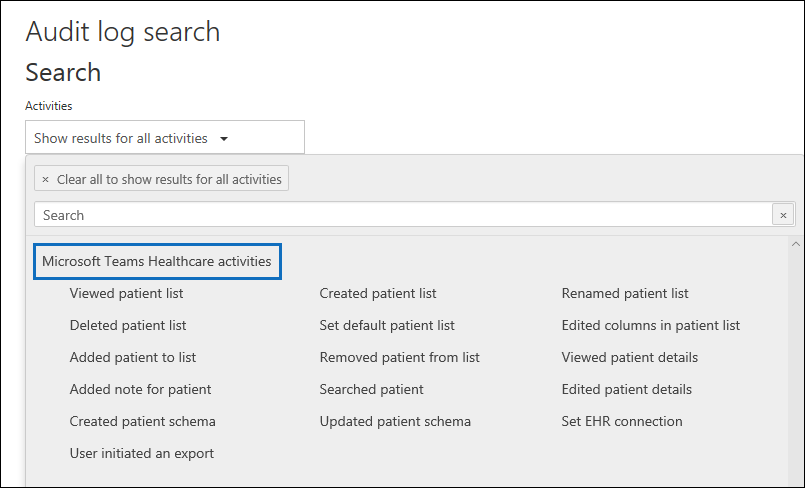

# <a name="search-the-audit-log-in-the-security--compliance-center"></a><span data-ttu-id="11176-103">보안 및 준수 센터에서 감사 로그 검색</span><span class="sxs-lookup"><span data-stu-id="11176-103">Search the audit log in the Security & Compliance Center</span></span>

## <a name="introduction"></a><span data-ttu-id="11176-104">소개</span><span class="sxs-lookup"><span data-stu-id="11176-104">Introduction</span></span>

<span data-ttu-id="11176-105">사용자가 특정 문서를 보았는지 또는 사서함에서 항목을 제거했는지 확인해야 하나요?</span><span class="sxs-lookup"><span data-stu-id="11176-105">Need to find if a user viewed a specific document or purged an item from their mailbox?</span></span> <span data-ttu-id="11176-106">그렇다면 보안 및 준수 센터를 사용하여 통합 감사 로그를 검색해 조직의 사용자와 관리자 활동을 확인합니다.</span><span class="sxs-lookup"><span data-stu-id="11176-106">If so, you can use the Security & Compliance Center to search the unified audit log to view user and administrator activity in your organization.</span></span> <span data-ttu-id="11176-107">통합된 감사 로그를 사용하는 이유는 무엇일까요?</span><span class="sxs-lookup"><span data-stu-id="11176-107">Why a unified audit log?</span></span> <span data-ttu-id="11176-108">Office 365에서 다음과 같은 유형의 [사용자 및 관리자 활동](#audited-activities)을 검색할 수 있기 때문입니다.</span><span class="sxs-lookup"><span data-stu-id="11176-108">Because you can search for the following types of [user and admin activity](#audited-activities) in Office 365:</span></span>

- <span data-ttu-id="11176-109">SharePoint Online 및 비즈니스용 OneDrive의 사용자 활동</span><span class="sxs-lookup"><span data-stu-id="11176-109">User activity in SharePoint Online and OneDrive for Business</span></span>

- <span data-ttu-id="11176-110">Exchange Online(Exchange 사서함 감사 로깅)의 사용자 활동</span><span class="sxs-lookup"><span data-stu-id="11176-110">User activity in Exchange Online (Exchange mailbox audit logging)</span></span>

- <span data-ttu-id="11176-111">SharePoint Online의 관리 활동</span><span class="sxs-lookup"><span data-stu-id="11176-111">Admin activity in SharePoint Online</span></span>

- <span data-ttu-id="11176-112">Azure Active Directory(Office 365용 디렉터리 서비스)의 관리자 활동</span><span class="sxs-lookup"><span data-stu-id="11176-112">Admin activity in Azure Active Directory (the directory service for Office 365)</span></span>

- <span data-ttu-id="11176-113">Exchange Online(Exchange 관리자 감사 로깅)의 관리자 활동</span><span class="sxs-lookup"><span data-stu-id="11176-113">Admin activity in Exchange Online (Exchange admin audit logging)</span></span>

- <span data-ttu-id="11176-114">Sway의 사용자 및 관리자 활동</span><span class="sxs-lookup"><span data-stu-id="11176-114">User and admin activity in Sway</span></span>

- <span data-ttu-id="11176-115">보안 및 준수 센터에서 eDiscovery 활동</span><span class="sxs-lookup"><span data-stu-id="11176-115">eDiscovery activities in the security and compliance center</span></span>

- <span data-ttu-id="11176-116">Power BI의 사용자 및 관리자 활동</span><span class="sxs-lookup"><span data-stu-id="11176-116">User and admin activity in Power BI</span></span>

- <span data-ttu-id="11176-117">Microsoft Teams의 사용자 및 관리자 활동</span><span class="sxs-lookup"><span data-stu-id="11176-117">User and admin activity in Microsoft Teams</span></span>

- <span data-ttu-id="11176-118">Dynamics 365의 사용자 및 관리자 활동</span><span class="sxs-lookup"><span data-stu-id="11176-118">User and admin activity in Dynamics 365</span></span>

- <span data-ttu-id="11176-119">Yammer의 사용자 및 관리자 활동</span><span class="sxs-lookup"><span data-stu-id="11176-119">User and admin activity in Yammer</span></span>

- <span data-ttu-id="11176-120">Microsoft Power Automate의 사용자 및 관리자 활동</span><span class="sxs-lookup"><span data-stu-id="11176-120">User and admin activity in Microsoft Power Automate</span></span>

- <span data-ttu-id="11176-121">Microsoft Stream의 사용자 및 관리자 활동</span><span class="sxs-lookup"><span data-stu-id="11176-121">User and admin activity in Microsoft Stream</span></span>

- <span data-ttu-id="11176-122">Microsoft Workplace Analytics의 분석가 및 관리자 활동</span><span class="sxs-lookup"><span data-stu-id="11176-122">Analyst and admin activity in Microsoft Workplace Analytics</span></span>

- <span data-ttu-id="11176-123">Microsoft Power Apps의 사용자 및 관리자 활동</span><span class="sxs-lookup"><span data-stu-id="11176-123">User and admin activity in Microsoft Power Apps</span></span>

- <span data-ttu-id="11176-124">Microsoft Forms의 사용자 및 관리자 활동</span><span class="sxs-lookup"><span data-stu-id="11176-124">User and admin activity in Microsoft Forms</span></span>

- <span data-ttu-id="11176-125">SharePoint Online 또는 Microsoft Teams를 사용하는 사이트의 민감도 레이블에 대한 사용자 및 관리자 활동</span><span class="sxs-lookup"><span data-stu-id="11176-125">User and admin activity for sensitivity labels for sites that use SharePoint Online or Microsoft Teams</span></span>

## <a name="before-you-begin"></a><span data-ttu-id="11176-126">시작하기 전에</span><span class="sxs-lookup"><span data-stu-id="11176-126">Before you begin</span></span>

<span data-ttu-id="11176-127">감사 로그의 검색을 시작하기 전에 반드시 아래 내용을 읽어보세요.</span><span class="sxs-lookup"><span data-stu-id="11176-127">Be sure to read the following items before you start searching the audit log.</span></span>

- <span data-ttu-id="11176-128">먼저 관리자(또는 또 다른 관리자)가 감사 로깅을 켜야 감사 로그를 검색할 수 있습니다.</span><span class="sxs-lookup"><span data-stu-id="11176-128">You (or another admin) must first turn on audit logging before you can start searching the audit log.</span></span> <span data-ttu-id="11176-129">감사 로깅을 켜려면 보안 및 준수 센터의 **감사 로그 검색** 페이지에서 **감사 기능 설정**을 클릭합니다.</span><span class="sxs-lookup"><span data-stu-id="11176-129">To turn it on, click **Turn on auditing** on the **Audit log search** page in the Security & Compliance Center.</span></span> <span data-ttu-id="11176-130">(이 링크가 표시되지 않으면 조직에 대해 감사가 이미 켜져 있는 것입니다.) 감사 로깅을 켜면 감사 로그를 준비 중이며 준비가 완료된 후 두 시간 내에 검색을 실행할 수 있다는 메시지가 표시됩니다.</span><span class="sxs-lookup"><span data-stu-id="11176-130">(If you don't see this link, auditing has already been turned on for your organization.) After you turn it on, a message is displayed that says the audit log is being prepared and that you can run a search in a couple of hours after the preparation is complete.</span></span> <span data-ttu-id="11176-131">이 작업은 한 번만 수행하면 됩니다.</span><span class="sxs-lookup"><span data-stu-id="11176-131">You only have to do this once.</span></span> <span data-ttu-id="11176-132">자세한 내용은 [감사 로그 검색 설정 및 해제](turn-audit-log-search-on-or-off.md)를 참조하세요.</span><span class="sxs-lookup"><span data-stu-id="11176-132">For more information, see [Turn audit log search on or off](turn-audit-log-search-on-or-off.md).</span></span>

  > [!NOTE]
  > <span data-ttu-id="11176-133">현재 기본적으로 감사가 켜지도록 구현 중입니다.</span><span class="sxs-lookup"><span data-stu-id="11176-133">We're in the process of turning on auditing by default.</span></span> <span data-ttu-id="11176-134">해당 기능이 구현될 때까지 앞에서 설명한 단계에 따라 직접 켜시기 바랍니다.</span><span class="sxs-lookup"><span data-stu-id="11176-134">Until then, you can turn it on as previously described.</span></span>

- <span data-ttu-id="11176-135">감사 로그를 검색하려면 Exchange Online에서 보기 전용 감사 로그 또는 감사 로그 역할이 할당되어야 합니다.</span><span class="sxs-lookup"><span data-stu-id="11176-135">You have to be assigned the View-Only Audit Logs or Audit Logs role in Exchange Online to search the audit log.</span></span> <span data-ttu-id="11176-136">기본적으로 이러한 역할은 Exchange 관리 센터의 **사용 권한** 페이지에서 규정 준수 관리 및 조직 관리 역할 그룹에 할당됩니다.</span><span class="sxs-lookup"><span data-stu-id="11176-136">By default, these roles are assigned to the Compliance Management and Organization Management role groups on the **Permissions** page in the Exchange admin center.</span></span> <span data-ttu-id="11176-137">참고 Office 365 및 Microsoft 365의 전역 관리자는 자동으로 Exchange Online 서비스에서 조직 관리 역할 그룹의 구성원이 됩니다.</span><span class="sxs-lookup"><span data-stu-id="11176-137">Note global administrators in Office 365 and Microsoft 365 are automatically added as members of the Organization Management role group in Exchange Online.</span></span> <span data-ttu-id="11176-138">최소 권한 수준을 사용하여 감사 로그를 검색할 수 있는 권한을 사용자에게 제공하려면 Exchange Online에서 사용자 지정 역할 그룹을 만들고, 보기 전용 감사 로그 또는 감사 로그 역할을 추가한 다음, 새 역할 그룹의 구성원으로 사용자를 추가할 수 있습니다.</span><span class="sxs-lookup"><span data-stu-id="11176-138">To give a user the ability to search the audit log with the minimum level of privileges, you can create a custom role group in Exchange Online, add the View-Only Audit Logs or Audit Logs role, and then add the user as a member of the new role group.</span></span> <span data-ttu-id="11176-139">자세한 내용은 [Exchange Online에서 역할 그룹 관리](https://go.microsoft.com/fwlink/p/?LinkID=730688)를 참조하세요.</span><span class="sxs-lookup"><span data-stu-id="11176-139">For more information, see [Manage role groups in Exchange Online](https://go.microsoft.com/fwlink/p/?LinkID=730688).</span></span>

  > [!IMPORTANT]
  > <span data-ttu-id="11176-140">보안 및 준수 센터의 **사용 권한** 페이지에서 사용자에게 보기 전용 감사 로그 또는 감사 로그 역할을 할당하는 경우 감사 로그를 검색할 수 없습니다.</span><span class="sxs-lookup"><span data-stu-id="11176-140">If you assign a user the View-Only Audit Logs or Audit Logs role on the **Permissions** page in the Security & Compliance Center, they won't be able to search the audit log.</span></span> <span data-ttu-id="11176-141">Exchange Online에서 사용 권한을 할당해야 합니다.</span><span class="sxs-lookup"><span data-stu-id="11176-141">You have to assign the permissions in Exchange Online.</span></span> <span data-ttu-id="11176-142">감사 로그를 검색하는 데 사용되는 기본 cmdlet이 Exchange Online cmdlet이기 때문입니다.</span><span class="sxs-lookup"><span data-stu-id="11176-142">This is because the underlying cmdlet used to search the audit log is an Exchange Online cmdlet.</span></span>

- <span data-ttu-id="11176-143">사용자 또는 관리자가 감사되는 활동을 수행하면 감사 레코드가 생성되어 조직의 감사 로그에 저장됩니다.</span><span class="sxs-lookup"><span data-stu-id="11176-143">When an audited activity is performed by a user or admin, an audit record is generated and stored in the audit log for your organization.</span></span> <span data-ttu-id="11176-144">감사 기록이 보존되는(감사 로그에서 검색 가능한) 시간은 Office 365 또는 Microsoft 365 Enterprise 구독, 그리고 특히 특정 사용자에게 할당된 라이선스 유형에 따라 다릅니다.</span><span class="sxs-lookup"><span data-stu-id="11176-144">The length of time that an audit record is retained (and searchable in the audit log) depends on your Office 365 or Microsoft 365 Enterprise subscription, and specifically the type of the license that is assigned to specific users.</span></span>

  - <span data-ttu-id="11176-145">Office 365 E5 또는 Microsoft 365 E5 라이선스가 할당된 사용자(또는 Microsoft 365 E5 규정 준수 또는 Microsoft 365 E5 eDiscovery 및 Audit 추가 기능 라이선스가 있는 사용자)의 경우 Azure Active Directory, Exchange 및 SharePoint 활동에 대한 감사 레코드가 기본적으로 1년 동안 유지됩니다.</span><span class="sxs-lookup"><span data-stu-id="11176-145">For users assigned an Office 365 E5 or Microsoft 365 E5 license (or users with a Microsoft 365 E5 Compliance or Microsoft 365 E5 eDiscovery and Audit add-on license), audit records for Azure Active Directory, Exchange, and SharePoint activity are retained for one year by default.</span></span> <span data-ttu-id="11176-146">조직은 감사 로그 보존 정책을 만들어 다른 서비스 활동에 대한 감사 레코드를 최대 1년 동안 유지할 수도 있습니다.</span><span class="sxs-lookup"><span data-stu-id="11176-146">Organizations can also create audit log retention policies to retain audit records for activities in other services for up to one year.</span></span> <span data-ttu-id="11176-147">자세한 내용은 [감사 로그 보존 정책 관리](audit-log-retention-policies.md)를 참조하십시오.</span><span class="sxs-lookup"><span data-stu-id="11176-147">For more information, see [Manage audit log retention policies](audit-log-retention-policies.md).</span></span>

    > [!NOTE]
    > <span data-ttu-id="11176-148">조직이 감사 레코드의 1년 보존을 위해 개인 미리보기 프로그램에 참여한 경우 일반 가용성 롤아웃 날짜 이전에 생성 된 감사 레코드의 보존 기간은 재설정되지 않습니다.</span><span class="sxs-lookup"><span data-stu-id="11176-148">If your organization participated in the private preview program for the one-year retention of audit records, the retention duration for audit records that were generated before the general availability rollout date will not be reset.</span></span>

  - <span data-ttu-id="11176-149">E5 이외의 다른 Office 365 또는 Microsoft 365 라이선스가 할당된 사용자의 경우 감사 레코드가 90일 동안 보존됩니다.</span><span class="sxs-lookup"><span data-stu-id="11176-149">For users assigned any other (non-E5) Office 365 or Microsoft 365 license, audit records are retained for 90 days.</span></span> <span data-ttu-id="11176-150">통합 감사 로깅을 지원하는 Office 365 및 Microsoft 365 구독 목록을 확인하려면 [보안 및 규정 준수 센터 서비스 설명](https://docs.microsoft.com/office365/servicedescriptions/office-365-platform-service-description/office-365-securitycompliance-center)을 참조하세요.</span><span class="sxs-lookup"><span data-stu-id="11176-150">For a list of Office 365 and Microsoft 365 subscriptions that support unified audit logging, see [the security and compliance center service description](https://docs.microsoft.com/office365/servicedescriptions/office-365-platform-service-description/office-365-securitycompliance-center).</span></span>

    > [!NOTE]
    > <span data-ttu-id="11176-151">기본적으로 사서함 감사가 설정되어 있더라도 일부 사용자에 대한 사서함 감사 이벤트는 보안 및 준수 센터의 감사 로그 검색에서 발견되지 않거나 Office 365 관리 작업 API를 통해 찾지 못할 수 있습니다.</span><span class="sxs-lookup"><span data-stu-id="11176-151">Even when mailbox auditing on by default is turned on, you might notice that mailbox audit events for some users aren't found in audit log searches in the Security & Compliance Center or via the Office 365 Management Activity API.</span></span> <span data-ttu-id="11176-152">자세한 내용은 [사서함 감사 로깅에 대한 자세한 정보](enable-mailbox-auditing.md#more-information)를 참조하세요.</span><span class="sxs-lookup"><span data-stu-id="11176-152">For more information, see [More information about mailbox audit logging](enable-mailbox-auditing.md#more-information).</span></span>

- <span data-ttu-id="11176-153">조직의 감사 로그 검색을 해제하려면 Exchange Online 조직에 연결된 원격 PowerShell에서 다음의 명령을 실행합니다.</span><span class="sxs-lookup"><span data-stu-id="11176-153">If you want to turn off audit log search for your organization, you can run the following command in remote PowerShell connected to your Exchange Online organization:</span></span>

  ```powershell
  Set-AdminAuditLogConfig -UnifiedAuditLogIngestionEnabled $false
  ```

    <span data-ttu-id="11176-154">감사 검색을 다시 설정하기 위해 Exchange Online PowerShell에서 다음 명령을 실행할 수 있습니다.</span><span class="sxs-lookup"><span data-stu-id="11176-154">To turn on audit search again, you can run the following command in Exchange Online PowerShell:</span></span>

  ```powershell
  Set-AdminAuditLogConfig -UnifiedAuditLogIngestionEnabled $true
  ```

  <span data-ttu-id="11176-155">자세한 내용은 [감사 로그 검색 해제](turn-audit-log-search-on-or-off.md)를 참조하세요.</span><span class="sxs-lookup"><span data-stu-id="11176-155">For more information, see [Turn off audit log search](turn-audit-log-search-on-or-off.md).</span></span>

- <span data-ttu-id="11176-156">이전에 설명한 것처럼, 감사 로그를 검색하는 데 사용되는 기본 cmdlet은 **Search-UnifiedAuditLog**인 Exchange Online cmdlet입니다.</span><span class="sxs-lookup"><span data-stu-id="11176-156">As previously stated, the underlying cmdlet used to search the audit log is an Exchange Online cmdlet, which is **Search-UnifiedAuditLog**.</span></span> <span data-ttu-id="11176-157">즉 보안 및 준수 센터의 **감사 로그 검색** 페이지를 사용하는 대신 이 cmdlet을 사용하여 감사 로그를 검색할 수 있습니다.</span><span class="sxs-lookup"><span data-stu-id="11176-157">That means you can use this cmdlet to search the audit log instead of using the **Audit log search** page in the Security & Compliance Center.</span></span> <span data-ttu-id="11176-158">Exchange Online 조직에 연결된 원격 PowerShell에서 이 cmdlet을 실행해야 합니다.</span><span class="sxs-lookup"><span data-stu-id="11176-158">You have to run this cmdlet in remote PowerShell connected to your Exchange Online organization.</span></span> <span data-ttu-id="11176-159">자세한 내용은 [Search-UnifiedAuditLog](https://go.microsoft.com/fwlink/p/?linkid=834776)를 참조하세요.</span><span class="sxs-lookup"><span data-stu-id="11176-159">For more information, see [Search-UnifiedAuditLog](https://go.microsoft.com/fwlink/p/?linkid=834776).</span></span>

  <span data-ttu-id="11176-160">**Search-UnifiedAuditLog** cmdlet에서 반환되는 검색 결과를 CSV 파일로 내보내는 방법에 대한 자세한 내용은 [감사 로그 레코드 내보내기, 구성 및 보기](export-view-audit-log-records.md#tips-for-exporting-and-viewing-the-audit-log)의 "감사 로그 내보내기 및 보기 팁" 섹션을 참조하세요.</span><span class="sxs-lookup"><span data-stu-id="11176-160">For information about exporting the search results returned by the **Search-UnifiedAuditLog** cmdlet to a CSV file, see the "Tips for exporting and viewing the audit log" section in [Export, configure, and view audit log records](export-view-audit-log-records.md#tips-for-exporting-and-viewing-the-audit-log).</span></span>

- <span data-ttu-id="11176-161">감사 로그에서 프로그래밍 방식으로 데이터를 다운로드하려면 PowerShell 스크립트를 사용하는 대신 Office 365 관리 작업 API를 사용하는 것이 좋습니다.</span><span class="sxs-lookup"><span data-stu-id="11176-161">If you want to programmatically download data from the audit log, we recommend that you use the Office 365 Management Activity API instead of using a PowerShell script.</span></span> <span data-ttu-id="11176-162">Office 365 관리 작업 API는 조직의 작업, 보안 및 규정 준수 모니터링 솔루션을 개발하는 데 사용할 수 있는 REST 웹 서비스입니다.</span><span class="sxs-lookup"><span data-stu-id="11176-162">The Office 365 Management Activity API is a REST web service that you can use to develop operations, security, and compliance monitoring solutions for your organization.</span></span> <span data-ttu-id="11176-163">자세한 내용은 [Office 365 관리 작업 API 참조](https://docs.microsoft.com/office/office-365-management-api/office-365-management-activity-api-reference)를 참조하세요.</span><span class="sxs-lookup"><span data-stu-id="11176-163">For more information, see [Office 365 Management Activity API reference](https://docs.microsoft.com/office/office-365-management-api/office-365-management-activity-api-reference).</span></span>

- <span data-ttu-id="11176-164">감사 로그 검색 결과에 해당 감사 로그 레코드가 반환되려면 이벤트 발생 시점으로부터 30분에서 24시간 정도 걸릴 수 있습니다.</span><span class="sxs-lookup"><span data-stu-id="11176-164">It can take up to 30 minutes or up to 24 hours after an event occurs for the corresponding audit log record to be returned in the results of an audit log search.</span></span> <span data-ttu-id="11176-165">다음 표에는 Office 365의 여러 서비스가 표시되는 데 걸리는 시간이 나와 있습니다.</span><span class="sxs-lookup"><span data-stu-id="11176-165">The following table shows the time it takes for the different services in Office 365.</span></span>

  |<span data-ttu-id="11176-166">**Microsoft 365 서비스 또는 기능**</span><span class="sxs-lookup"><span data-stu-id="11176-166">**Microsoft 365 service or feature**</span></span>|<span data-ttu-id="11176-167">**30분**</span><span class="sxs-lookup"><span data-stu-id="11176-167">**30 minutes**</span></span>|<span data-ttu-id="11176-168">**24시간**</span><span class="sxs-lookup"><span data-stu-id="11176-168">**24 hours**</span></span>|
  |:-----|:-----:|:-----:|
  |<span data-ttu-id="11176-169">고급 위협 방지 및 위협 인텔리전스</span><span class="sxs-lookup"><span data-stu-id="11176-169">Advanced Threat Protection and Threat Intelligence</span></span>|||
  |<span data-ttu-id="11176-171">Azure Active Directory(사용자 로그인 이벤트)</span><span class="sxs-lookup"><span data-stu-id="11176-171">Azure Active Directory (user login events)</span></span>|||
  |<span data-ttu-id="11176-173">Azure Active Directory(관리 이벤트)</span><span class="sxs-lookup"><span data-stu-id="11176-173">Azure Active Directory (admin events)</span></span>|||
  |<span data-ttu-id="11176-175">데이터 손실 방지</span><span class="sxs-lookup"><span data-stu-id="11176-175">Data Loss Prevention</span></span>|||
  |<span data-ttu-id="11176-177">Dynamics 365 CRM</span><span class="sxs-lookup"><span data-stu-id="11176-177">Dynamics 365 CRM</span></span>|||
  |<span data-ttu-id="11176-179">eDiscovery</span><span class="sxs-lookup"><span data-stu-id="11176-179">eDiscovery</span></span>|||
  |<span data-ttu-id="11176-181">Exchange Online</span><span class="sxs-lookup"><span data-stu-id="11176-181">Exchange Online</span></span>|||
  |<span data-ttu-id="11176-183">Microsoft Power Automate</span><span class="sxs-lookup"><span data-stu-id="11176-183">Microsoft Power Automate</span></span>|||
  |<span data-ttu-id="11176-185">Microsoft Project</span><span class="sxs-lookup"><span data-stu-id="11176-185">Microsoft Project</span></span>|||
  |<span data-ttu-id="11176-187">Microsoft Stream</span><span class="sxs-lookup"><span data-stu-id="11176-187">Microsoft Stream</span></span>|||
  |<span data-ttu-id="11176-189">Microsoft Teams</span><span class="sxs-lookup"><span data-stu-id="11176-189">Microsoft Teams</span></span>|||
  |<span data-ttu-id="11176-191">Power Apps</span><span class="sxs-lookup"><span data-stu-id="11176-191">Power Apps</span></span>|||
  |<span data-ttu-id="11176-193">Power BI</span><span class="sxs-lookup"><span data-stu-id="11176-193">Power BI</span></span>|||
  |<span data-ttu-id="11176-195">보안 및 준수 센터</span><span class="sxs-lookup"><span data-stu-id="11176-195">Security & Compliance Center</span></span>|||
  |<span data-ttu-id="11176-197">민감도 레이블</span><span class="sxs-lookup"><span data-stu-id="11176-197">Sensitivity labels</span></span>|||
  |<span data-ttu-id="11176-199">SharePoint Online 및 비즈니스용 OneDrive</span><span class="sxs-lookup"><span data-stu-id="11176-199">SharePoint Online and OneDrive for Business</span></span>|||
  |<span data-ttu-id="11176-201">Sway</span><span class="sxs-lookup"><span data-stu-id="11176-201">Sway</span></span>|||
  |<span data-ttu-id="11176-203">Workplace Analytics</span><span class="sxs-lookup"><span data-stu-id="11176-203">Workplace Analytics</span></span>|||
  |<span data-ttu-id="11176-205">Yammer</span><span class="sxs-lookup"><span data-stu-id="11176-205">Yammer</span></span>||||
  |<span data-ttu-id="11176-207">Microsoft Forms</span><span class="sxs-lookup"><span data-stu-id="11176-207">Microsoft Forms</span></span>||
  ||||

- <span data-ttu-id="11176-209">Azure A (azure Active Directory)는 Office 365의 디렉터리 서비스입니다.</span><span class="sxs-lookup"><span data-stu-id="11176-209">Azure Active Directory (Azure AD) is the directory service for Office 365.</span></span> <span data-ttu-id="11176-210">통합 감사 로그에는 Microsoft 365 관리 센터 또는 Azure 관리 포털에서 수행된 사용자, 그룹, 응용 프로그램, 도메인 및 디렉터리 활동이 포함됩니다.</span><span class="sxs-lookup"><span data-stu-id="11176-210">The unified audit log contains user, group, application, domain, and directory activities performed in the Microsoft 365 admin center or in the Azure management portal.</span></span> <span data-ttu-id="11176-211">Azure AD 이벤트의 전체 목록은 [Azure Active Directory 감사 보고서 이벤트](https://go.microsoft.com/fwlink/p/?LinkID=616549)를 참조하세요.</span><span class="sxs-lookup"><span data-stu-id="11176-211">For a complete list of Azure AD events, see [Azure Active Directory Audit Report Events](https://go.microsoft.com/fwlink/p/?LinkID=616549).</span></span>

- <span data-ttu-id="11176-212">Power BI에 대 한 감사 로깅은 기본적으로 사용하지 않도록 설정되어 있습니다.</span><span class="sxs-lookup"><span data-stu-id="11176-212">Audit logging for Power BI isn't enabled by default.</span></span> <span data-ttu-id="11176-213">감사 로그에서 Power BI 작업을 검색하려면 Power BI 관리 포털에서 감사를 사용하도록 설정해야 합니다.</span><span class="sxs-lookup"><span data-stu-id="11176-213">To search for Power BI activities in the audit log, you have to enable auditing in the Power BI admin portal.</span></span> <span data-ttu-id="11176-214">자세한 내용은 [Power BI 관리 포털](https://docs.microsoft.com/power-bi/service-admin-portal#audit-logs)의 "감사 로그" 섹션을 참조 하세요.</span><span class="sxs-lookup"><span data-stu-id="11176-214">For instructions, see the "Audit logs" section in [Power BI admin portal](https://docs.microsoft.com/power-bi/service-admin-portal#audit-logs).</span></span>

## <a name="search-the-audit-log"></a><span data-ttu-id="11176-215">감사 로그 검색</span><span class="sxs-lookup"><span data-stu-id="11176-215">Search the audit log</span></span>

<span data-ttu-id="11176-216">Office 365에서 감사 로그를 검색하는 과정은 다음과 같습니다. </span><span class="sxs-lookup"><span data-stu-id="11176-216">Here's the process for searching the audit log in Office 365.</span></span>

[<span data-ttu-id="11176-217">1단계: 감사 로그 검색 실행</span><span class="sxs-lookup"><span data-stu-id="11176-217">Step 1: Run an audit log search</span></span>](#step-1-run-an-audit-log-search)

[<span data-ttu-id="11176-218">2단계: 검색 결과 보기</span><span class="sxs-lookup"><span data-stu-id="11176-218">Step 2: View the search results</span></span>](#step-2-view-the-search-results)

[<span data-ttu-id="11176-219">3단계: 검색 결과 필터링</span><span class="sxs-lookup"><span data-stu-id="11176-219">Step 3: Filter the search results</span></span>](#step-3-filter-the-search-results)

[<span data-ttu-id="11176-220">4단계: 검색 결과를 파일로 내보내기</span><span class="sxs-lookup"><span data-stu-id="11176-220">Step 4: Export the search results to a file</span></span>](#step-4-export-the-search-results-to-a-file)

### <a name="step-1-run-an-audit-log-search"></a><span data-ttu-id="11176-221">1단계: 감사 로그 검색 실행</span><span class="sxs-lookup"><span data-stu-id="11176-221">Step 1: Run an audit log search</span></span>

1. <span data-ttu-id="11176-222">[https://protection.office.com](https://protection.office.com)으로 이동합니다.</span><span class="sxs-lookup"><span data-stu-id="11176-222">Go to [https://protection.office.com](https://protection.office.com).</span></span>

    > [!TIP]
    > <span data-ttu-id="11176-223">비공개 브라우징 세션(일반 세션이 아님)을 사용하여 보안 및 준수 센터에 액세스하면 현재 로그온한 자격 증명을 사용할 수 없으므로 비공개 브라우징 세션을 사용하세요.</span><span class="sxs-lookup"><span data-stu-id="11176-223">Use a private browsing session (not a regular session) to access the Security & Compliance Center because this will prevent the credential that you are currently logged on with from being used.</span></span> <span data-ttu-id="11176-224">Internet Explorer 또는 Microsoft Edge에서 InPrivate 브라우징 세션을 열려면 CTRL+SHIFT+P를 누릅니다.</span><span class="sxs-lookup"><span data-stu-id="11176-224">To open an InPrivate Browsing session in Internet Explorer or Microsoft Edge, just press CTRL+SHIFT+P.</span></span> <span data-ttu-id="11176-225">Google Chrome에서 비공개 브라우징 세션을 열려면(incognito 창이라고 함) CTRL+SHIFT+N을 누릅니다.</span><span class="sxs-lookup"><span data-stu-id="11176-225">To open a private browsing session in Google Chrome (called an incognito window), press CTRL+SHIFT+N.</span></span>

2. <span data-ttu-id="11176-226">회사 또는 학교 계정을 사용하여 로그인합니다.</span><span class="sxs-lookup"><span data-stu-id="11176-226">Sign in using your work or school account.</span></span>

3. <span data-ttu-id="11176-227">보안 및 준수 센터의 왼쪽 창에서 **검색**을 클릭한 다음 **감사 로그 검색**을 클릭합니다.</span><span class="sxs-lookup"><span data-stu-id="11176-227">In the left pane of the Security & Compliance Center, click **Search**, and then click **Audit log search**.</span></span>

    <span data-ttu-id="11176-228">**감사 로그 검색** 페이지가 표시됩니다.</span><span class="sxs-lookup"><span data-stu-id="11176-228">The **Audit log search** page is displayed.</span></span>

    

    > [!NOTE]
    > <span data-ttu-id="11176-230">먼저 감사 로깅을 켜야 감사 로그 검색을 실행할 수 있습니다.</span><span class="sxs-lookup"><span data-stu-id="11176-230">You have to first turn on audit logging before you can run an audit log search.</span></span> <span data-ttu-id="11176-231">**사용자 및 관리자 활동 기록 시작** 링크가 표시되면 클릭하여 감사를 켭니다.</span><span class="sxs-lookup"><span data-stu-id="11176-231">If the **Start recording user and admin activity** link is displayed, click it to turn on auditing.</span></span> <span data-ttu-id="11176-232">이 링크가 표시되지 않으면 조직에 대해 감사가 이미 켜져 있는 것입니다.</span><span class="sxs-lookup"><span data-stu-id="11176-232">If you don't see this link, auditing has already been turned on for your organization.</span></span>

4. <span data-ttu-id="11176-233">다음과 같은 검색 조건을 구성합니다. </span><span class="sxs-lookup"><span data-stu-id="11176-233">Configure the following search criteria:</span></span>

    <span data-ttu-id="11176-234">a.</span><span class="sxs-lookup"><span data-stu-id="11176-234">a.</span></span> <span data-ttu-id="11176-235">**활동**: 드롭다운 목록을 클릭하여 검색할 수 있는 활동을 표시합니다.</span><span class="sxs-lookup"><span data-stu-id="11176-235">**Activities**: Click the drop-down list to display the activities that you can search for.</span></span> <span data-ttu-id="11176-236">사용자 및 관리자 활동은 관련 활동 그룹으로 구성되어 있습니다.</span><span class="sxs-lookup"><span data-stu-id="11176-236">User and admin activities are organized into groups of related activities.</span></span> <span data-ttu-id="11176-237">특정 활동을 선택하거나, 활동 그룹 이름을 클릭하여 그룹의 모든 활동을 선택할 수 있습니다.</span><span class="sxs-lookup"><span data-stu-id="11176-237">You can select specific activities or you can click the activity group name to select all activities in the group.</span></span> <span data-ttu-id="11176-238">선택한 활동을 클릭하여 선택을 취소할 수도 있습니다.</span><span class="sxs-lookup"><span data-stu-id="11176-238">You can also click a selected activity to clear the selection.</span></span> <span data-ttu-id="11176-239">검색을 실행하면 선택한 활동에 대한 감사 로그 항목만 표시됩니다.</span><span class="sxs-lookup"><span data-stu-id="11176-239">After you run the search, only the audit log entries for the selected activities are displayed.</span></span> <span data-ttu-id="11176-240">**모든 활동에 대한 결과 표시**를 선택하면 선택한 사용자 또는 사용자 그룹이 수행한 모든 활동에 대한 결과가 표시됩니다.</span><span class="sxs-lookup"><span data-stu-id="11176-240">Selecting **Show results for all activities** displays results for all activities performed by the selected user or group of users.</span></span>

    <span data-ttu-id="11176-241">100개가 넘는 사용자 및 관리자 활동이 감사 로그에 기록됩니다.</span><span class="sxs-lookup"><span data-stu-id="11176-241">Over 100 user and admin activities are logged in the audit log.</span></span> <span data-ttu-id="11176-242">여러 서비스의 각 활동에 대한 설명을 보려면 이 문서의 항목에서 **감사되는 활동** 탭을 클릭합니다.</span><span class="sxs-lookup"><span data-stu-id="11176-242">Click the **Audited activities** tab at the topic of this article to see the descriptions of every activity in each of the different services.</span></span>

    <span data-ttu-id="11176-243">b.</span><span class="sxs-lookup"><span data-stu-id="11176-243">b.</span></span> <span data-ttu-id="11176-244">**시작 날짜** 및 \*\* 날짜\*\*: 기본적으로 최근 7일이 선택됩니다.</span><span class="sxs-lookup"><span data-stu-id="11176-244">**Start date** and **End date**: The last seven days are selected by default.</span></span> <span data-ttu-id="11176-245">날짜 및 시간 범위를 선택하여 해당 기간 내에 발생한 이벤트를 표시합니다.</span><span class="sxs-lookup"><span data-stu-id="11176-245">Select a date and time range to display the events that occurred within that period.</span></span> <span data-ttu-id="11176-246">날짜 및 시간은 UTC(협정 세계시) 형식으로 표시됩니다.</span><span class="sxs-lookup"><span data-stu-id="11176-246">The date and time are presented in Coordinated Universal Time (UTC) format.</span></span> <span data-ttu-id="11176-247">지정할 수 있는 최대 날짜 범위는 90일입니다.</span><span class="sxs-lookup"><span data-stu-id="11176-247">The maximum date range that you can specify is 90 days.</span></span> <span data-ttu-id="11176-248">선택한 날짜 범위가 90일보다 크면 오류가 표시됩니다.</span><span class="sxs-lookup"><span data-stu-id="11176-248">An error is displayed if the selected date range is greater than 90 days.</span></span>

    > [!TIP]
    > <span data-ttu-id="11176-249">최대 날짜 범위인 90일을 사용하는 경우 **시작 날짜**에 대해 현재 시간을 선택합니다.</span><span class="sxs-lookup"><span data-stu-id="11176-249">If you're using the maximum date range of 90 days, select the current time for the **Start date**.</span></span> <span data-ttu-id="11176-250">그러지 않으면 시작 날짜가 종료 날짜보다 이전이라는 오류가 표시됩니다.</span><span class="sxs-lookup"><span data-stu-id="11176-250">Otherwise, you'll receive an error saying that the start date is earlier than the end date.</span></span> <span data-ttu-id="11176-251">최근 90일 내에 감사를 켠 경우 최대 날짜 범위가 감사를 켠 날짜 이전에 시작할 수 없습니다.</span><span class="sxs-lookup"><span data-stu-id="11176-251">If you've turned on auditing within the last 90 days, the maximum date range can't start before the date that auditing was turned on.</span></span>

    <span data-ttu-id="11176-252">c.</span><span class="sxs-lookup"><span data-stu-id="11176-252">c.</span></span> <span data-ttu-id="11176-253">**사용자**: 이 상자 안을 클릭하고 검색 결과를 표시할 사용자를 하나 이상 선택합니다.</span><span class="sxs-lookup"><span data-stu-id="11176-253">**Users**: Click in this box and then select one or more users to display search results for.</span></span> <span data-ttu-id="11176-254">이 상자에서 선택한 사용자가 수행한 선택한 활동에 대한 감사 로그 항목이 결과 목록에 표시됩니다.</span><span class="sxs-lookup"><span data-stu-id="11176-254">The audit log entries for the selected activity performed by the users you select in this box are displayed in the list of results.</span></span> <span data-ttu-id="11176-255">조직의 모든 사용자(및 서비스 계정)에 대한 항목을 반환하려면 이 상자를 비워 둡니다.</span><span class="sxs-lookup"><span data-stu-id="11176-255">Leave this box blank to return entries for all users (and service accounts) in your organization.</span></span>

    <span data-ttu-id="11176-256">d.</span><span class="sxs-lookup"><span data-stu-id="11176-256">d.</span></span> <span data-ttu-id="11176-257">**파일, 폴더 또는 사이트**: 파일이나 폴더 이름의 일부 또는 전체를 입력하여 지정한 키워드를 포함하는 파일이나 폴더와 관련된 활동을 검색합니다.</span><span class="sxs-lookup"><span data-stu-id="11176-257">**File, folder, or site**: Type some or all of a file or folder name to search for activity related to the file of folder that contains the specified keyword.</span></span> <span data-ttu-id="11176-258">파일 또는 폴더의 URL을 지정할 수도 있습니다.</span><span class="sxs-lookup"><span data-stu-id="11176-258">You can also specify a URL of a file or folder.</span></span> <span data-ttu-id="11176-259">URL을 사용하는 경우 전체 URL 경로를 입력하거나 URL의 일부만 입력하는 경우 특수 문자나 공백을 포함하지 마세요.</span><span class="sxs-lookup"><span data-stu-id="11176-259">If you use a URL, be sure the type the full URL path or if you type a portion of the URL, don't include any special characters or spaces.</span></span>

    <span data-ttu-id="11176-260">조직의 모든 파일 및 폴더에 대한 항목을 반환하려면 이 상자를 비워 둡니다.</span><span class="sxs-lookup"><span data-stu-id="11176-260">Leave this box blank to return entries for all files and folders in your organization.</span></span>

   <span data-ttu-id="11176-261">**TIPS**</span><span class="sxs-lookup"><span data-stu-id="11176-261">**TIPS**</span></span>

   - <span data-ttu-id="11176-262">**사이트**와 관련된 모든 활동을 찾으려면 URL 뒤에 와일드 카드 기호 (\*)를 추가하여 해당 사이트의 모든 항목을 반환합니다. 예를 들어 **"https://contoso-my.sharepoint.com/personal/\*"** 가 있습니다.</span><span class="sxs-lookup"><span data-stu-id="11176-262">If you're looking for all activities related to a **site**, add the wildcard symbol (\*) after the URL to return all entries for that site; for example, **"https://contoso-my.sharepoint.com/personal/\*"**.</span></span>

   - <span data-ttu-id="11176-263">**파일**과 관련된 모든 활동을 찾으려면 파일 이름 앞에 와일드 카드 기호 (\*)를 추가하여 해당 파일의 모든 항목을 반환하십시오. 예를 들어 **"\*Customer_Profitability_Sample.csv"** 가 있습니다.</span><span class="sxs-lookup"><span data-stu-id="11176-263">If you're looking for all activities related to a **file**, add the wildcard symbol (\*) before the file name to return all entries for that file; for example, **"\*Customer_Profitability_Sample.csv"**.</span></span>

5. <span data-ttu-id="11176-264">**검색**을 클릭하여 검색 조건을 사용한 검색을 실행합니다. </span><span class="sxs-lookup"><span data-stu-id="11176-264">Click **Search** to run the search using your search criteria.</span></span>

   <span data-ttu-id="11176-265">검색 결과가 로드되고, 잠시 후에 **결과**에 표시됩니다.</span><span class="sxs-lookup"><span data-stu-id="11176-265">The search results are loaded, and after a few moments they are displayed under **Results**.</span></span> <span data-ttu-id="11176-266">검색이 완료되면 찾은 결과 수가 표시됩니다.</span><span class="sxs-lookup"><span data-stu-id="11176-266">When the search is finished, the number of results found is displayed.</span></span> <span data-ttu-id="11176-267">**결과** 창에 최대 5000 개의 이벤트가 150 이벤트 단위로 표시 됩니다.</span><span class="sxs-lookup"><span data-stu-id="11176-267">A maximum of 5,000 events will be displayed in the **Results** pane in increments of 150 events.</span></span> <span data-ttu-id="11176-268">5000개 이상의 이벤트에서 검색 조건을 충족하는 경우에는 최근 5000 이벤트가 표시됩니다.</span><span class="sxs-lookup"><span data-stu-id="11176-268">If more than 5,000 events meet the search criteria, the most recent 5,000 events are displayed.</span></span>

   

#### <a name="tips-for-searching-the-audit-log"></a><span data-ttu-id="11176-270">감사 로그 검색을 위한 팁</span><span class="sxs-lookup"><span data-stu-id="11176-270">Tips for searching the audit log</span></span>

- <span data-ttu-id="11176-271">활동 이름을 클릭하여 검색할 특정 활동을 선택할 수 있습니다.</span><span class="sxs-lookup"><span data-stu-id="11176-271">You can select specific activities to search for by clicking the activity name.</span></span> <span data-ttu-id="11176-272">또는 그룹 이름을 클릭하여 그룹의 모든 활동(예: **파일 및 폴더 활동**)을 검색할 수도 있습니다.</span><span class="sxs-lookup"><span data-stu-id="11176-272">Or you can search for all activities in a group (such as **File and folder activities**) by clicking the group name.</span></span> <span data-ttu-id="11176-273">활동이 선택된 경우 클릭하면 선택을 취소할 수 있습니다.</span><span class="sxs-lookup"><span data-stu-id="11176-273">If an activity is selected, you can click it to cancel the selection.</span></span> <span data-ttu-id="11176-274">검색 상자를 사용하여 입력한 키워드를 포함하는 활동을 표시할 수도 있습니다.</span><span class="sxs-lookup"><span data-stu-id="11176-274">You can also use the search box to display the activities that contain the keyword that you type.</span></span>

  

- <span data-ttu-id="11176-276">Exchange 관리자 감사 로그의 항목을 표시하려면 **활동** 목록에서 **모든 활동에 대한 결과 표시**를 선택해야 합니다.</span><span class="sxs-lookup"><span data-stu-id="11176-276">You have to select **Show results for all activities** in the **Activities** list to display events from the Exchange admin audit log.</span></span> <span data-ttu-id="11176-277">이 감사 로그의 이벤트는 결과의 **활동** 열에 cmdlet 이름(예: **Set-Mailbox**)을 표시합니다.</span><span class="sxs-lookup"><span data-stu-id="11176-277">Events from this audit log display a cmdlet name (for example, **Set-Mailbox**) in the **Activity** column in the results.</span></span> <span data-ttu-id="11176-278">자세한 내용을 보려면 이 항목에서 **감사되는 활동** 탭을 클릭한 다음 **Exchange 관리 활동** 클릭합니다.</span><span class="sxs-lookup"><span data-stu-id="11176-278">For more information, click the **Audited activities** tab in this topic and then click **Exchange admin activities**.</span></span>

  <span data-ttu-id="11176-279">마찬가지로 **활동** 목록에 해당하는 항목이 없는 일부 감사 활동이 있습니다.</span><span class="sxs-lookup"><span data-stu-id="11176-279">Similarly, there are some auditing activities that don't have a corresponding item in the **Activities** list.</span></span> <span data-ttu-id="11176-280">이러한 활동에 대한 작업 이름을 알고 있는 경우 모든 활동을 검색한 다음 **활동** 열의 상자에 작업 이름을 입력하여 결과를 필터링할 수 있습니다.</span><span class="sxs-lookup"><span data-stu-id="11176-280">If you know the name of the operation for these activities, you can search for all activities, then filter the results by typing the name of the operation in the box for the **Activity** column.</span></span> <span data-ttu-id="11176-281">결과 필터링에 대한 자세한 내용은 [3단계: 검색 결과 필터링](#step-3-filter-the-search-results)을 참조하세요.</span><span class="sxs-lookup"><span data-stu-id="11176-281">See [Step 3: Filter the search results](#step-3-filter-the-search-results) for more information about filtering the results.</span></span>

- <span data-ttu-id="11176-282">**지우기**를 클릭하여 현재 검색 조건을 지웁니다.</span><span class="sxs-lookup"><span data-stu-id="11176-282">Click **Clear** to clear the current search criteria.</span></span> <span data-ttu-id="11176-283">날짜 범위가 기본값인 최근 7일로 돌아갑니다.</span><span class="sxs-lookup"><span data-stu-id="11176-283">The date range returns to the default of the last seven days.</span></span> <span data-ttu-id="11176-284">**모든 활동에 대한 결과를 표시하도록 모두 지우기**를 클릭하여 선택한 모든 작업을 취소할 수도 있습니다.</span><span class="sxs-lookup"><span data-stu-id="11176-284">You can also click **Clear all to show results for all activities** to cancel all selected activities.</span></span>

- <span data-ttu-id="11176-285">5,000개의 결과가 발견되면 검색 조건에 맞는 이벤트가 5,000개 이상 있다고 가정할 수 있습니다.</span><span class="sxs-lookup"><span data-stu-id="11176-285">If 5,000 results are found, you can probably assume that there are more than 5,000 events that met the search criteria.</span></span> <span data-ttu-id="11176-286">검색 조건을 구체화한 다음 검색을 다시 실행하여 더 적은 결과를 반환하거나, **결과 내보내기** \> **모든 결과 다운로드**를 선택하여 모든 검색 결과를 내보낼 수 있습니다.</span><span class="sxs-lookup"><span data-stu-id="11176-286">You can either refine the search criteria and rerun the search to return fewer results, or you can export all of the search results by selecting **Export results** \> **Download all results**.</span></span>

### <a name="step-2-view-the-search-results"></a><span data-ttu-id="11176-287">2단계: 검색 결과 보기</span><span class="sxs-lookup"><span data-stu-id="11176-287">Step 2: View the search results</span></span>

<span data-ttu-id="11176-288">감사 로그 검색 결과는 **감사 로그 검색** 페이지의 **결과**에 표시됩니다.</span><span class="sxs-lookup"><span data-stu-id="11176-288">The results of an audit log search are displayed under **Results** on the **Audit log search** page.</span></span> <span data-ttu-id="11176-289">앞에서 언급한 것처럼 150개 이벤트 단위로 최대 5,000개(최신)의 이벤트가 표시됩니다.</span><span class="sxs-lookup"><span data-stu-id="11176-289">As previously stated a maximum of 5,000 (newest) events are displayed in increments of 150 events.</span></span> <span data-ttu-id="11176-290">이벤트를 더 표시하려면 **결과** 창에서 스크롤 막대를 사용하거나, **Shift+End**를 눌러 다음 150개의 이벤트를 표시할 수 있습니다.</span><span class="sxs-lookup"><span data-stu-id="11176-290">To display more events you can use the scroll bar in the **Results** pane or you can press **Shift + End** to display the next 150 events.</span></span>

<span data-ttu-id="11176-291">결과에는 검색에서 반환되는 각 이벤트에 대한 다음 정보가 포함됩니다.</span><span class="sxs-lookup"><span data-stu-id="11176-291">The results contain the following information about each event returned by the search:</span></span>

- <span data-ttu-id="11176-292">**날짜**: 이벤트가 발생한 날짜 및 시간(UTC 형식)입니다.</span><span class="sxs-lookup"><span data-stu-id="11176-292">**Date**: The date and time (in UTC format) when the event occurred.</span></span>

- <span data-ttu-id="11176-293">**IP 주소**: 활동을 기록할 때 사용된 장치의 IP 주소입니다.</span><span class="sxs-lookup"><span data-stu-id="11176-293">**IP address**: The IP address of the device that was used when the activity was logged.</span></span> <span data-ttu-id="11176-294">IP 주소는 IPv4 또는 IPv6 주소 형식으로 표시됩니다.</span><span class="sxs-lookup"><span data-stu-id="11176-294">The IP address is displayed in either an IPv4 or IPv6 address format.</span></span>

   > [!NOTE]
  > <span data-ttu-id="11176-295">일부 서비스의 경우 이 필드에 표시되는 값은 활동을 수행한 사람이 사용한 장치의 IP 주소가 아니라 사용자 대신 서비스를 호출하는 신뢰할 수 있는 응용 프로그램(예: 웹 앱의 Office)에 대한 IP 주소일 수 있습니다. </span><span class="sxs-lookup"><span data-stu-id="11176-295">For some services, the value displayed in this field might be the IP address for a trusted application (for example, Office on the web apps) calling into the service on behalf of a user and not the IP address of the device used by person who performed the activity.</span></span> <span data-ttu-id="11176-296">또한 Azure Active Directory 관련 이벤트에 대한 관리자 활동(또는 시스템 계정에서 수행한 활동)의 경우 IP 주소가 로깅되지 않으며 이 필드에 표시되는 값은 `null`입니다.</span><span class="sxs-lookup"><span data-stu-id="11176-296">Also, for admin activity (or activity performed by a system account) for Azure Active Directory-related events, the IP address isn't logged and the value displayed in this field is `null`.</span></span>

- <span data-ttu-id="11176-297">**사용자**: 이벤트를 트리거한 작업을 수행한 사용자(또는 서비스 계정)입니다.</span><span class="sxs-lookup"><span data-stu-id="11176-297">**User**: The user (or service account) who performed the action that triggered the event.</span></span>

- <span data-ttu-id="11176-298">**활동**: 사용자가 수행한 활동입니다.</span><span class="sxs-lookup"><span data-stu-id="11176-298">**Activity**: The activity performed by the user.</span></span> <span data-ttu-id="11176-299">이 값은 **활동** 드롭다운 목록에서 선택한 활동에 해당합니다.</span><span class="sxs-lookup"><span data-stu-id="11176-299">This value corresponds to the activities that you selected in the **Activities** drop down list.</span></span> <span data-ttu-id="11176-300">Exchange 관리자 감사 로그의 이벤트에 대한 이 열의 값은 Exchange cmdlet입니다.</span><span class="sxs-lookup"><span data-stu-id="11176-300">For an event from the Exchange admin audit log, the value in this column is an Exchange cmdlet.</span></span>

- <span data-ttu-id="11176-301">**항목**: 해당 활동의 결과로 생성 또는 수정된 개체입니다.</span><span class="sxs-lookup"><span data-stu-id="11176-301">**Item**: The object that was created or modified as a result of the corresponding activity.</span></span> <span data-ttu-id="11176-302">예를 들어, 보거나 수정된 파일 또는 업데이트된 사용자 계정입니다.</span><span class="sxs-lookup"><span data-stu-id="11176-302">For example, the file that was viewed or modified or the user account that was updated.</span></span> <span data-ttu-id="11176-303">일부 활동은 이 열에 값이 없습니다.</span><span class="sxs-lookup"><span data-stu-id="11176-303">Not all activities have a value in this column.</span></span>

- <span data-ttu-id="11176-304">**세부 정보**: 활동에 대한 추가 정보입니다.</span><span class="sxs-lookup"><span data-stu-id="11176-304">**Detail**: Additional information about an activity.</span></span> <span data-ttu-id="11176-305">마찬가지로, 일부 활동에는 값이 없습니다.</span><span class="sxs-lookup"><span data-stu-id="11176-305">Again, not all activities have a value.</span></span>

> [!TIP]
> <span data-ttu-id="11176-306">**결과** 아래의 열 머리글을 클릭하여 결과를 정렬합니다.</span><span class="sxs-lookup"><span data-stu-id="11176-306">Click a column header under **Results** to sort the results.</span></span> <span data-ttu-id="11176-307">결과를 오름차순 또는 내림차순으로 정렬할 수 있습니다. 결과를 가장 오래된 항목에서 최신 항목 순이나 최신 항목에서 가장 오래된 항목 순으로 정렬하려면 **날짜** 머리글을 클릭합니다.</span><span class="sxs-lookup"><span data-stu-id="11176-307">You can sort the results from A to Z or Z to A. Click the **Date** header to sort the results from oldest to newest or newest to oldest.</span></span>

#### <a name="view-the-details-for-a-specific-event"></a><span data-ttu-id="11176-308">특정 이벤트에 대한 세부 정보 보기</span><span class="sxs-lookup"><span data-stu-id="11176-308">View the details for a specific event</span></span>

<span data-ttu-id="11176-309">검색 결과 목록에서 이벤트 레코드를 클릭하여 이벤트에 대한 세부 정보를 볼 수 있습니다.</span><span class="sxs-lookup"><span data-stu-id="11176-309">You can view more details about an event by clicking the event record in the list of search results.</span></span> <span data-ttu-id="11176-310">이벤트 레코드의 자세한 속성이 포함된 **세부 정보**페이지가 표시됩니다.</span><span class="sxs-lookup"><span data-stu-id="11176-310">A **Details** page is displayed that contains the detailed properties from the event record.</span></span> <span data-ttu-id="11176-311">표시되는 속성은 이벤트가 발생한 서비스에 따라 다릅니다.</span><span class="sxs-lookup"><span data-stu-id="11176-311">The properties that are displayed depend on the service in which the event occurs.</span></span> <span data-ttu-id="11176-312">추가 세부 정보를 표시하려면 **추가 정보**를 클릭합니다.</span><span class="sxs-lookup"><span data-stu-id="11176-312">To display these details, click **More information**.</span></span> <span data-ttu-id="11176-313">설명은 [감사 로그의 자세한 속성](detailed-properties-in-the-office-365-audit-log.md)을 참조하세요.</span><span class="sxs-lookup"><span data-stu-id="11176-313">For descriptions, see [Detailed properties in the audit log](detailed-properties-in-the-office-365-audit-log.md).</span></span>


### <a name="step-3-filter-the-search-results"></a><span data-ttu-id="11176-315">3단계: 검색 결과 필터링</span><span class="sxs-lookup"><span data-stu-id="11176-315">Step 3: Filter the search results</span></span>

<span data-ttu-id="11176-316">정렬 외에도 감사 로그 검색 결과를 필터링할 수 있습니다.</span><span class="sxs-lookup"><span data-stu-id="11176-316">In addition to sorting, you can also filter the results of an audit log search.</span></span> <span data-ttu-id="11176-317">특정 사용자 또는 활동에 대한 결과를 빠르게 필터링하는 데 도움이 되는 유용한 기능입니다.</span><span class="sxs-lookup"><span data-stu-id="11176-317">This is a great feature that can help you quickly filter the results for a specific user or activity.</span></span> <span data-ttu-id="11176-318">처음에 광범위한 검색을 만든 후 결과를 빠르게 필터링하여 특정 이벤트를 확인할 수 있습니다.</span><span class="sxs-lookup"><span data-stu-id="11176-318">You can initially create a wide search and then quickly filter the results to see specific events.</span></span> <span data-ttu-id="11176-319">그런 다음 검색 조건 범위를 좁혀서 검색을 다시 실행하여 더 작고 간결한 결과 집합을 반환할 수 있습니다.</span><span class="sxs-lookup"><span data-stu-id="11176-319">Then you can narrow the search criteria and rerun the search to return a smaller, more concise set of results.</span></span>

<span data-ttu-id="11176-320">결과를 필터링하려면</span><span class="sxs-lookup"><span data-stu-id="11176-320">To filter the results:</span></span>

1. <span data-ttu-id="11176-321">감사 로그 검색을 실행합니다.</span><span class="sxs-lookup"><span data-stu-id="11176-321">Run an audit log search.</span></span>

2. <span data-ttu-id="11176-322">결과가 표시되면 **결과 필터링**을 클릭합니다.</span><span class="sxs-lookup"><span data-stu-id="11176-322">When the results are displayed, click **Filter results**.</span></span>

   <span data-ttu-id="11176-323">각 열 머리글 아래에 키워드 상자가 표시됩니다.</span><span class="sxs-lookup"><span data-stu-id="11176-323">Keyword boxes are displayed under each column header.</span></span>

3. <span data-ttu-id="11176-324">열 머리글 아래에 있는 상자 중 하나를 클릭하고 필터링할 열에 따라 단어 또는 구를 입력합니다.</span><span class="sxs-lookup"><span data-stu-id="11176-324">Click one of the boxes under a column header and type a word or phrase, depending on the column you're filtering on.</span></span> <span data-ttu-id="11176-325">결과가 동적으로 다시 조정되어 필터와 일치하는 이벤트를 표시합니다.</span><span class="sxs-lookup"><span data-stu-id="11176-325">The results will dynamically readjust to display the events that match your filter.</span></span>

   

4. <span data-ttu-id="11176-327">필터를 지우려면 필터 상자에서 **X**를 클릭하거나 **필터링 숨기기**를 클릭합니다.</span><span class="sxs-lookup"><span data-stu-id="11176-327">To clear a filter, click the **X** in the filter box or click **Hide filtering**.</span></span>

> [!TIP]
> <span data-ttu-id="11176-328">Exchange 관리자 감사 로그의 이벤트를 표시하려면 **활동** 필터 상자에 **-**(대시)를 입력합니다.</span><span class="sxs-lookup"><span data-stu-id="11176-328">To display events from the Exchange admin audit log, type a **-** (dash) in the **Activity** filter box.</span></span> <span data-ttu-id="11176-329">Exchange 관리자 이벤트에 대한 **활동** 열에 표시되는 cmdlet 이름이 나타납니다.</span><span class="sxs-lookup"><span data-stu-id="11176-329">This will display cmdlet names, which are displayed in the **Activity** column for Exchange admin events.</span></span> <span data-ttu-id="11176-330">그런 다음 cmdlet 이름을 사전순으로 정렬할 수 있습니다.</span><span class="sxs-lookup"><span data-stu-id="11176-330">Then you can sort the cmdlet names in alphabetical order.</span></span>

### <a name="step-4-export-the-search-results-to-a-file"></a><span data-ttu-id="11176-331">4단계: 검색 결과를 파일로 내보내기</span><span class="sxs-lookup"><span data-stu-id="11176-331">Step 4: Export the search results to a file</span></span>

<span data-ttu-id="11176-332">감사 로그 검색 결과를 로컬 컴퓨터의 CSV(쉼표로 구분된 값) 파일로 내보낼 수 있습니다.</span><span class="sxs-lookup"><span data-stu-id="11176-332">You can export the results of an audit log search to a comma-separated value (CSV) file on your local computer.</span></span> <span data-ttu-id="11176-333">Microsoft Excel에서 이 파일을 열고 검색, 정렬, 필터링, 단일 열(여러 속성 포함)을 여러 개의 열로 분할 등의 기능을 사용할 수 있습니다.</span><span class="sxs-lookup"><span data-stu-id="11176-333">You can open this file in Microsoft Excel and use features such as search, sorting, filtering, and splitting a single column (that contains multiple properties) into multiple columns.</span></span>

1. <span data-ttu-id="11176-334">감사 로그 검색을 실행한 다음 원하는 결과를 얻을 때까지 검색 조건을 수정합니다.</span><span class="sxs-lookup"><span data-stu-id="11176-334">Run an audit log search, and then revise the search criteria until you have the desired results.</span></span>

2. <span data-ttu-id="11176-335">**결과 내보내기**를 클릭하고 다음 옵션 중 하나를 선택합니다.</span><span class="sxs-lookup"><span data-stu-id="11176-335">Click **Export results** and select one of the following options:</span></span>

   - <span data-ttu-id="11176-336">**로드된 결과 저장**: **감사 로그 검색** 페이지의 **결과** 아래에 표시되는 항목만 내보내려면 이 옵션을 선택합니다.</span><span class="sxs-lookup"><span data-stu-id="11176-336">**Save loaded results**: Choose this option to export only the entries that are displayed under **Results** on the **Audit log search** page.</span></span> <span data-ttu-id="11176-337">다운로드한 CSV 파일에는 페이지에 표시되는 것과 동일한 열(날짜, 사용자, 활동, 항목 및 세부 정보) 및 데이터가 포함되어 있습니다.</span><span class="sxs-lookup"><span data-stu-id="11176-337">The CSV file that is downloaded contains the same columns (and data) displayed on the page (Date, User, Activity, Item, and Details).</span></span> <span data-ttu-id="11176-338">CSV 파일에 감사 로그 항목의 추가 정보가 들어 있는 추가 열(**자세히**)이 포함됩니다.</span><span class="sxs-lookup"><span data-stu-id="11176-338">An extra column (named **More**) is included in the CSV file that contains more information from the audit log entry.</span></span> <span data-ttu-id="11176-339">**감사 로그 검색** 페이지에 로드되어 표시되는 것과 동일한 결과를 내보내기 때문에 최대 5,000개의 항목이 내보내집니다.</span><span class="sxs-lookup"><span data-stu-id="11176-339">Because you're exporting the same results that are loaded (and viewable) on the **Audit log search** page, a maximum of 5,000 entries are exported.</span></span>

   - <span data-ttu-id="11176-340">**모든 결과 다운로드**: 감사 로그에서 검색 조건에 맞는 항목을 모두 내보내려면 이 옵션을 선택합니다.</span><span class="sxs-lookup"><span data-stu-id="11176-340">**Download all results**: Choose this option to export all entries from the audit log that meet the search criteria.</span></span> <span data-ttu-id="11176-341">검색 결과 집합이 큰 경우 이 옵션을 선택하여 **감사 로그 검색** 페이지에 표시되는 5,000개의 감사 레코드뿐 아니라 감사 로그의 모든 항목을 다운로드합니다.</span><span class="sxs-lookup"><span data-stu-id="11176-341">For a large set of search results, choose this option to download all entries from the audit log in addition to the 5,000 audit records that can be displayed on the **Audit log search** page.</span></span> <span data-ttu-id="11176-342">이 옵션은 감사 로그의 원시 데이터를 CSV 파일로 다운로드하며 감사 로그 항목의 추가 정보를 **AuditData** 열에 포함합니다.</span><span class="sxs-lookup"><span data-stu-id="11176-342">This option downloads the raw data from the audit log to a CSV file, and contains additional information from the audit log entry in a column named **AuditData**.</span></span> <span data-ttu-id="11176-343">파일이 다른 옵션을 선택할 경우 다운로드되는 파일보다 훨씬 더 클 수 있기 때문에 이 내보내기 옵션을 선택할 경우 파일을 다운로드하는 데 오래 걸릴 수 있습니다.</span><span class="sxs-lookup"><span data-stu-id="11176-343">It may take longer to download the file if you choose this export option because the file may be much larger than the one that's downloaded if you choose the other option.</span></span>

     > [!IMPORTANT]
     > <span data-ttu-id="11176-344">단일 감사 로그 검색에서 최대 50,000의 항목을 CSV 파일로 다운로드할 수 있습니다.</span><span class="sxs-lookup"><span data-stu-id="11176-344">You can download a maximum of 50,000 entries to a CSV file from a single audit log search.</span></span> <span data-ttu-id="11176-345">50,000개의 항목이 CSV 파일로 다운로드되면 검색 조건에 맞는 이벤트가 50,000개 이상 있다고 가정할 수 있습니다.</span><span class="sxs-lookup"><span data-stu-id="11176-345">If 50,000 entries are downloaded to the CSV file, you can probably assume there are more than 50,000 events that met the search criteria.</span></span> <span data-ttu-id="11176-346">이 제한보다 많은 항목을 내보내려면 날짜 범위를 사용하여 감사 로그 항목 수를 줄이세요.</span><span class="sxs-lookup"><span data-stu-id="11176-346">To export more than this limit, try using a date range to reduce the number of audit log entries.</span></span> <span data-ttu-id="11176-347">50,000개 이상의 항목을 내보내기 위해 더 작은 날짜 범위로 여러 번 검색을 실행해야 할 수 있습니다.</span><span class="sxs-lookup"><span data-stu-id="11176-347">You might have to run multiple searches with smaller date ranges to export more than 50,000 entries.</span></span>

3. <span data-ttu-id="11176-348">내보내기 옵션을 선택하면 CSV 파일을 열지, 다운로드 폴더에 저장할지 또는 특정 폴더에 저장할지를 묻는 메시지가 창의 맨 아래에 표시됩니다.</span><span class="sxs-lookup"><span data-stu-id="11176-348">After you select an export option, a message is displayed at the bottom of the window that prompts you to open the CSV file, save it to the Downloads folder, or save it to a specific folder.</span></span>

#### <a name="more-information-about-exporting-and-viewing-audit-log-search-results"></a><span data-ttu-id="11176-349">감사 로그 검색 결과 내보내기 및 보기에 대한 추가 정보</span><span class="sxs-lookup"><span data-stu-id="11176-349">More information about exporting and viewing audit log search results</span></span>

- <span data-ttu-id="11176-350">모든 검색 결과를 다운로드하는 경우 CSV 파일에 각 이벤트에 대한 추가 정보가 들어 있는 **AuditData** 열이 포함됩니다.</span><span class="sxs-lookup"><span data-stu-id="11176-350">If you download all search results, the CSV file contains a column named **AuditData**, which contains additional information about each event.</span></span> <span data-ttu-id="11176-351">이 열의 데이터는 감사 로그 레코드의 여러 속성을 포함하는 JSON 개체로 구성됩니다.</span><span class="sxs-lookup"><span data-stu-id="11176-351">The data in this column consists of a JSON object that contains multiple properties from the audit log record.</span></span> <span data-ttu-id="11176-352">JSON 각 *개체 속성: 값* 쌍은 쉼표로 구분됩니다.</span><span class="sxs-lookup"><span data-stu-id="11176-352">Each *property:value* pair in the JSON object is separated by a comma.</span></span> <span data-ttu-id="11176-353">Excel의 파워 쿼리 편집기에서 JSON transform 도구를 사용하여 **AuditData** 열을 여러 개의 열로 분할하여 JSON 개체의 각 속성에 고유한 열을 지정할 수 있습니다.</span><span class="sxs-lookup"><span data-stu-id="11176-353">You can use the JSON transform tool in the Power Query Editor in Excel to split **AuditData** column into multiple columns so that each property in the JSON object has its own column.</span></span> <span data-ttu-id="11176-354">이렇게 하면 하나 이상의 속성을 기준으로 정렬 및 필터링할 수 있습니다.</span><span class="sxs-lookup"><span data-stu-id="11176-354">This lets you sort and filter on one or more of these properties.</span></span> <span data-ttu-id="11176-355">파워 쿼리 편집기를 사용하여 JSON 개체를 변환한 단계별 지침을 보려면 [감사 로그 레코드 내보내기, 구성 및 보기](export-view-audit-log-records.md)를 참조하세요.</span><span class="sxs-lookup"><span data-stu-id="11176-355">For step-by-step instructions using the Power Query Editor to transform the JSON object, see [Export, configure, and view audit log records](export-view-audit-log-records.md).</span></span>

  <span data-ttu-id="11176-356">**AuditData** 열을 분할한 후 **작업** 열을 기준으로 필터링하여 특정 유형의 활동에 대한 자세한 속성을 표시할 수 있습니다.</span><span class="sxs-lookup"><span data-stu-id="11176-356">After you split the **AuditData** column, you can filter on the **Operations** column to display the detailed properties for a specific type of activity.</span></span>

- <span data-ttu-id="11176-357">**모든 결과 다운로드** 옵션은 감사 로그의 원시 데이터를 CSV 파일로 다운로드합니다.</span><span class="sxs-lookup"><span data-stu-id="11176-357">The **Download all results** option downloads the raw data from the audit log to a CSV file.</span></span> <span data-ttu-id="11176-358">이 파일에는 **로드된 결과 저장** 옵션을 선택할 경우 다운로드되는 파일과 다른 열 이름(CreationDate, UserIds, Operation, AuditData)이 포함됩니다.</span><span class="sxs-lookup"><span data-stu-id="11176-358">This file contains different column names (CreationDate, UserIds, Operation, AuditData) than the file that's downloaded if you select the **Save loaded results** option.</span></span> <span data-ttu-id="11176-359">동일한 활동에 대한 두 개의 다른 CSV 파일에 있는 값도 서로 다를 수 있습니다.</span><span class="sxs-lookup"><span data-stu-id="11176-359">The values in the two different CSV files for the same activity may also be different.</span></span> <span data-ttu-id="11176-360">예를 들어 CSV 파일의 **작업** 열에 있는 활동은 **감사 로그 검색** 페이지의 **활동** 열에 표시되는 "사용자에게 친숙한" 버전과 다른 값을 가질 수 있습니다.</span><span class="sxs-lookup"><span data-stu-id="11176-360">For example, the activity in the **Action** column in the CSV file and may have a different value than the "user-friendly" name that's displayed in the **Activity** column on the **Audit log search** page.</span></span> <span data-ttu-id="11176-361">(예: MailboxLogin 및 사서함에 로그인한 사용자)</span><span class="sxs-lookup"><span data-stu-id="11176-361">For example, MailboxLogin vs. User signed in to mailbox.</span></span>

- <span data-ttu-id="11176-362">다양한 서비스의 이벤트를 포함하는 검색 쿼리의 모든 결과를 다운로드하는 경우 CSV 파일의 **AuditData** 열에 작업을 수행한 서비스에 따라 서로 다른 속성이 포함됩니다.</span><span class="sxs-lookup"><span data-stu-id="11176-362">When you download all results from a search query that contains events from different services, the **AuditData** column in the CSV file contains different properties depending on which service the action was performed in.</span></span> <span data-ttu-id="11176-363">예를 들어 Exchange 및 Azure AD 감사 로그의 항목에는 작업 성공 여부를 나타내는 **ResultStatus** 속성이 포함됩니다.</span><span class="sxs-lookup"><span data-stu-id="11176-363">For example, entries from Exchange and Azure AD audit logs include a property named **ResultStatus** that indicates if the action was successful or not.</span></span> <span data-ttu-id="11176-364">SharePoint의 이벤트에 대해서는 이 속성이 포함되지 않습니다.</span><span class="sxs-lookup"><span data-stu-id="11176-364">This property isn't included for events in SharePoint.</span></span> <span data-ttu-id="11176-365">마찬가지로, SharePoint 이벤트에는 파일 및 폴더 관련 활동의 사이트 URL을 식별하는 속성이 있습니다.</span><span class="sxs-lookup"><span data-stu-id="11176-365">Similarly, SharePoint events have a property that identifies the site URL for file and folder-related activities.</span></span> <span data-ttu-id="11176-366">이 동작을 완화하려면 다른 검색을 사용하여 단일 서비스의 활동에 대한 결과를 내보내는 것이 좋습니다.</span><span class="sxs-lookup"><span data-stu-id="11176-366">To mitigate this behavior, consider using different searches to export the results for activities from a single service.</span></span>

  <span data-ttu-id="11176-367">모든 결과를 다운로드할 때 CSV 파일의 **AuditData** 열에 나열되는 여러 속성과 각 속성이 적용되는 서비스에 대한 설명은 [감사 로그의 자세한 속성](detailed-properties-in-the-office-365-audit-log.md)을 참조하세요.</span><span class="sxs-lookup"><span data-stu-id="11176-367">For a description of many of the properties that are listed in the **AuditData** column in the CSV file when you download all results, and the service each one applies to, see [Detailed properties in the audit log](detailed-properties-in-the-office-365-audit-log.md).</span></span>

## <a name="audited-activities"></a><span data-ttu-id="11176-368">감사되는 활동</span><span class="sxs-lookup"><span data-stu-id="11176-368">Audited activities</span></span>

<span data-ttu-id="11176-369">이 섹션의 표에서는 Office 365에서 감사되는 활동에 대해 설명합니다.</span><span class="sxs-lookup"><span data-stu-id="11176-369">The tables in this section describe the activities that are audited in Office 365.</span></span> <span data-ttu-id="11176-370">보안 및 준수 센터에서 감사 로그를 검색하여 이러한 이벤트를 검색할 수 있습니다.</span><span class="sxs-lookup"><span data-stu-id="11176-370">You can search for these events by searching the audit log in the security and compliance center.</span></span>

<span data-ttu-id="11176-371">표에는 관련 활동 또는 특정 서비스의 활동이 그룹화되어 표시됩니다.</span><span class="sxs-lookup"><span data-stu-id="11176-371">These tables group related activities or the activities from a specific service.</span></span> <span data-ttu-id="11176-372">표에는 **활동** 드롭다운 목록에 표시되는 이름과 감사 레코드의 상세 정보에 표시되는 해당 작업의 이름과 검색 결과를 내보낼 때 CSV 파일에 표시되는 이름이 포함되어 있습니다.</span><span class="sxs-lookup"><span data-stu-id="11176-372">The tables include the friendly name that's displayed in the **Activities** drop-down list and the name of the corresponding operation that appears in the detailed information of an audit record and in the CSV file when you export the search results.</span></span> <span data-ttu-id="11176-373">자세한 정보에 대한 설명은 [감사 로그의 자세한 속성](detailed-properties-in-the-office-365-audit-log.md)을 참조하세요.</span><span class="sxs-lookup"><span data-stu-id="11176-373">For descriptions of the detailed information, see [Detailed properties in the audit log](detailed-properties-in-the-office-365-audit-log.md).</span></span>

<span data-ttu-id="11176-374">특정 표로 이동하려면 아래 링크 중 하나를 클릭합니다.</span><span class="sxs-lookup"><span data-stu-id="11176-374">Click one of the following links to go to a specific table.</span></span>

||||
|:-----|:-----|:-----|
|[<span data-ttu-id="11176-375">파일 및 페이지 활동</span><span class="sxs-lookup"><span data-stu-id="11176-375">File and page activities</span></span>](#file-and-page-activities)|[<span data-ttu-id="11176-376">폴더 활동</span><span class="sxs-lookup"><span data-stu-id="11176-376">Folder activities</span></span>](#folder-activities)|[<span data-ttu-id="11176-377">SharePoint 목록 활동</span><span class="sxs-lookup"><span data-stu-id="11176-377">SharePoint list activities</span></span>](#sharepoint-list-activities)|
|[<span data-ttu-id="11176-378">공유 및 액세스 요청 활동</span><span class="sxs-lookup"><span data-stu-id="11176-378">Sharing and access request activities</span></span>](#sharing-and-access-request-activities)|[<span data-ttu-id="11176-379">동기화 활동</span><span class="sxs-lookup"><span data-stu-id="11176-379">Synchronization activities</span></span>](#synchronization-activities)|[<span data-ttu-id="11176-380">사이트 사용 권한 활동</span><span class="sxs-lookup"><span data-stu-id="11176-380">Site permissions activities</span></span>](#site-permissions-activities)|
|[<span data-ttu-id="11176-381">사이트 관리 활동</span><span class="sxs-lookup"><span data-stu-id="11176-381">Site administration activities</span></span>](#site-administration-activities)|[<span data-ttu-id="11176-382">Exchange 사서함 활동</span><span class="sxs-lookup"><span data-stu-id="11176-382">Exchange mailbox activities</span></span>](#exchange-mailbox-activities)|[<span data-ttu-id="11176-383">Sway 활동</span><span class="sxs-lookup"><span data-stu-id="11176-383">Sway activities</span></span>](#sway-activities)|
|[<span data-ttu-id="11176-384">사용자 관리 활동</span><span class="sxs-lookup"><span data-stu-id="11176-384">User administration activities</span></span>](#user-administration-activities)|[<span data-ttu-id="11176-385">Azure AD 그룹 관리 활동</span><span class="sxs-lookup"><span data-stu-id="11176-385">Azure AD group administration activities</span></span>](#azure-ad-group-administration-activities)|[<span data-ttu-id="11176-386">응용 프로그램 관리 활동</span><span class="sxs-lookup"><span data-stu-id="11176-386">Application administration activities</span></span>](#application-administration-activities)|
|[<span data-ttu-id="11176-387">역할 관리 활동</span><span class="sxs-lookup"><span data-stu-id="11176-387">Role administration activities</span></span>](#role-administration-activities)|[<span data-ttu-id="11176-388">디렉터리 관리 활동</span><span class="sxs-lookup"><span data-stu-id="11176-388">Directory administration activities</span></span>](#directory-administration-activities)|[<span data-ttu-id="11176-389">eDiscovery 활동</span><span class="sxs-lookup"><span data-stu-id="11176-389">eDiscovery activities</span></span>](#ediscovery-activities)|
|[<span data-ttu-id="11176-390">고급 eDiscovery 활동</span><span class="sxs-lookup"><span data-stu-id="11176-390">Advanced eDiscovery activities</span></span>](#advanced-ediscovery-activities)|[<span data-ttu-id="11176-391">Power BI 활동</span><span class="sxs-lookup"><span data-stu-id="11176-391">Power BI activities</span></span>](#power-bi-activities)|[<span data-ttu-id="11176-392">Microsoft Workplace Analytics</span><span class="sxs-lookup"><span data-stu-id="11176-392">Microsoft Workplace Analytics</span></span>](#microsoft-workplace-analytics-activities)|
|[<span data-ttu-id="11176-393">Microsoft Teams 활동</span><span class="sxs-lookup"><span data-stu-id="11176-393">Microsoft Teams activities</span></span>](#microsoft-teams-activities)|[<span data-ttu-id="11176-394">Microsoft Teams 보건 활동</span><span class="sxs-lookup"><span data-stu-id="11176-394">Microsoft Teams Healthcare activities</span></span>](#microsoft-teams-healthcare-activities)|[<span data-ttu-id="11176-395">Microsoft Teams 교대 활동</span><span class="sxs-lookup"><span data-stu-id="11176-395">Microsoft Teams Shifts activities</span></span>](#microsoft-teams-shifts-activities)|
|[<span data-ttu-id="11176-396">Yammer 활동</span><span class="sxs-lookup"><span data-stu-id="11176-396">Yammer activities</span></span>](#yammer-activities)|[<span data-ttu-id="11176-397">Microsoft Power Automate 활동</span><span class="sxs-lookup"><span data-stu-id="11176-397">Microsoft Power Automate activities</span></span>](#microsoft-power-automate-activities)|[<span data-ttu-id="11176-398">Microsoft Power Apps 활동</span><span class="sxs-lookup"><span data-stu-id="11176-398">Microsoft Power Apps activities</span></span>](#microsoft-power-apps-activities)|
|[<span data-ttu-id="11176-399">Microsoft Stream 활동</span><span class="sxs-lookup"><span data-stu-id="11176-399">Microsoft Stream activities</span></span>](#microsoft-stream-activities)|[<span data-ttu-id="11176-400">콘텐츠 탐색기 활동</span><span class="sxs-lookup"><span data-stu-id="11176-400">Content explorer activities</span></span>](#content-explorer-activities)|[<span data-ttu-id="11176-401">격리 활동</span><span class="sxs-lookup"><span data-stu-id="11176-401">Quarantine activities</span></span>](#quarantine-activities)|
|[<span data-ttu-id="11176-402">Microsoft Forms 활동</span><span class="sxs-lookup"><span data-stu-id="11176-402">Microsoft Forms activities</span></span>](#microsoft-forms-activities)|[<span data-ttu-id="11176-403">민감도 레이블 및 활동</span><span class="sxs-lookup"><span data-stu-id="11176-403">Sensitivity label activities</span></span>](#sensitivity-label-activities)|[<span data-ttu-id="11176-404">Exchange 관리자 활동</span><span class="sxs-lookup"><span data-stu-id="11176-404">Exchange admin activities</span></span>](#exchange-admin-audit-log)|
||||

### <a name="file-and-page-activities"></a><span data-ttu-id="11176-405">파일 및 페이지 활동</span><span class="sxs-lookup"><span data-stu-id="11176-405">File and page activities</span></span>

<span data-ttu-id="11176-406">다음 표에서는 SharePoint Online 및 비즈니스용 OneDrive의 파일 및 페이지 활동에 대해 설명합니다.</span><span class="sxs-lookup"><span data-stu-id="11176-406">The following table describes the file and page activities in SharePoint Online and OneDrive for Business.</span></span>

|<span data-ttu-id="11176-407">**친숙한 이름**</span><span class="sxs-lookup"><span data-stu-id="11176-407">**Friendly name**</span></span>|<span data-ttu-id="11176-408">**작업**</span><span class="sxs-lookup"><span data-stu-id="11176-408">**Operation**</span></span>|<span data-ttu-id="11176-409">**설명**</span><span class="sxs-lookup"><span data-stu-id="11176-409">**Description**</span></span>|
|:-----|:-----|:-----|
|<span data-ttu-id="11176-410">파일에 액세스함</span><span class="sxs-lookup"><span data-stu-id="11176-410">Accessed file</span></span>|<span data-ttu-id="11176-411">FileAccessed</span><span class="sxs-lookup"><span data-stu-id="11176-411">FileAccessed</span></span>|<span data-ttu-id="11176-412">사용자 또는 시스템 계정이 파일에 액세스합니다.</span><span class="sxs-lookup"><span data-stu-id="11176-412">User or system account accesses a file.</span></span>|
|<span data-ttu-id="11176-413">(없음)</span><span class="sxs-lookup"><span data-stu-id="11176-413">(none)</span></span>|<span data-ttu-id="11176-414">FileAccessedExtended</span><span class="sxs-lookup"><span data-stu-id="11176-414">FileAccessedExtended</span></span>|<span data-ttu-id="11176-415">“파일에 액세스함"(FileAccessed) 활동과 관련이 있습니다.</span><span class="sxs-lookup"><span data-stu-id="11176-415">This is related to the "Accessed file" (FileAccessed) activity.</span></span> <span data-ttu-id="11176-416">FileAccessedExtended 이벤트는 동일한 사용자가 장시간(최대 3시간) 지속적으로 파일에 액세스할 때 기록됩니다.</span><span class="sxs-lookup"><span data-stu-id="11176-416">A FileAccessedExtended event is logged when the same person continually accesses a file for an extended period (up to 3 hours).</span></span> <br/><br/> <span data-ttu-id="11176-417">FileAccessedExtened 이벤트 로깅의 목적은 파일에 지속적으로 액세스할 때 기록되는 FileAccessed 이벤트의 수를 줄이는 것입니다.</span><span class="sxs-lookup"><span data-stu-id="11176-417">The purpose of logging FileAccessedExtended events is to reduce the number of FileAccessed events that are logged when a file is continually accessed.</span></span> <span data-ttu-id="11176-418">이렇게 하면 기본적으로 무엇이 동일한 사용자 활동인지에 대한 여러 FileAccessed 레코드의 노이즈를 줄일 수 있으며 초기( 및 중요한) FileAccessed 이벤트에 집중할 수 있습니다.</span><span class="sxs-lookup"><span data-stu-id="11176-418">This helps reduce the noise of multiple FileAccessed records for what is essentially the same user activity, and lets you focus on the initial (and more important) FileAccessed event.</span></span>|
|<span data-ttu-id="11176-419">준수 정책 레이블 변경됨</span><span class="sxs-lookup"><span data-stu-id="11176-419">Changed compliance policy label</span></span>|<span data-ttu-id="11176-420">ComplianceSettingChanged</span><span class="sxs-lookup"><span data-stu-id="11176-420">ComplianceSettingChanged</span></span>|<span data-ttu-id="11176-421">보존 레이블이 문서에 적용되거나 문서에서 제거되었습니다.</span><span class="sxs-lookup"><span data-stu-id="11176-421">A retention label was applied to or removed from a document.</span></span> <span data-ttu-id="11176-422">이 이벤트는 보존 레이블이 수동으로 또는 메시지에 자동으로 적용될 때 트리거됩니다.</span><span class="sxs-lookup"><span data-stu-id="11176-422">This event is triggered when a retention label is manually or automatically applied to a message.</span></span>|
|<span data-ttu-id="11176-423">레코드 상태를 잠김으로 변경함</span><span class="sxs-lookup"><span data-stu-id="11176-423">Changed record status to locked</span></span>|<span data-ttu-id="11176-424">LockRecord</span><span class="sxs-lookup"><span data-stu-id="11176-424">LockRecord</span></span>|<span data-ttu-id="11176-425">문서를 레코드로 분류하는 보존 레이블의 레코드 상태가 잠겼습니다.</span><span class="sxs-lookup"><span data-stu-id="11176-425">The record status of a retention label that classifies a document as a record was locked.</span></span> <span data-ttu-id="11176-426">즉, 문서를 수정하거나 삭제할 수 없습니다.</span><span class="sxs-lookup"><span data-stu-id="11176-426">This means the document can't be modified or deleted.</span></span> <span data-ttu-id="11176-427">사이트에 대한 최소한 참가자 권한이 할당된 사용자만 문서의 레코드 상태를 변경할 수 있습니다.</span><span class="sxs-lookup"><span data-stu-id="11176-427">Only users assigned at least the contributor permission for a site can change the record status of a document.</span></span>|
|<span data-ttu-id="11176-428">레코드 상태를 잠김 해제로 변경함</span><span class="sxs-lookup"><span data-stu-id="11176-428">Changed record status to unlocked</span></span>|<span data-ttu-id="11176-429">UnlockRecord</span><span class="sxs-lookup"><span data-stu-id="11176-429">UnlockRecord</span></span>|<span data-ttu-id="11176-430">문서를 레코드로 분류하는 보존 레이블의 레코드 상태의 잠금이 해제되었습니다.</span><span class="sxs-lookup"><span data-stu-id="11176-430">The record status of a retention label that classifies a document as a record was unlocked.</span></span> <span data-ttu-id="11176-431">즉, 문서를 수정하거나 삭제할 수 있습니다.</span><span class="sxs-lookup"><span data-stu-id="11176-431">This means that the document can be modified or deleted.</span></span> <span data-ttu-id="11176-432">사이트에 대한 최소한 참가자 권한이 할당된 사용자만 문서의 레코드 상태를 변경할 수 있습니다.</span><span class="sxs-lookup"><span data-stu-id="11176-432">Only users assigned at least the contributor permission for a site can change the record status of a document.</span></span>|
|<span data-ttu-id="11176-433">파일 체크 인됨</span><span class="sxs-lookup"><span data-stu-id="11176-433">Checked in file</span></span>|<span data-ttu-id="11176-434">FileCheckedIn</span><span class="sxs-lookup"><span data-stu-id="11176-434">FileCheckedIn</span></span>|<span data-ttu-id="11176-435">사용자가 문서 라이브러리에서 체크 아웃한 문서를 체크 인합니다.</span><span class="sxs-lookup"><span data-stu-id="11176-435">User checks in a document that they checked out from a document library.</span></span>|
|<span data-ttu-id="11176-436">파일 체크 아웃됨</span><span class="sxs-lookup"><span data-stu-id="11176-436">Checked out file</span></span>|<span data-ttu-id="11176-437">FileCheckedOut</span><span class="sxs-lookup"><span data-stu-id="11176-437">FileCheckedOut</span></span>|<span data-ttu-id="11176-438">사용자가 문서 라이브러리에 있는 문서를 체크 아웃합니다.</span><span class="sxs-lookup"><span data-stu-id="11176-438">User checks out a document located in a document library.</span></span> <span data-ttu-id="11176-439">사용자는 공유된 문서를 체크 아웃한 후 변경할 수 있습니다.</span><span class="sxs-lookup"><span data-stu-id="11176-439">Users can check out and make changes to documents that have been shared with them.</span></span>|
|<span data-ttu-id="11176-440">파일 복사됨</span><span class="sxs-lookup"><span data-stu-id="11176-440">Copied file</span></span>|<span data-ttu-id="11176-441">FileCopied</span><span class="sxs-lookup"><span data-stu-id="11176-441">FileCopied</span></span>|<span data-ttu-id="11176-442">사용자가 사이트에서 문서를 복사합니다.</span><span class="sxs-lookup"><span data-stu-id="11176-442">User copies a document from a site.</span></span> <span data-ttu-id="11176-443">복사한 파일을 사이트의 다른 폴더에 저장할 수 있습니다.</span><span class="sxs-lookup"><span data-stu-id="11176-443">The copied file can be saved to another folder on the site.</span></span>|
|<span data-ttu-id="11176-444">파일 삭제됨</span><span class="sxs-lookup"><span data-stu-id="11176-444">Deleted file</span></span>|<span data-ttu-id="11176-445">FileDeleted</span><span class="sxs-lookup"><span data-stu-id="11176-445">FileDeleted</span></span>|<span data-ttu-id="11176-446">사용자가 사이트에서 문서를 삭제합니다.</span><span class="sxs-lookup"><span data-stu-id="11176-446">User deletes a document from a site.</span></span>|
|<span data-ttu-id="11176-447">휴지통에서 파일 삭제됨</span><span class="sxs-lookup"><span data-stu-id="11176-447">Deleted file from recycle bin</span></span>|<span data-ttu-id="11176-448">FileDeletedFirstStageRecycleBin</span><span class="sxs-lookup"><span data-stu-id="11176-448">FileDeletedFirstStageRecycleBin</span></span>|<span data-ttu-id="11176-449">사용자가 사이트의 휴지통에서 파일을 삭제합니다.</span><span class="sxs-lookup"><span data-stu-id="11176-449">User deletes a file from the recycle bin of a site.</span></span>|
|<span data-ttu-id="11176-450">2단계 휴지통에서 파일 삭제됨</span><span class="sxs-lookup"><span data-stu-id="11176-450">Deleted file from second-stage recycle bin</span></span>|<span data-ttu-id="11176-451">FileDeletedSecondStageRecycleBin</span><span class="sxs-lookup"><span data-stu-id="11176-451">FileDeletedSecondStageRecycleBin</span></span>|<span data-ttu-id="11176-452">사용자가 사이트의 2단계 휴지통에서 파일을 삭제합니다.</span><span class="sxs-lookup"><span data-stu-id="11176-452">User deletes a file from the second-stage recycle bin of a site.</span></span>|
|<span data-ttu-id="11176-453">준수 정책 레이블 삭제됨</span><span class="sxs-lookup"><span data-stu-id="11176-453">Deleted record compliance policy label</span></span>|<span data-ttu-id="11176-454">ComplianceRecordDelete</span><span class="sxs-lookup"><span data-stu-id="11176-454">ComplianceRecordDelete</span></span>|<span data-ttu-id="11176-455">레코드로 분류된 문서가 삭제되었습니다.</span><span class="sxs-lookup"><span data-stu-id="11176-455">A document that was classified as a record was deleted.</span></span> <span data-ttu-id="11176-456">문서에 콘텐츠를 레코드로 분류하는 보존 레이블이 적용된 경우 문서는 레코드로 간주됩니다.</span><span class="sxs-lookup"><span data-stu-id="11176-456">A document is considered a record when a retention label that classifies content as a record is applied to the document.</span></span>|
|<span data-ttu-id="11176-457">발견된 문서 민감도 불일치</span><span class="sxs-lookup"><span data-stu-id="11176-457">Detected document sensitivity mismatch</span></span>|<span data-ttu-id="11176-458">DocumentSensitivityMismatchDetected</span><span class="sxs-lookup"><span data-stu-id="11176-458">DocumentSensitivityMismatchDetected</span></span>|<span data-ttu-id="11176-459">사용자는 민감도 레이블로 보호된 사이트에 문서를 업로드하고 문서는 사이트에 적용된 민감도 레이블보다 우선 순위 민감도 레이블을 갖습니다.</span><span class="sxs-lookup"><span data-stu-id="11176-459">User uploads a document to a site that's protected with a sensitivity label and the document has a higher priority sensitivity label than the sensitivity label applied to the site.</span></span> <span data-ttu-id="11176-460">예를 들어 기밀 이라는 레이블이 지정된 문서가 일반 사이트에 업로드됩니다.</span><span class="sxs-lookup"><span data-stu-id="11176-460">For example, a document labeled Confidential is uploaded to a site labeled General.</span></span> <br/><br/> <span data-ttu-id="11176-461">이 이벤트는 사이트에 적용된 민감도 레이블 보다 문서에 적용된 민감도 레이블이 우선 순위가 낮은 경우 트리거되지 않습니다.</span><span class="sxs-lookup"><span data-stu-id="11176-461">This event isn't triggered if the document has a lower priority sensitivity label than the sensitivity label applied to the site.</span></span> <span data-ttu-id="11176-462">예를 들어 일반이라는 레이블이 지정된 문서가 기밀 사이트에 업로드됩니다.</span><span class="sxs-lookup"><span data-stu-id="11176-462">For example, a document labeled General is uploaded to a site labeled Confidential.</span></span> <span data-ttu-id="11176-463">민감도 레이블 우선 순위에 대한 자세한 정보는 [라벨 우선 순위(순서 중요)](sensitivity-labels.md#label-priority-order-matters)를 참조하십시오.</span><span class="sxs-lookup"><span data-stu-id="11176-463">For more information about sensitivity label priority, see [Label priority (order matters)](sensitivity-labels.md#label-priority-order-matters).</span></span>|
|<span data-ttu-id="11176-464">파일에서 맬웨어 검색됨</span><span class="sxs-lookup"><span data-stu-id="11176-464">Detected malware in file</span></span>|<span data-ttu-id="11176-465">FileMalwareDetected</span><span class="sxs-lookup"><span data-stu-id="11176-465">FileMalwareDetected</span></span>|<span data-ttu-id="11176-466">SharePoint 바이러스 백신 엔진이 파일에서 맬웨어를 검색합니다.</span><span class="sxs-lookup"><span data-stu-id="11176-466">SharePoint anti-virus engine detects malware in a file.</span></span>|
|<span data-ttu-id="11176-467">파일 체크 아웃 취소됨</span><span class="sxs-lookup"><span data-stu-id="11176-467">Discarded file checkout</span></span>|<span data-ttu-id="11176-468">FileCheckOutDiscarded</span><span class="sxs-lookup"><span data-stu-id="11176-468">FileCheckOutDiscarded</span></span>|<span data-ttu-id="11176-p159">사용자가 체크 아웃한 파일을 취소(또는 명령 취소)합니다. 즉, 체크 아웃되었을 때 파일에서 변경한 내용이 취소되고 문서 라이브러리의 문서 버전에 저장되지 않습니다.</span><span class="sxs-lookup"><span data-stu-id="11176-p159">User discards (or undos) a checked out file. That means any changes they made to the file when it was checked out are discarded, and not saved to the version of the document in the document library.</span></span>|
|<span data-ttu-id="11176-471">다운로드한 파일</span><span class="sxs-lookup"><span data-stu-id="11176-471">Downloaded file</span></span>|<span data-ttu-id="11176-472">FileDownloaded</span><span class="sxs-lookup"><span data-stu-id="11176-472">FileDownloaded</span></span>|<span data-ttu-id="11176-473">사용자가 사이트에서 문서를 다운로드합니다.</span><span class="sxs-lookup"><span data-stu-id="11176-473">User downloads a document from a site.</span></span>|
|<span data-ttu-id="11176-474">파일 수정됨</span><span class="sxs-lookup"><span data-stu-id="11176-474">Modified file</span></span>|<span data-ttu-id="11176-475">FileModified</span><span class="sxs-lookup"><span data-stu-id="11176-475">FileModified</span></span>|<span data-ttu-id="11176-476">사용자 또는 시스템 계정이 사이트에 있는 문서의 콘텐츠 또는 속석을 수정합니다.</span><span class="sxs-lookup"><span data-stu-id="11176-476">User or system account modifies the content or the properties of a document on a site.</span></span>|
|<span data-ttu-id="11176-477">(없음)</span><span class="sxs-lookup"><span data-stu-id="11176-477">(none)</span></span>|<span data-ttu-id="11176-478">FileModifiedExtended</span><span class="sxs-lookup"><span data-stu-id="11176-478">FileModifiedExtended</span></span>|<span data-ttu-id="11176-479">“파일 수정됨"(FileModified) 활동과 관련이 있습니다.</span><span class="sxs-lookup"><span data-stu-id="11176-479">This is related to the "Modified file" (FileModified) activity.</span></span> <span data-ttu-id="11176-480">FileModifiedExtended 이벤트는 동일한 사용자가 장시간(최대 3시간) 지속적으로 파일을 수정할 때 기록됩니다.</span><span class="sxs-lookup"><span data-stu-id="11176-480">A FileModifiedExtended event is logged when the same person continually modifies a file for an extended period (up to 3 hours).</span></span> <br/><br/> <span data-ttu-id="11176-481">FileModifiedExtended 이벤트 로깅의 목적은 파일이 지속적으로 수정될 때 기록되는 FileModified 이벤트의 수를 줄이는 것입니다.</span><span class="sxs-lookup"><span data-stu-id="11176-481">The purpose of logging FileModifiedExtended events is to reduce the number of FileModified events that are logged when a file is continually modified.</span></span> <span data-ttu-id="11176-482">이렇게 하면 기본적으로 무엇이 동일한 사용자 활동인지에 대한 여러 FileModified 레코드의 노이즈를 줄일 수 있으며 초기( 및 중요한) FileModified 이벤트에 집중할 수 있습니다.</span><span class="sxs-lookup"><span data-stu-id="11176-482">This helps reduce the noise of multiple FileModified records for what is essentially the same user activity, and lets you focus on the initial (and more important) FileModified event.</span></span>|
|<span data-ttu-id="11176-483">파일 이동됨</span><span class="sxs-lookup"><span data-stu-id="11176-483">Moved file</span></span>|<span data-ttu-id="11176-484">FileMoved</span><span class="sxs-lookup"><span data-stu-id="11176-484">FileMoved</span></span>|<span data-ttu-id="11176-485">사용자가 사이트의 현재 위치에서 새 위치로 문서를 이동합니다.</span><span class="sxs-lookup"><span data-stu-id="11176-485">User moves a document from its current location on a site to a new location.</span></span>|
|<span data-ttu-id="11176-486">(없음)</span><span class="sxs-lookup"><span data-stu-id="11176-486">(none)</span></span>|<span data-ttu-id="11176-487">FilePreviewed</span><span class="sxs-lookup"><span data-stu-id="11176-487">FilePreviewed</span></span>|<span data-ttu-id="11176-488">사용자가 SharePoint 또는 비즈니스용 OneDrive 사이트에서 파일을 미리 봅니다.</span><span class="sxs-lookup"><span data-stu-id="11176-488">User previews files on a SharePoint or OneDrive for Business site.</span></span> <span data-ttu-id="11176-489">이러한 이벤트는 일반적으로 이미지 갤러리 보기와 같이 단일 활동을 기반으로 대량으로 발생합니다.</span><span class="sxs-lookup"><span data-stu-id="11176-489">These events typically occur in high volumes based on a single activity, such as viewing an image gallery.</span></span>|
|<span data-ttu-id="11176-490">수행한 검색 쿼리</span><span class="sxs-lookup"><span data-stu-id="11176-490">Performed search query</span></span>|<span data-ttu-id="11176-491">SearchQueryPerformed</span><span class="sxs-lookup"><span data-stu-id="11176-491">SearchQueryPerformed</span></span>|<span data-ttu-id="11176-492">사용자 또는 시스템 계정이 SharePoint 또는 비즈니스용 OneDrive에서 검색을 수행합니다.</span><span class="sxs-lookup"><span data-stu-id="11176-492">User or system account performs a search in SharePoint or OneDrive for Business.</span></span> <span data-ttu-id="11176-493">서비스 계정에서 검색 쿼리를 수행하는 몇 가지 일반적인 시나리오에는 사이트 및 OneDrive 계정에 eDiscovery 보존 및 보존 정책을 적용하는 것과 보존 혹은 민감도 레이블이 사이트 콘텐츠에 자동으로 적용되는 경우가 포함됩니다.</span><span class="sxs-lookup"><span data-stu-id="11176-493">Some common scenarios where a service account performs a search query include applying an eDiscovery holds and retention policy to sites and OneDrive accounts, and auto-applying retention or sensitivity labels to site content.</span></span>|
|<span data-ttu-id="11176-494">파일의 모든 부 버전이 재생됨</span><span class="sxs-lookup"><span data-stu-id="11176-494">Recycled all minor versions of file</span></span>|<span data-ttu-id="11176-495">FileVersionsAllMinorsRecycled</span><span class="sxs-lookup"><span data-stu-id="11176-495">FileVersionsAllMinorsRecycled</span></span>|<span data-ttu-id="11176-496">사용자가 파일의 버전 기록에서 모든 부 버전을 삭제합니다.</span><span class="sxs-lookup"><span data-stu-id="11176-496">User deletes all minor versions from the version history of a file.</span></span> <span data-ttu-id="11176-497">삭제된 버전은 사이트의 휴지통으로 이동됩니다.</span><span class="sxs-lookup"><span data-stu-id="11176-497">The deleted versions are moved to the site's recycle bin.</span></span>|
|<span data-ttu-id="11176-498">파일의 모든 버전이 재생됨</span><span class="sxs-lookup"><span data-stu-id="11176-498">Recycled all versions of file</span></span>|<span data-ttu-id="11176-499">FileVersionsAllRecycled</span><span class="sxs-lookup"><span data-stu-id="11176-499">FileVersionsAllRecycled</span></span>|<span data-ttu-id="11176-500">사용자가 파일의 버전 기록에서 모든 버전을 삭제합니다.</span><span class="sxs-lookup"><span data-stu-id="11176-500">User deletes all versions from the version history of a file.</span></span> <span data-ttu-id="11176-501">삭제된 버전은 사이트의 휴지통으로 이동됩니다.</span><span class="sxs-lookup"><span data-stu-id="11176-501">The deleted versions are moved to the site's recycle bin.</span></span>|
|<span data-ttu-id="11176-502">파일의 버전이 재생됨</span><span class="sxs-lookup"><span data-stu-id="11176-502">Recycled version of file</span></span>|<span data-ttu-id="11176-503">FileVersionRecycled</span><span class="sxs-lookup"><span data-stu-id="11176-503">FileVersionRecycled</span></span>|<span data-ttu-id="11176-504">사용자가 파일의 버전 기록에서 버전을 삭제합니다.</span><span class="sxs-lookup"><span data-stu-id="11176-504">User deletes a version from the version history of a file.</span></span> <span data-ttu-id="11176-505">삭제된 버전은 사이트의 휴지통으로 이동됩니다.</span><span class="sxs-lookup"><span data-stu-id="11176-505">The deleted version is moved to the site's recycle bin.</span></span>|
|<span data-ttu-id="11176-506">파일 이름 바뀜</span><span class="sxs-lookup"><span data-stu-id="11176-506">Renamed file</span></span>|<span data-ttu-id="11176-507">FileRenamed</span><span class="sxs-lookup"><span data-stu-id="11176-507">FileRenamed</span></span>|<span data-ttu-id="11176-508">사용자가 사이트의 문서 이름을 바꿉니다.</span><span class="sxs-lookup"><span data-stu-id="11176-508">User renames a document on a site.</span></span>|
|<span data-ttu-id="11176-509">파일 복원됨</span><span class="sxs-lookup"><span data-stu-id="11176-509">Restored file</span></span>|<span data-ttu-id="11176-510">FileRestored</span><span class="sxs-lookup"><span data-stu-id="11176-510">FileRestored</span></span>|<span data-ttu-id="11176-511">사용자가 사이트의 휴지통에서 문서를 복원합니다.</span><span class="sxs-lookup"><span data-stu-id="11176-511">User restores a document from the recycle bin of a site.</span></span>|
|<span data-ttu-id="11176-512">파일 업로드됨</span><span class="sxs-lookup"><span data-stu-id="11176-512">Uploaded file</span></span>|<span data-ttu-id="11176-513">FileUploaded</span><span class="sxs-lookup"><span data-stu-id="11176-513">FileUploaded</span></span>|<span data-ttu-id="11176-514">사용자가 사이트의 폴더에 문서를 업로드합니다.</span><span class="sxs-lookup"><span data-stu-id="11176-514">User uploads a document to a folder on a site.</span></span>|
|<span data-ttu-id="11176-515">페이지 확인함</span><span class="sxs-lookup"><span data-stu-id="11176-515">Viewed page</span></span>|<span data-ttu-id="11176-516">PageViewed</span><span class="sxs-lookup"><span data-stu-id="11176-516">PageViewed</span></span>|<span data-ttu-id="11176-517">사용자가 사이트에서 페이지를 확인합니다.</span><span class="sxs-lookup"><span data-stu-id="11176-517">User views a page on a site.</span></span> <span data-ttu-id="11176-518">웹 브라우저를 사용하여 문서 라이브러리에 있는 파일을 확인하는 작업은 포함되지 않습니다.</span><span class="sxs-lookup"><span data-stu-id="11176-518">This doesn't include using a Web browser to view files located in a document library.</span></span>|
|<span data-ttu-id="11176-519">(없음)</span><span class="sxs-lookup"><span data-stu-id="11176-519">(none)</span></span>|<span data-ttu-id="11176-520">PageViewedExtended</span><span class="sxs-lookup"><span data-stu-id="11176-520">PageViewedExtended</span></span>|<span data-ttu-id="11176-521">“페이지 확인함”(PageViewed) 활동과 관련이 있습니다.</span><span class="sxs-lookup"><span data-stu-id="11176-521">This is related to the "Viewed page" (PageViewed) activity.</span></span> <span data-ttu-id="11176-522">PageViewedExtended 이벤트는 동일한 사용자가 장시간(최대 3시간) 지속적으로 웹 페이지를 확인할 때 기록됩니다.</span><span class="sxs-lookup"><span data-stu-id="11176-522">A PageViewedExtended event is logged when the same person continually views a web page for an extended period (up to 3 hours).</span></span> <br/><br/> <span data-ttu-id="11176-523">PageViewedExtended 이벤트 로깅의 목적은 페이지가 지속적으로 조회될 때 기록되는 PageViewed 이벤트 수를 줄이는 것입니다.</span><span class="sxs-lookup"><span data-stu-id="11176-523">The purpose of logging PageViewedExtended events is to reduce the number of PageViewed events that are logged when a page is continually viewed.</span></span> <span data-ttu-id="11176-524">이렇게 하면 기본적으로 무엇이 동일한 사용자 활동인지에 대한 여러 PageViewed 레코드의 노이즈를 줄일 수 있으며 초기( 및 중요한) PageViewed 이벤트에 집중할 수 있습니다.</span><span class="sxs-lookup"><span data-stu-id="11176-524">This helps reduce the noise of multiple PageViewed records for what is essentially the same user activity, and lets you focus on the initial (and more important) PageViewed event.</span></span>|
|<span data-ttu-id="11176-525">클라이언트가 신호를 보낸 보기</span><span class="sxs-lookup"><span data-stu-id="11176-525">View signaled by client</span></span>|<span data-ttu-id="11176-526">ClientViewSignaled</span><span class="sxs-lookup"><span data-stu-id="11176-526">ClientViewSignaled</span></span>|<span data-ttu-id="11176-527">사용자의 클라이언트(예 : 웹 사이트 또는 모바일 앱)가 표시된 페이지를 사용자가 본다는 신호를 보냈습니다.</span><span class="sxs-lookup"><span data-stu-id="11176-527">A user's client (such as website or mobile app) has signaled that the indicated page has been viewed by the user.</span></span> <span data-ttu-id="11176-528">이 활동은 페이지에 대한 PagePrefetched 이벤트를 통해 기록되는 경우가 많습니다.</span><span class="sxs-lookup"><span data-stu-id="11176-528">This activity is often logged following a PagePrefetched event for a page.</span></span> <br/><br/><span data-ttu-id="11176-529">**참고** : ClientViewSignaled 이벤트는 서버가 아닌 클라이언트가 신호하므로 이벤트가 서버에 의해 기록되지 않아 감사 로그에 표시되지 않을 수 있습니다.</span><span class="sxs-lookup"><span data-stu-id="11176-529">**NOTE**: Because ClientViewSignaled events are signaled by the client, rather than the server, it's possible the event may not be logged by the server and therefore may not appear in the audit log.</span></span> <span data-ttu-id="11176-530">감사 레코드의 정보가 신뢰되지 않을 수도 있습니다.</span><span class="sxs-lookup"><span data-stu-id="11176-530">It's also possible that information in the audit record may not be trustworthy.</span></span> <span data-ttu-id="11176-531">그러나 사용자의 ID는 신호를 만드는 데 사용되는 토큰에 의해 유효성이 검사되므로 해당 감사 레코드에 나열된 사용자 ID가 정확합니다.</span><span class="sxs-lookup"><span data-stu-id="11176-531">However, because the user's identity is validated by the token used to create the signal, the user's identity listed in the corresponding audit record is accurate.</span></span> |
|<span data-ttu-id="11176-532">(없음)</span><span class="sxs-lookup"><span data-stu-id="11176-532">(none)</span></span>|<span data-ttu-id="11176-533">PagePrefetched</span><span class="sxs-lookup"><span data-stu-id="11176-533">PagePrefetched</span></span>|<span data-ttu-id="11176-534">사용자의 클라이언트(예 : 웹 사이트 또는 모바일 앱)가 사용자가 웹 페이지를 탐색할 때 성능을 개선할 수 있도록 표시된 페이지를 요청했습니다.</span><span class="sxs-lookup"><span data-stu-id="11176-534">A user's client (such as website or mobile app) has requested the indicated page to help improve performance if the user browses to it.</span></span> <span data-ttu-id="11176-535">이 이벤트는 페이지 콘텐츠가 사용자의 클라이언트에게 제공되었음을 나타내기 위해 기록됩니다.</span><span class="sxs-lookup"><span data-stu-id="11176-535">This event is logged to indicate that the page content has been served to the user's client.</span></span> <span data-ttu-id="11176-536">이 이벤트는 사용자가 페이지를 탐색했다는 명확한 표시가 아닙니다.</span><span class="sxs-lookup"><span data-stu-id="11176-536">This event isn't a definitive indication that the user navigated to the page.</span></span> <br/><br/> <span data-ttu-id="11176-537">클라이언트가 페이지 콘텐츠를 렌더링하면(사용자 요청에 따라) ClientViewSignaled 이벤트가 생성되어야 합니다.</span><span class="sxs-lookup"><span data-stu-id="11176-537">When the page content is rendered by the client (as per the user's request) a ClientViewSignaled event should be generated.</span></span> <span data-ttu-id="11176-538">모든 클라이언트가 사전 페치 표시하도록 지원하지 않으므로 일부 사전 페치된 활동이 PageViewed 이벤트로 대신 기록될 수 있습니다.</span><span class="sxs-lookup"><span data-stu-id="11176-538">Not all clients support indicating a pre-fetch, and therefore some pre-fetched activities might instead be logged as PageViewed events.</span></span>|
||||

#### <a name="the-appsharepoint-user-in-audit-records"></a><span data-ttu-id="11176-539">감사 레코드의 app\@sharepoint 사용자입니다.</span><span class="sxs-lookup"><span data-stu-id="11176-539">The app\@sharepoint user in audit records</span></span>

<span data-ttu-id="11176-540">일부 파일 작업(및 기타 SharePoint 관련 작업)에 대한 감사 기록에서 작업을 수행한 사용자(User 및 UserId 필드에 식별됨)가 app@sharepoint인 것을 알 수 있습니다.</span><span class="sxs-lookup"><span data-stu-id="11176-540">In audit records for some file activities (and other SharePoint-related activities), you may notice the user who performed the activity (identified in the User and UserId fields) is app@sharepoint.</span></span> <span data-ttu-id="11176-541">이는 작업을 수행한 "사용자"가 응용 프로그램임을 나타냅니다.</span><span class="sxs-lookup"><span data-stu-id="11176-541">This indicates that the "user" who performed the activity was an application.</span></span> <span data-ttu-id="11176-542">이 경우 응용 프로그램은 사용자, 관리자 또는 서비스를 대신하여 조직 전체 작업(예: SharePoint 사이트 검색 또는 OneDrive 계정 검색)을 수행할 수 있는 권한을 SharePoint에서 부여 받았습니다.</span><span class="sxs-lookup"><span data-stu-id="11176-542">In this case, the application was granted permissions in SharePoint to perform organization-wide actions (such as search a SharePoint site or OneDrive account) on behalf of a user, admin, or service.</span></span> <span data-ttu-id="11176-543">응용 프로그램에 대한 사용 권한을 부여하는 프로세스를 *SharePoint 앱 전용* 액세스 권한이라고 합니다.</span><span class="sxs-lookup"><span data-stu-id="11176-543">This process of giving permissions to an application is called *SharePoint App-Only* access.</span></span> <span data-ttu-id="11176-544">이는 사용자가 아닌 응용 프로그램에서 작업을 수행하기 위해 SharePoint에 제공되는 인증을 의미합니다.</span><span class="sxs-lookup"><span data-stu-id="11176-544">This indicates that the authentication presented to SharePoint to perform an action was made by an application, instead of a user.</span></span> <span data-ttu-id="11176-545">App@sharepoint 사용자가 특정 감사 레코드로 식별되었기 때문입니다.</span><span class="sxs-lookup"><span data-stu-id="11176-545">This is why the app@sharepoint user is identified in certain audit records.</span></span> <span data-ttu-id="11176-546">자세한 내용은 [SharePoint 앱 전용을 사용하여 액세스 허가](https://docs.microsoft.com/sharepoint/dev/solution-guidance/security-apponly-azureacs)를 참조하세요.</span><span class="sxs-lookup"><span data-stu-id="11176-546">For more information, see [Grant access using SharePoint App-Only](https://docs.microsoft.com/sharepoint/dev/solution-guidance/security-apponly-azureacs).</span></span>

<span data-ttu-id="11176-547">예를 들어 app@sharepoint은 종종 "검색 쿼리 수행" 및 "액세스 파일" 이벤트에 대한 사용자로 식별됩니다.</span><span class="sxs-lookup"><span data-stu-id="11176-547">For example, app@sharepoint is often identified as the user for "Performed search query" and "Accessed file" events.</span></span> <span data-ttu-id="11176-548">이는 조직에서 SharePoint 앱 전용 액세스 권한을 가진 응용 프로그램이 사이트 및 OneDrive 계정에 보존 정책을 적용할 때 검색 쿼리를 수행하고 파일에 액세스하기 때문입니다.</span><span class="sxs-lookup"><span data-stu-id="11176-548">That's because an application with SharePoint App-Only access in your organization performs search queries and accesses files when applying retention policies to sites and OneDrive accounts.</span></span>

<span data-ttu-id="11176-549">다음은 app@sharepoint를 감사 기록에서 활동을 수행한 사용자로 식별할 수 있는 몇 가지 다른 시나리오입니다.</span><span class="sxs-lookup"><span data-stu-id="11176-549">Here are a few other scenarios where app@sharepoint may be identified in an audit record as the user who performed an activity:</span></span>

- <span data-ttu-id="11176-550">Microsoft 365 그룹</span><span class="sxs-lookup"><span data-stu-id="11176-550">Microsoft 365 Groups.</span></span> <span data-ttu-id="11176-551">사용자 또는 관리자가 새 그룹을 만들 때 사이트 수집, 목록 업데이트 및 SharePoint 그룹에 구성원을 추가하기 위한 감사 레코드가 생성됩니다.</span><span class="sxs-lookup"><span data-stu-id="11176-551">When a user or admin creates a new group, audit records are generated for creating a site collection, updating lists, and adding members to a SharePoint group.</span></span> <span data-ttu-id="11176-552">이 작업은 그룹을 만든 사용자를 대신하여 응용 프로그램을 수행합니다.</span><span class="sxs-lookup"><span data-stu-id="11176-552">These tasks are performed an application on behalf of the user who created the group.</span></span>

- <span data-ttu-id="11176-553">Microsoft Teams.</span><span class="sxs-lookup"><span data-stu-id="11176-553">Microsoft Teams.</span></span> <span data-ttu-id="11176-554">Microsoft 365 그룹과 마찬가지로 팀이 생성될 때 사이트 수집을 생성하고, 목록을 업데이트하고, SharePoint 그룹에 구성원을 추가하는 감사 레코드가 생성됩니다.</span><span class="sxs-lookup"><span data-stu-id="11176-554">Similar to Microsoft 365 Groups, audit records are generated for creating a site collection, updating lists, and adding members to a SharePoint group when a team is created.</span></span>

- <span data-ttu-id="11176-555">규정 준수 기능</span><span class="sxs-lookup"><span data-stu-id="11176-555">Compliance features.</span></span> <span data-ttu-id="11176-556">관리자가 보존 정책과 같은 컴플라이언스 기능을 구현할 때 eDiscovery가 유지되고 감도 레이블이 자동으로 적용됩니다.</span><span class="sxs-lookup"><span data-stu-id="11176-556">When an admin implements compliance features, such as retention policies, eDiscovery holds, and auto-applying sensitivity labels.</span></span>

<span data-ttu-id="11176-557">이러한 시나리오 및 기타 시나리오에서는 app@sharepoint가 지정된 사용자인 여러 개의 감사 레코드가 매우 짧은 시간 내에, 종종 몇 초 이내에 생성되었음을 알 수 있습니다.</span><span class="sxs-lookup"><span data-stu-id="11176-557">In these and other scenarios, you'll also notice that multiple audit records with app@sharepoint as the specified user were created within a very short time frame, often within a few seconds of each other.</span></span> <span data-ttu-id="11176-558">이는 또한 동일한 사용자 시작 작업에 의해 트리거되었을 수 있음을 나타냅니다.</span><span class="sxs-lookup"><span data-stu-id="11176-558">This also indicates they were probably triggered by the same user-initiated task.</span></span> <span data-ttu-id="11176-559">또한 감사 레코드의 ApplicationDisplayName 및 EventData 필드는 이벤트를 트리거한 시나리오 또는 응용 프로그램을 식별하는 데 도움이 될 수 있습니다.</span><span class="sxs-lookup"><span data-stu-id="11176-559">Also, the ApplicationDisplayName and EventData fields in the audit record may help you identify the scenario or application that triggered the event.</span></span>

### <a name="folder-activities"></a><span data-ttu-id="11176-560">폴더 활동</span><span class="sxs-lookup"><span data-stu-id="11176-560">Folder activities</span></span>

<span data-ttu-id="11176-561">다음 표에서는 SharePoint Online 및 비즈니스용 OneDrive의 폴더 활동에 대해 설명합니다.</span><span class="sxs-lookup"><span data-stu-id="11176-561">The following table describes the folder activities in SharePoint Online and OneDrive for Business.</span></span> <span data-ttu-id="11176-562">앞에서 설명한 대로 일부 SharePoint 작업에 대한 감사 기록은 app@sharepoint 사용자가 작업을 시작한 사용자 또는 관리자를 대신하여 작업을 수행했음을 나타냅니다.</span><span class="sxs-lookup"><span data-stu-id="11176-562">As previously explained, audit records for some SharePoint activities will indicate the app@sharepoint user performed the activity of behalf of the user or admin who initiated the action.</span></span> <span data-ttu-id="11176-563">자세한 재용은 감사 레코드의 [앱\@sharepoint 사용자를 확인하세요](#the-appsharepoint-user-in-audit-records).</span><span class="sxs-lookup"><span data-stu-id="11176-563">For more information, see [The app\@sharepoint user in audit records](#the-appsharepoint-user-in-audit-records).</span></span>

|<span data-ttu-id="11176-564">**친숙한 이름**</span><span class="sxs-lookup"><span data-stu-id="11176-564">**Friendly name**</span></span>|<span data-ttu-id="11176-565">**작업**</span><span class="sxs-lookup"><span data-stu-id="11176-565">**Operation**</span></span>|<span data-ttu-id="11176-566">**설명**</span><span class="sxs-lookup"><span data-stu-id="11176-566">**Description**</span></span>|
|:-----|:-----|:-----|
|<span data-ttu-id="11176-567">폴더 복사됨</span><span class="sxs-lookup"><span data-stu-id="11176-567">Copied folder</span></span>|<span data-ttu-id="11176-568">FolderCopied</span><span class="sxs-lookup"><span data-stu-id="11176-568">FolderCopied</span></span>|<span data-ttu-id="11176-569">사용자가 사이트의 폴더를 SharePoint 또는 비즈니스용 OneDrive의 다른 위치에 복사합니다.</span><span class="sxs-lookup"><span data-stu-id="11176-569">User copies a folder from a site to another location in SharePoint or OneDrive for Business.</span></span>|
|<span data-ttu-id="11176-570">폴더 생성됨</span><span class="sxs-lookup"><span data-stu-id="11176-570">Created folder</span></span>|<span data-ttu-id="11176-571">FolderCreated</span><span class="sxs-lookup"><span data-stu-id="11176-571">FolderCreated</span></span>|<span data-ttu-id="11176-572">사용자가 사이트에 폴더를 생성합니다.</span><span class="sxs-lookup"><span data-stu-id="11176-572">User creates a folder on a site.</span></span>|
|<span data-ttu-id="11176-573">폴더 삭제됨</span><span class="sxs-lookup"><span data-stu-id="11176-573">Deleted folder</span></span>|<span data-ttu-id="11176-574">FolderDeleted</span><span class="sxs-lookup"><span data-stu-id="11176-574">FolderDeleted</span></span>|<span data-ttu-id="11176-575">사용자가 사이트에서 폴더를 삭제합니다.</span><span class="sxs-lookup"><span data-stu-id="11176-575">User deletes a folder from a site.</span></span>|
|<span data-ttu-id="11176-576">휴지통에서 폴더 삭제됨</span><span class="sxs-lookup"><span data-stu-id="11176-576">Deleted folder from recycle bin</span></span>|<span data-ttu-id="11176-577">FolderDeletedFirstStageRecycleBin</span><span class="sxs-lookup"><span data-stu-id="11176-577">FolderDeletedFirstStageRecycleBin</span></span>|<span data-ttu-id="11176-578">사용자가 사이트의 휴지통에서 폴더를 삭제합니다.</span><span class="sxs-lookup"><span data-stu-id="11176-578">User deletes a folder from the recycle bin on a site.</span></span>|
|<span data-ttu-id="11176-579">2단계 휴지통에서 폴더 삭제됨</span><span class="sxs-lookup"><span data-stu-id="11176-579">Deleted folder from second-stage recycle bin</span></span>|<span data-ttu-id="11176-580">FolderDeletedSecondStageRecycleBin</span><span class="sxs-lookup"><span data-stu-id="11176-580">FolderDeletedSecondStageRecycleBin</span></span>|<span data-ttu-id="11176-581">사용자가 사이트의 2단계 휴지통에서 폴더를 삭제합니다.</span><span class="sxs-lookup"><span data-stu-id="11176-581">User deletes a folder from the second-stage recycle bin on a site.</span></span>|
|<span data-ttu-id="11176-582">폴더 수정됨</span><span class="sxs-lookup"><span data-stu-id="11176-582">Modified folder</span></span>|<span data-ttu-id="11176-583">FolderModified</span><span class="sxs-lookup"><span data-stu-id="11176-583">FolderModified</span></span>|<span data-ttu-id="11176-584">사용자가 사이트에서 폴더를 수정합니다.</span><span class="sxs-lookup"><span data-stu-id="11176-584">User modifies a folder on a site.</span></span> <span data-ttu-id="11176-585">태그 및 속성 변경과 같은 폴더 메타데이터 변경이 포함됩니다.</span><span class="sxs-lookup"><span data-stu-id="11176-585">This includes changing the folder metadata, such as changing tags and properties.</span></span>|
|<span data-ttu-id="11176-586">폴더 이동됨</span><span class="sxs-lookup"><span data-stu-id="11176-586">Moved folder</span></span>|<span data-ttu-id="11176-587">FolderMoved</span><span class="sxs-lookup"><span data-stu-id="11176-587">FolderMoved</span></span>|<span data-ttu-id="11176-588">사용자가 폴더를 사이트의 다른 위치로 이동합니다.</span><span class="sxs-lookup"><span data-stu-id="11176-588">User moves a folder to a different location on a site.</span></span>|
|<span data-ttu-id="11176-589">폴더 이름 변경됨</span><span class="sxs-lookup"><span data-stu-id="11176-589">Renamed folder</span></span>|<span data-ttu-id="11176-590">FolderRenamed</span><span class="sxs-lookup"><span data-stu-id="11176-590">FolderRenamed</span></span>|<span data-ttu-id="11176-591">사용자가 사이트에서 폴더 이름을 변경합니다.</span><span class="sxs-lookup"><span data-stu-id="11176-591">User renames a folder on a site.</span></span>|
|<span data-ttu-id="11176-592">폴더 복원됨</span><span class="sxs-lookup"><span data-stu-id="11176-592">Restored folder</span></span>|<span data-ttu-id="11176-593">FolderRestored</span><span class="sxs-lookup"><span data-stu-id="11176-593">FolderRestored</span></span>|<span data-ttu-id="11176-594">사용자가 사이트의 휴지통에서 삭제된 폴더를 복원합니다.</span><span class="sxs-lookup"><span data-stu-id="11176-594">User restores a deleted folder from the recycle bin on a site.</span></span>|
||||

### <a name="sharepoint-list-activities"></a><span data-ttu-id="11176-595">SharePoint 목록 활동</span><span class="sxs-lookup"><span data-stu-id="11176-595">SharePoint list activities</span></span>

<span data-ttu-id="11176-596">다음 표에서는 사용자가 SharePoint Online에서 목록과 목록 항목과 상호 작용하는 경우와 관련된 활동에 대해 설명합니다.</span><span class="sxs-lookup"><span data-stu-id="11176-596">The following table describes activities related to when users interact with lists and list items in SharePoint Online.</span></span> <span data-ttu-id="11176-597">앞에서 설명한 대로 일부 SharePoint 작업에 대한 감사 기록은 app@sharepoint 사용자가 작업을 시작한 사용자 또는 관리자를 대신하여 작업을 수행했음을 나타냅니다.</span><span class="sxs-lookup"><span data-stu-id="11176-597">As previously explained, audit records for some SharePoint activities will indicate the app@sharepoint user performed the activity of behalf of the user or admin who initiated the action.</span></span> <span data-ttu-id="11176-598">자세한 재용은 감사 레코드의 [앱\@sharepoint 사용자를 확인하세요](#the-appsharepoint-user-in-audit-records).</span><span class="sxs-lookup"><span data-stu-id="11176-598">For more information, see [The app\@sharepoint user in audit records](#the-appsharepoint-user-in-audit-records).</span></span>

|<span data-ttu-id="11176-599">**친숙한 이름**</span><span class="sxs-lookup"><span data-stu-id="11176-599">**Friendly name**</span></span>|<span data-ttu-id="11176-600">**작업**</span><span class="sxs-lookup"><span data-stu-id="11176-600">**Operation**</span></span>|<span data-ttu-id="11176-601">**설명**</span><span class="sxs-lookup"><span data-stu-id="11176-601">**Description**</span></span>|
|:-----|:-----|:-----|
|<span data-ttu-id="11176-602">목록이 만들어짐</span><span class="sxs-lookup"><span data-stu-id="11176-602">Created list</span></span>|<span data-ttu-id="11176-603">ListCreated</span><span class="sxs-lookup"><span data-stu-id="11176-603">ListCreated</span></span>|<span data-ttu-id="11176-604">사용자가 SharePoint 목록을 만들었습니다.</span><span class="sxs-lookup"><span data-stu-id="11176-604">A user created a SharePoint list.</span></span>|
|<span data-ttu-id="11176-605">목록 열이 만들어짐</span><span class="sxs-lookup"><span data-stu-id="11176-605">Created list column</span></span>|<span data-ttu-id="11176-606">ListColumnCreated</span><span class="sxs-lookup"><span data-stu-id="11176-606">ListColumnCreated</span></span>|<span data-ttu-id="11176-607">사용자가 SharePoint 목록 열을 만들었습니다.</span><span class="sxs-lookup"><span data-stu-id="11176-607">A user created a SharePoint list column.</span></span> <span data-ttu-id="11176-608">목록 열은 하나 이상의 SharePoint 목록에 첨부되는 열입니다.</span><span class="sxs-lookup"><span data-stu-id="11176-608">A list column is a column that's attached to one or more SharePoint lists.</span></span>|
|<span data-ttu-id="11176-609">목록 콘텐츠 유형이 만들어짐</span><span class="sxs-lookup"><span data-stu-id="11176-609">Created list content type</span></span>|<span data-ttu-id="11176-610">ListContentTypeCreated</span><span class="sxs-lookup"><span data-stu-id="11176-610">ListContentTypeCreated</span></span>|<span data-ttu-id="11176-611">사용자가 목록 콘텐츠 유형을 만들었습니다.</span><span class="sxs-lookup"><span data-stu-id="11176-611">A user created a list content type.</span></span> <span data-ttu-id="11176-612">목록 콘텐츠 유형은 하나 이상의 SharePoint 목록에 첨부된 콘텐츠 유형입니다.</span><span class="sxs-lookup"><span data-stu-id="11176-612">A list content type is a content type that's attached to one or more SharePoint lists.</span></span>|
|<span data-ttu-id="11176-613">목록 항목이 만들어짐</span><span class="sxs-lookup"><span data-stu-id="11176-613">Created list item</span></span>|<span data-ttu-id="11176-614">ListItemCreated</span><span class="sxs-lookup"><span data-stu-id="11176-614">ListItemCreated</span></span>|<span data-ttu-id="11176-615">사용자가 기존 SharePoint 목록에서 항목을 만들었습니다.</span><span class="sxs-lookup"><span data-stu-id="11176-615">A user created an item in an existing SharePoint list.</span></span>|
|<span data-ttu-id="11176-616">사이트 열 만들기</span><span class="sxs-lookup"><span data-stu-id="11176-616">Created site column</span></span>|<span data-ttu-id="11176-617">SiteColumnCreated</span><span class="sxs-lookup"><span data-stu-id="11176-617">SiteColumnCreated</span></span>|<span data-ttu-id="11176-618">사용자가 SharePoint 사이트 열을 만들었습니다.</span><span class="sxs-lookup"><span data-stu-id="11176-618">A user created a SharePoint site column.</span></span> <span data-ttu-id="11176-619">사이트 열은 목록에 첨부되지 않은 열입니다.</span><span class="sxs-lookup"><span data-stu-id="11176-619">A site column is a column that isn't attached to a list.</span></span> <span data-ttu-id="11176-620">사이트 열은 지정된 웹의 모든 목록에서 사용할 수 있는 메타 데이터 구조이기도 합니다.</span><span class="sxs-lookup"><span data-stu-id="11176-620">A site column is also a metadata structure that can be used by any list in a given web.</span></span>|
|<span data-ttu-id="11176-621">사이트 콘텐츠 유형이 만들어짐</span><span class="sxs-lookup"><span data-stu-id="11176-621">Created site content type</span></span>|<span data-ttu-id="11176-622">사이트 ContentType이 만들어짐</span><span class="sxs-lookup"><span data-stu-id="11176-622">Site ContentType Created</span></span>|<span data-ttu-id="11176-623">사용자가 사이트 콘텐츠 유형을 만들었습니다.</span><span class="sxs-lookup"><span data-stu-id="11176-623">A user created a site content type.</span></span> <span data-ttu-id="11176-624">사이트 콘텐츠 유형은 상위 사이트에 첨부된 콘텐츠 유형입니다.</span><span class="sxs-lookup"><span data-stu-id="11176-624">A site content type is a content type that's attached to the parent site.</span></span>|
|<span data-ttu-id="11176-625">목록이 삭제됨</span><span class="sxs-lookup"><span data-stu-id="11176-625">Deleted list</span></span>|<span data-ttu-id="11176-626">ListDeleted</span><span class="sxs-lookup"><span data-stu-id="11176-626">ListDeleted</span></span>|<span data-ttu-id="11176-627">사용자가 SharePoint 목록을 삭제했습니다.</span><span class="sxs-lookup"><span data-stu-id="11176-627">A user deleted a SharePoint list.</span></span>|
|<span data-ttu-id="11176-628">목록 열이 삭제됨</span><span class="sxs-lookup"><span data-stu-id="11176-628">Deleted list column</span></span>|<span data-ttu-id="11176-629">목록 열이 삭제됨</span><span class="sxs-lookup"><span data-stu-id="11176-629">List Column Deleted</span></span>|<span data-ttu-id="11176-630">사용자가 SharePoint 목록 열을 삭제했습니다.</span><span class="sxs-lookup"><span data-stu-id="11176-630">A user deleted a SharePoint list column.</span></span>|
|<span data-ttu-id="11176-631">목록 콘텐츠 유형이 삭제됨</span><span class="sxs-lookup"><span data-stu-id="11176-631">Deleted list content type</span></span>|<span data-ttu-id="11176-632">ListContentTypeDeleted</span><span class="sxs-lookup"><span data-stu-id="11176-632">ListContentTypeDeleted</span></span>|<span data-ttu-id="11176-633">사용자가 목록 콘텐츠 유형을 삭제했습니다.</span><span class="sxs-lookup"><span data-stu-id="11176-633">A user deleted a list content type.</span></span>|
|<span data-ttu-id="11176-634">목록 항목이 삭제됨</span><span class="sxs-lookup"><span data-stu-id="11176-634">Deleted list item</span></span>|<span data-ttu-id="11176-635">목록 항목이 삭제됨</span><span class="sxs-lookup"><span data-stu-id="11176-635">List Item Deleted</span></span>|<span data-ttu-id="11176-636">사용자가 SharePoint 목록 항목을 삭제했습니다.</span><span class="sxs-lookup"><span data-stu-id="11176-636">A user deleted a SharePoint list item.</span></span>|
|<span data-ttu-id="11176-637">사이트 열이 삭제됨</span><span class="sxs-lookup"><span data-stu-id="11176-637">Deleted site column</span></span>|<span data-ttu-id="11176-638">SiteColumnDeleted</span><span class="sxs-lookup"><span data-stu-id="11176-638">SiteColumnDeleted</span></span>|<span data-ttu-id="11176-639">사용자가 SharePoint 사이트 열을 삭제했습니다.</span><span class="sxs-lookup"><span data-stu-id="11176-639">A user deleted a SharePoint site column.</span></span>|
|<span data-ttu-id="11176-640">사이트 콘텐츠 유형이 삭제됨</span><span class="sxs-lookup"><span data-stu-id="11176-640">Deleted site content type</span></span>|<span data-ttu-id="11176-641">SiteContentTypeDeleted</span><span class="sxs-lookup"><span data-stu-id="11176-641">SiteContentTypeDeleted</span></span>|<span data-ttu-id="11176-642">사용자가 사이트 콘텐츠 유형을 삭제했습니다.</span><span class="sxs-lookup"><span data-stu-id="11176-642">A user deleted a site content type.</span></span>|
|<span data-ttu-id="11176-643">목록 항목 휴지통으로 이동</span><span class="sxs-lookup"><span data-stu-id="11176-643">Recycled list item</span></span>|<span data-ttu-id="11176-644">ListItemRecycled</span><span class="sxs-lookup"><span data-stu-id="11176-644">ListItemRecycled</span></span>|<span data-ttu-id="11176-645">사용자가 SharePoint 목록 항목을 휴지통으로 이동했습니다.</span><span class="sxs-lookup"><span data-stu-id="11176-645">A user moved a SharePoint list item to the Recycle Bin.</span></span>|
|<span data-ttu-id="11176-646">목록 복원됨</span><span class="sxs-lookup"><span data-stu-id="11176-646">Restored list</span></span>|<span data-ttu-id="11176-647">ListRestored</span><span class="sxs-lookup"><span data-stu-id="11176-647">ListRestored</span></span>|<span data-ttu-id="11176-648">사용자가 SharePoint 목록을 휴지통에서 복원했습니다.</span><span class="sxs-lookup"><span data-stu-id="11176-648">A user restored a SharePoint list from the Recycle Bin.</span></span>|
|<span data-ttu-id="11176-649">목록 항목 복원됨</span><span class="sxs-lookup"><span data-stu-id="11176-649">Restored list item</span></span>|<span data-ttu-id="11176-650">ListItemRestored</span><span class="sxs-lookup"><span data-stu-id="11176-650">ListItemRestored</span></span>|<span data-ttu-id="11176-651">사용자가 SharePoint 목록 항목을 휴지통에서 복원했습니다.</span><span class="sxs-lookup"><span data-stu-id="11176-651">A user restored a SharePoint list item from the Recycle Bin.</span></span>|
|<span data-ttu-id="11176-652">목록 업데이트됨</span><span class="sxs-lookup"><span data-stu-id="11176-652">Updated list</span></span>|<span data-ttu-id="11176-653">ListUpdated</span><span class="sxs-lookup"><span data-stu-id="11176-653">ListUpdated</span></span>|<span data-ttu-id="11176-654">사용자가 하나 이상의 속성을 수정하여 SharePoint 목록을 업데이트했습니다.</span><span class="sxs-lookup"><span data-stu-id="11176-654">A user updated a SharePoint list by modifying one or more properties.</span></span>|
|<span data-ttu-id="11176-655">목록 열이 업데이트됨</span><span class="sxs-lookup"><span data-stu-id="11176-655">Updated list column</span></span>|<span data-ttu-id="11176-656">ListColumnUpdated</span><span class="sxs-lookup"><span data-stu-id="11176-656">ListColumnUpdated</span></span>|<span data-ttu-id="11176-657">사용자가 하나 이상의 속성을 수정하여 SharePoint 목록 열을 업데이트했습니다.</span><span class="sxs-lookup"><span data-stu-id="11176-657">A user updated a SharePoint list column by modifying one or more properties.</span></span>|
|<span data-ttu-id="11176-658">목록 콘텐츠 유형이 업데이트됨</span><span class="sxs-lookup"><span data-stu-id="11176-658">Updated list content type</span></span>|<span data-ttu-id="11176-659">ListContentTypeUpdated</span><span class="sxs-lookup"><span data-stu-id="11176-659">ListContentTypeUpdated</span></span>|<span data-ttu-id="11176-660">사용자가 하나 이상의 속성을 수정하여 SharePoint 목록 콘텐츠 유형을 업데이트했습니다.</span><span class="sxs-lookup"><span data-stu-id="11176-660">A user updated a list content type by modifying one or more properties.</span></span>|
|<span data-ttu-id="11176-661">목록 항목 업데이트됨</span><span class="sxs-lookup"><span data-stu-id="11176-661">Updated list item</span></span>|<span data-ttu-id="11176-662">ListItemUpdated</span><span class="sxs-lookup"><span data-stu-id="11176-662">ListItemUpdated</span></span>|<span data-ttu-id="11176-663">사용자가 하나 이상의 속성을 수정하여 SharePoint 목록 항목을 업데이트했습니다.</span><span class="sxs-lookup"><span data-stu-id="11176-663">A user updated a SharePoint list item by modifying one or more properties.</span></span>|
|<span data-ttu-id="11176-664">사이트 열 업데이트됨</span><span class="sxs-lookup"><span data-stu-id="11176-664">Updated site column</span></span>|<span data-ttu-id="11176-665">SiteColumnUpdated</span><span class="sxs-lookup"><span data-stu-id="11176-665">SiteColumnUpdated</span></span>|<span data-ttu-id="11176-666">사용자가 하나 이상의 속성을 수정하여 SharePoint 사이트 열을 업데이트했습니다.</span><span class="sxs-lookup"><span data-stu-id="11176-666">A user updated a SharePoint site column by modifying one or more properties.</span></span>|
|<span data-ttu-id="11176-667">사이트 콘텐츠 유형이 업데이트됨</span><span class="sxs-lookup"><span data-stu-id="11176-667">Updated site content type</span></span>|<span data-ttu-id="11176-668">SiteContentTypeUpdated</span><span class="sxs-lookup"><span data-stu-id="11176-668">SiteContentTypeUpdated</span></span>|<span data-ttu-id="11176-669">사용자가 하나 이상의 속성을 수정하여 SharePoint 사이트 콘텐츠 유형을 업데이트했습니다.</span><span class="sxs-lookup"><span data-stu-id="11176-669">A user updated a site content type by modifying one or more properties.</span></span>|
||||

### <a name="sharing-and-access-request-activities"></a><span data-ttu-id="11176-670">공유 및 액세스 요청 활동</span><span class="sxs-lookup"><span data-stu-id="11176-670">Sharing and access request activities</span></span>

<span data-ttu-id="11176-671">다음 표에서는 SharePoint Online 및 비즈니스용 OneDrive의 사용자 공유 및 액세스 요청 활동에 대해 설명합니다.</span><span class="sxs-lookup"><span data-stu-id="11176-671">The following table describes the user sharing and access request activities in SharePoint Online and OneDrive for Business.</span></span> <span data-ttu-id="11176-672">공유 이벤트의 경우 **결과** 아래의 **세부 정보** 열에서 항목이 공유된 사용자 또는 그룹의 이름과 해당 사용자 또는 그룹이 조직의 구성원인지, 게스트인지를 식별합니다.</span><span class="sxs-lookup"><span data-stu-id="11176-672">For sharing events, the **Detail** column under **Results** identifies the name of the user or group the item was shared with and whether that user or group is a member or guest in your organization.</span></span> <span data-ttu-id="11176-673">자세한 내용은 [감사 로그에서 공유 감사 사용](use-sharing-auditing.md)을 참조하세요.</span><span class="sxs-lookup"><span data-stu-id="11176-673">For more information, see [Use sharing auditing in the audit log](use-sharing-auditing.md).</span></span>

> [!NOTE]
> <span data-ttu-id="11176-674">사용자는 사용자 개체의 UserType 속성에 따라 *구성원* 또는 *게스트*일 수 있습니다.</span><span class="sxs-lookup"><span data-stu-id="11176-674">Users can be either  *members*  or  *guests*  based on the UserType property of the user object.</span></span> <span data-ttu-id="11176-675">구성원은 일반적으로 직원이고, 게스트는 일반적으로 조직 외부의 공동 작업자입니다.</span><span class="sxs-lookup"><span data-stu-id="11176-675">A member is usually an employee, and a guest is usually a collaborator outside of your organization.</span></span> <span data-ttu-id="11176-676">조직에 속하지 않은 사용자가 공유 초대를 수락하면 조직의 디렉터리에 해당 게스트 계정이 만들어집니다.</span><span class="sxs-lookup"><span data-stu-id="11176-676">When a user accepts a sharing invitation (and isn't already part of your organization), a guest account is created for them in your organization's directory.</span></span> <span data-ttu-id="11176-677">게스트 사용자의 계정이 디렉터리에 있으면 초대장 없이 해당 사용자와 직접 리소스를 공유할 수 있습니다.</span><span class="sxs-lookup"><span data-stu-id="11176-677">Once the guest user has an account in your directory, resources may be shared directly with them (without requiring an invitation).</span></span>

|<span data-ttu-id="11176-678">**친숙한 이름**</span><span class="sxs-lookup"><span data-stu-id="11176-678">**Friendly name**</span></span>|<span data-ttu-id="11176-679">**작업**</span><span class="sxs-lookup"><span data-stu-id="11176-679">**Operation**</span></span>|<span data-ttu-id="11176-680">**설명**</span><span class="sxs-lookup"><span data-stu-id="11176-680">**Description**</span></span>|
|:-----|:-----|:-----|
|<span data-ttu-id="11176-681">사이트 모음에 사용 권한 수준 추가됨</span><span class="sxs-lookup"><span data-stu-id="11176-681">Added permission level to site collection</span></span>|<span data-ttu-id="11176-682">PermissionLevelAdded</span><span class="sxs-lookup"><span data-stu-id="11176-682">PermissionLevelAdded</span></span>|<span data-ttu-id="11176-683">사이트 모음에 사용 권한 수준이 추가되었습니다.</span><span class="sxs-lookup"><span data-stu-id="11176-683">A permission level was added to a site collection.</span></span>|
|<span data-ttu-id="11176-684">액세스 요청 수락됨</span><span class="sxs-lookup"><span data-stu-id="11176-684">Accepted access request</span></span>|<span data-ttu-id="11176-685">AccessRequestAccepted</span><span class="sxs-lookup"><span data-stu-id="11176-685">AccessRequestAccepted</span></span>|<span data-ttu-id="11176-686">사이트, 폴더 또는 문서에 대한 액세스 요청이 수락되었으며 요청하는 사용자에게 액세스 권한이 부여되었습니다.</span><span class="sxs-lookup"><span data-stu-id="11176-686">An access request to a site, folder, or document was accepted and the requesting user has been granted access.</span></span>|
|<span data-ttu-id="11176-687">공유 초대 수락됨</span><span class="sxs-lookup"><span data-stu-id="11176-687">Accepted sharing invitation</span></span>|<span data-ttu-id="11176-688">SharingInvitationAccepted</span><span class="sxs-lookup"><span data-stu-id="11176-688">SharingInvitationAccepted</span></span>|<span data-ttu-id="11176-689">사용자(구성원 또는 게스트)가 공유 초대를 수락했으며 리소스에 대한 액세스 권한이 부여되었습니다.</span><span class="sxs-lookup"><span data-stu-id="11176-689">User (member or guest) accepted a sharing invitation and was granted access to a resource.</span></span> <span data-ttu-id="11176-690">이 이벤트에는 초대를 받은 사용자 및 초대를 수락하는 데 사용된 전자 메일 주소에 대한 정보가 포함됩니다(다를 수 있음).</span><span class="sxs-lookup"><span data-stu-id="11176-690">This event includes information about the user who was invited and the email address that was used to accept the invitation (they could be different).</span></span> <span data-ttu-id="11176-691">이 활동에는 대체로 사용자에게 리소스에 대한 액세스 권한이 어떻게 부여되었는지를 설명(예: 리소스에 대한 액세스 권한이 있는 그룹에 사용자 추가)하는 두 번째 이벤트가 수반됩니다.</span><span class="sxs-lookup"><span data-stu-id="11176-691">This activity is often accompanied by a second event that describes how the user was granted access to the resource, for example, adding the user to a group that has access to the resource.</span></span>|
|<span data-ttu-id="11176-692">공유 초대 차단됨</span><span class="sxs-lookup"><span data-stu-id="11176-692">Blocked sharing invitation</span></span>|<span data-ttu-id="11176-693">SharingInvitationBlocked</span><span class="sxs-lookup"><span data-stu-id="11176-693">SharingInvitationBlocked</span></span>|<span data-ttu-id="11176-694">조직의 사용자가 보낸 공유 초대가 대상 사용자의 도메인을 기반으로 외부 공유를 허용하거나 거부하는 외부 공유 정책으로 인해 차단되었습니다.</span><span class="sxs-lookup"><span data-stu-id="11176-694">A sharing invitation sent by a user in your organization is blocked because of an external sharing policy that either allows or denies external sharing based on the domain of the target user.</span></span> <span data-ttu-id="11176-695">이 경우 공유 초대는 다음과 같은 이유로 차단되었습니다.</span><span class="sxs-lookup"><span data-stu-id="11176-695">In this case, the sharing invitation was blocked because:</span></span> <br/> <span data-ttu-id="11176-696">대상 사용자의 도메인이 허용된 도메인 목록에 포함되어 있지 않습니다.</span><span class="sxs-lookup"><span data-stu-id="11176-696">The target user's domain isn't included in the list of allowed domains.</span></span> <br/> <span data-ttu-id="11176-697">또는</span><span class="sxs-lookup"><span data-stu-id="11176-697">Or</span></span> <br/> <span data-ttu-id="11176-698">대상 사용자의 도메인이 차단된 도메인 목록에 포함되어 있습니다.</span><span class="sxs-lookup"><span data-stu-id="11176-698">The target user's domain is included in the list of blocked domains.</span></span> <br/> <span data-ttu-id="11176-699">도메인을 기반으로 한 외부 공유 허용 또는 차단에 대한 자세한 내용은 [SharePoint Online 및 비즈니스용 OneDrive의 제한된 도메인 공유](https://docs.microsoft.com/sharepoint/restricted-domains-sharing)를 참조하세요.</span><span class="sxs-lookup"><span data-stu-id="11176-699">For more information about allowing or blocking external sharing based on domains, see [Restricted domains sharing in SharePoint Online and OneDrive for Business](https://docs.microsoft.com/sharepoint/restricted-domains-sharing).</span></span>|
|<span data-ttu-id="11176-700">액세스 요청 생성됨</span><span class="sxs-lookup"><span data-stu-id="11176-700">Created access request</span></span>|<span data-ttu-id="11176-701">AccessRequestCreated</span><span class="sxs-lookup"><span data-stu-id="11176-701">AccessRequestCreated</span></span>|<span data-ttu-id="11176-702">사용자가 액세스 권한이 없는 사이트, 폴더 또는 문서에 대한 액세스를 요청합니다.</span><span class="sxs-lookup"><span data-stu-id="11176-702">User requests access to a site, folder, or document they don't have permissions to access.</span></span>|
|<span data-ttu-id="11176-703">회사에서 공유할 수 있는 링크 생성됨 </span><span class="sxs-lookup"><span data-stu-id="11176-703">Created a company shareable link</span></span>|<span data-ttu-id="11176-704">CompanyLinkCreated</span><span class="sxs-lookup"><span data-stu-id="11176-704">CompanyLinkCreated</span></span>|<span data-ttu-id="11176-705">사용자가 리소스에 대한 회사 전체 링크를 생성했습니다.</span><span class="sxs-lookup"><span data-stu-id="11176-705">User created a company-wide link to a resource.</span></span> <span data-ttu-id="11176-706">회사 전체 링크는 조직의 구성원만 사용할 수 있습니다.</span><span class="sxs-lookup"><span data-stu-id="11176-706">company-wide links can only be used by members in your organization.</span></span> <span data-ttu-id="11176-707">게스트는 사용할 수 없습니다.</span><span class="sxs-lookup"><span data-stu-id="11176-707">They can't be used by guests.</span></span>|
|<span data-ttu-id="11176-708">익명 링크 생성됨</span><span class="sxs-lookup"><span data-stu-id="11176-708">Created an anonymous link</span></span>|<span data-ttu-id="11176-709">AnonymousLinkCreated</span><span class="sxs-lookup"><span data-stu-id="11176-709">AnonymousLinkCreated</span></span>|<span data-ttu-id="11176-710">사용자가 리소스에 대한 익명 링크를 만들었습니다.</span><span class="sxs-lookup"><span data-stu-id="11176-710">User created an anonymous link to a resource.</span></span> <span data-ttu-id="11176-711">이 링크만 있으면 누구든지 인증 필요 없이 리소스에 액세스할 수 있습니다.</span><span class="sxs-lookup"><span data-stu-id="11176-711">Anyone with this link can access the resource without having to be authenticated.</span></span>|
|<span data-ttu-id="11176-712">보안 링크 생성됨</span><span class="sxs-lookup"><span data-stu-id="11176-712">Created secure link</span></span>|<span data-ttu-id="11176-713">SecureLinkCreated</span><span class="sxs-lookup"><span data-stu-id="11176-713">SecureLinkCreated</span></span>|<span data-ttu-id="11176-714">이 항목에 대한 보안 공유 링크가 생성되었습니다.</span><span class="sxs-lookup"><span data-stu-id="11176-714">A secure sharing link was created to this item.</span></span>|
|<span data-ttu-id="11176-715">공유 초대 생성됨</span><span class="sxs-lookup"><span data-stu-id="11176-715">Created sharing invitation</span></span>|<span data-ttu-id="11176-716">SharingInvitationCreated</span><span class="sxs-lookup"><span data-stu-id="11176-716">SharingInvitationCreated</span></span>|<span data-ttu-id="11176-717">사용자가 SharePoint Online 또는 비즈니스용 OneDrive에서 조직의 디렉터리에 없는 사용자와 리소스를 공유했습니다.</span><span class="sxs-lookup"><span data-stu-id="11176-717">User shared a resource in SharePoint Online or OneDrive for Business with a user who isn't in your organization's directory.</span></span>|
|<span data-ttu-id="11176-718">보안 링크 삭제됨</span><span class="sxs-lookup"><span data-stu-id="11176-718">Deleted secure link</span></span>|<span data-ttu-id="11176-719">SecureLinkDeleted</span><span class="sxs-lookup"><span data-stu-id="11176-719">SecureLinkDeleted</span></span>|<span data-ttu-id="11176-720">보안 공유 링크가 삭제되었습니다.</span><span class="sxs-lookup"><span data-stu-id="11176-720">A secure sharing link was deleted.</span></span>|
|<span data-ttu-id="11176-721">액세스 요청 거부됨 </span><span class="sxs-lookup"><span data-stu-id="11176-721">Denied access request</span></span>|<span data-ttu-id="11176-722">AccessRequestDenied</span><span class="sxs-lookup"><span data-stu-id="11176-722">AccessRequestDenied</span></span>|<span data-ttu-id="11176-723">사이트, 폴더 또는 문서에 대한 액세스 요청을 거부했습니다.</span><span class="sxs-lookup"><span data-stu-id="11176-723">An access request to a site, folder, or document was denied.</span></span>|
|<span data-ttu-id="11176-724">회사에서 공유할 수 있는 링크 제거됨</span><span class="sxs-lookup"><span data-stu-id="11176-724">Removed a company shareable link</span></span>|<span data-ttu-id="11176-725">CompanyLinkRemoved</span><span class="sxs-lookup"><span data-stu-id="11176-725">CompanyLinkRemoved</span></span>|<span data-ttu-id="11176-726">사용자가 리소스에 대한 회사 차원의 링크를 제거했습니다.</span><span class="sxs-lookup"><span data-stu-id="11176-726">User removed a company-wide link to a resource.</span></span> <span data-ttu-id="11176-727">더 이상 링크를 사용하여 리소스에 액세스할 수 없습니다.</span><span class="sxs-lookup"><span data-stu-id="11176-727">The link can no longer be used to access the resource.</span></span>|
|<span data-ttu-id="11176-728">익명 링크 제거됨</span><span class="sxs-lookup"><span data-stu-id="11176-728">Removed an anonymous link</span></span>|<span data-ttu-id="11176-729">AnonymousLinkRemoved</span><span class="sxs-lookup"><span data-stu-id="11176-729">AnonymousLinkRemoved</span></span>|<span data-ttu-id="11176-730">사용자가 리소스에 대한 익명 링크를 제거했습니다.</span><span class="sxs-lookup"><span data-stu-id="11176-730">User removed an anonymous link to a resource.</span></span> <span data-ttu-id="11176-731">더 이상 링크를 사용하여 리소스에 액세스할 수 없습니다.</span><span class="sxs-lookup"><span data-stu-id="11176-731">The link can no longer be used to access the resource.</span></span>|
|<span data-ttu-id="11176-732">공유 파일, 폴더 또는 사이트</span><span class="sxs-lookup"><span data-stu-id="11176-732">Shared file, folder, or site</span></span>|<span data-ttu-id="11176-733">SharingSet</span><span class="sxs-lookup"><span data-stu-id="11176-733">SharingSet</span></span>|<span data-ttu-id="11176-734">사용자(구성원 또는 게스트)가 SharePoint Online 또는 비즈니스용 OneDrive에서 조직의 디렉터리에 있는 사용자와 파일, 폴더 또는 사이트를 공유했습니다.</span><span class="sxs-lookup"><span data-stu-id="11176-734">User (member or guest) shared a file, folder, or site in SharePoint or OneDrive for Business with a user in your organization's directory.</span></span> <span data-ttu-id="11176-735">이 활동에 대한 **세부 정보** 열의 값은 리소스가 공유된 사용자의 이름과 이 사용자가 구성원인지, 게스트인지를 식별합니다.</span><span class="sxs-lookup"><span data-stu-id="11176-735">The value in the **Detail** column for this activity identifies the name of the user the resource was shared with and whether this user is a member or a guest.</span></span> <br/><br/> <span data-ttu-id="11176-736">이 활동에는 대체로 사용자에게 리소스에 대한 액세스 권한이 어떻게 부여되었는지를 설명하는 두 번째 이벤트가 수반됩니다.</span><span class="sxs-lookup"><span data-stu-id="11176-736">This activity is often accompanied by a second event that describes how the user was granted access to the resource.</span></span> <span data-ttu-id="11176-737">예를 들어, 리소스에 대한 액세스 권한이 있는 그룹에 사용자를 추가합니다.</span><span class="sxs-lookup"><span data-stu-id="11176-737">For example, adding the user to a group that has access to the resource.</span></span>|
|<span data-ttu-id="11176-738">액세스 요청 업데이트됨</span><span class="sxs-lookup"><span data-stu-id="11176-738">Updated access request</span></span>|<span data-ttu-id="11176-739">AccessRequestUpdated</span><span class="sxs-lookup"><span data-stu-id="11176-739">AccessRequestUpdated</span></span>|<span data-ttu-id="11176-740">항목에 대한 액세스 요청이 업데이트되었습니다.</span><span class="sxs-lookup"><span data-stu-id="11176-740">An access request to an item was updated.</span></span>|
|<span data-ttu-id="11176-741">익명 링크 업데이트됨 </span><span class="sxs-lookup"><span data-stu-id="11176-741">Updated an anonymous link</span></span>|<span data-ttu-id="11176-742">AnonymousLinkUpdated</span><span class="sxs-lookup"><span data-stu-id="11176-742">AnonymousLinkUpdated</span></span>|<span data-ttu-id="11176-743">사용자가 리소스에 대한 익명 링크를 업데이트했습니다.</span><span class="sxs-lookup"><span data-stu-id="11176-743">User updated an anonymous link to a resource.</span></span> <span data-ttu-id="11176-744">업데이트된 필드는 검색 결과를 내보낼 때 EventData 속성에 포함됩니다.</span><span class="sxs-lookup"><span data-stu-id="11176-744">The updated field is included in the EventData property when you export the search results.</span></span>|
|<span data-ttu-id="11176-745">공유 초대 업데이트됨</span><span class="sxs-lookup"><span data-stu-id="11176-745">Updated sharing invitation</span></span>|<span data-ttu-id="11176-746">SharingInvitationUpdated</span><span class="sxs-lookup"><span data-stu-id="11176-746">SharingInvitationUpdated</span></span>|<span data-ttu-id="11176-747">외부 공유 초대가 업데이트되었습니다.</span><span class="sxs-lookup"><span data-stu-id="11176-747">An external sharing invitation was updated.</span></span>|
|<span data-ttu-id="11176-748">익명 링크 사용됨</span><span class="sxs-lookup"><span data-stu-id="11176-748">Used an anonymous link</span></span>|<span data-ttu-id="11176-749">AnonymousLinkUsed</span><span class="sxs-lookup"><span data-stu-id="11176-749">AnonymousLinkUsed</span></span>|<span data-ttu-id="11176-750">익명 사용자가 익명 링크를 사용하여 리소스에 액세스했습니다.</span><span class="sxs-lookup"><span data-stu-id="11176-750">An anonymous user accessed a resource by using an anonymous link.</span></span> <span data-ttu-id="11176-751">사용자 ID는 모르지만 사용자 IP 주소와 같은 다른 세부 정보를 얻을 수 있습니다.</span><span class="sxs-lookup"><span data-stu-id="11176-751">The user's identity might be unknown, but you can get other details such as the user's IP address.</span></span>|
|<span data-ttu-id="11176-752">파일, 폴더 또는 사이트 공유 해제됨</span><span class="sxs-lookup"><span data-stu-id="11176-752">Unshared file, folder, or site</span></span>|<span data-ttu-id="11176-753">SharingRevoked</span><span class="sxs-lookup"><span data-stu-id="11176-753">SharingRevoked</span></span>|<span data-ttu-id="11176-754">사용자(구성원 또는 게스트)가 이전에 다른 사용자와 공유된 파일, 폴더 또는 사이트 공유를 해제했습니다.</span><span class="sxs-lookup"><span data-stu-id="11176-754">User (member or guest) unshared a file, folder, or site that was previously shared with another user.</span></span>|
|<span data-ttu-id="11176-755">회사에서 공유할 수 있는 링크 사용됨</span><span class="sxs-lookup"><span data-stu-id="11176-755">Used a company shareable link</span></span>|<span data-ttu-id="11176-756">CompanyLinkUsed</span><span class="sxs-lookup"><span data-stu-id="11176-756">CompanyLinkUsed</span></span>|<span data-ttu-id="11176-757">사용자가 회사 차원의 링크를 사용하여 리소스에 액세스했습니다.</span><span class="sxs-lookup"><span data-stu-id="11176-757">User accessed a resource by using a company-wide link.</span></span>|
|<span data-ttu-id="11176-758">보안 링크 사용됨</span><span class="sxs-lookup"><span data-stu-id="11176-758">Used secure link</span></span>|<span data-ttu-id="11176-759">SecureLinkUsed</span><span class="sxs-lookup"><span data-stu-id="11176-759">SecureLinkUsed</span></span>|<span data-ttu-id="11176-760">사용자가 보안 링크를 사용했습니다.</span><span class="sxs-lookup"><span data-stu-id="11176-760">A user used a secure link.</span></span>|
|<span data-ttu-id="11176-761">보안 링크에 사용자 추가됨</span><span class="sxs-lookup"><span data-stu-id="11176-761">User added to secure link</span></span>|<span data-ttu-id="11176-762">AddedToSecureLink</span><span class="sxs-lookup"><span data-stu-id="11176-762">AddedToSecureLink</span></span>|<span data-ttu-id="11176-763">보안 공유 링크를 사용할 수 있는 엔터티 목록에 사용자가 추가되었습니다.</span><span class="sxs-lookup"><span data-stu-id="11176-763">A user was added to the list of entities who can use a secure sharing link.</span></span>|
|<span data-ttu-id="11176-764">보안 링크에서 사용자 제거됨</span><span class="sxs-lookup"><span data-stu-id="11176-764">User removed from secure link</span></span>|<span data-ttu-id="11176-765">RemovedFromSecureLink</span><span class="sxs-lookup"><span data-stu-id="11176-765">RemovedFromSecureLink</span></span>|<span data-ttu-id="11176-766">보안 공유 링크를 사용할 수 있는 엔터티 목록에 사용자가 제거되었습니다.</span><span class="sxs-lookup"><span data-stu-id="11176-766">A user was removed from the list of entities who can use a secure sharing link.</span></span>|
|<span data-ttu-id="11176-767">공유 초대 제거됨</span><span class="sxs-lookup"><span data-stu-id="11176-767">Withdrew sharing invitation</span></span>|<span data-ttu-id="11176-768">SharingInvitationRevoked</span><span class="sxs-lookup"><span data-stu-id="11176-768">SharingInvitationRevoked</span></span>|<span data-ttu-id="11176-769">사용자가 리소스에 대한 공유 초대를 제거했습니다. </span><span class="sxs-lookup"><span data-stu-id="11176-769">User withdrew a sharing invitation to a resource.</span></span>|
||||

### <a name="synchronization-activities"></a><span data-ttu-id="11176-770">동기화 활동</span><span class="sxs-lookup"><span data-stu-id="11176-770">Synchronization activities</span></span>

<span data-ttu-id="11176-771">다음 표에서는 SharePoint Online 및 비즈니스용 OneDrive의 파일 동기화 활동에 대해 나열합니다.</span><span class="sxs-lookup"><span data-stu-id="11176-771">The following table lists file synchronization activities in SharePoint Online and OneDrive for Business.</span></span>

|<span data-ttu-id="11176-772">**친숙한 이름**</span><span class="sxs-lookup"><span data-stu-id="11176-772">**Friendly name**</span></span>|<span data-ttu-id="11176-773">**작업**</span><span class="sxs-lookup"><span data-stu-id="11176-773">**Operation**</span></span>|<span data-ttu-id="11176-774">**설명**</span><span class="sxs-lookup"><span data-stu-id="11176-774">**Description**</span></span>|
|:-----|:-----|:-----|
|<span data-ttu-id="11176-775">컴퓨터에서 파일을 동기화할 수 있도록 허용됨</span><span class="sxs-lookup"><span data-stu-id="11176-775">Allowed computer to sync files</span></span>|<span data-ttu-id="11176-776">ManagedSyncClientAllowed</span><span class="sxs-lookup"><span data-stu-id="11176-776">ManagedSyncClientAllowed</span></span>|<span data-ttu-id="11176-777">사용자가 사이트와 동기화 관계를 설정합니다.</span><span class="sxs-lookup"><span data-stu-id="11176-777">User successfully establishes a sync relationship with a site.</span></span> <span data-ttu-id="11176-778">사용자 컴퓨터가 조직의 문서 라이브러리에 액세스할 수 있는 도메인 목록(*수신 허용-받는 사람 목록*)에 추가된 도메인의 구성원이므로 동기화 관계는 성공적으로 설정됩니다.</span><span class="sxs-lookup"><span data-stu-id="11176-778">The sync relationship is successful because the user's computer is a member of a domain that's been added to the list of domains (called the *safe recipients list*) that can access document libraries in your organization.</span></span> <br/><br/> <span data-ttu-id="11176-779">이 기능에 대한 자세한 내용은 [Windows PowerShell cmdlet을 통해 수신 허용 - 받는 사람 목록에 있는 도메인에 대해 OneDrive 동기화를 사용하도록 설정](https://go.microsoft.com/fwlink/p/?LinkID=534609)을 참조하세요.</span><span class="sxs-lookup"><span data-stu-id="11176-779">For more information about this feature, see [Use Windows PowerShell cmdlets to enable OneDrive sync for domains that are on the safe recipients list](https://go.microsoft.com/fwlink/p/?LinkID=534609).</span></span>|
|<span data-ttu-id="11176-780">컴퓨터에서 파일을 동기화할 수 없도록 차단됨</span><span class="sxs-lookup"><span data-stu-id="11176-780">Blocked computer from syncing files</span></span>|<span data-ttu-id="11176-781">UnmanagedSyncClientBlocked</span><span class="sxs-lookup"><span data-stu-id="11176-781">UnmanagedSyncClientBlocked</span></span>|<span data-ttu-id="11176-782">사용자가 조직의 도메인 구성원이 아니거나 조직의 문서 라이브러리에 액세스할 수 있는 도메인 목록(*수신 허용 - 받는 사람 목록)* 에 추가되지 않은 도메인의 구성원인 컴퓨터에서 사이트와 동기화 관계를 설정하려고 합니다.</span><span class="sxs-lookup"><span data-stu-id="11176-782">User tries to establish a sync relationship with a site from a computer that isn't a member of your organization's domain or is a member of a domain that hasn't been added to the list of domains (called the  *safe recipients list)*  that can access document libraries in your organization.</span></span> <span data-ttu-id="11176-783">동기화 관계는 허용되지 않고 사용자의 컴퓨터에서 문서 라이브러리의 파일에 대한 동기화, 다운로드 또는 업로드가 차단됩니다.</span><span class="sxs-lookup"><span data-stu-id="11176-783">The sync relationship is not allowed, and the user's computer is blocked from syncing, downloading, or uploading files on a document library.</span></span> <br/><br/> <span data-ttu-id="11176-784">이 기능에 대한 자세한 내용은 [Windows PowerShell cmdlet을 통해 수신 허용 - 받는 사람 목록에 있는 도메인에 대해 OneDrive 동기화를 사용하도록 설정](https://go.microsoft.com/fwlink/p/?LinkID=534609)을 참조하세요.</span><span class="sxs-lookup"><span data-stu-id="11176-784">For information about this feature, see [Use Windows PowerShell cmdlets to enable OneDrive sync for domains that are on the safe recipients list](https://go.microsoft.com/fwlink/p/?LinkID=534609).</span></span>|
|<span data-ttu-id="11176-785">컴퓨터에 파일 다운로드됨</span><span class="sxs-lookup"><span data-stu-id="11176-785">Downloaded files to computer</span></span>|<span data-ttu-id="11176-786">FileSyncDownloadedFull</span><span class="sxs-lookup"><span data-stu-id="11176-786">FileSyncDownloadedFull</span></span>|<span data-ttu-id="11176-787">사용자가 동기화 관계를 설정하고 처음으로 문서 라이브러리에서 해당 컴퓨터로 파일을 다운로드합니다.</span><span class="sxs-lookup"><span data-stu-id="11176-787">User establishes a sync relationship and successfully downloads files for the first time to their computer from a document library.</span></span>|
|<span data-ttu-id="11176-788">컴퓨터에 파일 변경 내용 다운로드됨</span><span class="sxs-lookup"><span data-stu-id="11176-788">Downloaded file changes to computer</span></span>|<span data-ttu-id="11176-789">FileSyncDownloadedPartial</span><span class="sxs-lookup"><span data-stu-id="11176-789">FileSyncDownloadedPartial</span></span>|<span data-ttu-id="11176-790">사용자가 문서 라이브러리의 파일에 대한 변경 내용을 다운로드합니다.</span><span class="sxs-lookup"><span data-stu-id="11176-790">User successfully downloads any changes to files from a document library.</span></span> <span data-ttu-id="11176-791">이 활동은 문서 라이브러리의 파일에 대한 변경 내용이 사용자 컴퓨터로 모두 다운로드되었음을 나타냅니다.</span><span class="sxs-lookup"><span data-stu-id="11176-791">This activity indicates that any changes that were made to files in the document library were downloaded to the user's computer.</span></span> <span data-ttu-id="11176-792">**컴퓨터에 파일 다운로드됨** 활동에 표시된 것처럼 사용자가 이전에 문서 라이브러리를 다운로드했기 때문에 변경 내용만 다운로드되었습니다.</span><span class="sxs-lookup"><span data-stu-id="11176-792">Only changes were downloaded because the document library was previously downloaded by the user (as indicated by the **Downloaded files to computer** activity).</span></span>|
|<span data-ttu-id="11176-793">문서 라이브러리에 파일 업로드됨</span><span class="sxs-lookup"><span data-stu-id="11176-793">Uploaded files to document library</span></span>|<span data-ttu-id="11176-794">FileSyncUploadedFull</span><span class="sxs-lookup"><span data-stu-id="11176-794">FileSyncUploadedFull</span></span>|<span data-ttu-id="11176-795">사용자가 동기화 관계를 설정하고 처음으로 해당 컴퓨터에서 문서 라이브러리로 파일을 업로드합니다.</span><span class="sxs-lookup"><span data-stu-id="11176-795">User establishes a sync relationship and successfully uploads files for the first time from their computer to a document library.</span></span>|
|<span data-ttu-id="11176-796">문서 라이브러리에 파일 변경 내용 업로드됨</span><span class="sxs-lookup"><span data-stu-id="11176-796">Uploaded file changes to document library</span></span>|<span data-ttu-id="11176-797">FileSyncUploadedPartial</span><span class="sxs-lookup"><span data-stu-id="11176-797">FileSyncUploadedPartial</span></span>|<span data-ttu-id="11176-798">사용자가 문서 라이브러리의 파일에 대한 변경 내용을 업로드합니다.</span><span class="sxs-lookup"><span data-stu-id="11176-798">User successfully uploads changes to files on a document library.</span></span> <span data-ttu-id="11176-799">이 이벤트는 문서 라이브러리의 로컬 파일 버전에 대한 변경 내용이 문서 라이브러리로 업로드되었음을 나타냅니다.</span><span class="sxs-lookup"><span data-stu-id="11176-799">This event indicates that any changes made to the local version of a file from a document library are successfully uploaded to the document library.</span></span> <span data-ttu-id="11176-800">**문서 라이브러리에 파일 업로드됨** 활동에 표시된 것처럼 사용자가 이전에 해당 파일을 업로드했기 때문에 변경 내용만 업로드되었습니다.</span><span class="sxs-lookup"><span data-stu-id="11176-800">Only changes are uploaded because those files were previously uploaded by the user (as indicated by the **Uploaded files to document library** activity).</span></span>|
||||

### <a name="site-permissions-activities"></a><span data-ttu-id="11176-801">사이트 사용 권한 활동</span><span class="sxs-lookup"><span data-stu-id="11176-801">Site permissions activities</span></span>

<span data-ttu-id="11176-802">다음 표에서는 SharePoint에서 사용 권한을 할당하고 그룹을 사용하 여 사이트에 대한 액세스를 제공하고 철회하는 데 관련된 이벤트를 보여 줍니다.</span><span class="sxs-lookup"><span data-stu-id="11176-802">The following table lists events related to assigning permissions in SharePoint and using groups to give (and revoke) access to sites.</span></span> <span data-ttu-id="11176-803">앞에서 설명한 대로 일부 SharePoint 작업에 대한 감사 기록은 app@sharepoint 사용자가 작업을 시작한 사용자 또는 관리자를 대신하여 작업을 수행했음을 나타냅니다.</span><span class="sxs-lookup"><span data-stu-id="11176-803">As previously explained, audit records for some SharePoint activities will indicate the app@sharepoint user performed the activity of behalf of the user or admin who initiated the action.</span></span> <span data-ttu-id="11176-804">자세한 재용은 감사 레코드의 [앱\@sharepoint 사용자를 확인하세요](#the-appsharepoint-user-in-audit-records).</span><span class="sxs-lookup"><span data-stu-id="11176-804">For more information, see [The app\@sharepoint user in audit records](#the-appsharepoint-user-in-audit-records).</span></span>

|<span data-ttu-id="11176-805">**친숙한 이름**</span><span class="sxs-lookup"><span data-stu-id="11176-805">**Friendly name**</span></span>|<span data-ttu-id="11176-806">**작업**</span><span class="sxs-lookup"><span data-stu-id="11176-806">**Operation**</span></span>|<span data-ttu-id="11176-807">**설명**</span><span class="sxs-lookup"><span data-stu-id="11176-807">**Description**</span></span>|
|:-----|:-----|:-----|
|<span data-ttu-id="11176-808">사이트 모음 관리자 추가됨</span><span class="sxs-lookup"><span data-stu-id="11176-808">Added site collection admin</span></span>|<span data-ttu-id="11176-809">SiteCollectionAdminAdded</span><span class="sxs-lookup"><span data-stu-id="11176-809">SiteCollectionAdminAdded</span></span>|<span data-ttu-id="11176-810">사이트 모음 관리자 또는 소유자가 사이트에 대한 사이트 모음 관리자로 사용자를 추가합니다.</span><span class="sxs-lookup"><span data-stu-id="11176-810">Site collection administrator or owner adds a person as a site collection administrator for a site.</span></span> <span data-ttu-id="11176-811">사이트 모음 관리자는 사이트 모음 및 모든 하위 사이트에 대한 모든 권한을 갖습니다.</span><span class="sxs-lookup"><span data-stu-id="11176-811">Site collection administrators have full control permissions for the site collection and all subsites.</span></span> <span data-ttu-id="11176-812">이 활동은 또한 관리자가 사용자의 OneDrive 계정에 액세스할 수 있는 경우(SharePoint 관리 센터에서 사용자 프로필을 편집하거나 [Microsoft 365 관리 센터를 사용하는 경우](https://docs.microsoft.com/office365/admin/add-users/get-access-to-and-back-up-a-former-user-s-data))에도 기록됩니다.</span><span class="sxs-lookup"><span data-stu-id="11176-812">This activity is also logged when an admin gives themselves access to a user's OneDrive account (by editing the user profile in the SharePoint admin center or by [using the Microsoft 365 admin center](https://docs.microsoft.com/office365/admin/add-users/get-access-to-and-back-up-a-former-user-s-data)).</span></span>|
|<span data-ttu-id="11176-813">SharePoint 그룹에 사용자 또는 그룹 추가됨</span><span class="sxs-lookup"><span data-stu-id="11176-813">Added user or group to SharePoint group</span></span>|<span data-ttu-id="11176-814">AddedToGroup</span><span class="sxs-lookup"><span data-stu-id="11176-814">AddedToGroup</span></span>|<span data-ttu-id="11176-815">사용자가 SharePoint 그룹에 구성원 또는 게스트를 추가했습니다.</span><span class="sxs-lookup"><span data-stu-id="11176-815">User added a member or guest to a SharePoint group.</span></span> <span data-ttu-id="11176-816">이는 의도된 작업이거나 공유 이벤트와 같은 다른 활동의 결과일 수 있습니다.</span><span class="sxs-lookup"><span data-stu-id="11176-816">This might have been an intentional action or the result of another activity, such as a sharing event.</span></span>|
|<span data-ttu-id="11176-817">사용 권한 수준 상속 해제</span><span class="sxs-lookup"><span data-stu-id="11176-817">Broke permission level inheritance</span></span>|<span data-ttu-id="11176-818">PermissionLevelsInheritanceBroken</span><span class="sxs-lookup"><span data-stu-id="11176-818">PermissionLevelsInheritanceBroken</span></span>|<span data-ttu-id="11176-819">항목이 더 이상 부모에서 사용 권한을 상속하지 않도록 변경되었습니다.</span><span class="sxs-lookup"><span data-stu-id="11176-819">An item was changed so that it no longer inherits permission levels from its parent.</span></span>|
|<span data-ttu-id="11176-820">상속 공유 해제</span><span class="sxs-lookup"><span data-stu-id="11176-820">Broke sharing inheritance</span></span>|<span data-ttu-id="11176-821">SharingInheritanceBroken</span><span class="sxs-lookup"><span data-stu-id="11176-821">SharingInheritanceBroken</span></span>|<span data-ttu-id="11176-822">항목이 더 이상 부모에서 공유 권한을 상속하지 않도록 변경되었습니다.</span><span class="sxs-lookup"><span data-stu-id="11176-822">An item was changed so that it no longer inherits sharing permissions from its parent.</span></span>|
|<span data-ttu-id="11176-823">그룹 생성됨</span><span class="sxs-lookup"><span data-stu-id="11176-823">Created group</span></span>|<span data-ttu-id="11176-824">GroupAdded</span><span class="sxs-lookup"><span data-stu-id="11176-824">GroupAdded</span></span>|<span data-ttu-id="11176-825">사이트 관리자 또는 소유자가 사이트에 대한 그룹을 만들거나 그룹이 생성되게 하는 작업을 수행합니다.</span><span class="sxs-lookup"><span data-stu-id="11176-825">Site administrator or owner creates a group for a site, or performs a task that results in a group being created.</span></span> <span data-ttu-id="11176-826">예를 들어 처음으로 사용자가 파일 공유에 대한 링크를 만들면 사용자의 skydrive_pro 사이트에 시스템 그룹이 추가됩니다.</span><span class="sxs-lookup"><span data-stu-id="11176-826">For example, the first time a user creates a link to share a file, a system group is added to the user's OneDrive for Business site.</span></span> <span data-ttu-id="11176-827">이 이벤트는 공유 파일에 대한 편집 권한이 있는 사용자가 링크를 만들 때 발생하는 결과일 수도 있습니다.</span><span class="sxs-lookup"><span data-stu-id="11176-827">This event can also be a result of a user creating a link with edit permissions to a shared file.</span></span>|
|<span data-ttu-id="11176-828">그룹 삭제됨</span><span class="sxs-lookup"><span data-stu-id="11176-828">Deleted group</span></span>|<span data-ttu-id="11176-829">GroupRemoved</span><span class="sxs-lookup"><span data-stu-id="11176-829">GroupRemoved</span></span>|<span data-ttu-id="11176-830">사용자가 사이트에서 그룹을 삭제합니다.</span><span class="sxs-lookup"><span data-stu-id="11176-830">User deletes a group from a site.</span></span>|
|<span data-ttu-id="11176-831">액세스 요청 설정 수정됨</span><span class="sxs-lookup"><span data-stu-id="11176-831">Modified access request setting</span></span>|<span data-ttu-id="11176-832">WebRequestAccessModified</span><span class="sxs-lookup"><span data-stu-id="11176-832">WebRequestAccessModified</span></span>|<span data-ttu-id="11176-833">액세스 요청 설정이 사이트에서 수정되었습니다.</span><span class="sxs-lookup"><span data-stu-id="11176-833">The access request settings were modified on a site.</span></span>|
|<span data-ttu-id="11176-834">'구성원이 공유할 수 있음’ 설정 수정됨</span><span class="sxs-lookup"><span data-stu-id="11176-834">Modified 'Members Can Share' setting</span></span>|<span data-ttu-id="11176-835">WebMembersCanShareModified</span><span class="sxs-lookup"><span data-stu-id="11176-835">WebMembersCanShareModified</span></span>|<span data-ttu-id="11176-836">**구성원이 공유할 수 있음** 설정이 수정되었습니다.</span><span class="sxs-lookup"><span data-stu-id="11176-836">The **Members Can Share** setting was modified on a site.</span></span>|
|<span data-ttu-id="11176-837">사이트 모음에서 사용 권한 수준 수정됨</span><span class="sxs-lookup"><span data-stu-id="11176-837">Modified permission level on site collection</span></span>|<span data-ttu-id="11176-838">PermissionLevelModified</span><span class="sxs-lookup"><span data-stu-id="11176-838">PermissionLevelModified</span></span>|<span data-ttu-id="11176-839">사이트 모음에서 사용 권한 수준이 변경되었습니다.</span><span class="sxs-lookup"><span data-stu-id="11176-839">A permission level was changed on a site collection.</span></span>|
|<span data-ttu-id="11176-840">사이트 사용 권한 수정됨</span><span class="sxs-lookup"><span data-stu-id="11176-840">Modified site permissions</span></span>|<span data-ttu-id="11176-841">SitePermissionsModified</span><span class="sxs-lookup"><span data-stu-id="11176-841">SitePermissionsModified</span></span>|<span data-ttu-id="11176-842">사이트 관리자 또는 소유자(또는 시스템 계정)가 사이트에 대한 그룹에 할당된 사용 권한 수준을 변경합니다.</span><span class="sxs-lookup"><span data-stu-id="11176-842">Site administrator or owner (or system account) changes the permission level that is assigned to a group on a site.</span></span> <span data-ttu-id="11176-843">그룹에서 모든 사용 권한이 제거된 경우에도 이 활동이 기록됩니다.</span><span class="sxs-lookup"><span data-stu-id="11176-843">This activity is also logged if all permissions are removed from a group.</span></span> <br/><br/> <span data-ttu-id="11176-844">**참고**:이 작업은 SharePoint Online에서 더 이상 사용되지 않습니다.</span><span class="sxs-lookup"><span data-stu-id="11176-844">**NOTE**: This operation has been deprecated in SharePoint Online.</span></span> <span data-ttu-id="11176-845">관련 이벤트를 찾으려면 **사이트 모음 관리자 추가됨**, **SharePoint 그룹에 사용자 또는 그룹을 추가함**, **사용자가 그룹을 만들 수 있도록 허용됨**, **그룹 생성됨**, **그룹 삭제됨** 같은 기타 권한 관련 활동을 검색할 수 있습니다.</span><span class="sxs-lookup"><span data-stu-id="11176-845">To find related events, you can search for other permission-related activities such as **Added site collection admin**, **Added user or group to SharePoint group**, **Allowed user to create groups**, **Created group**, and **Deleted group.**</span></span>|
|<span data-ttu-id="11176-846">사이트 모음에서 사용 권한 수준 제거됨</span><span class="sxs-lookup"><span data-stu-id="11176-846">Removed permission level from site collection</span></span>|<span data-ttu-id="11176-847">PermissionLevelRemoved</span><span class="sxs-lookup"><span data-stu-id="11176-847">PermissionLevelRemoved</span></span>|<span data-ttu-id="11176-848">사이트 모음에서 사용 권한 수준이 제거되었습니다.</span><span class="sxs-lookup"><span data-stu-id="11176-848">A permission level was removed from a site collection.</span></span>|
|<span data-ttu-id="11176-849">사이트 모음 관리자 제거됨</span><span class="sxs-lookup"><span data-stu-id="11176-849">Removed site collection admin</span></span>|<span data-ttu-id="11176-850">SiteCollectionAdminRemoved</span><span class="sxs-lookup"><span data-stu-id="11176-850">SiteCollectionAdminRemoved</span></span>|<span data-ttu-id="11176-851">사이트 모음 관리자 또는 소유자가 사이트에 대한 사이트 모음 관리자로 사용자를 제거합니다.</span><span class="sxs-lookup"><span data-stu-id="11176-851">Site collection administrator or owner removes a person as a site collection administrator for a site.</span></span> <span data-ttu-id="11176-852">이 활동은 또한 관리자가 사용자의 OneDrive 계정의 사이트 모음 관리자 목록에서 자신을 제거할 경우(SharePoint 관리 센터에서 사용자 프로필을 편집하여)에도 기록됩니다.</span><span class="sxs-lookup"><span data-stu-id="11176-852">This activity is also logged when an admin removes themselves from the list of site collection administrators for a user's OneDrive account (by editing the user profile in the SharePoint admin center).</span></span>  <span data-ttu-id="11176-853">감사 로그 검색 결과에서 이 활동을 반환하려면 모든 활동을 검색해야 합니다.</span><span class="sxs-lookup"><span data-stu-id="11176-853">To return this activity in the audit log search results, you have to search for all activities.</span></span>|
|<span data-ttu-id="11176-854">SharePoint 그룹에 사용자 또는 그룹 제거됨</span><span class="sxs-lookup"><span data-stu-id="11176-854">Removed user or group from SharePoint group</span></span>|<span data-ttu-id="11176-855">RemovedFromGroup</span><span class="sxs-lookup"><span data-stu-id="11176-855">RemovedFromGroup</span></span>|<span data-ttu-id="11176-856">사용자가 SharePoint 그룹에서 구성원 또는 게스트를 제거했습니다.</span><span class="sxs-lookup"><span data-stu-id="11176-856">User removed a member or guest from a SharePoint group.</span></span> <span data-ttu-id="11176-857">이는 의도된 작업이거나 공유 해제 이벤트와 같은 다른 활동의 결과일 수 있습니다.</span><span class="sxs-lookup"><span data-stu-id="11176-857">This might have been an intentional action or the result of another activity, such as an unsharing event.</span></span>|
|<span data-ttu-id="11176-858">사이트 관리자 권한 요청됨</span><span class="sxs-lookup"><span data-stu-id="11176-858">Requested site admin permissions</span></span>|<span data-ttu-id="11176-859">SiteAdminChangeRequest</span><span class="sxs-lookup"><span data-stu-id="11176-859">SiteAdminChangeRequest</span></span>|<span data-ttu-id="11176-860">사용자가 사이트 모음의 사이트 모음 관리자로 추가되도록 요청합니다.</span><span class="sxs-lookup"><span data-stu-id="11176-860">User requests to be added as a site collection administrator for a site collection.</span></span> <span data-ttu-id="11176-861">사이트 모음 관리자는 사이트 모음 및 모든 하위 사이트에 대한 모든 권한을 갖습니다.</span><span class="sxs-lookup"><span data-stu-id="11176-861">Site collection administrators have full control permissions for the site collection and all subsites.</span></span>|
|<span data-ttu-id="11176-862">상속 공유 복원됨</span><span class="sxs-lookup"><span data-stu-id="11176-862">Restored sharing inheritance</span></span>|<span data-ttu-id="11176-863">SharingInheritanceReset</span><span class="sxs-lookup"><span data-stu-id="11176-863">SharingInheritanceReset</span></span>|<span data-ttu-id="11176-864">항목이 상위 항목에서 공유 권한을 상속하도록 변경되었습니다.</span><span class="sxs-lookup"><span data-stu-id="11176-864">A change was made so that an item inherits sharing permissions from its parent.</span></span>|
|<span data-ttu-id="11176-865">그룹 업데이트됨</span><span class="sxs-lookup"><span data-stu-id="11176-865">Updated group</span></span>|<span data-ttu-id="11176-866">GroupUpdated</span><span class="sxs-lookup"><span data-stu-id="11176-866">GroupUpdated</span></span>|<span data-ttu-id="11176-867">사이트 관리자 또는 소유자가 사이트에 대한 그룹 설정을 변경합니다.</span><span class="sxs-lookup"><span data-stu-id="11176-867">Site administrator or owner changes the settings of a group for a site.</span></span> <span data-ttu-id="11176-868">여기에는 그룹 이름 변경, 그룹 구성원을 보거나 편집할 수 있는 사람, 구성원 자격 요청의 처리 방법이 포함될 수 있습니다.</span><span class="sxs-lookup"><span data-stu-id="11176-868">This can include changing the group's name, who can view or edit the group membership, and how membership requests are handled.</span></span>|
||||

### <a name="site-administration-activities"></a><span data-ttu-id="11176-869">사이트 관리 활동</span><span class="sxs-lookup"><span data-stu-id="11176-869">Site administration activities</span></span>

<span data-ttu-id="11176-870">다음 표에는 사용자가 SharePoint Online에서 사이트 관리 작업이 수행될 때 발생하는 이벤트가 나와 있습니다.</span><span class="sxs-lookup"><span data-stu-id="11176-870">The following table lists events that result from site administration tasks in SharePoint Online.</span></span> <span data-ttu-id="11176-871">앞에서 설명한 대로 일부 SharePoint 작업에 대한 감사 기록은 app@sharepoint 사용자가 작업을 시작한 사용자 또는 관리자를 대신하여 작업을 수행했음을 나타냅니다.</span><span class="sxs-lookup"><span data-stu-id="11176-871">As previously explained, audit records for some SharePoint activities will indicate the app@sharepoint user performed the activity of behalf of the user or admin who initiated the action.</span></span> <span data-ttu-id="11176-872">자세한 재용은 감사 레코드의 [앱\@sharepoint 사용자를 확인하세요](#the-appsharepoint-user-in-audit-records).</span><span class="sxs-lookup"><span data-stu-id="11176-872">For more information, see [The app\@sharepoint user in audit records](#the-appsharepoint-user-in-audit-records).</span></span>

|<span data-ttu-id="11176-873">**친숙한 이름**</span><span class="sxs-lookup"><span data-stu-id="11176-873">**Friendly name**</span></span>|<span data-ttu-id="11176-874">**작업**</span><span class="sxs-lookup"><span data-stu-id="11176-874">**Operation**</span></span>|<span data-ttu-id="11176-875">**설명**</span><span class="sxs-lookup"><span data-stu-id="11176-875">**Description**</span></span>|
|:-----|:-----|:-----|
|<span data-ttu-id="11176-876">허용된 데이터 위치 추가됨</span><span class="sxs-lookup"><span data-stu-id="11176-876">Added allowed data location</span></span>|<span data-ttu-id="11176-877">AllowedDataLocationAdded</span><span class="sxs-lookup"><span data-stu-id="11176-877">AllowedDataLocationAdded</span></span>|<span data-ttu-id="11176-878">SharePoint 또는 전역 관리자가 여러 지리적 환경에서 허용되는 데이터 위치를 추가했습니다.</span><span class="sxs-lookup"><span data-stu-id="11176-878">A SharePoint or global administrator added an allowed data location in a multi-geo environment.</span></span>|
|<span data-ttu-id="11176-879">예외 사용자 에이전트 추가됨</span><span class="sxs-lookup"><span data-stu-id="11176-879">Added exempt user agent</span></span>|<span data-ttu-id="11176-880">ExemptUserAgentSet</span><span class="sxs-lookup"><span data-stu-id="11176-880">ExemptUserAgentSet</span></span>|<span data-ttu-id="11176-881">SharePoint 또는 전역 관리자가 SharePoint 관리 센터에서 예외 사용자 에이전트 목록에 사용자 에이전트를 추가했습니다.</span><span class="sxs-lookup"><span data-stu-id="11176-881">A SharePoint or global administrator added a user agent to the list of exempt user agents in the SharePoint admin center.</span></span>|
|<span data-ttu-id="11176-882">지리적 위치 관리자 추가됨</span><span class="sxs-lookup"><span data-stu-id="11176-882">Added geo location admin</span></span>|<span data-ttu-id="11176-883">GeoAdminAdded</span><span class="sxs-lookup"><span data-stu-id="11176-883">GeoAdminAdded</span></span>|<span data-ttu-id="11176-884">SharePoint 또는 전역 관리자가 위치에 대한 지리적 관리자로 사용자를 추가했습니다.</span><span class="sxs-lookup"><span data-stu-id="11176-884">A SharePoint or global administrator added a user as a geo admin of a location.</span></span>|
|<span data-ttu-id="11176-885">사용자가 그룹을 만들 수 있도록 허용됨</span><span class="sxs-lookup"><span data-stu-id="11176-885">Allowed user to create groups</span></span>|<span data-ttu-id="11176-886">AllowGroupCreationSet</span><span class="sxs-lookup"><span data-stu-id="11176-886">AllowGroupCreationSet</span></span>|<span data-ttu-id="11176-887">사이트 관리자 또는 소유자가 해당 권한이 할당된 사용자가 사이트에 대한 그룹을 만들 수 있도록 허용하는 사용 권한 수준을 사이트에 추가합니다.</span><span class="sxs-lookup"><span data-stu-id="11176-887">Site administrator or owner adds a permission level to a site that allows a user assigned that permission to create a group for that site.</span></span>|
|<span data-ttu-id="11176-888">사이트 지리적 이동 취소됨</span><span class="sxs-lookup"><span data-stu-id="11176-888">Cancelled site geo move</span></span>|<span data-ttu-id="11176-889">SiteGeoMoveCancelled</span><span class="sxs-lookup"><span data-stu-id="11176-889">SiteGeoMoveCancelled</span></span>|<span data-ttu-id="11176-890">SharePoint 또는 전역 관리자가 SharePoint 또는 OneDrive 사이트 지리적 이동을 성공적으로 취소했습니다.</span><span class="sxs-lookup"><span data-stu-id="11176-890">A SharePoint or global administrator successfully cancels a SharePoint or OneDrive site geo move.</span></span> <span data-ttu-id="11176-891">Multi-Geo Capabilities를 사용하면 조직이 geos라는 여러 데이터센터 지역에 걸쳐 있을 수 있습니다.</span><span class="sxs-lookup"><span data-stu-id="11176-891">The Multi-Geo capability lets an organization span multiple Microsoft datacenter geographies, which are called geos.</span></span> <span data-ttu-id="11176-892">자세한 내용은 [OneDrive 및 SharePoint Online의 여러 지리 기능](https://go.microsoft.com/fwlink/?linkid=860840)을 참조하세요.</span><span class="sxs-lookup"><span data-stu-id="11176-892">For more information, see [Multi-Geo Capabilities in OneDrive and SharePoint Online](https://go.microsoft.com/fwlink/?linkid=860840).</span></span>|
|<span data-ttu-id="11176-893">공유 정책 변경됨</span><span class="sxs-lookup"><span data-stu-id="11176-893">Changed a sharing policy</span></span>|<span data-ttu-id="11176-894">SharingPolicyChanged</span><span class="sxs-lookup"><span data-stu-id="11176-894">SharingPolicyChanged</span></span>|<span data-ttu-id="11176-895">SharePoint 또는 전역 관리자가 Microsoft 365 관리 포털, SharePoint 관리자 포털 또는 SharePoint Online 관리 셸을 사용하여 SharePoint 공유 정책을 변경했습니다.</span><span class="sxs-lookup"><span data-stu-id="11176-895">A SharePoint or global administrator changed a SharePoint sharing policy by using the Microsoft 365 admin portal, SharePoint admin portal, or SharePoint Online Management Shell.</span></span> <span data-ttu-id="11176-896">조직의 공유 정책 설정에 대한 변경 내용이 모두 기록됩니다.</span><span class="sxs-lookup"><span data-stu-id="11176-896">Any change to the settings in the sharing policy in your organization will be logged.</span></span> <span data-ttu-id="11176-897">변경 된 정책은 이벤트 레코드의 자세한 속성에서 **ModifiedProperties** 필드에서 식별됩니다.</span><span class="sxs-lookup"><span data-stu-id="11176-897">The policy that was changed is identified in the **ModifiedProperties** field in the detailed properties of the event record.</span></span>|
|<span data-ttu-id="11176-898">장치 액세스 정책 변경됨</span><span class="sxs-lookup"><span data-stu-id="11176-898">Changed device access policy</span></span>|<span data-ttu-id="11176-899">DeviceAccessPolicyChanged</span><span class="sxs-lookup"><span data-stu-id="11176-899">DeviceAccessPolicyChanged</span></span>|<span data-ttu-id="11176-900">SharePoint 또는 전역 관리자가 조직의 관리되지 않는 장치 정책을 변경했습니다.</span><span class="sxs-lookup"><span data-stu-id="11176-900">A SharePoint or global administrator changed the unmanaged devices policy for your organization.</span></span> <span data-ttu-id="11176-901">이 정책은 조직에 가입되지 않은 장치에서의 SharePoint, OneDrive, Microsoft 365 액세스를 제어합니다.</span><span class="sxs-lookup"><span data-stu-id="11176-901">This policy controls access to SharePoint, OneDrive, and Microsoft 365 from devices that aren't joined to your organization.</span></span> <span data-ttu-id="11176-902">이 정책을 구성하려면 Enterprise Mobility + Security 구독이 필요합니다.</span><span class="sxs-lookup"><span data-stu-id="11176-902">Configuring this policy requires an Enterprise Mobility + Security subscription.</span></span> <span data-ttu-id="11176-903">자세한 내용은 [관리되지 않는 장치에서의 액세스 제어](https://docs.microsoft.com/sharepoint/control-access-from-unmanaged-devices)를 참조하세요.</span><span class="sxs-lookup"><span data-stu-id="11176-903">For more information, see [Control access from unmanaged devices](https://docs.microsoft.com/sharepoint/control-access-from-unmanaged-devices).</span></span>|
|<span data-ttu-id="11176-904">예외 사용자 에이전트 변경됨</span><span class="sxs-lookup"><span data-stu-id="11176-904">Changed exempt user agents</span></span>|<span data-ttu-id="11176-905">CustomizeExemptUsers</span><span class="sxs-lookup"><span data-stu-id="11176-905">CustomizeExemptUsers</span></span>|<span data-ttu-id="11176-906">SharePoint 또는 전역 관리자가 SharePoint 관리 센터에서 예외 사용자 에이전트 목록을 사용자 지정했습니다.</span><span class="sxs-lookup"><span data-stu-id="11176-906">A SharePoint or global administrator customized the list of exempt user agents in the SharePoint admin center.</span></span> <span data-ttu-id="11176-907">인덱스에 전체 웹 페이지를 받을 수 없도록 제외할 사용자 에이전트를 지정할 수 있습니다.</span><span class="sxs-lookup"><span data-stu-id="11176-907">You can specify which user agents to exempt from receiving an entire web page to index.</span></span> <span data-ttu-id="11176-908">즉, 예외로 지정한 사용자 에이전트가 InfoPath 양식을 만나면 해당 양식은 전체 웹 페이지가 아닌 XML 파일로 반환됩니다.</span><span class="sxs-lookup"><span data-stu-id="11176-908">This means when a user agent you've specified as exempt encounters an InfoPath form, the form will be returned as an XML file, instead of an entire web page.</span></span> <span data-ttu-id="11176-909">이렇게 하면 InfoPath 양식을 더 빠르게 인덱싱할 수 있습니다.</span><span class="sxs-lookup"><span data-stu-id="11176-909">This makes indexing InfoPath forms faster.</span></span>|
|<span data-ttu-id="11176-910">네트워크 액세스 정책 변경됨</span><span class="sxs-lookup"><span data-stu-id="11176-910">Changed network access policy</span></span>|<span data-ttu-id="11176-911">NetworkAccessPolicyChanged</span><span class="sxs-lookup"><span data-stu-id="11176-911">NetworkAccessPolicyChanged</span></span>|<span data-ttu-id="11176-912">SharePoint 또는 전역 관리자가 SharePoint 관리 센터에서 또는 SharePoint PowerShell을 사용하여 위치 기반 액세스 정책(신뢰할 수 있는 네트워크 경계라고도 함)을 변경했습니다.</span><span class="sxs-lookup"><span data-stu-id="11176-912">A SharePoint or global administrator changed the location-based access policy (also called a trusted network boundary) in the SharePoint admin center or by using SharePoint Online PowerShell.</span></span> <span data-ttu-id="11176-913">이 정책 유형은 지정한 권한 있는 IP 주소 범위를 기반으로 조직의 SharePoint 및 OneDrive 리소스에 액세스할 수 있는 사용자를 제어합니다.</span><span class="sxs-lookup"><span data-stu-id="11176-913">This type of policy controls who can access SharePoint and OneDrive resources in your organization based on authorized IP address ranges that you specify.</span></span> <span data-ttu-id="11176-914">자세한 내용은 [네트워크 위치를 기반으로 SharePoint Online 및 OneDrive 데이터에 대한 액세스 제어](https://docs.microsoft.com/sharepoint/control-access-based-on-network-location)를 참조하세요.</span><span class="sxs-lookup"><span data-stu-id="11176-914">For more information, see [Control access to SharePoint Online and OneDrive data based on network location](https://docs.microsoft.com/sharepoint/control-access-based-on-network-location).</span></span>|
|<span data-ttu-id="11176-915">사이트 지리적 이동 완료됨</span><span class="sxs-lookup"><span data-stu-id="11176-915">Completed site geo move</span></span>|<span data-ttu-id="11176-916">SiteGeoMoveCompleted</span><span class="sxs-lookup"><span data-stu-id="11176-916">SiteGeoMoveCompleted</span></span>|<span data-ttu-id="11176-917">조직의 전역 관리자가 예약한 사이트 지리적 이동이 완료되었습니다.</span><span class="sxs-lookup"><span data-stu-id="11176-917">A site geo move that was scheduled by a global administrator in your organization was successfully completed.</span></span> <span data-ttu-id="11176-918">Multi-Geo Capabilities를 사용하면 조직이 geos라는 여러 데이터센터 지역에 걸쳐 있을 수 있습니다.</span><span class="sxs-lookup"><span data-stu-id="11176-918">The Multi-Geo capability lets an organization span multiple Microsoft datacenter geographies, which are called geos.</span></span> <span data-ttu-id="11176-919">자세한 내용은 [Office 365의 OneDrive 및 SharePoint Online의 여러 지리 기능](https://go.microsoft.com/fwlink/?linkid=860840)을 참조하세요.</span><span class="sxs-lookup"><span data-stu-id="11176-919">For more information, see [Multi-Geo Capabilities in OneDrive and SharePoint Online in Office 365](https://go.microsoft.com/fwlink/?linkid=860840).</span></span>|
|<span data-ttu-id="11176-920">받는 사람 연결 생성됨</span><span class="sxs-lookup"><span data-stu-id="11176-920">Created Sent To connection</span></span>|<span data-ttu-id="11176-921">SendToConnectionAdded</span><span class="sxs-lookup"><span data-stu-id="11176-921">SendToConnectionAdded</span></span>|<span data-ttu-id="11176-922">SharePoint 또는 전역 관리자가 SharePoint 관리 센터의 레코드 관리 페이지에서 새 보내기 연결을 만듭니다.</span><span class="sxs-lookup"><span data-stu-id="11176-922">A SharePoint or global administrator creates a new Send To connection on the Records management page in the SharePoint admin center.</span></span> <span data-ttu-id="11176-923">받는 사람 연결은 문서 리포지토리 또는 레코드 센터에 대한 설정을 지정합니다.</span><span class="sxs-lookup"><span data-stu-id="11176-923">A Send To connection specifies settings for a document repository or a records center.</span></span> <span data-ttu-id="11176-924">받는 사람 연결을 만들면 콘텐츠 구성 도우미가 문서를 지정된 위치에 제출할 수 있습니다.</span><span class="sxs-lookup"><span data-stu-id="11176-924">When you create a Send To connection, a Content Organizer can submit documents to the specified location.</span></span>|
|<span data-ttu-id="11176-925">사이트 모음 생성됨</span><span class="sxs-lookup"><span data-stu-id="11176-925">Created site collection</span></span>|<span data-ttu-id="11176-926">SiteCollectionCreated</span><span class="sxs-lookup"><span data-stu-id="11176-926">SiteCollectionCreated</span></span>|<span data-ttu-id="11176-927">Sharepoint 또는 전역 관리자가 SharePoint Online 조직에서 사이트 모음을 만들거나 사용자가 비즈니스용 OneDrive 사이트를 프로비전합니다.</span><span class="sxs-lookup"><span data-stu-id="11176-927">A SharePoint or global administrator creates a site collection in your SharePoint Online organization or a user provisions their OneDrive for Business site.</span></span>|
|<span data-ttu-id="11176-928">분리된 허브 사이트 삭제됨</span><span class="sxs-lookup"><span data-stu-id="11176-928">Deleted orphaned hub site</span></span>|<span data-ttu-id="11176-929">HubSiteOrphanHubDeleted</span><span class="sxs-lookup"><span data-stu-id="11176-929">HubSiteOrphanHubDeleted</span></span>|<span data-ttu-id="11176-930">SharePoint 또는 전역 관리자가 연결된 사이트가 없는 허브 사이트인 분리된 허브 사이트를 삭제합니다.</span><span class="sxs-lookup"><span data-stu-id="11176-930">A SharePoint or global administrator deleted an orphan hub site, which is a hub site that doesn't have any sites associated with it.</span></span> <span data-ttu-id="11176-931">분리된 허브는 원본 허브 사이트를 삭제하여 발생하는 문제일 수 있습니다.</span><span class="sxs-lookup"><span data-stu-id="11176-931">An orphaned hub is likely caused by the deletion of the original hub site.</span></span>|
|<span data-ttu-id="11176-932">받는 사람 연결 삭제됨</span><span class="sxs-lookup"><span data-stu-id="11176-932">Deleted Sent To connection</span></span>|<span data-ttu-id="11176-933">SendToConnectionRemoved</span><span class="sxs-lookup"><span data-stu-id="11176-933">SendToConnectionRemoved</span></span>|<span data-ttu-id="11176-934">SharePoint 또는 전역 관리자가 SharePoint 관리 센터의 레코드 관리 페이지에서 보내기 연결을 삭제합니다.</span><span class="sxs-lookup"><span data-stu-id="11176-934">A SharePoint or global administrator deletes a Send To connection on the Records management page in the SharePoint admin center.</span></span>|
|<span data-ttu-id="11176-935">사이트 삭제됨</span><span class="sxs-lookup"><span data-stu-id="11176-935">Deleted site</span></span>|<span data-ttu-id="11176-936">SiteDeleted</span><span class="sxs-lookup"><span data-stu-id="11176-936">SiteDeleted</span></span>|<span data-ttu-id="11176-937">사이트 관리자가 사이트를 삭제합니다.</span><span class="sxs-lookup"><span data-stu-id="11176-937">Site administrator deletes a site.</span></span>|
|<span data-ttu-id="11176-938">문서 미리 보기가 사용하도록 설정됨</span><span class="sxs-lookup"><span data-stu-id="11176-938">Enabled document preview</span></span>|<span data-ttu-id="11176-939">PreviewModeEnabledSet</span><span class="sxs-lookup"><span data-stu-id="11176-939">PreviewModeEnabledSet</span></span>|<span data-ttu-id="11176-940">사이트 관리자가 사이트에 대해 문서 미리 보기를 사용하도록 설정합니다.</span><span class="sxs-lookup"><span data-stu-id="11176-940">Site administrator enables document preview for a site.</span></span>|
|<span data-ttu-id="11176-941">레거시 워크플로가 사용하도록 설정됨</span><span class="sxs-lookup"><span data-stu-id="11176-941">Enabled legacy workflow</span></span>|<span data-ttu-id="11176-942">LegacyWorkflowEnabledSet</span><span class="sxs-lookup"><span data-stu-id="11176-942">LegacyWorkflowEnabledSet</span></span>|<span data-ttu-id="11176-943">사이트 관리자 또는 소유자가 SharePoint 2013 워크플로 작업 콘텐츠 형식을 사이트에 추가합니다.</span><span class="sxs-lookup"><span data-stu-id="11176-943">Site administrator or owner adds the SharePoint 2013 Workflow Task content type to the site.</span></span> <span data-ttu-id="11176-944">전역 관리자는 SharePoint 관리 센터에서 전체 조직에 대해 워크플로를 사용하도록 설정할 수도 있습니다.</span><span class="sxs-lookup"><span data-stu-id="11176-944">Global administrators can also enable work flows for the entire organization in the SharePoint admin center.</span></span>|
|<span data-ttu-id="11176-945">Office on Demand가 사용하도록 설정됨</span><span class="sxs-lookup"><span data-stu-id="11176-945">Enabled Office on Demand</span></span>|<span data-ttu-id="11176-946">OfficeOnDemandSet</span><span class="sxs-lookup"><span data-stu-id="11176-946">OfficeOnDemandSet</span></span>|<span data-ttu-id="11176-947">사이트 관리자가 최신 버전의 Office 데스크톱 응용 프로그램에 액세스할 수 있도록 하는 Office on Demand를 사용하도록 설정합니다.</span><span class="sxs-lookup"><span data-stu-id="11176-947">Site administrator enables Office on Demand, which lets users access the latest version of Office desktop applications.</span></span> <span data-ttu-id="11176-948">Office on Demand는 SharePoint 관리 센터에서 사용되도록 설정되며 설치된 전체 Office 응용 프로그램을 포함하는 Microsoft 365 구독이 있어야 사용할 수 있습니다.</span><span class="sxs-lookup"><span data-stu-id="11176-948">Office on Demand is enabled in the SharePoint admin center and requires a Microsoft 365 subscription that includes full, installed Office applications.</span></span>|
|<span data-ttu-id="11176-949">사용자 검색 결과 원본이 사용하도록 설정됨</span><span class="sxs-lookup"><span data-stu-id="11176-949">Enabled result source for People Searches</span></span>|<span data-ttu-id="11176-950">PeopleResultsScopeSet</span><span class="sxs-lookup"><span data-stu-id="11176-950">PeopleResultsScopeSet</span></span>|<span data-ttu-id="11176-951">사이트 관리자가 사이트에 대한 사용자 검색 결과 원본을 만듭니다.</span><span class="sxs-lookup"><span data-stu-id="11176-951">Site administrator creates the result source for People Searches for a site.</span></span>|
|<span data-ttu-id="11176-952">RSS 피드가 사용하도록 설정됨</span><span class="sxs-lookup"><span data-stu-id="11176-952">Enabled RSS feeds</span></span>|<span data-ttu-id="11176-953">NewsFeedEnabledSet</span><span class="sxs-lookup"><span data-stu-id="11176-953">NewsFeedEnabledSet</span></span>|<span data-ttu-id="11176-954">사이트 관리자 또는 소유자가 사이트에 대해 RSS 피드를 사용하도록 설정합니다.</span><span class="sxs-lookup"><span data-stu-id="11176-954">Site administrator or owner enables RSS feeds for a site.</span></span> <span data-ttu-id="11176-955">전역 관리자는 SharePoint 관리 센터에서 전체 조직에 대해 RSS 피드를 사용하도록 설정할 수 있습니다.</span><span class="sxs-lookup"><span data-stu-id="11176-955">Global administrators can enable RSS feeds for the entire organization in the SharePoint admin center.</span></span>|
|<span data-ttu-id="11176-956">사이트가 허브 사이트에 연결됨</span><span class="sxs-lookup"><span data-stu-id="11176-956">Joined site to hub site</span></span>|<span data-ttu-id="11176-957">HubSiteJoined</span><span class="sxs-lookup"><span data-stu-id="11176-957">HubSiteJoined</span></span>|<span data-ttu-id="11176-958">사이트 소유자가 사이트를 허브 사이트에 연결합니다.</span><span class="sxs-lookup"><span data-stu-id="11176-958">A site owner associates their site with a hub site.</span></span>|
|<span data-ttu-id="11176-959">허브 사이트 등록됨</span><span class="sxs-lookup"><span data-stu-id="11176-959">Registered hub site</span></span>|<span data-ttu-id="11176-960">HubSiteRegistered</span><span class="sxs-lookup"><span data-stu-id="11176-960">HubSiteRegistered</span></span>|<span data-ttu-id="11176-961">SharePoint 또는 전역 관리자가 허브 사이트를 만듭니다.</span><span class="sxs-lookup"><span data-stu-id="11176-961">A SharePoint or global administrator creates a hub site.</span></span> <span data-ttu-id="11176-962">그 결과 사이트는 허브 사이트에 등록됩니다.</span><span class="sxs-lookup"><span data-stu-id="11176-962">The results are that the site is registered to be a hub site.</span></span>|
|<span data-ttu-id="11176-963">허용된 데이터 위치 제거됨</span><span class="sxs-lookup"><span data-stu-id="11176-963">Removed allowed data location</span></span>|<span data-ttu-id="11176-964">AllowedDataLocationDeleted</span><span class="sxs-lookup"><span data-stu-id="11176-964">AllowedDataLocationDeleted</span></span>|<span data-ttu-id="11176-965">SharePoint 또는 전역 관리자가 여러 지리적 환경에서 허용되는 데이터 위치를 제거했습니다.</span><span class="sxs-lookup"><span data-stu-id="11176-965">A SharePoint or global administrator removed an allowed data location in a multi-geo environment.</span></span>|
|<span data-ttu-id="11176-966">지리적 위치 관리자 제거됨</span><span class="sxs-lookup"><span data-stu-id="11176-966">Removed geo location admin</span></span>|<span data-ttu-id="11176-967">GeoAdminDeleted</span><span class="sxs-lookup"><span data-stu-id="11176-967">GeoAdminDeleted</span></span>|<span data-ttu-id="11176-968">SharePoint 또는 전역 관리자가 위치에 대한 지리적 관리자로 사용자를 제거했습니다.</span><span class="sxs-lookup"><span data-stu-id="11176-968">A SharePoint or global administrator removed a user as a geo admin of a location.</span></span>|
|<span data-ttu-id="11176-969">사이트 이름 바뀜</span><span class="sxs-lookup"><span data-stu-id="11176-969">Renamed site</span></span>|<span data-ttu-id="11176-970">SiteRenamed</span><span class="sxs-lookup"><span data-stu-id="11176-970">SiteRenamed</span></span>|<span data-ttu-id="11176-971">사이트 관리자 또는 소유자가 사이트 이름을 바꿉니다.</span><span class="sxs-lookup"><span data-stu-id="11176-971">Site administrator or owner renames a site</span></span>|
|<span data-ttu-id="11176-972">예약된 사이트 지리적 이동</span><span class="sxs-lookup"><span data-stu-id="11176-972">Scheduled site geo move</span></span>|<span data-ttu-id="11176-973">SiteGeoMoveScheduled</span><span class="sxs-lookup"><span data-stu-id="11176-973">SiteGeoMoveScheduled</span></span>|<span data-ttu-id="11176-974">SharePoint 또는 전역 관리자가 SharePoint 또는 OneDrive 사이트 지리적 이동을 예약합니다.</span><span class="sxs-lookup"><span data-stu-id="11176-974">A SharePoint or global administrator successfully schedules a SharePoint or OneDrive site geo move.</span></span> <span data-ttu-id="11176-975">Multi-Geo Capabilities를 사용하면 조직이 geos라는 여러 데이터센터 지역에 걸쳐 있을 수 있습니다.</span><span class="sxs-lookup"><span data-stu-id="11176-975">The Multi-Geo capability lets an organization span multiple Microsoft datacenter geographies, which are called geos.</span></span> <span data-ttu-id="11176-976">자세한 내용은 [Office 365의 OneDrive 및 SharePoint Online의 여러 지리 기능](https://go.microsoft.com/fwlink/?linkid=860840)을 참조하세요.</span><span class="sxs-lookup"><span data-stu-id="11176-976">For more information, see [Multi-Geo Capabilities in OneDrive and SharePoint Online in Office 365](https://go.microsoft.com/fwlink/?linkid=860840).</span></span>|
|<span data-ttu-id="11176-977">호스트 사이트 설정됨</span><span class="sxs-lookup"><span data-stu-id="11176-977">Set host site</span></span>|<span data-ttu-id="11176-978">HostSiteSet</span><span class="sxs-lookup"><span data-stu-id="11176-978">HostSiteSet</span></span>|<span data-ttu-id="11176-979">SharePoint 또는 전역 관리자가 개인 또는 비즈니스용 OneDrive 사이트를 호스트하도록 지정된 사이트를 변경합니다.</span><span class="sxs-lookup"><span data-stu-id="11176-979">A SharePoint or global administrator changes the designated site to host personal or OneDrive for Business sites.</span></span>|
|<span data-ttu-id="11176-980">지리적 위치에 대한 저장소 할당량 설정됨</span><span class="sxs-lookup"><span data-stu-id="11176-980">Set storage quota for geo location</span></span>|<span data-ttu-id="11176-981">GeoQuotaAllocated</span><span class="sxs-lookup"><span data-stu-id="11176-981">GeoQuotaAllocated</span></span>|<span data-ttu-id="11176-982">SharePoint 또는 전역 관리자가 다중 지리적 환경에서 지리적 위치에 대한 저장소 할당량을 구성했습니다.</span><span class="sxs-lookup"><span data-stu-id="11176-982">A SharePoint or global administrator configured the storage quota for a geo location in a multi-geo environment.</span></span>|
|<span data-ttu-id="11176-983">허브 사이트의 사이트 연결이 끊김</span><span class="sxs-lookup"><span data-stu-id="11176-983">Unjoined site from hub site</span></span>|<span data-ttu-id="11176-984">HubSiteUnjoined</span><span class="sxs-lookup"><span data-stu-id="11176-984">HubSiteUnjoined</span></span>|<span data-ttu-id="11176-985">사이트 소유자가 사이트를 허브 사이트에서 연결을 끊습니다.</span><span class="sxs-lookup"><span data-stu-id="11176-985">A site owner disassociates their site from a hub site.</span></span>|
|<span data-ttu-id="11176-986">허브 사이트 등록이 취소됨</span><span class="sxs-lookup"><span data-stu-id="11176-986">Unregistered hub site</span></span>|<span data-ttu-id="11176-987">HubSiteUnregistered</span><span class="sxs-lookup"><span data-stu-id="11176-987">HubSiteUnregistered</span></span>|<span data-ttu-id="11176-988">SharePoint 또는 전역 관리자가 허브 사이트로 등록을 취소합니다.</span><span class="sxs-lookup"><span data-stu-id="11176-988">A SharePoint or global administrator unregisters a site as a hub site.</span></span> <span data-ttu-id="11176-989">허브 사이트의 등록이 취소되면 더 이상 허브 사이트 역할을 하지 않습니다.</span><span class="sxs-lookup"><span data-stu-id="11176-989">When a hub site is unregistered, it no longer functions as a hub site.</span></span>|
||||

### <a name="exchange-mailbox-activities"></a><span data-ttu-id="11176-990">Exchange 사서함 활동</span><span class="sxs-lookup"><span data-stu-id="11176-990">Exchange mailbox activities</span></span>

<span data-ttu-id="11176-991">다음 표에서는 사서함 감사 로깅에서 기록할 수 있는 활동을 보여 줍니다.</span><span class="sxs-lookup"><span data-stu-id="11176-991">The following table lists the activities that can be logged by mailbox audit logging.</span></span> <span data-ttu-id="11176-992">사서함 소유자, 위임된 사용자 또는 관리자가 수행한 사서함 활동은 최대 90일 동안 감사 로그에 자동으로 기록됩니다.</span><span class="sxs-lookup"><span data-stu-id="11176-992">Mailbox activities performed by the mailbox owner, a delegated user, or an administrator are automatically logged in the audit log for up to 90 days.</span></span> <span data-ttu-id="11176-993">관리자는 조직의 모든 사용자에 대한 사서함 감사 로깅을 해제할 수 있습니다.</span><span class="sxs-lookup"><span data-stu-id="11176-993">It's possible for an admin to turn off mailbox audit logging for all users in your organization.</span></span> <span data-ttu-id="11176-994">이 경우 어떤 사용자에 대한 사서함 작업도 기록되지 않습니다.</span><span class="sxs-lookup"><span data-stu-id="11176-994">In this case, no mailbox actions for any user are logged.</span></span> <span data-ttu-id="11176-995">자세한 내용은 [사서함 감사 관리](enable-mailbox-auditing.md)를 참조하세요.</span><span class="sxs-lookup"><span data-stu-id="11176-995">For more information, see [Manage mailbox auditing](enable-mailbox-auditing.md).</span></span>

 <span data-ttu-id="11176-996">Exchange Online PowerShell에서 [Search-MailboxAuditLog](https://docs.microsoft.com/powershell/module/exchange/search-mailboxauditlog) cmdlet을 사용하여 사서함 활동을 검색할 수도 있습니다.</span><span class="sxs-lookup"><span data-stu-id="11176-996">You can also search for mailbox activities by using the [Search-MailboxAuditLog](https://docs.microsoft.com/powershell/module/exchange/search-mailboxauditlog) cmdlet in Exchange Online PowerShell.</span></span>

|<span data-ttu-id="11176-997">**친숙한 이름**</span><span class="sxs-lookup"><span data-stu-id="11176-997">**Friendly name**</span></span>|<span data-ttu-id="11176-998">**작업**</span><span class="sxs-lookup"><span data-stu-id="11176-998">**Operation**</span></span>|<span data-ttu-id="11176-999">**설명**</span><span class="sxs-lookup"><span data-stu-id="11176-999">**Description**</span></span>|
|:-----|:-----|:-----|
|<span data-ttu-id="11176-1000">액세스한 사서함 항목</span><span class="sxs-lookup"><span data-stu-id="11176-1000">Accessed mailbox items</span></span>|<span data-ttu-id="11176-1001">MailItemsAccessed</span><span class="sxs-lookup"><span data-stu-id="11176-1001">MailItemsAccessed</span></span>|<span data-ttu-id="11176-1002">사서함에서 메시지를 읽거나 액세스했습니다.</span><span class="sxs-lookup"><span data-stu-id="11176-1002">Messages were read or accessed in mailbox.</span></span> <span data-ttu-id="11176-1003">이 활동에 대한 감사 레코드는 메일 클라이언트(예: Outlook)가 메시지에 대한 바인드 작업을 수행하는 경우 또는 메일 프로토콜(예: Exchange ActiveSync 또는 IMAP)이 메일 폴더의 항목을 동기화하는 경우의 두 가지 방법 중 하나로 트리거됩니다.</span><span class="sxs-lookup"><span data-stu-id="11176-1003">Audit records for this activity are triggered in one of two ways: when a mail client (such as Outlook) performs a bind operation on messages or when mail protocols (such as Exchange ActiveSync or IMAP) sync items in a mail folder.</span></span> <span data-ttu-id="11176-1004">이 활동은 Office 365 또는 Microsoft 365 E5 라이선스가 있는 사용자에게만 기록됩니다.</span><span class="sxs-lookup"><span data-stu-id="11176-1004">This activity is only logged for users with an Office 365 or Microsoft 365 E5 license.</span></span> <span data-ttu-id="11176-1005">이 활동에 대한 감사 레코드를 분석하면 손상된 전자 메일 계정을 조사할 때 유용합니다.</span><span class="sxs-lookup"><span data-stu-id="11176-1005">Analyzing audit records for this activity is useful when investigating compromised email account.</span></span> <span data-ttu-id="11176-1006">자세한 내용은 [고급 감사](advanced-audit.md#access-to-crucial-events-for-investigations)의 "조사에 대한 중요 이벤트 액세스" 섹션을 참조하세요.</span><span class="sxs-lookup"><span data-stu-id="11176-1006">For more information, see the "Access to crucial events for investigations" section in [Advanced Audit](advanced-audit.md#access-to-crucial-events-for-investigations).</span></span> |
|<span data-ttu-id="11176-1007">대리인 사서함 사용 권한 추가됨</span><span class="sxs-lookup"><span data-stu-id="11176-1007">Added delegate mailbox permissions</span></span>|<span data-ttu-id="11176-1008">AddMailboxPermissions</span><span class="sxs-lookup"><span data-stu-id="11176-1008">AddMailboxPermissions</span></span>|<span data-ttu-id="11176-1009">관리자가 다른 사람의 사서함에 사용자(대리인)에 대한 FullAcess 사서함 사용 권한을 부여했습니다.</span><span class="sxs-lookup"><span data-stu-id="11176-1009">An administrator assigned the FullAccess mailbox permission to a user (known as a delegate) to another person's mailbox.</span></span> <span data-ttu-id="11176-1010">FullAccess 사용 권한이 부여된 대리인은 다른 사람의 사서함을 열고 사서함의 콘텐츠를 읽거나 관리할 수 있습니다.</span><span class="sxs-lookup"><span data-stu-id="11176-1010">The FullAccess permission allows the delegate to open the other person's mailbox, and read and manage the contents of the mailbox.</span></span>|
|<span data-ttu-id="11176-1011">일정 폴더에 대한 대리인 액세스 권한이 있는 사용자 추가 또는 제거 됨</span><span class="sxs-lookup"><span data-stu-id="11176-1011">Added or removed user with delegate access to calendar folder</span></span>|<span data-ttu-id="11176-1012">UpdateCalendarDelegation</span><span class="sxs-lookup"><span data-stu-id="11176-1012">UpdateCalendarDelegation</span></span>|<span data-ttu-id="11176-1013">사용자가 다른 사용자의 사서함 일정에 대리인으로 추가 또는 제거되었습니다.</span><span class="sxs-lookup"><span data-stu-id="11176-1013">A user was added or removed as a delegate to the calendar of another user's mailbox.</span></span> <span data-ttu-id="11176-1014">일정 위임 기능을 사용하여 같은 조직의 다른 사용자가 사서함 소유자의 일정을 관리할 수 있습니다.</span><span class="sxs-lookup"><span data-stu-id="11176-1014">Calendar delegation gives someone else in the same organization permissions to manage the mailbox owner's calendar.</span></span>|
|<span data-ttu-id="11176-1015">폴더에 사용 권한 추가됨</span><span class="sxs-lookup"><span data-stu-id="11176-1015">Added permissions to folder</span></span>|<span data-ttu-id="11176-1016">AddFolderPermissions</span><span class="sxs-lookup"><span data-stu-id="11176-1016">AddFolderPermissions</span></span>|<span data-ttu-id="11176-1017">폴더 사용 권한이 추가되었습니다.</span><span class="sxs-lookup"><span data-stu-id="11176-1017">A folder permission was added.</span></span> <span data-ttu-id="11176-1018">폴더 사용 권한은 사서함의 폴더와 해당 폴더에 있는 메시지에 액세스할 수 있는 조직의 사용자를 제어합니다.</span><span class="sxs-lookup"><span data-stu-id="11176-1018">Folder permissions control which users in your organization can access folders in a mailbox and the messages located in those folders.</span></span>|
|<span data-ttu-id="11176-1019">메시지가 다른 폴더에 복사됨</span><span class="sxs-lookup"><span data-stu-id="11176-1019">Copied messages to another folder</span></span>|<span data-ttu-id="11176-1020">복사</span><span class="sxs-lookup"><span data-stu-id="11176-1020">Copy</span></span>|<span data-ttu-id="11176-1021">메시지가 다른 폴더에 복사되었습니다.</span><span class="sxs-lookup"><span data-stu-id="11176-1021">A message was copied to another folder.</span></span>|
|<span data-ttu-id="11176-1022">생성된 사서함 항목</span><span class="sxs-lookup"><span data-stu-id="11176-1022">Created mailbox item</span></span>|<span data-ttu-id="11176-1023">만들기</span><span class="sxs-lookup"><span data-stu-id="11176-1023">Create</span></span>|<span data-ttu-id="11176-1024">항목이 사서함의 일정, 연락처, 메모 또는 작업 폴더에 만들어집니다.</span><span class="sxs-lookup"><span data-stu-id="11176-1024">An item is created in the Calendar, Contacts, Notes, or Tasks folder in the mailbox.</span></span> <span data-ttu-id="11176-1025">예를 들면 새 모임 요청이 만들어집니다.</span><span class="sxs-lookup"><span data-stu-id="11176-1025">For example, a new meeting request is created.</span></span> <span data-ttu-id="11176-1026">메시지 작성, 보내기 또는 받기는 감사되지 않습니다.</span><span class="sxs-lookup"><span data-stu-id="11176-1026">Creating, sending, or receiving a message isn't audited.</span></span> <span data-ttu-id="11176-1027">사서함 폴더 만들기도 감사되지 않습니다.</span><span class="sxs-lookup"><span data-stu-id="11176-1027">Also, creating a mailbox folder is not audited.</span></span>|
|<span data-ttu-id="11176-1028">Outlook 웹앱에서 새 편지함 규칙 만들어짐</span><span class="sxs-lookup"><span data-stu-id="11176-1028">Created new inbox rule in Outlook web app</span></span>|<span data-ttu-id="11176-1029">New-InboxRule</span><span class="sxs-lookup"><span data-stu-id="11176-1029">New-InboxRule</span></span>|<span data-ttu-id="11176-1030">사서함에 액세스할 수 있는 사서함 소유자 또는 다른 사용자가 Outlook 웹앱에서 받은 편지함 규칙을 만들었습니다.</span><span class="sxs-lookup"><span data-stu-id="11176-1030">A mailbox owner or other user with access to the mailbox created an inbox rule in the Outlook web app.</span></span>|
|<span data-ttu-id="11176-1031">지운 편지함 폴더에서 메시지 삭제됨</span><span class="sxs-lookup"><span data-stu-id="11176-1031">Deleted messages from Deleted Items folder</span></span>|<span data-ttu-id="11176-1032">SoftDelete</span><span class="sxs-lookup"><span data-stu-id="11176-1032">SoftDelete</span></span>|<span data-ttu-id="11176-1033">지운 편지함 폴더에서 메시지가 영구적으로 삭제 또는 삭제되었습니다.</span><span class="sxs-lookup"><span data-stu-id="11176-1033">A message was permanently deleted or deleted from the Deleted Items folder.</span></span> <span data-ttu-id="11176-1034">이러한 항목은 복구 가능한 항목 폴더로 이동됩니다.</span><span class="sxs-lookup"><span data-stu-id="11176-1034">These items are moved to the Recoverable Items folder.</span></span> <span data-ttu-id="11176-1035">사용자가 메시지를 선택하고 **Shift+Delete**를 누르는 경우에도 복구 가능한 항목 폴더로 이동됩니다.</span><span class="sxs-lookup"><span data-stu-id="11176-1035">Messages are also moved to the Recoverable Items folder when a user selects it and presses **Shift+Delete**.</span></span>|
|<span data-ttu-id="11176-1036">메시지가 레코드로 지정됨</span><span class="sxs-lookup"><span data-stu-id="11176-1036">Labeled message as a record</span></span>|<span data-ttu-id="11176-1037">ApplyRecordLabel</span><span class="sxs-lookup"><span data-stu-id="11176-1037">ApplyRecordLabel</span></span>|<span data-ttu-id="11176-1038">메시지가 레코드로 분류되었습니다.</span><span class="sxs-lookup"><span data-stu-id="11176-1038">A message was classified as a record.</span></span> <span data-ttu-id="11176-1039">이는 콘텐츠를 레코드로 분류하는 보존 레이블이 수동으로 또는 메시지에 자동으로 적용되는 경우 발생합니다.</span><span class="sxs-lookup"><span data-stu-id="11176-1039">This occurs when a retention label that classifies content as a record is manually or automatically applied to a message.</span></span>|
|<span data-ttu-id="11176-1040">메시지가 다른 폴더로 이동됨</span><span class="sxs-lookup"><span data-stu-id="11176-1040">Moved messages to another folder</span></span>|<span data-ttu-id="11176-1041">이동</span><span class="sxs-lookup"><span data-stu-id="11176-1041">Move</span></span>|<span data-ttu-id="11176-1042">메시지가 다른 폴더로 이동되었습니다.</span><span class="sxs-lookup"><span data-stu-id="11176-1042">A message was moved to another folder.</span></span>|
|<span data-ttu-id="11176-1043">메시지가 지운 편지함 폴더로 이동됨</span><span class="sxs-lookup"><span data-stu-id="11176-1043">Moved messages to Deleted Items folder</span></span>|<span data-ttu-id="11176-1044">MoveToDeletedItems</span><span class="sxs-lookup"><span data-stu-id="11176-1044">MoveToDeletedItems</span></span>|<span data-ttu-id="11176-1045">메시지가 삭제되어 지운 편지함 폴더로 이동되었습니다.</span><span class="sxs-lookup"><span data-stu-id="11176-1045">A message was deleted and moved to the Deleted Items folder.</span></span>|
|<span data-ttu-id="11176-1046">폴더 권한이 수정됨</span><span class="sxs-lookup"><span data-stu-id="11176-1046">Modified folder permission</span></span>|<span data-ttu-id="11176-1047">UpdateFolderPermissions</span><span class="sxs-lookup"><span data-stu-id="11176-1047">UpdateFolderPermissions</span></span>|<span data-ttu-id="11176-1048">폴더 권한이 변경되었습니다.</span><span class="sxs-lookup"><span data-stu-id="11176-1048">A folder permission was changed.</span></span> <span data-ttu-id="11176-1049">폴더 권한은 사서함 폴더와 폴더의 메시지에 액세스할 수 있는 조직의 사용자를 제어합니다.</span><span class="sxs-lookup"><span data-stu-id="11176-1049">Folder permissions control which users in your organization can access mailbox folders and the messages in the folder.</span></span>|
|<span data-ttu-id="11176-1050">Outlook 웹앱에서 받은 편지함 규칙이 수정됨</span><span class="sxs-lookup"><span data-stu-id="11176-1050">Modified inbox rule from Outlook web app</span></span>|<span data-ttu-id="11176-1051">Set-InboxRule</span><span class="sxs-lookup"><span data-stu-id="11176-1051">Set-InboxRule</span></span>|<span data-ttu-id="11176-1052">사서함에 액세스할 수 있는 사서함 소유자 또는 다른 사용자가 Outlook 웹앱을 사용하여 받은 편지함 규칙을 수정했습니다.</span><span class="sxs-lookup"><span data-stu-id="11176-1052">A mailbox owner or other user with access to the mailbox modified an inbox rule using the Outlook web app.</span></span>|
|<span data-ttu-id="11176-1053">사서함에서 메시지 제거됨</span><span class="sxs-lookup"><span data-stu-id="11176-1053">Purged messages from the mailbox</span></span>|<span data-ttu-id="11176-1054">HardDelete</span><span class="sxs-lookup"><span data-stu-id="11176-1054">HardDelete</span></span>|<span data-ttu-id="11176-1055">메시지가 복구 가능한 항목 폴더에서 제거되었습니다(사서함에서 영구적으로 삭제됨).</span><span class="sxs-lookup"><span data-stu-id="11176-1055">A message was purged from the Recoverable Items folder (permanently deleted from the mailbox).</span></span>|
|<span data-ttu-id="11176-1056">대리인 사서함 사용 권한 제거됨</span><span class="sxs-lookup"><span data-stu-id="11176-1056">Removed delegate mailbox permissions</span></span>|<span data-ttu-id="11176-1057">Remove-MailboxPermission</span><span class="sxs-lookup"><span data-stu-id="11176-1057">Remove-MailboxPermission</span></span>|<span data-ttu-id="11176-1058">관리자가 다른 사람의 사서함에서 (대리인에게 부여되었던) FullAccess 사용 권한을 제거했습니다.</span><span class="sxs-lookup"><span data-stu-id="11176-1058">An administrator removed the FullAccess permission (that was assigned to a delegate) from a person's mailbox.</span></span> <span data-ttu-id="11176-1059">FullAccess 사용 권한이 제거되면 대리인이 더 이상 다른 사람의 사서함을 열거나 사서함의 콘텐츠에 액세스할 수 없습니다.</span><span class="sxs-lookup"><span data-stu-id="11176-1059">After the FullAccess permission is removed, the delegate can't open the other person's mailbox or access any content in it.</span></span>|
|<span data-ttu-id="11176-1060">폴더에서 사용 권한이 제거됨</span><span class="sxs-lookup"><span data-stu-id="11176-1060">Removed permissions from folder</span></span>|<span data-ttu-id="11176-1061">RemoveFolderPermissions</span><span class="sxs-lookup"><span data-stu-id="11176-1061">RemoveFolderPermissions</span></span>|<span data-ttu-id="11176-1062">폴더 사용 권한이 제거되었습니다.</span><span class="sxs-lookup"><span data-stu-id="11176-1062">A folder permission was removed.</span></span> <span data-ttu-id="11176-1063">폴더 사용 권한은 사서함의 폴더와 해당 폴더에 있는 메시지에 액세스할 수 있는 조직의 사용자를 제어합니다.</span><span class="sxs-lookup"><span data-stu-id="11176-1063">Folder permissions control which users in your organization can access folders in a mailbox and the messages located in those folders.</span></span>|
|<span data-ttu-id="11176-1064">다른 사람 이름으로 보내기 권한을 사용하여 메시지 전송됨</span><span class="sxs-lookup"><span data-stu-id="11176-1064">Sent message using Send As permissions</span></span>|<span data-ttu-id="11176-1065">SendAs</span><span class="sxs-lookup"><span data-stu-id="11176-1065">SendAs</span></span>|<span data-ttu-id="11176-1066">SendAs 권한을 사용하여 메시지가 전송되었습니다.</span><span class="sxs-lookup"><span data-stu-id="11176-1066">A message was sent using the SendAs permission.</span></span> <span data-ttu-id="11176-1067">즉 사서함 소유자가 보낸 것처럼 보이도록 하여 다른 사용자가 메시지를 보냈습니다.</span><span class="sxs-lookup"><span data-stu-id="11176-1067">This means that another user sent the message as though it came from the mailbox owner.</span></span>|
|<span data-ttu-id="11176-1068">대신 보내기 권한을 사용하여 메시지 전송됨</span><span class="sxs-lookup"><span data-stu-id="11176-1068">Sent message using Send On Behalf permissions</span></span>|<span data-ttu-id="11176-1069">SendOnBehalf</span><span class="sxs-lookup"><span data-stu-id="11176-1069">SendOnBehalf</span></span>|<span data-ttu-id="11176-1070">SendOnBehalf 권한을 사용하여 메시지가 전송되었습니다.</span><span class="sxs-lookup"><span data-stu-id="11176-1070">A message was sent using the SendOnBehalf permission.</span></span> <span data-ttu-id="11176-1071">즉 다른 사용자가 사서함 소유자 대신에 메시지를 보낸 것입니다.</span><span class="sxs-lookup"><span data-stu-id="11176-1071">This means that another user sent the message on behalf of the mailbox owner.</span></span> <span data-ttu-id="11176-1072">이 메시지는 메시지가 대신 전송된 사람과 실제로 메시지를 보낸 사람을 받는 사람에게 알립니다.</span><span class="sxs-lookup"><span data-stu-id="11176-1072">The message indicates to the recipient who the message was sent on behalf of and who actually sent the message.</span></span>|
|<span data-ttu-id="11176-1073">Outlook 클라이언트로부터 편지함 규칙 업데이트됨</span><span class="sxs-lookup"><span data-stu-id="11176-1073">Updated inbox rules from Outlook client</span></span>|<span data-ttu-id="11176-1074">UpdateInboxRules</span><span class="sxs-lookup"><span data-stu-id="11176-1074">UpdateInboxRules</span></span>|<span data-ttu-id="11176-1075">사서함에 액세스할 수 있는 사서함 소유자 또는 다른 사용자가 Outlook 클라이언트에서 받은 편지함 규칙을 수정했습니다.</span><span class="sxs-lookup"><span data-stu-id="11176-1075">A mailbox owner or other user with access to the mailbox modified an inbox rule in the Outlook client.</span></span>|
|<span data-ttu-id="11176-1076">메시지 업데이트됨</span><span class="sxs-lookup"><span data-stu-id="11176-1076">Updated message</span></span>|<span data-ttu-id="11176-1077">업데이트</span><span class="sxs-lookup"><span data-stu-id="11176-1077">Update</span></span>|<span data-ttu-id="11176-1078">메시지 또는 해당 속성이 변경되었습니다.</span><span class="sxs-lookup"><span data-stu-id="11176-1078">A message or its properties was changed.</span></span>|
|<span data-ttu-id="11176-1079">사용자가 사서함에 로그인함</span><span class="sxs-lookup"><span data-stu-id="11176-1079">User signed in to mailbox</span></span>|<span data-ttu-id="11176-1080">MailboxLogin</span><span class="sxs-lookup"><span data-stu-id="11176-1080">MailboxLogin</span></span>|<span data-ttu-id="11176-1081">사용자가 자신의 사서함에 로그인했습니다.</span><span class="sxs-lookup"><span data-stu-id="11176-1081">The user signed in to their mailbox.</span></span>|
||||

### <a name="sway-activities"></a><span data-ttu-id="11176-1082">Sway 활동</span><span class="sxs-lookup"><span data-stu-id="11176-1082">Sway activities</span></span>

<span data-ttu-id="11176-1083">다음 표에서는 Sway의 사용자와 관리자 활동을 보여 줍니다.</span><span class="sxs-lookup"><span data-stu-id="11176-1083">The following table lists user and admin activities in Sway.</span></span> <span data-ttu-id="11176-1084">Sway는 사용자가 대화형 웹 기반 캔버스에서 아이디어, 스토리 및 프레젠테이션을 수집하고, 서식을 지정하고, 공유하는 데 도움이 되는 Microsoft 365 앱입니다.</span><span class="sxs-lookup"><span data-stu-id="11176-1084">Sway is an Microsoft 365 app that helps users gather, format, and share ideas, stories, and presentations on an interactive, web-based canvas.</span></span> <span data-ttu-id="11176-1085">자세한 내용은 [Sway에 대한 질문과 대답 – 관리자 도움말](https://support.office.com/article/446380fa-25bf-47b2-996c-e12cb2f9d075)을 참조하세요.</span><span class="sxs-lookup"><span data-stu-id="11176-1085">For more information, see [Frequently asked questions about Sway - Admin Help](https://support.office.com/article/446380fa-25bf-47b2-996c-e12cb2f9d075).</span></span>

|<span data-ttu-id="11176-1086">**친숙한 이름**</span><span class="sxs-lookup"><span data-stu-id="11176-1086">**Friendly name**</span></span>|<span data-ttu-id="11176-1087">**작업**</span><span class="sxs-lookup"><span data-stu-id="11176-1087">**Operation**</span></span>|<span data-ttu-id="11176-1088">**설명**</span><span class="sxs-lookup"><span data-stu-id="11176-1088">**Description**</span></span>|
|:-----|:-----|:-----|
|<span data-ttu-id="11176-1089">Sway 공유 수준 변경됨</span><span class="sxs-lookup"><span data-stu-id="11176-1089">Changed Sway share level</span></span>|<span data-ttu-id="11176-1090">SwayChangeShareLevel</span><span class="sxs-lookup"><span data-stu-id="11176-1090">SwayChangeShareLevel</span></span>|<span data-ttu-id="11176-1091">사용자가 Sway의 공유 수준을 변경합니다.</span><span class="sxs-lookup"><span data-stu-id="11176-1091">User changes the share level of a Sway.</span></span> <span data-ttu-id="11176-1092">이 이벤트는 사용자가 Sway와 연결된 공유 범위(예: 공개 및 조직 내부)를 변경하는 작업을 캡처합니다.</span><span class="sxs-lookup"><span data-stu-id="11176-1092">This event captures the user changing the scope of sharing associated with a Sway; for example, public versus inside the organization.</span></span>|
|<span data-ttu-id="11176-1093">Sway 만들어짐</span><span class="sxs-lookup"><span data-stu-id="11176-1093">Created Sway</span></span>|<span data-ttu-id="11176-1094">SwayCreate</span><span class="sxs-lookup"><span data-stu-id="11176-1094">SwayCreate</span></span>|<span data-ttu-id="11176-1095">사용자가 Sway를 만듭니다.</span><span class="sxs-lookup"><span data-stu-id="11176-1095">User creates a Sway.</span></span>|
|<span data-ttu-id="11176-1096">Sway 삭제됨</span><span class="sxs-lookup"><span data-stu-id="11176-1096">Deleted Sway</span></span>|<span data-ttu-id="11176-1097">SwayDelete</span><span class="sxs-lookup"><span data-stu-id="11176-1097">SwayDelete</span></span>|<span data-ttu-id="11176-1098">사용자가 Sway를 삭제합니다.</span><span class="sxs-lookup"><span data-stu-id="11176-1098">User deletes a Sway.</span></span>|
|<span data-ttu-id="11176-1099">Sway 복제가 사용하지 않도록 설정됨</span><span class="sxs-lookup"><span data-stu-id="11176-1099">Disabled Sway duplication</span></span>|<span data-ttu-id="11176-1100">SwayDisableDuplication</span><span class="sxs-lookup"><span data-stu-id="11176-1100">SwayDisableDuplication</span></span>|<span data-ttu-id="11176-1101">사용자가 Sway 복제를 사용하지 않도록 설정합니다.</span><span class="sxs-lookup"><span data-stu-id="11176-1101">User disables duplication of a Sway.</span></span>|
|<span data-ttu-id="11176-1102">Sway 복제됨</span><span class="sxs-lookup"><span data-stu-id="11176-1102">Duplicated Sway</span></span>|<span data-ttu-id="11176-1103">SwayDuplicate</span><span class="sxs-lookup"><span data-stu-id="11176-1103">SwayDuplicate</span></span>|<span data-ttu-id="11176-1104">사용자가 Sway를 복제합니다.</span><span class="sxs-lookup"><span data-stu-id="11176-1104">User duplicates a Sway.</span></span>|
|<span data-ttu-id="11176-1105">Sway 편집됨</span><span class="sxs-lookup"><span data-stu-id="11176-1105">Edited Sway</span></span>|<span data-ttu-id="11176-1106">SwayEdit</span><span class="sxs-lookup"><span data-stu-id="11176-1106">SwayEdit</span></span>|<span data-ttu-id="11176-1107">사용자가 Sway를 편집합니다.</span><span class="sxs-lookup"><span data-stu-id="11176-1107">User edits a Sway.</span></span>|
|<span data-ttu-id="11176-1108">Sway 복제가 사용하도록 설정됨</span><span class="sxs-lookup"><span data-stu-id="11176-1108">Enabled Sway duplication</span></span>|<span data-ttu-id="11176-1109">EnableDuplication</span><span class="sxs-lookup"><span data-stu-id="11176-1109">EnableDuplication</span></span>|<span data-ttu-id="11176-1110">사용자가 Sway 복제를 사용도록 설정합니다.</span><span class="sxs-lookup"><span data-stu-id="11176-1110">User enables duplication of a Sway.</span></span> <span data-ttu-id="11176-1111">사용자가 기본적으로 Sway 복제를 사용하도록 설정할 수 있습니다.</span><span class="sxs-lookup"><span data-stu-id="11176-1111">The ability for a user to enable duplication of a Sway is enabled by default.</span></span>|
|<span data-ttu-id="11176-1112">Sway 공유 취소</span><span class="sxs-lookup"><span data-stu-id="11176-1112">Revoked Sway sharing</span></span>|<span data-ttu-id="11176-1113">SwayRevokeShare</span><span class="sxs-lookup"><span data-stu-id="11176-1113">SwayRevokeShare</span></span>|<span data-ttu-id="11176-1114">사용자가 액세스 권한을 취소하여 Sway 공유를 중지합니다.</span><span class="sxs-lookup"><span data-stu-id="11176-1114">User stops sharing a Sway by revoking access to it.</span></span> <span data-ttu-id="11176-1115">액세스 권한을 취소하면 Sway와 연결된 링크가 변경됩니다.</span><span class="sxs-lookup"><span data-stu-id="11176-1115">Revoking access changes the links associated with a Sway.</span></span>|
|<span data-ttu-id="11176-1116">Sway 공유됨</span><span class="sxs-lookup"><span data-stu-id="11176-1116">Shared Sway</span></span>|<span data-ttu-id="11176-1117">SwayShare</span><span class="sxs-lookup"><span data-stu-id="11176-1117">SwayShare</span></span>|<span data-ttu-id="11176-1118">사용자가 Sway를 공유하려고 합니다.</span><span class="sxs-lookup"><span data-stu-id="11176-1118">User intends to share a Sway.</span></span> <span data-ttu-id="11176-1119">이 이벤트는 Sway 공유 메뉴 내에서 특정 공유 대상을 클릭하는 사용자 작업을 캡처합니다.</span><span class="sxs-lookup"><span data-stu-id="11176-1119">This event captures the user action of clicking a specific share destination within the Sway share menu.</span></span> <span data-ttu-id="11176-1120">이벤트에서 사용자가 공유 작업을 완료했는지 여부는 표시하지 않습니다.</span><span class="sxs-lookup"><span data-stu-id="11176-1120">The event doesn't indicate whether the user completed the share action.</span></span>|
|<span data-ttu-id="11176-1121">Sway 외부 공유 꺼짐</span><span class="sxs-lookup"><span data-stu-id="11176-1121">Turned off external sharing of Sway</span></span>|<span data-ttu-id="11176-1122">SwayExternalSharingOff</span><span class="sxs-lookup"><span data-stu-id="11176-1122">SwayExternalSharingOff</span></span>|<span data-ttu-id="11176-1123">관리자가 Microsoft 365 관리 센터를 사용하여 전체 조직에 대해 외부 Sway 공유를 사용하지 않도록 설정합니다.</span><span class="sxs-lookup"><span data-stu-id="11176-1123">Administrator disables external Sway sharing for the entire organization by using the Microsoft 365 admin center.</span></span>|
|<span data-ttu-id="11176-1124">Sway 외부 공유 켜짐</span><span class="sxs-lookup"><span data-stu-id="11176-1124">Turned on external sharing of Sway</span></span>|<span data-ttu-id="11176-1125">SwayExternalSharingOn</span><span class="sxs-lookup"><span data-stu-id="11176-1125">SwayExternalSharingOn</span></span>|<span data-ttu-id="11176-1126">관리자가 Microsoft 365 관리 센터를 사용하여 전체 조직에 대해 외부 Sway 공유를 사용하도록 설정합니다.</span><span class="sxs-lookup"><span data-stu-id="11176-1126">Administrator enables external Sway sharing for the entire organization by using the Microsoft 365 admin center.</span></span>|
|<span data-ttu-id="11176-1127">Sway 서비스 꺼짐</span><span class="sxs-lookup"><span data-stu-id="11176-1127">Turned off Sway service</span></span>|<span data-ttu-id="11176-1128">SwayServiceOff</span><span class="sxs-lookup"><span data-stu-id="11176-1128">SwayServiceOff</span></span>|<span data-ttu-id="11176-1129">관리자가 Microsoft 365 관리 센터를 사용하여 전체 조직에 대해 Sway를 사용하지 않도록 설정합니다.</span><span class="sxs-lookup"><span data-stu-id="11176-1129">Administrator disables Sway for the entire organization by using the Microsoft 365 admin center.</span></span>|
|<span data-ttu-id="11176-1130">Sway 서비스 켜짐</span><span class="sxs-lookup"><span data-stu-id="11176-1130">Turned on Sway service</span></span>|<span data-ttu-id="11176-1131">SwayServiceOn</span><span class="sxs-lookup"><span data-stu-id="11176-1131">SwayServiceOn</span></span>|<span data-ttu-id="11176-1132">관리자가 Microsoft 365 관리 센터를 사용하여 전체 조직에 대해 Sway를 사용하도록 설정합니다(Sway 서비스는 기본적으로 사용됨).</span><span class="sxs-lookup"><span data-stu-id="11176-1132">Administrator enables Sway for the entire organization by using the Microsoft 365 admin center (Sway service is enabled by default).</span></span>|
|<span data-ttu-id="11176-1133">Sway 조회됨</span><span class="sxs-lookup"><span data-stu-id="11176-1133">Viewed Sway</span></span>|<span data-ttu-id="11176-1134">SwayView</span><span class="sxs-lookup"><span data-stu-id="11176-1134">SwayView</span></span>|<span data-ttu-id="11176-1135">사용자가 Sway를 조회했습니다.</span><span class="sxs-lookup"><span data-stu-id="11176-1135">User views a Sway.</span></span>|
||||

### <a name="user-administration-activities"></a><span data-ttu-id="11176-1136">사용자 관리 활동</span><span class="sxs-lookup"><span data-stu-id="11176-1136">User administration activities</span></span>

<span data-ttu-id="11176-1137">다음 표에서는 365 관리 센터 또는 Azure 관리 포털을 사용하여 관리자가 사용자 계정을 추가하거나 변경할 때 기록되는 사용자 관리 활동을 보여 줍니다.</span><span class="sxs-lookup"><span data-stu-id="11176-1137">The following table lists user administration activities that are logged when an admin adds or changes a user account by using the Microsoft 365 admin center or the Azure management portal.</span></span>

|<span data-ttu-id="11176-1138">**활동**</span><span class="sxs-lookup"><span data-stu-id="11176-1138">**Activity**</span></span>|<span data-ttu-id="11176-1139">**작업**</span><span class="sxs-lookup"><span data-stu-id="11176-1139">**Operation**</span></span>|<span data-ttu-id="11176-1140">**설명**</span><span class="sxs-lookup"><span data-stu-id="11176-1140">**Description**</span></span>|
|:-----|:-----|:-----|
|<span data-ttu-id="11176-1141">사용자 추가됨</span><span class="sxs-lookup"><span data-stu-id="11176-1141">Added user</span></span>|<span data-ttu-id="11176-1142">사용자 추가</span><span class="sxs-lookup"><span data-stu-id="11176-1142">Add user</span></span>|<span data-ttu-id="11176-1143">사용자 계정이 생성되었습니다.</span><span class="sxs-lookup"><span data-stu-id="11176-1143">An user account was created.</span></span>|
|<span data-ttu-id="11176-1144">사용자 라이선스 변경됨</span><span class="sxs-lookup"><span data-stu-id="11176-1144">Changed user license</span></span>|<span data-ttu-id="11176-1145">사용자 라이선스 변경</span><span class="sxs-lookup"><span data-stu-id="11176-1145">Change user license</span></span>|<span data-ttu-id="11176-1146">사용자에게 할당된 라이선스가 변경되었습니다.</span><span class="sxs-lookup"><span data-stu-id="11176-1146">The license assigned to a user what changed.</span></span> <span data-ttu-id="11176-1147">변경된 라이선스를 확인하려면 해당 **사용자 업데이트됨** 활동을 참조하세요.</span><span class="sxs-lookup"><span data-stu-id="11176-1147">To see what licenses were changes, see the corresponding **Updated user** activity.</span></span>|
|<span data-ttu-id="11176-1148">사용자 암호 변경됨</span><span class="sxs-lookup"><span data-stu-id="11176-1148">Changed user password</span></span>|<span data-ttu-id="11176-1149">사용자 암호 변경</span><span class="sxs-lookup"><span data-stu-id="11176-1149">Change user password</span></span>|<span data-ttu-id="11176-1150">사용자가 암호를 변경합니다.</span><span class="sxs-lookup"><span data-stu-id="11176-1150">A user changes their password.</span></span> <span data-ttu-id="11176-1151">사용자가 암호를 재설정할 수 있도록 하려면 조직에서 셀프 서비스 암호 재설정을 활성화해야(모든 사용자 또는 선택된 사용자 대상) 합니다.</span><span class="sxs-lookup"><span data-stu-id="11176-1151">Self-service password reset has to be enabled (for all or selected users) in your organization to allow users to reset their password.</span></span> <span data-ttu-id="11176-1152">Azure Active Directory에서 셀프 서비스 암호 재설정 활동을 추적할 수도 있습니다.</span><span class="sxs-lookup"><span data-stu-id="11176-1152">You can also track self-service password reset activity in Azure Active Directory.</span></span> <span data-ttu-id="11176-1153">자세한 내용은 [Azure AD 암호 관리 보고 옵션](https://docs.microsoft.com/azure/active-directory/authentication/howto-sspr-reporting)을 참조하세요.</span><span class="sxs-lookup"><span data-stu-id="11176-1153">For more information, see [Reporting options for Azure AD password management](https://docs.microsoft.com/azure/active-directory/authentication/howto-sspr-reporting).</span></span>
|<span data-ttu-id="11176-1154">사용자 삭제됨</span><span class="sxs-lookup"><span data-stu-id="11176-1154">Deleted user</span></span>|<span data-ttu-id="11176-1155">사용자 삭제</span><span class="sxs-lookup"><span data-stu-id="11176-1155">Delete user</span></span>|<span data-ttu-id="11176-1156">사용자 계정이 삭제되었습니다.</span><span class="sxs-lookup"><span data-stu-id="11176-1156">A user account was deleted.</span></span>|
|<span data-ttu-id="11176-1157">사용자 암호 재설정</span><span class="sxs-lookup"><span data-stu-id="11176-1157">Reset user password</span></span>|<span data-ttu-id="11176-1158">사용자 암호 재설정</span><span class="sxs-lookup"><span data-stu-id="11176-1158">Reset user password</span></span>|<span data-ttu-id="11176-1159">관리자가 사용자 암호를 재설정했습니다.</span><span class="sxs-lookup"><span data-stu-id="11176-1159">Administrator resets the password for a user.</span></span>|
|<span data-ttu-id="11176-1160">강제로 사용자 암호를 변경하게 하는 속성 설정</span><span class="sxs-lookup"><span data-stu-id="11176-1160">Set property that forces user to change password</span></span>|<span data-ttu-id="11176-1161">사용자 암호 강제 변경 설정</span><span class="sxs-lookup"><span data-stu-id="11176-1161">Set force change user password</span></span>|<span data-ttu-id="11176-1162">관리자가 다음에 Office 365에 로그인할 때 강제로 사용자 암호를 변경하게 하는 속성을 설정했습니다.</span><span class="sxs-lookup"><span data-stu-id="11176-1162">Administrator set the property that forces a user to change their password the next time the user sign in to Office 365.</span></span>|
|<span data-ttu-id="11176-1163">라이선스 속성 설정</span><span class="sxs-lookup"><span data-stu-id="11176-1163">Set license properties</span></span>|<span data-ttu-id="11176-1164">라이선스 속성 설정</span><span class="sxs-lookup"><span data-stu-id="11176-1164">Set license properties</span></span>|<span data-ttu-id="11176-1165">관리자가 사용자에게 할당된 라이선스의 속성을 수정했습니다.</span><span class="sxs-lookup"><span data-stu-id="11176-1165">Administrator modifies the properties of a licensed assigned to a user.</span></span>|
|<span data-ttu-id="11176-1166">사용자 업데이트됨</span><span class="sxs-lookup"><span data-stu-id="11176-1166">Updated user</span></span>|<span data-ttu-id="11176-1167">사용자 업데이트</span><span class="sxs-lookup"><span data-stu-id="11176-1167">Update user</span></span>|<span data-ttu-id="11176-1168">관리자가 사용자 계정의 속성을 하나 이상 변경합니다.</span><span class="sxs-lookup"><span data-stu-id="11176-1168">Administrator changes one or more properties of a user account.</span></span> <span data-ttu-id="11176-1169">업데이트할 수 있는 사용자 속성 목록은 [Azure Active Directory 감사 보고서 이벤트](https://go.microsoft.com/fwlink/p/?LinkID=616549)에서 "사용자 속성 업데이트" 섹션을 참조하세요.</span><span class="sxs-lookup"><span data-stu-id="11176-1169">For a list of the user properties that can be updated, see the "Update user attributes" section in [Azure Active Directory Audit Report Events](https://go.microsoft.com/fwlink/p/?LinkID=616549).</span></span>|
||||

### <a name="azure-ad-group-administration-activities"></a><span data-ttu-id="11176-1170">Azure AD 그룹 관리 활동</span><span class="sxs-lookup"><span data-stu-id="11176-1170">Azure AD group administration activities</span></span>

<span data-ttu-id="11176-1171">다음 표에서는 관리자 또는 사용자가 Microsoft 365 그룹을 만들거나 변경할 때 또는 관리자가 Microsoft 365 관리 센터 또는 Azure 관리 포털을 사용하여 보안 그룹을 만들 때 기록되는 그룹 관리 활동을 보여 줍니다.</span><span class="sxs-lookup"><span data-stu-id="11176-1171">The following table lists group administration activities that are logged when an admin or a user creates or changes a Microsoft 365 group or when an admin creates a security group by using the Microsoft 365 admin center or the Azure management portal.</span></span> <span data-ttu-id="11176-1172">Office 365의 그룹에 대한 자세한 내용은 [Microsoft 365 관리 센터에서 그룹 보기, 만들기, 삭제](https://docs.microsoft.com/microsoft-365/admin/create-groups/create-groups)를 참조하세요.</span><span class="sxs-lookup"><span data-stu-id="11176-1172">For more information about groups in Office 365, see [View, create, and delete Groups in the Microsoft 365 admin center](https://docs.microsoft.com/microsoft-365/admin/create-groups/create-groups).</span></span>

|<span data-ttu-id="11176-1173">**친숙한 이름**</span><span class="sxs-lookup"><span data-stu-id="11176-1173">**Friendly name**</span></span>|<span data-ttu-id="11176-1174">**작업**</span><span class="sxs-lookup"><span data-stu-id="11176-1174">**Operation**</span></span>|<span data-ttu-id="11176-1175">**설명**</span><span class="sxs-lookup"><span data-stu-id="11176-1175">**Description**</span></span>|
|:-----|:-----|:-----|
|<span data-ttu-id="11176-1176">그룹 추가됨</span><span class="sxs-lookup"><span data-stu-id="11176-1176">Added group</span></span>|<span data-ttu-id="11176-1177">그룹 추가</span><span class="sxs-lookup"><span data-stu-id="11176-1177">Add group</span></span>|<span data-ttu-id="11176-1178">그룹이 생성되었습니다.</span><span class="sxs-lookup"><span data-stu-id="11176-1178">A group was created.</span></span>|
|<span data-ttu-id="11176-1179">그룹에 구성원 추가됨</span><span class="sxs-lookup"><span data-stu-id="11176-1179">Added member to group</span></span>|<span data-ttu-id="11176-1180">그룹에 구성원 추가</span><span class="sxs-lookup"><span data-stu-id="11176-1180">Add member to group</span></span>|<span data-ttu-id="11176-1181">그룹에 구성원이 추가되었습니다.</span><span class="sxs-lookup"><span data-stu-id="11176-1181">A member was added to a group.</span></span>|
|<span data-ttu-id="11176-1182">그룹 삭제됨</span><span class="sxs-lookup"><span data-stu-id="11176-1182">Deleted group</span></span>|<span data-ttu-id="11176-1183">그룹 삭제</span><span class="sxs-lookup"><span data-stu-id="11176-1183">Delete group</span></span>|<span data-ttu-id="11176-1184">그룹이 삭제되었습니다.</span><span class="sxs-lookup"><span data-stu-id="11176-1184">A group was deleted.</span></span>|
|<span data-ttu-id="11176-1185">그룹에서 구성원 제거됨</span><span class="sxs-lookup"><span data-stu-id="11176-1185">Removed member from group</span></span>|<span data-ttu-id="11176-1186">그룹에서 구성원 제거</span><span class="sxs-lookup"><span data-stu-id="11176-1186">Remove member from group</span></span>|<span data-ttu-id="11176-1187">그룹에서 구성원이 제거되었습니다.</span><span class="sxs-lookup"><span data-stu-id="11176-1187">A member was removed from a group.</span></span>|
|<span data-ttu-id="11176-1188">그룹 업데이트됨</span><span class="sxs-lookup"><span data-stu-id="11176-1188">Updated group</span></span>|<span data-ttu-id="11176-1189">그룹 업데이트</span><span class="sxs-lookup"><span data-stu-id="11176-1189">Update group</span></span>|<span data-ttu-id="11176-1190">그룹의 속성이 변경되었습니다.</span><span class="sxs-lookup"><span data-stu-id="11176-1190">A property of a group was changed.</span></span>|
||||

### <a name="application-administration-activities"></a><span data-ttu-id="11176-1191">응용 프로그램 관리 활동</span><span class="sxs-lookup"><span data-stu-id="11176-1191">Application administration activities</span></span>

<span data-ttu-id="11176-1192">다음 표에서는 관리자가 Azure AD에 등록된 응용 프로그램을 추가하거나 변경할 때 기록되는 응용 프로그램 관리 활동을 보여 줍니다.</span><span class="sxs-lookup"><span data-stu-id="11176-1192">The following table lists application admin activities that are logged when an admin adds or changes an application that's registered in Azure AD.</span></span> <span data-ttu-id="11176-1193">Azure AD를 인증에 사용하는 응용 프로그램은 모두 디렉터리에 등록되어야 합니다.</span><span class="sxs-lookup"><span data-stu-id="11176-1193">Any application that relies on Azure AD for authentication must be registered in the directory.</span></span>

|<span data-ttu-id="11176-1194">**친숙한 이름**</span><span class="sxs-lookup"><span data-stu-id="11176-1194">**Friendly name**</span></span>|<span data-ttu-id="11176-1195">**작업**</span><span class="sxs-lookup"><span data-stu-id="11176-1195">**Operation**</span></span>|<span data-ttu-id="11176-1196">**설명**</span><span class="sxs-lookup"><span data-stu-id="11176-1196">**Description**</span></span>|
|:-----|:-----|:-----|
|<span data-ttu-id="11176-1197">위임 항목 추가됨</span><span class="sxs-lookup"><span data-stu-id="11176-1197">Added delegation entry</span></span>|<span data-ttu-id="11176-1198">위임 항목 추가</span><span class="sxs-lookup"><span data-stu-id="11176-1198">Add delegation entry</span></span>|<span data-ttu-id="11176-1199">Azure AD에서 인증 권한이 생성/응용 프로그램에 부여되었습니다.</span><span class="sxs-lookup"><span data-stu-id="11176-1199">An authentication permission was created/granted to an application in Azure AD.</span></span>|
|<span data-ttu-id="11176-1200">서비스 사용자 추가됨</span><span class="sxs-lookup"><span data-stu-id="11176-1200">Added service principal</span></span>|<span data-ttu-id="11176-1201">서비스 사용자 추가</span><span class="sxs-lookup"><span data-stu-id="11176-1201">Add service principal</span></span>|<span data-ttu-id="11176-1202">응용 프로그램이 Azure AD에 등록되었습니다.</span><span class="sxs-lookup"><span data-stu-id="11176-1202">An application was registered in Azure AD.</span></span> <span data-ttu-id="11176-1203">응용 프로그램은 디렉터리에서 서비스 사용자로 표시됩니다.</span><span class="sxs-lookup"><span data-stu-id="11176-1203">An application is represented by a service principal in the directory.</span></span>|
|<span data-ttu-id="11176-1204">서비스 사용자에 자격 증명 추가됨 </span><span class="sxs-lookup"><span data-stu-id="11176-1204">Added credentials to a service principal</span></span>|<span data-ttu-id="11176-1205">서비스 사용자 자격 증명 추가</span><span class="sxs-lookup"><span data-stu-id="11176-1205">Add service principal credentials</span></span>|<span data-ttu-id="11176-1206">Azure AD의 서비스 사용자에 자격 증명이 추가되었습니다.</span><span class="sxs-lookup"><span data-stu-id="11176-1206">Credentials were added to a service principal in Azure AD.</span></span> <span data-ttu-id="11176-1207">서비스 사용자는 디렉터리의 응용 프로그램을 나타냅니다.</span><span class="sxs-lookup"><span data-stu-id="11176-1207">A service principle represents an application in the directory.</span></span>|
|<span data-ttu-id="11176-1208">위임 항목 제거됨</span><span class="sxs-lookup"><span data-stu-id="11176-1208">Removed delegation entry</span></span>|<span data-ttu-id="11176-1209">위임 항목 제거</span><span class="sxs-lookup"><span data-stu-id="11176-1209">Remove delegation entry</span></span>|<span data-ttu-id="11176-1210">Azure AD의 응용 프로그램에서 인증 권한이 제거되었습니다.</span><span class="sxs-lookup"><span data-stu-id="11176-1210">An authentication permission was removed from an application in Azure AD.</span></span>|
|<span data-ttu-id="11176-1211">디렉터리에서 서비스 사용자 제거됨</span><span class="sxs-lookup"><span data-stu-id="11176-1211">Removed a service principal from the directory</span></span>|<span data-ttu-id="11176-1212">서비스 사용자 제거</span><span class="sxs-lookup"><span data-stu-id="11176-1212">Remove service principal</span></span>|<span data-ttu-id="11176-1213">응용 프로그램이 Azure AD에서 삭제/등록 취소되었습니다.</span><span class="sxs-lookup"><span data-stu-id="11176-1213">An application was deleted/unregistered from Azure AD.</span></span> <span data-ttu-id="11176-1214">응용 프로그램은 디렉터리에서 서비스 사용자로 표시됩니다.</span><span class="sxs-lookup"><span data-stu-id="11176-1214">An application is represented by a service principal in the directory.</span></span>|
|<span data-ttu-id="11176-1215">서비스 사용자에서 자격 증명 제거됨 </span><span class="sxs-lookup"><span data-stu-id="11176-1215">Removed credentials from a service principal</span></span>|<span data-ttu-id="11176-1216">서비스 사용자 자격 증명 제거</span><span class="sxs-lookup"><span data-stu-id="11176-1216">Remove service principal credentials</span></span>|<span data-ttu-id="11176-1217">Azure AD의 서비스 사용자에서 자격 증명이 제거되었습니다.</span><span class="sxs-lookup"><span data-stu-id="11176-1217">Credentials were removed from a service principal in Azure AD.</span></span> <span data-ttu-id="11176-1218">서비스 사용자는 디렉터리의 응용 프로그램을 나타냅니다.</span><span class="sxs-lookup"><span data-stu-id="11176-1218">A service principle represents an application in the directory.</span></span>|
|<span data-ttu-id="11176-1219">위임 항목 설정</span><span class="sxs-lookup"><span data-stu-id="11176-1219">Set delegation entry</span></span>|<span data-ttu-id="11176-1220">위임 항목 설정</span><span class="sxs-lookup"><span data-stu-id="11176-1220">Set delegation entry</span></span>|<span data-ttu-id="11176-1221">Azure AD의 응용 프로그램에 대해 인증 권한을 업데이트했습니다.</span><span class="sxs-lookup"><span data-stu-id="11176-1221">An authentication permission was updated for an application in Azure AD.</span></span>|
||||

### <a name="role-administration-activities"></a><span data-ttu-id="11176-1222">역할 관리 활동</span><span class="sxs-lookup"><span data-stu-id="11176-1222">Role administration activities</span></span>

<span data-ttu-id="11176-1223">다음 표에서는 Microsoft 365 관리 센터 또는 Azure 관리 포털에서 관리자가 관리자 역할을 관리할 때 기록되는 Azure AD 관리 활동을 보여줍니다.</span><span class="sxs-lookup"><span data-stu-id="11176-1223">The following table lists Azure AD role administration activities that are logged when an admin manages admin roles in the Microsoft 365 admin center or in the Azure management portal.</span></span>

|<span data-ttu-id="11176-1224">**친숙한 이름**</span><span class="sxs-lookup"><span data-stu-id="11176-1224">**Friendly name**</span></span>|<span data-ttu-id="11176-1225">**작업**</span><span class="sxs-lookup"><span data-stu-id="11176-1225">**Operation**</span></span>|<span data-ttu-id="11176-1226">**설명**</span><span class="sxs-lookup"><span data-stu-id="11176-1226">**Description**</span></span>|
|:-----|:-----|:-----|
|<span data-ttu-id="11176-1227">역할에 구성원 추가</span><span class="sxs-lookup"><span data-stu-id="11176-1227">Add member to Role</span></span>|<span data-ttu-id="11176-1228">역할에 역할 구성원 추가</span><span class="sxs-lookup"><span data-stu-id="11176-1228">Add role member to role</span></span>|<span data-ttu-id="11176-1229">Microsoft 365의 관리자 역할에 사용자를 추가했습니다.</span><span class="sxs-lookup"><span data-stu-id="11176-1229">Added a user to an admin role in Microsoft 365.</span></span>|
|<span data-ttu-id="11176-1230">디렉터리 역할에서 사용자 제거됨</span><span class="sxs-lookup"><span data-stu-id="11176-1230">Removed a user from a directory role</span></span>|<span data-ttu-id="11176-1231">역할에서 역할 구성원 제거</span><span class="sxs-lookup"><span data-stu-id="11176-1231">Remove role member from role</span></span>|<span data-ttu-id="11176-1232">Microsoft 365의 관리자 역할에서 사용자를 제거했습니다.</span><span class="sxs-lookup"><span data-stu-id="11176-1232">Removed a user to from an admin role in Microsoft 365.</span></span>|
|<span data-ttu-id="11176-1233">회사 연락처 정보 설정</span><span class="sxs-lookup"><span data-stu-id="11176-1233">Set company contact information</span></span>|<span data-ttu-id="11176-1234">회사 연락처 정보 설정</span><span class="sxs-lookup"><span data-stu-id="11176-1234">Set company contact information</span></span>|<span data-ttu-id="11176-1235">조직에 대한 회사 차원의 연락처 기본 설정을 업데이트했습니다.</span><span class="sxs-lookup"><span data-stu-id="11176-1235">Updated the company-level contact preferences for your organization.</span></span> <span data-ttu-id="11176-1236">여기에는 Microsoft 365에서 보내는 구독 관련 전자 메일의 전자 메일 주소와 서비스에 대한 기술 알림이 포함됩니다.</span><span class="sxs-lookup"><span data-stu-id="11176-1236">This includes email addresses for subscription-related email sent by Microsoft 365, and technical notifications about services.</span></span>|
||||

### <a name="directory-administration-activities"></a><span data-ttu-id="11176-1237">디렉터리 관리 활동</span><span class="sxs-lookup"><span data-stu-id="11176-1237">Directory administration activities</span></span>

<span data-ttu-id="11176-1238">다음 표에서는 Microsoft 365 관리 센터 또는 Azure 관리 포털에서 관리자가 해당 조직을 관리할 때 기록되는 Azure AD 디렉터리 및 도메인 관련 활동을 보여 줍니다.</span><span class="sxs-lookup"><span data-stu-id="11176-1238">The following table lists Azure AD directory and domain-related activities that are logged when an administrator manages their organization in the Microsoft 365 admin center or in the Azure management portal.</span></span>

|<span data-ttu-id="11176-1239">**친숙한 이름**</span><span class="sxs-lookup"><span data-stu-id="11176-1239">**Friendly name**</span></span>|<span data-ttu-id="11176-1240">**작업**</span><span class="sxs-lookup"><span data-stu-id="11176-1240">**Operation**</span></span>|<span data-ttu-id="11176-1241">**설명**</span><span class="sxs-lookup"><span data-stu-id="11176-1241">**Description**</span></span>|
|:-----|:-----|:-----|
|<span data-ttu-id="11176-1242">회사에 도메인 추가됨</span><span class="sxs-lookup"><span data-stu-id="11176-1242">Added domain to company</span></span>|<span data-ttu-id="11176-1243">회사에 도메인 추가</span><span class="sxs-lookup"><span data-stu-id="11176-1243">Add domain to company</span></span>|<span data-ttu-id="11176-1244">조직에 도메인을 추가했습니다.</span><span class="sxs-lookup"><span data-stu-id="11176-1244">Added a domain to your organization.</span></span>|
|<span data-ttu-id="11176-1245">디렉터리에 파트너 추가됨</span><span class="sxs-lookup"><span data-stu-id="11176-1245">Added a partner to the directory</span></span>|<span data-ttu-id="11176-1246">회사에 파트너 추가</span><span class="sxs-lookup"><span data-stu-id="11176-1246">Add partner to company</span></span>|<span data-ttu-id="11176-1247">조직에 파트너(위임된 관리자)를 추가했습니다.</span><span class="sxs-lookup"><span data-stu-id="11176-1247">Added a partner (delegated administrator) to your organization.</span></span>|
|<span data-ttu-id="11176-1248">회사에서 도메인 제거됨</span><span class="sxs-lookup"><span data-stu-id="11176-1248">Removed domain from company</span></span>|<span data-ttu-id="11176-1249">회사에서 도메인 제거</span><span class="sxs-lookup"><span data-stu-id="11176-1249">Remove domain from company</span></span>|<span data-ttu-id="11176-1250">조직에서 도메인을 제거했습니다.</span><span class="sxs-lookup"><span data-stu-id="11176-1250">Removed a domain from your organization.</span></span>|
|<span data-ttu-id="11176-1251">디렉터리에서 파트너 제거됨</span><span class="sxs-lookup"><span data-stu-id="11176-1251">Removed a partner from the directory</span></span>|<span data-ttu-id="11176-1252">회사에서 파트너 제거</span><span class="sxs-lookup"><span data-stu-id="11176-1252">Remove partner from company</span></span>|<span data-ttu-id="11176-1253">조직에서 파트너(위임된 관리자)를 제거했습니다.</span><span class="sxs-lookup"><span data-stu-id="11176-1253">Removed a partner (delegated administrator) from your organization.</span></span>|
|<span data-ttu-id="11176-1254">회사 정보 설정</span><span class="sxs-lookup"><span data-stu-id="11176-1254">Set company information</span></span>|<span data-ttu-id="11176-1255">회사 정보 설정</span><span class="sxs-lookup"><span data-stu-id="11176-1255">Set company information</span></span>|<span data-ttu-id="11176-1256">조직에 대한 회사 정보를 업데이트했습니다.</span><span class="sxs-lookup"><span data-stu-id="11176-1256">Updated the company information for your organization.</span></span> <span data-ttu-id="11176-1257">여기에는 Microsoft 365에서 보내는 구독 관련 전자 메일의 전자 메일 주소와 Microsoft 365 서비스에 대한 기술 알림이 포함됩니다.</span><span class="sxs-lookup"><span data-stu-id="11176-1257">This includes email addresses for subscription-related email sent by Microsoft 365, and technical notifications about Microsoft 365 services.</span></span>|
|<span data-ttu-id="11176-1258">도메인 인증 설정</span><span class="sxs-lookup"><span data-stu-id="11176-1258">Set domain authentication</span></span>|<span data-ttu-id="11176-1259">도메인 인증 설정</span><span class="sxs-lookup"><span data-stu-id="11176-1259">Set domain authentication</span></span>|<span data-ttu-id="11176-1260">조직에 대한 도메인 인증 설정을 변경했습니다.</span><span class="sxs-lookup"><span data-stu-id="11176-1260">Changed the domain authentication setting for your organization.</span></span>|
|<span data-ttu-id="11176-1261">도메인에 대한 페더레이션 설정 업데이트됨</span><span class="sxs-lookup"><span data-stu-id="11176-1261">Updated the federation settings for a domain</span></span>|<span data-ttu-id="11176-1262">도메인에 대한 페더레이션 설정 지정</span><span class="sxs-lookup"><span data-stu-id="11176-1262">Set federation settings on domain</span></span>|<span data-ttu-id="11176-1263">조직에 대한 페더레이션(외부 공유) 설정을 변경했습니다.</span><span class="sxs-lookup"><span data-stu-id="11176-1263">Changed the federation (external sharing) settings for your organization.</span></span>|
|<span data-ttu-id="11176-1264">암호 정책 설정</span><span class="sxs-lookup"><span data-stu-id="11176-1264">Set password policy</span></span>|<span data-ttu-id="11176-1265">암호 정책 설정</span><span class="sxs-lookup"><span data-stu-id="11176-1265">Set password policy</span></span>|<span data-ttu-id="11176-1266">조직의 사용자 암호에 대한 길이 및 문자 제약 조건을 변경했습니다.</span><span class="sxs-lookup"><span data-stu-id="11176-1266">Changed the length and character constraints for user passwords in your organization.</span></span>|
|<span data-ttu-id="11176-1267">Azure AD 동기화 설정됨</span><span class="sxs-lookup"><span data-stu-id="11176-1267">Turned on Azure AD sync</span></span>|<span data-ttu-id="11176-1268">회사에 대해 DirSyncEnabled 플래그 설정</span><span class="sxs-lookup"><span data-stu-id="11176-1268">Set DirSyncEnabled flag on company</span></span>|<span data-ttu-id="11176-1269">Azure AD 동기화에 대해 디렉터리를 사용하도록 설정하는 속성을 설정합니다.</span><span class="sxs-lookup"><span data-stu-id="11176-1269">Set the property that enables a directory for Azure AD Sync.</span></span>|
|<span data-ttu-id="11176-1270">도메인 업데이트됨</span><span class="sxs-lookup"><span data-stu-id="11176-1270">Updated domain</span></span>|<span data-ttu-id="11176-1271">도메인 업데이트</span><span class="sxs-lookup"><span data-stu-id="11176-1271">Update domain</span></span>|<span data-ttu-id="11176-1272">조직의 도메인 설정을 업데이트했습니다.</span><span class="sxs-lookup"><span data-stu-id="11176-1272">Updated the settings of a domain in your organization.</span></span>|
|<span data-ttu-id="11176-1273">도메인 확인됨</span><span class="sxs-lookup"><span data-stu-id="11176-1273">Verified domain</span></span>|<span data-ttu-id="11176-1274">도메인 확인</span><span class="sxs-lookup"><span data-stu-id="11176-1274">Verify domain</span></span>|<span data-ttu-id="11176-1275">조직이 도메인의 소유자임을 확인했습니다.</span><span class="sxs-lookup"><span data-stu-id="11176-1275">Verified that your organization is the owner of a domain.</span></span>|
|<span data-ttu-id="11176-1276">전자 메일 확인 도메인 확인됨</span><span class="sxs-lookup"><span data-stu-id="11176-1276">Verified email verified domain</span></span>|<span data-ttu-id="11176-1277">전자 메일 확인 도메인 확인</span><span class="sxs-lookup"><span data-stu-id="11176-1277">Verify email verified domain</span></span>|<span data-ttu-id="11176-1278">전자 메일 확인을 사용하여 조직이 도메인의 소유자임을 확인했습니다.</span><span class="sxs-lookup"><span data-stu-id="11176-1278">Used email verification to verify that your organization is the owner of a domain.</span></span>|
||||

### <a name="ediscovery-activities"></a><span data-ttu-id="11176-1279">eDiscovery 활동</span><span class="sxs-lookup"><span data-stu-id="11176-1279">eDiscovery activities</span></span>

<span data-ttu-id="11176-1280">보안 및 준수 센터에서 또는 해당 PowerShell cmdlet을 실행하여 수행한 콘텐츠 검색 및 eDiscovery 관련 활동은 감사 로그에 기록됩니다.</span><span class="sxs-lookup"><span data-stu-id="11176-1280">Content Search and eDiscovery-related activities that are performed in the security and compliance center or by running the corresponding PowerShell cmdlets are logged in the audit log.</span></span> <span data-ttu-id="11176-1281">여기에는 다음과 같은 활동이 포함됩니다.</span><span class="sxs-lookup"><span data-stu-id="11176-1281">This includes the following activities:</span></span>

- <span data-ttu-id="11176-1282">eDiscovery 사례 만들기 및 관리</span><span class="sxs-lookup"><span data-stu-id="11176-1282">Creating and managing eDiscovery cases</span></span>

- <span data-ttu-id="11176-1283">콘텐츠 검색 만들기, 시작 및 편집</span><span class="sxs-lookup"><span data-stu-id="11176-1283">Creating, starting, and editing Content Searches</span></span>

- <span data-ttu-id="11176-1284">검색 결과 미리 보기, 내보내기, 삭제 등 콘텐츠 검색 작업 수행</span><span class="sxs-lookup"><span data-stu-id="11176-1284">Performing Content Search actions, such as previewing, exporting, and deleting search results</span></span>

- <span data-ttu-id="11176-1285">콘텐츠 검색에 대한 사용 권한 필터링 구성</span><span class="sxs-lookup"><span data-stu-id="11176-1285">Configuring permissions filtering for Content Search</span></span>

- <span data-ttu-id="11176-1286">eDiscovery 관리자 역할 관리</span><span class="sxs-lookup"><span data-stu-id="11176-1286">Managing the eDiscovery Administrator role</span></span>

<span data-ttu-id="11176-1287">기록되는 eDiscovery 활동의 목록과 자세한 설명을 보려면 [감사 로그에서 eDiscovery 활동 검색](search-for-ediscovery-activities-in-the-audit-log.md)을 참조하세요.</span><span class="sxs-lookup"><span data-stu-id="11176-1287">For a list and detailed description of the eDiscovery activities that are logged, see [Search for eDiscovery activities in the audit log](search-for-ediscovery-activities-in-the-audit-log.md).</span></span>

> [!NOTE]
> <span data-ttu-id="11176-1288">**활동** 드롭다운 목록에서 **eDiscovery 활동** 및 **고급 eDiscorvery 활동**에서 발생한 이벤트가 검색 결과에 표시 되는데까지는 최대 30분이 걸립니다.</span><span class="sxs-lookup"><span data-stu-id="11176-1288">It takes up to 30 minutes for events that result from the activities listed under **eDiscovery activities** and **Advanced eDiscovery activities** in the **Activities** drop-down list to be displayed in the search results.</span></span> <span data-ttu-id="11176-1289">반대로, eDiscovery cmdlet 활동의 해당 이벤트가 검색 결과에 나타날 때까지는 최대 24시간이 걸립니다.</span><span class="sxs-lookup"><span data-stu-id="11176-1289">Conversely, it takes up to 24 hours for the corresponding events from eDiscovery cmdlet activities to appear in the search results.</span></span>

### <a name="advanced-ediscovery-activities"></a><span data-ttu-id="11176-1290">고급 eDiscovery 활동</span><span class="sxs-lookup"><span data-stu-id="11176-1290">Advanced eDiscovery activities</span></span>

<span data-ttu-id="11176-1291">고급 eDiscovery에서 활동에 대한 감사 로그를 검색할 수 있습니다.</span><span class="sxs-lookup"><span data-stu-id="11176-1291">You can also search the audit log for activities in Advanced eDiscovery.</span></span> <span data-ttu-id="11176-1292">이 활동에 대한 설명은 [감사 로그에서 eDiscovery 활동 검색](search-for-ediscovery-activities-in-the-audit-log.md#advanced-ediscovery-activities)에서 “고급 eDiscovery 활동” 섹션을 참조하세요.</span><span class="sxs-lookup"><span data-stu-id="11176-1292">For a description of these activities, see the "Advanced eDiscovery activities" section in [Search for eDiscovery activities in the audit log](search-for-ediscovery-activities-in-the-audit-log.md#advanced-ediscovery-activities).</span></span>

### <a name="power-bi-activities"></a><span data-ttu-id="11176-1293">Power BI 활동</span><span class="sxs-lookup"><span data-stu-id="11176-1293">Power BI activities</span></span>

<span data-ttu-id="11176-1294">Power BI에서 활동에 대한 감사 로그를 검색할 수 있습니다.</span><span class="sxs-lookup"><span data-stu-id="11176-1294">You can search the audit log for activities in Power BI.</span></span> <span data-ttu-id="11176-1295">Power BI 활동에 대한 자세한 내용은 [조직 내에서 감사 사용](https://docs.microsoft.com/power-bi/service-admin-auditing#activities-audited-by-power-bi)의 "Power BI가 감사한 활동" 섹션을 참조하세요.</span><span class="sxs-lookup"><span data-stu-id="11176-1295">For information about Power BI activities, see the "Activities audited by Power BI" section in [Using auditing within your organization](https://docs.microsoft.com/power-bi/service-admin-auditing#activities-audited-by-power-bi).</span></span>

<span data-ttu-id="11176-1296">Power BI에 대 한 감사 로깅은 기본적으로 사용하지 않도록 설정되어 있습니다.</span><span class="sxs-lookup"><span data-stu-id="11176-1296">Audit logging for Power BI isn't enabled by default.</span></span> <span data-ttu-id="11176-1297">감사 로그에서 Power BI 작업을 검색하려면 Power BI 관리 포털에서 감사를 사용하도록 설정해야 합니다.</span><span class="sxs-lookup"><span data-stu-id="11176-1297">To search for Power BI activities in the audit log, you have to enable auditing in the Power BI admin portal.</span></span> <span data-ttu-id="11176-1298">자세한 내용은 [Power BI 관리 포털](https://docs.microsoft.com/power-bi/service-admin-portal#audit-logs)의 "감사 로그" 섹션을 참조 하세요.</span><span class="sxs-lookup"><span data-stu-id="11176-1298">For instructions, see the "Audit logs" section in [Power BI admin portal](https://docs.microsoft.com/power-bi/service-admin-portal#audit-logs).</span></span>

### <a name="microsoft-workplace-analytics-activities"></a><span data-ttu-id="11176-1299">Microsoft Workplace Analytics 활동</span><span class="sxs-lookup"><span data-stu-id="11176-1299">Microsoft Workplace Analytics activities</span></span>

<span data-ttu-id="11176-1300">Workplace Analytics는 조직에서 그룹이 공동으로 작업하는 방법에 대한 정보를 줍니다.</span><span class="sxs-lookup"><span data-stu-id="11176-1300">Workplace Analytics provides insight into how groups collaborate across your organization.</span></span> <span data-ttu-id="11176-1301">다음 표는 Workplace Analytics에서 관리자 역할 또는 분석가 역할이 할당된 사용자가 수행한 활동을 나열합니다.</span><span class="sxs-lookup"><span data-stu-id="11176-1301">The following table lists activities performed by users that are assigned the Administrator role or the Analyst roles in Workplace Analytics.</span></span> <span data-ttu-id="11176-1302">분석 역할이 할당된 사용자는 모든 서비스 기능에 대한 전체 액세스 권한을 가지며 제품을 사용하여 분석을 수행합니다.</span><span class="sxs-lookup"><span data-stu-id="11176-1302">Users assigned the Analyst role have full access to all service features and use the product to do analysis.</span></span> <span data-ttu-id="11176-1303">관리자 역할이 할당된 사용자는 개인 정보 설정 및 시스템 기본값을 구성하고 Workplace Analytics에서 조직 데이터를 준비, 업로드 및 확인할 수 있습니다.</span><span class="sxs-lookup"><span data-stu-id="11176-1303">Users assigned the Administrator role can configure privacy settings and system defaults, and can prepare, upload, and verify organizational data in Workplace Analytics.</span></span> <span data-ttu-id="11176-1304">자세한 내용은 [Workplace Analytics](https://docs.microsoft.com/workplace-analytics/index-orig)를 참조하세요.</span><span class="sxs-lookup"><span data-stu-id="11176-1304">For more information, see [Workplace Analytics](https://docs.microsoft.com/workplace-analytics/index-orig).</span></span>

|<span data-ttu-id="11176-1305">**친숙한 이름**</span><span class="sxs-lookup"><span data-stu-id="11176-1305">**Friendly name**</span></span>|<span data-ttu-id="11176-1306">**작업**</span><span class="sxs-lookup"><span data-stu-id="11176-1306">**Operation**</span></span>|<span data-ttu-id="11176-1307">**설명**</span><span class="sxs-lookup"><span data-stu-id="11176-1307">**Description**</span></span>|
|:-----|:-----|:-----|
|<span data-ttu-id="11176-1308">OData 링크 액세스됨</span><span class="sxs-lookup"><span data-stu-id="11176-1308">Accessed OData link</span></span>|<span data-ttu-id="11176-1309">AccessedOdataLink</span><span class="sxs-lookup"><span data-stu-id="11176-1309">AccessedOdataLink</span></span>|<span data-ttu-id="11176-1310">분석가가 쿼리에 대해 OData 링크에 액세스했습니다.</span><span class="sxs-lookup"><span data-stu-id="11176-1310">Analyst accessed the OData link for a query.</span></span>|
|<span data-ttu-id="11176-1311">쿼리 취소됨</span><span class="sxs-lookup"><span data-stu-id="11176-1311">Canceled query</span></span>|<span data-ttu-id="11176-1312">CanceledQuery</span><span class="sxs-lookup"><span data-stu-id="11176-1312">CanceledQuery</span></span>|<span data-ttu-id="11176-1313">분석가가 실행 중인 쿼리를 취소했습니다.</span><span class="sxs-lookup"><span data-stu-id="11176-1313">Analyst canceled a running query.</span></span>|
|<span data-ttu-id="11176-1314">모임 제외 만들어짐</span><span class="sxs-lookup"><span data-stu-id="11176-1314">Created meeting exclusion</span></span>|<span data-ttu-id="11176-1315">MeetingExclusionCreated</span><span class="sxs-lookup"><span data-stu-id="11176-1315">MeetingExclusionCreated</span></span>|<span data-ttu-id="11176-1316">분석가가 모임 제외 규칙을 만들었습니다.</span><span class="sxs-lookup"><span data-stu-id="11176-1316">Analyst created a meeting exclusion rule.</span></span>|
|<span data-ttu-id="11176-1317">결과 삭제됨</span><span class="sxs-lookup"><span data-stu-id="11176-1317">Deleted result</span></span>|<span data-ttu-id="11176-1318">DeletedResult</span><span class="sxs-lookup"><span data-stu-id="11176-1318">DeletedResult</span></span>|<span data-ttu-id="11176-1319">분석가가 쿼리 결과를 삭제했습니다.</span><span class="sxs-lookup"><span data-stu-id="11176-1319">Analyst deleted a query result.</span></span>|
|<span data-ttu-id="11176-1320">보고서 다운로드됨</span><span class="sxs-lookup"><span data-stu-id="11176-1320">Downloaded report</span></span>|<span data-ttu-id="11176-1321">DownloadedReport</span><span class="sxs-lookup"><span data-stu-id="11176-1321">DownloadedReport</span></span>|<span data-ttu-id="11176-1322">분석가가 쿼리 결과 파일을 다운로드했습니다.</span><span class="sxs-lookup"><span data-stu-id="11176-1322">Analyst downloaded a query result file.</span></span>|
|<span data-ttu-id="11176-1323">쿼리 실행됨</span><span class="sxs-lookup"><span data-stu-id="11176-1323">Executed query</span></span>|<span data-ttu-id="11176-1324">ExecutedQuery</span><span class="sxs-lookup"><span data-stu-id="11176-1324">ExecutedQuery</span></span>|<span data-ttu-id="11176-1325">분석가가 쿼리를 실행했습니다.</span><span class="sxs-lookup"><span data-stu-id="11176-1325">Analyst ran a query.</span></span>|
|<span data-ttu-id="11176-1326">데이터 액세스 설정 업데이트됨</span><span class="sxs-lookup"><span data-stu-id="11176-1326">Updated data access setting</span></span>|<span data-ttu-id="11176-1327">UpdatedDataAccessSetting</span><span class="sxs-lookup"><span data-stu-id="11176-1327">UpdatedDataAccessSetting</span></span>|<span data-ttu-id="11176-1328">관리자가 데이터 액세스 설정을 업데이트했습니다.</span><span class="sxs-lookup"><span data-stu-id="11176-1328">Admin updated data access settings.</span></span>|
|<span data-ttu-id="11176-1329">개인 정보 설정 업데이트됨</span><span class="sxs-lookup"><span data-stu-id="11176-1329">Updated privacy setting</span></span>|<span data-ttu-id="11176-1330">UpdatedPrivacySetting</span><span class="sxs-lookup"><span data-stu-id="11176-1330">UpdatedPrivacySetting</span></span>|<span data-ttu-id="11176-1331">관리자가 개인 정보 설정을 업데이트했습니다.(예: 최소 그룹 크기)</span><span class="sxs-lookup"><span data-stu-id="11176-1331">Admin updated privacy settings; for example,  minimum group size.</span></span>|
|<span data-ttu-id="11176-1332">조직 데이터가 업로드됨</span><span class="sxs-lookup"><span data-stu-id="11176-1332">Uploaded organization data</span></span>|<span data-ttu-id="11176-1333">UploadedOrgData</span><span class="sxs-lookup"><span data-stu-id="11176-1333">UploadedOrgData</span></span>|<span data-ttu-id="11176-1334">관리자가 조직 데이터 파일을 업로드했습니다.</span><span class="sxs-lookup"><span data-stu-id="11176-1334">Admin uploaded organizational data file.</span></span>|
|<span data-ttu-id="11176-1335">탐색 보기</span><span class="sxs-lookup"><span data-stu-id="11176-1335">Viewed Explore</span></span>|<span data-ttu-id="11176-1336">ViewedExplore</span><span class="sxs-lookup"><span data-stu-id="11176-1336">ViewedExplore</span></span>|<span data-ttu-id="11176-1337">분석가가 하나 이상의 탐색 페이지 탭에서 시각화를 봤습니다.</span><span class="sxs-lookup"><span data-stu-id="11176-1337">Analyst viewed visualizations in one or more Explore page tabs.</span></span>|
||||

### <a name="microsoft-teams-activities"></a><span data-ttu-id="11176-1338">Microsoft Teams 활동</span><span class="sxs-lookup"><span data-stu-id="11176-1338">Microsoft Teams activities</span></span>

<span data-ttu-id="11176-1339">다음 표에서는 Microsoft Teams에서 감사 로그에 기록되는 사용자 및 관리자 활동을 보여 줍니다.</span><span class="sxs-lookup"><span data-stu-id="11176-1339">The following table lists the user and admin activities in Microsoft Teams that are logged in the audit log.</span></span> <span data-ttu-id="11176-1340">Microsoft 팀은 Office 365에서 채팅 중심의 작업 영역입니다.</span><span class="sxs-lookup"><span data-stu-id="11176-1340">Microsoft Teams is a chat-centered workspace in Office 365.</span></span> <span data-ttu-id="11176-1341">Microsoft Teams를 사용하면 팀의 대화, 모임, 파일 및 메모를 모두 한곳에서 관리할 수 있습니다.</span><span class="sxs-lookup"><span data-stu-id="11176-1341">It brings a team's conversations, meetings, files, and notes together into a single place.</span></span> <span data-ttu-id="11176-1342">자세한 내용과 도움말 항목에 대한 링크는 다음을 참조하세요.</span><span class="sxs-lookup"><span data-stu-id="11176-1342">For more information and links to help topics, see:</span></span>

- [<span data-ttu-id="11176-1343">Microsoft Teams에 대한 질문과 대답 – 관리 도움말</span><span class="sxs-lookup"><span data-stu-id="11176-1343">Frequently asked questions about Microsoft Teams - Admin Help</span></span>](https://docs.microsoft.com/MicrosoftTeams/teams-overview)

- [<span data-ttu-id="11176-1344">Microsoft Teams 도움말</span><span class="sxs-lookup"><span data-stu-id="11176-1344">Microsoft Teams help</span></span>](https://support.office.com/teams)

|<span data-ttu-id="11176-1345">**친숙한 이름**</span><span class="sxs-lookup"><span data-stu-id="11176-1345">**Friendly name**</span></span>|<span data-ttu-id="11176-1346">**작업**</span><span class="sxs-lookup"><span data-stu-id="11176-1346">**Operation**</span></span>|<span data-ttu-id="11176-1347">**설명**</span><span class="sxs-lookup"><span data-stu-id="11176-1347">**Description**</span></span>|
|:-----|:-----|:-----|
|<span data-ttu-id="11176-1348">팀에 봇이 추가됨</span><span class="sxs-lookup"><span data-stu-id="11176-1348">Added bot to team</span></span>|<span data-ttu-id="11176-1349">BotAddedToTeam</span><span class="sxs-lookup"><span data-stu-id="11176-1349">BotAddedToTeam</span></span>|<span data-ttu-id="11176-1350">사용자가 팀에 봇을 추가합니다.</span><span class="sxs-lookup"><span data-stu-id="11176-1350">A user adds a bot to a team.</span></span>|
|<span data-ttu-id="11176-1351">채널 추가됨</span><span class="sxs-lookup"><span data-stu-id="11176-1351">Added channel</span></span>|<span data-ttu-id="11176-1352">ChannelAdded</span><span class="sxs-lookup"><span data-stu-id="11176-1352">ChannelAdded</span></span>|<span data-ttu-id="11176-1353">사용자가 팀에 채널을 추가합니다.</span><span class="sxs-lookup"><span data-stu-id="11176-1353">A user adds a channel to a team.</span></span>|
|<span data-ttu-id="11176-1354">커넥터 추가됨</span><span class="sxs-lookup"><span data-stu-id="11176-1354">Added connector</span></span>|<span data-ttu-id="11176-1355">ConnectorAdded</span><span class="sxs-lookup"><span data-stu-id="11176-1355">ConnectorAdded</span></span>|<span data-ttu-id="11176-1356">사용자가 채널에 커넥터를 추가합니다.</span><span class="sxs-lookup"><span data-stu-id="11176-1356">A user adds a connector to a channel.</span></span>|
|<span data-ttu-id="11176-1357">구성원이 추가됨</span><span class="sxs-lookup"><span data-stu-id="11176-1357">Added members</span></span>|<span data-ttu-id="11176-1358">MemberAdded</span><span class="sxs-lookup"><span data-stu-id="11176-1358">MemberAdded</span></span>|<span data-ttu-id="11176-1359">팀 소유자가 팀, 채널 또는 그룹 채팅에 구성원을 추가합니다.</span><span class="sxs-lookup"><span data-stu-id="11176-1359">A team owner adds members to a team, channel, or group chat.</span></span>|
|<span data-ttu-id="11176-1360">탭 추가됨</span><span class="sxs-lookup"><span data-stu-id="11176-1360">Added tab</span></span>|<span data-ttu-id="11176-1361">TabAdded</span><span class="sxs-lookup"><span data-stu-id="11176-1361">TabAdded</span></span>|<span data-ttu-id="11176-1362">사용자가 채널에 탭을 추가합니다.</span><span class="sxs-lookup"><span data-stu-id="11176-1362">A user adds a tab to a channel.</span></span>|
|<span data-ttu-id="11176-1363">채널 설정 변경함</span><span class="sxs-lookup"><span data-stu-id="11176-1363">Changed channel setting</span></span>|<span data-ttu-id="11176-1364">ChannelSettingChanged</span><span class="sxs-lookup"><span data-stu-id="11176-1364">ChannelSettingChanged</span></span>|<span data-ttu-id="11176-1365">ChannelSettingChanged 작업은 팀 구성원이 다음 활동을 수행하는 경우 로깅됩니다.</span><span class="sxs-lookup"><span data-stu-id="11176-1365">The ChannelSettingChanged operation is logged when the following activities are performed by a team member.</span></span> <span data-ttu-id="11176-1366">각 활동에 대해 감사 로그 검색 결과의 **항목** 열에 변경된 설정에 대한 설명(아래에서 괄호 안에 표시된 내용)이 표시됩니다.</span><span class="sxs-lookup"><span data-stu-id="11176-1366">For each of these activities, a description of the setting that was changed (shown in parentheses below) is displayed in the **Item** column in the audit log search results.</span></span> <br/><br/><span data-ttu-id="11176-1367">• 팀 채널의 이름을 변경합니다(**채널 이름**).</span><span class="sxs-lookup"><span data-stu-id="11176-1367">• Changes the name of a team channel (**Channel name**).</span></span> <br/><br/><span data-ttu-id="11176-1368">• 팀 채널의 설명을 변경합니다(**채널 설명**).</span><span class="sxs-lookup"><span data-stu-id="11176-1368">• Changes the description of a team channel (**Channel description**).</span></span>|
|<span data-ttu-id="11176-1369">조직 설정 변경함</span><span class="sxs-lookup"><span data-stu-id="11176-1369">Changed organization setting</span></span>|<span data-ttu-id="11176-1370">TeamsTenantSettingChanged</span><span class="sxs-lookup"><span data-stu-id="11176-1370">TeamsTenantSettingChanged</span></span>|<span data-ttu-id="11176-1371">TeamsTenantSettingChanged 작업은 Microsoft 365 관리 센터를 사용하여 전역 관리자가 다음 활동을 수행할 때 기록됩니다. 이러한 활동은 조직 전체의 Microsoft Teams 설정에 영향을 미칩니다.</span><span class="sxs-lookup"><span data-stu-id="11176-1371">The TeamsTenantSettingChanged operation is logged when the following activities are performed by a global admin (using the Microsoft 365 admin center); note that these activities affect organization-wide Microsoft Teams settings.</span></span> <span data-ttu-id="11176-1372">자세한 내용은 [Microsoft Teams의 관리자 설정](https://docs.microsoft.com/MicrosoftTeams/enable-features-office-365)을 참조하세요.</span><span class="sxs-lookup"><span data-stu-id="11176-1372">For more information, see [Administrator settings for Microsoft Teams](https://docs.microsoft.com/MicrosoftTeams/enable-features-office-365).</span></span> <br/> <span data-ttu-id="11176-1373">각 활동에 대해 감사 로그 검색 결과의 **항목** 열에 변경된 설정에 대한 설명(아래에서 괄호 안에 표시된 내용)이 표시됩니다.</span><span class="sxs-lookup"><span data-stu-id="11176-1373">For each of these activities, a description of the setting that was changed (shown in parentheses below) is displayed in the **Item** column in the audit log search results.</span></span> <br/><br/><span data-ttu-id="11176-1374">• 조직에서 Microsoft Teams를 사용하거나 사용하지 않도록 설정합니다(**Microsoft Teams**).</span><span class="sxs-lookup"><span data-stu-id="11176-1374">• Enables or disables Microsoft Teams for the organization (**Microsoft Teams**).</span></span> <br/><br/><span data-ttu-id="11176-1375">• 조직에서 Microsoft Teams과 비즈니스용 Skype 사이의 상호 운용성을 사용하거나 사용하지 않도록 설정합니다(**비즈니스용 Skype 상호 운용성**).</span><span class="sxs-lookup"><span data-stu-id="11176-1375">• Enables or disables interoperability between Microsoft Teams and Skype for Business for the organization (**Skype for Business interoperability**).</span></span> <br/><br/><span data-ttu-id="11176-1376">• Microsoft Teams 클라이언트에서 조직도 보기를 사용하거나 사용하지 않습니다(조직도 보기 **). <br/><br/>• 팀 구성원이 비공개 모임을 예약할 수 있는 기능을사용하거나 사용하지 않도록 설정합니다(** 비공개 모임 예약 **). <br/><br/>• 팀 구성원이 채널 모임을 예약하는 기능을 사용하거나 사용하지 않도록 설정합니다(채널 모임 예약**).</span><span class="sxs-lookup"><span data-stu-id="11176-1376">• Enables or disables the organizational chart view in Microsoft Teams clients (Org chart view **). <br/><br/>• Enables or disables the ability for team members to schedule private meetings (** Private meeting scheduling **). <br/><br/>• Enables or disables the ability for team members to schedule channel meetings (Channel meeting scheduling**).</span></span> <br/><br/><span data-ttu-id="11176-1377">• 팀 회의에서 비디오 통화를 사용하거나 사용하지 않도록 설정합니다(Skype 모임용 비디오 **). <br/><br/>• 조직의 Microsoft Teams 모임에서 화면 공유를 사용하거나 사용하지 않도록 설정합니다(** Skype 모임의 화면 공유 **). <br/><br/>• 팀 대화(애니메이션 이미지**)에 애니메이션 이미지(Giphys라고 함)를 추가하는 기능을 사용하거나 사용하지 않도록 설정합니다.</span><span class="sxs-lookup"><span data-stu-id="11176-1377">• Enables or disables video calling in Teams meetings (Video for Skype meetings **). <br/><br/>• Enables or disables screen sharing in Microsoft Teams meetups for the organization (** Screen sharing for Skype meetings **). <br/><br/>• Enables or disables that ability to add animated images (called Giphys) to Teams conversations (Animated images**).</span></span> <br/><br/><span data-ttu-id="11176-1378">• 조직의 콘텐츠 등급 설정을 변경합니다(**콘텐츠 등급**).</span><span class="sxs-lookup"><span data-stu-id="11176-1378">• Changes the content rating setting for the organization (**Content rating**).</span></span> <span data-ttu-id="11176-1379">콘텐츠 등급으로 인해 대화에 표시될 수 있는 애니메이션 이미지의 유형이 제한됩니다.</span><span class="sxs-lookup"><span data-stu-id="11176-1379">The content rating restricts the type of animated image that can be displayed in conversations.</span></span> <br/><br/><span data-ttu-id="11176-1380">• 팀 구성원이 인터넷에서 팀 대화에 사용자 지정한 이미지(사용자 지정 밈)를 추가 하는 것을 허용하거나 허용하지 않습니다(인터넷에서 얻은 사용자 지정 이미지 **). <br/><br/> 팀 구성원이 편집 가능한 이미지(스티커)를 팀 대화에 추가할 수 있도록 허용하거나 허용하지 않습니다(** 편집 가능한 이미지 **).<br/><br/> 팀 구성원이 Microsoft Teams 채팅이나 채널에서 봇을 사용하도록 허용하거나 허용하지 않습니다(조직적 봇). <br/><br/> Microsoft Teams를 위한 특정 봇 사용을 허용합니다. 조직에서 봇 사용이 허용된 경우 Teams에게 제공되는 도우미 봇인 T-봇은 표함되지 않습니다(** 개별 봇 **) <br/><br/> 팀 구성원이 확장이나 탭을 추가하는 것을 허용하거나 허용하지 않습니다(** 확장 혹은 탭 **) <br/><br/> Microsoft Teams가 보유한 봇의 측면 부하를 허용하거나 허용하지 않습니다(** 봇의 측면 부하 **). <br/><br/> 사용자가 Microsoft Teams 채널에 이메일 메시지를 보내는 것을 허용하거나 허용하지 않습니다.(** 채널 이메일\*\*).</span><span class="sxs-lookup"><span data-stu-id="11176-1380">• Enables or disables the ability for team members to add customizable images (called custom memes) from the Internet to team conversations (Customizable images from the Internet **). <br/><br/>• Enables or disables the ability for team members to add editable images (called stickers) to team conversations (** Editable images **).<br/><br/>• Enables or disables that ability for team members to use bots in Microsoft Teams chats and channels (Org-wide bots). <br/><br/>• Enables specific bots for Microsoft Teams. This doesn't include the T-Bot, which is Teams help bot that's available when bots are enabled for the organization (** Individual bots **). <br/><br/>• Enables or disables the ability for team members to add extensions or tabs (** Extensions or tabs **). <br/><br/>• Enables or disables the side-loading of proprietary Bots for Microsoft Teams (** Side loading of Bots **). <br/><br/>• Enables or disables the ability for users to send email messages to a Microsoft Teams channel (** Channel email\*\*).</span></span>|
|<span data-ttu-id="11176-1381">팀의 구성원 역할이 변경됨</span><span class="sxs-lookup"><span data-stu-id="11176-1381">Changed role of members in team</span></span>|<span data-ttu-id="11176-1382">MemberRoleChanged</span><span class="sxs-lookup"><span data-stu-id="11176-1382">MemberRoleChanged</span></span>|<span data-ttu-id="11176-1383">팀 소유자가 팀의 구성원 역할을 변경합니다.</span><span class="sxs-lookup"><span data-stu-id="11176-1383">A team owner changes the role of members in a team.</span></span> <span data-ttu-id="11176-1384">다음 값은 사용자에게 할당된 역할 유형을 나타냅니다.</span><span class="sxs-lookup"><span data-stu-id="11176-1384">The following values indicate the Role type assigned to the user.</span></span> <br/><br/> <span data-ttu-id="11176-1385">**1** - 소유자 역할을 나타냅니다.</span><span class="sxs-lookup"><span data-stu-id="11176-1385">**1** - Indicates the Owner role.</span></span><br/><span data-ttu-id="11176-1386">**2** - 구성원 역할을 나타냅니다.</span><span class="sxs-lookup"><span data-stu-id="11176-1386">**2** - Indicates the Member role.</span></span> <br/><span data-ttu-id="11176-1387">**3** - 게스트 역할을 나타냅니다.</span><span class="sxs-lookup"><span data-stu-id="11176-1387">**3** - Indicates the Guest role.</span></span> <br/><br/> <span data-ttu-id="11176-1388">구성원 속성에는 조직의 이름 및 구성원의 전자 메일 주소도 포함됩니다.</span><span class="sxs-lookup"><span data-stu-id="11176-1388">The Members property also includes the name of your organization, and the member's email address.</span></span>|
|<span data-ttu-id="11176-1389">팀 설정 변경함</span><span class="sxs-lookup"><span data-stu-id="11176-1389">Changed team setting</span></span>|<span data-ttu-id="11176-1390">TeamSettingChanged</span><span class="sxs-lookup"><span data-stu-id="11176-1390">TeamSettingChanged</span></span>|<span data-ttu-id="11176-1391">TeamSettingChanged 작업은 팀 소유자가 다음 활동을 수행하는 경우 로깅됩니다.</span><span class="sxs-lookup"><span data-stu-id="11176-1391">The TeamSettingChanged operation is logged when the following activities are performed by a team owner.</span></span> <span data-ttu-id="11176-1392">각 활동에 대해 감사 로그 검색 결과의 **항목** 열에 변경된 설정에 대한 설명(아래에서 괄호 안에 표시된 내용)이 표시됩니다.</span><span class="sxs-lookup"><span data-stu-id="11176-1392">For each of these activities, a description of the setting that was changed (shown in parentheses below) is displayed in the **Item** column in the audit log search results.</span></span> <br/><br/><span data-ttu-id="11176-1393">• 팀의 액세스 유형을 변경합니다.</span><span class="sxs-lookup"><span data-stu-id="11176-1393">• Changes the access type for a team.</span></span> <span data-ttu-id="11176-1394">팀은 비공개 또는 공개로 설정될 수 있습니다(**팀 액세스 유형**).</span><span class="sxs-lookup"><span data-stu-id="11176-1394">Teams can be set as Private or Public (**Team access type**).</span></span> <span data-ttu-id="11176-1395">비공개 팀(기본값)은 초대받은 사용자만 액세스할 수 있습니다.</span><span class="sxs-lookup"><span data-stu-id="11176-1395">When a team is private (the default setting), users can access the team only by invitation.</span></span> <span data-ttu-id="11176-1396">공개 팀은 누구나 검색할 수 있습니다.</span><span class="sxs-lookup"><span data-stu-id="11176-1396">When a team is public, it's discoverable by anyone.</span></span> <br/><br/><span data-ttu-id="11176-1397">• 팀의 정보 분류를 변경합니다(**팀 분류**).</span><span class="sxs-lookup"><span data-stu-id="11176-1397">• Changes the information classification of a team (**Team classification**).</span></span> <br/> <span data-ttu-id="11176-1398">예를 들어, 팀 데이터는 높은 비즈니스 영향, 중간 비즈니스 영향 또는 낮은 비즈니스 영향으로 분류될 수 있습니다.</span><span class="sxs-lookup"><span data-stu-id="11176-1398">For example, team data can be classified as high business impact, medium business impact, or low business impact.</span></span><br/><br/><span data-ttu-id="11176-1399">• 팀의 이름을 변경합니다(**팀 이름**).</span><span class="sxs-lookup"><span data-stu-id="11176-1399">• Changes the name of a team (**Team name**).</span></span> <br/><br/><span data-ttu-id="11176-1400">• 팀 설명을 변경합니다(팀 설명\*\*).</span><span class="sxs-lookup"><span data-stu-id="11176-1400">• Changes the team description (Team description\*\*).</span></span> <br/><br/><span data-ttu-id="11176-1401">• 팀 설정에 대한 변경 사항입니다.</span><span class="sxs-lookup"><span data-stu-id="11176-1401">• Changes made to any of the team settings.</span></span> <span data-ttu-id="11176-1402">팀 소유자는 팀을 마우스 오른쪽 단추로 클릭하고 **팀 관리**를 클릭한 다음 **설정** 탭을 클릭하여 Teams 클라이언트에서 이러한 설정에 액세스할 수 있습니다. 이러한 활동에 대해 변경된 설정의 이름이 감사 로그 검색 결과의 **항목** 열에 표시됩니다.</span><span class="sxs-lookup"><span data-stu-id="11176-1402">A team owner can access these settings in a Teams client by right-clicking a team, clicking **Manage team**, and then clicking the **Settings** tab. For these activities, the name of the setting that was changed is displayed in the **Item** column in the audit log search results.</span></span>|
|<span data-ttu-id="11176-1403">팀 생성됨</span><span class="sxs-lookup"><span data-stu-id="11176-1403">Created team</span></span>|<span data-ttu-id="11176-1404">TeamCreated</span><span class="sxs-lookup"><span data-stu-id="11176-1404">TeamCreated</span></span>|<span data-ttu-id="11176-1405">사용자가 팀을 만듭니다.</span><span class="sxs-lookup"><span data-stu-id="11176-1405">A user creates a team.</span></span>|
|<span data-ttu-id="11176-1406">채널 삭제됨</span><span class="sxs-lookup"><span data-stu-id="11176-1406">Deleted channel</span></span>|<span data-ttu-id="11176-1407">ChannelDeleted</span><span class="sxs-lookup"><span data-stu-id="11176-1407">ChannelDeleted</span></span>|<span data-ttu-id="11176-1408">사용자는 팀에서 채널을 삭제합니다.</span><span class="sxs-lookup"><span data-stu-id="11176-1408">A user deletes a channel from a team.</span></span>|
|<span data-ttu-id="11176-1409">팀 삭제됨</span><span class="sxs-lookup"><span data-stu-id="11176-1409">Deleted team</span></span>|<span data-ttu-id="11176-1410">TeamDeleted</span><span class="sxs-lookup"><span data-stu-id="11176-1410">TeamDeleted</span></span>|<span data-ttu-id="11176-1411">팀 소유자가 팀을 삭제합니다.</span><span class="sxs-lookup"><span data-stu-id="11176-1411">A team owner deletes a team.</span></span>|
|<span data-ttu-id="11176-1412">팀에서 봇이 제거됨</span><span class="sxs-lookup"><span data-stu-id="11176-1412">Removed bot from team</span></span>|<span data-ttu-id="11176-1413">BotRemovedFromTeam</span><span class="sxs-lookup"><span data-stu-id="11176-1413">BotRemovedFromTeam</span></span>|<span data-ttu-id="11176-1414">사용자가 팀에서 봇을 제거합니다.</span><span class="sxs-lookup"><span data-stu-id="11176-1414">A user removes a bot from a team.</span></span>|
|<span data-ttu-id="11176-1415">커넥터 제거됨</span><span class="sxs-lookup"><span data-stu-id="11176-1415">Removed connector</span></span>|<span data-ttu-id="11176-1416">ConnectorRemoved</span><span class="sxs-lookup"><span data-stu-id="11176-1416">ConnectorRemoved</span></span>|<span data-ttu-id="11176-1417">사용자가 채널에 커넥터를 제거합니다.</span><span class="sxs-lookup"><span data-stu-id="11176-1417">A user removes connector from a channel.</span></span>|
|<span data-ttu-id="11176-1418">구성원이 제거됨</span><span class="sxs-lookup"><span data-stu-id="11176-1418">Removed members</span></span>|<span data-ttu-id="11176-1419">MemberRemoved</span><span class="sxs-lookup"><span data-stu-id="11176-1419">MemberRemoved</span></span>|<span data-ttu-id="11176-1420">팀 소유자가 팀, 채널 또는 그룹 채팅에서 구성원을 제거합니다.</span><span class="sxs-lookup"><span data-stu-id="11176-1420">A team owner removes members from a team, channel, or group chat.</span></span>|
|<span data-ttu-id="11176-1421">탭 제거됨</span><span class="sxs-lookup"><span data-stu-id="11176-1421">Removed tab</span></span>|<span data-ttu-id="11176-1422">TabRemoved</span><span class="sxs-lookup"><span data-stu-id="11176-1422">TabRemoved</span></span>|<span data-ttu-id="11176-1423">사용자는 채널에서 탭을 제거합니다.</span><span class="sxs-lookup"><span data-stu-id="11176-1423">A user removes a tab from a channel.</span></span>|
|<span data-ttu-id="11176-1424">커넥터가 업데이트됨</span><span class="sxs-lookup"><span data-stu-id="11176-1424">Updated connector</span></span>|<span data-ttu-id="11176-1425">ConnectorUpdated</span><span class="sxs-lookup"><span data-stu-id="11176-1425">ConnectorUpdated</span></span>|<span data-ttu-id="11176-1426">사용자가 채널의 커넥터를 수정했습니다.</span><span class="sxs-lookup"><span data-stu-id="11176-1426">A user modified a connector in a channel.</span></span>|
|<span data-ttu-id="11176-1427">탭이 업데이트됨</span><span class="sxs-lookup"><span data-stu-id="11176-1427">Updated tab</span></span>|<span data-ttu-id="11176-1428">TabUpdated</span><span class="sxs-lookup"><span data-stu-id="11176-1428">TabUpdated</span></span>|<span data-ttu-id="11176-1429">사용자가 채널의 탭을 수정했습니다.</span><span class="sxs-lookup"><span data-stu-id="11176-1429">A user modified a tab in a channel.</span></span>|
|<span data-ttu-id="11176-1430">사용자가 Teams에 로그인함</span><span class="sxs-lookup"><span data-stu-id="11176-1430">User signed in to Teams</span></span>|<span data-ttu-id="11176-1431">TeamsSessionStarted</span><span class="sxs-lookup"><span data-stu-id="11176-1431">TeamsSessionStarted</span></span>|<span data-ttu-id="11176-1432">사용자가 Microsoft Teams 클라이언트에 로그인합니다.</span><span class="sxs-lookup"><span data-stu-id="11176-1432">A user signs in to a Microsoft Teams client.</span></span> <span data-ttu-id="11176-1433">이 이벤트는 토큰 새로 고침 활동을 캡처하지 않습니다.</span><span class="sxs-lookup"><span data-stu-id="11176-1433">This event doesn't capture token refresh activities.</span></span>|
||||

### <a name="microsoft-teams-healthcare-activities"></a><span data-ttu-id="11176-1434">Microsoft Teams 보건 활동</span><span class="sxs-lookup"><span data-stu-id="11176-1434">Microsoft Teams Healthcare activities</span></span>

<span data-ttu-id="11176-1435">조직에서 Microsoft Teams의 [환자 응용 프로그램](https://docs.microsoft.com/MicrosoftTeams/expand-teams-across-your-org/healthcare/patients-app-overview)을 사용하는 경우 환자 앱을 사용과 관련된 활동에 대한 감사 로그를 검색할 수 있습니다.</span><span class="sxs-lookup"><span data-stu-id="11176-1435">If your organization is using the [Patients application](https://docs.microsoft.com/MicrosoftTeams/expand-teams-across-your-org/healthcare/patients-app-overview) in Microsoft Teams, you can search the audit log for activities related to the using the Patients app.</span></span> <span data-ttu-id="11176-1436">환자 앱을 지원하도록 환경을 구성한 경우 이러한 활동에 대한 추가 활동 그룹을 **활동** 선택기 목록에서 사용할 수 있습니다.</span><span class="sxs-lookup"><span data-stu-id="11176-1436">If your environment is configured to support Patients app, an additional activity group for these activities is available in the **Activities** picker list.</span></span>



<span data-ttu-id="11176-1438">환자 앱 활동에 대한 자세한 내용은 [환자 앱에 대한 감사 로그](https://docs.microsoft.com/MicrosoftTeams/expand-teams-across-your-org/healthcare/patients-audit)를 참조하세요.</span><span class="sxs-lookup"><span data-stu-id="11176-1438">For a description of the Patients app activities, see [Audit logs for Patients app](https://docs.microsoft.com/MicrosoftTeams/expand-teams-across-your-org/healthcare/patients-audit).</span></span>

### <a name="microsoft-teams-shifts-activities"></a><span data-ttu-id="11176-1439">Microsoft Teams 교대 활동</span><span class="sxs-lookup"><span data-stu-id="11176-1439">Microsoft Teams Shifts activities</span></span>

<span data-ttu-id="11176-1440">조직에서 Microsoft Teams의 교대 앱을 사용하는 경우 교대 앱 사용과 관련된 활동에 대한 감사 로그를 검색할 수 있습니다.</span><span class="sxs-lookup"><span data-stu-id="11176-1440">If you organization is using the Shifts app in Microsoft Teams, you can search the audit log for activities related to the using the Shifts app.</span></span> <span data-ttu-id="11176-1441">교대 앱을 지원하도록 환경을 구성한 경우 이러한 활동에 대한 추가 활동 그룹을 **활동** 선택기 목록에서 사용할 수 있습니다.</span><span class="sxs-lookup"><span data-stu-id="11176-1441">If your environment is configured to support Shifts app, an additional activity group for these activities is available in the **Activities** picker list.</span></span>

<span data-ttu-id="11176-1442">교대 앱 활동에 관한 설명은 [Microsoft Teams에서 이벤트 감사 로그 검색](https://docs.microsoft.com/microsoftteams/audit-log-events#shifts-in-teams-activities)을 참조 하세요.</span><span class="sxs-lookup"><span data-stu-id="11176-1442">For a description of Shifts app activities, see [Search the audit log for events in Microsoft Teams](https://docs.microsoft.com/microsoftteams/audit-log-events#shifts-in-teams-activities).</span></span>

### <a name="yammer-activities"></a><span data-ttu-id="11176-1443">Yammer 활동</span><span class="sxs-lookup"><span data-stu-id="11176-1443">Yammer activities</span></span>

<span data-ttu-id="11176-1444">다음 표에서는 Yammer에서 감사 로그에 기록되는 사용자 및 관리자 활동을 보여 줍니다.</span><span class="sxs-lookup"><span data-stu-id="11176-1444">The following table lists the user and admin activities in Yammer that are logged in the audit log.</span></span> <span data-ttu-id="11176-1445">감사 로그에서 Yammer 관련 활동을 반환하려면 **활동** 목록에서 **모든 활동에 대한 결과 표시**를 선택해야 합니다.</span><span class="sxs-lookup"><span data-stu-id="11176-1445">To return Yammer-related activities from the audit log, you have to select **Show results for all activities** in the **Activities** list.</span></span> <span data-ttu-id="11176-1446">날짜 범위 상자와 **사용자** 목록을 사용하여 결과를 좁힙니다.</span><span class="sxs-lookup"><span data-stu-id="11176-1446">Use the date range boxes and the **Users** list to narrow the search results.</span></span>

|<span data-ttu-id="11176-1447">**친숙한 이름**</span><span class="sxs-lookup"><span data-stu-id="11176-1447">**Friendly name**</span></span>|<span data-ttu-id="11176-1448">**작업**</span><span class="sxs-lookup"><span data-stu-id="11176-1448">**Operation**</span></span>|<span data-ttu-id="11176-1449">**설명**</span><span class="sxs-lookup"><span data-stu-id="11176-1449">**Description**</span></span>|
|:-----|:-----|:-----|
|<span data-ttu-id="11176-1450">데이터 보존 정책이 변경됨</span><span class="sxs-lookup"><span data-stu-id="11176-1450">Changed data retention policy</span></span>|<span data-ttu-id="11176-1451">SoftDeleteSettingsUpdated</span><span class="sxs-lookup"><span data-stu-id="11176-1451">SoftDeleteSettingsUpdated</span></span>|<span data-ttu-id="11176-1452">확인된 관리자가 네트워크 데이터 보존 정책의 설정을 영구 삭제 또는 일시 삭제로 업데이트했습니다.</span><span class="sxs-lookup"><span data-stu-id="11176-1452">Verified admin updates the setting for the network data retention policy to either Hard Delete or Soft Delete.</span></span> <span data-ttu-id="11176-1453">이 작업은 확인된 관리자만 수행할 수 있습니다.</span><span class="sxs-lookup"><span data-stu-id="11176-1453">Only verified admins can perform this operation.</span></span>|
|<span data-ttu-id="11176-1454">네트워크 구성이 변경됨</span><span class="sxs-lookup"><span data-stu-id="11176-1454">Changed network configuration</span></span>|<span data-ttu-id="11176-1455">NetworkConfigurationUpdated</span><span class="sxs-lookup"><span data-stu-id="11176-1455">NetworkConfigurationUpdated</span></span>|<span data-ttu-id="11176-1456">네트워크 관리자 또는 확인된 관리자가 Yammer 네트워크의 구성을 변경했습니다.</span><span class="sxs-lookup"><span data-stu-id="11176-1456">Network or verified admin changes the Yammer network's configuration.</span></span> <span data-ttu-id="11176-1457">여기에는 데이터 내보내기 간격 및 채팅 활성화 설정이 포함됩니다.</span><span class="sxs-lookup"><span data-stu-id="11176-1457">This includes setting the interval for exporting data and enabling chat.</span></span>|
|<span data-ttu-id="11176-1458">네트워크 프로필 설정이 변경됨</span><span class="sxs-lookup"><span data-stu-id="11176-1458">Changed network profile settings</span></span>|<span data-ttu-id="11176-1459">ProcessProfileFields</span><span class="sxs-lookup"><span data-stu-id="11176-1459">ProcessProfileFields</span></span>|<span data-ttu-id="11176-1460">네트워크 관리자 또는 확인된 관리자가 네트워크 사용자 네트워크의 회원 프로필에 표시되는 정보를 변경합니다.</span><span class="sxs-lookup"><span data-stu-id="11176-1460">Network or verified admin changes the information that appears on member profiles for network users network.</span></span>|
|<span data-ttu-id="11176-1461">비공개 콘텐츠 모드가 변경됨</span><span class="sxs-lookup"><span data-stu-id="11176-1461">Changed private content mode</span></span>|<span data-ttu-id="11176-1462">SupervisorAdminToggled</span><span class="sxs-lookup"><span data-stu-id="11176-1462">SupervisorAdminToggled</span></span>|<span data-ttu-id="11176-1463">확인된 관리자가 *비공개 콘텐츠 모드*를 끄거나 켭니다.</span><span class="sxs-lookup"><span data-stu-id="11176-1463">Verified admin turns  *Private Content Mode*  on or off.</span></span> <span data-ttu-id="11176-1464">이 모드를 통해 관리자는 비공개 그룹의 게시물을 보고 개별 사용자(또는 사용자 그룹) 간 비공개 메시지를 볼 수 있습니다.</span><span class="sxs-lookup"><span data-stu-id="11176-1464">This mode lets an admin view the posts in private groups and view private messages between individual users (or groups of users).</span></span> <span data-ttu-id="11176-1465">이 작업은 확인된 관리자만 수행할 수 있습니다.</span><span class="sxs-lookup"><span data-stu-id="11176-1465">Only verified admins only can perform this operation.</span></span>|
|<span data-ttu-id="11176-1466">보안 구성이 변경됨</span><span class="sxs-lookup"><span data-stu-id="11176-1466">Changed security configuration</span></span>|<span data-ttu-id="11176-1467">NetworkSecurityConfigurationUpdated</span><span class="sxs-lookup"><span data-stu-id="11176-1467">NetworkSecurityConfigurationUpdated</span></span>|<span data-ttu-id="11176-1468">확인된 관리자가 Yammer 네트워크의 보안 구성을 업데이트했습니다.</span><span class="sxs-lookup"><span data-stu-id="11176-1468">Verified admin updates the Yammer network's security configuration.</span></span> <span data-ttu-id="11176-1469">여기에는 암호 만료 정책 및 IP 주소 제한 설정이 포함됩니다.</span><span class="sxs-lookup"><span data-stu-id="11176-1469">This includes setting password expiration policies and restrictions on IP addresses.</span></span> <span data-ttu-id="11176-1470">이 작업은 확인된 관리자만 수행할 수 있습니다.</span><span class="sxs-lookup"><span data-stu-id="11176-1470">Only verified admins can perform this operation.</span></span>|
|<span data-ttu-id="11176-1471">파일이 생성됨</span><span class="sxs-lookup"><span data-stu-id="11176-1471">Created file</span></span>|<span data-ttu-id="11176-1472">FileCreated</span><span class="sxs-lookup"><span data-stu-id="11176-1472">FileCreated</span></span>|<span data-ttu-id="11176-1473">사용자가 파일을 업로드했습니다.</span><span class="sxs-lookup"><span data-stu-id="11176-1473">User uploads a file.</span></span>|
|<span data-ttu-id="11176-1474">그룹 생성됨</span><span class="sxs-lookup"><span data-stu-id="11176-1474">Created group</span></span>|<span data-ttu-id="11176-1475">GroupCreation</span><span class="sxs-lookup"><span data-stu-id="11176-1475">GroupCreation</span></span>|<span data-ttu-id="11176-1476">사용자가 그룹을 만듭니다.</span><span class="sxs-lookup"><span data-stu-id="11176-1476">User creates a group.</span></span>|
|<span data-ttu-id="11176-1477">그룹 삭제됨</span><span class="sxs-lookup"><span data-stu-id="11176-1477">Deleted group</span></span>|<span data-ttu-id="11176-1478">GroupDeletion</span><span class="sxs-lookup"><span data-stu-id="11176-1478">GroupDeletion</span></span>|<span data-ttu-id="11176-1479">Yammer에서 그룹이 삭제되었습니다.</span><span class="sxs-lookup"><span data-stu-id="11176-1479">A group is deleted from Yammer.</span></span>|
|<span data-ttu-id="11176-1480">메시지가 삭제됨</span><span class="sxs-lookup"><span data-stu-id="11176-1480">Deleted message</span></span>|<span data-ttu-id="11176-1481">MessageDeleted</span><span class="sxs-lookup"><span data-stu-id="11176-1481">MessageDeleted</span></span>|<span data-ttu-id="11176-1482">사용자가 메시지를 삭제했습니다.</span><span class="sxs-lookup"><span data-stu-id="11176-1482">User deletes a message.</span></span>|
|<span data-ttu-id="11176-1483">다운로드한 파일</span><span class="sxs-lookup"><span data-stu-id="11176-1483">Downloaded file</span></span>|<span data-ttu-id="11176-1484">FileDownloaded</span><span class="sxs-lookup"><span data-stu-id="11176-1484">FileDownloaded</span></span>|<span data-ttu-id="11176-1485">사용자가 파일을 다운로드했습니다.</span><span class="sxs-lookup"><span data-stu-id="11176-1485">User downloads a file.</span></span>|
|<span data-ttu-id="11176-1486">데이터를 내보냄</span><span class="sxs-lookup"><span data-stu-id="11176-1486">Exported data</span></span>|<span data-ttu-id="11176-1487">DataExport</span><span class="sxs-lookup"><span data-stu-id="11176-1487">DataExport</span></span>|<span data-ttu-id="11176-1488">확인된 관리자가 Yammer 네트워크 데이터를 내보냈습니다.</span><span class="sxs-lookup"><span data-stu-id="11176-1488">Verified admin exports Yammer network data.</span></span> <span data-ttu-id="11176-1489">이 작업은 확인된 관리자만 수행할 수 있습니다.</span><span class="sxs-lookup"><span data-stu-id="11176-1489">Only verified admins can perform this operation.</span></span>|
|<span data-ttu-id="11176-1490">파일이 공유됨</span><span class="sxs-lookup"><span data-stu-id="11176-1490">Shared file</span></span>|<span data-ttu-id="11176-1491">FileShared</span><span class="sxs-lookup"><span data-stu-id="11176-1491">FileShared</span></span>|<span data-ttu-id="11176-1492">사용자가 다른 사용자와 파일을 공유했습니다.</span><span class="sxs-lookup"><span data-stu-id="11176-1492">User shares a file with another user.</span></span>|
|<span data-ttu-id="11176-1493">네트워크 사용자가 일시 중단됨</span><span class="sxs-lookup"><span data-stu-id="11176-1493">Suspended network user</span></span>|<span data-ttu-id="11176-1494">NetworkUserSuspended</span><span class="sxs-lookup"><span data-stu-id="11176-1494">NetworkUserSuspended</span></span>|<span data-ttu-id="11176-1495">네트워크 관리자 또는 확인된 관리자가 Yammer에서 사용자를 일시 중단(비활성화)했습니다.</span><span class="sxs-lookup"><span data-stu-id="11176-1495">Network or verified admin suspends (deactivates) a user from Yammer.</span></span>|
|<span data-ttu-id="11176-1496">사용자가 일시 중단됨</span><span class="sxs-lookup"><span data-stu-id="11176-1496">Suspended user</span></span>|<span data-ttu-id="11176-1497">UserSuspension</span><span class="sxs-lookup"><span data-stu-id="11176-1497">UserSuspension</span></span>|<span data-ttu-id="11176-1498">사용자 계정이 일시 중단(비활성화)되었습니다.</span><span class="sxs-lookup"><span data-stu-id="11176-1498">User account is suspended (deactivated).</span></span>|
|<span data-ttu-id="11176-1499">파일 설명이 업데이트됨</span><span class="sxs-lookup"><span data-stu-id="11176-1499">Updated file description</span></span>|<span data-ttu-id="11176-1500">FileUpdateDescription</span><span class="sxs-lookup"><span data-stu-id="11176-1500">FileUpdateDescription</span></span>|<span data-ttu-id="11176-1501">사용자가 파일의 설명을 변경했습니다.</span><span class="sxs-lookup"><span data-stu-id="11176-1501">User changes the description of a file.</span></span>|
|<span data-ttu-id="11176-1502">파일 이름이 업데이트됨</span><span class="sxs-lookup"><span data-stu-id="11176-1502">Updated file name</span></span>|<span data-ttu-id="11176-1503">FileUpdateName</span><span class="sxs-lookup"><span data-stu-id="11176-1503">FileUpdateName</span></span>|<span data-ttu-id="11176-1504">사용자가 파일의 이름을 변경했습니다.</span><span class="sxs-lookup"><span data-stu-id="11176-1504">User changes the name of a file.</span></span>|
|<span data-ttu-id="11176-1505">파일이 조회됨</span><span class="sxs-lookup"><span data-stu-id="11176-1505">Viewed file</span></span>|<span data-ttu-id="11176-1506">FileVisited</span><span class="sxs-lookup"><span data-stu-id="11176-1506">FileVisited</span></span>|<span data-ttu-id="11176-1507">사용자가 파일을 조회했습니다.</span><span class="sxs-lookup"><span data-stu-id="11176-1507">User views a file.</span></span>|
||||

### <a name="microsoft-power-automate-activities"></a><span data-ttu-id="11176-1508">Microsoft Power Automate 활동</span><span class="sxs-lookup"><span data-stu-id="11176-1508">Microsoft Power Automate activities</span></span>

<span data-ttu-id="11176-1509">Power Automate(이전의 Microsoft Flow)에서 활동에 대한 감사 로그를 검색할 수 있습니다.</span><span class="sxs-lookup"><span data-stu-id="11176-1509">You can search the audit log for activities in Power Automate (formerly called Microsoft Flow).</span></span> <span data-ttu-id="11176-1510">이러한 활동에는 흐름 만들기, 편집, 삭제 및 흐름의 사용 권한 변경이 포함됩니다.</span><span class="sxs-lookup"><span data-stu-id="11176-1510">These activities include creating, editing, and deleting flows, and changing flow permissions.</span></span> <span data-ttu-id="11176-1511">Power Automate 활동을 감사하는 방법에 대한 자세한 내용은 [현재 보안 및 준수 센터에서 사용할 수 있는 Microsoft Flow 감사 이벤트](https://flow.microsoft.com/blog/security-and-compliance-center)를 블로그에서 참조하세요.</span><span class="sxs-lookup"><span data-stu-id="11176-1511">For information about auditing for Power Automate activities, see the blog  [Microsoft Flow audit events now available in Security & Compliance Center](https://flow.microsoft.com/blog/security-and-compliance-center).</span></span>

### <a name="microsoft-power-apps-activities"></a><span data-ttu-id="11176-1512">Microsoft Power Apps 활동</span><span class="sxs-lookup"><span data-stu-id="11176-1512">Microsoft Power Apps activities</span></span>

<span data-ttu-id="11176-1513">Power Apps에서 활동에 대한 감사 로그를 검색할 수 있습니다.</span><span class="sxs-lookup"><span data-stu-id="11176-1513">You can search the audit log for app-related activities in Power Apps.</span></span> <span data-ttu-id="11176-1514">이러한 활동에는 앱을 만들고, 시작하고, 게시하는 작업이 포함됩니다.</span><span class="sxs-lookup"><span data-stu-id="11176-1514">These activities include creating, launching, and publishing an app.</span></span> <span data-ttu-id="11176-1515">앱에 대한 사용 권한을 할당하는 방법도 감사할 수 있습니다.</span><span class="sxs-lookup"><span data-stu-id="11176-1515">Assigning permissions to apps is also audited.</span></span> <span data-ttu-id="11176-1516">모든 PowerApps 활동에 대한 설명은 [Power Apps에 대한 활동 로깅](https://docs.microsoft.com/power-platform/admin/logging-powerapps#what-events-are-audited)을 참조하세요.</span><span class="sxs-lookup"><span data-stu-id="11176-1516">For a description of all Power Apps activities, see [Activity logging for Power Apps](https://docs.microsoft.com/power-platform/admin/logging-powerapps#what-events-are-audited).</span></span>

### <a name="microsoft-stream-activities"></a><span data-ttu-id="11176-1517">Microsoft Stream 활동</span><span class="sxs-lookup"><span data-stu-id="11176-1517">Microsoft Stream activities</span></span>

<span data-ttu-id="11176-1518">Microsoft Stream에서 활동에 대한 감사 로그를 검색할 수 있습니다.</span><span class="sxs-lookup"><span data-stu-id="11176-1518">You can search the audit log for activities in Microsoft Stream.</span></span> <span data-ttu-id="11176-1519">이러한 활동에는 사용자가 수행한 비디오 활동, 그룹 채널 활동 및 관리자 활동(예: 사용자 관리, 조직 설정 관리, 보고서 내보내기 등)이 포함됩니다.</span><span class="sxs-lookup"><span data-stu-id="11176-1519">These activities include video activities performed by users, group channel activities, and admin activities such as managing users, managing organization settings, and exporting reports.</span></span> <span data-ttu-id="11176-1520">이러한 활동에 대한 설명은 [Microsoft Stream의 감사 로그](https://docs.microsoft.com/stream/audit-logs#actions-logged-in-stream)에서 "Stream에 기록된 활동" 섹션을 참조하세요.</span><span class="sxs-lookup"><span data-stu-id="11176-1520">For a description of these activities, see the "Actions logged in Stream" section in [Audit Logs in Microsoft Stream](https://docs.microsoft.com/stream/audit-logs#actions-logged-in-stream).</span></span>

### <a name="content-explorer-activities"></a><span data-ttu-id="11176-1521">콘텐츠 탐색기 활동</span><span class="sxs-lookup"><span data-stu-id="11176-1521">Content explorer activities</span></span>

<span data-ttu-id="11176-1522">다음 표에서는 콘텐츠 탐색기에서 감사 로그에 기록되는 활동을 보여줍니다.</span><span class="sxs-lookup"><span data-stu-id="11176-1522">The following table lists the activities in content explorer that are logged in the audit log.</span></span> <span data-ttu-id="11176-1523">콘텐츠 탐색기는 Microsoft 365 규정 준수 센터의 데이터 분류 도구에서 액세스합니다.</span><span class="sxs-lookup"><span data-stu-id="11176-1523">Content explorer, which is accessed on the Data classifications tool in the Microsoft 365 compliance center.</span></span> <span data-ttu-id="11176-1524">자세한 내용은 [데이터 분류 콘텐츠 탐색기 사용](data-classification-content-explorer.md)을 참조하세요.</span><span class="sxs-lookup"><span data-stu-id="11176-1524">For more information, see [Using data classification content explorer](data-classification-content-explorer.md).</span></span>

|<span data-ttu-id="11176-1525">**친숙한 이름**</span><span class="sxs-lookup"><span data-stu-id="11176-1525">**Friendly name**</span></span>|<span data-ttu-id="11176-1526">**작업**</span><span class="sxs-lookup"><span data-stu-id="11176-1526">**Operation**</span></span>|<span data-ttu-id="11176-1527">**설명**</span><span class="sxs-lookup"><span data-stu-id="11176-1527">**Description**</span></span>|
|:-----|:-----|:-----|
|<span data-ttu-id="11176-1528">파일에 액세스함</span><span class="sxs-lookup"><span data-stu-id="11176-1528">Accessed item</span></span>|<span data-ttu-id="11176-1529">LabelContentExplorerAccessedItem</span><span class="sxs-lookup"><span data-stu-id="11176-1529">LabelContentExplorerAccessedItem</span></span>|<span data-ttu-id="11176-1530">관리자(또는 콘텐츠 탐색기 콘텐츠 뷰어 역할 그룹의 구성원인 사용자)는 콘텐츠 탐색기로 전자 메일 메시지나 SharePoint/OneDrive 문서를 볼 수 있습니다.</span><span class="sxs-lookup"><span data-stu-id="11176-1530">An admin (or a user who's a member of the Content Explorer Content Viewer role group) uses content explorer to view an email message or SharePoint/OneDrive document.</span></span>|
||||

### <a name="quarantine-activities"></a><span data-ttu-id="11176-1531">격리 활동</span><span class="sxs-lookup"><span data-stu-id="11176-1531">Quarantine activities</span></span>

<span data-ttu-id="11176-1532">다음 표에는 감사 로그에서 검색 할 수 있는 격리 활동이 나와 있습니다.</span><span class="sxs-lookup"><span data-stu-id="11176-1532">The following table lists the quarantine activities that you can search for in the audit log.</span></span> <span data-ttu-id="11176-1533">격리에 대한 자세한 내용은 [ㅡMicrosoft Office 365에서 전자 메일 메시지 격리](../security/office-365-security/quarantine-email-messages.md)를 참조하세요.</span><span class="sxs-lookup"><span data-stu-id="11176-1533">For more information about quarantine, see [Quarantine email messages in Office 365](../security/office-365-security/quarantine-email-messages.md).</span></span>

|<span data-ttu-id="11176-1534">**친숙한 이름**</span><span class="sxs-lookup"><span data-stu-id="11176-1534">**Friendly name**</span></span>|<span data-ttu-id="11176-1535">**작업**</span><span class="sxs-lookup"><span data-stu-id="11176-1535">**Operation**</span></span>|<span data-ttu-id="11176-1536">**설명**</span><span class="sxs-lookup"><span data-stu-id="11176-1536">**Description**</span></span>|
|:-----|:-----|:-----|
|<span data-ttu-id="11176-1537">삭제된 격리 메시지</span><span class="sxs-lookup"><span data-stu-id="11176-1537">Deleted quarantine message</span></span>|<span data-ttu-id="11176-1538">QuarantineDelete</span><span class="sxs-lookup"><span data-stu-id="11176-1538">QuarantineDelete</span></span>|<span data-ttu-id="11176-1539">사용자가 해로운 것으로 간주되는 전자 메일 메시지를 삭제했습니다.</span><span class="sxs-lookup"><span data-stu-id="11176-1539">A user deleted an email message that was deemed to be harmful.</span></span>|
|<span data-ttu-id="11176-1540">내보내기한 격리 메시지</span><span class="sxs-lookup"><span data-stu-id="11176-1540">Exported quarantine message</span></span>|<span data-ttu-id="11176-1541">QuarantineExport</span><span class="sxs-lookup"><span data-stu-id="11176-1541">QuarantineExport</span></span>|<span data-ttu-id="11176-1542">사용자가 해로운 것으로 간주되는 전자 메일 메시지를 내보내기했습니다.</span><span class="sxs-lookup"><span data-stu-id="11176-1542">A user exported an email message that was deemed to be harmful.</span></span>|
|<span data-ttu-id="11176-1543">미리보기한 격리 메시지</span><span class="sxs-lookup"><span data-stu-id="11176-1543">Previewed quarantine message</span></span>|<span data-ttu-id="11176-1544">QuarantinePreview</span><span class="sxs-lookup"><span data-stu-id="11176-1544">QuarantinePreview</span></span>|<span data-ttu-id="11176-1545">사용자가 해로운 것으로 간주되는 전자 메일 메시지를 미리 보기했습니다.</span><span class="sxs-lookup"><span data-stu-id="11176-1545">A user previewed an email message that was deemed to be harmful.</span></span>|
|<span data-ttu-id="11176-1546">릴리스된 격리 메시지</span><span class="sxs-lookup"><span data-stu-id="11176-1546">Released quarantine message</span></span>|<span data-ttu-id="11176-1547">QuarantineRelease</span><span class="sxs-lookup"><span data-stu-id="11176-1547">QuarantineRelease</span></span>|<span data-ttu-id="11176-1548">사용자가 해로운 것으로 간주되는 전자 메일 메시지를 릴리스했습니다.</span><span class="sxs-lookup"><span data-stu-id="11176-1548">A user released an email message from quarantine that was deemed to be harmful.</span></span>|
|<span data-ttu-id="11176-1549">확인한 격리 메시지 머리글</span><span class="sxs-lookup"><span data-stu-id="11176-1549">Viewed quarantine message's header</span></span>|<span data-ttu-id="11176-1550">QuarantineViewHeader</span><span class="sxs-lookup"><span data-stu-id="11176-1550">QuarantineViewHeader</span></span>|<span data-ttu-id="11176-1551">사용자가 해로운 것으로 간주되는 전자 메일 메시지의 머리글을 봤습니다.</span><span class="sxs-lookup"><span data-stu-id="11176-1551">A user viewed the header an email message that was deemed to be harmful.</span></span>|
||||

### <a name="microsoft-forms-activities"></a><span data-ttu-id="11176-1552">Microsoft Forms 활동</span><span class="sxs-lookup"><span data-stu-id="11176-1552">Microsoft Forms activities</span></span>

<span data-ttu-id="11176-1553">다음 표에서는 Microsoft Forms에서 감사 로그에 기록되는 사용자 및 관리자 활동을 보여 줍니다.</span><span class="sxs-lookup"><span data-stu-id="11176-1553">The following table lists the user and admin activities in Microsoft Forms that are logged in the audit log.</span></span> <span data-ttu-id="11176-1554">Microsoft Forms는 분석 데이터를 수집하는 데 사용되는 양식/퀴즈/설문 조사 도구입니다.</span><span class="sxs-lookup"><span data-stu-id="11176-1554">Microsoft Forms is a forms/quiz/survey tool used to collect data for analysis.</span></span> 

<span data-ttu-id="11176-1555">아래의 설명에서 언급된 것과 같이, 일부 작업은 추가 활동 매개 변수를 포함합니다.</span><span class="sxs-lookup"><span data-stu-id="11176-1555">Where noted below in the descriptions, some operations contain additional activity parameters.</span></span>

> [!NOTE]
> <span data-ttu-id="11176-1556">공동 작성자 또는 익명 응답자가 Forms 활동을 수행하는 경우에는 조금 다르게 기록됩니다.</span><span class="sxs-lookup"><span data-stu-id="11176-1556">If a Forms activity is performed by a co-author or an anonymous responder, it will be logged slightly differently.</span></span> <span data-ttu-id="11176-1557">자세한 내용은 [공동 작성자 및 익명 응답자가 수행하는 Forms 활동](#forms-activities-performed-by-co-authors-and-anonymous-responders) 섹션을 참조하세요.</span><span class="sxs-lookup"><span data-stu-id="11176-1557">For more information, see the [Forms activities performed by co-authors and anonymous responders](#forms-activities-performed-by-co-authors-and-anonymous-responders) section.</span></span>

|<span data-ttu-id="11176-1558">**친숙한 이름**</span><span class="sxs-lookup"><span data-stu-id="11176-1558">**Friendly name**</span></span>|<span data-ttu-id="11176-1559">**작업**</span><span class="sxs-lookup"><span data-stu-id="11176-1559">**Operation**</span></span>|<span data-ttu-id="11176-1560">**설명**</span><span class="sxs-lookup"><span data-stu-id="11176-1560">**Description**</span></span>|
|:-----|:-----|:-----|
|<span data-ttu-id="11176-1561">메모가 작성됨</span><span class="sxs-lookup"><span data-stu-id="11176-1561">Created comment</span></span>|<span data-ttu-id="11176-1562">CreateComment</span><span class="sxs-lookup"><span data-stu-id="11176-1562">CreateComment</span></span>|<span data-ttu-id="11176-1563">양식 소유자가 퀴즈에 메모 또는 점수를 추가합니다.</span><span class="sxs-lookup"><span data-stu-id="11176-1563">Form owner adds comment or score to a quiz.</span></span>|
|<span data-ttu-id="11176-1564">양식이 만들어짐</span><span class="sxs-lookup"><span data-stu-id="11176-1564">Created form</span></span>|<span data-ttu-id="11176-1565">CreateForm</span><span class="sxs-lookup"><span data-stu-id="11176-1565">CreateForm</span></span>|<span data-ttu-id="11176-1566">양식 소유자가 새 양식을 만듭니다.</span><span class="sxs-lookup"><span data-stu-id="11176-1566">Form owner creates a new form.</span></span>|
|<span data-ttu-id="11176-1567">양식이 편집됨</span><span class="sxs-lookup"><span data-stu-id="11176-1567">Edited form</span></span>|<span data-ttu-id="11176-1568">EditForm</span><span class="sxs-lookup"><span data-stu-id="11176-1568">EditForm</span></span>|<span data-ttu-id="11176-1569">양식 소유자는 질문을 만들거나, 제거하거나, 편집하는 등 양식을 편집합니다.</span><span class="sxs-lookup"><span data-stu-id="11176-1569">Form owner edits a form such, as creating, removing, or editing a question.</span></span> <br><br><span data-ttu-id="11176-1570">속성 EditOperation: 문자열은 편집 작업의 이름을 나타냅니다.</span><span class="sxs-lookup"><span data-stu-id="11176-1570">Property EditOperation:string indicates the edit operation name.</span></span> <span data-ttu-id="11176-1571">CreateQuestion, CreateQuestionChoice, DeleteQuestion, DeleteQuestionChoice, DeleteFormImage, DeleteQuestionImage, UpdateQuestion, UpdateQuestionChoice, UploadFormImage/Bing/Onedrive, UploadQuestionImage, ChangeTheme 등의 작업을 수행할 수 있습니다.</span><span class="sxs-lookup"><span data-stu-id="11176-1571">Possible operations are: CreateQuestion, CreateQuestionChoice, DeleteQuestion, DeleteQuestionChoice, DeleteFormImage, DeleteQuestionImage, UpdateQuestion, UpdateQuestionChoice, UploadFormImage/Bing/Onedrive, UploadQuestionImage, and ChangeTheme.</span></span>  <br><br><span data-ttu-id="11176-1572">대부분의 작업 이름에는 따로 설명이 필요 없습니다.</span><span class="sxs-lookup"><span data-stu-id="11176-1572">Most operation names are self-explanatory.</span></span> <br><br><span data-ttu-id="11176-1573">FormImage에는 사용자가 이미지를 업로드할 수 있는 양식 내의 모든 위치(예: 쿼리나 배경 테마)가 포함됩니다.</span><span class="sxs-lookup"><span data-stu-id="11176-1573">FormImage includes any place within Forms that user can upload an image, such as in a query or as a background theme.</span></span>|
|<span data-ttu-id="11176-1574">양식 이동됨</span><span class="sxs-lookup"><span data-stu-id="11176-1574">Moved form</span></span>|<span data-ttu-id="11176-1575">MoveForm</span><span class="sxs-lookup"><span data-stu-id="11176-1575">MoveForm</span></span>|<span data-ttu-id="11176-1576">양식 소유자가 양식을 이동합니다.</span><span class="sxs-lookup"><span data-stu-id="11176-1576">Form owner moves a form.</span></span> <br><br><span data-ttu-id="11176-1577">속성 DestinationUserId: 문자열은 양식을 이동한 사람의 사용자 ID를 나타냅니다.</span><span class="sxs-lookup"><span data-stu-id="11176-1577">Property DestinationUserId:string indicates the user ID of the person who moved the form.</span></span> <span data-ttu-id="11176-1578">속성 NewFormId: 문자열은 새로 복사한 양식의 새 ID입니다.</span><span class="sxs-lookup"><span data-stu-id="11176-1578">Property NewFormId:string is the new ID for the newly copied form.</span></span>|
|<span data-ttu-id="11176-1579">양식 삭제됨</span><span class="sxs-lookup"><span data-stu-id="11176-1579">Deleted form</span></span>|<span data-ttu-id="11176-1580">DeleteForm</span><span class="sxs-lookup"><span data-stu-id="11176-1580">DeleteForm</span></span>|<span data-ttu-id="11176-1581">양식 소유자가 양식을 삭제합니다.</span><span class="sxs-lookup"><span data-stu-id="11176-1581">Form owner deletes a form.</span></span> <span data-ttu-id="11176-1582">여기에는 SoftDelete(삭제 옵션이 사용되고 양식은 휴지통으로 이동) 및 HardDelete(휴지통 비워짐)가 포함됩니다.</span><span class="sxs-lookup"><span data-stu-id="11176-1582">This includes SoftDelete (delete option used and form moved to recycle bin) and HardDelete (Recycle bin is emptied).</span></span>|
|<span data-ttu-id="11176-1583">양식을 확인함(디자인 타임)</span><span class="sxs-lookup"><span data-stu-id="11176-1583">Viewed form (design time)</span></span>|<span data-ttu-id="11176-1584">ViewForm</span><span class="sxs-lookup"><span data-stu-id="11176-1584">ViewForm</span></span>|<span data-ttu-id="11176-1585">양식 소유자가 편집할 기존 양식을 엽니다.</span><span class="sxs-lookup"><span data-stu-id="11176-1585">Form owner opens an existing form for editing.</span></span>|
|<span data-ttu-id="11176-1586">양식을 미리 봄</span><span class="sxs-lookup"><span data-stu-id="11176-1586">Previewed form</span></span>|<span data-ttu-id="11176-1587">PreviewForm</span><span class="sxs-lookup"><span data-stu-id="11176-1587">PreviewForm</span></span>|<span data-ttu-id="11176-1588">양식 소유자가 미리 보기 기능을 사용하여 양식을 미리 봅니다.</span><span class="sxs-lookup"><span data-stu-id="11176-1588">Form owner previews a form using the Preview function.</span></span>|
|<span data-ttu-id="11176-1589">양식을 내보냄</span><span class="sxs-lookup"><span data-stu-id="11176-1589">Exported form</span></span>|<span data-ttu-id="11176-1590">ExportForm</span><span class="sxs-lookup"><span data-stu-id="11176-1590">ExportForm</span></span>|<span data-ttu-id="11176-1591">양식 소유자가 Excel로 결과를 내보냅니다.</span><span class="sxs-lookup"><span data-stu-id="11176-1591">Form owner exports results to Excel.</span></span> <br><br><span data-ttu-id="11176-1592">속성 ExportFormat: 문자열은 Excel 파일이 다운로드인지 온라인인지를 나타냅니다. </span><span class="sxs-lookup"><span data-stu-id="11176-1592">Property ExportFormat:string indicates if the Excel file is Download or Online.</span></span>|
|<span data-ttu-id="11176-1593">공유 양식 복사가 허용됨</span><span class="sxs-lookup"><span data-stu-id="11176-1593">Allowed share form for copy</span></span>|<span data-ttu-id="11176-1594">AllowShareFormForCopy</span><span class="sxs-lookup"><span data-stu-id="11176-1594">AllowShareFormForCopy</span></span>|<span data-ttu-id="11176-1595">양식 소유자는 다른 사용자와 양식을 공유하는 서식 파일 링크를 만듭니다.</span><span class="sxs-lookup"><span data-stu-id="11176-1595">Form owner creates a template link to share the form with other users.</span></span> <span data-ttu-id="11176-1596">이 이벤트는 양식 소유자가 서식 파일 URL을 생성하기 위해 클릭할 때 기록됩니다.</span><span class="sxs-lookup"><span data-stu-id="11176-1596">This event is logged when the form owner clicks to generate template URL.</span></span>|
|<span data-ttu-id="11176-1597">공유 양식 복사가 허용되지 않음</span><span class="sxs-lookup"><span data-stu-id="11176-1597">Disallowed share form for copy</span></span>|<span data-ttu-id="11176-1598">DisallowShareFormForCopy</span><span class="sxs-lookup"><span data-stu-id="11176-1598">DisallowShareFormForCopy</span></span>|<span data-ttu-id="11176-1599">양식 소유자 서식 파일 링크를 삭제합니다.</span><span class="sxs-lookup"><span data-stu-id="11176-1599">Form owner deletes template link.</span></span>|
|<span data-ttu-id="11176-1600">양식 공동 작성이 추가됨</span><span class="sxs-lookup"><span data-stu-id="11176-1600">Added form co-author</span></span>|<span data-ttu-id="11176-1601">AddFormCoauthor</span><span class="sxs-lookup"><span data-stu-id="11176-1601">AddFormCoauthor</span></span>|<span data-ttu-id="11176-1602">사용자가 공동 작업 링크를 사용하여 응답을 설계/볼 수 있습니다.</span><span class="sxs-lookup"><span data-stu-id="11176-1602">A user uses a collaboration link to help design for/view responses.</span></span> <span data-ttu-id="11176-1603">이 이벤트는 사용자가 collab URL을 사용하는 경우 기록됩니다(collab URL이 처음 생성될 때 아님).</span><span class="sxs-lookup"><span data-stu-id="11176-1603">This event is logged when a user uses a collab URL (not when collab URL is first generated).</span></span>|
|<span data-ttu-id="11176-1604">양식 공동 작성이 제거됨</span><span class="sxs-lookup"><span data-stu-id="11176-1604">Removed form co-author</span></span>|<span data-ttu-id="11176-1605">RemoveFormCoauthor</span><span class="sxs-lookup"><span data-stu-id="11176-1605">RemoveFormCoauthor</span></span>|<span data-ttu-id="11176-1606">양식 소유자가 공동 작업 링크를 삭제합니다.</span><span class="sxs-lookup"><span data-stu-id="11176-1606">Form owner deletes a collaboration link.</span></span>|
|<span data-ttu-id="11176-1607">응답 페이지를 확인함</span><span class="sxs-lookup"><span data-stu-id="11176-1607">Viewed response page</span></span>|<span data-ttu-id="11176-1608">ViewRuntimeForm</span><span class="sxs-lookup"><span data-stu-id="11176-1608">ViewRuntimeForm</span></span>|<span data-ttu-id="11176-1609">사용자가 보기 위해 응답 페이지를 열었습니다.</span><span class="sxs-lookup"><span data-stu-id="11176-1609">User has opened a response page to view.</span></span> <span data-ttu-id="11176-1610">이 이벤트는 사용자가 응답을 제출하는지 여부에 관계없이 기록됩니다.</span><span class="sxs-lookup"><span data-stu-id="11176-1610">This event is logged regardless of whether the user submits a response or not.</span></span>|
|<span data-ttu-id="11176-1611">응답이 만들어짐</span><span class="sxs-lookup"><span data-stu-id="11176-1611">Created response</span></span>|<span data-ttu-id="11176-1612">CreateResponse</span><span class="sxs-lookup"><span data-stu-id="11176-1612">CreateResponse</span></span>|<span data-ttu-id="11176-1613">새 응답을 받는 것과 비슷함.</span><span class="sxs-lookup"><span data-stu-id="11176-1613">Similar to receiving a new response.</span></span>  <span data-ttu-id="11176-1614">사용자가 양식에 응답을 제출했습니다.</span><span class="sxs-lookup"><span data-stu-id="11176-1614">A user has submitted a response to a form.</span></span> <br><br><span data-ttu-id="11176-1615">속성 ResponseId: 문자열 및 속성 ResponderId: 문자열은 어떤 결과를 보고 있는지 나타냅니다.</span><span class="sxs-lookup"><span data-stu-id="11176-1615">Property ResponseId:string and Property ResponderId:string indicates which result is being viewed.</span></span> <br><br><span data-ttu-id="11176-1616">익명의 응답자의 경우 ResponderId 속성은 null입니다.</span><span class="sxs-lookup"><span data-stu-id="11176-1616">For an anonymous responder, the ResponderId property will be null.</span></span>|
|<span data-ttu-id="11176-1617">응답이 업데이트됨</span><span class="sxs-lookup"><span data-stu-id="11176-1617">Updated response</span></span>|<span data-ttu-id="11176-1618">UpdateResponse</span><span class="sxs-lookup"><span data-stu-id="11176-1618">UpdateResponse</span></span>|<span data-ttu-id="11176-1619">양식 소유자가 퀴즈에 대한 메모나 점수를 업데이트했습니다.</span><span class="sxs-lookup"><span data-stu-id="11176-1619">Form owner has updated a comment or score on a quiz.</span></span> <br><br><span data-ttu-id="11176-1620">속성 ResponseId: 문자열 및 속성 ResponderId: 문자열은 어떤 결과를 보고 있는지 나타냅니다.</span><span class="sxs-lookup"><span data-stu-id="11176-1620">Property ResponseId:string and Property ResponderId:string indicates which result is being viewed.</span></span> <br><br><span data-ttu-id="11176-1621">익명 응답자의 경우 ResponderId 속성은 null입니다.</span><span class="sxs-lookup"><span data-stu-id="11176-1621">For an anonymous responder, the ResponderId property will be null.</span></span>|
|<span data-ttu-id="11176-1622">모든 응답이 삭제됨</span><span class="sxs-lookup"><span data-stu-id="11176-1622">Deleted all responses</span></span>|<span data-ttu-id="11176-1623">DeleteAllResponses</span><span class="sxs-lookup"><span data-stu-id="11176-1623">DeleteAllResponses</span></span>|<span data-ttu-id="11176-1624">양식 소유자가 모든 응답 데이터를 삭제합니다.</span><span class="sxs-lookup"><span data-stu-id="11176-1624">Form owner deletes all response data.</span></span>|
|<span data-ttu-id="11176-1625">응답이 삭제됨</span><span class="sxs-lookup"><span data-stu-id="11176-1625">Deleted Response</span></span>|<span data-ttu-id="11176-1626">DeleteResponse</span><span class="sxs-lookup"><span data-stu-id="11176-1626">DeleteResponse</span></span>|<span data-ttu-id="11176-1627">양식 소유자가 하나의 응답을 삭제합니다.</span><span class="sxs-lookup"><span data-stu-id="11176-1627">Form owner deletes one response.</span></span> <br><br><span data-ttu-id="11176-1628">속성 ResponseId: 문자열은 삭제되는 응답을 나타냅니다.</span><span class="sxs-lookup"><span data-stu-id="11176-1628">Property ResponseId:string indicates the response being deleted.</span></span>|
|<span data-ttu-id="11176-1629">응답을 확인함</span><span class="sxs-lookup"><span data-stu-id="11176-1629">Viewed responses</span></span>|<span data-ttu-id="11176-1630">ViewResponses</span><span class="sxs-lookup"><span data-stu-id="11176-1630">ViewResponses</span></span>|<span data-ttu-id="11176-1631">양식 소유자가 집계된 응답 목록을 봅니다.</span><span class="sxs-lookup"><span data-stu-id="11176-1631">Form owner views the aggregated list of responses.</span></span> <br><br><span data-ttu-id="11176-1632">속성 ViewType: 문자열은 양식 소유자가 세부 정보를 보는지 집계를 보는지 여부를 나타냅니다.</span><span class="sxs-lookup"><span data-stu-id="11176-1632">Property ViewType:string indicates whether form owner is viewing Detail or Aggregate</span></span>|
|<span data-ttu-id="11176-1633">응답을 확인함</span><span class="sxs-lookup"><span data-stu-id="11176-1633">Viewed response</span></span>|<span data-ttu-id="11176-1634">ViewResponse</span><span class="sxs-lookup"><span data-stu-id="11176-1634">ViewResponse</span></span>|<span data-ttu-id="11176-1635">양식 소유자가 특정 응답을 봅니다.</span><span class="sxs-lookup"><span data-stu-id="11176-1635">Form owner views a particular response.</span></span> <br><br><span data-ttu-id="11176-1636">속성 ResponseId: 문자열 및 속성 ResponderId: 문자열은 어떤 결과를 보고 있는지 나타냅니다.</span><span class="sxs-lookup"><span data-stu-id="11176-1636">Property ResponseId:string and Property ResponderId:string indicates which result is being viewed.</span></span> <br><br><span data-ttu-id="11176-1637">익명 응답자의 경우 ResponderId 속성은 null입니다.</span><span class="sxs-lookup"><span data-stu-id="11176-1637">For an anonymous responder, the ResponderId property will be null.</span></span>|
|<span data-ttu-id="11176-1638">요약 링크가 만들어짐</span><span class="sxs-lookup"><span data-stu-id="11176-1638">Created summary link</span></span>|<span data-ttu-id="11176-1639">GetSummaryLink</span><span class="sxs-lookup"><span data-stu-id="11176-1639">GetSummaryLink</span></span>|<span data-ttu-id="11176-1640">양식 소유자는 결과를 공유하기 위한 요약 결과 링크를 만듭니다.</span><span class="sxs-lookup"><span data-stu-id="11176-1640">Form owner creates summary results link to share results.</span></span>|
|<span data-ttu-id="11176-1641">요약 링크가 삭제됨</span><span class="sxs-lookup"><span data-stu-id="11176-1641">Deleted summary link</span></span>|<span data-ttu-id="11176-1642">DeleteSummaryLink</span><span class="sxs-lookup"><span data-stu-id="11176-1642">DeleteSummaryLink</span></span>|<span data-ttu-id="11176-1643">양식 소유자가 요약 결과 링크를 삭제합니다.</span><span class="sxs-lookup"><span data-stu-id="11176-1643">Form owner deletes summary results link.</span></span>|
|<span data-ttu-id="11176-1644">양식 피싱 상태가 업데이트됨</span><span class="sxs-lookup"><span data-stu-id="11176-1644">Updated form phishing status</span></span>|<span data-ttu-id="11176-1645">UpdatePhishingStatus</span><span class="sxs-lookup"><span data-stu-id="11176-1645">UpdatePhishingStatus</span></span>|<span data-ttu-id="11176-1646">이 이벤트는 최종 보안 상태가 변경되었는지에 관계없이 내부 보안 상태 세부 값이 변경될 때마다 기록됩니다(예: 이제 양식이 닫힘 또는 열림).</span><span class="sxs-lookup"><span data-stu-id="11176-1646">This event is logged whenever the internal security status detailed value has changed, regardless of whether this changed the final Security State (for example, form is now Closed or Opened).</span></span> <span data-ttu-id="11176-1647">즉, 최종 보안 상태 변경이 없는 중복 이벤트를 볼 수 있습니다.</span><span class="sxs-lookup"><span data-stu-id="11176-1647">This means you may see duplicate events without a final Security State change.</span></span>|
|<span data-ttu-id="11176-1648">Forms Pro 초대가 보내짐</span><span class="sxs-lookup"><span data-stu-id="11176-1648">Sent Forms Pro invitation</span></span>|<span data-ttu-id="11176-1649">ProInvitation</span><span class="sxs-lookup"><span data-stu-id="11176-1649">ProInvitation</span></span>|<span data-ttu-id="11176-1650">사용자가 클릭하여 Pro 평가판을 활성화합니다.</span><span class="sxs-lookup"><span data-stu-id="11176-1650">User clicks to activate a Pro trial.</span></span>|
|<span data-ttu-id="11176-1651">양식 설정을 업데이트함</span><span class="sxs-lookup"><span data-stu-id="11176-1651">Updated form setting</span></span>|<span data-ttu-id="11176-1652">UpdateFormSetting</span><span class="sxs-lookup"><span data-stu-id="11176-1652">UpdateFormSetting</span></span>|<span data-ttu-id="11176-1653">양식 소유자가 양식 설정을 업데이트합니다.</span><span class="sxs-lookup"><span data-stu-id="11176-1653">Form owner updates a form setting.</span></span> <br><br><span data-ttu-id="11176-1654">속성 FormSettingName: 문자열은 설정의 이름과 새 값을 나타냅니다.</span><span class="sxs-lookup"><span data-stu-id="11176-1654">Property FormSettingName:string indicates the setting's name and new value.</span></span>|
|<span data-ttu-id="11176-1655">사용자 설정이 업데이트됨</span><span class="sxs-lookup"><span data-stu-id="11176-1655">Updated user setting</span></span>|<span data-ttu-id="11176-1656">UpdateUserSetting</span><span class="sxs-lookup"><span data-stu-id="11176-1656">UpdateUserSetting</span></span>|<span data-ttu-id="11176-1657">양식 소유자가 사용자 설정을 업데이트합니다.</span><span class="sxs-lookup"><span data-stu-id="11176-1657">Form owner updates a user setting.</span></span> <br><br><span data-ttu-id="11176-1658">속성 UserSettingName: 문자열은 설정의 이름과 새 값을 나타냅니다.</span><span class="sxs-lookup"><span data-stu-id="11176-1658">Property UserSettingName:string indicates the setting's name and new value</span></span>|
|<span data-ttu-id="11176-1659">양식이 나열됨</span><span class="sxs-lookup"><span data-stu-id="11176-1659">Listed forms</span></span>|<span data-ttu-id="11176-1660">ListForms</span><span class="sxs-lookup"><span data-stu-id="11176-1660">ListForms</span></span>|<span data-ttu-id="11176-1661">양식 소유자가 양식 목록을 보고 있습니다.</span><span class="sxs-lookup"><span data-stu-id="11176-1661">Form owner is viewing a list of forms.</span></span> <br><br><span data-ttu-id="11176-1662">속성 ViewType: 문자열은 모든 양식, 나와 공유된 항목, 그룹 양식과 같이 양식 소유자가 보고 있는 보기 형식을 나타냅니다.</span><span class="sxs-lookup"><span data-stu-id="11176-1662">Property ViewType:string indicates which view the form owner is looking at: All Forms, Shared with Me, or Group Forms</span></span>|
|<span data-ttu-id="11176-1663">응답이 제출됨</span><span class="sxs-lookup"><span data-stu-id="11176-1663">Submitted response</span></span>|<span data-ttu-id="11176-1664">SubmitResponse</span><span class="sxs-lookup"><span data-stu-id="11176-1664">SubmitResponse</span></span>|<span data-ttu-id="11176-1665">사용자가 양식에 응답을 제출합니다.</span><span class="sxs-lookup"><span data-stu-id="11176-1665">A user submits a response to a form.</span></span> <br><br><span data-ttu-id="11176-1666">속성 IsInternalForm: 부울은 응답자가 양식 소유자와 동일한 조직 내에 있는지를 나타냅니다.</span><span class="sxs-lookup"><span data-stu-id="11176-1666">Property IsInternalForm:boolean indicates if the responder is within the same organization as the form owner.</span></span>|
||||

#### <a name="forms-activities-performed-by-co-authors-and-anonymous-responders"></a><span data-ttu-id="11176-1667">공동 작성자 및 익명 응답자가 수행하는 Forms 활동</span><span class="sxs-lookup"><span data-stu-id="11176-1667">Forms activities performed by co-authors and anonymous responders</span></span>

<span data-ttu-id="11176-1668">Forms는 양식을 설계할 때와 응답을 분석할 때 공동 작업을 지원합니다.</span><span class="sxs-lookup"><span data-stu-id="11176-1668">Forms supports collaboration when forms are being designed and when analyzing responses.</span></span> <span data-ttu-id="11176-1669">양식 협력자는 *공동 작성자*라고 합니다.</span><span class="sxs-lookup"><span data-stu-id="11176-1669">A form collaborator is known as a *co-author*.</span></span> <span data-ttu-id="11176-1670">공동 작성자는 양식을 삭제하거나 이동하는 것을 제외하고 양식 소유자가 할 수 있는 모든 작업을 수행할 수 있습니다.</span><span class="sxs-lookup"><span data-stu-id="11176-1670">Co-authors can do everything a form owner can do, except delete or move a form.</span></span> <span data-ttu-id="11176-1671">Forms를 사용하면 익명으로 응답할 수 있는 양식을 만들 수도 있습니다.</span><span class="sxs-lookup"><span data-stu-id="11176-1671">Forms also allows you to create a form that can be responded to anonymously.</span></span> <span data-ttu-id="11176-1672">즉, 응답자는 조직에 로그인하지 않아도 양식에 응답할 수 있습니다.</span><span class="sxs-lookup"><span data-stu-id="11176-1672">This means the responder doesn't have to be signed into your organization to respond to a form.</span></span> 

<span data-ttu-id="11176-1673">다음 표에서는 공동 작성자와 익명 응답자가 수행한 활동에 대한 감사 레코드의 감사 활동과 정보를 설명합니다.</span><span class="sxs-lookup"><span data-stu-id="11176-1673">The following table describes the auditing activities and information in the audit record for activities performed by co-authors and anonymous responders.</span></span>

|<span data-ttu-id="11176-1674">**활동 유형**</span><span class="sxs-lookup"><span data-stu-id="11176-1674">**Activity type**</span></span>|<span data-ttu-id="11176-1675">**내부 또는 외부 사용자**</span><span class="sxs-lookup"><span data-stu-id="11176-1675">**Internal or external user**</span></span>|<span data-ttu-id="11176-1676">**기록되는 사용자 ID**</span><span class="sxs-lookup"><span data-stu-id="11176-1676">**User Id that's logged**</span></span>|<span data-ttu-id="11176-1677">**로그인한 조직**</span><span class="sxs-lookup"><span data-stu-id="11176-1677">**Organization logged in to**</span></span>|<span data-ttu-id="11176-1678">**Forms 사용자 유형**</span><span class="sxs-lookup"><span data-stu-id="11176-1678">**Forms user type**</span></span>|
|:-----|:-----|:-----|:-----|:-----|
|<span data-ttu-id="11176-1679">공동 작성 활동</span><span class="sxs-lookup"><span data-stu-id="11176-1679">Co-authoring activities</span></span>|<span data-ttu-id="11176-1680">내부</span><span class="sxs-lookup"><span data-stu-id="11176-1680">Internal</span></span>|<span data-ttu-id="11176-1681">UPN</span><span class="sxs-lookup"><span data-stu-id="11176-1681">UPN</span></span>|<span data-ttu-id="11176-1682">양식 소유자의 조직</span><span class="sxs-lookup"><span data-stu-id="11176-1682">Form owner's org</span></span>|<span data-ttu-id="11176-1683">공동 작성자</span><span class="sxs-lookup"><span data-stu-id="11176-1683">Co-author</span></span>|
|<span data-ttu-id="11176-1684">공동 작성 활동</span><span class="sxs-lookup"><span data-stu-id="11176-1684">Co-authoring activities</span></span>|<span data-ttu-id="11176-1685">외부</span><span class="sxs-lookup"><span data-stu-id="11176-1685">External</span></span>|<span data-ttu-id="11176-1686">UPN</span><span class="sxs-lookup"><span data-stu-id="11176-1686">UPN</span></span><br>|<span data-ttu-id="11176-1687">공동 작성자의 조직</span><span class="sxs-lookup"><span data-stu-id="11176-1687">Co-author's org</span></span><br>|<span data-ttu-id="11176-1688">공동 작성자</span><span class="sxs-lookup"><span data-stu-id="11176-1688">Co-author</span></span>|
|<span data-ttu-id="11176-1689">공동 작성 활동</span><span class="sxs-lookup"><span data-stu-id="11176-1689">Co-authoring activities</span></span>|<span data-ttu-id="11176-1690">외부</span><span class="sxs-lookup"><span data-stu-id="11176-1690">External</span></span>|`urn:forms:coauthor#a0b1c2d3@forms.office.com`<br><span data-ttu-id="11176-1691">(ID의 두 번째 부분은 해시이고, 다른 사용자에게는 달라질 수 있습니다.)</span><span class="sxs-lookup"><span data-stu-id="11176-1691">(The second part of the Id is a hash, which will differ for different users)</span></span>|<span data-ttu-id="11176-1692">양식 소유자의 조직</span><span class="sxs-lookup"><span data-stu-id="11176-1692">Form owner's org</span></span><br>|<span data-ttu-id="11176-1693">공동 작성자</span><span class="sxs-lookup"><span data-stu-id="11176-1693">Co-author</span></span>|
|<span data-ttu-id="11176-1694">응답 활동</span><span class="sxs-lookup"><span data-stu-id="11176-1694">Response activities</span></span>|<span data-ttu-id="11176-1695">외부</span><span class="sxs-lookup"><span data-stu-id="11176-1695">External</span></span>|<span data-ttu-id="11176-1696">UPN</span><span class="sxs-lookup"><span data-stu-id="11176-1696">UPN</span></span><br>|<span data-ttu-id="11176-1697">응답자의 조직</span><span class="sxs-lookup"><span data-stu-id="11176-1697">Responder's org</span></span><br>|<span data-ttu-id="11176-1698">응답자</span><span class="sxs-lookup"><span data-stu-id="11176-1698">Responder</span></span>|
|<span data-ttu-id="11176-1699">응답 활동</span><span class="sxs-lookup"><span data-stu-id="11176-1699">Response activities</span></span>|<span data-ttu-id="11176-1700">외부</span><span class="sxs-lookup"><span data-stu-id="11176-1700">External</span></span>|`urn:forms:external#a0b1c2d3@forms.office.com`<br><span data-ttu-id="11176-1701">(사용자 ID의 두 번째 부분은 해시이고, 다른 사용자에게는 달라질 수 있습니다.)</span><span class="sxs-lookup"><span data-stu-id="11176-1701">(The second part of the User Id is a hash, which will differ for different users)</span></span>|<span data-ttu-id="11176-1702">양식 소유자의 조직</span><span class="sxs-lookup"><span data-stu-id="11176-1702">Form owner's org</span></span>|<span data-ttu-id="11176-1703">응답자</span><span class="sxs-lookup"><span data-stu-id="11176-1703">Responder</span></span>|
|<span data-ttu-id="11176-1704">응답 활동</span><span class="sxs-lookup"><span data-stu-id="11176-1704">Response activities</span></span>|<span data-ttu-id="11176-1705">익명</span><span class="sxs-lookup"><span data-stu-id="11176-1705">Anonymous</span></span>|`urn:forms:anonymous#a0b1c2d3@forms.office.com`<br><span data-ttu-id="11176-1706">(사용자 ID의 두 번째 부분은 해시이고, 다른 사용자에게는 달라질 수 있습니다.)</span><span class="sxs-lookup"><span data-stu-id="11176-1706">(The second part of the User Id is a hash, which will differ for different users)</span></span>|<span data-ttu-id="11176-1707">양식 소유자의 조직</span><span class="sxs-lookup"><span data-stu-id="11176-1707">Form owner's org</span></span>|<span data-ttu-id="11176-1708">응답자</span><span class="sxs-lookup"><span data-stu-id="11176-1708">Responder</span></span>|
||||

### <a name="sensitivity-label-activities"></a><span data-ttu-id="11176-1709">민감도 레이블 활동</span><span class="sxs-lookup"><span data-stu-id="11176-1709">Sensitivity label activities</span></span>

<span data-ttu-id="11176-1710">다음 표에는 SharePoint Online 및 팀 사이트의 레이블 활동으로 인해 발생한 이벤트가 나열되어 있습니다.</span><span class="sxs-lookup"><span data-stu-id="11176-1710">The following table lists events that result from labeling activities for SharePoint Online and Teams sites.</span></span>

|<span data-ttu-id="11176-1711">**친숙한 이름**</span><span class="sxs-lookup"><span data-stu-id="11176-1711">**Friendly name**</span></span>|<span data-ttu-id="11176-1712">**작업**</span><span class="sxs-lookup"><span data-stu-id="11176-1712">**Operation**</span></span>|<span data-ttu-id="11176-1713">**설명**</span><span class="sxs-lookup"><span data-stu-id="11176-1713">**Description**</span></span>|
|:-----|:-----|:-----|
|<span data-ttu-id="11176-1714">사이트에 적용된 민감도 레이블</span><span class="sxs-lookup"><span data-stu-id="11176-1714">Applied sensitivity label to site</span></span>|<span data-ttu-id="11176-1715">SensitivityLabelApplied</span><span class="sxs-lookup"><span data-stu-id="11176-1715">SensitivityLabelApplied</span></span>|<span data-ttu-id="11176-1716">민감도 레이블이 SharePoint 또는 Teams 사이트에 적용됩니다.</span><span class="sxs-lookup"><span data-stu-id="11176-1716">A sensitivity label was applied to a SharePoint or Teams site.</span></span>|
|<span data-ttu-id="11176-1717">사이트에서 제거된 민감도 레이블</span><span class="sxs-lookup"><span data-stu-id="11176-1717">Removed sensitivity label from site</span></span>|<span data-ttu-id="11176-1718">SensitivityLabelRemoved</span><span class="sxs-lookup"><span data-stu-id="11176-1718">SensitivityLabelRemoved</span></span>|<span data-ttu-id="11176-1719">민감도 레이블이 SharePoint 또는 Teams 사이트에서 제거되었습니다.</span><span class="sxs-lookup"><span data-stu-id="11176-1719">A sensitivity label was removed from a SharePoint or Teams site.</span></span>|
|<span data-ttu-id="11176-1720">파일에 적용된 민감도 레이블</span><span class="sxs-lookup"><span data-stu-id="11176-1720">Applied sensitivity label to file</span></span>|<span data-ttu-id="11176-1721">FileSensitivityLabelApplied</span><span class="sxs-lookup"><span data-stu-id="11176-1721">FileSensitivityLabelApplied</span></span>|<span data-ttu-id="11176-1722">웹용 Office 또는 자동 레이블 정책을 사용하여 민감도 레이블을 문서에 적용했습니다.</span><span class="sxs-lookup"><span data-stu-id="11176-1722">A sensitivity label was applied to a document by using Office on the web or an auto-labeling policy.</span></span>|
|<span data-ttu-id="11176-1723">파일에 변경된 민감도 레이블을 적용</span><span class="sxs-lookup"><span data-stu-id="11176-1723">Changed sensitivity label applied to file</span></span>|<span data-ttu-id="11176-1724">FileSensitivityLabelChanged</span><span class="sxs-lookup"><span data-stu-id="11176-1724">FileSensitivityLabelChanged</span></span>|<span data-ttu-id="11176-1725">웹용 Office 또는 자동 레이블 정책을 사용하여 다른 민감도 레이블을 문서에 적용했습니다.</span><span class="sxs-lookup"><span data-stu-id="11176-1725">A different sensitivity label was applied to a document by using Office on the web or an auto-labeling policy.</span></span>|
|<span data-ttu-id="11176-1726">파일에서 제거된 민감도 레이블</span><span class="sxs-lookup"><span data-stu-id="11176-1726">Removed sensitivity label from file</span></span>|<span data-ttu-id="11176-1727">FileSensitivityLabelRemoved</span><span class="sxs-lookup"><span data-stu-id="11176-1727">FileSensitivityLabelRemoved</span></span>|<span data-ttu-id="11176-1728">웹용 Office 또는 자동 레이블 정책을 사용하여 민감도 레이블을 문서에서 제거했습니다.</span><span class="sxs-lookup"><span data-stu-id="11176-1728">A sensitivity label was removed from a document by using Office on the web or an auto-labeling policy.</span></span>|
||||

### <a name="exchange-admin-audit-log"></a><span data-ttu-id="11176-1729">Exchange 관리자 감사 로그</span><span class="sxs-lookup"><span data-stu-id="11176-1729">Exchange admin audit log</span></span>

<span data-ttu-id="11176-1730">관리자(또는 관리 권한이 할당 된 사용자)가 Exchange Online 조직에서 변경 작업을 수행할 때 Exchange 관리자 감사 로깅(Office 365에서 기본적으로 사용하도록 설정됨)은 감사 로그에 이벤트를 기록합니다.</span><span class="sxs-lookup"><span data-stu-id="11176-1730">Exchange administrator audit logging (which is enabled by default in Office 365) logs an event in the audit log when an administrator (or a user who has been assigned administrative permissions) makes a change in your Exchange Online organization.</span></span> <span data-ttu-id="11176-1731">Exchange 관리 센터를 사용하거나 Exchange Online PowerShel에서 cmdlet을 실행하여 수행한 변경 내용은 Exchange 관리 감사 로그에 기록 됩니다.</span><span class="sxs-lookup"><span data-stu-id="11176-1731">Changes made by using the Exchange admin center or by running a cmdlet in Exchange Online PowerShell are logged in the Exchange admin audit log.</span></span> <span data-ttu-id="11176-1732">**Get-**, **Search-** 또는 **Test-** 동사로 시작하는 cmdlet은 감사 로그에 기록되지 않습니다.</span><span class="sxs-lookup"><span data-stu-id="11176-1732">Cmdlets that begin with the verbs **Get-**, **Search-**, or **Test-** are not logged in the audit log.</span></span> <span data-ttu-id="11176-1733">Exchange의 관리자 감사 로깅에 대한 자세한 내용은 [관리자 감사 로깅](https://go.microsoft.com/fwlink/p/?LinkID=619225)을 참조하세요.</span><span class="sxs-lookup"><span data-stu-id="11176-1733">For more detailed information about admin audit logging in Exchange, see [Administrator audit logging](https://go.microsoft.com/fwlink/p/?LinkID=619225).</span></span>

> [!IMPORTANT]
> <span data-ttu-id="11176-1734">Exchange 관리자 감사 로그(또는 감사 로그)에 기록되지 않는 일부 Exchange Online cmdlet도 있습니다.</span><span class="sxs-lookup"><span data-stu-id="11176-1734">Some Exchange Online cmdlets that aren't logged in the Exchange admin audit log (or in the audit log).</span></span> <span data-ttu-id="11176-1735">이러한 cmdlet 중 다수는 Exchange Online 서비스 유지 관리와 관련이 있으며 Microsoft 데이터 센터 직원 또는 서비스 계정에 의해 실행됩니다.</span><span class="sxs-lookup"><span data-stu-id="11176-1735">Many of these cmdlets are related to maintaining the Exchange Online service and are run by Microsoft datacenter personnel or service accounts.</span></span> <span data-ttu-id="11176-1736">이 cmdlet은 많은 양의 "소음이 발생 하는" 감사 이벤트를 생성하므로 기록되지 않습니다.</span><span class="sxs-lookup"><span data-stu-id="11176-1736">These cmdlets aren't logged because they would result in a large number of "noisy" auditing events.</span></span> <span data-ttu-id="11176-1737">감사되지 않는 Exchange Online cmdlet이 있으면 [보안 및 규정 준수 사용자 의견 포럼](https://office365.uservoice.com/forums/289138-office-365-security-compliance)에 제안 사항을 제출하고 감사를 사용할 수 있도록 요청하세요.</span><span class="sxs-lookup"><span data-stu-id="11176-1737">If there's an Exchange Online cmdlet that isn't being audited, please submit a suggestion to the [Security & Compliance User Voice forum](https://office365.uservoice.com/forums/289138-office-365-security-compliance) and request that it is enabled for auditing.</span></span> <span data-ttu-id="11176-1738">DCR(디자인 변경 요청)를 Microsoft 지원에 제출할 수도 있습니다.</span><span class="sxs-lookup"><span data-stu-id="11176-1738">You can also submit a design change request (DCR) to Microsoft Support.</span></span>

<span data-ttu-id="11176-1739">다음은 감사 로그를 검색하는 경우 Exchange 관리 활동을 검색하기 위한 몇 가지 팁입니다.</span><span class="sxs-lookup"><span data-stu-id="11176-1739">Here are some tips for searching for Exchange admin activities when searching the audit log:</span></span>

- <span data-ttu-id="11176-1740">Exchange 관리자 감사 로그의 항목을 반환하려면 **활동** 목록에서 **모든 활동에 대한 결과 표시**를 선택해야 합니다.</span><span class="sxs-lookup"><span data-stu-id="11176-1740">To return entries from the Exchange admin audit log, you have to select **Show results for all activities** in the **Activities** list.</span></span> <span data-ttu-id="11176-1741">날짜 범위 상자와 **사용자** 목록을 사용하여 특정 Exchange 관리자가 특정 날짜 범위 내에 실행한 cmdlet에 대한 검색 결과로 범위를 좁힙니다.</span><span class="sxs-lookup"><span data-stu-id="11176-1741">Use the date range boxes and the **Users** list to narrow the search results for cmdlets run by a specific Exchange administrator within a specific date range.</span></span>

- <span data-ttu-id="11176-1742">Exchange 관리자 감사 로그의 이벤트를 표시하려면 검색 결과를 필터링하고 **활동** 필터 상자에 **-**(대시)를 입력합니다.</span><span class="sxs-lookup"><span data-stu-id="11176-1742">To display events from the Exchange admin audit log, filter the search results and type a **-** (dash) in the **Activity** filter box.</span></span> <span data-ttu-id="11176-1743">Exchange 관리자 이벤트에 대한 **활동** 열에 표시되는 cmdlet 이름이 나타납니다.</span><span class="sxs-lookup"><span data-stu-id="11176-1743">This displays cmdlet names, which are displayed in the **Activity** column for Exchange admin events.</span></span> <span data-ttu-id="11176-1744">그런 다음 cmdlet 이름을 사전순으로 정렬할 수 있습니다.</span><span class="sxs-lookup"><span data-stu-id="11176-1744">Then you can sort the cmdlet names in alphabetical order.</span></span>

  

- <span data-ttu-id="11176-1746">실행된 cmdlet, 사용된 매개 변수 및 매개 변수 값, 영향을 받은 개체에 대한 정보를 가져오려면 **모든 결과 다운로드** 옵션을 선택하여 검색 결과를 내보낼 수 있습니다.</span><span class="sxs-lookup"><span data-stu-id="11176-1746">To get information about what cmdlet was run, which parameters and parameter values were used, and what objects were affected, you can export the search results by selecting the **Download all results** option.</span></span> <span data-ttu-id="11176-1747">자세한 내용은 [감사 로그 레코드 내보내기, 구성 및 보기](export-view-audit-log-records.md)를 참조하세요.</span><span class="sxs-lookup"><span data-stu-id="11176-1747">For more information, see [Export, configure, and view audit log records](export-view-audit-log-records.md).</span></span>

- <span data-ttu-id="11176-1748">Exchange Online PowerShell에서 `Search-UnifiedAuditLog -RecordType ExchangeAdmin` 명령을 사용하여 Exchange 관리자 감사 로그의 감사 레코드만 반환할 수도 있습니다.</span><span class="sxs-lookup"><span data-stu-id="11176-1748">You can also use the `Search-UnifiedAuditLog -RecordType ExchangeAdmin` command in Exchange Online PowerShell to return only audit records from the Exchange admin audit log.</span></span> <span data-ttu-id="11176-1749">Exchange cmdlet가 실행된 후 해당 감사 로그 항목이 검색 결과에 반환되려면 최대 30분이 걸릴 수 있습니다.</span><span class="sxs-lookup"><span data-stu-id="11176-1749">It may take up to 30 minutes after an Exchange cmdlet is run for the corresponding audit log entry to be returned in the search results.</span></span> <span data-ttu-id="11176-1750">자세한 내용은 [Search-UnifiedAuditLog](https://docs.microsoft.com/powershell/module/exchange/search-unifiedauditlog)를 참조하세요.</span><span class="sxs-lookup"><span data-stu-id="11176-1750">For more information, see [Search-UnifiedAuditLog](https://docs.microsoft.com/powershell/module/exchange/search-unifiedauditlog).</span></span> <span data-ttu-id="11176-1751">**Search-UnifiedAuditLog** cmdlet에서 반환되는 검색 결과를 CSV 파일로 내보내는 방법에 대한 자세한 내용은 [감사 로그 레코드 내보내기, 구성 및 보기](export-view-audit-log-records.md#tips-for-exporting-and-viewing-the-audit-log)의 "감사 로그 내보내기 및 보기 팁" 섹션을 참조하세요.</span><span class="sxs-lookup"><span data-stu-id="11176-1751">For information about exporting the search results returned by the **Search-UnifiedAuditLog** cmdlet to a CSV file, see the "Tips for exporting and viewing the audit log" section in [Export, configure, and view audit log records](export-view-audit-log-records.md#tips-for-exporting-and-viewing-the-audit-log).</span></span>

- <span data-ttu-id="11176-1752">Exchange 관리 센터를 사용하거나 Exchange Online PowerShell에서 **Search-AdminAuditLog**를 실행하여 Exchange 관리자 감사 로그에서 이벤트를 볼 수도 있습니다.</span><span class="sxs-lookup"><span data-stu-id="11176-1752">You can also view events in the Exchange admin audit log by using the Exchange admin center or running the **Search-AdminAuditLog** in Exchange Online PowerShell.</span></span> <span data-ttu-id="11176-1753">이 방법은 Exchange Online 관리자가 수행하는 활동을 구체적으로 검색하는 좋은 방법입니다.</span><span class="sxs-lookup"><span data-stu-id="11176-1753">This is a good way to specifically search for activity performed by Exchange Online administrators.</span></span> <span data-ttu-id="11176-1754">해당 지침은 다음 항목을 참조하세요.</span><span class="sxs-lookup"><span data-stu-id="11176-1754">For instructions, see:</span></span>

  - [<span data-ttu-id="11176-1755">관리자 감사 로그 보기</span><span class="sxs-lookup"><span data-stu-id="11176-1755">View the administrator audit log</span></span>](https://technet.microsoft.com/library/dn342832%28v=exchg.150%29.aspx)

  - [<span data-ttu-id="11176-1756">Search-AdminAuditLog</span><span class="sxs-lookup"><span data-stu-id="11176-1756">Search-AdminAuditLog</span></span>](https://docs.microsoft.com/powershell/module/exchange/search-adminauditlog)

   <span data-ttu-id="11176-1757">동일한 Exchange 관리 활동은 Exchange 관리자 감사 로그 및 감사 로그에 모두 기록됩니다.</span><span class="sxs-lookup"><span data-stu-id="11176-1757">Keep in mind that the same Exchange admin activities are logged in both the Exchange admin audit log and audit log.</span></span>


## <a name="frequently-asked-questions"></a><span data-ttu-id="11176-1758">질문과 대답</span><span class="sxs-lookup"><span data-stu-id="11176-1758">Frequently asked questions</span></span>

<span data-ttu-id="11176-1759">**현재 감사되는 다른 Microsoft 365 서비스는 무엇인가요?**</span><span class="sxs-lookup"><span data-stu-id="11176-1759">**What are different Microsoft 365 services that are currently audited?**</span></span>

<span data-ttu-id="11176-1760">Exchange Online, SharePoint Online, 비즈니스용 OneDrive, Azure Active Directory, Microsoft Teams, Dynamics 365, Advanced Threat Protection 및 Power BI와 같이 가장 많이 사용되는 서비스가 감사됩니다.</span><span class="sxs-lookup"><span data-stu-id="11176-1760">The most used services like Exchange Online, SharePoint Online, OneDrive for Business, Azure Active Directory, Microsoft Teams, Dynamics 365, Advanced Threat Protection, and Power BI are audited.</span></span> <span data-ttu-id="11176-1761">감사되는 서비스 목록은 [이 문서의 시작 부분](search-the-audit-log-in-security-and-compliance.md)을 참조하세요.</span><span class="sxs-lookup"><span data-stu-id="11176-1761">See the [beginning of this article](search-the-audit-log-in-security-and-compliance.md) for a list of services that are audited.</span></span>

<span data-ttu-id="11176-1762">**Office 365의 감사 서비스에서 어떤 활동을 감사하나요?**</span><span class="sxs-lookup"><span data-stu-id="11176-1762">**What activities are audited by auditing service in Office 365?**</span></span>

<span data-ttu-id="11176-1763">감사되는 활동의 목록과 설명을 보려면 이 문서의 [감사되는 활동](#audited-activities) 섹션을 참조하세요.</span><span class="sxs-lookup"><span data-stu-id="11176-1763">See the [Audited activities](#audited-activities) section in this article for a list and description of the activities that are audited.</span></span>

<span data-ttu-id="11176-1764">**이벤트가 발생한 후 감사 레코드를 사용하는 데 시간이 얼마나 걸리나요?**</span><span class="sxs-lookup"><span data-stu-id="11176-1764">**How long does it take for an auditing record to be available after an event has occurred?**</span></span>

<span data-ttu-id="11176-1765">대부분의 감사 데이터는 30분 이내에 사용 가능하지만 이벤트가 발생한 후 해당 감사 로그 항목이 검색 결과에 표시되기까지 최대 24시간이 걸릴 수 있습니다.</span><span class="sxs-lookup"><span data-stu-id="11176-1765">Most auditing data is available within 30 minutes but it may take up to 24 hours after an event occurs for the corresponding audit log entry to be displayed in the search results.</span></span> <span data-ttu-id="11176-1766">이 문서의 [시작하기 전에](#before-you-begin) 섹션에서 다른 서비스의 이벤트를 사용하는 데 걸리는 시간을 보여 주는 표를 참조하세요.</span><span class="sxs-lookup"><span data-stu-id="11176-1766">See the table in the [Before you begin](#before-you-begin) section of this article that shows the time it takes for events in the different services to be available.</span></span>

<span data-ttu-id="11176-1767">**감사 레코드는 얼마나 오래 보존되나요?**</span><span class="sxs-lookup"><span data-stu-id="11176-1767">**How long are the audit records retained for?**</span></span>

<span data-ttu-id="11176-1768">앞에서 설명한 것처럼 Office 365 E5 또는 Microsoft E5 라이선스가 할당된 사용자(또는 Microsoft 365 E5 추가 기능 라이선스가 있는 사용자)가 수행한 활동에 대한 감사 레코드는 1년 동안 보존됩니다.</span><span class="sxs-lookup"><span data-stu-id="11176-1768">As previously explained, audit records for activities performed by users assigned an Office 365 E5 or Microsoft E5 license (or users with a Microsoft 365 E5 add-on license) are retained for one year.</span></span> <span data-ttu-id="11176-1769">통합 감사 로깅을 지원하는 다른 모든 구독의 경우 감사 레코드가 90일 동안 보존됩니다.</span><span class="sxs-lookup"><span data-stu-id="11176-1769">For all other subscriptions that support unified audit logging, audit records are retained for 90 days.</span></span>

<span data-ttu-id="11176-1770">**프로그래밍 방식으로 감사 데이터에 액세스할 수 있나요?**</span><span class="sxs-lookup"><span data-stu-id="11176-1770">**Can I access the auditing data programmatically?**</span></span>

<span data-ttu-id="11176-1771">예.</span><span class="sxs-lookup"><span data-stu-id="11176-1771">Yes.</span></span> <span data-ttu-id="11176-1772">Office 365 관리 활동 API는 프로그래밍 방식으로 감사 로그를 가져오는 데 사용됩니다.</span><span class="sxs-lookup"><span data-stu-id="11176-1772">The Office 365 Management Activity API is used to fetch the audit logs programmatically.</span></span>  <span data-ttu-id="11176-1773">시작하려면 [Office 365 관리 API 시작](https://docs.microsoft.com/office/office-365-management-api/get-started-with-office-365-management-apis)을 참조하세요.</span><span class="sxs-lookup"><span data-stu-id="11176-1773">To get started, see [Get started with Office 365 Management APIs](https://docs.microsoft.com/office/office-365-management-api/get-started-with-office-365-management-apis).</span></span>

<span data-ttu-id="11176-1774">**보안 및 준수 센터 또는 Office 365 관리 활동 API를 사용하는 것 외에도 다른 방법을 사용하여 감사 로그를 얻을 수 있나요?**</span><span class="sxs-lookup"><span data-stu-id="11176-1774">**Are there other ways to get auditing logs other than using the security and compliance center or the Office 365 Management Activity API?**</span></span>

<span data-ttu-id="11176-1775">아니요.</span><span class="sxs-lookup"><span data-stu-id="11176-1775">No.</span></span> <span data-ttu-id="11176-1776">이 두 가지가 감사 서비스에서 데이터를 가져오는 유일한 방법입니다.</span><span class="sxs-lookup"><span data-stu-id="11176-1776">These are the only two ways to get data from the auditing service.</span></span>

<span data-ttu-id="11176-1777">**감사 로그를 캡처하려는 각 서비스에서 개별적으로 감사를 사용하도록 설정해야 하나요?**</span><span class="sxs-lookup"><span data-stu-id="11176-1777">**Do I need to individually enable auditing in each service that I want to capture audit logs for?**</span></span>

<span data-ttu-id="11176-1778">대부분의 서비스에서(이 문서의 [시작하기 전에](#before-you-begin) 섹션에 설명된 대로) 조직에 대한 감사를 처음 켜면 기본적으로 감사가 사용되도록 설정되어 있습니다.</span><span class="sxs-lookup"><span data-stu-id="11176-1778">In most services, auditing is enabled by default after you initially turn on auditing for your organization (as described in the [Before you begin](#before-you-begin) section in this article).</span></span>

<span data-ttu-id="11176-1779">**감사 서비스에서 레코드 중복 제거를 지원하나요?**</span><span class="sxs-lookup"><span data-stu-id="11176-1779">**Does the auditing service support de-duplication of records?**</span></span>

<span data-ttu-id="11176-1780">아니요.</span><span class="sxs-lookup"><span data-stu-id="11176-1780">No.</span></span> <span data-ttu-id="11176-1781">감사 서비스 파이프라인은 거의 실시간이므로 중복 제거를 지원할 수 없습니다.</span><span class="sxs-lookup"><span data-stu-id="11176-1781">The auditing service pipeline is near real time, and therefore can't support de-duplication.</span></span>

<span data-ttu-id="11176-1782">**여러 지역에 걸쳐 데이터 흐름을 감사하나요?**</span><span class="sxs-lookup"><span data-stu-id="11176-1782">**Does auditing data flow across geographies?**</span></span>

<span data-ttu-id="11176-1783">아니요.</span><span class="sxs-lookup"><span data-stu-id="11176-1783">No.</span></span> <span data-ttu-id="11176-1784">현재 NA(북아메리카), EMEA(유럽, 중동, 아프리카) 및 APAC(아시아 태평양) 지역에 감사 파이프라인 배포가 있습니다.</span><span class="sxs-lookup"><span data-stu-id="11176-1784">We currently have auditing pipeline deployments in the NA (North America), EMEA (Europe, Middle East, and Africa) and APAC (Asia Pacific) regions.</span></span> <span data-ttu-id="11176-1785">그러나 이러한 지역에 로드 밸런싱을 위해 라이브 사이트 문제 중에만 데이터가 전달됩니다.</span><span class="sxs-lookup"><span data-stu-id="11176-1785">However, we may flow the data across these regions for load-balancing and only during live-site issues.</span></span> <span data-ttu-id="11176-1786">이러한 활동을 수행하면 전송 중인 데이터가 암호화됩니다.</span><span class="sxs-lookup"><span data-stu-id="11176-1786">When we do perform these activities, the data in transit is encrypted.</span></span>

<span data-ttu-id="11176-1787">**감사 데이터는 암호화되어 있나요?**</span><span class="sxs-lookup"><span data-stu-id="11176-1787">**Is auditing data encrypted?**</span></span>

<span data-ttu-id="11176-1788">감사 데이터는 통합 감사 파이프라인이 배포된 동일한 지역의 Exchange 사서함(휴지 상태인 데이터)에 저장됩니다.</span><span class="sxs-lookup"><span data-stu-id="11176-1788">Auditing data is stored in Exchange mailboxes (data at rest) in the same region where the unified auditing pipeline is deployed.</span></span> <span data-ttu-id="11176-1789">휴지 상태인 사서함 데이터는 Exchange에서 암호화되지 않습니다.</span><span class="sxs-lookup"><span data-stu-id="11176-1789">Mailbox data at rest is not encrypted by Exchange.</span></span> <span data-ttu-id="11176-1790">그러나 Microsoft 데이터 센터의 Exchange 서버는 BitLocker를 통해 암호화되므로 서비스 수준 암호화는 모든 사서함 데이터를 암호화합니다.</span><span class="sxs-lookup"><span data-stu-id="11176-1790">However, service-level encryption encrypts all mailbox data because Exchange servers in Microsoft datacenters are encrypted via BitLocker.</span></span> <span data-ttu-id="11176-1791">보다 자세한 정보는 [비즈니스용 Skype, 비즈니스용 OneDrive, SharePoint 온라인 및 Exchange 온라인을 위한 Office 365 암호화](office-365-encryption-for-skype-onedrive-sharepoint-and-exchange.md)를 참조하십시오.</span><span class="sxs-lookup"><span data-stu-id="11176-1791">For more information, see [Office 365 Encryption for Skype for Business, OneDrive for Business, SharePoint Online, and Exchange Online](office-365-encryption-for-skype-onedrive-sharepoint-and-exchange.md).</span></span>

<span data-ttu-id="11176-1792">전송 중인 사서함 데이터는 언제나 암호화됩니다.</span><span class="sxs-lookup"><span data-stu-id="11176-1792">Mail data in transit is always encrypted.</span></span>
