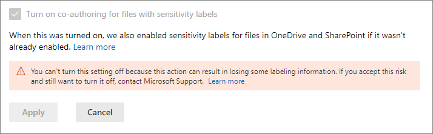

# 민감도 레이블로 암호화된 파일에 공동 작성 사용Enable co-authoring for files encrypted with sensitivity labels

>*[보안 및 규정 준수에 대한 Microsoft 365 라이선싱 지침](/office365/servicedescriptions/microsoft-365-service-descriptions/microsoft-365-tenantlevel-services-licensing-guidance/microsoft-365-security-compliance-licensing-guidance).**[Microsoft 365 licensing guidance for security & compliance](/office365/servicedescriptions/microsoft-365-service-descriptions/microsoft-365-tenantlevel-services-licensing-guidance/microsoft-365-security-compliance-licensing-guidance).*

> [!NOTE]
> 미리 보기에 이 기능이 있으며, 변경될 수 있습니다.This feature is in preview and subject to change.

Office 데스크톱 앱에 [공동 작성](https://support.office.com/article/ee1509b4-1f6e-401e-b04a-782d26f564a4)을 지원하도록 설정을 하면, 문서가 [민감도 레이블](sensitivity-labels.md)로 분류되어 암호화될 때 여러 사용자가 동시에 이러한 문서를 편집할 수 있습니다.Enable the setting to support [co-authoring](https://support.office.com/article/ee1509b4-1f6e-401e-b04a-782d26f564a4) for Office desktop apps so that when documents are labeled and encrypted by [sensitivity labels](sensitivity-labels.md), multiple users can edit these documents at the same time.

테넌트를 위해 이 설정을 사용하지 않으면, 사용자가 Office 데스크톱 앱을 이용할 때 SharePoint 또는 OneDrive에 저장된 암호화 문서를 체크 아웃해야 합니다.Without this setting enabled for your tenant, users must check out an encrypted document stored in SharePoint or OneDrive when they use Office desktop apps. 따라서 실시간으로 공동 작업을 하지 못하게 됩니다.As a result, they can't collaborate in real time. 아니면, [SharePoint 및 OneDrive의 Office 파일에 민감도 레이블을 사용](sensitivity-labels-sharepoint-onedrive-files.md)할 경우 사용자는 웹에서 Office를 이용해야 합니다.Or, they must use Office on the web when [sensitivity labels are enabled for Office files in SharePoint and OneDrive](sensitivity-labels-sharepoint-onedrive-files.md).

또한 이 기능을 사용하도록 설정하면, 레이블이 지정되고 암호화된 파일에 [자동 저장](https://support.office.com/article/what-is-autosave-6d6bd723-ebfd-4e40-b5f6-ae6e8088f7a5) 기능이 지원됩니다.In addition, enabling this functionality results in the [AutoSave](https://support.office.com/article/what-is-autosave-6d6bd723-ebfd-4e40-b5f6-ae6e8088f7a5) functionality being supported for these labeled and encrypted files.

첫 릴리스 공지 사항을 읽으려면 [Microsoft Information Protection으로 암호화된 문서 및 레이블 지정 업데이트에 관한 공동 작성 발표](https://techcommunity.microsoft.com/t5/microsoft-security-and/announcing-co-authoring-on-microsoft-information-protection/ba-p/2164162) 블로그 게시물을 참조하세요.To read the initial release announcement, see the blog post [Announcing co-authoring on Microsoft Information Protection-encrypted documents and labeling updates](https://techcommunity.microsoft.com/t5/microsoft-security-and/announcing-co-authoring-on-microsoft-information-protection/ba-p/2164162).

## 민감도 레이블의 메타데이터 변경 내용Metadata changes for sensitivity labels

> [!IMPORTANT]
> 공동 작성 설정을 사용 가능으로 설정한 후에는 암호화되지 않은 파일의 레이블 정보가 더 이상 사용자 지정 속성에 저장되지 않습니다.After you enable the setting for co-authoring, labeling information for unencrypted files is no longer saved in custom properties.
> 
> 이전 위치로 레이블 지정 메타데이터를 읽거나 쓰는 앱, 서비스, 스크립트 또는 도구를 사용하고 있다면, 이 설정을 사용하지 마세요.Do not enable this setting if you use any apps, services, scripts, or tools that reads or writes labeling metadata to the old location.

Office 데스크톱 앱에 공동 작성을 지원하는 설정을 하기 전, 이 작업이 Office 파일에 저장되고 거기에서 읽어오는 레이블 지정 메타데이터를 변경한다는 점을 이해하는 것이 중요합니다.Before you enable the setting to support co-authoring for Office desktop apps, it's important to understand that this action makes changes to the labeling metadata that is saved to and read from Office files.

레이블 지정 메타데이터에는 테넌트 및 적용된 민감도 레이블을 식별하는 정보가 포함됩니다.The labeling metadata includes information that identifies your tenant and applied sensitivity label. 이 설정으로 인해 변경되는 사항은 Word, Excel 및 PowerPoint 파일의 메타데이터 형식과 위치입니다.The change that this setting makes is the metadata format and location for Word, Excel, and PowerPoint files. 암호화된 파일 또는 전자 메일에 대해 어떤 조치도 취할 필요가 없습니다. 암호화된 파일에 대한 메타데이터 변경은 이전 버전과 호환되며 전자 메일에 대해 변경 내용은 없습니다.You do not need to take any action for encrypted files or emails; the metadata change for encrypted files is backward-compatible and there are no changes for emails. 그러나 암호화된 파일에 대한 메타데이터 변경 내용이 자동으로 업그레이드될 수 있지만 이전 버전과 호환되지 않는다는 것을 명심해야 합니다.However, you do need to be aware of the metadata changes for encrypted files that can be automatically upgraded but aren't backward-compatible.

이 변경 내용은 새로 레이블이 지정된 파일과 이미 레이블이 지정된 파일 모두에 영향을 미칩니다.This change affects both files that are newly labeled and files that are already labeled. 공동 작성 설정을 지원하는 앱 및 서비스를 사용하는 경우:When you use apps and services that support the co-authoring setting:
- 새로 레이블을 지정한 파일의 경우 레이블 지정 메타데이터에는 새 형식과 위치만 사용합니다.For files that are newly labeled, only the new format and location is used for the labeling metadata.
- 이미 레이블을 지정한 파일의 경우 다음에 파일을 열고 저장할 때 파일에 이전 형식 및 위치의 메타데이터가 있으면 새 형식과 위치로 복사됩니다.For files that are already labeled, the next time the file is opened and saved, if the file has metadata in the old format and location, it is copied to the new format and location.

다음 리소스에서 이 메타데이터 변경의 자세한 내용을 살펴볼 수 있습니다.You can read more about this metadata change from the following resources:

- 블로그 게시물: [Microsoft Information Protection 메타데이터 저장소의 향후 변경 사항](https://techcommunity.microsoft.com/t5/microsoft-security-and/upcoming-changes-to-microsoft-information-protection-metadata/ba-p/1904418)Blog post: [Upcoming Changes to Microsoft Information Protection Metadata Storage](https://techcommunity.microsoft.com/t5/microsoft-security-and/upcoming-changes-to-microsoft-information-protection-metadata/ba-p/1904418)

- 사양 열기: [2.6.3 LabelInfo와 사용자 지정 문서 속성의 대비](/openspecs/office_file_formats/ms-offcrypto/13939de6-c833-44ab-b213-e0088bf02341)Open Specifications: [2.6.3 LabelInfo versus Custom Document Properties](/openspecs/office_file_formats/ms-offcrypto/13939de6-c833-44ab-b213-e0088bf02341)

조직 내에 이전 위치에 레이블 지정 메타데이터를 읽거나 쓰는 앱, 서비스, 스크립트 또는 도구가 있다면, 이러한 변경 때문에 이 설정을 사용하지 마세요. 그럴 경우 다음과 같은 결과가 나타날 수 있습니다.Because of these changes, do not enable this setting if you have any apps, services, scripts, or tools in your organization that reads or writes labeling metadata to the old location. If you do, some example consequences:

- 레이블을 지정한 문서가 사용자에게 레이블이 없는 것으로 표시됨A document that is labeled appears to users to be unlabeled

- 문서에서 사용자에게 기간이 지난 레이블을 표시함A document displays an out-of-date label to users

- 다른 사용자가 새 레이블 메타데이터를 지원하지 않는 Office 데스크톱 앱에서 문서를 연 경우 공동 작성 및 암호화된 문서에는 공동 작성 및 자동 저장이 작동하지 않습니다.Co-authoring and AutoSave won't work for a labeled and encrypted document if another user has it open in an Office desktop app that doesn't support the new labeling metadata

- [Office 첨부 파일에서 레이블을 사용자 지정 속성으로 식별하는](/azure/information-protection/configure-exo-rules#example-2-rule-that-applies-the-encrypt-only-option-to-emails-when-they-have-attachments-that-are-labeled-confidential--partners-and-these-emails-are-sent-outside-the-organization) Exchange Online 메일 흐름 규칙이 전자 메일 및 첨부 파일을 암호화하지 못하거나 잘못 암호화합니다.An Exchange Online mail flow rule that [identifies labels as custom properties in Office attachments](/azure/information-protection/configure-exo-rules#example-2-rule-that-applies-the-encrypt-only-option-to-emails-when-they-have-attachments-that-are-labeled-confidential--partners-and-these-emails-are-sent-outside-the-organization) fails to encrypt the email and attachment, or incorrectly encrypts them

다음 섹션에서 이 설정을 지원하는 앱 및 서비스 목록과 레이블 지정 메타데이터의 변경 내용을 확인하세요.Check the following section for a list of apps and services that support this setting and the changes to the labeling metadata.

## 필수 구성 요소Prerequisites

이 기능을 켜기 전에 다음 필수 구성 요소를 이해해야만 합니다.Make sure you understand the following prerequisites before you turn on this feature.

- 이 기능을 사용하려면 전역 관리자여야 합니다.You must be a global admin to turn on this feature.

- [SharePoint의 Office 파일 및 테넌트의 OneDrive](sensitivity-labels-sharepoint-onedrive-files.md)에 민감도 레이블을 사용해야 합니다.Sensitivity labels must be [enabled for Office files in SharePoint and OneDrive](sensitivity-labels-sharepoint-onedrive-files.md) for the tenant. 아직 이 기능을 활성화하지 않은 경우, 민감도 레이블이 있는 파일에 공동 작성 설정을 선택하면 이 기능이 자동으로 활성화됩니다.If this feature isn't already enabled, it will be automatically enabled when you select the setting to turn on co-authoring for files with sensitivity labels.

- 엔터프라이즈용 Microsoft 365 앱Microsoft 365 Apps for enterprise:
    - **Windows**: 최소 버전 2105: 6월 18일**Windows**: Minimum version 2105: June 18
    - **macOS**: 최소 버전 16.50**macOS**: Minimum version 16.50
    - **iOS**: 아직 지원되지 않음**iOS**: Not yet supported
    - **Android**: 아직 지원되지 않음**Android**: Not yet supported

- 테넌트의 모든 앱, 서비스 및 운영 도구는 새 [레이블 지정 메타데이터](#metadata-changes-for-sensitivity-labels)를 지원해야 합니다.All apps, services, and operational tools in your tenant must support the new [labeling metadata](#metadata-changes-for-sensitivity-labels). 다음을 사용하고 있는 경우 필수 최소 버전을 확인하세요.If you use any of the following, check the minimum versions required:
    
    - **Azure Information Protection 통합 레이블 지정 클라이언트 및 스캐너:****Azure Information Protection unified labeling client and scanner:**
        - [Microsoft 다운로드 센터](https://www.microsoft.com/en-us/download/details.aspx?id=53018)에서 설치할 수 있는 공개 미리 보기 버전(AzInfoProtection_2.10.46_CoAuthoring_PublicPreview.exe의 설치 이름)A public preview version (installation name of AzInfoProtection_2.10.46_CoAuthoring_PublicPreview.exe) that you can install from the [Microsoft Download Center](https://www.microsoft.com/en-us/download/details.aspx?id=53018)
    
    - **Windows 또는 MacOS용 OneDrive 동기화 앱:****OneDrive sync app for Windows or macOS:**
        - 19.002.0121.0008 최소 버전Minimum version of 19.002.0121.0008
    
    - **엔드포인트 데이터 손실 방지(Endpoint DLP):****Endpoint data loss prevention (Endpoint DLP):**
        - Windows 10 1809, KB 4601383 포함Windows 10 1809 with KB 4601383
        - Windows 10 1903 및 1909, KB 4601380 포함Windows 10 1903 and 1909 with KB 4601380
        - Windows 10 2004, KB 4601382 포함Windows 10 2004 with KB 4601382
    
    - **Microsoft Information Protection SDK를 사용하는 앱 및 서비스:****Apps and services that use the Microsoft Information Protection SDK:** 
        - 1.7 최소 버전Minimum version of 1.7 

이 기능을 사용하면 Microsoft 365 서비스가 자동으로 새 레이블 지정 메타데이터를 지원합니다. 다음은 그 예시입니다.Microsoft 365 services automatically support the new labeling metadata when you turn on this feature. For example:

- [자동 레이블 지정 정책Auto-labeling policies](apply-sensitivity-label-automatically.md#how-to-configure-auto-labeling-policies-for-sharepoint-onedrive-and-exchange)
- [민감도 레이블을 조건으로 사용하는 DLP 정책DLP policies that use sensitivity labels as conditions](dlp-sensitivity-label-as-condition.md)
- [민감도 레이블을 적용하도록 구성한 Microsoft Cloud App SecurityMicrosoft Cloud App Security configured to apply sensitivity labels](/cloud-app-security/best-practices#discover-classify-label-and-protect-regulated-and-sensitive-data-stored-in-the-cloud)

## 제한 사항Limitations

민감도 레이블로 암호화된 파일에 공동 작성을 위한 테넌트 설정을 사용하기 전, 이 기능의 다음과 같은 제한 사항을 이해해야 합니다.Before you enable the tenant setting for co-authoring for files encrypted with sensitivity labels, make sure you understand the following limitations of this feature.

- [레이블 지정 메타데이터의 변경](#metadata-changes-for-sensitivity-labels) 때문에 테넌트의 모든 앱, 서비스 및 운영 도구는 일관되고 안정적인 레이블 지정 환경을 위해 새 레이블 지정 메타데이터를 지원해야 합니다.Because of the [labeling metadata changes](#metadata-changes-for-sensitivity-labels), all apps, services, and operational tools in your tenant must support the new labeling metadata for a consistent and reliable labeling experience.
    
    Excel에만 해당: 다른 사용자가 민감도 레이블의 메타데이터 변경 내용을 지원하지 않는 Excel 버전을 사용하여 해당 파일을 편집하고 저장한 경우, 암호화를 적용하지 않는 민감도 레이블의 메타데이터를 파일에서 삭제할 수 있습니다.Specific to Excel: Metadata for a sensitivity label that doesn't apply encryption can be deleted from a file if somebody edits and saves that file by using a version of Excel that doesn't support the metadata changes for sensitivity labels.

- 공동 작성 및 자동 저장을 지원하지 않으며, 다음 [구성을 암호화](encryption-sensitivity-labels.md#configure-encryption-settings)하는 데 사용하는 레이블 지정 및 암호화된 Office 문서에서는 작동하지 않습니다.Co-authoring and AutoSave aren't supported and don't work for labeled and encrypted Office documents that use any of the following [configurations for encryption](encryption-sensitivity-labels.md#configure-encryption-settings):
    - **사용자가 레이블을 적용할 때 사용 권한을 할당하도록 허용하고** **Word, PowerPoint및 Excel에서는 사용자에게 권한을 지정하라는 메시지** 가 선택됩니다.**Let users assign permissions when they apply the label** and the checkbox **In Word, PowerPoint, and Excel, prompt users to specify permissions** is selected. 때로는 이 구성을 ‘사용자 정의 권한’이라고도 합니다.This configuration is sometimes referred to as "user-defined permissions".
    - **콘텐츠에 대한 사용자 액세스 만료** 가 **만료 안 함** 이외의 값으로 설정됩니다.**User access to content expires** is set to a value other than **Never**.
    - **이중 키 암호화** 가 선택됩니다.**Double Key Encryption** is selected.
    
    이러한 암호화 구성이 있는 레이블이면, 레이블은 Office 앱에 표시됩니다.For labels with any of these encryption configurations, the labels display in Office apps. 하지만 사용자가 이러한 레이블을 선택해도 문서를 편집하는 다른 사용자가 없으면, 공동 작성 및 자동 저장을 사용할 수 없다는 경고가 표시됩니다.However, when users select these labels and nobody else is editing the document, they are warned that co-authoring and AutoSave won't be available. 다른 사용자가 문서를 편집한다면, 레이블을 적용할 수 없다는 메시지가 나타납니다.If somebody else is editing the document, users see a message that the labels can't be applied.

- Azure Information Protection 통합 레이블 지정 클라이언트를 사용하는 경우: 이 레이블 지정 클라이언트에 대한 설명서 [추가 요구 사항 또는 제한](/azure/information-protection/known-issues#known-issues-for-co-authoring-public-preview)에서 참조하세요.If you use the Azure Information Protection unified labeling client: Check the documentation for this labeling client for [more requirements or limitations](/azure/information-protection/known-issues#known-issues-for-co-authoring-public-preview).

## 이 미리 보기의 알려진 문제Known issues for this preview

민감도 레이블로 암호화된 파일을 위한 공동 작성의 이 미리보기 버전에는 다음과 같이 알려진 문제가 있습니다.This preview version of co-authoring for files encrypted with sensitivity labels has the following known issues:

- 사용자는 300MB보다 큰 Word, Excel 및 PowerPoint 파일에 대해 웹용 Office에서 레이블을 적용할 수 없습니다.Users won't be able to apply any labels in Office for the web for Word, Excel, and PowerPoint files that are bigger than 300 MB. 이러한 파일에는 Office 데스크톱 앱을 사용하여 레이블을 적용할 수 있지만, 해당 파일이 열려 있는 유일한 사용자여야만 가능합니다.For these files, you can use the Office desktop apps to apply a label but you must be the only person who has the file open.

- [민감도 레이블을 조건으로 하는 DLP 정책](dlp-sensitivity-label-as-condition.md)을 사용할 때는 암호화되지 않은 전자 메일 첨부 파일을 지원하지 않습니다.When you use [DLP policies that use sensitivity labels as conditions](dlp-sensitivity-label-as-condition.md), unencrypted attachments for emails are not supported.

- 일부 문서는 [암호 보호](https://support.microsoft.com/office/require-a-password-to-open-or-modify-a-workbook-10579f0e-b2d9-4c05-b9f8-4109a6bce643), [공유 통합 문서](https://support.microsoft.com/office/about-the-shared-workbook-feature-49b833c0-873b-48d8-8bf2-c1c59a628534) 또는 ActiveX 컨트롤이 포함된 콘텐츠와 같은 기능으로 인해 민감도 레이블과 호환되지 않습니다.Some documents are incompatible with sensitivity labels because of features such as [password-protection](https://support.microsoft.com/office/require-a-password-to-open-or-modify-a-workbook-10579f0e-b2d9-4c05-b9f8-4109a6bce643), [shared workbooks](https://support.microsoft.com/office/about-the-shared-workbook-feature-49b833c0-873b-48d8-8bf2-c1c59a628534), or content that includes ActiveX controls. 그 밖의 다른 이유는 [Office의 공동 작성 문제 해결](https://support.microsoft.com/office/troubleshoot-co-authoring-in-office-bd481512-3f3a-4b6d-b7eb-ebf9d3626ae7)에서 확인할 수 있습니다.Other reasons are documented in [Troubleshoot co-authoring in Office](https://support.microsoft.com/office/troubleshoot-co-authoring-in-office-bd481512-3f3a-4b6d-b7eb-ebf9d3626ae7). 이러한 문서의 경우 **UPLOAD FAILED 메시지** 가 표시되고 **변경 내용 취소** 옵션을 선택해야 합니다.For these documents, you see a message **UPLOAD FAILED** and should select the **Discard Changes** option. 이 문제가 해결될 때까지 이 실패 메시지로 식별되는 문서에 레이블을 지정하지 마세요.Until this issue is addressed, do not label these documents that are identified with this failure message.

- iOS 및 Android용 오피스 앱은 지원하지 않습니다.Office apps for iOS and Android are not supported.

## 민감도 레이블이 있는 파일에 공동 작성을 사용하는 방법How to enable co-authoring for files with sensitivity labels

> [!CAUTION]
> 이 설정은 한 번 켜고 나면 다시 끌 수 없습니다. 기능이 미리 보기에 있는 동안에는 이 페이지에서 설명하는 메타데이터 변경 내용, 필수 구성 요소, 제한 사항 및 알려진 문제를 읽고 이해한 후에만 설정을 변경해 주세요.Turning on this setting is a one-way action. While the feature is in preview, enable it only after you have read and understood the metadata changes, prerequisites, limitations, and any known issues documented on this page.

1. 테넌트의 전역 관리자로서 [Microsoft 365 규정 준수 센터](https://compliance.microsoft.com)에 로그인합니다.Sign in to the [Microsoft 365 compliance center](https://compliance.microsoft.com) as a global admin for your tenant.

2. 탐색 창에서 **설정** > **민감도 레이블이 있는 파일 공동 작성** 을 선택합니다.From the navigation pane, select **Settings** > **Co-authoring for files with sensitivity files**.

2. **민감도 레이블이 있는 파일 공동 작성(미리 보기)** 페이지에서 요약 설명과 필수 구성 요소, 예상 내용, 이 설정을 켠 후에는 해제할 수 없다는 경고를 읽습니다.On the **Co-authoring for files with sensitivity labels (preview)** page, read the summary description, prerequisites, what to expect, and the warning that you can't turn off this setting after you've turned it on.
    
    그런 다음 **민감도 레이블이 있는 파일에 공동 작성을 사용** 하도록 설정을 선택하여 **적용** 합니다.Then select **Turn on co-authoring for files with sensitivity labels**, and **Apply**:
    
    

3. 공동 작성을 위한 새 기능을 사용하기 전에 24시간 동안 이 설정이 환경 전체에 복제되기를 기다립니다.Wait 24 hours for this setting to replicate across your environment before you use this new feature for co-authoring.

## 이 기능을 실행 중지해야 한다면, 고객 지원에 문의하세요.Contact Support if you need to disable this feature

> [!IMPORTANT]
> 이 기능을 실행 중지해야 하는 경우 레이블 지정 정보가 손실될 수 있습니다.If you do need to disable this feature, be aware that labeling information can be lost.

테넌트에 대한 민감도 레이블이 있는 파일에 공동 작성을 사용한 후에는 이 설정을 직접 실행 중지할 수 없습니다.After you've enabled co-authoring for files with sensitivity labels for your tenant, you can't disable this setting yourself. 따라서 이 설정을 사용하기에 앞서 필수 구성 요소, 결과 및 한계를 확인하고 이해하는 것이 중요합니다.That's why it's so important that you check and understand the prerequisites, consequences, and limitations before you enable this setting.

이 설정을 사용할 때의 스크린샷에서 볼 수 있듯이, [Microsoft 지원](../business-video/get-help-support.md)에 연락하여 이 설정의 해제를 요청할 수 있습니다.As you see from the screenshot when this setting has been turned on, you can contact [Microsoft Support](../business-video/get-help-support.md) and request to turn off this setting. 이 요청에는 수일이 소요될 수 있으며, 사용자가 테넌트의 전역 관리자임을 입증해야 합니다.This request might take several days and you will need to prove that you are a global administrator for your tenant. 일반적인 지원 요금이 적용될 것입니다.Expect usual support charges to apply. 

지원 엔지니어가 테넌트에 이 설정을 실행 중지하는 경우:If a support engineer disables this setting for your tenant:

- 새 레이블링 메타데이터를 지원하는 앱과 서비스의 경우 레이블을 읽거나 저장할 때 원래 메타데이터 형식 및 위치로 돌아갑니다.For apps and services that support the new labeling metadata, they now revert to the original metadata format and location when labels are read or saved.

- 설정이 가능한 동안에 사용한 Office 문서의 새 메타데이터 형식 및 위치는 원래의 형식 및 위치로 복사되지 않습니다.The new metadata format and location for Office documents that were used while the setting was enabled will not be copied to the original format and location. 결과적으로, 암호화되지 않은 Word, Excel 및 PowerPoint 파일의 이 레이블 지정 정보가 손실됩니다.As a result, this labeling information for unencrypted Word, Excel, and PowerPoint files will be lost.

- 레이블이 지정되고 암호화된 문서에 대한 공동 작성 및 자동 저장이 더는 지원되지 않습니다.Co-authoring and AutoSave no longer work in your tenant for labeled and encrypted documents.

- 민감도 레이블은 OneDrive 및 SharePoint의 Office 파일에 사용 가능한 상태로 유지됩니다.Sensitivity labels remain enabled for Office files in OneDrive and SharePoint.