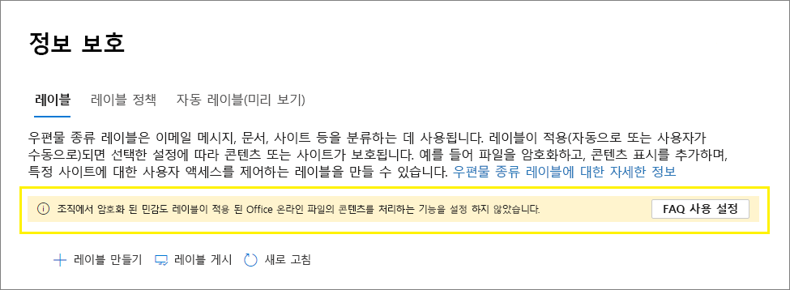

# <a name="enable-sensitivity-labels-for-office-files-in-sharepoint-and-onedrive"></a>SharePoint 및 OneDrive에서 Office 파일에 대한 민감도 레이블 사용

>*[보안 및 규정 준수에 대한 Microsoft 365 라이선싱 지침](/office365/servicedescriptions/microsoft-365-service-descriptions/microsoft-365-tenantlevel-services-licensing-guidance/microsoft-365-security-compliance-licensing-guidance).*

지원되는 Office 파일에 [](sensitivity-labels-office-apps.md#office-file-types-supported) 대해 기본 제공 레이블 지정을 SharePoint OneDrive 사용하여 사용자가 해당 파일에서 민감도 레이블을 적용할 수 웹용 Office. [](sensitivity-labels.md) 이 기능을 사용하도록 설정하면 레이블을 적용할 수 있도록 리본 메뉴에 민감도 단추가 표시되고 상태 표시줄에 적용된 레이블 이름이 표시됩니다. 

또한 이 기능을 사용하도록 설정하면 SharePoint OneDrive 사용하여 암호화된 Office 파일의 콘텐츠를 처리하지 못하게 됩니다. 레이블은 데스크톱 앱 또는 웹용 Office 또는 Office 앱 및 앱에 SharePoint 저장될 OneDrive. 이 기능을 사용하도록 설정하기 전까지는 이러한 서비스가 암호화된 파일을 처리할 수 없습니다. 즉, 공동 작성, eDiscovery, 데이터 손실 방지, 검색 및 기타 공동 작업 기능이 이러한 파일에 대해 작동하지 않습니다.

Office 및 SharePoint 및 OneDrive 파일에 대해 민감도 레이블을 사용하도록 설정한 후 클라우드 기반 키로 암호화를 적용하고 이중 키 암호화를 사용하지 않는 민감도 레이블이 있는 새 파일 및 변경된 파일의 경우 [:](double-key-encryption.md)

- Word, Excel PowerPoint 파일의 경우 SharePoint OneDrive 레이블을 인식하고 암호화된 파일의 내용을 처리합니다.

- 사용자가 SharePoint 또는 OneDrive 파일에서 이러한 파일을 다운로드하거나 액세스하면 레이블의 민감도 레이블 및 암호화 설정이 적용되고 저장되는 모든 위치에 파일에 유지됩니다. 레이블만 사용하여 문서를 보호하기 위한 사용자 지침을 제공해야 합니다. 자세한 내용은 [IRM(정보 권한 관리) 옵션 및 민감도 레이블을 참조하세요.](sensitivity-labels-office-apps.md#information-rights-management-irm-options-and-sensitivity-labels)

- 사용자가 레이블이 지정되고 암호화된 파일을 SharePoint 또는 OneDrive 해당 파일에 대한 보기 권한 이상이 있어야 합니다. 예를 들어 파일 외부에서 파일을 열 수 SharePoint. 최소 사용권이 없는 경우 업로드가 성공하지만 서비스에서 레이블을 인식하지 못하며 파일 콘텐츠를 처리하지 못합니다.

- 웹용 Office(Word, Excel, PowerPoint)를 사용하여 암호화를 적용하는 민감도 레이블이 Office 파일을 열고 편집할 수 있습니다. 암호화로 할당된 사용 권한이 적용됩니다. 이러한 문서에 자동 [레이블](apply-sensitivity-label-automatically.md) 지정을 사용할 수 있습니다.

- 외부 사용자는 게스트 계정을 사용하여 암호화 레이블이 지정되어 있는 문서에 액세스할 수 있습니다. 자세한 내용은 외부 사용자 및 레이블이 붙은 콘텐츠에 대한 지원을 [참조하세요.](sensitivity-labels-office-apps.md#support-for-external-users-and-labeled-content)

- Office 365 eDiscovery에서는 이러한 파일에 대한 전체 텍스트 검색을 지원하고 DLP(데이터 손실 방지) 정책은 이러한 파일의 콘텐츠를 지원합니다.

> [!NOTE]
> 암호화가 프레미스 키("자체 키 보유" 또는 HYOK라고도 하는 키 관리 토폴로지)를 사용하여 적용한 경우 또는 이중 키 암호화를 사용하여 파일 콘텐츠를 처리하기 위한 서비스 동작은 변경되지 않습니다. [](double-key-encryption.md) 따라서 이러한 파일의 경우 공동 작업, eDiscovery, 데이터 손실 방지, 검색 및 기타 공동 작업 기능이 작동하지 않습니다.
>
> 또한 SharePoint 및 OneDrive 동작은 단일 Azure 기반 키를 사용하여 암호화로 레이블이 지정되는 이러한 위치의 기존 파일에 대해 변경되지 않습니다. SharePoint 및 OneDrive 파일에서 Office 파일에 대해 민감도 레이블을 사용하도록 설정한 후 이러한 파일이 새로운 기능을 사용하려면 파일을 다시 다운로드하여 업로드하거나 편집해야 합니다.

SharePoint 및 OneDrive 파일에서 Office 파일에 대해 민감도 레이블을 사용하도록 설정한 [](search-the-audit-log-in-security-and-compliance.md#sensitivity-label-activities) 후 SharePoint 및 OneDrive.

- **파일에 적용된 민감도 레이블**
- **파일에 변경된 민감도 레이블을 적용**
- **파일에서 제거된 민감도 레이블**

다음 비디오(오디오 없음)를 시청하여 새로운 기능을 사용할 수 있습니다.

> [!VIDEO https://www.microsoft.com/videoplayer/embed//RE4ornZ]

언제든지 옵트아웃(opt-out)을 사용하여 Office 파일에 대한 민감도 레이블을 SharePoint OneDrive 수 있습니다.[](#how-to-disable-sensitivity-labels-for-sharepoint-and-onedrive-opt-out)

IRM(SharePoint Information Rights Management)을 사용하여 SharePoint 문서를 보호하는 경우 이 페이지의 SharePoint [IRM(정보](#sharepoint-information-rights-management-irm-and-sensitivity-labels) 권한 관리) 및 민감도 레이블 섹션을 확인하십시오.

## <a name="requirements"></a>요구 사항

이러한 새로운 기능은 민감도 [레이블에만 작동됩니다.](sensitivity-labels.md) 현재 Azure Information Protection 레이블이 있는 경우 먼저 민감도 레이블로 마이그레이션하여 업로드하는 새 파일에 대해 이러한 기능을 사용하도록 설정할 수 있습니다. 자세한 내용은 [Azure Information Protection 레이블을 통합 민감도 레이블로 마이그레이션하는 방법](/azure/information-protection/configure-policy-migrate-labels)을 참조하세요.

Mac에서 OneDrive 동기화 버전 19.002.0121.0008 이상을 Windows 버전 19.002.0107.0008 이상을 사용하세요. 이 두 버전은 2019년 1월 28일 릴리스된 후 현재 모든 링에 릴리스됩니다. 자세한 내용은 릴리스 OneDrive [참조하세요.](https://support.office.com/article/845dcf18-f921-435e-bf28-4e24b95e5fc0) Office 및 SharePoint OneDrive 파일에 대해 민감도 레이블을 사용하도록 설정하면 이전 버전의 동기화 앱을 실행한 사용자에게 업데이트하라는 메시지가 표시됩니다.

## <a name="limitations"></a>제한 사항

- SharePoint 및 OneDrive PowerQuery 데이터, 사용자 지정 추가 기능으로 저장된 데이터 또는 사용자 지정 XML 부분(예: 표지 속성, 콘텐츠 형식 키마, 사용자 지정 문서 정보 패널 및 사용자 지정 XSN)을 포함하는 경우 Office 데스크톱 앱에서 레이블이 지정되고 암호화된 일부 파일은 처리될 수 없습니다. 이 제한 사항은 업로드할 때 추가된 문서 [ID가](https://support.microsoft.com/office/enable-and-configure-unique-document-ids-ea7fee86-bd6f-4cc8-9365-8086e794c984) 있는 파일에도 적용됩니다.

    이러한 파일의 경우 나중에 암호화 없이 레이블을 적용하여 나중에 웹용 Office 열거나 사용자에게 데스크톱 앱에서 파일을 열 수 있도록 지시합니다. 파일에서만 레이블이 지정되고 암호화되는 웹용 Office 영향을 받지 않습니다.

- SharePoint 및 OneDrive Azure Information Protection 레이블을 사용하여 이미 암호화한 기존 파일에 민감도 레이블을 자동으로 적용하지 않습니다. 대신, Office 파일에 대해 민감도 레이블을 사용하도록 설정한 후 기능이 SharePoint OneDrive 작업을 완료합니다.

    1. Azure Information [Protection](/azure/information-protection/configure-policy-migrate-labels) 레이블을 민감도 레이블로 마이그레이션하고 [](create-sensitivity-labels.md#publish-sensitivity-labels-by-creating-a-label-policy) 해당 레이블을 해당 레이블에서 Microsoft 365 규정 준수 센터.
    2. 레이블이 붙은 파일을 다운로드한 다음 레이블이 지정되어 있는 파일의 원래 위치에 SharePoint OneDrive.

- SharePoint 및 OneDrive 적용된 레이블에 다음과 같은 암호화 구성이 있는 경우 암호화된 파일을 [처리하지 못합니다.](encryption-sensitivity-labels.md#configure-encryption-settings)
  - **사용자가 레이블을 적용할 때 사용 권한을 할당하도록 허용하고** **Word, PowerPoint및 Excel에서는 사용자에게 권한을 지정하라는 메시지** 가 선택됩니다. 이 설정을 "사용자 정의 권한"이라고도 합니다.
  - **콘텐츠에 대한 사용자 액세스 만료** 가 **만료 안 함** 이외의 값으로 설정됩니다.
  - **이중 키 암호화** 가 선택됩니다.

    이러한 암호화 구성이 있는 레이블의 경우 레이블이 해당 암호화 구성의 사용자에게 웹용 Office. 또한 이러한 암호화 설정이 이미 있는 레이블이 지정되어 있는 문서에는 새 기능을 사용할 수 없습니다. 예를 들어 이러한 문서는 업데이트된 경우에도 검색 결과에 반환되지 않습니다.

- 성능상의 이유로 문서를 업로드하거나 저장하여 SharePoint 파일의 레이블에 암호화가 적용되지 않는 경우  문서 라이브러리의 민감도 열에 레이블 이름을 표시하는 데 시간이 걸릴 수 있습니다. 이 열의 레이블 이름을 사용하는 스크립트 또는 자동화를 사용하는 경우 이 지연을 고려합니다.

- SharePoint 체크 아웃된 동안 문서에 레이블이 지정되어 있는  경우 문서가 체크 인되어 문서에서 다음에 열 때까지 문서 라이브러리의 민감도 열에 레이블 이름이 SharePoint. [](https://support.microsoft.com/office/check-out-check-in-or-discard-changes-to-files-in-a-library-7e2c12a9-a874-4393-9511-1378a700f6de)

- 서비스 사용자 이름을 사용하는 앱 또는 서비스에서 SharePoint 또는 OneDrive 레이블이 지정되고 암호화된 문서를 다운로드한 다음 다른 암호화 설정을 적용하는 레이블을 사용하여 다시 업로드하면 업로드가 실패합니다. 예를 들어 Microsoft Cloud App Security 민감도 레이블을 **기밀에서** 기밀로 또는 기밀에서 일반으로 변경하는  **시나리오를 들 수 있습니다.**
    
    앱 또는 서비스가 레이블이 있는 문서에 대한 암호화 제거 섹션에 설명된 따라 [먼저 Unlock-SPOSensitivityLabelEncryptedFile](/powershell/module/sharepoint-online/unlock-sposensitivitylabelencryptedFile) cmdlet을 실행하면 업로드가 [실패하지](#remove-encryption-for-a-labeled-document) 않습니다. 또는 업로드하기 전에 원본 파일이 삭제되거나 파일 이름이 변경됩니다.

- 암호화를 적용하는 민감도 레이블이 있는 문서에 대해 데스크톱 버전의 Office 사용 시나리오에서 암호화된 문서를 열 수 있는 데 지연이 있을 수 있습니다. 사용자가 위치의 SharePoint OneDrive 선택한 다음 해당 문서를 현재 위치에서 열 웹용 Office. 서비스가 여전히 암호화를 처리하고 있는 경우 사용자는 데스크톱 앱에서 문서를 열 수 있어야 하다는 메시지를 볼 수 있습니다. 몇 분 후 다시 시도하면 문서가 웹용 Office.

- 암호화된 문서의 경우 인쇄가 지원되지 않습니다.

- 사용자에게 편집 권한을 부여하는 암호화된 문서의 경우 해당 앱의 웹 버전에서는 복사를 차단할 Office 없습니다.

- 기본적으로 데스크톱 Office 및 모바일 앱은 암호화로 레이블이 지정되어 있는 파일에 대한 공동 작성을 지원하지 않습니다. 이러한 앱은 계속 레이블이 지정되고 암호화된 파일을 단독 편집 모드로 열어 갑니다.
    
    > [!NOTE]
    > 이제 공동 작성이 Windows 및 macOS에서 지원됩니다. 자세한 내용은 민감도 레이블로 암호화된 파일에 대한 공동 작성 사용 [을 참조하세요.](sensitivity-labels-coauthoring.md)

- 관리자가 사용자의 동기화 클라이언트에 다운로드된 파일에 이미 적용된 게시된 레이블의 설정을 변경하는 경우 사용자가 파일 변경 내용을 파일 동기화 폴더에 저장하지 못할 OneDrive 있습니다. 이 시나리오는 암호화로 레이블이 지정되는 파일에 적용될 수 있으며, 레이블 변경이 암호화를 적용하는 레이블에 암호화를 적용하지 않은 레이블에서 변경된 경우도 적용됩니다. 흰색 십자 아이콘 오류가 있는 빨간색 원이 표시되고 새 변경 내용을 별도의 복사본으로 저장해야 합니다. [](https://support.office.com/article/what-do-the-onedrive-icons-mean-11143026-8000-44f8-aaa9-67c985aa49b3) 대신 파일을 닫았다가 다시 열거나 파일을 다시 열 수 웹용 Office.

- 사용자는 오프라인으로 전환한 후 또는 절전 모드로 전환한 후 웹용 Office Word, Excel 또는 앱용 데스크톱 및 모바일 앱을 PowerPoint. 이러한 사용자의 경우 Office 앱 세션을 다시 시작하고 변경 내용을 저장하려고 하면 원본 파일을 저장하는 대신 복사본을 저장하는 옵션이 있는 업로드 실패 메시지가 표시됩니다.

- 다음과 같은 방법으로 암호화된 문서는 다음 방법으로 열 수 웹용 Office.
  - 프레미스 키를 사용하는 암호화("자체 키 보유" 또는 HYOK)
  - 이중 키 암호화를 사용하여 [적용된 암호화](double-key-encryption.md)
  - 권한 관리 보호 템플릿을 직접 적용하는 등 레이블과 독립적으로 적용된 암호화입니다.

- 다른 언어에 [대해](create-sensitivity-labels.md#additional-label-settings-with-security--compliance-center-powershell) 구성된 레이블은 지원되지 않습니다. 원래 언어만 표시합니다.

- 암호화된 문서의 경우 화면 캡처를 차단할 수 없습니다. 자세한 내용은 권한 관리에서 화면 [캡처를 방지할 수 있나요?를 참조하세요.](/azure/information-protection/faqs-rms#can-rights-management-prevent-screen-captures)

- 해당 레이블 정책에서 레이블을 제거하는 대신 SharePoint 또는 OneDrive 문서에 적용된 레이블을 삭제하면 다운로드 시 문서에 레이블이 지정되거나 암호화되지 않습니다. 이와는 비교해 레이블이 지정한 문서가 외부에 저장되어 있는 SharePoint OneDrive 레이블이 삭제되면 문서가 암호화된 상태로 남아 있습니다. 테스트 단계에서 레이블을 삭제할 수 있는 경우도 있을 수 있습니다. 프로덕션 환경에서 레이블을 삭제하는 경우는 거의 없습니다.

## <a name="how-to-enable-sensitivity-labels-for-sharepoint-and-onedrive-opt-in"></a>옵트인(opt in)에 대해 민감도 레이블을 SharePoint OneDrive 방법

새 기능을 사용하도록 설정하려면 Microsoft 365 규정 준수 센터 PowerShell을 사용하여 설정할 수 있습니다. SharePoint 및 OneDrive 모든 테넌트 수준 구성 변경과 OneDrive 변경 내용을 적용하는 데 15분 정도 걸립니다.

### <a name="use-the-compliance-center-to-enable-support-for-sensitivity-labels"></a>규정 준수 센터를 사용하여 민감도 레이블에 대한 지원을 사용하도록 설정

이 옵션은 SharePoint 및 OneDrive 레이블을 사용하도록 설정하는 가장 쉬운 방법이지만 테넌트에 대한 전역 관리자로 로그인해야 합니다.

1. 전역 관리자로 Microsoft 365 규정 준수 센터 [로그인하고](https://compliance.microsoft.com/) 솔루션 정보   >  **보호로 이동합니다.**

    이 옵션이 바로 보이지 않는 경우에는 먼저 **모두 표시** 를 선택합니다.

2. 온라인 파일에서 콘텐츠를 처리하는 기능을 켜는 메시지가 Office 지금 **켜기 를 선택합니다.**

    

    명령이 즉시 실행되어 페이지가 다음에 새로 고쳐지면 메시지나 단추가 더 이상 표시되지 않습니다.

> [!NOTE]
> Multi-Microsoft 365 있는 경우 PowerShell을 사용하여 모든 지리적 위치에 대해 이러한 기능을 사용하도록 설정해야 합니다. 자세한 내용은 다음 섹션을 참조하세요.

### <a name="use-powershell-to-enable-support-for-sensitivity-labels"></a>PowerShell을 사용하여 민감도 레이블 지원 사용

규정 준수 센터를 사용하는 대신 온라인 PowerShell에서 [Set-SPOTenant](/powershell/module/sharepoint-online/set-spotenant) cmdlet을 사용하여 민감도 레이블에 대한 지원을 SharePoint 있습니다.

Multi-Microsoft 365 있는 경우 PowerShell을 사용하여 모든 지리적 위치에 대해 이 지원을 사용하도록 설정해야 합니다.

#### <a name="prepare-the-sharepoint-online-management-shell"></a>온라인 SharePoint 셸 준비

PowerShell 명령을 실행하여 SharePoint 및 OneDrive 파일에서 Office 민감도 레이블을 사용하도록 설정하기 전에 SharePoint Online Management Shell 버전 16.0.19418.12000 이상을 실행 중인지 확인하십시오. 이미 최신 버전이 있는 경우 PowerShell 명령을 실행하기 위해 다음 절차로 건너뛸 수 있습니다. [](#run-the-powershell-command-to-enable-support-for-sensitivity-labels)

1. PowerShell 갤러리에서 이전 버전의 SharePoint Online 관리 셸을 설치한 경우 다음 cmdlet을 실행하여 모듈을 업데이트할 수 있습니다.

    ```PowerShell
    Update-Module -Name Microsoft.Online.SharePoint.PowerShell
    ```

2. 또는 Microsoft 다운로드 센터에서 이전 버전의 SharePoint Online 관리 셸을 설치한 경우 프로그램  추가 또는 제거로 이동하여 SharePoint 온라인 관리 셸을 제거할 수도 있습니다.

3. 웹 브라우저에서 다운로드 센터 페이지로 이동한 다음 [최신 SharePoint Online 관리 셸을 다운로드](https://go.microsoft.com/fwlink/p/?LinkId=255251)합니다.

4. 언어를 선택한 다음 **다운로드** 를 클릭합니다.

5. X64 및 x86 .msi 파일 중에서 선택합니다. 64비트 버전의 Windows 32비트 버전을 실행한 경우 x86 파일을 다운로드합니다. 모르는 경우 실행 중인 운영 [Windows 버전을 참조하세요.](https://support.microsoft.com/help/13443/windows-which-operating-system)

6. 파일을 다운로드한 후 파일을 실행하고 설치 마법사의 단계를 따릅니다.

#### <a name="run-the-powershell-command-to-enable-support-for-sensitivity-labels"></a>PowerShell 명령을 실행하여 민감도 레이블 지원을 사용하도록 설정

새 기능을 사용하도록 설정하려면 *EnableAIPIntegration* 매개 변수와 함께 [Set-SPOTenant](/powershell/module/sharepoint-online/set-spotenant) cmdlet을 사용합니다.

1. 전역 관리자 또는 SharePoint 관리자 권한이 있는 직장 또는 학교 계정을 Microsoft 365 계정으로 SharePoint. 자세한 방법은 [SharePoint Online 관리 셸 시작](/powershell/sharepoint/sharepoint-online/connect-sharepoint-online)을 참조하세요.

    > [!NOTE]
    > Multi-Microsoft 365 있는 경우 [커넥트-SPOService와](/powershell/module/sharepoint-online/connect-sposervice)함께 -Url 매개 변수를 사용하여 지리적 위치 중 하나에 SharePoint 온라인 관리 센터 사이트 URL을 지정합니다.

2. 다음 명령을 실행하고 **Y를 눌러** 확인합니다.

    ```PowerShell
    Set-SPOTenant -EnableAIPIntegration $true
    ```
3. Microsoft 365: 나머지 각 지리적 위치에 대해 1단계와 2단계를 반복합니다.

## <a name="publishing-and-changing-sensitivity-labels"></a>민감도 레이블 게시 및 변경

민감도 레이블을 SharePoint OneDrive 새 민감도 레이블을 게시하거나 기존 민감도 레이블을 업데이트할 때 복제 시간을 허용해야 합니다. 이는 암호화를 적용하는 새 레이블에 특히 중요합니다.

예를 들어 암호화를 적용하는 새 민감도 레이블을 만들고 게시하면 사용자의 데스크톱 앱에 매우 빠르게 표시됩니다. 사용자는 이 레이블을 문서에 적용한 다음 해당 레이블을 SharePoint OneDrive. 서비스에 대해 레이블 복제가 완료되지 않은 경우 업로드 시 해당 문서에 새 기능이 적용되지 않습니다. 따라서 문서가 검색 또는 eDiscovery에 반환되지는 못하며 문서는 검색에서 열 수 웹용 Office.

다음 변경 사항은 1시간 내에 복제됩니다. 새 민감도 레이블 및 삭제된 민감도 레이블 및 정책에 있는 레이블을 포함 하는 민감도 레이블 정책 설정.

다음 변경 사항은 24시간 내에 복제됩니다. 기존 레이블에 대한 민감도 레이블 설정 변경

복제 지연은 새 민감도 레이블에 대해 1시간 뿐이기 때문에 예제의 시나리오에 실행될 가능성이 낮습니다. 그러나 안전 장치로, 먼저 몇 테스트 사용자에게만 새 레이블을 게시하고 한 시간 동안 기다렸다가 새 레이블을 SharePoint 및 OneDrive. 마지막 단계로, 기존 레이블 정책에 사용자를 더 추가하여 더 많은 사용자가 레이블을 사용할 수 있도록 설정하거나 표준 사용자에 대한 기존 레이블 정책에 레이블을 추가합니다. 표준 사용자에게 레이블이 표시될 때 해당 레이블은 이미 레이블과 SharePoint OneDrive.

## <a name="sharepoint-information-rights-management-irm-and-sensitivity-labels"></a>SharePoint IRM(정보 권한 관리) 및 민감도 레이블

[SharePoint IRM(정보](set-up-irm-in-sp-admin-center.md) 권한 관리)은 파일이 다운로드되는 경우 암호화 및 제한을 적용하여 목록 및 라이브러리 수준에서 파일을 보호하는 이전 기술입니다. 이 이전 보호 기술은 권한이 없는 사용자가 외부에 있는 동안 파일을 열지 못하도록 SharePoint.

이에 비해 민감도 레이블은 암호화 외에도 시각적 표시(머리그, 머리마크, 워터마크)의 보호 설정을 제공합니다. 암호화 설정은 사용자가 콘텐츠로 할 수 있는 작업을 제한하는 모든 사용 권한을 지원하며, 많은 시나리오에서 동일한 민감도 레이블이 [지원됩니다.](get-started-with-sensitivity-labels.md#common-scenarios-for-sensitivity-labels) [](/azure/information-protection/configure-usage-rights) 워크로드 및 앱에 대해 일관된 설정과 동일한 보호 방법을 사용하면 일관된 보호 전략이 보장됩니다.

그러나 두 보호 솔루션을 함께 사용할 수 있으며 동작은 다음과 같습니다.

- 암호화를 적용하는 민감도 레이블이 있는 파일을 업로드하는 경우 SharePoint 파일의 콘텐츠를 처리하지 못하기 때문에 이러한 파일에 대해 공동 생성, eDiscovery, DLP 및 검색이 지원되지 않습니다.

- 레이블을 사용하여 파일에 레이블을 웹용 Office 레이블의 암호화 설정이 적용됩니다. 이러한 파일의 경우 공동 코딩, eDiscovery, DLP 및 검색이 지원됩니다.

- 레이블이 지정되어 있는 파일을 웹용 Office 레이블이 유지되고 레이블의 암호화 설정이 IRM 제한 설정이 아닌 적용됩니다.

- 민감도 Office 암호화되지 않은 파일 또는 PDF 파일을 다운로드하면 IRM 설정이 적용됩니다.

- 사용자가 IRM을 지원하지 않는 문서를 업로드하지 못하게 하는 등 추가 IRM 라이브러리 설정을 사용하도록 설정한 경우 이러한 설정이 적용됩니다.

이 동작을 사용하면 레이블이 지정되지 않은 경우에도 모든 Office 및 PDF 파일이 다운로드되는 경우 무단 액세스로부터 보호됩니다. 그러나 업로드되는 레이블이 지정되어 있는 파일은 새 기능을 통해 혜택을 받을 수 없습니다.


## <a name="search-for-documents-by-sensitivity-label"></a>민감도 레이블로 문서 검색

관리 속성 **InformationProtectionLabelId를** 사용하여 특정 민감도 레이블이 있는 SharePoint OneDrive 문서를 모두 찾을 수 있습니다. 다음 구문을 사용 합니다. `InformationProtectionLabelId:<GUID>`

예를 들어 "기밀"으로 레이블이 지정되어 있는 모든 문서를 검색하고 해당 레이블의 GUID는 "8faca7b8-8d20-48a3-8ea2-0f96310a848e"를 검색 상자에 입력합니다.

```
InformationProtectionLabelId:8faca7b8-8d20-48a3-8ea2-0f96310a848e
```

검색에서 압축된 파일(예: 파일 파일)에서 레이블이 .zip 없습니다.

민감도 레이블의 GUID를 얻습니다. [Get-Label](/powershell/module/exchange/get-label) cmdlet을 사용 합니다.

1. 우선 [Office 365 보안 및 준수 센터 PowerShell에 연결](/powershell/exchange/office-365-scc/connect-to-scc-powershell/connect-to-scc-powershell)합니다.

    예를 들어 관리자로 실행하는 PowerShell 세션에서 전역 관리자 계정으로 로그인합니다.

2. 그런 다음 다음 명령을 실행합니다.

    ```powershell
    Get-Label |ft Name, Guid
    ```

관리 속성 사용에 대한 자세한 내용은 [Manage the search schema in SharePoint.](/sharepoint/manage-search-schema)

## <a name="remove-encryption-for-a-labeled-document"></a>레이블이 있는 문서에 대한 암호화 제거

경우에 따라 관리자가 SharePoint 저장된 문서에서 암호화를 제거해야 하는 경우가 SharePoint. 해당 문서에 [](/azure/information-protection/configure-usage-rights#usage-rights-and-descriptions) 대해 권한 관리 사용 권한을 부여하거나 해당 문서에 대해 모든 권한을 할당한 사용자는 Azure Rights Management 서비스에서 적용한 암호화를 Azure Information Protection에서 제거할 수 있습니다. 예를 들어 이러한 사용 권한 중 하나를 사용하는 사용자는 암호화를 적용하는 레이블을 암호화 없이 레이블로 바꿀 수 있습니다. 또한 [수퍼 사용자는](/azure/information-protection/configure-super-users) 파일을 다운로드하고 암호화 없이 로컬 복사본을 저장할 수 있습니다.

대신 전역 관리자 또는 [](/sharepoint/sharepoint-admin-role) SharePoint 관리자가 민감도 레이블과 암호화를 모두 제거하는 [Unlock-SPOSensitivityLabelEncryptedFile](/powershell/module/sharepoint-online/unlock-sposensitivitylabelencryptedFile) cmdlet을 실행할 수 있습니다. 이 cmdlet은 관리자가 사이트 또는 파일에 대한 액세스 권한이 없거나 Azure 권한 관리 서비스를 사용할 수 없는 경우에도 실행됩니다.

예:

```powershell
Unlock-SPOSensitivityLabelEncryptedFile -FileUrl "https://contoso.com/sites/Marketing/Shared Documents/Doc1.docx" -JustificationText "Need to decrypt this file"
```

요구 사항:

- SharePoint 온라인 관리 셸 버전 16.0.20616.12000 이상.

- 암호화는 관리자 정의 암호화 설정(지금 사용 권한 할당 레이블 설정)을 사용하여 민감도 [레이블에](encryption-sensitivity-labels.md#assign-permissions-now) 의해 적용되었습니다. [이 cmdlet에는](encryption-sensitivity-labels.md#double-key-encryption) 이중 키 암호화가 지원되지 않습니다.

사당성 텍스트는 파일에서 제거된 민감도 레이블의 감사 이벤트에 추가되고 암호 해독 작업은 Azure Information Protection에 대한 보호 사용 현황 로깅에도 [기록됩니다.](/azure/information-protection/log-analyze-usage) [](search-the-audit-log-in-security-and-compliance.md#sensitivity-label-activities) 

## <a name="how-to-disable-sensitivity-labels-for-sharepoint-and-onedrive-opt-out"></a>옵트아웃 및 SharePoint 민감도 OneDrive 사용하지 않도록 설정하는 방법

이러한 새 기능을 사용하지 않도록 설정하면 레이블 설정이 계속 적용되어 SharePoint 및 OneDrive 레이블에 대해 민감도 레이블을 사용하도록 설정한 후에 업로드한 파일이 계속 레이블로 보호됩니다. 이러한 새 기능을 사용하지 않도록 설정한 후 새 파일에 민감도 레이블을 적용하면 전체 텍스트 검색, eDiscovery 및 공동 작업 기능이 더 이상 작동하지 않습니다.

이러한 새 기능을 사용하지 않도록 설정하려면 PowerShell을 사용해야 합니다. SharePoint Online 관리 셸 및 [Set-SPOTenant](/powershell/module/sharepoint-online/set-spotenant) cmdlet을 사용하여 [PowerShell을](#use-powershell-to-enable-support-for-sensitivity-labels) 사용하여 민감도 레이블 지원을 사용하도록 설정 섹션에 설명된 동일한 *EnableAIPIntegration* 매개 변수를 지정합니다. 그러나 이번에는 매개 변수 값을 false로 설정하고 **Y를 눌러 다음을** 확인할 수 있습니다.

```PowerShell
Set-SPOTenant -EnableAIPIntegration $false
```

Multi-Microsoft 365 경우 각 지리적 위치에 대해 이 명령을 실행해야 합니다.

## <a name="next-steps"></a>다음 단계

Office 및 Office 파일에 대해 민감도 레이블을 사용하도록 설정한 SharePoint OneDrive 자동 레이블 지정 정책을 사용하여 이러한 파일에 자동으로 레이블을 지정하는 것이 좋습니다. 자세한 내용은 자동으로 콘텐츠에 민감도 [레이블 적용을 참조하세요.](apply-sensitivity-label-automatically.md)

레이블이 지정되고 암호화된 문서를 조직 외부의 사용자와 공유해야 하나요?  [암호화된 문서 외부 사용자와 공유](sensitivity-labels-office-apps.md#sharing-encrypted-documents-with-external-users)를 참조하세요.
