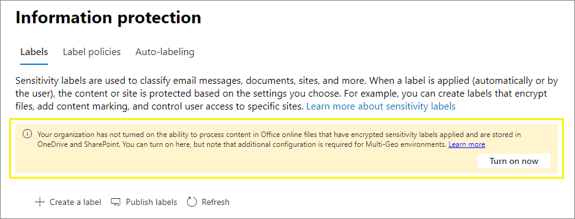

# <a name="enable-sensitivity-labels-for-office-files-in-sharepoint-and-onedrive"></a><span data-ttu-id="5da08-103">SharePoint 및 OneDrive에서 Office 파일에 대한 민감도 레이블 사용</span><span class="sxs-lookup"><span data-stu-id="5da08-103">Enable sensitivity labels for Office files in SharePoint and OneDrive</span></span>

><span data-ttu-id="5da08-104">*[보안 및 규정 준수를 위한 Microsoft 365 라이선싱 지침](https://aka.ms/ComplianceSD).*</span><span class="sxs-lookup"><span data-stu-id="5da08-104">*[Microsoft 365 licensing guidance for security & compliance](https://aka.ms/ComplianceSD).*</span></span>

<span data-ttu-id="5da08-105">SharePoint 및 OneDrive에서 Office 파일에 대해 민감도 레이블을 사용 하도록 설정 하기 전에 Office의 웹에 [민감도 레이블을](sensitivity-labels.md) 적용할 수 없습니다.</span><span class="sxs-lookup"><span data-stu-id="5da08-105">Before you enable sensitivity labels for Office files in SharePoint and OneDrive, you can't apply your [sensitivity labels](sensitivity-labels.md) in Office on the web.</span></span> <span data-ttu-id="5da08-106">리본 메뉴에 **민감도** 단추가 표시 되지 않거나 상태 표시줄에 레이블 이름이 적용 됩니다.</span><span class="sxs-lookup"><span data-stu-id="5da08-106">You don't see the **Sensitivity** button on the ribbon, or the applied label name on the status bar.</span></span> <span data-ttu-id="5da08-107">또한 데스크톱 앱을 사용 하 여 파일에 레이블을 지정 하 고 SharePoint 또는 OneDrive에 저장 하는 경우에는 레이블에서 암호화를 적용 한 경우 이러한 파일의 내용을 처리할 수 없습니다.</span><span class="sxs-lookup"><span data-stu-id="5da08-107">In addition, if you use desktop apps to label your files and then save them on SharePoint or OneDrive, the service can't process the content of these files if the label applied encryption.</span></span> <span data-ttu-id="5da08-108">이러한 상황에서는 공동 작성, eDiscovery, 데이터 손실 방지, 검색 및 기타 공동 작업 기능이 작동 하지 않습니다.</span><span class="sxs-lookup"><span data-stu-id="5da08-108">Coauthoring, eDiscovery, Data Loss Prevention, search, and other collaborative features won't work under these circumstances.</span></span>

<span data-ttu-id="5da08-109">SharePoint 및 OneDrive에서 Office 파일에 대해 민감도 레이블을 사용 하도록 설정 하면 이러한 모든 기능이 사용 되도록 설정 됩니다.</span><span class="sxs-lookup"><span data-stu-id="5da08-109">When you do enable sensitivity labels for Office files in SharePoint and OneDrive, all these capabilities are enabled.</span></span> <span data-ttu-id="5da08-110">다음과 같이 민감도 레이블을 사용자에 게 표시 하는 것 외에, 클라우드 기반 키를 사용 하 여 암호화를 포함 하는 민감도 레이블이 적용 된 파일 및 변경 내용에 대해 다음을 수행 합니다.</span><span class="sxs-lookup"><span data-stu-id="5da08-110">In addition to displaying sensitivity labels to users, for new and changed files that have a sensitivity label applied that includes encryption with a cloud-based key:</span></span>

- <span data-ttu-id="5da08-111">Sharepoint 및 OneDrive에서 Word, Excel 및 PowerPoint 파일에 적용 되는 민감도 레이블 (sharepoint 및 비즈니스용 파일)은 sharepoint에 저장 되므로 파일 내용을 처리할 수 있도록 Azure Information Protection의 암호화가 제거 됩니다.</span><span class="sxs-lookup"><span data-stu-id="5da08-111">SharePoint recognizes sensitivity labels applied to Word, Excel, and PowerPoint files in SharePoint and OneDrive: While the file is stored in SharePoint, the encryption from Azure Information Protection is removed so that the file contents can be processed.</span></span> <span data-ttu-id="5da08-112">SharePoint에 저장 되어 있는 동안 문서를 보호 하는 방법에 대 한 자세한 내용은 [비즈니스용 OneDrive 및 SharePoint Online의 데이터 암호화](data-encryption-in-odb-and-spo.md)를 참조 하세요.</span><span class="sxs-lookup"><span data-stu-id="5da08-112">For information about how documents are protected while they are stored in SharePoint, see [Data Encryption in OneDrive for Business and SharePoint Online](data-encryption-in-odb-and-spo.md).</span></span>

- <span data-ttu-id="5da08-113">SharePoint 또는 OneDrive에서이 파일을 다운로드 하거나 액세스할 때 레이블에 있는 민감도 레이블과 모든 암호화 설정이 파일에 다시 적용 되며, 이러한 설정은 파일을 저장할 때마다 적용 됩니다.</span><span class="sxs-lookup"><span data-stu-id="5da08-113">When you download or access this file from SharePoint or OneDrive, the sensitivity label and any encryption settings from the label are reapplied with the file, and these settings remain enforced wherever the file is saved.</span></span> <span data-ttu-id="5da08-114">이 동작으로 인해 문서를 보호 하는 데 레이블만 사용 하는 사용자 지침이 제공 되어야 합니다.</span><span class="sxs-lookup"><span data-stu-id="5da08-114">Because of this behavior, ensure you provide user guidance to use only labels to protect documents.</span></span> <span data-ttu-id="5da08-115">자세한 내용은 [IRM (정보 권한 관리) 옵션 및 민감도 레이블을](sensitivity-labels-office-apps.md#information-rights-management-irm-options-and-sensitivity-labels)참조 하세요.</span><span class="sxs-lookup"><span data-stu-id="5da08-115">For more information, see [Information Rights Management (IRM) options and sensitivity labels](sensitivity-labels-office-apps.md#information-rights-management-irm-options-and-sensitivity-labels).</span></span>

- <span data-ttu-id="5da08-116">SharePoint에서 업로드 시 파일의 암호화를 제거 하려면 레이블이 지정 되 고 암호화 된 파일을 업로드 하는 사용자에 게 최소한 파일 보기에 대 한 사용 권한이 있어야 합니다.</span><span class="sxs-lookup"><span data-stu-id="5da08-116">For SharePoint to remove the encryption from the file on upload, the user who uploads the labeled and encrypted file must have usage rights to at least view the file.</span></span> <span data-ttu-id="5da08-117">Sharepoint에서 사용자가 파일을 열 수 없는 경우 sharepoint에서 암호화를 제거 하지 않습니다.</span><span class="sxs-lookup"><span data-stu-id="5da08-117">SharePoint doesn't remove encryption from files if the user can't open them outside SharePoint.</span></span>

- <span data-ttu-id="5da08-118">웹에서 Office (Word, Excel, PowerPoint)를 사용 하 여 암호화를 적용 하는 레이블이 민감도 인 Office 파일을 열고 편집 합니다.</span><span class="sxs-lookup"><span data-stu-id="5da08-118">Use Office on the web (Word, Excel, PowerPoint) to open and edit Office files that have sensitivity labels that apply encryption.</span></span> <span data-ttu-id="5da08-119">암호화를 통해 할당 된 사용 권한이 적용 됩니다.</span><span class="sxs-lookup"><span data-stu-id="5da08-119">The permissions that were assigned with the encryption are enforced.</span></span> <span data-ttu-id="5da08-120">웹에서 Word를 사용 하는 경우 이러한 문서를 편집할 때도 자동 레이블 기능을 사용할 수 있습니다.</span><span class="sxs-lookup"><span data-stu-id="5da08-120">With Word on the web, you can also use auto-labeling when you edit these documents.</span></span>

- <span data-ttu-id="5da08-121">Office 365 eDiscovery는 이러한 파일에 대 한 전체 텍스트 검색을 지원 합니다.</span><span class="sxs-lookup"><span data-stu-id="5da08-121">Office 365 eDiscovery supports full-text search for these files.</span></span> <span data-ttu-id="5da08-122">DLP (데이터 손실 방지) 정책은 이러한 파일의 콘텐츠를 포함 합니다.</span><span class="sxs-lookup"><span data-stu-id="5da08-122">Data Loss Prevention (DLP) policies cover content in these files.</span></span>

> [!NOTE]
> <span data-ttu-id="5da08-123">암호화가 클라우드 기반 키와 함께 온-프레미스 키가 적용 되지 않은 경우 키 관리 토폴로지에서 흔히 파일 콘텐츠를 처리 하는 데 사용 되는 SharePoint 동작이 변경 되지 않습니다.</span><span class="sxs-lookup"><span data-stu-id="5da08-123">If encryption hasn't been applied with a cloud-based key but an on-premises key, a key management topology often referred to as "hold your own key" (HYOK), the SharePoint behavior for processing the file contents doesn't change.</span></span>
>
> <span data-ttu-id="5da08-124">또한 sharepoint의 기존 레이블이 지정 되 고 암호화 된 파일에 대해서도 변경 되지 않습니다.</span><span class="sxs-lookup"><span data-stu-id="5da08-124">The SharePoint behavior also doesn't change for existing labeled and encrypted files in SharePoint.</span></span> <span data-ttu-id="5da08-125">이러한 파일을 새 기능의 혜택을 얻으려면 다운로드 및 업로드 하거나 SharePoint 및 OneDrive에 대해 민감도 레이블을 사용 하도록 설정 하는 명령을 실행 한 후에 편집 해야 합니다.</span><span class="sxs-lookup"><span data-stu-id="5da08-125">For these files to benefit from the new capabilities, they must be either downloaded and uploaded, or edited after you run the command to enable sensitivity labels for SharePoint and OneDrive.</span></span> <span data-ttu-id="5da08-126">예를 들어 검색 및 eDiscovery 결과에서 반환 됩니다.</span><span class="sxs-lookup"><span data-stu-id="5da08-126">For example, they will then be returned in search and eDiscovery results.</span></span>

<span data-ttu-id="5da08-127">SharePoint 및 OneDrive에서 Office 파일에 대해 민감도 레이블을 사용 하도록 설정한 후 SharePoint 및 OneDrive의 문서에 적용 되는 세 가지 새 [감사 이벤트](search-the-audit-log-in-security-and-compliance.md#sensitivity-label-activities) 를 모니터링 민감도 레이블로 사용할 수 있습니다.</span><span class="sxs-lookup"><span data-stu-id="5da08-127">After you enable sensitivity labels for Office files in SharePoint and OneDrive, three new [audit events](search-the-audit-log-in-security-and-compliance.md#sensitivity-label-activities) are available for monitoring sensitivity labels that are applied to documents in SharePoint and OneDrive:</span></span>
- <span data-ttu-id="5da08-128">**파일에 적용된 민감도 레이블**</span><span class="sxs-lookup"><span data-stu-id="5da08-128">**Applied sensitivity label to file**</span></span>
- <span data-ttu-id="5da08-129">**파일에 변경된 민감도 레이블을 적용**</span><span class="sxs-lookup"><span data-stu-id="5da08-129">**Changed sensitivity label applied to file**</span></span>
- <span data-ttu-id="5da08-130">**파일에서 제거된 민감도 레이블**</span><span class="sxs-lookup"><span data-stu-id="5da08-130">**Removed sensitivity label from file**</span></span>

<span data-ttu-id="5da08-131">다음 비디오 (오디오 없음)를 시청 하 여 새로운 기능이 작동 하는지 확인 합니다.</span><span class="sxs-lookup"><span data-stu-id="5da08-131">Watch the following video (no audio) to see the new capabilities in action:</span></span>

> [!VIDEO https://www.microsoft.com/videoplayer/embed//RE4ornZ]

<span data-ttu-id="5da08-132">언제 든 지 SharePoint 및 OneDrive에서 Office 파일에 대 한 민감도 레이블을 사용 하지 않도록[opt-out](#how-to-disable-sensitivity-labels-for-sharepoint-and-onedrive-opt-out) 설정할 수 있습니다.</span><span class="sxs-lookup"><span data-stu-id="5da08-132">You always have the choice to disable sensitivity labels for Office files in SharePoint and OneDrive ([opt-out](#how-to-disable-sensitivity-labels-for-sharepoint-and-onedrive-opt-out) at any time.</span></span>

## <a name="requirements"></a><span data-ttu-id="5da08-133">요구 사항</span><span class="sxs-lookup"><span data-stu-id="5da08-133">Requirements</span></span>

<span data-ttu-id="5da08-134">이러한 새 기능은 [민감도 레이블](sensitivity-labels.md) 에서만 작동 합니다.</span><span class="sxs-lookup"><span data-stu-id="5da08-134">These new capabilities work with [sensitivity labels](sensitivity-labels.md) only.</span></span> <span data-ttu-id="5da08-135">현재 Azure Information Protection 레이블이 있는 경우에는 업로드 하는 새 파일에 대해 이러한 기능을 사용할 수 있도록 먼저 해당 레이블을 민감도 레이블로 마이그레이션하십시오.</span><span class="sxs-lookup"><span data-stu-id="5da08-135">If you currently have Azure Information Protection labels, first migrate them to sensitivity labels so that you can enable these features for new files that you upload.</span></span> <span data-ttu-id="5da08-136">자세한 내용은 [통합 민감도 레이블로 Azure Information Protection 레이블을 마이그레이션하는 방법](https://docs.microsoft.com/azure/information-protection/configure-policy-migrate-labels) 를 참조 하십시오.</span><span class="sxs-lookup"><span data-stu-id="5da08-136">For instructions, see [How to migrate Azure Information Protection labels to unified sensitivity labels](https://docs.microsoft.com/azure/information-protection/configure-policy-migrate-labels)</span></span>

<span data-ttu-id="5da08-137">Windows 및 버전 19.002.0107.0008 이상에서 OneDrive 동기화 앱 버전 19.002.0121.0008 이상을 사용 합니다.</span><span class="sxs-lookup"><span data-stu-id="5da08-137">Use the OneDrive sync app version 19.002.0121.0008 or later on Windows, and version 19.002.0107.0008 or later on Mac.</span></span> <span data-ttu-id="5da08-138">두 버전 모두 2019 년 1 월 28 일에 출시 되었으며 현재 모든 링으로 출시 되었습니다.</span><span class="sxs-lookup"><span data-stu-id="5da08-138">Both these versions were released January 28, 2019, and are currently released to all rings.</span></span> <span data-ttu-id="5da08-139">자세한 내용은 [OneDrive 릴리스 노트](https://support.office.com/article/845dcf18-f921-435e-bf28-4e24b95e5fc0)를 참조 하세요.</span><span class="sxs-lookup"><span data-stu-id="5da08-139">For more information, see the [OneDrive release notes](https://support.office.com/article/845dcf18-f921-435e-bf28-4e24b95e5fc0).</span></span> <span data-ttu-id="5da08-140">SharePoint 및 OneDrive에서 Office 파일에 대해 민감도 레이블을 사용 하도록 설정 하 고 나면 이전 버전의 동기화 앱을 실행 하는 사용자에 게 업데이트 하 라는 메시지가 표시 됩니다.</span><span class="sxs-lookup"><span data-stu-id="5da08-140">After you enable sensitivity labels for Office files in SharePoint and OneDrive, users who run an older version of the sync app are prompted to update it.</span></span>

## <a name="limitations"></a><span data-ttu-id="5da08-141">제한</span><span class="sxs-lookup"><span data-stu-id="5da08-141">Limitations</span></span>

- <span data-ttu-id="5da08-142">SharePoint에서는 이미 Azure Information Protection 레이블을 사용 하 여 암호화 한 기존 파일에 민감도 레이블을 자동으로 적용 하지 않습니다.</span><span class="sxs-lookup"><span data-stu-id="5da08-142">SharePoint doesn't automatically apply sensitivity labels to existing files that you've already encrypted using Azure Information Protection labels.</span></span> <span data-ttu-id="5da08-143">대신 SharePoint 및 OneDrive에서 Office 파일에 대해 민감도 레이블을 사용 하도록 설정한 후에 작동 하는 기능을 얻으려면 다음 작업을 완료 하세요.</span><span class="sxs-lookup"><span data-stu-id="5da08-143">Instead, to get the features to work after you enable sensitivity labels for Office files in SharePoint and OneDrive, complete these tasks:</span></span>
    
    1. <span data-ttu-id="5da08-144">[Azure Information Protection 레이블을](https://docs.microsoft.com/azure/information-protection/configure-policy-migrate-labels) 민감도 레이블로 마이그레이션하고 Microsoft 365 준수 센터 또는 레이블 관리 센터에서 [게시](create-sensitivity-labels.md#publish-sensitivity-labels-by-creating-a-label-policy) 했는지 확인 합니다.</span><span class="sxs-lookup"><span data-stu-id="5da08-144">Make sure you have [migrated the Azure Information Protection labels](https://docs.microsoft.com/azure/information-protection/configure-policy-migrate-labels) to sensitivity labels and [published them](create-sensitivity-labels.md#publish-sensitivity-labels-by-creating-a-label-policy) from the Microsoft 365 compliance center, or equivalent labeling admin center.</span></span>
    
    2. <span data-ttu-id="5da08-145">파일을 다운로드 한 다음 SharePoint에 업로드 합니다.</span><span class="sxs-lookup"><span data-stu-id="5da08-145">Download the files and then upload them to SharePoint.</span></span>

- <span data-ttu-id="5da08-146">암호화를 적용 한 레이블에서 암호화 [에 대 한 다음 구성](encryption-sensitivity-labels.md#configure-encryption-settings)중 하나를 수행 하면 SharePoint에서 암호화 된 파일을 처리할 수 없습니다.</span><span class="sxs-lookup"><span data-stu-id="5da08-146">SharePoint can't process encrypted files when the label that applied the encryption has either of the following [configurations for encryption](encryption-sensitivity-labels.md#configure-encryption-settings):</span></span>
    - <span data-ttu-id="5da08-147">사용자가 **Word, PowerPoint 및 Excel에서 사용 권한을 지정할** **때 사용 권한을 할당할 수** 있습니다.</span><span class="sxs-lookup"><span data-stu-id="5da08-147">**Let users assign permissions when they apply the label** and the checkbox for **In Word, PowerPoint, and Excel, prompt users to specify permissions** is selected.</span></span> <span data-ttu-id="5da08-148">이 설정을 "사용자 정의 권한"이 라고도 합니다.</span><span class="sxs-lookup"><span data-stu-id="5da08-148">This setting is sometimes referred to as "user-defined permissions".</span></span>
    - <span data-ttu-id="5da08-149">**콘텐츠에 대 한 사용자 액세스 만료** 는 **Never**이외의 값으로 설정 됩니다.</span><span class="sxs-lookup"><span data-stu-id="5da08-149">**User access to content expires** is set to a value other than **Never**.</span></span>
    
    <span data-ttu-id="5da08-150">이러한 암호화 구성 중 하나가 있는 레이블의 경우에는 웹에서 Office 사용자에 게 레이블이 표시 되지 않습니다.</span><span class="sxs-lookup"><span data-stu-id="5da08-150">For labels with either of these encryption configurations, the labels aren't displayed to users in Office on the web.</span></span> <span data-ttu-id="5da08-151">또한 이러한 암호화 설정이 이미 있는 레이블이 지정 된 문서에는 새 기능을 사용할 수 없습니다.</span><span class="sxs-lookup"><span data-stu-id="5da08-151">Additionally, the new capabilities can't be used with labeled documents that already have these encryption settings.</span></span> <span data-ttu-id="5da08-152">예를 들어 이러한 문서는 업데이트 되더라도 검색 결과에 반환 되지 않습니다.</span><span class="sxs-lookup"><span data-stu-id="5da08-152">For example, these documents won't be returned in search results, even if they are updated.</span></span>

- <span data-ttu-id="5da08-153">사용자에 게 편집 권한을 부여 하는 암호화 된 문서에서는 Office 앱의 웹 버전에서 복사를 차단할 수 없습니다.</span><span class="sxs-lookup"><span data-stu-id="5da08-153">For an encrypted document that grants edit permissions to a user, copying can't be blocked in the web versions of the Office apps.</span></span>

- <span data-ttu-id="5da08-154">Azure Information Protection 문서 추적 사이트는 지원 되지 않습니다.</span><span class="sxs-lookup"><span data-stu-id="5da08-154">The Azure Information Protection document tracking site is not supported.</span></span>

- <span data-ttu-id="5da08-155">Office 데스크톱 앱 및 모바일 앱은 암호화로 레이블이 지정 된 파일에 대 한 공동 작성을 지원 하지 않습니다.</span><span class="sxs-lookup"><span data-stu-id="5da08-155">Office desktop apps and mobile apps don't support coauthoring for files that are labeled with encryption.</span></span> <span data-ttu-id="5da08-156">이러한 앱은 계속 해 서 레이블이 지정 되 고 암호화 된 파일을 단독 편집 모드로 엽니다.</span><span class="sxs-lookup"><span data-stu-id="5da08-156">These apps continue to open labeled and encrypted files in exclusive editing mode.</span></span>

- <span data-ttu-id="5da08-157">사용자의 동기화 클라이언트에 다운로드 한 파일에 이미 적용 되어 있는 게시 된 레이블의 설정이 관리자가 변경 하는 경우 사용자는 해당 파일에 대 한 변경 내용을 OneDrive 동기화 폴더에 저장 하지 못할 수 있습니다.</span><span class="sxs-lookup"><span data-stu-id="5da08-157">If an admin changes settings for a published label that's already applied to files downloaded to users' sync client, users might be unable to save changes they make to the file in their OneDrive Sync folder.</span></span> <span data-ttu-id="5da08-158">이 시나리오는 암호화가 지정 된 파일에 적용 되며, 레이블이 암호화를 적용 하는 레이블에 암호화를 적용 하지 않은 레이블에서 변경 되는 경우에도 마찬가지입니다.</span><span class="sxs-lookup"><span data-stu-id="5da08-158">This scenario applies to files that are labeled with encryption, and also when the label change is from a label that didn't apply encryption to a label that does apply encryption.</span></span> <span data-ttu-id="5da08-159">사용자에 게 [흰색 횡단면 오류가 있는 빨간색 원이](https://support.office.com/article/what-do-the-onedrive-icons-mean-11143026-8000-44f8-aaa9-67c985aa49b3)표시 되 고 새 변경 내용을 별도의 복사본으로 저장할지 묻는 메시지가 나타납니다.</span><span class="sxs-lookup"><span data-stu-id="5da08-159">Users see a [red circle with a white cross icon error](https://support.office.com/article/what-do-the-onedrive-icons-mean-11143026-8000-44f8-aaa9-67c985aa49b3), and they are asked to save new changes as a separate copy.</span></span> <span data-ttu-id="5da08-160">대신 파일을 닫았다가 다시 열거나, 웹에서 Office를 사용할 수 있습니다.</span><span class="sxs-lookup"><span data-stu-id="5da08-160">Instead, they can close and reopen the file, or use Office on the web.</span></span>

- <span data-ttu-id="5da08-161">레이블이 지정 된 문서가 SharePoint에 업로드 되 고 레이블이 서비스 사용자 이름의 계정을 사용 하 여 암호화를 적용 한 경우에는 웹의 Office에서 해당 문서를 열 수 없습니다.</span><span class="sxs-lookup"><span data-stu-id="5da08-161">If a labeled document is uploaded to SharePoint and the label applied encryption by using an account from a service principal name, the document can't be opened in Office on the web.</span></span> <span data-ttu-id="5da08-162">예제 시나리오에는 Microsoft Cloud App Security 및 팀별로 전자 메일로 전송 되는 파일이 포함 됩니다.</span><span class="sxs-lookup"><span data-stu-id="5da08-162">Example scenarios include Microsoft Cloud App Security and a file sent to Teams by email.</span></span>

- <span data-ttu-id="5da08-163">사용자는 오프 라인으로 전환 하거나 절전 모드로 전환한 후에 저장 문제를 경험 하거나, 웹에서 Office를 사용 하는 대신 Word, Excel 또는 PowerPoint 용 데스크톱 및 모바일 앱을 사용할 수 있습니다.</span><span class="sxs-lookup"><span data-stu-id="5da08-163">Users can experience save problems after going offline or into a sleep mode when instead of using Office for the web, they use the desktop and mobile apps for Word, Excel, or PowerPoint.</span></span> <span data-ttu-id="5da08-164">이러한 사용자의 경우 Office 앱 세션을 다시 시작 하 고 변경 내용을 저장 하려고 하면 원본 파일을 저장 하는 대신 복사본을 저장 하는 옵션이 포함 된 업로드 실패 메시지가 표시 됩니다.</span><span class="sxs-lookup"><span data-stu-id="5da08-164">For these users, when they resume their Office app session and try to save changes, they see an upload failure message with an option to save a copy instead of saving the original file.</span></span> 

- <span data-ttu-id="5da08-165">다음과 같은 방법으로 암호화 된 문서는 웹에서 Office에서 열 수 없습니다.</span><span class="sxs-lookup"><span data-stu-id="5da08-165">Documents that have been encrypted in the following ways can't be opened in Office on the web:</span></span>
    - <span data-ttu-id="5da08-166">온-프레미스 키를 사용 하는 암호화 ("자체 키를 포함" 또는 HYOK)</span><span class="sxs-lookup"><span data-stu-id="5da08-166">Encryption that uses an on-premises key ("hold your own key" or HYOK)</span></span>
    - <span data-ttu-id="5da08-167">예를 들어 권한 관리 보호 서식 파일을 직접 적용 하는 경우와 같이 레이블과 독립적으로 적용 되는 암호화</span><span class="sxs-lookup"><span data-stu-id="5da08-167">Encryption that was applied independently from a label, for example, by directly applying a Rights Management protection template.</span></span>

- <span data-ttu-id="5da08-168">해당 레이블 정책에서 레이블을 제거 하지 않고 SharePoint의 문서에 적용 된 레이블을 삭제 하는 경우에는 다운로드 시 문서를 레이블이 지정 되거나 암호화 되지 않습니다.</span><span class="sxs-lookup"><span data-stu-id="5da08-168">If you delete a label that's been applied to a document in SharePoint, rather than remove the label from the applicable label policy, the document when downloaded won't be labeled or encrypted.</span></span> <span data-ttu-id="5da08-169">비교에서 레이블이 지정 된 문서가 SharePoint 외부에 저장 된 경우 레이블이 삭제 되 면 문서는 암호화 된 상태로 유지 됩니다.</span><span class="sxs-lookup"><span data-stu-id="5da08-169">In comparison, if the labeled document is stored outside SharePoint, the document remains encrypted if the label is deleted.</span></span> <span data-ttu-id="5da08-170">테스트 단계에서 레이블을 삭제할 수는 있지만 프로덕션 환경에서는 레이블을 삭제 하는 것이 거의 발생 하지 않습니다.</span><span class="sxs-lookup"><span data-stu-id="5da08-170">Note that although you might delete labels during a testing phase, it's very rare to delete a label in a production environment.</span></span>

## <a name="how-to-enable-sensitivity-labels-for-sharepoint-and-onedrive-opt-in"></a><span data-ttu-id="5da08-171">SharePoint 및 OneDrive (옵트인)에 대해 민감도 레이블을 사용 하도록 설정 하는 방법</span><span class="sxs-lookup"><span data-stu-id="5da08-171">How to enable sensitivity labels for SharePoint and OneDrive (opt-in)</span></span>

<span data-ttu-id="5da08-172">Microsoft 365 준수 센터를 사용 하거나 PowerShell을 사용 하 여 새 기능을 사용 하도록 설정할 수 있습니다.</span><span class="sxs-lookup"><span data-stu-id="5da08-172">You can enable the new capabilities by using the Microsoft 365 compliance center, or by using PowerShell.</span></span>

### <a name="use-the-compliance-center-to-enable-support-for-sensitivity-labels"></a><span data-ttu-id="5da08-173">준수 센터를 사용 하 여 민감도 레이블 지원 설정</span><span class="sxs-lookup"><span data-stu-id="5da08-173">Use the compliance center to enable support for sensitivity labels</span></span>

<span data-ttu-id="5da08-174">이 옵션은 SharePoint 및 OneDrive에 민감도 레이블을 사용 하도록 설정 하는 가장 쉬운 방법입니다.</span><span class="sxs-lookup"><span data-stu-id="5da08-174">This option is the easiest way to enable sensitivity labels for SharePoint and OneDrive.</span></span>

<span data-ttu-id="5da08-175">조직의 전역 관리자는 민감도 레이블의 모든 측면을 작성하고 관리할 수있는 모든 권한을 가지고 있습니다.</span><span class="sxs-lookup"><span data-stu-id="5da08-175">The global admin for your organization has full permissions to create and manage all aspects of sensitivity labels.</span></span> <span data-ttu-id="5da08-176">전역 관리자로 로그인하지 않은 경우 [민감도 레이블을 만들고 관리하는 데 필요한 권한](get-started-with-sensitivity-labels.md#permissions-required-to-create-and-manage-sensitivity-labels)을 참조하십시오.</span><span class="sxs-lookup"><span data-stu-id="5da08-176">If you aren't signing in as a global admin, see [Permissions required to create and manage sensitivity labels](get-started-with-sensitivity-labels.md#permissions-required-to-create-and-manage-sensitivity-labels).</span></span>

1. <span data-ttu-id="5da08-177">[Microsoft 365 준수 센터](https://compliance.microsoft.com/)에 로그인 하 고 **솔루션** > **정보 보호** 로 이동 합니다.</span><span class="sxs-lookup"><span data-stu-id="5da08-177">Sign in to the [Microsoft 365 compliance center](https://compliance.microsoft.com/), and navigate to **Solutions** > **Information protection**</span></span>
    
    <span data-ttu-id="5da08-178">이 옵션이 바로 보이지 않는 경우에는 먼저 **모두 표시**를 선택합니다.</span><span class="sxs-lookup"><span data-stu-id="5da08-178">If you don't immediately see this option, first select **Show all**.</span></span> 

2. <span data-ttu-id="5da08-179">Office online 파일에서 콘텐츠를 처리할 수 있는 기능을 설정 하는 메시지가 표시 되 면 **지금 켜기**를 선택 합니다.</span><span class="sxs-lookup"><span data-stu-id="5da08-179">If you see a message to turn on the ability to process content in Office online files, select **Turn on now**:</span></span>
    
    
    
    <span data-ttu-id="5da08-181">이 명령은 즉시 실행 되며, 다음에 페이지를 새로 고치면 메시지 또는 단추가 더 이상 표시 되지 않습니다.</span><span class="sxs-lookup"><span data-stu-id="5da08-181">The command runs immediately and when the page is next refreshed, you no longer see the message or button.</span></span> 

> [!NOTE]
> <span data-ttu-id="5da08-182">Office 365 다중 Geo가 있는 경우 PowerShell을 사용 하 여 모든 지리적 위치에서 이러한 기능을 사용 하도록 설정 해야 합니다.</span><span class="sxs-lookup"><span data-stu-id="5da08-182">If you have Office 365 Multi-Geo, you must use PowerShell to enable these capabilities for all your geo-locations.</span></span> <span data-ttu-id="5da08-183">자세한 내용은 다음 섹션을 참조하세요.</span><span class="sxs-lookup"><span data-stu-id="5da08-183">See the next section for details.</span></span>

### <a name="use-powershell-to-enable-support-for-sensitivity-labels"></a><span data-ttu-id="5da08-184">PowerShell을 사용 하 여 민감도 레이블 지원 설정</span><span class="sxs-lookup"><span data-stu-id="5da08-184">Use PowerShell to enable support for sensitivity labels</span></span>

<span data-ttu-id="5da08-185">준수 센터를 사용 하는 대신 SharePoint Online PowerShell에서 [set-spotenant](https://docs.microsoft.com/powershell/module/sharepoint-online/set-spotenant?view=sharepoint-ps) cmdlet을 사용 하 여 민감도 레이블에 대 한 지원을 사용 하도록 설정할 수 있습니다.</span><span class="sxs-lookup"><span data-stu-id="5da08-185">As an alternative to using the compliance center, you can enable support for sensitivity labels by using the [Set-SPOTenant](https://docs.microsoft.com/powershell/module/sharepoint-online/set-spotenant?view=sharepoint-ps) cmdlet from SharePoint Online PowerShell.</span></span> 

<span data-ttu-id="5da08-186">Office 365 다중 Geo가 있는 경우 PowerShell을 사용 하 여 모든 지리적 위치에 대해이 지원을 사용 하도록 설정 해야 합니다.</span><span class="sxs-lookup"><span data-stu-id="5da08-186">If you have Office 365 Multi-Geo, you must use PowerShell to enable this support for all your geo-locations.</span></span>

#### <a name="prepare-the-sharepoint-online-management-shell"></a><span data-ttu-id="5da08-187">SharePoint Online 관리 셸 준비</span><span class="sxs-lookup"><span data-stu-id="5da08-187">Prepare the SharePoint Online Management Shell</span></span>

<span data-ttu-id="5da08-188">SharePoint 및 OneDrive에서 Office 파일의 민감도 레이블을 사용 하도록 설정 하기 위해 PowerShell 명령을 실행 하기 전에 SharePoint Online 관리 셸 버전 16.0.19418.12000 이상을 실행 하 고 있는지 확인 하세요.</span><span class="sxs-lookup"><span data-stu-id="5da08-188">Before you run the PowerShell command to enable sensitivity labels for Office files in SharePoint and OneDrive, ensure that you're running SharePoint Online Management Shell version 16.0.19418.12000 or later.</span></span> <span data-ttu-id="5da08-189">최신 버전이 이미 있는 경우에는 [다음 절차](#run-the-powershell-command-to-enable-support-for-sensitivity-labels) 로 건너뛰고 PowerShell 명령을 실행할 수 있습니다.</span><span class="sxs-lookup"><span data-stu-id="5da08-189">If you already have the latest version, you can skip to [next procedure](#run-the-powershell-command-to-enable-support-for-sensitivity-labels) to run the PowerShell command.</span></span>

1. <span data-ttu-id="5da08-190">PowerShell 갤러리에서 이전 버전의 SharePoint Online 관리 셸을 설치한 경우 다음 cmdlet을 실행하여 모듈을 업데이트할 수 있습니다.</span><span class="sxs-lookup"><span data-stu-id="5da08-190">If you have installed a previous version of the SharePoint Online Management Shell from PowerShell gallery, you can update the module by running the following cmdlet.</span></span>

    ```PowerShell
    Update-Module -Name Microsoft.Online.SharePoint.PowerShell
    ```

2. <span data-ttu-id="5da08-191">또는 Microsoft 다운로드 센터에서 이전 버전의 SharePoint Online 관리 셸을 설치한 경우 **프로그램 추가/제거** 로 이동 하 여 Sharepoint Online 관리 셸을 제거할 수도 있습니다.</span><span class="sxs-lookup"><span data-stu-id="5da08-191">Alternatively, if you have installed a previous version of the SharePoint Online Management Shell from the Microsoft Download Center, you can also go to **Add or remove programs** and uninstall the SharePoint Online Management Shell.</span></span>

3. <span data-ttu-id="5da08-192">웹 브라우저에서 다운로드 센터 페이지로 이동한 다음 [최신 SharePoint Online 관리 셸을 다운로드](https://go.microsoft.com/fwlink/p/?LinkId=255251)합니다.</span><span class="sxs-lookup"><span data-stu-id="5da08-192">In a web browser, go to the Download Center page and [Download the latest SharePoint Online Management Shell](https://go.microsoft.com/fwlink/p/?LinkId=255251).</span></span>

4. <span data-ttu-id="5da08-193">언어를 선택한 다음 **다운로드**를 클릭합니다.</span><span class="sxs-lookup"><span data-stu-id="5da08-193">Select your language and then click **Download**.</span></span>

5. <span data-ttu-id="5da08-194">X64 및 x86 .msi 파일 중에서 선택합니다.</span><span class="sxs-lookup"><span data-stu-id="5da08-194">Choose between the x64 and x86 .msi file.</span></span> <span data-ttu-id="5da08-195">64 비트 버전의 Windows 또는 x86 파일 (32 비트 버전을 실행 하는 경우)을 실행 하는 경우 x64 파일을 다운로드 합니다.</span><span class="sxs-lookup"><span data-stu-id="5da08-195">Download the x64 file if you run the 64-bit version of Windows or the x86 file if you run the 32-bit version.</span></span> <span data-ttu-id="5da08-196">알 수 없는 경우 [실행 중인 Windows 운영 체제 버전](https://support.microsoft.com/help/13443/windows-which-operating-system) 을 확인 하세요.</span><span class="sxs-lookup"><span data-stu-id="5da08-196">If you don’t know, see [Which version of Windows operating system am I running?](https://support.microsoft.com/help/13443/windows-which-operating-system)</span></span>

6. <span data-ttu-id="5da08-197">파일을 다운로드 한 후에는 파일을 실행 하 고 설치 마법사의 단계를 따릅니다.</span><span class="sxs-lookup"><span data-stu-id="5da08-197">After you have downloaded the file, run the file and follow the steps in the Setup Wizard.</span></span>

#### <a name="run-the-powershell-command-to-enable-support-for-sensitivity-labels"></a><span data-ttu-id="5da08-198">PowerShell 명령을 실행 하 여 민감도 레이블 지원을 사용 하도록 설정</span><span class="sxs-lookup"><span data-stu-id="5da08-198">Run the PowerShell command to enable support for sensitivity labels</span></span>

<span data-ttu-id="5da08-199">새 기능을 사용 하도록 설정 하려면 *EnableAIPIntegration* 매개 변수와 함께 [set-spotenant](https://docs.microsoft.com/powershell/module/sharepoint-online/set-spotenant?view=sharepoint-ps) cmdlet을 사용 합니다.</span><span class="sxs-lookup"><span data-stu-id="5da08-199">To enable the new capabilities, use the [Set-SPOTenant](https://docs.microsoft.com/powershell/module/sharepoint-online/set-spotenant?view=sharepoint-ps) cmdlet with the *EnableAIPIntegration* parameter:</span></span>

1. <span data-ttu-id="5da08-200">Office 365에서 전역 관리자 또는 SharePoint 관리자 권한이 있는 회사 또는 학교 계정을 사용 하 여 SharePoint에 연결 합니다.</span><span class="sxs-lookup"><span data-stu-id="5da08-200">Using a work or school account that has global administrator or SharePoint admin privileges in Office 365, connect to SharePoint.</span></span> <span data-ttu-id="5da08-201">자세한 방법은 [SharePoint Online 관리 셸 시작](https://docs.microsoft.com/powershell/sharepoint/sharepoint-online/connect-sharepoint-online)을 참조하세요.</span><span class="sxs-lookup"><span data-stu-id="5da08-201">To learn how, see [Getting started with SharePoint Online Management Shell](https://docs.microsoft.com/powershell/sharepoint/sharepoint-online/connect-sharepoint-online).</span></span>
    
    <span data-ttu-id="5da08-202">참고: Office 365 다중 위치를 사용 하는 경우-Url 매개 변수를 [connect-sposervice와 연결](https://docs.microsoft.com/powershell/module/sharepoint-online/connect-sposervice?view=sharepoint-ps)하 고 지리적 위치 중 하나에 대 한 SharePoint Online 관리 센터 사이트 Url을 지정 합니다.</span><span class="sxs-lookup"><span data-stu-id="5da08-202">Note: If you have Office 365 Multi-Geo, use the -Url parameter with [Connect-SPOService](https://docs.microsoft.com/powershell/module/sharepoint-online/connect-sposervice?view=sharepoint-ps), and specify the SharePoint Online Administration Center site URL for one of your geo-locations.</span></span>

2. <span data-ttu-id="5da08-203">다음 명령을 실행 하 고 **Y** 를 눌러 확인 합니다.</span><span class="sxs-lookup"><span data-stu-id="5da08-203">Run the following command and press **Y** to confirm:</span></span>

    ```PowerShell
    Set-SPOTenant -EnableAIPIntegration $true  
    ```
3. <span data-ttu-id="5da08-204">Office 365 다중 사용자의 경우 나머지 각 지리적 위치에 대해 1 ~ 2 단계를 반복 합니다.</span><span class="sxs-lookup"><span data-stu-id="5da08-204">For Office 365 Multi-Geo: Repeat steps 1 and 2 for each of your remaining geo-locations.</span></span>

## <a name="schedule-roll-out-after-you-create-or-change-a-sensitivity-label"></a><span data-ttu-id="5da08-205">민감도 레이블을 만들거나 변경한 후 일정 롤업</span><span class="sxs-lookup"><span data-stu-id="5da08-205">Schedule roll-out after you create or change a sensitivity label</span></span>

<span data-ttu-id="5da08-206">Microsoft 365 준수 센터에서 민감도 레이블을 만들거나 변경한 후에는 스테이지에 게시 합니다.</span><span class="sxs-lookup"><span data-stu-id="5da08-206">After you create or change a sensitivity label in the Microsoft 365 compliance center, publish it in stages.</span></span> <span data-ttu-id="5da08-207">완전히 동기화 되지 않은 레이블을 게시 하면 사용자가 파일에 레이블을 적용 하 여 SharePoint에 업로드 하는 경우 Office 앱의 웹 버전에서는 파일을 열 수 없습니다.</span><span class="sxs-lookup"><span data-stu-id="5da08-207">If you publish labels that haven't fully synchronized, when users apply the labels to files and upload them to SharePoint, the files can’t be opened in the web versions of the Office apps.</span></span> <span data-ttu-id="5da08-208">검색 및 eDiscovery도 파일에 대해 작동 하지 않습니다.</span><span class="sxs-lookup"><span data-stu-id="5da08-208">Search and eDiscovery also don't work for the files.</span></span>

<span data-ttu-id="5da08-209">다음 단계를 따르는 것이 좋습니다.</span><span class="sxs-lookup"><span data-stu-id="5da08-209">We recommend that you follow these steps:</span></span>

1. <span data-ttu-id="5da08-210">새 민감도 레이블을 한 명 또는 두 사람에 게 게시 합니다.</span><span class="sxs-lookup"><span data-stu-id="5da08-210">Publish the new or modified sensitivity label only to one or two people.</span></span>

2. <span data-ttu-id="5da08-211">초기 발행물 이후 24 시간 이상 기다립니다.</span><span class="sxs-lookup"><span data-stu-id="5da08-211">Wait for at least 24 hours after initial publication.</span></span> <span data-ttu-id="5da08-212">레이블이 완전히 동기화 되었는지 확인 합니다.</span><span class="sxs-lookup"><span data-stu-id="5da08-212">Verify that the label has fully synchronized.</span></span>

3. <span data-ttu-id="5da08-213">레이블을 보다 광범위 하 게 게시 합니다.</span><span class="sxs-lookup"><span data-stu-id="5da08-213">Publish the label more broadly.</span></span>

## <a name="how-to-disable-sensitivity-labels-for-sharepoint-and-onedrive-opt-out"></a><span data-ttu-id="5da08-214">SharePoint 및 OneDrive에 대해 민감도 레이블을 사용 하지 않도록 설정 하는 방법 (옵트아웃)</span><span class="sxs-lookup"><span data-stu-id="5da08-214">How to disable sensitivity labels for SharePoint and OneDrive (opt-out)</span></span>

<span data-ttu-id="5da08-215">이러한 새 기능을 사용 하지 않도록 설정 하는 경우 레이블 설정이 계속 적용 되므로 SharePoint 및 OneDrive의 민감도 레이블을 사용 하도록 설정한 후 업로드 한 파일은 레이블로 계속 보호 됩니다.</span><span class="sxs-lookup"><span data-stu-id="5da08-215">If you disable these new capabilities, files that you uploaded after you enabled sensitivity labels for SharePoint and OneDrive continue to be protected by the label because the label settings continue to be enforced.</span></span> <span data-ttu-id="5da08-216">이러한 새 기능을 사용 하지 않도록 설정 하 고 나면 새 파일에 민감도 레이블을 적용할 때 전체 텍스트 검색, eDiscovery 및 공동 작업은 더 이상 작동 하지 않습니다.</span><span class="sxs-lookup"><span data-stu-id="5da08-216">When you apply sensitivity labels to new files after you disable these new capabilities, full-text search, eDiscovery, and coauthoring will no longer work.</span></span>

<span data-ttu-id="5da08-217">이러한 새 기능을 사용 하지 않도록 설정 하려면 PowerShell을 사용 해야 합니다.</span><span class="sxs-lookup"><span data-stu-id="5da08-217">To disable these new capabilities, you must use PowerShell.</span></span> <span data-ttu-id="5da08-218">SharePoint Online 관리 셸 및 [set-spotenant](https://docs.microsoft.com/powershell/module/sharepoint-online/set-spotenant?view=sharepoint-ps) cmdlet을 사용 하 여 [민감도 레이블 지원 사용](#use-powershell-to-enable-support-for-sensitivity-labels) 섹션에 설명 된 것과 동일한 *EnableAIPIntegration* 매개 변수를 지정 합니다.</span><span class="sxs-lookup"><span data-stu-id="5da08-218">Using the SharePoint Online Management Shell and the [Set-SPOTenant](https://docs.microsoft.com/powershell/module/sharepoint-online/set-spotenant?view=sharepoint-ps) cmdlet, specify the same *EnableAIPIntegration* parameter as described in the [Use PowerShell to enable support for sensitivity labels](#use-powershell-to-enable-support-for-sensitivity-labels) section.</span></span> <span data-ttu-id="5da08-219">하지만 이번에는 매개 변수 값을 false로 설정 하 고 **Y** 를 눌러 확인 합니다.</span><span class="sxs-lookup"><span data-stu-id="5da08-219">But this time, set the parameter value to false and press **Y** to confirm:</span></span>

```PowerShell
Set-SPOTenant -EnableAIPIntegration $false
```

<span data-ttu-id="5da08-220">Office 365 다중 Geo를 사용 하는 경우 각 지리적 위치에 대해이 명령을 실행 해야 합니다.</span><span class="sxs-lookup"><span data-stu-id="5da08-220">If you have Office 365 Multi-Geo, you must run this command for each of your geo-locations.</span></span>

## <a name="next-steps"></a><span data-ttu-id="5da08-221">다음 단계</span><span class="sxs-lookup"><span data-stu-id="5da08-221">Next steps</span></span>

<span data-ttu-id="5da08-222">SharePoint 및 OneDrive에서 Office 파일에 대 한 민감도 레이블을 사용 하도록 설정한 후 자동 레이블 지정 정책을 사용 하 여 이러한 파일에 자동으로 레이블을 지정 하는 것이 좋습니다.</span><span class="sxs-lookup"><span data-stu-id="5da08-222">After you've enabled sensitivity labels for Office files in SharePoint and OneDrive, consider automatically labeling these files by using auto-labeling policies.</span></span> <span data-ttu-id="5da08-223">자세한 내용은 [콘텐츠에 민감도 레이블 자동 적용](apply-sensitivity-label-automatically.md)을 참조 하십시오.</span><span class="sxs-lookup"><span data-stu-id="5da08-223">For more information, see [Apply a sensitivity label to content automatically](apply-sensitivity-label-automatically.md).</span></span>