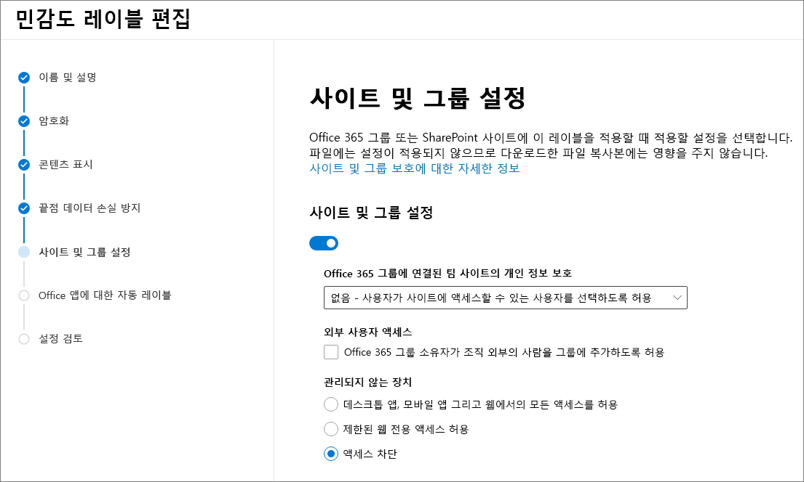

# <a name="use-sensitivity-labels-with-microsoft-teams-office-365-groups-and-sharepoint-sites-public-preview"></a>Microsoft Teams, Office 365 그룹 및 SharePoint 사이트(공개 미리 보기)에서 민감도 레이블 사용

[Microsoft 365 준수 센터](https://protection.office.com/)에서 민감도 레이블을 만들 때 이제 레이블을 Microsoft Teams, Office 365 그룹 그리고 SharePoint 사이트 등의 컨테이너에 적용할 수 있습니다. 레이블 설정을 사용하여 이러한 컨테이너에 대해 다음 옵션을 제어하세요.

- Office 365 그룹에 연결된 팀 사이트의 개인 정보 보호(공개 또는 비공개)
- 외부 사용자 액세스
- 관리되지 않는 장치에서 액세스 

지원되는 컨테이너 중 하나에 이 레이블을 적용하면, 레이블은 연결된 SharePoint 사이트 또는 팀 사이트에 구성된 옵션을 자동으로 적용합니다. 

그러나 이러한 컨테이너의 콘텐츠는 레이블 이름, 시각적 표시 또는 암호화와 같은 설정에 대한 레이블을 상속하지 않습니다. SharePoint 사이트 또는 팀 사이트에서 파일에 레이블을 지정하려면 [SharePoint 및 OneDrive에서 Office 파일에 대한 민감도 레이블 사용](sensitivity-labels-sharepoint-onedrive-files.md)을 설정하세요.

## <a name="about-the-public-preview-for-microsoft-teams-office-365-groups-and-sharepoint-sites"></a>Microsoft Teams, Office 365 그룹 및 SharePoint 사이트의 공개 미리 보기에 대한 정보

Microsoft Teams, Office 365 그룹 및 SharePoint 사이트의 민감도 레이블은 테넌트에 점진적으로 배포되고 있으며 최종 출시 전에 변경될 수 있습니다. 이 공개 미리 보기는 Office 365 Content Delivery Network(CDNs)에서는 작동하지 않습니다.

이 미리보기를 활성화하고 새 설정에 대한 민감도 레이블을 구성하기 전에 사용자는 앱에서 민감도 레이블을 보고 적용할 수 있습니다. 예를 들어 Word의 경우 다음과 같습니다.


이 미리보기를 활성화하고 구성한 후 사용자는 Microsoft Teams, Office 365 그룹 및 SharePoint 사이트에 대한 민감도 레이블을 추가적으로 보고 적용할 수 있습니다. 예를 들어 SharePoint에서 새 팀 사이트를 만드는 경우 다음과 같습니다.


## <a name="enable-this-preview-and-synchronize-labels"></a>이 미리 보기를 사용하고 레이블을 동기화

1. 이 기능은 Azure AD 기능을 사용하므로 Azure AD 설명서의 지침에 따라 미리보기를 활성화하세요. [Azure Active Directory의 Office 365 그룹에 민감도 레이블 지정(미리보기)](https://docs.microsoft.com/azure/active-directory/users-groups-roles/groups-assign-sensitivity-labels).

2. PowerShell 세션에서 전역 관리자 권한이 있는 회사 또는 학교 계정을 사용하여 보안 & 준수 센터에 연결합니다. 예:
    
    ```powershell
    Set-ExecutionPolicy RemoteSigned
    $UserCredential = Get-Credential
    $Session = New-PSSession -ConfigurationName Microsoft.Exchange -ConnectionUri https://ps.compliance.protection.outlook.com/powershell-liveid/ -Credential $UserCredential -Authentication Basic -AllowRedirection
    Import-PSSession $Session -DisableNameChecking
    ```
    
    자세한 지침은 [Office 365 보안 및 규정 준수 센터 PowerShell에 연결](/powershell/exchange/office-365-scc/connect-to-scc-powershell/connect-to-scc-powershell)을 참조하세요.

3. 다음 명령을 실행하여 민감도 레이블을 Azure AD와 동기화하여 이 레이블을 Office 365 그룹과 함께 사용할 수 있도록 합니다.
    
    ```powershell
    Execute-AzureAdLabelSync
    ```

## <a name="how-to-configure-site-and-group-settings-when-you-create-or-edit-sensitivity-labels"></a>민감도 레이블을 만들거나 편집할 때 사이트 및 그룹 설정을 구성하는 방법

이제 사이트 및 그룹에 사용할 민감도 레이블을 만들거나 편집할 준비가 되었습니다. 미리보기를 활성화하면 민감도 레이블 마법사에서 새 페이지가 표시됩니다. **사이트 및 그룹 설정**

민감도 레이블 작성 또는 편집에 도움이 필요한 경우 [민감도 레이블 생성 및 구성](create-sensitivity-labels.md#create-and-configure-sensitivity-labels)의 지침을 참조하세요.

이 새 **사이트 및 그룹 설정** 페이지에서 다음과 같이 설정을 구성합니다.

- **Office 365 그룹에 연결된 팀 사이트의 개인 정보**: 기본 설정이 **공개**로 자동 선택되므로 조직의 모든 사용자가 이 레이블이 적용된 팀 사이트에 액세스할 수 있습니다. 조직에서 승인된 구성원만 그룹의 팀 사이트에 액세스할 수 있도록 하려면 **비공개**를 선택합니다. 
    
    이 옵션을 선택하면 그룹에 대해 구성할 수 있는 이전 개인 정보 설정을 대체하 고 개인 정보 보호 값을 잠가 팀 사이트 또는 그룹에서 민감도 레이블을 먼저 제거해야만 변경할 수 있습니다. 민감도 레이블을 제거한 후에도 레이블의 개인 정보 설정이 유지되며 필요한 경우 변경할 수 있습니다.

- **외부 사용자 액세스**: 그룹 소유자가 [그룹에 게스트를 추가](/office365/admin/create-groups/manage-guest-access-in-groups)할 수 있는지를 제어합니다.

- **관리되지 않는 장치**: [관리되지 않는 장치](/sharepoint/control-access-from-unmanaged-devices)의 경우 전체 액세스, 웹 전용 액세스를 허용하거나 액세스를 완벽하게 차단합니다. 



> [!IMPORTANT]
> 팀, 그룹 또는 사이트에 레이블을 적용할 때 이러한 사이트 및 그룹 설정만 적용됩니다. 팀, 그룹 또는 사이트 내의 콘텐츠에는 암호화 및 콘텐츠 표시와 같은 다른 레이블 설정이 적용되지 않습니다.
> 
> 마찬가지로, 레이블을 만들고 이러한 사이트 및 그룹 설정을 켜지 않는 경우에는 사용자가 팀, 그룹 및 사이트를 만들 때 해당 레이블을 계속 사용할 수 있지만 오직 레이블 이름만 적용됩니다.

민감도 레이블이 아직 게시되지 않은 경우 [민감도 레이블 정책에 추가](create-sensitivity-labels.md#publish-sensitivity-labels-by-creating-a-label-policy)하여 게시합니다. 이 레이블을 포함하는 민감도 레이블 정책이 할당된 사용자는 해당 레이블을 사이트 및 그룹에 대해 선택할 수 있습니다.

## <a name="sensitivity-label-management"></a>민감도 레이블 관리

> [!WARNING]
> Microsoft Teams, Office 365 그룹 및 SharePoint 사이트에 사용하는 민감도 레이블 만들기, 수정 그리고 삭제는 사용자에게 레이블 정책을 게시하는데 케어 코디네이션을 필요로 합니다. 

다음의 지침을 사용하여 모든 사용자에게 영향을 줄 수 있는 사이트 및 그룹에 대한 만들기 오류를 방지합니다.

**레이블 만들기 및 게시:**

민감도 레이블이 만들어지고 게시된 후 레이블이 팀, 그룹 및 사이트의 사용자에게 표시될 때까지는 최대 24시간이 걸릴 수 있습니다. 다음의 단계를 사용하여 테넌트의 모든 사용자에 대한 레이블을 게시합니다.

1. 민감도 레이블을 만들고 테넌트의 일부 사용자 계정에만 게시합니다.

2. 24시간을 기다립니다.

3. 24시간을 기다린 후에 1단계에서 지정한 사용자 계정 중 하나를 사용하여 1단계에서 만든 레이블이 있는 팀, Office 365 그룹 또는 SharePoint 사이트를 만듭니다.

4. 3단계의 만들기 작업 중에 오류가 없으면 테넌트의 모든 사용자에게 레이블을 게시합니다. 오류가 있으면 [Microsoft 지원 센터](https://docs.microsoft.com/office365/admin/contact-support-for-business-products)에 문의하세요.

**게시된 레이블 수정 및 삭제:**

하나 이상의 레이블 정책에 포함된 민감도 레이블을 수정하거나 삭제하는 경우, 이러한 작업의 수행은 모든 팀, 그룹 및 사이트에 대한 만들기 오류로 이어질 수 있습니다. 이러한 상황을 방지하려면 다음의 지침을 사용 하세요.

1. 레이블이 포함된 모든 레이블 정책에서 민감도 레이블을 제거합니다.

2. 48시간을 기다립니다.

3. 48시간을 기다린 후에 팀, 그룹 또는 사이트 만들기를 시도해보고 해당 레이블이 더 이상 보이지 않는지 확인합니다.

4. 민감도 레이블이 보이지 않는 경우에는 안전하게 레이블을 수정하거나 삭제할 수 있습니다. 레이블이 계속 표시되면 [Microsoft 지원 센터](https://docs.microsoft.com/office365/admin/contact-support-for-business-products)에 문의하세요.

## <a name="assign-sensitivity-labels-to-office-365-groups"></a>Office 365 그룹에 민감도 레이블 지정

이제 민감도 레이블을 Office 365 그룹에 적용할 준비가 되었습니다. Azure AD 문서로 돌아가서 다음 지침을 참조하세요.

- [Azure 포털의 새 그룹에 레이블 지정](https://docs.microsoft.com/azure/active-directory/users-groups-roles/groups-assign-sensitivity-labels#assign-a-label-to-a-new-group-in-azure-portal)

-  [Azure 포털의 기존 그룹에 레이블 지정](https://docs.microsoft.com/azure/active-directory/users-groups-roles/groups-assign-sensitivity-labels#assign-a-label-to-an-existing-group-in-azure-portal)

-  [Azure 포털의 기존 그룹에서 레이블 제거](https://docs.microsoft.com/azure/active-directory/users-groups-roles/groups-assign-sensitivity-labels#remove-a-label-from-an-existing-group-in-azure-portal).

## <a name="apply-a-sensitivity-label-to-a-new-team"></a>새 팀에 민감도 레이블을 적용

사용자는 Microsoft Teams에서 새 팀을 만들 때 민감도 레이블을 선택할 수 있습니다. 사용자가 민감도 레이블을 선택할 때 개인 정보 설정이 필요에 따라 변경됩니다. 사용자가 레이블에 대해 선택한 외부 사용자 액세스 설정에 따라 조직 외부의 사용자를 팀에 추가할 수 있는지의 여부가 결정됩니다.

[Teams용 민감도 레이블에 대해 자세히 알아보기](https://docs.microsoft.com/microsoftteams/sensitivity-labels)


팀을 만든 후에는 모든 채널의 우측 상단 모서리에 민감도 레이블이 표시됩니다.


이 서비스는 Office 365 그룹 및 연결된 SharePoint 팀 사이트에 자동으로 동일한 민감도 레이블을 적용합니다.

## <a name="apply-a-sensitivity-label-to-a-new-group-in-outlook-on-the-web"></a>웹용 Outlook의 새 그룹에 민감도 레이블 적용

웹용 Outlook에서 새 그룹을 만들 때 게시된 레이블에 대한 **민감도** 옵션을 선택하거나 변경할 수 있습니다.


## <a name="apply-a-sensitivity-label-to-a-new-site"></a>새 사이트에 민감도 레이블을 적용

관리자 및 최종 사용자는 [최신 팀 사이트 및 커뮤니케이션 사이트를 만들](/sharepoint/create-site-collection) 때 민감도 레이블을 선택할 수 있습니다.

사용자가 최신 팀 및 커뮤니케이션 사이트를 만들 때 기본적으로 민감도 레이블이 이미 선택되어 있습니다. 사용자는 도움말 아이콘을 선택하여 레이블에 대한 더욱 자세한 정보를 확인할 수 있습니다.


사용자가 사이트로 이동할 때 레이블의 이름과 적용된 정책을 볼 수 있습니다.


## <a name="view-sensitivity-labels-in-the-sharepoint-admin-center"></a>SharePoint 관리 센터에서 민감도 레이블 보기

적용된 민감도 레이블을 보려면 새 SharePoint 관리 센터의 **활성 사이트** 페이지를 사용합니다. 먼저 **민감도** 열을 추가해야 할 수 있습니다.


[새 SharePoint 관리 센터에서의 사이트 관리에 대해 자세히 알아보기](/sharepoint/manage-sites-in-new-admin-center).

## <a name="change-site-and-group-settings-for-a-label"></a>레이블의 사이트 및 그룹 설정 변경

레이블의 사이트 및 그룹 설정을 변경할 때마다 팀, 사이트, 그룹에서 새 설정을 사용할 수 있도록 다음 PowerShell 명령을 실행해야 합니다. 최상의 방법은 여러 팀, 그룹 또는 사이트에 레이블을 적용한 후 레이블의 사이트와 그룹 설정을 변경하지 않는 것입니다.

1. 다음 명령을 실행하여 Office 365 보안 & 규정 준수 센터 PowerShell에 연결한 후 민감도 레이블과 해당 Guid 목록을 가져옵니다.
    
    ```powershell
    Set-ExecutionPolicy RemoteSigned
    $UserCredential = Get-Credential
    $Session = New-PSSession -ConfigurationName Microsoft.Exchange -ConnectionUri https://ps.compliance.protection.outlook.com/powershell-liveid -Authentication Basic -AllowRedirection -Credential $UserCredential
    Import-PSSession $Session
    Get-Label |ft Name, Guid
    ```

2. 사용자가 변경한 레이블의 GUID를 기록해 둡니다.

3. 이제 Exchange Online PowerShell에 연결하여 Get-UnifiedGroup cmdlet을 실행하고 예제 GUID "e48058ea-98e8-4940-8db0-ba1310fd955e" 대신에 레이블 GUID를 지정합니다. 
    
    ```powershell
    Set-ExecutionPolicy RemoteSigned
    $UserCredential = Get-Credential
    $Session = New-PSSession -ConfigurationName Microsoft.Exchange -ConnectionUri https://outlook.office365.com/powershell-liveid/ -Credential $UserCredential -Authentication Basic -AllowRedirection
    Import-PSSession $Session
    $Groups= Get-UnifiedGroup | Where {$_.SensitivityLabel  -eq "e48058ea-98e8-4940-8db0-ba1310fd955e"}
    ```

4. 각 그룹에 대해 민감도 레이블을 다시 적용하고 예제 GUID "e48058ea-98e8-4940-8db0-ba1310fd955e" 대신에 레이블 GUID를 지정합니다.
    
    ```powershell
    foreach ($g in $groups)
    {Set-UnifiedGroup -Identity $g.Identity -SensitivityLabelId "e48058ea-98e8-4940-8db0-ba1310fd955e"}
    ```

## <a name="support-for-the-sensitivity-labels"></a>민감도 레이블에 대한 지원

다음 앱 및 서비스에서 사이트 및 그룹 설정에 대해 구성한 민감도 레이블을 사용할 수 있습니다.

- SharePoint Online
- Teams
- 웹용 Outlook
- SharePoint 관리 센터
- Azure AD 관리 센터

사이트 및 그룹 설정에 대해 구성한 민감도 레이블을 현재 사용할 수 없는 기타 앱 및 서비스는 다음과 같습니다.

- Mac용 Outlook
- Outlook 모바일
- Windows용 Outlook 데스크톱
- 양식
- Dynamics 365
- Yammer
- Stream
- Planner
- Project
- PowerBI
- Teams 관리 센터
- Microsoft 365 관리 센터
- Exchange 관리 센터


## <a name="classic-azure-ad-site-classification"></a>클래식 Azure AD 사이트 분류

이 미리 보기를 사용하도록 설정하면 Office 365에서 새 그룹 및 SharePoint 사이트에 대해 이전 분류를 더 이상 지원하지 않습니다. 그러나 민감도 레이블을 사용하도록 변환하지 않는 한 기존 그룹 및 사이트는 여전히 이전 분류를 표시합니다. 이전 분류에는 `ClassificationList` 설정에 대한 값을 정의한 Azure AD PowerShell 또는 PnP Core 라이브러리를 통해 설정하는 "최신" 사이트 분류가 포함 됩니다.

예를 들어 PowerShell에서:

```powershell
   ($setting["ClassificationList"])
```

이전 분류 방법에 대한 자세한 내용은 [SharePoint "최신" 사이트 분류](https://docs.microsoft.com/sharepoint/dev/solution-guidance/modern-experience-site-classification)를 참조하세요.

이전 분류를 민감도 레이블로 변환하려면 다음 중 하나를 수행합니다.

- 기존 레이블 사용: 이미 게시된 기존 민감도 레이블을 편집하여 사이트 및 그룹에 대해 원하는 레이블 설정을 지정합니다.

- 새 레이블 만들기: 기존 분류와 이름이 같은 새 민감도 레이블을 만들고 게시하여 사이트 및 그룹에 대해 원하는 레이블 설정을 지정합니다.

그런 다음 다음을 수행합니다. 

1. 이름 매핑과 함께 PowerShell을 사용하여 민감도 레이블을 기존 Office 365 그룹 및 SharePoint 사이트에 적용합니다. 지침은 다음 섹션을 참조하세요.

2. 기존 그룹과 사이트에서 이전 분류를 제거합니다.

사용자가 아직 민감도 레이블을 지원하지 않는 앱과 서비스에서 새 그룹을 만들지 못하도록 할 수는 없지만, 반복적인 PowerShell 스크립트를 실행하여 사용자가 이전 분류로 만든 새 그룹을 찾고, 이러한 그룹을 민감도 레이블을 사용하도록 변환할 수 있습니다. 

#### <a name="use-powershell-to-convert-classifications-for-office-365-groups-to-sensitivity-labels"></a>PowerShell을 사용하여 Office 365 그룹 분류를 민감도 레이블로 변환

1. SharePoint Online 관리 셸 버전 16.0.19418.12000 이상을 실행 중인지 확인하세요. 최신 버전을 이미 보유한 경우 4단계로 건너뜁니다.

2. PowerShell 갤러리에서 이전 버전의 SharePoint Online 관리 셸을 설치한 경우 다음 cmdlet을 실행하여 모듈을 업데이트할 수 있습니다.
    
    ```PowerShell
    Update-Module -Name Microsoft.Online.SharePoint.PowerShell
    ```

3. Microsoft 다운로드 센터에서 이전 버전의 SharePoint Online 관리 셸을 설치한 경우 **프로그램 추가/제거**로 이동하여 SharePoint Online 관리 셸을 제거합니다. 그런 다음 [다운로드 센터](https://go.microsoft.com/fwlink/p/?LinkId=255251)에서 최신 SharePoint Online 관리 셸을 설치합니다.

4. Office 365에서 전역 관리자 또는 SharePoint 관리자 권한을 보유하는 회사 또는 학교 계정을 사용하여 SharePoint Online 관리 셸에 연결합니다. 자세한 방법은 [SharePoint Online 관리 셸 시작](/powershell/sharepoint/sharepoint-online/connect-sharepoint-online)을 참조하세요.

5. 다음의 명령을 실행하여 민감도 레이블과 해당 GUID 목록을 가져옵니다.

    ```PowerShell
    Set-ExecutionPolicy RemoteSigned
    $UserCredential = Get-Credential
    $Session = New-PSSession -ConfigurationName Microsoft.Exchange -ConnectionUri https://ps.compliance.protection.outlook.com/powershell-liveid -Authentication Basic -AllowRedirection -Credential $UserCredential
    Import-PSSession $Session
    Get-Label |ft Name, Guid  
    ```

6. Office 365 그룹에 적용할 민감도 레이블의 GUID를 기록해 둡니다.

7. 다음 명령을 예로 사용하여 현재 "일반" 분류”를 포함하는 그룹 목록을 가져옵니다.

   ```PowerShell
   $Groups= Get-UnifiedGroup | Where {$_.classification -eq "General"}
   ```

6. 각 그룹에 새 민감도 레이블 GUID를 추가합니다. 예:

    ```PowerShell
    foreach ($g in $groups)
    {Set-UnifiedGroup -Identity $g.Identity -SensitivityLabelId "457fa763-7c59-461c-b402-ad1ac6b703cc"}
    ```

## <a name="auditing-sensitivity-label-activities"></a>민감도 레이블 활동 감사

누군가가 민감도 레이블로 보호된 사이트에 문서를 업로드하고 해당 문서에 사이트에 적용된 민감도 레이블보다 [높은 우선 순위](sensitivity-labels.md#label-priority-order-matters)의 레이블이 있는 경우 이 작업이 차단되지 않습니다. 예를 들어 **일반** 레이블을 SharePoint 사이트에 적용하고 누군가가 이 사이트에 **기밀** 레이블이 지정된 문서를 업로드합니다. 우선 순위가 높은 민감도 레이블은 우선 순위가 낮은 컨텐츠보다 민감도가 높은 컨텐츠를 먼저 식별하므로 이 상황은 보안상의 문제가 될 수 있습니다.

작업이 차단되는 것은 아니지만 감사가 진행되므로 레이블 우선 순위가 이처럼 잘못 정렬된 문서를 확인하고 필요한 경우 조치를 취할 수 있습니다. 예를 들어 업로드된 문서를 사이트에서 삭제하거나 이동합니다. 

사이트에 적용된 민감도 레이블보다 우선 순위가 낮은 레이블이 문서에 지정되어 있다면 보안 문제가 되지 않습니다. 예를 들어 **일반** 레이블이 지정된 문서가 **기밀** 레이블이 지정된 사이트에 업로드됩니다. 이 시나리오에서는 감사 이벤트가 생성되지 않습니다.

이 이벤트에 대한 감사 로그를 검색하려면 **파일 및 페이지 활동** 범주에서 **발견된 문서 감도 불일치**를 찾습니다. 

누군가가 사이트 또는 그룹에 민감도 레이블을 추가하거나 제거하는 경우에도 이러한 활동이 감사됩니다. 이러한 이벤트는 [민감도 레이블 활동](search-the-audit-log-in-security-and-compliance.md#sensitivity-label-activities) 범주에서 찾을 수 있습니다. 

감사 로그를 검색하기 위한 지침은 [보안 및 준수 센터에서 감사 로그 검색](search-the-audit-log-in-security-and-compliance.md)을 참조하세요.

## <a name="troubleshoot-sensitivity-label-deployment"></a>민감도 레이블 배포 문제 해결

Microsoft Teams, Office 365 그룹 및 SharePoint 사이트의 민감도 레이블에 문제가 있나요? 다음을 확인하세요.

### <a name="labels-not-visible-after-publishing"></a>게시 후 레이블이 보이지 않음
이 설정을 사용하도록 설정하거나 민감도 레이블의 설명을 수정한 후 팀 또는 Office 365 그룹을 만들 때 문제가 발생하는 경우 레이블 변경 내용을 저장하고 몇 시간을 기다린 후에 팀 또는 그룹을 다시 만들어 봅니다. 이에 대한 내용은 [민감도 레이블을 만들거나 변경한 후의 롤아웃 일정 예약](sensitivity-labels-sharepoint-onedrive-files.md#schedule-roll-out-after-you-create-or-change-a-sensitivity-label)을 참조하세요.

아직 SharePoint Online에서 새 민감도 레이블을 표시할 수 없는 경우 [Microsoft 지원 센터](https://docs.microsoft.com/office365/admin/contact-support-for-business-products)에 문의하세요.

### <a name="team-group-or-sharepoint-site-creation-errors"></a>팀, 그룹 또는 SharePoint 사이트 만들기 오류
공개 미리 보기를 진행하는 동안 만들기 오류가 발생하는 경우 다음과 같은 두 가지 옵션이 있습니다.

- 모든 사용자에 대해 민감도 레이블이 필수가 아닌지 확인합니다.

- [PowerShell에서 민감도 레이블 지원 활성화](https://docs.microsoft.com/azure/active-directory/users-groups-roles/groups-assign-sensitivity-labels#enable-sensitivity-label-support-in-powershell)와 동일한 지침을 사용하여 Microsoft Teams, Office 365 그룹 및 SharePoint 사이트에 대한 민감도 레이블을 해제할 수 있습니다. 그러나 미리보기를 비활성화하려면 5단계에서 `$setting["EnableMIPLabels"] = "False"`을(를) 사용하여 기능을 비활성화합니다.

