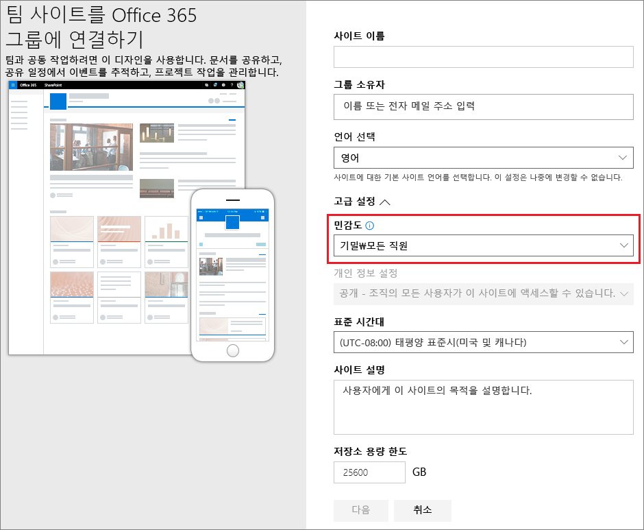
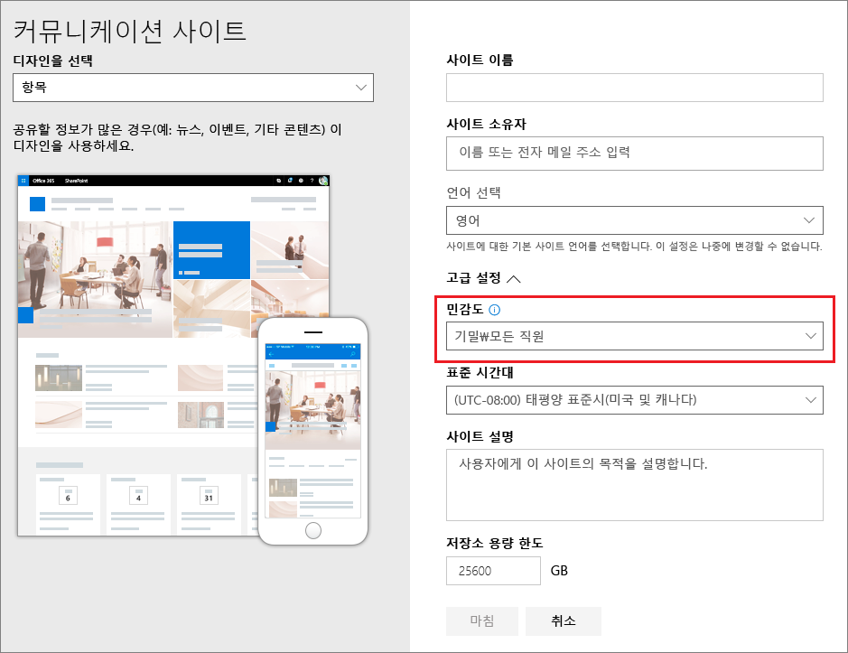

# <a name="use-sensitivity-labels-to-protect-content-in-microsoft-teams-microsoft-365-groups-and-sharepoint-sites"></a>민감도 레이블을 사용하여 Microsoft Teams, Microsoft 365 그룹 및 SharePoint 사이트에서 콘텐츠 보호하기

>*[보안 및 규정 준수를 위한 Microsoft 365 라이선싱 지침](/office365/servicedescriptions/microsoft-365-service-descriptions/microsoft-365-tenantlevel-services-licensing-guidance/microsoft-365-security-compliance-licensing-guidance).*

[민감도 레이블](sensitivity-labels.md)을 사용하여 문서와 전자 메일을 분류하고 보호하는 것 외에도 민감도 레이블을 사용하여 Microsoft Teams 사이트, Microsoft 365 그룹([이전 이름: Office 365 그룹](https://techcommunity.microsoft.com/t5/microsoft-365-blog/office-365-groups-will-become-microsoft-365-groups/ba-p/1303601)) 및 SharePoint 사이트와 같은 컨테이너의 콘텐츠를 보호할 수도 있습니다. 이 컨테이너 수준 분류 및 보호를 위해서는 다음 레이블 설정을 사용하세요.

- 팀 사이트 및 Microsoft 365 그룹의 개인 정보(공개 또는 비공개)
- 외부 사용자 액세스
- SharePoint 사이트에서의 외부 공유
- 관리되지 않는 장치에서 액세스
- 인증 컨텍스트(미리 보기)

> [!IMPORTANT]
> 관리되지 않는 장치 및 인증 컨텍스트에 대한 설정은 Azure Active Directory 조건부 액세스와 함께 작동합니다. 이러한 설정에 민감도 레이블을 사용하려면 이 종속 기능을 구성해야 합니다. 추가 정보는 다음 지침에 포함되어 있습니다.

지원되는 컨테이너에 이 민감도 레이블을 적용하는 경우, 레이블은 사이트 또는 그룹에 분류 및 구성된 보호 설정을 자동으로 적용합니다.

그러나 이러한 컨테이너의 콘텐츠는 시각적 표시 및 암호화와 같은 파일 및 전자 메일에 대한 분류 혹은 설정에 대한 레이블을 상속하지 않습니다. SharePoint 사이트 또는 팀 사이트에서 문서에 레이블을 지정할 수 있도록 [SharePoint 및 OneDrive에서 Office 파일에 대한 민감도 레이블을 사용하도록 설정](sensitivity-labels-sharepoint-onedrive-files.md)했는지 확인하세요.

> [!NOTE]
> 컨테이너에 대한 민감도 레이블은 Office 365 CDN(콘텐츠 배달 네트워크)에서 지원되지 않습니다.

## <a name="using-sensitivity-labels-for-microsoft-teams-microsoft-365-groups-and-sharepoint-sites"></a>Microsoft Teams, Microsoft 365 그룹 및 SharePoint 사이트에서 민감도 레이블 사용하기

컨테이너에서 민감도 레이블을 사용하도록 설정하고 새 설정에 대한 민감도 레이블을 구성하기 전에 사용자는 앱에서 민감도 레이블을 보고 적용할 수 있습니다. 예를 들어, Word에서 다음을 수행할 수 있습니다.


컨테이너에서 민감도 레이블을 활성화하고 구성한 후 사용자는 Microsoft Teams 사이트, Microsoft 365 그룹 및 SharePoint 사이트에 대한 민감도 레이블을 추가로 확인하고 적용할 수 있습니다.



## <a name="how-to-enable-sensitivity-labels-for-containers-and-synchronize-labels"></a>컨테이너에서 민감도 레이블을 사용하도록 설정하고 레이블을 동기화하는 방법

컨테이너에 대한 민감도 레이블을 아직 활성화하지 않은 경우 일회성 절차로 다음 단계를 수행하세요.

1. 이 기능은 Azure AD 기능을 사용하므로 Azure AD 설명서의 지침에 따라 민감도 레이블 지원을 사용하도록 설정하세요. [Azure Active Directory의 Microsoft 365 그룹에 민감도 레이블 지정하기](/azure/active-directory/users-groups-roles/groups-assign-sensitivity-labels).

2. 이제 민감도 레이블을 Azure AD로 동기화해야 합니다. 먼저 [보안 및 준수 센터 PowerShell에 연결](/powershell/exchange/office-365-scc/connect-to-scc-powershell/connect-to-scc-powershell)합니다.

   예를 들어 관리자로 실행하는 PowerShell 세션에서 전역 관리자 계정으로 로그인합니다.

3. 그런 다음, 다음 명령을 실행하여 민감도 레이블을 Microsoft 365 그룹에서 사용할 수 있도록 합니다.

    ```powershell
    Execute-AzureAdLabelSync
    ```

## <a name="how-to-configure-groups-and-site-settings"></a>그룹 및 사이트 설정을 구성하는 방법

이전 섹션에서 설명한대로 컨테이너에 대해 민감도 레이블을 활성화한 후 민감도 레이블 지정 마법사에서 그룹 및 사이트에 대한 보호 설정을 구성할 수 있습니다. 컨테이너에 대해 민감도 레이블이 활성화될 때까지 설정이 마법사에 표시되지만 구성할 수는 없습니다.

1. 일반 지침에 따라 [민감도 레이블을 만들거나 편집](create-sensitivity-labels.md#create-and-configure-sensitivity-labels)하고 레이블 범위에 대한 **그룹 및 사이트** 를 반드시 선택합니다. 
    
    
    
    해당 레이블에 이 범위만 선택된 경우, 레이블은 민감도 레이블을 지원하는 Office 앱에서 표시되지 않으며 파일 및 전자 메일에 적용할 수 없습니다. 레이블의 분리는 사용자와 관리자 모두에게 도움이 될 수 있지만 레이블 배포의 복잡성을 추가할 수도 있습니다.
    
    예를 들어 SharePoint는 레이블이 지정된 문서가 레이블이 지정된 사이트에 업로드될 때 탐지를 하므로 [레이블 순서](sensitivity-labels.md#label-priority-order-matters)를 신중하게 검토해야 합니다. 이 시나리오에서는 문서의 민감도 레이블의 우선 순위가 사이트의 레이블보다 높은 경우, 감사 이벤트 및 전자 메일이 자동으로 생성됩니다. 자세한 내용은 이 페이지에서 [민감도 레이블 작업 감사](#auditing-sensitivity-label-activities) 섹션을 참조하세요.  

2. 그런 다음 **그룹 및 사이트에 대 한 보호 설정 정의** 페이지에서 사용 가능한 옵션 중 하나 또는 모두를 선택합니다.
    
    - **개인 정보** 및 **외부 사용자 액세스** 설정을 구성하기 위한 **개인 정보 및 외부 사용자 액세스 설정** 입니다. 
    - **외부 공유 및 조건부 액세스 설정** 을 사용하여 **레이블이 지정된 SharePoint 사이트에서 외부 공유 제어** 및 **Azure AD 조건부 액세스를 사용하여 레이블이 지정된 SharePoint 사이트 보호** 설정을 구성합니다.

3. **개인 정보 및 외부 사용자 액세스설정** 을 선택한 경우, 이제 다음 설정을 구성합니다.
    
    - **개인 정보**: 조직의 모든 사용자가 이 레이블이 적용되는 팀 사이트 또는 그룹에 액세스하게 하려면 **공개** 기본값을 유지합니다.
        
        조직에서 승인된 구성원에게만 액세스를 제한하려면 **비공개** 를 선택합니다.
        
        민감도 레이블을 사용하여 컨테이너에서 콘텐츠를 보호하면서 사용자가 계속 개인 정보 설정을 직접 구성할 수 있도록 하려면 **없음** 을 선택합니다.
        
        **공개** 또는 **비공개** 설정은 컨테이너에 이 레이블을 적용할 때 개인 정보 설정을 설정하고 잠급니다. 선택한 설정은 팀 또는 그룹에 대해 구성할 수 있는 이전 개인 정보 설정을 대체하며, 개인 정보 값을 잠가 컨테이너에서 민감도 레이블을 먼저 제거해야만 변경할 수 있습니다. 민감도 레이블을 제거한 후에도 레이블의 개인 정보 설정이 유지되며 이제 사용자가 다시 변경할 수 있습니다.
    
    - **외부 사용자 액세스**: 그룹 소유자가 [그룹에 게스트를 추가](/office365/admin/create-groups/manage-guest-access-in-groups)할 수 있는지를 제어합니다.

4. **장치 외부 공유 및 장치 액세스 설정** 을 선택한 경우 이제 다음 설정을 구성합니다.
    
    - **레이블이 지정된 SharePoint 사이트에서 외부 공유 제어**: 이 옵션을 선택하고, 모든 사용자, 신규 및 기존 게스트, 기존 게스트, 조직 내부 사용자만 중 원하는 외부 공유 옵션을 선택합니다. 이 구성 및 설정에 대한 자세한 내용은 SharePoint 설명서, [사이트에 대해 외부 공유 설정 또는 해제](/sharepoint/change-external-sharing-site)를 참조 하세요.
    
    - **Azure AD 조건부 액세스를 사용하여 레이블이 지정된 SharePoint 사이트 보호**: 이 옵션은 조직에서 [Azure Active Directory 조건부 액세스](/azure/active-directory/conditional-access/overview)를 구성하고 사용하는 경우에만 선택합니다. 그런 다음, 다음 설정 중 하나를 선택합니다.
    
        - **사용자가 관리되지 않는 장치에서 SharePoint 사이트에 액세스할 수 있는지 여부 결정**: 이 옵션은 Azure AD 조건부 액세스를 사용하는 SharePoint 기능을 사용하여 관리되지 않는 장치에서 SharePoint 및 OneDrive 콘텐츠에 대한 액세스를 차단하거나 제한합니다. 자세한 내용은 [관리되지 않는 장치에서의 액세스 제어](/sharepoint/control-access-from-unmanaged-devices)를 참조하세요. SharePoint 지침의 [특정 SharePoint 사이트 또는 OneDrive에 대한 액세스 차단 혹은 제한](/sharepoint/control-access-from-unmanaged-devices#block-or-limit-access-to-a-specific-sharepoint-site-or-onedrive) 섹션 3-5단계에서 설명한 대로 이 레이블 설정에 지정하는 옵션은 사이트에 대해 PowerShell 명령을 실행하는 것과 동일합니다.
            
            추가 구성 정보는 이 섹션의 끝에 있는 [관리되지 않는 장치 옵션의 종속성에 대한 자세한 정보](#more-information-about-the-dependencies-for-the-unmanaged-devices-option)를 참조하세요.
            
        - **기존 인증 컨텍스트 선택**: 현재 미리 보기에서 이 옵션을 사용하면 사용자가 이 레이블이 적용된 SharePoint 사이트에 액세스할 때 더 엄격한 액세스 조건을 적용할 수 있습니다. 이러한 조건은 조직의 조건부 액세스 배포를 위해 생성 및 게시된 기존 인증 컨텍스트를 선택할 때 적용됩니다. 사용자가 구성된 조건을 충족하지 않거나 인증 컨텍스트를 지원하지 않는 앱을 ​​사용하는 경우 액세스가 거부됩니다.
            
            추가 구성 정보는 이 섹션의 끝에 있는 [인증 컨텍스트 옵션의 종속성에 대한 자세한 정보](#more-information-about-the-dependencies-for-the-authentication-context-option)를 참조하세요.
            
            이 레이블 구성의 예:
            
             - [다단계 인증(MFA)](/azure/active-directory/conditional-access/untrusted-networks)을 요구하도록 구성된 인증 컨텍스트를 선택합니다. 그런 다음 이 레이블은 기밀 항목이 포함된 SharePoint 사이트에 적용됩니다. 결과적으로 신뢰할 수 없는 네트워크의 사용자가 이 사이트의 문서에 액세스하려고 하면 문서에 액세스하기 전에 완료해야 한다는 MFA 프롬프트가 표시됩니다.
             
             - [사용 약관(ToU) 정책](/azure/active-directory/conditional-access/terms-of-use)에 대해 구성된 인증 컨텍스트를 선택합니다. 그런 다음 이 레이블은 법률 또는 규정 준수 이유로 사용 약관 동의가 필요한 항목이 포함된 SharePoint 사이트에 적용됩니다. 따라서 사용자가 이 사이트의 문서에 액세스하려고하면 원본 문서에 액세스하기 전에 동의해야 하는 사용 약관 문서가 표시됩니다.

> [!IMPORTANT]
> 팀, 그룹 또는 사이트에 레이블을 적용할 때 이러한 사이트 및 그룹 설정에만 적용됩니다. [레이블의 범위](sensitivity-labels.md#label-scopes)에 파일 및 전자 메일이 포함되는 경우, 팀, 그룹 또는 사이트 내의 콘텐츠에는 암호화 및 콘텐츠 표시와 같은 그 외 레이블 설정이 적용되지 않습니다.

민감도 레이블이 아직 게시되지 않은 경우 [민감도 레이블 정책에 추가](create-sensitivity-labels.md#publish-sensitivity-labels-by-creating-a-label-policy)하여 게시합니다. 이 레이블을 포함하는 민감도 레이블 정책이 할당된 사용자는 해당 레이블을 사이트 및 그룹에 대해 선택할 수 있습니다.

##### <a name="more-information-about-the-dependencies-for-the-unmanaged-devices-option"></a>관리되지 않는 장치 옵션의 종속성에 대한 자세한 정보

[앱 적용 제한](/sharepoint/app-enforced-restrictions)에 설명된 대로 SharePoint용 종속 조건부 액세스 정책을 구성하지 않는 경우 여기에 지정하는 옵션은 아무런 효과도 발휘하지 않습니다. 또한 테넌트 수준에서 구성한 설정보다 제한 수준이 낮은 경우 효과가 없습니다. 관리되지 않는 장치에 대해 조직 전체 설정을 구성한 경우, 동일하거나 더 제한적인 레이블 설정을 선택합니다.

예를 들어 테넌트가 **제한된 웹 전용 액세스 허용** 으로 구성된 경우 전체 액세스를 허용하는 레이블 설정은 제한 수준이 더 낮기 때문에 효과가 없습니다. 이 테넌트 수준 설정의 경우 액세스를 차단하는 레이블 설정(제한 수준이 더 높음) 또는 제한된 액세스에 대한 레이블 설정(테넌트 설정과 동일)을 선택합니다.

SharePoint 설정은 레이블 구성과 독립적으로 구성할 수 있기 때문에 민감도 레이블 마법사에서 종속성이 설정되어 있는지 확인하지 않습니다. 이러한 종속성은 레이블이 만들어지고 게시된 후와 레이블이 적용된 후에도 구성할 수 있습니다. 그러나 레이블이 이미 적용된 경우 사용자가 다음에 인증할 때까지 레이블 설정이 적용되지 않습니다.

##### <a name="more-information-about-the-dependencies-for-the-authentication-context-option"></a>인증 컨텍스트 옵션의 종속성에 대한 추가 정보

선택을 위해 드롭다운 목록에 표시하려면 인증 컨텍스트를 Azure Active Directory 조건 액세스 구성의 일부로 생성, 구성 및 게시해야 합니다. 자세한 내용 및 지침은 Azure AD 조건부 액세스 문서에서 [인증 컨텍스트 구성](/azure/active-directory/conditional-access/concept-conditional-access-cloud-apps#configure-authentication-contexts) 섹션을 참조하세요.

일부 앱은 인증 컨텍스트를 지원하지 않습니다. 지원되지 않는 앱을 지닌 사용자가 인증 컨텍스트에 대해 구성된 사이트에 연결하면 액세스 거부 메시지가 표시되거나 인증하라는 메시지가 표시되지만 거부됩니다.

- 웹용 Outlook이 포함된 웹용 Office

- Windows 및 macOS용 Microsoft Teams(Teams 웹앱 제외)

- Microsoft Planner

- Word, Excel 및 PowerPoint 용 Microsoft 365 앱 최소 버전:
    - Windows: 2103
    - macOS: 16.45.1202
    - iOS: 2.48.303
    - Android: 16.0.13924.10000

- Outlook용 Microsoft 365 앱; 최소 버전:
    - Windows: 2103
    - macOS: 16.45.1202
    - iOS: 4.2109.0
    - Android: 4.2025.1

- OneDrive 동기화 앱, 최소 버전:
    - Windows: 21.002
    - macOS: 21.002
    - iOS: 12.30에 배포 중
    - Android: 아직 지원되지 않음

이 미리 보기에 대해 알려진 제한 사항:

- OneDrive 동기화 앱의 경우 OneDrive에서만 지원되며 다른 사이트에서는 지원되지 않습니다.

- 다음 기능 및 앱은 인증 컨텍스트와 호환되지 않을 수 있으므로 사용자가 인증 컨텍스트를 사용하여 사이트에 성공적으로 액세스한 후에도 계속 작동하는지 확인하는 것이 좋습니다.
    
    - Power Apps 또는 Power Automate를 사용하는 워크플로
    - 타사 앱

## <a name="sensitivity-label-management"></a>민감도 레이블 관리

사이트 및 그룹에 대해 구성된 민감도 레이블을 만들거나, 수정하거나, 삭제하는 경우 다음 지침을 사용하세요.

### <a name="creating-and-publishing-labels-that-are-configured-for-sites-and-groups"></a>사이트 및 그룹에 대해 구성된 레이블 만들기 및 게시하기

새 민감도 레이블을 만들고 게시하면 팀, 그룹 및 사이트의 사용자가 한 시간 내에 볼 수 있습니다. 그러나 기존 레이블을 수정하는 경우 최대 24시간이 소요될 수 있습니다. 사이트 및 그룹 설정에 대해 레이블이 구성된 경우 다음 지침에 따라 사용자 레이블을 게시하세요.

1. 민감도 레이블을 만들고 구성한 후에는 소수의 테스트 사용자에게만 적용되는 레이블 정책에 이 레이블을 추가합니다.

2. 변경 내용이 복제될 때까지 기다립니다.

   - 새 레이블: 1시간 동안 기다립니다.
   - 기존 레이블: 24시간 동안 기다립니다.

3. 이 대기 시간이 지나면 테스트 사용자 계정 중 하나를 사용하여 1단계에서 만든 레이블이 있는 팀, Microsoft 365 그룹 또는 SharePoint 사이트를 만듭니다.

4. 만들기 작업 중에 오류가 없으면 테넌트의 모든 사용자에게 레이블을 게시해도 안전합니다.

### <a name="modifying-published-labels-that-are-configured-for-sites-and-groups"></a>사이트 및 그룹에 대해 구성된 게시된 레이블 수정하기

가장 좋은 방법은 여러 팀, 그룹 또는 사이트에 민감도 레이블을 적용한 후 레이블의 사이트와 그룹 설정을 변경하지 않는 것입니다. 그럴 경우 변경 내용이 레이블이 적용된 모든 컨테이너에 복제될 때까지 24시간 동안 기다려야 합니다.

또한 변경 내용에 **외부 사용자 액세스** 설정이 포함된 경우:

- 새로운 설정은 기존 사용자가 아닌 새로운 사용자에게만 적용됩니다. 예를 들어, 이전에 이 설정을 선택했고 그 결과 게스트 사용자가 사이트에 액세스한 경우 이 설정을 레이블 구성에서 지운 후에도 해당 게스트 사용자는 계속해서 사이트에 액세스할 수 있습니다.

- 그룹 속성 hiddenMembership 및 roleEnabled에 대한 개인 정보 설정은 업데이트되지 않습니다.

### <a name="deleting-published-labels-that-are-configured-for-sites-and-groups"></a>사이트 및 그룹에 대해 구성된 게시된 레이블 삭제하기

사이트 및 그룹 설정을 사용하도록 설정된 민감도 레이블을 삭제하고 해당 레이블이 하나 이상의 레이블 정책에 포함된 경우, 이 작업으로 새 팀, 그룹 및 사이트 만들기 오류가 발생할 수 있습니다. 이러한 상황을 피하려면 다음 지침을 따르세요.

1. 레이블이 포함된 모든 레이블 정책에서 민감도 레이블을 제거합니다.

2. 1시간 동안 기다립니다.

3. 이 대기 시간이 지나면 팀, 그룹 또는 사이트 만들기를 시도해보고 해당 레이블이 더 이상 표시되지 않는지 확인합니다.

4. 민감도 레이블이 표시되지 않는 경우에는 안전하게 레이블을 삭제할 수 있습니다.

## <a name="how-to-apply-sensitivity-labels-to-containers"></a>컨테이너에 민감도 레이블을 적용하는 방법

이제 민감도 레이블을 다음 컨테이너에 적용할 준비가 되었습니다.

- [Azure AD의 Microsoft 365 그룹](#apply-sensitivity-labels-to-microsoft-365-groups)
- [Microsoft Teams 팀 사이트](#apply-a-sensitivity-label-to-a-new-team)
- [웹용 Outlook의 Microsoft 365 그룹](#apply-a-sensitivity-label-to-a-new-group-in-outlook-on-the-web)
- [SharePoint 사이트](#apply-a-sensitivity-label-to-a-new-site)

[여러 사이트에 민감도 레이블을 적용](#use-powershell-to-apply-a-sensitivity-label-to-multiple-sites)해야 하는 경우 PowerShell을 사용할 수 있습니다.

### <a name="apply-sensitivity-labels-to-microsoft-365-groups"></a>Microsoft 365 그룹에 민감도 레이블 적용하기

이제 민감도 레이블을 Microsoft 365 그룹에 적용할 준비가 되었습니다. Azure AD 문서로 돌아가서 다음 지침을 참조하세요.

- [Azure 포털의 새 그룹에 레이블 지정](/azure/active-directory/users-groups-roles/groups-assign-sensitivity-labels#assign-a-label-to-a-new-group-in-azure-portal)

- [Azure 포털의 기존 그룹에 레이블 지정](/azure/active-directory/users-groups-roles/groups-assign-sensitivity-labels#assign-a-label-to-an-existing-group-in-azure-portal)

- [Azure 포털의 기존 그룹에서 레이블 제거](/azure/active-directory/users-groups-roles/groups-assign-sensitivity-labels#remove-a-label-from-an-existing-group-in-azure-portal).

### <a name="apply-a-sensitivity-label-to-a-new-team"></a>새 팀에 민감도 레이블을 적용

사용자는 Microsoft Teams에서 새 팀을 만들 때 민감도 레이블을 선택할 수 있습니다. **민감도** 드롭다운에서 레이블을 선택할 때 개인 정보 설정은 레이블 구성을 반영하여 변경될 수 있습니다. 사용자가 레이블에 대해 선택한 외부 사용자 액세스 설정에 따라 조직 외부의 사용자를 팀에 추가할 수 있는지의 여부가 결정됩니다.

[Teams용 민감도 레이블에 대해 자세히 알아보기](/microsoftteams/sensitivity-labels)


팀을 만든 후에는 모든 채널의 우측 상단 모서리에 민감도 레이블이 표시됩니다.


이 서비스는 Microsoft 365 그룹과 연결된 SharePoint 팀 사이트에 자동으로 동일한 민감도 레이블을 적용합니다.

### <a name="apply-a-sensitivity-label-to-a-new-group-in-outlook-on-the-web"></a>웹용 Outlook의 새 그룹에 민감도 레이블 적용

웹용 Outlook에서 새 그룹을 만들 때 게시된 레이블에 대한 **민감도** 옵션을 선택하거나 변경할 수 있습니다.


### <a name="apply-a-sensitivity-label-to-a-new-site"></a>새 사이트에 민감도 레이블을 적용

관리자 및 최종 사용자는 [최신 팀 사이트 및 커뮤니케이션 사이트를 만들고](/sharepoint/create-site-collection), **고급 설정** 을 확장하는 경우 민감도 레이블을 선택할 수 있습니다.



드롭다운 상자에는 선택에 대한 레이블 이름이 표시되고 도움말 아이콘에는 사용자가 적용할 올바른 레이블을 결정할 수 있도록 도구 설명과 함께 모든 레이블 이름이 표시됩니다.

레이블이 적용되고, 사용자가 사이트로 이동할 때 레이블의 이름과 적용된 정책을 볼 수 있습니다. 예를 들어 이 사이트에는 **기밀** 레이블이 지정되고 개인 정보 설정은 **비공개** 로 설정 됩니다.


### <a name="use-powershell-to-apply-a-sensitivity-label-to-multiple-sites"></a>PowerShell을 사용하여 여러 사이트에 민감도 레이블 적용하기

현재 [SharePoint Online 관리 Shell](/powershell/sharepoint/sharepoint-online/connect-sharepoint-online)의 *SensitivityLabel* 매개 변수와 함께 [Set-SPOSite](/powershell/module/sharepoint-online/set-sposite)와 [Set-SPOTenant](/powershell/module/sharepoint-online/set-spotenant) cmdlet을 사용하여 여러 사이트에 민감도 레이블을 적용할 수 있습니다. 사이트는 모든 SharePoint 사이트 모음이나 OneDrive 사이트일 수 있습니다.

SharePoint Online 관리 셸의 버전 16.0.19418.12000 이상을 보유하고 있는지 확인합니다.

1. **관리자 권한으로 실행** 옵션을 사용하여 PowerShell 세션을 엽니다.

2. 레이블 GUID를 모르는 경우: [보안 및 규정 준수 센터 PowerShell에 연결](/powershell/exchange/connect-to-scc-powershell)한 후 민감도 레이블과 해당 GUID 목록을 가져옵니다.

   ```powershell
   Get-Label |ft Name, Guid
   ```

3. 이제 [SharePoint Online PowerShell에 연결](/powershell/sharepoint/sharepoint-online/connect-sharepoint-online)하여 레이블 GUID를 변수로 저장합니다. 예제:

   ```powershell
   $Id = [GUID]("e48058ea-98e8-4940-8db0-ba1310fd955e")
   ```

4. URL에서 공통 식별 문자열을 포함하는 여러 사이트를 식별하는 새 변수를 만듭니다. 예를 들면 다음과 같습니다.

   ```powershell
   $sites = Get-SPOSite -IncludePersonalSite $true -Limit all -Filter "Url -like 'documents"
   ```

5. 다음 명령을 실행하여 이러한 사이트에 레이블을 적용합니다. 예제를 보겠습니다.

   ```powershell
   $sites | ForEach-Object {Set-SPOTenant $_.url -SensitivityLabel $Id}
   ```

이 일련의 명령을 사용하면 테넌트 전체에 동일한 민감도 레이블을 사용하여 여러 사이트에 레이블을 지정합니다. 따라서 사이트 구성당 설정된 Set-SPOSite cmdlet이 아니라 Set-SPOTenant cmdlet을 사용하는 것입니다. 그러나 각 사이트에 대해 다음 명령을 반복하여 특정 사이트에 다른 레이블을 적용해야 하는 경우 Set-SPOSite cmdlet을 사용합니다.`Set-SPOSite -Identity <URL> -SensitivityLabel "<labelguid>"`

## <a name="view-and-manage-sensitivity-labels-in-the-sharepoint-admin-center"></a>SharePoint 관리 센터에서 민감도 레이블을 보고 관리하기

적용된 민감도 레이블을 보고, 정렬하고, 검색하려면 새 SharePoint 관리 센터의 **활성 사이트** 페이지를 사용합니다. 먼저 **민감도** 열을 추가해야 할 수 있습니다.


열을 추가하는 방법을 포함하여 활성 사이트 페이지에서 사이트를 관리하는 방법에 대한 자세한 내용은 [새 SharePoint 관리 센터에서 사이트 관리하기](/sharepoint/manage-sites-in-new-admin-center)를 참조하세요.

이 페이지에서 레이블을 변경하고 적용할 수도 있습니다.

1. 사이트 이름을 선택하여 세부 정보 창을 엽니다.

2. **정책** 탭을 선택한 다음 **민감도** 설정에 대한 **편집** 을 선택합니다.

3. **민감도 설정 편집** 창에서 사이트에 적용할 민감도 레이블을 선택합니다. 특정 사용자에게 민감도 레이블을 할당할 수 있는 사용자 앱과 달리 관리 센터는 테넌트에 대한 모든 민감도 레이블을 표시합니다. 레이블을 선택한 후 **저장** 을 선택합니다.

## <a name="support-for-sensitivity-labels"></a>민감도 레이블 지원

민감도 레이블을 지원하는 관리 센터를 사용하는 경우 테넌트에 대한 모든 민감도 레이블이 표시됩니다. 반면 게시 정책에 따라 민감도 레이블을 필터링하는 사용자 앱 및 서비스는 해당 레이블의 하위 집합을 볼 수 있습니다.

다음 앱 및 서비스에서는 사이트 및 그룹 설정에 대해 구성된 민감도 레이블을 지원합니다.

- 관리 센터:

  - SharePoint 관리 센터
  - Azure Active Directory 포털
  - Microsoft 365 관리 센터
  - Microsoft 365 규정 준수 센터

- 사용자 앱 및 서비스:

  - SharePoint
  - Teams
  - 웹용, Windows, MacOS, iOS, Android용 Outlook
  - Forms
  - Stream
  - Planner 

다음 앱 및 서비스에서는 현재 사이트 및 그룹 설정에 대해 구성된 민감도 레이블을 지원하지 않습니다.

- 관리 센터:

  - Teams 관리 센터
  - Exchange 관리 센터

- 사용자 앱 및 서비스:

  - Dynamics 365
  - Yammer
  - Project
  - Power BI

## <a name="classic-azure-ad-group-classification"></a>클래식 Azure AD 그룹 분류

컨테이너에서 민감도 레이블을 사용하도록 설정하면 Microsoft 365는 더 이상 새 Microsoft 365 그룹 및 SharePoint 사이트에 대해 이전 분류를 지원하지 않습니다. 그러나 민감도 레이블을 사용하도록 변환할 때까지 민감도 레이블을 지원하는 기존 그룹 및 사이트는 여전히 이전 분류 값을 표시합니다.

SharePoint에 이전 그룹 분류를 사용하는 방법에 대한 예제는 [SharePoint "최신" 사이트 분류](/sharepoint/dev/solution-guidance/modern-experience-site-classification)를 참조하세요.

이와 같은 분류는 Azure AD PowerShell 또는 PnP 핵심 라이브러리를 사용하고 `ClassificationList` 설정의 값을 정의하여 구성되었습니다. 테넌트에 분류 값이 정의되어 있는 경우, [AzureADPreview PowerShell 모듈](https://www.powershellgallery.com/packages/AzureADPreview)에서 다음 명령을 실행하면 이 값이 표시됩니다.

```powershell
($setting["ClassificationList"])
```

이전 분류를 민감도 레이블로 변환하려면 다음 중 하나를 수행합니다.

- 기존 레이블 사용: 이미 게시된 기존 민감도 레이블을 편집하여 사이트 및 그룹에 대해 원하는 레이블 설정을 지정합니다.

- 새 레이블 만들기: 기존 분류와 이름이 같은 새 민감도 레이블을 만들고 게시하여 사이트 및 그룹에 대해 원하는 레이블 설정을 지정합니다.

그런 다음 다음을 수행합니다.

1. 이름 매핑과 함께 PowerShell을 사용하여 민감도 레이블을 기존 Microsoft 365 그룹 및 SharePoint 사이트에 적용합니다. 다음 섹션의 지침을 참조하세요.

2. 기존 그룹과 사이트에서 이전 분류를 제거합니다.

사용자가 아직 민감도 레이블을 지원하지 않는 앱과 서비스에서 새 그룹을 만들지 못하도록 할 수는 없지만, 반복적인 PowerShell 스크립트를 실행하여 사용자가 이전 분류로 만든 새 그룹을 찾고, 이러한 그룹을 민감도 레이블을 사용하도록 변환할 수 있습니다.

사이트 및 그룹에 대한 민감도 레이블과 Azure AD 분류의 공존을 관리하는 데 도움이 되도록 [Microsoft 365 그룹에 대한 Azure Active Directory 분류 및 민감도 레이블](migrate-aad-classification-sensitivity-labels.md)을 참조하세요.

### <a name="use-powershell-to-convert-classifications-for-microsoft-365-groups-to-sensitivity-labels"></a>PowerShell을 사용하여 Microsoft 365 그룹 분류를 민감도 레이블로 변환하기

1. 먼저 [보안 및 준수 센터 PowerShell에 연결](/powershell/exchange/office-365-scc/connect-to-scc-powershell/connect-to-scc-powershell)합니다.

   예를 들어 관리자로 실행하는 PowerShell 세션에서 전역 관리자 계정으로 로그인합니다.

2. [Get-Label](/powershell/module/exchange/get-label) cmdlet을 사용하여 민감도 레이블 및 GUID 목록을 가져옵니다.

   ```powershell
   Get-Label |ft Name, Guid
   ```

3. Microsoft 365 그룹에 적용할 민감도 레이블의 GUID를 기록해 둡니다.

4. 이제 별도의 Windows PowerShell 창에서 [Exchange Online PowerShell에 연결](/powershell/exchange/connect-to-exchange-online-powershell)합니다.

5. 다음 명령을 예로 사용하여 현재 "일반" 분류”를 포함하는 그룹 목록을 가져옵니다.

   ```PowerShell
   $Groups= Get-UnifiedGroup | Where {$_.classification -eq "General"}
   ```

6. 각 그룹에 새 민감도 레이블 GUID를 추가합니다. 예를 들면 다음과 같습니다.

    ```PowerShell
    foreach ($g in $groups)
    {Set-UnifiedGroup -Identity $g.Identity -SensitivityLabelId "457fa763-7c59-461c-b402-ad1ac6b703cc"}
    ```

7. 나머지 그룹 분류에 대해 5단계와 6단계를 반복합니다.

## <a name="auditing-sensitivity-label-activities"></a>민감도 레이블 활동 감사

> [!IMPORTANT]
> 컨테이너를 보호하는 레이블에 대해 단지 **그룹 및 사이트** 범위를 선택하여 레이블 분리를 사용하는 경우, **발견된 문서의 민감도 불일치** 감사 이벤트와 이 섹션에 설명된 전자 메일로 인해 레이블이 **파일 및 전자 메일** 에 대한 범위를 갖기 전에 [레이블의 순서 지정](sensitivity-labels.md#label-priority-order-matters)을 고려하세요. 

누군가가 민감도 레이블로 보호된 사이트에 문서를 업로드하고 해당 문서에 사이트에 적용된 민감도 레이블보다 [높은 우선 순위](sensitivity-labels.md#label-priority-order-matters)의 레이블이 있는 경우 이 작업이 차단되지 않습니다. 예를 들어 **일반** 레이블을 SharePoint 사이트에 적용하고 누군가가 이 사이트에 **기밀** 레이블이 지정된 문서를 업로드합니다. 우선 순위가 높은 민감도 레이블은 우선 순위가 낮은 컨텐츠보다 민감도가 높은 컨텐츠를 먼저 식별하므로 이 상황은 보안상의 문제가 될 수 있습니다.

작업이 차단되는 것은 아니지만 감사를 받고 기본적으로 문서를 업로드한 사람과 사이트 관리자에게 전자 메일을 자동으로 생성합니다. 따라서 사용자와 관리자가 모두 레이블 우선 순위에 대한 이러한 잘못된 문서를 확인하고 필요한 경우 조치를 취할 수 있습니다. 예를 들어 업로드된 문서를 사이트에서 삭제하거나 이동합니다.

사이트에 적용된 민감도 레이블보다 우선 순위가 낮은 레이블이 문서에 지정되어 있다면 보안 문제가 되지 않습니다. 예를 들어 **일반** 레이블이 지정된 문서가 **기밀** 레이블이 지정된 사이트에 업로드됩니다. 이 시나리오에서는 감사 이벤트와 전자 메일이 생성되지 않습니다.

> [!NOTE]
> 사용자가 레이블을 더 낮은 분류로 변경하기 위한 근거를 제공해야 하는 정책 옵션과 마찬가지로 동일한 상위 레이블에 대한 하위 레이블은 모두 동일한 우선순위를 갖는 것으로 간주합니다.

이 이벤트에 대한 감사 로그를 검색하려면 **파일 및 페이지 활동** 범주에서 **발견된 문서 감도 불일치** 를 찾습니다.

자동 생성된 전자 메일에는 **호환되지 않는 민감도 레이블이 탐지됨** 이라는 제목이 있고, 전자 메일 메시지에서는 업로드한 문서 및 사이트에 대한 링크와 레이블 불일치를 설명합니다. 또한 사용자가 민감도 레이블을 변경하는 방법을 설명하는 문서 링크가 포함되어 있습니다. 이러한 자동화된 전자 메일은 사용자 지정할 수 없지만 [Set-SPOTenant](/powershell/module/sharepoint-online/set-spotenant)의 PowerShell 명령을 사용하여 전자 메일이 전송되지 않도록 방지할 수 있습니다.

```PowerShell
Set-SPOTenant -BlockSendLabelMismatchEmail $True
```

누군가가 사이트 또는 그룹에 민감도 레이블을 추가하거나 제거하는 경우에도 이러한 활동도 감사되지만 전자 메일을 자동으로 생성하지는 않습니다.

이러한 모든 감사 이벤트는 [민감도 레이블 활동](search-the-audit-log-in-security-and-compliance.md#sensitivity-label-activities) 범주에서 찾을 수 있습니다. 감사 로그를 검색하기 위한 지침은 [보안 및 준수 센터에서 감사 로그 검색](search-the-audit-log-in-security-and-compliance.md)을 참조하세요.

## <a name="how-to-disable-sensitivity-labels-for-containers"></a>컨테이너에서 민감도 레이블을 사용하지 않도록 설정하는 방법

[PowerShell에서 민감도 레이블 지원 활성화하기](/azure/active-directory/users-groups-roles/groups-assign-sensitivity-labels#enable-sensitivity-label-support-in-powershell)와 동일한 지침을 사용하여 Microsoft Teams, Microsoft 365 그룹 및 SharePoint 사이트에 대한 민감도 레이블을 해제할 수 있습니다. 그러나 이 기능을 사용하지 않도록 설정하려면 5단계에서 `$setting["EnableMIPLabels"] = "False"`를 지정합니다.

민감도 레이블을 만들거나 편집할 때 그룹 및 사이트에 대한 모든 설정을 사용할 수 없도록 설정하는 작업 외에도 이 작업은 컨테이너에서 구성에 사용하는 속성을 되돌립니다. Microsoft Teams, Microsoft 365 그룹 및 SharePoint 사이트에서 민감도 레이블을 사용하도록 설정하면 **분류** 에서 사용되는 속성([Azure AD 그룹 분류](#classic-azure-ad-group-classification)에 사용됨)이 **민감도** 로 전환됩니다. 컨테이너에서 민감도 레이블을 사용하지 않도록 설정하면 컨테이너에서 민감도 속성을 무시하고 분류 속성을 다시 사용합니다.

즉, 이전에 컨테이너에 적용된 사이트 및 그룹의 레이블 설정이 적용되지 않고 컨테이너에서는 더 이상 레이블이 표시되지 않습니다.

이러한 컨테이너에 Azure AD 분류 값이 적용되면 컨테이너는 분류를 다시 사용하도록 되돌립니다. 이 기능을 사용하도록 설정한 후에 만든 새 사이트나 그룹은 레이블을 표시하지 않거나 분류를 갖지 않는다는 점에 유의하세요. 이러한 컨테이너와 새 컨테이너의 경우 이제 분류 값을 적용할 수 있습니다. 자세한 내용은 [SharePoint "최신" 사이트 분류](/sharepoint/dev/solution-guidance/modern-experience-site-classification) 및 [조직에서 Office 그룹의 분류 만들기](../enterprise/manage-microsoft-365-groups-with-powershell.md)를 참조하세요.

## <a name="additional-resources"></a>추가 리소스

[Microsoft Teams, O365 그룹, SharePoint Online 사이트에서 민감도 레이블 사용에](https://techcommunity.microsoft.com/t5/security-privacy-and-compliance/using-sensitivity-labels-with-microsoft-teams-o365-groups-and/ba-p/1221885#M1380) 대한 웨비나 기록 및 질응답을 참조하세요.

이 웨비나는 기능이 미리 보기에 있을 때 녹화되었기 때문에 UI에 약간의 차이가 있을 수 있습니다. 그러나 이 기능에 대한 정보는 이 페이지에 설명된 새 기능과 함께 여전히 정확합니다.

Teams 연결된 사이트 및 채널 사이트 관리에 대한 자세한 내용은 [Teams 연결된 사이트 및 채널 사이트 관리](/SharePoint/teams-connected-sites)를 참조하세요.
