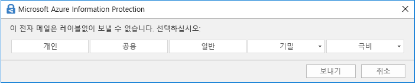

# 민감도 레이블 알아보기

>*[보안 및 규정 준수를 위한 Microsoft 365 라이선싱 지침](https://aka.ms/ComplianceSD).*

작업을 완료하기 위해 조직의 사용자는 조직 내부 및 외부의 다른 사용자와 공동으로 작업합니다. 이는 콘텐츠가 더 이상 방화벽 뒤에 있지 않으며 장치, 앱 및 서비스를 비롯한 모든 위치에서 로밍할 수 있음을 의미합니다. 또한 사용자는 로밍 중에는 조직의 비즈니스 및 준수 정책을 충족하는 안전하고 보호된 방식으로 진행하는 것이 좋습니다.

Microsoft Information Protection 프레임 워크의 민감도 레이블을 사용하면 조직의 데이터를 분류하고 보호하는 동시에 사용자 생산성과 공동 작업 능력에 방해가 되지 않습니다.

리본 메뉴의 **홈** 탭에서 Excel의 사용 가능한 민감도 레이블을 보여 주는 예제입니다. 이 예제에서 적용된 레이블은 상태 표시줄에 표시 됩니다.

민감도 레이블은 전역(공용) 클라우드의 테넌트에 한해서만 지원됩니다. 현재, [국가별 클라우드](https://docs.microsoft.com/azure/active-directory/develop/authentication-national-cloud)와 같은 그 외의 클라우드의 테넌트에 대해서는 민감도 레이블이 지원되지 않습니다.

> [!NOTE]
> 현재까지는 민감도 레이블을 GCC(미국 정부 커뮤니티) 조직에서 사용할 수 없습니다. 

민감도 레이블을 적용하려면 사용자가 회사 또는 학교 계정으로 Office에 로그인해야 합니다.

민감도 레이블을 사용하여 다음을 수행할 수 있습니다.
  
- **레이블이 지정된 콘텐츠에 암호화 또는 워터마크와 같은 보호 설정 적용.** 예를 들어 사용자가 문서 또는 전자 메일에 기밀 레이블을 적용하면 해당 레이블이 콘텐츠를 암호화하고 기밀 워터마크를 적용할 수 있습니다.

- **다양한 플랫폼 및 장치에서 Office 앱의 콘텐츠를 보호합니다.** 지원되는 앱 목록은 [Office 앱의 민감도 레이블 사용](sensitivity-labels-office-apps.md)을 참조하세요.

- Microsoft Cloud App Security를 사용하여 **타사 앱 및 서비스의 콘텐츠 보호**. Cloud App Security를 사용하여 SalesForce, Box 또는 DropBox 등의 타사 앱 및 서비스에 있는 콘텐츠를 감지, 분류, 레이블 지정 및 보호할 수 있습니다. 타사 앱 또는 서비스가 민감도 레이블을 읽지 않고 지원하지 않더라도 문제가 되지 않습니다.

- **타사 앱 및 서비스에 민감도 레이블을 연장.** Microsoft 정보 보호 SDK를 사용하는 경우, 타사 앱에서 민감도 레이블을 읽고 보호 설정을 적용할 수 있습니다.

- **보호 설정을 사용하지 않고 콘텐츠를 분류합니다.** 사용 및 공유하는 콘텐츠와 지속 및 로밍하는 콘텐츠에 분류를 할당(예: 스티커)할 수도 있습니다. 이 분류를 사용하여 사용 현황 보고서를 생성하고 민감한 콘텐츠의 활동 데이터를 볼 수 있습니다. 이 정보를 기반으로 나중에 항상 보호 설정을 적용하도록 선택할 수 있습니다.

이러한 모든 경우에서 Microsoft 365의 민감도 레이블은 올바른 콘텐츠에 대해 올바른 작업을 수행하는 데 도움이 될 수 있습니다. 민감도 레이블을 사용하여 사용자는 조직에서 데이터를 분류하고 해당 분류에 따라 보호 기능 설정을 적용할 수 있습니다.

## 민감도 레이블이란?

문서 또는 전자 메일에 민감도 레이블을 지정하는 경우 다음과 같은 콘텐츠에 적용되는 스탬프와 같습니다.

- **사용자 지정 가능.** 조직에서다양한 수준의 중요한 콘텐츠에 대해 개인, 공개, 일반, 기밀 및 극비와 같은 범주를 만들 수 있습니다.

- **명확한 텍스트.** 레이블은 콘텐츠의 메타 데이터에 명확한 텍스트로 저장되므로 타사 앱 및 서비스는 이를 읽고 필요한 경우 고유의 보호 조치를 적용할 수 있습니다.

- **지속적.** 민감도 레이블을 컨텐츠에 적용한 후 레이블은 해당 전자 메일이나 문서의 메타 데이터에 저장됩니다. 즉, 레이블은 보호 설정을 포함하여 콘텐트와 로밍하고 이 데이터는 정책을 적용하고 시행하는 데 기반이 됩니다.

Office 앱의 경우, 민감도 레이블이 전자 메일 또는 문서에서 사용자에게 태그와 같이 표시됩니다.

각 콘텐츠 항목에 단일 민감도 레이블을 적용할 수 있습니다. 하나의 항목에 단일 민감도 레이블과 단일 [보존 레이블](labels.md)을 모두 적용할 수 있습니다.

> [!div class="mx-imgBorder"]
> 

## 민감도 레이블이 수행하는 작업

> [!NOTE]
> 현재 미리 보기에서 전자 메일 및 문서에 민감도 레이블을 적용할 뿐만 아니라 [Microsoft Teams, Microsoft 365 그룹 및 SharePoint 사이트에서 민감도 레이블을 사용](sensitivity-labels-teams-groups-sites.md)할 수도 있습니다.

민감도 레이블이 전자 메일이나 문서에 적용되면 해당 레이블의 구성된 보호 설정이 콘텐츠에 적용됩니다. 민감도 레이블을 사용하여 다음을 수행할 수 있습니다.

- 전자 메일만 또는 전자 메일 및 문서 모두 **암호화** 어떤 사용자 또는 그룹이 어떤 작업을 얼마나 오래 수행할 수 있는지를 선택할 수 있습니다. 예를 들어 다른 조직의 특정 그룹에 있는 사용자가 콘텐츠에 레이블이 지정된 후 7일 동안 콘텐츠를 검토할 수 있는 권한을 갖도록 선택할 수 있습니다. 또는 관리자가 정의한 권한 대신 사용자가 레이블을 적용할 때 콘텐츠에 사용 권한을 할당할 수 있습니다. 
    
    민감도 레이블을 만들거나 편집할 때 **암호화** 설정에 대한 자세한 내용은 [민감도 레이블에서 암호화를 사용하여 콘텐츠 액세스 제한](encryption-sensitivity-labels.md)을 참조하십시오.

- 레이블이 적용된 전자 메일 또는 문서에 워터마크, 머리글 또는 바닥글을 추가하여 Office 사용 시 **콘텐츠를 표시**합니다. 워터마크는 전자 메일이 아닌 문서에만 적용될 수 있습니다. 머리글 및 워터 마크 예제:
    
    
    
    콘텐츠 표시가 적용되는 경우를 확인해야 하나요? [Microsoft 365에서 콘텐츠 표시 및 암호화를 적용하는 경우](sensitivity-labels-office-apps.md#when-office-365-applies-content-marking-and-encryption)를 참조하세요.
    
    문자열 길이: 워터 마크는 255자로 제한됩니다. Excel의 경우를 제외하고 머리글과 바닥글은 1024자로 제한됩니다. Excel에서는 머리글과 바닥글의 총 글자 수가 255자로 제한되지만 이 제한에는 서식 코드처럼 보이지 않는 문자가 포함됩니다. 해당 한도에 도달하면 입력한 문자열이 Excel에 표시되지 않습니다.

- [Microsoft Teams, Microsoft 365 그룹 및 SharePoint 사이트(공개 미리 보기)에서 민감도 레이블을 사용](sensitivity-labels-teams-groups-sites.md)하도록 미리 보기를 선택하여 **사이트 및 그룹과 같은 컨테이너의 컨텐츠를 보호**합니다.
    
    미리 보기를 선택하지 않으면 **사이트 및 그룹 설정**에 대한 구성 옵션이 표시되지 않습니다. 이 레이블 구성으로 인해 문서가 자동으로 레이블링되지는 않지만 대신 레이블 설정은 문서가 저장된 컨테이너에 대한 액세스를 제어하여 컨텐츠를 보호합니다. 이러한 설정에는 개인 정보 수준, Microsoft 365 그룹 소유자가 게스트를 그룹에 추가할 수 있는지 여부 및 관리되지 않는 장치에 부여된 액세스 수준이 포함됩니다.

- **Office 앱에서 자동으로 레이블을 적용하거나 레이블을 권장합니다.** 레이블을 지정할 민감한 정보 유형을 선택하고 레이블을 자동으로 적용하거나 사용자에게 권장 레이블을 적용하라는 메시지를 표시할 수 있습니다. 레이블을 권장하면 선택한 텍스트가 프롬프트에 표시됩니다. 예를 들어 다음과 같은 가치를 제공해야 합니다.
    
    
    
    민감도 레이블을 만들거나 편집할 때 **Office 앱에 대한 자동 레이블 지정** 설정에 대한 자세한 내용은 [민감도 레이블을 콘텐츠에 자동으로 적용](apply-sensitivity-label-automatically.md)을 참조하십시오.

### 레이블 우선 순위(순서가 중요함)

관리자 센터에서 민감도 레이블을 만드는 경우 **레이블** 페이지의 **민감도** 탭에 있는 목록에 레이블이 나타납니다. 이 목록에서는 레이블의 우선 순위가 반영되기 때문에 레이블의 순서가 중요합니다. 극비와 같은 가장 제한적인 민감도 레이블은 목록의 **아래쪽**에 표시되도록 하고, 공용과 같은 가장 덜 제한적인 민감도 레이블은 **위쪽**에 표시되도록 합니다.

문서 또는 전자 메일에 하나의 민감도 레이블만 적용할 수도 있습니다. 사용자가 레이블을 더 낮은 분류로 변경하는 사유를 제공하는 옵션을 설정하는 경우 이 목록의 순서는 하위 분류를 식별합니다. 단, 이 옵션은 하위 레이블에 적용되지 않습니다.

그러나 하위 레이블의 순서는 [자동 레이블 지정](apply-sensitivity-label-automatically.md)과 함께 사용됩니다. 레이블을 자동 또는 권장 사항으로 적용되도록 구성하면 둘 이상의 레이블에 대해 여러 개의 일치 항목이 발생할 수 있습니다. 적용하거나 권장할 레이블을 결정하기 위해 레이블 순서가 사용됩니다. 마지막 민감도 레이블이 선택되고 해당하는 경우 마지막 하위 레이블이 선택됩니다.

### 하위 레이블(레이블 그룹화)

하위 레이블을 사용하여 Office 앱에 표시되는 하나 이상의 레이블을 상위 레이블 아래에 그룹화할 수 있습니다. 예를 들어, 조직은 기밀 아래에 여러 다른 레이블을 사용하여 특정 유형의 분류를 구현할 수 있습니다. 이 예제에서 상위 레이블 ‘기밀’은 보호 설정이 지정되지 않은 단순한 텍스트 레이블이며, 하위 레이블이 있으므로 콘텐츠에 적용할 수 없습니다. 대신, 하위 레이블을 보려면 기밀을 선택해야 하며, 그 이후에 콘텐츠에 적용할 하위 레이블을 선택할 수 있습니다.

하위 레이블은 레이블을 논리 그룹으로 나타내는 간단한 방법입니다. 하위 레이블은 상위 레이블에서 설정을 상속하지 않습니다. 사용자의 하위 레이블을 게시하는 경우, 해당 사용자는 해당 하위 레이블을 콘텐츠에 적용할 수 있지만 상위 레이블만을 적용할 수는 없습니다.

부모 레이블을 기본 레이블로 선택하거나 부모 레이블을 자동으로 적용(하거나 권장)하도록 구성하지 마세요. 이렇게 하면 상위 레이블이 콘텐츠에 적용되지 않습니다.

사용자에게 하위 레이블이 표시되는 방법의 예:

### 민감도 레이블 편집 또는 삭제

관리 센터에서 민감도 레이블을 삭제할 경우 콘텐츠에서 레이블이 자동으로 제거되지 않으며, 보호 설정이 콘텐츠에 계속 적용됩니다.

민감도 레이블을 편집하는 경우 콘텐츠에 적용된 레이블 버전이 해당 콘텐츠에 강제 적용됩니다.

## 레이블 정책이 수행할 수 있는 작업

민감도 레이블을 만든 후에는 조직의 구성원과 서비스에서 사용할 수 있도록 레이블을 게시해야 합니다. 그런 다음 문서 및 전자 메일에 민감도 레이블을 적용할 수 있습니다. 레이블과 달리 모든 Exchange 사서함과 같은 위치에 게시되는 보존 민감도 레이블은 사용자나 그룹에 게시됩니다. 해당 사용자 및 그룹에 대 해 Office 앱에 민감도 레이블이 표시됩니다.

레이블 정책을 사용하여 다음 작업을 수행할 수 있습니다.

- **레이블이 표시되는 사용자 및 그룹을 선택합니다.** Azure AD에서 레이블은 특정 사용자 또는 전자 메일 사용이 가능한 보안 그룹, 메일 그룹 또는 Microsoft 365 그룹([동적 구성원](https://docs.microsoft.com/azure/active-directory/users-groups-roles/groups-create-rule)이 될 수 있음)에 게시할 수 있습니다.

- 레이블 정책에 포함된 사용자 및 그룹이 새로 만든 모든 문서 및 전자 메일에 **기본 레이블을 적용**합니다. 이 옵션은 [사용자가 Microsoft Teams, Microsoft 365 그룹 및 SharePoint 사이트에 대해 민감도 레이블을 사용한 경우](sensitivity-labels-teams-groups-sites.md)에도 컨테이너에 적용됩니다. 레이블이 문서 또는 전자 메일에 대한 올바른 레이블이 아닌 경우에는 사용자가 언제든지 기본 레이블을 변경할 수 있습니다. 
    
    모든 콘텐츠에 적용할 기본 수준의 보호 설정을 설정하려면 기본 레이블 사용을 고려하십시오. 그러나 사용자 교육 및 기타 컨트롤이 없는 경우 이 설정으로 인해 레이블이 정확하지 않을 수 있습니다. 일반적으로 문서에 대한 기본 레이블로 암호화를 적용하는 레이블을 선택하지 않는 것이 좋습니다. 예를 들어, 많은 조직에서 [암호화를 지원하는 앱](https://docs.microsoft.com/azure/information-protection/requirements-applications#rms-enlightened-applications)이 없는 외부 사용자와 문서를 보내고 공유해야 하거나, [권한을 부여할 수 있는 계정](https://docs.microsoft.com/azure/information-protection/secure-collaboration-documents#supported-scenarios-for-opening-protected-documents)을 사용하지 않을 수 있습니다.

- **레이블을 변경하는 데 사유 요구** 사용자가 레이블을 제거하거나 주문 번호가 낮은 레이블로 바꾸려고 하면이 작업을 수행할 사유를 제공하도록 요구할 수 있습니다. 예를 들어, 사용자는 Confidential(주문 번호 3)이라는 문서를 열고 해당 레이블을 Public (주문 번호 1)이라는 이름으로 대체합니다. 현재 사유는 관리자가 검토할 수 있도록 [레이블 분석](label-analytics.md)에 전달되지 않습니다. 그러나 [Azure Information Protection 통합 레이블 클라이언트](https://docs.microsoft.com/azure/information-protection/rms-client/aip-clientv2)는이 정보를 [Azure Information Protection analytics](https://docs.microsoft.com/azure/information-protection/reports-aip)에 보냅니다.

    

- **사용자가 전자 메일 및 문서에 레이블을 적용하도록 요구.** 필수 레이블이라고도 하며 사용자가 문서를 저장하고 전자 메일을 보내려면 레이블을 적용해야 할 수 있습니다. 사용자가 구성한 조건의 결과로 레이블을 자동 할당하거나 기본적으로 할당할 수 있습니다(위의 기본 레이블 옵션). 사용자가 레이블을 할당해야 할 때 Outlook에 표시되는 프롬프트의 예:

    
    
    > [!NOTE]
    > 현재 필수 레이블에는 [Azure Information Protection 통합 레이블 클라이언트](https://docs.microsoft.com/azure/information-protection/rms-client/install-unifiedlabelingclient-app)가 있어야 합니다. 이 클라이언트는 Windows에서만 실행되므로 Mac, iOS, Android에서는 이 기능이 아직 지원되지 않습니다.
    
    레이블 적용 범위를 늘리려면 이 옵션을 사용하는 것을 고려해보세요. 그러나 사용자 교육이 없으면 이 설정을 사용하면 부정확한 레이블 지정이 발생할 수 있습니다. 또한 기본 레이블을 설정하지 않은 경우에는 필수 레이블 사용으로 사용자에게 자주 묻게 되어 짜증나게 할 수 있습니다. 

- **사용자 지정 도움말 페이지에 도움말 링크 제공** 사용자가 민감도 레이블의 의미나 사용 방식을 잘 모를 경우 Office 앱의 **민감도 레이블** 메뉴 하단에 자세히 알아보기 URL을 제공할 수 있습니다.

    

사용자 및 그룹에 민감도 레이블을 할당하는 레이블 정책을 만든 후에는 해당 사용자에게 Office 앱에 레이블을 확인하도록 최대 24시간을 허용할 수 있습니다.

만들고 게시할 수 있는 민감도 레이블의 수에는 제한이 없지만 한 가지 예외적인 경우가 있습니다. 레이블에 암호화가 적용되는 경우의 최대 레이블의 수는 500개입니다. 하지만 최상의 방식은 관리자 오버헤드를 낮추고 사용자의 복잡성을 줄이기 위해 레이블의 수를 최소로 유지하는 것입니다. 사용자에게 6개 이상의 주 레이블 또는 주 레이블당 6개 이상의 하위 레이블이 있는 경우 효과가 확연하게 감소하는 것이 실제 배포 결과를 통해 입증되었습니다.

### 레이블 정책 우선 순위(순서 중요)

**레이블 정책** 페이지의 **민감도 정책** 탭에 있는 목록에 나타나는 민감도 레이블 정책에 민감도 레이블을 게시하여 사용자가 이를 사용할 수 있도록 합니다. 민감도 레이블([레이블 우선 순위(순서 중요)](#label-priority-order-matters) 참조)과 마찬가지로, 민감도 레이블의 순서가 우선 순위를 반영하므로 이 순서가 중요합니다. 우선 순위가 가장 낮은 레이블 정책이 **맨 위**에 표시되고 우선 순위가 가장 높은 레이블 정책이 **맨 아래**에 표시됩니다.

레이블 정책은 다음으로 구성됩니다.

- 레이블 집합.
- 정책에 포함된 사용자 및 그룹을 나타내는 레이블 정책의 범위입니다.
- 위에서 설명한 레이블 정책의 설정(기본 레이블, 맞춤, 필수 레이블 및 도움말 링크)입니다.

여러 레이블 정책에 한 사용자를 포함시키면 해당 사용자에게 해당 정책의 모든 민감도 레이블이 표시됩니다. 그러나 사용자에게는 우선 순위가 가장 높은 레이블 정책의 정책 설정만 표시됩니다.

사용자 또는 그룹에 대해 예상되는 레이블 또는 레이블 정책 설정이 표시되지 않고 24시간 동안 기다렸다면 민감도 레이블 정책의 순서를 확인하십시오. 레이블 정책의 순서를 다시 지정하려면, 민감도 레이블 정책 선택 > 오른쪽에서 줄임표 선택 > **아래로 이동** 또는 **위로 이동**합니다.

민감도 레이블 외에 보존 레이블을 사용하는 경우 우선 순위는 민감도 레이블 정책에 중요하지만 [유지 레이블 정책](labels.md#the-principles-of-retention-or-what-takes-precedence)에는 중요하지 않음을 기억해야합니다.

## 민감도 레이블 및 Azure Information Protection

Azure Information Protection으로 레이블을 배포한 경우 민감도 레이블 사용을 시작하기 전에 다음 섹션을 참조하십시오.

### Azure Information Protection 레이블

> [!NOTE]
> Azure 포털의 Azure Information Protection 레이블에 대한 레이블 관리는 **2021년 3월 31일**부로 더 이상 사용되지 않습니다. 공식 [사용 중단 통지](https://techcommunity.microsoft.com/t5/azure-information-protection/announcing-timelines-for-sunsetting-label-management-in-the/ba-p/1226179)에서 자세히 알아봅니다.

테넌트가 아직 [통합 레이블 지정 플랫폼](https://docs.microsoft.com/azure/information-protection/faqs#how-can-i-determine-if-my-tenant-is-on-the-unified-labeling-platform)에 있지 않기 때문에 Azure Information Protection 레이블을 사용하는 경우, 통합 레이블 지정을 활성화할 때까지 민감도 레이블을 만들지 않을 것을 권장합니다. 이 시나리오에서 Azure Portal에 표시되는 레이블은 민감도 레이블이 아니라 Azure Information Protection 레이블입니다. 이 레이블은 Windows 컴퓨터의 Azure Information Protection 클라이언트(클래식)에서 사용할 수 있지만 macOS, iOS 또는 Android를 실행하는 장치에서는 사용할 수 없습니다. 이 문제를 해결하려면 민감도 레이블에 [이 레이블을 마이그레이션](/azure/information-protection/configure-policy-migrate-labels)합니다. 

두 레이블 집합에 의해 적용된 메타 데이터는 호환되므로 마이그레이션이 완료될 때 문서와 전자 메일의 레이블을 다시 지정할 필요가 없습니다.

### Azure Information Protection 클라이언트

Windows 컴퓨터에서 엔터프라이즈용 Microsoft 365 앱에 민감도 레이블을 사용하는 경우 Azure Information Protection 클라이언트를 사용하거나 Office에 기본 제공되는 레이블을 사용하도록 선택할 수 있습니다.

기본적으로 Azure Information Protection 클라이언트가 설치되면 이러한 앱에서 기본 제공 레이블이 해제되어 있습니다. 기본 동작을 변경하는 방법을 포함하여 자세한 내용은 [Office 기본 제공 레이블 지정 클라이언트 및 Azure Information Protection 클라이언트](sensitivity-labels-office-apps.md#office-built-in-labeling-client-and-the-azure-information-protection-client)를 참조하십시오.

Office 앱에서 기본 제공 레이블을 사용하는 경우에도 다음 사항에 대해 민감도 레이블이 있는 Azure Information Protection 통합 레이블 클라이언트를 사용할 수 있습니다.

- 온-프레미스에 저장된 중요한 정보를 검색한 다음 해당 콘텐츠에 선택적으로 레이블을 지정하는 스캐너

- 사용자가 모든 파일 유형에 레이블을 적용할 수 있도록 파일 탐색기에서 마우스 오른쪽 버튼 클릭 옵션

- 텍스트, 이미지 또는 PDF 문서에 대해 암호화된 파일을 표시하는 뷰어

- 온-프레미스 파일에서 중요한 정보를 검색하고 이러한 파일에서 레이블 및 암호화를 적용 또는 제거하는 PowerShell 모듈

Azure Information Protection을 처음 사용하는 경우 또는 레이블을 마이그레이션한 기존 Azure Information Protection 고객인 경우 Azure Information Protection 설명서에서 [Windows 컴퓨터에 대한 사용할 레이블 지정 클라이언트 선택](https://docs.microsoft.com/azure/information-protection/rms-client/use-client#choose-which-labeling-client-to-use-for-windows-computers)을 참조십시오.

## 민감도 레이블과 Microsoft Cloud App Security

CAS(Cloud App Security)를 사용하여 SalesForce, Box 또는 Dropbox 등의 타사 서비스 및 앱에 있는 콘텐츠를 탐색, 분류, 레이블 지정 및 보호할 수 있습니다. 

Cloud App Security는 Azure Information Protection 레이블과 민감도 레이블 모두에서 작동합니다.

- 레이블 지정 관리 센터에서 한 명 이상의 사용자에게 하나 이상의 민감도 레이블을 [게시](create-sensitivity-labels.md#publish-sensitivity-labels-by-creating-a-label-policy)한 경우: 민감도 레이블이 사용됩니다.

- 레이블 관리 센터에서 민감도 레이블을 게시하지 않은 경우: Azure Information Protection 레이블이 사용됩니다.

이러한 레이블을 통해 Cloud App Security를 사용하는 방법에 대한 자세한 내용은 [Azure Information Protection 통합](https://docs.microsoft.com/cloud-app-security/azip-integration)을 참조하세요.

## 민감도 레이블 및 Microsoft 정보 보호 SDK

민감도 레이블은 문서의 메타데이터에 일반 텍스트로 저장되므로 타사 앱 및 서비스는 레이블 배치를 보완하기 위해 이 레이블 지정 메타데이터를 읽고 쓸 수 있습니다. 또한 소프트웨어 개발자는 [Microsoft Information Protection SDK](https://docs.microsoft.com/information-protection/develop/overview#microsoft-information-protection-sdk)를 사용하여 여러 플랫폼에서 레이블 및 암호화 기능을 완벽하게 지원할 수 있습니다. 자세한 내용은 [기술 커뮤니티 블로그의 일반 가용성 공지사항](https://techcommunity.microsoft.com/t5/Microsoft-Information-Protection/Microsoft-Information-Protection-SDK-Now-Generally-Available/ba-p/263144)을 참조하세요. 

[Microsoft 정보 보호와 통합된 파트너 솔루션](https://techcommunity.microsoft.com/t5/Azure-Information-Protection/Microsoft-Information-Protection-showcases-integrated-partner/ba-p/262657)에 대해 알아볼 수도 있습니다.

## 배포 가이드

[민감도 레이블 시작](get-started-with-sensitivity-labels.md)을 참조하세요.

