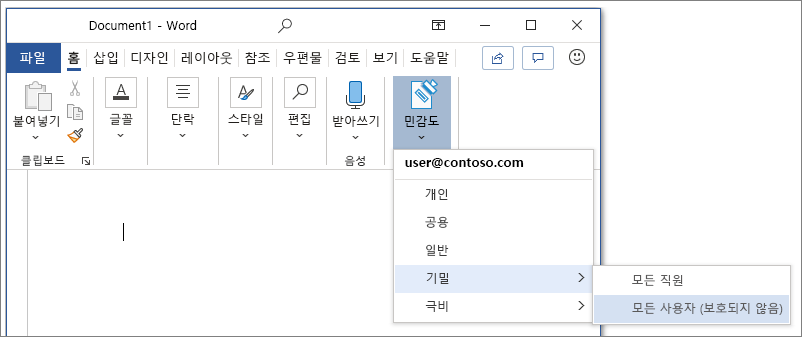
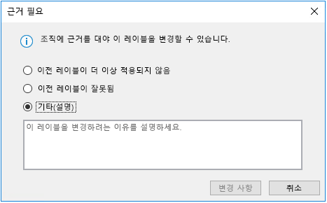
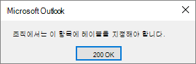

# 민감도 레이블 알아보기

>*[보안 및 규정 준수를 위한 Microsoft 365 라이선싱 지침](/office365/servicedescriptions/microsoft-365-service-descriptions/microsoft-365-tenantlevel-services-licensing-guidance/microsoft-365-security-compliance-licensing-guidance).*

> [!NOTE]
> Office 앱에서 볼 수 있는 민감도 레이블에 대한 자세한 내용은 [Office에서 파일 및 전자 메일에 민감도 레이블 적용](https://support.microsoft.com/topic/apply-sensitivity-labels-to-your-files-and-email-in-office-2f96e7cd-d5a4-403b-8bd7-4cc636bae0f9)을 참조하세요.
>
> 이 페이지의 정보는 해당 레이블을 생성하고 구성할 수 있는 IT 관리자를 위한 것입니다.

작업을 완료하기 위해 조직의 사용자는 조직 내부 및 외부의 다른 사용자와 공동으로 작업합니다. 이는 콘텐츠가 더 이상 방화벽 뒤에 있지 않으며 장치, 앱 및 서비스를 비롯한 모든 위치에서 로밍할 수 있음을 의미합니다. 또한 사용자는 로밍 중에는 조직의 비즈니스 및 준수 정책을 충족하는 안전하고 보호된 방식으로 진행하는 것이 좋습니다.

Microsoft Information Protection 솔루션의 민감도 레이블을 사용하면 조직의 데이터를 분류하고 보호하는 동시에 사용자 생산성과 공동 작업 능력에 방해가 되지 않습니다.

리본 메뉴의 **홈** 탭에서 Excel의 사용 가능한 민감도 레이블을 보여 주는 예제입니다. 이 예제에서 적용된 레이블은 상태 표시줄에 표시 됩니다.

민감도 레이블을 적용하려면 Microsoft 365 회사 또는 학교 계정으로 로그인해야 합니다.

> [!NOTE]
> 미국 정부 테넌트의 경우, 민감도 레이블은 이제 모든 플랫폼에 대해 지원됩니다.
>
> Azure Information Protection 통합 레이블 지정 클라이언트 및 스캐너를 사용하는 경우, [Azure Information Protection Premium 정부 서비스 설명](/enterprise-mobility-security/solutions/ems-aip-premium-govt-service-description)을 참조하세요.

민감도 레이블을 사용하여 다음을 수행할 수 있습니다.
  
- **암호화 및 콘텐츠 표시를 포함한 보호 설정을 제공합니다.** 예를 들어 문서 또는 전자 메일에 "기밀" 레이블을 적용하면 해당 레이블에 콘텐츠가 암호화되고 "기밀" 워터마크가 적용됩니다. 콘텐츠 표시에는 머리글과 바닥글 뿐만 아니라 워터마크도 포함되며, 암호화는 사용자가 콘텐츠에 수행할 수 있는 작업도 제한할 수 있습니다.

- **다양한 플랫폼 및 장치에서 Office 앱의 콘텐츠를 보호합니다.** Office 데스크톱 앱 및 웹용 Office의 Word, Excel, PowerPoint 및 Outlook에 의해 지원됩니다. Windows, macOS, iOS, Android에서 지원됩니다.

- Microsoft Cloud App Security를 사용하여 **타사 앱 및 서비스의 콘텐츠 보호**. Cloud App Security를 사용하여 SalesForce, Box 또는 DropBox 등의 타사 앱 및 서비스에 있는 콘텐츠를 감지, 분류, 레이블 지정 및 보호할 수 있습니다. 타사 앱 또는 서비스가 민감도 레이블을 읽지 않고 지원하지 않더라도 문제가 되지 않습니다.

- Teams, Microsoft 365 그룹 및 SharePoint 사이트를 포함하는 **컨테이너를 보호하세요**. 예를 들어 개인 정보 설정, 외부 사용자 액세스 및 외부 공유, 관리되지 않은 장치의 액세스를 설정합니다.

- **민감도 레이블을 Power BI** 로 확장: 이 기능을 켜면 Power BI에서 레이블을 적용하고 볼 수 있으며, 서비스 외부에 저장된 데이터를 보호할 수 있습니다.

- **Azure Purview의 자산으로 민감도 레이블 확장**: 현재 미리 보기 중인 이 기능을 설정하면 SQL 열, Azure Blob Storage의 파일 등과 같은 자산에 민감도 레이블을 적용할 수 있습니다. 

- **타사 앱 및 서비스에 민감도 레이블을 연장.** Microsoft 정보 보호 SDK를 사용하는 경우, 타사 앱에서 민감도 레이블을 읽고 보호 설정을 적용할 수 있습니다.

- **보호 설정을 사용하지 않고 콘텐츠를 분류합니다.** 콘텐츠 분류의 결과로 단순히 레이블을 붙일 수도 있습니다. 이는 사용자에게 조직의 레이블 이름 분류를 시각적으로 매핑하여 제공하고, 레이블을 사용하여 사용 현황 보고서를 만들고 중요한 콘텐츠의 활동 데이터를 볼 수 있습니다. 이 정보를 기반으로 나중에 항상 보호 설정을 적용하도록 선택할 수 있습니다.

이러한 모든 경우에 Microsoft 365에서 민감도 레이블은 올바른 콘텐츠에 대해 올바른 작업을 수행하는 데 도움이 될 수 있습니다. 민감도 레이블을 사용하여 조직 전체 데이터를 분류하고 해당 분류에 따라 보호 설정을 적용하세요.

민감도 레이블에 의해 지원되는 이와 같은 시나리오 및 기타 시나리오에 대한 자세한 내용은 [민감도 레이블을 위한 일반 시나리오](get-started-with-sensitivity-labels.md#common-scenarios-for-sensitivity-labels)를 참조하세요. 민감도 레이블을 지원하는 새로운 기능이 늘 개발되고 있습니다. [Microsoft 365 로드맵](https://aka.ms/MIPC/Roadmap)을 참조하는 것도 도움이 됩니다.

## 민감도 레이블이란?

콘텐츠에 민감도 레이블을 지정하는 경우 다음과 같이 적용되는 스탬프와 같습니다.

- **사용자 지정 가능.** 조직과 비즈니스 요구 사항에 따라, 조직에 있는 다양하고 중요한 콘텐츠의 범주를 만들 수 있습니다. 예를 들어 개인, 공용, 일반, 기밀 및 고도의 기밀과 같은 레이블이 있습니다.

- **명확한 텍스트.** 레이블은 파일과 전자 메일의 메타데이터에 명확한 텍스트로 저장되므로 타사 앱 및 서비스가 이를 읽고 필요한 경우 고유의 보호 조치를 적용할 수 있습니다.

- **지속적.** 레이블은 파일 및 전자 메일의 메타 데이터에 저장되기 때문에 레이블은 저장 또는 저장 위치에 상관 없이 콘텐츠로 로밍합니다. 고유한 레이블 ID가 구성 하는 정책을 적용하고 강화하는 기본이 됩니다.

사용자가 볼 때 민감도 레이블은 사용하는 앱에서 태그와 같이 나타나므로 기존 워크플로에 쉽게 통합될 수 있습니다.

민감도 레이블을 지원하는 각 항목에는 단일 민감도 레이블이 적용될 수 있습니다. 문서 및 전자 메일에는 민감도 레이블과 [보존 레이블](retention.md#retention-labels)이 모두 적용될 수 있습니다.

> [!div class="mx-imgBorder"]
> 

## 민감도 레이블이 수행하는 작업

민감도 레이블을 전자 메일이나 문서에 적용하면 해당 레이블에 대해 구성된 보호 설정이 내용에 적용됩니다. 민감도 레이블을 구성하여 다음을 수행할 수 있습니다.

- 전자 메일 및 문서를 **암호화하여** 권한이 없는 사용자가 해당 데이터에 액세스하지 못하도록 합니다. 어떤 사용자 또는 그룹이 어떤 작업을 얼마나 오래 수행할 수 있는지를 추가적으로 선택할 수 있습니다. 예를 들어, 조직의 모든 사용자가 문서를 수정할 수 있도록 허용하는 반면, 다른 조직의 특정 그룹은 해당 문서를 볼 수만 있도록 선택할 수 있습니다. 또는 관리자가 정의한 권한 대신 사용자가 레이블을 적용할 때 콘텐츠에 사용 권한을 할당할 수 있습니다. 
    
    민감도 레이블을 만들거나 편집할 때 **암호화** 설정에 대한 자세한 내용은 [민감도 레이블에서 암호화를 사용하여 콘텐츠 액세스 제한](encryption-sensitivity-labels.md)을 참조하십시오.

- 레이블이 적용된 전자 메일 또는 문서에 워터마크, 머리글 또는 바닥글을 추가하여 Office 사용 시 **콘텐츠를 표시** 합니다. 워터마크는 전자 메일이 아닌 문서에만 적용될 수 있습니다. 머리글 및 워터 마크 예제:
    
    
    
    콘텐츠 표시가 적용되는 경우를 확인해야 하나요? [Office 앱에서 콘텐츠 표시 및 암호화를 적용하는 경우](sensitivity-labels-office-apps.md#when-office-apps-apply-content-marking-and-encryption)를 참조하세요.
    
    일부 앱은 변수를 사용한 동적 표시를 지원하지 않습니다. 예를 들어 머리글, 바닥글 또는 워터마크에 레이블 이름 또는 문서 이름을 삽입합니다. 자세한 내용은 [변수를 사용한 동적 마킹](sensitivity-labels-office-apps.md#dynamic-markings-with-variables)을 참호자세요.
    
    문자열 길이: 워터 마크는 255자로 제한됩니다. Excel의 경우를 제외하고 머리글과 바닥글은 1024자로 제한됩니다. Excel에서는 머리글과 바닥글의 총 글자 수가 255자로 제한되지만 이 제한에는 서식 코드처럼 보이지 않는 문자가 포함됩니다. 해당 한도에 도달하면 입력한 문자열이 Excel에 표시되지 않습니다.

- [Microsoft Teams, Microsoft 365 그룹 및 SharePoint 사이트(공개 미리 보기)에서 민감도 레이블을 사용](sensitivity-labels-teams-groups-sites.md)하도록 기능을 사용하여 **사이트 및 그룹과 같은 컨테이너의 컨텐츠를 보호** 합니다.
    
    이 기능을 사용하도록 설정하기 전에는 그룹 및 사이트에 대한 보호 설정을 구성할 수 없습니다. 이 레이블 구성으로 인해 문서 혹은 전자 메일이 자동으로 레이블 지정되지는 않지만 레이블 설정은 콘텐츠가 저장될 수 있는 컨테이너에 대한 액세스를 제어하여 콘텐츠를 보호합니다. 이러한 설정에는 개인 정보 설정, 외부 사용자 액세스 및 외부 공유, 관리되지 않는 장치의 액세스가 포함됩니다.

- **파일 및 전자 메일에 자동으로 레이블을 적용하거나 레이블을 추천합니다.** 레이블을 지정할 중요한 정보를 식별하는 방법을 선택하고 레이블을 자동으로 적용하거나 사용자에게 권장하는 레이블을 적용하도록 요청할 수 있습니다. 레이블을 권장하면 선택한 텍스트가 프롬프트에 표시됩니다. 예를 들어 다음과 같은 가치를 제공해야 합니다.
    
    
    
    민감도 레이블을 만들거나 편집할 때 **파일 및 전자 메일에 대한 자동 레이블 지정** 설Office 앱의 [콘텐츠에 민감도 레이블을 자동으로 적용](apply-sensitivity-label-automatically.md)하고 [Azure Purview에서 자동으로 데이터 레이블 지정](/azure/purview/create-sensitivity-label)을 참조하세요.

### 레이블 범위

민감도 레이블을 만들 때 다음과 같은 두 가지 사항을 결정하는 레이블의 범위를 구성하라는 메시지가 표시됩니다.
- 해당 레이블에 대해 구성할 수 있는 레이블 설정
- 사용자에게 레이블이 표시되는 위치

이 범위 구성을 사용하여 문서 및 전자 메일에만 사용되고 컨테이너에 대해서는 선택할 수 없는 민감도 레이블을 보유할 수 있습니다. 마찬가지로 컨테이너에만 사용하는 민감도 레이블은 문서 및 전자 메일에 대해서는 선택할 수 없습니다. 새 및 현재 미리 보기에서 Azure Purview 자산의 범위를 선택할 수도 있습니다.

기본적으로 **파일 및 전자 메일** 범위가 항상 선택됩니다. 테넌트에 대해 기능을 사용하도록 설정하면 다른 범위가 기본적으로 선택됩니다.

- **그룹 및 사이트**: [컨테이너에서 민감도 레이블을 사용하도록 설정하고 레이블을 동기화](sensitivity-labels-teams-groups-sites.md#how-to-enable-sensitivity-labels-for-containers-and-synchronize-labels)

- **Azure Purview 자산(미리 보기)**: [Azure Purview에서 내용에 자동으로 레이블을 지정](/azure/purview/create-sensitivity-label)

일부 범위를 선택하지 않도록 기본값을 변경하면 선택하지 않은 범위에 대한 구성 설정의 첫 번째 페이지가 표시되지만 설정을 구성할 수는 없습니다. 예를 들어 파일 및 전자 메일에 대한 범위가 선택되지 않은 경우, 다음 페이지의 옵션을 선택할 수 없습니다.

사용할 수 없는 옵션이 있는 이러한 페이지의 경우, **다음** 을 선택하여 계속합니다. 또는 **뒤로** 를 선택하여 레이블 범위를 변경합니다.

### 레이블 우선 순위(순서가 중요함)

관리자 센터에서 민감도 레이블을 만드는 경우 **레이블** 페이지의 **민감도** 탭에 있는 목록에 레이블이 나타납니다. 이 목록에서는 레이블의 우선 순위가 반영되기 때문에 레이블의 순서가 중요합니다. 극비와 같은 가장 제한적인 민감도 레이블은 목록의 **아래쪽** 에 표시되도록 하고, 공용과 같은 가장 덜 제한적인 민감도 레이블은 **위쪽** 에 표시되도록 합니다.

문서, 전자 메일 또는 컨테이너와 같은 한 항목에 한 개의 민감도 레이블만 적용할 수 있습니다. 사용자가 레이블을 더 낮은 분류로 변경하는 사유를 제공하는 옵션을 설정하는 경우 이 목록의 순서는 하위 분류를 식별합니다. 그러나 이 옵션은 상위 레이블의 우선순위를 공유하는 하위 레이블에는 적용되지 않습니다.

그러나 하위 레이블의 순서는 [자동 레이블 지정](apply-sensitivity-label-automatically.md)과 함께 사용됩니다. 레이블을 자동 또는 권장 사항으로 적용되도록 구성하면 둘 이상의 레이블에 대해 여러 개의 일치 항목이 발생할 수 있습니다. 적용하거나 권장할 레이블을 결정하기 위해 레이블 순서가 사용됩니다. 마지막 민감도 레이블이 선택되고 해당하는 경우 마지막 하위 레이블이 선택됩니다.

### 하위 레이블(레이블 그룹화)

하위 레이블을 사용하면 하나 이상의 레이블을 Office 앱에서 표시되는 상위 레이블 아래에 그룹화할 수 있습니다. 예를 들어 조직은 “기밀” 아래에서 해당 분류의 특정 유형에 대해 여러 다른 레이블을 사용할 수 있습니다. 이 예에서 상위 레이블 “기밀”은 보호 설정이 없는 텍스트 레이블에 불과하고 하위 레이블이 있기 때문에 콘텐츠에 적용할 수 없습니다. 대신, 사용자는 “기밀”을 선택하여 하위 레이블을 표시한 후 콘텐츠에 적용할 하위 레이블을 선택해야 합니다.

하위 레이블은 레이블을 논리 그룹으로 나타내는 간단한 방법입니다. 하위 레이블은 상위 레이블에서 설정을 상속하지 않습니다. 사용자의 하위 레이블을 게시하는 경우, 해당 사용자는 해당 하위 레이블을 콘텐츠에 적용할 수 있지만 상위 레이블만을 적용할 수는 없습니다.

부모 레이블을 기본 레이블로 선택하거나 부모 레이블을 자동으로 적용(하거나 권장)하도록 구성하지 마세요. 이렇게 하면 상위 레이블이 콘텐츠에 적용되지 않습니다.

사용자에게 하위 레이블이 표시되는 방법의 예:

### 민감도 레이블 편집 또는 삭제

관리 센터에서 민감도 레이블을 삭제할 경우 콘텐츠에서 레이블이 자동으로 제거되지 않으며, 보호 설정이 콘텐츠에 계속 적용됩니다.

민감도 레이블을 편집하는 경우 콘텐츠에 적용된 레이블 버전이 해당 콘텐츠에 강제 적용됩니다.

## 레이블 정책이 수행할 수 있는 작업

민감도 레이블을 만든 후에는 조직의 구성원과 서비스에서 사용할 수 있도록 레이블을 게시해야 합니다. 그런 다음 민감도 레이블을 Office 문서 및 전자 메일 및 기타 민감도 레이블을 지원하는 항목에 적용할 수 있습니다. 

레이블과 달리 모든 Exchange 사서함과 같은 위치에 게시되는 보존 민감도 레이블은 사용자나 그룹에 게시됩니다. 그런 다음 민감도 레이블을 지원하는 앱은 해당 사용자와 그룹에 해당 레이블을 적용하거나 적용할 수 있는 레이블로 표시할 수 있습니다.

레이블 정책을 구성하는 경우 다음을 수행할 수 있습니다.

- **레이블이 표시되는 사용자 및 그룹을 선택합니다.** Azure AD에서 레이블은 특정 사용자 또는 전자 메일 사용이 가능한 보안 그룹, 메일 그룹 또는 Microsoft 365 그룹([동적 구성원](/azure/active-directory/users-groups-roles/groups-create-rule)이 될 수 있음)에 게시할 수 있습니다.

- 레이블이 지정되지 않은 문서 및 이메일, 새 컨테이너에 대한 **기본 레이블을 지정**([Microsoft Teams, Microsoft 365 그룹 및 SharePoint 사이트에 대해 민감도 레이블을 활성화](sensitivity-labels-teams-groups-sites.md)한 경우)하고, 이제 [Power BI 콘텐츠](/power-bi/admin/service-security-sensitivity-label-default-label-policy)에 대한 기본 레이블을 지정합니다. 네 가지 유형의 항목 모두 또는 다른 레이블에 대해 동일한 레이블을 지정할 수 있습니다. 사용자는 콘텐츠 또는 컨테이너의 민감도와 더 잘 일치하도록 적용된 기본 민감도 레이블을 변경할 수 있습니다.
    
    > [!NOTE]
    > 기본 제공 레이블을 사용하는 Office 앱을 위한 롤아웃: 이제 이 설정은 사용자가 열 때 기존 문서와 새 문서를 지원합니다. 이러한 동작 변경은 패리티에 Azure Information Protection 통합 레이블 지정 클라이언트를 제공합니다. 앱별 롤아웃 및 최소 버전에 대한 자세한 내용은 Word, Excel 및 PowerPoint에 대한 [기능 표](sensitivity-labels-office-apps.md#sensitivity-label-capabilities-in-word-excel-and-powerpoint)를 참조하세요.
    
    모든 콘텐츠에 적용할 기본 수준의 보호 설정을 설정하려면 기본 레이블 사용을 고려하십시오. 그러나 사용자 교육 및 기타 컨트롤이 없는 경우 이 설정으로 인해 레이블이 정확하지 않을 수 있습니다. 일반적으로 문서에 대한 기본 레이블로 암호화를 적용하는 레이블을 선택하지 않는 것이 좋습니다. 예를 들어, 많은 조직에서 암호화를 지원하는 앱이 없는 외부 사용자와 문서를 보내고 공유해야 하거나, 권한을 부여할 수 있는 계정을 사용하지 않을 수 있습니다. 이 시나리오에 대한 자세한 내용은 [암호화된 문서를 외부 사용자와 공유하기](sensitivity-labels-office-apps.md#sharing-encrypted-documents-with-external-users)를 참조하세요.
    
    > [!IMPORTANT]
    > [하위 레이블](#sublabels-grouping-labels)이 있는 경우 부모 레이블을 기본 레이블로 구성하지 않도록 주의해야 합니다.

- **레이블을 변경하는 데 사유 요구.** 사용자가 레이블을 제거하거나 번호 순서가 낮은 레이블로 바꾸려고 하면 이 작업을 수행할 사유를 제공하도록 요구할 수 있습니다. 예를 들어, 사용자는 Confidential(주문 번호 3)이라는 문서를 열고 해당 레이블을 Public (주문 번호 1)이라는 이름으로 대체합니다. Office 앱의 경우 기본 제공 레이블 지정을 사용할 때 앱 세션당 한 번씩, 그리고 Azure Information Protection 통합 레이블 지정을 사용할 때 파일당 한 번씩 사유 메시지 표시가 트리거됩니다. 관리자는 [활동 탐색기](data-classification-activity-explorer.md)에서 레이블 변경 사항과 함께 근거 사유를 함께 확인할 수 있습니다.

    

- 문서 및 전자 메일, 문서, 컨테이너 및 Power BI 콘텐츠에 **사용자가 레이블을 적용하도록 요구** 합니다. 필수 레이블 지정이라고도 하는 이러한 옵션은 사용자가 문서를 저장하고, 전자 메일을 보내고, 새 그룹 혹은 사이트를 만들기 전에 레이블이 지정되지 않은 콘텐츠를 Power BI에 사용할 때 레이블을 적용해야 합니다.
    
    문서 및 전자 메일의 경우 레이블은 사용자가 수동으로 할당하거나 구성한 조건의 결과로 자동으로 할당하거나 기본적으로 할당할 수 있습니다(앞에서 설명한 기본 레이블 옵션). 사용자가 레이블을 할당해야 할 때 예제 프롬프트 :

    
    
    문서와 전자 메일에 대한 의무 레이블 지정에 관한 자세한 정보는 [사용자가 전자 메일과 문서에 레이블을 적용하게 요구](sensitivity-labels-office-apps.md#require-users-to-apply-a-label-to-their-email-and-documents)를 참조해 주세요.
    
    컨테이너의 경우에는 그룹이나 사이트를 만들 때 레이블이 지정되어야 합니다.
    
    Power BI 필수 레이블 지정에 대한 자세한 내용은 [Power BI 필수 레이블 정책](/power-bi/admin/service-security-sensitivity-label-mandatory-label-policy)을 참조하세요.
    
    레이블 적용 범위를 늘리려면 이 옵션을 사용하는 것을 고려해보세요. 그러나 사용자 교육이 없이는 이러한 설정은 부정확한 레이블 지정으로 이어질 수 있습니다. 또한 해당하는 기본 레이블을 설정하지 않은 경우에는 필수 레이블 지정으로 인한 빈번한 프롬프트가 사용자를 짜증나게 할 수 있습니다.

- **사용자 지정 도움말 페이지에 대한 도움말 링크를 제공합니다.** 사용자가 민감도 레이블의 의미나 사용 방식을 잘 모를 경우 Office 앱의 **민감도 레이블** 메뉴 하단에 자세히 알아보기 URL을 제공할 수 있습니다.

    

사용자 및 그룹에 새 민감도 레이블을 할당하는 레이블 정책을 만들면 사용자는 Office 앱에서 해당 레이블을 볼 수 있습니다. 조직 전체에 걸쳐 최신 변경 내용이 복제될 때까지 최대 24시간 이 소요됩니다.

만들고 게시할 수 있는 민감도 레이블의 수에는 제한이 없지만 한 가지 예외가 있습니다. 레이블에서 사용자와 사용 권한을 지정하는 암호화를 적용하는 경우, 이 구성에서 지원하는 레이블 최대 개수는 500개입니다. 하지만 최상의 방식은 관리자 오버헤드를 낮추고 사용자의 복잡성을 줄이기 위해 레이블의 수를 최소로 유지하는 것입니다. 사용자에게 6개 이상의 주 레이블 또는 주 레이블당 6개 이상의 하위 레이블이 있는 경우 효과가 확연하게 감소하는 것이 실제 배포 결과를 통해 입증되었습니다.

### 레이블 정책 우선 순위(순서 중요)

**레이블 정책** 페이지의 **민감도 정책** 탭에 있는 목록에 나타나는 민감도 레이블 정책에 민감도 레이블을 게시하여 사용자가 이를 사용할 수 있도록 합니다. 민감도 레이블([레이블 우선 순위(순서 중요)](#label-priority-order-matters) 참조)과 마찬가지로, 민감도 레이블의 순서가 우선 순위를 반영하므로 이 순서가 중요합니다. 우선 순위가 가장 낮은 레이블 정책이 **맨 위** 에 표시되고 우선 순위가 가장 높은 레이블 정책이 **맨 아래** 에 표시됩니다.

레이블 정책은 다음으로 구성됩니다.

- 레이블 집합.
- 정책이 레이블과 함께 할당될 사용자 및 그룹입니다.
- 해당 범위에 대한 정책 및 정책 설정 범위(예: 파일 및 전자 메일의 기본 레이블)입니다.

여러 레이블 정책에 한 사용자를 포함시키면 해당 사용자에게 해당 정책의 모든 민감도 레이블 및 설정이 표시됩니다. 여러 정책의 설정에서 충돌이 있는 경우 우선 순위가 가장 높은 정책(가장 낮은 위치)의 설정이 적용됩니다. 즉, 각 설정에서 우선 순위가 가장 높은 우선 순위가 우선합니다.

사용자 또는 그룹에 대해 예상되는 레이블 또는 레이블 정책 설정 동작이 표시되지 않는다면 민감도 레이블 정책의 순서를 확인하십시오. 정책을 아래로 이동해야 할 수 있습니다. 레이블 정책의 순서를 다시 지정하려면, 민감도 레이블 정책 선택 > 오른쪽에서 줄임표 선택 > **아래로 이동** 또는 **위로 이동** 합니다.

> [!NOTE]
> 기억해야 할 사항: 여러 정책의 설정에서 충돌이 있거나 여러 개의 정책이 있는 사용자가 할당한 경우, 우선 순위가 가장 높은 정책(가장 낮은 위치)의 설정이 적용됩니다.

## 민감도 레이블 및 Azure Information Protection

Windows 컴퓨터에서 Microsoft 365 앱에서 민감도 레이블을 사용하는 경우 Office 앱에 내장된 레이블 또는 Azure Information Protection 클라이언트를 사용할 수 있습니다.

기본적으로 Azure Information Protection 클라이언트가 설치되면 이러한 앱에서 기본 제공 레이블이 해제되어 있습니다. 기본 동작을 변경하는 방법을 포함하여 자세한 내용은 [Office 기본 제공 레이블 지정 클라이언트 및 Azure Information Protection 클라이언트](sensitivity-labels-office-apps.md#office-built-in-labeling-client-and-the-azure-information-protection-client)를 참조하십시오.

Office 앱에서 기본 제공 레이블을 사용하는 경우에도 다음 사항에 대해 민감도 레이블이 있는 Azure Information Protection 통합 레이블 클라이언트를 사용할 수 있습니다.

- 온-프레미스에 저장된 중요한 정보를 검색한 다음 해당 콘텐츠에 선택적으로 레이블을 지정하는 스캐너

- 사용자가 모든 파일 유형에 레이블을 적용할 수 있도록 파일 탐색기에서 마우스 오른쪽 버튼 클릭 옵션

- 텍스트, 이미지 또는 PDF 문서에 대해 암호화된 파일을 표시하는 뷰어

- 온-프레미스 파일에서 중요한 정보를 검색하고 이러한 파일에서 레이블 및 암호화를 적용 또는 제거하는 PowerShell 모듈

Azure Information Protection을 처음 접하거나 레이블을 최근에 마이그레이션한 기존 Azure Information Protection 고객인 경우 Azure Information Protection 설명서에서 "[indows 레이블 지정 솔루션 선택](/azure/information-protection/rms-client/use-client#choose-your-windows-labeling-solution)을 참조하세요.

### Azure Information Protection 레이블

> [!NOTE]
> Azure Portal의 Azure Information Protection 레이블에 대한 레이블 관리는 **2021년 3월 31일** 부로 더 이상 사용되지 않습니다. 공식 [사용 중단 통지](https://techcommunity.microsoft.com/t5/azure-information-protection/announcing-timelines-for-sunsetting-label-management-in-the/ba-p/1226179)에서 자세히 알아봅니다.

테넌트가 아직 [통합 레이블 지정 플랫폼](/azure/information-protection/faqs#how-can-i-determine-if-my-tenant-is-on-the-unified-labeling-platform)에 있지 않은 경우 먼저 통합 레이블을 활성화해야 민감도 레이블을 사용할 수 있습니다. 자세한 내용은 [Azure Information Protection 레이블을 통합 민감도 레이블로 마이그레이션하는 방법](/azure/information-protection/configure-policy-migrate-labels)을 참조하세요. 

## 민감도 레이블 및 Microsoft 정보 보호 SDK

민감도 레이블은 문서의 메타데이터에 저장되므로 타사 앱 및 서비스는 레이블 배치를 보완하기 위해 이 레이블 지정 메타데이터를 읽고 쓸 수 있습니다. 또한 소프트웨어 개발자는 [Microsoft Information Protection SDK](/information-protection/develop/overview#microsoft-information-protection-sdk)를 사용하여 여러 플랫폼에서 레이블 및 암호화 기능을 완벽하게 지원할 수 있습니다. 자세한 내용은 [기술 커뮤니티 블로그의 일반 가용성 공지사항](https://techcommunity.microsoft.com/t5/Microsoft-Information-Protection/Microsoft-Information-Protection-SDK-Now-Generally-Available/ba-p/263144)을 참조하세요. 

[Microsoft 정보 보호와 통합된 파트너 솔루션](https://techcommunity.microsoft.com/t5/Azure-Information-Protection/Microsoft-Information-Protection-showcases-integrated-partner/ba-p/262657)에 대해 알아볼 수도 있습니다.

## 배포 가이드

라이선싱 정보, 사용 권한, 배포 전략, 지원되는 시나리오 목록 및 최종 사용자 문서를 포함한 배포 계획 및 지침에 대한 내용은 [민감도 레이블로 시작하기](get-started-with-sensitivity-labels.md)를 참조하세요.

민감도 레이블을 사용하여 데이터 개인 정보 보호 규정을 준수하는 방법을 알아보려면 [Microsoft 365(aka.ms/m365dataprivacy)를 사용하여 데이터 개인 정보 보호 규정에 대한 정보 보호 배포](../solutions/information-protection-deploy.md)를 참조하세요.
