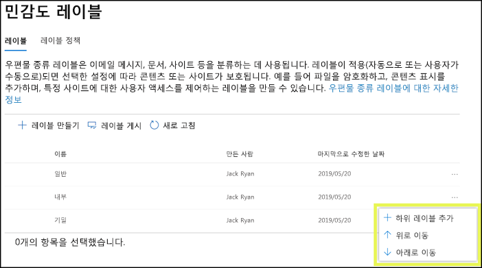
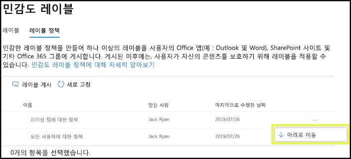

# 민감도 레이블 개요Overview of sensitivity labels

작업을 완료하기 위해 조직의 사용자는 조직 내부 및 외부의 다른 사용자와 공동으로 작업합니다. 이는 콘텐츠가 더 이상 방화벽 뒤에 있지 않으며 장치, 앱 및 서비스를 비롯한 모든 위치에서 로밍할 수 있음을 의미합니다. 또한 사용자는 로밍 중에는 조직의 비즈니스 및 준수 정책을 충족하는 안전하고 보호된 방식으로 진행하는 것이 좋습니다.To get their work done, people in your organization collaborate with others both inside and outside the organization. This means that content no longer stays behind a firewall — it can roam everywhere, across devices, apps, and services. And when it roams, you want it to do so in a secure, protected way that meets your organization’s business and compliance policies.

민감도 레이블을 사용하여 사용자의 생산성 및 공동 작업 능력이 저하되지 않도록 하면서 중요한 콘텐츠를 분류 및 보호할 수 있습니다.With sensitivity labels, you can classify and help protect your sensitive content, without hindering your people’s productivity and ability to collaborate.

민감도 레이블을 표시하는 예:Example showing sensitivity labels:

민감도 레이블은 전역(공용) 클라우드의 테넌트에 한해서만 지원됩니다.Sensitivity labels are supported for tenants in the global (public) cloud only. 현재, [국가별 클라우드](https://docs.microsoft.com/azure/active-directory/develop/authentication-national-cloud)와 같은 그 외의 클라우드의 테넌트에 대해서는 민감도 레이블이 지원되지 않습니다.Currently, sensitivity labels aren't supported for tenants in other clouds such as [national clouds](https://docs.microsoft.com/azure/active-directory/develop/authentication-national-cloud).

민감도 레이블을 적용하려면 사용자가 회사 또는 학교 계정으로 Office에 로그인해야 합니다.To apply sensitivity labels, users must be signed in to Office with their work or school account.

민감도 레이블을 사용하여 다음을 수행할 수 있습니다.You can use sensitivity labels to:
  
- **레이블이 지정된 콘텐츠에 암호화 또는 워터마크와 같은 보호 설정 적용.** 예를 들어 사용자가 문서 또는 전자 메일에 기밀 레이블을 적용하면 해당 레이블이 콘텐츠를 암호화하고 기밀 워터마크를 적용할 수 있습니다.**Enforce protection settings such as encryption or watermarks on labeled content.** For example, your users can apply a Confidential label to a document or email, and that label can encrypt the content and apply a Confidential watermark.

- **다양한 플랫폼 및 장치에서 Office 앱의 콘텐츠를 보호합니다.****Protect content in Office apps across different platforms and devices.** 지원되는 앱 목록은 [Office 앱의 민감도 레이블](sensitivity-labels-office-apps.md)을 참조하세요.For a list of supported apps, see [Sensitivity labels in Office apps](sensitivity-labels-office-apps.md).

- **Windows 실행 장치에 있는 중요한 콘텐츠가 조직 외부로 유출되지 않도록 방지.** 이를 위해 Microsoft Intune의 엔드포인트 보호 기능을 사용합니다. 민감도 레이블을 Windows 장치에 상주하는 콘텐츠에 적용하면 엔드포인트 보호 기능이 콘텐츠가 Twitter 또는 Gmail과 같은 타사 앱으로 복사되거나, USB 드라이브와 같은 이동식 저장소에 복사되지 않도록 할 수 있습니다.**Prevent sensitive content from leaving your organization on devices running Windows**, by using endpoint protection in Microsoft Intune. After a sensitivity label has been applied to content that resides on a Windows device, endpoint protection can prevent that content from being copied to a third-party app, such as Twitter or Gmail, or being copied to removable storage, such as a USB drive.

- Microsoft Cloud App Security를 사용하여 **타사 앱 및 서비스의 콘텐츠 보호****Protect content in third-party apps and services**, by using Microsoft Cloud App Security. Cloud App Security를 사용하여 SalesForce, Box 또는 DropBox 등의 타사 앱 및 서비스에 있는 콘텐츠를 감지, 분류, 레이블 지정 및 보호할 수 있습니다. 타사 앱 또는 서비스가 민감도 레이블을 읽지 않고 지원하지 않더라도 문제가 되지 않습니다.With Cloud App Security, you can detect, classify, label, and protect content in third-party apps and services, such as SalesForce, Box, or DropBox, even if the third-party app or service does not read or support sensitivity labels.

- **민감도 레이블을 타사 앱 및 서비스로 확장.** Microsoft Information Protection SDK를 사용할 경우 [이러한 플랫폼](https://docs.microsoft.com/information-protection/develop/overview#microsoft-information-protection-sdk)의 타사 앱은 민감도 레이블을 읽고 보호 설정을 적용할 수 있습니다.**Extend sensitivity labels to third-party apps and services.** With the Microsoft Information Protection SDK, third-party apps on [these platforms](https://docs.microsoft.com/information-protection/develop/overview#microsoft-information-protection-sdk) can read sensitivity labels and apply protection settings.

- **보호 설정을 사용하지 않고 콘텐츠를 분류합니다.****Classify content without using any protection settings.** 사용 및 공유하는 콘텐츠와 지속 및 로밍하는 콘텐츠에 분류를 할당(예: 스티커)할 수도 있습니다.You can also simply assign a classification to content (like a sticker) that persists and roams with the content as it's used and shared. 이 분류를 사용하여 사용 현황 보고서를 생성하고 민감한 콘텐츠의 활동 데이터를 볼 수 있습니다.You can use this classification to generate usage reports and see activity data for your sensitive content. 이 정보를 기반으로 나중에 항상 보호 설정을 적용하도록 선택할 수 있습니다.Based on this information, you can always choose to apply protection settings later.

이러한 모든 경우에서 Office 365의 민감도 레이블은 올바른 콘텐츠에 대해 올바른 작업을 수행하는 데 도움이 될 수 있습니다.In all these cases, sensitivity labels in Office 365 can help you take the right actions on the right content. 민감도 레이블을 사용하여 사용자는 조직에서 데이터를 분류하고 해당 분류에 따라 보호 기능 설정을 적용할 수 있습니다.With sensitivity labels, you can classify data across your organization and enforce protection settings based on that classification.
  
**분류** > **민감도 레이블**에 준하여 Microsoft 365 규정 준수 센터, Microsoft 365 보안 센터 또는 Office 365 보안 및 준수 센터에서 민감도 레이블을 만듭니다.You create sensitivity labels in the Microsoft 365 compliance center, Microsoft 365 security center, or Office 365 Security & Compliance Center under **Classification** > **Sensitivity labels**. 이러한 민감도 레이블은 Azure Information Protection, Office 앱 및 Office 365 서비스에서 사용할 수 있습니다.These sensitivity labels can be used by Azure Information Protection, Office apps, and Office 365 services.

Azure Information Protection 고객의 경우 다른 관리 센터에서 Azure Information Protection 레이블을 사용할 수 있으며 추가 또는 고급 구성을 수행하기로 선택한 경우 레이블이 Azure 포털과 동기화됩니다.For Azure Information Protection customers, you can use your Azure Information Protection labels in the other admin centers, and your labels will be synced with the Azure portal in case you choose to perform additional or advanced configuration. Azure Information Protection 레이블과 Office 365 민감도 레이블은 서로 호환됩니다. 예를 들어, Azure Information Protection으로 콘텐츠의 레이블을 지정한 경우에는 콘텐츠를 다시 분류하거나 레이블을 다시 지정할 필요가 없습니다.Azure Information Protection labels and Office 365 sensitivity labels are compatible with each other, which means for example, if you have content labeled by Azure Information Protection, you won’t need to reclassify or relabel your content.

## 민감도 레이블이란?What a sensitivity label is

문서 또는 전자 메일에 민감도 레이블을 지정하는 경우 다음과 같은 콘텐츠에 적용되는 스탬프와 같습니다.When you assign a sensitivity label to a document or email, it’s like a stamp that's applied to content that is:

- **사용자 지정 가능.** 조직에서다양한 수준의 중요한 콘텐츠에 대해 개인, 공개, 일반, 기밀 및 극비와 같은 범주를 만들 수 있습니다.**Customizable.** You can create categories for different levels of sensitive content in your organization, such as Personal, Public, General, Confidential, and Highly Confidential.

- **명확한 텍스트.****Clear text.** 레이블은 콘텐츠의 메타 데이터에 명확한 텍스트로 저장되므로 타사 앱 및 서비스는 이를 읽고 필요한 경우 고유의 보호 조치를 적용할 수 있습니다.Because the label is stored in clear text in the content's metadata, third-party apps and services can read it and then apply their own protective actions, if required.

- **지속적.****Persistent.** 민감도 레이블을 컨텐츠에 적용한 후 레이블은 해당 전자 메일이나 문서의 메타 데이터에서 지속됩니다.After you apply a sensitivity label to content, the label persists in the metadata of that email or document. 즉, 레이블은 보호 설정을 포함하여 콘텐트와 로밍하고 이 데이터는 정책을 적용하고 시행하는 데 기반이 됩니다.This means the label roams with the content, including the protection settings, and this data becomes the basis for applying and enforcing policies.

Office 앱의 경우, 민감도 레이블이 전자 메일 또는 문서에서 사용자에게 태그와 같이 표시됩니다.In Office apps, a sensitivity label appears like a tag to users on an email or document.

각 콘텐츠 항목에 단일 민감도 레이블을 적용할 수 있습니다. 하나의 항목에 단일 민감도 레이블과 단일 [보존 레이블](labels.md)을 모두 적용할 수 있습니다.Each item of content can have a single sensitivity label applied to it. An item can have both a single sensitivity label and a single [retention label](labels.md) applied to it.

## 민감도 레이블이 수행하는 작업What sensitivity labels can do

전자 메일 및 문서 이외에도 민감도 레이블은 여러 공개 미리 보기 릴리스에서 사용할 수 있습니다.In addition to email and documents, sensitivity labels are available in multiple public preview releases. 파일, 팀, 그룹 및 사이트에 민감도 레이블이 사용되는 방법에 관한 자세한 내용은 다음의 문서를 참조하세요.For more information about how sensitivity labels can be used for files, teams, groups, and sites, see these articles:

- [SharePoint 및 OneDrive에서 Office 파일에 대한 민감도 레이블 사용(공개 미리 보기)Enable sensitivity labels for Office files in SharePoint and OneDrive (public preview)](sensitivity-labels-sharepoint-onedrive-files.md)

- [Microsoft Teams, Office 365 그룹 및 SharePoint 사이트(공개 미리 보기)에서 민감도 레이블 사용Use sensitivity labels with Microsoft Teams, Office 365 groups, and SharePoint sites (public preview)](sensitivity-labels-teams-groups-sites.md)

민감도 레이블이 전자 메일이나 문서에 적용되면 해당 레이블의 구성된 보호 설정이 콘텐츠에 적용됩니다.After a sensitivity label is applied to an email or document, any configured protection settings for that label are enforced on the content. 민감도 레이블을 사용하여 다음을 수행할 수 있습니다.With a sensitivity label, you can:

- 전자 메일만 또는 전자 메일 및 문서 모두 **암호화****Encrypt** email only or both email and documents. 어떤 사용자 또는 그룹이 어떤 작업을 얼마나 오래 수행할 수 있는지를 선택할 수 있습니다.You can choose which users or group have permissions to perform which actions and for how long. 예를 들어 조직 외부의 특정 도메인에 있는 사용자가 콘텐츠에 레이블이 지정된 후 7일 동안 콘텐츠를 검토할 수 있는 권한을 갖도록 선택할 수 있습니다.For example, you can choose to allow users in a specific domain outside your organization to have permissions to review the content for only 7 days after the content is labeled. 또는 직접 권한을 할당하는 대신 사용자가 레이블을 적용할 때 콘텐츠에 사용 권한을 할당할 수 있습니다.Alternatively, instead of assigning permissions yourself, you can allow your users to assign permissions to the content when they apply the label. 자세한 내용은 [민감도 레이블에서 암호화를 사용하여 콘텐츠 액세스 제한](encryption-sensitivity-labels.md)을 참조하세요.For more information, see [Restrict access to content by using encryption in sensitivity labels](encryption-sensitivity-labels.md).

- 레이블이 적용된 전자 메일 또는 문서에 사용자 지정 워터마크, 머리글 또는 바닥글을 추가하여 **콘텐츠에 표시**.**Mark the content** by adding custom watermarks, headers, or footers to email or documents that have the label applied. 워터마크는 전자 메일이 아닌 문서에만 적용되고 255자로 제한됩니다.You only apply watermarks to documents, not email, and they're limited to 255 characters. 또한 머리글과 바닥글은 1024자로 제한됩니다. (문서에 다른 머리글이나 바닥글 및 기타 요소가 포함되어 있는지 여부에 따라 255자로 제한되는 Excel 제외)Also, headers and footers are limited to 1024 characters (except in Excel, where they're limited to 255 characters or fewer, depending on whether the document contains other headers or footers and other factors.)

    

- Intune에서 끝점 보호를 설정하여 **데이터 손실 방지**.**Prevent data loss** by turning on endpoint protection in Intune. 중요한 콘텐츠를 다운로드되면 Windows 장치에서 데이터가 손실되는 것을 방지하는 데 도움이 될 수 있습니다.If sensitive content gets downloaded, you can help prevent the loss of data from Windows devices. 예를 들어, 레이블이 지정된 콘텐츠를 Dropbox, Gmail 또는 USB 드라이브에 복사할 수 없습니다.For example, you can’t copy labeled content into Dropbox, Gmail, or a USB drive. 민감도 레이블이 WIP(Windows Information Protection)를 사용할 수 있으려면 먼저 Azure portal에서 앱 보호 정책을 만들어야 합니다.Before your sensitivity labels can use Windows Information Protection (WIP), you first need to create an app protection policy in the Azure portal. 자세한 내용은 [Windows Information Protection이 민감도 레이블로 파일을 보호하는 방법](https://docs.microsoft.com/windows/security/information-protection/windows-information-protection/how-wip-works-with-labels?branch=vsts17546553)을 참조하세요.For more information, see [How Windows Information Protection protects files with a sensitivity label](https://docs.microsoft.com/windows/security/information-protection/windows-information-protection/how-wip-works-with-labels?branch=vsts17546553).

- **중요한 정보를 포함하고 있는 콘텐츠에 레이블을 자동으로 적용합니다.** 레이블을 지정할 중요한 정보의 유형을 선택할 수 있으며, 레이블을 자동으로 적용하거나 사용자가 추천 레이블을 적용할 수 있도록 메시지를 표시할 수 있습니다. 레이블을 추천하는 경우 어떤 텍스트를 선택해도 메시지가 표시됩니다. 자세한 내용은 [Apply a sensitivity label to content automatically](apply-sensitivity-label-automatically.md)(콘텐츠에 민감도 레이블을 자동으로 적용)를 참조하세요.**Apply the label automatically to content that contains sensitive information.** You can choose what types of sensitive information that you want labeled, and the label can either be applied automatically, or you can prompt users to apply the label that you recommend. If you recommend a label, the prompt displays whatever text you choose. For more information, see [Apply a sensitivity label to content automatically](apply-sensitivity-label-automatically.md).

    

이러한 모든 옵션은 민감도 레이블을 만들 때 사용할 수 있습니다.All these options are available when you create a sensitivity label:

### 레이블 우선 순위(순서가 중요함)Label priority (order matters)

관리자 센터에서 민감도 레이블을 만드는 경우 **레이블** 페이지의 **민감도** 탭에 있는 목록에 레이블이 나타납니다.When you create your sensitivity labels in your admin center, they appear in a list on the **Sensitivity** tab on the **Labels** page. 이 목록에서는 레이블의 우선 순위가 반영되기 때문에 레이블의 순서가 중요합니다.In this list, the order of the labels is important because it reflects their priority. 극비와 같은 가장 제한적인 민감도 레이블은 목록의 **아래쪽**에 표시되도록 하고, 공용과 같은 가장 덜 제한적인 민감도 레이블은 **위쪽**에 표시되도록 합니다.You want your most restrictive sensitivity label, such as Highly Confidential, to appear at the **bottom** of the list, and your least restrictive sensitivity label, such as Public, to appear at the **top**.

문서 또는 전자 메일에 하나의 민감도 레이블만 적용할 수도 있습니다.You can apply just one sensitivity label to a document or email. 사용자가 레이블을 더 낮은 분류로 변경하는 사유를 제공하는 옵션을 설정하는 경우 이 목록의 순서는 하위 분류를 식별합니다.If you require your users to provide a justification for changing the label to a lower classification, the order of this list identifies the lower classifications. 단, 이 옵션은 하위 레이블에 적용되지 않습니다.However, this option does not apply to sublabels.

그러나 하위 레이블의 순서는 [자동 레이블 지정](apply-sensitivity-label-automatically.md)과 함께 사용됩니다.The ordering of sublabels is used with [automatic labeling](apply-sensitivity-label-automatically.md), though. 레이블을 자동 또는 권장 사항으로 적용되도록 구성하면 둘 이상의 레이블에 대해 여러 개의 일치 항목이 발생할 수 있습니다.When you configure labels to be applied automatically or as a recommendation, multiple matches can result for more than one label. 적용하거나 권장할 레이블을 결정하기 위해 레이블 순서가 사용됩니다. 마지막 민감도 레이블이 선택되고 해당하는 경우 마지막 하위 레이블이 선택됩니다.To determine the label to apply or recommend, the label ordering is used: The last sensitive label is selected, and then if applicable, the last sublabel.

### 하위 레이블(레이블 그룹화)Sublabels (grouping labels)

하위 레이블을 사용하여 Office 앱에 표시되는 하나 이상의 레이블을 상위 레이블 아래에 그룹화할 수 있습니다.With sublabels, you can group one or more labels below a parent label that a user sees in an Office app. 예를 들어, 조직은 기밀 아래에 여러 다른 레이블을 사용하여 특정 유형의 분류를 구현할 수 있습니다.For example, under Confidential, your organization might use several different labels for specific types of that classification. 이 예제에서 상위 레이블 ‘기밀’은 보호 설정이 지정되지 않은 단순한 텍스트 레이블이며, 하위 레이블이 있으므로 콘텐츠에 적용할 수 없습니다.In this example, the parent label Confidential is simply a text label with no protection settings, and because it has sublabels, it can’t be applied to content. 대신, 하위 레이블을 보려면 기밀을 선택해야 하며, 그 이후에 콘텐츠에 적용할 하위 레이블을 선택할 수 있습니다.Instead, users must choose Confidential to view the sublabels, and then they can choose a sublabel to apply to content.

하위 레이블은 레이블을 논리 그룹으로 나타내는 간단한 방법입니다.Sublabels are simply a way to present labels to users in logical groups. 하위 레이블은 상위 레이블에서 설정을 상속하지 않습니다.Sublabels don’t inherit any settings from their parent label. 사용자의 하위 레이블을 게시하는 경우, 해당 사용자는 해당 하위 레이블을 콘텐츠에 적용할 수 있지만 상위 레이블만을 적용할 수는 없습니다.When you publish a sublabel for a user, that user can then apply that sublabel to content but can't apply just the parent label.

상위 레이블은 Azure Information Protection 통합 레이블 지정 클라이언트를 사용하는 Office 앱에서 콘텐츠에 적용되지 않으므로 상위 레이블을 기본 레이블로 선택하거나 상위 레이블이 자동으로 적용되거나 권장되도록 구성하지 않도록 합니다.Don't choose a parent label as the default label, or configure a parent label to be auto-applied or recommended, because the parent label won't be applied to content in Office apps that use the Azure Information Protection unified labeling client.

사용자에게 하위 레이블이 표시되는 방법의 예:Example of how sublabels display for users:

### 민감도 레이블 편집 또는 삭제Editing or deleting a sensitivity label

민감도 레이블을 삭제할 경우 콘텐츠에서 레이블이 제거되지 않으며, 보호 설정이 콘텐츠에 계속 적용됩니다.If you delete a sensitivity label, the label is not removed from content, and any protection settings continue to be enforced on the content.

민감도 레이블을 편집하는 경우 콘텐츠에 적용된 레이블 버전이 해당 콘텐츠에 강제 적용됩니다.If you edit a sensitivity label, the version of the label that was applied to content is what’s enforced on that content.

## 레이블 정책이 수행할 수 있는 작업What label policies can do

민감도 레이블을 만든 후 조직의 사용자들이 사용할 수 있게 게시해야 합니다. 그러면 사용자들은 해당 레이블을 콘텐츠에 적용할 수 있습니다. 모든 Exchange 사서함과 같은 위치에 게시되는 보존 레이블과 달리, 민감도 레이블은 사용자 또는 그룹에 게시됩니다. 그런 후 민감도 레이블은 해당 사용자 및 그룹을 위한 Office 앱에 나타납니다.After you create your sensitivity labels, you need to publish them, to make them available to people in your organization, who can then apply the labels to content. Unlike retention labels, which are published to locations, such as all Exchange mailboxes, sensitivity labels are published to users or groups. Sensitivity labels then appear in Office apps for those users and groups.

레이블 정책을 사용하여 다음 작업을 수행할 수 있습니다.With a label policy, you can:

- **레이블을 볼 수 있는 사용자 및 그룹을 선택합니다.** 레이블을 전자 메일 사용이 가능한 보안 그룹, 메일 그룹, Office 365 그룹 또는 동적 메일 그룹에 게시할 수 있습니다.**Choose which users and groups see the labels.** Labels can be published to any email-enabled security group, distribution group, Office 365 group, or dynamic distribution group.

- 레이블 정책에 포함된 사용자 및 그룹이 만든 모든 새 문서 및 전자 메일에 **기본 레이블을 적용합니다**. 이 기본 레이블은 모든 콘텐츠에 적용하려는 기본적인 보호 설정 수준을 설정할 수 있습니다.**Apply a default label** to all new documents and email created by the users and groups included in the label policy. This default label can set a base level of protection settings that you want applied to all your content.

- **레이블을 변경하는 데 사유 요구****Require a justification for changing a label.** 콘텐츠가 기밀로 표시되고 사용자가 해당 레이블을 제거하거나 더 낮은 분류(예: 공용이라는 레이블)로 바꾸려는 경우 이 작업을 수행할 때 사용자가 사유를 제공하도록 요청할 수 있습니다.If content is marked Confidential and a user wants to remove that label or replace it with a lower classification, such as a label named Public, you can require that the user provide a justification when performing this action. 현재 사유는 관리자가 검토할 수 있도록 [레이블 분석](label-analytics.md)에 전달되지 않습니다.Currently, the justification reason isn't sent to [label analytics](label-analytics.md) for the admin to review. 그러나 [Azure Information Protection 통합 레이블 클라이언트](https://docs.microsoft.com/azure/information-protection/rms-client/aip-clientv2)는이 정보를 [Azure Information Protection analytics](https://docs.microsoft.com/azure/information-protection/reports-aip)에 보냅니다.However, the [Azure Information Protection unified labeling client](https://docs.microsoft.com/azure/information-protection/rms-client/aip-clientv2) sends this information to [Azure Information Protection analytics](https://docs.microsoft.com/azure/information-protection/reports-aip).

    

- **사용자가 전자 메일 및 문서에 레이블을 적용하도록 요구합니다.** 사용자의 모든 콘텐츠에 레이블을 지정하도록 하려는 경우, 사용자의 저장된 문서 및 보낸 전자 메일 모두에 레이블을 적용하도록 요구할 수 있습니다. 사용자가 레이블을 수동으로 할당하고, 레이블이 조건의 결과로 자동으로 할당되거나, 기본적으로 할당(위에 설명된 기본 레이블 옵션)될 수 있습니다. 사용자가 레이블 할당 요구를 받을 때 Outlook에 표시되는 메시지는 다음과 같습니다.**Require users to apply a label to their email and documents.** If you want all of a user's content to be labeled, you can require that a label must be applied to all of their saved documents and sent emails. The label can be assigned manually by the user, automatically as a result of a condition, or be assigned by default (the default label option described above). Here's the prompt shown in Outlook when a user is required to assign a label.

    > [!NOTE]
    > 필수 레이블에는 Azure Information Protection 구독이 필요합니다.Mandatory labeling requires an Azure Information Protection subscription. 이 기능을 사용하려면 [Azure Information Protection 클라이언트](https://www.microsoft.com/download/details.aspx?id=53018) 또는 이후 [Azure Information Protection 통합 레이블 지정 클라이언트](https://docs.microsoft.com/azure/information-protection/rms-client/install-unifiedlabelingclient-app) 중 하나를 다운로드하여 설치해야 합니다.To use this feature, you must download and install either the [Azure Information Protection client](https://www.microsoft.com/download/details.aspx?id=53018) or the later [Azure Information Protection unified labeling client](https://docs.microsoft.com/azure/information-protection/rms-client/install-unifiedlabelingclient-app). 또한, 클라이언트는 Windows에서만 실행되므로 Mac, iOS, Android에서는 이 기능이 아직 지원되지 않습니다.Also, the client runs only on Windows, so this feature is not yet supported on Mac, iOS, and Android.

    

- **사용자 지정 도움말 페이지에 도움말 링크 제공****Provide help link to a custom help page.** 사용자가 민감도 레이블의 의미나 사용 방식을 잘 모를 경우 Office 앱의 **민감도 레이블** 메뉴 하단에 자세히 알아보기 URL을 제공할 수 있습니다.If your users aren’t sure what your sensitivity labels mean or how they should be used, you can provide a Learn More URL that appears at the bottom of the **Sensitivity label** menu in the Office apps.

    

레이블 정책을 만들고 사용자 및 그룹에게 민감도 레이블을 할당하면 해당 사용자나 그룹은 1시간 이내에 Office 앱에서 해당 레이블이 사용 가능하다는 것을 확인할 수 있습니다.After you create a label policy and assign sensitivity labels to users and groups, those people will see those labels available in the Office apps in an hour or less.

만들고 게시할 수 있는 민감도 레이블의 수에는 제한이 없지만 한 가지 예외적인 경우가 있습니다. 레이블에 암호화가 적용되는 경우의 최대 레이블의 수는 500개입니다.There is no limit to the number of sensitivity labels that you can create and publish, with one exception: If the label applies encryption, there is a maximum of 500 labels. 하지만 최상의 방식은 관리자 오버헤드를 낮추고 사용자의 복잡성을 줄이기 위해 레이블의 수를 최소로 유지하는 것입니다.However, as a best practice to lower admin overheads and reduce complexity for your users, try to keep the number of labels to a minimum. 사용자에게 6개 이상의 주 레이블 또는 주 레이블당 6개 이상의 하위 레이블이 있는 경우 효과가 확연하게 감소하는 것이 실제 배포 결과를 통해 입증되었습니다.Real-word deployments have proved effectiveness to be noticeably reduced when users have more than five main labels or more than five sublabels per main label.

### 레이블 정책 우선 순위(순서 중요)Label policy priority (order matters)

**레이블 정책** 페이지의 **민감도 정책** 탭에 있는 목록에 나타나는 민감도 레이블 정책에 민감도 레이블을 게시하여 사용자가 이를 사용할 수 있도록 합니다.You make your sensitivity labels available to users by publishing them in a sensitivity label policy that appears in a list on the **Sensitivity policies** tab on the **Label policies** page. 민감도 레이블([레이블 우선 순위(순서 중요)](#label-priority-order-matters) 참조)과 마찬가지로, 민감도 레이블의 순서가 우선 순위를 반영하므로 이 순서가 중요합니다.Just like sensitivity labels (see [Label priority (order matters)](#label-priority-order-matters)), the order of the sensitivity label policies is important because it reflects their priority. 우선 순위가 가장 낮은 레이블 정책이 **맨 위**에 표시되고 우선 순위가 가장 높은 레이블 정책이 **맨 아래**에 표시됩니다.The label policy with lowest priority is shown at the **top**, and the label policy with the highest priority is shown at the **bottom**.

레이블 정책은 다음으로 구성됩니다.A label policy consists of:

- 레이블 집합.A set of labels.
- 정책에 포함된 사용자 및 그룹을 나타내는 레이블 정책의 범위입니다.The scope of the label policy, meaning the users and groups included in the policy.
- 위에서 설명한 레이블 정책의 설정(기본 레이블, 맞춤, 필수 레이블 및 도움말 링크)입니다.The settings of the label policy described above (default label, justification, mandatory label, and help link).

여러 레이블 정책에 한 사용자를 포함시키면 해당 사용자에게 해당 정책의 모든 민감도 레이블이 표시됩니다.You can include a user in multiple label policies, and the user will see all the sensitivity labels from those policies. 그러나 사용자에게는 우선 순위가 가장 높은 레이블 정책의 정책 설정만 표시됩니다.However, a user will see the policy settings from only the label policy with the highest priority.

조직의 사용자 또는 그룹이 기본 또는 필수 레이블 등 원하는 레이블 정책에서 옵션을 볼 수 없는 경우, 민감도 레이블 정책의 순서를 확인합니다.If a user or group in your organization is not seeing an option in the label policy that you intended, such as a default or mandatory label, check the order of the sensitivity label policies. 레이블 정책의 순서를 다시 지정하려면, 민감도 레이블 정책 선택 > 오른쪽에서 줄임표 선택 > **아래로 이동** 또는 **위로 이동**합니다.To re-order the label policies, select a sensitivity label policy > choose the ellipsis on the right > **Move down** or **Move up**.

민감도 레이블 정책에 대한 우선 순위가 중요하지만, 보존 **레이블** 정책에 대해서는 중요하지 않습니다.While priority matters for sensitivity label policies, it does **not** matter for retention label policies. [보존 원칙 또는 우선 순위](labels.md#the-principles-of-retention-or-what-takes-precedence)에 설명된 대로, 콘텐츠에 많은 보존 정책이 적용될 수 있습니다.As explained in [The principles of retention, or what takes precedence?](labels.md#the-principles-of-retention-or-what-takes-precedence), content can be subject to multiple retention policies.

## 민감도 레이블을 시 하는 방법How to get started with sensitivity labels

민감도 레이블은 빠르게 시작할 수 있습니다.Getting started with sensitivity labels is a quick process:

1. **레이블을 정의합니다.****Define the labels.** 먼저, 콘텐츠의 다양한 민감도 수준을 정의하기 위해 분류를 설정합니다.First, you want to establish your taxonomy for defining different sensitivity levels of content. 사용자가 이해할 수 있는 일반적인 이름이나 용어를 사용합니다.Use common names or terms that make sense to your users. 예를 들어 개인, 공용, 일반, 기밀, 고도의 기밀과 같은 레이블로 시작할 수 있습니다.For example, you can start with labels such as Personal, Public, General, Confidential, and Highly Confidential. 하위 레이블을 사용하여 범주별로 비슷한 레이블을 그룹화할 수 있습니다.You can use sublabels to group similar labels by category. 또한 레이블을 만들 때 사용자가 마우스로 리본의 레이블 옵션을 가리킬 때 Office 앱에 표시되는 툴팁이 필요합니다.Also, when you create a label, a tool tip is required, which appears in the Office apps when a user hovers over a label option on the Ribbon.

2. **각 레이블이 수행할 수 있는 작업을 정의합니다.****Define what each label can do.** 그런 다음 각 레이블과 연결할 보호 설정을 구성합니다.Then, configure the protection settings you want associated with each label. 예를 들어, 민감도가 낮은 콘텐츠(“일반” 레이블 등)에는 간단히 머리글이나 바닥글을 적용하고, 민감도가 높은 콘텐츠("기밀" 레이블 등)에는 워터마크, 암호화 및 WIP를 적용하여 권한이 있는 사용자만 액세스하도록 할 수 있습니다.For example, lower sensitivity content (such as a “General” label) might simply have a header or footer applied to it, while higher sensitivity content (such as a “Confidential” label) may have a watermark, encryption, and WIP applied to it, to help ensure that only privileged users can access it.

3. **레이블을 받는 사용자 정의.** 조직의 레이블을 정의한 후에 해당 레이블을 보는 사용자 및 그룹을 제어하는 레이블 정책에 게시합니다. 단일 레이블을 다시 사용할 수 있습니다. 즉, 한 번 정의한 후 다른 사용자에게 할당되는 여러 레이블 정책에 포함할 수 있습니다. 그렇지만 레이블을 콘텐츠에 할당하려면 Office 앱 및 기타 서비스에서 사용할 수 있도록 해당 레이블을 먼저 게시해야 합니다. 처음 사용하는 경우 소수의 사용자에게만 할당하여 민감도 레이블을 시험해볼 수 있습니다.**Define who gets the labels.** After you define your organization’s labels, you publish them in a label policy that controls which users and groups see those labels. A single label is reusable – you define it once, and then you can include it in several label policies assigned to different users. But in order for a label to be assigned to content, you must first publish that label so that it’s available in Office apps and other services. When just starting out, you can pilot your sensitivity labels by assigning them to just a few people.

다음은 관리자, 사용자 및 Office 앱이 민감도 레이블 사용을 위해 수행하는 작업의 기본 흐름입니다.Here’s the basic flow of what the admin, user, and Office app do to make sensitivity labels work.

## 민감도 레이블이 표시될 수 있는 위치Where sensitivity labels can appear

민감도 레이블은 Office 앱의 UI에 표시되며 리본의 홈 탭에 있는 **민감도** 단추에서 선택할 수 있습니다.Sensitivity labels appear in the UI of Office apps, and can be selected from the **Sensitivity** button on the Home tab of the ribbon. 특정 앱 및 플랫폼의 기본 제공 레이블 지정에 대한 현재 가용성을 확인하려면 [앱의 민감도 레이블 기능 지원](sensitivity-labels-office-apps.md#support-for-sensitivity-label-capabilities-in-apps)을 참조하세요.To view the current availability for built-in labeling for specific apps and platforms, see [Support for sensitivity label capabilities in apps](sensitivity-labels-office-apps.md#support-for-sensitivity-label-capabilities-in-apps).

Windows 컴퓨터에 Azure Information Protection 통합 레이블 지정 클라이언트를 사용 하는 경우 민감도 레이블에 대한 추가 기능을 사용할 수 있습니다.If you use the Azure Information Protection unified labeling client for your Windows computers, additional features are available for sensitivity labels. 자세한 내용은 [Windows 컴퓨터에 대한 레이블 지정 클라이언트 비교](https://docs.microsoft.com/azure/information-protection/rms-client/use-client#compare-the-labeling-clients-for-windows-computers)를 참조하세요.For more information, see [Compare the labeling clients for Windows computers](https://docs.microsoft.com/azure/information-protection/rms-client/use-client#compare-the-labeling-clients-for-windows-computers).

### Windows의 Office 앱Office apps on Windows

Windows를 실행하는 장치의 Office 앱에서 민감도 레이블은 리본의 **홈** 탭에 있는 **민감도** 단추에 표시됩니다.In Office apps on devices running Windows, sensitivity labels appear on the **Sensitivity** button, on the **Home** tab on the Ribbon. 

기본 제공 레이블 지정을 사용하는 경우 적용된 레이블은 창 아래쪽에 있는 상태 표시줄에도 표시됩니다.When you use built-in labeling, the label applied also appears in the Status bar at the bottom of the window:

### 웹용 Office 앱Office apps on the web

웹에서 Office 앱에서의 민감도 레이블의 사용에 대한 내용은 [Office-Web 내의 문서 및 전자 메일에 민감도 레이블 적용](https://support.office.com/article/2f96e7cd-d5a4-403b-8bd7-4cc636bae0f9)을 참조하세요.For information about using sensitivity labels with Office apps on the web, see [Apply sensitivity labels to your documents and email within Office - Web](https://support.office.com/article/2f96e7cd-d5a4-403b-8bd7-4cc636bae0f9).

### Mac의 Office 앱Office apps on Mac

Mac 장치의 Office 앱에서 민감도 레이블은 리본의 **홈** 탭에 있는 **민감도** 단추에 표시됩니다.In Office apps on Mac devices, sensitivity labels appear on the **Sensitivity** button, on the **Home** tab on the Ribbon. 적용된 레이블은 창 아래쪽에 있는 상태 표시줄에도 표시됩니다.The label applied also appears in the Status bar at the bottom of the window:

### iOS의 Office 앱Office apps on iOS

iOS 장치의 Office 앱에서 민감도 레이블은 리본의 **홈** 탭에 있는 **민감도** 단추에 표시됩니다.In Office apps on iOS devices, sensitivity labels appear on the **Sensitivity** button, on the **Home** tab on the Ribbon. 적용된 레이블은 창 아래쪽에 있는 상태 표시줄에도 표시됩니다.The label applied also appears in the Status bar at the bottom of the window:

### Android의 Office 앱Office apps on Android

Android 장치의 Office 앱에서 민감도 레이블은 리본의 **홈** 탭에 있는 **민감도** 단추에 표시됩니다.In Office apps on Android devices, sensitivity labels appear on the **Sensitivity** button, on the **Home** tab on the Ribbon. 적용된 레이블은 창 아래쪽에 있는 상태 표시줄에도 표시됩니다.The label applied also appears in the Status bar at the bottom of the window:

### Office 앱의 민감도 레이블에 대한 자세한 내용More information on sensitivity labels in Office apps

- [Office 내의 문서 및 전자 메일에 민감도 레이블 적용Apply sensitivity labels to your documents and email within Office](https://support.office.com/article/apply-sensitivity-labels-to-your-documents-and-email-within-office-2f96e7cd-d5a4-403b-8bd7-4cc636bae0f9)
- [Office 파일에 민감도 레이블을 적용할 때의 알려진 문제Known issues when you apply sensitivity labels to your Office files](https://support.office.com/article/known-issues-when-you-apply-sensitivity-labels-to-your-office-files-b169d687-2bbd-4e21-a440-7da1b2743edc)
- [Office 앱의 민감도 레이블Sensitivity labels in Office apps](sensitivity-labels-office-apps.md)

## 민감도 레이블이 기존 Azure Information Protection 레이블에 작동하는 방식How sensitivity labels work with existing Azure Information Protection labels

Azure Information Protection 사용자는 Azure Information Protection 통합 레이블 지정 클라이언트를 사용하여 Windows에서 콘텐츠를 분류 하고 레이블을 지정할 수 있습니다.Azure Information Protection users can classify and label content on Windows by using the Azure Information Protection unified labeling client. 기존 Azure Information Protection 레이블은 통합 레이블로도 알려진 새로운 민감도 레이블과 원활하게 작동합니다.Existing Azure Information Protection labels work seamlessly with new sensitivity labels, also known as unified labels. 이는 다음과 같이 사용할 수 있다는 것을 의미합니다.This means you can:

- 문서 및 전자 메일의 기존 Azure Information Protection 레이블을 유지합니다.Keep your existing Azure Information Protection labels on documents and email.
- 기존 Azure Information Protection 레이블 구성을 유지합니다.Keep your existing Azure Information Protection label configuration.

테넌트가 아직 [통합 레이블 지정 플랫폼](https://docs.microsoft.com/azure/information-protection/faqs#how-can-i-determine-if-my-tenant-is-on-the-unified-labeling-platform)에 있지 않기 때문에 Azure Information Protection 레이블을 사용하는 경우, 통합 레이블 지정을 활성화할 때까지 다른 관리 센터에서 새 레이블을 만들지 않을 것을 권장합니다.If you are using Azure Information Protection labels because your tenant isn't yet on the [unified labeling platform](https://docs.microsoft.com/azure/information-protection/faqs#how-can-i-determine-if-my-tenant-is-on-the-unified-labeling-platform), we recommend that you avoid creating new labels in other admin centers until you activate unified labeling. 이 프로세스에 대한 자세한 내용은 [Azure Information Protection 레이블을 통합 민감도 레이블 지정으로 마이그레이션하는 방법](https://docs.microsoft.com/azure/information-protection/configure-policy-migrate-labels)을 참조하세요.For more information about this process, see [How to migrate Azure Information Protection labels to unified sensitivity labels](https://docs.microsoft.com/azure/information-protection/configure-policy-migrate-labels).

## 민감도 레이블 및 Azure Information Protection 클라이언트Sensitivity labels and the Azure Information Protection client

Azure Information Protection 클라이언트가 설치된 경우 Office 365 ProPlus 앱은 Office Windows 앱에서 기본으로 제공되는 민감도 레이블 지정 기능을 자동으로 해제합니다.Office 365 ProPlus apps automatically turn off built-in labeling for sensitivity labels in Office Windows apps if the Azure Information Protection client is installed.
이 기본 설정을 변경하여 기본으로 제공되는 레이블 지정 기능을 사용하려면 [Office 기본 제공 레이블 지정 클라이언트](sensitivity-labels-office-apps.md#about-the-office-built-in-labeling-client)를 참조하세요.To change this default behavior so that you can use built-in labeling, see [About the Office built-in labeling client](sensitivity-labels-office-apps.md#about-the-office-built-in-labeling-client).

## Microsoft Intune에서 엔드포인트 보호 기능을 사용하여 Windows 장치에서 콘텐츠 보호Protect content on Windows devices by using endpoint protection in Microsoft Intune

민감도 레이블을 만들 때 콘텐츠를 Windows 장치에 저장하는 경우 이 레이블이 지정된 파일을 데이터 누출로부터 보호해야 한다고 Windows에 알리는 옵션이 있습니다.When you create a sensitivity label, you have the option to tell Windows that files with this label need to be protected against data leakage when this content is stored on Windows devices. 이 옵션을 사용하면 이 레이블이 지정된 콘텐츠를 엔드포인트에 저장하는 경우에도 승인된 위치로만 레이블이 공유되거나 복사되도록 확인할 수 있습니다.This option can help ensure that content with this label can be shared or copied only to sanctioned locations, even when it’s stored on an endpoint. 본질적으로 민감도 레이블에 이 옵션을 사용하면 데이터가 추가적 사용 제약 조건을 보장받는 특별히 중요한 데이터임을 Windows에 알리게 됩니다.In essence, turning on this option for a sensitivity label tells Windows that this is extra critical data that warrants additional usage constraints.

이 옵션을 설정하면 Windows는 문서의 민감도 레이블을 읽고, 이해하고, 관련 작업을 수행할 수 있으며, 관리되는 Windows 장치에 연결되는 방식에 관계없이, 콘텐트에 WIP(Windows Information Protection)를 자동으로 적용할 수 있습니다. 이를 통해 암호화 적용 여부에 관계없이, 레이블이 지정된 파일을 우연한 누출로부터 보호할 수 있습니다.When you turn on this option, Windows can read, understand, and act on sensitivity labels in documents and automatically apply Windows Information Protection (WIP) on content, no matter how it reaches a managed Windows device. This helps protect labeled files from accidental leakage, with or without applying encryption.

예를 들어 Windows는 사용자의 컴퓨터에 있는 Word 문서에 기밀 레이블이 적용되어 있음을 이해할 수 있고 WIP는 해당 디바이스에서 비작업 위치(예: 개인 OneDrive, 개인 전자 메일 계정, 소셜 미디어 또는 USB 드라이브)로 데이터를 복사 또는 공유하지 못하도록 하는 앱 보호 정책을 적용할 수 있습니다.For example, Windows can understand that a Word document residing on a user’s machine has a Confidential label applied to it, and WIP can apply an app protection policy to prevent the copying or sharing of the data to any non-work location from that device (such as a personal OneDrive, personal email accounts, social media, or USB drives).

사용자가 레이블이 지정된 콘텐츠를 개인 Gmail 계정에 업로드하려고 하면 이 메시지가 표시됩니다.If a user attempts to upload labeled content to a personal Gmail account, they see this message.

또한 사용자가 레이블이 지정된 콘텐츠를 USB 드라이브에 저장하려고 하면 다음의 메시지가 표시됩니다.And if a user attempts to save labeled content to a USB drive, they see the following message:

### WIP 사용을 위한 중요한 필수 구성 요소Important prerequisites for using WIP

민감도 레이블이 WIP를 사용하려면, [Windows Information Protection이 민감도 레이블이 지정된 파일을 보호하는 방법](https://docs.microsoft.com/windows/security/information-protection/windows-information-protection/how-wip-works-with-labels?branch=vsts17546553)에 설명된 필수 구성 요소를 수행해야 합니다. 이 항목에서는 다음과 같은 필수 구성 요소에 대해 설명합니다.Before your sensitivity labels can use WIP, you first need to do the prerequisites described here: [How Windows Information Protection protects files with a sensitivity label](https://docs.microsoft.com/windows/security/information-protection/windows-information-protection/how-wip-works-with-labels?branch=vsts17546553). This topic describes the following prerequisites:

- Windows 10, 버전 1809 이상을 실행 중인지 확인합니다.Make sure you're running Windows 10, version 1809 or later.
- [Microsoft Defender ATP(Microsoft Defender Advanced Threat Protection) 설정](https://docs.microsoft.com/windows/security/threat-protection/)는 콘텐츠에서 레이블을 검색하고 해당 WIP 보호를 적용합니다.[Set up Microsoft Defender Advanced Threat Protection (Microsoft Defender ATP)](https://docs.microsoft.com/windows/security/threat-protection/), which scans content for a label and applies the corresponding WIP protection. ATP는 WIP와 독립적으로 이상 보고와 같은 일부 작업을 수행합니다.ATP performs some actions independently from WIP, such as reporting anomalies.
- 엔드포인트 장치에 적용되는 WIP(Windows Information Protection) 정책을 만듭니다. 다음 중 하나의 위치에서 이를 수행할 수 있습니다.Create a Windows Information Protection (WIP) policy that applies to endpoint devices. You can do this in either of these locations:

  - [Microsoft Intune용 Azure Portal을 사용하여 MDM으로 WIP(Windows Information Protection) 정책 만들기Create a Windows Information Protection (WIP) policy with MDM using the Azure portal for Microsoft Intune](https://docs.microsoft.com/windows/security/information-protection/windows-information-protection/create-wip-policy-using-intune-azure)
  - [System Center Configuration Manager를 사용하여 WIP(Windows Information Protection) 정책 만들기 및 배포Create and deploy a Windows Information Protection (WIP) policy using System Center Configuration Manager](https://docs.microsoft.com/windows/security/information-protection/windows-information-protection/create-wip-policy-using-sccm)

## Microsoft Cloud App Security를 사용하여 타사 앱 및 서비스의 콘텐츠 보호Protect content in third-party apps and services by using Microsoft Cloud App Security

CAS(Cloud App Security)를 사용하여 타사 앱 및 서비스의 콘텐츠 보호Protect content in third-party apps and services by using Cloud App Security (CAS). CAS를 사용하여 SalesForce, Box 또는 Dropbox 등의 타사 서비스 및 앱에 있는 콘텐츠를 감지, 분류, 레이블 지정 및 보호할 수 있습니다.With CAS, you can detect, classify, label, and protect content in third-party services and apps, such as SalesForce, Box, or Dropbox. 예를 들어, Dropbox가 민감도 레이블을 이해하지 못할 수 있으나 CAS는 해당 위치에서 레이블이 지정된 콘텐츠에 액세스하고 보호할 수 있습니다.For example, Dropbox might not understand a sensitivity label, but CAS can reach out and protect labeled content in that location.

자세한 내용은 [Azure Information Protection 분류 레이블 자동 적용](https://docs.microsoft.com/cloud-app-security/use-case-information-protection)을 참조하세요.For more information, see [Automatically apply Azure Information Protection classification labels](https://docs.microsoft.com/cloud-app-security/use-case-information-protection).

### CAS 사용을 위한 중요한 필수 구성 요소Important prerequisites for using CAS

민감도 레이블이 CAS를 사용하려면, [Azure Information Protection 분류 레이블 자동 적용](https://docs.microsoft.com/cloud-app-security/use-case-information-protection)에 설명된 필수 구성 요소를 수행해야 합니다.Before your sensitivity labels can use CAS, you first need to do the prerequisites described here: [Automatically apply Azure Information Protection classification labels](https://docs.microsoft.com/cloud-app-security/use-case-information-protection). 이 항목에서는 다음과 같은 필수 구성 요소를 설명합니다.This topic describes the following prerequisites:

- 테넌트에 대해 [Cloud App Security 및 Azure Information Protection을 사용하도록 설정](https://docs.microsoft.com/cloud-app-security/azip-integration)합니다.[Enable Cloud App Security and Azure Information Protection](https://docs.microsoft.com/cloud-app-security/azip-integration) for your tenant.
- Cloud App Security에 [앱을 연결](https://docs.microsoft.com/cloud-app-security/enable-instant-visibility-protection-and-governance-actions-for-your-apps)합니다.[Connect the app](https://docs.microsoft.com/cloud-app-security/enable-instant-visibility-protection-and-governance-actions-for-your-apps) to Cloud App Security.

## Microsoft Information Protection SDK를 사용하여 타사 앱 및 서비스로 민감도 레이블 확장Extend sensitivity labels to third-party apps and services by using the Microsoft Information Protection SDK

민감도 레이블은 문서의 메타데이터에 일반 텍스트 형식으로 유지되므로 타사 앱 및 서비스에서 이러한 레이블이 포함된 콘텐츠의 식별 및 보호를 지원하도록 선택할 수 있습니다. 다른 앱 및 서비스의 지원도 항상 활장되고 있습니다.Because a sensitivity label is persisted as clear text in the metadata of a document, third-party apps and services can choose to support identifying and protecting content that contains such a label. Support in other apps and services is always expanding.

[Microsoft Information Protection SDK](https://docs.microsoft.com/information-protection/develop/)를 사용하여 타사 앱 및 서비스는 민감도 레이블을 읽고 문서 보호에 적용할 수 있습니다.With the [Microsoft Information Protection SDK](https://docs.microsoft.com/information-protection/develop/), third-party apps and services can read and apply sensitivity labels and protection to documents. SDK는 [이러한 플랫폼](https://docs.microsoft.com/information-protection/develop/overview#microsoft-information-protection-sdk)의 앱을 지원합니다.The SDK supports apps on [these platforms](https://docs.microsoft.com/information-protection/develop/overview#microsoft-information-protection-sdk).

이 SDK를 사용하여 Office 앱, Office 365 서비스, Azure Information Protection 검사 기능, Microsoft Cloud App Security 및 일부 기타 파트너 솔루션 등의 다른 Microsoft Information Protection 앱 및 서비스를 사용하는 방식으로 콘텐츠에 레이블을 지정하고 콘텐츠를 보호할 수 있습니다. 예를 들어, [Adobe Acrobat의 민감도 레이블 지원](https://techcommunity.microsoft.com/t5/Azure-Information-Protection/Starting-October-use-Adobe-Acrobat-Reader-for-PDFs-protected-by/ba-p/262738)에 대해 알아보세요.Using the SDK, you can label and protect content in a way that works with other Microsoft Information Protection apps and services, such as Office apps, Office 365 services, the Azure Information Protection scanner, Microsoft Cloud App Security, and several other partner solutions. For example, learn more about [support for sensitivity labels in Adobe Acrobat](https://techcommunity.microsoft.com/t5/Azure-Information-Protection/Starting-October-use-Adobe-Acrobat-Reader-for-PDFs-protected-by/ba-p/262738).

Microsoft Information Protection SDK에 대한 자세한 내용은 [기술 커뮤니티 블로그의 발표](https://techcommunity.microsoft.com/t5/Microsoft-Information-Protection/Microsoft-Information-Protection-SDK-Now-Generally-Available/ba-p/263144)를 참조하세요. [Microsoft Information Protection과 통합된 파트너 솔루션](https://techcommunity.microsoft.com/t5/Azure-Information-Protection/Microsoft-Information-Protection-showcases-integrated-partner/ba-p/262657)에 대해서도 알아볼 수 있습니다.To learn more about the Microsoft Information Protection SDK, see the [announcement on the Tech Community blog](https://techcommunity.microsoft.com/t5/Microsoft-Information-Protection/Microsoft-Information-Protection-SDK-Now-Generally-Available/ba-p/263144). You can also learn about [partner solutions that are integrated with Microsoft Information Protection](https://techcommunity.microsoft.com/t5/Azure-Information-Protection/Microsoft-Information-Protection-showcases-integrated-partner/ba-p/262657).

## 민감도 레이블을 만드는 데 필요한 사용 권한Permissions required to create sensitivity labels

민감도 레이블을 생성할 규정 준수 팀의 구성원은 Microsoft 365 규정 준수 센터, Microsoft 365 보안 센터 또는 Office 365 보안 및 규정 준수 센터에 대한 사용 권한이 필요합니다.Members of your compliance team who will create sensitivity labels need permissions to the Microsoft 365 compliance center, Microsoft 365 security center, or Office 365 Security & Compliance Center. 기본적으로 테넌트 관리자는 이러한 관리 센터에 액세스할 수 있으며, 규정 준수 관리자와 기타 사용자에게 테넌트 관리자의 모든 사용 권한을 부여하지 않고도 액세스를 가능하게 할 수 있습니다. 이러한 위임된 제한적 관리 액세스를 부여하려면 이들 관리 센터 중 하나의 **사용 권한** 페이지로 이동한 다음 **규정 준수 관리자** 또는 **보안 관리자** 역할 그룹에 구성원을 추가합니다.By default, your tenant admin has access to these admin centers and can give compliance officers and other people access, without giving them all of the permissions of a tenant admin. For this delegated limited admin access, go to the **Permissions** page of one of these admin centers, and then add members to the **Compliance Administrator** or **Security Administrator** role group.

자세한 내용은 [사용자에게 Office 365 보안 및 준수 센터에 대한 액세스 권한 부여](https://docs.microsoft.com/microsoft-365/security/office-365-security/grant-access-to-the-security-and-compliance-center)를 참조하세요.For more information, see [Give users access to the Office 365 Security & Compliance Center](https://docs.microsoft.com/microsoft-365/security/office-365-security/grant-access-to-the-security-and-compliance-center).

이러한 정책은 레이블 및 레이블 정책을 만들고 적용하는 데만 필요합니다. 정책 적용을 위해서는 콘텐츠에 액세스하지 않아도 됩니다.These permissions are required only to create and apply labels and a label policy. Policy enforcement does not require access to the content.