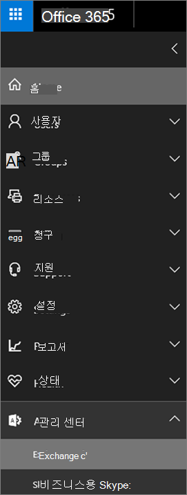

# <a name="set-up-an-archive-and-deletion-policy-for-mailboxes-in-your-organization"></a><span data-ttu-id="b7bf0-103">조직에서 사서함에 대한 보관 및 삭제 정책 설정하기</span><span class="sxs-lookup"><span data-stu-id="b7bf0-103">Set up an archive and deletion policy for mailboxes in your organization</span></span>

<span data-ttu-id="b7bf0-104">Microsoft 365에서 관리자는 항목을 사용자의 보관 사서함으로 자동으로 이동 하 고 사서함에서 항목을 자동으로 삭제 하는 보관 및 삭제 정책을 만들 수 있습니다.</span><span class="sxs-lookup"><span data-stu-id="b7bf0-104">In Microsoft 365, admins can create an archiving and deletion policy that automatically moves items to a user's archive mailbox and automatically deletes items from the mailbox.</span></span> <span data-ttu-id="b7bf0-105">관리자는 사서함에 할당 된 보존 정책을 만들고 항목을 특정 기간이 지난 후에 사용자의 보관 사서함으로 이동 하 고 특정 보존 기간에 도달한 후에도 사서함에서 항목을 삭제 하 여이를 수행 합니다.</span><span class="sxs-lookup"><span data-stu-id="b7bf0-105">The admin does this by creating a retention policy that's assigned to mailboxes, and moves items to a user's archive mailbox after a certain period of time and that also deletes items from the mailbox after they reach a certain age limit.</span></span> <span data-ttu-id="b7bf0-106">이동 하거나 삭제할 항목을 결정 하는 실제 규칙을 보존 태그 라고 합니다.</span><span class="sxs-lookup"><span data-stu-id="b7bf0-106">The actual rules that determine what items are moved or deleted and when that happens are called retention tags.</span></span> <span data-ttu-id="b7bf0-107">보존 태그는 보존 정책에 연결 되며, 그러면 해당 사용자의 사서함에 지정 됩니다.</span><span class="sxs-lookup"><span data-stu-id="b7bf0-107">Retention tags are linked to a retention policy, that in turn is assigned to a user's mailbox.</span></span> <span data-ttu-id="b7bf0-108">보존 태그는 사용자 사서함의 개별 메시지 및 폴더에 보존 설정을 적용 합니다.</span><span class="sxs-lookup"><span data-stu-id="b7bf0-108">A retention tag applies retention settings to individual messages and folders in a user's mailbox.</span></span> <span data-ttu-id="b7bf0-109">메시지가 사서함에 남아 있는 기간 및 메시지가 지정 된 보존 기간에 도달할 때 수행 되는 작업을 정의 합니다.</span><span class="sxs-lookup"><span data-stu-id="b7bf0-109">It defines how long a message remains in the mailbox and what action is taken when the message reaches the specified retention age.</span></span> <span data-ttu-id="b7bf0-110">메시지가 보존 기간에 도달 하면 해당 메시지는 사용자의 보관 사서함으로 이동 되거나 삭제 됩니다.</span><span class="sxs-lookup"><span data-stu-id="b7bf0-110">When a message reaches its retention age, it's either moved to the user's archive mailbox or it's deleted.</span></span>
  
<span data-ttu-id="b7bf0-111">이 문서에서 설명 하는 단계에서는 알파인 House 라는 가상의 조직에 대 한 보관 및 보존 정책을 설정 합니다.</span><span class="sxs-lookup"><span data-stu-id="b7bf0-111">The steps in this article will set up an archiving and retention policy for a fictitious organization named Alpine House.</span></span> <span data-ttu-id="b7bf0-112">이 정책 설정에는 다음과 같은 작업이 포함 됩니다.</span><span class="sxs-lookup"><span data-stu-id="b7bf0-112">Setting up this policy includes the following tasks:</span></span>
  
- <span data-ttu-id="b7bf0-113">조직의 모든 사용자에 대해 보관 사서함을 사용 하도록 설정</span><span class="sxs-lookup"><span data-stu-id="b7bf0-113">Enabling an archive mailbox for every user in the organization.</span></span> <span data-ttu-id="b7bf0-114">이는 사용자에 게 추가 사서함 저장소를 제공 하며, 보존 정책이 항목을 보관 사서함으로 이동할 수 있도록 하는 데 필요 합니다.</span><span class="sxs-lookup"><span data-stu-id="b7bf0-114">This gives users addition mailbox storage, and is required so that a retention policy can move items to the archive mailbox.</span></span> <span data-ttu-id="b7bf0-115">또한 사용자가 보관 사서함으로 항목을 이동 하 여 보관 정보를 저장할 수 있습니다.</span><span class="sxs-lookup"><span data-stu-id="b7bf0-115">It also lets a user store archival information by moving items to their archive mailbox.</span></span>

- <span data-ttu-id="b7bf0-116">다음을 수행 하는 세 가지 사용자 지정 보존 태그를 만듭니다.</span><span class="sxs-lookup"><span data-stu-id="b7bf0-116">Creating three custom retention tags that do the following:</span></span>

  - <span data-ttu-id="b7bf0-117">3 년이 지난 항목을 사용자의 보관 사서함으로 자동으로 이동 합니다.</span><span class="sxs-lookup"><span data-stu-id="b7bf0-117">Automatically moves items that are 3 years old to the user's archive mailbox.</span></span> <span data-ttu-id="b7bf0-118">보관 사서함으로 항목을 이동 하면 사용자의 기본 사서함에 공간이 확보 됩니다.</span><span class="sxs-lookup"><span data-stu-id="b7bf0-118">Moving items to the archive mailbox frees up space in a user's primary mailbox.</span></span>

  - <span data-ttu-id="b7bf0-119">지운 편지함 폴더에서 5 년 동안 지난 항목을 자동으로 삭제 합니다.</span><span class="sxs-lookup"><span data-stu-id="b7bf0-119">Automatically deletes items that are 5 years old from the Deleted Items folder.</span></span> <span data-ttu-id="b7bf0-120">이렇게 하면 사용자의 기본 사서함에 있는 공간도 모두 확보할 수 있습니다.</span><span class="sxs-lookup"><span data-stu-id="b7bf0-120">This also frees up space in the user's primary mailbox.</span></span> <span data-ttu-id="b7bf0-121">필요한 경우 사용자는 이러한 항목을 복구할 수 있습니다.</span><span class="sxs-lookup"><span data-stu-id="b7bf0-121">User's will have the opportunity to recover these items if necessary.</span></span> <span data-ttu-id="b7bf0-122">자세한 [내용은 추가 정보](#more-information) 섹션의 각주를 참조 하세요.</span><span class="sxs-lookup"><span data-stu-id="b7bf0-122">See the footnote in the [More information](#more-information) section for more details.</span></span> 

  - <span data-ttu-id="b7bf0-123">자동으로 (및 영구적으로) 기본 사서함과 보관 편지함 모두에서 7 년이 지난 항목을 삭제 합니다.</span><span class="sxs-lookup"><span data-stu-id="b7bf0-123">Automatically (and permanently) deletes items that are 7 years old from both the primary and archive mailbox.</span></span> <span data-ttu-id="b7bf0-124">규정 준수 규정에 따라 일부 조직은 일정 기간 동안 전자 메일을 보존 해야 합니다.</span><span class="sxs-lookup"><span data-stu-id="b7bf0-124">Because of compliance regulations, some organization's are required to retain email for a certain period of time.</span></span> <span data-ttu-id="b7bf0-125">이 기간이 만료 되 면 조직은 이러한 항목 사용자 사서함을 영구적으로 제거 하고자 할 수 있습니다.</span><span class="sxs-lookup"><span data-stu-id="b7bf0-125">After this time period expires, an organization might want to permanently remove these items user mailboxes.</span></span>

- <span data-ttu-id="b7bf0-126">새 보존 정책을 만들고 여기에 새 사용자 지정 보존 태그를 추가 합니다.</span><span class="sxs-lookup"><span data-stu-id="b7bf0-126">Creating a new retention policy and adding the new custom retention tags to it.</span></span> <span data-ttu-id="b7bf0-127">또한 새 보존 정책에 기본 제공 보존 태그를 추가 합니다.</span><span class="sxs-lookup"><span data-stu-id="b7bf0-127">Additionally, you'll also add built-in retention tags to the new retention policy.</span></span> <span data-ttu-id="b7bf0-128">여기에는 사용자가 사서함의 항목에 할당할 수 있는 개인 태그가 포함 됩니다.</span><span class="sxs-lookup"><span data-stu-id="b7bf0-128">This includes personal tags that users can assign to items in their mailbox.</span></span> <span data-ttu-id="b7bf0-129">또한 사용자의 기본 사서함에 있는 복구 가능한 항목 폴더의 항목을 보관 사서함의 복구할 수 있는 항목 폴더로 이동 하는 보존 태그를 추가 합니다.</span><span class="sxs-lookup"><span data-stu-id="b7bf0-129">You'll also add a retention tag that moves items from the Recoverable Items folder in the user's primary mailbox to the Recoverable Items folder in their archive mailbox.</span></span> <span data-ttu-id="b7bf0-130">이렇게 하면 사서함을 보류할 때 사용자의 복구 가능한 항목 폴더에 포함 된 공간을 확보할 수 있습니다.</span><span class="sxs-lookup"><span data-stu-id="b7bf0-130">This helps free up space in a user's Recoverable Items folder when their mailbox is placed on hold.</span></span>

<span data-ttu-id="b7bf0-131">이 문서의 단계 중 일부 또는 전체를 수행 하 여 조직의 사서함에 대 한 보관 및 삭제 정책을 설정할 수 있습니다.</span><span class="sxs-lookup"><span data-stu-id="b7bf0-131">You can follow some or all of the steps in this article to set up an archive and deletion policy for mailboxes in your own organization.</span></span> <span data-ttu-id="b7bf0-132">조직의 모든 사서함에 대해이 프로세스를 구현 하기 전에 몇 개의 사서함에서이 과정을 테스트 하는 것이 좋습니다.</span><span class="sxs-lookup"><span data-stu-id="b7bf0-132">We recommend that you test this process on a few mailboxes before implementing it on all mailboxes in your organization.</span></span>
  
## <a name="before-you-set-up-an-archive-and-deletion-policy"></a><span data-ttu-id="b7bf0-133">보관 및 삭제 정책을 설정 하기 전에</span><span class="sxs-lookup"><span data-stu-id="b7bf0-133">Before you set up an archive and deletion policy</span></span>

- <span data-ttu-id="b7bf0-134">이 항목의 단계를 수행 하려면 조직의 전역 관리자 여야 합니다.</span><span class="sxs-lookup"><span data-stu-id="b7bf0-134">You have to be a global administrator in your organization to perform the steps in this topic.</span></span> 

- <span data-ttu-id="b7bf0-135">새 사용자 계정을 만들고 사용자에 게 Exchange Online 라이선스를 할당 하면 사용자에 대해 사서함이 자동으로 만들어집니다.</span><span class="sxs-lookup"><span data-stu-id="b7bf0-135">When you create a new user account and assign the user an Exchange Online license, a mailbox is automatically created for the user.</span></span> <span data-ttu-id="b7bf0-136">사서함을 만들 때 기본 MRM 정책 이라는 기본 보존 정책이 자동으로 할당 됩니다.</span><span class="sxs-lookup"><span data-stu-id="b7bf0-136">When the mailbox is created, it's automatically assigned a default retention policy, named Default MRM Policy.</span></span> <span data-ttu-id="b7bf0-137">이 문서에서는 새 보존 정책을 만들고이를 사용자 사서함에 할당 하 여 기본 MRM 정책을 대체 합니다.</span><span class="sxs-lookup"><span data-stu-id="b7bf0-137">In this article, you will create a new retention policy and then assign it to user mailboxes, replacing the Default MRM policy.</span></span> <span data-ttu-id="b7bf0-138">사서함에는 한 번에 하나의 보존 정책만 할당할 수 있습니다.</span><span class="sxs-lookup"><span data-stu-id="b7bf0-138">A mailbox can have only one retention policy assigned to it at any one time.</span></span>

- <span data-ttu-id="b7bf0-139">보존 태그 및 보존 정책에 대 한 자세한 내용은 Exchange Online의 보존 [태그 및 보존 정책을](https://go.microsoft.com/fwlink/p/?LinkId=404424)참조 하십시오.</span><span class="sxs-lookup"><span data-stu-id="b7bf0-139">To learn more about retention tags and retention policies in Exchange Online, see [Retention tags and retention policies](https://go.microsoft.com/fwlink/p/?LinkId=404424).</span></span>

## <a name="step-1-enable-archive-mailboxes-for-users"></a><span data-ttu-id="b7bf0-140">1 단계: 사용자에 대해 보관 사서함을 사용 하도록 설정</span><span class="sxs-lookup"><span data-stu-id="b7bf0-140">Step 1: Enable archive mailboxes for users</span></span>

<span data-ttu-id="b7bf0-141">첫 번째 단계는 조직의 각 사용자에 대해 보관 사서함을 사용 하도록 설정 하는 것입니다.</span><span class="sxs-lookup"><span data-stu-id="b7bf0-141">The first step is to enable the archive mailbox for each user in your organization.</span></span> <span data-ttu-id="b7bf0-142">"보관으로 이동" 보존 작업이 있는 보존 태그가 보존 기간이 만료 된 후에 항목을 이동할 수 있도록 사용자의 보관 사서함을 사용 하도록 설정 해야 합니다.</span><span class="sxs-lookup"><span data-stu-id="b7bf0-142">A user's archive mailbox has to be enabled so that a retention tag with a "Move to Archive" retention action can move the item after the retention age expires.</span></span>
  
> [!NOTE]
> <span data-ttu-id="b7bf0-143">이 프로세스 중에는 프로세스를 완료 하기 전에 일정 시점이 되 면 언제 든 지 보관 사서함을 사용 하도록 설정할 수 있습니다.</span><span class="sxs-lookup"><span data-stu-id="b7bf0-143">You can enable archive mailboxes any time during this process, just as long as they're enabled at some point before you complete the process.</span></span> <span data-ttu-id="b7bf0-144">보관 사서함이 사용 하도록 설정 되지 않은 경우에는 보관 또는 삭제 정책이 할당 된 모든 항목에 대해 아무 작업도 수행 되지 않습니다.</span><span class="sxs-lookup"><span data-stu-id="b7bf0-144">If an archive mailbox isn't enabled, no action is taken on any items that have an archive or deletion policy assigned to it.</span></span>
  
1. <span data-ttu-id="b7bf0-145">[https://protection.office.com](https://protection.office.com)으로 이동합니다.</span><span class="sxs-lookup"><span data-stu-id="b7bf0-145">Go to [https://protection.office.com](https://protection.office.com).</span></span>

2. <span data-ttu-id="b7bf0-146">전역 관리자 계정을 사용 하 여 로그인 합니다.</span><span class="sxs-lookup"><span data-stu-id="b7bf0-146">Sign in using your global administrator account.</span></span>
    
3. <span data-ttu-id="b7bf0-147">보안 & 준수 센터에서 **정보 거 버 넌 스** \> **아카이브로**이동 합니다.</span><span class="sxs-lookup"><span data-stu-id="b7bf0-147">In the Security & Compliance Center, go to **Information governance** \> **Archive**.</span></span>

    <span data-ttu-id="b7bf0-148">조직의 사서함 목록과 해당 보관 사서함의 사용 가능 여부가 표시 됩니다.</span><span class="sxs-lookup"><span data-stu-id="b7bf0-148">A list of the mailboxes in your organization is displayed and whether the corresponding archive mailbox is enabled or disabled.</span></span>

4. <span data-ttu-id="b7bf0-149">목록에서 첫 번째 항목을 클릭 하 고 **Shift** 키를 누른 채 목록에서 마지막 항목을 클릭 하 여 모든 사서함을 선택 합니다.</span><span class="sxs-lookup"><span data-stu-id="b7bf0-149">Select all the mailboxes by clicking on the first one in the list, holding down the **Shift** key, and then clicking the last one in the list.</span></span>

    > [!TIP]
    > <span data-ttu-id="b7bf0-150">이 단계에서는 보관 사서함을 사용 하지 않는 것으로 가정 합니다.</span><span class="sxs-lookup"><span data-stu-id="b7bf0-150">This step assumes that no archive mailboxes are enabled.</span></span> <span data-ttu-id="b7bf0-151">보관 함이 사용 하도록 설정 된 사서함이 있는 경우 **Ctrl** 키를 누른 상태에서 사용 하지 않도록 설정 된 보관 사서함이 있는 각 사서함을 클릭 합니다.</span><span class="sxs-lookup"><span data-stu-id="b7bf0-151">If you have any mailboxes with the archive enabled, hold down the **Ctrl** key and click each mailbox that has a disabled archive mailbox.</span></span> <span data-ttu-id="b7bf0-152">또는 사서함 열 머리글을 클릭 **하 여 보관** 사서함을 사용 하거나 사용 하지 않도록 설정할 수 있는지 여부에 따라 행을 정렬할 수도 있습니다.</span><span class="sxs-lookup"><span data-stu-id="b7bf0-152">Or you can click the **Archive mailbox** column header to sort the rows based on whether the archive mailbox is enabled or disabled to make it easier to select mailboxes.</span></span>
  
5. <span data-ttu-id="b7bf0-153">세부 정보 창의 **대량 편집**에서 **사용**을 클릭 합니다.</span><span class="sxs-lookup"><span data-stu-id="b7bf0-153">In the details pane, under **Bulk Edit**, click **Enable**.</span></span>

    <span data-ttu-id="b7bf0-154">2 년 보다 오래 된 항목이 새 보관 사서함으로 이동 됨을 알리는 경고 메시지가 표시 됩니다.</span><span class="sxs-lookup"><span data-stu-id="b7bf0-154">A warning is displayed saying that items that are older than two years will be moved to the new archive mailbox.</span></span> <span data-ttu-id="b7bf0-155">이는 만들어질 때 새 사용자 사서함이 할당 된 기본 보존 정책에 보존 기간이 2 년 인 보관 기본 정책 태그가 있는 경우입니다.</span><span class="sxs-lookup"><span data-stu-id="b7bf0-155">This is because the default retention policy that's assigned a new user mailbox when it's created has an archive default policy tag that has a retention age of 2 years.</span></span> <span data-ttu-id="b7bf0-156">2 단계에서 만드는 사용자 지정 보관 기본 정책 태그의 보존 기간은 3 년입니다.</span><span class="sxs-lookup"><span data-stu-id="b7bf0-156">The custom archive default policy tag that you'll create in Step 2 has a retention age of 3 years.</span></span> <span data-ttu-id="b7bf0-157">즉, 3 년이 지난 항목은 보관 사서함으로 이동 됩니다.</span><span class="sxs-lookup"><span data-stu-id="b7bf0-157">That means items that are 3 years or older will be moved to the archive mailbox.</span></span>

6. <span data-ttu-id="b7bf0-158">**예** 를 클릭 하 여 경고 메시지를 닫고 선택한 각 사서함에 대해 보관 사서함을 사용 하도록 설정 하는 프로세스를 시작 합니다.</span><span class="sxs-lookup"><span data-stu-id="b7bf0-158">Click **Yes** to close the warning message and start the process to enable the archive mailbox for each selected mailbox.</span></span>

7. <span data-ttu-id="b7bf0-159">프로세스가 완료 되 면 새로 고침 새로 **고침**  을 클릭 하 여 **보관** 페이지에서 목록을 업데이트 합니다.</span><span class="sxs-lookup"><span data-stu-id="b7bf0-159">When the process is complete, click **Refresh**  to update the list on the **Archive** page.</span></span> 

    <span data-ttu-id="b7bf0-160">보관 사서함은 조직의 모든 사용자에 대해 사용 하도록 설정 됩니다.</span><span class="sxs-lookup"><span data-stu-id="b7bf0-160">The archive mailbox is enabled for all user's in your organization.</span></span>

    
  
8. <span data-ttu-id="b7bf0-162">보안 & 준수 센터를 열어 두세요.</span><span class="sxs-lookup"><span data-stu-id="b7bf0-162">Leave the Security & Compliance Center open.</span></span> <span data-ttu-id="b7bf0-163">다음 단계에서 사용할 예정입니다.</span><span class="sxs-lookup"><span data-stu-id="b7bf0-163">You'll use it in the next step.</span></span>

## <a name="step-2-create-new-retention-tags-for-the-archive-and-deletion-policies"></a><span data-ttu-id="b7bf0-164">2 단계: 보관 및 삭제 정책에 대 한 새 보존 태그 만들기</span><span class="sxs-lookup"><span data-stu-id="b7bf0-164">Step 2: Create new retention tags for the archive and deletion policies</span></span>

<span data-ttu-id="b7bf0-165">이 단계에서는 앞에서 설명한 세 가지 사용자 지정 보존 태그를 만듭니다.</span><span class="sxs-lookup"><span data-stu-id="b7bf0-165">In this step, you'll create the three custom retention tags that were previously described.</span></span>
  
- <span data-ttu-id="b7bf0-166">알파인 하우스 3 년 후 보관 함으로 이동 (사용자 지정 보관 정책)</span><span class="sxs-lookup"><span data-stu-id="b7bf0-166">Alpine House 3 Year Move to Archive (custom archive policy)</span></span>

- <span data-ttu-id="b7bf0-167">알파인 하우스 7 년 영구적 삭제 (사용자 지정 삭제 정책)</span><span class="sxs-lookup"><span data-stu-id="b7bf0-167">Alpine House 7 Year Permanently Delete (custom deletion policy)</span></span>

- <span data-ttu-id="b7bf0-168">알파인 집 삭제 된 항목 5 년 후 복구 허용 (지운 편지함 폴더에 대 한 사용자 지정 태그)</span><span class="sxs-lookup"><span data-stu-id="b7bf0-168">Alpine House Deleted Items 5 Years Delete and Allow Recovery (custom tag for the Deleted Items folder)</span></span>

<span data-ttu-id="b7bf0-169">새 보존 태그를 만들려면 Exchange Online 조직에서 EAC (Exchange 관리 센터)를 사용 합니다.</span><span class="sxs-lookup"><span data-stu-id="b7bf0-169">To create new retention tags, you'll use the Exchange admin center (EAC) in your Exchange Online organization.</span></span>
  
1. <span data-ttu-id="b7bf0-170">보안 & 준수 센터의 왼쪽 위 모서리에 있는 앱 시작 관리자를 클릭 하 고 **관리** 타일을 클릭 합니다.</span><span class="sxs-lookup"><span data-stu-id="b7bf0-170">In the Security & Compliance Center, click the app launcher  in the upper left corner, and then click the **Admin** tile.</span></span>

2. <span data-ttu-id="b7bf0-171">Microsoft 365 관리 센터의 왼쪽 탐색 창에서 **관리 센터**를 클릭 한 다음 **Exchange**를 클릭 합니다.</span><span class="sxs-lookup"><span data-stu-id="b7bf0-171">In the left navigation pane of the Microsoft 365 admin center, click **Admin centers**, and then click **Exchange**.</span></span>

    
  
3. <span data-ttu-id="b7bf0-173">EAC에서 **준수 관리** \> **보존 태그로** 이동 합니다.</span><span class="sxs-lookup"><span data-stu-id="b7bf0-173">In the EAC, go to **Compliance management** \> **Retention tags**</span></span>

    <span data-ttu-id="b7bf0-174">조직의 보존 태그 목록이 표시 됩니다.</span><span class="sxs-lookup"><span data-stu-id="b7bf0-174">A list of the retention tags for your organization is displayed.</span></span>

### <a name="create-a-custom-archive-default-policy-tag"></a><span data-ttu-id="b7bf0-175">사용자 지정 보관 함 기본 정책 태그 만들기</span><span class="sxs-lookup"><span data-stu-id="b7bf0-175">Create a custom archive default policy tag</span></span>
  
<span data-ttu-id="b7bf0-176">먼저 3 년 후에 항목을 보관 사서함으로 이동 하는 사용자 지정 보관 DPT (기본 정책 태그)를 만듭니다.</span><span class="sxs-lookup"><span data-stu-id="b7bf0-176">First, you'll create a custom archive default policy tag (DPT) that will move items to the archive mailbox after 3 years.</span></span>
  
1. <span data-ttu-id="b7bf0-177">**보존 태그** 페이지에서 새 **태그**  다음 **전체 사서함에 자동으로 적용을 선택 합니다 (기본값)**.</span><span class="sxs-lookup"><span data-stu-id="b7bf0-177">On the **Retention tags** page, click **New tag**, and then select **applied automatically to entire mailbox (default)**.</span></span>

2. <span data-ttu-id="b7bf0-178">**전체 사서함에 자동으로 적용 되는 새 태그 (기본값)** 페이지에서 다음 필드를 작성 합니다.</span><span class="sxs-lookup"><span data-stu-id="b7bf0-178">On the **New tag applied automatically to entire mailbox (default)** page, complete the following fields:</span></span> 

    
  
   1. <span data-ttu-id="b7bf0-180">**이름** 새 보존 태그의 이름을 입력 합니다.</span><span class="sxs-lookup"><span data-stu-id="b7bf0-180">**Name** Type a name for the new retention tag.</span></span> 

   2. <span data-ttu-id="b7bf0-181">**보존 작업** 보존 기간이 만료 되 면 보관 사서함으로 항목을 이동 하려면 **보관 함으로 이동을** 선택 합니다.</span><span class="sxs-lookup"><span data-stu-id="b7bf0-181">**Retention action** Select **Move to Archive** to move items to the archive mailbox when the retention period expires.</span></span>

   3. <span data-ttu-id="b7bf0-182">**보존 기간** **항목이 다음 연령 (일)에 도달한 경우**를 선택 하 고 보존 기간 기간을 입력 합니다.</span><span class="sxs-lookup"><span data-stu-id="b7bf0-182">**Retention period** Select **When the item reaches the following age (in days)**, and then enter the duration of the retention period.</span></span> <span data-ttu-id="b7bf0-183">이 시나리오에서 항목은 1095 일 (3 년) 후에 보관 사서함으로 이동 됩니다.</span><span class="sxs-lookup"><span data-stu-id="b7bf0-183">For this scenario, items will be moved to the archive mailbox after 1095 days (3 years).</span></span>

   4. <span data-ttu-id="b7bf0-184">**설명** (선택 사항) 사용자 지정 보존 태그의 목적을 설명 하는 설명을 입력 합니다.</span><span class="sxs-lookup"><span data-stu-id="b7bf0-184">**Comment** (Optional) Type a comment that explains the purpose of the custom retention tag.</span></span>

3. <span data-ttu-id="b7bf0-185">**저장** 을 클릭 하 여 사용자 지정 보관 DPT를 만듭니다.</span><span class="sxs-lookup"><span data-stu-id="b7bf0-185">Click **Save** to create the custom archive DPT.</span></span>

    <span data-ttu-id="b7bf0-186">새 보관 DPT가 보존 태그 목록에 표시 됩니다.</span><span class="sxs-lookup"><span data-stu-id="b7bf0-186">The new archive DPT is displayed in the list of retention tags.</span></span>

### <a name="create-a-custom-deletion-default-policy-tag"></a><span data-ttu-id="b7bf0-187">사용자 지정 삭제 기본 정책 태그 만들기</span><span class="sxs-lookup"><span data-stu-id="b7bf0-187">Create a custom deletion default policy tag</span></span>
  
<span data-ttu-id="b7bf0-188">다음으로 다른 사용자 지정 DPT를 만들지만 7 년 후에 항목을 영구적으로 삭제 하는 삭제 정책이 됩니다.</span><span class="sxs-lookup"><span data-stu-id="b7bf0-188">Next, you'll create another custom DPT but this one will be a deletion policy that permanently deletes items after 7 years.</span></span>
  
1. <span data-ttu-id="b7bf0-189">**보존 태그** 페이지에서 새 **태그**  다음 **전체 사서함에 자동으로 적용을 선택 합니다 (기본값)**.</span><span class="sxs-lookup"><span data-stu-id="b7bf0-189">On the **Retention tags** page, click **New tag**, and then select **applied automatically to entire mailbox (default)**.</span></span>

2. <span data-ttu-id="b7bf0-190">**전체 사서함에 자동으로 적용 되는 새 태그 (기본값)** 페이지에서 다음 필드를 작성 합니다.</span><span class="sxs-lookup"><span data-stu-id="b7bf0-190">On the **New tag applied automatically to entire mailbox (default)** page, complete the following fields:</span></span> 

    
  
   1. <span data-ttu-id="b7bf0-192">**이름** 새 보존 태그의 이름을 입력 합니다.</span><span class="sxs-lookup"><span data-stu-id="b7bf0-192">**Name** Type a name for the new retention tag.</span></span> 

   2. <span data-ttu-id="b7bf0-193">**보존 작업** 보존 기간이 만료 되는 경우 사서함에서 항목을 제거 하려면 **영구적으로 삭제** 를 선택 합니다.</span><span class="sxs-lookup"><span data-stu-id="b7bf0-193">**Retention action** Select **Permanently Delete** to purge items from the mailbox when the retention period expires.</span></span>

   3. <span data-ttu-id="b7bf0-194">**보존 기간** **항목이 다음 연령 (일)에 도달한 경우**를 선택 하 고 보존 기간 기간을 입력 합니다.</span><span class="sxs-lookup"><span data-stu-id="b7bf0-194">**Retention period** Select **When the item reaches the following age (in days)**, and then enter the duration of the retention period.</span></span> <span data-ttu-id="b7bf0-195">이 시나리오의 경우 2555 일 (7 년) 후에 항목이 제거 됩니다.</span><span class="sxs-lookup"><span data-stu-id="b7bf0-195">For this scenario, items will be purged after 2555 days (7 years).</span></span>

   4. <span data-ttu-id="b7bf0-196">**설명** (선택 사항) 사용자 지정 보존 태그의 목적을 설명 하는 설명을 입력 합니다.</span><span class="sxs-lookup"><span data-stu-id="b7bf0-196">**Comment** (Optional) Type a comment that explains the purpose of the custom retention tag.</span></span> 

3. <span data-ttu-id="b7bf0-197">**저장** 을 클릭 하 여 사용자 지정 삭제 DPT를 만듭니다.</span><span class="sxs-lookup"><span data-stu-id="b7bf0-197">Click **Save** to create the custom deletion DPT.</span></span> 

    <span data-ttu-id="b7bf0-198">새 삭제 DPT 보존 태그 목록에 표시 됩니다.</span><span class="sxs-lookup"><span data-stu-id="b7bf0-198">The new deletion DPT is displayed in the list of retention tags.</span></span>

### <a name="create-a-custom-retention-policy-tag-for-the-deleted-items-folder"></a><span data-ttu-id="b7bf0-199">지운 편지함 폴더에 대 한 사용자 지정 보존 정책 태그 만들기</span><span class="sxs-lookup"><span data-stu-id="b7bf0-199">Create a custom retention policy tag for the Deleted Items folder</span></span>
  
<span data-ttu-id="b7bf0-200">마지막으로 만들 보존 태그는 지운 편지함 폴더에 대 한 사용자 지정 보존 정책 태그 (RPT)입니다.</span><span class="sxs-lookup"><span data-stu-id="b7bf0-200">The last retention tag that you'll create is a custom retention policy tag (RPT) for the Deleted Items folder.</span></span> <span data-ttu-id="b7bf0-201">이 태그는 5 년 후에 지운 편지함 폴더의 항목을 삭제 하 고 사용자가 지운 편지함 복구 도구를 사용 하 여 항목을 복구할 수 있는 복구 기간을 제공 합니다.</span><span class="sxs-lookup"><span data-stu-id="b7bf0-201">This tag will delete items in the Deleted Items folder after 5 years, and provides a recovery period when users can use the Recover Deleted Items tool to recover an item.</span></span>
  
1. <span data-ttu-id="b7bf0-202">**보존 태그** 페이지에서 새 **태그**  다음 **기본 폴더에 자동으로 적용**을 선택 합니다.</span><span class="sxs-lookup"><span data-stu-id="b7bf0-202">On the **Retention tags** page, click **New tag** , and then select **applied automatically to a default folder**.</span></span>

2. <span data-ttu-id="b7bf0-203">**자동으로 기본 폴더 페이지에 적용 된 새 태그** 에서 다음 필드를 작성 합니다.</span><span class="sxs-lookup"><span data-stu-id="b7bf0-203">On the **New tag applied automatically to a default folder** page, complete the following fields:</span></span>

    
  
   1. <span data-ttu-id="b7bf0-205">**이름** 새 보존 태그의 이름을 입력 합니다.</span><span class="sxs-lookup"><span data-stu-id="b7bf0-205">**Name** Type a name for the new retention tag.</span></span> 

   2. <span data-ttu-id="b7bf0-206">**다음 기본 폴더에이 태그 적용** 드롭다운 목록에서 **삭제 된 항목**을 선택 합니다.</span><span class="sxs-lookup"><span data-stu-id="b7bf0-206">**Apply this tag to the following default folder** In the drop-down list, select **Deleted Items**.</span></span>

   3. <span data-ttu-id="b7bf0-207">**보존 작업** **삭제 및 복구 허용** 보존 기간이 만료 되는 경우 항목을 삭제 하 고, 사용자는 삭제 된 항목 보존 기간 (기본적으로 14 일) 내에 삭제 된 항목을 복구할 수 있도록 합니다.</span><span class="sxs-lookup"><span data-stu-id="b7bf0-207">**Retention action** Select **Delete and Allow Recovery** to delete items when the retention period expires, but allow users to recover a deleted item within the deleted item retention period (which by default is 14 days).</span></span>

   4. <span data-ttu-id="b7bf0-208">**보존 기간** **항목이 다음 연령 (일)에 도달한 경우**를 선택 하 고 보존 기간 기간을 입력 합니다.</span><span class="sxs-lookup"><span data-stu-id="b7bf0-208">**Retention period** Select **When the item reaches the following age (in days)**, and then enter the duration of the retention period.</span></span> <span data-ttu-id="b7bf0-209">이 시나리오에서는 1825 일 (5 년) 후에 항목이 삭제 됩니다.</span><span class="sxs-lookup"><span data-stu-id="b7bf0-209">For this scenario, items will be deleted after 1825 days (5 years).</span></span>

   5. <span data-ttu-id="b7bf0-210">**설명** (선택 사항) 사용자 지정 보존 태그의 목적을 설명 하는 설명을 입력 합니다.</span><span class="sxs-lookup"><span data-stu-id="b7bf0-210">**Comment** (Optional) Type a comment that explains the purpose of the custom retention tag.</span></span> 

3. <span data-ttu-id="b7bf0-211">**저장** 을 클릭 하 여 지운 편지함 폴더에 대 한 사용자 지정 RPT를 만듭니다.</span><span class="sxs-lookup"><span data-stu-id="b7bf0-211">Click **Save** to create the custom RPT for the Deleted Items folder.</span></span>

    <span data-ttu-id="b7bf0-212">새 RPT가 보존 태그 목록에 표시 됩니다.</span><span class="sxs-lookup"><span data-stu-id="b7bf0-212">The new RPT is displayed in the list of retention tags.</span></span>

## <a name="step-3-create-a-new-retention-policy"></a><span data-ttu-id="b7bf0-213">3 단계: 새 보존 정책 만들기</span><span class="sxs-lookup"><span data-stu-id="b7bf0-213">Step 3: Create a new retention policy</span></span>

<span data-ttu-id="b7bf0-214">사용자 지정 보존 태그를 만든 후에는 새 보존 정책을 만들고 보존 태그를 추가 합니다.</span><span class="sxs-lookup"><span data-stu-id="b7bf0-214">After you create the custom retention tags, the next step is to create a new retention policy and add the retention tags.</span></span> <span data-ttu-id="b7bf0-215">2 단계에서 만든 세 개의 사용자 지정 보존 태그와 첫 번째 섹션에 언급 된 기본 제공 태그를 추가 합니다.</span><span class="sxs-lookup"><span data-stu-id="b7bf0-215">You'll add the three custom retention tags that you created in Step 2, and the built-in tags that were mentioned in the first section.</span></span> <span data-ttu-id="b7bf0-216">4 단계에서는이 새로운 보존 정책을 사용자 사서함에 할당 합니다.</span><span class="sxs-lookup"><span data-stu-id="b7bf0-216">In Step 4, you'll assign this new retention policy to user mailboxes.</span></span>
  
1. <span data-ttu-id="b7bf0-217">EAC에서 **규정 준수 관리** \> **보존 정책**으로 이동 합니다.</span><span class="sxs-lookup"><span data-stu-id="b7bf0-217">In the EAC, go to **Compliance management** \> **Retention policies**.</span></span>

2. <span data-ttu-id="b7bf0-218">**보존 정책** 페이지에서 **새로**  합니다.</span><span class="sxs-lookup"><span data-stu-id="b7bf0-218">On the **Retention policies** page, click **New** .</span></span>

3. <span data-ttu-id="b7bf0-219">**이름** 상자에 새 보존 정책의 이름을 입력 합니다. 예를 들면 **알파인 하우스 보관 및 삭제 정책**입니다.</span><span class="sxs-lookup"><span data-stu-id="b7bf0-219">In the **Name** box, type a name for the new retention policy; for example, **Alpine House Archive and Deletion Policy**.</span></span>

4. <span data-ttu-id="b7bf0-220">**보존 태그**에서 새 아이콘 **추가** 를 클릭  합니다.</span><span class="sxs-lookup"><span data-stu-id="b7bf0-220">Under **Retention tags**, click **Add** .</span></span>

    <span data-ttu-id="b7bf0-221">조직의 보존 태그 목록이 표시 됩니다.</span><span class="sxs-lookup"><span data-stu-id="b7bf0-221">A list of the retention tags in your organization is displayed.</span></span> <span data-ttu-id="b7bf0-222">참고 2 단계에서 만든 사용자 지정 태그가 표시 됩니다.</span><span class="sxs-lookup"><span data-stu-id="b7bf0-222">Note the custom tags that you created in Step 2 are displayed.</span></span>

5. <span data-ttu-id="b7bf0-223">다음 스크린샷에서 강조 표시 된 9 개의 보존 태그를 추가 합니다 (추가 [정보](#more-information) 섹션에서는 이러한 태그에 대해 자세히 설명 됨).</span><span class="sxs-lookup"><span data-stu-id="b7bf0-223">Add the 9 retention tags that are highlighted in the following screenshot (these tags are described in more detail in the [More information](#more-information) section).</span></span> <span data-ttu-id="b7bf0-224">보존 태그를 추가 하려면 선택 하 고 **추가**를 클릭 합니다.</span><span class="sxs-lookup"><span data-stu-id="b7bf0-224">To add a retention tag, select it and then click **Add**.</span></span>

    
  
    > [!TIP]
    > <span data-ttu-id="b7bf0-226">**Ctrl** 키를 누른 상태에서 각 태그를 클릭 하면 여러 개의 보존 태그를 선택할 수 있습니다.</span><span class="sxs-lookup"><span data-stu-id="b7bf0-226">You can select multiple retention tags by holding down the **Ctrl** key and then clicking each tag.</span></span> 
  
6. <span data-ttu-id="b7bf0-227">보존 태그를 추가한 후에 **확인**을 클릭 합니다.</span><span class="sxs-lookup"><span data-stu-id="b7bf0-227">After you've added the retention tags, click **OK**.</span></span>

7. <span data-ttu-id="b7bf0-228">**새 보존 정책** 페이지에서 **저장** 을 클릭 하 여 새 정책을 만듭니다.</span><span class="sxs-lookup"><span data-stu-id="b7bf0-228">On the **New retention policy** page, click **Save** to create the new policy.</span></span>

    <span data-ttu-id="b7bf0-229">새 보존 정책이 목록에 표시 됩니다.</span><span class="sxs-lookup"><span data-stu-id="b7bf0-229">The new retention policy is displayed in the list.</span></span> <span data-ttu-id="b7bf0-230">세부 정보 창에 연결 된 보존 태그를 표시 하려면이 항목을 선택 합니다.</span><span class="sxs-lookup"><span data-stu-id="b7bf0-230">Select it to display the retention tags linked to it in the details pane.</span></span>

    
  
## <a name="step-4-assign-the-new-retention-policy-to-user-mailboxes"></a><span data-ttu-id="b7bf0-232">4 단계: 사용자 사서함에 새 보존 정책 할당</span><span class="sxs-lookup"><span data-stu-id="b7bf0-232">Step 4: Assign the new retention policy to user mailboxes</span></span>

<span data-ttu-id="b7bf0-233">새 사서함을 만들 때 기본 MRM 정책 이라는 보존 정책이 기본적으로 할당 됩니다.</span><span class="sxs-lookup"><span data-stu-id="b7bf0-233">When a new mailbox is created, a retention policy named Default MRM policy is assigned to it by default.</span></span> <span data-ttu-id="b7bf0-234">이 단계에서는 3 단계에서 만든 새 보존 정책을 조직의 사용자 사서함에 할당 하 여 사서함에 보존 정책이 하나만 있을 수 있으므로이 보존 정책을 대체 합니다.</span><span class="sxs-lookup"><span data-stu-id="b7bf0-234">In this step, you'll replace this retention policy (because a mailbox can have only one retention policy assigned to it) by assigning the new retention policy that you created in Step 3 to the user mailboxes in your organization.</span></span> <span data-ttu-id="b7bf0-235">이 단계에서는 조직의 모든 사서함에 새 정책을 할당 한다고 가정 합니다.</span><span class="sxs-lookup"><span data-stu-id="b7bf0-235">This step assumes that you'll assign the new policy to all mailboxes in your organization.</span></span>
  
1. <span data-ttu-id="b7bf0-236">EAC에서 **받는 사람** \> **사서함**으로 이동합니다.</span><span class="sxs-lookup"><span data-stu-id="b7bf0-236">In the EAC, go to **Recipients** \> **Mailboxes**.</span></span>

    <span data-ttu-id="b7bf0-237">조직의 모든 사용자 사서함 목록이 표시 됩니다.</span><span class="sxs-lookup"><span data-stu-id="b7bf0-237">A list of all user mailboxes in your organization is displayed.</span></span>

2. <span data-ttu-id="b7bf0-238">목록에서 첫 번째 항목을 클릭 하 고 **Shift** 키를 누른 채 목록에서 마지막 항목을 클릭 하 여 모든 사서함을 선택 합니다.</span><span class="sxs-lookup"><span data-stu-id="b7bf0-238">Select all the mailboxes by clicking on the first one in the list, holding down the **Shift** key, and then clicking the last one in the list.</span></span> 

3. <span data-ttu-id="b7bf0-239">EAC 오른쪽의 세부 정보 창에서 **대량 편집**아래에 있는 **기타 옵션**을 클릭 합니다.</span><span class="sxs-lookup"><span data-stu-id="b7bf0-239">In the details pane on the right side of the EAC, under **Bulk Edit**, click **More options**.</span></span>

4. <span data-ttu-id="b7bf0-240">**보존 정책**에서 **업데이트**를 클릭합니다.</span><span class="sxs-lookup"><span data-stu-id="b7bf0-240">Under **Retention Policy**, click **Update**.</span></span>

5. <span data-ttu-id="b7bf0-241">**보존 정책 대량 할당** 페이지의 **보존 정책 선택** 드롭다운 목록에서 3 단계에서 만든 보존 정책을 선택 합니다. 예를 들면 **알파인 House 보관 함 및 보존 정책**등이 있습니다.</span><span class="sxs-lookup"><span data-stu-id="b7bf0-241">On the **Bulk assign retention policy** page, in the **Select the retention policy** drop-down list, select the retention policy that you created in Step 3; for example, **Alpine House Archive and Retention Policy**.</span></span>

6. <span data-ttu-id="b7bf0-242">**저장** 을 클릭 하 여 새 보존 정책 할당을 저장 합니다.</span><span class="sxs-lookup"><span data-stu-id="b7bf0-242">Click **Save** to save the new retention policy assignment.</span></span>

7. <span data-ttu-id="b7bf0-243">새 보존 정책이 사서함에 할당 되었는지 확인 하려면 다음을 수행할 수 있습니다.</span><span class="sxs-lookup"><span data-stu-id="b7bf0-243">To verify that the new retention policy was assigned to mailboxes, you can do the following:</span></span>

   1. <span data-ttu-id="b7bf0-244">**사서함** 페이지에서 사서함을 선택한 다음 편집 **을 클릭**  합니다.</span><span class="sxs-lookup"><span data-stu-id="b7bf0-244">Select a mailbox on the **Mailboxes** page, and then click **Edit** .</span></span>

   2. <span data-ttu-id="b7bf0-245">선택한 사용자에 대 한 사서함 속성 페이지에서 **사서함 기능**을 클릭 합니다.</span><span class="sxs-lookup"><span data-stu-id="b7bf0-245">On the mailbox properties page for the selected user, click **Mailbox features**.</span></span>

   <span data-ttu-id="b7bf0-246">사서함에 할당 된 새 정책의 이름이 **보존 정책** 드롭다운 목록에 표시 됩니다.</span><span class="sxs-lookup"><span data-stu-id="b7bf0-246">The name of the new policy assigned to the mailbox is displayed in the **Retention policy** drop-down list.</span></span>

## <a name="optional-step-5-run-the-managed-folder-assistant-to-apply-the-new-settings"></a><span data-ttu-id="b7bf0-247">반드시 5 단계: 관리 되는 폴더 도우미를 실행 하 여 새 설정 적용</span><span class="sxs-lookup"><span data-stu-id="b7bf0-247">(Optional) Step 5: Run the Managed Folder Assistant to apply the new settings</span></span>

<span data-ttu-id="b7bf0-248">4 단계의 사서함에 새 보존 정책을 적용 하 고 나면 Exchange Online에서 새 보존 설정을 사서함에 적용 하는 데 최대 7 일이 걸릴 수 있습니다.</span><span class="sxs-lookup"><span data-stu-id="b7bf0-248">After you apply the new retention policy to mailboxes in Step 4, it can take up to 7 days in Exchange Online for the new retention settings to be applied to the mailboxes.</span></span> <span data-ttu-id="b7bf0-249">이는 관리 되는 폴더 도우미 라는 프로세스가 사서함을 7 일 마다 한 번씩 처리 하기 때문입니다.</span><span class="sxs-lookup"><span data-stu-id="b7bf0-249">This is because a process called the Managed Folder Assistant processes mailboxes once every 7 days.</span></span> <span data-ttu-id="b7bf0-250">관리 되는 폴더 도우미가 실행 될 때까지 기다리지 않고 Exchange Online PowerShell에서 **시작 관리자 (ManagedFolderAssistant cmdlet)** 를 실행 하 여이 작업이 강제로 수행 되도록 할 수 있습니다.</span><span class="sxs-lookup"><span data-stu-id="b7bf0-250">Instead of waiting for the Managed Folder Assistant to run, you can force this to happen by running the **Start-ManagedFolderAssistant** cmdlet in Exchange Online PowerShell.</span></span>
  
 <span data-ttu-id="b7bf0-251">**관리 되는 폴더 도우미를 실행할 때 어떤 일이 발생 합니까?**</span><span class="sxs-lookup"><span data-stu-id="b7bf0-251">**What happens when you run the Managed Folder Assistant?**</span></span> <span data-ttu-id="b7bf0-252">사서함의 항목을 조사 하 고 보존이 적용 되는지 여부를 결정 하 여 보존 정책의 설정을 적용 합니다.</span><span class="sxs-lookup"><span data-stu-id="b7bf0-252">It applies the settings in the retention policy by inspecting items in the mailbox and determining whether they're subject to retention.</span></span> <span data-ttu-id="b7bf0-253">그런 다음 해당 보존 태그를 사용 하 여 보존이 적용 되는 항목을 스탬프 처리 하 고 보존 기간이 지난 항목에 대해 지정 된 보존 작업을 수행 합니다.</span><span class="sxs-lookup"><span data-stu-id="b7bf0-253">It then stamps items subject to retention with the appropriate retention tag, and then takes the specified retention action on items past their retention age.</span></span>
  
<span data-ttu-id="b7bf0-254">다음은 Exchange Online PowerShell에 연결 하 고 조직의 모든 사서함에서 관리 되는 폴더 도우미를 실행 하는 단계입니다.</span><span class="sxs-lookup"><span data-stu-id="b7bf0-254">Here are the steps to connect to Exchange Online PowerShell, and then run the Managed Folder Assistant on every mailbox in your organization.</span></span>

1. <span data-ttu-id="b7bf0-255">[Exchange Online PowerShell에 연결합니다](https://go.microsoft.com/fwlink/p/?LinkId=517283).</span><span class="sxs-lookup"><span data-stu-id="b7bf0-255">[Connect to Exchange Online PowerShell](https://go.microsoft.com/fwlink/p/?LinkId=517283).</span></span>
  
2. <span data-ttu-id="b7bf0-256">조직의 모든 사용자 사서함에 대해 관리 되는 폴더 도우미를 시작 하려면 다음 두 명령을 실행 합니다.</span><span class="sxs-lookup"><span data-stu-id="b7bf0-256">Run the following two commands to start the Managed Folder Assistant for all user mailboxes in your organization.</span></span>

    ```powershell
    $Mailboxes = Get-Mailbox -ResultSize Unlimited -Filter {RecipientTypeDetails -eq "UserMailbox"}
    ```

    ```powershell
    $Mailboxes.Identity | Start-ManagedFolderAssistant
    ```

<span data-ttu-id="b7bf0-257">모두 완료되었습니다.</span><span class="sxs-lookup"><span data-stu-id="b7bf0-257">That's it!</span></span> <span data-ttu-id="b7bf0-258">알파인 집 조 직에 대 한 보관 및 삭제 정책을 설정 했습니다.</span><span class="sxs-lookup"><span data-stu-id="b7bf0-258">You've set up an archive and deletion policy for the Alpine House organization.</span></span>
  
## <a name="optional-step-6-make-the-new-retention-policy-the-default-for-your-organization"></a><span data-ttu-id="b7bf0-259">반드시 6 단계: 새 보존 정책을 조직의 기본값으로 설정</span><span class="sxs-lookup"><span data-stu-id="b7bf0-259">(Optional) Step 6: Make the new retention policy the default for your organization</span></span>

<span data-ttu-id="b7bf0-260">4 단계에서는 기존 사서함에 새 보존 정책을 할당 해야 합니다.</span><span class="sxs-lookup"><span data-stu-id="b7bf0-260">In Step 4, you have to assign the new retention policy to existing mailboxes.</span></span> <span data-ttu-id="b7bf0-261">하지만 새 보존 정책이 앞으로 만들어질 새 사서함에 할당 되도록 Exchange Online을 구성할 수 있습니다.</span><span class="sxs-lookup"><span data-stu-id="b7bf0-261">But you can configure Exchange Online so that the new retention policy is assigned to new mailboxes that are created in the future.</span></span> <span data-ttu-id="b7bf0-262">이 작업은 Exchange Online PowerShell을 사용 하 여 조직의 기본 사서함 계획을 업데이트 하는 방식으로 수행 합니다.</span><span class="sxs-lookup"><span data-stu-id="b7bf0-262">You do this by using Exchange Online PowerShell to update your organization's default mailbox plan.</span></span> <span data-ttu-id="b7bf0-263">*사서함 계획* 은 새 사서함에 대 한 속성을 자동으로 구성 하는 서식 파일입니다.</span><span class="sxs-lookup"><span data-stu-id="b7bf0-263">A *mailbox plan* is a template that automatically configures properties on new mailboxes.</span></span>  <span data-ttu-id="b7bf0-264">이 선택적 단계에서는 사서함 계획에 할당 된 현재 보존 정책 (기본적으로 기본 MRM 정책)을 3 단계에서 만든 보존 정책으로 바꿀 수 있습니다.</span><span class="sxs-lookup"><span data-stu-id="b7bf0-264">In this optional step, you can replace the current retention policy that's assigned to the mailbox plan (by default, the Default MRM Policy) with the retention policy that you created in Step 3.</span></span> <span data-ttu-id="b7bf0-265">사서함 요금제를 업데이트 하면 새 보존 정책이 새 사서함에 할당 됩니다.</span><span class="sxs-lookup"><span data-stu-id="b7bf0-265">After you update the mailbox plan, the new retention policy will be assigned to new mailboxes.</span></span>

1. <span data-ttu-id="b7bf0-266">[Exchange Online PowerShell에 연결합니다](https://go.microsoft.com/fwlink/p/?LinkId=517283).</span><span class="sxs-lookup"><span data-stu-id="b7bf0-266">[Connect to Exchange Online PowerShell](https://go.microsoft.com/fwlink/p/?LinkId=517283).</span></span>

2. <span data-ttu-id="b7bf0-267">다음 명령을 실행 하 여 조직의 사서함 계획에 대 한 정보를 표시 합니다.</span><span class="sxs-lookup"><span data-stu-id="b7bf0-267">Run the following command to display information about the mailbox plans in your organization.</span></span>

    ```powershell
    Get-MailboxPlan | Format-Table DisplayName,RetentionPolicy,IsDefault
    ```

    <span data-ttu-id="b7bf0-268">기본값으로 설정 된 사서함 요금제를 확인 합니다.</span><span class="sxs-lookup"><span data-stu-id="b7bf0-268">Note the mailbox plan that's set as the default.</span></span>

3. <span data-ttu-id="b7bf0-269">다음 명령을 실행 하 여 3 단계 (예: **알파인 하우스 보관 함 및 보존 정책**)에서 만든 새 보존 정책을 기본 사서함 요금제에 할당 합니다.</span><span class="sxs-lookup"><span data-stu-id="b7bf0-269">Run the following command to assign the new retention policy that you created in Step 3 (for example, **Alpine House Archive and Retention Policy**) to the default mailbox plan.</span></span> <span data-ttu-id="b7bf0-270">이 예에서는 기본 사서함 계획의 이름이 **ExchangeOnlineEnterprise**라고 가정 합니다.</span><span class="sxs-lookup"><span data-stu-id="b7bf0-270">This example assumes the name of the default mailbox plan is **ExchangeOnlineEnterprise**.</span></span>

    ```powershell
    Set-MailboxPlan "ExchangeOnlineEnterprise" -RetentionPolicy "Alpine House Archive and Retention Policy"
    ```

4. <span data-ttu-id="b7bf0-271">2 단계에서이 명령을 다시 실행 하 여 기본 사서함 계획에 할당 된 보존 정책이 변경 되었는지 확인할 수 있습니다.</span><span class="sxs-lookup"><span data-stu-id="b7bf0-271">You can rerun the command in step 2 to verify that the retention policy assigned to the default mailbox plan was changed.</span></span>

## <a name="more-information"></a><span data-ttu-id="b7bf0-272">추가 정보</span><span class="sxs-lookup"><span data-stu-id="b7bf0-272">More information</span></span>

- <span data-ttu-id="b7bf0-273">보존 기간은 어떻게 계산 됩니까?</span><span class="sxs-lookup"><span data-stu-id="b7bf0-273">How is retention age calculated?</span></span> <span data-ttu-id="b7bf0-274">사서함 항목의 보존 기간은 배달 날짜 또는 전송 되지 않았지만 사용자가 만든 임시 메시지 등의 항목에 대 한 만든 날짜부터 계산 됩니다.</span><span class="sxs-lookup"><span data-stu-id="b7bf0-274">The retention age of mailbox items is calculated from the date of delivery or the date of creation for items such as draft messages that aren't sent but are created by the user.</span></span> <span data-ttu-id="b7bf0-275">관리되는 폴더 도우미가 사서함의 항목을 처리할 때 보존 태그가 있는 모든 항목의 시작 날짜 및 만료 날짜에 삭제 및 복구 허용 또는 영구 삭제 보존 작업으로 스탬프 처리합니다.</span><span class="sxs-lookup"><span data-stu-id="b7bf0-275">When the Managed Folder Assistant processes items in a mailbox, it stamps a start date and an expiration date for all items that have retention tags with the Delete and Allow Recovery or Permanently Delete retention action.</span></span> <span data-ttu-id="b7bf0-276">보관 태그가 있는 항목은 이동 날짜로 스탬프 처리 됩니다.</span><span class="sxs-lookup"><span data-stu-id="b7bf0-276">Items that have an archive tag are stamped with a move date.</span></span> 

- <span data-ttu-id="b7bf0-277">다음 표에는이 항목의 단계를 수행 하 여 만든 사용자 지정 보존 정책에 추가 되는 각 보존 태그에 대 한 자세한 정보가 나와 있습니다.</span><span class="sxs-lookup"><span data-stu-id="b7bf0-277">The following table provides more information about each retention tag that is added to the custom retention policy that was created by following the steps in this topic.</span></span>

    | <span data-ttu-id="b7bf0-278">보존 태그</span><span class="sxs-lookup"><span data-stu-id="b7bf0-278">Retention tag</span></span> | <span data-ttu-id="b7bf0-279">이 태그의 역할</span><span class="sxs-lookup"><span data-stu-id="b7bf0-279">What this tag does</span></span> | <span data-ttu-id="b7bf0-280">기본 제공 또는 사용자 지정 여부</span><span class="sxs-lookup"><span data-stu-id="b7bf0-280">Built-in or custom?</span></span> | <span data-ttu-id="b7bf0-281">유형</span><span class="sxs-lookup"><span data-stu-id="b7bf0-281">Type</span></span> |
    |:-----|:-----|:-----|:-----|
    |<span data-ttu-id="b7bf0-282">알파인 하우스 3 년 후 보관 함으로 이동</span><span class="sxs-lookup"><span data-stu-id="b7bf0-282">Alpine House 3 Year Move to Archive</span></span>  <br/> |<span data-ttu-id="b7bf0-283">1095 일 (3 년)이 지난 항목을 보관 사서함으로 이동 합니다.</span><span class="sxs-lookup"><span data-stu-id="b7bf0-283">Moves items that are 1095 days (3 years) old to the archive mailbox.</span></span>  <br/> |<span data-ttu-id="b7bf0-284">사용자 지정 ( [2 단계: 보관 및 삭제 정책에 대 한 새 보존 태그 만들기](#step-2-create-new-retention-tags-for-the-archive-and-deletion-policies)참조)</span><span class="sxs-lookup"><span data-stu-id="b7bf0-284">Custom (See [Step 2: Create new retention tags for the archive and deletion policies](#step-2-create-new-retention-tags-for-the-archive-and-deletion-policies))</span></span>  <br/> |<span data-ttu-id="b7bf0-285">기본 정책 태그 (보관); 이 태그는 전체 사서함에 자동으로 적용 됩니다.</span><span class="sxs-lookup"><span data-stu-id="b7bf0-285">Default Policy Tag (archive); this tag is automatically applied to the entire mailbox.</span></span>  <br/> |
    |<span data-ttu-id="b7bf0-286">알파인 하우스 7 년 영구 삭제</span><span class="sxs-lookup"><span data-stu-id="b7bf0-286">Alpine House 7 Year Permanently Delete</span></span>  <br/> |<span data-ttu-id="b7bf0-287">기본 사서함 또는 보관 사서함의 항목이 7 년이 지난 경우 영구적으로 삭제 합니다.</span><span class="sxs-lookup"><span data-stu-id="b7bf0-287">Permanently deletes items in the primary mailbox or the archive mailbox when they are 7 years old.</span></span>  <br/> |<span data-ttu-id="b7bf0-288">사용자 지정 ( [2 단계: 보관 및 삭제 정책에 대 한 새 보존 태그 만들기](#step-2-create-new-retention-tags-for-the-archive-and-deletion-policies)참조)</span><span class="sxs-lookup"><span data-stu-id="b7bf0-288">Custom (See [Step 2: Create new retention tags for the archive and deletion policies](#step-2-create-new-retention-tags-for-the-archive-and-deletion-policies))</span></span>  <br/> |<span data-ttu-id="b7bf0-289">기본 정책 태그 (삭제) 이 태그는 전체 사서함에 자동으로 적용 됩니다.</span><span class="sxs-lookup"><span data-stu-id="b7bf0-289">Default Policy Tag (deletion); this tag is automatically applied to the entire mailbox.</span></span>  <br/> |
    |<span data-ttu-id="b7bf0-290">알파인 집 삭제 된 항목 5 년 삭제 및 복구 허용</span><span class="sxs-lookup"><span data-stu-id="b7bf0-290">Alpine House Deleted Items 5 Years Delete and Allow Recovery</span></span>  <br/> |<span data-ttu-id="b7bf0-291">지난 5 년 동안 지운 편지함 폴더에서 항목을 삭제 합니다.</span><span class="sxs-lookup"><span data-stu-id="b7bf0-291">Deletes items from the Deleted Items folder that are 5 years old.</span></span> <span data-ttu-id="b7bf0-292">사용자는 삭제 한 14 일 동안 이러한 항목을 복구할 수 있습니다.<sup>\*</sup></span><span class="sxs-lookup"><span data-stu-id="b7bf0-292">Users can recover these items for up 14 days after they're deleted.<sup>\*</sup></span></span> <br/> |<span data-ttu-id="b7bf0-293">사용자 지정 ( [2 단계: 보관 및 삭제 정책에 대 한 새 보존 태그 만들기](#step-2-create-new-retention-tags-for-the-archive-and-deletion-policies)참조)</span><span class="sxs-lookup"><span data-stu-id="b7bf0-293">Custom (See [Step 2: Create new retention tags for the archive and deletion policies](#step-2-create-new-retention-tags-for-the-archive-and-deletion-policies))</span></span>  <br/> |<span data-ttu-id="b7bf0-294">보존 정책 태그 (지운 편지함); 이 태그는 지운 편지함 폴더의 항목에 자동으로 적용 됩니다.</span><span class="sxs-lookup"><span data-stu-id="b7bf0-294">Retention Policy Tag (Deleted Items); this tag is automatically applied to items in the Deleted items folder.</span></span>  <br/> |
    |<span data-ttu-id="b7bf0-295">복구 가능한 항목 14 일 후 보관 함으로 이동</span><span class="sxs-lookup"><span data-stu-id="b7bf0-295">Recoverable Items 14 days Move to Archive</span></span>  <br/> |<span data-ttu-id="b7bf0-296">복구 가능한 항목 폴더 14 일간에 있는 항목을 보관 사서함의 복구 가능한 항목 폴더로 이동 합니다.</span><span class="sxs-lookup"><span data-stu-id="b7bf0-296">Moves items that have been in the Recoverable Items folder for 14 days to the Recoverable Items folder in the archive mailbox.</span></span>  <br/> |<span data-ttu-id="b7bf0-297">기본 제공</span><span class="sxs-lookup"><span data-stu-id="b7bf0-297">Built-in</span></span>  <br/> |<span data-ttu-id="b7bf0-298">보존 정책 태그 (복구 가능한 항목); 이 태그는 복구 가능한 항목 폴더의 항목에 자동으로 적용 됩니다.</span><span class="sxs-lookup"><span data-stu-id="b7bf0-298">Retention Policy Tag (Recoverable Items); this tag is automatically applied to items in the Recoverable Items folder.</span></span>  <br/> |
    |<span data-ttu-id="b7bf0-299">정크 메일</span><span class="sxs-lookup"><span data-stu-id="b7bf0-299">Junk Email</span></span>  <br/> |<span data-ttu-id="b7bf0-300">정크 메일 폴더에 있는 항목을 30 일 동안 영구적으로 삭제 합니다.</span><span class="sxs-lookup"><span data-stu-id="b7bf0-300">Permanently deletes items that have been in the Junk Email folder for 30 days.</span></span> <span data-ttu-id="b7bf0-301">사용자는 삭제 한 14 일 동안 이러한 항목을 복구할 수 있습니다.<sup>\*</sup></span><span class="sxs-lookup"><span data-stu-id="b7bf0-301">Users can recover these items for up 14 days after they're deleted.<sup>\*</sup></span></span> <br/> |<span data-ttu-id="b7bf0-302">기본 제공</span><span class="sxs-lookup"><span data-stu-id="b7bf0-302">Built-in</span></span>  <br/> |<span data-ttu-id="b7bf0-303">보존 정책 태그 (정크 메일); 이 태그는 정크 메일 폴더의 항목에 자동으로 적용 됩니다.</span><span class="sxs-lookup"><span data-stu-id="b7bf0-303">Retention Policy Tag (Junk Email); this tag is automatically applied to items in Junk Email folder.</span></span>  <br/> |
    |<span data-ttu-id="b7bf0-304">1 개월 후 삭제</span><span class="sxs-lookup"><span data-stu-id="b7bf0-304">1 Month Delete</span></span>  <br/> |<span data-ttu-id="b7bf0-305">30 일이 지난 항목을 영구적으로 삭제 합니다.</span><span class="sxs-lookup"><span data-stu-id="b7bf0-305">Permanently deletes items that are 30 days old.</span></span> <span data-ttu-id="b7bf0-306">사용자는 삭제 한 14 일 동안 이러한 항목을 복구할 수 있습니다.<sup>\*</sup></span><span class="sxs-lookup"><span data-stu-id="b7bf0-306">Users can recover these items for up 14 days after they're deleted.<sup>\*</sup></span></span> <br/> |<span data-ttu-id="b7bf0-307">기본 제공</span><span class="sxs-lookup"><span data-stu-id="b7bf0-307">Built-in</span></span>  <br/> |<span data-ttu-id="b7bf0-308">비공개 이 태그는 사용자가 적용할 수 있습니다.</span><span class="sxs-lookup"><span data-stu-id="b7bf0-308">Personal; this tag can be applied by users.</span></span>  <br/> |
    |<span data-ttu-id="b7bf0-309">1 년 후 삭제</span><span class="sxs-lookup"><span data-stu-id="b7bf0-309">1 Year Delete</span></span>  <br/> |<span data-ttu-id="b7bf0-310">365 일 이전 항목을 영구적으로 삭제 합니다.</span><span class="sxs-lookup"><span data-stu-id="b7bf0-310">Permanently deletes items that are 365 days old.</span></span> <span data-ttu-id="b7bf0-311">사용자는 삭제 한 14 일 동안 이러한 항목을 복구할 수 있습니다.<sup>\*</sup></span><span class="sxs-lookup"><span data-stu-id="b7bf0-311">Users can recover these items for up 14 days after they're deleted.<sup>\*</sup></span></span> <br/> |<span data-ttu-id="b7bf0-312">기본 제공</span><span class="sxs-lookup"><span data-stu-id="b7bf0-312">Built-in</span></span>  <br/> |<span data-ttu-id="b7bf0-313">비공개 이 태그는 사용자가 적용할 수 있습니다.</span><span class="sxs-lookup"><span data-stu-id="b7bf0-313">Personal; this tag can be applied by users.</span></span>  <br/> |
    |<span data-ttu-id="b7bf0-314">삭제 안 함</span><span class="sxs-lookup"><span data-stu-id="b7bf0-314">Never Delete</span></span>  <br/> |<span data-ttu-id="b7bf0-315">이 태그는 보존 정책에 따라 항목이 삭제 되지 않도록 합니다.</span><span class="sxs-lookup"><span data-stu-id="b7bf0-315">This tag prevents items from being deleted by a retention policy.</span></span>  <br/> |<span data-ttu-id="b7bf0-316">기본 제공</span><span class="sxs-lookup"><span data-stu-id="b7bf0-316">Built-in</span></span>  <br/> |<span data-ttu-id="b7bf0-317">비공개 이 태그는 사용자가 적용할 수 있습니다.</span><span class="sxs-lookup"><span data-stu-id="b7bf0-317">Personal; this tag can be applied by users.</span></span>  <br/> |
    |<span data-ttu-id="b7bf0-318">개인 1년 후 보관함으로 이동</span><span class="sxs-lookup"><span data-stu-id="b7bf0-318">Personal 1 year move to archive</span></span>  <br/> |<span data-ttu-id="b7bf0-319">1 년 후에 항목을 보관 사서함으로 이동 합니다.</span><span class="sxs-lookup"><span data-stu-id="b7bf0-319">Moves items to the archive mailbox after 1 year.</span></span>  <br/> |<span data-ttu-id="b7bf0-320">기본 제공</span><span class="sxs-lookup"><span data-stu-id="b7bf0-320">Built-in</span></span>  <br/> |<span data-ttu-id="b7bf0-321">비공개 이 태그는 사용자가 적용할 수 있습니다.</span><span class="sxs-lookup"><span data-stu-id="b7bf0-321">Personal; this tag can be applied by users.</span></span>  <br/> |

    > <span data-ttu-id="b7bf0-322"><sup>\*</sup> 사용자는 Outlook 및 웹용 Outlook (이전의 Outlook Web App)에서 지운 편지함 복구 도구를 사용 하 여 삭제 된 항목 보존 기간 내에 삭제 된 항목을 복구할 수 있습니다 (기본적으로 Exchange Online에서 14 일).</span><span class="sxs-lookup"><span data-stu-id="b7bf0-322"><sup>\*</sup> Users can use the Recover Deleted Items tool in Outlook and Outlook on the web (formerly known as Outlook Web App) to recover a deleted item within the deleted item retention period, which by default is 14 days in Exchange Online.</span></span> <span data-ttu-id="b7bf0-323">관리자는 Windows PowerShell을 사용 하 여 삭제 된 항목 보존 기간을 최대 30 일로 늘릴 수 있습니다.</span><span class="sxs-lookup"><span data-stu-id="b7bf0-323">An administrator can use Windows PowerShell to increase the deleted item retention period to a maximum of 30 days.</span></span> <span data-ttu-id="b7bf0-324">자세한 내용은 [Windows 용 Outlook에서 지운 편지함 복구](https://support.office.com/article/49e81f3c-c8f4-4426-a0b9-c0fd751d48ce) 및 [Exchange Online의 사서함에 대 한 삭제 된 항목 보존 기간 변경](https://www.microsoft.com/?ref=go) 를 참조 하세요.</span><span class="sxs-lookup"><span data-stu-id="b7bf0-324">For more information, see: [Recover deleted items in Outlook for Windows](https://support.office.com/article/49e81f3c-c8f4-4426-a0b9-c0fd751d48ce) and [Change the deleted item retention period for a mailbox in Exchange Online](https://www.microsoft.com/?ref=go)</span></span>
  
- <span data-ttu-id="b7bf0-325">**복구 가능한 항목 14 일 후 보관** 보존 태그를 사용 하면 사용자의 기본 사서함에 있는 복구할 수 있는 항목 폴더에 저장 공간을 확보 하는 데 도움이 됩니다.</span><span class="sxs-lookup"><span data-stu-id="b7bf0-325">Using the **Recoverable Items 14 days Move to Archive** retention tag helps free up storage space in the Recoverable Items folder in the user's primary mailbox.</span></span> <span data-ttu-id="b7bf0-326">이 기능은 사용자의 사서함이 유지 되는 경우에 유용 하며,이는 사용자의 사서함을 영구적으로 삭제 하지 않은 것을 의미 합니다.</span><span class="sxs-lookup"><span data-stu-id="b7bf0-326">This is useful when a user's mailbox is placed on hold, which means nothing is ever permanently deleted the user's mailbox.</span></span> <span data-ttu-id="b7bf0-327">보관 사서함으로 항목을 이동 하지 않으면 기본 사서함의 복구할 수 있는 항목 폴더에 대 한 저장소 할당량에 도달 하 게 됩니다.</span><span class="sxs-lookup"><span data-stu-id="b7bf0-327">Without moving items to the archive mailbox, it's possible the storage quota for the Recoverable Items folder in the primary mailbox will be reached.</span></span> <span data-ttu-id="b7bf0-328">이에 대 한 자세한 내용과이를 방지 하는 방법에 대 한 자세한 내용은 [보류 중인 사서함에 대 한 복구 가능한 항목 할당량 증가](https://go.microsoft.com/fwlink/p/?LinkId=786479)를 참조 하세요.</span><span class="sxs-lookup"><span data-stu-id="b7bf0-328">For more information about this and how to avoid it, see [Increase the Recoverable Items quota for mailboxes on hold](https://go.microsoft.com/fwlink/p/?LinkId=786479).</span></span>
